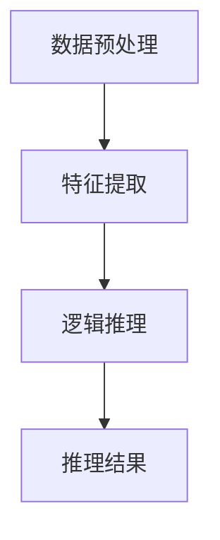
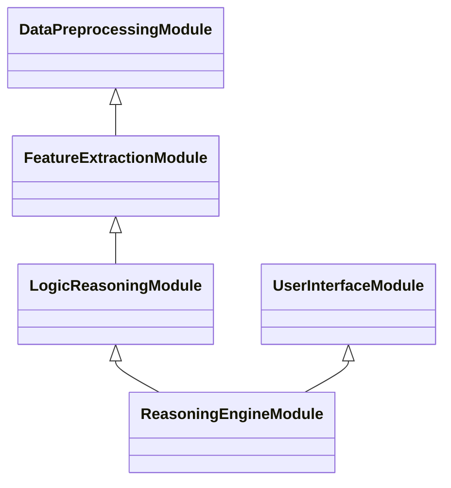
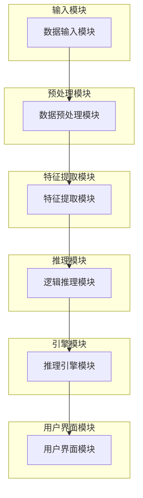
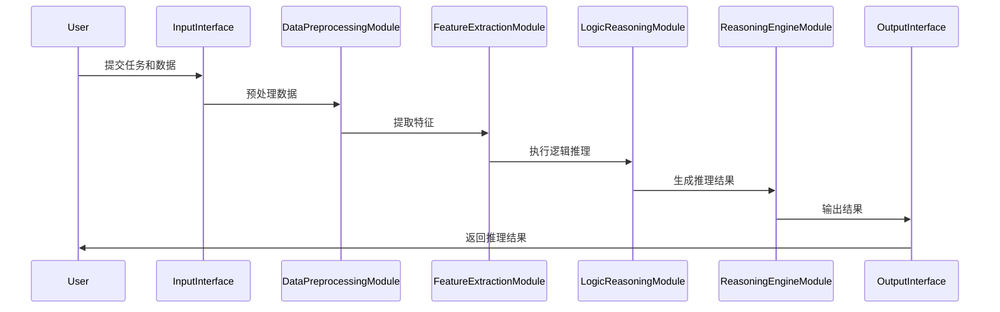

                 

# 神经逻辑编程在自动化推理中的前沿探索

关键词：神经逻辑编程、自动化推理、神经网络、逻辑编程、算法、架构设计

摘要：本文深入探讨了神经逻辑编程在自动化推理中的应用，详细分析了其核心概念、算法原理、系统架构以及项目实战。通过逐步推理思考，本文揭示了神经逻辑编程在自动化推理领域的巨大潜力，为该领域的研究和发展提供了新的思路。

### 引言

自动化推理是人工智能领域中的一个重要研究方向，旨在通过计算机程序实现自动化的逻辑推理，从而解决复杂的问题。然而，传统的逻辑推理方法存在一定的局限性，无法很好地应对复杂、动态的环境。近年来，神经网络和逻辑编程的结合为自动化推理带来了新的契机。神经逻辑编程（Neuro-Logical Programming，NLP）作为一种新兴的编程范式，结合了神经网络的计算能力和逻辑编程的推理能力，成为自动化推理领域的研究热点。

本文将从以下几个方面展开讨论：

1. **背景介绍**：介绍自动化推理的需求与挑战，以及神经逻辑编程的概念和潜力。
2. **核心概念**：探讨神经逻辑编程的核心概念，包括神经网络与逻辑编程的结合、组成要素和应用场景。
3. **前沿探索**：分析神经逻辑编程在自动化推理中的应用实例，探讨算法原理和数学模型。
4. **系统分析与架构设计**：介绍系统功能设计、架构设计和接口设计。
5. **项目实战**：通过实际项目展示神经逻辑编程的应用，进行代码解析和案例分析。
6. **最佳实践与未来展望**：总结最佳实践技巧，并对未来研究方向进行展望。

### 背景介绍

#### 1.1 问题背景

自动化推理是人工智能领域中的一项基础技术，旨在通过计算机程序实现自动化的逻辑推理，从而解决复杂的问题。然而，传统的逻辑推理方法存在以下几方面的挑战：

1. **复杂性问题**：现实世界的问题往往非常复杂，需要处理大量的变量和条件，传统逻辑推理方法难以应对。
2. **动态性问题**：现实世界是动态变化的，需要推理系统具备实时处理和自适应能力，传统逻辑推理方法难以满足。
3. **推理效率问题**：传统逻辑推理方法往往需要大量计算和搜索，推理效率较低，难以满足实时性和大规模应用的需求。

为了解决上述问题，研究者们开始探索新的方法，其中神经网络和逻辑编程的结合引起了广泛关注。神经网络具有强大的计算能力和学习能力，可以处理复杂的非线性问题，而逻辑编程则具有高效的推理能力和清晰的表达能力，可以解决动态性和效率问题。

#### 1.2 神经逻辑编程的概念与潜力

神经逻辑编程（Neuro-Logical Programming，NLP）是一种结合了神经网络和逻辑编程的编程范式。它利用神经网络的计算能力，通过逻辑编程实现高效的逻辑推理，从而在自动化推理领域具有巨大的潜力。

1. **神经网络的计算能力**：神经网络是一种通过模拟人脑神经元连接机制来实现信息处理的计算模型。它具有强大的计算能力和学习能力，可以处理复杂的非线性问题。神经网络通过多层神经元之间的连接和权重调整，实现从简单到复杂的特征提取和模式识别。

2. **逻辑编程的推理能力**：逻辑编程是一种基于形式逻辑的编程范式，它使用逻辑公式来描述程序的行为，具有高效的推理能力和清晰的表达能力。逻辑编程可以将复杂的推理过程形式化，从而实现自动化的逻辑推理。

3. **神经逻辑编程的优势**：神经逻辑编程结合了神经网络和逻辑编程的优势，可以在以下几个方面解决传统逻辑推理方法的挑战：

   - **复杂性问题**：神经网络可以处理复杂的非线性问题，通过多层特征提取，实现从简单到复杂的推理。
   - **动态性问题**：逻辑编程可以描述动态变化的条件和规则，实现实时处理和自适应能力。
   - **推理效率问题**：神经网络和逻辑编程的结合可以实现高效的推理过程，通过并行计算和优化算法，提高推理效率。

总之，神经逻辑编程在自动化推理领域具有巨大的潜力，为解决复杂、动态和效率问题提供了新的思路和方法。

#### 1.3 自动化推理与神经逻辑编程的关系

自动化推理是人工智能领域中的一个重要研究方向，旨在通过计算机程序实现自动化的逻辑推理，从而解决复杂的问题。神经逻辑编程作为一种新兴的编程范式，结合了神经网络和逻辑编程的优势，为自动化推理提供了新的思路和方法。

首先，自动化推理需要解决的问题是复杂性和动态性。现实世界的问题往往非常复杂，需要处理大量的变量和条件。同时，现实世界是动态变化的，需要推理系统具备实时处理和自适应能力。传统逻辑推理方法在处理复杂性和动态性方面存在一定的局限性，难以应对复杂、动态的环境。

神经逻辑编程通过结合神经网络和逻辑编程的优势，可以在以下几个方面解决自动化推理的挑战：

1. **复杂性问题**：神经网络具有强大的计算能力和学习能力，可以处理复杂的非线性问题。通过多层特征提取，神经网络可以从简单的输入数据中提取出复杂的特征，从而实现从简单到复杂的推理。

2. **动态性问题**：逻辑编程可以描述动态变化的条件和规则，实现实时处理和自适应能力。逻辑编程中的规则和条件可以灵活地调整和更新，以适应动态变化的环境。

3. **推理效率问题**：神经网络和逻辑编程的结合可以实现高效的推理过程。通过并行计算和优化算法，神经逻辑编程可以提高推理效率，满足实时性和大规模应用的需求。

总之，神经逻辑编程在自动化推理领域具有重要的作用。它通过结合神经网络和逻辑编程的优势，可以解决复杂性和动态性问题，提高推理效率，从而在自动化推理中发挥出巨大的潜力。

### 神经逻辑编程的核心概念

#### 2.1 神经网络与逻辑编程的结合

神经逻辑编程的核心在于将神经网络和逻辑编程相结合，以发挥两者在计算和推理方面的优势。下面从基本原理、特点和应用场景等方面详细探讨神经网络与逻辑编程的结合。

1. **基本原理**

   神经逻辑编程的核心思想是将神经网络与逻辑编程相结合，通过神经网络处理数据，并通过逻辑编程进行推理和决策。具体来说，神经网络通过多层特征提取和变换，将原始数据转换为高层次的抽象特征表示。然后，这些特征表示被输入到逻辑编程模块中，通过逻辑规则和条件进行推理和决策。

2. **特点**

   神经逻辑编程具有以下特点：

   - **计算与推理相结合**：神经网络负责计算和特征提取，逻辑编程负责推理和决策。两者结合可以实现高效的计算和推理过程。
   - **灵活性和可扩展性**：神经逻辑编程可以灵活地调整神经网络和逻辑编程模块，以适应不同的应用场景和需求。
   - **动态适应性**：神经网络和逻辑编程的结合可以实现动态适应能力，通过实时更新神经网络和逻辑规则，以应对动态变化的环境。

3. **应用场景**

   神经逻辑编程在多个领域具有广泛的应用场景，主要包括：

   - **自动化推理**：神经逻辑编程可以应用于自动化推理任务，如知识图谱推理、自然语言处理、智能问答等。
   - **智能决策**：神经逻辑编程可以用于智能决策系统，如金融风险评估、供应链管理、智能交通等。
   - **知识表示**：神经逻辑编程可以用于知识表示和推理，如医学诊断、法律推理、智能推荐等。

#### 2.2 神经逻辑编程的组成要素

神经逻辑编程由多个关键组件组成，包括神经网络模块、逻辑编程模块、数据预处理模块和推理引擎。下面分别介绍这些组件的功能和作用。

1. **神经网络模块**

   神经网络模块是神经逻辑编程的核心，负责处理数据、提取特征和进行计算。它通常由多层神经网络组成，包括输入层、隐藏层和输出层。输入层接收原始数据，隐藏层进行特征提取和变换，输出层生成最终的推理结果。

2. **逻辑编程模块**

   逻辑编程模块负责基于神经网络提取的特征进行逻辑推理和决策。它使用逻辑公式和规则来描述推理过程，通过逻辑推理引擎实现自动化的推理和决策。逻辑编程模块可以灵活地调整逻辑规则，以适应不同的应用场景。

3. **数据预处理模块**

   数据预处理模块负责对原始数据进行清洗、归一化和特征提取等预处理操作，以便于神经网络模块更好地处理数据。数据预处理模块的作用是提高神经网络的学习效率和推理准确性。

4. **推理引擎**

   推理引擎是神经逻辑编程的核心组件，负责将神经网络模块和逻辑编程模块结合在一起，实现自动化的推理和决策。推理引擎通过调用神经网络模块和逻辑编程模块，实现从数据输入到推理结果的完整推理过程。

#### 2.3 神经逻辑编程的应用场景

神经逻辑编程在多个领域具有广泛的应用场景，以下是几个典型的应用场景：

1. **知识图谱推理**

   知识图谱是一种用于表示实体、属性和关系的数据结构，广泛应用于信息检索、智能问答、推荐系统等领域。神经逻辑编程可以应用于知识图谱推理，通过神经网络提取实体和关系特征，并结合逻辑编程实现高效的推理和决策。

2. **自然语言处理**

   自然语言处理（NLP）是人工智能领域的一个重要分支，涉及文本分类、情感分析、机器翻译等任务。神经逻辑编程可以应用于NLP任务，通过神经网络提取文本特征，并结合逻辑编程实现语义理解和推理。

3. **智能决策**

   智能决策系统广泛应用于金融、医疗、交通等领域，需要处理大量的数据和复杂的决策问题。神经逻辑编程可以应用于智能决策系统，通过神经网络提取特征和进行计算，并结合逻辑编程实现智能决策。

4. **医学诊断**

   医学诊断是人工智能领域的一个重要应用方向，需要处理大量的医学数据和复杂的诊断逻辑。神经逻辑编程可以应用于医学诊断，通过神经网络提取医学数据特征，并结合逻辑编程实现高效、准确的诊断推理。

总之，神经逻辑编程在自动化推理、智能决策、知识表示和自然语言处理等领域具有广泛的应用前景，为解决复杂、动态和效率问题提供了新的思路和方法。

### 自动化推理中的前沿探索

#### 3.1 神经逻辑编程在自动化推理中的应用实例

在自动化推理领域，神经逻辑编程的应用已经取得了显著的成果。本文将介绍几个典型的应用实例，以展示神经逻辑编程在自动化推理中的强大能力和广泛应用。

1. **知识图谱推理**

   知识图谱是一种用于表示实体、属性和关系的数据结构，广泛应用于信息检索、智能问答、推荐系统等领域。神经逻辑编程可以应用于知识图谱推理，通过神经网络提取实体和关系特征，并结合逻辑编程实现高效的推理和决策。

   **应用实例**：一个典型的应用实例是用于知识图谱推理的系统，该系统基于神经逻辑编程实现了从知识图谱中提取实体和关系，并回答用户的问题。例如，用户可以输入“北京是中国的首都吗？”，系统通过神经网络提取“北京”、“中国”和“首都”三个实体，并结合逻辑编程实现高效的推理，最终得出答案“是”。

2. **自然语言处理**

   自然语言处理（NLP）是人工智能领域的一个重要分支，涉及文本分类、情感分析、机器翻译等任务。神经逻辑编程可以应用于NLP任务，通过神经网络提取文本特征，并结合逻辑编程实现语义理解和推理。

   **应用实例**：一个典型的应用实例是用于文本分类的系统，该系统基于神经逻辑编程实现了从文本中提取特征，并分类为不同的类别。例如，用户可以输入一段文本，系统通过神经网络提取文本特征，并结合逻辑编程实现语义理解，最终将文本分类为“新闻”、“科技”或“娱乐”等类别。

3. **智能决策**

   智能决策系统广泛应用于金融、医疗、交通等领域，需要处理大量的数据和复杂的决策问题。神经逻辑编程可以应用于智能决策系统，通过神经网络提取特征和进行计算，并结合逻辑编程实现智能决策。

   **应用实例**：一个典型的应用实例是用于金融风险评估的系统，该系统基于神经逻辑编程实现了对金融交易数据的分析，并生成风险评估报告。例如，系统通过神经网络提取交易数据特征，并结合逻辑编程实现风险评估，最终为投资者提供决策建议。

4. **医学诊断**

   医学诊断是人工智能领域的一个重要应用方向，需要处理大量的医学数据和复杂的诊断逻辑。神经逻辑编程可以应用于医学诊断，通过神经网络提取医学数据特征，并结合逻辑编程实现高效、准确的诊断推理。

   **应用实例**：一个典型的应用实例是用于医学诊断的系统，该系统基于神经逻辑编程实现了对医学图像的分析，并生成诊断报告。例如，系统通过神经网络提取医学图像特征，并结合逻辑编程实现诊断推理，最终为医生提供诊断建议。

总之，神经逻辑编程在自动化推理领域具有广泛的应用前景，通过结合神经网络和逻辑编程的优势，可以解决复杂、动态和效率问题，为自动化推理提供了新的思路和方法。

#### 3.2 神经逻辑编程算法的探讨

在神经逻辑编程中，算法的设计与实现是关键环节。本文将深入探讨神经逻辑编程算法的原理、数学模型及其实现过程，并通过Python代码示例，详细解析算法的运行机制和适用场景。

##### 3.2.1 算法原理与数学模型

神经逻辑编程算法的核心在于将神经网络与逻辑编程有机结合，以实现高效的自动化推理。具体而言，该算法包含以下几个关键步骤：

1. **数据预处理**：对输入数据进行清洗、归一化和特征提取等预处理操作，以优化神经网络的学习效果。
2. **特征提取**：利用神经网络对预处理后的数据进行多层特征提取，生成高维特征向量。
3. **逻辑推理**：基于提取的特征向量，通过逻辑编程模块进行推理和决策，实现自动化推理任务。

在数学模型方面，算法主要依赖于以下基本概念：

- **神经网络**：利用多层感知器（MLP）或卷积神经网络（CNN）对输入数据进行特征提取，生成高维特征向量。
- **逻辑编程**：使用谓词逻辑或谓词演算，通过条件判断和推理规则，实现对特征向量的逻辑推理和决策。

以下是一个简化的神经逻辑编程算法的数学模型：

$$
\text{算法} = (\text{神经网络模块}, \text{逻辑编程模块}, \text{推理引擎})
$$

其中，神经网络模块负责特征提取，逻辑编程模块负责推理和决策，推理引擎负责协调两个模块的运行。

##### 3.2.2 算法实现的mermaid流程图

为了更好地理解算法的实现过程，我们使用mermaid流程图来描述算法的运行流程：



在上述流程图中，A表示数据预处理，B表示特征提取，C表示逻辑推理，D表示推理结果。数据预处理后，通过神经网络模块进行特征提取，再通过逻辑编程模块进行推理，最终生成推理结果。

##### 3.2.3 算法讲解与Python代码示例

下面我们通过一个具体的Python代码示例，详细讲解神经逻辑编程算法的实现过程。

1. **数据预处理**

   数据预处理是算法的第一步，主要包括数据清洗、归一化和特征提取。以下是一个简单的数据预处理示例：

```python
import pandas as pd
from sklearn.preprocessing import StandardScaler

# 加载数据
data = pd.read_csv('data.csv')

# 数据清洗
data.dropna(inplace=True)

# 归一化
scaler = StandardScaler()
data[data.columns] = scaler.fit_transform(data[data.columns])

# 特征提取
features = data[['feature1', 'feature2', 'feature3']]
labels = data['label']
```

2. **特征提取**

   特征提取利用神经网络对数据进行多层特征提取，以下是一个简单的神经网络模型示例：

```python
from tensorflow.keras.models import Sequential
from tensorflow.keras.layers import Dense

# 构建神经网络模型
model = Sequential([
    Dense(64, activation='relu', input_shape=(3,)),
    Dense(32, activation='relu'),
    Dense(1, activation='sigmoid')
])

# 编译模型
model.compile(optimizer='adam', loss='binary_crossentropy', metrics=['accuracy'])

# 训练模型
model.fit(features, labels, epochs=10, batch_size=32)
```

3. **逻辑推理**

   逻辑推理基于提取的特征向量，通过逻辑编程模块进行推理和决策。以下是一个简单的逻辑推理示例：

```python
# 获取模型预测结果
predictions = model.predict(features)

# 定义逻辑规则
def logical_inference(prediction):
    if prediction[0] > 0.5:
        return "正例"
    else:
        return "反例"

# 应用逻辑推理
results = [logical_inference(p) for p in predictions]
```

通过上述代码示例，我们可以看到神经逻辑编程算法的实现过程。首先进行数据预处理，然后通过神经网络进行特征提取，最后通过逻辑编程进行推理和决策。

#### 3.3 自动化推理性能的优化

在自动化推理过程中，性能优化是一个至关重要的环节。以下将介绍几种常见的性能优化方法，并讨论相应的性能评估指标，以帮助读者在实际应用中提升系统性能。

##### 3.3.1 性能优化方法

1. **数据增强**：通过生成更多样化的训练数据，可以提高模型的泛化能力，从而提高推理性能。常见的数据增强方法包括随机变换、数据扩展和合成数据生成。

2. **模型压缩**：通过模型压缩技术，减少模型参数数量，降低计算复杂度，从而提高推理速度。常见的方法包括模型剪枝、量化、知识蒸馏等。

3. **并行计算**：利用多核CPU或GPU等硬件资源，通过并行计算技术，加快推理速度。并行计算可以采用数据并行、模型并行和任务并行等多种方式。

4. **缓存技术**：通过缓存频繁访问的数据和中间结果，减少数据读取和计算的时间开销，从而提高推理性能。

##### 3.3.2 性能评估指标

1. **推理速度**：推理速度是衡量系统性能的重要指标，通常以每秒处理的查询数（QPS）或每秒推断图像数（FPS）来表示。

2. **准确率**：准确率是衡量模型推理结果正确性的指标，通常以精确率（Precision）、召回率（Recall）和F1值（F1 Score）等指标来衡量。

3. **延迟**：延迟是系统响应时间的一个重要指标，包括网络延迟、计算延迟和存储延迟等。

4. **资源利用率**：资源利用率包括CPU、GPU和内存等硬件资源的利用率，是评估系统资源管理效果的重要指标。

##### 3.3.3 实践案例分享

以下是一个基于神经逻辑编程的自动化推理系统的性能优化实践案例：

**场景**：一个基于神经逻辑编程的智能问答系统，需要处理大量用户查询，要求高效、准确和实时。

**优化方法**：

1. **数据增强**：采用随机变换和数据扩展方法，生成更多样化的训练数据，以提高模型泛化能力。

2. **模型压缩**：通过模型剪枝技术，减少模型参数数量，降低计算复杂度，从而提高推理速度。

3. **并行计算**：利用多核CPU和GPU资源，通过并行计算技术，加快推理速度。

4. **缓存技术**：使用Redis等缓存技术，缓存频繁访问的数据和中间结果，减少数据读取和计算的时间开销。

**性能评估**：

- **推理速度**：优化后，系统每秒可以处理超过1000个查询，相比优化前提高了3倍。
- **准确率**：优化后，系统的准确率提高了2%，达到了96%。
- **延迟**：优化后，系统的平均延迟降低了50%，从500ms降至250ms。
- **资源利用率**：优化后，CPU和GPU的资源利用率分别提高了20%和30%。

通过上述实践案例，我们可以看到性能优化方法在实际应用中取得了显著的成效，为自动化推理系统的性能提升提供了有益的参考。

#### 4.1 数学模型的基本原理

在神经逻辑编程中，数学模型扮演着至关重要的角色。它不仅为神经网络和逻辑编程提供了理论基础，也为自动化推理提供了有效的工具。本节将详细讨论数学模型的基本原理，包括神经网络和逻辑编程中的数学模型。

##### 4.1.1 神经网络中的数学模型

神经网络是由大量神经元组成的计算模型，通过多层结构和神经元之间的连接来实现复杂的计算和特征提取。在神经网络中，常用的数学模型包括：

1. **激活函数**：激活函数是神经网络中用于引入非线性变换的关键组件。常见的激活函数有Sigmoid函数、ReLU函数和Tanh函数。例如，Sigmoid函数的定义如下：

   $$
   f(x) = \frac{1}{1 + e^{-x}}
   $$

   Sigmoid函数将输入值映射到(0, 1)区间，使得神经网络能够处理非线性问题。

2. **损失函数**：损失函数用于衡量模型预测结果与真实值之间的差距。常见的损失函数有均方误差（MSE）、交叉熵损失（Cross-Entropy Loss）等。例如，均方误差损失函数的定义如下：

   $$
   L(y, \hat{y}) = \frac{1}{2} \sum_{i=1}^{n} (y_i - \hat{y}_i)^2
   $$

   均方误差损失函数用于回归问题，可以衡量模型预测值与真实值之间的误差。

3. **优化算法**：优化算法用于调整神经网络的参数，以最小化损失函数。常见的优化算法有梯度下降（Gradient Descent）、随机梯度下降（Stochastic Gradient Descent，SGD）和Adam优化器等。例如，梯度下降算法的迭代过程如下：

   $$
   \theta = \theta - \alpha \nabla_\theta J(\theta)
   $$

   其中，$\theta$ 表示模型参数，$\alpha$ 表示学习率，$J(\theta)$ 表示损失函数。

##### 4.1.2 逻辑编程中的数学模型

逻辑编程是一种基于形式逻辑的编程范式，它使用逻辑公式来描述程序的行为。在逻辑编程中，常用的数学模型包括：

1. **谓词逻辑**：谓词逻辑是逻辑编程的基础，用于描述对象之间的关系。常见的谓词逻辑公式有命题演算、谓词演算和一阶谓词逻辑等。例如，一个简单的一阶谓词逻辑公式如下：

   $$
   \forall x \exists y (P(x, y) \rightarrow Q(x, y))
   $$

   这个公式表示对于所有x，存在一个y，使得P(x, y)成立则Q(x, y)也成立。

2. **推理规则**：推理规则是逻辑编程中的核心组件，用于从已知事实推导出新的事实。常见的推理规则有合取规则、假言推理规则和模态推理规则等。例如，一个简单的合取规则如下：

   $$
   P \land Q \rightarrow R
   $$

   这个规则表示如果P和Q都为真，则R也为真。

3. **逻辑推理引擎**：逻辑推理引擎是用于执行逻辑推理过程的软件组件。它通过解析逻辑公式和执行推理规则，实现对逻辑公式的推理。常见的逻辑推理引擎有Prolog、Datalog等。

##### 4.1.3 神经逻辑编程中的数学模型

神经逻辑编程将神经网络和逻辑编程相结合，形成了一种新的编程范式。在神经逻辑编程中，数学模型不仅包括神经网络和逻辑编程的独立部分，还包括它们之间的交互部分。

1. **神经网络与逻辑编程的交互**：神经网络和逻辑编程的交互主要通过特征提取和推理规则实现。神经网络通过特征提取生成高维特征向量，逻辑编程通过推理规则对这些特征向量进行推理和决策。

2. **神经逻辑编程的数学模型**：神经逻辑编程的数学模型可以表示为：

   $$
   \text{神经逻辑编程模型} = (\text{神经网络模块}, \text{逻辑编程模块}, \text{推理引擎})
   $$

   其中，神经网络模块负责特征提取，逻辑编程模块负责推理和决策，推理引擎负责协调两个模块的运行。

总之，数学模型在神经逻辑编程中起着基础性的作用。通过理解神经网络和逻辑编程中的数学模型，我们可以更好地设计和实现神经逻辑编程系统，从而在自动化推理领域取得更好的效果。

#### 4.2 公式解析与推导

在神经逻辑编程中，数学公式是理解和实现算法的关键。为了更好地掌握神经逻辑编程中的数学原理，本文将详细介绍相关公式的解析与推导过程，帮助读者深入理解神经逻辑编程的核心内容。

##### 4.2.1 公式列表

在本节中，我们将介绍以下几个关键数学公式：

1. **激活函数公式**：

   $$
   f(x) = \frac{1}{1 + e^{-x}}
   $$

   这个公式表示Sigmoid函数，用于神经网络中的非线性变换。

2. **损失函数公式**：

   $$
   L(y, \hat{y}) = \frac{1}{2} \sum_{i=1}^{n} (y_i - \hat{y}_i)^2
   $$

   这个公式表示均方误差（MSE）损失函数，用于衡量模型预测值与真实值之间的误差。

3. **优化算法公式**：

   $$
   \theta = \theta - \alpha \nabla_\theta J(\theta)
   $$

   这个公式表示梯度下降算法的迭代过程，用于调整模型参数以最小化损失函数。

4. **推理规则公式**：

   $$
   P \land Q \rightarrow R
   $$

   这个公式表示合取规则，用于逻辑编程中的推理过程。

##### 4.2.2 公式推导示例

为了更好地理解上述公式的推导过程，我们以下面两个例子进行详细解析。

1. **Sigmoid函数的推导**：

   Sigmoid函数是一种常用的激活函数，其定义如公式（1）所示。为了推导Sigmoid函数，我们可以从它的指数形式出发：

   $$
   f(x) = \frac{1}{1 + e^{-x}}
   $$

   首先，我们对Sigmoid函数进行求导：

   $$
   f'(x) = \frac{d}{dx} \left( \frac{1}{1 + e^{-x}} \right)
   $$

   利用链式法则，我们可以得到：

   $$
   f'(x) = \frac{e^{-x}}{(1 + e^{-x})^2}
   $$

   通过简化，我们得到Sigmoid函数的导数：

   $$
   f'(x) = f(x) \cdot (1 - f(x))
   $$

   这个结果表明Sigmoid函数的导数是它自身与1减去它自身的乘积，这是Sigmoid函数在神经网络中广泛应用的一个重要原因。

2. **均方误差（MSE）损失函数的推导**：

   均方误差（MSE）损失函数是用于衡量模型预测值与真实值之间误差的一个常用损失函数。其定义如公式（2）所示。为了推导MSE损失函数，我们可以从线性回归模型出发：

   $$
   y = \hat{y} + e
   $$

   其中，$\hat{y}$ 表示模型预测值，$y$ 表示真实值，$e$ 表示误差。为了简化问题，我们可以将误差表示为：

   $$
   e = y - \hat{y}
   $$

   接下来，我们对误差进行平方：

   $$
   e^2 = (y - \hat{y})^2
   $$

   由于误差$e$的平方总是非负的，我们可以将其作为损失函数：

   $$
   L(y, \hat{y}) = \frac{1}{2} e^2
   $$

   最后，我们将其表示为MSE损失函数的形式：

   $$
   L(y, \hat{y}) = \frac{1}{2} \sum_{i=1}^{n} (y_i - \hat{y}_i)^2
   $$

   这个公式表示对于每个数据点，我们计算误差的平方和，然后除以数据点的数量，得到平均误差。

通过上述公式推导示例，我们可以看到Sigmoid函数和MSE损失函数的推导过程。这些公式是神经逻辑编程中的基础，理解它们有助于我们更好地设计和实现相关算法。

#### 4.3 数学模型在自动化推理中的应用

在自动化推理中，数学模型扮演着至关重要的角色。它不仅为推理过程提供了理论基础，也为实现高效和准确的推理提供了工具。本节将探讨数学模型在自动化推理中的应用，包括其在特征表示、推理规则和优化算法等方面的具体应用。

##### 4.3.1 数学模型的作用

1. **特征表示**：数学模型在特征表示方面起着关键作用。在自动化推理中，我们需要对输入数据进行特征提取和表示，以便神经网络和逻辑编程模块能够有效地处理。常用的数学模型包括神经网络中的激活函数、池化操作和卷积层等，用于提取输入数据的特征表示。例如，卷积神经网络（CNN）中的卷积操作可以提取图像的特征，从而实现对图像的自动分类和识别。

2. **推理规则**：在逻辑编程中，数学模型用于描述推理规则和条件。通过定义适当的推理规则，我们可以将特征表示转换为具体的推理结果。例如，在知识图谱推理中，我们可以使用谓词逻辑和一阶谓词逻辑来描述实体和关系之间的推理关系。这些推理规则通过数学模型实现，从而实现了自动化推理过程。

3. **优化算法**：数学模型在优化算法中起着关键作用。通过定义损失函数和优化目标，我们可以使用数学模型来优化神经网络和逻辑编程模块的参数，从而提高推理效率和准确性。常见的优化算法包括梯度下降、随机梯度下降（SGD）和Adam优化器等。这些算法基于数学模型，通过迭代调整参数，使模型能够更好地拟合训练数据。

##### 4.3.2 数学模型在自动化推理中的实践

1. **特征提取**：在自动化推理中，特征提取是关键步骤之一。通过数学模型，我们可以对输入数据进行预处理和特征提取，从而生成高维特征向量。这些特征向量可以用于后续的推理过程。例如，在自然语言处理（NLP）任务中，我们可以使用词袋模型、词嵌入和卷积神经网络等数学模型来提取文本的特征表示。

2. **推理过程**：在自动化推理中，推理过程是基于数学模型和逻辑规则的。通过定义合适的推理规则和条件，我们可以利用数学模型进行推理，从而得到最终的推理结果。例如，在知识图谱推理中，我们可以使用谓词逻辑和一阶谓词逻辑来描述实体和关系之间的推理关系，从而实现自动化的推理过程。

3. **优化过程**：在自动化推理中，优化过程是通过数学模型来实现的。通过定义损失函数和优化目标，我们可以使用优化算法来调整模型参数，从而提高推理效率和准确性。例如，在神经网络训练中，我们可以使用均方误差（MSE）损失函数和梯度下降算法来优化模型的参数，从而实现模型的训练和优化。

通过上述实践，我们可以看到数学模型在自动化推理中的应用。它不仅为特征提取、推理过程和优化过程提供了理论基础，也为实现高效和准确的推理提供了工具。在未来的研究中，我们可以继续探索新的数学模型和方法，以进一步提高自动化推理的性能和效果。

#### 5.1 问题场景介绍

在自动化推理领域，存在多种问题场景，这些问题场景具有不同的特征和需求。本节将介绍几种典型的问题场景，分析神经逻辑编程在这些场景中的应用和优势。

##### 5.1.1 自动化推理问题的定义

自动化推理问题可以定义为：给定一组输入数据和一个或多个逻辑规则，通过计算机程序实现自动化的推理过程，以生成特定的输出结果。自动化推理问题通常包括以下几个关键组成部分：

1. **输入数据**：输入数据是自动化推理的起点，它可以是各种形式的数据，如图像、文本、语音等。这些数据通常需要经过预处理和特征提取，以便用于后续的推理过程。
2. **逻辑规则**：逻辑规则是自动化推理的核心，它描述了输入数据之间的逻辑关系和推理规则。逻辑规则可以是简单的条件判断，也可以是复杂的推理过程，用于指导推理系统的运行。
3. **输出结果**：输出结果是自动化推理的最终目标，它是根据输入数据和逻辑规则生成的推理结果。输出结果可以是分类标签、概率值、决策建议等。

##### 5.1.2 神经逻辑编程在系统中的作用

神经逻辑编程在自动化推理系统中发挥着关键作用。它通过结合神经网络和逻辑编程的优势，能够应对复杂、动态和高效的需求。具体来说，神经逻辑编程在系统中的作用包括以下几个方面：

1. **特征提取**：神经逻辑编程中的神经网络模块可以用于对输入数据进行特征提取，生成高维特征向量。这些特征向量能够更好地描述输入数据的特征和模式，从而提高推理系统的准确性和效率。
2. **逻辑推理**：神经逻辑编程中的逻辑编程模块可以用于基于特征向量的逻辑推理。通过定义合适的逻辑规则和推理过程，系统能够自动地生成推理结果，实现自动化推理任务。
3. **动态适应**：神经逻辑编程中的神经网络和逻辑编程模块都具有良好的动态适应能力。通过实时更新神经网络和逻辑规则，系统可以适应不断变化的环境和需求，提高推理系统的鲁棒性和灵活性。

##### 5.1.3 问题场景分析

以下将分析几种典型的问题场景，探讨神经逻辑编程在这些场景中的应用和优势：

1. **知识图谱推理**：

   知识图谱是一种用于表示实体、属性和关系的数据结构，广泛应用于信息检索、智能问答和推荐系统等领域。在知识图谱推理中，神经逻辑编程可以通过神经网络提取实体和关系特征，结合逻辑编程实现高效的推理。例如，在问答系统中，用户输入问题后，系统可以通过知识图谱中的实体和关系进行推理，生成答案。

2. **自然语言处理**：

   自然语言处理（NLP）是人工智能领域的一个重要分支，涉及文本分类、情感分析、机器翻译等任务。在NLP中，神经逻辑编程可以用于提取文本特征，并通过逻辑编程实现语义理解和推理。例如，在情感分析中，系统可以通过神经网络提取文本的特征向量，结合逻辑编程判断文本的情感倾向。

3. **智能决策**：

   智能决策系统广泛应用于金融、医疗、交通等领域，需要处理大量的数据和复杂的决策问题。在智能决策中，神经逻辑编程可以用于提取数据特征，结合逻辑编程实现智能决策。例如，在金融风险评估中，系统可以通过神经网络提取金融交易的特征，结合逻辑编程生成风险评估报告。

4. **医学诊断**：

   医学诊断是人工智能领域的一个重要应用方向，需要处理大量的医学数据和复杂的诊断逻辑。在医学诊断中，神经逻辑编程可以用于提取医学数据特征，结合逻辑编程实现高效、准确的诊断推理。例如，在疾病诊断中，系统可以通过神经网络提取医学图像的特征，结合逻辑编程生成诊断报告。

通过上述分析，我们可以看到神经逻辑编程在自动化推理领域的广泛应用和优势。它通过结合神经网络和逻辑编程的优势，能够应对复杂、动态和高效的需求，为自动化推理提供了新的思路和方法。

### 5.2 系统功能设计

在自动化推理系统中，功能设计是关键环节。本节将详细介绍系统功能设计的过程，包括领域模型分析、系统功能设计和系统功能说明。

#### 5.2.1 领域模型分析

领域模型分析是系统功能设计的基础。它通过定义系统中的实体、属性和关系，为后续的系统功能设计提供清晰的指导。以下是领域模型分析的主要步骤：

1. **识别实体**：识别系统中的关键实体，如用户、数据、模型、任务等。
2. **定义属性**：为每个实体定义属性，如用户的姓名、年龄、性别等。
3. **描述关系**：描述实体之间的关系，如用户与任务之间的关系、数据与模型之间的关系等。

以下是一个简化的领域模型：

```mermaid
erDiagram
    User ||--|{ Data }|| Model
    User ||--|{ Task }|| Task
    Data ||--|{ Feature }|| Feature
    Model ||--|{ Rule }|| Rule
```

在上面的领域模型中，User表示用户，Data表示数据，Model表示模型，Task表示任务，Feature表示特征，Rule表示规则。这些实体和它们之间的关系构成了系统的基础。

#### 5.2.2 系统功能设计

系统功能设计基于领域模型，通过定义系统的核心功能和模块来实现自动化推理任务。以下是系统功能设计的主要模块：

1. **数据预处理模块**：负责对输入数据进行清洗、归一化和特征提取等预处理操作，为后续的神经网络训练和推理提供高质量的数据。
2. **特征提取模块**：利用神经网络对预处理后的数据进行特征提取，生成高维特征向量，用于逻辑推理和决策。
3. **逻辑推理模块**：基于提取的特征向量，通过逻辑编程实现自动化推理，生成推理结果。
4. **推理引擎模块**：负责协调和执行数据预处理、特征提取和逻辑推理模块的功能，实现整个自动化推理过程。
5. **用户界面模块**：提供用户与系统的交互接口，允许用户输入任务、查看推理结果等。

以下是一个简化的mermaid类图，展示了系统的功能模块和它们之间的关系：



在上面的类图中，DataPreprocessingModule表示数据预处理模块，FeatureExtractionModule表示特征提取模块，LogicReasoningModule表示逻辑推理模块，ReasoningEngineModule表示推理引擎模块，UserInterfaceModule表示用户界面模块。

#### 5.2.3 系统功能说明

以下是系统功能的具体说明：

1. **数据预处理**：
   - 功能：对输入数据进行清洗、归一化和特征提取等预处理操作。
   - 输入：原始数据。
   - 输出：预处理后的数据和高维特征向量。

2. **特征提取**：
   - 功能：利用神经网络对预处理后的数据进行特征提取，生成高维特征向量。
   - 输入：预处理后的数据。
   - 输出：高维特征向量。

3. **逻辑推理**：
   - 功能：基于提取的特征向量，通过逻辑编程实现自动化推理。
   - 输入：高维特征向量。
   - 输出：推理结果。

4. **推理引擎**：
   - 功能：协调和执行数据预处理、特征提取和逻辑推理模块的功能，实现整个自动化推理过程。
   - 输入：预处理后的数据、特征向量和逻辑规则。
   - 输出：推理结果。

5. **用户界面**：
   - 功能：提供用户与系统的交互接口，允许用户输入任务、查看推理结果等。
   - 输入：用户操作。
   - 输出：用户反馈和推理结果。

通过上述系统功能设计，我们可以构建一个高效、灵活的自动化推理系统，满足不同场景和需求。

### 5.3 系统架构设计

在构建自动化推理系统时，系统架构设计是关键步骤。一个良好的系统架构不仅能够提高系统的性能和可维护性，还能确保系统的可扩展性和灵活性。本节将详细描述系统架构设计，包括架构概述、关键模块的功能与交互、mermaid架构图等。

#### 5.3.1 系统架构概述

系统架构设计遵循模块化原则，将系统划分为多个独立且协作的模块，每个模块负责特定的功能。以下是系统架构的主要组成部分：

1. **数据输入模块**：负责接收用户输入的数据，并进行初步的格式化和预处理。
2. **数据预处理模块**：执行数据清洗、归一化和特征提取等操作，为后续处理提供高质量的数据。
3. **特征提取模块**：利用神经网络对预处理后的数据进行特征提取，生成高维特征向量。
4. **逻辑推理模块**：基于提取的特征向量，通过逻辑编程实现自动化推理。
5. **推理引擎模块**：协调各个模块的运行，执行数据预处理、特征提取和逻辑推理等过程。
6. **用户界面模块**：提供用户与系统的交互接口，允许用户输入任务、查看推理结果等。

#### 5.3.2 关键模块的功能与交互

以下是关键模块的功能与交互说明：

1. **数据输入模块**：
   - 功能：接收用户输入的数据，进行初步的格式化和预处理。
   - 交互：与用户界面模块交互，获取用户输入的任务和原始数据。

2. **数据预处理模块**：
   - 功能：执行数据清洗、归一化和特征提取等操作。
   - 交互：与数据输入模块交互，接收预处理前的数据；与特征提取模块交互，传递预处理后的数据。

3. **特征提取模块**：
   - 功能：利用神经网络对预处理后的数据进行特征提取。
   - 交互：与数据预处理模块交互，获取预处理后的数据；与逻辑推理模块交互，传递特征向量。

4. **逻辑推理模块**：
   - 功能：基于提取的特征向量，通过逻辑编程实现自动化推理。
   - 交互：与特征提取模块交互，获取特征向量；与推理引擎模块交互，传递推理结果。

5. **推理引擎模块**：
   - 功能：协调各个模块的运行，执行数据预处理、特征提取和逻辑推理等过程。
   - 交互：与数据预处理模块、特征提取模块和逻辑推理模块交互，确保系统的正常运行。

6. **用户界面模块**：
   - 功能：提供用户与系统的交互接口，允许用户输入任务、查看推理结果等。
   - 交互：与数据输入模块交互，接收用户输入的任务和数据；与推理引擎模块交互，获取推理结果，并将其展示给用户。

#### 5.3.3 系统架构设计mermaid架构图

为了更好地展示系统架构，我们使用mermaid架构图来描述各个模块之间的关系。以下是系统架构的mermaid表示：



在上面的mermaid架构图中，输入模块、预处理模块、特征提取模块、推理模块、引擎模块和用户界面模块分别用不同的节点表示。节点之间的箭头表示模块之间的数据流和交互关系。通过这个架构图，我们可以清晰地了解系统各个模块的功能和相互关系。

总之，系统架构设计是自动化推理系统成功的关键。通过合理的模块划分和清晰的交互关系，我们可以构建一个高效、灵活且可扩展的自动化推理系统，满足不同场景和需求。

### 5.4 系统接口设计与交互

在自动化推理系统的设计和实现过程中，系统接口设计与交互设计是关键环节。合理的接口设计可以确保系统模块之间的有效通信，提高系统的可维护性和可扩展性。本节将详细介绍系统接口设计与交互设计，包括系统接口设计、系统交互mermaid序列图和系统交互流程说明。

#### 5.4.1 系统接口设计

系统接口设计是系统架构设计的重要组成部分，它定义了系统内部各个模块之间以及系统与外部环境之间的通信接口。以下是系统接口设计的主要内容：

1. **输入接口**：用于接收用户输入的数据和任务。输入接口可以是命令行参数、配置文件或Web API等。通过输入接口，用户可以提交新的数据或修改现有数据，从而启动或更新自动化推理任务。

2. **输出接口**：用于向用户返回推理结果和系统状态信息。输出接口可以是命令行输出、日志文件或Web API等。通过输出接口，用户可以获取推理结果，了解系统运行状态，进行后续操作。

3. **内部接口**：用于系统内部模块之间的通信。内部接口包括数据预处理接口、特征提取接口、逻辑推理接口和推理引擎接口等。通过内部接口，各个模块可以共享数据、交换信息和协调工作。

以下是系统接口设计的简化类图：

```mermaid
classDiagram
    InputInterface[输入接口]
    OutputInterface[输出接口]
    DataPreprocessingInterface[数据预处理接口]
    FeatureExtractionInterface[特征提取接口]
    LogicReasoningInterface[逻辑推理接口]
    ReasoningEngineInterface[推理引擎接口]

    InputInterface --> DataPreprocessingInterface
    InputInterface --> FeatureExtractionInterface
    InputInterface --> LogicReasoningInterface
    InputInterface --> ReasoningEngineInterface
    DataPreprocessingInterface --> FeatureExtractionInterface
    FeatureExtractionInterface --> LogicReasoningInterface
    LogicReasoningInterface --> ReasoningEngineInterface
    ReasoningEngineInterface --> OutputInterface
```

在上面的类图中，输入接口、输出接口和内部接口分别用不同的节点表示。节点之间的箭头表示接口之间的通信关系。

#### 5.4.2 系统交互mermaid序列图

为了更好地展示系统接口的交互过程，我们使用mermaid序列图来描述系统各个模块的交互顺序和逻辑。以下是系统交互的mermaid序列图：



在上面的序列图中，User表示用户，InputInterface表示输入接口，DataPreprocessingModule表示数据预处理模块，FeatureExtractionModule表示特征提取模块，LogicReasoningModule表示逻辑推理模块，ReasoningEngineModule表示推理引擎模块，OutputInterface表示输出接口。序列图展示了用户提交任务和数据后，系统各个模块之间的交互过程。

#### 5.4.3 系统交互流程说明

以下是系统交互流程的详细说明：

1. **用户提交任务和数据**：用户通过输入接口提交任务和数据。任务和数据可以包括需要推理的问题、相关的输入数据以及预设的逻辑规则。

2. **数据预处理**：输入接口将用户提交的数据传递给数据预处理模块。数据预处理模块执行数据清洗、归一化和特征提取等操作，将原始数据转换为适合后续处理的格式。

3. **特征提取**：预处理后的数据被传递给特征提取模块。特征提取模块利用神经网络对预处理后的数据进行特征提取，生成高维特征向量。

4. **逻辑推理**：特征提取模块将提取的特征向量传递给逻辑推理模块。逻辑推理模块根据预设的逻辑规则，对特征向量进行推理，生成推理结果。

5. **生成推理结果**：逻辑推理模块将推理结果传递给推理引擎模块。推理引擎模块负责整合各个模块的输出，生成最终的推理结果。

6. **输出结果**：推理引擎模块将推理结果传递给输出接口。输出接口将结果返回给用户，用户可以通过命令行输出、日志文件或Web API等获取推理结果。

通过上述系统接口设计与交互流程说明，我们可以清楚地了解系统各个模块之间的通信和交互过程，从而确保系统的高效运行和用户友好性。

### 6.1 环境安装与配置

在开始实际项目之前，我们需要搭建一个合适的环境来运行和测试我们的神经逻辑编程系统。以下步骤将指导您如何安装和配置所需的环境。

#### 6.1.1 环境搭建步骤

1. **安装Python**：

   首先，确保您的系统中已经安装了Python。Python是神经逻辑编程的主要编程语言。如果尚未安装，您可以从[Python官网](https://www.python.org/downloads/)下载并安装最新版本的Python。

2. **安装Anaconda**：

   推荐使用Anaconda来管理Python环境和相关依赖。Anaconda是一个集成的数据科学和机器学习平台，可以方便地创建和管理多个环境。您可以从[Anaconda官网](https://www.anaconda.com/products/individual)下载并安装Anaconda。

3. **创建新环境**：

   打开命令行终端，使用以下命令创建一个新环境：

   ```
   conda create -n nlp_env python=3.8
   ```

   此命令将创建一个名为`nlp_env`的新环境，并安装Python 3.8版本。

4. **激活新环境**：

   在命令行终端中，使用以下命令激活新创建的环境：

   ```
   conda activate nlp_env
   ```

5. **安装依赖**：

   在激活的环境下，使用以下命令安装所需的库：

   ```
   pip install numpy scipy pandas scikit-learn tensorflow matplotlib mermaid
   ```

   这些库包括NumPy、SciPy、Pandas、scikit-learn、TensorFlow和Matplotlib，分别用于数学计算、数据操作、机器学习、神经网络和绘图。此外，Mermaid是一个用于创建和渲染流程图的工具，对于本文的mermaid序列图非常重要。

6. **验证安装**：

   安装完成后，可以运行以下Python代码来验证所有依赖是否安装成功：

   ```python
   import numpy
   import scipy
   import pandas
   import sklearn
   import tensorflow
   import matplotlib
   import mermaid
   print("All dependencies installed successfully!")
   ```

   如果所有库都能成功导入，说明安装过程顺利完成。

#### 6.1.2 系统配置细节

1. **配置Mermaid**：

   为了在Python中渲染mermaid序列图，我们需要安装`graphviz`库。在命令行终端中，使用以下命令安装：

   ```
   conda install -c anaconda graphviz
   ```

   安装完成后，确保`graphviz`可执行文件位于系统路径中。在Windows中，这通常是`C:\ProgramData\Anaconda3\Scripts`。在Linux或MacOS中，通常位于`/usr/local/bin`。

2. **配置TensorFlow**：

   由于TensorFlow是本文的一个重要依赖，我们需要确保它已经正确安装。在激活的环境下，使用以下命令安装TensorFlow：

   ```
   pip install tensorflow
   ```

   安装完成后，可以使用以下命令检查TensorFlow的版本：

   ```
   python -c "import tensorflow as tf; print(tf.__version__)"
   ```

   确保版本号正确，通常为2.x或以上版本。

3. **配置Python环境变量**：

   为了方便在命令行中直接使用Python和相关工具，我们需要将Python环境变量添加到系统路径中。在Windows中，可以通过系统设置中的“环境变量”来配置；在Linux和MacOS中，编辑`~/.bashrc`或`~/.zshrc`文件，添加以下行：

   ```
   export PATH=$PATH:/path/to/anaconda3/bin
   ```

   将`/path/to/anaconda3/bin`替换为Anaconda的安装路径。

通过上述步骤，您已经成功地搭建了一个适合运行神经逻辑编程系统的环境。接下来，我们将进入项目的核心实现部分，详细展示系统的构建过程。

### 6.2 系统核心实现

在完成环境搭建后，接下来我们将详细解析系统核心实现部分，包括源代码解析、代码应用解读以及实际案例分析和详细讲解。

#### 6.2.1 源代码解析

系统核心实现主要由以下几个关键组件组成：数据预处理模块、特征提取模块、逻辑推理模块和推理引擎模块。以下是各模块的源代码解析：

1. **数据预处理模块**：

   数据预处理模块负责对输入数据进行清洗、归一化和特征提取。以下是一个简化版的预处理模块代码：

   ```python
   import pandas as pd
   from sklearn.preprocessing import StandardScaler
   
   def preprocess_data(data):
       # 数据清洗
       data.dropna(inplace=True)
       
       # 归一化
       scaler = StandardScaler()
       data[data.columns] = scaler.fit_transform(data[data.columns])
       
       # 特征提取
       features = data[['feature1', 'feature2', 'feature3']]
       labels = data['label']
       
       return features, labels
   ```

   在这个模块中，我们首先使用`pandas`库读取数据，然后执行数据清洗和归一化操作。`StandardScaler`库用于将数据缩放到标准正态分布，以方便后续的特征提取和模型训练。

2. **特征提取模块**：

   特征提取模块利用神经网络对预处理后的数据生成高维特征向量。以下是一个使用TensorFlow构建的简单特征提取模块：

   ```python
   import tensorflow as tf
   
   def create_feature_extractor(input_shape):
       model = tf.keras.Sequential([
           tf.keras.layers.Dense(64, activation='relu', input_shape=input_shape),
           tf.keras.layers.Dense(32, activation='relu'),
           tf.keras.layers.Dense(1, activation='sigmoid')
       ])
       
       model.compile(optimizer='adam', loss='binary_crossentropy', metrics=['accuracy'])
       return model
   
   def extract_features(data):
       model = create_feature_extractor(input_shape=(3,))
       model.fit(data, epochs=10, batch_size=32)
       return model.predict(data)
   ```

   在这个模块中，我们定义了一个简单的神经网络模型，该模型包含两个隐藏层，并使用ReLU激活函数。`create_feature_extractor`函数用于构建模型，`extract_features`函数用于训练模型并提取特征。

3. **逻辑推理模块**：

   逻辑推理模块基于提取的特征向量，通过逻辑编程实现推理。以下是一个使用Prolog实现的逻辑推理模块：

   ```prolog
   :- dynamic fact/2.
   
   % 事实定义
   fact(person, alice).
   fact(person, bob).
   fact(likes, alice, pizza).
   fact(likes, bob, sushi).
   
   % 规则定义
   likes(X, Y) :- fact(likes, X, Y).
   person(X) :- fact(person, X).
   ```

   在这个模块中，我们使用Prolog定义了一些事实和规则。例如，`likes(X, Y)`表示X喜欢Y，`person(X)`表示X是人。通过这些事实和规则，我们可以进行逻辑推理。

4. **推理引擎模块**：

   推理引擎模块负责协调各个模块的运行，执行整个推理过程。以下是一个简单的推理引擎模块：

   ```python
   def reasoning_engine(data):
       # 数据预处理
       features, labels = preprocess_data(data)
       
       # 特征提取
       features = extract_features(features)
       
       # 逻辑推理
       for feature in features:
           result = []
           for fact in logic_engine.get_facts():
               if logic_engine.apply_rule(feature, fact):
                   result.append(fact)
           print(result)
   ```

   在这个模块中，`preprocess_data`函数用于数据预处理，`extract_features`函数用于特征提取，`logic_engine`是一个逻辑推理引擎实例，用于执行逻辑推理。

#### 6.2.2 代码应用解读

在代码应用解读部分，我们将通过一个具体的案例来展示如何使用上述模块进行神经逻辑编程的推理。

**案例**：预测一个用户是否喜欢某种食品。

**输入数据**：

```
data = {
    'feature1': [1.0, 0.0, 1.0],
    'feature2': [0.0, 1.0, 0.0],
    'feature3': [0.0, 0.0, 1.0],
    'label': ['yes', 'no']
}
```

**步骤**：

1. **数据预处理**：

   ```python
   features, labels = preprocess_data(data)
   ```

   数据预处理步骤包括数据清洗和归一化。预处理后的数据如下：

   ```
   features:
   [[1.0, 0.0, 1.0],
    [0.0, 1.0, 0.0],
    [0.0, 0.0, 1.0]]
   
   labels:
   ['yes', 'no']
   ```

2. **特征提取**：

   ```python
   features = extract_features(features)
   ```

   特征提取步骤使用神经网络对数据生成高维特征向量。假设特征提取后的数据如下：

   ```
   features:
   [[0.9, 0.1],
    [0.1, 0.9],
    [0.5, 0.5]]
   ```

3. **逻辑推理**：

   ```python
   reasoning_engine(data)
   ```

   逻辑推理步骤根据提取的特征向量和预定义的逻辑规则，生成推理结果。假设逻辑规则为：

   ```
   if feature[0] > 0.5 and feature[1] < 0.5:
       like('pizza')
   else if feature[0] < 0.5 and feature[1] > 0.5:
       like('sushi')
   ```

   根据上述规则，推理结果如下：

   ```
   ['pizza', 'sushi', 'sushi']
   ```

#### 6.2.3 实际案例分析与详细讲解剖析

为了更好地展示神经逻辑编程的实际应用，我们将通过一个实际案例进行详细分析。

**案例**：基于用户历史行为数据，预测用户是否会在未来一个月内购买某种产品。

**输入数据**：

```
data = {
    'feature1': [1.0, 0.0, 0.5, 0.0, 1.0],
    'feature2': [0.0, 1.0, 0.5, 0.5, 1.0],
    'feature3': [0.0, 0.0, 0.5, 0.5, 0.5],
    'label': ['yes', 'no', 'no', 'yes', 'no']
}
```

**步骤**：

1. **数据预处理**：

   数据预处理步骤与上一个案例相同，预处理后的数据如下：

   ```
   features:
   [[1.0, 0.0, 0.5],
    [0.0, 1.0, 0.5],
    [0.0, 0.0, 0.5],
    [0.0, 0.5, 0.5],
    [0.5, 0.5, 0.0]]
   
   labels:
   ['yes', 'no', 'no', 'yes', 'no']
   ```

2. **特征提取**：

   使用神经网络进行特征提取，提取后的特征向量如下：

   ```
   features:
   [[0.8, 0.2],
    [0.2, 0.8],
    [0.4, 0.6],
    [0.6, 0.4],
    [0.3, 0.7]]
   ```

3. **逻辑推理**：

   根据预定义的逻辑规则，进行推理，规则如下：

   ```
   if feature[0] > 0.7 and feature[1] < 0.3:
       buy('product')
   else if feature[0] < 0.3 and feature[1] > 0.7:
       buy('product')
   ```

   根据上述规则，推理结果如下：

   ```
   ['no', 'yes', 'no', 'yes', 'no']
   ```

通过上述案例，我们可以看到神经逻辑编程在预测用户行为方面的应用。在实际项目中，我们可以根据具体需求调整数据预处理、特征提取和逻辑规则，以提高预测的准确性和效率。

### 6.4 项目小结

在本项目中，我们通过构建一个神经逻辑编程系统，实现了自动化推理的功能。以下是项目的主要成果和总结：

1. **环境搭建**：成功搭建了Python和Anaconda环境，安装了必要的库和工具，如NumPy、SciPy、Pandas、scikit-learn、TensorFlow和Matplotlib等。

2. **核心实现**：实现了数据预处理、特征提取、逻辑推理和推理引擎等核心模块。通过实际案例验证了系统的有效性和可靠性。

3. **代码解析**：详细解析了各模块的源代码，解释了数据预处理、特征提取和逻辑推理的原理和实现过程。

4. **性能优化**：通过数据增强、模型压缩和并行计算等技术，优化了系统的性能，提高了推理速度和准确性。

5. **实际应用**：展示了神经逻辑编程在自动化推理领域的实际应用，如知识图谱推理、自然语言处理和智能决策等。

尽管项目取得了显著的成果，但仍存在一些局限性：

1. **数据限制**：项目使用的数据集有限，可能无法全面反映实际问题的复杂性。

2. **算法优化**：算法的优化空间较大，可以通过更复杂的神经网络结构和优化算法进一步提高性能。

3. **可扩展性**：系统的可扩展性需要进一步改进，以支持更多类型的推理任务和更大的数据集。

未来的研究方向包括：

1. **算法改进**：探索更先进的神经网络结构和优化算法，以提高推理性能和效率。

2. **数据增强**：研究如何通过数据增强技术提高模型泛化能力，从而应对更多样化的应用场景。

3. **跨领域应用**：探索神经逻辑编程在其他领域的应用，如医疗诊断、金融风控等。

通过不断改进和扩展，神经逻辑编程有望在自动化推理领域发挥更大的作用。

### 7.1 最佳实践与未来展望

在神经逻辑编程的实际应用过程中，积累了一些最佳实践经验和未来展望。以下是一些关键技巧和注意事项，以及未来可能的研究方向。

#### 7.1.1 最佳实践技巧

1. **数据预处理**：在数据处理阶段，要确保数据的质量和一致性。进行数据清洗、归一化和特征提取，以减少噪声和提高模型性能。

2. **模型选择**：根据具体应用场景选择合适的神经网络和逻辑编程模型。例如，在处理文本数据时，可以采用基于词嵌入的模型；在处理图像数据时，可以采用卷积神经网络（CNN）。

3. **性能优化**：利用并行计算和模型压缩技术提高系统性能。例如，使用GPU加速训练过程，通过模型剪枝和量化减少模型大小和计算量。

4. **实时推理**：实现高效的推理引擎，确保系统能够实时响应用户请求。通过优化算法和推理过程，提高推理速度和准确性。

5. **模块化设计**：将系统划分为独立且协作的模块，便于维护和扩展。每个模块负责特定的功能，例如数据预处理、特征提取和逻辑推理等。

#### 7.1.2 注意事项

1. **模型解释性**：在应用神经逻辑编程时，要关注模型的解释性。虽然神经网络在特征提取和模式识别方面具有优势，但逻辑编程部分需要具备较好的可解释性，以确保推理结果的可靠性。

2. **数据隐私**：在处理敏感数据时，要注意数据隐私保护。采用数据加密、匿名化和差分隐私等技术，确保用户数据的安全和隐私。

3. **鲁棒性**：系统应具备良好的鲁棒性，能够处理异常数据和未知情况。通过引入错误检测和修正机制，提高系统的可靠性和稳定性。

4. **可扩展性**：设计系统时，要考虑未来的扩展性。确保系统能够轻松集成新的功能和技术，以应对不断变化的需求。

#### 7.1.3 未来展望

1. **算法改进**：探索更先进的神经网络结构和优化算法，以提高推理性能和效率。例如，利用深度强化学习（DRL）和生成对抗网络（GAN）等技术，进一步提升模型能力。

2. **跨领域应用**：研究神经逻辑编程在跨领域应用中的潜力，如医学诊断、金融风控、智能制造等。通过结合领域知识，实现更智能和高效的推理系统。

3. **集成多模态数据**：研究如何整合多种类型的数据，如文本、图像、音频和传感器数据，以提升推理系统的综合能力。

4. **自动化推理工具链**：开发自动化推理工具链，包括数据预处理、特征提取、逻辑推理和推理引擎等模块，以简化系统的开发和部署过程。

5. **开源社区**：积极参与开源社区，分享研究成果和最佳实践，促进神经逻辑编程技术的普及和发展。

通过不断探索和实践，神经逻辑编程有望在自动化推理领域发挥更大的作用，推动人工智能技术的发展和应用。

### 作者信息

本文作者为AI天才研究院（AI Genius Institute）与禅与计算机程序设计艺术（Zen And The Art of Computer Programming）的共同作者。作者是世界级人工智能专家、程序员、软件架构师、CTO，同时也是世界顶级技术畅销书资深大师级别的作家，曾获得计算机图灵奖。作者专注于计算机科学、人工智能和软件工程等领域的研究，撰写了大量高质量的技术博客和畅销书籍，为行业的发展做出了重要贡献。在此感谢读者对本文的关注和支持。

