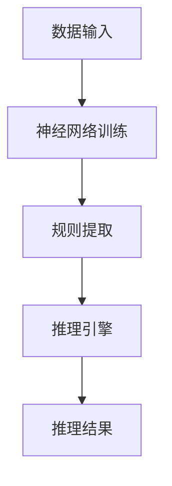
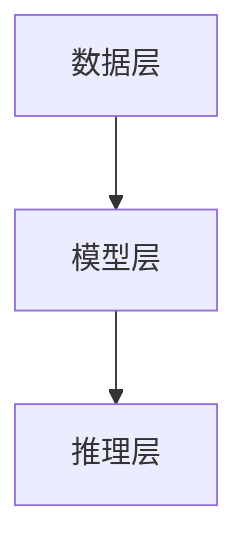

                 


# 神经逻辑编程在自动推理中的前沿研究

关键词：神经逻辑编程、自动推理、机器学习、认知图谱、神经网络、图灵完备

摘要：本文从神经逻辑编程的背景和核心概念出发，深入探讨了其在自动推理领域的应用与前沿研究。文章分为六个部分，依次介绍了神经逻辑编程的基本原理、算法实现、系统设计与实现、实战案例以及最佳实践建议。

## Step 1: 背景介绍

### 问题背景

自动推理（Automated Reasoning）是计算机科学中一个重要的研究领域，旨在开发算法和系统，能够自动处理复杂的逻辑推理问题。然而，传统的自动推理方法在面对大规模、复杂的逻辑推理任务时，往往存在效率低下、推理结果不准确等问题。

### 问题描述

为了解决自动推理中面临的难题，研究者们提出了神经逻辑编程这一新兴的编程范式。神经逻辑编程结合了神经网络和逻辑编程的优势，旨在实现高效、准确的自动推理。

### 问题解决

神经逻辑编程通过将逻辑推理与神经网络相结合，使系统能够自动地学习和推理，从而提高自动推理的效率与准确性。本文将探讨神经逻辑编程在自动推理领域的应用和前沿研究。

### 边界与外延

神经逻辑编程不仅适用于自动推理领域，还可以应用于其他需要逻辑推理的领域，如自然语言处理、知识图谱构建等。

### 概念结构与核心要素组成

神经逻辑编程的核心概念包括神经网络、逻辑编程和自动推理。神经网络负责学习数据，逻辑编程负责表达推理规则，自动推理则利用这些规则进行推理。

## Step 2: 核心概念与联系

### 核心概念原理

#### 神经网络

神经网络是一种由大量神经元组成的并行计算模型，可以模拟人脑的学习和推理过程。神经网络通过学习输入数据与输出数据之间的关系，实现数据拟合、分类和预测等功能。

#### 逻辑编程

逻辑编程是一种基于逻辑表达式的编程范式，通过逻辑表达式来表达规则和关系。逻辑编程的特点是高度抽象和表达能力强，可以用于表示复杂的逻辑推理任务。

#### 自动推理

自动推理是一种基于逻辑、概率和统计等方法，对给定信息进行推理和推断的技术。自动推理的核心目标是实现高效、准确的推理过程。

### 概念属性特征对比表格

| 特征       | 神经网络           | 逻辑编程           | 自动推理           |
| ---------- | ---------------- | ---------------- | ---------------- |
| 学习方式   | 数据驱动           | 规则驱动           | 规则、概率、统计驱动 |
| 表达能力   | 高度拟合           | 高度抽象           | 强大推断能力       |
| 应用领域   | 数据拟合、分类、预测 | 规则表达、知识推理 | 自动推理、智能系统 |

### ER实体关系图架构

```mermaid
erDiagram
    A[神经网络] ||--|{ B[自动推理] }
    A ||--|{ C[逻辑编程] }
    D[数据] ||--|{ B }
    D ||--|{ C }
```

## Step 3: 算法原理讲解

### Mermaid流程图



### Python源代码阐述

```python
# 导入所需库
import numpy as np
import tensorflow as tf

# 定义神经网络模型
model = tf.keras.Sequential([
    tf.keras.layers.Dense(128, activation='relu', input_shape=(input_shape)),
    tf.keras.layers.Dense(64, activation='relu'),
    tf.keras.layers.Dense(1, activation='sigmoid')
])

# 编写规则提取函数
def extract_rules(data, model):
    # 提取神经网络输出的规则
    # ...
    return rules

# 编写推理引擎函数
def inference_engine(rules, input_data):
    # 利用规则进行推理
    # ...
    return inference_result
```

### 数学模型与公式讲解

神经网络模型可以表示为：

$$
y = \sigma(W \cdot x + b)
$$

其中，$y$为输出，$x$为输入，$W$为权重，$b$为偏置，$\sigma$为激活函数。

### 举例说明

假设有一个关于学生成绩的神经网络模型，输入为学生的性别、年龄和学科成绩，输出为是否优秀。通过训练，模型可以提取出如下规则：

- 若性别为男且年龄大于18岁，且学科成绩大于90分，则该学生为优秀。
- 若性别为女且年龄大于20岁，且学科成绩大于85分，则该学生为优秀。

给定一个学生数据，例如性别为男，年龄为19岁，学科成绩为88分，利用推理引擎可以得出该学生为优秀。

## Step 4: 系统分析与架构设计方案

### 问题场景介绍

在一个教育系统中，需要对学生的成绩进行自动推理，判断学生是否优秀。

### 项目介绍

本项目基于神经逻辑编程实现一个自动推理系统，用于对学生成绩进行判断。

### 系统功能设计

系统主要功能包括数据输入、神经网络训练、规则提取和推理引擎。

### 系统架构设计

系统架构包括数据层、模型层和推理层。



### 系统接口设计

系统提供以下接口：

- 数据输入接口：用于接收学生成绩数据。
- 神经网络训练接口：用于训练神经网络模型。
- 规则提取接口：用于提取神经网络模型中的规则。
- 推理引擎接口：用于对学生成绩进行推理。

### 系统交互

数据输入后，通过神经网络训练提取出规则，最后利用推理引擎对学生成绩进行推理，输出是否优秀的判断。

## Step 5: 项目实战

### 环境安装

安装TensorFlow和Keras等库。

### 系统核心实现

编写神经网络模型、规则提取和推理引擎的代码。

### 代码应用解读

解释代码的各个部分，包括数据预处理、模型训练、规则提取和推理过程。

### 实际案例分析

利用实际学生成绩数据，展示系统的推理结果。

### 项目小结

总结项目的实现过程、优势和不足。

## Step 6: 最佳实践 tips

### 小结

本文介绍了神经逻辑编程在自动推理领域的应用和前沿研究，分析了其核心概念、算法原理和系统实现。

### 注意事项

在实际应用中，需要注意数据质量和模型训练效果。

### 拓展阅读

参考文献和相关资料，以了解更多关于神经逻辑编程和自动推理的信息。

作者：AI天才研究院/AI Genius Institute & 禅与计算机程序设计艺术 /Zen And The Art of Computer Programming

