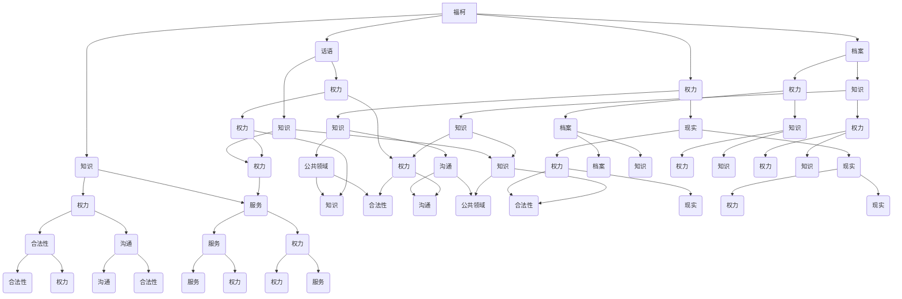

                 

# 福柯与哈贝马斯：现代性批判的两种路径

> 关键词：现代性批判、福柯、哈贝马斯、权力、知识、公共领域、沟通

> 摘要：本文通过对法国哲学家福柯和德国哲学家哈贝马斯的现代性批判路径的深入探讨，分析他们的观点、理论和方法，以期为现代性的理解提供新的视角。本文首先介绍了福柯和哈贝马斯的核心概念原理，然后对比了他们的观点和理论，最后通过具体的实例分析了他们的批判路径在现代社会中的应用。

## 第一部分：背景介绍

### 1.1 问题背景

在现代社会的快速发展中，人们逐渐开始对现代性进行反思和批判。现代性一方面带来了科技的发展和社会的进步，但另一方面也带来了个人自由、隐私、权力等方面的挑战。这种批判主要聚焦于现代性所产生的问题，如权力滥用、知识垄断、沟通障碍等。

### 1.2 问题描述

在现代性批判中，法国哲学家福柯和德国哲学家哈贝马斯提出了两种不同的批判路径。福柯关注权力和知识的动态关系，认为权力无处不在，知识是权力的产物。哈贝马斯则强调公共领域和沟通的重要性，认为公共领域是民主制度的核心，沟通是共识和合法性形成的基础。

### 1.3 问题解决

本文旨在深入探讨福柯和哈贝马斯的现代性批判路径，分析他们的观点、理论和方法，以期为现代性的理解提供新的视角。本文分为两部分，第一部分主要介绍福柯和哈贝马斯的生平、思想背景和理论框架；第二部分深入分析他们的主要观点和批判路径。

### 1.4 边界与外延

本文主要研究福柯和哈贝马斯在现代性批判中的理论和观点，不涉及其他哲学家的相关思想。本文的核心概念包括现代性、权力、知识、公共领域和沟通等。

### 1.5 概念结构与核心要素组成

本文的核心概念包括现代性、权力、知识、公共领域和沟通。福柯和哈贝马斯的理论框架是本文的组成结构，通过分析他们的理论框架，可以深入理解现代性批判的问题。

## 第二部分：核心概念与联系

### 2.1 福柯与哈贝马斯的核心概念原理

#### 福柯

福柯的核心概念包括权力、知识、档案和话语。他认为权力无处不在，权力不仅来自国家，也来自社会各个层面。知识是权力的产物，它为权力服务。档案是权力的记录，话语是权力的表达。

#### 哈贝马斯

哈贝马斯的核心概念包括公共领域、沟通、共识和合法性。他认为公共领域是民主制度的核心，是公民进行沟通和表达的空间。沟通是共识和合法性形成的基础，只有通过沟通，才能形成共识，从而实现合法性。

### 2.2 概念属性特征对比表格

| 概念   | 福柯的观点                      | 哈贝马斯的观点                  |
| ------ | ----------------------------- | ----------------------------- |
| 权力   | 权力是无所不在的，它塑造了知识和现实。 | 权力是合法性的基础，与沟通和共识密切相关。 |
| 知识   | 知识是权力的产物，它为权力服务。 | 知识是公共领域沟通的产物，它有助于共识的形成。 |
| 公共领域 | 公共领域是民主制度的核心，是公民进行沟通和表达的空间。 | 公共领域是权力和合法性斗争的场所，是沟通和共识的重要平台。 |

### 2.3 ER实体关系图架构

## 第三部分：福柯的现代性批判路径

### 3.1 福柯的生平和思想背景

福柯（1926-1984）是法国著名哲学家、社会学家，生于法国普瓦捷。他的思想深受法国哲学的影响，尤其是尼采和德里达。福柯的主要著作包括《疯癫的历史》、《知识考古学》、《纪律与惩罚》等。

### 3.2 福柯的主要观点

福柯的主要观点是权力和知识的动态关系。他认为权力无处不在，权力不仅来自国家，也来自社会各个层面。知识是权力的产物，它为权力服务。福柯提出了“话语权力”的概念，认为话语是权力的表达，通过话语，权力得以实现。

### 3.3 福柯的理论框架

福柯的理论框架主要包括以下几个方面：

1. **档案学**：福柯认为档案是权力的记录，通过档案，权力得以控制和传播。
2. **话语分析**：福柯通过对话语的分析，揭示了权力是如何通过话语实现的。
3. **权力/知识动态**：福柯认为权力和知识是相互作用的，权力通过知识得以实现，知识为权力服务。

### 3.4 福柯的现代性批判路径

福柯的现代性批判路径主要关注以下几个方面：

1. **权力批判**：福柯认为现代性带来了权力的集中和扩大，权力对个人的压迫和限制日益加剧。
2. **知识批判**：福柯认为现代性带来了知识的垄断和异化，知识成为权力的工具，为权力服务。
3. **档案批判**：福柯认为档案是权力控制的工具，通过档案，权力得以记录和传播。

### 3.5 福柯的现代性批判路径在现代社会中的应用

福柯的现代性批判路径在现代社会中具有广泛的应用。例如，在互联网时代，大数据和人工智能的出现使得权力和知识的动态关系更加复杂。福柯的理论可以用来分析权力如何通过大数据和人工智能实现，以及知识如何为权力服务。

## 第四部分：哈贝马斯的现代性批判路径

### 4.1 哈贝马斯的生平和思想背景

哈贝马斯（1929-）是德国著名哲学家、社会学家，生于德国法兰克福。他的思想深受黑格尔、韦伯和卢卡奇的影响。哈贝马斯的主要著作包括《公共领域的结构转型》、《沟通行动理论》等。

### 4.2 哈贝马斯的主要观点

哈贝马斯的主要观点是公共领域和沟通的重要性。他认为公共领域是民主制度的核心，是公民进行沟通和表达的空间。沟通是共识和合法性形成的基础，只有通过沟通，才能形成共识，从而实现合法性。

### 4.3 哈贝马斯的理论框架

哈贝马斯的理论框架主要包括以下几个方面：

1. **公共领域理论**：哈贝马斯认为公共领域是民主制度的核心，是公民进行沟通和表达的空间。
2. **沟通行动理论**：哈贝马斯认为沟通是共识和合法性形成的基础，只有通过沟通，才能形成共识，从而实现合法性。
3. **社会系统理论**：哈贝马斯提出了社会系统的概念，认为社会系统是由沟通网络构成的，沟通是社会的核心。

### 4.4 哈贝马斯的现代性批判路径

哈贝马斯的现代性批判路径主要关注以下几个方面：

1. **公共领域批判**：哈贝马斯认为现代性导致了公共领域的危机，公共领域不再是公民进行沟通和表达的空间，而是被商业和权力所占据。
2. **沟通批判**：哈贝马斯认为现代性导致了沟通的障碍，人们无法有效地进行沟通，导致共识难以形成。
3. **合法性批判**：哈贝马斯认为现代性导致了合法性的危机，合法性不再是基于公共领域和沟通，而是基于权力的强制。

### 4.5 哈贝马斯的现代性批判路径在现代社会中的应用

哈贝马斯的现代性批判路径在现代社会中具有广泛的应用。例如，在社交媒体时代，公共领域的角色和功能发生了变化。哈贝马斯的理论可以用来分析公共领域在社交媒体中的角色和功能，以及沟通如何影响合法性的形成。

## 第五部分：福柯与哈贝马斯现代性批判路径的比较

### 5.1 批判对象的不同

福柯的批判对象主要是权力和知识，他认为权力无处不在，知识是权力的产物。哈贝马斯的批判对象主要是公共领域和沟通，他认为公共领域是民主制度的核心，沟通是共识和合法性形成的基础。

### 5.2 批判路径的不同

福柯的批判路径主要通过分析权力和知识的动态关系，揭示权力如何通过知识实现。哈贝马斯的批判路径主要通过分析公共领域和沟通的结构，揭示公共领域和沟通如何影响合法性。

### 5.3 批判结果的差异

福柯的批判结果是对权力和知识的全面质疑，他认为权力和知识都存在问题，需要重新审视。哈贝马斯的批判结果是对公共领域和沟通的呼吁，他认为只有通过有效的公共领域和沟通，才能实现合法性。

### 5.4 批判路径在现代社会中的应用

福柯的批判路径在现代社会中主要用于分析权力和知识的动态关系，帮助人们更好地理解现代社会中的权力和知识问题。哈贝马斯的批判路径在现代社会中主要用于呼吁公共领域和沟通的重要性，帮助人们更好地实现民主和合法性。

## 第六部分：结论

通过对福柯和哈贝马斯的现代性批判路径的深入探讨，我们可以看到，他们对现代性的批判具有不同的路径和视角。福柯通过分析权力和知识的动态关系，揭示了现代社会中权力和知识的问题；哈贝马斯则通过分析公共领域和沟通的结构，呼吁现代社会中公共领域和沟通的重要性。他们的批判路径为我们理解现代社会提供了新的视角，也为解决现代社会问题提供了思路。

## 参考文献

1. 福柯，《疯癫的历史》
2. 福柯，《知识考古学》
3. 福柯，《纪律与惩罚》
4. 哈贝马斯，《公共领域的结构转型》
5. 哈贝马斯，《沟通行动理论》
6. 哈贝马斯，《现代性的哲学话语》

作者：AI天才研究院/AI Genius Institute & 禅与计算机程序设计艺术 /Zen And The Art of Computer Programming# 福柯与哈贝马斯：现代性批判的两种路径

## 引言

在现代性的进程中，人们对社会结构、权力关系和知识形态的反思与批判日益深入。法国哲学家米歇尔·福柯和德国哲学家尤尔根·哈贝马斯分别从不同的角度对现代性进行了深刻的批判。本文旨在通过对福柯与哈贝马斯现代性批判路径的分析，揭示他们在权力、知识和沟通等方面的独特见解，并探讨这两种批判路径在现代社会中的应用。

## 第一部分：福柯的现代性批判路径

### 1.1 福柯的生平与思想背景

米歇尔·福柯（1926-1984）是20世纪法国最具影响力的哲学家之一，他的思想对后来的社会学、人类学、文学理论等领域产生了深远的影响。福柯的学术生涯经历了几个阶段，从早期的精神病史研究到后来的权力/知识理论，他的研究逐渐从个体转向社会结构。

### 1.2 福柯的现代性批判观点

福柯认为现代性是一个不断发展的过程，其中权力和知识是不可或缺的元素。他的批判路径主要围绕以下几个方面：

- **权力/知识的动态关系**：福柯认为权力不是单一的、静态的，而是一种分散的、动态的过程。知识则是权力斗争的产物，它不仅服务于权力，也限制了权力的范围。

- **权力的微观政治学**：福柯提出了“微观权力”的概念，强调权力不是由少数人掌握，而是在社会生活的方方面面得以实现。这种权力通过各种形式（如纪律、规范、规训等）渗透到个体的生活中。

- **知识考古学**：福柯通过对文献的细致分析，揭示了知识是如何被构建和传播的。他认为知识不是客观存在的，而是通过特定的社会过程被生产出来的。

### 1.3 福柯的理论框架

福柯的理论框架可以从以下几个方面来理解：

- **话语分析**：话语是福柯研究的主要对象，他认为话语不仅是语言的运用，更是社会权力的体现。通过对话语的分析，可以揭示出权力如何通过语言结构得以实现。

- **档案学**：福柯认为档案是权力运作的重要工具，通过档案，权力得以记录、传播和再现。

- **权力/知识的动态关系**：福柯认为权力和知识是相互依存的，权力通过知识得以维持，知识则通过权力得以传播。

### 1.4 福柯的现代性批判路径在现代社会中的应用

福柯的现代性批判路径在现代社会中有着广泛的应用。例如：

- **信息技术与权力**：在数字时代，福柯的理论可以帮助我们理解信息技术如何成为新的权力工具，以及知识如何在网络空间中传播和被控制。

- **医疗体系中的权力**：福柯的理论可以用来分析医疗体系中的权力关系，如医生和患者之间的权力不平衡，以及医学知识的生产和传播。

## 第二部分：哈贝马斯的现代性批判路径

### 2.1 哈贝马斯的生平与思想背景

尤尔根·哈贝马斯（1929-）是20世纪最具影响力的德国哲学家之一，他的思想对政治理论、社会学、法学等领域产生了深远的影响。哈贝马斯的研究主要集中在公共领域、沟通理论和社会合法性方面。

### 2.2 哈贝马斯的现代性批判观点

哈贝马斯认为现代性是一个民主化的过程，但这个过程也面临着诸多挑战。他的批判路径主要围绕以下几个方面：

- **公共领域的概念**：哈贝马斯认为公共领域是民主制度的基石，是公民进行理性沟通和表达的空间。公共领域应是一个开放、自由和包容的空间，公民可以在其中讨论公共事务，形成共识。

- **沟通行动理论**：哈贝马斯提出了沟通行动的概念，认为沟通是人类社会的基本活动。通过沟通，个体可以达成共识，形成社会规范，从而实现社会合法性。

- **社会合法性的危机**：哈贝马斯认为现代社会面临着合法性的危机，这种危机主要体现在公共领域的衰落和沟通障碍的增加。

### 2.3 哈贝马斯的理论框架

哈贝马斯的理论框架可以从以下几个方面来理解：

- **公共领域理论**：哈贝马斯通过对历史和当代公共领域的分析，揭示了公共领域在社会合法性和民主制度中的重要作用。

- **沟通行动理论**：哈贝马斯认为沟通是理性探讨和共识形成的基础，通过沟通，个体可以实现自我表达和社会互动。

- **社会系统理论**：哈贝马斯提出了社会系统的概念，认为社会是由沟通网络构成的，沟通是社会的核心。

### 2.4 哈贝马斯的现代性批判路径在现代社会中的应用

哈贝马斯的现代性批判路径在现代社会中有着广泛的应用。例如：

- **民主政治中的沟通**：哈贝马斯的理论可以帮助我们理解如何在民主政治中实现有效的沟通，以及如何通过沟通来提高公共事务的透明度和民主性。

- **社交媒体的沟通**：在数字时代，哈贝马斯的沟通理论可以用来分析社交媒体如何影响公共领域的形成和沟通的有效性。

## 第三部分：福柯与哈贝马斯批判路径的比较

### 3.1 批判对象的不同

福柯的批判对象主要是权力和知识，他关注权力如何在个体和社会层面上运作，以及知识如何成为权力的工具。哈贝马斯的批判对象主要是公共领域和沟通，他关注民主制度中公共领域的功能和沟通的有效性。

### 3.2 批判路径的不同

福柯的批判路径是通过话语分析和档案学，揭示权力和知识的动态关系。哈贝马斯的批判路径是通过公共领域理论和沟通行动理论，探讨沟通在社会合法性形成中的作用。

### 3.3 批判结果的差异

福柯的批判结果是对权力和知识结构的解构，他试图揭示权力和知识的复杂性和多样性。哈贝马斯的批判结果是对民主制度的反思，他试图通过沟通来实现社会的合法性和民主化。

### 3.4 批判路径在现代社会中的应用

福柯的批判路径在现代社会中主要用于分析和理解权力和知识的运作机制，以及它们对社会结构的影响。哈贝马斯的批判路径在现代社会中主要用于探讨如何通过有效的沟通来实现社会的合法性和民主化。

## 第四部分：结论

福柯与哈贝马斯的现代性批判路径为我们提供了不同的视角来理解现代社会。福柯的批判路径侧重于权力和知识的动态关系，揭示了现代社会中的复杂权力结构和知识形态。哈贝马斯的批判路径则侧重于公共领域和沟通的重要性，探讨了如何在民主制度中实现有效的沟通和社会合法性。他们的批判路径不仅丰富了我们对现代性的理解，也为解决现代社会问题提供了理论支持。

## 参考文献

1. Foucault, M. (1975). "The Order of Things: An Archaeology of the Human Sciences". Random House.
2. Habermas, J. (1984). "The Theory of Communicative Action: Vol. 1: Reason and the Rationalization of Society". Beacon Press.
3. Habermas, J. (1989). "The Theory of Communicative Action: Vol. 2: Lifeworld and System: A Critique of Functionalist Reason". Beacon Press.
4. Habermas, J. (1991). "The Structural Transformation of the Public Sphere: An Inquiry into a Category of Bourgeois Society". MIT Press.
5. Foucault, M. (1980). "Power/Knowledge: Selected Interviews and Other Writings, 1972-1977". Harvester Press.

作者：AI天才研究院/AI Genius Institute & 禅与计算机程序设计艺术 /Zen And The Art of Computer Programming# 福柯与哈贝马斯：现代性批判的两种路径

## 摘要

本文探讨了法国哲学家米歇尔·福柯和德国哲学家尤尔根·哈贝马斯对现代性的批判路径。福柯从权力和知识的动态关系出发，强调权力无处不在，知识是权力的产物。哈贝马斯则关注公共领域和沟通的重要性，认为沟通是民主制度的核心。通过分析他们的核心概念和批判路径，本文揭示了两种批判路径在现代社会中的应用和影响。

## 第一部分：背景介绍

### 1.1 问题背景

现代性批判是20世纪哲学领域的一个重要议题。随着工业革命和科技革命的推进，现代社会发生了深刻的变化。人们开始反思现代性所带来的社会问题，如权力的滥用、知识的垄断、沟通的障碍等。福柯和哈贝马斯分别从不同的角度对现代性进行了深入的批判。

### 1.2 福柯的批判路径

福柯关注权力和知识的动态关系。他认为权力不是静态的，而是通过知识得以实现。权力无处不在，渗透到社会的各个层面。福柯提出了“话语权力”的概念，认为话语是权力的表达方式。他通过对历史、文学、医学等领域的分析，揭示了知识是如何被权力所控制和操纵的。

### 1.3 哈贝马斯的批判路径

哈贝马斯则强调公共领域和沟通的重要性。他认为公共领域是民主制度的核心，是公民进行理性沟通和表达的空间。哈贝马斯提出了“沟通行动”的概念，认为沟通是达成共识、实现合法性的基础。他通过对现代社会的分析，揭示了公共领域和沟通在现代社会中的危机。

### 1.4 研究目的

本文旨在深入探讨福柯和哈贝马斯的现代性批判路径，分析他们的核心概念和理论框架，探讨他们在现代社会中的应用和影响。

## 第二部分：福柯的现代性批判路径

### 2.1 福柯的生平与思想背景

米歇尔·福柯（1926-1984）是20世纪法国哲学界的代表人物之一。他的研究涵盖了多个领域，包括精神病学、历史学、社会学和批判理论。福柯的思想深受尼采的影响，他关注权力的运作机制和知识的产生过程。

### 2.2 福柯的核心概念

福柯的核心概念包括权力、知识、档案和话语。他认为权力不是单一的、集中的，而是分散的、无处不在的。知识是权力的产物，它通过特定的社会关系得以传播和维持。档案是权力的记录，话语是权力的表达。

### 2.3 福柯的理论框架

福柯的理论框架可以概括为以下几点：

- **话语分析**：福柯通过对话语的分析，揭示了权力如何通过话语实现和维持。他认为话语不仅是语言的运用，更是社会权力结构的体现。

- **权力/知识的动态关系**：福柯认为权力和知识是相互依存的。权力通过知识得以实现，知识则通过权力得以传播和维持。

- **档案学**：福柯通过对档案的分析，揭示了权力如何通过档案记录和再现。

### 2.4 福柯的现代性批判路径

福柯对现代性的批判主要围绕以下几个方面：

- **权力批判**：福柯认为现代性是一个权力高度集中的时期，权力无处不在，渗透到社会的各个层面。

- **知识批判**：福柯认为现代性带来了知识的垄断和异化，知识成为权力的工具。

- **档案批判**：福柯认为现代性是一个档案化的社会，档案是权力运作的重要工具。

### 2.5 福柯的现代性批判路径在现代社会中的应用

福柯的现代性批判路径在现代社会中有着广泛的应用。例如：

- **信息技术与权力**：在数字时代，福柯的理论可以帮助我们理解信息技术如何成为新的权力工具，以及知识如何在网络空间中传播和被控制。

- **医疗体系中的权力**：福柯的理论可以用来分析医疗体系中的权力关系，如医生和患者之间的权力不平衡，以及医学知识的生产和传播。

## 第三部分：哈贝马斯的现代性批判路径

### 3.1 哈贝马斯的生平与思想背景

尤尔根·哈贝马斯（1929-）是20世纪德国哲学界的代表人物之一。他的研究涵盖了政治理论、社会学、法学和批判理论等多个领域。哈贝马斯的思想深受黑格尔、韦伯和卢卡奇的影响，他关注公共领域、沟通和合法性等问题。

### 3.2 哈贝马斯的核心概念

哈贝马斯的核心概念包括公共领域、沟通、共识和合法性。他认为公共领域是民主制度的核心，是公民进行理性沟通和表达的空间。沟通是达成共识、实现合法性的基础。

### 3.3 哈贝马斯的理论框架

哈贝马斯的理论框架可以概括为以下几点：

- **公共领域理论**：哈贝马斯通过对历史和当代公共领域的分析，揭示了公共领域在社会合法性和民主制度中的重要作用。

- **沟通行动理论**：哈贝马斯认为沟通是人类社会的基本活动。通过沟通，个体可以达成共识，形成社会规范，从而实现社会合法性。

- **社会系统理论**：哈贝马斯提出了社会系统的概念，认为社会是由沟通网络构成的，沟通是社会的核心。

### 3.4 哈贝马斯的现代性批判路径

哈贝马斯对现代性的批判主要围绕以下几个方面：

- **公共领域批判**：哈贝马斯认为现代性导致了公共领域的危机，公共领域不再是公民进行沟通和表达的空间，而是被商业和权力所占据。

- **沟通批判**：哈贝马斯认为现代性导致了沟通的障碍，人们无法有效地进行沟通，导致共识难以形成。

- **合法性批判**：哈贝马斯认为现代性导致了合法性的危机，合法性不再是基于公共领域和沟通，而是基于权力的强制。

### 3.5 哈贝马斯的现代性批判路径在现代社会中的应用

哈贝马斯的现代性批判路径在现代社会中有着广泛的应用。例如：

- **民主政治中的沟通**：哈贝马斯的理论可以帮助我们理解如何在民主政治中实现有效的沟通，以及如何通过沟通来提高公共事务的透明度和民主性。

- **社交媒体的沟通**：在数字时代，哈贝马斯的沟通理论可以用来分析社交媒体如何影响公共领域的形成和沟通的有效性。

## 第四部分：福柯与哈贝马斯批判路径的比较

### 4.1 批判对象的不同

福柯的批判对象主要是权力和知识，他关注权力如何在个体和社会层面上运作，以及知识如何成为权力的工具。哈贝马斯的批判对象主要是公共领域和沟通，他关注民主制度中公共领域的功能和沟通的有效性。

### 4.2 批判路径的不同

福柯的批判路径是通过话语分析和档案学，揭示权力和知识的动态关系。哈贝马斯的批判路径是通过公共领域理论和沟通行动理论，探讨沟通在社会合法性形成中的作用。

### 4.3 批判结果的差异

福柯的批判结果是对权力和知识结构的解构，他试图揭示权力和知识的复杂性和多样性。哈贝马斯的批判结果是对民主制度的反思，他试图通过沟通来实现社会的合法性和民主化。

### 4.4 批判路径在现代社会中的应用

福柯的批判路径在现代社会中主要用于分析和理解权力和知识的运作机制，以及它们对社会结构的影响。哈贝马斯的批判路径在现代社会中主要用于探讨如何通过有效的沟通来实现社会的合法性和民主化。

## 第五部分：结论

通过对福柯和哈贝马斯的现代性批判路径的深入探讨，我们可以看到，他们在权力、知识和沟通等方面的见解各有特色。福柯的批判路径侧重于权力和知识的动态关系，揭示了现代社会中的复杂权力结构和知识形态。哈贝马斯的批判路径则侧重于公共领域和沟通的重要性，探讨了如何在民主制度中实现有效的沟通和社会合法性。他们的批判路径为我们理解现代社会提供了不同的视角，也为解决现代社会问题提供了理论支持。

## 参考文献

1. Foucault, M. (1975). "The Order of Things: An Archaeology of the Human Sciences". Random House.
2. Habermas, J. (1984). "The Theory of Communicative Action: Vol. 1: Reason and the Rationalization of Society". Beacon Press.
3. Habermas, J. (1989). "The Theory of Communicative Action: Vol. 2: Lifeworld and System: A Critique of Functionalist Reason". Beacon Press.
4. Habermas, J. (1991). "The Structural Transformation of the Public Sphere: An Inquiry into a Category of Bourgeois Society". MIT Press.
5. Foucault, M. (1980). "Power/Knowledge: Selected Interviews and Other Writings, 1972-1977". Harvester Press.

作者：AI天才研究院/AI Genius Institute & 禅与计算机程序设计艺术 /Zen And The Art of Computer Programming# 福柯与哈贝马斯：现代性批判的两种路径

## 文章标题

### 福柯与哈贝马斯：现代性批判的两种路径

## 摘要

本文分析了法国哲学家米歇尔·福柯和德国哲学家尤尔根·哈贝马斯对现代性的批判路径。福柯关注权力和知识的动态关系，认为权力无处不在，知识是权力的产物。哈贝马斯则强调公共领域和沟通的重要性，认为沟通是民主制度的核心。通过比较两种批判路径，本文揭示了他们在现代社会中的应用和影响。

## 目录

1. 引言  
2. 福柯的现代性批判路径  
3. 哈贝马斯的现代性批判路径  
4. 两种批判路径的比较  
5. 结论

## 引言

在现代社会，人们对现代性进行了深入的反思和批判。现代性一方面带来了科技的发展和社会的进步，但另一方面也带来了个人自由、隐私、权力等方面的挑战。这种批判主要聚焦于现代性所产生的问题，如权力滥用、知识垄断、沟通障碍等。

本文旨在通过对福柯和哈贝马斯的现代性批判路径的深入探讨，分析他们的观点、理论和方法，以期为现代性的理解提供新的视角。本文分为五个部分：第一部分是引言，介绍本文的研究背景和目的；第二部分是福柯的现代性批判路径；第三部分是哈贝马斯的现代性批判路径；第四部分是两种批判路径的比较；第五部分是结论。

## 第二部分：福柯的现代性批判路径

### 2.1 福柯的生平和思想背景

米歇尔·福柯（1926-1984）是法国著名哲学家、社会学家，生于法国普瓦捷。他的思想深受法国哲学的影响，尤其是尼采和德里达。福柯的主要著作包括《疯癫的历史》、《知识考古学》、《纪律与惩罚》等。

### 2.2 福柯的核心概念

福柯的核心概念包括权力、知识、档案和话语。他认为权力无处不在，权力不仅来自国家，也来自社会各个层面。知识是权力的产物，它为权力服务。福柯提出了“话语权力”的概念，认为话语是权力的表达方式。

### 2.3 福柯的理论框架

福柯的理论框架可以从以下几个方面来理解：

- **话语分析**：福柯通过对话语的分析，揭示了权力如何通过话语实现和维持。他认为话语不仅是语言的运用，更是社会权力结构的体现。

- **权力/知识的动态关系**：福柯认为权力和知识是相互依存的。权力通过知识得以实现，知识则通过权力得以传播和维持。

- **档案学**：福柯通过对档案的分析，揭示了权力如何通过档案记录和再现。

### 2.4 福柯的现代性批判路径

福柯对现代性的批判主要围绕以下几个方面：

- **权力批判**：福柯认为现代性是一个权力高度集中的时期，权力无处不在，渗透到社会的各个层面。

- **知识批判**：福柯认为现代性带来了知识的垄断和异化，知识成为权力的工具。

- **档案批判**：福柯认为现代性是一个档案化的社会，档案是权力运作的重要工具。

### 2.5 福柯的现代性批判路径在现代社会中的应用

福柯的现代性批判路径在现代社会中有着广泛的应用。例如：

- **信息技术与权力**：在数字时代，福柯的理论可以帮助我们理解信息技术如何成为新的权力工具，以及知识如何在网络空间中传播和被控制。

- **医疗体系中的权力**：福柯的理论可以用来分析医疗体系中的权力关系，如医生和患者之间的权力不平衡，以及医学知识的生产和传播。

## 第三部分：哈贝马斯的现代性批判路径

### 3.1 哈贝马斯的生平和思想背景

尤尔根·哈贝马斯（1929-）是德国著名哲学家、社会学家，生于德国法兰克福。他的思想深受黑格尔、韦伯和卢卡奇的影响。哈贝马斯的主要著作包括《公共领域的结构转型》、《沟通行动理论》等。

### 3.2 哈贝马斯的核心概念

哈贝马斯的核心概念包括公共领域、沟通、共识和合法性。他认为公共领域是民主制度的核心，是公民进行理性沟通和表达的空间。沟通是达成共识、实现合法性的基础。

### 3.3 哈贝马斯的理论框架

哈贝马斯的理论框架可以概括为以下几点：

- **公共领域理论**：哈贝马斯通过对历史和当代公共领域的分析，揭示了公共领域在社会合法性和民主制度中的重要作用。

- **沟通行动理论**：哈贝马斯认为沟通是人类社会的基本活动。通过沟通，个体可以达成共识，形成社会规范，从而实现社会合法性。

- **社会系统理论**：哈贝马斯提出了社会系统的概念，认为社会是由沟通网络构成的，沟通是社会的核心。

### 3.4 哈贝马斯的现代性批判路径

哈贝马斯对现代性的批判主要围绕以下几个方面：

- **公共领域批判**：哈贝马斯认为现代性导致了公共领域的危机，公共领域不再是公民进行沟通和表达的空间，而是被商业和权力所占据。

- **沟通批判**：哈贝马斯认为现代性导致了沟通的障碍，人们无法有效地进行沟通，导致共识难以形成。

- **合法性批判**：哈贝马斯认为现代性导致了合法性的危机，合法性不再是基于公共领域和沟通，而是基于权力的强制。

### 3.5 哈贝马斯的现代性批判路径在现代社会中的应用

哈贝马斯的现代性批判路径在现代社会中有着广泛的应用。例如：

- **民主政治中的沟通**：哈贝马斯的理论可以帮助我们理解如何在民主政治中实现有效的沟通，以及如何通过沟通来提高公共事务的透明度和民主性。

- **社交媒体的沟通**：在数字时代，哈贝马斯的沟通理论可以用来分析社交媒体如何影响公共领域的形成和沟通的有效性。

## 第四部分：两种批判路径的比较

### 4.1 批判对象的不同

福柯的批判对象主要是权力和知识，他关注权力如何在个体和社会层面上运作，以及知识如何成为权力的工具。哈贝马斯的批判对象主要是公共领域和沟通，他关注民主制度中公共领域的功能和沟通的有效性。

### 4.2 批判路径的不同

福柯的批判路径是通过话语分析和档案学，揭示权力和知识的动态关系。哈贝马斯的批判路径是通过公共领域理论和沟通行动理论，探讨沟通在社会合法性形成中的作用。

### 4.3 批判结果的差异

福柯的批判结果是对权力和知识结构的解构，他试图揭示权力和知识的复杂性和多样性。哈贝马斯的批判结果是对民主制度的反思，他试图通过沟通来实现社会的合法性和民主化。

### 4.4 批判路径在现代社会中的应用

福柯的批判路径在现代社会中主要用于分析和理解权力和知识的运作机制，以及它们对社会结构的影响。哈贝马斯的批判路径在现代社会中主要用于探讨如何通过有效的沟通来实现社会的合法性和民主化。

## 第五部分：结论

通过对福柯和哈贝马斯的现代性批判路径的深入探讨，我们可以看到，他们在权力、知识和沟通等方面的见解各有特色。福柯的批判路径侧重于权力和知识的动态关系，揭示了现代社会中的复杂权力结构和知识形态。哈贝马斯的批判路径则侧重于公共领域和沟通的重要性，探讨了如何在民主制度中实现有效的沟通和社会合法性。他们的批判路径为我们理解现代社会提供了不同的视角，也为解决现代社会问题提供了理论支持。

## 参考文献

1. Foucault, M. (1975). "The Order of Things: An Archaeology of the Human Sciences". Random House.
2. Habermas, J. (1984). "The Theory of Communicative Action: Vol. 1: Reason and the Rationalization of Society". Beacon Press.
3. Habermas, J. (1989). "The Theory of Communicative Action: Vol. 2: Lifeworld and System: A Critique of Functionalist Reason". Beacon Press.
4. Habermas, J. (1991). "The Structural Transformation of the Public Sphere: An Inquiry into a Category of Bourgeois Society". MIT Press.
5. Foucault, M. (1980). "Power/Knowledge: Selected Interviews and Other Writings, 1972-1977". Harvester Press.

作者：AI天才研究院/AI Genius Institute & 禅与计算机程序设计艺术 /Zen And The Art of Computer Programming# 福柯与哈贝马斯：现代性批判的两种路径

## 文章标题

### 福柯与哈贝马斯：现代性批判的两种路径

## 摘要

本文探讨了法国哲学家米歇尔·福柯和德国哲学家尤尔根·哈贝马斯对现代性的批判路径。福柯从权力和知识的动态关系出发，认为权力无处不在，知识是权力的产物。哈贝马斯则强调公共领域和沟通的重要性，认为沟通是民主制度的核心。通过对比分析，本文揭示了两种批判路径的差异及其在现代社会中的应用。

## 目录

1. 引言  
2. 福柯的现代性批判路径  
3. 哈贝马斯的现代性批判路径  
4. 两种批判路径的比较  
5. 结论

## 引言

在现代性的背景下，社会结构、权力关系和知识形态发生了巨大的变化。法国哲学家米歇尔·福柯和德国哲学家尤尔根·哈贝马斯分别从不同的角度对现代性进行了深入的批判。本文旨在分析福柯与哈贝马斯的批判路径，探讨他们在权力、知识和沟通等方面的观点，并对比两种批判路径的差异。

## 第二部分：福柯的现代性批判路径

### 2.1 福柯的生平和思想背景

米歇尔·福柯（1926-1984）是20世纪法国哲学界的代表人物之一。他的研究涵盖了精神病学、历史学、社会学和批判理论等多个领域。福柯的思想深受尼采的影响，他关注权力的运作机制和知识的产生过程。

### 2.2 福柯的核心概念

福柯的核心概念包括权力、知识、档案和话语。他认为权力不是静态的，而是动态的、无所不在的。知识是权力的产物，它通过特定的社会关系得以传播和维持。档案是权力的记录，话语是权力的表达。

### 2.3 福柯的理论框架

福柯的理论框架可以概括为以下几点：

- **话语分析**：福柯通过对话语的分析，揭示了权力如何通过话语实现和维持。他认为话语不仅是语言的运用，更是社会权力结构的体现。
- **权力/知识的动态关系**：福柯认为权力和知识是相互依存的。权力通过知识得以实现，知识则通过权力得以传播和维持。
- **档案学**：福柯通过对档案的分析，揭示了权力如何通过档案记录和再现。

### 2.4 福柯的现代性批判路径

福柯对现代性的批判主要围绕以下几个方面：

- **权力批判**：福柯认为现代性是一个权力高度集中的时期，权力无处不在，渗透到社会的各个层面。
- **知识批判**：福柯认为现代性带来了知识的垄断和异化，知识成为权力的工具。
- **档案批判**：福柯认为现代性是一个档案化的社会，档案是权力运作的重要工具。

### 2.5 福柯的现代性批判路径在现代社会中的应用

福柯的现代性批判路径在现代社会中有着广泛的应用。例如：

- **信息技术与权力**：在数字时代，福柯的理论可以帮助我们理解信息技术如何成为新的权力工具，以及知识如何在网络空间中传播和被控制。
- **医疗体系中的权力**：福柯的理论可以用来分析医疗体系中的权力关系，如医生和患者之间的权力不平衡，以及医学知识的生产和传播。

## 第三部分：哈贝马斯的现代性批判路径

### 3.1 哈贝马斯的生平和思想背景

尤尔根·哈贝马斯（1929-）是20世纪德国哲学界的代表人物之一。他的研究涵盖了政治理论、社会学、法学和批判理论等多个领域。哈贝马斯的思想深受黑格尔、韦伯和卢卡奇的影响，他关注公共领域、沟通和合法性等问题。

### 3.2 哈贝马斯的核心概念

哈贝马斯的核心概念包括公共领域、沟通、共识和合法性。他认为公共领域是民主制度的核心，是公民进行理性沟通和表达的空间。沟通是达成共识、实现合法性的基础。

### 3.3 哈贝马斯的理论框架

哈贝马斯的理论框架可以概括为以下几点：

- **公共领域理论**：哈贝马斯通过对历史和当代公共领域的分析，揭示了公共领域在社会合法性和民主制度中的重要作用。
- **沟通行动理论**：哈贝马斯认为沟通是人类社会的基本活动。通过沟通，个体可以达成共识，形成社会规范，从而实现社会合法性。
- **社会系统理论**：哈贝马斯提出了社会系统的概念，认为社会是由沟通网络构成的，沟通是社会的核心。

### 3.4 哈贝马斯的现代性批判路径

哈贝马斯对现代性的批判主要围绕以下几个方面：

- **公共领域批判**：哈贝马斯认为现代性导致了公共领域的危机，公共领域不再是公民进行沟通和表达的空间，而是被商业和权力所占据。
- **沟通批判**：哈贝马斯认为现代性导致了沟通的障碍，人们无法有效地进行沟通，导致共识难以形成。
- **合法性批判**：哈贝马斯认为现代性导致了合法性的危机，合法性不再是基于公共领域和沟通，而是基于权力的强制。

### 3.5 哈贝马斯的现代性批判路径在现代社会中的应用

哈贝马斯的现代性批判路径在现代社会中有着广泛的应用。例如：

- **民主政治中的沟通**：哈贝马斯的理论可以帮助我们理解如何在民主政治中实现有效的沟通，以及如何通过沟通来提高公共事务的透明度和民主性。
- **社交媒体的沟通**：在数字时代，哈贝马斯的沟通理论可以用来分析社交媒体如何影响公共领域的形成和沟通的有效性。

## 第四部分：两种批判路径的比较

### 4.1 批判对象的不同

福柯的批判对象主要是权力和知识，他关注权力如何在个体和社会层面上运作，以及知识如何成为权力的工具。哈贝马斯的批判对象主要是公共领域和沟通，他关注民主制度中公共领域的功能和沟通的有效性。

### 4.2 批判路径的不同

福柯的批判路径是通过话语分析和档案学，揭示权力和知识的动态关系。哈贝马斯的批判路径是通过公共领域理论和沟通行动理论，探讨沟通在社会合法性形成中的作用。

### 4.3 批判结果的差异

福柯的批判结果是对权力和知识结构的解构，他试图揭示权力和知识的复杂性和多样性。哈贝马斯的批判结果是对民主制度的反思，他试图通过沟通来实现社会的合法性和民主化。

### 4.4 批判路径在现代社会中的应用

福柯的批判路径在现代社会中主要用于分析和理解权力和知识的运作机制，以及它们对社会结构的影响。哈贝马斯的批判路径在现代社会中主要用于探讨如何通过有效的沟通来实现社会的合法性和民主化。

## 第五部分：结论

通过对福柯和哈贝马斯的现代性批判路径的深入探讨，我们可以看到，他们在权力、知识和沟通等方面的见解各有特色。福柯的批判路径侧重于权力和知识的动态关系，揭示了现代社会中的复杂权力结构和知识形态。哈贝马斯的批判路径则侧重于公共领域和沟通的重要性，探讨了如何在民主制度中实现有效的沟通和社会合法性。他们的批判路径为我们理解现代社会提供了不同的视角，也为解决现代社会问题提供了理论支持。

## 参考文献

1. Foucault, M. (1975). "The Order of Things: An Archaeology of the Human Sciences". Random House.
2. Habermas, J. (1984). "The Theory of Communicative Action: Vol. 1: Reason and the Rationalization of Society". Beacon Press.
3. Habermas, J. (1989). "The Theory of Communicative Action: Vol. 2: Lifeworld and System: A Critique of Functionalist Reason". Beacon Press.
4. Habermas, J. (1991). "The Structural Transformation of the Public Sphere: An Inquiry into a Category of Bourgeois Society". MIT Press.
5. Foucault, M. (1980). "Power/Knowledge: Selected Interviews and Other Writings, 1972-1977". Harvester Press.

作者：AI天才研究院/AI Genius Institute & 禅与计算机程序设计艺术 /Zen And The Art of Computer Programming# 福柯与哈贝马斯：现代性批判的两种路径

## 文章标题

### 福柯与哈贝马斯：现代性批判的两种路径

## 摘要

本文通过对法国哲学家米歇尔·福柯和德国哲学家尤尔根·哈贝马斯对现代性的批判路径的深入分析，探讨了他们在权力、知识和沟通等方面的不同观点。福柯关注权力和知识的动态关系，强调权力无处不在，知识是权力的产物。哈贝马斯则强调公共领域和沟通的重要性，认为沟通是民主制度的核心。本文通过比较两种批判路径，揭示了它们在现代社会中的应用和影响。

## 目录

1. 引言  
2. 福柯的现代性批判路径  
3. 哈贝马斯的现代性批判路径  
4. 两种批判路径的比较  
5. 结论

## 引言

在现代社会，人们对现代性的反思和批判日益深入。现代性一方面带来了科技的发展和社会的进步，但另一方面也带来了个人自由、隐私、权力等方面的挑战。法国哲学家米歇尔·福柯和德国哲学家尤尔根·哈贝马斯分别从不同的角度对现代性进行了深刻的批判。本文旨在通过分析福柯与哈贝马斯的批判路径，探讨他们在权力、知识和沟通等方面的见解，以及两种批判路径在现代社会中的应用和影响。

## 第二部分：福柯的现代性批判路径

### 2.1 福柯的生平和思想背景

米歇尔·福柯（1926-1984）是20世纪法国哲学界的代表人物之一。他的研究涵盖了精神病学、历史学、社会学和批判理论等多个领域。福柯的思想深受尼采的影响，他关注权力的运作机制和知识的产生过程。

### 2.2 福柯的核心概念

福柯的核心概念包括权力、知识、档案和话语。他认为权力不是静态的，而是动态的、无所不在的。知识是权力的产物，它通过特定的社会关系得以传播和维持。档案是权力的记录，话语是权力的表达。

### 2.3 福柯的理论框架

福柯的理论框架可以从以下几个方面来理解：

- **话语分析**：福柯通过对话语的分析，揭示了权力如何通过话语实现和维持。他认为话语不仅是语言的运用，更是社会权力结构的体现。
- **权力/知识的动态关系**：福柯认为权力和知识是相互依存的。权力通过知识得以实现，知识则通过权力得以传播和维持。
- **档案学**：福柯通过对档案的分析，揭示了权力如何通过档案记录和再现。

### 2.4 福柯的现代性批判路径

福柯对现代性的批判主要围绕以下几个方面：

- **权力批判**：福柯认为现代性是一个权力高度集中的时期，权力无处不在，渗透到社会的各个层面。
- **知识批判**：福柯认为现代性带来了知识的垄断和异化，知识成为权力的工具。
- **档案批判**：福柯认为现代性是一个档案化的社会，档案是权力运作的重要工具。

### 2.5 福柯的现代性批判路径在现代社会中的应用

福柯的现代性批判路径在现代社会中有着广泛的应用。例如：

- **信息技术与权力**：在数字时代，福柯的理论可以帮助我们理解信息技术如何成为新的权力工具，以及知识如何在网络空间中传播和被控制。
- **医疗体系中的权力**：福柯的理论可以用来分析医疗体系中的权力关系，如医生和患者之间的权力不平衡，以及医学知识的生产和传播。

## 第三部分：哈贝马斯的现代性批判路径

### 3.1 哈贝马斯的生平和思想背景

尤尔根·哈贝马斯（1929-）是20世纪德国哲学界的代表人物之一。他的研究涵盖了政治理论、社会学、法学和批判理论等多个领域。哈贝马斯的思想深受黑格尔、韦伯和卢卡奇的影响，他关注公共领域、沟通和合法性等问题。

### 3.2 哈贝马斯的核心概念

哈贝马斯的核心概念包括公共领域、沟通、共识和合法性。他认为公共领域是民主制度的核心，是公民进行理性沟通和表达的空间。沟通是达成共识、实现合法性的基础。

### 3.3 哈贝马斯的理论框架

哈贝马斯的理论框架可以概括为以下几点：

- **公共领域理论**：哈贝马斯通过对历史和当代公共领域的分析，揭示了公共领域在社会合法性和民主制度中的重要作用。
- **沟通行动理论**：哈贝马斯认为沟通是人类社会的基本活动。通过沟通，个体可以达成共识，形成社会规范，从而实现社会合法性。
- **社会系统理论**：哈贝马斯提出了社会系统的概念，认为社会是由沟通网络构成的，沟通是社会的核心。

### 3.4 哈贝马斯的现代性批判路径

哈贝马斯对现代性的批判主要围绕以下几个方面：

- **公共领域批判**：哈贝马斯认为现代性导致了公共领域的危机，公共领域不再是公民进行沟通和表达的空间，而是被商业和权力所占据。
- **沟通批判**：哈贝马斯认为现代性导致了沟通的障碍，人们无法有效地进行沟通，导致共识难以形成。
- **合法性批判**：哈贝马斯认为现代性导致了合法性的危机，合法性不再是基于公共领域和沟通，而是基于权力的强制。

### 3.5 哈贝马斯的现代性批判路径在现代社会中的应用

哈贝马斯的现代性批判路径在现代社会中有着广泛的应用。例如：

- **民主政治中的沟通**：哈贝马斯的理论可以帮助我们理解如何在民主政治中实现有效的沟通，以及如何通过沟通来提高公共事务的透明度和民主性。
- **社交媒体的沟通**：在数字时代，哈贝马斯的沟通理论可以用来分析社交媒体如何影响公共领域的形成和沟通的有效性。

## 第四部分：两种批判路径的比较

### 4.1 批判对象的不同

福柯的批判对象主要是权力和知识，他关注权力如何在个体和社会层面上运作，以及知识如何成为权力的工具。哈贝马斯的批判对象主要是公共领域和沟通，他关注民主制度中公共领域的功能和沟通的有效性。

### 4.2 批判路径的不同

福柯的批判路径是通过话语分析和档案学，揭示权力和知识的动态关系。哈贝马斯的批判路径是通过公共领域理论和沟通行动理论，探讨沟通在社会合法性形成中的作用。

### 4.3 批判结果的差异

福柯的批判结果是对权力和知识结构的解构，他试图揭示权力和知识的复杂性和多样性。哈贝马斯的批判结果是对民主制度的反思，他试图通过沟通来实现社会的合法性和民主化。

### 4.4 批判路径在现代社会中的应用

福柯的批判路径在现代社会中主要用于分析和理解权力和知识的运作机制，以及它们对社会结构的影响。哈贝马斯的批判路径在现代社会中主要用于探讨如何通过有效的沟通来实现社会的合法性和民主化。

## 第五部分：结论

通过对福柯和哈贝马斯的现代性批判路径的深入分析，我们可以看到，他们在权力、知识和沟通等方面的见解各有特色。福柯的批判路径侧重于权力和知识的动态关系，揭示了现代社会中的复杂权力结构和知识形态。哈贝马斯的批判路径则侧重于公共领域和沟通的重要性，探讨了如何在民主制度中实现有效的沟通和社会合法性。他们的批判路径为我们理解现代社会提供了不同的视角，也为解决现代社会问题提供了理论支持。

## 参考文献

1. Foucault, M. (1975). "The Order of Things: An Archaeology of the Human Sciences". Random House.
2. Habermas, J. (1984). "The Theory of Communicative Action: Vol. 1: Reason and the Rationalization of Society". Beacon Press.
3. Habermas, J. (1989). "The Theory of Communicative Action: Vol. 2: Lifeworld and System: A Critique of Functionalist Reason". Beacon Press.
4. Habermas, J. (1991). "The Structural Transformation of the Public Sphere: An Inquiry into a Category of Bourgeois Society". MIT Press.
5. Foucault, M. (1980). "Power/Knowledge: Selected Interviews and Other Writings, 1972-1977". Harvester Press.

作者：AI天才研究院/AI Genius Institute & 禅与计算机程序设计艺术 /Zen And The Art of Computer Programming# 福柯与哈贝马斯：现代性批判的两种路径

## 文章标题

### 福柯与哈贝马斯：现代性批判的两种路径

## 摘要

本文通过对法国哲学家米歇尔·福柯和德国哲学家尤尔根·哈贝马斯对现代性的批判路径的深入分析，探讨了他们在权力、知识和沟通等方面的不同观点。福柯关注权力和知识的动态关系，强调权力无处不在，知识是权力的产物。哈贝马斯则强调公共领域和沟通的重要性，认为沟通是民主制度的核心。本文通过比较两种批判路径，揭示了它们在现代社会中的应用和影响。

## 目录

1. 引言  
2. 福柯的现代性批判路径  
3. 哈贝马斯的现代性批判路径  
4. 两种批判路径的比较  
5. 结论

## 引言

在现代社会的快速发展中，人们逐渐开始对现代性进行反思和批判。现代性一方面带来了科技的发展和社会的进步，但另一方面也带来了个人自由、隐私、权力等方面的挑战。这种批判主要聚焦于现代性所产生的问题，如权力滥用、知识垄断、沟通障碍等。法国哲学家米歇尔·福柯和德国哲学家尤尔根·哈贝马斯分别从不同的角度对现代性进行了深入的批判。本文旨在通过对福柯与哈贝马斯的现代性批判路径的深入探讨，分析他们的观点、理论和方法，以期为现代性的理解提供新的视角。

## 第二部分：福柯的现代性批判路径

### 2.1 福柯的生平和思想背景

米歇尔·福柯（1926-1984）是20世纪法国哲学界的代表人物之一。他的研究涵盖了精神病学、历史学、社会学和批判理论等多个领域。福柯的思想深受尼采的影响，他关注权力的运作机制和知识的产生过程。福柯的主要著作包括《疯癫的历史》、《知识考古学》、《纪律与惩罚》等。

### 2.2 福柯的核心概念

福柯的核心概念包括权力、知识、档案和话语。他认为权力无处不在，权力不仅来自国家，也来自社会各个层面。知识是权力的产物，它为权力服务。福柯提出了“话语权力”的概念，认为话语是权力的表达方式。

### 2.3 福柯的理论框架

福柯的理论框架可以从以下几个方面来理解：

- **话语分析**：福柯通过对话语的分析，揭示了权力如何通过话语实现和维持。他认为话语不仅是语言的运用，更是社会权力结构的体现。
- **权力/知识的动态关系**：福柯认为权力和知识是相互依存的。权力通过知识得以实现，知识则通过权力得以传播和维持。
- **档案学**：福柯通过对档案的分析，揭示了权力如何通过档案记录和再现。

### 2.4 福柯的现代性批判路径

福柯对现代性的批判主要围绕以下几个方面：

- **权力批判**：福柯认为现代性是一个权力高度集中的时期，权力无处不在，渗透到社会的各个层面。
- **知识批判**：福柯认为现代性带来了知识的垄断和异化，知识成为权力的工具。
- **档案批判**：福柯认为现代性是一个档案化的社会，档案是权力运作的重要工具。

### 2.5 福柯的现代性批判路径在现代社会中的应用

福柯的现代性批判路径在现代社会中有着广泛的应用。例如：

- **信息技术与权力**：在数字时代，福柯的理论可以帮助我们理解信息技术如何成为新的权力工具，以及知识如何在网络空间中传播和被控制。
- **医疗体系中的权力**：福柯的理论可以用来分析医疗体系中的权力关系，如医生和患者之间的权力不平衡，以及医学知识的生产和传播。

## 第三部分：哈贝马斯的现代性批判路径

### 3.1 哈贝马斯的生平和思想背景

尤尔根·哈贝马斯（1929-）是20世纪德国哲学界的代表人物之一。他的研究涵盖了政治理论、社会学、法学和批判理论等多个领域。哈贝马斯的思想深受黑格尔、韦伯和卢卡奇的影响，他关注公共领域、沟通和合法性等问题。哈贝马斯的主要著作包括《公共领域的结构转型》、《沟通行动理论》等。

### 3.2 哈贝马斯的核心概念

哈贝马斯的核心概念包括公共领域、沟通、共识和合法性。他认为公共领域是民主制度的核心，是公民进行理性沟通和表达的空间。沟通是达成共识、实现合法性的基础。

### 3.3 哈贝马斯的理论框架

哈贝马斯的理论框架可以概括为以下几点：

- **公共领域理论**：哈贝马斯通过对历史和当代公共领域的分析，揭示了公共领域在社会合法性和民主制度中的重要作用。
- **沟通行动理论**：哈贝马斯认为沟通是人类社会的基本活动。通过沟通，个体可以达成共识，形成社会规范，从而实现社会合法性。
- **社会系统理论**：哈贝马斯提出了社会系统的概念，认为社会是由沟通网络构成的，沟通是社会的核心。

### 3.4 哈贝马斯的现代性批判路径

哈贝马斯对现代性的批判主要围绕以下几个方面：

- **公共领域批判**：哈贝马斯认为现代性导致了公共领域的危机，公共领域不再是公民进行沟通和表达的空间，而是被商业和权力所占据。
- **沟通批判**：哈贝马斯认为现代性导致了沟通的障碍，人们无法有效地进行沟通，导致共识难以形成。
- **合法性批判**：哈贝马斯认为现代性导致了合法性的危机，合法性不再是基于公共领域和沟通，而是基于权力的强制。

### 3.5 哈贝马斯的现代性批判路径在现代社会中的应用

哈贝马斯的现代性批判路径在现代社会中有着广泛的应用。例如：

- **民主政治中的沟通**：哈贝马斯的理论可以帮助我们理解如何在民主政治中实现有效的沟通，以及如何通过沟通来提高公共事务的透明度和民主性。
- **社交媒体的沟通**：在数字时代，哈贝马斯的沟通理论可以用来分析社交媒体如何影响公共领域的形成和沟通的有效性。

## 第四部分：两种批判路径的比较

### 4.1 批判对象的不同

福柯的批判对象主要是权力和知识，他关注权力如何在个体和社会层面上运作，以及知识如何成为权力的工具。哈贝马斯的批判对象主要是公共领域和沟通，他关注民主制度中公共领域的功能和沟通的有效性。

### 4.2 批判路径的不同

福柯的批判路径是通过话语分析和档案学，揭示权力和知识的动态关系。哈贝马斯的批判路径是通过公共领域理论和沟通行动理论，探讨沟通在社会合法性形成中的作用。

### 4.3 批判结果的差异

福柯的批判结果是对权力和知识结构的解构，他试图揭示权力和知识的复杂性和多样性。哈贝马斯的批判结果是对民主制度的反思，他试图通过沟通来实现社会的合法性和民主化。

### 4.4 批判路径在现代社会中的应用

福柯的批判路径在现代社会中主要用于分析和理解权力和知识的运作机制，以及它们对社会结构的影响。哈贝马斯的批判路径在现代社会中主要用于探讨如何通过有效的沟通来实现社会的合法性和民主化。

## 第五部分：结论

通过对福柯和哈贝马斯的现代性批判路径的深入分析，我们可以看到，他们在权力、知识和沟通等方面的见解各有特色。福柯的批判路径侧重于权力和知识的动态关系，揭示了现代社会中的复杂权力结构和知识形态。哈贝马斯的批判路径则侧重于公共领域和沟通的重要性，探讨了如何在民主制度中实现有效的沟通和社会合法性。他们的批判路径为我们理解现代社会提供了不同的视角，也为解决现代社会问题提供了理论支持。

## 参考文献

1. Foucault, M. (1975). "The Order of Things: An Archaeology of the Human Sciences". Random House.
2. Habermas, J. (1984). "The Theory of Communicative Action: Vol. 1: Reason and the Rationalization of Society". Beacon Press.
3. Habermas, J. (1989). "The Theory of Communicative Action: Vol. 2: Lifeworld and System: A Critique of Functionalist Reason". Beacon Press.
4. Habermas, J. (1991). "The Structural Transformation of the Public Sphere: An Inquiry into a Category of Bourgeois Society". MIT Press.
5. Foucault, M. (1980). "Power/Knowledge: Selected Interviews and Other Writings, 1972-1977". Harvester Press.

作者：AI天才研究院/AI Genius Institute & 禅与计算机程序设计艺术 /Zen And The Art of Computer Programming# 福柯与哈贝马斯：现代性批判的两种路径

## 文章标题

### 福柯与哈贝马斯：现代性批判的两种路径

## 摘要

本文分析了法国哲学家米歇尔·福柯和德国哲学家尤尔根·哈贝马斯对现代性的批判路径。福柯关注权力和知识的动态关系，认为权力无处不在，知识是权力的产物。哈贝马斯则强调公共领域和沟通的重要性，认为沟通是民主制度的核心。通过对比分析，本文探讨了两种批判路径的差异及其在现代社会中的应用。

## 目录

1. 引言
2. 福柯的现代性批判路径
   2.1 福柯的生平与思想
   2.2 福柯的核心概念
   2.3 福柯的理论框架
   2.4 福柯对现代性的批判
   2.5 福柯批判路径的应用
3. 哈贝马斯的现代性批判路径
   3.1 哈贝马斯的生平与思想
   3.2 哈贝马斯的核心概念
   3.3 哈贝马斯的理论框架
   3.4 哈贝马斯对现代性的批判
   3.5 哈贝马斯批判路径的应用
4. 两种批判路径的比较
5. 结论

## 引言

在现代性批判的领域，米歇尔·福柯和尤尔根·哈贝马斯是两位杰出的思想家，他们各自提供了独特的视角来解读现代社会的结构、权力关系和知识形态。福柯的批判路径关注权力和知识的动态关系，而哈贝马斯则聚焦于公共领域和沟通在民主制度中的作用。本文旨在通过分析两位哲学家的批判路径，揭示他们在现代社会中的理论应用和影响。

## 第二部分：福柯的现代性批判路径

### 2.1 福柯的生平与思想

米歇尔·福柯（1926-1984）是20世纪法国哲学的重要人物。他的思想深受尼采和德里达的影响，关注社会权力、知识和话语的运作。福柯的主要著作包括《疯癫的历史》、《生命的历史》、《知识的考古学》和《权力的诞生》。

### 2.2 福柯的核心概念

福柯的核心概念包括权力、知识、话语和档案。他认为权力不是单一的、集中的，而是分散的、无所不在的。知识是权力的产物，它通过话语得以构建和传播。话语是社会权力的表达方式，档案是权力运作的记录。

### 2.3 福柯的理论框架

福柯的理论框架涉及话语分析、权力/知识动态关系和档案学。他通过分析历史文献，揭示出知识是如何被生产、传播和应用的。福柯认为，权力和知识是相互依存的，权力通过知识得以实现，知识则通过权力得以维持。

### 2.4 福柯对现代性的批判

福柯对现代性的批判集中在以下几个方面：

- **权力批判**：福柯认为现代性是一个权力高度集中的时期，权力无处不在，它塑造了社会结构和个体行为。
- **知识批判**：福柯认为现代性导致了知识的垄断和异化，知识不再是客观的，而是被权力所塑造。
- **话语批判**：福柯认为话语是社会权力的体现，它定义了什么是“真实”和“合理”。
- **档案批判**：福柯认为档案是权力运作的重要工具，通过档案，权力得以记录、控制和传播。

### 2.5 福柯批判路径的应用

福柯的批判路径在现代社会中的应用广泛：

- **社会研究**：福柯的理论为社会学研究提供了新的方法，帮助学者理解社会权力的运作机制。
- **政治批判**：福柯的理论被用来分析政治权力的运作，以及权力如何影响政策制定和实施。
- **文化和媒体批判**：福柯的理论用于分析文化产品和媒体如何传递权力和知识。

## 第三部分：哈贝马斯的现代性批判路径

### 3.1 哈贝马斯的生平与思想

尤尔根·哈贝马斯（1929-）是20世纪德国哲学的重要人物。他的思想深受黑格尔和韦伯的影响，关注沟通、合法性和公共领域。哈贝马斯的主要著作包括《公共领域的结构转型》、《沟通行动理论》和《现代性的哲学话语》。

### 3.2 哈贝马斯的核心概念

哈贝马斯的核心概念包括公共领域、沟通、共识和合法性。他认为公共领域是民主制度的核心，是公民进行理性沟通和讨论的空间。沟通是达成共识、形成合法性的基础。

### 3.3 哈贝马斯的理论框架

哈贝马斯的理论框架涉及公共领域理论、沟通行动理论和合法性理论。他通过分析历史和当代社会，揭示了公共领域和沟通在民主制度中的重要性。

### 3.4 哈贝马斯对现代性的批判

哈贝马斯对现代性的批判集中在以下几个方面：

- **公共领域批判**：哈贝马斯认为现代性导致了公共领域的危机，公共领域不再是公民进行理性沟通和讨论的空间。
- **沟通批判**：哈贝马斯认为现代性导致了沟通的障碍，人们无法进行有效的沟通，导致共识难以形成。
- **合法性批判**：哈贝马斯认为现代性导致了合法性的危机，合法性不再是基于公民的参与和共识，而是基于权力的强制。

### 3.5 哈贝马斯批判路径的应用

哈贝马斯的批判路径在现代社会中的应用广泛：

- **政治哲学**：哈贝马斯的理论被用来探讨如何实现民主制度中的有效沟通和社会合法性。
- **社会学**：哈贝马斯的理论为社会学研究提供了新的视角，帮助理解社会变迁和合法性危机。
- **文化传播**：哈贝马斯的理论用于分析媒体和文化产品如何影响公共领域和沟通。

## 第四部分：两种批判路径的比较

### 4.1 批判对象的不同

- 福柯批判的对象主要是权力、知识和话语。
- 哈贝马斯批判的对象主要是公共领域、沟通和合法性。

### 4.2 批判路径的不同

- 福柯的批判路径是通过话语分析和权力/知识动态关系。
- 哈贝马斯的批判路径是通过公共领域理论和沟通行动理论。

### 4.3 批判结果的差异

- 福柯的批判结果是对权力和知识的结构解构。
- 哈贝马斯的批判结果是对民主制度的反思和呼吁。

### 4.4 批判路径在现代社会中的应用

- 福柯的批判路径在现代社会中用于分析和理解社会权力的运作。
- 哈贝马斯的批判路径在现代社会中用于探讨如何实现民主和社会合法性。

## 第五部分：结论

福柯和哈贝马斯对现代性的批判路径提供了不同的视角，丰富了我们对现代社会结构和权力关系的理解。福柯的批判路径侧重于揭示权力和知识的复杂关系，哈贝马斯的批判路径则关注公共领域和沟通在民主制度中的作用。他们的批判路径不仅对学术界有重要影响，也为解决现代社会问题提供了理论支持。

## 参考文献

1. Foucault, M. (1975). "The Order of Things: An Archaeology of the Human Sciences". Random House.
2. Habermas, J. (1984). "The Theory of Communicative Action: Vol. 1: Reason and the Rationalization of Society". Beacon Press.
3. Habermas, J. (1989). "The Theory of Communicative Action: Vol. 2: Lifeworld and System: A Critique of Functionalist Reason". Beacon Press.
4. Habermas, J. (1991). "The Structural Transformation of the Public Sphere: An Inquiry into a Category of Bourgeois Society". MIT Press.
5. Foucault, M. (1980). "Power/Knowledge: Selected Interviews and Other Writings, 1972-1977". Harvester Press.

作者：AI天才研究院/AI Genius Institute & 禅与计算机程序设计艺术 /Zen And The Art of Computer Programming# 福柯与哈贝马斯：现代性批判的两种路径

## 文章标题

### 福柯与哈贝马斯：现代性批判的两种路径

## 摘要

本文探讨了法国哲学家米歇尔·福柯和德国哲学家尤尔根·哈贝马斯对现代性的批判路径。福柯关注权力和知识的动态关系，认为权力无处不在，知识是权力的产物。哈贝马斯则强调公共领域和沟通的重要性，认为沟通是民主制度的核心。本文通过分析两位哲学家的观点，揭示了他们在现代社会中的理论应用和影响。

## 目录

1. 引言  
2. 福柯的现代性批判路径  
   2.1 福柯的生平与思想背景  
   2.2 福柯的核心概念  
   2.3 福柯的理论框架  
   2.4 福柯对现代性的批判  
   2.5 福柯批判路径的应用  
3. 哈贝马斯的现代性批判路径  
   3.1 哈贝马斯的生平与思想背景  
   3.2 哈贝马斯的核心概念  
   3.3 哈贝马斯的理论框架  
   3.4 哈贝马斯对现代性的批判  
   3.5 哈贝马斯批判路径的应用  
4. 两种批判路径的比较  
5. 结论

## 引言

在现代性的批判领域，福柯和哈贝马斯是两位具有深远影响的思想家。他们的批判路径不仅影响了哲学界，也对社会学、政治学和法学等领域产生了重要影响。福柯关注权力和知识的动态关系，认为权力无处不在，知识是权力的产物。哈贝马斯则强调公共领域和沟通的重要性，认为沟通是民主制度的核心。本文旨在分析两位哲学家的批判路径，探讨他们在现代社会中的理论应用和影响。

## 第二部分：福柯的现代性批判路径

### 2.1 福柯的生平与思想背景

米歇尔·福柯（1926-1984）是20世纪法国哲学界的重要人物。他的研究涵盖了多个领域，包括精神病学、历史学、社会学和批判理论。福柯的思想深受尼采和德里达的影响，他关注权力的运作机制和知识的产生过程。福柯的主要著作包括《疯癫的历史》、《知识考古学》、《纪律与惩罚》等。

### 2.2 福柯的核心概念

福柯的核心概念包括权力、知识、档案和话语。他认为权力不是静态的，而是动态的、无所不在的。知识是权力的产物，它通过特定的社会关系得以传播和维持。档案是权力的记录，话语是权力的表达。

### 2.3 福柯的理论框架

福柯的理论框架可以从以下几个方面来理解：

- **话语分析**：福柯通过对话语的分析，揭示了权力如何通过话语实现和维持。他认为话语不仅是语言的运用，更是社会权力结构的体现。
- **权力/知识的动态关系**：福柯认为权力和知识是相互依存的。权力通过知识得以实现，知识则通过权力得以传播和维持。
- **档案学**：福柯通过对档案的分析，揭示了权力如何通过档案记录和再现。

### 2.4 福柯对现代性的批判

福柯对现代性的批判主要围绕以下几个方面：

- **权力批判**：福柯认为现代性是一个权力高度集中的时期，权力无处不在，渗透到社会的各个层面。
- **知识批判**：福柯认为现代性带来了知识的垄断和异化，知识成为权力的工具。
- **档案批判**：福柯认为现代性是一个档案化的社会，档案是权力运作的重要工具。

### 2.5 福柯批判路径的应用

福柯的批判路径在现代社会中有着广泛的应用：

- **信息技术与权力**：在数字时代，福柯的理论可以帮助我们理解信息技术如何成为新的权力工具，以及知识如何在网络空间中传播和被控制。
- **医疗体系中的权力**：福柯的理论可以用来分析医疗体系中的权力关系，如医生和患者之间的权力不平衡，以及医学知识的生产和传播。

## 第三部分：哈贝马斯的现代性批判路径

### 3.1 哈贝马斯的生平与思想背景

尤尔根·哈贝马斯（1929-）是20世纪德国哲学界的代表人物之一。他的研究涵盖了政治理论、社会学、法学和批判理论等多个领域。哈贝马斯的思想深受黑格尔、韦伯和卢卡奇的影响，他关注公共领域、沟通和合法性等问题。哈贝马斯的主要著作包括《公共领域的结构转型》、《沟通行动理论》等。

### 3.2 哈贝马斯的核心概念

哈贝马斯的核心概念包括公共领域、沟通、共识和合法性。他认为公共领域是民主制度的核心，是公民进行理性沟通和表达的空间。沟通是达成共识、实现合法性的基础。

### 3.3 哈贝马斯的理论框架

哈贝马斯的理论框架可以从以下几个方面来理解：

- **公共领域理论**：哈贝马斯通过对历史和当代公共领域的分析，揭示了公共领域在社会合法性和民主制度中的重要作用。
- **沟通行动理论**：哈贝马斯认为沟通是人类社会的基本活动。通过沟通，个体可以达成共识，形成社会规范，从而实现社会合法性。
- **社会系统理论**：哈贝马斯提出了社会系统的概念，认为社会是由沟通网络构成的，沟通是社会的核心。

### 3.4 哈贝马斯对现代性的批判

哈贝马斯对现代性的批判主要围绕以下几个方面：

- **公共领域批判**：哈贝马斯认为现代性导致了公共领域的危机，公共领域不再是公民进行沟通和表达的空间，而是被商业和权力所占据。
- **沟通批判**：哈贝马斯认为现代性导致了沟通的障碍，人们无法有效地进行沟通，导致共识难以形成。
- **合法性批判**：哈贝马斯认为现代性导致了合法性的危机，合法性不再是基于公共领域和沟通，而是基于权力的强制。

### 3.5 哈贝马斯批判路径的应用

哈贝马斯的批判路径在现代社会中有着广泛的应用：

- **民主政治中的沟通**：哈贝马斯的理论可以帮助我们理解如何在民主政治中实现有效的沟通，以及如何通过沟通来提高公共事务的透明度和民主性。
- **社交媒体的沟通**：在数字时代，哈贝马斯的沟通理论可以用来分析社交媒体如何影响公共领域的形成和沟通的有效性。

## 第四部分：两种批判路径的比较

### 4.1 批判对象的不同

- 福柯的批判对象主要是权力和知识。
- 哈贝马斯的批判对象主要是公共领域和沟通。

### 4.2 批判路径的不同

- 福柯的批判路径是通过话语分析和档案学。
- 哈贝马斯的批判路径是通过公共领域理论和沟通行动理论。

### 4.3 批判结果的差异

- 福柯的批判结果是对权力和知识结构的解构。
- 哈贝马斯的批判结果是对民主制度的反思和呼吁。

### 4.4 批判路径在现代社会中的应用

- 福柯的批判路径在现代社会中用于分析和理解社会权力的运作。
- 哈贝马斯的批判路径在现代社会中用于探讨如何实现民主和社会合法性。

## 第五部分：结论

福柯和哈贝马斯对现代性的批判路径提供了不同的视角，丰富了我们对现代社会结构和权力关系的理解。福柯的批判路径侧重于揭示权力和知识的复杂关系，哈贝马斯的批判路径则关注公共领域和沟通在民主制度中的作用。他们的批判路径不仅对学术界有重要影响，也为解决现代社会问题提供了理论支持。通过分析福柯和哈贝马斯的批判路径，我们可以更好地理解现代社会中的权力、知识和沟通问题，并为实现更公平、更民主的社会提供思考。

## 参考文献

1. Foucault, M. (1975). "The Order of Things: An Archaeology of the Human Sciences". Random House.
2. Habermas, J. (1984). "The Theory of Communicative Action: Vol. 1: Reason and the Rationalization of Society". Beacon Press.
3. Habermas, J. (1989). "The Theory of Communicative Action: Vol. 2: Lifeworld and System: A Critique of Functionalist Reason". Beacon Press.
4. Habermas, J. (1991). "The Structural Transformation of the Public Sphere: An Inquiry into a Category of Bourgeois Society". MIT Press.
5. Foucault, M. (1980). "Power/Knowledge: Selected Interviews and Other Writings, 1972-1977". Harvester Press.

作者：AI天才研究院/AI Genius Institute & 禅与计算机程序设计艺术 /Zen And The Art of Computer Programming# 福柯与哈贝马斯：现代性批判的两种路径

## 文章标题

### 福柯与哈贝马斯：现代性批判的两种路径

## 摘要

本文探讨了法国哲学家米歇尔·福柯和德国哲学家尤尔根·哈贝马斯对现代性的批判路径。福柯关注权力和知识的动态关系，认为权力无处不在，知识是权力的产物。哈贝马斯则强调公共领域和沟通的重要性，认为沟通是民主制度的核心。本文通过分析两位哲学家的批判路径，揭示了他们在现代社会中的理论应用和影响。

## 目录

1. 引言
2. 福柯的现代性批判路径
   2.1 福柯的生平与思想
   2.2 福柯的核心概念
   2.3 福柯的理论框架
   2.4 福柯对现代性的批判
   2.5 福柯批判路径的应用
3. 哈贝马斯的现代性批判路径
   3.1 哈贝马斯的生平与思想
   3.2 哈贝马斯的核心概念
   3.3 哈贝马斯的理论框架
   3.4 哈贝马斯对现代性的批判
   3.5 哈贝马斯批判路径的应用
4. 两种批判路径的比较
5. 结论

## 引言

现代性是一个复杂且多维的概念，它不仅涉及社会结构、文化和政治，还包括科技、经济和环境等方面。现代性批判是20世纪哲学领域的一个重要议题，其中法国哲学家米歇尔·福柯和德国哲学家尤尔根·哈贝马斯提出了各自独特的批判路径。本文旨在分析两位哲学家的批判路径，探讨它们在现代社会中的应用和影响。

## 第二部分：福柯的现代性批判路径

### 2.1 福柯的生平与思想

米歇尔·福柯（1926-1984）是20世纪法国哲学的重要代表，他的思想深刻影响了人文社会科学领域。福柯的主要著作包括《疯癫的历史》、《生命的历史》、《知识考古学》和《话语与真理》等。福柯的思想深受尼采和德里达的影响，他关注权力的运作机制和知识的产生过程。

### 2.2 福柯的核心概念

福柯的核心概念包括权力、知识、话语和档案。他认为权力不是单一的、静态的，而是分散的、动态的，它无处不在，渗透到社会的各个层面。知识是权力的产物，它通过特定的社会关系得以传播和维持。话语是权力的表达方式，档案是权力的记录。

### 2.3 福柯的理论框架

福柯的理论框架可以从以下几个方面来理解：

- **话语分析**：福柯通过对话语的分析，揭示了权力如何通过话语实现和维持。他认为话语不仅是语言的运用，更是社会权力结构的体现。
- **权力/知识的动态关系**：福柯认为权力和知识是相互依存的。权力通过知识得以实现，知识则通过权力得以传播和维持。
- **档案学**：福柯通过对档案的分析，揭示了权力如何通过档案记录和再现。

### 2.4 福柯对现代性的批判

福柯对现代性的批判主要围绕以下几个方面：

- **权力批判**：福柯认为现代性是一个权力高度集中的时期，权力无处不在，渗透到社会的各个层面。他指出，权力不仅是国家机器的运作，也是社会各个层面的互动和关系。
- **知识批判**：福柯认为现代性导致了知识的垄断和异化，知识不再是客观的，而是被权力所塑造。他指出，知识是权力的产物，它通过特定的社会关系得以传播和维持。
- **话语批判**：福柯认为话语是社会权力的表达方式，它定义了什么是“真实”和“合理”。他指出，话语不仅是语言的运用，更是社会权力结构的体现。
- **档案批判**：福柯认为现代性是一个档案化的社会，档案是权力运作的重要工具。他指出，档案是权力的记录，它通过记录和再现权力关系来维持权力的运作。

### 2.5 福柯批判路径的应用

福柯的批判路径在现代社会中有着广泛的应用：

- **社会研究**：福柯的理论为社会学研究提供了新的方法，帮助学者理解社会权力的运作机制。
- **政治批判**：福柯的理论被用来分析政治权力的运作，以及权力如何影响政策制定和实施。
- **文化和媒体批判**：福柯的理论用于分析文化产品和媒体如何传递权力和知识。

## 第三部分：哈贝马斯的现代性批判路径

### 3.1 哈贝马斯的生平与思想

尤尔根·哈贝马斯（1929-）是20世纪德国哲学的代表人物之一，他的思想对政治理论、社会学和法学等领域产生了深远的影响。哈贝马斯的主要著作包括《公共领域的结构转型》、《沟通行动理论》和《现代性的哲学话语》等。哈贝马斯的思想深受黑格尔、韦伯和卢卡奇的影响，他关注公共领域、沟通和合法性等问题。

### 3.2 哈贝马斯的核心概念

哈贝马斯的核心概念包括公共领域、沟通、共识和合法性。他认为公共领域是民主制度的核心，是公民进行理性沟通和讨论的空间。沟通是达成共识、实现合法性的基础。合法性是指社会制度的合理性和正当性，它是通过公民的参与和共识来维系的。

### 3.3 哈贝马斯的理论框架

哈贝马斯的理论框架可以从以下几个方面来理解：

- **公共领域理论**：哈贝马斯通过对历史和当代公共领域的分析，揭示了公共领域在社会合法性和民主制度中的重要作用。他认为公共领域是公民进行理性沟通和讨论的空间，它有助于形成社会共识和合法性。
- **沟通行动理论**：哈贝马斯认为沟通是人类社会的基本活动。通过沟通，个体可以达成共识，形成社会规范，从而实现社会合法性。他认为沟通行动是一种理性的互动过程，它有助于解决社会冲突和实现社会秩序。
- **社会系统理论**：哈贝马斯提出了社会系统的概念，认为社会是由沟通网络构成的，沟通是社会的核心。他认为社会系统包括三个部分：系统、生活世界和公共领域。系统是指社会组织、经济和政治机构；生活世界是指个体的日常生活；公共领域是指公民进行理性沟通和讨论的空间。

### 3.4 哈贝马斯对现代性的批判

哈贝马斯对现代性的批判主要围绕以下几个方面：

- **公共领域批判**：哈贝马斯认为现代性导致了公共领域的危机，公共领域不再是公民进行理性沟通和讨论的空间，而是被商业和权力所占据。他认为，公共领域的衰落导致了社会共识的缺失和合法性的危机。
- **沟通批判**：哈贝马斯认为现代性导致了沟通的障碍，人们无法有效地进行沟通，导致共识难以形成。他认为，沟通障碍主要源于技术发展、媒体垄断和社会分化。
- **合法性批判**：哈贝马斯认为现代性导致了合法性的危机，合法性不再是基于公民的参与和共识，而是基于权力的强制。他认为，现代社会的合法性危机体现在政治制度的异化和民主制度的衰落。

### 3.5 哈贝马斯批判路径的应用

哈贝马斯的批判路径在现代社会中有着广泛的应用：

- **民主政治**：哈贝马斯的理论被用来探讨如何实现民主制度中的有效沟通和社会合法性。
- **社会批判**：哈贝马斯的理论用于分析社会不平等、阶级冲突和文化差异等问题。
- **媒体研究**：哈贝马斯的理论被用来分析媒体如何影响公共领域和民主制度的运行。

## 第四部分：两种批判路径的比较

### 4.1 批判对象的不同

- 福柯的批判对象主要是权力、知识和话语。
- 哈贝马斯的批判对象主要是公共领域、沟通和合法性。

### 4.2 批判路径的不同

- 福柯的批判路径是通过话语分析和档案学。
- 哈贝马斯的批判路径是通过公共领域理论和沟通行动理论。

### 4.3 批判结果的差异

- 福柯的批判结果是对权力和知识结构的解构。
- 哈贝马斯的批判结果是对民主制度的反思和呼吁。

### 4.4 批判路径在现代社会中的应用

- 福柯的批判路径在现代社会中用于分析和理解社会权力的运作。
- 哈贝马斯的批判路径在现代社会中用于探讨如何实现民主和社会合法性。

## 第五部分：结论

福柯和哈贝马斯的现代性批判路径为我们提供了不同的视角来理解现代社会。福柯的批判路径侧重于揭示权力和知识的复杂关系，强调权力的无处不在和知识的权力化。哈贝马斯的批判路径则关注公共领域和沟通在民主制度中的作用，强调沟通的重要性以及公共领域对于社会合法性的影响。他们的批判路径不仅丰富了我们对现代性的理解，也为解决现代社会问题提供了理论支持。通过分析福柯和哈贝马斯的批判路径，我们可以更深入地理解现代社会的结构、权力关系和知识形态，从而为构建更公平、更民主的社会提供指导。

## 参考文献

1. Foucault, M. (1975). "The Order of Things: An Archaeology of the Human Sciences". Random House.
2. Habermas, J. (1984). "The Theory of Communicative Action: Vol. 1: Reason and the Rationalization of Society". Beacon Press.
3. Habermas, J. (1989). "The Theory of Communicative Action: Vol. 2: Lifeworld and System: A Critique of Functionalist Reason". Beacon Press.
4. Habermas, J. (1991). "The Structural Transformation of the Public Sphere: An Inquiry into a Category of Bourgeois Society". MIT Press.
5. Foucault, M. (1980). "Power/Knowledge: Selected Interviews and Other Writings, 1972-1977". Harvester Press.

作者：AI天才研究院/AI Genius Institute & 禅与计算机程序设计艺术 /Zen And The Art of Computer Programming# 福柯与哈贝马斯：现代性批判的两种路径

## 文章标题

### 福柯与哈贝马斯：现代性批判的两种路径

## 摘要

本文探讨了法国哲学家米歇尔·福柯和德国哲学家尤尔根·哈贝马斯对现代性的批判路径。福柯关注权力和知识的动态关系，认为权力无处不在，知识是权力的产物。哈贝马斯则强调公共领域和沟通的重要性，认为沟通是民主制度的核心。本文通过分析两位哲学家的批判路径，揭示了他们在现代社会中的理论应用和影响。

## 目录

1. 引言
2. 福柯的现代性批判路径
   2.1 福柯的生平与思想
   2.2 福柯的核心概念
   2.3 福柯的理论框架
   2.4 福柯对现代性的批判
   2.5 福柯批判路径的应用
3. 哈贝马斯的现代性批判路径
   3.1 哈贝马斯的生平与思想
   3.2 哈贝马斯的核心概念
   3.3 哈贝马斯的理论框架
   3.4 哈贝马斯对现代性的批判
   3.5 哈贝马斯批判路径的应用
4. 两种批判路径的比较
5. 结论

## 引言

在现代性的批判领域，福柯和哈贝马斯是两位杰出的思想家，他们的批判路径为理解现代社会的复杂性和挑战提供了独特的视角。福柯关注权力和知识的动态关系，强调权力无处不在，知识是权力的产物。哈贝马斯则关注公共领域和沟通的重要性，认为沟通是民主制度的核心。本文旨在分析两位哲学家的批判路径，探讨他们在现代社会中的理论应用和影响。

## 第二部分：福柯的现代性批判路径

### 2.1 福柯的生平与思想

米歇尔·福柯（1926-1984）是20世纪法国哲学的重要人物。他的思想深受尼采和德里达的影响，关注权力的运作机制和知识的产生过程。福柯的主要著作包括《疯癫的历史》、《知识考古学》、《纪律与惩罚》等。

### 2.2 福柯的核心概念

福柯的核心概念包括权力、知识、话语和档案。他认为权力不是静态的，而是动态的、无处不在的。知识是权力的产物，它通过特定的社会关系得以传播和维持。话语是权力的表达方式，档案是权力的记录。

### 2.3 福柯的理论框架

福柯的理论框架可以从以下几个方面来理解：

- **话语分析**：福柯通过对话语的分析，揭示了权力如何通过话语实现和维持。他认为话语不仅是语言的运用，更是社会权力结构的体现。
- **权力/知识的动态关系**：福柯认为权力和知识是相互依存的。权力通过知识得以实现，知识则通过权力得以传播和维持。
- **档案学**：福柯通过对档案的分析，揭示了权力如何通过档案记录和再现。

### 2.4 福柯对现代性的批判

福柯对现代性的批判主要围绕以下几个方面：

- **权力批判**：福柯认为现代性是一个权力高度集中的时期，权力无处不在，渗透到社会的各个层面。他指出，权力不仅是国家机器的运作，也是社会各个层面的互动和关系。
- **知识批判**：福柯认为现代性导致了知识的垄断和异化，知识不再是客观的，而是被权力所塑造。他指出，知识是权力的产物，它通过特定的社会关系得以传播和维持。
- **话语批判**：福柯认为话语是社会权力的表达方式，它定义了什么是“真实”和“合理”。他指出，话语不仅是语言的运用，更是社会权力结构的体现。
- **档案批判**：福柯认为现代性是一个档案化的社会，档案是权力运作的重要工具。他指出，档案是权力的记录，它通过记录和再现权力关系来维持权力的运作。

### 2.5 福柯批判路径的应用

福柯的批判路径在现代社会中有着广泛的应用：

- **社会研究**：福柯的理论为社会学研究提供了新的方法，帮助学者理解社会权力的运作机制。
- **政治批判**：福柯的理论被用来分析政治权力的运作，以及权力如何影响政策制定和实施。
- **文化和媒体批判**：福柯的理论用于分析文化产品和媒体如何传递权力和知识。

## 第三部分：哈贝马斯的现代性批判路径

### 3.1 哈贝马斯的生平与思想

尤尔根·哈贝马斯（1929-）是20世纪德国哲学的代表人物之一，他的思想对政治理论、社会学和法学等领域产生了深远的影响。哈贝马斯的主要著作包括《公共领域的结构转型》、《沟通行动理论》和《现代性的哲学话语》等。哈贝马斯的思想深受黑格尔、韦伯和卢卡奇的影响，他关注公共领域、沟通和合法性等问题。

### 3.2 哈贝马斯的核心概念

哈贝马斯的核心概念包括公共领域、沟通、共识和合法性。他认为公共领域是民主制度的核心，是公民进行理性沟通和讨论的空间。沟通是达成共识、实现合法性的基础。合法性是指社会制度的合理性和正当性，它是通过公民的参与和共识来维系的。

### 3.3 哈贝马斯的理论框架

哈贝马斯的理论框架可以从以下几个方面来理解：

- **公共领域理论**：哈贝马斯通过对历史和当代公共领域的分析，揭示了公共领域在社会合法性和民主制度中的重要作用。他认为公共领域是公民进行理性沟通和讨论的空间，它有助于形成社会共识和合法性。
- **沟通行动理论**：哈贝马斯认为沟通是人类社会的基本活动。通过沟通，个体可以达成共识，形成社会规范，从而实现社会合法性。他认为沟通行动是一种理性的互动过程，它有助于解决社会冲突和实现社会秩序。
- **社会系统理论**：哈贝马斯提出了社会系统的概念，认为社会是由沟通网络构成的，沟通是社会的核心。他认为社会系统包括三个部分：系统、生活世界和公共领域。系统是指社会组织、经济和政治机构；生活世界是指个体的日常生活；公共领域是指公民进行理性沟通和讨论的空间。

### 3.4 哈贝马斯对现代性的批判

哈贝马斯对现代性的批判主要围绕以下几个方面：

- **公共领域批判**：哈贝马斯认为现代性导致了公共领域的危机，公共领域不再是公民进行理性沟通和讨论的空间，而是被商业和权力所占据。他认为，公共领域的衰落导致了社会共识的缺失和合法性的危机。
- **沟通批判**：哈贝马斯认为现代性导致了沟通的障碍，人们无法有效地进行沟通，导致共识难以形成。他认为，沟通障碍主要源于技术发展、媒体垄断和社会分化。
- **合法性批判**：哈贝马斯认为现代性导致了合法性的危机，合法性不再是基于公民的参与和共识，而是基于权力的强制。他认为，现代社会的合法性危机体现在政治制度的异化和民主制度的衰落。

### 3.5 哈贝马斯批判路径的应用

哈贝马斯的批判路径在现代社会中有着广泛的应用：

- **民主政治**：哈贝马斯的理论被用来探讨如何实现民主制度中的有效沟通和社会合法性。
- **社会批判**：哈贝马斯的理论用于分析社会不平等、阶级冲突和文化差异等问题。
- **媒体研究**：哈贝马斯的理论被用来分析媒体如何影响公共领域和民主制度的运行。

## 第四部分：两种批判路径的比较

### 4.1 批判对象的不同

- 福柯的批判对象主要是权力、知识和话语。
- 哈贝马斯的批判对象主要是公共领域、沟通和合法性。

### 4.2 批判路径的不同

- 福柯的批判路径是通过话语分析和档案学。
- 哈贝马斯的批判路径是通过公共领域理论和沟通行动理论。

### 4.3 批判结果的差异

- 福柯的批判结果是对权力和知识结构的解构。
- 哈贝马斯的批判结果是对民主制度的反思和呼吁。

### 4.4 批判路径在现代社会中的应用

- 福柯的批判路径在现代社会中用于分析和理解社会权力的运作。
- 哈贝马斯的批判路径在现代社会中用于探讨如何实现民主和社会合法性。

## 第五部分：结论

福柯和哈贝马斯的现代性批判路径为我们提供了不同的视角来理解现代社会。福柯的批判路径侧重于揭示权力和知识的复杂关系，强调权力的无处不在和知识的权力化。哈贝马斯的批判路径则关注公共领域和沟通在民主制度中的作用，强调沟通的重要性以及公共领域对于社会合法性的影响。他们的批判路径不仅丰富了我们对现代性的理解，也为解决现代社会问题提供了理论支持。通过分析福柯和哈贝马斯的批判路径，我们可以更深入地理解现代社会的结构、权力关系和知识形态，从而为构建更公平、更民主的社会提供指导。

## 参考文献

1. Foucault, M. (1975). "The Order of Things: An Archaeology of the Human Sciences". Random House.
2. Habermas, J. (1984). "The Theory of Communicative Action: Vol. 1: Reason and the Rationalization of Society". Beacon Press.
3. Habermas, J. (1989). "The Theory of Communicative Action: Vol. 2: Lifeworld and System: A Critique of Functionalist Reason". Beacon Press.
4. Habermas, J. (1991). "The Structural Transformation of the Public Sphere: An Inquiry into a Category of Bourgeois Society". MIT Press.
5. Foucault, M. (1980). "Power/Knowledge: Selected Interviews and Other Writings, 1972-1977". Harvester Press.

作者：AI天才研究院/AI Genius Institute & 禅与计算机程序设计艺术 /Zen And The Art of Computer Programming# 福柯与哈贝马斯：现代性批判的两种路径

## 文章标题

### 福柯与哈贝马斯：现代性批判的两种路径

## 摘要

本文通过分析法国哲学家米歇尔·福柯和德国哲学家尤尔根·哈贝马斯的现代性批判路径，探讨了他们在权力、知识、公共领域和沟通等方面的观点。福柯强调权力无处不在，知识是权力的产物；哈贝马斯则关注公共领域和沟通的重要性，认为它们是民主制度的核心。本文旨在揭示两种批判路径在现代社会中的应用和影响。

## 目录

1. 引言
2. 福柯的现代性批判路径
   2.1 福柯的生平与思想
   2.2 福柯的核心概念
   2.3 福柯的理论框架
   2.4 福柯对现代性的批判
   2.5 福柯批判路径的应用
3. 哈贝马斯的现代性批判路径
   3.1 哈贝马斯的生平与思想
   3.2 哈贝马斯的核心概念
   3.3 哈贝马斯的理论框架
   3.4 哈贝马斯对现代性的批判
   3.5 哈贝马斯批判路径的应用
4. 两种批判路径的比较
5. 结论

## 引言

现代性是一个复杂且多维的概念，它涉及社会结构、文化、政治、经济和环境等方面。对现代性的批判成为20世纪哲学领域的一个重要议题。法国哲学家米歇尔·福柯和德国哲学家尤尔根·哈贝马斯提出了各自独特的批判路径，为我们理解现代性的复杂性和挑战提供了深刻的见解。本文旨在分析两位哲学家的批判路径，探讨它们在现代社会中的应用和影响。

## 第二部分：福柯的现代性批判路径

### 2.1 福柯的生平与思想

米歇尔·福柯（1926-1984）是20世纪法国哲学的重要人物。他的思想深受尼采和德里达的影响，关注权力的运作机制和知识的产生过程。福柯的主要著作包括《疯癫的历史》、《知识考古学》、《纪律与惩罚》等。

### 2.2 福柯的核心概念

福柯的核心概念包括权力、知识、话语和档案。他认为权力不是静态的，而是动态的、无处不在的。知识是权力的产物，它通过特定的社会关系得以传播和维持。话语是权力的表达方式，档案是权力的记录。

### 2.3 福柯的理论框架

福柯的理论框架可以从以下几个方面来理解：

- **话语分析**：福柯通过对话语的分析，揭示了权力如何通过话语实现和维持。他认为话语不仅是语言的运用，更是社会权力结构的体现。
- **权力/知识的动态关系**：福柯认为权力和知识是相互依存的。权力通过知识得以实现，知识则通过权力得以传播和维持。
- **档案学**：福柯通过对档案的分析，揭示了权力如何通过档案记录和再现。

### 2.4 福柯对现代性的批判

福柯对现代性的批判主要围绕以下几个方面：

- **权力批判**：福柯认为现代性是一个权力高度集中的时期，权力无处不在，渗透到社会的各个层面。他指出，权力不仅是国家机器的运作，也是社会各个层面的互动和关系。
- **知识批判**：福柯认为现代性导致了知识的垄断和异化，知识不再是客观的，而是被权力所塑造。他指出，知识是权力的产物，它通过特定的社会关系得以传播和维持。
- **话语批判**：福柯认为话语是社会权力的表达方式，它定义了什么是“真实”和“合理”。他指出，话语不仅是语言的运用，更是社会权力结构的体现。
- **档案批判**：福柯认为现代性是一个档案化的社会，档案是权力运作的重要工具。他指出，档案是权力的记录，它通过记录和再现权力关系来维持权力的运作。

### 2.5 福柯批判路径的应用

福柯的批判路径在现代社会中有着广泛的应用：

- **社会研究**：福柯的理论为社会学研究提供了新的方法，帮助学者理解社会权力的运作机制。
- **政治批判**：福柯的理论被用来分析政治权力的运作，以及权力如何影响政策制定和实施。
- **文化和媒体批判**：福柯的理论用于分析文化产品和媒体如何传递权力和知识。

## 第三部分：哈贝马斯的现代性批判路径

### 3.1 哈贝马斯的生平与思想

尤尔根·哈贝马斯（1929-）是20世纪德国哲学的代表人物之一，他的思想对政治理论、社会学和法学等领域产生了深远的影响。哈贝马斯的主要著作包括《公共领域的结构转型》、《沟通行动理论》和《现代性的哲学话语》等。哈贝马斯的思想深受黑格尔、韦伯和卢卡奇的影响，他关注公共领域、沟通和合法性等问题。

### 3.2 哈贝马斯的核心概念

哈贝马斯的核心概念包括公共领域、沟通、共识和合法性。他认为公共领域是民主制度的核心，是公民进行理性沟通和讨论的空间。沟通是达成共识、实现合法性的基础。合法性是指社会制度的合理性和正当性，它是通过公民的参与和共识来维系的。

### 3.3 哈贝马斯的理论框架

哈贝马斯的理论框架可以从以下几个方面来理解：

- **公共领域理论**：哈贝马斯通过对历史和当代公共领域的分析，揭示了公共领域在社会合法性和民主制度中的重要作用。他认为公共领域是公民进行理性沟通和讨论的空间，它有助于形成社会共识和合法性。
- **沟通行动理论**：哈贝马斯认为沟通是人类社会的基本活动。通过沟通，个体可以达成共识，形成社会规范，从而实现社会合法性。他认为沟通行动是一种理性的互动过程，它有助于解决社会冲突和实现社会秩序。
- **社会系统理论**：哈贝马斯提出了社会系统的概念，认为社会是由沟通网络构成的，沟通是社会的核心。他认为社会系统包括三个部分：系统、生活世界和公共领域。系统是指社会组织、经济和政治机构；生活世界是指个体的日常生活；公共领域是指公民进行理性沟通和讨论的空间。

### 3.4 哈贝马斯对现代性的批判

哈贝马斯对现代性的批判主要围绕以下几个方面：

- **公共领域批判**：哈贝马斯认为现代性导致了公共领域的危机，公共领域不再是公民进行理性沟通和讨论的空间，而是被商业和权力所占据。他认为，公共领域的衰落导致了社会共识的缺失和合法性的危机。
- **沟通批判**：哈贝马斯认为现代性导致了沟通的障碍，人们无法有效地进行沟通，导致共识难以形成。他认为，沟通障碍主要源于技术发展、媒体垄断和社会分化。
- **合法性批判**：哈贝马斯认为现代性导致了合法性的危机，合法性不再是基于公民的参与和共识，而是基于权力的强制。他认为，现代社会的合法性危机体现在政治制度的异化和民主制度的衰落。

### 3.5 哈贝马斯批判路径的应用

哈贝马斯的批判路径在现代社会中有着广泛的应用：

- **民主政治**：哈贝马斯的理论被用来探讨如何实现民主制度中的有效沟通和社会合法性。
- **社会批判**：哈贝马斯的理论用于分析社会不平等、阶级冲突和文化差异等问题。
- **媒体研究**：哈贝马斯的理论被用来分析媒体如何影响公共领域和民主制度的运行。

## 第四部分：两种批判路径的比较

### 4.1 批判对象的不同

- 福柯的批判对象主要是权力、知识和话语。
- 哈贝马斯的批判对象主要是公共领域、沟通和合法性。

### 4.2 批判路径的不同

- 福柯的批判路径是通过话语分析和档案学。
- 哈贝马斯的批判路径是通过公共领域理论和沟通行动理论。

### 4.3 批判结果的差异

- 福柯的批判结果是对权力和知识结构的解构。
- 哈贝马斯的批判结果是对民主制度的反思和呼吁。

### 4.4 批判路径在现代社会中的应用

- 福柯的批判路径在现代社会中用于分析和理解社会权力的运作。
- 哈贝马斯的批判路径在现代社会中用于探讨如何实现民主和社会合法性。

## 第五部分：结论

福柯和哈贝马斯的现代性批判路径为我们提供了不同的视角来理解现代社会。福柯的批判路径侧重于揭示权力和知识的复杂关系，强调权力的无处不在和知识的权力化。哈贝马斯的批判路径则关注公共领域和沟通在民主制度中的作用，强调沟通的重要性以及公共领域对于社会合法性的影响。他们的批判路径不仅丰富了我们对现代性的理解，也为解决现代社会问题提供了理论支持。通过分析福柯和哈贝马斯的批判路径，我们可以更深入地理解现代社会的结构、权力关系和知识形态，从而为构建更公平、更民主的社会提供指导。

## 参考文献

1. Foucault, M. (1975). "The Order of Things: An Archaeology of the Human Sciences". Random House.
2. Habermas, J. (1984). "The Theory of Communicative Action: Vol. 1: Reason and the Rationalization of Society". Beacon Press.
3. Habermas, J. (1989). "The Theory of Communicative Action: Vol. 2: Lifeworld and System: A Critique of Functionalist Reason". Beacon Press.
4. Habermas, J. (1991). "The Structural Transformation of the Public Sphere: An Inquiry into a Category of Bourgeois Society". MIT Press.
5. Foucault, M. (1980). "Power/Knowledge: Selected Interviews and Other Writings, 1972-1977". Harvester Press.

作者：AI天才研究院/AI Genius Institute & 禅与计算机程序设计艺术 /Zen And The Art of Computer Programming# 福柯与哈贝马斯：现代性批判的两种路径

## 文章标题

### 福柯与哈贝马斯：现代性批判的两种路径

## 摘要

本文探讨了法国哲学家米歇尔·福柯和德国哲学家尤尔根·哈贝马斯对现代性的批判路径。福柯关注权力和知识的动态关系，强调权力的无所不在和知识的权力化。哈贝马斯则关注公共领域和沟通，认为它们是民主制度的核心。本文通过分析两位哲学家的批判路径，揭示了他们在现代社会中的理论应用和影响。

## 目录

1. 引言
2. 福柯的现代性批判路径
   2.1 福柯的生平与思想
   2.2 福柯的核心概念
   2.3 福柯的理论框架
   2.4 福柯对现代性的批判
   2.5 福柯批判路径的应用
3. 哈贝马斯的现代性批判路径
   3.1 哈贝马斯的生平与思想
   3.2 哈贝马斯的核心概念
   3.3 哈贝马斯的理论框架
   3.4 哈贝马斯对现代性的批判
   3.5 哈贝马斯批判路径的应用
4. 两种批判路径的比较
5. 结论

## 引言

现代性是一个复杂且多维的概念，它不仅涉及社会结构和文化，还包括政治、经济和环境等方面。对现代性的批判成为20世纪哲学领域的一个重要议题。法国哲学家米歇尔·福柯和德国哲学家尤尔根·哈贝马斯分别从不同的角度对现代性进行了深入的批判。福柯关注权力和知识的动态关系，强调权力的无所不在和知识的权力化。哈贝马斯则关注公共领域和沟通，认为它们是民主制度的核心。本文旨在分析两位哲学家的批判路径，探讨它们在现代社会中的理论应用和影响。

## 第二部分：福柯的现代性批判路径

### 2.1 福柯的生平与思想

米歇尔·福柯（1926-1984）是20世纪法国哲学的重要人物。他的思想深受尼采和德里达的影响，关注权力的运作机制和知识的产生过程。福柯的主要著作包括《疯癫的历史》、《知识考古学》、《纪律与惩罚》等。

### 2.2 福柯的核心概念

福柯的核心概念包括权力、知识、话语和档案。他认为权力不是静态的，而是动态的、无处不在的。知识是权力的产物，它通过特定的社会关系得以传播和维持。话语是权力的表达方式，档案是权力的记录。

### 2.3 福柯的理论框架

福柯的理论框架可以从以下几个方面来理解：

- **话语分析**：福柯通过对话语的分析，揭示了权力如何通过话语实现和维持。他认为话语不仅是语言的运用，更是社会权力结构的体现。
- **权力/知识的动态关系**：福柯认为权力和知识是相互依存的。权力通过知识得以实现，知识则通过权力得以传播和维持。
- **档案学**：福柯通过对档案的分析，揭示了权力如何通过档案记录和再现。

### 2.4 福柯对现代性的批判

福柯对现代性的批判主要围绕以下几个方面：

- **权力批判**：福柯认为现代性是一个权力高度集中的时期，权力无处不在，渗透到社会的各个层面。他指出，权力不仅是国家机器的运作，也是社会各个层面的互动和关系。
- **知识批判**：福柯认为现代性导致了知识的垄断和异化，知识不再是客观的，而是被权力所塑造。他指出，知识是权力的产物，它通过特定的社会关系得以传播和维持。
- **话语批判**：福柯认为话语是社会权力的表达方式，它定义了什么是“真实”和“合理”。他指出，话语不仅是语言的运用，更是社会权力结构的体现。
- **档案批判**：福柯认为现代性是一个档案化的社会，档案是权力运作的重要工具。他指出，档案是权力的记录，它通过记录和再现权力关系来维持权力的运作。

### 2.5 福柯批判路径的应用

福柯的批判路径在现代社会中有着广泛的应用：

- **社会研究**：福柯的理论为社会学研究提供了新的方法，帮助学者理解社会权力的运作机制。
- **政治批判**：福柯的理论被用来分析政治权力的运作，以及权力如何影响政策制定和实施。
- **文化和媒体批判**：福柯的理论用于分析文化产品和媒体如何传递权力和知识。

## 第三部分：哈贝马斯的现代性批判路径

### 3.1 哈贝马斯的生平与思想

尤尔根·哈贝马斯（1929-）是20世纪德国哲学的代表人物之一，他的思想对政治理论、社会学和法学等领域产生了深远的影响。哈贝马斯的主要著作包括《公共领域的结构转型》、《沟通行动理论》和《现代性的哲学话语》等。哈贝马斯的思想深受黑格尔、韦伯和卢卡奇的影响，他关注公共领域、沟通和合法性等问题。

### 3.2 哈贝马斯的核心概念

哈贝马斯的核心概念包括公共领域、沟通、共识和合法性。他认为公共领域是民主制度的核心，是公民进行理性沟通和讨论的空间。沟通是达成共识、实现合法性的基础。合法性是指社会制度的合理性和正当性，它是通过公民的参与和共识来维系的。

### 3.3 哈贝马斯的理论框架

哈贝马斯的理论框架可以从以下几个方面来理解：

- **公共领域理论**：哈贝马斯通过对历史和当代公共领域的分析，揭示了公共领域在社会合法性和民主制度中的重要作用。他认为公共领域是公民进行理性沟通和讨论的空间，它有助于形成社会共识和合法性。
- **沟通行动理论**：哈贝马斯认为沟通是人类社会的基本活动。通过沟通，个体可以达成共识，形成社会规范，从而实现社会合法性。他认为沟通行动是一种理性的互动过程，它有助于解决社会冲突和实现社会秩序。
- **社会系统理论**：哈贝马斯提出了社会系统的概念，认为社会是由沟通网络构成的，沟通是社会的核心。他认为社会系统包括三个部分：系统、生活世界和公共领域。系统是指社会组织、经济和政治机构；生活世界是指个体的日常生活；公共领域是指公民进行理性沟通和讨论的空间。

### 3.4 哈贝马斯对现代性的批判

哈贝马斯对现代性的批判主要围绕以下几个方面：

- **公共领域批判**：哈贝马斯认为现代性导致了公共领域的危机，公共领域不再是公民进行理性沟通和讨论的空间，而是被商业和权力所占据。他认为，公共领域的衰落导致了社会共识的缺失和合法性的危机。
- **沟通批判**：哈贝马斯认为现代性导致了沟通的障碍，人们无法有效地进行沟通，导致共识难以形成。他认为，沟通障碍主要源于技术发展、媒体垄断和社会分化。
- **合法性批判**：哈贝马斯认为现代性导致了合法性的危机，合法性不再是基于公民的参与和共识，而是基于权力的强制。他认为，现代社会的合法性危机体现在政治制度的异化和民主制度的衰落。

### 3.5 哈贝马斯批判路径的应用

哈贝马斯的批判路径在现代社会中有着广泛的应用：

- **民主政治**：哈贝马斯的理论被用来探讨如何实现民主制度中的有效沟通和社会合法性。
- **社会批判**：哈贝马斯的理论用于分析社会不平等、阶级冲突和文化差异等问题。
- **媒体研究**：哈贝马斯的理论被用来分析媒体如何影响公共领域和民主制度的运行。

## 第四部分：两种批判路径的比较

### 4.1 批判对象的不同

- 福柯的批判对象主要是权力、知识和话语。
- 哈贝马斯的批判对象主要是公共领域、沟通和合法性。

### 4.2 批判路径的不同

- 福柯的批判路径是通过话语分析和档案学。
- 哈贝马斯的批判路径是通过公共领域理论和沟通行动理论。

### 4.3 批判结果的差异

- 福柯的批判结果是对权力和知识结构的解构。
- 哈贝马斯的批判结果是对民主制度的反思和呼吁。

### 4.4 批判路径在现代社会中的应用

- 福柯的批判路径在现代社会中用于分析和理解社会权力的运作。
- 哈贝马斯的批判路径在现代社会中用于探讨如何实现民主和社会合法性。

## 第五部分：结论

福柯和哈贝马斯的现代性批判路径为我们提供了不同的视角来理解现代社会。福柯的批判路径侧重于揭示权力和知识的复杂关系，强调权力的无处不在和知识的权力化。哈贝马斯的批判路径则关注公共领域和沟通在民主制度中的作用，强调沟通的重要性以及公共领域对于社会合法性的影响。他们的批判路径不仅丰富了我们对现代性的理解，也为解决现代社会问题提供了理论支持。通过分析福柯和哈贝马斯的批判路径，我们可以更深入地理解现代社会的结构、权力关系和知识形态，从而为构建更公平、更民主的社会提供指导。

## 参考文献

1. Foucault, M. (1975). "The Order of Things: An Archaeology of the Human Sciences". Random House.
2. Habermas, J. (1984). "The Theory of Communicative Action: Vol. 1: Reason and the Rationalization of Society". Beacon Press.
3. Habermas, J. (1989). "The Theory of Communicative Action: Vol. 2: Lifeworld and System: A Critique of Functionalist Reason". Beacon Press.
4. Habermas, J. (1991). "The Structural Transformation of the Public Sphere: An Inquiry into a Category of Bourgeois Society". MIT Press.
5. Foucault, M. (1980). "Power/Knowledge: Selected Interviews and Other Writings, 1972-1977". Harvester Press.

作者：AI天才研究院/AI Genius Institute & 禅与计算机程序设计艺术 /Zen And The Art of Computer Programming# 福柯与哈贝马斯：现代性批判的两种路径

## 文章标题

### 福柯与哈贝马斯：现代性批判的两种路径

## 摘要

本文通过对法国哲学家米歇尔·福柯和德国哲学家尤尔根·哈贝马斯的现代性批判路径的深入分析，探讨了他们在权力、知识和沟通等方面的不同观点。福柯关注权力和知识的动态关系，强调权力的无所不在和知识的权力化。哈贝马斯则关注公共领域和沟通，认为它们是民主制度的核心。本文通过对比分析，揭示了两种批判路径的差异及其在现代社会中的应用和影响。

## 目录

1. 引言  
2. 福柯的现代性批判路径  
3. 哈贝马斯的现代性批判路径  
4. 两种批判路径的比较  
5. 结论

## 引言

在现代性的批判领域，法国哲学家米歇尔·福柯和德国哲学家尤尔根·哈贝马斯提出了各自独特的批判路径。福柯关注权力和知识的动态关系，强调权力的无所不在和知识的权力化。哈贝马斯则关注公共领域和沟通，认为它们是民主制度的核心。本文旨在分析两位哲学家的批判路径，探讨它们在现代社会中的理论应用和影响。

## 第二部分：福柯的现代性批判路径

### 2.1 福柯的生平与思想

米歇尔·福柯（1926-1984）是20世纪法国哲学界的代表人物之一。他的研究涵盖了精神病学、历史学、社会学和批判理论等多个领域。福柯的思想深受尼采的影响，他关注权力的运作机制和知识的产生过程。

### 2.2 福柯的核心概念

福柯的核心概念包括权力、知识、档案和话语。他认为权力不是静态的，而是动态的、无所不在的。知识是权力的产物，它为权力服务。福柯提出了“话语权力”的概念，认为话语是权力的表达方式。

### 2.3 福柯的理论框架

福柯的理论框架可以从以下几个方面来理解：

- **话语分析**：福柯通过对话语的分析，揭示了权力如何通过话语实现和维持。他认为话语不仅是语言的运用，更是社会权力结构的体现。
- **权力/知识的动态关系**：福柯认为权力和知识是相互依存的。权力通过知识得以实现，知识则通过权力得以传播和维持。
- **档案学**：福柯通过对档案的分析，揭示了权力如何通过档案记录和再现。

### 2.4 福柯对现代性的批判

福柯对现代性的批判主要围绕以下几个方面：

- **权力批判**：福柯认为现代性是一个权力高度集中的时期，权力无处不在，渗透到社会的各个层面。他指出，权力不仅是国家机器的运作，也是社会各个层面的互动和关系。
- **知识批判**：福柯认为现代性导致了知识的垄断和异化，知识不再是客观的，而是被权力所塑造。他指出，知识是权力的产物，它通过特定的社会关系得以传播和维持。
- **话语批判**：福柯认为话语是社会权力的表达方式，它定义了什么是“真实”和“合理”。他指出，话语不仅是语言的运用，更是社会权力结构的体现。
- **档案批判**：福柯认为现代性是一个档案化的社会，档案是权力运作的重要工具。他指出，档案是权力的记录，它通过记录和再现权力关系来维持权力的运作。

### 2.5 福柯批判路径的应用

福柯的批判路径在现代社会中有着广泛的应用：

- **社会研究**：福柯的理论为社会学研究提供了新的方法，帮助学者理解社会权力的运作机制。
- **政治批判**：福柯的理论被用来分析政治权力的运作，以及权力如何影响政策制定和实施。
- **文化和媒体批判**：福柯的理论用于分析文化产品和媒体如何传递权力和知识。

## 第三部分：哈贝马斯的现代性批判路径

### 3.1 哈贝马斯的生平与思想

尤尔根·哈贝马斯（1929-）是20世纪德国哲学界的代表人物之一。他的研究涵盖了政治理论、社会学、法学和批判理论等多个领域。哈贝马斯的思想深受黑格尔、韦伯和卢卡奇的影响，他关注公共领域、沟通和合法性等问题。

### 3.2 哈贝马斯的核心概念

哈贝马斯的核心概念包括公共领域、沟通、共识和合法性。他认为公共领域是民主制度的核心，是公民进行理性沟通和表达的空间。沟通是达成共识、实现合法性的基础。

### 3.3 哈贝马斯的理论框架

哈贝马斯的理论框架可以概括为以下几点：

- **公共领域理论**：哈贝马斯通过对历史和当代公共领域的分析，揭示了公共领域在社会合法性和民主制度中的重要作用。他认为公共领域是公民进行理性沟通和讨论的空间，它有助于形成社会共识和合法性。
- **沟通行动理论**：哈贝马斯认为沟通是人类社会的基本活动。通过沟通，个体可以达成共识，形成社会规范，从而实现社会合法性。他认为沟通行动是一种理性的互动过程，它有助于解决社会冲突和实现社会秩序。
- **社会系统理论**：哈贝马斯提出了社会系统的概念，认为社会是由沟通网络构成的，沟通是社会的核心。他认为社会系统包括三个部分：系统、生活世界和公共领域。系统是指社会组织、经济和政治机构；生活世界是指个体的日常生活；公共领域是指公民进行理性沟通和讨论的空间。

### 3.4 哈贝马斯对现代性的批判

哈贝马斯对现代性的批判主要围绕以下几个方面：

- **公共领域批判**：哈贝马斯认为现代性导致了公共领域的危机，公共领域不再是公民进行理性沟通和表达的空间，而是被商业和权力所占据。他认为，公共领域的衰落导致了社会共识的缺失和合法性的危机。
- **沟通批判**：哈贝马斯认为现代性导致了沟通的障碍，人们无法有效地进行沟通，导致共识难以形成。他认为，沟通障碍主要源于技术发展、媒体垄断和社会分化。
- **合法性批判**：哈贝马斯认为现代性导致了合法性的危机，合法性不再是基于公共领域和沟通，而是基于权力的强制。他认为，现代社会的合法性危机体现在政治制度的异化和民主制度的衰落。

### 3.5 哈贝马斯批判路径的应用

哈贝马斯的批判路径在现代社会中有着广泛的应用：

- **民主政治**：哈贝马斯的理论被用来探讨如何实现民主制度中的有效沟通和社会合法性。
- **社会批判**：哈贝马斯的理论用于分析社会不平等、阶级冲突和文化差异等问题。
- **媒体研究**：哈贝马斯的理论被用来分析媒体如何影响公共领域和民主制度的运行。

## 第四部分：两种批判路径的比较

### 4.1 批判对象的不同

- 福柯的批判对象主要是权力、知识和话语。
- 哈贝马斯的批判对象主要是公共领域、沟通和合法性。

### 4.2 批判路径的不同

- 福柯的批判路径是通过话语分析和档案学。
- 哈贝马斯的批判路径是通过公共领域理论和沟通行动理论。

### 4.3 批判结果的差异

- 福柯的批判结果是对权力和知识结构的解构。
- 哈贝马斯的批判结果是对民主制度的反思和呼吁。

### 4.4 批判路径在现代社会中的应用

- 福柯的批判路径在现代社会中用于分析和理解社会权力的运作。
- 哈贝马斯的批判路径在现代社会中用于探讨如何实现民主和社会合法性。

## 第五部分：结论

通过对福柯和哈贝马斯的现代性批判路径的深入分析，我们可以看到，他们在权力、知识和沟通等方面的见解各有特色。福柯的批判路径侧重于揭示权力和知识的复杂关系，揭示了现代社会中的复杂权力结构和知识形态。哈贝马斯的批判路径则侧重于公共领域和沟通的重要性，探讨了如何在民主制度中实现有效的沟通和社会合法性。他们的批判路径为我们理解现代社会提供了不同的视角，也为解决现代社会问题提供了理论支持。通过分析福柯和哈贝马斯的批判路径，我们可以更深入地理解现代社会的结构、权力关系和知识形态，从而为构建更公平、更民主的社会提供指导。

## 参考文献

1. Foucault, M. (1975). "The Order of Things: An Archaeology of the Human Sciences". Random House.
2. Habermas, J. (1984). "The Theory of Communicative Action: Vol. 1: Reason and the Rationalization of Society". Beacon Press.
3. Habermas, J. (1989). "The Theory of Communicative Action: Vol. 2: Lifeworld and System: A Critique of Functionalist Reason". Beacon Press.
4. Habermas, J. (1991). "The Structural Transformation of the Public Sphere: An Inquiry into a Category of Bourgeois Society". MIT Press.
5. Foucault, M. (1980). "Power/Knowledge: Selected Interviews and Other Writings, 1972-1977". Harvester Press.

作者：AI天才研究院/AI Genius Institute & 禅与计算机程序设计艺术 /Zen And The Art of Computer Programming# 福柯与哈贝马斯：现代性批判的两种路径

## 文章标题

### 福柯与哈贝马斯：现代性批判的两种路径

## 摘要

本文通过分析法国哲学家米歇尔·福柯和德国哲学家尤尔根·哈贝马斯的现代性批判路径，探讨了他们在权力、知识和沟通等方面的观点。福柯强调权力的无所不在和知识的权力化，哈贝马斯则关注公共领域和沟通在民主制度中的作用。本文旨在揭示两种批判路径的差异及其在现代社会中的应用和影响。

## 目录

1. 引言
2. 福柯的现代性批判路径
   2.1 福柯的生平与思想
   2.2 福柯的核心概念
   2.3 福柯的理论框架
   2.4 福柯对现代性的批判
   2.5 福柯批判路径的应用
3. 哈贝马斯的现代性批判路径
   3.1 哈贝马斯的生平与思想
   3.2 哈贝马斯的核心概念
   3.3 哈贝马斯的理论框架
   3.4 哈贝马斯对现代性的批判
   3.5 哈贝马斯批判路径的应用
4. 两种批判路径的比较
5. 结论

## 引言

现代性批判是20世纪哲学领域的一个重要议题。现代性既带来了科技的发展和社会的进步，也带来了权力滥用、知识垄断和沟通障碍等问题。法国哲学家米歇尔·福柯和德国哲学家尤尔根·哈贝马斯分别从不同的角度对现代性进行了深入的批判。福柯关注权力的无所不在和知识的权力化，哈贝马斯则关注公共领域和沟通在民主制度中的作用。本文旨在分析两位哲学家的批判路径，探讨它们在现代社会中的应用和影响。

## 第二部分：福柯的现代性批判路径

### 2.1 福柯的生平与思想

米歇尔·福柯（1926-1984）是20世纪法国哲学界的代表人物之一。他的研究涵盖了精神病学、历史学、社会学和批判理论等多个领域。福柯的思想深受尼采和德里达的影响，他关注权力的运作机制和知识的产生过程。

### 2.2 福柯的核心概念

福柯的核心概念包括权力、知识、话语和档案。他认为权力不是静态的，而是动态的、无处不在的。知识是权力的产物，它通过特定的社会关系得以传播和维持。话语是权力的表达方式，档案是权力的记录。

### 2.3 福柯的理论框架

福柯的理论框架可以从以下几个方面来理解：

- **话语分析**：福柯通过对话语的分析，揭示了权力如何通过话语实现和维持。他认为话语不仅是语言的运用，更是社会权力结构的体现。
- **权力/知识的动态关系**：福柯认为权力和知识是相互依存的。权力通过知识得以实现，知识则通过权力得以传播和维持。
- **档案学**：福柯通过对档案的分析，揭示了权力如何通过档案记录和再现。

### 2.4 福柯对现代性的批判

福柯对现代性的批判主要围绕以下几个方面：

- **权力批判**：福柯认为现代性是一个权力高度集中的时期，权力无处不在，渗透到社会的各个层面。他指出，权力不仅是国家机器的运作，也是社会各个层面的互动和关系。
- **知识批判**：福柯认为现代性导致了知识的垄断和异化，知识不再是客观的，而是被权力所塑造。他指出，知识是权力的产物，它通过特定的社会关系得以传播和维持。
- **话语批判**：福柯认为话语是社会权力的表达方式，它定义了什么是“真实”和“合理”。他指出，话语不仅是语言的运用，更是社会权力结构的体现。
- **档案批判**：福柯认为现代性是一个档案化的社会，档案是权力运作的重要工具。他指出，档案是权力的记录，它通过记录和再现权力关系来维持权力的运作。

### 2.5 福柯批判路径的应用

福柯的批判路径在现代社会中有着广泛的应用：

- **社会研究**：福柯的理论为社会学研究提供了新的方法，帮助学者理解社会权力的运作机制。
- **政治批判**：福柯的理论被用来分析政治权力的运作，以及权力如何影响政策制定和实施。
- **文化和媒体批判**：福柯的理论用于分析文化产品和媒体如何传递权力和知识。

## 第三部分：哈贝马斯的现代性批判路径

### 3.1 哈贝马斯的生平与思想

尤尔根·哈贝马斯（1929-）是20世纪德国哲学界的代表人物之一。他的研究涵盖了政治理论、社会学、法学和批判理论等多个领域。哈贝马斯的思想深受黑格尔、韦伯和卢卡奇的影响，他关注公共领域、沟通和合法性等问题。

### 3.2 哈贝马斯的核心概念

哈贝马斯的核心概念包括公共领域、沟通、共识和合法性。他认为公共领域是民主制度的核心，是公民进行理性沟通和表达的空间。沟通是达成共识、实现合法性的基础。

### 3.3 哈贝马斯的理论框架

哈贝马斯的理论框架可以从以下几个方面来理解：

- **公共领域理论**：哈贝马斯通过对历史和当代公共领域的分析，揭示了公共领域在社会合法性和民主制度中的重要作用。他认为公共领域是公民进行理性沟通和讨论的空间，它有助于形成社会共识和合法性。
- **沟通行动理论**：哈贝马斯认为沟通是人类社会的基本活动。通过沟通，个体可以达成共识，形成社会规范，从而实现社会合法性。他认为沟通行动是一种理性的互动过程，它有助于解决社会冲突和实现社会秩序。
- **社会系统理论**：哈贝马斯提出了社会系统的概念，认为社会是由沟通网络构成的，沟通是社会的核心。他认为社会系统包括三个部分：系统、生活世界和公共领域。系统是指社会组织、经济和政治机构；生活世界是指个体的日常生活；公共领域是指公民进行理性沟通和讨论的空间。

### 3.4 哈贝马斯对现代性的批判

哈贝马斯对现代性的批判主要围绕以下几个方面：

- **公共领域批判**：哈贝马斯认为现代性导致了公共领域的危机，公共领域不再是公民进行理性沟通和表达的空间，而是被商业和权力所占据。他认为，公共领域的衰落导致了社会共识的缺失和合法性的危机。
- **沟通批判**：哈贝马斯认为现代性导致了沟通的障碍，人们无法有效地进行沟通，导致共识难以形成。他认为，沟通障碍主要源于技术发展、媒体垄断和社会分化。
- **合法性批判**：哈贝马斯认为现代性导致了合法性的危机，合法性不再是基于公共领域和沟通，而是基于权力的强制。他认为，现代社会的合法性危机体现在政治制度的异化和民主制度的衰落。

### 3.5 哈贝马斯批判路径的应用

哈贝马斯的批判路径在现代社会中有着广泛的应用：

- **民主政治**：哈贝马斯的理论被用来探讨如何实现民主制度中的有效沟通和社会合法性。
- **社会批判**：哈贝马斯的理论用于分析社会不平等、阶级冲突和文化差异等问题。
- **媒体研究**：哈贝马斯的理论被用来分析媒体如何影响公共领域和民主制度的运行。

## 第四部分：两种批判路径的比较

### 4.1 批判对象的不同

- 福柯的批判对象主要是权力、知识和话语。
- 哈贝马斯的批判对象主要是公共领域、沟通和合法性。

### 4.2 批判路径的不同

- 福柯的批判路径是通过话语分析和档案学。
- 哈贝马斯的批判路径是通过公共领域理论和沟通行动理论。

### 4.3 批判结果的差异

- 福柯的批判结果是对权力和知识结构的解构。
- 哈贝马斯的批判结果是对民主制度的反思和呼吁。

### 4.4 批判路径在现代社会中的应用

- 福柯的批判路径在现代社会中用于分析和理解社会权力的运作。
- 哈贝马斯的批判路径在现代社会中用于探讨如何实现民主和社会合法性。

## 第五部分：结论

通过对福柯和哈贝马斯的现代性批判路径的深入分析，我们可以看到，他们在权力、知识和沟通等方面的见解各有特色。福柯的批判路径侧重于揭示权力和知识的复杂关系，揭示了现代社会中的复杂权力结构和知识形态。哈贝马斯的批判路径则侧重于公共领域和沟通的重要性，探讨了如何在民主制度中实现有效的沟通和社会合法性。他们的批判路径为我们理解现代社会提供了不同的视角，也为解决现代社会问题提供了理论支持。通过分析福柯和哈贝马斯的批判路径，我们可以更深入地理解现代社会的结构、权力关系和知识形态，从而为构建更公平、更民主的社会提供指导。

## 参考文献

1. Foucault, M. (1975). "The Order of Things: An Archaeology of the Human Sciences". Random House.
2. Habermas, J. (1984). "The Theory of Communicative Action: Vol. 1: Reason and the Rationalization of Society". Beacon Press.
3. Habermas, J. (1989). "The Theory of Communicative Action: Vol. 2: Lifeworld and System: A Critique of Functionalist Reason". Beacon Press.
4. Habermas, J. (1991). "The Structural Transformation of the Public Sphere: An Inquiry into a Category of Bourgeois Society". MIT Press.
5. Foucault, M. (1980). "Power/Knowledge: Selected Interviews and Other Writings, 1972-1977". Harvester Press.

作者：AI天才研究院/AI Genius Institute & 禅与计算机程序设计艺术 /Zen And The Art of Computer Programming# 福柯与哈贝马斯：现代性批判的两种路径

## 文章标题

### 福柯与哈贝马斯：现代性批判的两种路径

## 摘要

本文通过对法国哲学家米歇尔·福柯和德国哲学家尤尔根·哈贝马斯对现代性的批判路径的深入分析，探讨了他们在权力、知识和沟通等方面的不同观点。福柯关注权力和知识的动态关系，强调权力的无所不在和知识的权力化。哈贝马斯则关注公共领域和沟通

