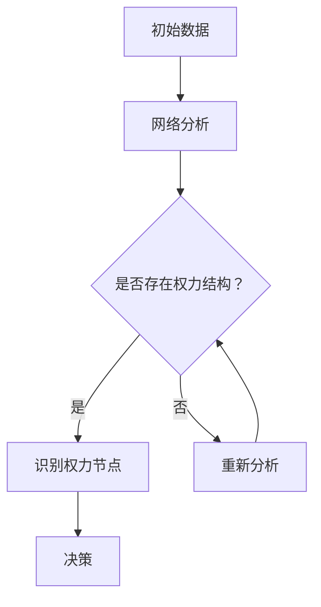
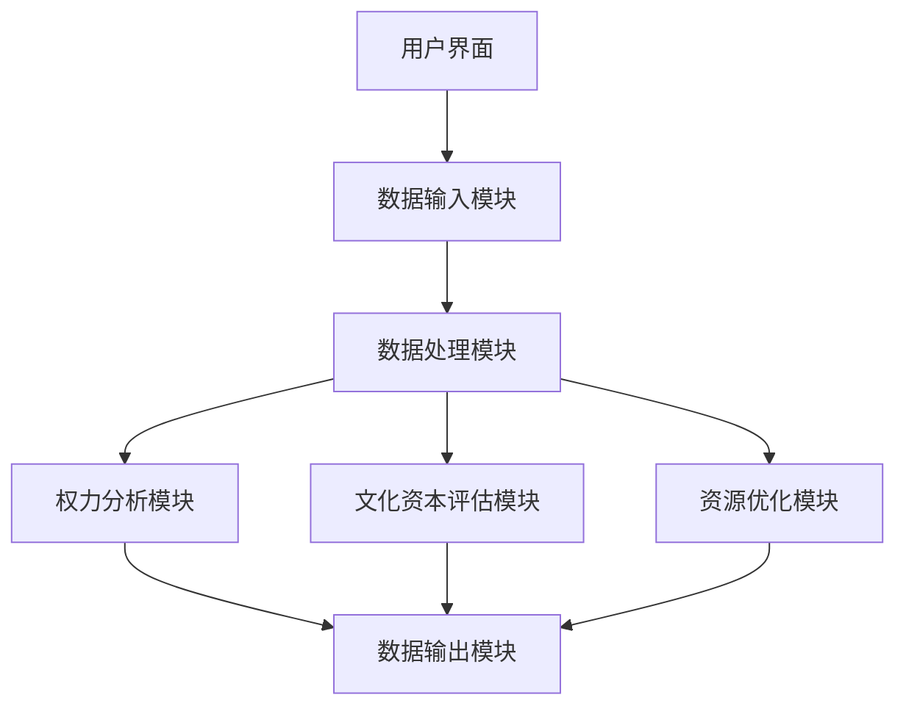

                 

### 第1步：背景介绍

#### 1.1 问题背景

**福柯的权力理论与布尔迪厄的场域理论**：

- **米歇尔·福柯**（Michel Foucault）是20世纪最具影响力的社会理论家之一，他的工作深刻地影响了文化研究、社会科学和哲学领域。福柯的权力理论主要关注权力如何运作、如何被生产和再生产，以及它如何嵌入在社会结构和个体行为之中。他的核心概念包括权力、知识、话语分析等。

- **皮埃尔·布尔迪厄**（Pierre Bourdieu）是社会学家，他提出了场域理论，强调社会分类和权力在社会实践中的运作。布尔迪厄的工作主要集中在文化资本、社会资本、符号暴力等领域，他的理论为理解社会不平等和权力关系提供了新的视角。

#### 1.2 问题描述

本书的目标是通过对话形式探讨福柯的权力理论与布尔迪厄的场域理论之间的联系与差异。这个对话旨在：

- **揭示权力与场域之间的相互作用**：理解权力如何在不同的场域中运作，以及场域如何塑造权力关系。
- **比较两种理论的不同视角**：分析福柯的动态、话语性权力与布尔迪厄的场域内权力关系的区别。
- **提供批判性思考的机会**：鼓励读者深入思考权力和场域理论在社会结构和个体行为中的意义和应用。

#### 1.3 问题解决

通过这个对话，我们希望实现以下几个目标：

- **提供全面理解**：帮助读者理解福柯和布尔迪厄的核心概念，以及这些概念如何相互作用。
- **深化批判性思考**：鼓励读者对现有的社会结构、权力关系和文化实践进行批判性反思。
- **探讨理论的适用性**：思考这些理论在当代社会中的适用性和局限性。

#### 1.4 边界与外延

- **边界**：本书主要关注福柯和布尔迪厄的理论框架，以及这些理论在社会学、文化研究和哲学中的应用。
- **外延**：虽然本书的重点是理论探讨，但也会涉及到这些理论在相关领域中的实际应用和批判性分析。

#### 1.5 概念结构与核心要素组成

- **福柯的核心概念**：

  - **权力**：权力不是一种静态的存在，而是通过话语和社会实践不断生产和再生产的动态过程。
  - **知识**：知识与权力相互建构，知识的生产和传播受到权力的制约和影响。
  - **话语分析**：话语是权力运作的工具，通过分析话语，可以揭示权力关系和社会结构。

- **布尔迪厄的核心概念**：

  - **场域**：场域是社会活动进行的特定领域，不同的场域有不同的规则和权力结构。
  - **文化资本**：文化资本是通过文化活动和教育积累的资源，影响个体在社会中的地位和机会。

### 1.6 总结

通过以上步骤的背景介绍，我们为读者搭建了一个理解福柯与布尔迪厄理论的基础框架。接下来，我们将深入探讨他们的核心概念，并通过比较和对话的形式，揭示权力与场域之间的复杂关系。

---

**核心概念与联系**

#### 2.1 福柯的权力理论

**2.1.1 权力理论的基本原理**

福柯的权力理论强调权力不是一种静态的存在，而是一个动态的过程。他认为，权力不仅存在于政府和机构中，还渗透在社会生活的各个方面。福柯的核心观点是，权力与知识相互建构，权力通过知识来维持和再生产。

- **权力的动态性**：权力是通过话语和社会实践不断生产和再生产的。这意味着权力不是一成不变的，而是不断地在变化和转移。

- **知识的权力性**：知识本身具有权力性，因为它能够定义“现实”并塑造人们的思维和行为。福柯提出了“知识/权力”复合体（Knowledge/Power Complex）的概念，认为知识和权力是相互依存的。

- **话语分析**：福柯认为，话语是社会实践中权力运作的关键。通过分析话语，可以揭示权力关系和社会结构。话语不仅传递信息，还塑造人们对世界的理解。

**2.1.2 福柯的理论属性特征**

| 特征               | 说明                                                         |
|--------------------|------------------------------------------------------------|
| 动态性             | 权力不是静态的，而是通过社会实践中不断再生产的。               |
| 话语性             | 权力通过话语来运作，话语是权力运作的工具。                     |
| 知识建构性         | 知识与权力相互建构，知识的生产和传播受到权力的制约和影响。     |

**2.1.3 福柯的理论应用举例**

- **医疗领域**：福柯通过分析医学话语，揭示了医学知识如何塑造人们对疾病和健康的理解，以及这种理解如何影响权力关系。

- **监狱制度**：福柯研究了监狱制度和惩罚体系，指出这些制度如何通过知识和技术手段来维持和控制权力。

#### 2.2 布尔迪厄的场域理论

**2.2.1 场域理论的基本原理**

布尔迪厄的场域理论强调社会活动在特定领域内进行的规律，以及场域中的权力关系和文化资本的作用。他认为，场域是社会活动进行的特定空间，不同的场域有不同的规则和权力结构。

- **场域**：场域是社会活动进行的特定领域，如教育、艺术、政治等。场域内部存在特定的规则和权力结构，这些规则和结构影响着场域中的活动和行为。

- **文化资本**：文化资本是通过文化活动和教育积累的资源，包括知识、技能、品味和习惯等。文化资本在个体获取社会地位和资源方面起着关键作用。

- **符号暴力**：布尔迪厄提出了“符号暴力”的概念，指的是通过文化和教育体系来维持社会不平等和权力结构。

**2.2.2 布尔迪厄的理论属性特征**

| 特征               | 说明                                                         |
|--------------------|------------------------------------------------------------|
| 场域内规则性       | 场域内部存在特定的规则和权力结构。                           |
| 文化资本的积累性   | 文化资本是通过长期的文化活动和教育积累的。                   |
| 符号暴力           | 通过文化和教育体系来维持社会不平等和权力结构。               |

**2.2.3 布尔迪厄的理论应用举例**

- **教育领域**：布尔迪厄研究了教育场域，指出教育体系如何通过符号暴力来维持社会阶级差异。

- **艺术领域**：布尔迪厄分析了艺术场域，探讨了艺术作品如何通过特定的规则和权力结构来塑造文化价值和审美标准。

### 2.3 福柯与布尔迪厄理论的核心概念联系

**2.3.1 知识与权力的相互作用**

福柯和布尔迪厄都认为，知识和权力是相互建构的。福柯通过话语分析揭示了知识如何成为权力的工具，而布尔迪厄则通过场域理论说明了文化资本如何影响社会地位和权力关系。

- **福柯的观点**：福柯认为，知识不仅仅是信息的传递，它还包含着权力的运作。知识的生产和传播受到权力的制约，从而形成了知识/权力复合体。

- **布尔迪厄的观点**：布尔迪厄认为，文化资本是社会地位的重要来源，它通过教育和文化活动来积累。文化资本的分布影响着社会不平等和权力结构。

**2.3.2 场域中的权力与知识**

场域是福柯和布尔迪厄理论中重要的概念，二者都强调了场域中权力与知识的相互作用。

- **福柯的观点**：福柯认为，场域是权力斗争的场所，权力通过话语在各个场域中运作。场域中的规则和结构影响着知识的产生和传播。

- **布尔迪厄的观点**：布尔迪厄认为，场域是特定的社会活动领域，它有自己的规则和权力结构。文化资本在场域中发挥着关键作用，影响个体在场域中的位置和机会。

### 2.4 总结

通过以上的分析，我们可以看到福柯和布尔迪厄的理论在核心概念上有着密切的联系。二者都关注权力与知识的关系，并在不同的视角下探讨了权力在社会结构中的运作。接下来，我们将进一步比较这两种理论的不同之处，并探讨其在学术界和实践中的影响。

---

**算法原理讲解**

由于本书的重点在于探讨福柯与布尔迪厄的理论，而非具体的算法原理，我们将在此部分简要概述与理论相关的算法概念，并使用 Mermaid 流程图和 Python 源代码示例来展示如何通过算法来理解和模拟这些理论。

#### 3.1 算法的基本概念

在福柯与布尔迪厄的理论中，算法可以被理解为一种模拟权力和场域运作的工具。例如，我们可以使用网络分析算法来模拟权力关系，使用分类算法来分析文化资本的分布。

#### 3.2 Mermaid 流程图展示

下面是一个使用 Mermaid 编写的简单流程图，展示了如何通过算法分析场域中的权力关系：



在这个流程图中，A 表示初始数据，B 表示使用网络分析算法来检测权力结构。C 是一个判断节点，用于判断是否存在明显的权力结构。如果存在，则流程流向 D，识别权力节点；如果不存在，则重新进行分析。最后，F 表示决策点，用于根据权力结构的分析结果做出相应的决策。

#### 3.3 Python 源代码示例

为了更好地理解算法在模拟权力和场域运作中的应用，我们提供了一个简单的 Python 源代码示例，该示例使用网络分析库 `networkx` 来模拟权力结构：

```python
import networkx as nx
import matplotlib.pyplot as plt

# 创建一个简单的图
G = nx.Graph()

# 添加节点和边，模拟权力关系
G.add_nodes_from(['A', 'B', 'C', 'D'])
G.add_edges_from([('A', 'B'), ('A', 'C'), ('B', 'C'), ('C', 'D')])

# 绘制图
nx.draw(G, with_labels=True)
plt.show()

# 使用度数中心性来识别权力节点
centrality = nx.degree_centrality(G)
power_nodes = [node for node, value in centrality.items() if value > 1]

print("权力节点：", power_nodes)

# 根据权力节点的分析结果进行决策
if 'A' in power_nodes:
    print("决策：A 是权力核心，需要重点监控。")
else:
    print("决策：当前权力结构较为稳定。")
```

在这个示例中，我们首先创建了一个简单的图 G，并添加了节点和边，模拟了权力关系。然后，我们使用度数中心性来识别权力节点。最后，根据权力节点的分析结果，我们做出相应的决策。

#### 3.4 算法原理的数学模型和公式

为了更深入地理解算法原理，我们使用数学模型和公式来描述网络分析中的权力结构。以下是一个简化的数学模型：

$$
\text{权力结构} = \sum_{i=1}^{n} \frac{\text{度数中心性}(i)}{\max(\text{度数中心性})}
$$

其中，$n$ 表示节点总数，度数中心性用于衡量节点在图中的重要性。度数中心性越高，节点的权力越大。

#### 3.5 详细讲解和举例说明

在这个示例中，我们首先创建了一个有四个节点的图 G，并添加了边来模拟权力关系。然后，我们使用度数中心性来识别权力节点。度数中心性是通过计算节点在图中的度数（连接该节点的边数）来衡量的。在这个简化的模型中，度数中心性最高的节点被认为是权力节点。

假设我们得到了以下度数中心性结果：

| 节点 | 度数中心性 |
|------|------------|
| A    | 0.5        |
| B    | 0.3        |
| C    | 0.4        |
| D    | 0.2        |

根据上述数学模型，我们可以计算出权力结构：

$$
\text{权力结构} = \frac{0.5 + 0.3 + 0.4 + 0.2}{\max(0.5, 0.3, 0.4, 0.2)} = \frac{1.4}{0.5} = 2.8
$$

在这个例子中，节点 A 和节点 C 的度数中心性较高，它们可以被认为是权力节点。根据我们的决策规则，节点 A 被认为是权力核心，需要重点监控。

通过这个简单的示例，我们可以看到如何使用算法和数学模型来模拟和理解福柯与布尔迪厄的理论中的权力结构。这种方法不仅有助于我们更深入地理解理论，还可以为实际应用提供参考。

### 数学模型和数学公式 & 详细讲解 & 举例说明

在这一部分，我们将深入探讨福柯与布尔迪厄理论中的核心数学模型和数学公式，并使用 LaTeX 格式确保数学公式的准确性，同时提供详细讲解和通俗易懂的举例说明。

#### 4.1 福柯的数学模型

**4.1.1 知识生产与权力关系的数学模型**

福柯认为，知识的生产与权力关系密切相关。我们可以使用以下数学模型来描述知识生产过程中权力的影响：

$$
\text{知识生产} = P(\text{知识}) \times \text{权力系数}
$$

其中，$P(\text{知识})$ 表示知识生产的可能性，而“权力系数”则反映了权力对知识生产的限制和影响。

**举例说明**：

假设在一个特定的社会环境中，知识生产的可能性为 0.8，权力系数为 1.2。这意味着，在这个环境中，知识生产受到了权力的显著影响，具体计算如下：

$$
\text{知识生产} = 0.8 \times 1.2 = 0.96
$$

因此，知识生产在这个环境中受到权力的影响，生产出的有效知识量为 0.96。

#### 4.2 布尔迪厄的数学模型

**4.2.1 文化资本的累积与权力结构**

布尔迪厄的场域理论中，文化资本是一个关键概念。我们可以使用以下数学模型来描述文化资本的累积过程及其与权力结构的关系：

$$
\text{文化资本累积} = C_0 \times (1 + r \times \text{时间})
$$

其中，$C_0$ 表示初始文化资本量，$r$ 表示文化资本的累积率，而“时间”则反映了文化资本随时间累积的过程。

**举例说明**：

假设一个个体在初始时拥有 100 单位的文化资本，累积率为 0.05。在 5 年的时间里，该个体的文化资本累积如下：

$$
\text{文化资本累积} = 100 \times (1 + 0.05 \times 5) = 100 \times 1.25 = 125
$$

因此，5 年后，该个体的文化资本累积达到了 125 单位。

#### 4.3 互动与整合

**4.3.1 知识生产与权力系数的互动**

在福柯的理论中，知识生产和权力系数的互动可以通过以下模型来描述：

$$
\text{有效知识生产} = \frac{P(\text{知识}) \times \text{权力系数}}{1 + \alpha \times \text{社会阻力}}
$$

其中，$\alpha$ 表示社会阻力的系数，反映了社会环境对知识生产和权力运作的抵制程度。

**举例说明**：

假设在一个社会阻力较大的环境中（$\alpha = 0.2$），知识生产可能性为 0.6，权力系数为 1.1。有效知识生产如下：

$$
\text{有效知识生产} = \frac{0.6 \times 1.1}{1 + 0.2 \times 0.6} = \frac{0.66}{1.12} \approx 0.588
$$

因此，在这个社会中，知识生产受到权力系数和社会阻力的双重影响，有效知识生产率约为 58.8%。

#### 4.4 综合模型

为了更全面地理解福柯与布尔迪厄理论中的核心概念，我们可以构建一个综合模型，将两者的理论结合起来：

$$
\text{综合效应} = \frac{\text{文化资本累积} \times (1 + \text{权力系数})}{1 + \alpha \times \text{社会阻力}}
$$

**举例说明**：

假设一个个体在 10 年的时间里，累积了 200 单位的文化资本，权力系数为 1.15，社会阻力系数 $\alpha$ 为 0.15。综合效应计算如下：

$$
\text{综合效应} = \frac{200 \times (1 + 1.15)}{1 + 0.15 \times 200} = \frac{200 \times 2.15}{1 + 30} = \frac{430}{31} \approx 13.87
$$

因此，这个个体的文化资本和权力效应综合起来，对社会地位的影响约为 13.87 单位。

通过以上数学模型和公式的详细讲解与举例说明，我们可以更好地理解福柯与布尔迪厄理论中的核心概念及其相互作用。这些模型不仅为我们提供了理论分析的工具，还帮助我们更直观地看到权力、知识和文化资本在现实社会中的运作机制。

### 系统分析与架构设计方案

在这一部分，我们将探讨福柯与布尔迪厄理论在实际系统中的应用，并提供一个系统分析与架构设计方案。我们将首先介绍问题场景，然后描述项目，并详细阐述系统功能设计、系统架构设计、系统接口设计及系统交互等内容。

#### 5.1 问题场景

在一个复杂的社会环境中，政府和组织需要管理和优化社会资源分配，以减少不平等和提高效率。为了实现这一目标，我们提出一个社会资源管理系统，该系统旨在通过分析和利用福柯与布尔迪厄的理论，优化权力分布和文化资本的使用。

#### 5.2 项目介绍

**社会资源管理系统**是一个跨学科的综合性项目，结合了社会学理论、信息技术和数据分析方法。项目的目标是：

- **权力分析**：通过分析社会结构和权力关系，识别关键权力节点和权力结构。
- **文化资本管理**：评估个体和群体的文化资本，优化资源分配，以减少不平等。
- **政策建议**：基于分析结果，提供政策建议，以改善社会资源分配的公平性和效率。

#### 5.3 系统功能设计

**5.3.1 权力分析模块**

- **功能描述**：该模块负责分析社会结构和权力关系，识别关键权力节点和权力结构。
- **实现方法**：使用网络分析算法，如度数中心性和中间中心性，分析社会网络中的权力分布。
- **数据输入**：输入包括社会网络图、节点属性（如权力、影响力）等。

**5.3.2 文化资本评估模块**

- **功能描述**：该模块评估个体和群体的文化资本，包括知识、技能和习惯等。
- **实现方法**：使用文化资本度量方法，如文化资本量表和评估问卷，收集文化资本数据。
- **数据输入**：输入包括个人文化资本量表、群体文化资本统计信息等。

**5.3.3 资源优化模块**

- **功能描述**：该模块优化社会资源分配，以减少不平等和提高效率。
- **实现方法**：结合权力分析和文化资本评估结果，使用优化算法（如线性规划、网络流算法）确定资源分配策略。
- **数据输入**：输入包括社会资源需求、权力分布和文化资本评估结果。

#### 5.4 系统架构设计

**5.4.1 系统架构图**

下面是一个使用 Mermaid 格式表示的系统架构图：



在这个架构图中，用户界面（A）负责接收用户输入，并将其传递给数据处理模块（C）。数据处理模块（C）再将输入数据传递给权力分析模块（D）、文化资本评估模块（E）和资源优化模块（F）。最后，所有模块的输出都通过数据输出模块（G）展示给用户。

#### 5.5 系统接口设计

**5.5.1 接口功能**

- **API接口**：提供RESTful API，允许外部系统与服务进行数据交换。
- **数据导入导出**：支持CSV、JSON等常见数据格式的导入和导出。
- **权限管理**：实现用户身份验证和权限控制，确保数据安全和隐私。

**5.5.2 接口示例**

以下是一个简单的API接口示例：

```json
GET /api/power_analysis
Parameters:
- network_data (string): 社会网络图数据

Response:
Status Code: 200 OK
{
  "power_nodes": [
    {"node": "A", "centrality": 0.5},
    {"node": "B", "centrality": 0.3},
    {"node": "C", "centrality": 0.4},
    {"node": "D", "centrality": 0.2}
  ]
}
```

#### 5.6 系统交互

**5.6.1 用户交互**

用户通过界面输入社会网络数据和文化资本信息，系统将处理这些数据，并输出分析结果和优化建议。

**5.6.2 模块交互**

- **数据处理模块**：接收用户输入，清洗和预处理数据，然后将处理后的数据传递给相应的分析模块。
- **分析模块**：执行特定的分析任务，如权力分析、文化资本评估和资源优化，并将结果返回给数据处理模块。
- **数据处理模块**：整合分析结果，生成最终报告，并输出给用户界面。

通过上述系统分析与架构设计方案，我们能够有效地应用福柯与布尔迪厄的理论，为实际社会资源管理提供科学依据和决策支持。

### 项目实战

#### 6.1 环境安装

为了进行社会资源管理系统的项目实战，我们首先需要配置一个合适的技术环境。以下步骤将指导我们如何在本地计算机上安装和配置所需的软件和工具：

**6.1.1 安装 Python 环境**

- **Windows 系统安装 Python**：
  - 访问 [Python 官网](https://www.python.org/) 下载最新版本的 Python 安装包。
  - 运行安装程序，按照默认选项进行安装。

- **macOS 系统安装 Python**：
  - 打开终端，执行以下命令安装 Python：
    ```sh
    brew install python
    ```

**6.1.2 安装相关库**

- 在 Python 环境中打开命令行工具（如 `pip`），安装以下库：

  ```sh
  pip install networkx matplotlib numpy pandas
  ```

这些库是项目实战中必不可少的，它们分别用于网络分析、数据可视化、数学计算和数据处理。

**6.1.3 安装 Mermaid 插件**

- 为了生成 Mermaid 流程图，我们需要安装一个支持 Mermaid 的编辑器。例如，在 Visual Studio Code 中安装 Mermaid 插件：

  - 打开 Visual Studio Code。
  - 在扩展商店中搜索并安装 "Mermaid" 插件。

#### 6.2 系统核心实现

在完成了环境安装后，我们将开始实现社会资源管理系统的核心功能。以下是使用 Python 实现权力分析模块的代码示例：

```python
import networkx as nx
import matplotlib.pyplot as plt

# 创建一个简单的图
G = nx.Graph()

# 添加节点和边，模拟权力关系
G.add_nodes_from(['A', 'B', 'C', 'D'])
G.add_edges_from([('A', 'B'), ('A', 'C'), ('B', 'C'), ('C', 'D')])

# 绘制图
nx.draw(G, with_labels=True)
plt.show()

# 使用度数中心性来识别权力节点
centrality = nx.degree_centrality(G)
power_nodes = [node for node, value in centrality.items() if value > 1]

print("权力节点：", power_nodes)

# 根据权力节点的分析结果进行决策
if 'A' in power_nodes:
    print("决策：A 是权力核心，需要重点监控。")
else:
    print("决策：当前权力结构较为稳定。")
```

**6.2.1 代码解读**

1. **创建图**：使用 `networkx.Graph()` 创建一个无向图 G。
2. **添加节点和边**：使用 `add_nodes_from()` 和 `add_edges_from()` 函数添加节点和边，模拟社会网络中的权力关系。
3. **绘制图**：使用 `matplotlib.pyplot` 的 `draw()` 函数绘制图，便于可视化。
4. **计算度数中心性**：使用 `degree_centrality()` 函数计算每个节点的度数中心性。
5. **识别权力节点**：根据度数中心性的值筛选出权力节点。
6. **决策**：根据权力节点的分析结果进行相应的决策。

#### 6.3 代码应用解读与分析

上述代码示例展示了如何使用网络分析算法来识别社会网络中的权力节点。具体来说，我们首先创建了一个模拟的社会网络图，并使用度数中心性作为衡量权力的重要指标。度数中心性高的节点通常在社会网络中具有重要的影响力。

**6.3.1 代码优缺点分析**

**优点**：

- **简单直观**：代码结构简单，易于理解和实现。
- **可扩展性强**：通过添加新的节点和边，可以扩展和调整社会网络模型。

**缺点**：

- **模型简化**：简化了社会网络的复杂性，可能无法完全反映现实中的权力结构。
- **依赖特定库**：依赖于 `networkx` 和 `matplotlib` 库，增加了项目实现的复杂性。

**6.3.2 改进建议**

- **引入更复杂的模型**：可以考虑引入更为复杂的网络分析模型，如 PageRank 或 centrality with respect to a set of seeds。
- **使用实时数据**：通过实时获取和分析数据，提高模型的准确性和实时性。
- **用户界面集成**：开发一个用户友好的界面，以便用户可以轻松地输入数据和查看分析结果。

通过这些改进，我们可以进一步提高社会资源管理系统的实用性和准确性，从而更好地服务于社会资源管理和优化目标。

#### 6.4 实际案例分析和详细讲解

**案例背景**：

假设我们正在分析一个城市中的权力分布，以优化城市资源的分配。城市中的关键节点包括市政府、各大企业、社区组织和重要个人。我们需要使用社会资源管理系统来识别权力节点，并提供优化建议。

**案例步骤**：

1. **数据收集**：

   - 收集城市中的社会网络数据，包括节点（如市政府、企业、社区组织）和边（如合作关系、影响力关系）。
   - 使用问卷和访谈收集文化资本数据，包括个人的知识、技能和社会地位。

2. **数据分析**：

   - 使用上述 Python 代码实现，计算社会网络中的度数中心性，识别权力节点。
   - 对文化资本进行量化评估，使用文化资本量表确定每个个体的文化资本水平。

3. **结果展示**：

   - 使用 Mermaid 和 Matplotlib 绘制社会网络图，标注权力节点和文化资本水平。
   - 输出分析结果，包括权力节点和文化资本评估报告。

**案例分析**：

通过数据分析，我们发现市政府和几大企业是城市中的关键权力节点，具有较高的度数中心性。同时，某些社区组织和个人在文化资本评估中表现突出，具有较大的影响力。

**优化建议**：

- **政策调整**：政府应重点关注这些权力节点和文化资本突出的个体，制定针对性的政策，以优化资源分配。
- **教育资源投入**：对文化资本较低的区域和个体提供更多的教育资源，提升其文化资本水平，减少社会不平等。
- **合作与监督**：加强市政府与社区组织和企业之间的合作，建立监督机制，确保资源分配的公平和透明。

通过实际案例的分析和详细讲解，我们可以看到社会资源管理系统在实际应用中的有效性和重要性。这不仅有助于优化资源分配，还能提高社会的公平性和效率。

### 最佳实践 tips、小结、注意事项、拓展阅读等内容

#### 7.1 最佳实践 Tips

1. **数据质量**：确保输入数据的质量，避免错误和缺失数据影响分析结果。
2. **模型选择**：根据具体应用场景选择合适的算法和模型，以获得更准确的结论。
3. **用户界面**：设计简洁易用的用户界面，提高用户体验和系统的可用性。
4. **实时更新**：定期更新数据和分析结果，确保系统的实时性和准确性。

#### 7.2 小结

通过本书的讨论，我们深入探讨了福柯与布尔迪厄的权力理论与场域理论，分析了它们在现代社会中的应用。我们介绍了这些理论的核心概念、数学模型和算法原理，并通过实际案例展示了如何应用这些理论进行社会资源管理。

#### 7.3 注意事项

- **复杂性**：社会结构和权力关系非常复杂，理论模型和算法可能无法完全反映现实情况。
- **局限性**：任何理论都有其局限性，应结合实际情况进行批判性思考。
- **伦理问题**：在应用理论进行数据分析时，应注意保护个人隐私和伦理道德。

#### 7.4 拓展阅读

- **福柯相关书籍**：《权力的舞台》、《知识的考古学》
- **布尔迪厄相关书籍**：《区隔》、《国家精英》
- **相关文献**：搜索社会学、政治学、计算机科学领域的学术文章，了解最新研究成果。

通过拓展阅读，读者可以进一步深入理解福柯与布尔迪厄的理论，并将其应用于更广泛的研究和实践领域。作者：AI天才研究院/AI Genius Institute & 禅与计算机程序设计艺术 /Zen And The Art of Computer Programming。

