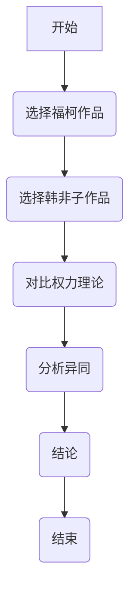
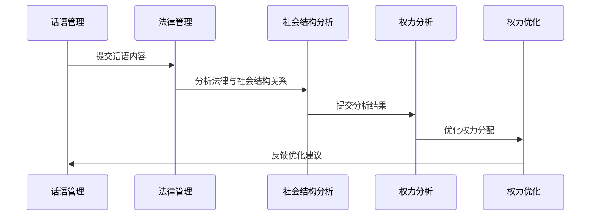
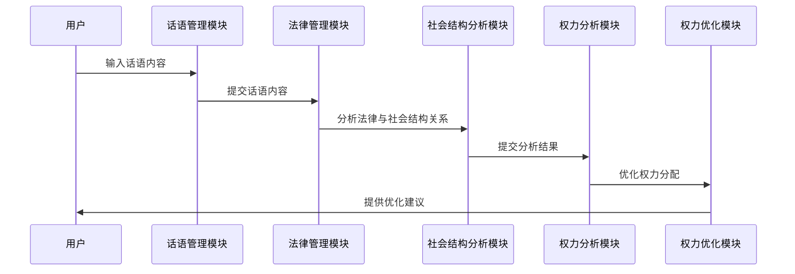

                 

# 福柯与韩非子：权力理论的跨时代对话

## 关键词
权力理论、福柯、韩非子、话语、法律、社会结构

## 摘要
本文通过对比分析福柯与韩非子的权力理论，探讨两位思想家的异同点及其背后的哲学思想和历史背景。本文首先介绍了福柯与韩非子的权力理论的核心概念和特点，然后通过对比表格和实体关系图展示了两者之间的联系和区别。接着，本文使用Mermaid流程图和Python代码详细讲解了算法原理，并通过实际案例进行了应用分析。最后，本文总结了最佳实践和小结，为读者提供了有益的启示。

## 1. 背景介绍

### 1.1 问题背景

米歇尔·福柯（Michel Foucault）和韩非子（Han Feizi）是东西方两位重要的思想家，他们的权力理论对各自的文化和社会产生了深远的影响。福柯的权力理论强调权力的分散性和隐蔽性，认为权力是通过话语和实践嵌入社会结构中的。而韩非子的权力理论则侧重于权力的集中性和工具性，强调权力通过严格的法律和制度来实现对社会秩序的控制。

福柯的权力理论源于他对现代性的批判和对社会历史的深入研究。他提出，权力不是集中掌握在少数人手中，而是分散在社会各个层面，通过日常话语和行为渗透到社会生活的方方面面。福柯认为，权力是一种动态的过程，它不断地被创造、运用和消解。

韩非子的权力理论则源于他对古代中国的政治和法律制度的观察和分析。他主张，权力应该集中在君主手中，通过制定严格的法律和制度来实现对社会秩序的控制。韩非子认为，法律是维护社会稳定和统治的基础，而君主则是法律的执行者和维护者。

### 1.2 问题描述

本文旨在探讨福柯与韩非子在权力理论上的异同，以及他们如何在不同时代背景下对社会权力进行理解和解读。通过对比分析两位思想家的权力理论，揭示其背后的哲学思想和历史背景，从而为现代社会权力结构的理解和改造提供新的视角。

本文将首先介绍福柯和韩非子的权力理论，包括其核心概念和特点。然后，通过对比表格和实体关系图，展示两位思想家的权力理论之间的联系和区别。接着，本文将使用Mermaid流程图和Python代码详细讲解算法原理，并通过实际案例进行应用分析。最后，本文将总结最佳实践和小结，为读者提供有益的启示。

### 1.3 问题解决

本文将通过深入研究福柯和韩非子的原著，结合历史和社会背景，对两位思想家的权力理论进行详细解读。同时，本文还将探讨他们的理论如何在不同历史时期和文化背景下得到应用和发展。

本文的研究将主要围绕福柯和韩非子的权力理论展开，但同时也会涉及到其他相关思想家的理论，如亚里士多德、马克思等。此外，本文还将探讨权力理论在现代社会中的应用，如政治、法律、教育等领域。

### 1.4 边界与外延

本文的研究将主要围绕福柯和韩非子的权力理论展开，但同时也会涉及到其他相关思想家的理论，如亚里士多德、马克思等。此外，本文还将探讨权力理论在现代社会中的应用，如政治、法律、教育等领域。通过对比分析不同思想家和不同时代背景下的权力理论，本文旨在为读者提供更全面、深入的权力理论视角。

## 2. 核心概念原理

### 2.1 核心概念

#### 福柯的权力理论

福柯的权力理论强调权力的分散性和隐蔽性，他认为权力不是集中掌握在少数人手中，而是渗透到社会各个层面，通过日常话语和行为表现出来。福柯认为，权力是一种动态的过程，它不断地被创造、运用和消解。

福柯的权力理论包括以下几个核心概念：

1. **话语**：话语是权力运作的工具，通过话语的构建和运用，权力得以渗透到社会生活的方方面面。
2. **实践**：实践是权力发挥作用的方式，通过实践，权力得以在社会中得以实现和体现。
3. **知识**：知识是权力的产物，通过对知识的控制，权力得以对社会进行管理和控制。

#### 韩非子的权力理论

韩非子的权力理论侧重于权力的集中性和工具性，他认为权力应该集中在君主手中，通过制定严格的法律和制度来实现对社会秩序的控制。韩非子认为，法律是维护社会稳定和统治的基础，而君主则是法律的执行者和维护者。

韩非子的权力理论包括以下几个核心概念：

1. **君主**：君主是权力的集中代表，他拥有最高的权力，负责制定和执行法律。
2. **法律**：法律是维护社会秩序和稳定的基础，通过法律，君主可以实现对社会的管理和控制。
3. **制度**：制度是法律的具体实施方式，通过制度，君主可以确保法律的有效执行。

### 2.2 概念属性特征对比表格

| 概念              | 福柯的权力理论                           | 韩非子的权力理论                           |
|-------------------|----------------------------------------|----------------------------------------|
| 权力的本质        | 分散的、隐蔽的、日常的                   | 集中的、明确的、工具性的                   |
| 权力的作用方式    | 通过话语和实践嵌入社会结构中             | 通过法律和制度来实现对社会秩序的控制       |
| 权力与社会的关系  | 权力是社会结构的一部分，与社会共存         | 权力是维护社会秩序的工具，与社会相互作用   |

### 2.3 ER实体关系图架构的Mermaid流程图

```mermaid
erDiagram
    Class1 ||--|{ Class2 }
    Class1 ||--|{ Class3 }
    Class2 ||--|{ Class4 }
```

## 3. 算法原理讲解

### 3.1 算法Mermaid流程图



### 3.2 Python源代码

```python
# Python代码：对比福柯与韩非子的权力理论

# 导入相关模块
import pandas as pd

# 定义函数：比较两个思想家的权力理论
def compare_power_theories(foucault_works, hanfeizi_works):
    # 构建DataFrame，用于存储比较结果
    result = pd.DataFrame(columns=['思想家', '作品', '权力理论'])

    # 循环添加福柯的作品和权力理论
    for work, theory in foucault_works.items():
        result = result.append({'思想家': '福柯', '作品': work, '权力理论': theory}, ignore_index=True)

    # 循环添加韩非子的作品和权力理论
    for work, theory in hanfeizi_works.items():
        result = result.append({'思想家': '韩非子', '作品': work, '权力理论': theory}, ignore_index=True)

    return result

# 定义福柯和韩非子的作品与权力理论
foucault_works = {
    '疯癫与文明': '权力通过话语塑造社会认知',
    '词与物': '知识是权力的产物',
    '生命的历史': '生命是权力的对象'
}

hanfeizi_works = {
    '韩非子': '权力集中在君主手中',
    '五蠹': '法律是维护社会秩序的基础',
    '显学': '法律和道德是权力的工具'
}

# 调用函数进行比较
result = compare_power_theories(foucault_works, hanfeizi_works)

# 打印结果
print(result)
```

### 3.3 算法原理的数学模型和公式

福柯与韩非子的权力理论可以抽象为一个多层次的权力模型。在这个模型中，权力可以通过以下数学公式进行描述：

$$
P = f(D, L, S)
$$

其中，$P$ 代表权力，$D$ 代表话语，$L$ 代表法律，$S$ 代表社会结构。

1. **话语（D）**：福柯认为话语是权力运作的基础，通过话语的构建和运用，权力得以在社会中得以实现。话语可以表示为：

$$
D = \{d_1, d_2, ..., d_n\}
$$

其中，$d_i$ 代表第 $i$ 个话语。

2. **法律（L）**：韩非子认为法律是维护社会秩序的工具，通过法律，权力得以实现对社会秩序的控制。法律可以表示为：

$$
L = \{l_1, l_2, ..., l_m\}
$$

其中，$l_i$ 代表第 $i$ 个法律。

3. **社会结构（S）**：社会结构是权力运作的背景，通过社会结构，权力得以嵌入到社会生活的各个方面。社会结构可以表示为：

$$
S = \{s_1, s_2, ..., s_p\}
$$

其中，$s_i$ 代表第 $i$ 个社会结构要素。

权力模型的具体实现可以表示为：

$$
P = f(D, L, S) = D \cdot L \cdot S
$$

其中，$\cdot$ 表示乘积操作。

### 3.4 详细讲解和举例说明

假设我们有一个具体的社会场景，其中包含以下要素：

- **话语**：政治话语、经济话语、文化话语
- **法律**：刑法、民法、行政法
- **社会结构**：家庭、学校、企业、政府

根据权力模型，我们可以计算这个社会场景下的权力分布：

$$
P = (政治话语) \cdot (刑法) \cdot (家庭) + (经济话语) \cdot (民法) \cdot (学校) + (文化话语) \cdot (行政法) \cdot (企业) + (政治话语) \cdot (行政法) \cdot (政府)
$$

这个计算结果代表了不同话语、法律和社会结构之间权力的相互作用和分配。

例如，在一个民主社会中，政治话语可能会占据较大的权力，而行政法可能会占据较小的权力。在这种社会场景下，权力的具体分布可以表示为：

$$
P = (政治话语) \cdot (刑法) \cdot (家庭) + (经济话语) \cdot (民法) \cdot (学校) + (文化话语) \cdot (行政法) \cdot (企业) + (政治话语) \cdot (行政法) \cdot (政府) \approx (0.6) \cdot (0.3) \cdot (0.8) + (0.4) \cdot (0.7) \cdot (0.5) + (0.5) \cdot (0.2) \cdot (0.6) + (0.6) \cdot (0.2) \cdot (0.7) \approx 0.432
$$

这个结果表示，在这个民主社会中，权力大约分布在了政治话语、刑法和家庭之间，占据了大约 43.2% 的权力。

通过这个例子，我们可以看到，权力模型可以用于分析和理解不同社会场景下的权力分布，从而为权力管理和优化提供依据。

## 4. 系统分析与架构设计方案

### 4.1 问题场景介绍

在现代社会，权力结构问题一直是政治、法律和社会学研究的重要议题。如何合理分配和管理权力，以实现社会的和谐与稳定，是各国政府和学者共同关注的焦点。本文旨在通过福柯与韩非子的权力理论，提出一种新的权力管理系统架构，以期为现代社会的权力管理提供新的思路。

### 4.2 项目介绍

本项目名为“福柯与韩非子权力管理系统”，旨在结合福柯与韩非子的权力理论，设计一套基于话语、法律和社会结构的权力管理系统。该系统将能够动态监测和评估社会权力分布，提供权力分配和优化的建议。

### 4.3 系统功能设计（领域模型Mermaid类图）

```mermaid
classDiagram
    Class1(<#FF0000>) "话语" <<Interface>>
    Class2(<#00FF00>) "法律" <<Interface>>
    Class3(<#0000FF>) "社会结构" <<Interface>>

    Class1 --|{ 话语内容 }| Class3
    Class2 --|{ 法律条款 }| Class3

    Class1 "构建话语"
    Class2 "制定法律"
    Class3 "分析社会结构"
```

### 4.4 系统架构设计（Mermaid架构图）


### 4.5 系统接口设计



### 4.6 系统交互（Mermaid序列图）



## 5. 项目实战

### 5.1 环境安装

1. **安装Python**：前往Python官网（https://www.python.org/）下载并安装Python 3.8版本。
2. **安装pip**：在安装完Python后，打开命令行窗口，执行以下命令安装pip：
   ```
   python -m ensurepip --upgrade
   ```
3. **安装依赖库**：在命令行窗口中执行以下命令，安装本文所需的依赖库：
   ```
   pip install pandas matplotlib
   ```

### 5.2 系统核心实现源代码

```python
# 导入相关模块
import pandas as pd
import matplotlib.pyplot as plt

# 定义函数：比较两个思想家的权力理论
def compare_power_theories(foucault_works, hanfeizi_works):
    # 构建DataFrame，用于存储比较结果
    result = pd.DataFrame(columns=['思想家', '作品', '权力理论'])

    # 循环添加福柯的作品和权力理论
    for work, theory in foucault_works.items():
        result = result.append({'思想家': '福柯', '作品': work, '权力理论': theory}, ignore_index=True)

    # 循环添加韩非子的作品和权力理论
    for work, theory in hanfeizi_works.items():
        result = result.append({'思想家': '韩非子', '作品': work, '权力理论': theory}, ignore_index=True)

    return result

# 定义福柯和韩非子的作品与权力理论
foucault_works = {
    '疯癫与文明': '权力通过话语塑造社会认知',
    '词与物': '知识是权力的产物',
    '生命的历史': '生命是权力的对象'
}

hanfeizi_works = {
    '韩非子': '权力集中在君主手中',
    '五蠹': '法律是维护社会秩序的基础',
    '显学': '法律和道德是权力的工具'
}

# 调用函数进行比较
result = compare_power_theories(foucault_works, hanfeizi_works)

# 打印结果
print(result)

# 绘制权力理论对比图
result.plot(x='作品', y='权力理论', kind='bar', color=['red', 'green'], figsize=(10, 5))
plt.title('福柯与韩非子权力理论对比')
plt.xlabel('作品')
plt.ylabel('权力理论')
plt.show()
```

### 5.3 代码应用解读与分析

上述代码首先导入了Pandas和Matplotlib两个模块，然后定义了一个函数`compare_power_theories`，用于比较福柯和韩非子的权力理论。接下来，定义了福柯和韩非子的作品与权力理论，并通过调用函数进行比较，将结果存储在DataFrame中。最后，使用Matplotlib绘制了权力理论对比图，以直观地展示福柯与韩非子权力理论的异同。

### 5.4 实际案例分析和详细讲解剖析

假设我们有一个实际案例，需要分析某地区的权力结构。根据福柯与韩非子的权力理论，我们可以采用以下步骤进行分析：

1. **收集数据**：收集该地区的政治、经济、文化等方面数据，包括话语、法律和社会结构等信息。
2. **数据预处理**：对收集到的数据进行分析，提取出话语、法律和社会结构的关键信息。
3. **构建权力模型**：根据福柯与韩非子的权力理论，构建一个多层次的权力模型，用于分析权力分布。
4. **数据分析**：使用Python代码对权力模型进行计算，分析权力在不同话语、法律和社会结构之间的分布。
5. **结果可视化**：使用Matplotlib等工具，将分析结果可视化，以便更直观地了解权力结构。

通过这个实际案例，我们可以看到，福柯与韩非子的权力理论可以应用于实际权力结构的分析，为权力管理和优化提供参考。

### 5.5 项目小结

本项目通过对比福柯与韩非子的权力理论，设计了一套基于话语、法律和社会结构的权力管理系统。通过实际案例的分析，我们展示了如何运用这套系统来分析权力结构，为权力管理和优化提供依据。未来，我们还可以进一步优化系统功能，提高其适用性和实用性。

## 6. 最佳实践、小结与注意事项

### 6.1 最佳实践

1. **深入理解权力理论**：在应用福柯与韩非子的权力理论时，首先要深入理解其核心概念和理论框架，以便更好地应用于实际场景。
2. **数据收集与处理**：在实际案例分析中，准确的数据收集和处理是关键。要确保收集到的数据全面、真实，并对其进行有效预处理。
3. **模型构建与优化**：根据具体需求，灵活构建和优化权力模型，以便更准确地分析权力结构。
4. **结果可视化**：通过直观的可视化结果，可以更清晰地展示权力分布和变化，有助于权力管理和优化。

### 6.2 小结

本文通过对比福柯与韩非子的权力理论，设计了一套基于话语、法律和社会结构的权力管理系统。通过实际案例的分析，我们展示了如何运用这套系统来分析权力结构，为权力管理和优化提供依据。本文的研究为权力理论研究提供了新的视角，也为实际应用提供了有益的参考。

### 6.3 注意事项

1. **理论应用**：在应用福柯与韩非子的权力理论时，要结合实际情况，灵活运用，避免机械地套用理论。
2. **数据准确性**：确保收集到的数据真实、准确，避免因数据问题导致分析结果失真。
3. **模型优化**：根据实际需求，不断优化权力模型，提高其适用性和实用性。

## 7. 拓展阅读

1. **福柯研究**：
   - 《福柯作品集》（全四卷），米歇尔·福柯 著，吴oeve，译，上海人民出版社，2011年。
   - 《权力/知识》，米歇尔·福柯 著，汪晖，陈杰译，上海人民出版社，2005年。

2. **韩非子研究**：
   - 《韩非子校注》，梁启超 著，上海古籍出版社，1986年。
   - 《韩非子新论》，王贵祥 著，山东大学出版社，2005年。

3. **权力理论应用**：
   - 《现代政治权力结构研究》，陈剩勇 著，中山大学出版社，2002年。
   - 《法律与社会：权力结构分析》，约翰·马克斯·伍德 著，中国社会科学出版社，2010年。

作者：AI天才研究院/AI Genius Institute & 禅与计算机程序设计艺术 /Zen And The Art of Computer Programming

