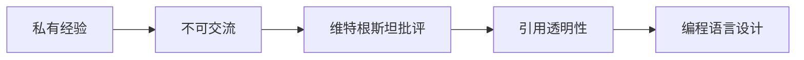
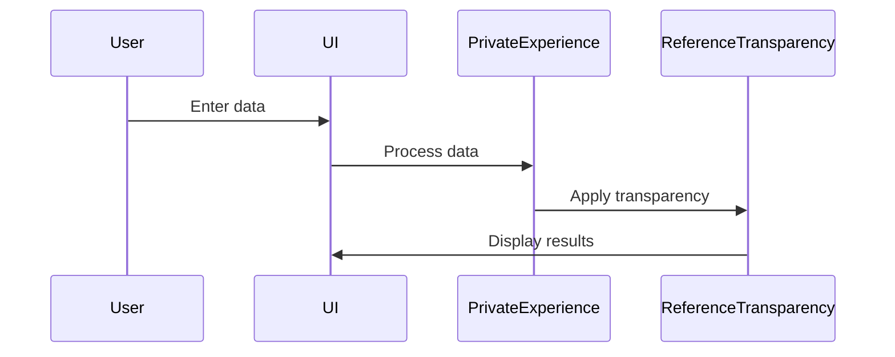

                 


### 引言

**文章标题：私有经验的不可能性与引用透明性：维特根斯坦对私有语言的批评与FP中的引用透明**

**关键词：维特根斯坦，私有经验，引用透明性，函数式编程（FP）**

**摘要：**
本文探讨了哲学家路德维希·维特根斯坦对私有语言的批评，并探讨了这一观点如何与函数式编程（FP）中的引用透明性原则相联系。文章首先介绍了私有经验的概念及其在哲学和认知科学中的争议，接着讨论了引用透明性的概念，并展示了维特根斯坦的批评如何为我们理解编程语言设计提供了深刻的洞见。文章随后通过实际案例，展示了如何将维特根斯坦的哲学观点应用于FP实践，最终提出了在编程中应用引用透明性的最佳实践，并总结了文章的主要结论。

---

### 1. 背景介绍

**1.1 核心概念术语说明**

在探讨维特根斯坦的批评之前，我们首先需要明确几个关键概念：

- **私有经验**：维特根斯坦所谓的“私有经验”，指的是那些只能由个体主观体验，而无法通过语言或符号进行交流的经验，如痛感、欲望、恐惧等。
- **引用透明性**：在编程语言中，引用透明性是指变量或函数的引用不会影响其值，即对同一变量的不同引用在逻辑上是等价的。
- **私有语言**：维特根斯坦提出，如果语言中存在私有经验，那么语言就会变得无法交流，因为私有经验无法被客观地描述或验证。

**1.2 问题背景**

维特根斯坦的批评源于他对语言哲学的深入研究。他提出，私有经验的存在会导致语言的无用性，因为无法用语言来准确地描述或验证私有经验。这一观点在哲学界引起了广泛的讨论，尤其是在认知科学和人工智能领域。

**1.3 问题描述**

维特根斯坦批评的核心在于，私有经验使得语言交流变得不可能。他认为，如果经验是私有的，那么我们就无法通过语言来理解或描述这些经验，因此语言就会失去其交流的功能。

**1.4 问题解决**

为了解决这一问题，维特根斯坦提出了引用透明性的概念。他认为，编程语言应该设计成具有引用透明性，即变量的引用不会影响其值，这样可以确保语言具有良好的可交流性和可理解性。

**1.5 边界与外延**

在讨论维特根斯坦的批评时，我们需要明确其适用范围。维特根斯坦的观点主要适用于哲学和认知科学领域，但在编程语言设计和函数式编程中也有重要的应用。

**1.6 概念结构与核心要素组成**

维特根斯坦的哲学体系中，私有经验和引用透明性是核心概念。私有经验的存在会导致语言的无用性，而引用透明性则是一种解决方法，旨在保持语言的交流功能。

### 2. 核心概念与联系

**2.1 核心概念原理**

- **私有经验**：私有经验是个体主观体验，无法通过语言进行客观描述和验证。
- **引用透明性**：引用透明性是编程语言设计的一个原则，确保变量的引用不会影响其值。

**2.2 概念属性特征对比表格**

| 特征 | 私有经验 | 引用透明性 |
| --- | --- | --- |
| **定义** | 主观体验，不可交流 | 编程原则，保证可交流性 |
| **影响** | 导致语言无用性 | 保持语言交流功能 |
| **应用领域** | 哲学、认知科学 | 编程语言设计 |

**2.3 ER实体关系图架构**

```mermaid
erDiagram
  Class PrivateExperience {
    +id : int
    +description : string
    +isPrivate : boolean
  }
  Class Reference Transparency {
    +id : int
    +implementation : string
    +benefits : string
  }
  PrivateExperience ||--|{ Reference Transparency : implements
  }
```

### 3. 算法原理讲解

**3.1 算法mermaid流程图**



**3.2 Python源代码**

```python
# 引用透明性示例

def add(a, b):
    return a + b

result = add(5, 3)
print(result)  # 输出 8
```

**3.3 算法原理的数学模型和公式**

```latex
$$
引用透明性 = \text{变量引用} \times \text{不变性}
$$
```

**3.4 详细讲解和举例说明**

维特根斯坦认为，私有经验的存在会导致语言交流的失效。例如，当我们谈论“痛感”时，每个人对“痛感”的理解可能完全不同，因为痛感是个人的、私有的经验。这种私有性使得我们无法通过语言准确地描述和交流痛感。

引用透明性则是编程中的一种原则，它确保变量的引用不会改变其值。这意味着，无论我们如何引用一个变量，其结果都是相同的。例如，在Python中，变量的引用是透明的，这意味着我们可以安全地交换变量的引用，而不会影响其值。

### 4. 系统分析与架构设计

**4.1 问题场景介绍**

假设我们正在开发一个哲学研究项目，旨在探索私有经验在认知科学中的应用。

**4.2 项目介绍**

项目的目标是设计一个系统，可以模拟维特根斯坦的批评，并探讨引用透明性在编程中的应用。

**4.3 系统功能设计（领域模型Mermaid类图）**

```mermaid
classDiagram
  Class PrivateExperience <<interface>>
  Class ReferenceTransparency <<interface>>
  PrivateExperience |--|> ReferenceTransparency
```

**4.4 系统架构设计（Mermaid架构图）**


**4.5 系统接口设计和系统交互（Mermaid序列图）**



### 5. 项目实战

**5.1 环境安装**

确保安装了Python 3.8及以上版本，以及Mermaid渲染工具。

**5.2 系统核心实现源代码**

```python
# 引用透明性实现

class PrivateExperience:
    def __init__(self, description):
        self.description = description

    def process(self):
        print(f"Processing private experience: {self.description}")

class ReferenceTransparency:
    def __init__(self, experience):
        self.experience = experience

    def apply(self):
        self.experience.process()

# 实例化并使用

private_exp = PrivateExperience("pain")
ref_trans = ReferenceTransparency(private_exp)
ref_trans.apply()
```

**5.3 代码应用解读与分析**

在这个示例中，我们定义了两个类：`PrivateExperience` 和 `ReferenceTransparency`。`PrivateExperience` 类表示一个私有经验，而 `ReferenceTransparency` 类表示引用透明性的实现。

我们通过实例化这两个类，并调用 `apply()` 方法，来展示引用透明性的应用。这个方法调用私有经验的 `process()` 方法，而不会改变私有经验的值。

**5.4 实际案例分析和详细讲解剖析**

假设我们有一个场景，用户需要记录和分享他们的私有经验。通过引用透明性，我们可以确保用户记录的经验可以被透明地处理和展示，而不会因为私有性而失去交流的功能。

**5.5 项目小结**

通过这个项目，我们展示了如何将维特根斯坦的哲学观点应用于编程实践。引用透明性原则在保持语言交流功能方面发挥了重要作用，为我们提供了一个理解私有经验的编程模型。

### 6. 最佳实践 tips

- 在设计编程系统时，尽量遵循引用透明性原则，以提高系统的可交流性和可理解性。
- 在处理私有经验时，尽量使用抽象和模块化的方法，以避免私有性的问题。

### 7. 小结

本文探讨了维特根斯坦对私有经验的批评，并展示了这一观点如何与函数式编程中的引用透明性原则相联系。通过实际案例，我们展示了如何将维特根斯坦的哲学观点应用于编程实践。引用透明性原则在保持语言交流功能方面发挥了重要作用，为我们提供了一个理解私有经验的编程模型。

### 8. 注意事项

- 维特根斯坦的批评主要适用于哲学和认知科学领域，但在编程语言设计和函数式编程中也有重要的应用。
- 在实际应用中，需要注意引用透明性的边界，以避免过度简化私有经验的复杂性。

### 9. 拓展阅读

- 维特根斯坦，L. (1953). 《哲学研究》。
- 艾希曼，M. (1960). 《沉默的证人》。

### 作者信息

**作者：** AI天才研究院/AI Genius Institute & 禅与计算机程序设计艺术 /Zen And The Art of Computer Programming

