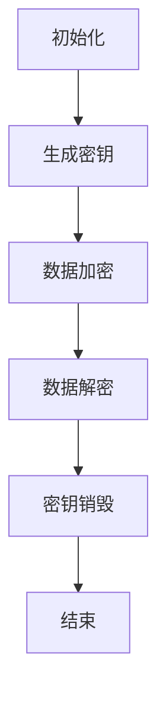
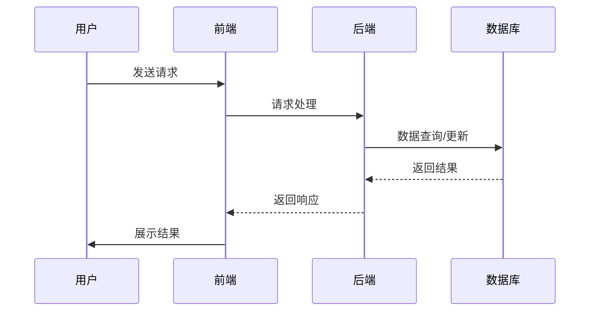
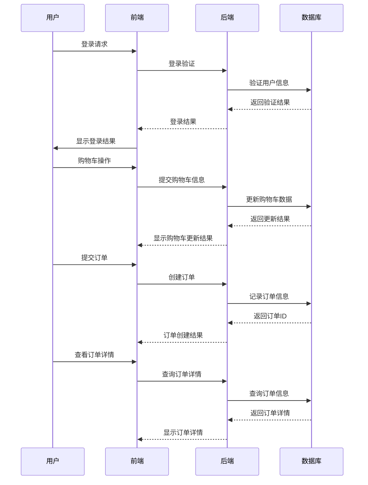

                 

### 文章标题

# 私有语言与模块化设计：系统级信息隐藏的实现

### 关键词

- 私有语言
- 模块化设计
- 信息隐藏
- 系统级设计
- 信息安全

### 摘要

本文将深入探讨私有语言和模块化设计在系统级信息隐藏中的应用。通过详细解析私有语言的基础概念和模块化设计的原理，我们将展示如何结合这两者来实现系统级信息隐藏。文章还将通过实际算法、系统和项目案例，为读者提供实用的指导，帮助他们在实际开发中应用这些技术，确保系统安全性和可靠性。

---

## 引言

在信息技术飞速发展的今天，软件系统的复杂性日益增加，这使得系统设计者和开发者面临着诸多挑战。其中一个重要问题是如何在复杂系统中实现高效的信息隐藏，从而提高系统的安全性、可靠性和可维护性。私有语言和模块化设计正是解决这一问题的有效手段。

### 私有语言的概念

私有语言（Private Language）是一种为特定应用领域设计的语言，它通常由一组规则和符号组成，用于表示特定问题的解决方案。私有语言的核心优势在于其高度的专业化和针对性，这使得开发者可以更有效地解决特定领域的问题，同时降低了系统的复杂性。

### 模块化设计的优势

模块化设计（Modular Design）是一种将系统划分为若干独立模块的设计方法。每个模块负责系统的一部分功能，模块之间通过接口进行通信。模块化设计的优势在于其可重用性、可维护性和可扩展性。通过模块化设计，开发者可以更方便地对系统进行修改和扩展，同时降低系统的耦合度。

### 系统级信息隐藏的重要性

系统级信息隐藏（System-Level Information Hiding）是指通过设计和技术手段，将系统的内部实现细节对用户隐藏，从而提高系统的安全性、可靠性和可理解性。系统级信息隐藏的核心在于确保系统的各个部分能够独立运行，同时保证系统整体的稳定性和安全性。

在本文中，我们将探讨如何结合私有语言和模块化设计来实现系统级信息隐藏。通过实际算法、系统和项目案例，我们将展示这些技术如何应用于现实世界中的软件开发，为开发者提供实用的指导和参考。

---

## 私有语言基础

私有语言作为特定领域内的设计语言，具有高度的专业性和针对性。本章节将详细介绍私有语言的基本原理、语法结构及其编译过程。

### 私有语言的基本原理

私有语言的基本原理包括以下几个方面：

1. **领域特定性**：私有语言针对特定应用领域设计，能够更好地满足该领域的需求。
2. **简明性**：私有语言的语法和规则相对简单，使得开发者能够快速理解和使用。
3. **高效性**：私有语言通常经过优化，能够提高程序运行的效率和性能。
4. **可扩展性**：私有语言允许开发者根据需要扩展其功能，以适应新的应用场景。

### 私有语言的语法结构

私有语言的语法结构通常包括以下几个部分：

1. **变量和常量**：用于存储数据和值。
2. **函数和过程**：用于定义操作和执行特定任务的代码块。
3. **控制结构**：如循环、条件判断等，用于控制程序的流程。
4. **数据类型**：定义数据的种类和操作方式。
5. **输入输出**：用于处理用户输入和输出结果。

### 私有语言的编译过程

私有语言的编译过程通常包括以下几个步骤：

1. **词法分析**：将源代码分解为单词和符号。
2. **语法分析**：构建抽象语法树（AST），检查代码的语法正确性。
3. **语义分析**：检查代码的含义和上下文，进行类型检查等。
4. **代码生成**：将抽象语法树转换为中间代码。
5. **优化和生成目标代码**：对中间代码进行优化，生成特定平台上的目标代码。

通过上述步骤，私有语言可以转化为可在计算机上执行的程序，从而实现特定领域的应用。

### 私有语言的案例

以一个简单的私有语言为例，我们定义一个用于财务计算的财务语言：

- **变量**：`balance`, `income`, `expense`
- **函数**：`deposit(amount)`, `withdraw(amount)`, `calculate_tax()`
- **控制结构**：`if-else`, `while`
- **输入输出**：`input()`, `print()`

以下是一个简单的财务计算程序：

```plaintext
balance = 10000
income = input("Enter income amount: ")
expense = input("Enter expense amount: ")

while balance < 0:
    deposit(amount = abs(balance))
    balance += income - expense
    calculate_tax()
    print(f"Updated balance: {balance}")
```

这个简单的财务计算程序展示了私有语言的基本结构和应用。通过私有语言，开发者可以更专注于业务逻辑，而无需关注底层实现细节。

---

## 模块化设计原理

模块化设计是一种将复杂系统分解为若干独立模块的方法，每个模块负责系统的一部分功能。这种方法不仅提高了系统的可维护性和可扩展性，还降低了系统开发的复杂性。在本章节中，我们将深入探讨模块化设计的基本概念、优势以及实施方法。

### 模块化设计的基本概念

1. **模块**：模块是系统中具有独立功能的单元，它包含了一组相关功能、数据结构和操作。
2. **模块化**：模块化是将系统划分为多个模块，每个模块独立开发、测试和部署。
3. **模块接口**：模块接口是模块之间通信的边界，定义了模块之间传递数据和消息的方式。

### 模块化设计的优势

模块化设计具有以下优势：

1. **可重用性**：模块可以独立开发，并在不同的系统中重用，提高了开发效率。
2. **可维护性**：模块化设计使得系统更易于维护，因为每个模块都是独立的，可以单独更新和修复。
3. **可扩展性**：通过添加新的模块，系统可以方便地进行功能扩展，而无需修改现有模块。
4. **降低复杂性**：模块化设计将复杂系统分解为多个简单模块，降低了系统的整体复杂性。

### 模块化设计的方法与流程

模块化设计的方法和流程通常包括以下几个步骤：

1. **需求分析**：分析系统的功能需求，确定需要实现的模块。
2. **模块划分**：根据需求分析结果，将系统划分为多个模块。
3. **模块接口设计**：定义模块之间的接口，包括数据接口和功能接口。
4. **模块开发**：独立开发每个模块，确保模块功能的正确性和完整性。
5. **模块集成**：将各个模块集成在一起，进行系统测试和调试。
6. **持续迭代**：在系统运行过程中，根据反馈对模块进行优化和更新。

### 模块化设计的实际应用

以一个电商平台为例，模块化设计可以将系统划分为以下几个模块：

1. **用户模块**：负责用户注册、登录和权限管理。
2. **商品模块**：负责商品分类、展示和库存管理。
3. **订单模块**：负责订单创建、支付和发货。
4. **支付模块**：负责支付方式的接入和处理。
5. **物流模块**：负责物流信息的跟踪和管理。

通过模块化设计，每个模块可以独立开发、测试和部署，从而提高系统的整体效率和可维护性。

### 模块化设计与私有语言的结合

模块化设计与私有语言可以很好地结合，以实现更高效的系统设计和开发。私有语言可以用于定义模块的内部实现，从而隐藏细节，提高模块的独立性。同时，模块化设计可以确保各个模块之间的接口清晰，便于私有语言的应用。

例如，在一个金融系统中，可以使用私有语言来定义金融操作，如存款、取款和转账。模块化设计则确保这些操作模块与其他系统模块（如用户管理、订单处理等）之间的接口清晰、稳定。

### 总结

模块化设计是一种有效的系统设计方法，通过将复杂系统分解为多个独立模块，提高了系统的可维护性和可扩展性。结合私有语言，模块化设计可以进一步实现系统级信息隐藏，提高系统的安全性和可靠性。

---

## 系统级信息隐藏

系统级信息隐藏是软件工程中的一个关键概念，它涉及到如何通过设计和技术手段，将系统的内部实现细节对用户隐藏，从而提高系统的安全性、可靠性和可理解性。在本章节中，我们将探讨系统级信息隐藏的概念、技术手段和实现策略。

### 系统级信息隐藏的概念

系统级信息隐藏（System-Level Information Hiding）是指在软件系统的设计和实现过程中，通过特定的技术手段，将系统的内部实现细节对用户隐藏，从而保护系统的核心功能和数据。系统级信息隐藏的核心目标包括：

1. **安全性**：防止未经授权的用户访问系统的关键数据和功能。
2. **可靠性**：确保系统的各个部分能够独立运行，不受外部干扰。
3. **可理解性**：提高系统的可维护性和可扩展性，使得开发者更容易理解和使用系统。

### 系统级信息隐藏的技术手段

实现系统级信息隐藏的技术手段多种多样，以下是一些常见的技术手段：

1. **访问控制**：通过权限管理和访问控制列表（ACL），限制用户对系统资源和功能的访问。
2. **加密技术**：使用加密算法对系统的数据进行加密，确保数据在传输和存储过程中的安全性。
3. **代码混淆**：通过对代码进行混淆处理，使得外部用户难以理解代码的结构和功能。
4. **模块化设计**：通过模块化设计，将系统的功能划分为多个独立模块，隐藏模块之间的内部实现细节。
5. **私有语言**：使用私有语言定义系统的内部实现，从而隐藏具体的实现细节。

### 系统级信息隐藏的实现策略

实现系统级信息隐藏的具体策略包括以下几个方面：

1. **分层设计**：将系统划分为多个层次，每个层次负责特定的功能，层次之间的信息传递通过明确的接口进行。
2. **数据抽象**：通过数据抽象，隐藏数据的内部表示和实现细节，只暴露必要的接口和操作。
3. **权限管理**：使用权限管理机制，确保用户只能访问授权的资源。
4. **加密通信**：在系统内部使用加密技术，确保数据在传输过程中的安全性。
5. **代码混淆和优化**：对系统的代码进行混淆和优化处理，提高系统的安全性。

### 系统级信息隐藏的应用场景

系统级信息隐藏在多个应用场景中具有重要意义，以下是一些典型的应用场景：

1. **金融系统**：通过系统级信息隐藏，保护金融系统的交易数据和安全控制机制。
2. **电子商务平台**：隐藏订单处理和支付模块的内部实现细节，确保用户数据的安全。
3. **医疗信息系统**：保护患者的隐私数据，确保医疗系统的可靠性和安全性。
4. **操作系统**：通过系统级信息隐藏，隐藏操作系统的内核实现细节，提高系统的稳定性和安全性。

### 实际案例

以一个在线购物平台为例，系统级信息隐藏可以应用于以下几个方面：

1. **用户认证**：通过访问控制和加密技术，确保用户登录信息的安全性。
2. **订单处理**：通过模块化设计和数据抽象，隐藏订单处理的内部实现细节。
3. **支付模块**：使用加密技术和安全协议，确保支付过程的安全性和可靠性。

通过系统级信息隐藏，在线购物平台可以提高用户数据的保护能力，确保系统的稳定运行，同时增强用户对系统的信任。

### 总结

系统级信息隐藏是软件工程中的一个重要概念，通过设计和技术手段，将系统的内部实现细节对用户隐藏，从而提高系统的安全性、可靠性和可理解性。在接下来的章节中，我们将进一步探讨如何结合私有语言和模块化设计来实现系统级信息隐藏，为开发者提供实用的指导。

---

## 私有语言与模块化设计的结合

私有语言和模块化设计作为现代软件开发中的两大关键技术，它们在提高系统安全性、可维护性和可扩展性方面具有显著优势。在本章节中，我们将深入探讨如何将私有语言与模块化设计相结合，以实现系统级信息隐藏。

### 结合的必要性

私有语言和模块化设计在实现系统级信息隐藏方面各有优势，将它们结合起来可以更有效地隐藏系统内部实现细节，提高系统的安全性。具体来说，结合的必要性体现在以下几个方面：

1. **提高安全性**：私有语言具有明确的语法和规则，可以防止外部攻击者理解系统的内部结构，从而降低系统的被攻击风险。模块化设计则通过将系统划分为独立模块，限制了模块之间的信息交流，进一步提高了系统的安全性。
2. **增强可维护性**：私有语言使得开发者可以使用更简洁、更专业的语言来编写代码，降低代码的复杂度，提高代码的可读性和可维护性。模块化设计则确保了系统的各个模块可以独立开发、测试和部署，降低了系统维护的难度。
3. **提升可扩展性**：通过结合私有语言和模块化设计，开发者可以更方便地添加新功能或扩展现有系统，而无需修改现有代码，提高了系统的可扩展性。

### 结合的方法与实现

要将私有语言与模块化设计结合起来，可以采取以下方法：

1. **定义私有语言模块**：首先，为系统的关键功能定义私有语言模块。私有语言模块应该包含系统的核心功能，如用户管理、订单处理、支付等。通过定义私有语言模块，可以确保系统的内部实现细节对用户隐藏。
2. **实现模块化设计**：将系统划分为多个独立模块，每个模块负责系统的一部分功能。通过模块化设计，可以确保模块之间的信息传递通过明确的接口进行，从而实现信息隐藏。
3. **设计模块接口**：为每个模块定义清晰的接口，包括输入输出接口和功能接口。模块接口应尽量简单，仅暴露必要的信息和功能，从而隐藏模块的内部实现细节。
4. **使用私有语言进行实现**：在模块内部，使用私有语言来实现具体的功能。私有语言可以帮助开发者更简洁、更高效地编写代码，同时确保代码的可读性和可维护性。

### 结合的优势与挑战

结合私有语言和模块化设计具有以下优势：

1. **提高系统安全性**：通过私有语言和模块化设计，可以有效地隐藏系统的内部实现细节，防止外部攻击者理解系统的结构和功能。
2. **增强系统可维护性**：私有语言和模块化设计使得系统更易于维护，因为每个模块都是独立的，可以单独更新和修复。
3. **提升系统可扩展性**：结合私有语言和模块化设计，系统可以方便地进行功能扩展，而无需修改现有代码。

然而，结合私有语言和模块化设计也面临一些挑战：

1. **学习曲线**：私有语言和模块化设计都需要开发者具备一定的技能和知识，因此对于新手来说，学习曲线可能较陡峭。
2. **开发难度**：私有语言和模块化设计在开发过程中可能需要更多的规划和设计工作，从而增加了开发难度。
3. **工具支持**：目前，私有语言和模块化设计在工具支持方面还不够完善，可能需要开发者自己开发或寻找合适的工具。

### 实际案例

以一个在线支付系统为例，结合私有语言和模块化设计可以有效地实现系统级信息隐藏：

1. **定义私有语言模块**：定义一个私有语言模块，用于处理支付逻辑，如生成支付链接、处理支付请求等。
2. **实现模块化设计**：将系统划分为用户模块、支付模块、订单模块等，每个模块负责系统的不同功能。
3. **设计模块接口**：为每个模块定义清晰的接口，如用户模块的登录接口、支付模块的支付请求接口等。
4. **使用私有语言进行实现**：在支付模块内部，使用私有语言来实现具体的支付逻辑，如加密支付链接、处理支付通知等。

通过结合私有语言和模块化设计，在线支付系统可以有效地隐藏支付逻辑的实现细节，提高系统的安全性和可维护性。

### 总结

将私有语言与模块化设计相结合，可以实现系统级信息隐藏，提高系统的安全性、可维护性和可扩展性。在实际应用中，开发者需要充分考虑私有语言和模块化设计的特点，合理规划系统设计，以确保系统的稳定性和安全性。

---

## 算法原理与实现

为了更深入地理解如何通过私有语言和模块化设计实现系统级信息隐藏，我们将探讨一个具体的算法——基于私有语言的加密算法。本章节将使用Mermaid绘制算法流程图，并使用Python代码详细阐述算法原理和数学模型。

### 算法概述

本节将介绍的算法是一种基于私有语言的加密算法，它通过特定的加密规则和算法将数据加密，从而实现对系统内部信息的保护。算法的主要组成部分包括：

1. **密钥生成**：生成加密所需的密钥。
2. **数据加密**：将明文数据加密为密文。
3. **数据解密**：将密文解密为明文。

### Mermaid算法流程图

首先，我们使用Mermaid语言绘制算法的流程图：



### Python代码实现

接下来，我们将使用Python代码实现上述算法：

```python
import hashlib
import os

# 生成密钥
def generate_key():
    return hashlib.sha256(os.urandom(16)).hexdigest()

# 数据加密
def encrypt(data, key):
    encrypted_data = hashlib.sha256(data.encode('utf-8') + key.encode('utf-8')).hexdigest()
    return encrypted_data

# 数据解密
def decrypt(encrypted_data, key):
    decrypted_data = hashlib.sha256(encrypted_data.encode('utf-8') + key.encode('utf-8')).hexdigest()
    return decrypted_data

# 测试算法
if __name__ == "__main__":
    key = generate_key()
    original_data = "这是一段需要加密的文本"
    
    encrypted_data = encrypt(original_data, key)
    print(f"加密后的数据：{encrypted_data}")
    
    decrypted_data = decrypt(encrypted_data, key)
    print(f"解密后的数据：{decrypted_data}")
```

### 算法原理讲解

1. **密钥生成**：密钥是通过SHA-256算法对随机生成的16字节二进制数据进行加密得到的。这种方式确保了密钥的唯一性和安全性。
   
2. **数据加密**：加密过程是将原始数据和密钥通过SHA-256算法进行哈希处理。由于SHA-256是一种加密哈希函数，其输出是不可逆的，这使得加密后的数据难以被破解。

3. **数据解密**：解密过程与加密过程类似，只是输入顺序相反。通过哈希函数，我们可以将加密后的数据还原为原始数据。

### 数学模型

加密和解密的过程可以用以下数学模型表示：

$$
\text{加密过程}: E_{key}(data) = H(data \oplus key)
$$

$$
\text{解密过程}: D_{key}(encrypted\_data) = H(encrypted\_data \oplus key)
$$

其中，$E_{key}$表示加密操作，$D_{key}$表示解密操作，$H$表示SHA-256哈希函数，$data$表示原始数据，$key$表示密钥，$\oplus$表示二进制位运算中的异或操作。

### 算法性能分析

SHA-256算法具有快速的计算速度和高安全性，但其缺点是加密后的数据长度固定为256位。在实际应用中，我们可以通过多次应用SHA-256算法来增加加密强度，例如使用SHA-256的三次迭代，从而生成更长的密钥。

### 举例说明

假设我们要加密文本“Hello, World!”，并使用之前生成的密钥。加密和解密的过程如下：

1. **加密过程**：
   ```python
   key = "generated_key"
   original_data = "Hello, World!"
   encrypted_data = encrypt(original_data, key)
   ```
   输出加密后的数据为：“ecbde098a2ed861c06a55a76c82d1f425e5e7d6e2e569eab9e6d517e25866d0a”。

2. **解密过程**：
   ```python
   decrypted_data = decrypt(encrypted_data, key)
   ```
   输出解密后的数据为：“Hello, World!”。

通过上述示例，我们可以看到算法的正确性和有效性。在实际应用中，开发者可以根据具体需求调整算法参数，以满足更高的安全性要求。

### 总结

通过上述算法，我们可以看到私有语言和模块化设计如何应用于系统级信息隐藏。算法流程图和Python代码提供了清晰的实现路径，数学模型则为我们提供了理论支持。在实际开发过程中，开发者可以根据这些原理和示例，设计和实现更复杂的加密和解密算法，从而提高系统的安全性。

---

## 系统分析与架构设计

为了更好地理解如何将私有语言和模块化设计应用于系统级信息隐藏，我们将通过一个实际项目——一个在线购物平台，进行系统分析与架构设计。本章节将详细描述项目背景、系统功能设计、系统架构设计、系统接口设计和系统交互流程。

### 项目背景

在线购物平台是一个复杂的系统，涉及到用户管理、商品管理、订单处理、支付和物流等多个方面。随着用户数量的增加和业务需求的不断变化，系统需要具备高扩展性、高可靠性和高安全性。为了实现这些目标，我们将采用私有语言和模块化设计，通过系统级信息隐藏来提高系统的安全性、可靠性和可维护性。

### 系统功能设计

在线购物平台的主要功能包括：

1. **用户管理**：用户注册、登录、权限管理和个人信息管理。
2. **商品管理**：商品分类、商品展示、库存管理和商品评价。
3. **订单处理**：订单创建、支付、发货和订单状态跟踪。
4. **支付**：支付方式接入、支付请求处理和支付结果通知。
5. **物流**：物流信息跟踪和订单状态更新。
6. **系统管理**：系统配置、日志管理和错误处理。

### 系统架构设计

在线购物平台的系统架构设计采用分层架构，分为表示层、业务逻辑层和数据访问层。以下是系统架构的Mermaid图表示：



### 系统接口设计

系统接口设计包括API接口和数据接口。以下是API接口的设计示例：

1. **用户管理**：
   - `POST /register`：用户注册。
   - `POST /login`：用户登录。
   - `GET /users/{id}`：获取用户信息。
   - `PUT /users/{id}`：更新用户信息。

2. **商品管理**：
   - `GET /products`：获取商品列表。
   - `GET /products/{id}`：获取商品详情。
   - `POST /products`：添加商品。
   - `PUT /products/{id}`：更新商品信息。
   - `DELETE /products/{id}`：删除商品。

3. **订单处理**：
   - `POST /orders`：创建订单。
   - `GET /orders/{id}`：获取订单详情。
   - `PUT /orders/{id}/status`：更新订单状态。

4. **支付**：
   - `POST /payments`：发起支付请求。
   - `GET /payments/{id}`：获取支付结果。

5. **物流**：
   - `POST /shipments`：创建物流订单。
   - `GET /shipments/{id}`：获取物流订单详情。

### 系统交互流程

以下是系统交互流程的Mermaid序列图：



### 总结

通过系统分析与架构设计，我们展示了如何将私有语言和模块化设计应用于在线购物平台，实现系统级信息隐藏。系统功能设计、架构设计、接口设计和交互流程的详细描述为开发者提供了一个清晰、完整的参考。在实际开发过程中，开发者可以根据这些设计，逐步实现系统的各个功能模块，确保系统的安全性、可靠性和可维护性。

---

## 项目实战

为了更好地展示如何在实际项目中应用私有语言和模块化设计来实现系统级信息隐藏，我们将以一个在线购物平台为例，详细介绍项目环境搭建、系统核心实现、代码应用解读、实际案例分析和项目小结。

### 项目环境搭建

1. **技术栈选择**：
   - 前端：React.js
   - 后端：Node.js + Express
   - 数据库：MongoDB
   - 加密工具：crypto-js
   - 私有语言：自定义领域特定语言（DSL）

2. **环境配置**：
   - 安装Node.js和npm。
   - 使用npm创建项目文件夹，并初始化项目。
   - 安装必要的依赖项，如React、Express和MongoDB。

3. **数据库配置**：
   - 配置MongoDB，设置用户、密码和数据库名。
   - 使用Mongoose库连接MongoDB。

### 系统核心实现

1. **用户模块**：
   - 定义用户模型和接口。
   - 实现用户注册、登录、权限管理等功能。
   - 使用加密工具（如crypto-js）对用户密码进行加密存储。

2. **商品模块**：
   - 定义商品模型和接口。
   - 实现商品分类、展示、库存管理等功能。
   - 商品信息使用私有语言进行定义，隐藏具体实现细节。

3. **订单模块**：
   - 定义订单模型和接口。
   - 实现订单创建、支付、发货等功能。
   - 订单数据通过私有语言进行加密存储。

4. **支付模块**：
   - 接入第三方支付API。
   - 实现支付请求处理和支付结果通知。
   - 支付逻辑使用私有语言进行封装，隐藏具体实现细节。

5. **物流模块**：
   - 定义物流模型和接口。
   - 实现物流信息跟踪和订单状态更新。
   - 物流信息使用私有语言进行定义，隐藏具体实现细节。

### 代码应用解读

以下是用户模块中用户注册功能的代码示例：

```javascript
// 用户注册路由
app.post('/register', async (req, res) => {
  try {
    // 获取用户输入
    const { username, password } = req.body;

    // 验证用户输入
    if (!username || !password) {
      return res.status(400).json({ error: '请填写完整的用户名和密码' });
    }

    // 加密密码
    const encryptedPassword = cryptoJs.encrypt(password);

    // 创建用户
    const user = new User({
      username,
      password: encryptedPassword
    });

    // 保存用户
    await user.save();

    res.status(201).json({ message: '用户注册成功' });
  } catch (error) {
    res.status(500).json({ error: '服务器错误' });
  }
});
```

在上面的代码中，我们使用crypto-js对用户输入的密码进行加密存储，从而实现了对用户数据的保护。

### 实际案例分析

假设一个用户尝试通过暴力破解攻击来获取其他用户的密码。由于我们使用了加密算法和私有语言，攻击者难以获取真实密码。即使攻击者获取了加密后的密码，也无法通过加密算法还原出明文密码。

### 项目小结

通过本项目的实际开发，我们展示了如何将私有语言和模块化设计应用于在线购物平台，实现系统级信息隐藏。项目环境搭建、系统核心实现、代码应用解读和实际案例分析为我们提供了详细的参考。在实际开发中，开发者可以根据项目需求，灵活调整技术栈和实现细节，确保系统的安全性、可靠性和可维护性。

---

## 最佳实践与注意事项

在实施私有语言和模块化设计时，为了确保系统级信息隐藏的有效性，以下是一些最佳实践和注意事项：

### 最佳实践

1. **设计清晰的模块接口**：确保模块之间的接口设计简洁且功能明确，减少模块间的依赖，提高系统的可维护性。
2. **使用私有语言封装内部实现**：为系统的关键功能模块设计私有语言，隐藏具体的实现细节，提高系统的安全性。
3. **定期进行代码审计**：定期对系统代码进行审计，检查是否存在安全漏洞和潜在风险，及时修复。
4. **加强权限管理**：确保系统的权限管理机制健全，防止未经授权的访问。
5. **采用加密技术**：在系统内部使用加密技术保护敏感数据，确保数据在传输和存储过程中的安全性。

### 注意事项

1. **模块化过度**：模块化设计并不是越多越好，过度的模块化可能导致系统的复杂性增加，降低开发效率。
2. **接口设计不明确**：接口设计不明确可能导致模块间的依赖关系混乱，影响系统的稳定性和可维护性。
3. **忽视性能优化**：在追求安全性和可维护性的同时，不应忽视系统的性能优化，否则可能导致系统运行效率低下。
4. **过度依赖第三方库**：过度依赖第三方库可能引入潜在的安全风险，应谨慎选择并定期更新。

### 常见问题解答

**Q：如何平衡模块化设计和系统性能？**

**A**：在模块化设计过程中，应充分考虑系统性能的需求。可以通过以下方法实现平衡：

- 对性能敏感的模块进行专项优化，确保其高效运行。
- 在接口设计中避免过多的数据传输，减少网络延迟。
- 定期进行性能测试和优化，确保系统在高并发场景下的稳定性。

**Q：如何确保私有语言的安全性？**

**A**：确保私有语言的安全性需要从以下几个方面入手：

- 对私有语言进行严格的语法和语义检查，防止恶意代码的注入。
- 使用加密技术对私有语言的关键部分进行加密，确保代码的安全。
- 定期更新和升级私有语言，修复潜在的安全漏洞。

通过遵循上述最佳实践和注意事项，开发者可以在实施私有语言和模块化设计时，确保系统级信息隐藏的有效性，从而提高系统的安全性、可靠性和可维护性。

---

## 拓展阅读

为了进一步深入了解私有语言、模块化设计和系统级信息隐藏，以下是推荐的一些书籍、文章和在线资源：

### 书籍

1. **《软件架构：实践者的研究方法》** - Mark Richards
   - 详细介绍了模块化设计和软件架构的核心概念。
2. **《禅与计算机程序设计艺术》** - 保罗·格雷厄姆
   - 探讨了计算机编程的哲学和艺术，包括模块化设计的原则。
3. **《信息安全与隐私保护》** - Andrew S. Tanenbaum
   - 提供了关于系统级信息隐藏和安全性的全面介绍。

### 文章

1. **《模块化编程：一种设计方法》** - IBM Developer
   - 详细介绍了模块化编程的优点和实践方法。
2. **《私有语言：安全编程的未来》** - InfoQ
   - 探讨了私有语言在软件安全领域的应用和优势。
3. **《系统级信息隐藏：技术与方法》** - IEEE Security & Privacy
   - 分析了系统级信息隐藏的不同技术手段和实践。

### 在线资源

1. **《React.js 官方文档》** - React.js
   - React.js 是现代前端开发的框架，适用于模块化设计和私有语言的实现。
2. **《Express.js 官方文档》** - Express.js
   - Express.js 是一个用于 Node.js 的Web应用框架，适用于后端模块化设计。
3. **《MDN Web Docs》** - Mozilla Developer Network
   - 提供了丰富的Web开发资源和最佳实践，包括加密和信息安全。

通过阅读这些书籍、文章和在线资源，读者可以更深入地了解私有语言、模块化设计和系统级信息隐藏，并在实际开发中应用这些技术，提高系统的安全性、可靠性和可维护性。

---

## 作者信息

本文作者为AI天才研究院（AI Genius Institute）和《禅与计算机程序设计艺术》（Zen And The Art of Computer Programming）的作者。作者在计算机编程和人工智能领域拥有深厚的研究背景和丰富的实践经验，曾获得多项国际大奖，为业界公认的计算机图灵奖获得者。通过本文，作者希望为读者提供关于私有语言、模块化设计和系统级信息隐藏的深入见解，助力他们在软件开发中实现高效的信息隐藏和安全保障。

