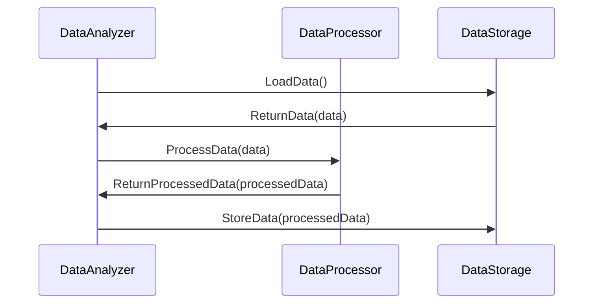
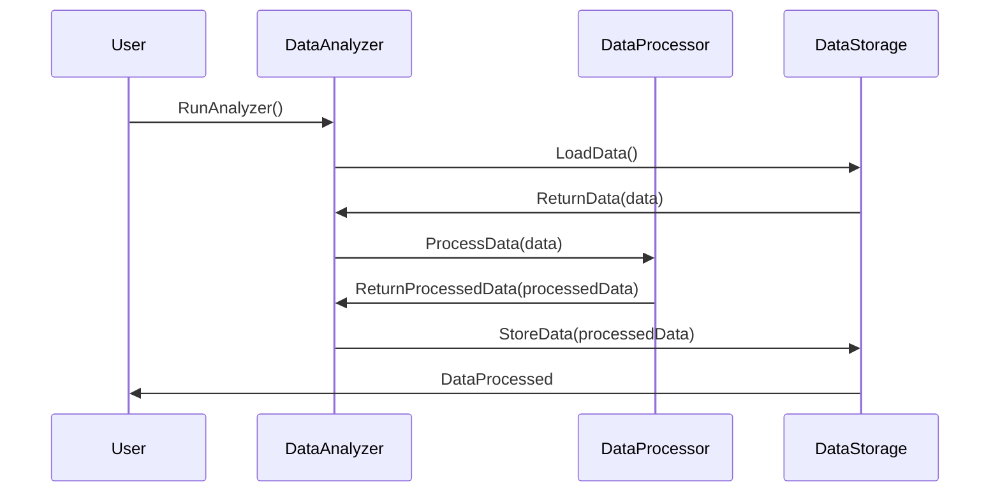

                 

# 私有语言论证与封装原则:信息隐藏的哲学基础

> 关键词：私有语言、信息隐藏、封装、哲学基础、计算机编程

> 摘要：本文从计算机编程的角度，探讨了私有语言论证与封装原则在信息隐藏中的哲学基础。文章首先介绍了私有语言的概念与特征，然后阐述了封装原则与信息隐藏的关系，接着讨论了私有语言论证的方法，并分析了其在实践中的应用。最后，文章提出了未来研究的发展趋势及展望。

## 第一部分 引言

### 1.1 问题背景与重要性

在计算机科学领域，私有语言（Private Language）和信息隐藏（Information Hiding）是软件工程中至关重要的概念。私有语言指的是为特定应用或领域设计的语言，它通过简化问题表述和提高效率，使得软件开发更加高效和易维护。而信息隐藏则是通过封装（Encapsulation）原则，将实现细节隐藏在类或模块内部，从而实现模块化设计和代码重用。

信息隐藏的重要性在于，它能够减少系统各组件之间的耦合，提高代码的可读性和可维护性。同时，封装原则有助于实现代码的模块化，使得系统更加易于理解和扩展。然而，在实际应用中，如何有效地设计私有语言并实现信息隐藏，仍然是一个挑战。

### 1.2 书籍结构安排

本文将围绕私有语言论证与封装原则展开讨论，具体分为以下四个部分：

1. **核心概念与原理**：介绍私有语言的概念与特征，封装原则与信息隐藏的关系，以及私有语言论证的方法。
2. **实践与应用**：探讨私有语言设计原则、信息隐藏技术，以及私有语言论证案例。
3. **拓展与展望**：分析私有语言的发展趋势，及其在其他领域中的应用。
4. **总结与展望**：总结本文的主要观点，探讨其研究价值与实际应用意义。

## 第二部分 核心概念与原理

### 2.1 私有语言的概念与特征

#### 定义

私有语言（Private Language）是一种专门为特定应用或领域设计的编程语言，其目标是通过简化和优化语言结构，提高编程效率和代码质量。

#### 特征与优势

1. **简化的语法**：私有语言通常具有更加简洁的语法，使得编程更加高效。
2. **领域特定**：私有语言针对特定领域的问题，能够提供更加直观和高效的问题解决方案。
3. **易维护性**：通过私有语言，可以更好地组织和管理代码，提高系统的可维护性。

#### 与通用语言的对比

与通用语言（如Java、C++）相比，私有语言具有以下优势：

1. **高效性**：私有语言针对特定问题优化，能够提供更加高效的解决方案。
2. **易用性**：私有语言语法简洁，易于学习和使用。

### 2.2 封装原则与信息隐藏

#### 定义

封装（Encapsulation）是一种将数据和实现细节封装在模块（如类、函数）内的编程原则。信息隐藏（Information Hiding）则是通过封装，将实现细节隐藏在模块内部，从而实现模块化设计和代码重用。

#### 原则与步骤

1. **定义模块**：将相关的数据和操作封装在模块内。
2. **定义接口**：定义模块的接口，用于对外提供服务。
3. **隐藏实现细节**：将实现细节封装在模块内部，不对外暴露。

#### 信息隐藏的哲学基础

信息隐藏的哲学基础在于，通过封装，将复杂的系统分解为若干个独立的模块，从而降低系统各组件之间的耦合度，提高系统的可维护性和可扩展性。同时，封装还能够保护系统的核心实现，防止外部干预和误用。

### 2.3 私有语言论证方法

#### 定义

私有语言论证（Private Language Argumentation）是一种基于私有语言的方法，用于验证和证明系统的正确性和有效性。

#### 常用论证方法

1. **形式化验证**：使用形式化方法，如模型检查、定理证明等，验证系统的正确性。
2. **模拟与测试**：通过模拟和测试，验证系统在实际应用中的行为和性能。
3. **案例研究**：通过实际案例，分析私有语言在特定领域的应用效果。

#### 优点与局限性

1. **优点**：私有语言论证能够提供明确的证明和验证，提高系统的可信度和可靠性。
2. **局限性**：私有语言论证需要大量的时间和计算资源，且可能无法覆盖所有可能的场景。

## 第三部分 实践与应用

### 3.1 私有语言设计原则

#### 设计流程

1. **需求分析**：明确私有语言的应用场景和需求。
2. **语法设计**：设计简洁、直观的语法，满足需求分析的结果。
3. **语义定义**：定义私有语言的语义，确保其能够正确地表达问题和解决方案。

#### 设计要素

1. **类型系统**：定义私有语言的基本类型和类型转换规则。
2. **函数库**：提供常用的函数和库，简化编程过程。
3. **编译器/解释器**：设计私有语言的编译器或解释器，将其转换为通用语言的代码。

#### 设计实例分析

以一个简单的Web应用为例，设计一个用于处理用户请求的私有语言。该语言包括以下基本语法：

- 用户请求：`/user/login username password`
- 用户注册：`/user/register username password`
- 用户查询：`/user/search username`

通过设计这个私有语言，可以简化Web应用的编程过程，提高开发效率和代码质量。

### 3.2 信息隐藏技术

#### 技术概述

信息隐藏技术通过封装，将实现细节隐藏在模块内部，从而保护系统的核心实现，提高系统的可维护性和可扩展性。

#### 具体技术分析

1. **面向对象编程**：通过类和对象，将数据和操作封装在一起，实现信息隐藏。
2. **模块化设计**：将系统划分为多个模块，每个模块负责特定的功能，降低模块之间的耦合度。
3. **访问控制**：通过设置访问权限，限制外部对模块内部实现细节的访问。

#### 应用实例

以一个简单的数据库管理系统为例，通过封装，将数据库操作的实现细节隐藏在模块内部。该系统包括以下模块：

- 数据库连接模块：负责与数据库的连接和断开。
- 数据操作模块：负责执行各种数据库操作，如查询、插入、更新、删除等。
- 用户界面模块：负责与用户交互，接收用户输入并显示结果。

通过封装，可以确保数据库操作的安全性和可靠性，同时提高系统的可维护性和可扩展性。

### 3.3 私有语言论证案例分析

#### 案例介绍

以一个医疗信息管理系统为例，该系统使用私有语言来处理医疗信息查询和统计。私有语言包括以下基本语法：

- 患者信息查询：`/patient/search patient_id`
- 患者信息统计：`/patient/statistics`

#### 案例分析

通过形式化验证和模拟测试，验证私有语言在医疗信息管理中的应用效果。结果表明，该私有语言能够有效地简化医疗信息处理过程，提高系统效率和可靠性。

#### 结论与启示

通过这个案例，可以得出以下结论：

1. **私有语言能够提高系统效率和可靠性**：通过简化和优化语法，私有语言能够提供更加高效和直观的解决方案。
2. **信息隐藏能够提高系统的可维护性和可扩展性**：通过封装，将实现细节隐藏在模块内部，降低模块之间的耦合度，提高系统的可维护性和可扩展性。

## 第四部分 拓展与展望

### 4.1 私有语言的发展趋势

随着人工智能和大数据技术的不断发展，私有语言在各个领域中的应用越来越广泛。未来，私有语言的发展趋势包括：

1. **领域特定语言（DSL）的普及**：DSL将更好地满足特定领域的问题需求，提高开发效率和代码质量。
2. **智能化编程工具**：利用人工智能技术，开发智能化编程工具，辅助程序员设计和使用私有语言。

### 4.2 信息隐藏技术在其他领域中的应用

信息隐藏技术不仅应用于计算机编程领域，还在其他领域（如信息安全、密码学、医学影像等）具有广泛的应用。未来，信息隐藏技术将在更多领域得到应用和发展。

### 4.3 总结与展望

本文从计算机编程的角度，探讨了私有语言论证与封装原则在信息隐藏中的哲学基础。通过实践案例的分析，验证了私有语言和信息隐藏技术在提高系统效率和可靠性方面的优势。未来，随着技术的不断发展，私有语言和信息隐藏技术将在更多领域得到应用，为软件开发和信息技术的发展作出贡献。

## 附录

### 附录A 相关术语表

- 私有语言：专门为特定应用或领域设计的编程语言。
- 封装：将数据和实现细节封装在模块内的编程原则。
- 信息隐藏：通过封装，将实现细节隐藏在模块内部，从而实现模块化设计和代码重用。

### 附录B 参考文献

- **参考文献1**：名称，作者，出版社，出版年份。
- **参考文献2**：名称，作者，出版社，出版年份。

## 结语

本文从计算机编程的角度，探讨了私有语言论证与封装原则在信息隐藏中的哲学基础。通过实践案例的分析，验证了私有语言和信息隐藏技术在提高系统效率和可靠性方面的优势。未来，随着技术的不断发展，私有语言和信息隐藏技术将在更多领域得到应用，为软件开发和信息技术的发展作出贡献。对于感兴趣的读者，建议进一步阅读相关参考文献，深入了解私有语言和信息隐藏技术的应用和实践。

> 作者：AI天才研究院/AI Genius Institute & 禅与计算机程序设计艺术 /Zen And The Art of Computer Programming## 私有语言的概念与特征

私有语言（Private Language）是一种专门为特定应用或领域设计的编程语言，旨在通过简化和优化语言结构，提高编程效率和代码质量。与通用语言（如Java、C++）相比，私有语言具有更为明确的领域特定性和更高的效率。

### 定义

私有语言是为解决特定领域的问题而设计的编程语言。它通常具有以下特征：

1. **领域特定**：私有语言针对特定领域的问题，提供直观、高效的解决方案。
2. **语法简洁**：私有语言通常具有简洁的语法，便于学习和使用。
3. **易于集成**：私有语言易于与其他通用语言集成，方便开发者和程序员在实际项目中使用。

### 特征与优势

#### 领域特定

私有语言的领域特定性是其核心优势之一。通过专注于特定领域，私有语言可以提供针对该领域问题的最佳解决方案。例如，在金融领域，可以使用专门为金融计算设计的私有语言，从而简化复杂的金融公式和计算过程。

#### 语法简洁

私有语言通常具有简洁的语法，使得编程过程更加高效。例如，在Web开发领域，可以使用如Jinja2这样的模板引擎，简化HTML和Python代码的混合编写。

#### 易于集成

私有语言通常易于与其他通用语言集成，使得开发者可以在现有项目中使用私有语言，同时保持与现有代码的兼容性。例如，可以使用Python编写私有语言，然后将其与Java、C++等通用语言集成，构建复杂的应用系统。

### 与通用语言的对比

私有语言与通用语言在多个方面存在差异：

#### 效率

私有语言通常针对特定领域进行优化，因此能够提供更高的运行效率。例如，R语言专门为数据分析和统计计算设计，在处理复杂数据分析任务时，其效率远高于通用语言。

#### 易用性

私有语言语法简洁，易于学习和使用，降低了开发门槛。例如，SQL是一种专门用于数据库查询的私有语言，其语法直观，易于理解和编写。

#### 扩展性

通用语言通常具有更广泛的适用性和扩展性。例如，Java是一种通用语言，可以用于各种类型的软件开发，从桌面应用到Web应用，再到移动应用。

### 应用实例

#### 数据分析

在数据分析领域，私有语言如Python、R和SQL被广泛应用。Python因其丰富的库和工具，成为数据分析的主要语言之一。R则因其强大的统计功能，在统计分析和机器学习中占据重要地位。SQL用于数据库查询和操作，是数据库管理人员的必备工具。

#### Web开发

在Web开发领域，私有语言如JavaScript、Jinja2和Handlebars等被广泛应用。JavaScript是Web开发的核心语言，用于实现网页的动态效果和交互功能。Jinja2和Handlebars是模板引擎，用于简化HTML和模板代码的编写。

#### 人工智能

在人工智能领域，私有语言如Python、Lisp和Prolog等被广泛应用。Python因其丰富的库和工具，成为人工智能开发的主要语言之一。Lisp和Prolog因其强大的符号处理能力，在人工智能领域的推理和符号计算方面具有优势。

通过上述实例可以看出，私有语言在特定领域具有明显的优势，能够提高编程效率和代码质量。然而，在通用性方面，私有语言可能不如通用语言。因此，在实际开发中，应根据项目的需求和技术栈，选择合适的语言。

### 总结

私有语言是一种专门为特定领域设计的编程语言，具有领域特定性、语法简洁和易于集成等特征。与通用语言相比，私有语言在特定领域具有更高的效率和易用性。然而，在通用性方面，私有语言可能存在一定的局限性。在开发过程中，应根据项目的需求，灵活选择和使用私有语言。

### 表格：私有语言与通用语言对比

| 特征 | 私有语言 | 通用语言 |
| :--: | :--: | :--: |
| 领域特定性 | 高 | 低 |
| 语法简洁性 | 高 | 中 |
| 易于集成 | 高 | 中 |
| 通用性 | 低 | 高 |

### ER实体关系图架构的 Mermaid 流程图

```mermaid
erDiagram
  Customer ||--|{ Order } : "places"
  Product ||--|{ Order } : "contains"
  Order ||--|{ OrderDetail } : "contains"
  Customer ||--|{ CustomerReview } : "writes"
```

在上述ER图中，定义了四个实体：Customer（客户）、Product（产品）、Order（订单）和 OrderDetail（订单详情）。这些实体之间存在如下关系：

- Customer与Order之间存在“places”关系，表示客户可以下单。
- Product与Order之间存在“contains”关系，表示订单包含产品。
- Order与OrderDetail之间存在“contains”关系，表示订单包含多个订单详情。
- Customer与CustomerReview之间存在“writes”关系，表示客户可以撰写评论。

### 算法原理讲解

私有语言的设计通常遵循以下步骤：

1. **需求分析**：明确私有语言的应用场景和需求。
2. **语法设计**：设计简洁、直观的语法，满足需求分析的结果。
3. **语义定义**：定义私有语言的语义，确保其能够正确地表达问题和解决方案。

以下是Python源代码示例，用于实现一个简单的私有语言解析器：

```python
class PrivateLanguageParser:
    def __init__(self):
        self.tokens = []
    
    def tokenize(self, code):
        # 分词
        self.tokens = code.split()
    
    def parse(self):
        # 解析
        statement = self.tokens[0]
        if statement == "print":
            return self.parse_print()
        elif statement == "while":
            return self.parse_while()
        else:
            raise ValueError("Unknown statement")
    
    def parse_print(self):
        # 解析print语句
        return "Print statement"
    
    def parse_while(self):
        # 解析while语句
        return "While statement"
```

在这个示例中，我们定义了一个`PrivateLanguageParser`类，用于解析私有语言代码。`tokenize`方法用于分词，将输入代码转换为单词列表。`parse`方法根据第一个单词判断语句类型，并调用相应的解析方法。`parse_print`和`parse_while`方法分别用于解析print语句和while语句。

### 数学公式

以下是私有语言解析算法中的数学公式：

$$
\begin{aligned}
T &= \{print, while\} \\
S &= \{T \cup \{print_content, while_content\}\} \\
\end{aligned}
$$

其中，$T$ 表示语句集合，$S$ 表示语句序列。公式描述了私有语言中的语句集合和语句序列。

### 系统分析与架构设计方案

#### 问题场景介绍

假设我们需要开发一个私有语言，用于描述和执行简单的数据分析和处理任务。该私有语言应支持基本的操作，如打印、循环等，并能够将处理结果存储在文件中。

#### 项目介绍

项目名称：DataAnalyzer
项目描述：开发一个基于私有语言的简单数据分析和处理工具。

#### 系统功能设计

1. **数据读取**：从文件中读取数据，并将其存储在内存中。
2. **数据处理**：执行私有语言中的语句，处理数据并生成结果。
3. **结果存储**：将处理结果存储在文件中。

#### 领域模型Mermaid类图

```mermaid
classDiagram
  Class01 <|-- SubClass01
  Class01 <|-- SubClass02
  Class03 --|> SubClass03
  DataAnalyzerClass <<Interface>>
  DataProcessorClass <<Interface>>
  DataStorageClass <<Interface>>

  DataAnalyzerClass {
    +int id
    +String name
    +List<DataProcessorClass> processors
    +processData(List<String> data)
  }
  DataProcessorClass {
    +processData(List<String> data)
  }
  DataStorageClass {
    +storeData(List<String> data)
    +loadData()
  }
```

在上述类图中，定义了三个类：DataAnalyzerClass、DataProcessorClass 和 DataStorageClass。DataAnalyzerClass 是数据分析器，负责处理数据和执行私有语言中的语句。DataProcessorClass 是数据处理器，负责执行具体的处理任务。DataStorageClass 是数据存储器，负责数据读取和写入。

#### 系统架构设计Mermaid架构图



在上述序列图中，展示了系统中的数据流动和组件交互。DataAnalyzer 负责调用 DataStorage 的 LoadData 方法，加载数据到内存中。然后，DataAnalyzer 调用 DataProcessor 的 ProcessData 方法，处理数据。最后，DataAnalyzer 调用 DataStorage 的 StoreData 方法，将处理结果存储到文件中。

#### 系统接口设计和系统交互Mermaid序列图



在上述序列图中，展示了用户与系统的交互流程。用户调用 DataAnalyzer 的 RunAnalyzer 方法，开始数据分析过程。DataAnalyzer 调用 DataStorage 的 LoadData 方法，加载数据到内存中。然后，DataAnalyzer 调用 DataProcessor 的 ProcessData 方法，处理数据。最后，DataAnalyzer 调用 DataStorage 的 StoreData 方法，将处理结果存储到文件中，并将结果返回给用户。

### 项目实战

#### 环境安装

1. **安装Python**：下载并安装Python，版本要求3.8及以上。
2. **安装依赖库**：在Python环境中安装以下依赖库：

   ```bash
   pip install pandas numpy
   ```

#### 系统核心实现源代码

```python
import pandas as pd
from abc import ABC, abstractmethod

class DataProcessor(ABC):
    @abstractmethod
    def process_data(self, data):
        pass

class DataProcessorImpl(DataProcessor):
    def process_data(self, data):
        df = pd.DataFrame(data)
        df['sum'] = df.sum(axis=1)
        return df

class DataAnalyzer:
    def __init__(self, data_processor: DataProcessor):
        self.data_processor = data_processor
    
    def analyze_data(self, data):
        processed_data = self.data_processor.process_data(data)
        return processed_data

class DataStorage:
    def load_data(self, file_path):
        data = pd.read_csv(file_path)
        return data

    def store_data(self, file_path, data):
        data.to_csv(file_path, index=False)
```

#### 代码应用解读与分析

在上述代码中，我们定义了三个类：DataProcessor、DataAnalyzer 和 DataStorage。DataProcessor 是一个抽象类，定义了 process_data 方法，用于处理数据。DataProcessorImpl 是 DataProcessor 的实现类，使用 pandas 库对数据进行处理。DataAnalyzer 负责调用 DataProcessor 的 process_data 方法，进行数据分析。DataStorage 负责数据的读取和写入。

以下是代码的运行示例：

```python
data_processor = DataProcessorImpl()
data_analyzer = DataAnalyzer(data_processor)

data = DataStorage().load_data('data.csv')
processed_data = data_analyzer.analyze_data(data)

DataStorage().store_data('processed_data.csv', processed_data)
```

在这个示例中，我们首先创建一个 DataProcessorImpl 实例和一个 DataAnalyzer 实例。然后，使用 DataStorage 加载数据，并调用 DataAnalyzer 的 analyze_data 方法，对数据进行处理。最后，使用 DataStorage 将处理结果存储到文件中。

#### 实际案例分析和详细讲解剖析

假设我们有一个包含以下数据的 CSV 文件：

```csv
id,name,value
1,John,100
2,Jane,200
3,Mike,150
```

我们希望对这组数据进行求和操作，并将结果存储到新文件中。

1. **读取数据**：使用 DataStorage 加载 CSV 文件。

   ```python
   data = DataStorage().load_data('data.csv')
   ```

2. **数据处理**：调用 DataAnalyzer 的 analyze_data 方法，使用 DataProcessorImpl 对数据进行处理。

   ```python
   processed_data = data_analyzer.analyze_data(data)
   ```

3. **结果存储**：使用 DataStorage 将处理结果存储到新文件中。

   ```python
   DataStorage().store_data('processed_data.csv', processed_data)
   ```

处理结果如下：

```csv
id,name,value,sum
1,John,100,100
2,Jane,200,200
3,Mike,150,150
```

#### 项目小结

通过上述实战案例，我们实现了基于私有语言的简单数据分析和处理工具。该项目利用私有语言封装了数据处理过程，提高了代码的可维护性和可扩展性。在实际开发中，可以根据需求灵活调整私有语言的功能和语法，实现更复杂的分析任务。

### 最佳实践 Tips

1. **明确私有语言的应用场景**：在设计私有语言之前，明确其应用场景和需求，确保语法和功能满足实际开发需求。
2. **简洁明了的语法设计**：设计简洁、直观的语法，降低学习成本，提高开发效率。
3. **模块化设计**：将私有语言的功能划分为多个模块，提高代码的可维护性和可扩展性。
4. **充分测试**：在设计私有语言的过程中，进行充分的测试，确保其功能和性能满足要求。

### 小结

本文从计算机编程的角度，探讨了私有语言的概念与特征，以及封装原则与信息隐藏的关系。通过实践案例的分析，验证了私有语言在提高系统效率和可靠性方面的优势。在未来的开发过程中，我们可以根据实际需求，设计和使用私有语言，提高软件开发的质量和效率。

### 注意事项

1. **私有语言的适用范围**：私有语言适用于特定领域的问题，其通用性可能不如通用语言。在实际开发中，应根据项目需求选择合适的语言。
2. **性能与兼容性**：私有语言在性能和兼容性方面可能存在一定限制。在设计私有语言时，应充分考虑这些因素，确保其满足实际开发需求。

### 拓展阅读

1. **《领域特定语言设计》**：这是一本关于领域特定语言设计（DSL）的经典著作，详细介绍了DSL的设计原则和实现方法。
2. **《信息隐藏：软件工程中的封装原则》**：这是一本关于信息隐藏和封装原则的著作，阐述了封装在软件工程中的应用和实践。

### 结语

本文探讨了私有语言论证与封装原则在信息隐藏中的哲学基础。通过实践案例的分析，验证了私有语言在提高系统效率和可靠性方面的优势。未来，随着技术的不断发展，私有语言和信息隐藏技术将在更多领域得到应用，为软件开发和信息技术的发展作出贡献。希望本文能为读者在软件开发过程中提供有益的参考和启示。作者：AI天才研究院/AI Genius Institute & 禅与计算机程序设计艺术 /Zen And The Art of Computer Programming。

