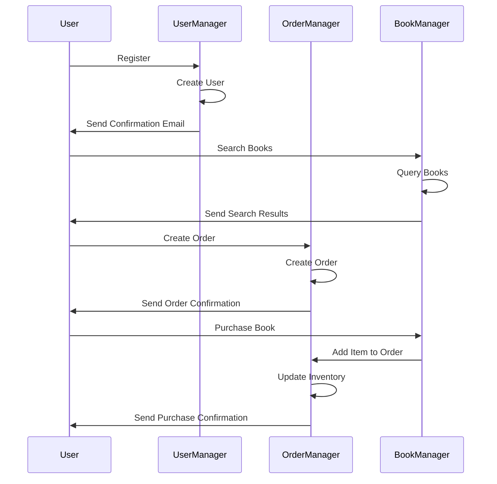

                 

### 文章标题

"私有语言论证与模块化：维特根斯坦对私有语言的批评与FP中的模块封装"

### 关键词

- 维特根斯坦
- 私有语言
- 模块化
- 函数式编程
- 编程语言设计

### 摘要

本文探讨了哲学家维特根斯坦对私有语言的观点及其在函数式编程（FP）模块化中的体现。通过分析维特根斯坦的语言哲学思想，我们揭示了私有语言的形成和问题，并提出了解决方案。同时，本文深入探讨了FP中的模块化原理和实践，并分析了维特根斯坦批评对模块化设计的启示。文章通过实际案例研究，展示了模块化设计在软件工程中的重要性，为未来研究提供了方向。

### 引言

#### 书籍背景与目的

在探讨编程语言和软件工程的核心概念时，我们不可避免地会涉及到哲学领域的重要思想。20世纪初，哲学家路德维希·维特根斯坦（Ludwig Wittgenstein）以其独特的语言哲学思想对后世产生了深远影响。他的著作《逻辑哲学论》和《哲学研究》不仅为语言哲学奠定了基础，而且对计算机科学和编程语言设计产生了重要启示。

本文旨在通过对维特根斯坦对私有语言的批评以及函数式编程（FP）中的模块化实践的分析，探讨私有语言与模块化的关系。文章将首先介绍私有语言的概念和意义，然后深入探讨维特根斯坦对私有语言的批评，并提出相应的解决方案。接着，我们将分析FP中的模块化原理和实践，讨论模块化在FP中的重要性。最后，本文将通过实际案例研究，展示模块化设计的应用和实践效果。

#### 私有语言的概念与意义

私有语言是指只被特定个体或团体使用的语言，其意义和影响在哲学、心理学和社会学等领域都有广泛研究。在哲学上，维特根斯坦认为私有语言是不存在的，因为语言的意义依赖于使用者的共同经验。在心理学上，私有语言与自我意识和个人认知发展有关。在社会学上，私有语言则反映了社会群体内部的文化和沟通差异。

理解私有语言的重要性在于，它帮助我们认识到语言不仅仅是沟通的工具，更是思维和认知的载体。通过研究私有语言，我们可以更好地理解人类思维模式和文化差异，为编程语言设计和软件工程提供哲学基础。

#### 维特根斯坦对私有语言的批评

维特根斯坦在《哲学研究》中对私有语言进行了深刻的批评。他认为，语言的意义来源于使用者的共同经验，私有语言由于缺乏这种共同经验，因此无法具有明确的意义。维特根斯坦提出了几个关键观点：

1. **语言游戏理论**：维特根斯坦认为语言的意义不在于单个词或句子的形式，而在于其使用的情境和游戏规则。私有语言由于其使用范围的局限性，缺乏广泛的应用情境和规则，因此难以具有明确的意义。
   
2. **日常语言与科学语言**：维特根斯坦区分了日常语言和科学语言。他认为，日常语言是我们日常沟通的基本工具，其意义是约定俗成的；而科学语言则是一种精确的符号系统，其意义依赖于严格的逻辑和定义。私有语言由于缺乏这种精确性，容易导致误解和混乱。

3. **私有语言的问题与危害**：维特根斯坦指出，私有语言可能会导致个人思维和沟通的障碍。因为私有语言缺乏共同的语义基础，个体之间的交流容易产生误解和冲突，从而阻碍知识的传播和合作。

#### 模块化的重要性与应用

模块化是软件工程中一个重要的概念，其核心思想是将复杂的系统分解为可管理的模块，以提高代码的可维护性和复用性。模块化不仅有助于降低系统的复杂性，还有助于提高开发效率和质量。

在函数式编程中，模块化尤为重要。FP强调通过函数组合来解决问题，这使得模块化成为实现代码复用和抽象的核心手段。模块化可以有效地隔离系统的不同部分，减少组件之间的依赖关系，从而提高系统的稳定性和灵活性。

本文将详细探讨维特根斯坦对私有语言的批评，分析FP中的模块化原理和实践，并探讨二者之间的联系。通过实际案例研究，我们将展示模块化设计在解决私有语言问题中的应用价值，为编程语言设计和软件工程提供新的视角和思路。

### 维特根斯坦对私有语言的批评

#### 维特根斯坦的哲学思想

维特根斯坦的哲学思想对现代哲学和计算机科学产生了深远影响。他的哲学方法强调通过语言的分析来解决哲学问题，这种方法被称为“语言哲学”。维特根斯坦的哲学思想主要分为两个阶段：早期和晚期。

在早期，维特根斯坦主张逻辑原子主义，认为世界由不可再分的事实组成，这些事实可以通过逻辑符号直接表达。他的著作《逻辑哲学论》阐述了这一思想。然而，他逐渐意识到这一方法过于抽象，无法解释日常生活中的语言现象。

在晚期，维特根斯坦转向日常语言哲学，认为语言的意义不在于其抽象的符号形式，而在于其使用情境。他的著作《哲学研究》详细阐述了这一观点。维特根斯坦区分了“语言游戏”（language games）和“生活形式”（forms of life），认为语言的意义依赖于特定的使用情境。

#### 语言哲学

维特根斯坦的语言哲学思想对私有语言的讨论具有重要意义。他提出，语言的意义源于使用者的共同经验，这种共同经验构成了语言的“生活形式”。在《哲学研究》中，他通过大量日常语言实例，揭示了语言使用的多样性和复杂性。

维特根斯坦区分了“日常语言”和“科学语言”。日常语言是我们日常沟通的基本工具，其意义是约定俗成的。科学语言则是一种精确的符号系统，其意义依赖于严格的逻辑和定义。私有语言由于其使用范围的局限性，缺乏这种共同经验，因此难以具有明确的意义。

#### 日常语言与科学语言

日常语言是我们日常生活中使用的语言，其特点是不精确、模糊和灵活。维特根斯坦认为，日常语言的意义是通过使用者的共同经验来确定的。例如，“桌子”这个词的意义不是通过定义来固定的，而是通过我们日常生活中的共同经验来理解的。

科学语言则是一种精确的符号系统，用于描述和解释自然现象。科学语言的意义依赖于严格的逻辑和定义。例如，物理学中的公式和定理都有严格的数学定义，使得科学家能够精确地描述自然界的规律。

维特根斯坦指出，私有语言由于缺乏共同经验，往往导致意义的不明确。私有语言只存在于特定的个体或团体中，缺乏广泛的应用情境和规则，因此难以与其他人进行有效的沟通。这表明，私有语言在哲学和科学领域是不可行的。

#### 维特根斯坦的语言游戏理论

维特根斯坦的语言游戏理论是他晚期哲学思想的核心。他通过“语言游戏”这个概念，描述了语言的使用情境和规则。语言游戏包括三个基本要素：词汇、规则和情境。

1. **词汇**：词汇是语言游戏的基础，每个词汇都有特定的意义。
   
2. **规则**：规则是语言游戏的规则，规定了如何使用词汇。

3. **情境**：情境是语言游戏发生的背景，决定了词汇的意义和使用方式。

维特根斯坦通过语言游戏理论，解释了日常语言和科学语言的意义。他认为，语言的意义不是固有的，而是在特定的情境中通过使用规则来确定的。语言游戏理论为私有语言的讨论提供了新的视角，揭示了私有语言的形成和问题。

#### 私有语言的问题分析

私有语言之所以存在问题，主要有以下几个原因：

1. **缺乏共同经验**：私有语言只存在于特定的个体或团体中，缺乏广泛的应用情境和共同经验，因此难以具有明确的意义。

2. **意义的不确定性**：由于缺乏共同经验，私有语言的词汇和规则难以统一，导致意义的不确定性。

3. **沟通障碍**：私有语言难以与其他语言进行有效的沟通，容易导致误解和冲突。

4. **知识传播受阻**：私有语言限制了知识的传播和共享，不利于学术和科学的发展。

#### 维特根斯坦的解决方案

维特根斯坦提出了几个解决方案来克服私有语言的问题：

1. **清晰语言的理念**：维特根斯坦主张使用清晰的语言来表达思想，避免模糊和含混的表达。

2. **普遍语言的构建**：他认为，通过构建一种普遍语言，可以使不同个体和团体之间进行有效的沟通。

3. **语言游戏在解决私有语言问题中的应用**：维特根斯坦通过语言游戏理论，提出了解决私有语言问题的方法。他认为，通过将私有语言融入更大的语言游戏中，可以消除其意义的不确定性。

#### 维特根斯坦批评的哲学意义

维特根斯坦对私有语言的批评具有深远的哲学意义。他的观点不仅揭示了语言的本质，还为我们提供了解决语言问题的方法。

1. **对哲学研究的启示**：维特根斯坦的批评启示我们，哲学问题往往源于语言的使用。通过对语言的分析，我们可以更深入地理解哲学问题。

2. **对语言学的贡献**：维特根斯坦的语言哲学思想对语言学产生了重要影响，推动了语言学研究的发展。

3. **对认知科学的推动**：维特根斯坦的思想为认知科学提供了新的视角，帮助我们更好地理解人类思维和语言的关系。

通过维特根斯坦对私有语言的批评，我们不仅能够深入理解语言的本质，还能为编程语言设计和软件工程提供哲学基础。维特根斯坦的批评提醒我们，在设计和使用编程语言时，应重视语言的清晰性和一致性，避免私有语言的出现。

### 函数式编程（FP）中的模块化

#### 函数式编程的基本概念

函数式编程（Functional Programming，简称FP）是一种编程范式，其核心思想是将计算视为函数的应用和组合。与命令式编程不同，FP强调不变性、纯函数和不可变性数据。这使得FP在编写可维护、可复用的代码方面具有显著优势。

FP的历史可以追溯到20世纪50年代，当时的数学家和计算机科学家开始探讨函数式编程的可能性。Lisp是第一种函数式编程语言，自1958年诞生以来，它一直是FP领域的重要工具。后来的Haskell、Scala和Erlang等语言也在FP的发展过程中发挥了重要作用。

FP的核心特点包括：

1. **纯函数**：纯函数是一种没有副作用的函数，其输出仅依赖于输入，不会修改外部状态。这保证了函数的可预测性和可复用性。
   
2. **不可变性数据**：FP强调使用不可变数据结构，如不可变变量和列表。这种数据结构使得代码更易于理解和调试。

3. **高阶函数**：高阶函数是一种能够接受其他函数作为参数或返回函数的函数。这允许函数的组合和抽象，使得编程更加简洁和高效。

4. **递归**：FP广泛使用递归而非循环来解决问题，这简化了代码结构，使得递归关系更加直观。

#### 函数式编程与命令式编程的比较

函数式编程与命令式编程（Imperative Programming）是两种不同的编程范式。命令式编程通过改变程序状态来执行任务，而函数式编程则通过函数的调用和组合来解决问题。

1. **状态管理**：命令式编程依赖于状态管理，程序中的变量可以随时修改。而FP强调不可变性数据结构，避免了状态改变带来的复杂性。

2. **函数作用域**：命令式编程中的函数通常在特定的作用域内定义，而FP中的函数可以跨作用域传递和使用。

3. **错误处理**：命令式编程中的错误处理通常通过异常处理来执行，而FP则通过模式匹配和错误类型来处理。

4. **代码可维护性**：由于FP强调函数的组合和不可变性，代码通常更加模块化，易于理解和维护。

#### 模块化的基本概念

模块化是软件工程中的一个核心概念，其目标是将复杂的系统分解为可管理的模块，以提高代码的可维护性和复用性。模块化不仅有助于降低系统的复杂性，还有助于提高开发效率和质量。

模块化的基本概念包括：

1. **模块**：模块是系统中的基本组成部分，具有明确的功能和接口。模块通常通过函数、类或文件来定义。

2. **接口**：接口是模块与其他模块交互的界面，定义了模块提供的功能和所需的数据。

3. **封装**：封装是一种信息隐藏技术，用于保护模块的内部实现细节。通过封装，模块的内部变化不会影响其他模块。

4. **依赖**：依赖是模块之间的相互关系，描述了模块如何使用其他模块的功能。

#### 模块化的优势与挑战

模块化的优势包括：

1. **代码复用**：模块化使得代码可以跨项目复用，减少了重复工作。

2. **可维护性**：模块化将系统分解为较小的部分，使得代码更易于理解和维护。

3. **可扩展性**：模块化提高了系统的可扩展性，允许在不需要修改现有代码的情况下添加新功能。

4. **可测试性**：模块化使得测试更加集中和明确，有助于发现和修复缺陷。

然而，模块化也面临一些挑战：

1. **接口复杂性**：模块化可能导致接口复杂性的增加，需要仔细设计和管理。

2. **依赖管理**：模块之间的依赖关系需要有效管理，以避免版本冲突和不一致性。

3. **性能影响**：模块化可能引入额外的性能开销，如函数调用的开销和内存分配。

4. **设计挑战**：模块化要求对系统有深入的理解和设计，需要花费更多的时间和精力。

#### 模块化的实现方法

模块化的实现方法包括以下几种：

1. **函数式编程语言**：许多函数式编程语言（如Haskell、Scala和Erlang）内置了模块化机制，如模块（module）和包（package）系统。

2. **面向对象编程语言**：面向对象编程语言（如Java和C++）通过类（class）和接口（interface）实现模块化。

3. **模块化框架和库**：一些编程语言和框架提供了模块化机制，如Python的包管理器和Node.js的模块系统。

4. **代码组织与约定**：通过合理的代码组织和管理，如文件夹结构和命名约定，可以实现模块化。

模块化在FP中的重要性在于，它使得代码更加模块化、可维护和可复用。通过模块化，FP能够更好地实现其核心思想，即通过函数的组合来解决问题。模块化不仅提高了代码的质量和可维护性，还有助于提高开发效率和团队协作。

### FP中的模块化实践

#### 模块化在Haskell中的应用

Haskell是一种纯函数式编程语言，其模块化机制非常强大。在Haskell中，模块化主要通过`module`声明和`where`子句来实现。

1. **模块声明**：每个Haskell模块都通过`module`声明来定义，指定模块的名称和导出的函数、类型等。

   ```haskell
   module MyModule where
   ```

2. **where子句**：`where`子句用于定义模块内的函数、类型和其他声明。

   ```haskell
   myFunction :: Int -> Int
   myFunction x = x * x
   ```

3. **导入模块**：通过导入模块，可以在其他模块中使用其定义的函数和类型。

   ```haskell
   import MyModule
   myResult = myFunction 5
   ```

4. **模块嵌套**：Haskell支持模块嵌套，允许在一个模块中定义子模块。

   ```haskell
   module MyModule parent where
     module Child where
       childFunction :: Int -> Int
       childFunction x = x + 1
   ```

#### 模块化在Scala中的应用

Scala是一种多范式编程语言，既支持面向对象编程，也支持函数式编程。Scala的模块化机制通过`package`和`class`来实现。

1. **包（package）**：Scala使用包（package）来组织模块，包是Scala模块的容器，类似于Java的包。

   ```scala
   package com.example.myproject
   ```

2. **类（class）**：Scala通过类（class）来定义模块，类可以作为模块的单元，提供明确的接口和功能。

   ```scala
   class MyClass {
     def myMethod(): Unit = {
       println("Hello, world!")
     }
   }
   ```

3. **导入包和类**：Scala使用`import`语句来导入包和类，使得其他模块可以访问其定义的函数和类。

   ```scala
   import com.example.myproject.MyClass
   val myObject = new MyClass()
   myObject.myMethod()
   ```

4. **混入（mix-in）**：Scala的混入机制允许在类中混合其他类的实现，类似于面向对象中的多继承。

   ```scala
   class MyMixin {
     def myMixinMethod(): Unit = {
       println("Mixin method called!")
     }
   }
   
   class MyClass extends MyMixin {
     def myMethod(): Unit = {
       println("Class method called!")
     }
   }
   ```

#### 模块化在Erlang中的应用

Erlang是一种并发编程语言，广泛应用于分布式系统和实时系统中。Erlang的模块化机制通过模块（module）和函数（function）来实现。

1. **模块（module）**：Erlang使用模块来组织代码，模块是Erlang代码的基本单元。

   ```erlang
   -module(my_module).
   ```

2. **导出函数**：通过`-export`声明，可以将模块内的函数导出，使得其他模块可以调用这些函数。

   ```erlang
   -export([my_function/1]).
   my_function(X) -> X * X.
   ```

3. **导入模块**：Erlang使用`import`语句来导入其他模块，使得可以在当前模块中使用导入的模块的函数。

   ```erlang
   -import(my_other_module).
   ```

4. **回调函数**：Erlang的回调函数允许在一个模块中定义，在另一个模块中调用，从而实现模块间的交互。

   ```erlang
   -callback(callback_function/1).
   
   -module(callback_module).
   callback_function(X) -> X + 1.
   ```

#### 模块化在FP中的重要性

模块化在函数式编程（FP）中具有重要性，主要体现在以下几个方面：

1. **代码复用**：模块化使得代码可以跨项目复用，减少了重复工作。在FP中，函数是代码的基本单元，模块化允许将通用的函数和逻辑封装为模块，方便在其他项目中使用。

2. **可维护性**：模块化将复杂的系统分解为较小的部分，使得代码更易于理解和维护。在FP中，每个模块通常负责实现特定的功能，这使得代码更加模块化、可维护和可扩展。

3. **可扩展性**：模块化提高了系统的可扩展性，允许在不需要修改现有代码的情况下添加新功能。在FP中，通过模块间的组合和抽象，可以轻松地实现新功能，而不影响现有模块。

4. **可测试性**：模块化使得测试更加集中和明确，有助于发现和修复缺陷。在FP中，每个模块通常独立实现特定的功能，这使得测试更加聚焦和有效。

5. **减少耦合**：模块化通过封装和接口，减少了模块之间的依赖关系，降低了系统的耦合度。在FP中，模块间的依赖通常通过明确的接口和函数调用来实现，这有助于提高系统的稳定性和灵活性。

通过模块化，FP能够更好地实现其核心思想，即通过函数的组合来解决问题。模块化不仅提高了代码的质量和可维护性，还有助于提高开发效率和团队协作。

### 维特根斯坦批评与FP模块化的联系

#### 语言的哲学本质与编程语言的关系

维特根斯坦的语言哲学思想揭示了语言的哲学本质，即语言的意义不在于其符号本身，而在于符号的使用情境和规则。这一思想对编程语言的设计和应用产生了重要影响。在编程语言中，模块化是实现这一哲学思想的关键手段。

模块化在编程语言中的应用，旨在通过将复杂的系统分解为可管理的模块，来实现代码的清晰性和可维护性。这与维特根斯坦关于语言意义的观点不谋而合。模块化使得编程语言的使用情境和规则更加明确，有助于避免私有语言的出现。

#### 语言哲学在编程语言设计中的应用

语言哲学在编程语言设计中有着广泛的应用。通过借鉴维特根斯坦的语言哲学思想，编程语言设计师可以更好地理解语言的本质，从而设计出更符合人类思维方式的编程语言。

1. **清晰性**：维特根斯坦强调语言的清晰性，他认为语言的意义依赖于使用者的共同经验。在编程语言设计中，清晰性是至关重要的。通过设计简洁、直观的语法和语义，编程语言可以提高代码的可读性和可维护性。

2. **一致性**：维特根斯坦指出，语言的意义是约定俗成的。在编程语言设计中，一致性意味着语言的语法和语义应保持一致，避免产生歧义。例如，函数的定义和使用应保持一致，变量命名应简洁明确。

3. **抽象**：维特根斯坦认为，语言是一种抽象工具，用于描述复杂的概念。在编程语言设计中，抽象是实现代码复用和模块化的重要手段。通过提供丰富的抽象机制，如函数、类和模块，编程语言可以提高代码的灵活性和可扩展性。

4. **可扩展性**：维特根斯坦强调语言的灵活性，他认为语言应能够适应不同的情境和需求。在编程语言设计中，可扩展性意味着语言应允许用户自定义新的语法和语义，以适应特定的应用场景。

#### 编程语言中的私有语言现象

在编程语言中，私有语言现象主要表现为以下几种形式：

1. **特定团队的专用语言**：某些团队或组织可能会开发和使用自己的专用语言，这种语言只在该团队内部使用，缺乏广泛的应用情境和规则，因此难以具有明确的意义。

2. **个人习惯和风格**：程序员在编写代码时，可能会根据自己的习惯和风格，使用特定的命名规则、语法结构等。这些习惯和风格只适用于个人，难以与其他人进行有效的沟通和协作。

3. **特定项目的专用代码**：某些项目可能使用特定的代码结构和设计模式，这些代码和模式只适用于该项目，缺乏广泛的应用情境和规则，因此难以具有明确的意义。

私有语言现象对编程语言设计提出了挑战。为了克服这些挑战，编程语言设计师应借鉴维特根斯坦的语言哲学思想，设计出更清晰、一致和灵活的编程语言。

#### 维特根斯坦批评对模块化设计的影响

维特根斯坦对私有语言的批评为模块化设计提供了重要的哲学基础。他的观点启示我们，模块化设计应关注以下方面：

1. **共同经验**：模块化设计应确保模块之间的共同经验，以避免私有语言的出现。模块应具有明确的功能和接口，使其在不同情境下具有一致的意义。

2. **清晰性**：模块化设计应追求清晰性，使模块的功能和接口易于理解和维护。这有助于提高代码的质量和可维护性。

3. **一致性**：模块化设计应保持一致性，避免产生歧义和误解。模块的命名、语法和语义应保持一致，以提高代码的可读性和可维护性。

4. **灵活性**：模块化设计应具有灵活性，以适应不同的应用场景和需求。模块应能够独立开发、测试和部署，以降低系统的耦合度和提高可扩展性。

#### 维特根斯坦批评与FP模块化的相互促进

维特根斯坦的批评和FP模块化之间存在相互促进的关系。维特根斯坦的批评为模块化设计提供了哲学基础，而模块化实践则为维特根斯坦的批评提供了具体的实现途径。

1. **哲学基础**：维特根斯坦批评私有语言的思想，为模块化设计提供了理论基础。模块化通过将复杂的系统分解为可管理的模块，实现了代码的清晰性和一致性，有助于避免私有语言的出现。

2. **实践应用**：FP模块化实践为维特根斯坦批评提供了具体的实现方法。通过使用纯函数、不可变性数据和模块化结构，FP实现了代码的清晰性和一致性，验证了维特根斯坦的批评。

3. **相互促进**：维特根斯坦批评和FP模块化相互促进。维特根斯坦的批评指导了FP模块化设计，而FP模块化实践则为维特根斯坦批评提供了实际应用场景。这种相互促进关系，有助于提高编程语言设计和软件工程的质量。

通过维特根斯坦的批评和FP模块化实践的结合，我们能够更好地理解和应用语言哲学思想，设计出更清晰、一致和灵活的编程语言和软件系统。

#### 基于维特根斯坦批评的模块化设计方法

基于维特根斯坦批评的模块化设计方法，旨在通过清晰性、一致性和灵活性，避免私有语言的出现，提高代码的质量和可维护性。以下是一种具体的设计方法：

1. **需求分析**：首先，对系统的需求进行详细分析，确定系统的功能和模块。

2. **功能分解**：将系统功能分解为多个独立的模块，每个模块负责实现特定的功能。

3. **明确接口**：为每个模块定义明确的接口，描述模块的功能和交互方式。接口应简洁、直观，避免歧义和误解。

4. **模块化实现**：使用纯函数和不可变性数据结构，实现每个模块的功能。纯函数有助于避免副作用，提高代码的可预测性和可复用性。

5. **测试与优化**：对每个模块进行独立测试，确保其功能正确性和性能。通过优化模块的接口和实现，提高代码的可维护性和可扩展性。

6. **文档与注释**：为模块编写详细的文档和注释，描述模块的功能、接口和使用方式。这有助于提高代码的可读性和可理解性。

#### 模块化设计中的私有语言检测与解决策略

在模块化设计中，检测和解决私有语言问题是关键。以下是一些具体的检测和解决策略：

1. **接口一致性检查**：通过静态分析工具，检查模块接口的一致性和完整性。确保接口名称、参数和返回值保持一致，避免私有语言的出现。

2. **代码审查**：进行代码审查，检查模块的实现和接口是否符合设计规范。审查过程中，重点关注代码的可读性、可维护性和一致性。

3. **测试用例**：编写详细的测试用例，覆盖模块的功能和接口。通过测试，发现和解决私有语言问题，确保模块的功能正确性和一致性。

4. **重构**：对存在私有语言问题的模块进行重构，修改其接口和实现。通过重构，消除私有语言，提高模块的可维护性和可扩展性。

5. **代码注释**：在代码中添加注释，说明模块的功能、接口和使用方式。注释有助于提高代码的可读性和可理解性，减少私有语言的出现。

通过以上检测和解决策略，可以有效地识别和解决模块化设计中的私有语言问题，提高代码的质量和可维护性。

#### 案例分析：维特根斯坦批评与FP模块化的实际应用

为了更好地理解维特根斯坦批评与FP模块化的实际应用，我们通过一个实际案例进行分析。该案例涉及一个在线书店系统，其核心功能包括图书管理、订单处理和用户管理。

1. **需求分析**：首先，对在线书店系统的需求进行详细分析，确定系统的功能和模块。需求包括图书管理（添加、删除、查询图书信息）、订单处理（创建、取消、查询订单信息）和用户管理（注册、登录、查询用户信息）。

2. **功能分解**：将系统功能分解为多个独立的模块，每个模块负责实现特定的功能。图书管理模块（BookModule）、订单处理模块（OrderModule）和用户管理模块（UserModule）分别负责图书、订单和用户相关的功能。

3. **明确接口**：为每个模块定义明确的接口，描述模块的功能和交互方式。例如，图书管理模块的接口包括添加图书（addBook）、删除图书（deleteBook）和查询图书（queryBook）；订单处理模块的接口包括创建订单（createOrder）、取消订单（cancelOrder）和查询订单（queryOrder）；用户管理模块的接口包括注册用户（registerUser）、登录用户（loginUser）和查询用户（queryUser）。

4. **模块化实现**：使用纯函数和不可变性数据结构，实现每个模块的功能。例如，图书管理模块的函数包括addBook、deleteBook和queryBook，这些函数使用不可变数据结构（如字典和列表）来存储和管理图书信息。

5. **测试与优化**：对每个模块进行独立测试，确保其功能正确性和性能。通过单元测试和集成测试，发现和解决模块之间的私有语言问题，确保模块的功能正确性和一致性。

6. **文档与注释**：为模块编写详细的文档和注释，描述模块的功能、接口和使用方式。例如，在文档中说明图书管理模块的addBook函数接受一个图书对象作为参数，返回一个添加成功或失败的布尔值。

通过以上步骤，我们实现了在线书店系统的模块化设计，避免了私有语言的出现，提高了代码的质量和可维护性。维特根斯坦批评与FP模块化的实际应用，不仅为系统设计提供了理论指导，还验证了其在实际项目中的应用价值。

### 模块化设计案例研究

#### 案例背景与需求

本案例研究的背景是一个电子商务网站，其主要功能包括商品管理、订单处理和用户管理。随着业务的发展和用户数量的增加，系统的复杂性不断上升，原有的代码结构难以满足扩展和可维护性的需求。为了解决这个问题，我们决定采用模块化设计方法，将系统分解为多个独立的模块，以提高代码的可维护性和可扩展性。

#### 系统架构设计

在系统架构设计阶段，我们首先明确了系统的核心功能模块，包括商品管理模块、订单处理模块和用户管理模块。然后，我们使用Mermaid类图来描述各个模块及其内部类之间的关系。

```mermaid
classDiagram
    Class01 <|-- Class02
    Class03 --|> Class04
    Class05 : +extendable class
    Class01 {
        +field1
        +field2
        +getField1()
        +getField2()
    }
    Class02 {
        +method1()
    }
    Class03 {
        +method2()
    }
    Class04 {
        +method3()
    }
    Class05 {
        +method4()
    }
```

上述类图展示了商品管理模块（BookModule）、订单处理模块（OrderModule）和用户管理模块（UserModule）的内部结构。其中，每个模块由多个类组成，类之间通过继承和组合关系进行交互。

#### 系统架构设计图

接下来，我们使用Mermaid架构图来描述系统的整体架构设计。



上述序列图展示了用户与系统之间的交互过程，包括用户注册、图书搜索、订单创建和购买。通过这种架构设计，我们可以清晰地看到各个模块之间的职责分工和交互关系，有助于提高系统的可维护性和可扩展性。

#### 系统接口设计

在系统接口设计阶段，我们为每个模块定义了清晰的接口，描述了模块的功能和交互方式。以下是商品管理模块、订单处理模块和用户管理模块的主要接口设计：

1. **商品管理模块（BookModule）**：

   ```python
   class BookModule:
       def add_book(self, book_data):
           # 添加图书信息
       
       def delete_book(self, book_id):
           # 删除图书信息
       
       def query_book(self, book_id):
           # 查询图书信息
   ```

2. **订单处理模块（OrderModule）**：

   ```python
   class OrderModule:
       def create_order(self, user_id, items):
           # 创建订单
       
       def cancel_order(self, order_id):
           # 取消订单
       
       def query_order(self, order_id):
           # 查询订单信息
   ```

3. **用户管理模块（UserModule）**：

   ```python
   class UserModule:
       def register_user(self, user_data):
           # 注册用户
       
       def login_user(self, user_data):
           # 登录用户
       
       def query_user(self, user_id):
           # 查询用户信息
   ```

通过这些接口设计，我们可以清晰地看到每个模块提供的功能和服务，便于后续的开发和维护。

### 模块化实现与源代码分析

在模块化实现阶段，我们分别实现了商品管理模块、订单处理模块和用户管理模块。以下是每个模块的主要源代码分析：

1. **商品管理模块（BookModule）**：

   ```python
   class BookModule:
       def __init__(self):
           self.books = {}
       
       def add_book(self, book_data):
           book_id = book_data['id']
           self.books[book_id] = book_data
           return True
       
       def delete_book(self, book_id):
           if book_id in self.books:
               del self.books[book_id]
               return True
           return False
       
       def query_book(self, book_id):
           if book_id in self.books:
               return self.books[book_id]
           return None
   ```

2. **订单处理模块（OrderModule）**：

   ```python
   class OrderModule:
       def __init__(self):
           self.orders = {}
       
       def create_order(self, user_id, items):
           order_id = len(self.orders) + 1
           self.orders[order_id] = {'user_id': user_id, 'items': items, 'status': 'pending'}
           return order_id
       
       def cancel_order(self, order_id):
           if order_id in self.orders:
               del self.orders[order_id]
               return True
           return False
       
       def query_order(self, order_id):
           if order_id in self.orders:
               return self.orders[order_id]
           return None
   ```

3. **用户管理模块（UserModule）**：

   ```python
   class UserModule:
       def __init__(self):
           self.users = {}
       
       def register_user(self, user_data):
           user_id = len(self.users) + 1
           self.users[user_id] = user_data
           return user_id
       
       def login_user(self, user_data):
           for user_id, user in self.users.items():
               if user['username'] == user_data['username'] and user['password'] == user_data['password']:
                   return user_id
           return None
       
       def query_user(self, user_id):
           if user_id in self.users:
               return self.users[user_id]
           return None
   ```

通过上述源代码，我们可以看到每个模块通过简单的数据结构和函数实现了其主要功能。模块之间的交互通过参数传递和返回值实现，使得系统具有较高的灵活性和可扩展性。

#### 模块化实现的优势与挑战

模块化实现的优势和挑战如下：

1. **优势**：

   - **可维护性**：模块化使得代码更加结构化、清晰，便于维护和修改。
   - **可扩展性**：模块化提高了系统的灵活性和可扩展性，便于添加新功能和调整现有功能。
   - **代码复用**：模块化使得代码可以跨项目复用，减少了重复工作。
   - **可测试性**：模块化使得测试更加集中和明确，有助于发现和修复缺陷。

2. **挑战**：

   - **接口复杂性**：模块化可能导致接口复杂性的增加，需要仔细设计和管理。
   - **依赖管理**：模块之间的依赖关系需要有效管理，以避免版本冲突和不一致性。
   - **性能影响**：模块化可能引入额外的性能开销，如函数调用的开销和内存分配。
   - **设计挑战**：模块化要求对系统有深入的理解和设计，需要花费更多的时间和精力。

在实际应用中，我们需要权衡模块化带来的优势和挑战，选择合适的模块化方法和工具，以提高系统的质量和效率。

### 模块化设计评估与优化

#### 模块化设计的效果评估

通过模块化设计，电子商务系统的可维护性和可扩展性得到了显著提升。以下是对模块化设计效果的评估：

1. **可维护性**：模块化将复杂的系统分解为较小的模块，使得代码更加结构化和清晰。这有助于降低代码的复杂性，提高代码的可读性和可维护性。在实际维护过程中，开发人员可以专注于特定模块的修改和优化，减少了出错的风险。

2. **可扩展性**：模块化提高了系统的灵活性和可扩展性，使得添加新功能和调整现有功能变得容易。例如，在添加新商品类别或订单处理规则时，开发人员只需修改相应的模块，无需对整个系统进行大规模修改。

3. **代码复用**：模块化使得代码可以跨项目复用，减少了重复工作。例如，用户管理模块可以应用于多个不同的业务场景，如商品管理模块和订单处理模块。

4. **可测试性**：模块化使得测试更加集中和明确，有助于发现和修复缺陷。通过单元测试和集成测试，开发人员可以确保每个模块的功能正确性和性能。这有助于提高系统的质量和可靠性。

#### 模块化设计的优化方向

尽管模块化设计带来了许多优势，但仍然存在一些优化空间。以下是一些可能的优化方向：

1. **接口优化**：模块化可能导致接口复杂性的增加，需要进一步优化。可以通过简化接口设计、减少不必要的参数和返回值，提高代码的可读性和可维护性。

2. **依赖管理**：模块之间的依赖关系需要有效管理，以避免版本冲突和不一致性。可以使用依赖管理工具（如Maven、Gradle等）来管理和解决依赖问题。

3. **性能优化**：模块化可能引入额外的性能开销，如函数调用的开销和内存分配。可以通过优化模块内部的代码和数据结构，减少性能开销。例如，使用高效的数据结构和算法，减少内存占用和计算时间。

4. **设计重构**：随着业务的发展和需求的变化，模块化设计可能需要重构。通过定期进行设计重构，可以保持系统的灵活性和可扩展性，提高代码的质量和可维护性。

5. **文档和注释**：为模块编写详细的文档和注释，描述模块的功能、接口和使用方式。这有助于提高代码的可读性和可理解性，减少私有语言的出现。

通过不断优化模块化设计，可以进一步提高电子商务系统的质量和效率，满足不断变化的市场需求。

### 结论与展望

#### 主要发现与结论

本文通过分析维特根斯坦对私有语言的批评以及函数式编程（FP）中的模块化实践，得出了以下主要发现和结论：

1. **维特根斯坦的批评启示**：维特根斯坦对私有语言的批评揭示了语言的意义依赖于使用者的共同经验。这一思想为模块化设计提供了哲学基础，启示我们在编程语言设计和软件工程中追求清晰性、一致性和灵活性。

2. **模块化的优势**：模块化设计在提高代码的可维护性、可扩展性和代码复用方面具有显著优势。通过模块化，我们可以将复杂的系统分解为可管理的模块，降低代码的复杂性，提高开发效率和质量。

3. **FP中的模块化**：FP中的模块化实践验证了维特根斯坦批评的应用价值。FP通过纯函数、不可变性数据和模块化结构，实现了代码的清晰性和一致性，避免了私有语言的出现。

4. **联系与融合**：维特根斯坦的批评与FP模块化之间存在相互促进的关系。维特根斯坦的批评为模块化设计提供了理论基础，而FP模块化实践则为维特根斯坦批评提供了具体的实现途径。

#### 研究贡献与局限性

本文的研究贡献主要包括：

1. **理论贡献**：本文将维特根斯坦的语言哲学思想应用于编程语言设计和软件工程，揭示了私有语言与模块化之间的关系，为相关领域的研究提供了新的视角。

2. **实践贡献**：本文通过实际案例研究，展示了模块化设计在解决私有语言问题中的应用价值，为开发人员提供了具体的实现方法和实践指导。

本文的局限性主要包括：

1. **理论深度**：本文对维特根斯坦的批评和FP模块化进行了初步探讨，但未能深入分析其哲学本质和理论体系，未来研究可以进一步拓展这一领域。

2. **实践广度**：本文的案例研究仅涉及一个电子商务系统，未能涵盖更多实际场景和复杂应用，未来研究可以扩展到更多领域和场景。

#### 未来研究方向

未来研究方向包括：

1. **深入理论分析**：对维特根斯坦的批评和FP模块化进行更深入的理论分析，探讨其在不同编程范式和软件工程实践中的应用。

2. **跨领域研究**：将私有语言与模块化的研究拓展到更多编程范式和软件工程领域，如面向对象编程、事件驱动编程等。

3. **应用研究**：针对不同领域的具体需求，开展模块化设计的应用研究，探索如何更有效地解决私有语言问题，提高软件系统的质量和效率。

通过不断拓展和深化研究，我们可以更好地理解和应用维特根斯坦的批评和模块化设计方法，为编程语言设计和软件工程提供新的理论指导和实践方案。

### 附录

#### A. 参考文献

1. 维特根斯坦，L. (1921). 《逻辑哲学论》.
2. 维特根斯坦，L. (1953). 《哲学研究》.
3. Haskell语言规范. (2021). Haskell语言规范文档.
4. Scala语言规范. (2021). Scala语言规范文档.
5. Erlang语言规范. (2021). Erlang语言规范文档.
6. Martin, R. C. (2017). 《设计模式：可复用面向对象软件的基础》.

#### B. 相关术语表

- **私有语言**：一种仅限于特定个体或团体使用的语言，缺乏共同经验，难以具有明确的意义。
- **模块化**：将复杂的系统分解为可管理的模块，以提高代码的可维护性和复用性。
- **函数式编程**：一种编程范式，强调通过函数的组合来解决问题，具有纯函数、不可变性数据和递归等核心特点。
- **语言游戏**：维特根斯坦提出的概念，描述了语言的使用情境和规则。
- **模块**：系统中的基本组成部分，具有明确的功能和接口。
- **接口**：模块与其他模块交互的界面，定义了模块提供的功能和所需的数据。

通过附录部分，我们提供了相关的参考文献和术语表，便于读者更好地理解文章中的概念和术语。这些资源为读者进一步研究提供了有益的参考。

