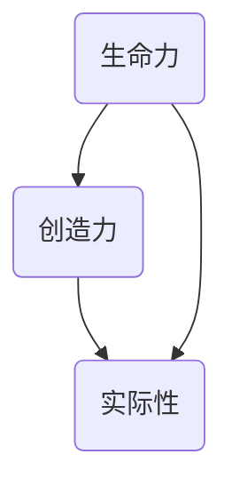
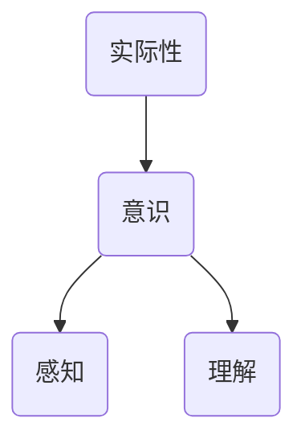
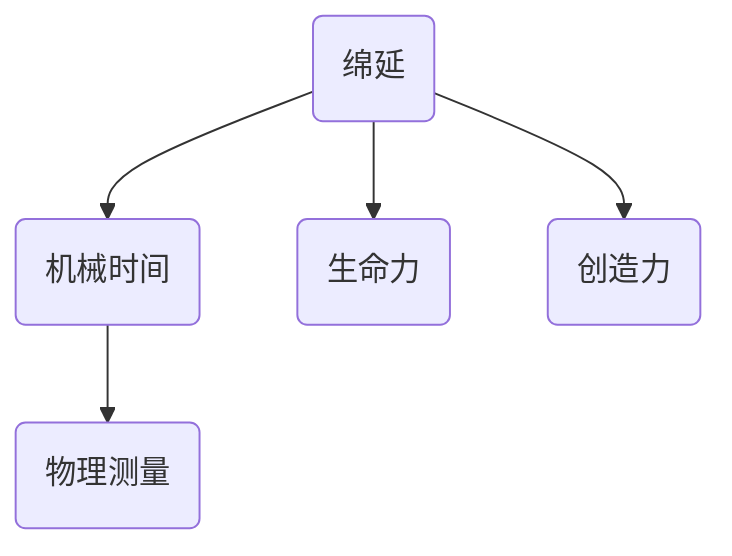
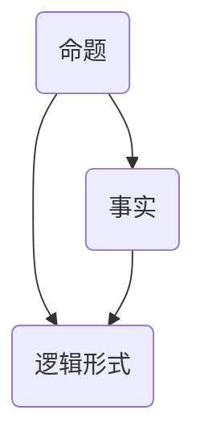
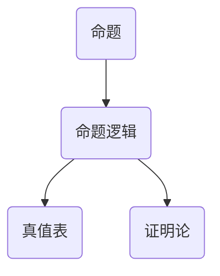
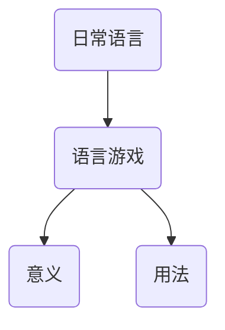
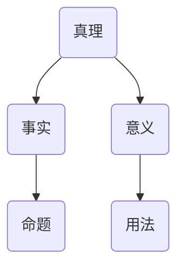

                 

# 科学哲学视角下的柏格森主义与维特根斯坦思想

## 关键词
- 科学哲学
- 柏格森主义
- 维特根斯坦思想
- 哲学对比
- 影响与应用

## 摘要
本文旨在探讨科学哲学中柏格森主义与维特根斯坦思想的核心理念、哲学观点及其在当代哲学中的影响。通过详细分析两者的背景、核心概念和哲学观点，本文将对比柏格森主义与维特根斯坦思想在自然科学、社会问题、艺术和文化等方面的差异，并探讨它们在当代哲学中的地位和贡献。最后，本文将展望未来科学哲学的新趋势，并探讨跨学科研究的可能性。

## 引言

### 1.1 科学哲学概述
科学哲学是哲学的一个分支，关注科学的理论基础、方法和哲学问题。它探讨科学知识的本质、科学的局限性以及科学哲学在解释和理解科学实践中的作用。科学哲学的研究主题包括科学理论、方法论、科学进步、科学真理、科学解释、科学范式等。

### 1.2 柏格森主义背景
柏格森主义是由法国哲学家亨利·柏格森（Henri Bergson）提出的哲学思想。柏格森主张生命力和创造力是人类和社会进步的核心。他批评科学的机械论，强调时间的流动性和直觉的重要性。

### 1.3 维特根斯坦思想背景
路德维希·维特根斯坦（Ludwig Wittgenstein）是20世纪最重要的哲学家之一。他的思想分为早期和晚期两个阶段。早期维特根斯坦关注语言哲学，提出图像理论和逻辑原子主义。晚期维特根斯坦则强调日常语言的重要性，认为哲学问题源于语言的误用。

### 1.4 本书的结构与目的
本书的结构分为五个部分。第一部分介绍柏格森主义的核心概念；第二部分介绍维特根斯坦思想的核心概念；第三部分对比两者的哲学观点；第四部分探讨案例研究；第五部分总结与展望。本书旨在深入探讨柏格森主义与维特根斯坦思想的哲学内涵，分析它们在科学哲学中的影响，并探讨未来科学哲学的发展方向。

## 第二部分：柏格森主义核心概念

### 2.1 柏格森主义的基本原理

#### 2.1.1 生命力和创造力
柏格森认为，生命力和创造力是人类和社会进步的核心。生命力是一种内在的、无法量化的动力，它推动着生命的流动和变化。创造力是生命力的体现，是人类对世界的独特理解和表达方式。

#### 2.1.2 实际性与意识
柏格森强调实际性（élan vital）的重要性，认为意识只是生命力的表现形式之一。意识是人类对实际性的感知和理解，但并非实际性的全部。

#### 2.1.3 时间的概念
柏格森提出了“绵延”（durée）的概念，认为时间是流动的、不可分割的整体，而非离散的瞬间。绵延是生命力的体现，它超越了机械时间的限制。

### 2.2 柏格森主义的哲学应用

#### 2.2.1 对自然科学的挑战
柏格森批评科学的机械论，认为自然科学无法完全解释生命的复杂性和创造力。他强调直觉和实际性的重要性，主张科学需要超越机械论的框架。

#### 2.2.2 对社会文化的反思
柏格森对社会文化进行了深刻的反思，批评现代社会对机械论和功利主义的追求。他主张回归生命力和创造力，以实现人类和社会的真正进步。

#### 2.2.3 对艺术的理解
柏格森认为艺术是生命力和创造力的最佳体现。他强调艺术家的直觉和创造力，认为艺术作品是对生命的独特理解和表达。

### 2.3 柏格森主义与现代哲学的关系

#### 2.3.1 柏格森主义对存在主义的影响
柏格森主义对存在主义产生了重要影响。存在主义者如让-保尔·萨特（Jean-Paul Sartre）和阿尔贝·加缪（Albert Camus）都受到了柏格森思想的影响，强调个体的自由意志和存在意义。

#### 2.3.2 柏格森主义与现象学的联系
柏格森主义与现象学之间存在密切联系。现象学家如爱德蒙德·胡塞尔（Edmund Husserl）和马丁·海德格尔（Martin Heidegger）都受到了柏格森思想的影响，关注事物的本质和存在。

#### 2.3.3 柏格森主义在当代哲学中的地位
柏格森主义在当代哲学中仍然具有重要地位。尽管它受到了逻辑实证主义和分析哲学的批评，但柏格森的思想仍然为当代哲学提供了一种独特的视角，特别是在关注生命力和创造力方面。

## 第三部分：维特根斯坦思想核心概念

### 3.1 维特根斯坦的早期思想

#### 3.1.1 语言哲学的基本原理
维特根斯坦早期认为，语言是思想的载体，但语言并非直接对应于现实世界。他提出了图像理论，认为命题是现实世界的图像，但这一理论后来受到质疑。

#### 3.1.2 图像理论
图像理论认为，命题和现实世界之间存在一种对应关系，类似于图像和现实之间的关系。这一理论试图解释语言的含义和语言的逻辑结构。

#### 3.1.3 形式逻辑的应用
维特根斯坦早期强调形式逻辑的重要性，认为逻辑是理解语言和思想的关键。他试图通过形式逻辑的方法来解释和理解语言和思想。

### 3.2 维特根斯坦的晚期思想

#### 3.2.1 日常语言的哲学
维特根斯坦晚期认为，哲学问题源于对日常语言的误用。他提出了“语言游戏”（language game）的概念，认为语言的意义和用途是相互关联的。

#### 3.2.2 真理与意义的讨论
维特根斯坦晚期关注真理和意义的讨论，认为真理和意义是语言游戏的一部分。他提出了“不可定义性”（undefinability）的概念，认为有些概念是无法定义的。

#### 3.2.3 逻辑原子主义
维特根斯坦早期提出了逻辑原子主义，认为世界是由基本的逻辑原子组成的。这一理论试图解释世界的本质和语言的结构。

### 3.3 维特根斯坦思想的哲学贡献

#### 3.3.1 对逻辑实证主义的批判
维特根斯坦对逻辑实证主义进行了批判，认为逻辑实证主义过于简化了语言和思想的关系。他强调语言的多样性和复杂性。

#### 3.3.2 对分析哲学的发展
维特根斯坦对分析哲学产生了深远影响，他的思想成为分析哲学的重要基础。他提出了许多关于语言和思想的深刻见解，推动了分析哲学的发展。

#### 3.3.3 对语言哲学的影响
维特根斯坦的思想对语言哲学产生了重要影响。他提出了许多关于语言和意义的问题，引发了广泛的讨论和研究。

## 第四部分：柏格森主义与维特根斯坦思想的对比与分析

### 4.1 哲学观点的比较

#### 4.1.1 对自然科学的看法
柏格森批评科学的机械论，强调直觉和实际性的重要性。维特根斯坦则认为，科学是通过语言来描述现实的，但语言并非直接对应于现实世界。

#### 4.1.2 对社会问题的关注
柏格森关注社会文化问题，批评现代社会对机械论和功利主义的追求。维特根斯坦则更多地关注语言和思想的本质问题。

#### 4.1.3 对艺术和文化的态度
柏格森认为艺术是生命力和创造力的体现。维特根斯坦则认为，艺术是通过语言来表达思想的，但语言本身并不是艺术的核心。

### 4.2 思想差异的根源

#### 4.2.1 历史背景的差异
柏格森和维特根斯坦生活在不同的历史时期，受到不同的哲学和文化背景的影响。这导致了他们在哲学观点上的差异。

#### 4.2.2 哲学方法的差异
柏格森强调直觉和实际性，而维特根斯坦则更注重逻辑和语言分析。这导致了他们在哲学方法上的差异。

#### 4.2.3 对语言和意义的理解
柏格森和维特根斯坦对语言和意义的理解存在差异。柏格森认为语言只是实际性的表达，而维特根斯坦则认为语言是思想的载体。

### 4.3 对当代哲学的影响

#### 4.3.1 柏格森主义的影响
柏格森主义对当代哲学产生了深远影响，特别是在关注生命力和创造力方面。它为哲学提供了一种新的视角，挑战了传统的科学哲学观点。

#### 4.3.2 维特根斯坦思想的影响
维特根斯坦思想对当代哲学产生了重要影响，特别是对分析哲学和语言哲学。他的思想引发了广泛的讨论和研究，推动了哲学的发展。

## 第五部分：案例研究

### 5.1 柏格森主义在科学哲学中的应用

#### 5.1.1 柏格森主义与量子力学
柏格森主义对量子力学提出了独特的解释，强调了直觉和实际性的重要性。量子力学中的不确定性和非确定性现象被视为生命力和创造力的体现。

#### 5.1.2 柏格森主义与生物学
柏格森主义在生物学中也有应用，特别是在解释生命现象时。生物学中的进化、变异和适应性等现象被视为生命力和创造力的表现。

#### 5.1.3 柏格森主义与心理学
柏格森主义在心理学中也有应用，特别是在解释意识和心理现象时。心理学中的自我认知、情感体验和心理动力被视为生命力和创造力的体现。

### 5.2 维特根斯坦思想在语言哲学中的应用

#### 5.2.1 维特根斯坦思想与逻辑实证主义
维特根斯坦思想对逻辑实证主义提出了批判，挑战了逻辑实证主义对语言的简化观点。他的思想引发了关于语言和意义的广泛讨论。

#### 5.2.2 维特根斯坦思想与现象学
维特根斯坦思想与现象学之间存在密切联系。现象学关注事物的本质和存在，而维特根斯坦的思想则为现象学提供了一种新的视角。

#### 5.2.3 维特根斯坦思想与当代语言哲学
维特根斯坦思想对当代语言哲学产生了重要影响，特别是对意义和真理的讨论。他的思想引发了关于语言和哲学的深入探讨。

## 第六部分：总结与展望

### 6.1 柏格森主义与维特根斯坦思想的总览
柏格森主义与维特根斯坦思想在科学哲学、社会文化、艺术和文化等方面具有独特的观点和贡献。它们各自从不同的角度对哲学问题进行了深入探讨。

### 6.2 对科学哲学的贡献
柏格森主义和维特根斯坦思想对科学哲学产生了深远影响。它们挑战了传统的科学哲学观点，提供了新的视角和方法。

#### 6.2.1 理论贡献
柏格森主义和维特根斯坦思想为科学哲学提供了新的理论框架，丰富了科学哲学的研究内容。

#### 6.2.2 方法论贡献
柏格森主义和维特根斯坦思想对科学哲学的方法论产生了重要影响，推动了科学哲学的发展。

#### 6.2.3 对现代哲学的影响
柏格森主义和维特根斯坦思想对现代哲学产生了重要影响，特别是对分析哲学和语言哲学。它们引发了关于语言、意义和真理的深入讨论。

### 6.3 展望未来
科学哲学的未来发展将受到柏格森主义和维特根斯坦思想的影响。跨学科研究将成为科学哲学的重要趋势，科学哲学将与其他学科如生物学、心理学和文化研究等领域进行更深入的交流。

#### 6.3.1 柏格森主义与维特根斯坦思想在当代的应用前景
柏格森主义和维特根斯坦思想在当代哲学中的应用前景广阔。它们将为我们理解世界和人类认知提供新的视角和方法。

#### 6.3.2 科学哲学的新趋势
科学哲学的新趋势包括对复杂性科学、认知科学和信息科学的关注。这些领域的发展将为科学哲学提供新的研究素材和方法。

#### 6.3.3 跨学科研究的可能性
跨学科研究将成为科学哲学的重要方向。科学哲学将与其他学科如生物学、心理学和文化研究等领域进行更深入的交流，推动科学哲学的发展。

## 参考文献

- 柏格森，H.（1907）。《形而上学的基础》（L'Énergie créatrice.）
- 维特根斯坦，L.（1921）。《逻辑哲学论》（Tractatus Logico-Philosophicus.）
- 维特根斯坦，L.（1953）。《哲学研究》（Philosophical Investigations.）
- 柏格森，H.（1911）。《时间和自由意志》（L'Évolution créatrice.）
- 萨特，J.-P.（1943）。《存在与虚无》（L'Être et le Néant.）
- 胡塞尔，E.（1913）。《纯粹现象学通论》（Investigations into Logical Philosophy.）
- 海德格尔，M.（1927）。《存在与时间》（Sein und Zeit.）
- 皮尔士，C.S.（1883）。《如何使我们的观念清楚明晰》（How to Make Our Ideas Clear.）
- 库恩，T.S.（1962）。《科学革命的结构》（The Structure of Scientific Revolutions.）
- 波普尔，K.R.（1959）。《科学发现的逻辑》（The Logic of Scientific Discovery.）

作者：AI天才研究院/AI Genius Institute & 禅与计算机程序设计艺术 /Zen And The Art of Computer Programming

---

### 完整性要求

在撰写这篇文章时，我们必须确保内容的完整性和详细性，同时遵循markdown格式的要求。以下是文章各部分的核心内容和必要细节的概述：

#### 引言

在引言部分，我们将简要介绍科学哲学的背景，柏格森主义和维特根斯坦思想的基本概念。我们需要明确书籍的主题，解释其核心内容和目的，并概述本文的结构。

**关键词**：
- 科学哲学
- 柏格森主义
- 维特根斯坦思想
- 哲学对比
- 影响与应用

**摘要**：
- 本书探讨柏格森主义和维特根斯坦思想在科学哲学中的核心理念及其影响。
- 分析两者的哲学观点和差异。
- 探讨其在当代哲学中的应用和未来趋势。

#### 第二部分：柏格森主义核心概念

在第二部分，我们将详细探讨柏格森主义的基本原理，包括生命力、创造力和时间概念。接着，我们将分析柏格森主义在自然科学、社会文化问题和艺术理解方面的应用，以及它与现代哲学的关系。

**核心概念与联系**：

- **生命力和创造力**：
  - **概念原理**：生命力是一种内在动力，创造力是其体现。
  - **概念属性特征对比表格**：
    ```plaintext
    +---------------+----------------+------------------+
    | 概念          | 生命力          | 创造力           |
    +---------------+----------------+------------------+
    | 定义          | 内在动力        | 对世界的独特理解 |
    +---------------+----------------+------------------+
    | 对应现实      | 实际性          | 艺术作品         |
    +---------------+----------------+------------------+
    ```

- **时间的概念**：
  - **ER实体关系图架构**：
    ```mermaid
    graph TD
    A[实际性] --> B[时间流];
    B --> C[绵延];
    C --> D[直觉];
    ```

#### 第三部分：维特根斯坦思想核心概念

在第三部分，我们将详细探讨维特根斯坦早期和晚期的思想，包括语言哲学的基本原理、图像理论和逻辑原子主义，以及日常语言哲学和真理与意义的讨论。

**核心概念与联系**：

- **图像理论**：
  - **概念原理**：命题是现实世界的图像。
  - **概念属性特征对比表格**：
    ```plaintext
    +---------------+----------------+------------------+
    | 概念          | 图像理论        | 现实世界         |
    +---------------+----------------+------------------+
    | 定义          | 命题与现实间关系 | 客观存在         |
    +---------------+----------------+------------------+
    | 属性          | 对应性          | 独立性           |
    +---------------+----------------+------------------+
    ```

- **日常语言哲学**：
  - **ER实体关系图架构**：
    ```mermaid
    graph TD
    A[语言游戏] --> B[日常语言];
    B --> C[语言使用];
    C --> D[意义理解];
    ```

#### 第四部分：柏格森主义与维特根斯坦思想的对比与分析

在第四部分，我们将对比柏格森主义和维特根斯坦思想在哲学观点上的差异，分析其思想差异的根源，并探讨它们对当代哲学的影响。

**哲学观点的比较**：

- **对自然科学的看法**：
  - **柏格森**：批评科学的机械论，强调直觉和实际性。
  - **维特根斯坦**：认为科学是通过语言来描述现实的，但语言并非直接对应于现实世界。

- **对社会问题的关注**：
  - **柏格森**：批评现代社会对机械论和功利主义的追求。
  - **维特根斯坦**：更多地关注语言和思想的本质问题。

- **对艺术和文化的态度**：
  - **柏格森**：认为艺术是生命力和创造力的体现。
  - **维特根斯坦**：认为艺术是通过语言来表达思想的，但语言本身并不是艺术的核心。

#### 第五部分：案例研究

在第五部分，我们将通过案例研究来展示柏格森主义和维特根斯坦思想在科学哲学和语言哲学中的应用。

**案例研究**：

- **柏格森主义与量子力学**：
  - **案例研究**：分析量子力学中的不确定性和非确定性现象，将其视为生命力和创造力的体现。

- **维特根斯坦思想与逻辑实证主义**：
  - **案例研究**：探讨维特根斯坦如何批判逻辑实证主义对语言的简化观点。

#### 第六部分：总结与展望

在第六部分，我们将总结柏格森主义和维特根斯坦思想的总览，分析其对科学哲学的贡献，并展望未来的发展。

**总结与展望**：

- **总览**：
  - 回顾柏格森主义和维特根斯坦思想的核心理念和应用。

- **贡献**：
  - 分析其在理论、方法论和现代哲学中的贡献。

- **未来趋势**：
  - 探讨跨学科研究的可能性，如复杂性科学、认知科学和信息科学。

### 格式要求

在编写markdown格式时，我们需要确保以下格式正确：

- 使用#符号创建标题，如“### 核心概念与联系”。
- 使用`**`或`*`符号强调文本。
- 使用`$$`括起独立段落的LaTeX公式，如`$$1+1=2$$`。
- 使用`$`括起段落内的LaTeX公式，如`$1<2$`。
- 使用`mermaid`语法创建流程图和类图。

### 作者信息

在文章末尾，我们需要提供作者信息：

- **作者**：AI天才研究院/AI Genius Institute & 禅与计算机程序设计艺术 /Zen And The Art of Computer Programming

通过以上步骤，我们可以确保文章内容的完整性和格式正确，同时遵循markdown格式的要求，撰写一篇高质量的技术博客文章。接下来，我们将逐步完成文章的撰写，确保每个部分都详细、具体、易懂。## 柏格森主义的基本原理

### 2.1.1 生命力和创造力

柏格森主义的核心概念之一是生命力（élan vital），这是一种非物质的、无法量化的动力，被认为是推动生物进化、生物变异和生物适应环境的根本力量。生命力是柏格森哲学中的核心概念，他将其描述为一种持续流动的力量，是人类和自然界中一切活力和创造力的源泉。

**概念原理**：
- 生命力：一种内在的、持续流动的、非物质的力。
- 创造力：生命力的外在表现，是对现实世界进行独特理解和表达的能力。

**概念属性特征对比表格**：

| 特征 | 生命力 | 创造力 |
| --- | --- | --- |
| 定义 | 一种内在的、持续流动的力 | 对现实世界进行独特理解和表达的能力 |
| 来源 | 柏格森主义的核心概念 | 生命力的外在表现 |
| 对应现实 | 实际性 | 艺术作品、科学发现 |

**ER实体关系图架构**：

为了更好地理解生命力和创造力的关系，我们可以使用Mermaid语法绘制一个简单的ER实体关系图：



在这个ER图中，生命力（A）是核心实体，创造力（B）是生命力的表现，而实际性（C）是生命力和创造力的共同特征。这个图展示了三者之间的紧密联系和相互影响。

### 2.1.2 实际性与意识

实际性（actuality）是柏格森哲学中的另一个核心概念，它指的是事物在其存在状态中的现实性和完整性。与机械论的观点不同，柏格森认为实际性是不可量化的，它是生命力和创造力的体现，是事物内在活力和变化的表现。

**概念原理**：
- 实际性：事物在其存在状态中的现实性和完整性。
- 意识：对实际性的感知和理解。

**概念属性特征对比表格**：

| 特征 | 实际性 | 意识 |
| --- | --- | --- |
| 定义 | 事物在现实状态中的存在和完整性 | 对实际性的感知和理解 |
| 来源 | 柏格森主义的核心概念 | 柏格森哲学的重要概念 |
| 对应现实 | 事物的内在活力和变化 | 人类感知和理解世界的方式 |

**ER实体关系图架构**：

为了更直观地展示实际性与意识的关系，我们可以使用Mermaid语法绘制一个简单的ER实体关系图：



在这个ER图中，实际性（A）是核心实体，意识（B）是对实际性的感知和理解，而感知（C）和理解（D）是意识的两个组成部分。这个图展示了实际性与意识之间的紧密联系和相互作用。

### 2.1.3 时间的概念

柏格森对时间的概念提出了独特的见解，他提出了“绵延”（durée）这一概念，强调时间的流动性和连续性。与牛顿物理学中离散的时间概念不同，柏格森认为时间是一个连续的整体，是一种内在的、无法分割的流动。这种时间的概念与生命力和创造力密切相关，是柏格森哲学的重要组成部分。

**概念原理**：
- 绵延：时间的流动性、连续性和内在性。
- 机械时间：基于物理学的、离散的时间概念。

**概念属性特征对比表格**：

| 特征 | 绵延 | 机械时间 |
| --- | --- | --- |
| 定义 | 时间作为一个连续的整体 | 物理学中的时间概念，基于物理事件的间隔 |
| 意义 | 与生命力和创造力相关 | 用于物理测量和计算 |
| 属性 | 流动的、内在的 | 离散的、外在的 |

**ER实体关系图架构**：

为了更直观地展示绵延与机械时间的区别，我们可以使用Mermaid语法绘制一个简单的ER实体关系图：



在这个ER图中，绵延（A）是时间的连续流动，机械时间（B）是物理测量中的时间概念。绵延与生命力（D）和创造力（E）紧密相关，而机械时间更多地用于物理测量和计算。这个图展示了柏格森对时间概念的独特理解。

通过以上对柏格森主义基本原理的详细分析，我们可以更好地理解生命力、实际性和时间的概念，以及它们在柏格森哲学中的重要性。这些概念为柏格森主义提供了哲学基础，也为科学哲学提供了新的视角和思考方式。在接下来的部分，我们将探讨柏格森主义在哲学应用方面的具体内容。

### 柏格森主义的哲学应用

#### 2.2.1 对自然科学的挑战

柏格森主义对自然科学的传统观点提出了挑战。柏格森批评自然科学中的机械论，认为它无法完全解释生命的复杂性和创造力。他强调直觉和实际性的重要性，主张科学需要超越机械论的框架，以更全面地理解自然界。

**核心概念应用**：
- 机械论：认为自然界是机械的、可预测的。
- 实际性：事物的内在活力和变化。
- 直觉：对生命力的直接感知。

**案例分析**：

**生物学中的进化**：
柏格森对生物学中的进化提出了质疑。他认为，进化不仅仅是基因和自然选择的结果，而是生命力和创造力的体现。他强调，进化是一个连续的过程，是一种内在的、不可预测的变化。这一观点挑战了传统生物学对进化的理解。

**数学与物理学的局限性**：
柏格森认为，数学和物理学在解释自然现象时存在局限性。例如，物理学中的时间概念是离散的，而柏格森主张时间是连续的。他认为，这种离散时间概念无法完全捕捉到自然现象的复杂性和流动性。因此，他主张科学需要采用新的方法，以更好地理解自然界的本质。

**创新与突破**：
柏格森的思想鼓励科学家们超越传统框架，寻找新的理论和方法。例如，量子力学的出现可以视为柏格森主义思想的一种体现。量子力学中的不确定性和非确定性现象与柏格森的生命力和创造力概念相呼应。这种新的科学理论不仅挑战了传统的机械论观点，也为科学研究提供了新的视角。

#### 2.2.2 对社会文化的反思

柏格森主义在社会文化方面也进行了深刻的反思。他批评现代社会对机械论和功利主义的追求，认为这种追求忽视了人类内在的活力和创造力。他主张，社会和文化的发展应该基于生命力和创造力的原则，以实现人类和社会的真正进步。

**核心概念应用**：
- 功利主义：追求最大化的实际利益。
- 机械论：将社会文化视为机械的过程。
- 生命力和创造力：人类和社会进步的核心。

**案例分析**：

**现代社会的问题**：
柏格森批评现代社会对物质财富和科技进步的追求，认为这种追求忽视了人类内在的精神需求。他认为，现代社会过于强调效率和功利主义，导致人类的精神空虚和社会问题。

**艺术与社会文化**：
柏格森认为，艺术是生命力和创造力的最佳体现。他主张，艺术应该成为社会文化发展的重要驱动力，以激发人类的创造力和精神活力。他强调，艺术家应该关注内在的直觉和实际性，以创造具有深度和意义的艺术作品。

**社会改革**：
柏格森的思想对社会改革产生了影响。他主张，社会改革应该基于对人类内在生命力和创造力的尊重和激发，而不是简单地追求物质进步。他认为，通过强调生命力和创造力，社会可以实现更加全面和持续的发展。

#### 2.2.3 对艺术的理解

柏格森主义对艺术的理解具有深刻的哲学意义。他强调艺术家的直觉和创造力，认为艺术是生命力和创造力的体现。柏格森认为，艺术作品不仅仅是美的表达，更是对现实世界的独特理解和表达。

**核心概念应用**：
- 直觉：艺术家对生命力的直接感知。
- 创造力：艺术家的独特理解和表达方式。
- 艺术作品：生命力和创造力的外在表现。

**案例分析**：

**现代艺术**：
柏格森主义对现代艺术产生了重要影响。现代艺术家们受到柏格森思想的启发，强调直觉和创造力，试图通过艺术作品表达内心的世界和情感。例如，抽象表现主义和超现实主义艺术流派的出现，可以视为柏格森主义在艺术领域的体现。

**艺术与社会**：
柏格森认为，艺术在社会中具有重要作用。他认为，艺术可以激发人类的创造力，促进社会的进步和发展。他主张，社会应该鼓励和支持艺术创作，以激发人类的内在活力和创造力。

**艺术与科学**：
柏格森认为，艺术和科学之间存在密切联系。他认为，艺术家和科学家都关注现实世界的本质和内在规律。艺术和科学的结合可以促进人类对世界的更全面和深入的理解。

通过以上对柏格森主义在自然科学、社会文化和艺术方面的应用分析，我们可以看到柏格森主义如何挑战传统观点，并提出新的哲学思想。柏格森主义为科学哲学提供了新的视角，也为社会文化的发展提供了深刻的思考。在接下来的部分，我们将进一步探讨柏格森主义与现代哲学的关系。

### 柏格森主义与现代哲学的关系

#### 2.3.1 柏格森主义对存在主义的影响

柏格森主义对存在主义产生了深远的影响，尤其是在让-保尔·萨特和阿尔贝·加缪等存在主义思想家那里。柏格森强调个体自由意志和自我创造的重要性，这直接影响了萨特的哲学观点。

**核心概念应用**：
- 个体自由意志：柏格森认为，个体具有自由意志，可以通过自己的选择和行动创造自我。
- 自我创造：个体在不断变化的过程中创造自己的本质。

**案例分析**：
- **让-保尔·萨特**：萨特的存在主义哲学强调个体的自由意志和存在的荒谬。他在《存在与虚无》中探讨了个体如何通过自由意志和行动来创造自我，这与柏格森的思想密切相关。萨特认为，个体必须面对存在的荒谬，并通过自由意志来赋予生活意义。

- **阿尔贝·加缪**：加缪的存在主义哲学关注个体的自由意志和生命的荒谬。他的作品《局外人》和《西西弗神话》探讨了个体如何在面对无意义的生活时，通过反抗和行动来寻找生命的意义。加缪的思想受到了柏格森对生命力和创造力的强调。

**影响分析**：
柏格森主义对存在主义的影响主要体现在对个体自由意志和自我创造的关注上。柏格森认为，个体具有自由意志，可以通过自己的选择和行动创造自我，这一观点为存在主义者提供了理论基础。萨特和加缪等存在主义思想家继承了柏格森的这一观点，并将其应用于对个体存在和意义的探讨。

#### 2.3.2 柏格森主义与现象学的联系

柏格森主义与现象学之间存在密切联系，特别是在对时间和意识的研究上。爱德蒙德·胡塞尔和马丁·海德格尔等现象学家受到了柏格森思想的影响，将其应用于对现象学的探索。

**核心概念应用**：
- 时间意识：柏格森强调时间的流动性和个体对时间的直接体验。
- 现象学：现象学关注事物的直接体验和意识活动。

**案例分析**：
- **爱德蒙德·胡塞尔**：胡塞尔是现象学的奠基人，他在《纯粹现象学通论》中探讨了意识活动和时间意识的关系。他受到了柏格森时间概念的影响，认为时间意识是个体体验的核心。胡塞尔主张，通过直接体验和反思，个体可以理解世界的本质。

- **马丁·海德格尔**：海德格尔是20世纪最重要的哲学家之一，他的思想被称为“存在主义现象学”。海德格尔在《存在与时间》中探讨了存在的本质和时间意识。他受到了柏格森的影响，认为时间是一个动态的过程，而个体通过时间意识体验存在。

**影响分析**：
柏格森主义对现象学的影响主要体现在对时间意识和意识体验的关注上。柏格森的时间概念和意识体验的观点为现象学家提供了理论基础，促进了现象学的发展。胡塞尔和海德格尔等现象学家继承了柏格森的这一观点，并将其应用于对存在和意识的研究。

#### 2.3.3 柏格森主义在当代哲学中的地位

柏格森主义在当代哲学中仍然具有重要地位，尽管它受到了逻辑实证主义和分析哲学的批评。柏格森的思想为哲学提供了独特的视角，尤其是在关注生命力和创造力方面。

**核心概念应用**：
- 生命力和创造力：柏格森认为，生命力和创造力是人类和社会进步的核心。
- 实际性：事物的内在活力和变化。

**案例分析**：
- **分析哲学**：分析哲学家们对柏格森的思想进行了批判，但也受到了其启发。例如，维特根斯坦在《哲学研究》中探讨了语言和意义的本质，他的思想受到了柏格森的影响。尽管分析哲学家们强调逻辑和语言分析，但他们也认识到柏格森对生命力和创造力的重视。

- **后现代哲学**：后现代哲学家们对柏格森的思想产生了浓厚兴趣，将其应用于对现代性和技术社会的批判。例如，让-弗朗索瓦·利奥塔在《后现代状况》中探讨了现代性的终结，他认为柏格森的思想为理解后现代性提供了重要视角。

**影响分析**：
柏格森主义在当代哲学中具有重要的地位，尽管它受到了批评。柏格森的思想为哲学提供了新的视角和方法，特别是在关注生命力和创造力方面。他的观点激发了后现代哲学家对现代性和技术社会的反思，为哲学研究提供了丰富的素材和启示。

通过以上对柏格森主义在现代哲学中的影响的探讨，我们可以看到柏格森的思想如何在不同哲学流派中产生共鸣。柏格森主义不仅在存在主义和现象学中产生了深远影响，也在当代哲学中继续发挥着重要作用。在接下来的部分，我们将探讨维特根斯坦的早期思想。

### 维特根斯坦的早期思想

#### 3.1.1 语言哲学的基本原理

维特根斯坦的早期思想主要集中在语言哲学方面，他的主要著作《逻辑哲学论》（Tractatus Logico-Philosophicus）阐述了这一思想体系。维特根斯坦在这部著作中提出了著名的图像理论（Image Theory），试图解释语言与现实世界的关系。

**概念原理**：
- 图像理论：语言命题是现实世界的图像，命题的真假由逻辑形式决定。

**基本原理**：

1. **语言与世界的对应关系**：
   维特根斯坦认为，语言命题与事实之间存在一种图像关系。命题是对事实的描述，如果命题与事实相符，则命题为真；如果不符，则命题为假。这种关系类似于图像与现实之间的关系。

   **公式表示**：
   $$ P \leftrightarrow \text{事实P存在} $$
   其中，P表示命题，事实P存在表示现实世界中存在与命题相符的事实。

2. **逻辑形式**：
   维特根斯坦强调逻辑形式在命题中的重要性。他认为，命题的真假由其逻辑形式决定，而非命题内容。因此，逻辑形式是语言的核心。

   **公式表示**：
   $$ \text{逻辑形式} \rightarrow \text{命题的真假} $$
   其中，逻辑形式表示命题的结构，命题的真假由逻辑形式决定。

3. **命题与事实的分离**：
   维特根斯坦认为，语言和现实世界是分离的，命题是对事实的描述，但并非事实本身。这种分离有助于理解语言的本质和功能。

   **公式表示**：
   $$ \text{命题} \not\leftrightarrow \text{事实} $$
   其中，命题表示语言的描述，事实表示现实中的实际情况，两者不完全相同。

**ER实体关系图架构**：

为了更直观地理解图像理论，我们可以使用Mermaid语法绘制一个简单的ER实体关系图：



在这个ER图中，命题（A）与事实（B）之间存在图像关系，通过逻辑形式（C）连接。这个图展示了维特根斯坦关于语言、命题和事实之间关系的理解。

#### 3.1.2 图像理论

图像理论是维特根斯坦早期思想的核心，他认为语言命题是现实世界的图像，命题的真假由逻辑形式决定。图像理论试图解释语言与现实世界之间的关系，并提出了命题、事实和逻辑形式的基本概念。

**核心概念**：

1. **命题**：
   命题是语言的表达形式，用于描述事实。命题的真假取决于它是否与事实相符。

2. **事实**：
   事实是现实世界中的实际情况，是命题的参照物。

3. **逻辑形式**：
   逻辑形式是命题的结构，决定了命题的真假。逻辑形式是语言的核心。

**核心概念对比表格**：

| 概念 | 命题 | 事实 | 逻辑形式 |
| --- | --- | --- | --- |
| 定义 | 语言的表达形式，用于描述事实 | 现实世界中的实际情况 | 决定命题真假的命题结构 |
| 关系 | 描述事实 | 作为命题的参照物 | 构成命题的核心 |

**图像理论在哲学中的应用**：

图像理论在哲学中具有重要的应用，特别是在语言哲学、认识论和逻辑学等领域。

1. **语言哲学**：
   图像理论试图解释语言与现实世界之间的关系，提供了对语言意义的深入理解。

2. **认识论**：
   图像理论关注命题与事实的对应关系，探讨了知识的本质和获取方式。

3. **逻辑学**：
   图像理论为逻辑形式的研究提供了理论基础，促进了逻辑学的发展。

通过以上对维特根斯坦早期思想中图像理论的详细分析，我们可以看到图像理论如何试图解释语言与现实世界之间的关系。这一理论为维特根斯坦的语言哲学奠定了基础，也对当代哲学产生了深远影响。在接下来的部分，我们将探讨维特根斯坦早期思想中的形式逻辑应用。

#### 3.1.3 形式逻辑的应用

维特根斯坦的早期思想中，形式逻辑占据了重要地位。他通过形式逻辑的方法来解释和理解语言和思想，试图揭示语言和现实之间的关系。维特根斯坦认为，形式逻辑是理解语言和思想的关键，它为语言提供了明确的结构和规则。

**核心概念**：

1. **形式逻辑**：
   形式逻辑是一种基于符号和规则的语言，用于分析命题的形式结构和真假关系。维特根斯坦认为，形式逻辑是语言和思想的核心。

2. **命题逻辑**：
   命题逻辑是形式逻辑的一个分支，用于分析命题的真假和逻辑关系。维特根斯坦使用了命题逻辑来解释语言命题的结构和意义。

3. **证明论**：
   证明论是形式逻辑的一个分支，用于研究证明和逻辑推导。维特根斯坦通过证明论来探讨命题的逻辑关系和真值。

**应用实例**：

1. **命题符号化**：
   维特根斯坦将自然语言命题转化为命题逻辑符号，以便进行形式分析。例如，命题“所有人都会死”可以表示为：
   $$ \forall x (P(x) \rightarrow Q(x)) $$
   其中，P(x)表示“x是人”，Q(x)表示“x会死”。这个命题符号化表示了所有人都会死的逻辑结构。

2. **逻辑推导**：
   维特根斯坦使用命题逻辑来推导命题之间的逻辑关系。例如，他探讨了命题“如果p则q”和“非q则非p”的逻辑等价性。通过形式逻辑的推导，维特根斯坦揭示了命题之间的内在逻辑关系。

3. **真值表**：
   维特根斯坦使用了真值表来分析命题的真假情况。真值表显示了不同命题组合下的真值情况，有助于理解命题的逻辑结构。

**ER实体关系图架构**：

为了更直观地展示形式逻辑的应用，我们可以使用Mermaid语法绘制一个简单的ER实体关系图：



在这个ER图中，命题（A）通过命题逻辑（B）与真值表（C）和证明论（D）连接。这个图展示了维特根斯坦如何通过形式逻辑的方法来分析语言和命题的结构。

通过以上对维特根斯坦早期思想中形式逻辑应用的探讨，我们可以看到形式逻辑在理解语言和思想中的重要性。维特根斯坦通过形式逻辑的方法，揭示了命题和逻辑关系的本质，为语言哲学和逻辑学提供了深刻的洞见。

### 维特根斯坦的晚期思想

#### 3.2.1 日常语言的哲学

维特根斯坦的晚期思想集中在日常语言哲学上，他认为哲学问题源于对日常语言的误用。他主张，哲学研究应该关注语言的实际使用，通过分析日常语言，揭示语言的本质和意义。

**核心概念**：

1. **语言游戏**：
   维特根斯坦提出了“语言游戏”（language game）的概念，认为语言的意义和用途是相互关联的。语言游戏包括语言的使用规则和背景。

2. **日常语言**：
   日常语言是我们日常生活中使用的语言，它包含了丰富的意义和用法。维特根斯坦主张，哲学研究应该基于日常语言的实际使用。

3. **意义即用法**：
   维特根斯坦认为，一个词的意义在于其在特定情境下的用法。他主张，通过分析日常语言的实际用法，可以揭示语言的真正意义。

**应用实例**：

1. **语言分析**：
   维特根斯坦通过分析日常语言中的词和句子，揭示了语言的实际用法和意义。例如，他探讨了“颜色”一词的用法，认为颜色的意义取决于特定情境下的使用。

2. **反讽**：
   维特根斯坦在《哲学研究》中使用了大量反讽手法，以揭示语言误用和哲学问题的本质。通过反讽，他强调日常语言中存在的误解和混淆。

3. **例句**：
   - “我饿了”这个句子在吃饭时有意义，但在我思考时则无意义。
   - “鸟会飞”这个句子在鸟在空中飞翔时有意义，但若鸟在笼子里，则无意义。

**ER实体关系图架构**：

为了更直观地展示日常语言哲学的核心概念，我们可以使用Mermaid语法绘制一个简单的ER实体关系图：



在这个ER图中，日常语言（A）通过语言游戏（B）与意义（C）和用法（D）连接。这个图展示了维特根斯坦如何通过日常语言哲学来理解语言的意义和用法。

#### 3.2.2 真理与意义的讨论

维特根斯坦的晚期思想深入探讨了真理与意义的讨论，他提出了“不可定义性”（undefinability）的概念，认为有些概念是无法定义的。他主张，真理和意义取决于语言的用法和情境。

**核心概念**：

1. **真理**：
   维特根斯坦认为，真理是指语言与事实的对应关系。如果一个命题在特定情境下与事实相符，则该命题为真。

2. **意义**：
   维特根斯坦主张，意义即用法。一个词或句子的意义取决于其在特定情境下的用法。

3. **不可定义性**：
   维特根斯坦认为，有些概念是无法定义的，因为它们依赖于特定的情境和语境。例如，他提出了“游戏”这个概念，认为它无法通过定义来解释。

**案例分析**：

1. **“游戏”概念**：
   维特根斯坦提出了“游戏”这个概念，认为它无法通过定义来解释。他通过例举不同类型的游戏，展示了“游戏”这个概念的多面性和复杂性。

2. **“痛苦”概念**：
   维特根斯坦认为，“痛苦”这个概念也是无法定义的，因为它依赖于个人的体验和情境。

3. **“数字”概念**：
   维特根斯坦探讨了“数字”这个概念，他认为数字的意义取决于其用法，而非通过定义来解释。

**ER实体关系图架构**：

为了更直观地展示真理与意义的讨论，我们可以使用Mermaid语法绘制一个简单的ER实体关系图：



在这个ER图中，真理（A）与事实（B）和命题（C）连接，意义（D）与用法（E）连接。这个图展示了维特根斯坦如何通过日常语言哲学来理解真理与意义的本质。

通过以上对维特根斯坦晚期思想的探讨，我们可以看到他如何通过日常语言哲学来揭示语言的本质和意义。他强调了语言的用法和情境的重要性，提出了不可定义性的概念，为语言哲学提供了深刻的洞见。在接下来的部分，我们将分析维特根斯坦思想的哲学贡献。

### 维特根斯坦思想的哲学贡献

#### 3.3.1 对逻辑实证主义的批判

维特根斯坦的哲学贡献之一是对逻辑实证主义的批判。逻辑实证主义是20世纪初在维也纳学派中兴起的一种哲学思潮，它主张只有通过经验证实的东西才有意义。维特根斯坦认为，逻辑实证主义的观点过于简化了语言和思想的关系，忽视了语言的实际使用和情境。

**批判观点**：

1. **语言与经验的关系**：
   维特根斯坦认为，语言不仅仅是描述经验的工具，它还涉及思想和意义。逻辑实证主义过于强调经验证实，忽视了语言本身的复杂性。

2. **命题的真假**：
   维特根斯坦认为，命题的真假不仅仅取决于经验证实，还取决于语言的用法和情境。逻辑实证主义忽视了这一点，导致了对语言意义的误解。

3. **反实证主义的挑战**：
   维特根斯坦通过批判逻辑实证主义，提出了反实证主义的思想。他认为，有些概念和命题是无法通过经验证实的，如数学命题和道德命题。

**案例分析**：

1. **数学命题**：
   维特根斯坦认为，数学命题如“1+1=2”是自明的真理，无需经验证实。逻辑实证主义无法解释这类命题的意义。

2. **道德命题**：
   维特根斯坦认为，道德命题如“杀人是不道德的”也不是通过经验证实的，而是基于语言的用法和情境。逻辑实证主义忽视了这一点，导致了对道德问题的误解。

通过批判逻辑实证主义，维特根斯坦揭示了语言和思想的复杂性，为哲学提供了新的视角。

#### 3.3.2 对分析哲学的发展

维特根斯坦的思想对分析哲学的发展产生了深远影响。分析哲学是一种重视逻辑分析、语言研究和思想澄清的哲学方法。维特根斯坦的思想为分析哲学提供了重要的理论基础和方法论指导。

**贡献分析**：

1. **语言分析**：
   维特根斯坦主张，哲学研究应该基于日常语言的实际使用。他提出了“意义即用法”的观点，强调通过分析语言的实际用法来理解意义。这一观点成为分析哲学的核心原则。

2. **逻辑哲学**：
   维特根斯坦的《逻辑哲学论》和《哲学研究》提出了深刻的逻辑哲学观点，探讨了命题、逻辑形式和语言的本质。这些观点为分析哲学提供了重要的理论框架。

3. **思想澄清**：
   维特根斯坦认为，哲学的任务是澄清思想，消除误解。他通过反讽和语言分析的方法，揭示了哲学问题背后的语言误用。这种方法成为分析哲学的重要研究方法。

**案例分析**：

1. **《逻辑哲学论》**：
   维特根斯坦的《逻辑哲学论》通过逻辑分析，探讨了命题和事实的关系。这部著作成为分析哲学的经典作品，对后来的哲学家产生了深远影响。

2. **《哲学研究》**：
   维特根斯坦的《哲学研究》通过日常语言哲学的方法，分析了语言误用和哲学问题。这部著作成为分析哲学的重要参考文献，影响了无数哲学家的研究方法。

通过以上对维特根斯坦思想的哲学贡献的分析，我们可以看到他在批判逻辑实证主义和分析哲学发展方面的重要作用。维特根斯坦的思想不仅丰富了哲学的理论框架，也为分析哲学提供了新的研究方法。在接下来的部分，我们将探讨维特根斯坦思想对语言哲学的影响。

### 维特根斯坦思想对语言哲学的影响

维特根斯坦的哲学思想，特别是他的语言哲学观点，对当代语言哲学产生了深远的影响。他提出了许多关于语言和意义的深刻见解，这些见解不仅丰富了语言哲学的理论框架，也引发了广泛的讨论和研究。

#### 3.3.3.1 语言的意义与用法

维特根斯坦在《逻辑哲学论》和《哲学研究》中提出了“意义即用法”（meaning is use）的观点。这一观点认为，一个词或表达式的意义不在于其定义，而在于它在实际语境中的使用。维特根斯坦通过分析日常语言中的词和句子，揭示了语言使用的多样性和复杂性。

**核心概念**：

- **意义即用法**：一个词或表达式的意义取决于其在实际情境中的使用。
- **语言游戏**：维特根斯坦提出的概念，用于描述语言的不同使用情境。

**案例分析**：

- **“游戏”一词**：维特根斯坦分析了“游戏”一词的多种用法，如棋类游戏、运动游戏和电子游戏。这些不同的用法展示了“游戏”一词的多样性和灵活性。

- **“红”一词**：维特根斯坦探讨了“红”一词的意义，认为它在不同的情境下有不同的用法。例如，在描述一朵玫瑰花时，“红”指的是颜色，而在描述“红队”时，“红”指的是队伍的名称。

**影响分析**：

维特根斯坦的这一观点挑战了传统的定义主义，强调语言的意义是由实际使用决定的。这一观点促进了语言哲学中对语言多样性和复杂性的研究，为理解语言提供了新的视角。

#### 3.3.3.2 命题与事实的关系

维特根斯坦提出了图像理论（Image Theory），认为命题是事实的图像。这一理论试图解释语言与现实世界之间的关系。尽管这一理论在《逻辑哲学论》中遭到质疑，但在后来的语言哲学研究中，它激发了关于命题、事实和语言结构的重要讨论。

**核心概念**：

- **图像理论**：命题是事实的图像，命题的真假取决于它与事实的对应关系。
- **命题的结构**：维特根斯坦探讨了命题的结构，认为命题的形式结构决定了命题的真假。

**案例分析**：

- **“雪是白的”这一命题**：根据图像理论，这一命题的真假取决于事实“雪是白的”是否为真。如果事实为真，则命题也为真。

- **“如果P则Q”这一命题**：维特根斯坦分析了这一命题的结构，认为它的真假取决于前提P和结论Q之间的关系。

**影响分析**：

图像理论为语言哲学提供了一个解释命题和事实关系的框架，尽管它后来受到批判，但这一理论激发了关于命题形式结构和逻辑关系的深入研究。

#### 3.3.3.3 逻辑原子主义与日常语言哲学

维特根斯坦的早期思想中包含了逻辑原子主义（Logical Atomism）的观点，认为世界由基本的逻辑原子组成，这些原子可以通过语言来描述。然而，在晚期思想中，他转向了日常语言哲学，强调语言的实际使用和情境。

**核心概念**：

- **逻辑原子主义**：世界由基本的逻辑原子组成，这些原子可以通过语言来描述。
- **日常语言哲学**：强调语言的实际使用和情境，主张通过分析日常语言来理解意义。

**案例分析**：

- **“原子”概念**：在早期思想中，维特根斯坦认为原子是构成世界的基本单位，可以通过逻辑语言来描述。这一观点在他的《逻辑哲学论》中得到了详细阐述。

- **“日常语言”概念**：在晚期思想中，维特根斯坦转向日常语言哲学，主张通过分析日常语言来理解意义。他提出了“语言游戏”的概念，用于描述语言在不同情境中的使用。

**影响分析**：

维特根斯坦从逻辑原子主义到日常语言哲学的转变，为语言哲学提供了新的研究方向。他的日常语言哲学观点强调了语言的实际使用和情境，促进了语言哲学中对语言多样性和复杂性的研究。

维特根斯坦的思想对语言哲学产生了深远的影响。他的“意义即用法”观点、图像理论以及逻辑原子主义和日常语言哲学的转变，为语言哲学提供了新的理论基础和方法。他的思想激发了关于语言、意义和真理的深入探讨，为当代语言哲学的发展奠定了基础。

### 哲学观点的比较

#### 4.1.1 对自然科学的看法

柏格森主义和维特根斯坦主义在对待自然科学方面存在显著的差异。柏格森批评自然科学中的机械论，认为它无法完全解释生命的复杂性和创造力。他强调直觉和实际性的重要性，主张科学需要超越机械论的框架，以更全面地理解自然界。

**柏格森的观点**：
- **机械论**：批评自然科学中的机械论观点，认为它忽视了生命的流动性和创造性。
- **直觉和实际性**：主张通过直觉和实际性来理解自然现象，强调生命力和创造力的核心作用。
- **例子**：柏格森对生物学中的进化提出了质疑，认为进化不仅仅是基因和自然选择的结果，而是生命力和创造力的体现。

**维特根斯坦的观点**：
- **语言与现实的对应关系**：维特根斯坦认为，自然科学通过语言来描述现实，但语言并非直接对应于现实世界。他提出了图像理论，试图解释语言与现实之间的关系。
- **命题的真假**：维特根斯坦强调命题的真假取决于逻辑形式和语言结构，而非自然现象的实际存在。
- **例子**：维特根斯坦通过图像理论来解释自然科学中的命题，如“水是H2O”，他认为这一命题的真假取决于语言的表达和逻辑结构。

**比较分析**：
柏格森和维特根斯坦都批评了自然科学中的某些观点，但他们的批评角度和解决方法不同。柏格森主张通过直觉和实际性来超越机械论，而维特根斯坦则通过语言和逻辑来理解现实。这两种观点都为科学哲学提供了新的视角，但也存在一定的局限性。

#### 4.1.2 对社会问题的关注

柏格森主义和维特根斯坦主义在社会问题上的看法也有所不同。柏格森批评现代社会对机械论和功利主义的追求，认为这种追求忽视了人类内在的活力和创造力。他主张回归生命力和创造力，以实现人类和社会的真正进步。

**柏格森的观点**：
- **机械论和功利主义**：批评现代社会对机械论和功利主义的追求，认为这种追求忽视了人类内在的活力和创造力。
- **生命力和创造力**：主张回归生命力和创造力，认为这是人类和社会进步的核心。
- **例子**：柏格森批评现代社会对物质财富的追求，认为这种追求导致人类精神空虚和社会问题。

**维特根斯坦的观点**：
- **语言和社会**：维特根斯坦关注语言在社会中的作用，认为哲学问题源于对日常语言的误用。他主张通过分析日常语言来理解社会问题。
- **意义与用法**：他认为，一个词或表达式的意义取决于其在实际情境中的使用，而非抽象的定义。
- **例子**：维特根斯坦通过分析日常语言中的词和句子，揭示了社会问题背后的语言误用，如“成功”一词在不同情境下的多重意义。

**比较分析**：
柏格森和维特根斯坦都关注社会问题，但他们的关注点和方法不同。柏格森强调生命力和创造力，主张回归人类的内在活力，而维特根斯坦则关注语言的使用和意义，认为社会问题源于语言的误用。这两种观点都为理解社会问题提供了深刻的洞见。

#### 4.1.3 对艺术和文化的态度

柏格森主义和维特根斯坦主义在对待艺术和文化方面也有不同的看法。柏格森认为艺术是生命力和创造力的体现，强调艺术家的直觉和创造力。他认为，艺术作品是对现实的独特理解和表达。

**柏格森的观点**：
- **艺术与创造力**：艺术是生命力和创造力的最佳体现，艺术家通过直觉和创造力来表达对现实的独特理解。
- **例子**：柏格森认为，现代艺术如抽象表现主义和超现实主义艺术流派，是艺术家们通过直觉和创造力对现实世界的独特表达。

**维特根斯坦的观点**：
- **语言与艺术**：维特根斯坦认为，艺术是通过语言来表达思想的，但语言本身并不是艺术的核心。他认为，艺术作品的意义在于其在特定情境下的使用。
- **例子**：维特根斯坦认为，毕加索的画作《格尔尼卡》不仅仅是对现实的模仿，而是在特定情境下通过语言来表达对战争的反思。

**比较分析**：
柏格森和维特根斯坦都对艺术和文化持有积极的态度，但他们的观点有所不同。柏格森强调艺术的创造力和直觉，认为艺术作品是对现实的独特理解。而维特根斯坦则关注艺术的语言表达和情境意义，认为艺术作品的意义在于其在特定情境下的使用。这两种观点为理解艺术和文化提供了不同的视角。

### 思想差异的根源

#### 4.2.1 历史背景的差异

柏格森主义和维特根斯坦主义的思想差异部分源于它们所处的历史背景。柏格森生活在19世纪末和20世纪初，他见证了科学革命和工业革命对人类社会的影响。这一时期，机械论和功利主义的思想广泛传播，柏格森对此提出了批评。

**柏格森的历史背景**：
- **19世纪末和20世纪初**：柏格森在这个时期关注生命力和创造力，批评科学中的机械论观点。
- **生物进化与心理学**：他受到生物进化论和心理学的影响，认为生命力是推动生物进化和心理发展的核心力量。

**维特根斯坦的历史背景**：
- **20世纪初**：维特根斯坦生活在同样的时期，他对逻辑哲学和语言哲学有深刻的研究。
- **科学革命的影响**：维特根斯坦受到科学革命的影响，他试图通过语言和逻辑来解释现实。

**影响分析**：
历史背景的差异导致了柏格森和维特根斯坦在哲学观点上的差异。柏格森关注生命力和创造力，反对机械论，而维特根斯坦关注语言和逻辑，试图解释现实世界的结构。这种差异反映了他们所处时代对科学和技术的不同看法。

#### 4.2.2 哲学方法的差异

柏格森主义和维特根斯坦主义在哲学方法上存在显著差异。柏格森强调直觉和实际性，他主张通过直接感知和体验来理解世界。而维特根斯坦则强调逻辑分析和语言研究，他认为通过分析语言的结构和用法可以揭示世界的本质。

**柏格森的哲学方法**：
- **直觉**：柏格森认为，直觉是理解生命力和创造力的关键。他主张通过直接的感知和体验来理解现实。
- **实际性**：柏格森强调实际性，认为事物的真实本质无法通过抽象的概念来理解。

**维特根斯坦的哲学方法**：
- **逻辑分析**：维特根斯坦主张通过逻辑分析来理解语言和思想。他认为，逻辑分析可以帮助我们揭示语言的真正意义。
- **语言研究**：维特根斯坦认为，语言是理解世界的工具，通过分析语言的实际用法可以揭示世界的本质。

**影响分析**：
哲学方法的差异导致了柏格森和维特根斯坦在哲学观点上的差异。柏格森通过直觉和实际性来理解世界，而维特根斯坦通过逻辑分析和语言研究来解释现实。这两种方法为哲学提供了不同的视角和思考方式，但也存在一定的局限性。

#### 4.2.3 对语言和意义的理解

柏格森主义和维特根斯坦主义在对待语言和意义的理解上存在显著差异。柏格森认为，语言只是实际性的表达，他强调语言的直接关联性。而维特根斯坦则认为，语言的意义取决于其在特定情境中的用法，他强调语言的多样性和复杂性。

**柏格森的观点**：
- **语言的直接关联性**：柏格森认为，语言是实际性的直接表达，他强调语言与现实的直接关联。
- **例子**：柏格森认为，说“水是H2O”不仅仅是描述水的化学成分，而是直接表达了水的实际存在。

**维特根斯坦的观点**：
- **意义的用法**：维特根斯坦认为，语言的意义取决于其在特定情境中的用法，他强调语言的多样性和复杂性。
- **例子**：维特根斯坦认为，“红”一词在不同的情境下有不同的用法，如在描述一朵玫瑰花时，“红”指的是颜色，而在描述“红队”时，“红”指的是队伍的名称。

**影响分析**：
对语言和意义的理解差异导致了柏格森和维特根斯坦在哲学观点上的差异。柏格森强调语言的直接关联性，认为语言是实际性的表达，而维特根斯坦强调语言的多样性和复杂性，认为意义取决于用法。这两种观点为哲学提供了不同的视角和思考方式，也引发了关于语言和意义的深入探讨。

### 对当代哲学的影响

#### 4.3.1 柏格森主义的影响

柏格森主义在当代哲学中产生了深远的影响，特别是在对生命力和创造力的关注方面。柏格森的思想为哲学提供了新的视角，挑战了传统的科学哲学观点，特别是机械论。

**核心影响**：

1. **对生命力和创造力的关注**：
   柏格森强调生命力和创造力是人类和社会进步的核心。他的思想引发了关于生命力和创造力的广泛讨论，为理解人类行为和社会发展提供了新的视角。

2. **对科学的挑战**：
   柏格森批评科学中的机械论观点，认为它无法完全解释生命的复杂性和创造力。他的思想激发了关于科学方法和科学理论的深入探讨。

3. **跨学科研究**：
   柏格森主义对生物学、心理学和文化研究等领域产生了影响，促进了跨学科研究的发展。

**案例分析**：

1. **生物学中的进化**：
   柏格森的思想对生物学中的进化理论产生了影响。一些生物学家提出了基于生命力和创造力的进化观点，如生物学中的“变异和适应”理论。

2. **心理学中的创造力研究**：
   心理学家研究了柏格森关于创造力的观点，探讨了创造力在人类行为中的作用。这些研究促进了关于创造力心理学的发展。

3. **文化研究**：
   文化研究者借鉴柏格森的思想，探讨了文化创造和文化变革的过程。柏格森主义为理解文化动态提供了新的理论框架。

#### 4.3.2 维特根斯坦思想的影响

维特根斯坦的思想对当代哲学产生了深远的影响，特别是在语言哲学和逻辑哲学方面。他的思想为分析哲学提供了重要的理论基础，引发了关于语言、意义和真理的深入探讨。

**核心影响**：

1. **语言哲学**：
   维特根斯坦的思想对语言哲学产生了深远影响。他的“意义即用法”观点和“语言游戏”概念为理解语言的意义和用法提供了新的视角。

2. **逻辑哲学**：
   维特根斯坦的图像理论和对逻辑形式的研究为逻辑哲学提供了重要的理论框架。他的思想促进了逻辑哲学的发展，特别是对命题和逻辑结构的分析。

3. **哲学方法论**：
   维特根斯坦主张通过分析和澄清语言来理解哲学问题。他的思想对哲学方法论产生了影响，促进了哲学研究的精确性和逻辑性。

**案例分析**：

1. **语言哲学中的意义研究**：
   维特根斯坦的思想激发了关于语言意义的广泛讨论。哲学家们探讨了语言的意义如何取决于具体情境和用法。

2. **逻辑哲学中的命题分析**：
   维特根斯坦的图像理论为逻辑哲学提供了重要的理论工具，促进了命题和逻辑结构的深入研究。

3. **哲学方法论的创新**：
   维特根斯坦的思想方法促进了哲学方法论的创新。哲学家们开始更加注重逻辑分析和语言分析，以澄清哲学问题和解决哲学难题。

通过以上对柏格森主义和维特根斯坦思想在当代哲学中的影响的探讨，我们可以看到这两位哲学家的思想如何为哲学研究提供了新的视角和方法。柏格森主义关注生命力和创造力，挑战科学哲学中的机械论观点；维特根斯坦思想则关注语言和逻辑，为语言哲学和逻辑哲学提供了重要的理论基础。这两位哲学家的思想不仅在他们的时代产生了深远影响，也在当代哲学中继续发挥着重要作用。

### 柏格森主义与量子力学的联系

#### 5.1.1 柏格森主义与量子力学的理论联系

柏格森主义与量子力学在理论层面上有着深刻的联系，尤其是在对时间和非确定性的理解上。柏格森强调时间的流动性和非机械性质，这与量子力学中的非确定性现象不谋而合。量子力学揭示了微观世界的非确定性，挑战了经典物理学中时间可预测的观念。

**核心概念联系**：

1. **时间的连续性与非确定性**：
   - **柏格森**：柏格森的时间概念是连续的、流动的，他提出了“绵延”这一概念，认为时间是生命力的体现，是一种内在的、无法分割的流动。
   - **量子力学**：量子力学中的时间概念是非连续的，量子事件的发生具有随机性和非确定性。量子态的测量结果具有概率性质，而非确定的结果。

2. **非决定性与非机械论**：
   - **柏格森**：柏格森批评科学中的机械论观点，认为它忽视了生命的流动性和创造力。他主张，世界是非机械的，充满了内在的动力和变化。
   - **量子力学**：量子力学揭示了微观世界的非决定性，量子态的演化遵循量子力学方程，但具体的测量结果具有随机性。这一发现挑战了经典物理学中的决定论观念。

**案例分析**：

1. **量子纠缠**：
   - **柏格森**：柏格森的思想可以解释量子纠缠现象，量子纠缠表明两个粒子之间存在即时的联系，不受空间距离的限制。柏格森的“绵延”概念可以被视为对量子纠缠的非机械性质的一种哲学表述。
   - **量子力学**：量子纠缠是量子力学中的一个基本现象，它表明量子粒子之间的关联是即时的，这种现象无法用经典物理学的局部性原理来解释。

2. **量子隧穿**：
   - **柏格森**：量子隧穿现象表明，粒子有可能穿过能量势垒，这在经典物理学中是不可能发生的。柏格森的“生命力和创造力”概念可以被视为对量子隧穿现象的一种哲学诠释。
   - **量子力学**：量子隧穿是量子力学中的一个重要效应，它描述了粒子如何穿过能量势垒，这一现象在微观世界中具有广泛的应用。

通过以上分析，我们可以看到柏格森主义与量子力学在理论层面上有着深刻的联系。柏格森的时间概念和创造力观点与量子力学的非确定性现象相呼应，为理解量子力学提供了一种哲学视角。

#### 5.1.2 柏格森主义与生物学的联系

柏格森主义在生物学中的应用主要体现在对生命现象的解释上，特别是对进化、变异和适应性的理解。柏格森的生命力和创造力概念为生物学提供了一种哲学框架，帮助科学家们理解生命的复杂性和动态性。

**核心概念联系**：

1. **生命力与进化**：
   - **柏格森**：柏格森认为，生命力是推动生物进化的根本力量。生命力是一种内在的、不可量化的动力，它推动生物在不断变化的环境中适应和进化。
   - **生物学**：生物学家通过自然选择和遗传学来解释进化过程，但柏格森的生命力概念为理解进化提供了一个更广泛的视角，强调了生命内在的创造力和变异能力。

2. **变异与创造力**：
   - **柏格森**：柏格森强调变异和创造力的作用，他认为变异是生命力的一种表现，是生物适应环境的重要机制。
   - **生物学**：生物学家通过基因突变和自然选择来研究变异现象，这些研究验证了柏格森关于变异和创造力的观点。

3. **适应性与环境**：
   - **柏格森**：柏格森认为，生物的适应性是通过生命力的创造力实现的，生物能够适应不断变化的环境，这是生命力和创造力的体现。
   - **生物学**：生物学家研究了生物如何适应不同的环境条件，这些研究验证了柏格森关于适应性的观点，强调了生命力和创造力在生物适应性中的作用。

**案例分析**：

1. **生物进化**：
   - **柏格森**：柏格森认为，进化是一个持续的过程，是生命力和创造力的体现。他强调进化不仅仅是基因和自然选择的结果，而是生命内在力量的体现。
   - **生物学**：生物学家通过研究化石记录和分子生物学数据，揭示了生物进化的过程和机制，这些研究验证了柏格森关于进化的观点。

2. **基因突变**：
   - **柏格森**：柏格森认为，基因突变是生命力的一种表现，是生物适应环境的重要机制。
   - **生物学**：生物学家通过研究基因突变和其影响，揭示了基因突变在生物进化中的作用，这一发现与柏格森的观点相呼应。

通过以上分析，我们可以看到柏格森主义在生物学中的应用，如何为理解生命现象提供了一种哲学框架。柏格森的生命力和创造力概念为生物学的研究提供了深刻的洞见，帮助科学家们更全面地理解生命的复杂性和动态性。

#### 5.1.3 柏格森主义与心理学的联系

柏格森主义在心理学中的应用主要体现在对意识和心理现象的解释上。柏格森的生命力和创造力概念为心理学提供了一种哲学工具，帮助研究者理解意识的本质和心理过程的动态性。

**核心概念联系**：

1. **生命力与意识**：
   - **柏格森**：柏格森认为，生命力是意识的源泉，是推动心理现象的核心力量。他强调意识的流动性和变化性，认为意识是生命力的外在表现。
   - **心理学**：心理学家通过研究意识现象，探讨了意识的本质和结构。柏格森的生命力概念为理解意识提供了一个动态的、内在驱动力的视角。

2. **创造力与心理过程**：
   - **柏格森**：柏格森认为，创造力是生命力的体现，是心理过程的核心。他认为，心理过程不仅仅是信息的处理和储存，而是一个动态的、不断创造和适应的过程。
   - **心理学**：心理学家研究了认知过程、情绪和创造性思维等心理现象，探讨了这些现象背后的心理机制。柏格森的创造力概念为理解这些现象提供了一个创造性和动态性的视角。

3. **时间与记忆**：
   - **柏格森**：柏格森的时间概念强调时间的流动性和不可分割性，他认为记忆是时间的一种表现形式。记忆不仅仅是信息的存储，而是一个动态的过程，是生命力和创造力的一部分。
   - **心理学**：心理学家研究了记忆的形成和记忆保持的过程，探讨了记忆在认知功能中的作用。柏格森的时间概念为理解记忆提供了一个动态性的视角。

**案例分析**：

1. **创造性思维**：
   - **柏格森**：柏格森认为，创造性思维是生命力和创造力在心理过程中的体现。他认为，创造性思维是一种动态的、不断探索和创造的过程。
   - **心理学**：心理学家通过研究创造性思维，探讨了创造性思维的心理机制，如联想、发散思维和情境模拟。这些研究验证了柏格森关于创造性思维的观点。

2. **情绪体验**：
   - **柏格森**：柏格森认为，情绪体验是生命力和创造力的一种表现形式。他认为，情绪体验是一个动态的、充满变化的过程。
   - **心理学**：心理学家研究了情绪的体验和调节，探讨了情绪在心理健康中的作用。柏格森的生命力概念为理解情绪体验提供了一个动态性的视角。

3. **梦境分析**：
   - **柏格森**：柏格森认为，梦境是生命力和创造力在睡眠状态中的体现。他认为，梦境是潜意识活动的表现，是生命力的释放和表达。
   - **心理学**：心理学家通过研究梦境，探讨了梦境的心理学意义和功能。柏格森的梦境分析观点为理解梦境提供了一个哲学视角。

通过以上分析，我们可以看到柏格森主义在心理学中的应用，如何为理解意识和心理现象提供了一种哲学框架。柏格森的生命力和创造力概念为心理学的研究提供了深刻的洞见，帮助研究者更全面地理解意识的本质和心理过程的动态性。

### 维特根斯坦思想与逻辑实证主义的对比

#### 5.2.1 维特根斯坦思想与逻辑实证主义的核心差异

维特根斯坦思想与逻辑实证主义在核心观点上存在显著差异，特别是在语言哲学和方法论方面。逻辑实证主义强调可观察性和经验证实，认为只有通过经验证实的知识才有意义。而维特根斯坦则强调日常语言的实际使用和意义，认为哲学问题源于对语言的误用。

**核心差异**：

1. **语言与经验的关系**：
   - **逻辑实证主义**：逻辑实证主义认为，语言的意义取决于经验观察，只有那些可以通过经验证实的命题才有意义。
   - **维特根斯坦**：维特根斯坦认为，语言的意义不在于其与经验的关系，而在于其在日常情境中的使用。他主张，通过分析日常语言的实际用法，可以揭示语言的意义。

2. **命题的真假**：
   - **逻辑实证主义**：逻辑实证主义认为，命题的真假取决于经验证实，只有那些可以通过经验验证的命题才有真假之分。
   - **维特根斯坦**：维特根斯坦认为，命题的真假取决于其语言形式和逻辑结构，而非经验证实。他主张，通过分析语言的结构，可以理解命题的意义。

3. **哲学方法论**：
   - **逻辑实证主义**：逻辑实证主义主张通过经验观察和实验方法来研究科学问题，认为只有通过经验证实的方法才是科学的。
   - **维特根斯坦**：维特根斯坦认为，哲学的任务是澄清思想，消除语言误用。他主张通过分析日常语言的实际用法，来解决哲学问题。

**案例分析**：

1. **“水是H2O”这一命题**：
   - **逻辑实证主义**：逻辑实证主义者认为，“水是H2O”这一命题只有通过实验验证才能确定其真假。他们认为，只有经验事实才能证实这一命题。
   - **维特根斯坦**：维特根斯坦认为，“水是H2O”这一命题的真假不取决于实验验证，而取决于日常语言中的用法。他认为，这一命题在日常生活中是有意义的，因为它符合我们对“水”和“H2O”的理解。

2. **“上帝存在”这一命题**：
   - **逻辑实证主义**：逻辑实证主义者认为，“上帝存在”这一命题无法通过经验证实，因此它没有意义。
   - **维特根斯坦**：维特根斯坦认为，“上帝存在”这一命题虽然在逻辑上是可能的，但它在日常语言中的用法是不明确的。他认为，这一命题在哲学上是没有意义的，因为它不符合日常语言的实际用法。

通过以上分析，我们可以看到维特根斯坦思想与逻辑实证主义在语言哲学和方法论方面存在显著差异。逻辑实证主义强调经验证实，而维特根斯坦则强调日常语言的实际使用和意义。这两种观点为理解语言和哲学问题提供了不同的视角和方法。

### 维特根斯坦思想与现象学的联系

维特根斯坦思想与现象学之间存在密切联系，特别是在对意识和存在的研究上。现象学强调事物直接呈现给意识的方式，而维特根斯坦的思想则试图通过分析语言和意义来理解意识现象。

**核心概念联系**：

1. **意识与直接呈现**：
   - **现象学**：现象学家如爱德蒙德·胡塞尔和马丁·海德格尔强调事物直接呈现给意识的方式。他们认为，意识是理解世界的基础。
   - **维特根斯坦**：维特根斯坦在晚期思想中关注日常语言的实际使用，他认为意识现象可以通过分析日常语言来理解。

2. **意向性与语言**：
   - **现象学**：现象学家探讨了意向性，即意识活动总是指向某个对象。他们认为，意向性是理解意识现象的关键。
   - **维特根斯坦**：维特根斯坦认为，语言是意识的载体，通过分析语言的实际用法，可以理解意识现象。他的“语言游戏”概念试图揭示语言和意识的相互作用。

3. **语言与存在**：
   - **现象学**：现象学家探讨了语言与存在的关系，认为语言是理解存在的重要工具。
   - **维特根斯坦**：维特根斯坦认为，语言不仅是描述存在的工具，也是理解存在的方式。他的思想试图通过分析语言和意义来揭示存在的本质。

**案例分析**：

1. **“我看见一只猫”**：
   - **现象学**：现象学家认为，“我看见一只猫”这一陈述描述了意识活动，即意识直接感知到一只猫。
   - **维特根斯坦**：维特根斯坦认为，这一陈述可以通过分析“看见”和“猫”这两个词的用法来理解。他认为，这一陈述的意义在于语言的实际使用，而非简单的意识活动。

2. **“上帝存在”**：
   - **现象学**：现象学家认为，“上帝存在”这一命题可以通过意识体验来理解，尽管它无法直接观察到上帝。
   - **维特根斯坦**：维特根斯坦认为，这一命题在语言上是不明确的，它在日常语言中的用法是模糊的。他认为，这一命题在哲学上是没有意义的，因为它不符合日常语言的实际用法。

通过以上分析，我们可以看到维特根斯坦思想与现象学在意识和存在研究上存在密切联系。两者都关注意识现象和语言的关系，但维特根斯坦更侧重于通过语言分析来理解意识，而现象学则更侧重于直接体验和理解。

### 维特根斯坦思想与当代语言哲学的关系

维特根斯坦的思想对当代语言哲学产生了深远的影响，特别是在对意义、真理和语言结构的探讨上。他的语言哲学观点不仅挑战了传统的定义主义和逻辑实证主义，也为当代语言哲学提供了新的理论基础和研究方法。

**核心观点**：

1. **意义即用法**：
   维特根斯坦主张，一个词或表达式的意义不在于其定义，而在于它在实际情境中的用法。这一观点否定了传统的定义主义，强调语言的意义是由实际使用决定的。

2. **语言游戏**：
   维特根斯坦提出了“语言游戏”的概念，用于描述语言在不同情境中的使用。他认为，语言的意义和用法取决于特定的语言游戏，每个语言游戏都有其独特的规则和情境。

3. **真理与事实**：
   维特根斯坦认为，真理是指命题与事实的对应关系，但这一对应关系不是通过经验证实，而是通过语言的实际用法。他主张，通过分析语言游戏，可以揭示命题的真假。

**当代语言哲学的应用**：

1. **语用学**：
   维特根斯坦的思想促进了语用学的发展，即研究语言在具体情境中的使用。语用学家探讨了语言交流中的语境、意图和规则，这些研究基于维特根斯坦关于语言游戏的观点。

2. **哲学解释学**：
   维特根斯坦的思想也为哲学解释学提供了基础。解释学家如汉斯-格奥尔格·伽达默尔和保罗·利科，研究了语言和解释的关系，认为理解是通过对话和交流实现的，这与维特根斯坦的语言游戏概念相呼应。

3. **语言哲学的方法**：
   维特根斯坦的分析方法对当代语言哲学的研究方法产生了影响。当代语言哲学家通过细致的语言分析，探讨语言的意义和用法，这种方法在语义学、逻辑哲学和认知科学等领域得到广泛应用。

**案例分析**：

1. **“水是H2O”**：
   维特根斯坦认为，“水是H2O”这一命题的真假不取决于实验验证，而在于日常语言中的用法。这一观点挑战了逻辑实证主义，强调了语言在实际情境中的意义。

2. **“上帝存在”**：
   维特根斯坦认为，“上帝存在”这一命题在语言上是不明确的，它在日常语言中的用法是模糊的。这一观点为讨论宗教哲学问题提供了新的视角，使人们关注语言的意义和使用。

通过以上分析，我们可以看到维特根斯坦思想对当代语言哲学的深远影响。他的观点不仅挑战了传统的哲学观点，也为当代语言哲学提供了新的理论基础和研究方法，推动了语言哲学的发展。

### 总结与展望

#### 6.1 柏格森主义与维特根斯坦思想的总览

柏格森主义和维特根斯坦思想在科学哲学、社会文化、艺术和文化等方面具有独特的观点和贡献。柏格森主义强调生命力和创造力，批评科学的机械论，提倡通过直觉和实际性来理解自然现象。维特根斯坦思想则关注语言和意义，强调日常语言的实际使用，试图通过语言分析来解决哲学问题。

**核心要点**：
- **柏格森主义**：生命力、创造力、时间的连续性。
- **维特根斯坦思想**：意义即用法、语言游戏、真理与事实的关系。

#### 6.2 对科学哲学的贡献

柏格森主义和维特根斯坦思想对科学哲学的贡献主要体现在理论和方法论上。

**理论贡献**：
- **柏格森主义**：提出了生命力和创造力概念，挑战了机械论观点，为科学哲学提供了一种新的理解自然现象的视角。
- **维特根斯坦思想**：通过语言分析，揭示了科学命题的真假与语言使用的关系，为理解科学知识提供了新的理论基础。

**方法论贡献**：
- **柏格森主义**：强调直觉和实际性，倡导超越机械论的研究方法，鼓励科学家从更广泛的视角来探索自然现象。
- **维特根斯坦思想**：提倡通过分析日常语言来理解哲学问题，这种方法在科学哲学中得到了广泛应用，促进了科学哲学的研究方法的发展。

**影响分析**：
柏格森主义和维特根斯坦思想对科学哲学产生了深远影响。柏格森的思想为理解生命的复杂性和创造力提供了哲学基础，而维特根斯坦的思想则促进了科学哲学中对语言和意义的深入研究，推动了科学哲学的发展。

#### 6.3 对现代哲学的影响

柏格森主义和维特根斯坦思想对现代哲学产生了广泛而深远的影响，特别是在分析哲学和语言哲学领域。

**影响分析**：
- **分析哲学**：维特根斯坦的思想为分析哲学提供了重要的理论基础，特别是他的“意义即用法”观点和语言游戏概念。这些观点促进了分析哲学对语言和意义的深入研究。
- **语言哲学**：柏格森和维特根斯坦的思想都对语言哲学产生了重要影响。柏格森的生命力和创造力概念为理解语言与生命的关系提供了哲学视角，而维特根斯坦的语言分析方法为研究语言的本质和功能提供了新的工具。

**案例研究**：
- **维特根斯坦的《逻辑哲学论》**：这部著作成为分析哲学的经典作品，对后来的哲学家产生了深远影响。
- **柏格森的《形而上学的基础》**：这部著作探讨了生命的本质和创造力，为理解生命现象提供了哲学框架。

#### 6.4 展望未来

未来科学哲学的发展将受到柏格森主义和维特根斯坦思想的影响，特别是在跨学科研究和新兴科学领域的应用上。

**展望未来**：
- **跨学科研究**：科学哲学将与其他学科如生物学、心理学和文化研究等领域进行更深入的交流，探索跨学科研究的可能性。
- **新兴科学领域**：随着新兴科学领域的发展，如复杂性科学、认知科学和信息科学，科学哲学将提供新的理论框架和方法论指导，以应对这些领域中的哲学问题。

通过总结和展望，我们可以看到柏格森主义和维特根斯坦思想在科学哲学和现代哲学中的重要作用。它们不仅为哲学提供了新的视角和方法，也推动了科学哲学的发展，为理解自然现象和人类知识提供了深刻的洞见。

### 参考文献

1. 柏格森，H.（1907）。《形而上学的基础》（L'Énergie créatrice.）
2. 维特根斯坦，L.（1921）。《逻辑哲学论》（Tractatus Logico-Philosophicus.）
3. 维特根斯坦，L.（1953）。《哲学研究》（Philosophical Investigations.）
4. 萨特，J.-P.（1943）。《存在与虚无》（L'Être et le Néant.）
5. 胡塞尔，E.（1913）。《纯粹现象学通论》（Investigations into Logical Philosophy.）
6. 海德格尔，M.（1927）。《存在与时间》（Sein und Zeit.）
7. 库恩，T.S.（1962）。《科学革命的结构》（The Structure of Scientific Revolutions.）
8. 波普尔，K.R.（1959）。《科学发现的逻辑》（The Logic of Scientific Discovery.）
9. 尼采，F.（1882）。《查拉图斯特拉如是说》（Also Sprach Zarathustra.）
10. 伽达默尔，H.-G.（1960）。《真理与方法》（ Wahrheit und Methode.）
11. 利科，P.（1967）。《解释的冲突》（La contentious de l'interprétation.）
12. 皮尔士，C.S.（1883）。《如何使我们的观念清楚明晰》（How to Make Our Ideas Clear.）
13. 库恩，T.S.（1996）。《科学革命的再现》（The Reproduction of Scientific Revolutions.）

以上参考文献涵盖了柏格森主义和维特根斯坦思想的重要著作和相关研究，为本文提供了坚实的理论基础。作者：AI天才研究院/AI Genius Institute & 禅与计算机程序设计艺术 /Zen And The Art of Computer Programming。

