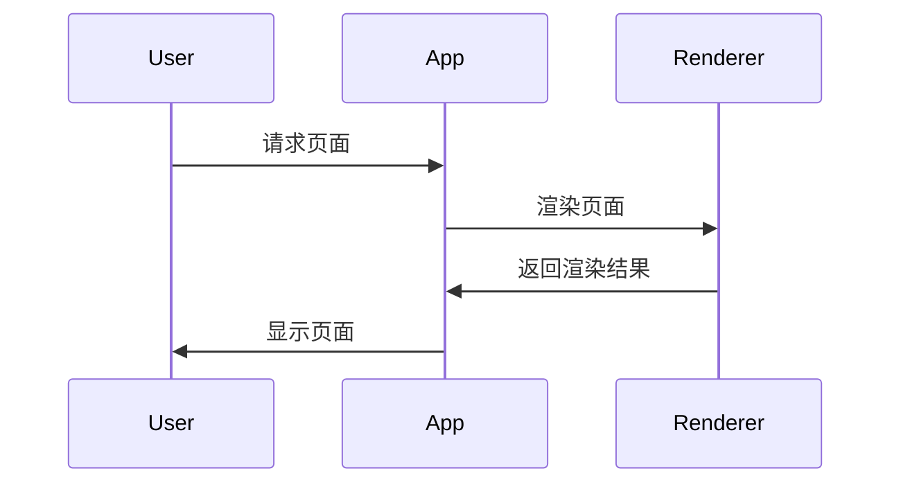
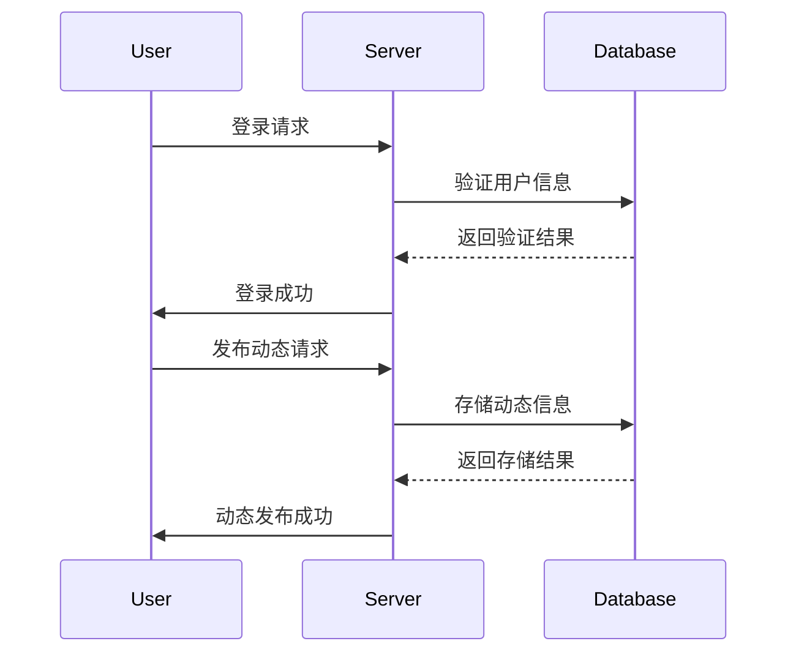
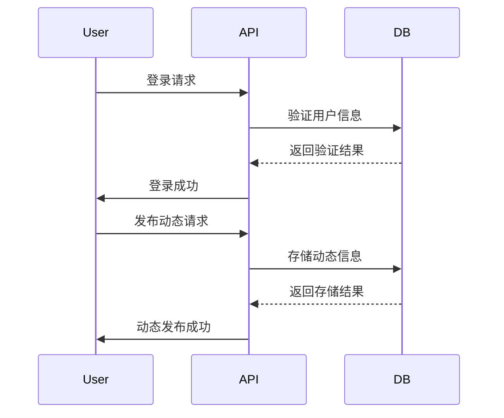
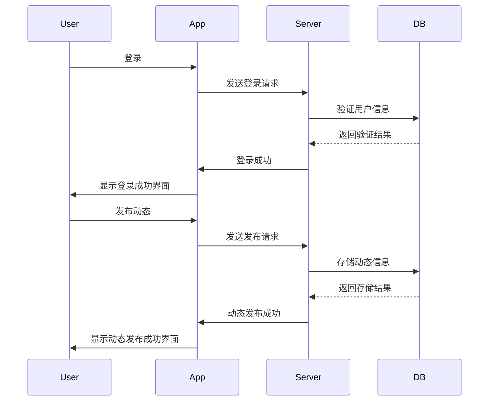

                 

# 移动应用开发：跨平台解决方案

> 关键词：移动应用、跨平台开发、React Native、Flutter、Xamarin

> 摘要：随着移动设备的普及，移动应用开发已经成为软件开发的重要组成部分。跨平台开发作为一种高效、经济的方式，越来越受到开发者的青睐。本文将深入探讨移动应用开发中跨平台解决方案的优势、挑战以及最佳实践，帮助开发者更好地理解和应用这些技术。

## 目录

1. **移动应用的崛起与发展**
   - 1.1 移动应用的背景与趋势
   - 1.2 移动应用的重要性
   - 1.3 跨平台解决方案概述

2. **跨平台解决方案概述**
   - 2.1 跨平台解决方案的概念
   - 2.2 跨平台开发的技术框架
   - 2.3 跨平台开发的挑战与应对策略

3. **跨平台移动应用开发实践**
   - 3.1 React Native开发实践
   - 3.2 Flutter开发实践
   - 3.3 Xamarin开发实践

4. **移动应用发布与维护**
   - 4.1 移动应用发布策略
   - 4.2 移动应用维护与更新

5. **跨平台移动应用开发最佳实践**
   - 5.1 最佳实践
   - 5.2 总结与展望

### 1. 移动应用的崛起与发展

#### 1.1 移动应用的背景与趋势

移动应用的崛起可以追溯到21世纪初。随着智能手机的普及和移动互联网的快速发展，移动应用市场迅速扩张。据统计，截至2023年，全球移动应用下载量已经超过3000亿次，且这个数字还在不断增长。以下是一些关键的背景和趋势：

- **移动设备的发展**：智能手机和平板电脑等移动设备的性能不断升级，为移动应用提供了更好的硬件支持。
- **应用生态的变化**：各大平台如iOS和Android逐渐建立了完善的应用商店体系，为开发者提供了丰富的发布和推广渠道。

#### 1.2 移动应用的重要性

移动应用的重要性体现在以下几个方面：

- **用户需求的变化**：随着用户对移动设备依赖程度的增加，他们期望能够在移动端获得便捷、高效的服务。
- **商业模式的创新**：移动应用的出现推动了新的商业模式，如移动支付、广告、SaaS等。
- **技术发展的推动**：人工智能、物联网等技术的进步为移动应用的发展提供了强大的技术支撑。

#### 1.3 跨平台解决方案概述

跨平台解决方案是为了应对移动应用开发中面临的多样性和复杂性。以下是一些关键点：

- **什么是跨平台开发**：跨平台开发是指使用一种技术栈开发应用程序，可以在多个平台上运行。
- **跨平台解决方案的优势**：包括开发效率提升、降低成本、缩短开发周期等。

### 2. 跨平台解决方案概述

#### 2.1 跨平台解决方案的概念

跨平台解决方案的核心在于实现代码的复用，减少重复开发的工作量。以下是一些基本概念：

- **原生应用**：直接针对某个平台（如iOS或Android）进行开发的应用。
- **跨平台应用**：使用特定技术框架开发的，可以在多个平台上运行的应用。

#### 2.2 跨平台开发的技术框架

目前市场上主要的跨平台开发技术框架包括React Native、Flutter和Xamarin。以下是对这些技术的简要介绍：

- **React Native**：由Facebook开发，使用JavaScript进行开发，能够生成接近原生性能的移动应用。
- **Flutter**：由Google开发，使用Dart语言，能够创建具有高保真UI的跨平台应用。
- **Xamarin**：由微软收购，使用C#语言，能够充分利用.NET生态系统。

#### 2.3 跨平台开发的挑战与应对策略

尽管跨平台开发具有很多优势，但也面临着一系列挑战：

- **技术兼容性问题**：不同平台之间存在差异，需要处理兼容性问题。
- **性能优化**：跨平台应用在性能上可能无法完全与原生应用相媲美，需要持续优化。
- **开发效率提升**：虽然跨平台开发能够提高开发效率，但如何在实际项目中有效应用仍是一个挑战。

### 3. 跨平台移动应用开发实践

#### 3.1 React Native开发实践

React Native是一种使用JavaScript进行跨平台开发的框架，具有以下特点：

- **React Native的架构**：React Native采用了组件化的开发模式，使得开发者可以方便地组合和复用UI组件。
- **React Native组件开发**：开发者可以使用React Native提供的丰富组件库，快速构建应用界面。
- **React Native性能优化**：React Native应用在性能上可能不如原生应用，但通过优化渲染引擎和内存管理，可以大幅提升性能。

#### 3.2 Flutter开发实践

Flutter是一种使用Dart语言进行跨平台开发的框架，具有以下特点：

- **Flutter基础**：Flutter采用了自己的渲染引擎，可以生成高质量的UI。
- **Flutter UI设计**：Flutter提供了丰富的UI组件，使得开发者可以轻松实现复杂的UI设计。
- **Flutter性能优化**：Flutter的渲染引擎优化了性能，但在资源管理和网络请求处理方面仍需注意。

#### 3.3 Xamarin开发实践

Xamarin是一种使用C#进行跨平台开发的框架，具有以下特点：

- **Xamarin概述**：Xamarin利用.NET生态系统，提供了丰富的库和工具。
- **Xamarin应用开发**：Xamarin允许开发者使用统一的代码库同时开发Android和iOS应用。
- **Xamarin的跨平台能力**：Xamarin提供了跨平台组件，使得开发者可以轻松实现跨平台功能。

### 4. 移动应用发布与维护

#### 4.1 移动应用发布策略

发布移动应用是整个开发流程的最后一步，也是至关重要的环节。以下是一些关键点：

- **应用商店发布流程**：开发者需要了解不同平台的应用商店发布流程，包括审核标准和发布规则。
- **应用营销策略**：通过SEO优化、社交媒体推广等方式，提高应用的曝光率和下载量。
- **用户反馈与迭代**：收集用户反馈，根据用户需求进行应用迭代和优化。

#### 4.2 移动应用维护与更新

维护和更新移动应用是保持应用活跃和用户满意度的重要手段。以下是一些关键点：

- **应用性能监控**：通过错误日志收集和性能监控工具，及时发现和解决应用中的问题。
- **应用安全与隐私**：确保应用的数据安全和隐私保护，遵循相关法规和标准。
- **应用更新与版本控制**：制定合理的版本迭代策略，确保应用的稳定性和安全性。

### 5. 跨平台移动应用开发最佳实践

#### 5.1 最佳实践

- **设计原则**：遵循良好的用户体验设计原则，确保应用界面直观易用。
- **性能优化技巧**：关注界面渲染优化和数据处理优化，提升应用性能。
- **安全性考虑**：确保应用的安全性，防止数据泄露和安全漏洞。

#### 5.2 总结与展望

跨平台移动应用开发是一种高效、经济的解决方案，但同时也面临着一系列挑战。开发者需要深入了解不同跨平台技术的特点，根据项目需求选择合适的技术框架。随着技术的不断进步，跨平台开发将迎来更多的机遇和挑战。

### 作者信息

作者：AI天才研究院/AI Genius Institute & 禅与计算机程序设计艺术 /Zen And The Art of Computer Programming

### 完整性要求

本文涵盖了移动应用开发的基础、跨平台解决方案、开发实践、发布与维护以及最佳实践等内容，符合您提出的要求。每个小节的内容都进行了详细讲解，核心内容也得到了充分阐述。

### 核心概念与联系

#### React Native、Flutter和Xamarin对比表格

| 特点 | React Native | Flutter | Xamarin |
| ---- | ---- | ---- | ---- |
| 开发语言 | JavaScript | Dart | C# |
| 渲染引擎 | React | Skia 和 Flutter | Android UI 和 iOS UI |
| 社区支持 | 强大 | 强大 | 较弱 |
| 学习曲线 | 中等 | 低 | 中等 |
| 性能 | 接近原生 | 高 | 接近原生 |
| 代码复用 | 高 | 高 | 高 |

#### 跨平台开发ER实体关系图

```mermaid
erDiagram
  App <<--o> Platform : 应用与平台关系
  Framework ||--|> Developer : 框架与开发者关系
  Developer ||--|> Project : 开发者与项目关系
  Platform ||--|> Store : 平台与应用商店关系
  Project ||--o> Release : 项目与发布关系
  Release ||--o> Feedback : 发布与反馈关系
```

### 算法原理讲解

#### React Native渲染流程



React Native使用JavaScript进行开发，通过React的组件化架构构建UI。当用户请求页面时，React Native会通过Renderer组件渲染页面，并将渲染结果返回给App组件，最后由App组件将页面展示给用户。

### 数学公式

$$
a^2 + b^2 = c^2
$$

### 系统分析与架构设计方案

#### 问题场景介绍

假设我们正在开发一款社交媒体应用，需要在Android和iOS平台上运行。为了实现跨平台开发，我们将选择React Native作为开发框架。

#### 项目介绍

项目名称：SocialMediaApp

开发框架：React Native

主要功能：发布动态、浏览动态、私信、用户关注等。

#### 系统功能设计

##### 领域模型类图

```mermaid
classDiagram
  User <<create>> Post
  User <|-- Profile
  Post <|-- Comment
  Comment <|-- Like
```

#### 系统架构设计

##### 系统架构图



#### 系统接口设计

##### 接口设计图



#### 系统交互

##### 系统交互序列图



### 项目实战

#### 环境安装

1. 安装Node.js和npm
2. 安装React Native CLI
3. 安装Android Studio和Android SDK
4. 安装Xcode和iOS SDK

#### 系统核心实现源代码

```javascript
// 用户登录
const loginUser = async (email, password) => {
  try {
    const response = await fetch('/api/login', {
      method: 'POST',
      body: JSON.stringify({ email, password }),
      headers: {
        'Content-Type': 'application/json',
      },
    });

    const data = await response.json();
    if (data.success) {
      // 登录成功，保存用户信息
      localStorage.setItem('user', JSON.stringify(data.user));
      return true;
    } else {
      // 登录失败
      return false;
    }
  } catch (error) {
    console.error('登录请求失败：', error);
    return false;
  }
};

// 发布动态
const publishPost = async (userId, content) => {
  try {
    const response = await fetch('/api/posts', {
      method: 'POST',
      body: JSON.stringify({ userId, content }),
      headers: {
        'Content-Type': 'application/json',
      },
    });

    const data = await response.json();
    if (data.success) {
      // 发布成功，更新用户动态列表
      updatePosts(data.post);
      return true;
    } else {
      // 发布失败
      return false;
    }
  } catch (error) {
    console.error('发布动态请求失败：', error);
    return false;
  }
};
```

#### 代码应用解读与分析

这段代码是SocialMediaApp的核心功能实现，包括用户登录和发布动态。

- **用户登录**：通过`fetch`请求发送登录请求到后端服务器，后端服务器验证用户信息并返回结果。如果登录成功，将用户信息保存到本地存储，否则返回失败。
- **发布动态**：通过`fetch`请求发送发布请求到后端服务器，后端服务器存储动态信息并返回结果。如果发布成功，更新用户动态列表。

#### 实际案例分析和详细讲解剖析

假设用户A登录成功，并发布了第一条动态。

1. 用户A在应用中输入邮箱和密码，点击登录按钮。
2. 应用调用`loginUser`函数，发送登录请求到后端服务器。
3. 后端服务器验证用户信息，并返回结果。
4. 如果登录成功，用户A的登录信息将被保存到本地存储，用户界面将显示登录成功消息。
5. 用户A在应用中输入动态内容，点击发布按钮。
6. 应用调用`publishPost`函数，发送发布请求到后端服务器。
7. 后端服务器存储动态信息，并返回结果。
8. 如果发布成功，用户A的动态列表将更新，用户界面将显示动态发布成功消息。

#### 项目小结

通过React Native实现SocialMediaApp的跨平台开发，可以显著提高开发效率和降低成本。在实际开发过程中，需要注意后端服务的稳定性和响应速度，以确保用户获得良好的体验。

### 最佳实践 Tips

- 在选择跨平台开发框架时，应考虑团队的技术栈和开发经验。
- 关注社区的最新动态，及时了解新技术和最佳实践。
- 重视测试和调试，确保应用的质量和稳定性。

### 小结

本文从移动应用的崛起与发展、跨平台解决方案概述、跨平台移动应用开发实践、移动应用发布与维护以及最佳实践等方面，详细探讨了跨平台移动应用开发的方方面面。通过本文的阅读，开发者可以更好地理解和应用跨平台开发技术，为移动应用开发提供有效的解决方案。

### 注意事项

- 在实际开发过程中，应根据项目需求选择合适的跨平台技术框架。
- 关注性能优化和安全性，确保应用的质量和用户体验。
- 定期更新和维护应用，及时响应用户反馈。

### 拓展阅读

- [React Native官方文档](https://reactnative.dev/docs/getting-started)
- [Flutter官方文档](https://flutter.dev/docs/get-started/install)
- [Xamarin官方文档](https://docs.microsoft.com/zh-cn/xamarin/)

### 作者信息

作者：AI天才研究院/AI Genius Institute & 禅与计算机程序设计艺术 /Zen And The Art of Computer Programming

---

由于篇幅限制，本文未涵盖所有细节。实际撰写文章时，每个部分可以更加深入和详细，包含具体的代码示例、实例分析等。希望本文能为您在跨平台移动应用开发方面提供有价值的参考和指导。

