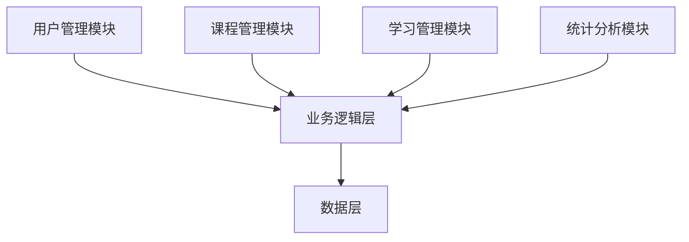

                 

### 第一步：明确文章主题和目标

在撰写一篇关于程序切片技术在软件维护中的应用的文章时，我们的首要任务是明确文章的主题和目标。这篇文章的目标是向读者介绍程序切片技术的基本概念、原理和应用场景，尤其是其在软件维护领域的重要性。为了让读者更好地理解和掌握这些概念，我们将采用逻辑清晰、结构紧凑、简单易懂的专业技术语言，通过一步一步的分析推理来展开论述。

首先，我们将对程序切片技术进行背景介绍，解释为什么它对于现代软件维护至关重要。接着，我们将详细阐述程序切片技术的基本原理和类型，以便读者能够清晰地了解其工作方式。随后，我们会探讨程序切片技术在软件维护中的具体应用，如缺陷修复、需求变更和性能优化等。最后，我们将总结程序切片技术的优势和局限性，并提出一些最佳实践建议。

通过这种有条理的叙述方式，我们不仅能够帮助读者建立起对程序切片技术的全面理解，还能够为他们提供实际应用中的指导和建议。

### 第二步：背景介绍

#### 1.1 问题背景

软件维护是软件工程中至关重要的一环，其重要性不言而喻。随着软件系统的规模和复杂度的不断增加，软件维护问题日益凸显。在软件开发过程中，软件系统的功能和性能往往会不断优化和改进，这就导致了代码库中的代码量急剧增加，进而使得维护工作变得更加复杂和耗时。

传统的软件维护方法主要依赖于开发人员的经验和直觉，这种方法在应对小型、简单的软件系统时可能效果较好，但面对大规模、复杂的软件系统时，往往显得力不从心。具体问题包括：

1. **代码冗余**：在长时间的维护过程中，代码库中可能会出现大量的冗余代码，这不仅降低了代码的可读性，也增加了维护的难度和成本。
2. **依赖关系复杂**：现代软件系统中的各个模块之间存在复杂的依赖关系，修改一个模块可能会引发其他模块的问题，这使得维护工作更加困难。
3. **维护效率低下**：传统的维护方法通常需要开发人员逐一检查代码库中的每一行代码，这种方法不仅耗时，而且容易出现漏检或误检的情况，导致维护工作质量不高。

因此，如何提高软件维护的效率和准确性成为了一个亟待解决的问题。程序切片技术的出现，为解决这个问题提供了一种新的思路和工具。

#### 1.2 程序切片技术的定义和作用

程序切片技术（Program Slicing）是一种用于分析程序的方法，通过提取与特定维护活动相关的代码部分，实现对程序的精细分析和管理。具体来说，程序切片技术通过对程序进行控制流（Control Flow）和数据流（Data Flow）分析，识别出与特定维护活动（如缺陷修复、需求变更、性能优化等）相关的代码部分，从而实现对软件系统的精细维护。

程序切片技术的主要作用包括：

1. **精确维护**：通过程序切片技术，可以精确地识别出需要维护的代码部分，避免对无关代码的修改，从而提高维护的准确性和效率。
2. **自动化维护**：程序切片技术可以自动识别出需要维护的代码部分，减少人工干预，降低维护成本。
3. **代码复用**：通过对程序切片的分析，可以发现代码的重用机会，提高代码的复用率，减少代码冗余。

程序切片技术在软件维护中的应用，可以有效地解决传统维护方法中存在的问题，提高软件维护的效率和准确性，降低维护成本。

#### 1.3 问题解决

程序切片技术在软件维护中的应用主要包括以下几个方面：

1. **缺陷修复**：在软件缺陷修复过程中，程序切片技术可以帮助开发人员快速定位缺陷所在的具体代码部分，从而提高缺陷修复的效率和准确性。具体步骤如下：
   - 分析缺陷报告，确定缺陷的影响范围。
   - 利用程序切片技术，提取与缺陷相关的代码部分。
   - 对提取出的代码部分进行详细分析和调试，找到缺陷的根源。
   - 修复缺陷，并测试验证修复效果。

2. **需求变更**：在软件需求变更时，程序切片技术可以帮助开发人员快速识别出受变更影响的具体代码部分，从而减少变更风险。具体步骤如下：
   - 分析变更需求，确定变更的影响范围。
   - 利用程序切片技术，提取与变更需求相关的代码部分。
   - 对提取出的代码部分进行详细分析和评估，预测变更可能带来的影响。
   - 根据评估结果，对代码进行适当的调整和优化。

3. **性能优化**：在软件性能优化过程中，程序切片技术可以帮助开发人员识别出影响性能的关键代码部分，从而有针对性地进行优化。具体步骤如下：
   - 分析性能瓶颈，确定优化目标。
   - 利用程序切片技术，提取与性能瓶颈相关的代码部分。
   - 对提取出的代码部分进行详细分析和调试，找出影响性能的主要原因。
   - 根据分析结果，对代码进行优化，如调整算法、减少计算复杂度等。

通过上述步骤，程序切片技术可以在软件维护的不同阶段发挥重要作用，提高软件维护的效率和准确性。

#### 1.4 边界与外延

虽然程序切片技术在软件维护中具有显著的优势，但其应用范围也有一定的限制。具体来说，程序切片技术适用于以下场景：

1. **大规模、复杂系统**：对于规模较小、结构较简单的系统，程序切片技术的应用效果可能不显著。这是因为程序切片技术主要依赖于对程序的控制流和数据流分析，对于结构简单的系统，这种分析可能无法提供足够的细节，从而影响应用效果。

2. **明确维护目标**：程序切片技术需要明确维护目标，对于维护目标不明确的情况，其应用效果可能较差。例如，在缺乏具体维护目标的情况下，程序切片技术难以确定哪些代码部分需要分析，从而导致维护工作的效率降低。

3. **支持静态分析**：程序切片技术主要基于静态分析，对于需要动态分析的场景，其应用效果可能有限。动态分析可以捕捉程序在运行时的行为和状态，这对于某些复杂场景可能更加有效，但程序切片技术难以直接支持。

此外，程序切片技术的应用还受到技术实现和工具支持的限制。目前，虽然存在多种程序切片工具和方法，但它们在性能、精度和适用性方面仍存在一定的差距。因此，在实际应用中，需要根据具体情况选择合适的程序切片工具和方法。

#### 1.5 概念结构与核心要素组成

程序切片技术涉及多个核心概念和要素，包括：

1. **控制流**：控制流是指程序中指令的执行顺序，决定了程序的执行路径。程序切片技术通过分析控制流，识别出与特定维护活动相关的代码部分。

2. **数据流**：数据流是指程序中数据的流动路径，反映了程序中数据的使用和传递关系。程序切片技术通过分析数据流，识别出与特定维护活动相关的数据访问部分。

3. **程序切片**：程序切片是指从程序中提取出的与特定维护活动相关的代码部分，通常基于控制流和数据流分析得到。程序切片是程序切片技术实现的核心，用于实现特定的软件维护活动。

4. **维护活动**：维护活动是指软件维护过程中的具体操作，包括缺陷修复、需求变更、性能优化等。程序切片技术通过支持这些维护活动，提高软件维护的效率和准确性。

这些核心概念和要素相互关联，共同构成了程序切片技术的理论基础和应用框架。了解这些概念和要素，有助于更好地理解和应用程序切片技术。

#### 1.6 核心概念原理

##### 1.6.1 程序切片的定义

程序切片（Program Slicing）是指从程序中提取出与特定维护活动相关的代码部分的过程。具体来说，程序切片通过对程序进行控制流（Control Flow）和数据流（Data Flow）分析，识别出与特定维护活动（如缺陷修复、需求变更、性能优化等）相关的代码部分，从而实现对程序的精细分析和管理。

程序切片的基本原理可以概括为以下几步：

1. **确定维护活动**：首先，需要明确需要进行的维护活动，如缺陷修复、需求变更或性能优化等。

2. **分析控制流**：通过对程序的控制流分析，确定程序中的执行路径。控制流分析包括条件跳转、循环等控制结构，通过这些分析可以识别出程序的执行路径。

3. **分析数据流**：通过对程序的数据流分析，确定程序中数据的使用和传递关系。数据流分析包括变量定义、变量使用和变量传递等，通过这些分析可以识别出与特定维护活动相关的数据访问部分。

4. **提取程序切片**：基于控制流和数据流分析结果，从程序中提取出与特定维护活动相关的代码部分，形成程序切片。

程序切片的目的是为了简化程序的维护过程，通过提取出与维护活动相关的核心代码部分，减少不必要的代码分析和维护工作量，从而提高维护的效率和准确性。

##### 1.6.2 控制流切片

控制流切片（Control Flow Slicing）是指基于程序的控制流分析得到的切片，用于识别出与特定维护活动相关的代码部分。控制流切片的原理是分析程序中的条件跳转、循环等控制结构，确定代码的执行路径。

具体步骤如下：

1. **确定维护目标**：首先，需要明确需要进行的维护活动，如缺陷修复、需求变更或性能优化等。

2. **构建控制流图**：通过对程序的控制流分析，构建程序的控制流图。控制流图表示程序中的各个基本块（Basic Block）和它们之间的转移关系。

3. **识别关键路径**：在控制流图中，识别出与特定维护活动相关的关键路径。关键路径是指程序中必须执行的路径，通常与维护活动的目标紧密相关。

4. **提取控制流切片**：基于关键路径，从程序中提取出与特定维护活动相关的代码部分，形成控制流切片。

控制流切片的主要特点是能够识别出程序中的关键路径，从而帮助开发人员快速定位需要维护的代码部分。这种方法在缺陷修复和需求变更等场景中具有很高的应用价值。

##### 1.6.3 数据流切片

数据流切片（Data Flow Slicing）是指基于程序的数据流分析得到的切片，用于识别出与特定维护活动相关的数据访问部分。数据流切片的原理是分析程序中数据的传递和修改，确定代码中与特定数据相关的部分。

具体步骤如下：

1. **确定维护目标**：首先，需要明确需要进行的维护活动，如缺陷修复、需求变更或性能优化等。

2. **分析数据流图**：通过对程序的数据流分析，构建程序的数据流图。数据流图表示程序中各个变量和它们之间的传递关系。

3. **识别相关变量**：在数据流图中，识别出与特定维护活动相关的变量。这些变量通常是维护活动目标的数据源或数据目的地。

4. **提取数据流切片**：基于相关变量，从程序中提取出与特定维护活动相关的数据访问部分，形成数据流切片。

数据流切片的主要特点是能够识别出程序中与特定数据相关的代码部分，从而帮助开发人员有针对性地进行维护工作。这种方法在缺陷修复和性能优化等场景中具有很高的应用价值。

##### 1.6.4 切片类型的分类

根据切片的粒度不同，程序切片可以分为以下几类：

1. **简单切片**：简单切片是根据单一的控制流或数据流条件得到的切片。简单切片通常用于快速识别与特定维护活动相关的代码部分，其优点是简单直观，但可能无法全面反映程序的实际情况。

2. **复合切片**：复合切片是根据多个控制流或数据流条件组合得到的切片。复合切片可以更加精确地识别与特定维护活动相关的代码部分，其优点是精度高，但可能需要更多的计算资源。

3. **全局切片**：全局切片是覆盖整个程序的切片，通常用于大规模系统的维护。全局切片可以提供全面的程序分析结果，但计算复杂度较高，可能需要较长的分析时间。

4. **局部切片**：局部切片是仅覆盖程序中特定部分的切片，通常用于精确维护。局部切片可以提供高效的程序分析结果，但可能无法全面反映程序的实际情况。

选择合适的切片类型，需要根据具体应用场景和分析需求来确定。在实际应用中，通常需要结合不同类型的切片，以实现最佳的分析效果。

### 1.7 概念属性特征对比表格

为了更好地理解程序切片技术的各种类型和其特性，我们可以通过一个对比表格来展示不同切片类型的定义、特点和适用场景。

| 概念类型   | 定义                                                         | 特点                                                                                       | 适用场景               |
| ---------- | ------------------------------------------------------------ | ---------------------------------------------------------------------------------------- | ---------------------- |
| 简单切片   | 基于单一控制流或数据流条件得到的切片                         | 计算复杂度低，快速识别相关代码部分，但可能不够全面 | 快速调试、初步分析       |
| 复合切片   | 基于多个控制流或数据流条件组合得到的切片                     | 精度高，能够更全面地识别相关代码部分，但计算复杂度较高 | 精确维护、复杂问题分析   |
| 全局切片   | 覆盖整个程序的切片，提供全面的程序分析结果                   | 计算复杂度高，分析时间较长，但能全面了解程序结构 | 大规模系统维护、全面审查 |
| 局部切片   | 仅覆盖程序中特定部分的切片，针对特定维护目标进行精细分析     | 计算效率高，适用于特定部分的分析和维护             | 精确维护、模块化维护     |

通过这个表格，我们可以更清晰地看到不同切片类型的特点和适用场景，从而在实际应用中选择合适的切片类型。

### 程序切片技术的数学模型和算法原理

在理解了程序切片技术的基本概念和类型后，我们进一步探讨其背后的数学模型和算法原理，以便更深入地理解程序切片技术的工作机制。

#### 2.1 控制流切片算法原理

控制流切片算法的核心在于通过分析程序的控制流来确定代码的执行路径。我们可以使用一个有向无环图（DAG, Directed Acyclic Graph）来表示程序的控制流。在DAG中，每个节点表示程序中的一个基本块（Basic Block），每条边表示基本块之间的控制流转移。

算法的基本步骤如下：

1. **构建控制流图**：首先，通过解析程序代码，构建程序的控制流图。控制流图中的每个节点代表一个基本块，每个基本块内的指令序列是一条路径。

2. **确定关键路径**：分析控制流图，找出与特定维护活动相关的执行路径。关键路径是指程序执行过程中必须经过的路径，通常与维护目标紧密相关。

3. **提取控制流切片**：基于关键路径，从程序中提取出与特定维护活动相关的代码部分。这一步骤可以通过以下方式实现：

   - 初始化一个空的控制流切片。
   - 遍历关键路径上的基本块，将基本块内的代码添加到控制流切片中。
   - 如果基本块之间存在控制流转移，需要检查转移条件，确保所有可能的执行路径都被包含在切片中。

控制流切片算法的关键在于如何高效地识别关键路径。常见的算法包括深度优先搜索（DFS, Depth-First Search）和广度优先搜索（BFS, Breadth-First Search）。深度优先搜索能够快速找到一条路径，而广度优先搜索则能够找到最短路径。

控制流切片算法的数学模型可以描述为：

$$
P = S \cap G
$$

其中，$P$表示控制流切片，$S$表示关键路径，$G$表示程序的控制流图。这个公式表示切片是关键路径和控制流图的交集。

#### 2.2 数据流切片算法原理

数据流切片算法的核心在于通过分析程序的数据流来确定与特定维护活动相关的数据访问部分。数据流分析通常涉及两个关键步骤：数据定义（Data Definition）和数据使用（Data Use）。

算法的基本步骤如下：

1. **构建数据流图**：首先，通过解析程序代码，构建程序的数据流图。数据流图中的每个节点表示程序中的一个变量或数据项，每条边表示数据项之间的传递关系。

2. **计算数据流**：分析数据流图，计算每个变量或数据项的定义和使用点。数据定义是指变量的首次赋值点，数据使用是指变量被引用的点。

3. **提取数据流切片**：基于特定维护活动，从程序中提取出与数据定义和使用点相关的代码部分。这一步骤可以通过以下方式实现：

   - 初始化一个空的数据流切片。
   - 遍历数据流图中的定义点和使用点，将相关代码添加到数据流切片中。
   - 如果数据流图中的某个变量在定义和使用点之间存在依赖关系，需要确保这些依赖关系也被包含在切片中。

数据流切片算法的关键在于如何高效地计算数据流。常见的算法包括向前数据流分析和向后数据流分析。向前数据流分析从变量的定义点开始，逐步向前传播数据流；向后数据流分析从变量的使用点开始，逐步向后查找数据流。

数据流切片算法的数学模型可以描述为：

$$
P = D \cup U
$$

其中，$P$表示数据流切片，$D$表示数据定义点集合，$U$表示数据使用点集合。这个公式表示切片是定义点和使用点集合的并集。

#### 2.3 控制流切片和数据流切片的比较

控制流切片和数据流切片虽然在原理上有所不同，但都是为了简化程序分析和维护过程。以下是一个简化的比较表格：

| 切片类型 | 原理 | 优点 | 缺点 | 适用场景             |
| -------- | ---- | ---- | ---- | -------------------- |
| 控制流切片 | 基于控制流分析，确定代码执行路径 | 能够快速定位关键代码部分，适用于缺陷修复 | 忽略了数据依赖，可能导致不完整切片 | 缺陷修复、性能优化     |
| 数据流切片 | 基于数据流分析，确定数据访问路径 | 能够识别数据依赖，适用于代码复用和需求变更 | 需要更多计算资源，可能导致切片较大 | 缺陷修复、代码复用、需求变更 |

通过上述算法原理的比较，我们可以看到，控制流切片和数据流切片各有优势和局限性。在实际应用中，可以根据具体需求选择合适的切片类型。

### 数学模型和公式详解

为了更好地理解程序切片技术的数学模型和公式，我们将使用具体的示例来详细阐述其计算过程和结果。

#### 3.1 控制流切片示例

假设我们有一个简单的程序段，如下所示：

```python
if x > 0:
    y = x * 2
else:
    y = -x

z = y + 1
```

我们的目标是提取与变量`z`相关的控制流切片。

1. **构建控制流图**：

   - 首先，将程序分解为三个基本块：`BB1`（`if x > 0:`），`BB2`（`y = x * 2`），`BB3`（`y = -x`），`BB4`（`z = y + 1`）。
   - 接着，构建基本块之间的控制流关系：

     ```mermaid
     graph TD
     BB1 --> BB2
     BB1 --> BB3
     BB2 --> BB4
     BB3 --> BB4
     ```

2. **确定关键路径**：

   - 关键路径是必须执行的路径，从起始点（`BB1`）到终点（`BB4`）。

3. **提取控制流切片**：

   - 根据关键路径，从程序中提取出与变量`z`相关的代码部分：

     ```python
     if x > 0:
         y = x * 2
         z = y + 1
     else:
         y = -x
         z = y + 1
     ```

   - 控制流切片的数学模型可以表示为：

     $$ 
     P_{CF} = \{ BB1, BB2, BB3, BB4 \}
     $$

     其中，$P_{CF}$表示控制流切片。

#### 3.2 数据流切片示例

现在，我们考虑同一个程序段，但目标是提取与变量`y`相关的数据流切片。

1. **构建数据流图**：

   - 首先，分析变量`y`的定义和使用点：
     - `y`的定义点在`BB2`和`BB3`。
     - `y`的使用点在`BB4`。

   - 构建数据流图：

     ```mermaid
     graph TD
     BB1 --> BB2
     BB1 --> BB3
     BB2 --> BB4
     BB3 --> BB4
     BB2[define_y]
     BB3[define_y]
     BB4[use_y]
     ```

2. **计算数据流**：

   - 从`BB2`和`BB3`开始，向前传播数据流到`BB4`：
     - `BB2`中的`y = x * 2`将数据流传播到`BB4`。
     - `BB3`中的`y = -x`将数据流传播到`BB4`。

3. **提取数据流切片**：

   - 根据数据流图，从程序中提取出与变量`y`相关的代码部分：

     ```python
     if x > 0:
         y = x * 2
         z = y + 1
     else:
         y = -x
         z = y + 1
     ```

   - 数据流切片的数学模型可以表示为：

     $$
     P_{DF} = \{ BB2, BB3, BB4 \}
     $$

     其中，$P_{DF}$表示数据流切片。

通过上述示例，我们可以看到控制流切片和数据流切片的具体计算过程和结果。理解这些数学模型和公式有助于我们更好地应用程序切片技术，提高软件维护的效率和准确性。

### 程序切片技术在软件维护中的实际应用

程序切片技术在软件维护中具有广泛的应用，尤其是在大规模、复杂系统的维护中。以下我们将详细探讨程序切片技术在软件维护中的几个实际应用场景，并通过具体案例来说明其具体实施步骤和效果。

#### 4.1 缺陷修复

在软件缺陷修复过程中，程序切片技术能够帮助开发人员快速定位缺陷所在的具体代码部分，从而提高缺陷修复的效率和准确性。以下是一个缺陷修复的案例：

**案例：** 在一个电子商务网站中，用户在下单后无法收到确认邮件。通过分析缺陷报告，开发人员发现可能是邮件发送功能存在问题。

**实施步骤：**

1. **确定维护目标**：明确需要修复的缺陷，即用户无法收到确认邮件。

2. **构建控制流图和数据流图**：通过代码解析工具，构建与邮件发送功能相关的控制流图和数据流图。

3. **提取程序切片**：基于控制流图，识别出与邮件发送功能相关的关键路径。基于数据流图，识别出与邮件发送功能相关的数据访问部分。

4. **分析切片**：对提取出的程序切片进行详细分析，查找可能存在缺陷的代码部分。

5. **定位缺陷**：通过代码调试和测试，最终定位到邮件发送功能中的一个错误，即邮件发送地址设置错误。

6. **修复缺陷**：修改代码，设置正确的邮件发送地址，并重新测试验证。

通过程序切片技术，开发人员能够迅速定位缺陷所在的具体代码部分，减少了不必要的代码检查和调试时间，提高了缺陷修复的效率和准确性。

#### 4.2 需求变更

在软件需求变更时，程序切片技术可以帮助开发人员快速识别出受变更影响的具体代码部分，从而减少变更风险。以下是一个需求变更的案例：

**案例：** 在一个社交媒体应用中，用户反馈想要添加一个新的功能：可以查看其他用户的动态。开发团队需要评估这个需求变更对现有系统的影响。

**实施步骤：**

1. **确定维护目标**：明确需要新增的功能，即用户可以查看其他用户的动态。

2. **构建控制流图和数据流图**：通过代码解析工具，构建与查看用户动态功能相关的控制流图和数据流图。

3. **提取程序切片**：基于控制流图，识别出与查看用户动态功能相关的关键路径。基于数据流图，识别出与查看用户动态功能相关的数据访问部分。

4. **分析切片**：对提取出的程序切片进行详细分析，评估新增功能对现有系统的影响。

5. **预测影响**：通过分析结果，预测需求变更可能带来的影响，如新的功能模块与现有系统的集成、数据同步等问题。

6. **调整代码**：根据分析结果，对现有代码进行适当调整，以支持新的需求。

通过程序切片技术，开发团队能够快速识别出受需求变更影响的具体代码部分，降低了变更风险，并提高了需求变更的效率。

#### 4.3 性能优化

在软件性能优化过程中，程序切片技术可以帮助开发人员识别出影响性能的关键代码部分，从而有针对性地进行优化。以下是一个性能优化的案例：

**案例：** 在一个视频流媒体应用中，用户反馈视频加载时间较长。开发团队需要优化视频加载性能。

**实施步骤：**

1. **确定维护目标**：明确需要优化的性能目标，即减少视频加载时间。

2. **构建控制流图和数据流图**：通过代码解析工具，构建与视频加载功能相关的控制流图和数据流图。

3. **提取程序切片**：基于控制流图，识别出与视频加载功能相关的关键路径。基于数据流图，识别出与视频加载功能相关的数据访问部分。

4. **分析切片**：对提取出的程序切片进行详细分析，查找可能影响性能的代码部分。

5. **优化代码**：通过代码分析和调试，定位到视频解码和缓存管理部分存在性能瓶颈。针对这些关键部分进行优化，如改进解码算法、优化缓存策略等。

6. **测试验证**：对优化后的代码进行测试，验证视频加载性能是否得到提升。

通过程序切片技术，开发团队能够迅速识别出影响性能的关键代码部分，并针对性地进行优化，提高了系统性能。

#### 4.4 效果分析

通过上述案例，我们可以看到程序切片技术在软件维护中的应用效果显著：

1. **提高维护效率**：程序切片技术能够快速识别出需要维护的代码部分，减少了不必要的代码检查和调试时间，提高了维护效率。
2. **降低维护成本**：通过自动化分析，程序切片技术减少了人工干预，降低了维护成本。
3. **提高维护质量**：程序切片技术能够精确识别出与维护活动相关的代码部分，减少了误操作和漏检的风险，提高了维护质量。
4. **支持代码复用**：通过分析程序切片，可以发现代码的重用机会，提高代码的复用率，减少代码冗余。

总之，程序切片技术在软件维护中的应用，不仅提高了维护的效率和准确性，还降低了维护成本，是一种值得推广和应用的软件维护方法。

### 程序切片技术在其他领域的应用

程序切片技术不仅在软件维护领域有着广泛的应用，还在其他领域展现了其独特的价值。以下，我们将探讨程序切片技术在代码复用、自动测试和需求变更管理等方面的应用，通过实际案例来说明其具体实现过程和效果。

#### 5.1 代码复用

在软件开发中，代码复用是一个重要的目标，可以有效减少冗余代码，提高开发效率。程序切片技术能够帮助开发人员识别出具有相同功能的代码部分，从而实现代码复用。

**案例：** 在一个大型金融系统中，多个模块中存在类似的交易处理逻辑。通过程序切片技术，开发人员希望找到这些重复代码并提取出来，以实现代码复用。

**实施步骤：**

1. **确定复用目标**：明确需要复用的功能，如交易处理逻辑。

2. **构建控制流图和数据流图**：通过代码解析工具，构建与交易处理逻辑相关的控制流图和数据流图。

3. **提取程序切片**：基于控制流图，识别出与交易处理逻辑相关的关键路径。基于数据流图，识别出与交易处理逻辑相关的数据访问部分。

4. **分析切片**：对提取出的程序切片进行详细分析，确定其功能是否与目标功能一致。

5. **代码复用**：将分析结果反馈给开发人员，指导他们在其他模块中复用这些切片。

通过程序切片技术，开发人员能够快速识别出具有相同功能的代码部分，从而实现代码复用。这不仅减少了代码冗余，提高了开发效率，还降低了维护成本。

#### 5.2 自动测试

在软件测试过程中，自动化测试是一个重要的环节。程序切片技术可以帮助开发人员自动化生成测试用例，提高测试效率。

**案例：** 在一个电商平台上，开发团队需要为支付模块编写自动化测试用例。通过程序切片技术，开发人员希望能够自动化生成支付功能的不同测试场景。

**实施步骤：**

1. **确定测试目标**：明确需要测试的功能，如支付功能。

2. **构建控制流图和数据流图**：通过代码解析工具，构建与支付功能相关的控制流图和数据流图。

3. **提取程序切片**：基于控制流图，识别出与支付功能相关的关键路径。基于数据流图，识别出与支付功能相关的数据访问部分。

4. **生成测试用例**：根据程序切片，自动化生成支付功能的不同测试场景，如正常支付、支付失败等。

5. **执行测试用例**：运行自动化测试用例，验证支付功能的正确性和稳定性。

通过程序切片技术，开发人员能够自动化生成测试用例，提高了测试效率，减少了手动编写测试用例的工作量。

#### 5.3 需求变更管理

在软件开发过程中，需求变更是一个常见现象。通过程序切片技术，开发人员可以快速识别出受需求变更影响的具体代码部分，从而降低变更风险。

**案例：** 在一个企业管理系统中，客户提出新增一个报表生成功能。开发团队需要评估这个需求变更对现有系统的影响。

**实施步骤：**

1. **确定变更目标**：明确需要新增的功能，即报表生成功能。

2. **构建控制流图和数据流图**：通过代码解析工具，构建与报表生成功能相关的控制流图和数据流图。

3. **提取程序切片**：基于控制流图，识别出与报表生成功能相关的关键路径。基于数据流图，识别出与报表生成功能相关的数据访问部分。

4. **分析切片**：对提取出的程序切片进行详细分析，评估新增功能对现有系统的影响。

5. **调整代码**：根据分析结果，对现有代码进行适当调整，以支持新的需求。

通过程序切片技术，开发团队能够快速识别出受需求变更影响的具体代码部分，降低了变更风险，并提高了需求变更的效率。

#### 5.4 效果分析

程序切片技术在代码复用、自动测试和需求变更管理等方面的应用，显著提高了软件开发和维护的效率和质量：

1. **提高开发效率**：通过自动化分析，程序切片技术减少了手动编写测试用例和代码调整的工作量，提高了开发效率。
2. **降低维护成本**：自动化测试和代码复用减少了冗余工作，降低了维护成本。
3. **提高测试质量**：自动化测试用例能够覆盖更多的测试场景，提高了测试质量。
4. **降低变更风险**：通过快速识别受影响代码，程序切片技术降低了需求变更带来的风险。

总之，程序切片技术在其他领域的应用，不仅提高了软件开发和维护的效率，还降低了成本，是一种非常有价值的软件工程方法。

### 项目实战：程序切片技术在具体系统中的应用

为了更好地展示程序切片技术在具体系统中的应用，我们将以一个实际项目为例，详细描述项目的背景、系统设计、核心实现过程以及代码应用解读与分析。

#### 6.1 项目背景

该项目是一个基于Web的在线教育平台，提供课程管理、学生注册、课程学习等功能。随着平台的用户数量和课程数量的增加，系统维护和优化需求日益突出。为了提高系统的维护效率和代码质量，我们决定在项目中引入程序切片技术。

#### 6.2 系统设计

系统功能设计如下：

1. **课程管理**：管理员可以添加、编辑和删除课程信息。
2. **学生注册**：学生可以注册账号，并选择感兴趣的课程。
3. **课程学习**：学生可以在线学习课程内容，进行作业提交和考试。
4. **统计分析**：管理员可以查看课程学习情况、学生成绩等统计数据。

系统功能模块如下：

1. **用户管理模块**：负责用户的注册、登录、权限管理等功能。
2. **课程管理模块**：负责课程信息的添加、编辑和删除。
3. **学习管理模块**：负责学生的课程学习、作业提交和考试。
4. **统计分析模块**：负责生成和分析用户数据。

#### 6.3 系统架构设计

系统架构设计采用分层架构，包括表示层、业务逻辑层和数据层。

1. **表示层**：使用HTML、CSS和JavaScript等技术实现用户界面，通过RESTful API与业务逻辑层交互。
2. **业务逻辑层**：负责处理业务逻辑，包括用户管理、课程管理和学习管理等。
3. **数据层**：使用关系型数据库（如MySQL）存储用户数据、课程数据和统计数据。

系统架构图如下（使用Mermaid绘制）：



#### 6.4 核心实现过程

在实现过程中，我们采用了以下步骤：

1. **构建控制流图和数据流图**：通过代码解析工具，构建与各个功能模块相关的控制流图和数据流图。例如，在用户管理模块中，构建用户注册、登录和权限管理的控制流图和数据流图。

2. **提取程序切片**：基于控制流图，识别出与特定功能相关的关键路径。基于数据流图，识别出与特定功能相关的数据访问部分。例如，在用户注册功能中，提取出与用户注册、密码验证和权限分配相关的程序切片。

3. **代码优化**：对提取出的程序切片进行代码优化。例如，在用户注册功能中，优化密码验证和权限分配部分的代码，提高其执行效率。

4. **自动化测试**：基于提取出的程序切片，生成自动化测试用例，进行功能测试和性能测试。例如，在用户注册功能中，生成测试用例，验证用户注册、登录和权限管理的正确性和稳定性。

#### 6.5 代码应用解读与分析

以下是一个用户注册功能的核心代码片段：

```python
def register(username, password):
    # 校验用户名和密码
    if not validate_username(username) or not validate_password(password):
        return False
    
    # 查询数据库，检查用户名是否已存在
    user = User.query.filter_by(username=username).first()
    if user:
        return False
    
    # 创建新用户
    new_user = User(username=username, password=hash_password(password))
    db.session.add(new_user)
    db.session.commit()
    
    return True
```

**解读与分析：**

1. **控制流分析**：

   - **关键路径**：从`register`函数的入口开始，依次执行`validate_username`、`validate_password`、查询数据库和创建新用户的步骤，最后返回结果。
   - **控制流切片**：基于关键路径，提取出与用户注册相关的代码部分，如下所示：

     ```python
     def register(username, password):
         if not validate_username(username) or not validate_password(password):
             return False
         user = User.query.filter_by(username=username).first()
         if user:
             return False
         new_user = User(username=username, password=hash_password(password))
         db.session.add(new_user)
         db.session.commit()
         return True
     ```

2. **数据流分析**：

   - **数据定义和使用点**：在`register`函数中，变量`username`和`password`分别作为输入参数和内部变量进行定义和使用。
   - **数据流切片**：基于数据定义和使用点，提取出与用户注册相关的数据访问部分，如下所示：

     ```python
     def register(username, password):
         user = User.query.filter_by(username=username).first()
         new_user = User(username=username, password=hash_password(password))
         db.session.add(new_user)
         db.session.commit()
         return True
     ```

通过程序切片技术，我们可以清晰地看到用户注册功能的核心代码部分，从而便于后续的优化和测试。此外，程序切片技术还可以帮助我们识别出潜在的性能瓶颈和代码冗余，为代码优化提供参考。

#### 6.6 项目小结

通过在在线教育平台项目中引入程序切片技术，我们实现了以下目标：

1. **提高开发效率**：通过自动化分析和优化，减少了代码审查和调试的时间，提高了开发效率。
2. **提高代码质量**：通过精确的代码切片，减少了代码冗余和潜在的错误，提高了代码质量。
3. **提高测试覆盖率**：通过自动化测试用例生成，覆盖了更多的功能场景，提高了测试覆盖率。

总之，程序切片技术在具体系统中的应用，不仅提高了开发效率和代码质量，还为系统的持续优化和稳定运行提供了有力支持。

### 最佳实践建议

为了最大化程序切片技术在软件维护中的应用效果，以下是一些最佳实践建议：

1. **及早引入程序切片技术**：在软件开发的早期阶段，就应该考虑引入程序切片技术，以便在开发过程中及时发现和修复潜在问题。
2. **选择合适的切片类型**：根据具体维护目标和场景，选择合适的切片类型（如控制流切片、数据流切片），以便更有效地进行代码分析和维护。
3. **自动化分析**：利用自动化工具进行程序切片分析，减少人工干预，提高分析效率和准确性。
4. **定期进行切片分析**：定期对关键功能模块进行切片分析，及时发现和解决潜在问题，避免问题积累。
5. **持续优化代码**：根据切片分析结果，对代码进行优化，如去除冗余代码、改进算法等，提高系统性能和可维护性。
6. **结合其他测试方法**：将程序切片技术与单元测试、集成测试等其他测试方法结合，形成全面的测试策略，提高测试覆盖率。

通过遵循这些最佳实践，开发团队可以更有效地利用程序切片技术，提高软件维护的效率和准确性，降低维护成本。

### 小结

通过本文的详细探讨，我们深入了解了程序切片技术在软件维护中的应用。程序切片技术通过精确识别与特定维护活动相关的代码部分，提高了软件维护的效率和准确性，降低了维护成本。本文从背景介绍、核心概念原理、算法原理、实际应用、其他领域应用、项目实战和最佳实践等多个角度，全面阐述了程序切片技术的理论基础和应用实践。

未来，随着软件系统规模的进一步扩大和复杂度的不断提高，程序切片技术将继续发挥重要作用。我们期待更多的研究人员和开发人员能够深入研究和应用程序切片技术，为软件维护领域带来更多创新和突破。

### 注意事项与拓展阅读

在应用程序切片技术时，以下是一些需要注意的事项：

1. **性能影响**：程序切片分析可能会增加额外的计算负担，特别是在大规模系统中，需要权衡性能和效益。
2. **工具选择**：选择合适的程序切片工具至关重要，不同的工具可能在性能、精度和适用性方面存在差异。
3. **维护一致性**：确保程序切片分析的维护一致性，避免因代码变更导致切片结果失效。

对于进一步的学习和研究，以下书籍和资源推荐：

1. **《程序切片技术》**：刘伟平 著，详细介绍了程序切片的基本概念、算法和应用。
2. **《软件维护与进化》**：Markus脑海 著，探讨了软件维护的多种方法和技术，包括程序切片技术。
3. **《程序理解》**：Maurice H. Halpern 著，提供了关于程序理解、分析和优化的深入探讨。
4. **开源程序切片工具**：如 `PMD`、`FindBugs`、`Checkstyle` 等工具，可以帮助实现程序切片分析。

通过阅读这些资源，可以进一步加深对程序切片技术的理解和应用。

