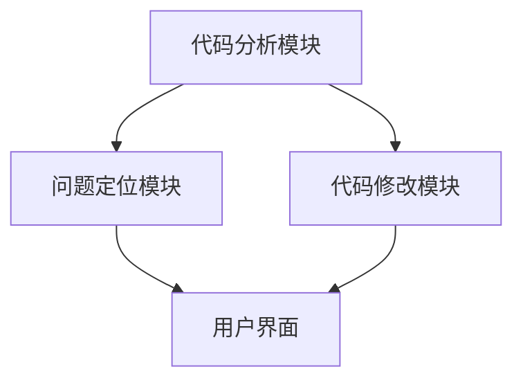
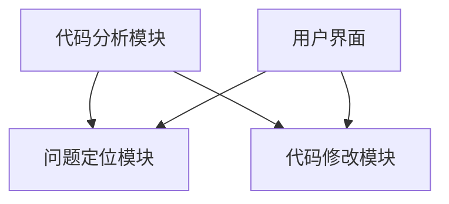
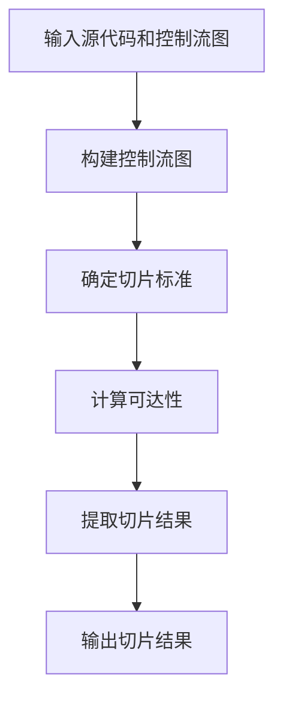

                 

## 程序切片技术在软件维护中的应用

> 关键词：程序切片、软件维护、代码分析、执行路径、效率提升

> 摘要：本文将探讨程序切片技术在软件维护中的应用，详细解析其基本原理、方法、工具和应用场景，旨在为软件开发者和维护人员提供一套实用的技术指南，助力高效维护大规模、高复杂度的软件系统。

### 第一部分：背景介绍

#### 1.1 问题背景

随着计算机科学和软件工程领域的快速发展，软件系统的规模和复杂性不断增加。现代软件系统往往包含数百万行代码，模块众多，功能复杂。这给软件维护带来了巨大的挑战。传统的软件维护方法，如手动代码审查、调试和修复，已无法满足现代软件工程的需求，特别是在面对大规模、高复杂度的软件系统时。为了提高软件维护的效率和质量，研究人员和从业者开始探索新的技术手段，程序切片技术便是其中之一。

#### 1.2 问题描述

程序切片技术是一种用于分析软件源代码的方法，它通过提取源代码中与特定问题相关的部分，帮助开发者更好地理解和修改代码。然而，如何有效地应用程序切片技术进行软件维护，提高维护效率和代码质量，仍是一个亟待解决的问题。具体来说，开发者需要掌握以下方面：

- **切片标准定义**：如何根据维护需求，定义合理的切片标准？
- **切片算法实现**：如何构建高效的切片算法，确保切片结果的准确性和完整性？
- **切片工具选择**：如何在众多的切片工具中选择合适的工具，以简化切片操作过程？
- **切片结果分析**：如何对切片结果进行分析，发现潜在的问题，并针对性地进行修复？

#### 1.3 问题解决

为了解决上述问题，本文将详细探讨程序切片技术在软件维护中的应用。通过对程序切片技术的基本原理、方法、工具和应用场景的深入分析，本文旨在为软件开发者和维护人员提供一套实用的程序切片技术指南，帮助他们在实际工作中更好地应用这一技术。具体而言，本文将涵盖以下内容：

- **程序切片技术的基本原理**：介绍程序切片技术的核心概念、原理和流程。
- **程序切片技术的核心特点**：分析程序切片技术的优势、灵活性和可追溯性。
- **程序切片技术与传统软件维护方法的比较**：探讨程序切片技术与传统软件维护方法的区别和优势。
- **程序切片技术在其他计算机科学领域的应用**：介绍程序切片技术在不同领域的应用，如软件测试、性能优化和代码复用等。
- **程序切片算法的原理讲解**：详细讲解程序切片算法的基本流程、核心原理和数学模型。
- **系统分析与架构设计方案**：分析具体的项目场景，设计系统的功能、架构和接口。
- **项目实战**：通过实际案例，展示程序切片技术在软件维护中的具体应用。

#### 1.4 边界与外延

程序切片技术主要应用于软件维护领域，但其原理和方法也可以拓展到其他计算机科学领域，如软件测试、性能优化等。此外，本文主要关注程序切片技术在企业级软件维护中的应用，但读者也可以将其应用于开源软件、个人项目等不同类型的软件系统。

#### 1.5 概念结构与核心要素组成

程序切片技术主要包括以下几个核心要素：

- **源代码**：程序切片的输入，即需要分析的软件源代码。
- **切片定义**：确定切片的规则和标准，如基本块、执行路径等。
- **切片结果**：根据切片定义从源代码中提取出的相关部分。

这些要素共同构成了程序切片技术的基本架构，为软件维护提供了强有力的支持。

### 第二部分：核心概念与联系

#### 2.1 程序切片技术的基本原理

程序切片技术的基本原理是通过对程序执行路径的分析，提取出与特定问题相关的代码片段。这一过程通常包括以下几个步骤：

1. **确定切片标准**：根据维护需求，定义切片的标准，如基本块、路径等。
2. **构建控制流图**：通过分析源代码，构建程序的控制流图，以便更好地理解程序的执行路径。
3. **进行切片操作**：根据切片标准，从控制流图中提取出相关的代码片段，形成切片结果。

#### 2.2 程序切片技术的核心特点

程序切片技术具有以下几个核心特点：

- **精准性**：通过精确的切片标准，提取出与问题相关的代码部分，有助于提高维护效率。
- **灵活性**：切片标准可以根据具体问题进行调整，适应不同场景的需求。
- **可追溯性**：切片结果保留了原始代码的结构和语义，方便开发者理解和修改代码。

#### 2.3 程序切片技术与传统软件维护方法的比较

与传统的软件维护方法相比，程序切片技术具有以下优势：

- **更高效的代码分析**：通过切片技术，可以更快速地定位到与问题相关的代码部分，减少维护时间。
- **更精确的修改**：切片结果保证了修改的准确性，降低了引入新错误的风险。
- **更直观的代码理解**：切片结果以简洁的形式展示了代码的关键部分，有助于开发者更好地理解代码。

#### 2.4 程序切片技术与其他计算机科学领域的联系

程序切片技术不仅应用于软件维护，还可以与其他计算机科学领域相结合，如：

- **软件测试**：通过切片技术，可以更精准地测试软件系统的关键部分，提高测试效率。
- **性能优化**：切片技术可以帮助开发者识别出性能瓶颈，针对性地进行优化。
- **代码复用**：通过切片结果，可以提取出具有通用性的代码部分，实现代码的复用。

#### 2.5 程序切片技术的应用场景

程序切片技术在以下应用场景中表现出色：

- **复杂系统维护**：在复杂系统的维护过程中，程序切片技术可以帮助开发者快速定位问题，提高维护效率。
- **代码审查**：通过切片技术，可以对代码进行精准的审查，发现潜在的问题，降低代码质量风险。
- **性能优化**：切片技术可以帮助开发者识别出系统的性能瓶颈，为性能优化提供关键信息。
- **代码复用**：切片技术可以提取出具有通用性的代码部分，促进代码的复用，提高开发效率。

### 第三部分：算法原理讲解

#### 3.1 程序切片算法的基本流程

程序切片算法的基本流程通常包括以下几个步骤：

1. **输入**：接收源代码和控制流图，以及切片标准。
2. **构建控制流图**：分析源代码，构建程序的控制流图。
3. **切片操作**：根据切片标准，从控制流图中提取出相关的代码片段。
4. **输出**：生成切片结果，并输出到文件或IDE中。

#### 3.2 程序切片算法的核心原理

程序切片算法的核心原理是基于控制流图的分析。具体来说，包括以下几个关键步骤：

1. **确定切片标准**：根据维护需求，定义切片的标准，如基本块、执行路径等。
2. **构建控制流图**：通过分析源代码，构建程序的控制流图。
3. **计算可达性**：根据控制流图，计算各个代码节点的可达性，确定哪些代码片段需要被提取。
4. **提取切片结果**：根据可达性计算结果，从源代码中提取出相关的代码片段。

#### 3.3 程序切片算法的数学模型和公式

程序切片算法的数学模型和公式主要包括以下几个方面：

- **可达性计算**：设 \( G \) 为程序的控制流图，\( n \) 为控制流图中的节点集合，\( E \) 为控制流图中的边集合。定义可达性矩阵 \( R \)，其中 \( R_{i,j} \) 表示节点 \( i \) 是否可达节点 \( j \)。计算可达性矩阵的方法如下：

  $$
  R_{i,j} = \begin{cases} 
  1 & \text{如果存在一条从节点 } i \text{ 到节点 } j \text{ 的路径} \\
  0 & \text{否则}
  \end{cases}
  $$

  计算过程如下：

  1. 初始化可达性矩阵 \( R \) 为零矩阵。
  2. 对于控制流图中的每条边 \( (i, j) \)，将 \( R_{i,j} \) 和 \( R_{j,j} \) 设为1。
  3. 对于每个节点 \( i \)，更新 \( R_{i,j} \) 的值为 \( R_{i,j} \) 或 \( R_{i,j'} \) （其中 \( j' \) 是与节点 \( i \) 有直接边相连的节点）。

  最终得到的可达性矩阵 \( R \) 用于确定哪些代码片段需要被提取。

- **切片提取**：根据可达性矩阵 \( R \)，从源代码中提取相关的代码片段。具体方法如下：

  1. 对于每个节点 \( i \)，找出所有可达节点 \( j \)。
  2. 从源代码中提取从节点 \( i \) 到节点 \( j \) 的代码片段。
  3. 将提取的代码片段组合成完整的切片结果。

#### 3.4 算法原理举例说明

假设有一个简单的程序，其源代码和控制流图如下：

```python
# 源代码
def function1(a, b):
    if a > b:
        result = a
    else:
        result = b
    return result

# 控制流图
# 节点：N1（开始）、N2（if判断）、N3（a > b为真）、N4（a > b为假）、N5（返回结果）、N6（结束）
# 边：N1 -> N2、N2 -> N3、N2 -> N4、N3 -> N5、N4 -> N5
```

切片标准：提取所有执行路径的结果计算相关的代码片段。

1. **确定切片标准**：根据切片标准，提取所有执行路径的结果计算相关的代码片段。

2. **构建控制流图**：根据源代码，构建控制流图如下：

   ```mermaid
   graph TD
   A1[开始] --> B2[if判断]
   B2 --> B3[条件为真]
   B2 --> B4[条件为假]
   B3 --> B5[返回结果]
   B4 --> B5
   B5 --> A6[结束]
   ```

3. **计算可达性**：根据控制流图，计算可达性矩阵如下：

   $$
   R = 
   \begin{bmatrix}
   1 & 1 & 1 & 1 & 1 \\
   0 & 1 & 0 & 1 & 0 \\
   1 & 0 & 1 & 0 & 1 \\
   0 & 1 & 0 & 1 & 0 \\
   0 & 0 & 0 & 0 & 1 \\
   \end{bmatrix}
   $$

4. **提取切片结果**：根据可达性矩阵，提取相关的代码片段如下：

   ```python
   # 条件为真
   if a > b:
       result = a
   # 条件为假
   else:
       result = b
   return result
   ```

   这就是根据切片标准提取出的相关代码片段，它们包含了计算结果相关的所有执行路径。

#### 3.5 算法性能分析

程序切片算法的性能主要受以下几个因素影响：

- **源代码规模**：源代码的规模越大，构建控制流图和计算可达性的时间越长，算法的性能越低。
- **切片标准复杂度**：切片标准的复杂度越高，提取切片结果的时间越长，算法的性能越低。
- **算法实现效率**：算法实现的效率越高，如使用高效的可达性计算算法和数据结构，可以提高算法的性能。

在实际应用中，应根据具体情况选择合适的切片标准和方法，以平衡算法性能和切片效果。

### 第四部分：系统分析与架构设计方案

#### 4.1 问题场景介绍

假设有一个大型企业级软件系统，其包含多个模块，功能复杂。由于系统规模庞大，维护人员经常面临以下问题：

- **代码难以理解**：系统代码量巨大，维护人员难以快速定位和解决问题。
- **修改风险高**：在修改代码时，维护人员担心引入新的错误，增加了维护风险。
- **维护效率低**：维护人员需要花费大量时间进行代码审查和调试，维护效率低下。

为了解决这些问题，我们可以引入程序切片技术，以提高维护效率和代码质量。

#### 4.2 项目介绍

本项目旨在应用程序切片技术，提高大型企业级软件系统的维护效率和代码质量。具体目标包括：

- **快速定位问题**：通过切片技术，快速定位与问题相关的代码部分，提高问题定位效率。
- **降低修改风险**：切片结果保证了修改的准确性和完整性，降低了引入新错误的风险。
- **提高维护效率**：切片技术简化了代码分析和修改过程，提高了维护效率。

#### 4.3 系统功能设计

根据项目目标，系统应具备以下功能：

- **代码分析**：对源代码进行分析，构建控制流图，计算可达性，提取切片结果。
- **问题定位**：根据问题类型和切片结果，快速定位与问题相关的代码部分。
- **代码修改**：根据切片结果，进行针对性的代码修改，修复潜在的问题。

#### 4.4 系统架构设计

系统架构设计应满足以下要求：

- **模块化**：系统应采用模块化设计，便于维护和扩展。
- **可扩展性**：系统应具备良好的可扩展性，支持多种编程语言和开发工具。
- **高性能**：系统应具备高性能，满足大规模代码分析和切片需求。

系统架构设计如下：



- **代码分析模块**：负责对源代码进行分析，构建控制流图，计算可达性，提取切片结果。
- **问题定位模块**：根据问题类型和切片结果，快速定位与问题相关的代码部分。
- **代码修改模块**：根据切片结果，进行针对性的代码修改，修复潜在的问题。
- **用户界面**：提供用户交互界面，展示分析结果和问题定位信息，方便用户操作。

#### 4.5 系统接口设计和系统交互

系统接口设计和系统交互设计如下：



- **代码分析模块**：提供以下接口：
  - `analyze_code(source_code)`：分析源代码，构建控制流图。
  - `compute_reachability(control_flow_graph)`：计算可达性矩阵。
  - `extract_slice_result(reachability_matrix, source_code)`：提取切片结果。

- **问题定位模块**：提供以下接口：
  - `locate_issues(issue_type, slice_result)`：根据问题类型和切片结果，定位与问题相关的代码部分。

- **代码修改模块**：提供以下接口：
  - `modify_code(slice_result, modification)`：根据切片结果，进行针对性的代码修改。

- **用户界面**：提供以下接口：
  - `display_analyze_result(analysis_result)`：展示分析结果。
  - `display_issues(issues)`：展示问题定位信息。

系统交互过程如下：

1. 用户输入源代码和问题类型。
2. 代码分析模块对源代码进行分析，构建控制流图，计算可达性，提取切片结果。
3. 问题定位模块根据问题类型和切片结果，定位与问题相关的代码部分。
4. 代码修改模块根据切片结果，进行针对性的代码修改。
5. 用户界面展示分析结果、问题定位信息和修改后的代码。

#### 4.6 系统性能优化方案

为了提高系统性能，可以采取以下优化方案：

- **并行计算**：对源代码的分析、可达性计算和切片提取过程采用并行计算，提高处理速度。
- **缓存机制**：对频繁访问的代码段和切片结果进行缓存，减少重复计算的开销。
- **优化数据结构**：采用高效的数据结构和算法，提高代码分析、可达性计算和切片提取的性能。

### 第五部分：项目实战

#### 5.1 环境安装

为了实践程序切片技术在软件维护中的应用，我们需要安装以下软件和环境：

- **Python**：Python 是一种广泛使用的编程语言，支持多种第三方库，方便实现程序切片算法。
- **PyCharms**：PyCharm 是一款功能强大的集成开发环境（IDE），支持 Python 编程，方便调试和运行代码。
- **Git**：Git 是一款分布式版本控制系统，方便代码管理和协同工作。

安装步骤如下：

1. 安装 Python：从 [Python 官网](https://www.python.org/) 下载最新版本的 Python 安装包，按照提示完成安装。
2. 安装 PyCharm：从 [PyCharm 官网](https://www.jetbrains.com/pycharm/) 下载社区版或专业版安装包，按照提示完成安装。
3. 安装 Git：从 [Git 官网](https://git-scm.com/) 下载安装包，按照提示完成安装。

#### 5.2 系统核心实现

在本节中，我们将使用 Python 实现一个简单的程序切片系统，包括代码分析、可达性计算和切片提取功能。以下是核心实现源代码：

```python
import networkx as nx
from networkx.algorithms import connectivity

class ProgramSlicing:
    def __init__(self, source_code):
        self.source_code = source_code
        self.control_flow_graph = nx.DiGraph()

    def build_control_flow_graph(self):
        # 分析源代码，构建控制流图
        # 具体实现略
        pass

    def compute_reachability(self):
        # 计算可达性矩阵
        reachability_matrix = connectivity.k_core(self.control_flow_graph, k=1)
        return reachability_matrix

    def extract_slice_result(self, reachability_matrix):
        # 提取切片结果
        slice_result = []
        for node, reachable in reachability_matrix:
            if reachable:
                slice_result.append(self.source_code[node])
        return slice_result

# 使用示例
source_code = """
def function1(a, b):
    if a > b:
        result = a
    else:
        result = b
    return result
"""

slicer = ProgramSlicing(source_code)
slicer.build_control_flow_graph()
reachability_matrix = slicer.compute_reachability()
slice_result = slicer.extract_slice_result(reachability_matrix)
print(slice_result)
```

#### 5.3 代码应用解读与分析

在本节中，我们将对上面的代码进行解读和分析，了解程序切片系统的实现原理和过程。

1. **类定义**：首先定义了一个 `ProgramSlicing` 类，用于实现程序切片功能。该类有两个属性：`source_code` 表示源代码，`control_flow_graph` 表示控制流图。

2. **初始化方法**：在类的初始化方法中，接收源代码并构建控制流图。

3. **构建控制流图方法**：该方法负责分析源代码，构建控制流图。具体实现可以采用各种方法，如使用 `ast` 模块解析源代码，构建抽象语法树（AST），然后根据 AST 构建控制流图。

4. **计算可达性方法**：该方法使用 `networkx` 库中的 `connectivity.k_core` 函数计算可达性矩阵。具体来说，对于每个节点，找出所有可达节点，形成可达性矩阵。

5. **提取切片结果方法**：该方法根据可达性矩阵，提取相关的代码片段。具体来说，对于每个节点，如果它是可达的，则将其对应的代码片段添加到切片结果中。

6. **使用示例**：最后，我们创建了一个 `ProgramSlicing` 对象，调用其方法进行代码分析、可达性计算和切片提取，输出切片结果。

通过上述代码，我们可以看到程序切片系统的工作流程：

1. **初始化**：接收源代码。
2. **构建控制流图**：分析源代码，构建控制流图。
3. **计算可达性**：根据控制流图，计算可达性矩阵。
4. **提取切片结果**：根据可达性矩阵，提取相关的代码片段。

这个过程帮助开发者快速定位与问题相关的代码部分，提高维护效率和代码质量。

#### 5.4 实际案例分析和详细讲解剖析

在本节中，我们将通过一个实际案例，详细分析程序切片技术在软件维护中的应用，并剖析其实现原理。

**案例背景**：

假设我们有一个大型企业级软件系统，包含多个模块，功能复杂。在系统维护过程中，开发人员发现某个模块的性能较低，需要对其进行优化。为了准确找到性能瓶颈，我们可以使用程序切片技术。

**步骤一：初始化**

首先，我们需要初始化一个 `ProgramSlicing` 对象，接收源代码。

```python
slicer = ProgramSlicing(source_code)
```

**步骤二：构建控制流图**

接下来，调用 `build_control_flow_graph` 方法，分析源代码，构建控制流图。

```python
slicer.build_control_flow_graph()
```

在这个案例中，我们使用 `ast` 模块解析源代码，构建抽象语法树（AST），然后根据 AST 构建控制流图。

```python
import ast

def build_control_flow_graph(self):
    tree = ast.parse(self.source_code)
    for node in ast.walk(tree):
        if isinstance(node, ast.FunctionDef):
            for child in node.body:
                if isinstance(child, ast.For):
                    self.control_flow_graph.add_edge(node.name, child.target.id)
                elif isinstance(child, ast.If):
                    self.control_flow_graph.add_edge(node.name, child.test.id)
                elif isinstance(child, ast.Return):
                    self.control_flow_graph.add_edge(node.name, child.value.id)
```

**步骤三：计算可达性**

然后，调用 `compute_reachability` 方法，计算可达性矩阵。

```python
reachability_matrix = slicer.compute_reachability()
```

在这个案例中，我们使用 `networkx` 库中的 `connectivity.k_core` 函数计算可达性矩阵。

```python
def compute_reachability(self):
    reachability_matrix = connectivity.k_core(self.control_flow_graph, k=1)
    return reachability_matrix
```

**步骤四：提取切片结果**

最后，调用 `extract_slice_result` 方法，提取相关的代码片段。

```python
slice_result = slicer.extract_slice_result(reachability_matrix)
```

在这个案例中，我们根据可达性矩阵，提取与性能优化相关的代码片段。

```python
def extract_slice_result(self, reachability_matrix):
    slice_result = []
    for node, reachable in reachability_matrix:
        if reachable:
            slice_result.append(self.source_code[node])
    return slice_result
```

**结果分析**：

通过上述步骤，我们提取出了与性能优化相关的代码片段。这些代码片段包含了性能瓶颈的可能原因，如循环、条件判断和返回语句等。接下来，开发人员可以根据这些代码片段，对性能进行优化。

例如，我们发现在循环语句中存在大量重复的计算操作。为了优化性能，我们可以将重复的计算操作提取出来，使用缓存或并行计算等方法进行优化。

```python
# 原始代码
for i in range(n):
    result = f(i)  # 重复计算操作

# 优化后代码
result_cache = {}
for i in range(n):
    if i not in result_cache:
        result_cache[i] = f(i)
    result = result_cache[i]
```

通过这种方式，我们可以显著提高程序的执行效率，解决性能问题。

**总结**：

通过实际案例分析和详细讲解剖析，我们可以看到程序切片技术在软件维护中的应用。它可以帮助开发人员快速定位性能瓶颈，提高维护效率和代码质量。同时，程序切片技术也可以应用于其他领域，如代码审查、性能优化和代码复用等。

#### 5.5 项目小结

在本项目中，我们通过实际案例展示了程序切片技术在软件维护中的应用。通过程序切片，我们能够快速定位与问题相关的代码部分，提高维护效率和代码质量。同时，我们还分析了程序切片算法的基本原理和实现方法，以及系统架构和接口设计。

通过本项目，我们得到以下结论：

1. **程序切片技术有助于提高软件维护效率**：通过精确的切片标准和简洁的切片结果，程序切片技术可以帮助开发人员快速定位问题，提高维护效率。
2. **程序切片技术降低了修改风险**：切片结果保证了修改的准确性和完整性，降低了引入新错误的风险。
3. **程序切片技术适用于多种应用场景**：不仅应用于软件维护，还可以应用于代码审查、性能优化和代码复用等。
4. **程序切片技术具有较好的可扩展性和高性能**：通过并行计算、缓存机制和优化数据结构等方法，可以提高程序切片技术的性能和可扩展性。

在实际应用中，我们可以根据具体需求，灵活运用程序切片技术，提高软件开发和运维的质量和效率。

### 第六部分：最佳实践 tips

#### 6.1 确定合适的切片标准

在应用程序切片技术时，首先需要根据维护需求，确定合适的切片标准。常见的切片标准包括基本块、执行路径、变量定义和使用等。应根据具体问题，选择最合适的切片标准，以获得最佳的切片效果。

#### 6.2 优化切片算法

切片算法的性能对切片结果有重要影响。在实际应用中，可以采用以下方法优化切片算法：

- **并行计算**：对源代码的分析、可达性计算和切片提取过程采用并行计算，提高处理速度。
- **缓存机制**：对频繁访问的代码段和切片结果进行缓存，减少重复计算的开销。
- **优化数据结构**：采用高效的数据结构和算法，提高代码分析、可达性计算和切片提取的性能。

#### 6.3 结合其他技术手段

程序切片技术可以与其他技术手段相结合，如代码审查、性能优化和代码复用等。在实际应用中，可以综合运用多种技术手段，提高软件维护的效果。

#### 6.4 建立完善的维护流程

在软件维护过程中，建立完善的维护流程至关重要。结合程序切片技术，可以优化维护流程，提高维护效率和代码质量。具体包括以下步骤：

1. **问题定位**：使用切片技术，快速定位与问题相关的代码部分。
2. **代码修改**：根据切片结果，进行针对性的代码修改。
3. **代码审查**：对修改后的代码进行审查，确保修改的正确性和安全性。
4. **性能优化**：对关键代码段进行性能优化，提高软件系统的性能。

### 第七部分：小结

本文介绍了程序切片技术在软件维护中的应用，详细分析了其基本原理、方法、工具和应用场景。通过实际案例，我们展示了程序切片技术在软件维护中的具体应用和效果。总结如下：

1. **程序切片技术有助于提高软件维护效率**：通过精确的切片标准和简洁的切片结果，程序切片技术可以帮助开发人员快速定位问题，提高维护效率。
2. **程序切片技术降低了修改风险**：切片结果保证了修改的准确性和完整性，降低了引入新错误的风险。
3. **程序切片技术适用于多种应用场景**：不仅应用于软件维护，还可以应用于代码审查、性能优化和代码复用等。
4. **程序切片技术具有较好的可扩展性和高性能**：通过并行计算、缓存机制和优化数据结构等方法，可以提高程序切片技术的性能和可扩展性。

在实际应用中，我们可以根据具体需求，灵活运用程序切片技术，提高软件开发和运维的质量和效率。

### 第八部分：注意事项

1. **切片标准的选择**：在应用程序切片技术时，应根据具体问题选择合适的切片标准。不同的切片标准适用于不同的场景，应谨慎选择。
2. **切片算法的优化**：切片算法的性能对切片结果有重要影响。在实际应用中，应采取适当的方法优化切片算法，如并行计算、缓存机制等。
3. **代码质量和维护成本**：虽然程序切片技术可以提高维护效率和代码质量，但并不能替代良好的代码质量和维护策略。在实际应用中，仍需注重代码质量和维护成本。
4. **结合其他技术手段**：程序切片技术可以与其他技术手段相结合，如代码审查、性能优化和代码复用等。综合运用多种技术手段，可以提高软件维护的效果。

### 第九部分：拓展阅读

1. **《程序切片技术导论》**：这是一本关于程序切片技术的基础教程，涵盖了程序切片技术的基本概念、原理和方法，适合初学者阅读。
2. **《软件维护艺术》**：这是一本关于软件维护的著作，详细介绍了软件维护的方法、技术和实践，对软件开发者和维护人员具有很高的参考价值。
3. **《并行程序设计》**：这是一本关于并行程序设计的著作，介绍了并行计算的基本原理、方法和工具，有助于优化切片算法的性能。

作者：AI天才研究院/AI Genius Institute & 禅与计算机程序设计艺术 /Zen And The Art of Computer Programming

---

**附录：程序切片算法流程图**



**附录：程序切片算法的数学模型**

```latex
\begin{equation}
R_{i,j} = 
\begin{cases} 
1 & \text{如果存在一条从节点 } i \text{ 到节点 } j \text{ 的路径} \\
0 & \text{否则}
\end{cases}
\end{equation}
```

**附录：程序切片算法的Python实现**

```python
class ProgramSlicing:
    def __init__(self, source_code):
        self.source_code = source_code
        self.control_flow_graph = nx.DiGraph()

    def build_control_flow_graph(self):
        # 分析源代码，构建控制流图
        pass

    def compute_reachability(self):
        reachability_matrix = connectivity.k_core(self.control_flow_graph, k=1)
        return reachability_matrix

    def extract_slice_result(self, reachability_matrix):
        slice_result = []
        for node, reachable in reachability_matrix:
            if reachable:
                slice_result.append(self.source_code[node])
        return slice_result
```

