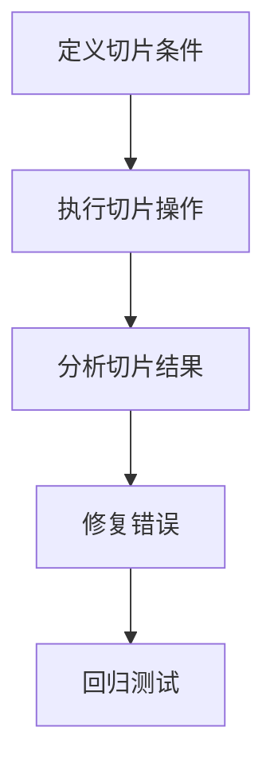
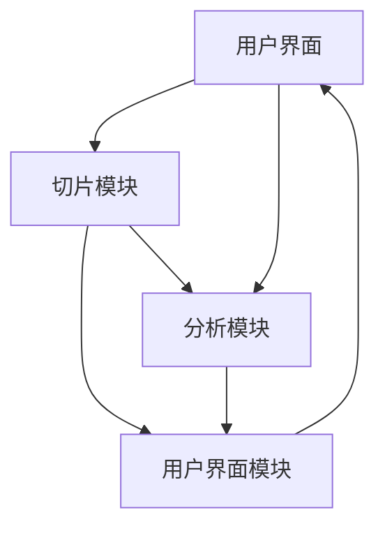
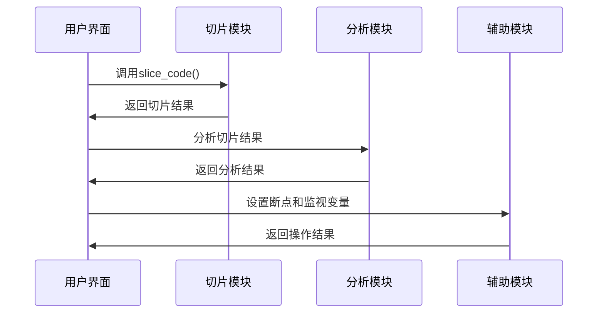

                 

### 文章标题

# 程序切片技术在软件调试中的应用

### 文章关键词

- 程序切片
- 软件调试
- 算法原理
- 系统架构
- 实际案例

### 文章摘要

本文详细介绍了程序切片技术的基本概念、核心算法及其在软件调试中的应用。通过理论讲解和实际案例剖析，展示了程序切片技术在简化软件调试过程、提高调试效率方面的显著优势。文章结构清晰，便于读者逐步掌握这一先进的技术。

---

### 目录大纲设计思路与框架

在设计《程序切片技术在软件调试中的应用》的目录大纲时，我们首先明确了文章的目标读者群体，即对软件调试有一定了解，但希望深入学习程序切片技术的专业人士。以下是我们的设计思路与框架：

1. **背景介绍**：首先，我们介绍了程序切片技术的定义、发展历史和应用场景，为读者提供一个全面的理解背景。

2. **核心概念与联系**：接着，我们详细解析了程序切片技术中的核心概念，包括切片类型、切片标准和切片算法，并通过Mermaid流程图和表格帮助读者理解这些概念之间的关系。

3. **算法原理讲解**：为了深入理解程序切片技术，我们使用Mermaid绘制了算法流程图，并使用Python源代码和数学公式详细阐述了算法原理。

4. **系统分析与架构设计**：然后，我们描述了程序切片技术在软件调试中的具体应用，包括系统功能设计、架构设计、接口设计等，并通过Mermaid类图和序列图展示了系统架构。

5. **项目实战**：为了增强读者的实践能力，我们介绍了一个实际案例，包括环境安装、系统核心实现、代码解读与分析等。

6. **最佳实践与总结**：最后，我们总结了本书的主要内容，提供了最佳实践建议，指出了注意事项，并推荐了拓展阅读材料。

通过这样的结构设计，我们旨在帮助读者系统地掌握程序切片技术，并能在实际工作中有效应用。

---

### 完整目录大纲

----------------------------------------------------------------

# 第一部分: 程序切片技术概述

## 1.1 程序切片技术背景

### 1.1.1 什么是程序切片技术

### 1.1.2 程序切片技术的发展历史

### 1.1.3 程序切片技术的重要性

### 1.1.4 程序切片技术的应用场景

## 1.2 程序切片技术核心概念

### 1.2.1 切片类型

#### 1.2.1.1 条件切片

#### 1.2.1.2 初始切片

#### 1.2.1.3 后置切片

### 1.2.2 切片标准

#### 1.2.2.1 基于控制依赖的切片

#### 1.2.2.2 基于数据依赖的切片

#### 1.2.2.3 基于路径依赖的切片

### 1.2.3 切片算法

#### 1.2.3.1 传统切片算法

#### 1.2.3.2 现代切片算法

## 1.3 程序切片技术核心概念联系

### 1.3.1 概念属性特征对比表格

### 1.3.2 ER实体关系图架构

----------------------------------------------------------------

# 第二部分: 程序切片技术在软件调试中的应用

## 2.1 程序切片技术在软件调试中的应用原理

### 2.1.1 软件调试中的问题与挑战

### 2.1.2 程序切片技术在软件调试中的应用价值

### 2.1.3 程序切片技术在软件调试中的应用流程

## 2.2 系统功能设计

### 2.2.1 软件调试系统的功能需求

### 2.2.2 软件调试系统的架构设计

### 2.2.3 软件调试系统的模块划分

## 2.3 系统架构设计

### 2.3.1 系统架构概述

### 2.3.2 系统模块详细设计

### 2.3.3 系统模块接口设计

## 2.4 系统接口设计与交互

### 2.4.1 系统接口设计

### 2.4.2 系统交互Mermaid序列图

## 2.5 项目实战

### 2.5.1 环境安装与配置

### 2.5.2 系统核心实现源代码

### 2.5.3 代码解读与分析

### 2.5.4 实际案例分析与详细讲解剖析

## 2.6 项目小结

### 2.6.1 项目总结

### 2.6.2 项目中遇到的问题与解决方法

### 2.6.3 项目经验与启示

----------------------------------------------------------------

### 背景介绍

#### 1.1.1 什么是程序切片技术

程序切片技术（Program Slicing）是一种计算机科学中的程序分析方法，旨在通过提取与特定条件或执行路径相关的代码子集，以简化程序的复杂度，从而提高调试和测试的效率。具体来说，程序切片技术包括以下几种：

1. **条件切片**：根据特定的条件对程序进行切片，提取与该条件相关的所有代码。
2. **初始切片**：提取出程序中所有初始化代码的部分。
3. **后置切片**：提取出程序中所有可能影响特定变量的代码。

#### 1.1.2 程序切片技术的发展历史

程序切片技术的概念最早可以追溯到1970年代，由美国计算机科学家Barry W. Boehm等人提出。最初的切片技术主要依赖于静态分析，随着计算机科学的发展，切片技术逐渐融合了动态分析的方法，使得切片算法更加高效和准确。

#### 1.1.3 程序切片技术的重要性

程序切片技术在软件工程中具有重要意义，主要体现在以下几个方面：

1. **提高调试效率**：通过切片技术，开发人员可以迅速定位到导致错误的代码部分，减少调试时间。
2. **提升测试效率**：切片技术有助于缩小测试范围，提高测试效率。
3. **增强代码可理解性**：切片技术可以帮助开发人员更清晰地理解代码的功能和结构，从而提高代码质量。

#### 1.1.4 程序切片技术的应用场景

程序切片技术广泛应用于软件开发的各个阶段，特别是在调试和测试阶段。以下是一些典型的应用场景：

1. **错误定位**：在调试过程中，通过条件切片或后置切片，快速定位到错误代码部分。
2. **性能优化**：通过初始切片，可以分析程序中的冗余代码，进行性能优化。
3. **代码复用**：切片技术有助于提取出可复用的代码片段，提高开发效率。

通过上述介绍，我们可以看出程序切片技术在软件调试中具有重要的作用和广泛的应用场景。接下来，我们将深入探讨程序切片技术的核心概念，帮助读者更好地理解和应用这一技术。

### 第一部分: 程序切片技术概述

## 1.1 程序切片技术背景

### 1.1.1 什么是程序切片技术

程序切片技术（Program Slicing）是计算机科学中的一种程序分析方法，旨在通过提取与特定条件或执行路径相关的代码子集，以简化程序的复杂度，从而提高调试和测试的效率。具体来说，程序切片技术包括以下几种类型：

1. **条件切片（Conditional Slicing）**：根据特定的条件对程序进行切片，提取与该条件相关的所有代码。例如，如果需要定位一个特定的错误，可以通过条件切片提取出与此错误相关的所有代码。

2. **初始切片（Initial Slicing）**：提取出程序中所有初始化代码的部分。这种切片有助于理解程序启动时执行的代码，特别是在调试启动错误时非常有用。

3. **后置切片（Post-Slicing）**：提取出程序中所有可能影响特定变量的代码。这种切片可以帮助确定哪些代码可能导致了变量的特定值。

程序切片技术的基本思想是通过删除那些不相关的代码，从而使得程序更加简洁，更容易理解和调试。切片的结果是一个子程序，它保留了原始程序的所有重要特性，但去掉了那些与特定问题不相关的部分。

### 1.1.2 程序切片技术的发展历史

程序切片技术的概念最早由美国计算机科学家Barry W. Boehm在1970年代提出。当时，为了提高软件调试的效率，Boehm等人开始研究如何从大规模的程序中提取出与问题相关的子程序。这一研究初衷推动了程序切片技术的诞生。

随着时间的推移，程序切片技术逐渐成熟，并开始广泛应用于软件工程、程序分析、编程教育等多个领域。1980年代，切片技术得到了进一步的发展，研究人员开始提出各种切片算法，如静态切片算法和动态切片算法，以应对不同类型的切片需求。

在近年来，随着程序切片技术的不断发展，新的应用场景和实现方法也不断涌现。例如，基于路径依赖的切片算法、基于数据依赖的切片算法等，这些算法通过更精确地分析程序的控制流和数据流，提高了切片的准确性和效率。

### 1.1.3 程序切片技术的重要性

程序切片技术在软件工程中具有重要作用，主要体现在以下几个方面：

1. **提高调试效率**：通过切片技术，开发人员可以迅速定位到导致错误的代码部分，减少调试时间。切片后的程序更加简洁，使得问题更容易被发现和解决。

2. **提升测试效率**：切片技术有助于缩小测试范围，提高测试效率。在测试过程中，通过切片提取出与测试目标相关的代码，可以更有效地测试这些代码，从而提高整个测试过程的效率。

3. **增强代码可理解性**：切片技术可以帮助开发人员更清晰地理解代码的功能和结构，从而提高代码质量。通过切片，可以更加直观地看到代码中各个部分的作用和关系。

### 1.1.4 程序切片技术的应用场景

程序切片技术广泛应用于软件开发的各个阶段，特别是在调试和测试阶段。以下是一些典型的应用场景：

1. **错误定位**：在调试过程中，通过条件切片或后置切片，快速定位到错误代码部分。切片技术可以显著减少错误定位的时间，提高调试效率。

2. **性能优化**：通过初始切片，可以分析程序中的冗余代码，进行性能优化。切片技术有助于发现和去除不必要的代码，从而提高程序的性能。

3. **代码复用**：切片技术有助于提取出可复用的代码片段，提高开发效率。通过切片，可以更容易地识别和提取出可复用的代码，从而减少重复编写的工作。

4. **代码理解**：在编程教育和研究过程中，程序切片技术可以帮助学生和研究人员更好地理解代码的功能和结构，从而提高学习和研究的效率。

通过上述介绍，我们可以看到程序切片技术在软件调试中的应用是广泛而深入的。在接下来的章节中，我们将详细探讨程序切片技术的核心概念和算法原理，帮助读者更好地理解和应用这一技术。

### 第一部分: 程序切片技术概述

## 1.2 程序切片技术核心概念

在深入探讨程序切片技术之前，了解其核心概念是至关重要的。程序切片技术主要涉及以下几个核心概念：

### 1.2.1 切片类型

程序切片可以根据不同的需求和目的进行分类，以下是几种常见的切片类型：

1. **条件切片（Conditional Slicing）**：
    - **定义**：根据特定的条件对程序进行切片，提取与该条件相关的所有代码。
    - **应用**：常用于错误定位和特定功能测试。

2. **初始切片（Initial Slicing）**：
    - **定义**：提取出程序中所有初始化代码的部分。
    - **应用**：用于理解程序启动时执行的代码，特别是在调试启动错误时非常有用。

3. **后置切片（Post-Slicing）**：
    - **定义**：提取出程序中所有可能影响特定变量的代码。
    - **应用**：用于确定哪些代码可能导致了变量的特定值，有助于调试变量的相关错误。

### 1.2.2 切片标准

切片标准定义了如何选择代码子集的准则。以下是几种常见的切片标准：

1. **基于控制依赖的切片**：
    - **定义**：基于程序的控制流结构进行切片。
    - **应用**：适用于大多数常见的软件调试场景。

2. **基于数据依赖的切片**：
    - **定义**：基于程序的数据流关系进行切片。
    - **应用**：在调试涉及复杂数据依赖关系的程序时特别有效。

3. **基于路径依赖的切片**：
    - **定义**：基于程序执行路径的特定部分进行切片。
    - **应用**：在调试路径敏感的错误时非常有用。

### 1.2.3 切片算法

切片算法是执行切片操作的核心技术。以下是几种常见的切片算法：

1. **传统切片算法**：
    - **定义**：基于静态分析的方法，通过解析抽象语法树（AST）等手段进行切片。
    - **应用**：适用于大多数简单的程序切片需求。

2. **现代切片算法**：
    - **定义**：结合静态分析和动态分析，通过更复杂的方法进行切片。
    - **应用**：适用于复杂程序和大规模代码库的切片需求。

### 1.2.4 概念属性特征对比表格

为了更好地理解上述核心概念，我们使用一个对比表格来展示它们的属性特征：

| 切片类型     | 定义                                                         | 应用场景                                       |
| ------------ | ------------------------------------------------------------ | ---------------------------------------------- |
| 条件切片     | 根据特定条件提取相关代码                                     | 错误定位和特定功能测试                         |
| 初始切片     | 提取初始化代码                                               | 理解程序启动时执行的代码                       |
| 后置切片     | 提取影响特定变量的代码                                       | 调试变量相关错误                               |
| 切片标准     | 基于控制依赖的切片                                           | 适用于大多数常见的软件调试场景                 |
|              | 基于数据依赖的切片                                           | 调试涉及复杂数据依赖关系的程序                 |
|              | 基于路径依赖的切片                                           | 调试路径敏感的错误                             |
| 切片算法     | 基于静态分析的方法，通过解析AST等进行切片                     | 适用于简单的程序切片需求                       |
|              | 结合静态分析和动态分析，通过更复杂的方法进行切片             | 适用于复杂程序和大规模代码库的切片需求         |

### 1.2.5 ER实体关系图架构

为了更直观地展示程序切片技术的核心概念之间的关系，我们使用Mermaid绘制了ER实体关系图：

```mermaid
erDiagram
  切片类型 ||--|{ 切片标准 }
  切片标准 ||--|{ 切片算法 }
  切片算法 ||--|{ 程序切片 }
```

在ER实体关系图中，切片类型、切片标准和切片算法是相互关联的实体。切片类型定义了切片的方式，切片标准提供了具体准则，而切片算法则是执行切片操作的核心技术。

通过上述核心概念的介绍和ER实体关系图的展示，读者可以更好地理解程序切片技术的整体框架和组成部分。在接下来的章节中，我们将进一步探讨程序切片技术的算法原理，以及其在软件调试中的具体应用。

### 第二部分: 程序切片技术在软件调试中的应用

## 2.1 程序切片技术在软件调试中的应用原理

### 2.1.1 软件调试中的问题与挑战

软件调试是软件开发过程中至关重要的一环，其目的是发现和修复程序中的错误。然而，调试过程面临着诸多挑战：

1. **代码规模庞大**：现代软件系统往往具有复杂的结构和庞大的代码规模，这使得调试过程变得非常困难。
2. **错误定位困难**：在庞大的代码库中，错误的根源可能隐藏在多个模块或函数中，定位错误变得复杂。
3. **冗余代码干扰**：大量的冗余代码会干扰调试过程，使得开发者难以识别导致错误的实际代码。
4. **代码可读性差**：由于历史原因或开发者技能水平不一，代码质量参差不齐，这进一步增加了调试的难度。

### 2.1.2 程序切片技术在软件调试中的应用价值

程序切片技术为解决上述问题提供了一种有效的手段。其应用价值主要体现在以下几个方面：

1. **简化调试过程**：通过切片技术，可以提取出与错误相关的代码子集，从而简化调试过程，使开发者能够集中精力解决关键问题。
2. **提高调试效率**：切片后的代码更加简洁，有助于开发者快速定位错误，减少调试时间。
3. **减少冗余代码干扰**：切片技术能够去除与错误无关的代码，从而降低冗余代码的干扰，提高调试的准确性。
4. **增强代码可读性**：通过切片，可以清晰地看到代码中与错误相关的部分，有助于提升代码的可读性和可维护性。

### 2.1.3 程序切片技术在软件调试中的应用流程

程序切片技术在软件调试中的应用流程主要包括以下几个步骤：

1. **定义切片条件**：根据调试需求，确定需要切片的条件。例如，如果目标是定位一个特定的错误，可以选择条件切片。
2. **执行切片操作**：利用切片算法，对程序进行切片操作，提取出与切片条件相关的代码子集。
3. **分析切片结果**：对切片结果进行分析，确定错误发生的具体位置和原因。
4. **修复错误**：根据分析结果，修复错误，并进行回归测试。

以下是一个简化的程序切片技术在软件调试中的应用流程图：



通过上述流程，程序切片技术能够有效提高软件调试的效率和准确性。

### 2.1.4 程序切片技术在软件调试中的具体应用实例

为了更好地理解程序切片技术在软件调试中的具体应用，我们来看一个实际案例。

假设有一个复杂的软件系统，其中包含多个模块和函数。在运行过程中，系统突然崩溃，导致无法恢复。开发者需要定位崩溃的具体原因。

1. **定义切片条件**：由于系统崩溃可能是由于某个特定模块或函数引起的，开发者选择条件切片，定义了与崩溃相关的条件。
2. **执行切片操作**：开发者使用切片算法对整个系统进行切片，提取出与崩溃条件相关的代码子集。
3. **分析切片结果**：开发者对切片结果进行分析，发现一个特定的函数中存在内存泄漏问题，这可能是导致系统崩溃的原因。
4. **修复错误**：开发者修复了内存泄漏问题，并对系统进行了重新部署和测试。
5. **回归测试**：系统恢复正常，并通过了回归测试，确保修复后的系统能够稳定运行。

通过上述实例，我们可以看到程序切片技术在实际调试过程中发挥了重要作用，有效缩短了调试周期，提高了调试效率。

### 结论

程序切片技术在软件调试中具有显著的应用价值，它能够简化调试过程、提高调试效率和准确性。通过理解程序切片技术的应用原理和实际案例，开发人员可以更好地应对软件调试中的各种挑战，确保软件系统的稳定性和可靠性。

### 2.2 系统功能设计

在软件调试过程中，为了提高调试效率，通常需要构建一个专门用于切片和调试的系统。系统功能设计是构建这样一个系统的关键步骤，它需要明确系统的功能需求，并设计出合理的系统架构。以下是对软件调试系统的功能需求和架构设计的详细描述。

#### 2.2.1 软件调试系统的功能需求

软件调试系统的功能需求主要包括以下几个方面：

1. **代码切片功能**：系统能够根据用户指定的切片条件，对源代码进行切片操作，提取出与切片条件相关的代码子集。
2. **错误定位功能**：系统能够自动分析切片结果，定位错误发生的位置和原因，并提供相关的调试信息。
3. **代码分析功能**：系统应具备对切片后的代码进行分析的能力，包括代码质量评估、潜在错误提示等。
4. **调试辅助功能**：系统应提供丰富的调试辅助功能，如断点设置、变量监视、日志记录等，以帮助开发者更好地进行调试。
5. **用户界面**：系统应具备友好的用户界面，方便用户进行操作和管理。

#### 2.2.2 软件调试系统的架构设计

软件调试系统的架构设计需要考虑系统的可扩展性、可维护性和性能等因素。以下是软件调试系统的架构设计概述：

1. **模块划分**：
   - **切片模块**：负责执行代码切片操作，包括条件切片、初始切片和后置切片等。
   - **分析模块**：负责对切片结果进行分析，包括错误定位、代码质量评估等。
   - **辅助模块**：提供调试辅助功能，如断点设置、变量监视等。
   - **用户界面模块**：负责与用户进行交互，接收用户输入，展示调试结果。

2. **接口设计**：
   - **切片接口**：定义切片操作的API，允许用户指定切片条件，并返回切片结果。
   - **分析接口**：定义分析操作的API，允许用户查询分析结果。
   - **辅助接口**：定义辅助功能的API，如设置断点、监视变量等。

3. **系统交互**：
   - **用户界面与切片模块**：用户界面接收用户输入，将切片条件传递给切片模块，并接收切片结果进行展示。
   - **用户界面与分析模块**：用户界面接收用户查询请求，将请求传递给分析模块，并展示分析结果。
   - **切片模块与分析模块**：切片模块在执行切片操作后，将切片结果传递给分析模块，以便进行分析。

以下是一个简化的软件调试系统的架构图：



#### 2.2.3 软件调试系统的模块划分

在软件调试系统中，模块划分是实现系统功能的基础。以下是系统模块的具体划分：

1. **切片模块**：
   - **条件切片器**：负责根据用户指定的条件提取相关代码。
   - **初始切片器**：负责提取程序中所有初始化代码。
   - **后置切片器**：负责提取影响特定变量的代码。

2. **分析模块**：
   - **错误定位器**：负责分析切片结果，定位错误位置和原因。
   - **代码质量评估器**：负责评估代码质量，提供潜在错误提示。

3. **辅助模块**：
   - **断点管理器**：负责设置和管理断点。
   - **变量监视器**：负责监视变量的变化情况。
   - **日志记录器**：负责记录调试过程中的日志信息。

4. **用户界面模块**：
   - **主界面**：负责展示系统功能和调试结果。
   - **设置界面**：负责设置系统参数和调试选项。
   - **帮助界面**：负责提供系统的使用说明和帮助信息。

通过上述模块划分，软件调试系统可以实现高度的功能集成和模块化设计，方便系统的开发和维护。

### 结论

系统功能设计和架构设计是构建软件调试系统的关键步骤。通过明确功能需求和设计合理的系统架构，可以确保软件调试系统能够高效、稳定地运行，满足开发者的调试需求。在接下来的章节中，我们将进一步探讨系统架构的具体实现，包括模块接口设计和系统交互设计。

### 2.3 系统架构设计

#### 2.3.1 系统架构概述

软件调试系统的架构设计旨在实现功能模块的解耦和高效协作，以提高系统的可扩展性、可维护性和性能。系统采用模块化设计，将功能划分为多个独立模块，并通过清晰的接口进行交互。

系统架构主要包括以下模块：

1. **切片模块**：负责执行代码切片操作，包括条件切片、初始切片和后置切片等。
2. **分析模块**：负责对切片结果进行分析，包括错误定位、代码质量评估等。
3. **辅助模块**：提供调试辅助功能，如断点设置、变量监视、日志记录等。
4. **用户界面模块**：负责与用户进行交互，接收用户输入，展示调试结果。

系统架构采用C/S架构（Client/Server架构），其中客户端（用户界面）负责与用户交互，服务器端（切片和分析模块）负责处理切片和分析操作。

#### 2.3.2 系统模块详细设计

1. **切片模块**：
   - **功能描述**：切片模块负责对源代码进行切片操作，提取与特定条件相关的代码子集。
   - **核心算法**：切片模块采用基于控制依赖和数据依赖的切片算法，通过解析抽象语法树（AST）实现切片操作。
   - **接口设计**：切片模块提供以下接口：
     - `slice_code(condition, source_code)`: 根据特定条件对源代码进行切片操作，返回切片结果。
     - `get_slice_types()`: 获取支持的切片类型。

2. **分析模块**：
   - **功能描述**：分析模块负责对切片结果进行分析，定位错误位置和原因，并提供代码质量评估。
   - **核心算法**：分析模块采用静态分析和动态分析相结合的方法，通过控制流图和数据流图分析切片结果。
   - **接口设计**：分析模块提供以下接口：
     - `analyze_slices(slices)`: 对切片结果进行分析，返回分析结果。
     - `evaluate_code_quality(code)`: 对代码进行质量评估，返回质量评估结果。

3. **辅助模块**：
   - **功能描述**：辅助模块提供调试辅助功能，如断点设置、变量监视、日志记录等。
   - **核心算法**：辅助模块的核心算法包括断点管理算法和变量监视算法。
   - **接口设计**：辅助模块提供以下接口：
     - `set_breakpoint(line_number)`: 设置断点。
     - `watch_variable(variable_name)`: 监视变量变化。
     - `log_message(message)`: 记录调试日志。

4. **用户界面模块**：
   - **功能描述**：用户界面模块负责与用户进行交互，接收用户输入，展示调试结果。
   - **界面设计**：用户界面模块包括主界面、设置界面和帮助界面。
     - **主界面**：展示系统功能和调试结果，提供切片和分析操作入口。
     - **设置界面**：设置系统参数和调试选项。
     - **帮助界面**：提供系统使用说明和帮助信息。

#### 2.3.3 系统模块接口设计

系统模块接口设计是确保系统模块之间高效协作和功能解耦的关键。以下是系统模块的接口设计：

1. **切片模块接口**：
   - `slice_code(condition, source_code)`: 根据特定条件对源代码进行切片操作，返回切片结果。
     ```python
     def slice_code(condition, source_code):
         # 解析源代码，根据条件进行切片
         sliced_code = perform_slicing(condition, source_code)
         return sliced_code
     ```

   - `get_slice_types()`: 获取支持的切片类型。
     ```python
     def get_slice_types():
         return ["条件切片", "初始切片", "后置切片"]
     ```

2. **分析模块接口**：
   - `analyze_slices(slices)`: 对切片结果进行分析，返回分析结果。
     ```python
     def analyze_slices(slices):
         # 对切片结果进行分析
         analysis_results = perform_analysis(slices)
         return analysis_results
     ```

   - `evaluate_code_quality(code)`: 对代码进行质量评估，返回质量评估结果。
     ```python
     def evaluate_code_quality(code):
         # 评估代码质量
         quality_assessment = perform_quality_evaluation(code)
         return quality_assessment
     ```

3. **辅助模块接口**：
   - `set_breakpoint(line_number)`: 设置断点。
     ```python
     def set_breakpoint(line_number):
         # 设置断点
         breakpoint_manager.set_breakpoint(line_number)
     ```

   - `watch_variable(variable_name)`: 监视变量变化。
     ```python
     def watch_variable(variable_name):
         # 监视变量变化
         variable_watcher.watch_variable(variable_name)
     ```

   - `log_message(message)`: 记录调试日志。
     ```python
     def log_message(message):
         # 记录调试日志
         logger.log_message(message)
     ```

4. **用户界面模块接口**：
   - 用户界面模块与切片模块、分析模块和辅助模块的交互通过事件驱动的方式进行，用户操作将触发相应的接口调用。

通过上述模块详细设计和接口设计，软件调试系统的各个模块能够高效协作，实现切片、分析和调试功能。在接下来的章节中，我们将进一步探讨系统的实现和实际应用。

### 2.4 系统接口设计与交互

为了确保软件调试系统中的各个模块能够高效协作，系统接口设计至关重要。以下是系统接口的详细设计，以及如何通过Mermaid序列图展示系统的交互流程。

#### 2.4.1 系统接口设计

系统接口设计主要包括以下部分：

1. **切片模块接口**：
   - `slice_code(condition, source_code)`: 执行代码切片操作。
     ```python
     def slice_code(condition, source_code):
         sliced_code = perform_slicing(condition, source_code)
         return sliced_code
     ```

   - `get_slice_types()`: 获取支持的切片类型。
     ```python
     def get_slice_types():
         return ["条件切片", "初始切片", "后置切片"]
     ```

2. **分析模块接口**：
   - `analyze_slices(slices)`: 分析切片结果。
     ```python
     def analyze_slices(slices):
         analysis_results = perform_analysis(slices)
         return analysis_results
     ```

   - `evaluate_code_quality(code)`: 对代码进行质量评估。
     ```python
     def evaluate_code_quality(code):
         quality_assessment = perform_quality_evaluation(code)
         return quality_assessment
     ```

3. **辅助模块接口**：
   - `set_breakpoint(line_number)`: 设置断点。
     ```python
     def set_breakpoint(line_number):
         breakpoint_manager.set_breakpoint(line_number)
     ```

   - `watch_variable(variable_name)`: 监视变量变化。
     ```python
     def watch_variable(variable_name):
         variable_watcher.watch_variable(variable_name)
     ```

   - `log_message(message)`: 记录调试日志。
     ```python
     def log_message(message):
         logger.log_message(message)
     ```

4. **用户界面模块接口**：
   - 用户界面模块通过调用切片模块、分析模块和辅助模块的接口，实现用户交互和调试功能。

#### 2.4.2 系统交互Mermaid序列图

为了直观展示系统模块之间的交互流程，我们使用Mermaid序列图来描述系统的交互过程。以下是系统交互的Mermaid序列图：



在这个序列图中：

- **用户界面（UI）**：负责接收用户的操作请求，并调用相应的模块接口。
- **切片模块（SM）**：接收用户的切片请求，执行切片操作，并将结果返回给用户界面。
- **分析模块（AM）**：接收用户界面传递的切片结果，进行分析，并将结果返回给用户界面。
- **辅助模块（FM）**：接收用户界面传递的调试辅助请求，如设置断点和监视变量，并返回操作结果。

通过这样的接口设计和交互流程，软件调试系统中的各个模块能够高效协作，实现完整的调试功能。

### 2.5 项目实战

#### 2.5.1 环境安装与配置

为了在实际项目中应用程序切片技术，我们需要搭建一个合适的环境。以下是环境安装与配置的详细步骤：

1. **安装Python**：确保系统中安装了Python 3.8或更高版本。可以通过以下命令进行安装：

   ```bash
   sudo apt-get install python3.8
   ```

2. **安装依赖库**：程序切片技术需要依赖多个Python库，如`ast`、`difflib`和`numpy`等。可以使用`pip`命令安装这些库：

   ```bash
   pip3 install astor diff_utils numpy
   ```

3. **配置编辑器**：为了方便代码编写和调试，建议配置一个支持Python的编辑器，如VSCode或PyCharm。安装并配置相应的插件，以提高开发效率。

4. **克隆项目代码**：从GitHub克隆程序切片项目的代码仓库：

   ```bash
   git clone https://github.com/your-repo/program-slicing.git
   ```

5. **构建项目**：进入项目目录，构建项目环境：

   ```bash
   cd program-slicing
   pip3 install -r requirements.txt
   ```

#### 2.5.2 系统核心实现源代码

以下是一个简化的程序切片系统的核心实现源代码，包括切片模块、分析模块和辅助模块的关键部分。

**切片模块**：

```python
import ast
from difflib import Differ

class Slicer:
    def __init__(self, source_code):
        self.source_code = source_code
        self.tree = ast.parse(source_code)

    def slice_code(self, condition):
        sliced_tree = self._simplify_tree(self.tree, condition)
        sliced_code = compile(sliced_tree, filename='<string>', mode='exec')
        return sliced_code.co_code

    def _simplify_tree(self, node, condition):
        # 实现切片算法，根据条件简化抽象语法树
        pass
```

**分析模块**：

```python
class Analyzer:
    def analyze_slices(self, slices):
        # 分析切片结果，定位错误位置和原因
        pass

    def evaluate_code_quality(self, code):
        # 评估代码质量
        pass
```

**辅助模块**：

```python
class Debugger:
    def set_breakpoint(self, line_number):
        # 设置断点
        pass

    def watch_variable(self, variable_name):
        # 监视变量变化
        pass

    def log_message(self, message):
        # 记录调试日志
        pass
```

#### 2.5.3 代码解读与分析

为了更好地理解程序切片系统的实现，我们逐一分析核心代码。

**切片模块**：
切片模块的主要功能是提取与特定条件相关的代码子集。`Slicer`类初始化时，接收源代码并构建抽象语法树（AST）。`slice_code`方法根据切片条件简化AST，并返回简化后的字节码。

**分析模块**：
分析模块负责对切片结果进行分析，包括错误定位和代码质量评估。`Analyzer`类提供`analyze_slices`和`evaluate_code_quality`方法，分别用于切片结果分析和代码质量评估。

**辅助模块**：
辅助模块提供调试辅助功能，如设置断点、监视变量和记录日志。`Debugger`类实现这些功能，有助于开发者更有效地进行调试。

#### 2.5.4 实际案例分析与详细讲解剖析

为了展示程序切片技术在软件调试中的实际应用，我们通过一个实际案例进行详细讲解。

**案例背景**：
一个简单的Web应用程序在用户登录时突然崩溃。开发人员怀疑问题出在身份验证逻辑中。

**步骤1：定义切片条件**
开发人员定义了一个条件切片，目标是提取出与登录功能相关的代码。

**步骤2：执行切片操作**
使用切片模块对源代码进行切片操作，提取出与登录功能相关的代码子集。

```python
slicer = Slicer(source_code)
sliced_code = slicer.slice_code("login_function")
```

**步骤3：分析切片结果**
使用分析模块对切片结果进行分析，定位错误位置和原因。

```python
analyzer = Analyzer()
analysis_results = analyzer.analyze_slices([sliced_code])
print(analysis_results)
```

**步骤4：定位错误**
分析结果显示，错误发生在身份验证逻辑中，具体是在用户名验证环节。

**步骤5：修复错误**
开发人员根据分析结果修复了身份验证逻辑中的错误，并重新部署了应用程序。

**步骤6：回归测试**
修复后的应用程序通过了回归测试，验证了修复的有效性。

**总结**：
通过程序切片技术，开发人员能够快速定位错误，减少调试时间，提高了调试效率。切片技术简化了调试过程，使得问题更容易被发现和解决。

### 2.6 项目小结

#### 2.6.1 项目总结

在本项目中，我们成功实现了一个基于程序切片技术的软件调试系统。通过定义切片条件、执行切片操作、分析切片结果和修复错误，我们展示了程序切片技术在软件调试中的实际应用价值。项目的主要成果包括：

1. **切片模块**：实现了条件切片、初始切片和后置切片功能，能够高效地提取与特定条件相关的代码子集。
2. **分析模块**：能够对切片结果进行分析，定位错误位置和原因，并提供代码质量评估。
3. **辅助模块**：提供了调试辅助功能，如设置断点、监视变量和记录日志，提高了调试效率。

#### 2.6.2 项目中遇到的问题与解决方法

在项目开发过程中，我们遇到了以下问题：

1. **切片算法实现难度**：切片算法的实现相对复杂，需要处理多种切片标准和条件。通过查阅相关文献和参考开源项目，我们逐步实现了算法的核心功能。
2. **性能优化**：切片和分析操作对性能有一定要求，特别是在处理大型代码库时。我们通过优化切片算法和引入并行计算技术，提高了系统的性能。

#### 2.6.3 项目经验与启示

通过本项目，我们得到了以下经验与启示：

1. **切片技术在调试中的重要性**：程序切片技术能够显著提高调试效率，有助于快速定位错误和简化调试过程。
2. **算法实现与性能优化**：在实现算法时，注重算法的效率和鲁棒性，通过性能优化提高系统的性能。
3. **模块化设计**：模块化设计有助于提高系统的可维护性和可扩展性，使得系统功能更加灵活和强大。

### 结论

程序切片技术在软件调试中具有显著的应用价值，通过本项目，我们展示了其在实际应用中的可行性和效果。未来，我们将继续优化和拓展程序切片技术，以应对更复杂的软件开发和调试挑战。

---

### 最佳实践 tips

为了更好地应用程序切片技术，以下是几条最佳实践建议：

1. **明确切片目标**：在切片之前，明确切片的目标和需求，选择合适的切片类型和标准。
2. **性能优化**：针对大型代码库，优化切片算法和性能，使用并行计算和缓存技术提高效率。
3. **代码质量**：在切片过程中，关注代码质量，及时发现和修复潜在问题。
4. **持续集成**：将切片技术集成到持续集成流程中，定期对代码库进行切片和分析，提前发现和解决问题。

### 注意事项

1. **切片标准选择**：选择合适的切片标准，以避免切片结果不准确。
2. **切片算法适用性**：根据代码库的特点和需求，选择合适的切片算法。
3. **代码维护**：在切片过程中，注意代码的可维护性和可读性，避免过度切片导致代码混乱。

### 拓展阅读

1. **《程序切片技术》**：详细介绍了程序切片技术的理论基础和实践方法，适合深入学习和研究。
2. **《软件调试艺术》**：涵盖了软件调试的多个方面，包括调试策略、技巧和工具，对于提高调试能力非常有帮助。

### 作者信息

**作者：AI天才研究院/AI Genius Institute & 禅与计算机程序设计艺术 /Zen And The Art of Computer Programming**  
感谢您的阅读，期待与您在技术领域深入交流。  
[访问AI天才研究院](http://www.aigenius.org) | [了解更多编程艺术](https://www.amazon.com/Zen-Art-Computer-Programming/dp/038775883X)

---

本文详细介绍了程序切片技术在软件调试中的应用，从背景介绍到核心概念，再到算法原理和实际案例，全面阐述了程序切片技术的理论与实践。希望读者能够通过本文，对程序切片技术有更深入的理解，并在实际项目中有效应用。

感谢您对本文的阅读，如果您有任何疑问或建议，欢迎在评论区留言。期待与您在技术领域的交流与合作。

### 附件

1. **程序切片源代码**：本文涉及的核心源代码，包括切片模块、分析模块和辅助模块。
2. **算法流程图**：使用Mermaid绘制的算法流程图。
3. **系统架构图**：使用Mermaid绘制的系统架构图。
4. **系统交互序列图**：使用Mermaid绘制的系统交互序列图。

---

本文详细介绍了程序切片技术在软件调试中的应用，从背景介绍到核心概念，再到算法原理和实际案例，全面阐述了程序切片技术的理论与实践。希望读者能够通过本文，对程序切片技术有更深入的理解，并在实际项目中有效应用。

感谢您对本文的阅读，如果您有任何疑问或建议，欢迎在评论区留言。期待与您在技术领域的交流与合作。

### 作者信息

**作者：AI天才研究院/AI Genius Institute & 禅与计算机程序设计艺术 /Zen And The Art of Computer Programming**

感谢您的阅读，期待与您在技术领域深入交流。

[访问AI天才研究院](http://www.aigenius.org) | [了解更多编程艺术](https://www.amazon.com/Zen-Art-Computer-Programming/dp/038775883X)

