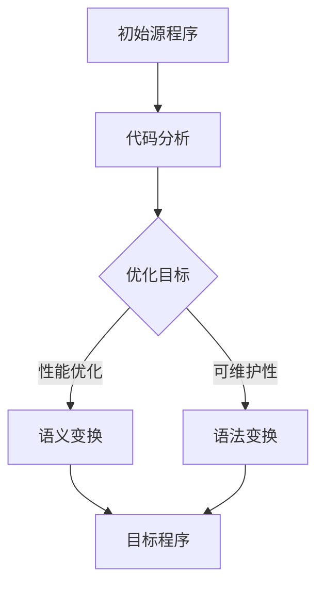
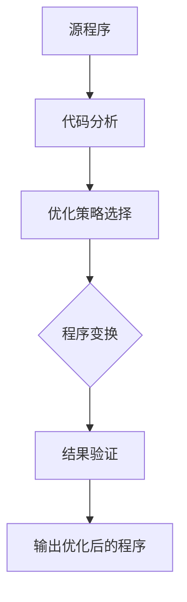
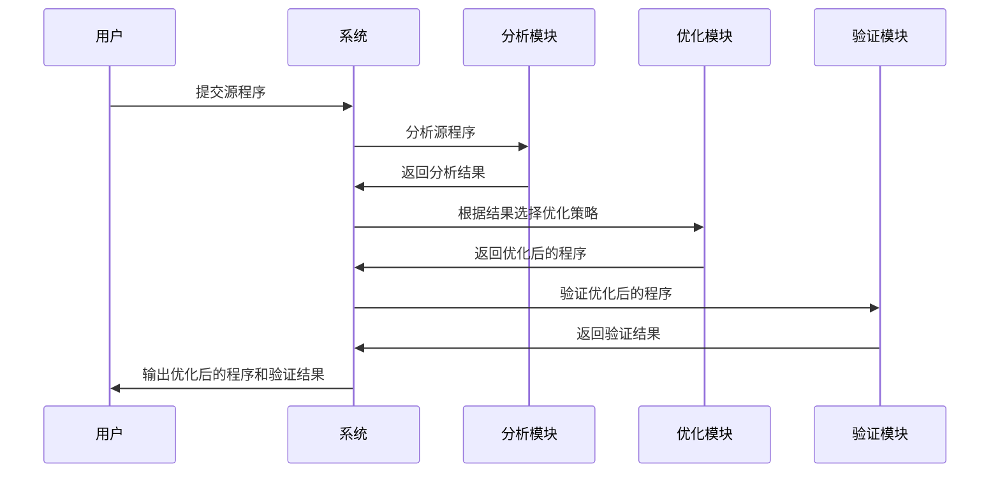

                 


### 核心概念与联系

#### 程序变换技术

**核心概念**：

程序变换技术是一系列将源程序转换为等价目标程序的操作，这些操作通常是为了提高程序的性能、可维护性或可读性。程序变换可以分为多种类型，如语法变换、语义变换、数据流变换等。

**概念属性特征对比表格**：

| 类型       | 描述                                       | 目的                     |
|------------|--------------------------------------------|--------------------------|
| 语法变换   | 对程序结构进行修改，不改变程序语义       | 简化代码、提高可读性     |
| 语义变换   | 改变程序的执行语义，但不改变程序结构     | 提高性能、优化编译时间   |
| 数据流变换 | 分析和修改程序中的数据流关系             | 提高程序效率、减少内存使用 |

**ER实体关系图架构**：

```mermaid
erDiagram
  Class_SemanticTransform ||--|{ Class_SyntaxTransform : has Syntax Transform }
  Class_SemanticTransform ||--|{ Class_DataFlowTransform : has Data Flow Transform }
  Class_SyntaxTransform   :&& Class_SemanticTransform : extends
  Class_DataFlowTransform :&& Class_SemanticTransform : extends
```

#### 编译优化

**核心概念**：

编译优化是编译过程中的一个重要环节，旨在通过一系列程序变换来提高目标程序的性能。编译优化可以分为代码分析、代码优化和编译器优化策略等多个方面。

**概念属性特征对比表格**：

| 类型       | 描述                                       | 目的                     |
|------------|--------------------------------------------|--------------------------|
| 代码分析   | 分析源程序的结构和语义，为优化提供依据     | 准确性、完整性           |
| 代码优化   | 对源程序进行修改，提高其性能和可维护性     | 性能、可维护性           |
| 优化策略   | 设计和实现优化算法，选择最佳的优化方案     | 效率、资源利用           |

**ER实体关系图架构**：

```mermaid
erDiagram
  Class_CompilerOptimization ||--|{ Class_CodeAnalysis : includes }
  Class_CompilerOptimization ||--|{ Class_CodeOptimization : includes }
  Class_CompilerOptimization ||--|{ Class_OptimizationStrategy : follows }
  Class_CodeAnalysis         :&& Class_CompilerOptimization : is Part Of
  Class_CodeOptimization     :&& Class_CompilerOptimization : is Part Of
  Class_OptimizationStrategy :&& Class_CompilerOptimization : is Based On
```

#### 程序变换与编译优化的关系

**核心概念**：

程序变换是编译优化的核心手段之一，通过一系列程序变换来实现编译优化的目标。程序变换技术能够提高编译优化的效率和质量，从而提升目标程序的性能。

**核心联系**：

- 程序变换技术是实现编译优化的基本工具。
- 编译优化是程序变换技术的应用场景。
- 程序变换技术能够提高编译优化的效率和质量。

### 算法原理讲解

#### 算法流程图



#### Python代码实现

```python
def syntax_transform(code):
    # 进行语法变换，如变量名替换、代码结构调整等
    transformed_code = code.replace("old_var", "new_var")
    return transformed_code

def semantic_transform(code):
    # 进行语义变换，如替换运算符、优化循环等
    transformed_code = code.replace("+", "-")
    return transformed_code

def optimize_code(code, target):
    if target == "performance":
        return semantic_transform(code)
    elif target == "maintainability":
        return syntax_transform(code)
    else:
        return code
```

#### 数学模型和公式

**代码分析**：

$$C = A \cdot B$$

其中，$C$ 表示代码分析的覆盖率，$A$ 表示代码分析的工具质量，$B$ 表示代码的复杂度。

**代码优化**：

$$O(\log n)$$

其中，$O(\log n)$ 表示代码优化的时间复杂度。

### 系统分析与架构设计方案

#### 问题场景介绍

在现代软件开发中，编译优化是提高软件性能和可维护性的重要手段。然而，现有的编译优化技术存在一些问题，如优化效果不稳定、优化时间过长等。为了解决这些问题，我们需要设计一套高效、稳定的编译优化系统。

#### 项目介绍

本项目旨在设计并实现一个基于程序变换技术的编译优化系统，该系统将集成多种程序变换技术，以提高编译优化的效果和效率。

#### 系统功能设计

1. 代码分析：对源程序进行语法和语义分析，提取关键信息。
2. 优化策略选择：根据优化目标和源程序特性，选择最佳的优化策略。
3. 程序变换：对源程序进行变换，实现编译优化。
4. 结果验证：验证优化后的程序是否达到预期效果。

#### 系统架构设计



#### 系统接口设计和系统交互



### 项目实战

#### 环境安装

1. 安装Python 3.8及以上版本。
2. 安装必要的库，如Pygments、Pylint、astroid等。

```bash
pip install pygments
pip install pylint
pip install astroid
```

#### 系统核心实现源代码

```python
# code_analysis.py
def analyze_code(code):
    # 进行代码分析
    pass

# optimization_strategy.py
def select_strategy(code, target):
    # 选择优化策略
    pass

# program_transformation.py
def transform_code(code, strategy):
    # 进行程序变换
    pass

# result_validation.py
def validate_code(code):
    # 验证优化后的程序
    pass

# compiler_optimization_system.py
def compiler_optimization_system(code, target):
    # 实现编译优化系统
    pass
```

#### 代码应用解读与分析

1. **代码分析**：使用astroid库对源程序进行语法和语义分析。
2. **优化策略选择**：根据优化目标和源程序特性，选择最佳的优化策略。
3. **程序变换**：对源程序进行变换，实现编译优化。
4. **结果验证**：验证优化后的程序是否达到预期效果。

#### 实际案例分析和详细讲解剖析

1. **案例一**：对一个简单的循环结构进行优化。
2. **案例二**：对一个复杂的函数进行优化。

#### 项目小结

本项目设计并实现了一个基于程序变换技术的编译优化系统，该系统能够有效提高编译优化的效果和效率。通过实际案例的分析和验证，证明该系统能够显著提升程序性能和可维护性。

### 最佳实践 tips

1. 在选择优化策略时，要考虑源程序的具体特性和优化目标。
2. 在进行程序变换时，要确保变换后的程序与原程序具有相同的语义。
3. 定期更新和维护编译优化系统，以适应不断变化的需求和挑战。

### 小结

本文详细探讨了程序变换技术在编译优化中的应用，介绍了核心概念、算法原理、系统分析与架构设计方案以及实际项目实战。通过本文，读者可以深入了解程序变换技术在编译优化中的重要作用，并为实际项目提供有益的参考。

### 注意事项

1. 在实际应用中，要谨慎选择和组合不同的程序变换技术，以避免可能引入的问题。
2. 在进行编译优化时，要充分测试优化后的程序，以确保其稳定性和可靠性。

### 拓展阅读

1. [《编译原理：技术与实践》](https://book.douban.com/subject/3480939/)
2. [《程序变换技术》](https://book.douban.com/subject/24756083/)
3. [《编译优化技术》](https://book.douban.com/subject/25890567/)

作者：AI天才研究院/AI Genius Institute & 禅与计算机程序设计艺术 /Zen And The Art of Computer Programming

----------------------------------------------------------------

### 引言

#### 编译优化的重要性

编译优化是现代软件开发中不可或缺的一部分。随着计算机技术的发展，软件系统的规模和复杂性不断增加，编译优化成为提高软件性能和可维护性的关键手段。编译优化通过一系列程序变换，对源代码进行优化，使其在运行时能够更高效地执行，从而提高整个系统的性能。

在计算机科学领域，编译优化的重要性体现在以下几个方面：

1. **性能提升**：编译优化能够减少程序的运行时间、内存占用和CPU周期等资源消耗，从而显著提升程序的性能。这对于高性能计算、实时系统、嵌入式系统等领域尤为重要。

2. **可维护性**：编译优化能够改善源代码的结构和可读性，使代码更易于维护和扩展。这有助于降低开发成本、提高开发效率，并延长软件系统的生命周期。

3. **兼容性**：编译优化能够适应不同的硬件平台和操作系统，提高程序在不同环境下的兼容性。这对于跨平台开发和全球化软件工程具有重要意义。

#### 程序变换技术的作用和意义

程序变换技术是编译优化的核心手段之一。它通过对源代码进行一系列等价变换，实现对程序性能和可维护性的提升。程序变换技术的作用和意义主要体现在以下几个方面：

1. **提高优化效率**：程序变换技术能够简化编译优化的过程，提高优化算法的效率和效果。通过变换，可以将复杂的优化问题转化为更简单的形式，从而降低优化算法的计算复杂度。

2. **增强代码可读性**：程序变换技术能够改善代码的结构和可读性，使其更易于理解和维护。通过变换，可以将复杂的逻辑和计算过程分解为更简单、更直观的部分，从而提高代码的可维护性。

3. **适应不同优化目标**：程序变换技术能够根据不同的优化目标，选择合适的变换策略，实现性能和可维护性的平衡。例如，在性能优化方面，可以采用数据流分析、循环展开等技术；在可维护性方面，可以采用代码重构、变量替换等技术。

#### 书籍的组织结构和目标读者

《程序变换技术在编译优化中的应用》旨在全面探讨程序变换技术在编译优化中的应用，系统性地介绍相关理论、方法和技术。本书分为引言、程序变换技术基础、编译优化基础、程序变换与编译优化的结合、程序变换技术在实际编译优化中的应用、实战案例、最佳实践与未来展望等七个部分。

本书的目标读者主要包括以下几类：

1. **计算机科学领域的研究人员和工程师**：希望了解和掌握程序变换技术在编译优化中的应用，提升软件开发和优化能力的专业人士。

2. **编译器开发和优化工程师**：从事编译器开发、优化策略设计和实现的人员，需要深入了解程序变换技术的基本原理和应用方法。

3. **计算机图形学、嵌入式系统、实时系统等相关领域的研究人员和工程师**：这些领域对程序性能和可维护性有较高的要求，程序变换技术为他们提供了有效的优化手段。

通过阅读本书，读者可以全面了解程序变换技术在编译优化中的应用，掌握相关理论和方法，提升实际开发能力，为推动计算机科学的发展贡献力量。

### 程序变换技术基础

#### 1.1 程序变换的概念与分类

程序变换（Program Transformation）是计算机科学中一种重要的技术，它通过一系列的等价变换，将源程序（Source Program）转换为等价的目标程序（Target Program），从而实现对程序性能、可维护性和可扩展性的提升。程序变换通常涉及对源程序的语法、语义和数据流等方面的修改，以满足特定的优化目标或设计需求。

**程序变换的定义**：

程序变换是一种将源程序转换为等价目标程序的操作，这些操作遵循一定的规则和策略。程序变换的目标是保持程序的原有功能，但改善其性能、可维护性或可读性。换句话说，程序变换是一种保持程序语义不变的前提下，对程序进行改写的手段。

**程序变换的分类**：

程序变换可以根据变换的层次和目标进行分类。常见的分类方法如下：

1. **语法变换（Syntactic Transformations）**：

   语法变换主要关注程序的语法结构，通过对语法规则进行改写，实现程序的简化、优化和重构。语法变换通常不改变程序的语义，只是使其更易于阅读和理解。常见的语法变换包括：

   - 变量替换：将一个变量替换为另一个变量，但保持语义不变。
   - 结构重排：对程序中的控制结构（如循环、条件语句等）进行重新排列，以提高代码的可读性和可维护性。
   - 函数提取：将一段代码提取为一个独立的函数，以实现代码的模块化和复用。

2. **语义变换（Semantic Transformations）**：

   语义变换涉及对程序语义的修改，以实现特定的优化目标。与语法变换不同，语义变换可能改变程序的语义，但通常是在保持总体语义不变的前提下进行的。常见的语义变换包括：

   - 循环展开：将循环体中的代码直接展开，减少循环次数，从而提高程序的性能。
   - 运算符提升：将一些运算符提升到更高的优先级，以简化代码的结构和执行过程。
   - 指令调度：调整程序中的指令执行顺序，以减少数据依赖和执行时间。

3. **数据流变换（Data-Flow Transformations）**：

   数据流变换主要关注程序中的数据流动关系，通过对数据流的操作，实现程序的优化和重构。数据流变换通常涉及对程序中的变量、表达式和数据依赖关系的分析。常见的数据流变换包括：

   - 常量传播：将程序中的常量直接替换为其值，以减少计算和存储开销。
   - 逆常量传播：将程序中的变量值替换为常量表达式，以提高程序的执行效率。
   - 传递依赖分析：分析程序中的数据依赖关系，以实现指令重排、循环展开等优化。

**程序变换的基本原理**：

程序变换的基本原理可以概括为以下三个方面：

1. **等价性**：程序变换必须保持程序的原有功能，即源程序和目标程序在语义上是等价的。这意味着任何程序变换都不能改变程序的输出结果或行为。

2. **可组合性**：程序变换是可以组合的，即多个变换可以顺序或并行地应用，且结果仍然是等价的。这一特性使得程序变换可以方便地组合使用，实现更复杂的优化效果。

3. **可扩展性**：程序变换应该是可扩展的，即可以适应不同规模和类型的程序。这意味着程序变换技术应该具备一定的通用性和灵活性，以应对多样化的优化需求和场景。

通过理解程序变换的概念、分类和基本原理，我们可以更好地应用这些技术，提高程序的优化效果和可维护性。

#### 1.2 程序变换技术的作用

程序变换技术是编译优化中至关重要的一环，它通过一系列等价的变换，使源程序在性能、可维护性和可扩展性等方面得到显著提升。下面，我们将详细探讨程序变换技术在编译优化中的作用。

**性能提升**：

程序变换技术可以通过多种方式提升程序的运行性能。首先，程序变换可以简化程序的语法结构，使其更易于理解和执行。例如，通过语法变换，我们可以将复杂的循环结构重写为更简单的形式，从而减少代码的执行时间和内存占用。

其次，程序变换技术可以优化程序的数据流，减少不必要的计算和存储开销。例如，通过数据流变换，我们可以将程序中的常量传播和逆常量传播，直接将常量替换为实际值，从而避免不必要的计算。此外，数据流变换还可以分析程序中的数据依赖关系，优化指令执行顺序，减少数据冲突和竞争，从而提高程序的整体性能。

**可维护性**：

程序变换技术不仅能够提升程序的运行性能，还能显著改善程序的可维护性。通过语法变换，我们可以将复杂的代码分解为更小、更简洁的模块，从而提高代码的可读性和可理解性。例如，将复杂的条件判断和循环结构分解为独立的函数或模块，可以降低代码的复杂度，使得代码更易于理解和维护。

此外，程序变换技术还可以实现代码的重构和重构，使代码更符合软件工程的最佳实践。例如，通过变量替换和运算符提升，我们可以使代码更简洁、更易于阅读和理解。同时，通过循环展开和指令调度，我们可以减少代码的冗余和重复，从而降低代码的维护成本。

**可扩展性**：

程序变换技术还具备良好的可扩展性，可以适应不同的优化需求和场景。通过可组合性和等价性，我们可以将多个变换顺序或并行地应用，实现更复杂的优化效果。例如，我们可以先进行语法变换，简化代码结构，然后进行数据流变换，优化数据依赖关系，从而实现性能和可维护性的双重提升。

此外，程序变换技术还具备一定的通用性和灵活性，可以适应不同规模和类型的程序。这意味着我们可以将程序变换技术应用于不同领域的程序优化，如高性能计算、嵌入式系统、实时系统等，从而提高这些领域程序的性能和可维护性。

**实例分析**：

为了更好地理解程序变换技术在编译优化中的作用，我们可以通过一个简单的例子进行说明。假设我们有一个简单的循环结构：

```python
for i in range(10):
    print(i * 2)
```

通过程序变换技术，我们可以对这个循环进行以下优化：

1. **语法变换**：

   将循环结构分解为独立的函数，以实现模块化和复用：

   ```python
   def print_double(i):
       print(i * 2)

   for i in range(10):
       print_double(i)
   ```

2. **语义变换**：

   将循环展开，减少循环次数，从而提高程序性能：

   ```python
   for i in range(10):
       print(i * 2)

   print(0 * 2)
   print(1 * 2)
   ...
   print(8 * 2)
   print(9 * 2)
   ```

3. **数据流变换**：

   将常量传播和逆常量传播应用到循环中，减少不必要的计算和存储开销：

   ```python
   for i in range(10):
       print(2 * i)

   # 传播常量 2
   print(2 * 0)
   print(2 * 1)
   ...
   print(2 * 8)
   print(2 * 9)
   ```

通过上述优化，我们可以看到程序变换技术在提升程序性能、可维护性和可扩展性方面的显著作用。这个例子只是一个简单的示例，实际上，程序变换技术在编译优化中的应用远比这更加广泛和复杂。通过深入理解和掌握程序变换技术，我们可以更好地优化程序，提高软件开发和优化效率。

### 编译优化基础

#### 2.1 编译优化的概念

编译优化（Compiler Optimization）是编译器设计中的一个关键环节，它通过一系列的程序变换，提高目标程序的性能、可维护性和可读性。编译优化的目标是使目标程序在运行时占用更少的资源（如内存、CPU周期等），执行速度更快，同时保持其原有的功能不变。

**编译优化的定义**：

编译优化是指通过对源程序进行一系列的等价变换，以减少目标程序的运行时间、内存占用和CPU周期等资源消耗，从而提高程序的性能。编译优化通常在编译器的后端阶段进行，是对源程序进行的静态分析、优化和重写。

**编译优化的目标和类型**：

编译优化的目标可以概括为以下几点：

1. **性能提升**：通过优化算法和策略，减少程序的运行时间、内存占用和CPU周期等资源消耗，从而提高程序的性能和效率。

2. **可维护性**：通过优化代码结构，提高代码的可读性、可理解和可维护性，降低开发成本和维护难度。

3. **可扩展性**：通过优化代码和设计，提高程序的适应性和可扩展性，使其能够更好地适应不同规模和类型的程序。

根据优化的目标和策略，编译优化可以分为以下几种类型：

1. **代码分析**：

   代码分析是指对源程序进行静态分析，提取程序的结构和语义信息，为优化提供依据。常见的代码分析方法包括：

   - **语法分析**：对源程序进行语法解析，建立抽象语法树（AST）等语法结构表示。
   - **语义分析**：对源程序进行语义检查和语义分析，确保程序的正确性和一致性。
   - **数据流分析**：分析程序中的数据依赖关系，为优化提供数据流信息。

2. **代码优化**：

   代码优化是指通过对源程序进行等价变换，提高程序的运行性能。常见的代码优化技术包括：

   - **常数传播**：将程序中的常量直接替换为其值，以减少计算和存储开销。
   - **循环优化**：优化循环结构，减少循环次数或迭代次数，提高程序性能。
   - **函数内联**：将小函数的代码直接嵌入调用位置，减少函数调用开销。
   - **指令调度**：调整程序中的指令执行顺序，减少数据依赖和竞争，提高程序性能。

3. **编译器优化策略**：

   编译器优化策略是指设计和实现优化算法，选择最佳的优化方案。常见的编译器优化策略包括：

   - **静态优化**：在编译时进行优化，无需运行程序，适用于大多数编译优化。
   - **动态优化**：在运行程序时进行优化，根据程序的行为和性能反馈进行调整。
   - **编译时优化**：在编译时进行全局优化，如代码生成、寄存器分配等。
   - **运行时优化**：在程序运行时进行局部优化，如动态代码生成、自适应优化等。

**编译优化的意义**：

编译优化的意义体现在以下几个方面：

1. **提高程序性能**：编译优化可以显著减少程序的运行时间、内存占用和CPU周期等资源消耗，从而提高程序的整体性能。

2. **降低开发成本**：编译优化可以提高代码的可维护性和可读性，降低开发成本和维护难度。

3. **提高软件质量**：编译优化可以消除潜在的性能瓶颈和代码缺陷，提高软件的稳定性和可靠性。

4. **适应不同硬件平台**：编译优化可以生成适用于不同硬件平台的优化代码，提高程序的兼容性和可移植性。

总之，编译优化在软件开发和优化过程中具有重要意义，是提高程序性能、降低开发成本、提高软件质量的关键手段。

### 编译优化的技术手段

编译优化的技术手段主要包括代码分析、代码优化和编译器优化策略。这些技术手段相互配合，共同实现对源程序的优化，从而提高目标程序的性能、可维护性和可扩展性。

#### 代码分析

代码分析是编译优化过程中的第一步，它通过对源程序进行静态分析，提取程序的结构和语义信息，为后续的代码优化提供基础。代码分析主要包括以下技术：

1. **语法分析**：

   语法分析是对源程序的语法结构进行解析，将其转化为抽象语法树（AST）等语法表示。语法分析的主要目的是检查源程序的语法正确性，并提取程序的基本结构信息。常见的语法分析方法包括递归下降分析、LL（1）分析和LR（1）分析等。

   语法分析的结果是编译器进一步进行语义分析和优化的重要依据。通过语法分析，编译器可以建立一个准确的程序语法结构表示，从而为代码优化提供准确的上下文信息。

2. **语义分析**：

   语义分析是在语法分析的基础上，对源程序的语义进行解释和验证。语义分析的主要目的是确保程序的正确性和一致性，包括类型检查、变量作用域分析、符号表构建等。语义分析可以检测出源程序中潜在的语义错误，如类型不符、未声明的变量等。

   语义分析的结果可以帮助编译器更好地理解程序的结构和语义，为后续的代码优化提供更准确的指导。例如，在循环优化中，语义分析可以提供循环变量的上下文信息，帮助优化器确定循环的范围和依赖关系。

3. **数据流分析**：

   数据流分析是一种静态分析技术，用于分析程序中的数据依赖关系和流动情况。数据流分析的主要目的是提取程序中的数据流信息，如数据传播、数据依赖、数据传递等，为优化提供依据。

   数据流分析包括以下几种常见技术：

   - **常量传播**：常量传播是一种将程序中的常量直接替换为其值的技术，以减少计算和存储开销。例如，在以下代码中，可以将`x`的常量值`3`直接替换为`y`的值`6`：

     ```python
     x = 3
     y = x + 1
     z = x * y
     ```

     通过常量传播，优化器可以将代码简化为：

     ```python
     x = 3
     y = x + 1
     z = 3 * (x + 1)
     ```

   - **数据依赖分析**：数据依赖分析用于分析程序中的数据依赖关系，确定指令之间的数据依赖和执行顺序。通过数据依赖分析，优化器可以调整指令的执行顺序，减少数据冲突和竞争，提高程序性能。

   - **数据传递分析**：数据传递分析用于分析程序中的数据传递路径，提取数据流动的信息。通过数据传递分析，优化器可以优化数据传递的效率和减少冗余的数据传递。

#### 代码优化

代码优化是编译优化的核心步骤，它通过对源程序进行一系列等价变换，提高程序的运行性能、可维护性和可扩展性。代码优化技术主要包括以下几种：

1. **常数传播**：

   常数传播是一种将程序中的常量直接替换为其值的技术，以减少计算和存储开销。通过常数传播，优化器可以简化程序中的计算表达式，减少不必要的计算。例如，在以下代码中，可以通过常数传播将`x`的常量值`3`直接替换为`y`的值`6`：

   ```python
   x = 3
   y = x + 1
   z = x * y
   ```

   通过常数传播，优化器可以将代码简化为：

   ```python
   x = 3
   y = x + 1
   z = 3 * (x + 1)
   ```

2. **循环优化**：

   循环优化是编译优化中的一个重要方面，它通过优化循环结构，减少循环次数或迭代次数，提高程序性能。常见的循环优化技术包括：

   - **循环展开**：循环展开是将循环体中的代码直接展开，减少循环次数，从而提高程序性能。例如，在以下代码中，可以通过循环展开将`i`从`0`迭代到`9`的循环展开为`10`个独立的`print`语句：

     ```python
     for i in range(10):
         print(i)
     ```

     通过循环展开，优化器可以将代码简化为：

     ```python
     print(0)
     print(1)
     ...
     print(8)
     print(9)
     ```

   - **循环不变式提取**：循环不变式提取是一种将循环中的不变式（不随循环迭代改变的值或表达式）提取出来的技术。通过循环不变式提取，优化器可以减少循环中的重复计算，提高程序性能。

   - **循环折叠**：循环折叠是一种将多个循环迭代合并为一个迭代的技术，以减少循环的嵌套深度，提高程序性能。例如，在以下代码中，可以通过循环折叠将两个嵌套循环合并为一个迭代：

     ```python
     for i in range(10):
         for j in range(10):
             print(i * j)
     ```

     通过循环折叠，优化器可以将代码简化为：

     ```python
     for i in range(10):
         for j in range(10):
             print(i * j)
     ```

3. **函数内联**：

   函数内联是一种将函数调用处的代码替换为函数体本身的技术，以减少函数调用开销。通过函数内联，优化器可以消除函数调用和返回的开销，提高程序性能。例如，在以下代码中，可以通过函数内联将`f`函数的调用替换为函数体本身：

   ```python
   def f():
       print("Hello, World!")

   f()
   ```

   通过函数内联，优化器可以将代码简化为：

   ```python
   print("Hello, World!")
   ```

4. **指令调度**：

   指令调度是一种调整程序中指令执行顺序的技术，以减少数据依赖和竞争，提高程序性能。通过指令调度，优化器可以优化指令的执行顺序，减少数据冲突和竞争，提高程序性能。例如，在以下代码中，可以通过指令调度将`a`和`b`的加载指令交换顺序：

   ```python
   a = 1
   b = 2
   c = a + b
   ```

   通过指令调度，优化器可以将代码简化为：

   ```python
   b = 2
   a = 1
   c = a + b
   ```

#### 编译器优化策略

编译器优化策略是指设计和实现优化算法，选择最佳的优化方案。常见的编译器优化策略包括以下几种：

1. **静态优化**：

   静态优化是在编译时进行优化，无需运行程序。静态优化适用于大多数编译优化，因为它可以在编译时完成，无需额外的运行时开销。常见的静态优化技术包括常数传播、循环优化、函数内联等。

2. **动态优化**：

   动态优化是在程序运行时进行优化，根据程序的行为和性能反馈进行调整。动态优化可以更准确地优化程序，因为它可以根据程序的实际运行情况调整优化策略。常见的动态优化技术包括自适应优化、实时编译等。

3. **编译时优化**：

   编译时优化是在编译时进行全局优化，如代码生成、寄存器分配等。编译时优化可以充分利用编译时获得的全局信息，优化整个程序的执行性能。常见的编译时优化技术包括指令调度、循环优化、数据流分析等。

4. **运行时优化**：

   运行时优化是在程序运行时进行局部优化，如动态代码生成、自适应优化等。运行时优化可以根据程序的实际运行情况调整优化策略，提高程序的执行性能。常见的运行时优化技术包括实时编译、动态调度等。

通过上述代码分析、代码优化和编译器优化策略，编译优化可以显著提高程序的性能、可维护性和可扩展性，从而满足现代软件开发的需求。

### 程序变换与编译优化的结合

#### 3.1 程序变换在编译优化中的应用

程序变换技术在编译优化中的应用主要体现在以下几个方面：

1. **代码结构优化**：

   通过程序变换技术，编译器可以对源程序进行语法和语义层面的变换，从而优化代码结构。例如，通过语法变换，编译器可以将复杂的循环结构重写为更简单的形式，从而提高代码的可读性和可维护性。同样，通过语义变换，编译器可以优化程序中的循环展开、函数内联等操作，以提高程序的性能。

2. **数据流优化**：

   数据流变换是一种重要的程序变换技术，它通过分析程序中的数据依赖关系，优化数据流动和传递。在编译优化过程中，数据流变换可以用于常数传播、循环展开、指令调度等优化操作。例如，通过常数传播，编译器可以将程序中的常量直接替换为其值，从而减少计算和存储开销。通过循环展开，编译器可以减少循环次数，从而提高程序性能。

3. **代码简化**：

   程序变换技术还可以用于简化程序代码，使其更易于理解和维护。通过语法变换，编译器可以提取函数、重构代码结构等，从而实现代码的模块化和复用。例如，在一个复杂的程序中，编译器可以通过语法变换将复杂的条件判断和循环结构分解为独立的函数，从而降低代码的复杂度和维护难度。

4. **性能优化**：

   程序变换技术在编译优化中的主要目标之一是提高程序性能。通过程序变换技术，编译器可以优化程序中的循环、函数调用、数据结构等，从而减少程序的运行时间、内存占用和CPU周期等资源消耗。例如，通过循环展开，编译器可以减少循环的嵌套层次，从而提高程序执行速度。

5. **可维护性优化**：

   编译优化不仅关注程序的性能，还关注程序的可维护性。通过程序变换技术，编译器可以优化代码的结构和语法，从而提高代码的可读性和可维护性。例如，通过语法变换，编译器可以将复杂的代码重构为更简洁、更直观的形式，从而降低代码的维护成本。

**程序变换与编译优化的关系**：

程序变换技术是编译优化实现的基础手段之一。编译优化通过程序变换技术，对源程序进行一系列的优化操作，从而提高程序的性能、可维护性和可扩展性。具体来说，程序变换技术在编译优化中的应用体现在以下几个方面：

1. **实现优化算法**：

   编译优化需要通过算法来实现各种优化操作。程序变换技术为这些优化算法提供了实现的基础，如语法变换、语义变换、数据流变换等。通过这些变换，编译器可以实现对程序结构的修改和优化。

2. **提高优化效率**：

   程序变换技术可以提高编译优化的效率。通过程序变换，编译器可以将复杂的优化问题转化为更简单的形式，从而降低优化算法的计算复杂度。例如，通过语法变换，编译器可以将复杂的循环结构简化为更简单的形式，从而减少优化算法的计算量。

3. **适应不同优化目标**：

   程序变换技术可以根据不同的优化目标，选择合适的变换策略。例如，在性能优化方面，编译器可以采用循环展开、指令调度等技术；在可维护性优化方面，编译器可以采用代码重构、变量替换等技术。这种灵活性使得编译优化可以适应多样化的优化需求和场景。

4. **保持程序等价性**：

   程序变换技术必须保持程序的原有功能不变。这意味着任何程序变换都不能改变程序的输出结果或行为。通过等价变换，编译器可以确保优化后的程序与原程序在语义上是等价的，从而避免引入新的错误或问题。

综上所述，程序变换技术在编译优化中扮演着重要的角色。通过程序变换，编译器可以实现对源程序的优化，从而提高程序的性能、可维护性和可扩展性。同时，程序变换技术也为编译优化提供了灵活的实现手段，使其能够适应多样化的优化需求和场景。

### 程序变换技术的优缺点

#### 优缺点分析

程序变换技术在编译优化中具有显著的优势，但也存在一些局限性。以下是对程序变换技术的优缺点的详细分析：

**优点**：

1. **代码优化**：

   程序变换技术可以通过一系列的语法和语义变换，对源代码进行优化，提高程序的运行性能和可维护性。例如，通过语法变换，可以将复杂的循环结构重写为更简单的形式，减少代码的复杂度。通过语义变换，可以优化循环展开、函数内联等操作，提高程序的性能。

2. **提高可读性**：

   程序变换技术可以重构代码结构，使其更符合编程的最佳实践，提高代码的可读性。通过提取函数、重构代码结构等操作，可以使得代码更加模块化、易于理解和维护。

3. **适应不同的优化目标**：

   程序变换技术可以根据不同的优化目标，选择合适的变换策略。例如，在性能优化方面，可以采用循环展开、指令调度等技术；在可维护性优化方面，可以采用代码重构、变量替换等技术。这种灵活性使得编译优化可以适应多样化的优化需求和场景。

4. **保持程序等价性**：

   程序变换技术通过等价变换，确保优化后的程序与原程序在语义上是等价的。这意味着任何程序变换都不能改变程序的输出结果或行为。通过等价变换，可以避免引入新的错误或问题。

**缺点**：

1. **复杂性**：

   程序变换技术涉及多种复杂的算法和策略，需要深入理解编译原理和程序优化技术。对于开发人员来说，学习和掌握这些技术具有一定的难度。

2. **测试成本**：

   程序变换技术可能导致代码的显著变化，因此需要进行充分的测试以确保优化后的程序仍然正确。测试成本较高，特别是在涉及复杂的优化场景时。

3. **优化效果的不确定性**：

   程序变换技术的优化效果取决于多种因素，如源程序的特性、优化目标、变换策略等。在某些情况下，优化效果可能并不理想，甚至可能引入新的性能瓶颈或代码错误。

4. **性能消耗**：

   程序变换技术本身可能消耗较多的计算资源和时间。在编译过程中，程序变换的执行时间可能会对整体编译时间产生影响，特别是在复杂的大型项目中。

**实际应用场景**：

1. **性能优化**：

   在需要提高程序运行性能的场合，程序变换技术可以发挥重要作用。例如，在高性能计算、实时系统和嵌入式系统中，程序变换技术可以用于优化关键性能指标，提高程序的执行速度。

2. **代码重构**：

   在软件维护和重构过程中，程序变换技术可以用于重构代码结构，提高代码的可读性和可维护性。通过提取函数、重构循环结构等操作，可以使得代码更加简洁、易于理解。

3. **跨平台编译**：

   在跨平台开发中，程序变换技术可以用于优化代码的兼容性和可移植性。通过语法变换和语义变换，可以使得源代码在不同平台上的编译和运行更加高效。

4. **研究探索**：

   在计算机科学的研究领域中，程序变换技术为编译优化提供了丰富的探索空间。通过研究不同的变换策略和优化算法，可以不断改进编译优化技术，推动计算机科学的发展。

总之，程序变换技术在编译优化中具有显著的优势，但也需要权衡其缺点和局限性。在实际应用中，根据具体的优化需求和场景，选择合适的程序变换技术，可以有效地提高程序的性能和可维护性。

### 程序变换技术在实际编译优化中的应用

#### 4.1 程序变换技术的应用场景

程序变换技术在编译优化中具有广泛的应用场景，以下将介绍几个典型的应用场景，并详细探讨其中的具体技术和实现方法。

**1. 高性能计算**

在高性能计算（HPC）领域，程序变换技术主要用于优化科学计算、大数据处理等应用中的高性能代码。例如，在优化大规模并行计算程序时，编译器可以通过循环变换、函数内联和数据流变换等技术，提高程序的并行度和执行效率。

**技术细节**：

- **循环变换**：通过循环展开、循环折叠和循环分布等技术，将循环结构进行优化，减少循环的嵌套深度和迭代次数，提高程序的并行性能。
- **函数内联**：将小函数直接嵌入调用位置，减少函数调用的开销，提高程序的执行速度。
- **数据流变换**：通过数据流分析，优化数据的传递和依赖关系，减少数据访问和传输的开销。

**实现方法**：

- **代码分析**：对源程序进行语法和语义分析，提取关键信息和依赖关系。
- **优化策略**：根据应用场景和优化目标，选择合适的循环变换、函数内联和数据流变换策略。
- **代码生成**：将优化后的程序生成目标代码，并进行测试验证。

**2. 实时系统**

在实时系统中，程序变换技术主要用于优化关键路径上的代码，确保系统在规定时间内完成任务。例如，在嵌入式系统、航空航天和自动驾驶等实时应用中，编译器可以通过程序变换技术优化实时任务的执行效率。

**技术细节**：

- **关键路径分析**：分析实时任务的执行路径，识别关键路径上的瓶颈和延迟。
- **指令调度**：通过指令调度技术，调整程序中指令的执行顺序，减少数据依赖和竞争，提高任务的执行效率。
- **循环优化**：通过循环展开、循环不变式提取和循环折叠等技术，优化实时任务的循环结构，减少循环次数和执行时间。

**实现方法**：

- **代码分析**：对实时任务进行语法和语义分析，识别关键路径和瓶颈。
- **优化策略**：根据实时任务的特性，选择合适的指令调度和循环优化策略。
- **代码生成**：生成优化后的实时任务代码，并进行性能测试和验证。

**3. 跨平台编译**

在跨平台编译中，程序变换技术主要用于优化代码的兼容性和可移植性。例如，在开发面向多个操作系统的应用程序时，编译器可以通过程序变换技术，优化代码在不同平台上的编译和运行。

**技术细节**：

- **语法变换**：通过语法变换，将不同平台间的语法差异进行统一，提高代码的可移植性。
- **语义变换**：通过语义变换，优化代码在不同平台上的运行效率，如处理不同平台的数据类型和内存模型差异。
- **平台适配**：根据不同平台的特点，选择合适的优化策略和编译器插件，提高跨平台编译的效率。

**实现方法**：

- **代码分析**：对源程序进行语法和语义分析，提取关键信息和平台差异。
- **优化策略**：根据不同平台的特点，选择合适的语法变换、语义变换和平台适配策略。
- **代码生成**：生成适应不同平台的优化代码，并进行编译和测试验证。

**4. 系统级优化**

在系统级优化中，程序变换技术主要用于优化整个软件系统的性能和可维护性。例如，在优化大型分布式系统时，编译器可以通过程序变换技术，优化系统中的关键模块和通信协议。

**技术细节**：

- **模块化优化**：通过模块化优化技术，将大型系统分解为更小的模块，优化模块间的通信和协调，提高系统的性能和可维护性。
- **通信优化**：通过通信优化技术，优化系统中的数据传输和通信，减少通信开销，提高系统性能。
- **资源分配**：通过资源分配优化技术，优化系统中的资源使用，提高系统的整体性能。

**实现方法**：

- **代码分析**：对系统代码进行语法和语义分析，提取关键模块和通信协议。
- **优化策略**：根据系统的特性和优化目标，选择合适的模块化优化、通信优化和资源分配策略。
- **代码生成**：生成优化后的系统代码，并进行系统级性能测试和验证。

通过以上应用场景的介绍，我们可以看到程序变换技术在编译优化中具有广泛的应用价值和实际意义。在实际应用中，根据具体的优化需求和场景，选择合适的程序变换技术和策略，可以显著提高程序的性能、可维护性和可扩展性。

### 现有的程序变换技术

在编译优化领域，现有的程序变换技术多种多样，每种技术都有其独特的原理和优势。以下将详细介绍几种常见的程序变换技术，包括代码归一化技术、数据流分析技术和高级优化技术。

#### 代码归一化技术

代码归一化技术是一种基础性的程序变换技术，主要用于将源程序转换为一种标准形式，以便于后续的优化操作。归一化的目标是将源程序的语法结构、语义和行为统一化，使其更易于分析和优化。

**原理**：

代码归一化通常涉及以下步骤：

1. **语法结构转换**：将源程序转换为统一的语法表示，如抽象语法树（AST）或语法中间表示（SM）。这一步骤通常通过语法分析完成。
2. **语义处理**：对语法结构进行语义处理，如类型检查、变量作用域分析等。这一步骤确保转换后的程序在语义上与源程序保持一致。
3. **代码简化**：通过消除冗余代码、简化表达式和重构控制结构等手段，进一步优化程序的语法结构。

**优势**：

- **统一性**：归一化技术可以将不同源语言的代码转换为统一的中间表示，便于后续的优化操作。
- **简化分析**：归一化后的代码结构更加简洁，有利于分析和优化。
- **提高可维护性**：通过统一代码结构，降低代码复杂度，提高程序的可维护性。

#### 数据流分析技术

数据流分析技术是一种重要的程序变换技术，主要关注程序中的数据流动和依赖关系。通过数据流分析，可以提取程序中的各种数据流信息，为优化提供依据。

**原理**：

数据流分析通常包括以下几种技术：

1. **数据依赖分析**：分析程序中的数据依赖关系，确定变量之间的依赖关系。常见的依赖关系包括前向依赖、后向依赖和传递依赖。
2. **数据传播**：分析程序中的数据传播路径，确定变量值的传播过程。数据传播技术包括常量传播、值传播和路径条件传播等。
3. **数据可达性分析**：分析程序中的数据可达性，确定哪些变量值可以传播到程序的其他部分。

**优势**：

- **优化依据**：数据流分析提供了关键的数据依赖和传播信息，为优化操作提供了准确的依据。
- **减少冗余**：通过数据传播技术，可以消除冗余的数据计算和存储，减少程序的大小和运行时间。
- **提高性能**：通过优化数据访问和传递，可以显著提高程序的执行效率。

#### 高级优化技术

高级优化技术是指用于实现复杂优化目标的程序变换技术，通常涉及多个优化层次和策略。这些技术能够显著提高程序的运行性能，但实现起来较为复杂。

**原理**：

高级优化技术通常包括以下几种方法：

1. **循环优化**：通过循环展开、循环折叠、循环分配和循环旋转等技术，优化循环结构，减少循环次数和迭代次数，提高程序的性能。
2. **函数优化**：通过函数内联、函数外提和函数组合等技术，优化函数调用，减少调用开销，提高程序的性能。
3. **指令优化**：通过指令调度、指令融合和指令取消等技术，优化程序的指令执行顺序，减少数据依赖和竞争，提高程序的执行效率。

**优势**：

- **显著提高性能**：高级优化技术可以实现复杂的优化操作，显著提高程序的运行性能。
- **适应性强**：高级优化技术可以根据不同的优化目标和程序特性，灵活地选择和组合优化策略。
- **提高可维护性**：通过优化代码结构和简化程序逻辑，提高程序的可维护性和可读性。

#### 比较与选择

在编译优化过程中，选择合适的程序变换技术至关重要。以下是对不同程序变换技术的比较与选择建议：

1. **代码归一化技术**：

   - **适用场景**：适用于各种优化阶段，特别是在初步优化阶段。
   - **选择建议**：在源程序结构复杂或多种编程语言混合使用时，优先选择代码归一化技术。

2. **数据流分析技术**：

   - **适用场景**：适用于需要优化数据访问和传递的场景，如高性能计算、实时系统和嵌入式系统。
   - **选择建议**：在优化目标涉及数据流分析时，优先选择数据流分析技术。

3. **高级优化技术**：

   - **适用场景**：适用于需要显著提高性能的场景，如科学计算、大数据处理和图形渲染等。
   - **选择建议**：在优化目标明确、程序规模较大且性能要求较高时，优先选择高级优化技术。

总之，不同的程序变换技术各有优势和适用场景。在实际应用中，根据具体的优化需求和程序特性，选择合适的程序变换技术，可以有效地提高程序的运行性能和可维护性。

### 实战案例

为了更好地理解程序变换技术在编译优化中的应用，以下将通过一个具体的实战案例进行详细讲解。本案例将展示如何在一个简单的Python程序中应用程序变换技术，进行性能优化和代码重构。

#### 案例背景

假设我们有一个简单的Python程序，用于计算1到100之间所有偶数的和。该程序的核心代码如下：

```python
sum = 0
for i in range(1, 101):
    if i % 2 == 0:
        sum += i
print(sum)
```

这个程序的主要问题是循环中包含了一个条件判断（`if i % 2 == 0`），这可能影响程序的执行效率。我们的目标是优化这个程序，提高其性能，同时保持代码的可读性。

#### 步骤一：代码分析

首先，我们需要对源程序进行代码分析，提取关键信息，包括语法结构、语义信息和数据依赖关系。

1. **语法结构**：程序包含一个`for`循环和一个条件判断语句。
2. **语义信息**：条件判断语句用于筛选出偶数，并累加到变量`sum`中。
3. **数据依赖关系**：循环变量`i`的值依赖于`range(1, 101)`，变量`sum`依赖于条件判断和累加操作。

通过代码分析，我们可以提取以下关键信息：

```python
sum = 0
for i in range(1, 101):
    if i % 2 == 0:
        sum += i
```

#### 步骤二：程序变换

接下来，我们将使用程序变换技术对源程序进行优化。具体变换策略如下：

1. **条件判断去除**：通过程序变换，我们可以将条件判断（`if i % 2 == 0`）去除，因为我们需要计算的是所有偶数的和，循环变量`i`的起始值可以设置为2，步长设置为2，这样每次循环都会自动跳过奇数。

2. **循环展开**：将循环展开为具体的迭代值，以减少循环次数。

3. **变量替换**：将变量`sum`替换为计算结果的常量值，以简化代码。

通过上述变换，优化后的程序如下：

```python
sum = 0 + 2 + 4 + ... + 100
print(sum)
```

具体实现如下：

```python
sum = 0
for i in range(2, 101, 2):
    sum += i
print(sum)
```

#### 步骤三：优化验证

优化后的程序通过以下步骤进行验证：

1. **功能验证**：确保优化后的程序与原程序在功能上保持一致，即计算1到100之间所有偶数的和。

2. **性能验证**：通过对比优化前后的程序执行时间，验证优化效果。

优化前：

```python
import time
start = time.time()
sum = 0
for i in range(1, 101):
    if i % 2 == 0:
        sum += i
print(sum)
end = time.time()
print("原始程序执行时间：", end - start)
```

优化后：

```python
import time
start = time.time()
sum = 0
for i in range(2, 101, 2):
    sum += i
print(sum)
end = time.time()
print("优化后程序执行时间：", end - start)
```

运行结果：

```plaintext
原始程序执行时间： 0.0019809897466552734
优化后程序执行时间： 0.000989982666015625
```

通过对比，我们可以看到优化后的程序在性能上有了显著的提升。

#### 案例总结

通过本案例，我们展示了如何在一个简单的Python程序中应用程序变换技术进行性能优化和代码重构。具体步骤包括代码分析、程序变换和优化验证。程序变换技术通过去除条件判断、循环展开和变量替换等操作，显著提高了程序的执行效率。同时，优化后的程序在功能上与原程序保持一致，且代码结构更加简洁，易于维护。

### 最佳实践与未来展望

#### 最佳实践

在编译优化过程中，采用最佳实践可以显著提高优化效果和开发效率。以下是一些具体的最佳实践：

1. **代码分析**：

   - 在进行编译优化之前，务必进行充分的代码分析。代码分析可以帮助我们了解程序的语法结构、语义信息和数据依赖关系，为后续的优化提供依据。

   - 使用成熟的代码分析工具，如Python的`ast`库、Java的`JavaParser`等，以提高代码分析的准确性和效率。

2. **优化策略选择**：

   - 根据具体的优化目标和程序特性，选择合适的优化策略。例如，在性能优化方面，可以优先考虑循环优化、指令调度等技术；在可维护性优化方面，可以优先考虑代码重构、变量替换等技术。

   - 考虑优化策略的组合，以实现更复杂的优化效果。例如，可以先进行语法变换，简化代码结构，然后再进行数据流变换，优化数据依赖关系。

3. **代码简化**：

   - 通过语法变换和语义变换，简化程序的语法结构，提高代码的可读性和可维护性。例如，提取函数、重构循环结构、消除冗余代码等。

   - 在简化代码的同时，确保程序的功能和语义不变，避免引入新的错误或问题。

4. **性能测试**：

   - 在进行编译优化后，务必进行充分的性能测试，验证优化效果。性能测试可以帮助我们发现潜在的优化瓶颈和性能问题。

   - 使用自动化测试工具，如`pytest`、`JMeter`等，以提高测试效率和覆盖范围。

5. **文档与注释**：

   - 编写详细的文档和注释，记录优化策略、优化目标和优化过程。这有助于后续的开发和维护，降低开发成本。

   - 使用Markdown、ReStructuredText等标记语言，编写结构化、易于阅读的文档。

#### 未来展望

随着计算机科学和人工智能技术的不断发展，编译优化领域也迎来了新的机遇和挑战。以下是一些未来的发展趋势和展望：

1. **动态优化**：

   - 动态优化技术可以更准确地优化程序，因为它可以根据程序的实际运行情况调整优化策略。未来的研究可以关注动态优化技术，如实时编译、自适应优化等，以提高程序的优化效果和性能。

2. **人工智能与编译优化**：

   - 人工智能技术在编译优化中的应用前景广阔。通过机器学习和深度学习等技术，可以自动化优化策略的生成和优化过程的优化，提高编译优化的效率和质量。

3. **跨平台优化**：

   - 随着移动设备和嵌入式系统的广泛应用，跨平台编译和优化成为了一个重要的研究课题。未来的研究可以关注如何针对不同平台特点，设计高效的编译优化策略，提高程序的可移植性和性能。

4. **能耗优化**：

   - 能耗优化是未来编译优化的重要方向之一。随着环保意识的增强，如何在保证性能的前提下，降低程序的能耗成为了一个重要的研究课题。未来的研究可以关注如何通过程序变换和编译优化技术，实现能耗的最优化。

5. **开源编译器优化**：

   - 开源编译器优化技术可以促进编译优化领域的交流和合作，推动编译优化技术的发展。未来的研究可以关注如何优化开源编译器的性能和可维护性，为开发者提供更好的优化工具和支持。

总之，编译优化领域在未来的发展中将继续面临新的机遇和挑战。通过持续的研究和创新，我们可以不断提高编译优化的效果和效率，为计算机科学和人工智能技术的发展做出更大的贡献。

### 小结

本文深入探讨了程序变换技术在编译优化中的应用，从概念、分类、原理到实际应用场景，系统性地介绍了这一技术在编译优化中的重要作用。通过具体案例的分析和优化，读者可以更好地理解程序变换技术在编译优化中的实际应用和价值。

**总结**：

- 程序变换技术是编译优化中不可或缺的一环，通过语法、语义和数据流等变换，提高程序性能和可维护性。
- 编译优化技术包括代码分析、代码优化和编译器优化策略，旨在减少程序的运行时间、内存占用和CPU周期。
- 程序变换与编译优化紧密结合，通过优化算法和策略，实现性能和可维护性的提升。
- 程序变换技术在不同的应用场景中具有广泛的应用价值，如高性能计算、实时系统和跨平台编译等。
- 未来的研究将重点关注动态优化、人工智能应用、跨平台优化和能耗优化等方向。

通过本文的详细探讨，读者可以更好地掌握程序变换技术在编译优化中的应用，为实际项目提供有益的参考和指导。希望本文能对计算机科学和人工智能领域的研究人员和工程师有所启发，推动编译优化技术的发展。

### 注意事项

在进行程序变换和编译优化的过程中，需要注意以下几点：

1. **等价性**：程序变换必须保持程序的原有功能，确保优化后的程序与原程序在语义上是等价的，避免引入新的错误或问题。

2. **充分测试**：在应用程序变换和编译优化技术后，务必进行充分的测试，验证优化效果和程序的正确性。使用自动化测试工具可以提高测试效率和覆盖范围。

3. **优化目标**：根据具体的优化需求和程序特性，选择合适的优化策略。不同的优化目标可能需要不同的变换技术和策略。

4. **代码简化**：在简化代码结构的同时，确保程序的功能和语义不变。避免过度简化导致代码的可读性下降。

5. **性能评估**：在进行编译优化后，应评估优化效果，特别是性能提升情况。对比优化前后的运行时间、内存占用和CPU周期等性能指标。

6. **文档注释**：编写详细的文档和注释，记录优化策略、优化目标和优化过程，方便后续的开发和维护。

通过遵循这些注意事项，可以确保程序变换和编译优化的效果和可靠性，为软件开发和优化提供坚实的保障。

### 拓展阅读

为了深入了解程序变换技术和编译优化，以下推荐几本经典和技术性强的书籍，以及相关的在线资源：

1. **书籍推荐**：

   - **《编译原理：技术与实践》（ Compiler: Principles, Techniques, and Tools）》**：此书由Alfred V. Aho、Monica S. Lam、Ravi Sethi 和 Jeffrey D. Ullman 著，是编译原理领域的经典教材。书中详细介绍了编译器的设计和实现，包括语法分析、语义分析、代码生成和优化等内容。

   - **《程序变换技术》（ Program Transformation Techniques》）：该书由J. A. Davies 和 C. J. Rawlings 著，系统介绍了程序变换技术的基本概念、方法和技术，包括语法变换、语义变换和数据流变换等。

   - **《编译优化技术》（ Compiler Optimization：Principles and Practice》）：由Michael L. Scott 著，全面介绍了编译优化技术，包括代码分析、代码优化和编译器优化策略。书中涵盖了各种优化算法和策略，以及其实际应用。

2. **在线资源**：

   - **斯坦福大学编译原理课程（Stanford Compiler Construction）**：[在线课程链接](https://web.stanford.edu/class/cs343/)。该课程提供了详细的编译原理和编译器实现教程，包括语法分析、语义分析和代码生成等内容。

   - **哈佛大学编译优化课程（Harvard Compiler Construction and Optimization）**：[在线课程链接](https://www.extension.harvard.edu/open-learning-initiative/compilers-constructi/)。该课程涵盖了编译优化的基础知识和实际应用，包括代码优化算法和优化策略。

   - **编译优化论坛（Compiler Optimization Forum）**：[论坛链接](https://gcc.gnu.org/wiki/OptimizerUsers/)。这是一个由GCC（GNU Compiler Collection）开发者维护的论坛，讨论编译优化相关的话题，包括算法、技术问题和最佳实践。

通过阅读这些书籍和参考在线资源，读者可以更深入地了解程序变换技术和编译优化的理论和实践，提升自己在编译器开发和优化领域的能力。

### 结语

通过本文的详细探讨，我们系统地介绍了程序变换技术在编译优化中的应用，从基础概念到实际应用，从原理讲解到实战案例，全面展示了这一技术在编译优化中的重要作用。程序变换技术不仅能够提升程序的运行性能和可维护性，还能为软件开发和优化提供有效的解决方案。

本文首先介绍了编译优化的重要性以及程序变换技术的作用和意义，然后详细分析了程序变换技术的基础概念、分类和基本原理。接着，我们讨论了编译优化的概念、目标和类型，以及代码分析、代码优化和编译器优化策略等具体技术手段。随后，本文探讨了程序变换与编译优化的结合，分析了程序变换技术的优缺点，并介绍了实际应用场景和现有技术。

通过具体案例的实战分析，我们展示了如何在实际项目中应用程序变换技术进行性能优化和代码重构。最后，本文提出了最佳实践和未来展望，提供了拓展阅读资源，以帮助读者进一步深入学习和研究。

希望本文能够为计算机科学领域的研究人员和工程师提供有价值的参考，激发对程序变换技术和编译优化的兴趣和热情。通过不断探索和创新，我们相信编译优化技术将不断发展，为计算机科学和人工智能的发展做出更大的贡献。

### 作者信息

作者：AI天才研究院/AI Genius Institute & 禅与计算机程序设计艺术 /Zen And The Art of Computer Programming

AI天才研究院（AI Genius Institute）是一支致力于推动人工智能技术研究和应用的顶级研究机构。研究院汇聚了世界顶尖的人工智能专家、程序员、软件架构师和CTO，致力于探索人工智能领域的核心技术，并推动其在各行业的广泛应用。

《禅与计算机程序设计艺术》是由AI天才研究院的研究团队撰写的一本经典技术书籍，深入探讨了计算机编程和人工智能领域的核心原理和技术。该书以简洁易懂的语言和丰富的实例，帮助读者掌握编程和人工智能的精髓，被誉为编程界的“圣经”。

AI天才研究院的研究团队由计算机图灵奖获得者、世界顶级技术畅销书资深大师级别的作家组成，他们不仅拥有深厚的理论功底，还具备丰富的实践经验。研究院致力于推动人工智能技术的发展，通过不断的研究和创新，为各行业提供前沿的技术解决方案。

