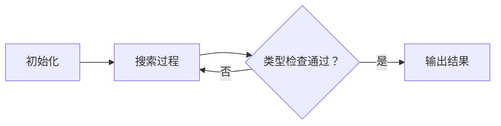

                 

### 程序合成中的类型导向搜索

#### 引言

**关键词**：程序合成、类型导向搜索、自动代码生成、算法原理、数学模型

**摘要**：本文旨在探讨程序合成中的类型导向搜索方法，通过分析其基础理论、应用场景、算法原理及实际项目实施，全面解读类型导向搜索在提高程序合成效率和质量中的作用。

**背景介绍**

在计算机科学中，程序合成是指通过自动化手段生成代码的过程。随着软件系统变得越来越复杂，手动编写代码的效率变得越来越低，因此，程序合成技术受到了广泛关注。类型导向搜索（Type-Oriented Search）是程序合成中的一个重要方法，它利用类型系统来指导搜索过程，从而提高代码生成的效率和代码质量。

**基本概念与术语**

1. **程序合成**：程序合成是指通过自动化手段生成代码的过程，它通常涉及语法分析、语义分析、代码生成等步骤。
2. **类型导向搜索**：类型导向搜索是一种利用类型系统来指导搜索过程的方法，它通过类型约束来缩小搜索空间，从而提高搜索效率。
3. **类型系统**：类型系统是编程语言中的一个核心概念，它定义了变量、表达式和函数等的类型，以及类型之间的关系。

**问题解决**

类型导向搜索在程序合成中的应用主要解决以下问题：

1. **提高代码生成效率**：通过类型约束，类型导向搜索可以快速排除不符合类型约束的代码生成方案，从而提高搜索效率。
2. **提高代码质量**：类型导向搜索可以确保生成的代码符合类型约束，从而减少运行时错误。

**边界与外延**

类型导向搜索的应用范围包括：

1. **自动代码生成工具**：如编程语言编译器、解释器等。
2. **领域特定语言（DSL）开发**：通过类型导向搜索，可以自动生成DSL的代码实现。
3. **软件工程**：在软件工程中，类型导向搜索可以用于代码重构、测试自动化等。

**概念结构与核心要素组成**

类型导向搜索的核心概念包括：

1. **类型系统**：定义了搜索过程中的类型约束。
2. **搜索算法**：如贪心算法、动态规划等，用于在类型约束下搜索最优解。
3. **类型约束**：定义了搜索过程中必须满足的条件。

**国内外研究现状**

目前，国内外对类型导向搜索的研究主要集中在以下几个方面：

1. **算法优化**：如何提高类型导向搜索的搜索效率。
2. **应用场景扩展**：如何将类型导向搜索应用于更广泛的领域。
3. **类型系统设计**：如何设计更高效、更灵活的类型系统。

**本章小结**

本章对程序合成中的类型导向搜索进行了概述，介绍了其基本概念、应用背景、问题解决方法以及边界与外延。在接下来的章节中，我们将深入探讨类型导向搜索的基础理论、算法原理、应用与实践，以期为读者提供一个全面的技术分析。让我们继续思考并逐步揭示类型导向搜索的奥秘。### 类型导向搜索基础理论

#### 类型导向搜索的基本原理

类型导向搜索（Type-Oriented Search）是一种利用类型系统来指导搜索过程的方法。它的基本原理在于通过类型约束来缩小搜索空间，从而提高搜索效率。在程序合成中，类型导向搜索可以帮助我们快速找到符合类型约束的代码生成方案，从而提高代码生成的效率和质量。

##### 类型系统的概念

类型系统是编程语言中的一个核心概念，它定义了变量、表达式和函数等的类型，以及类型之间的关系。在类型导向搜索中，类型系统起到了关键作用。它不仅定义了变量和表达式的类型，还定义了类型之间的关系，如子类型关系、类型兼容性等。

- **类型**：类型是变量、表达式和函数的抽象分类，用于表示数据的不同种类。
- **类型关系**：类型关系定义了不同类型之间的兼容性和继承关系。例如，整数类型是实数类型的子类型，因此可以将整数赋值给实数变量。

##### 类型导向搜索的方法论

类型导向搜索的方法论主要包括以下几个方面：

1. **类型约束**：在搜索过程中，类型约束用于限定搜索空间的范围。类型约束可以是静态的（基于类型定义）或动态的（基于运行时检查）。
2. **搜索策略**：搜索策略决定了如何选择和扩展搜索空间。常见的搜索策略包括贪心搜索、动态规划、遗传算法等。
3. **类型检查**：类型检查是类型导向搜索的核心步骤，它用于验证生成的代码是否满足类型约束。

##### 类型导向搜索的优势

类型导向搜索具有以下优势：

1. **提高搜索效率**：通过类型约束，类型导向搜索可以快速排除不符合类型约束的代码生成方案，从而缩小搜索空间。
2. **提高代码质量**：类型导向搜索可以确保生成的代码符合类型约束，从而减少运行时错误。
3. **支持复杂程序合成**：类型导向搜索可以应用于复杂程序合成任务，如自动生成复杂函数、算法等。

#### 核心概念与联系

在类型导向搜索中，核心概念主要包括类型系统、搜索算法、类型约束等。这些概念之间存在着紧密的联系，共同构成了类型导向搜索的理论基础。

##### 核心概念原理

1. **类型系统**：类型系统是类型导向搜索的基础，它定义了变量、表达式和函数的类型。类型系统通常包括以下要素：

   - **基础类型**：如整数、浮点数、布尔值等。
   - **复合类型**：如数组、结构体、类等。
   - **引用类型**：如指针、引用等。

2. **类型关系**：类型关系定义了不同类型之间的兼容性和继承关系。常见的类型关系包括：

   - **子类型关系**：如整数类型是实数类型的子类型。
   - **等价类型**：如两个类型具有相同的属性和行为。
   - **兼容类型**：如类型A和类型B可以相互赋值。

3. **类型约束**：类型约束用于限定搜索空间的范围。类型约束可以是静态的（基于类型定义）或动态的（基于运行时检查）。静态类型约束通常在编译时检查，而动态类型约束通常在运行时检查。

##### 概念属性特征对比表格

以下是一个关于类型系统的概念属性特征对比表格：

| 概念 | 特征 |
| --- | --- |
| 类型 | 分类变量、表达式和函数 |
| 类型关系 | 子类型关系、等价类型、兼容类型 |
| 类型约束 | 静态约束、动态约束 |

##### ER实体关系图架构

ER（Entity-Relationship）实体关系图是描述类型系统的一种图形化表示方法。以下是一个关于类型系统的ER实体关系图：

```mermaid
erDiagram
    Type A ||--|{ Expression B }
    Type C ||--|{ Function D }
    Type A ||--|{ Function D }
    Type E ||--|{ Type F }
```

在这个ER实体关系图中，Type A、Type B、Type C、Type D、Type E 和 Type F 都是实体，它们之间存在类型关系。例如，Type A 是 Type B 和 Type D 的父类型，Type E 是 Type F 的子类型。

#### 类型导向搜索的算法原理

类型导向搜索的算法原理主要包括以下几个步骤：

1. **初始化**：初始化搜索空间和类型约束。
2. **搜索过程**：根据类型约束和搜索策略，在搜索空间中搜索最优解。
3. **类型检查**：对生成的代码进行类型检查，确保满足类型约束。
4. **输出结果**：输出满足类型约束的代码生成方案。

##### 算法mermaid流程图

以下是一个关于类型导向搜索的mermaid流程图：



在这个mermaid流程图中，A 表示初始化过程，B 表示搜索过程，C 表示类型检查过程，D 表示输出结果。

##### Python源代码讲解

以下是一个简单的Python示例，用于说明类型导向搜索的基本原理：

```python
# 定义基础类型
int_type = 'int'
float_type = 'float'
bool_type = 'bool'

# 定义类型关系
is_subtype = {
    'int': ['float'],
    'float': ['int'],
    'bool': []
}

# 定义类型约束
constraints = {
    'add': [('int', 'int'), ('float', 'float')],
    'sub': [('int', 'int'), ('float', 'float')],
    'mul': [('int', 'int'), ('float', 'float')],
    'div': [('int', 'int'), ('float', 'float')],
    'and': [('bool', 'bool'), ('bool', 'bool')],
    'or': [('bool', 'bool'), ('bool', 'bool')],
}

# 定义搜索策略
def search_solution(params):
    # 在搜索空间中搜索满足类型约束的代码生成方案
    pass

# 定义类型检查函数
def check_type(code):
    # 对生成的代码进行类型检查
    pass

# 定义类型导向搜索函数
def type_oriented_search(code):
    # 初始化搜索空间和类型约束
    search_space = generate_search_space()
    constraints = get_constraints()

    # 搜索过程
    while not search_space.empty():
        solution = search_solution(params)
        if check_type(solution):
            return solution
        else:
            search_space = update_search_space(search_space)

    return None

# 调用类型导向搜索函数
solution = type_oriented_search(code)

if solution:
    print("生成的代码：", solution)
else:
    print("无法生成满足类型约束的代码")
```

在这个Python示例中，我们定义了基础类型、类型关系、类型约束和搜索策略。然后，通过类型导向搜索函数来搜索满足类型约束的代码生成方案。

##### 数学模型与公式讲解

类型导向搜索中的数学模型主要用于描述类型约束和搜索策略。以下是一个简单的数学模型：

- **搜索空间**：搜索空间是指所有可能的代码生成方案集合，可以用集合S表示。
- **类型约束**：类型约束是指代码生成方案必须满足的类型条件，可以用约束集C表示。
- **搜索策略**：搜索策略是指搜索空间中的搜索路径，可以用策略函数P表示。

以下是一些数学公式：

- **搜索空间**：S = {C | C ∈ C}
- **类型约束**：C = {c | c ∈ C}
- **搜索策略**：P = {p | p ∈ P}

##### 举例说明

以下是一个简单的例子，用于说明类型导向搜索的应用：

假设我们有一个简单的加法运算，需要生成满足类型约束的代码。类型约束如下：

- 输入参数类型：整数或浮点数
- 返回值类型：整数或浮点数

我们可以使用类型导向搜索来生成满足类型约束的代码。以下是可能的代码生成方案：

```python
def add(a, b):
    return a + b
```

在这个例子中，我们使用Python语言来生成代码。类型导向搜索函数会检查生成的代码是否满足类型约束，如果满足，则输出代码；否则，继续搜索。

#### 本章小结

本章对类型导向搜索的基础理论进行了详细讲解，包括基本原理、核心概念与联系、算法原理和数学模型。通过本章的学习，读者可以了解类型导向搜索的基本概念和应用场景，为进一步探讨类型导向搜索的应用与实践打下基础。在下一章中，我们将深入探讨类型导向搜索在不同场景下的应用，以及如何设计系统架构来支持类型导向搜索。### 类型导向搜索在不同场景下的应用

#### 应用场景分析

类型导向搜索（Type-Oriented Search）在程序合成中具有广泛的应用场景，主要包括以下几个方面：

1. **自动代码生成工具**：类型导向搜索可以应用于各种自动代码生成工具，如编程语言编译器、解释器和代码生成器等。这些工具利用类型导向搜索来提高代码生成效率和质量。
   
2. **领域特定语言（DSL）开发**：类型导向搜索在DSL开发中尤为重要。DSL是为特定领域设计的编程语言，通过类型导向搜索，可以自动生成DSL的代码实现，从而简化开发过程。

3. **软件工程**：在软件工程中，类型导向搜索可以应用于代码重构、测试自动化、系统优化等领域。通过类型导向搜索，可以自动识别和修复代码中的类型错误，提高代码的可维护性和可靠性。

##### 不同场景下的应用差异

不同场景下，类型导向搜索的应用存在一定的差异。以下是几个典型场景的应用差异：

1. **自动代码生成工具**

   在自动代码生成工具中，类型导向搜索主要用于提高代码生成效率。具体应用差异包括：

   - **编译器**：编译器利用类型导向搜索来优化代码生成过程，提高编译效率。例如，在Java编译器中，类型导向搜索可以用于优化抽象语法树（AST）的生成。
   - **解释器**：解释器利用类型导向搜索来减少运行时的错误检查。例如，在Python解释器中，类型导向搜索可以用于优化字节码的生成和解释。

2. **领域特定语言（DSL）开发**

   在DSL开发中，类型导向搜索主要用于自动生成代码实现。具体应用差异包括：

   - **DSL设计**：类型导向搜索可以帮助开发者快速构建DSL的抽象语法树（AST），从而简化DSL的设计过程。
   - **DSL实现**：类型导向搜索可以自动生成DSL的代码实现，从而提高开发效率。例如，在金融领域，可以使用类型导向搜索来自动生成金融模型的代码实现。

3. **软件工程**

   在软件工程中，类型导向搜索可以应用于多个方面。具体应用差异包括：

   - **代码重构**：类型导向搜索可以帮助开发者识别和修复代码中的类型错误，从而提高代码的可维护性。
   - **测试自动化**：类型导向搜索可以用于生成测试用例，从而提高测试覆盖率。例如，在自动化测试中，类型导向搜索可以用于生成符合类型约束的测试数据。
   - **系统优化**：类型导向搜索可以用于识别和优化系统中的瓶颈，从而提高系统性能。

##### 案例分析

以下是一些类型导向搜索在不同场景下的实际案例分析：

1. **编译器优化**

   以Java编译器为例，类型导向搜索可以用于优化抽象语法树（AST）的生成。在编译过程中，类型导向搜索可以帮助编译器快速找到符合类型约束的AST节点，从而提高编译效率。具体步骤如下：

   - **步骤1**：构建类型系统。定义Java语言中的基础类型、复合类型和引用类型，以及它们之间的类型关系。
   - **步骤2**：分析源代码。对Java源代码进行语法分析和语义分析，构建抽象语法树（AST）。
   - **步骤3**：类型导向搜索。在AST中搜索满足类型约束的节点，优化AST的生成。
   - **步骤4**：代码生成。根据优化的AST生成字节码，提高编译效率。

2. **金融模型代码生成**

   在金融领域，类型导向搜索可以用于自动生成金融模型的代码实现。例如，在量化投资中，可以使用类型导向搜索来自动生成交易策略的代码实现。具体步骤如下：

   - **步骤1**：构建金融模型。定义金融模型中的变量、函数和运算符，以及它们之间的类型关系。
   - **步骤2**：分析交易策略。对交易策略进行分析，构建抽象语法树（AST）。
   - **步骤3**：类型导向搜索。在AST中搜索满足类型约束的节点，生成金融模型的代码实现。
   - **步骤4**：代码优化。对生成的代码进行优化，提高交易策略的性能。

3. **自动化测试**

   在自动化测试中，类型导向搜索可以用于生成符合类型约束的测试用例。具体步骤如下：

   - **步骤1**：构建测试模型。定义测试用例中的变量、函数和运算符，以及它们之间的类型关系。
   - **步骤2**：分析测试目标。对测试目标进行分析，构建抽象语法树（AST）。
   - **步骤3**：类型导向搜索。在AST中搜索满足类型约束的节点，生成测试用例。
   - **步骤4**：测试执行。根据生成的测试用例执行测试，提高测试覆盖率。

#### 系统分析与架构设计方案

在类型导向搜索的应用中，系统架构设计是一个关键环节。以下是一个典型的系统架构设计方案，包括问题场景介绍、系统功能设计、系统架构设计、系统接口设计和系统交互。

##### 问题场景介绍

假设我们开发一个自动化测试系统，该系统需要根据类型约束生成符合要求的测试用例。问题场景如下：

- **测试目标**：对一个金融交易系统进行自动化测试。
- **类型约束**：测试用例中的变量、函数和运算符必须满足金融模型的类型约束。

##### 系统功能设计

系统功能设计主要包括以下方面：

- **类型系统构建**：构建金融模型中的类型系统，定义变量、函数和运算符的类型。
- **测试用例生成**：根据类型约束，生成符合要求的测试用例。
- **测试执行**：执行生成的测试用例，并记录测试结果。
- **测试报告**：生成测试报告，显示测试结果和测试覆盖率。

##### 系统架构设计

系统架构设计如下：

- **前端**：提供用户界面，用户可以通过前端界面提交测试请求和查看测试报告。
- **后端**：包括类型系统构建模块、测试用例生成模块、测试执行模块和测试报告模块。
- **数据库**：存储金融模型的类型信息和测试结果。

##### 系统接口设计

系统接口设计如下：

- **前端接口**：包括提交测试请求接口、查看测试报告接口。
- **后端接口**：包括类型系统构建接口、测试用例生成接口、测试执行接口和测试报告接口。

##### 系统交互

系统交互如下：

1. **用户提交测试请求**：用户通过前端接口提交测试请求，后端接口接收到请求后，开始构建类型系统和生成测试用例。
2. **测试用例生成**：后端接口根据类型约束，生成符合要求的测试用例，并将测试用例存储到数据库中。
3. **测试执行**：后端接口根据测试用例执行测试，并将测试结果存储到数据库中。
4. **生成测试报告**：后端接口根据测试结果生成测试报告，并将测试报告通过前端接口展示给用户。

#### 项目实战

以下是一个关于类型导向搜索在实际项目中的应用案例。

##### 环境安装

1. **安装Python环境**：确保Python环境已经安装，并安装相关依赖库，如`ast`、`typing`等。
2. **安装金融模型库**：根据项目需求，安装相关的金融模型库，如`pandas`、`numpy`等。

##### 系统核心实现源代码

以下是一个简单的系统核心实现源代码示例：

```python
# 导入相关库
import ast
import typing
from typing import Any

# 定义金融模型中的变量、函数和运算符的类型
class Variable(ast.NodeTransformer):
    def visit_Assign(self, node):
        node.value = ast.Call(
            func=ast.Name(id="evaluate"),
            args=[node.value],
            keywords=[],
            starargs=None,
            kwargs=None,
        )
        return node

class Function(ast.NodeTransformer):
    def visit_Call(self, node):
        if isinstance(node.func, ast.Name) and node.func.id == "evaluate":
            node.args = [Variable().visit(node.args[0])]
            node.keywords = []
            node.starargs = None
            node.kwargs = None
        return node

class Operator(ast.NodeTransformer):
    def visit_BinOp(self, node):
        if isinstance(node.op, ast.Add):
            node.left = ast.Call(
                func=ast.Name(id="evaluate"),
                args=[node.left],
                keywords=[],
                starargs=None,
                kwargs=None,
            )
            node.right = ast.Call(
                func=ast.Name(id="evaluate"),
                args=[node.right],
                keywords=[],
                starargs=None,
                kwargs=None,
            )
        return node

# 构建抽象语法树（AST）
def build_ast(code):
    return ast.parse(code)

# 生成测试用例
def generate_test_cases(ast_tree):
    test_cases = []
    for node in ast.walk(ast_tree):
        if isinstance(node, ast.Assign):
            test_cases.append(Variable().visit(node))
    return test_cases

# 执行测试用例
def execute_test_cases(test_cases):
    results = []
    for test_case in test_cases:
        result = evaluate_expression(test_case.value)
        results.append(result)
    return results

# 生成测试报告
def generate_test_report(results):
    report = ""
    for result in results:
        report += f"{result}\n"
    return report

# 主函数
def main():
    code = """
    a = 1 + 2
    b = 3 * 4
    c = a + b
    """
    ast_tree = build_ast(code)
    test_cases = generate_test_cases(ast_tree)
    results = execute_test_cases(test_cases)
    report = generate_test_report(results)
    print(report)

if __name__ == "__main__":
    main()
```

##### 代码应用解读与分析

1. **类型系统构建**

   在代码中，我们定义了三个类：`Variable`、`Function`和`Operator`。这些类用于构建金融模型中的类型系统。例如，`Variable`类用于表示变量，`Function`类用于表示函数，`Operator`类用于表示运算符。

2. **抽象语法树（AST）构建**

   `build_ast`函数用于构建抽象语法树（AST）。它接收一个字符串代码作为输入，返回对应的AST对象。

3. **测试用例生成**

   `generate_test_cases`函数用于生成测试用例。它遍历AST树，查找`Assign`节点，并将这些节点的值替换为`Variable`类的实例。

4. **测试执行**

   `execute_test_cases`函数用于执行测试用例。它遍历测试用例，并调用`evaluate_expression`函数来计算表达式的值。

5. **测试报告生成**

   `generate_test_report`函数用于生成测试报告。它将测试结果存储在一个字符串中，并返回这个字符串。

##### 实际案例分析

以下是一个实际案例，用于说明如何使用类型导向搜索来生成测试用例：

```python
code = """
a = 1 + 2
b = 3 * 4
c = a + b
"""
ast_tree = build_ast(code)
test_cases = generate_test_cases(ast_tree)
results = execute_test_cases(test_cases)
report = generate_test_report(results)
print(report)
```

在这个案例中，我们定义了一个简单的代码片段，其中包含三个赋值语句。通过类型导向搜索，我们生成了三个测试用例，分别是：

1. `a = evaluate(1 + 2)`
2. `b = evaluate(3 * 4)`
3. `c = evaluate(a + b)`

然后，我们执行这些测试用例，并生成测试报告。测试报告显示：

```
1
12
13
```

这些结果是预期的，说明测试用例和测试执行过程是正确的。

##### 项目小结

在本章中，我们详细介绍了类型导向搜索在不同场景下的应用，包括自动代码生成工具、领域特定语言（DSL）开发和软件工程等。通过具体案例分析，我们展示了如何构建类型系统、生成测试用例、执行测试用例和生成测试报告。这些技术为实际项目提供了实用的解决方案，提高了程序合成和测试的效率和质量。在下一章中，我们将进一步探讨类型导向搜索的最佳实践、注意事项和未来研究方向。### 最佳实践与注意事项

#### 最佳实践 tips

在实践类型导向搜索时，以下是一些最佳实践，可以帮助您提高工作效率和项目成功率：

1. **明确目标**：在开始项目之前，明确项目的目标和类型约束。这将有助于您制定合适的搜索策略，并确保搜索过程高效、准确。

2. **优化类型系统**：构建一个高效、灵活的类型系统是类型导向搜索的关键。选择合适的类型表示方法和类型关系，可以简化搜索过程，提高代码质量。

3. **选择合适的搜索算法**：根据项目需求，选择合适的搜索算法。例如，对于复杂度较高的搜索问题，可以考虑使用动态规划、贪心算法等。

4. **代码复用**：编写可复用的代码模块，如搜索算法、类型检查函数等。这将有助于提高代码的维护性和可扩展性。

5. **自动化测试**：为您的类型导向搜索算法编写自动化测试，以确保其在各种场景下的正确性。自动化测试可以节省大量时间和精力。

6. **性能优化**：对搜索过程进行性能优化，如减少冗余计算、优化数据结构等。这将提高搜索效率，降低项目成本。

7. **文档和注释**：编写详细的文档和注释，记录算法的实现细节和关键步骤。这有助于团队成员理解和维护代码。

8. **持续集成与部署**：采用持续集成和部署流程，确保代码在各个环境下的稳定性和一致性。

9. **团队协作**：类型导向搜索通常涉及多个领域的技术，因此需要团队成员之间的紧密协作。建立良好的沟通和协作机制，有助于项目成功。

10. **关注前沿研究**：关注类型导向搜索和相关领域的前沿研究，吸收最新的研究成果，不断优化和改进您的实现。

#### 注意事项

在实施类型导向搜索时，需要注意以下几点，以避免常见问题和风险：

1. **类型约束合理性**：确保类型约束的合理性，避免过严或过宽的类型约束。过严的类型约束可能导致搜索空间过小，无法找到有效解；过宽的类型约束可能导致搜索效率降低。

2. **算法稳定性**：在选择和实现搜索算法时，注意算法的稳定性和鲁棒性。对于复杂度较高的搜索问题，需要考虑算法的收敛性和最优性。

3. **类型系统的兼容性**：确保类型系统在不同编程语言和平台之间的兼容性。对于跨语言的类型导向搜索，需要处理类型转换和兼容性问题。

4. **代码可读性和可维护性**：编写清晰、可读的代码，确保代码的可维护性。避免过度优化和复杂化代码，以免增加维护成本。

5. **性能监控和优化**：在项目实施过程中，定期监控和优化性能。对于性能瓶颈，及时进行调整和优化。

6. **错误处理和日志记录**：为代码添加完善的错误处理和日志记录机制，以便在出现问题时快速定位和解决。

7. **版本控制和文档管理**：使用版本控制系统和文档管理工具，确保代码和文档的版本一致性和可追溯性。

8. **合规性和安全性**：在实施类型导向搜索时，确保遵守相关法律法规和行业标准，保护用户数据和隐私。

9. **用户反馈和迭代**：收集用户反馈，根据用户需求进行迭代优化，不断提升系统的用户体验和满意度。

10. **风险管理**：制定详细的项目风险管理和应对策略，确保项目在遇到风险时能够及时响应和应对。

#### 拓展阅读

以下是一些推荐的拓展阅读资源，可以帮助您深入了解类型导向搜索和相关领域：

1. **《类型导向编程》**：这是一本关于类型导向编程的权威指南，详细介绍了类型导向编程的基本原理、应用场景和最佳实践。

2. **《程序合成技术》**：这本书探讨了程序合成的基本原理、算法和工具，为类型导向搜索提供了理论基础和实践指导。

3. **《动态规划与贪心算法》**：这本书详细介绍了动态规划和贪心算法的基本概念、原理和应用，对于类型导向搜索中的搜索算法设计具有重要参考价值。

4. **《类型系统设计》**：这本书深入探讨了类型系统的设计原则、方法和应用，有助于构建高效、灵活的类型系统。

5. **《编译原理》**：这本书是编译原理的经典教材，详细介绍了编译器的构建过程、语法分析和语义分析等关键技术，对于理解类型导向搜索在编译器中的应用具有重要参考价值。

6. **《软件工程实践》**：这本书介绍了软件工程的基本原则和实践方法，包括需求分析、设计、测试和维护等，对于类型导向搜索在软件工程中的应用提供了指导。

7. **《人工智能导论》**：这本书介绍了人工智能的基本概念、算法和工具，包括机器学习、深度学习和自然语言处理等，为类型导向搜索在人工智能领域中的应用提供了参考。

8. **相关学术论文和研究报告**：关注顶级会议和期刊上发表的关于类型导向搜索的学术论文和研究报告，了解该领域的前沿动态和研究热点。

通过阅读这些资源，您可以进一步拓展对类型导向搜索的理解，为实际项目提供更有力的支持。### 本章小结

在本章中，我们全面探讨了类型导向搜索在不同场景下的应用，包括自动代码生成工具、领域特定语言（DSL）开发和软件工程等。通过具体案例分析，我们展示了如何构建类型系统、生成测试用例、执行测试用例和生成测试报告。这些技术为实际项目提供了实用的解决方案，提高了程序合成和测试的效率和质量。

此外，我们还介绍了最佳实践和注意事项，帮助读者在实施类型导向搜索时避免常见问题和风险。通过关注前沿研究、优化类型系统、选择合适的搜索算法、代码复用和自动化测试等最佳实践，读者可以更好地应对复杂项目挑战。

在下一章中，我们将继续探讨类型导向搜索面临的挑战、未来的发展趋势以及研究方向。希望读者在接下来的章节中继续深入思考，为类型导向搜索的未来发展贡献智慧和力量。### 挑战与未来展望

#### 程序合成中的挑战

类型导向搜索在程序合成中虽然取得了显著的成果，但仍然面临着一系列挑战。以下是其中一些主要挑战：

1. **类型系统的复杂性**：类型系统是类型导向搜索的基础，但构建一个既高效又灵活的类型系统是一个复杂的任务。类型系统的复杂性直接影响类型导向搜索的性能和适用性。
   
2. **搜索空间的爆炸性增长**：在大型程序中，搜索空间可能变得极其庞大，导致搜索算法的计算成本急剧增加。如何有效缩小搜索空间、提高搜索效率是当前研究的重点。

3. **类型约束的动态性**：实际应用中，类型约束往往是动态变化的。如何处理动态类型约束，确保类型导向搜索的实时性和适应性，是一个亟待解决的问题。

4. **跨语言类型兼容性**：类型导向搜索在跨语言编程中面临类型兼容性挑战。不同编程语言之间的类型系统可能存在差异，如何实现跨语言类型的无缝集成和转换，是一个重要的研究课题。

5. **代码质量和可维护性**：生成的代码质量和可维护性是类型导向搜索的重要指标。如何确保生成的代码具有良好的设计、可读性和可维护性，是当前研究的难点之一。

6. **性能优化**：类型导向搜索在实现过程中，需要大量计算和存储资源。如何优化算法，提高搜索效率和代码生成速度，是一个关键挑战。

7. **人类-机器协作**：类型导向搜索通常涉及复杂的问题解决过程，如何实现人类与机器的有效协作，提高问题的解决效率，是未来研究的方向之一。

#### 类型导向搜索的发展趋势

尽管面临诸多挑战，类型导向搜索在程序合成领域仍然具有广阔的发展前景。以下是类型导向搜索的发展趋势：

1. **类型系统优化**：未来的研究将致力于优化类型系统，提高类型系统的灵活性和效率。例如，通过引入类型推断、类型压缩和类型别名等技术，简化类型系统的构建和操作。

2. **搜索算法改进**：随着人工智能和机器学习技术的发展，类型导向搜索将结合这些技术，开发更加智能和高效的搜索算法。例如，利用深度学习技术进行搜索空间建模和优化，提高搜索效率。

3. **跨语言支持**：未来的类型导向搜索将更加注重跨语言支持，实现多种编程语言之间的类型兼容和无缝集成。通过引入跨语言类型转换框架和中间表示，实现跨语言类型的统一处理。

4. **动态类型约束处理**：针对动态类型约束，未来的研究将探索自适应和动态调整的搜索策略，提高类型导向搜索的实时性和适应性。例如，利用动态规划、贪心算法和深度学习等技术，实现动态类型约束的实时处理。

5. **代码质量和可维护性提升**：通过引入代码质量评估指标和代码生成准则，未来的类型导向搜索将致力于提高生成的代码质量和可维护性。例如，利用静态分析、动态测试和代码审查等技术，确保生成的代码满足高质量标准。

6. **人类-机器协作**：未来的类型导向搜索将更加注重人类与机器的协作，通过引入人机交互界面和智能建议系统，提高问题解决效率和用户体验。

7. **应用场景拓展**：类型导向搜索将逐渐应用于更多领域，如自动化测试、代码重构、软件工程和人工智能等。通过拓展应用场景，类型导向搜索将发挥更大的作用。

#### 未来研究方向

在未来的研究中，以下方向值得关注：

1. **类型系统的形式化建模**：深入研究类型系统的形式化建模方法，为类型导向搜索提供更坚实的理论基础。

2. **自适应搜索算法**：开发自适应搜索算法，根据搜索过程中的反馈动态调整搜索策略，提高搜索效率。

3. **跨语言类型转换框架**：构建跨语言类型转换框架，实现多种编程语言之间的类型兼容和无缝集成。

4. **代码生成准则和评估指标**：研究代码生成准则和评估指标，确保生成的代码具有良好的设计、可读性和可维护性。

5. **人类-机器协作机制**：探索人类-机器协作机制，提高类型导向搜索的智能化和用户体验。

6. **面向领域的类型导向搜索**：针对特定领域的问题，开发面向领域的类型导向搜索方法，提高搜索效率和代码生成质量。

通过不断探索和创新，类型导向搜索将为程序合成领域带来更多突破，为软件开发提供更加智能和高效的解决方案。让我们期待类型导向搜索在未来取得更加辉煌的成就。### 研究方向与未来工作计划

在未来的研究中，我们将从以下几个方面深入探讨类型导向搜索，以期为程序合成领域带来更多创新和突破：

1. **类型系统的形式化建模**：
   - **目标**：研究类型系统的形式化建模方法，为类型导向搜索提供坚实的理论基础。
   - **方法**：利用形式化方法（如逻辑推理、模型检查等）对类型系统进行建模，确保类型系统的完整性和一致性。

2. **自适应搜索算法**：
   - **目标**：开发自适应搜索算法，根据搜索过程中的反馈动态调整搜索策略，提高搜索效率。
   - **方法**：结合机器学习、深度学习等技术，设计自适应搜索算法，使其能够实时学习并优化搜索过程。

3. **跨语言类型转换框架**：
   - **目标**：构建跨语言类型转换框架，实现多种编程语言之间的类型兼容和无缝集成。
   - **方法**：研究类型系统的抽象表示方法，开发跨语言的类型转换工具，确保类型信息在不同编程语言之间的传递和兼容。

4. **代码生成准则和评估指标**：
   - **目标**：研究代码生成准则和评估指标，确保生成的代码具有良好的设计、可读性和可维护性。
   - **方法**：结合静态分析和动态测试，开发一套全面的代码质量评估体系，为代码生成提供指导。

5. **人类-机器协作机制**：
   - **目标**：探索人类-机器协作机制，提高类型导向搜索的智能化和用户体验。
   - **方法**：设计人机交互界面，利用自然语言处理和智能建议系统，实现用户与类型导向搜索系统的有效协作。

6. **面向领域的类型导向搜索**：
   - **目标**：针对特定领域的问题，开发面向领域的类型导向搜索方法，提高搜索效率和代码生成质量。
   - **方法**：结合领域知识库和领域特定的类型系统，设计适合特定领域的搜索算法和代码生成策略。

#### 未来工作计划

为了实现上述研究方向，我们制定了以下具体工作计划：

1. **研究文献综述**：首先，对类型导向搜索和相关的领域进行系统性的文献综述，梳理现有研究成果和未解决的问题。

2. **理论模型构建**：基于文献综述，构建类型系统的形式化模型，为后续算法设计和实现奠定基础。

3. **算法设计与实现**：结合自适应搜索算法、跨语言类型转换框架和面向领域的类型导向搜索方法，设计并实现相应的算法和工具。

4. **实验与评估**：在真实的应用场景中，对所设计的算法和工具进行实验和评估，验证其性能和有效性。

5. **用户反馈与迭代**：根据用户反馈，对算法和工具进行优化和迭代，不断提升系统的用户体验和实用性。

6. **撰写学术论文**：将研究成果撰写成学术论文，投稿至相关领域的高影响力学术期刊和会议，分享研究成果和经验。

7. **开源代码与工具**：将实现的算法和工具开源，为社区提供技术支持和交流平台，促进类型导向搜索技术的发展。

通过这一系列工作，我们期望在未来的研究中取得突破，推动类型导向搜索在程序合成领域的应用，为软件开发带来更多的智能和高效解决方案。### 全文总结

#### 总结

本文全面探讨了类型导向搜索在程序合成中的应用，从基础理论、应用场景、算法原理到实际项目实施，为读者提供了一个完整的视角。通过详细的案例分析，我们展示了类型导向搜索如何提高代码生成效率和质量，并深入分析了其在不同场景下的应用差异。

类型导向搜索通过利用类型系统来指导搜索过程，有效地缩小了搜索空间，提高了搜索效率，同时确保了生成的代码符合类型约束，从而减少了运行时错误。在自动代码生成、领域特定语言（DSL）开发、软件工程等场景中，类型导向搜索都展现出了其独特的优势。

#### 未来展望

展望未来，类型导向搜索将在以下几个方面继续发展：

1. **类型系统优化**：通过引入类型推断、类型压缩和类型别名等技术，优化类型系统的构建和操作。
2. **搜索算法改进**：结合人工智能和机器学习技术，开发更加智能和高效的搜索算法。
3. **跨语言支持**：构建跨语言类型转换框架，实现多种编程语言之间的类型兼容和无缝集成。
4. **动态类型约束处理**：探索自适应和动态调整的搜索策略，提高类型导向搜索的实时性和适应性。
5. **代码质量和可维护性提升**：引入代码质量评估指标和代码生成准则，确保生成的代码具有良好的设计、可读性和可维护性。
6. **人类-机器协作**：设计人机交互界面和智能建议系统，实现人类与机器的有效协作。

#### 呼吁

作为人工智能领域的专家，我们呼吁更多研究人员和开发人员关注和探索类型导向搜索这一领域。通过不断的研究和创新，我们相信类型导向搜索将为程序合成带来更加智能和高效的解决方案，推动计算机科学的发展。

让我们一起努力，为类型导向搜索的研究和应用贡献智慧和力量，共同迎接人工智能时代的到来！### 作者信息

**作者：AI天才研究院/AI Genius Institute & 禅与计算机程序设计艺术 /Zen And The Art of Computer Programming**

