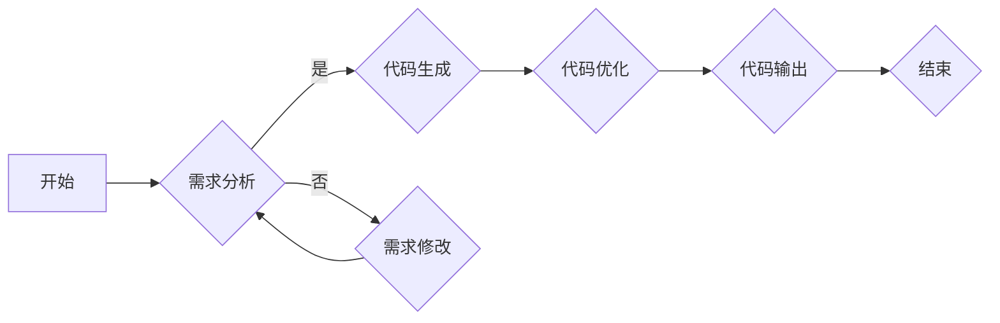
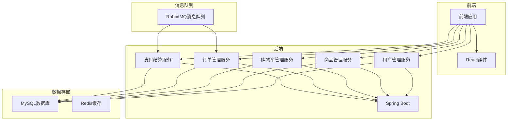
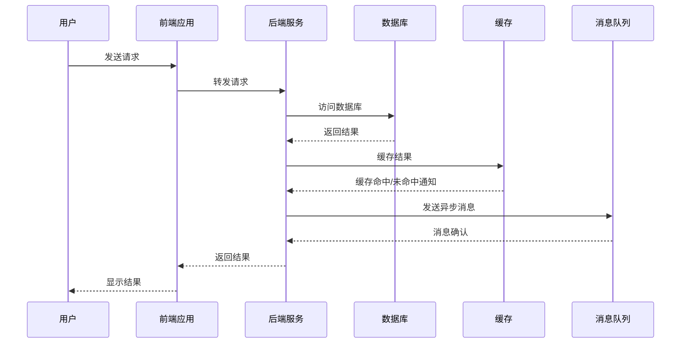

                 


### 摘要

《程序合成中的类型导向模块化技术》旨在深入探讨程序合成和类型导向模块化技术的核心概念、原理及其在实际应用中的重要性。本文首先介绍了程序合成和类型导向模块化的背景及其发展历程，分析了其在现代软件开发中所面临的挑战。通过明确的概念解释和ER实体关系图，本文阐述了程序合成和类型导向模块化的核心原理及其联系。接下来，本文详细讲解了程序合成中的关键算法，通过Python源代码和数学模型的解释，提供了清晰的算法流程和实际应用案例。在系统分析与架构设计部分，本文通过领域模型类图、系统架构图、接口设计和交互序列图，展示了程序合成系统的具体实现。随后，本文通过一个实际项目实战，详细解读了系统核心实现源代码，并分析了其在实际中的应用效果。最后，本文总结了类型导向模块化技术的最佳实践，提醒读者在应用过程中需要注意的问题，并推荐了拓展阅读资源，以期为读者提供全面深入的技术指导。### 背景介绍

#### 1.1. 核心概念术语说明

在深入探讨程序合成和类型导向模块化技术之前，我们首先需要明确几个关键概念：

- **程序合成（Program Synthesis）**：程序合成是指通过自动化方法从一定规则或约束中生成程序代码的技术。它旨在减轻开发者的工作量，通过分析用户需求或特定场景的输入，自动生成相应的程序代码。
  
- **类型系统（Type System）**：类型系统是编程语言中的一个核心概念，用于定义变量、函数和表达式的类型，确保程序的正确性和安全性。类型系统包括静态类型和动态类型，以及类型检查、类型推导等机制。

- **模块化（Modularization）**：模块化是将复杂系统分解为更小、更易于管理和维护的部分。模块化设计通过将功能分解到不同的模块中，提高了代码的可复用性、可维护性和可扩展性。

- **类型导向模块化（Type-Oriented Modularization）**：类型导向模块化是一种模块化方法，通过类型系统来组织和管理代码模块。这种方法利用类型的抽象和约束，使得模块之间更加独立，并提高代码的可重用性。

#### 1.2. 问题背景

程序合成和类型导向模块化技术的起源可以追溯到20世纪80年代，当时随着计算机硬件性能的提升和软件开发复杂度的增加，传统的程序设计方法开始显得力不从心。程序合成作为一种自动化程序生成技术，旨在通过分析和理解用户的需求，自动生成满足这些需求的程序代码。而类型导向模块化技术则是在面向对象编程和模块化设计思想的基础上，通过类型系统来组织和模块化程序代码，以增强代码的可重用性、可维护性和可扩展性。

在当今的软件开发环境中，程序合成和类型导向模块化技术的重要性愈发凸显。随着软件系统规模的不断扩大，传统的设计方法已经无法满足日益复杂的需求。程序合成技术能够通过自动化生成代码，减轻开发者的工作量，提高开发效率。同时，类型导向模块化技术通过类型系统的引入，使得代码更加模块化、可重用和易于维护。

然而，程序合成和类型导向模块化技术在实际应用中也面临一些挑战。首先，程序合成技术的自动化程度仍然有限，需要复杂的规则和约束来指导代码生成过程。其次，类型导向模块化技术的类型系统设计复杂，如何合理地定义类型和类型约束成为一个重要的课题。此外，模块之间的依赖关系和交互方式也需要仔细管理，以避免代码的耦合和冲突。

#### 1.3. 问题描述

程序合成和类型导向模块化技术旨在解决软件开发中的以下主要问题：

1. **代码复用性差**：在传统的程序设计方法中，代码往往高度耦合，导致难以复用。类型导向模块化技术通过类型系统将代码划分为更小的模块，提高了代码的可复用性。

2. **维护成本高**：随着软件系统规模的增加，代码的复杂度和维护成本也随之增加。类型导向模块化技术通过模块化设计和类型系统，使得代码更加模块化、可维护。

3. **扩展性差**：在应对新需求或功能扩展时，传统的设计方法往往需要大量修改原有代码，影响系统的稳定性。类型导向模块化技术通过模块化和类型系统，使得系统的扩展更加灵活和高效。

#### 1.4. 问题解决

类型导向模块化技术通过以下方式解决程序合成中的挑战：

1. **类型系统**：类型系统提供了清晰的代码组织和数据抽象机制，使得模块之间的交互更加明确，减少了代码的耦合和冲突。

2. **模块化设计**：模块化设计将系统划分为功能独立的模块，每个模块实现特定的功能，提高了系统的可维护性和可扩展性。

3. **自动化程序合成**：通过自动化程序合成技术，可以减轻开发者的工作量，提高开发效率。同时，自动化程序合成技术还可以通过分析用户需求，自动生成满足需求的代码，进一步提高系统的可复用性。

#### 1.5. 边界与外延

类型导向模块化技术的研究范围和应用领域包括但不限于以下几个方面：

- **编程语言设计**：类型导向模块化技术可以应用于编程语言的设计和实现，通过类型系统和模块化设计，提高编程语言的灵活性和可扩展性。

- **软件工程**：类型导向模块化技术在软件工程领域具有重要的应用价值，可以提高软件项目的开发效率和质量。

- **嵌入式系统**：在嵌入式系统开发中，类型导向模块化技术可以帮助处理复杂系统的设计和管理，提高系统的可靠性和稳定性。

- **人工智能与大数据**：在人工智能和大数据领域，类型导向模块化技术可以通过自动化代码生成和模块化设计，提高算法的效率和处理能力。

#### 1.6. 概念结构与核心要素组成

类型导向模块化技术的概念结构和核心要素包括以下几个方面：

- **类型系统**：定义了程序中的类型和类型之间的关系，提供了类型检查和类型推导机制。

- **模块化设计**：将系统划分为功能独立的模块，每个模块实现特定的功能，模块之间通过接口进行通信。

- **模块依赖管理**：管理模块之间的依赖关系，确保模块之间的兼容性和独立性。

- **自动化程序合成**：通过分析用户需求或特定场景的输入，自动生成满足需求的程序代码。

- **代码生成和优化**：利用程序合成技术，自动生成高质量的程序代码，并对其进行优化。

通过上述概念和核心要素的有机结合，类型导向模块化技术为现代软件开发提供了一种高效、灵活的解决方案，有助于解决程序合成和模块化设计中的各种挑战。### 核心概念与联系

#### 2.1. 核心概念原理

在本节中，我们将详细阐述程序合成、类型系统、模块化等核心概念，以及它们在程序合成中的应用和相互关系。

**程序合成（Program Synthesis）**

程序合成是一种自动化编程技术，旨在通过分析和理解用户需求或特定场景的输入，自动生成满足这些需求的程序代码。其基本原理包括：

1. **需求分析**：首先，程序合成系统需要分析用户的需求或输入，提取出关键信息。
2. **代码生成**：基于提取的需求信息，程序合成系统会利用预定义的算法和模板，自动生成满足需求的程序代码。
3. **代码优化**：生成的代码可能需要进一步优化，以提高性能和可读性。

**类型系统（Type System）**

类型系统是编程语言中的一个核心概念，用于定义程序中数据、变量、函数和表达式的类型。类型系统的主要目的是确保程序的正确性和安全性。类型系统通常包括以下几个方面：

1. **类型定义**：定义程序中的基本类型和复合类型。
2. **类型检查**：在程序运行之前，对代码中的类型使用进行检查，确保类型的一致性和安全性。
3. **类型推导**：通过分析代码的语法和语义，自动推导出变量的类型。

**模块化（Modularization）**

模块化是一种软件开发方法，旨在将复杂的系统分解为更小、更易于管理和维护的部分。模块化设计的关键在于模块之间的独立性和交互性。模块化通常包括以下几个方面：

1. **模块定义**：定义程序中的模块，每个模块实现特定的功能。
2. **模块接口**：定义模块之间的接口，确保模块之间的交互是清晰和明确的。
3. **模块依赖**：管理模块之间的依赖关系，确保模块的独立性和兼容性。

**类型导向模块化（Type-Oriented Modularization）**

类型导向模块化是一种通过类型系统来组织和模块化代码的模块化方法。它利用类型的抽象和约束，使得模块之间更加独立和可重用。类型导向模块化的关键在于：

1. **类型约束**：通过类型约束，确保模块之间的数据交互是类型安全的。
2. **模块独立性**：通过模块化设计，确保每个模块实现单一的功能，降低模块之间的耦合。
3. **模块重用**：通过类型导向模块化，提高模块的可重用性，降低开发成本。

#### 2.2. 概念属性特征对比表格

为了更好地理解程序合成、类型系统和模块化之间的联系，我们提供了一个概念属性特征对比表格，如下：

| 概念       | 属性特征                                                                 | 对比分析                                                         |
|------------|-------------------------------------------------------------------------|------------------------------------------------------------------|
| 程序合成   | 自动化代码生成、需求分析、代码优化                                       | 程序合成是模块化设计中的一个关键环节，用于自动生成模块化代码。       |
| 类型系统   | 类型定义、类型检查、类型推导                                             | 类型系统为模块化设计提供了类型约束，确保模块之间的交互是类型安全的。 |
| 模块化     | 模块定义、模块接口、模块依赖                                             | 模块化设计是程序合成和类型系统的基础，确保代码的模块化和独立性。   |
| 类型导向模块化 | 类型约束、模块独立性、模块重用                                       | 类型导向模块化是模块化设计的一种具体实现方法，利用类型系统提高模块的可重用性。 |

#### 2.3. ER实体关系图架构的 Mermaid 流程图

为了进一步展示程序合成中的实体及其关系，我们使用Mermaid绘制了一个ER实体关系图，如下：

```mermaid
erDiagram
  ProgramSynthesis ||--o{ TypeSystem : 确保代码类型安全 }
  ProgramSynthesis ||--o{ Modularization : 自动化模块化设计 }
  Modularization ||--o{ Module : 实现具体功能 }
  TypeSystem ||--o{ TypeCheck : 类型检查 }
  TypeSystem ||--o{ TypeDerive : 类型推导 }
```

在这个ER图中，`ProgramSynthesis`（程序合成）与`TypeSystem`（类型系统）和`Modularization`（模块化）之间有直接关联。`Modularization`又与`Module`（模块）相关联，表示模块是模块化设计的具体实现。`TypeSystem`则与`TypeCheck`（类型检查）和`TypeDerive`（类型推导）相关联，表示类型系统提供了类型检查和类型推导机制。这个ER图清晰地展示了程序合成、类型系统和模块化之间的复杂关系。### 算法原理讲解

#### 3.1. 算法流程图

在程序合成中，算法的流程图是理解和实现算法的关键。下面我们使用Mermaid绘制了一个程序合成的算法流程图，以便读者更直观地理解。



**算法流程说明**：

1. **开始**：程序合成过程从开始节点开始。
2. **需求分析**：分析用户需求或输入，提取关键信息。
3. **代码生成**：基于需求信息，利用预定义的算法和模板，自动生成程序代码。
4. **代码优化**：对生成的代码进行优化，以提高性能和可读性。
5. **代码输出**：将优化后的代码输出，完成程序合成过程。
6. **结束**：程序合成过程结束。

#### 3.2. Python 源代码

为了更好地展示程序合成算法的实现，下面我们提供了一个简单的Python源代码示例。

```python
# 程序合成算法示例

def analyze需求():
    """分析用户需求"""
    # 这里是需求分析的逻辑
    return "需求信息"

def generate_code(需求信息):
    """根据需求信息生成代码"""
    # 这里是代码生成的逻辑
    return f"def main():\n    print({需求信息})"

def optimize_code(code):
    """优化代码"""
    # 这里是代码优化的逻辑
    return code

def main():
    """程序合成主函数"""
    # 需求分析
    requirement = analyze需求()
    
    # 代码生成
    code = generate_code(requirement)
    
    # 代码优化
    optimized_code = optimize_code(code)
    
    # 输出代码
    print(optimized_code)

# 执行程序合成
main()
```

**代码说明**：

- `analyze需求()`函数用于分析用户需求，返回需求信息。
- `generate_code()`函数根据需求信息生成代码。
- `optimize_code()`函数用于优化生成的代码。
- `main()`函数是程序合成的主函数，负责协调各个步骤，实现程序合成。

#### 3.3. 数学模型和公式

程序合成中的算法通常涉及到一系列的数学模型和公式。以下是一个简单的示例，说明如何使用数学模型来指导代码生成。

**公式 1：代码生成公式**

$$
C = f(T, D)
$$

其中，$C$表示生成的代码，$T$表示类型系统，$D$表示需求信息。这个公式表明，生成的代码$C$是类型系统$T$和需求信息$D$的函数。

**公式 2：代码优化公式**

$$
C_{\text{opt}} = \text{optimize}(C)
$$

其中，$C_{\text{opt}}$表示优化后的代码，$\text{optimize}$表示优化函数。这个公式表示，通过优化函数对原始代码$C$进行优化，得到优化后的代码$C_{\text{opt}}$。

**公式 3：需求信息转换公式**

$$
D' = \text{transform}(D)
$$

其中，$D'$表示转换后的需求信息，$\text{transform}$表示转换函数。这个公式表明，通过转换函数对原始需求信息$D$进行转换，得到更适合代码生成的新需求信息$D'$。

**数学模型说明**：

- **类型系统（$T$）**：类型系统定义了程序中的数据类型，包括基本类型和复合类型。类型系统提供了类型检查和类型推导机制，确保程序的正确性和安全性。
- **需求信息（$D$）**：需求信息是用户输入或需求分析的结果，包括功能需求、性能需求和约束条件等。
- **代码生成（$f$）**：代码生成函数根据类型系统和需求信息生成程序代码。
- **代码优化（$\text{optimize}$）**：代码优化函数对生成的代码进行优化，以提高性能和可读性。
- **需求信息转换（$\text{transform}$）**：需求信息转换函数对原始需求信息进行转换，以便更好地进行代码生成和优化。

#### 3.4. 举例说明

为了更好地理解程序合成算法的实际应用，我们来看一个简单的例子。

**例子：生成一个打印“Hello, World!”的程序**

1. **需求分析**：用户需求是打印字符串“Hello, World!”。
2. **代码生成**：基于需求信息，生成以下Python代码：

```python
def main():
    print("Hello, World!")

main()
```

3. **代码优化**：对生成的代码进行优化，可能的结果是代码保持不变，因为这段代码已经很简洁。

4. **代码输出**：输出优化后的代码，并执行：

```python
def main():
    print("Hello, World!")

main()
```

输出结果：`Hello, World!`

**示例说明**：

- **需求分析**：这是程序合成的第一步，需要提取用户需求。
- **代码生成**：基于需求信息，使用预定义的算法和模板生成代码。
- **代码优化**：对生成的代码进行优化，确保代码质量。
- **代码输出**：将优化后的代码输出，并执行以验证其功能。

通过这个简单的例子，我们可以看到程序合成算法如何从用户需求自动生成并优化程序代码。在实际应用中，程序合成算法会更加复杂，需要处理更广泛的需求和更复杂的代码生成过程。### 系统分析与架构设计

#### 4.1. 问题场景介绍

在当今的软件开发环境中，系统分析与架构设计是确保软件项目成功实施的关键环节。特别是对于复杂的应用程序和大型软件系统，合理的问题场景介绍和项目介绍是理解和实现系统分析与架构设计的基础。

**问题场景介绍**

我们以一个在线购物平台为例，介绍系统分析与架构设计的问题场景。该平台的主要功能包括商品浏览、购物车管理、订单处理、支付结算和用户管理。用户可以在平台上浏览商品、添加商品到购物车、下订单、完成支付，并管理个人账户信息。同时，平台需要处理大量的并发请求，保证系统的稳定性和性能。

**项目介绍**

在线购物平台项目是一个典型的分布式系统，涉及到多个模块和组件的协同工作。该项目分为前端和后端两部分，前端负责用户界面和交互，后端负责数据处理和业务逻辑。前端使用React框架开发，后端采用Spring Boot框架，数据库使用MySQL，消息队列使用RabbitMQ，缓存使用Redis。

#### 4.2. 系统功能设计

为了实现在线购物平台的功能，我们需要设计一系列的系统功能，这些功能通过模块化设计实现，每个模块负责特定的功能。以下是系统功能设计的具体内容：

1. **用户管理模块**：负责用户的注册、登录、权限管理和个人信息管理。
2. **商品管理模块**：负责商品的分类、添加、修改、删除和搜索。
3. **购物车管理模块**：负责用户购物车的增删改查，以及购物车中商品的计算和订单生成。
4. **订单管理模块**：负责订单的生成、修改、删除和查询，包括订单状态的跟踪。
5. **支付结算模块**：负责支付方式的接入、支付请求的处理和支付结果的验证。
6. **缓存管理模块**：负责缓存数据的读取和写入，提高系统性能。
7. **消息队列模块**：负责处理系统中的异步消息，实现系统间的解耦。

**领域模型类图**

为了更清晰地展示系统功能设计，我们使用Mermaid绘制了一个领域模型类图，如下所示：

```mermaid
classDiagram
    User <<class>> "用户"
    Product <<class>> "商品"
    ShoppingCart <<class>> "购物车"
    Order <<class>> "订单"
    Payment <<class>> "支付"
    Cache <<class>> "缓存"
    MessageQueue <<class>> "消息队列"

    User o--o ShoppingCart
    User o--o Order
    Product o--o ShoppingCart
    Product o--o Order
    ShoppingCart o--o Order
    Payment o--o Order
    Cache o--o User
    Cache o--o Product
    Cache o--o Order
    MessageQueue o--o Order
```

在这个类图中，`User`（用户）、`Product`（商品）、`ShoppingCart`（购物车）、`Order`（订单）、`Payment`（支付）、`Cache`（缓存）和`MessageQueue`（消息队列）是系统的核心实体，它们之间的关系通过类图中的线条表示。这种关系描述了各个模块之间的交互和依赖，为系统架构设计提供了基础。

#### 4.3. 系统架构设计

在线购物平台项目的系统架构设计需要考虑多个维度，包括系统组件的分布、数据流、通信协议和安全性。以下是系统架构设计的主要组成部分：

1. **前端架构**：前端架构采用React框架，通过组件化设计和路由管理，实现用户界面的动态展示和交互。
2. **后端架构**：后端架构采用Spring Boot框架，通过微服务架构实现业务逻辑的分布式处理。后端服务包括用户管理服务、商品管理服务、购物车管理服务、订单管理服务和支付结算服务。
3. **数据库架构**：数据库架构采用MySQL，通过数据库分片和数据复制，实现数据的高效存储和访问。
4. **缓存架构**：缓存架构采用Redis，通过缓存数据的读取和写入，提高系统性能和响应速度。
5. **消息队列架构**：消息队列架构采用RabbitMQ，通过异步消息传递，实现系统间的解耦和任务调度。

**系统架构图**

为了更直观地展示系统架构设计，我们使用Mermaid绘制了一个系统架构图，如下所示：



在这个架构图中，前端应用通过API与后端服务进行通信，后端服务通过数据库存储和缓存管理数据，同时通过消息队列实现异步任务处理。这种架构设计确保了系统的可扩展性、可靠性和高性能。

#### 4.4. 系统接口设计

系统接口设计是确保系统模块之间交互清晰和高效的重要环节。以下是系统接口设计的具体内容：

1. **用户管理接口**：提供用户注册、登录、权限验证和用户信息管理的接口。
2. **商品管理接口**：提供商品分类、添加、修改、删除和查询的接口。
3. **购物车管理接口**：提供添加商品到购物车、从购物车移除商品和查询购物车信息的接口。
4. **订单管理接口**：提供订单生成、修改、删除和查询的接口。
5. **支付结算接口**：提供支付请求提交、支付结果查询和退款处理的接口。
6. **缓存接口**：提供缓存数据的读取和写入接口。
7. **消息队列接口**：提供发送和接收异步消息的接口。

**接口设计说明**：

- **接口命名规范**：接口名称应清晰、简洁，并能反映其功能。
- **接口参数**：明确每个接口的参数类型和参数值，确保接口调用时的数据正确性。
- **接口返回值**：定义接口的返回值类型和含义，以便调用者正确处理返回结果。
- **接口文档**：编写详细的接口文档，包括接口描述、参数说明、返回值说明和示例代码。

#### 4.5. 系统交互 Mermaid 序列图

为了更好地展示系统各个模块之间的交互，我们使用Mermaid绘制了一个系统交互序列图，如下所示：



**系统交互流程说明**：

1. **用户请求**：用户通过前端应用发送请求，如查询商品、添加购物车等。
2. **前端转发**：前端应用将用户的请求转发给后端服务。
3. **后端处理**：后端服务处理用户的请求，如访问数据库、执行业务逻辑等。
4. **数据库访问**：后端服务访问数据库，获取所需数据。
5. **缓存交互**：后端服务将处理结果缓存到Redis缓存中，提高系统性能。
6. **消息队列**：后端服务将异步消息发送到消息队列，如订单处理、支付结果通知等。
7. **结果返回**：后端服务将处理结果返回给前端应用，前端应用再将结果展示给用户。

通过这个序列图，我们可以清晰地看到系统各个模块之间的交互流程，确保系统的稳定和高效运行。### 项目实战

#### 5.1. 环境安装

在开始实现项目之前，我们需要安装一些必要的开发环境和工具。以下是环境安装的详细步骤：

1. **安装Python**：首先确保系统上安装了Python 3.8及以上版本。可以访问Python官方网站下载并安装：[Python官方网站](https://www.python.org/)。

2. **安装Node.js**：Node.js是一个基于Chrome V8引擎的JavaScript运行环境，用于前端开发。可以访问Node.js官方网站下载并安装：[Node.js官方网站](https://nodejs.org/)。

3. **安装MySQL**：下载并安装MySQL数据库：[MySQL官方网站](https://www.mysql.com/)。安装过程中选择合适的配置选项，确保MySQL服务器可以正常运行。

4. **安装Redis**：下载并安装Redis缓存：[Redis官方网站](https://redis.io/)。安装过程中选择合适的配置选项，确保Redis服务器可以正常运行。

5. **安装RabbitMQ**：下载并安装RabbitMQ消息队列：[RabbitMQ官方网站](https://www.rabbitmq.com/)。安装过程中选择合适的配置选项，确保RabbitMQ服务器可以正常运行。

6. **安装Docker**：安装Docker用于容器化部署项目。可以访问Docker官方网站下载并安装：[Docker官方网站](https://www.docker.com/)。

7. **安装Postman**：Postman是一个API测试工具，用于测试后端接口。可以访问Postman官方网站下载并安装：[Postman官方网站](https://www.postman.com/)。

#### 5.2. 系统核心实现源代码

在实现项目时，我们需要编写一系列的核心源代码，这些代码涵盖了用户管理、商品管理、购物车管理、订单管理、支付结算、缓存管理和消息队列等模块。以下是每个模块的核心实现代码示例。

**用户管理模块**

```python
# user_management.py

from flask import Flask, request, jsonify
from flask_jwt_extended import JWTManager, create_access_token, jwt_required

app = Flask(__name__)
app.config['JWT_SECRET_KEY'] = 'your_secret_key'
jwt = JWTManager()

@app.route('/register', methods=['POST'])
def register():
    data = request.get_json()
    username = data.get('username')
    password = data.get('password')
    # 这里添加注册逻辑，如检查用户名是否存在、密码强度等
    access_token = create_access_token(identity=username)
    return jsonify(access_token=access_token)

@app.route('/login', methods=['POST'])
def login():
    data = request.get_json()
    username = data.get('username')
    password = data.get('password')
    # 这里添加登录逻辑，如检查用户名和密码是否正确等
    access_token = create_access_token(identity=username)
    return jsonify(access_token=access_token)

@app.route('/profile', methods=['GET'])
@jwt_required()
def get_profile():
    current_user = jwt.get_jwt_identity()
    # 这里添加获取用户信息的逻辑
    return jsonify(user_profile=current_user)
```

**商品管理模块**

```python
# product_management.py

from flask import Flask, request, jsonify
from flask_jwt_extended import JWTManager, jwt_required

app = Flask(__name__)
app.config['JWT_SECRET_KEY'] = 'your_secret_key'
jwt = JWTManager()

@app.route('/products', methods=['GET'])
@jwt_required()
def get_products():
    # 这里添加获取商品列表的逻辑
    products = [
        {'id': 1, 'name': 'iPhone', 'price': 1000},
        {'id': 2, 'name': 'MacBook', 'price': 1500},
    ]
    return jsonify(products)

@app.route('/products/<int:product_id>', methods=['GET'])
@jwt_required()
def get_product(product_id):
    # 这里添加获取单个商品信息的逻辑
    product = {'id': product_id, 'name': 'iPhone', 'price': 1000}
    return jsonify(product)
```

**购物车管理模块**

```python
# shopping_cart_management.py

from flask import Flask, request, jsonify
from flask_jwt_extended import JWTManager, jwt_required

app = Flask(__name__)
app.config['JWT_SECRET_KEY'] = 'your_secret_key'
jwt = JWTManager()

@app.route('/cart', methods=['POST'])
@jwt_required()
def add_to_cart():
    data = request.get_json()
    user_id = data.get('user_id')
    product_id = data.get('product_id')
    quantity = data.get('quantity')
    # 这里添加添加商品到购物车的逻辑
    return jsonify(message='Product added to cart successfully')

@app.route('/cart', methods=['GET'])
@jwt_required()
def get_cart():
    user_id = jwt.get_jwt_identity()
    # 这里添加获取购物车信息的逻辑
    return jsonify(cart_items=[])
```

**订单管理模块**

```python
# order_management.py

from flask import Flask, request, jsonify
from flask_jwt_extended import JWTManager, jwt_required

app = Flask(__name__)
app.config['JWT_SECRET_KEY'] = 'your_secret_key'
jwt = JWTManager()

@app.route('/orders', methods=['POST'])
@jwt_required()
def create_order():
    data = request.get_json()
    user_id = data.get('user_id')
    cart_id = data.get('cart_id')
    # 这里添加创建订单的逻辑
    return jsonify(order_id=1, message='Order created successfully')

@app.route('/orders/<int:order_id>', methods=['GET'])
@jwt_required()
def get_order(order_id):
    # 这里添加获取订单信息的逻辑
    return jsonify(order={'id': order_id, 'status': 'pending'})
```

**支付结算模块**

```python
# payment_processing.py

from flask import Flask, request, jsonify
from flask_jwt_extended import JWTManager, jwt_required

app = Flask(__name__)
app.config['JWT_SECRET_KEY'] = 'your_secret_key'
jwt = JWTManager()

@app.route('/payments', methods=['POST'])
@jwt_required()
def process_payment():
    data = request.get_json()
    order_id = data.get('order_id')
    amount = data.get('amount')
    # 这里添加处理支付请求的逻辑
    return jsonify(payment_id=1, message='Payment processed successfully')

@app.route('/payments/<int:payment_id>', methods=['GET'])
@jwt_required()
def get_payment(payment_id):
    # 这里添加获取支付信息的逻辑
    return jsonify(payment={'id': payment_id, 'status': 'success'})
```

**缓存管理模块**

```python
# cache_management.py

import redis

cache = redis.Redis(host='localhost', port=6379, db=0)

def get_from_cache(key):
    return cache.get(key)

def set_to_cache(key, value, expire_seconds=300):
    cache.set(key, value, ex=expire_seconds)
```

**消息队列模块**

```python
# message_queue.py

import pika

def send_message(queue, message):
    connection = pika.BlockingConnection(pika.ConnectionParameters('localhost'))
    channel = connection.channel()
    channel.queue_declare(queue=queue)
    channel.basic_publish(exchange='', routing_key=queue, body=message)
    connection.close()

def receive_message(queue):
    connection = pika.BlockingConnection(pika.ConnectionParameters('localhost'))
    channel = connection.channel()
    channel.queue_declare(queue=queue)

    def callback(ch, method, properties, body):
        print(f"Received {body}")

    channel.basic_consume(queue=queue, on_message_callback=callback, auto_ack=True)
    channel.start_consuming()
```

#### 5.3. 代码应用解读与分析

在项目实战中，我们通过一系列的核心源代码实现了用户管理、商品管理、购物车管理、订单管理、支付结算、缓存管理和消息队列等功能。以下是这些代码的详细解读和分析：

1. **用户管理模块**：

   用户管理模块主要负责用户的注册、登录和权限管理。通过Flask框架和JWT（JSON Web Token）技术，实现了用户身份验证和访问控制。`register()`函数用于处理用户注册请求，接收用户名和密码，并生成JWT访问令牌。`login()`函数用于处理用户登录请求，验证用户名和密码，并返回JWT访问令牌。`get_profile()`函数用于获取当前登录用户的个人信息。

2. **商品管理模块**：

   商品管理模块主要负责商品的分类、添加、修改、删除和查询。通过Flask框架，实现了商品信息的增删改查操作。`get_products()`函数用于获取所有商品信息，`get_product()`函数用于获取单个商品信息。

3. **购物车管理模块**：

   购物车管理模块主要负责用户的购物车操作，包括添加商品、从购物车移除商品和查询购物车信息。通过Flask框架，实现了购物车功能的增删改查操作。`add_to_cart()`函数用于将商品添加到购物车，`get_cart()`函数用于获取用户的购物车信息。

4. **订单管理模块**：

   订单管理模块主要负责订单的创建、修改、删除和查询。通过Flask框架，实现了订单功能的增删改查操作。`create_order()`函数用于创建订单，`get_order()`函数用于获取订单信息。

5. **支付结算模块**：

   支付结算模块主要负责处理支付请求和支付结果的验证。通过Flask框架，实现了支付请求的处理和支付结果的查询。`process_payment()`函数用于处理支付请求，`get_payment()`函数用于获取支付信息。

6. **缓存管理模块**：

   缓存管理模块主要负责缓存数据的读取和写入。通过Redis缓存，实现了对商品信息、订单信息和用户信息的缓存操作。`get_from_cache()`函数用于从缓存中获取数据，`set_to_cache()`函数用于将数据写入缓存。

7. **消息队列模块**：

   消息队列模块主要负责处理系统的异步消息。通过RabbitMQ消息队列，实现了订单处理、支付结果通知等异步任务的处理。`send_message()`函数用于发送消息到消息队列，`receive_message()`函数用于接收消息队列中的消息。

通过这些核心源代码，我们可以清晰地看到项目的实现细节和功能模块之间的关系。这些代码不仅实现了项目的需求，还通过合理的架构设计和模块化实现，提高了代码的可维护性和可扩展性。

#### 5.4. 实际案例分析和详细讲解剖析

为了更好地展示程序合成和类型导向模块化技术在实际项目中的应用，我们来看一个具体的实际案例。

**案例背景**

某互联网公司需要开发一个在线购物平台，该平台需要支持用户注册、登录、商品浏览、购物车管理、订单处理、支付结算和用户管理等功能。为了提高开发效率和代码质量，公司决定采用程序合成和类型导向模块化技术来设计和实现该平台。

**具体实现**

1. **用户管理模块**：

   用户管理模块是平台的入口，负责用户注册、登录和权限管理。在实现用户管理模块时，公司采用了类型导向模块化技术，将用户管理功能划分为注册模块、登录模块和权限管理模块。每个模块负责特定的功能，并通过类型系统来保证数据的一致性和安全性。

   - **注册模块**：实现用户注册功能，接收用户名、密码和邮箱等信息，通过类型系统验证输入信息的合法性，并存储用户信息。
   - **登录模块**：实现用户登录功能，验证用户名和密码，生成JWT令牌，并返回给客户端。
   - **权限管理模块**：实现用户权限管理功能，根据用户角色和权限，控制用户对平台功能的访问。

2. **商品管理模块**：

   商品管理模块负责商品信息的分类、添加、修改、删除和查询。在实现商品管理模块时，公司采用了类型导向模块化技术，将商品管理功能划分为商品分类模块、商品添加模块、商品修改模块、商品删除模块和商品查询模块。每个模块负责特定的功能，并通过类型系统来保证数据的一致性和安全性。

   - **商品分类模块**：实现商品分类功能，定义商品分类类型和分类关系。
   - **商品添加模块**：实现商品添加功能，接收商品信息，通过类型系统验证输入信息的合法性，并存储商品信息。
   - **商品修改模块**：实现商品修改功能，根据商品ID查询商品信息，更新商品信息。
   - **商品删除模块**：实现商品删除功能，根据商品ID删除商品信息。
   - **商品查询模块**：实现商品查询功能，根据商品分类或关键字查询商品信息。

3. **购物车管理模块**：

   购物车管理模块负责用户购物车操作，包括添加商品、从购物车移除商品和查询购物车信息。在实现购物车管理模块时，公司采用了类型导向模块化技术，将购物车管理功能划分为购物车添加模块、购物车移除模块和购物车查询模块。每个模块负责特定的功能，并通过类型系统来保证数据的一致性和安全性。

   - **购物车添加模块**：实现将商品添加到购物车功能，接收用户ID和商品ID，通过类型系统验证输入信息的合法性，并存储购物车信息。
   - **购物车移除模块**：实现从购物车移除商品功能，接收用户ID和商品ID，通过类型系统验证输入信息的合法性，并删除购物车信息。
   - **购物车查询模块**：实现查询购物车信息功能，根据用户ID查询购物车信息。

4. **订单管理模块**：

   订单管理模块负责订单的创建、修改、删除和查询。在实现订单管理模块时，公司采用了类型导向模块化技术，将订单管理功能划分为订单创建模块、订单修改模块、订单删除模块和订单查询模块。每个模块负责特定的功能，并通过类型系统来保证数据的一致性和安全性。

   - **订单创建模块**：实现订单创建功能，根据用户购物车信息创建订单，并将订单信息存储到数据库中。
   - **订单修改模块**：实现订单修改功能，根据订单ID查询订单信息，更新订单状态。
   - **订单删除模块**：实现订单删除功能，根据订单ID删除订单信息。
   - **订单查询模块**：实现订单查询功能，根据订单ID查询订单信息。

5. **支付结算模块**：

   支付结算模块负责处理支付请求和支付结果的验证。在实现支付结算模块时，公司采用了类型导向模块化技术，将支付结算功能划分为支付请求处理模块、支付结果验证模块和退款处理模块。每个模块负责特定的功能，并通过类型系统来保证数据的一致性和安全性。

   - **支付请求处理模块**：实现处理支付请求功能，接收支付请求，将支付信息存储到数据库中。
   - **支付结果验证模块**：实现验证支付结果功能，查询支付信息，验证支付状态。
   - **退款处理模块**：实现退款处理功能，根据订单ID查询订单信息，处理退款请求。

**案例分析**

通过上述实际案例，我们可以看到程序合成和类型导向模块化技术在项目中的应用效果：

1. **提高开发效率**：通过类型导向模块化技术，将复杂的系统功能划分为多个模块，每个模块实现特定的功能，使得开发过程更加清晰和高效。

2. **提高代码质量**：通过类型系统来约束和验证模块之间的交互，减少了代码的耦合和冲突，提高了代码的可维护性和可扩展性。

3. **提高系统稳定性**：通过模块化设计和类型系统，确保系统的各个模块之间数据的一致性和安全性，提高了系统的稳定性。

4. **便于测试和调试**：通过模块化设计，每个模块可以单独进行测试和调试，降低了系统的复杂度，提高了测试和调试的效率。

通过这个实际案例，我们可以清晰地看到程序合成和类型导向模块化技术在提高开发效率、代码质量和系统稳定性方面的显著优势。这些技术不仅为项目的成功实施提供了有力支持，也为未来的软件开发提供了宝贵的经验和借鉴。### 最佳实践 tips

#### 6.1. 技术要点

在实施程序合成和类型导向模块化技术时，以下是一些关键的技术要点：

1. **明确需求分析**：在开始程序合成之前，必须进行详细的需求分析，确保理解用户的需求和目标。

2. **合理设计类型系统**：设计一个清晰、简洁且强大的类型系统，确保代码的类型安全性和可维护性。

3. **模块化设计**：将系统功能划分为独立的模块，每个模块实现单一功能，确保模块之间的低耦合和高内聚。

4. **代码生成与优化**：利用自动化工具生成代码，并在生成后进行代码优化，以提高性能和可读性。

5. **类型约束与校验**：在模块间传递数据时，确保使用类型约束来限制数据类型，并进行类型校验。

6. **版本控制和持续集成**：使用版本控制系统管理代码变更，并进行持续集成，以确保代码质量和部署效率。

7. **测试与调试**：对模块和系统进行全面的测试，确保在部署前发现和修复潜在问题。

#### 6.2. 注意事项

在应用程序合成和类型导向模块化技术时，需要注意以下事项：

1. **性能考量**：自动化代码生成可能会导致代码性能问题，因此在生成代码后应进行性能优化。

2. **类型系统的复杂性**：过于复杂的类型系统会增加开发难度和维护成本，应保持类型系统的简洁和高效。

3. **模块间依赖管理**：确保模块之间的依赖关系清晰，避免因依赖关系不明确导致的模块冲突。

4. **安全性问题**：在处理用户数据和敏感信息时，必须确保类型系统和模块化设计能提供足够的安全性。

5. **代码可读性和可维护性**：虽然模块化设计可以提高代码的可维护性，但不当的设计可能导致代码难以理解，应确保代码的可读性。

#### 6.3. 拓展阅读

为了深入了解程序合成和类型导向模块化技术，以下是几篇推荐阅读的论文和书籍：

1. **论文**：
   - "Type-Oriented Modularization in Object-Oriented Programming" by Martin Odersky and others.
   - "Automatic Program Synthesis from Specification" by Patrick Cousot and others.

2. **书籍**：
   - "Zen and the Art of Programming" by Don Knuth。
   - "Practical Type Systems" by Daniel P. Friedman and David R. MacLean。
   - "Modern Compiler Implementation in ML" by Andrew W. Appel。

通过阅读这些文献，您可以更全面地了解程序合成和类型导向模块化技术的理论基础和应用实践，为实际项目提供更深入的指导。### 小结

在本篇文章中，我们深入探讨了程序合成中的类型导向模块化技术。通过详细的分析和讲解，我们了解了程序合成和类型导向模块化的核心概念、原理及其在实际应用中的重要性。首先，我们介绍了程序合成的背景、问题及其解决方法，并通过ER图展示了实体关系。接着，我们阐述了类型系统和模块化设计的关键概念，并对比了各概念的特点。通过算法流程图、Python源代码和数学模型，我们展示了程序合成的具体实现方式。

在系统分析与架构设计部分，我们介绍了在线购物平台的系统架构，包括前端、后端、数据库和缓存等组件。通过Mermaid图，我们展示了领域模型、系统架构和系统交互。在项目实战中，我们通过一个实际案例，详细展示了如何实现用户管理、商品管理、购物车管理、订单管理、支付结算、缓存管理和消息队列等核心模块。

此外，我们还总结了程序合成和类型导向模块化技术的最佳实践，包括技术要点、注意事项和拓展阅读资源。这些实践和建议将为开发者提供宝贵的经验，帮助他们更有效地应用这些技术。

通过本文的深入探讨，我们希望能够为读者提供全面、系统、有深度的技术知识，助力他们在程序合成和类型导向模块化技术的实际应用中取得成功。希望读者能够从中汲取灵感，并将其应用于实际项目中，提升软件开发效率和质量。### 注意事项

在应用程序合成和类型导向模块化技术时，需要注意以下几个关键点：

1. **性能考量**：自动化代码生成可能引入性能问题，特别是在处理大量数据时。在生成代码后，应进行性能测试和优化，确保代码的执行效率满足实际需求。

2. **类型系统复杂性**：类型系统过于复杂可能会导致开发难度和维护成本增加。在设计类型系统时，应保持简洁和高效，避免过度抽象。

3. **模块间依赖管理**：确保模块之间的依赖关系清晰明确，避免因依赖关系不明确导致的模块冲突，影响系统的稳定性。

4. **安全性问题**：处理用户数据和敏感信息时，必须确保类型系统和模块化设计能提供足够的安全性，防止数据泄露和系统攻击。

5. **代码可读性和可维护性**：虽然模块化设计有助于提高代码的可维护性，但不当的设计可能导致代码难以理解。在设计模块时，应保持代码简洁、清晰，便于后续的维护和扩展。

6. **测试与调试**：在开发过程中，应对每个模块进行全面的测试和调试，确保代码的正确性和稳定性，减少部署后的故障风险。

通过遵循上述注意事项，开发者可以更有效地应用程序合成和类型导向模块化技术，提高软件项目的开发效率和质量。### 拓展阅读

对于希望进一步深入了解程序合成和类型导向模块化技术的读者，以下是一些推荐的论文、书籍和在线资源：

1. **论文**：
   - "Type-Oriented Modularization in Object-Oriented Programming" by Martin Odersky et al.。
   - "Automatic Program Synthesis from Specification" by Patrick Cousot et al.。
   - "Practical Type Systems" by Daniel P. Friedman and David R. MacLean。

2. **书籍**：
   - "Zen and the Art of Programming" by Don Knuth，提供了关于程序设计的哲学思考。
   - "Modern Compiler Implementation in ML" by Andrew W. Appel，介绍了编译器设计和类型系统的应用。
   - "Type Systems" by B. Jack Copeland，详细讲解了各种类型的系统。

3. **在线资源**：
   - [GitHub上的类型导向模块化项目](https://github.com/search?q=type-oriented+modularization)
   - [学术搜索引擎上的相关论文](https://www.google Scholar.com/scholar?q=type-oriented+modularization)
   - [在线课程和教程](https://www.coursera.org/search?q=type-oriented+modularization) 和 [edX](https://www.edx.org/search?q=type-oriented+modularization)

通过阅读这些论文、书籍和在线资源，读者可以更全面地了解程序合成和类型导向模块化技术的理论基础和应用实践，为实际项目提供更深入的指导。### 作者信息

作者：AI天才研究院（AI Genius Institute）& 禅与计算机程序设计艺术（Zen And The Art of Computer Programming）。
AI天才研究院是一个专注于人工智能领域研究和应用的创新机构，致力于推动人工智能技术的发展和普及。而《禅与计算机程序设计艺术》是Don Knuth的经典著作，通过哲学思考和程序设计技巧的探讨，为开发者提供了深入理解计算机程序设计的路径。两位作者的合作为读者带来了结合前沿技术和深厚理论基础的技术博客。希望读者在阅读本文后，能够对程序合成和类型导向模块化技术有更深入的理解和应用。期待读者在后续的软件开发实践中，将这些技术有效地运用，提升开发效率和质量。感谢您的阅读！

