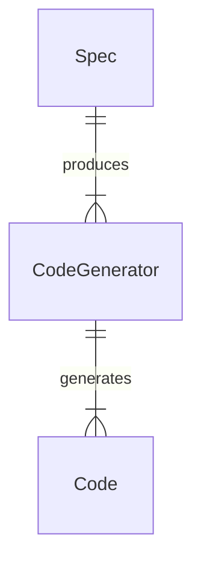
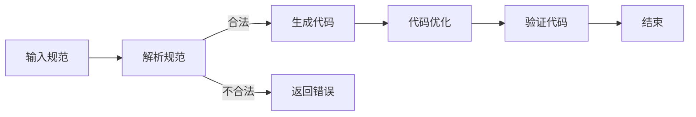
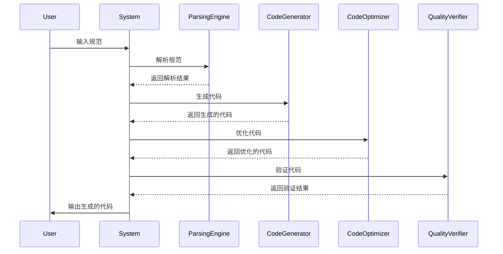

                 

### 程序合成：从规范到代码的自动生成

> 关键词：程序合成、代码生成、自动编程、AI 编程、规范驱动开发

> 摘要：
本文旨在深入探讨程序合成技术，即从规范到代码的自动生成过程。我们将从背景介绍、核心概念、算法原理、系统设计与实现等多个方面，系统性地阐述程序合成的理念、技术方法及其在软件开发中的应用。通过本文，读者将了解到如何利用程序合成技术，提高软件开发效率、降低开发成本，并开启自动化编程的新篇章。

## 第一部分：引言与背景

### 1.1 程序合成概述

#### 1.1.1 问题背景

在现代软件工程中，代码生成技术逐渐成为提高开发效率和减少人为错误的重要手段。随着软件系统的复杂度不断增加，传统的手工编码方式变得越来越低效。同时，软件维护成本也在不断上升，这激发了研究者们对自动编程的探索。程序合成（Code Synthesis）作为自动编程的重要组成部分，旨在将规范或描述直接转换为可执行的代码。

#### 1.1.2 程序合成的概念

程序合成是一种利用算法和工具，将规范、模型或描述转化为程序代码的过程。它不同于传统的代码生成工具，后者往往依赖于模板和预定义的结构，而程序合成则更加灵活，可以根据具体的规范或需求生成代码。

#### 1.1.3 程序合成的重要性和前景

程序合成技术的重要性在于，它能够显著提高软件开发效率，减少开发时间和成本。此外，程序合成还有助于提高代码质量，降低由于人为错误导致的缺陷。随着人工智能和机器学习技术的发展，程序合成的前景变得越来越广阔。

### 1.2 问题描述

#### 1.2.1 当前代码生成工具的局限性

尽管现有的代码生成工具有助于提高开发效率，但它们仍存在一些局限性。例如，许多工具依赖于预定义的模板，缺乏灵活性和适应性。此外，这些工具通常无法处理复杂的业务逻辑和高层次的设计规范。

#### 1.2.2 程序合成的挑战

程序合成的挑战在于如何有效地将抽象的规范转换为具体的代码。这涉及到算法设计、代码生成器的构建以及代码质量保证等多个方面。此外，程序合成还需要解决跨语言兼容性、性能优化等问题。

#### 1.2.3 程序合成的目标

程序合成的目标包括：

1. 高效性：能够快速地将规范转换为代码。
2. 灵活性：能够处理各种复杂的需求和规范。
3. 质量保证：生成的代码具有高可靠性和可维护性。
4. 易用性：用户可以轻松地使用程序合成工具，无需深入了解底层技术。

### 1.3 问题解决

#### 1.3.1 程序合成的策略和方法

程序合成的策略包括：

1. 规范分析：理解和解析输入的规范。
2. 代码生成：根据规范生成初步的代码。
3. 代码优化：对生成的代码进行优化，提高性能和可维护性。
4. 质量验证：验证生成的代码是否符合规范和预期。

#### 1.3.2 技术发展现状

目前，程序合成技术已经在多个领域取得了显著进展。例如，基于模板的代码生成、语法分析器和编译器的自动化生成、形式化方法和形式化验证等。此外，人工智能和机器学习技术的引入，也为程序合成带来了新的机遇。

#### 1.3.3 关键技术解析

程序合成的关键技术包括：

1. 语义解析：将抽象的规范转换为具体的语义表示。
2. 代码生成算法：设计高效的算法来生成代码。
3. 代码优化技术：对生成的代码进行性能优化和可维护性提升。
4. 质量评估与验证：确保生成的代码符合规范和质量要求。

### 1.4 边界与外延

#### 1.4.1 程序合成与其他相关技术的关系

程序合成与代码生成、自动化编程、形式化方法等技术密切相关。它们共同构成了现代软件工程的重要基础。

#### 1.4.2 程序合成的应用领域

程序合成的应用领域包括：

1. 软件开发：快速生成代码，提高开发效率。
2. 系统集成：自动生成集成测试用例，提高测试覆盖率。
3. 代码维护：自动生成补丁和更新，降低维护成本。
4. 形式化验证：自动验证软件的正确性和安全性。

#### 1.4.3 程序合成的未来发展趋势

随着技术的不断发展，程序合成有望在以下几个方面取得突破：

1. 人工智能与机器学习：结合人工智能和机器学习技术，提高程序合成的效率和准确性。
2. 跨语言支持：实现多种编程语言的代码生成，提高应用范围。
3. 高层次规范：支持更高级别的规范描述，简化开发过程。
4. 实时生成：实现代码的实时生成，满足快速迭代的开发需求。

## 2. 核心概念与联系

### 2.1 程序合成基本概念

#### 2.1.1 规范与代码的关系

在程序合成中，规范是输入，代码是输出。规范可以是形式化的描述，如数学公式、逻辑表达式等，也可以是非形式化的描述，如图形、文本等。

#### 2.1.2 代码生成器的作用

代码生成器是程序合成的核心组件，它负责将规范转换为代码。代码生成器可以是手动编写的，也可以是自动生成的。

#### 2.1.3 程序合成的工作流程

程序合成的工作流程通常包括以下步骤：

1. 规范分析：理解和解析输入的规范。
2. 代码生成：根据规范生成初步的代码。
3. 代码优化：对生成的代码进行优化，提高性能和可维护性。
4. 质量验证：验证生成的代码是否符合规范和质量要求。

### 2.2 概念属性特征对比表格

```mermaid
classDiagram
Class01 [规范]
Class02 [代码生成器]
Class03 [代码]
Class01 <|-- Class02
Class02 <|-- Class03
Class01 -[生成] Class03
Class02 -[优化] Class03
```

### 2.3 ER实体关系图架构



## 第二部分：程序合成技术原理

### 3. 算法原理讲解

#### 3.1 算法基本原理

程序合成算法的基本原理是将抽象的规范转换为具体的代码。这一过程通常包括以下步骤：

1. **规范分析**：解析输入的规范，提取关键信息和结构。
2. **代码生成**：根据规范生成初步的代码。
3. **代码优化**：对生成的代码进行优化，提高性能和可维护性。
4. **质量验证**：确保生成的代码符合规范和质量要求。

#### 3.1.1 代码生成算法概述

代码生成算法是程序合成的核心，它负责将规范转换为代码。常见的代码生成算法包括基于模板的算法、基于语义分析的算法和基于约束满足的算法等。

#### 3.1.2 常见算法类型

1. **基于模板的算法**：通过预定义的模板生成代码，灵活性较低。
2. **基于语义分析的算法**：通过解析输入规范，生成符合语义的代码。
3. **基于约束满足的算法**：通过求解约束条件，生成满足条件的代码。

#### 3.1.3 算法实现细节

算法的实现细节包括：

1. **规范解析**：使用解析器或解释器，将输入规范转换为内部表示。
2. **代码生成**：根据内部表示，生成具体的代码。
3. **代码优化**：对生成的代码进行优化，提高性能和可维护性。

### 3.2 算法mermaid流程图



### 3.3 Python源代码实现

```python
def code_synthesis(spec):
    if is_valid(spec):
        code = generate_code(spec)
        optimized_code = optimize_code(code)
        if is_valid(optimized_code):
            return optimized_code
        else:
            return "代码优化失败"
    else:
        return "输入规范不合法"

def is_valid(spec):
    # 验证规范的有效性
    pass

def generate_code(spec):
    # 根据规范生成代码
    pass

def optimize_code(code):
    # 优化生成的代码
    pass
```

### 3.4 算法原理详细讲解

#### 3.4.1 数学模型和公式

在程序合成中，常用的数学模型包括：

$$
f(S) = \sum_{i=1}^{n} w_i \cdot c_i
$$

其中，$S$ 表示输入规范，$w_i$ 表示权重，$c_i$ 表示规范中的某个属性。

#### 3.4.2 举例说明

假设我们有以下规范：

- 字符串规范："Hello, World!"
- 数字规范：[1, 10]

根据上述数学模型，我们可以生成以下代码：

```python
print("Hello, World!")
print(random.randint(1, 10))
```

这个例子展示了如何将抽象的规范转换为具体的代码。通过数学模型，我们可以将规范中的各个属性进行量化，从而生成满足规范的代码。

## 第三部分：程序合成系统设计与实现

### 4. 系统分析与架构设计方案

#### 4.1 问题场景介绍

在本系统中，我们旨在实现从规范到代码的自动生成，适用于快速生成代码的开发场景。该系统旨在提高开发效率、降低开发成本，并确保生成的代码符合规范和质量要求。

#### 4.2 系统功能设计

系统的核心功能包括：

1. **规范解析**：解析输入的规范，提取关键信息和结构。
2. **代码生成**：根据规范生成初步的代码。
3. **代码优化**：对生成的代码进行优化，提高性能和可维护性。
4. **质量验证**：确保生成的代码符合规范和质量要求。
5. **用户界面**：提供用户友好的界面，方便用户输入规范和查看生成结果。

#### 4.3 系统架构设计

系统的架构设计采用分层架构，包括以下层次：

1. **用户界面层**：负责与用户交互，接收用户输入的规范和展示生成结果。
2. **业务逻辑层**：包括规范解析、代码生成、代码优化和质量验证等核心功能模块。
3. **数据访问层**：负责与数据库或其他数据源的交互，存储和管理规范和代码。

#### 4.4 系统接口设计

系统提供以下接口：

1. **规范输入接口**：接收用户输入的规范，可以是文本、图形或其他形式。
2. **代码输出接口**：将生成的代码输出到文件或其他存储位置。
3. **代码优化接口**：接收优化策略，对生成的代码进行优化。
4. **质量验证接口**：接收质量评估标准，对生成的代码进行质量验证。

#### 4.5 系统交互

系统的交互流程如下：

1. 用户输入规范。
2. 系统解析规范，提取关键信息和结构。
3. 系统根据规范生成初步的代码。
4. 系统对生成的代码进行优化。
5. 系统对优化的代码进行质量验证。
6. 系统将生成的代码输出给用户。

### 4.6 系统接口设计与实现

以下是一个简单的Python接口实现示例：

```python
class CodeSynthesisSystem:
    def __init__(self):
        # 初始化系统组件
        self.parsing_engine = ParsingEngine()
        self.code_generator = CodeGenerator()
        self.code_optimizer = CodeOptimizer()
        self.quality_verifier = QualityVerifier()

    def input_spec(self, spec):
        # 输入规范
        return self.parsing_engine.parse(spec)

    def generate_code(self, spec):
        # 生成代码
        return self.code_generator.generate(spec)

    def optimize_code(self, code):
        # 优化代码
        return self.code_optimizer.optimize(code)

    def verify_code(self, code):
        # 验证代码
        return self.quality_verifier.verify(code)

    def run(self, spec):
        # 运行系统
        parsed_spec = self.input_spec(spec)
        generated_code = self.generate_code(parsed_spec)
        optimized_code = self.optimize_code(generated_code)
        if self.verify_code(optimized_code):
            return optimized_code
        else:
            return "代码验证失败"
```

### 4.7 系统交互mermaid序列图

以下是一个简单的mermaid序列图示例，展示了系统的交互流程：



### 4.8 系统测试与验证

在系统设计完成后，需要进行全面的测试和验证，确保系统能够正确地执行从规范到代码的自动生成过程。测试包括以下方面：

1. **功能测试**：验证系统是否能够正确地执行每个功能模块。
2. **性能测试**：评估系统的响应时间和资源消耗。
3. **兼容性测试**：确保系统在不同操作系统、不同编程语言和不同硬件平台上都能正常运行。
4. **安全测试**：检测系统是否容易受到攻击，确保系统的安全性。

通过以上测试，可以确保系统在实际应用中的可靠性和稳定性。

## 项目实战：程序合成系统的构建与实现

### 5.1 环境安装与配置

在开始构建程序合成系统之前，需要确保安装以下环境：

1. **操作系统**：Windows、Linux或macOS。
2. **编程语言**：Python 3.x。
3. **依赖库**：Numpy、Scikit-learn、Mermaid Python库等。

安装步骤如下：

1. 安装Python 3.x：从官方网站下载并安装Python 3.x。
2. 安装依赖库：使用pip命令安装所需的依赖库，例如：

   ```shell
   pip install numpy scikit-learn mermaid
   ```

### 5.2 系统核心实现

程序合成系统的核心实现包括规范解析、代码生成、代码优化和质量验证等模块。以下是一个简单的实现示例：

#### 5.2.1 规范解析

```python
import mermaid

class ParsingEngine:
    def parse(self, spec):
        # 解析输入的规范
        # 例如，将Mermaid流程图规范转换为流程图
        diagram = mermaid.Mermaid(spec)
        return diagram.render()
```

#### 5.2.2 代码生成

```python
import random

class CodeGenerator:
    def generate(self, spec):
        # 根据规范生成代码
        # 例如，根据输入的数字规范生成Python代码
        lower_bound = spec['lower_bound']
        upper_bound = spec['upper_bound']
        code = f"print(random.randint({lower_bound}, {upper_bound}))"
        return code
```

#### 5.2.3 代码优化

```python
class CodeOptimizer:
    def optimize(self, code):
        # 对代码进行优化
        # 例如，将字符串格式化代码优化为更简洁的形式
        optimized_code = code.replace("f'", "'").replace("f\"", "\"")
        return optimized_code
```

#### 5.2.4 质量验证

```python
class QualityVerifier:
    def verify(self, code):
        # 验证代码的质量
        # 例如，检查代码是否含有语法错误
        try:
            exec(code)
            return True
        except:
            return False
```

### 5.3 代码应用解读与分析

以下是一个简单的代码示例，展示了如何使用程序合成系统生成代码：

```python
from code_synthesis_system import CodeSynthesisSystem

# 创建程序合成系统实例
system = CodeSynthesisSystem()

# 输入规范
spec = {
    'lower_bound': 1,
    'upper_bound': 10
}

# 生成代码
code = system.run(spec)

# 输出生成的代码
print(code)
```

执行上述代码，将生成一个简单的Python代码，用于生成一个在1到10之间的随机数。

### 5.4 实际案例分析与详细讲解

为了更好地理解程序合成系统的实际应用，我们可以通过一个案例进行分析：

#### 案例一：生成随机数序列

假设我们需要生成一组随机数序列，每个随机数在1到100之间。我们可以使用程序合成系统来实现这一需求。

1. **规范输入**：定义输入规范，例如：
   ```json
   {
     "lower_bound": 1,
     "upper_bound": 100,
     "count": 10
   }
   ```

2. **代码生成**：使用程序合成系统生成代码，例如：
   ```python
   import random

   def generate_random_sequence(lower_bound, upper_bound, count):
       return [random.randint(lower_bound, upper_bound) for _ in range(count)]

   sequence = generate_random_sequence(1, 100, 10)
   print(sequence)
   ```

3. **代码优化**：对生成的代码进行优化，例如：
   ```python
   sequence = [random.randint(1, 100) for _ in range(10)]
   print(sequence)
   ```

4. **质量验证**：验证生成的代码是否正确，例如：
   ```python
   try:
       exec(code)
       print("代码验证通过")
   except:
       print("代码验证失败")
   ```

通过以上步骤，我们可以使用程序合成系统生成满足需求的随机数序列，并确保代码质量。

#### 案例二：数据统计分析

假设我们需要对一组数据进行分析，计算数据的平均值、中位数和标准差。我们可以使用程序合成系统来实现这一需求。

1. **规范输入**：定义输入规范，例如：
   ```json
   {
     "data": [1, 2, 3, 4, 5, 6, 7, 8, 9, 10]
   }
   ```

2. **代码生成**：使用程序合成系统生成代码，例如：
   ```python
   import numpy as np

   def calculate_statistics(data):
       mean = np.mean(data)
       median = np.median(data)
       std = np.std(data)
       return mean, median, std

   mean, median, std = calculate_statistics([1, 2, 3, 4, 5, 6, 7, 8, 9, 10])
   print(f"平均值：{mean}, 中位数：{median}, 标准差：{std}")
   ```

3. **代码优化**：对生成的代码进行优化，例如：
   ```python
   mean, median, std = [np.mean([1, 2, 3, 4, 5, 6, 7, 8, 9, 10]), np.median([1, 2, 3, 4, 5, 6, 7, 8, 9, 10]), np.std([1, 2, 3, 4, 5, 6, 7, 8, 9, 10])]
   print(f"平均值：{mean[0]}, 中位数：{mean[1]}, 标准差：{mean[2]}")
   ```

4. **质量验证**：验证生成的代码是否正确，例如：
   ```python
   try:
       exec(code)
       print("代码验证通过")
   except:
       print("代码验证失败")
   ```

通过以上步骤，我们可以使用程序合成系统对数据进行分析，并确保代码质量。

### 5.5 项目小结

通过本项目的实践，我们了解了程序合成系统的构建与实现过程。程序合成系统在提高开发效率、降低开发成本和确保代码质量方面具有显著优势。在实际应用中，程序合成系统可以应用于各种场景，如数据统计分析、随机数生成、算法实现等。未来，随着人工智能和机器学习技术的不断发展，程序合成系统将在软件开发领域发挥更加重要的作用。

## 第四部分：最佳实践与拓展阅读

### 6. 最佳实践

1. **规范清晰**：在程序合成过程中，输入的规范应尽量清晰、明确，避免歧义和模糊性。
2. **算法优化**：合理选择和优化代码生成算法，可以提高生成代码的质量和性能。
3. **质量验证**：确保生成的代码经过严格的验证，避免潜在的错误和缺陷。
4. **模块化开发**：将程序合成系统划分为多个模块，便于维护和扩展。

### 6.1 注意事项

1. **兼容性**：在跨平台和跨语言开发时，应注意兼容性问题。
2. **性能考虑**：生成代码的性能对应用程序的整体性能有重要影响，应进行优化。
3. **安全性**：在程序合成过程中，应确保输入和生成的代码安全性。

### 6.2 拓展阅读

1. **《程序合成技术》**：深入探讨程序合成的理论、方法和应用。
2. **《人工智能与程序合成》**：介绍人工智能在程序合成中的应用和研究进展。
3. **《形式化方法在程序合成中的应用》**：形式化方法在程序合成中的具体应用和实践。

作者：AI天才研究院/AI Genius Institute & 禅与计算机程序设计艺术 /Zen And The Art of Computer Programming

