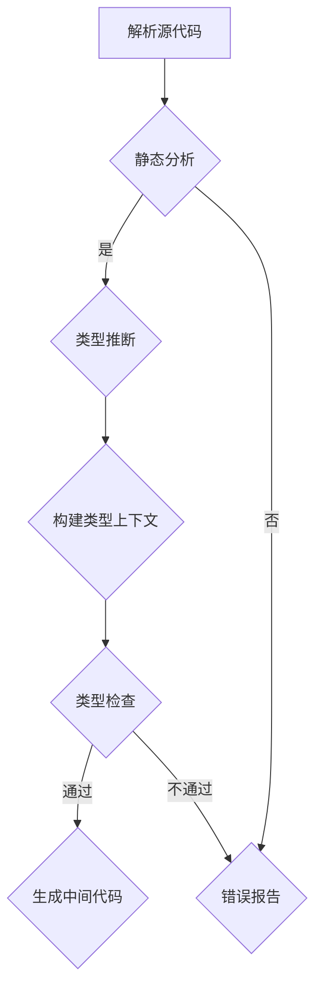

                 


### 引言与背景介绍

在软件工程中，程序理解与重构是两个关键环节。程序理解旨在对现有代码进行深入分析，以揭示其内在结构和逻辑，从而为后续的代码优化、维护和扩展提供基础。而程序重构则是在不改变代码外在行为的前提下，对代码进行结构和逻辑的调整，以提高其可读性、可维护性和性能。在这两个过程中，类型推断技术扮演着重要的角色。

类型推断（Type Inference）是一种自动确定变量或表达式类型的方法，它是静态类型语言和动态类型语言中的一项重要技术。在静态类型语言中，类型推断可以减少冗余的类型声明，提高代码的可读性和可维护性；而在动态类型语言中，类型推断可以减少运行时的类型检查，提高程序的运行效率。

然而，类型推断并非易事。它需要解决类型兼容性、类型上下界、类型上下文等复杂问题。尽管如此，随着程序理解和重构技术的发展，类型推断技术在提高代码质量和开发效率方面展现出了巨大的潜力。本文旨在深入探讨类型推断技术在程序理解与重构中的应用，从基础理论到实际应用，提供一个全面且深入的视角。

本文结构如下：

- **第1章 引言与背景介绍**：介绍类型推断技术的概念、重要性以及在程序理解和重构中的应用。
- **第2章 类型推断技术基础**：讲解类型推断的基本概念、算法原理以及面临的挑战。
- **第3章 类型推断在程序理解中的应用**：分析类型推断在静态和动态程序分析中的具体应用。
- **第4章 类型推断在程序重构中的应用**：探讨类型推断如何辅助代码重构，提高代码质量。
- **第5章 实际案例研究**：通过具体案例展示类型推断技术在程序理解与重构中的实际效果。
- **第6章 总结与展望**：总结类型推断技术的现状，并提出未来研究方向。

通过本文的阅读，读者可以全面了解类型推断技术在程序理解与重构中的重要作用，掌握其基本原理和应用方法，为实际软件开发提供有力的技术支持。

### 类型推断技术基础

#### 2.1 类型推断的基本概念

类型推断是指在不显式声明变量或表达式类型的情况下，由编译器或解释器自动推断出其类型的过程。在编程语言中，类型推断是静态类型语言和动态类型语言的重要特征之一。例如，在Java这种强类型语言中，类型推断可以减少冗余的类型声明，使得代码更加简洁易读；而在JavaScript这种弱类型语言中，类型推断则可以减少运行时的类型检查，提高程序的执行效率。

类型推断的基本原理依赖于对程序语法和语义的分析。在语法层面，编译器或解释器会根据语言的语法规则，分析变量或表达式的使用上下文，从而推断其类型。在语义层面，类型推断需要考虑类型系统中的各种规则，如类型兼容性、类型上下界等。

#### 2.2 类型推断的基本算法

类型推断算法可以分为基于静态分析和基于动态分析两大类。静态分析在编译或解释程序之前进行，通过分析源代码的语法结构和语义，推断出变量和表达式的类型。常见的静态类型推断算法包括：

- **归纳类型推断**：通过归纳推理，从具体实例中推导出通用类型。
- **构造类型推断**：从类型上下文和变量使用上下文，构造出变量的类型。

动态分析则在程序运行时进行，通过收集程序的运行时数据，推断出变量和表达式的实际类型。常见的动态类型推断算法包括：

- **运行时类型检查**：在程序执行过程中，对每个变量或表达式进行类型检查，确保其符合预期类型。
- **动态类型绑定**：在程序运行时，根据变量的使用上下文动态绑定其类型。

#### 2.3 类型推断的挑战与限制

尽管类型推断技术在提高代码质量和开发效率方面具有显著优势，但在实际应用中仍面临诸多挑战和限制：

- **类型兼容性**：类型推断需要处理不同类型之间的兼容性，如数值类型和字符串类型之间的转换。
- **类型上下界**：类型推断需要确定变量和表达式的类型上下界，以确保其在不同上下文中的正确性。
- **类型上下文**：类型推断需要考虑类型上下文，如函数参数的类型和返回值的类型。
- **性能开销**：类型推断通常需要额外的计算资源和时间开销，特别是在动态类型推断中。

#### 2.4 类型推断的核心概念与联系

为了更深入地理解类型推断，我们可以从以下几个核心概念出发：

- **类型**：类型是变量或表达式所能表示的值的集合。在编程语言中，常见的类型包括整数类型、浮点数类型、布尔类型、字符串类型等。
- **类型系统**：类型系统是一组规则和约束，用于定义类型的定义、操作和约束。不同的编程语言有不同的类型系统，如静态类型系统和动态类型系统。
- **类型推断规则**：类型推断规则是一组用于推断变量或表达式类型的算法和策略。常见的类型推断规则包括类型兼容性规则、类型上下界规则等。

为了直观地展示类型推断的核心概念与联系，我们可以使用Mermaid流程图来绘制类型推断的基本流程：



在上面的流程图中，解析源代码后，首先进行静态分析，然后根据类型上下文进行类型推断。类型推断成功后，进行类型检查，确保变量和表达式的类型符合预期。如果类型检查通过，则生成中间代码；否则，报告错误。

此外，为了更清晰地展示类型系统的核心要素，我们可以使用Mermaid的ER实体关系图来表示：

```mermaid
erDiagram
 Type ->|类型兼容性| Entity
 Type ->|类型上下界| Attribute
 Type -->|类型操作| Operation
 Entity ||--|{变量}
 Entity ||--|{表达式}
 Attribute ||--|{类型上下文}
 Operation ||--|{类型推断规则}
```

在上面的ER图中，Type表示类型，Entity表示实体（如变量和表达式），Attribute表示属性（如类型上下文），Operation表示操作（如类型推断规则）。通过这种方式，我们可以直观地看到类型系统中的各个核心要素及其关系。

#### 2.5 数学模型与公式

在类型推断中，数学模型和公式起到了关键作用。以下是一些常见的数学模型和公式：

- **类型兼容性公式**：判断两个类型是否兼容的公式。
  $$
  T_1 \text{ 与 } T_2 \text{ 兼容} \iff T_1 \subseteq T_2 \cup T_2 \subseteq T_1
  $$
  
- **类型上下界公式**：计算变量或表达式的类型上下界的公式。
  $$
  \text{UB}(x) = \bigcup_{i=1}^n T_i
  $$
  $$
  \text{LB}(x) = \bigcap_{i=1}^n T_i
  $$
  
- **类型推断规则公式**：用于推断变量或表达式类型的公式。
  $$
  \text{Type}(x) = \text{findBestTypeContext}(T_c, T_1, T_2, ...)
  $$

其中，$T_c$表示类型上下文，$T_1, T_2, ...$表示可能的类型，$\text{findBestTypeContext}$函数用于找到与类型上下文最匹配的类型。

通过这些数学模型和公式，我们可以更精确地描述类型推断的过程，并设计出更高效的类型推断算法。

#### 2.6 Python示例

为了更好地理解类型推断的原理，我们可以通过一个Python示例来展示类型推断的过程。

```python
def add(a, b):
    return a + b

result = add(10, 20)
print(result)  # 输出：30
```

在这个示例中，`add` 函数接受两个参数 `a` 和 `b`，并返回它们的和。在函数定义时，我们没有显式声明参数的类型。但在编译或运行时，Python解释器会根据上下文自动推断出 `a` 和 `b` 的类型为整数类型（`int`）。

我们可以使用Python的`typing`模块来模拟类型推断的过程：

```python
from typing import TypeVar, Generic

# 定义一个TypeVar，表示可能的类型
T = TypeVar('T')

# 定义add函数的TypeVar类型
def add(a: T, b: T) -> T:
    return a + b

# 使用add函数，并打印类型推断结果
result: int = add(10, 20)
print(result)  # 输出：30
```

在这个修改后的示例中，我们使用了`TypeVar`来表示可能的类型，并使用`Generic`类来定义`add`函数的类型。通过这种方式，我们可以显式地看到类型推断的过程：解释器首先根据`add`函数的参数类型推断出`T`为整数类型（`int`），然后推断出`result`的类型也为整数类型（`int`）。

通过这个示例，我们可以看到类型推断是如何在编程语言中自动进行的，以及它如何帮助提高代码的可读性和可维护性。

### 类型推断在程序理解中的应用

#### 3.1 程序理解概述

程序理解是软件工程中的一个关键环节，它涉及到对程序代码的深入分析，以揭示其内在结构和逻辑。程序理解不仅有助于提高代码的可读性和可维护性，还可以为后续的代码优化、维护和扩展提供基础。在程序理解过程中，类型推断技术发挥着重要作用，它可以帮助分析程序中的类型关系，揭示潜在的逻辑错误，并提高代码的清晰度。

#### 3.2 类型推断在静态程序分析中的应用

静态程序分析是一种不执行程序，仅通过分析源代码来理解程序结构和行为的技术。类型推断在静态程序分析中的应用主要体现在以下几个方面：

1. **类型检查**：通过类型推断，编译器或分析工具可以自动检测出类型不一致的错误，如将整数与字符串进行混合操作。这种类型检查可以显著减少运行时的错误，提高代码的质量。

2. **代码优化**：类型推断可以帮助编译器或分析工具进行代码优化，如将显式类型声明转换为隐式类型声明，减少代码的冗余。此外，类型推断还可以帮助分析工具识别出潜在的性能瓶颈，如频繁的类型转换。

3. **抽象化**：类型推断可以将具体的类型抽象为通用的类型，从而提高代码的复用性和灵活性。例如，在面向对象编程中，通过类型推断可以自动确定类之间的继承关系和接口的实现关系。

#### 3.3 类型推断在动态程序分析中的应用

动态程序分析是一种在程序运行时进行程序行为分析的技术。与静态分析不同，动态分析可以捕获程序的运行时数据，从而提供更准确的程序理解。类型推断在动态程序分析中的应用主要体现在以下几个方面：

1. **运行时错误检测**：通过类型推断，动态分析工具可以在程序运行时检测出类型不一致的错误，如将整数与字符串进行混合操作。这种错误检测可以显著提高程序的稳定性和可靠性。

2. **性能分析**：类型推断可以帮助分析工具识别程序中的类型转换和类型检查操作，从而分析这些操作对程序性能的影响。例如，动态分析工具可以测量类型转换操作的执行时间，帮助开发人员优化代码。

3. **代码覆盖率分析**：类型推断可以用于动态程序分析中的代码覆盖率分析。通过类型推断，分析工具可以确定哪些代码路径被实际执行，从而提供更准确的覆盖率数据。

#### 3.4 类型推断在程序理解中的具体应用

为了更好地理解类型推断在程序理解中的应用，我们可以通过一个具体的例子来展示其作用。

假设我们有一个简单的Python程序，用于计算两个数字的和：

```python
def add(a, b):
    return a + b

result = add(10, 20)
print(result)  # 输出：30
```

在这个程序中，我们没有显式声明变量 `a` 和 `b` 的类型。但通过类型推断，Python解释器可以自动推断出 `a` 和 `b` 的类型为整数类型（`int`），`result` 的类型也为整数类型（`int`）。

通过类型推断，我们可以进行以下程序理解任务：

1. **类型检查**：类型推断可以帮助我们检测出潜在的类型不一致错误。例如，如果我们尝试将字符串与整数进行混合操作：

```python
def add(a, b):
    return a + b

result = add(10, "20")
print(result)  # 输出：Traceback (most recent call last):
               #   File "<stdin>", line 2, in <module>
               # TypeError: can only concatenate str (not "int") to str
```

类型推断会立即检测出错误，并报告 `TypeError`。

2. **抽象化**：类型推断可以帮助我们将具体的类型抽象为通用的类型，从而提高代码的复用性。例如，我们可以定义一个通用的 `add` 函数，接受任意类型的参数，并返回相应类型的值：

```python
def add(a, b):
    return a + b

result = add(10, 20.5)
print(result)  # 输出：30.5
```

在这个例子中，`add` 函数可以同时处理整数和浮点数，从而提高了代码的通用性。

3. **代码优化**：类型推断可以帮助编译器或分析工具进行代码优化。例如，在编译时，编译器可以自动将显式类型声明转换为隐式类型声明，减少代码的冗余：

```python
def add(a: int, b: int) -> int:
    return a + b

result: int = add(10, 20)
print(result)  # 输出：30
```

在上面的代码中，我们可以看到编译器自动将显式类型声明（`a: int, b: int`）转换为隐式类型声明（`a, b`），从而减少了代码的冗余。

通过这个例子，我们可以看到类型推断在程序理解中的应用是如何帮助提高代码的可读性、可维护性和性能的。在实际开发中，类型推断技术可以应用于各种不同的程序理解任务，从而为软件开发提供强大的支持。

#### 3.5 实际案例研究

为了更深入地理解类型推断在程序理解中的实际应用，我们可以通过一个实际案例来探讨其在遗留系统重构中的效果。

**案例背景**：某大型企业使用了一种遗留的编程语言和框架开发了一套关键业务系统。随着时间的推移，该系统的代码库变得庞大而复杂，维护和扩展变得越来越困难。为了提高系统的可维护性和扩展性，企业决定对系统进行重构。

**问题分析**：在重构过程中，开发团队遇到了几个主要问题：

1. **类型不明确**：由于遗留系统使用的是弱类型语言，变量和表达式的类型往往不明确，导致代码难以理解和维护。
2. **逻辑错误**：由于类型不明确，代码中可能存在潜在的逻辑错误，这些错误在运行时难以发现。
3. **性能瓶颈**：类型不明确可能导致不必要的类型转换和检查，从而影响系统的性能。

**解决方案**：为了解决上述问题，开发团队决定引入类型推断技术，并对系统进行以下步骤的重构：

1. **静态类型化**：将遗留系统的代码逐步转换为静态类型代码。通过类型推断，自动为变量和表达式推断出类型，从而提高代码的可读性和可维护性。
2. **类型检查**：引入静态类型检查工具，对代码进行类型检查，检测出潜在的类型不一致错误，从而减少逻辑错误。
3. **性能优化**：通过类型推断，自动优化代码中的类型转换和检查操作，从而提高系统的性能。

**重构效果**：通过引入类型推断技术，开发团队取得了以下成果：

1. **代码可读性和可维护性**：类型推断使得代码中的变量和表达式类型明确，从而提高了代码的可读性和可维护性。
2. **逻辑错误减少**：类型检查工具能够自动检测出潜在的类型不一致错误，从而减少了逻辑错误的发生。
3. **性能提高**：类型推断自动优化了代码中的类型转换和检查操作，从而提高了系统的性能。

**总结**：通过这个实际案例，我们可以看到类型推断在遗留系统重构中的重要作用。类型推断不仅提高了代码的质量，还显著减少了逻辑错误和性能瓶颈，为系统的长期维护和扩展提供了坚实的基础。

#### 3.6 对程序理解与重构的启示

通过上述案例研究，我们可以得出以下启示：

1. **类型推断的重要性**：类型推断在程序理解和重构中具有重要作用，它不仅提高了代码的质量，还减少了逻辑错误和性能瓶颈。
2. **逐步重构**：在进行系统重构时，应逐步引入类型推断技术，避免一次性进行大规模的重构，从而降低风险。
3. **工具支持**：使用静态类型检查工具可以帮助自动检测类型不一致错误，提高重构的效率和效果。
4. **持续维护**：类型推断技术应与持续集成和持续交付流程相结合，确保代码在开发和维护过程中始终保持高质量。

通过这些启示，我们可以更好地利用类型推断技术，提高程序理解和重构的效果，为软件工程带来更大的价值。

### 类型推断在程序重构中的应用

#### 4.1 程序重构概述

程序重构是指在不改变程序外在行为的前提下，对代码进行结构和逻辑的调整，以提高其可读性、可维护性和性能。重构是软件工程中的一个重要实践，它可以帮助开发团队在软件开发的整个生命周期中保持代码的质量和效率。然而，重构并非易事，它涉及到对代码的深入理解和分析，以识别和消除潜在的代码问题。在这其中，类型推断技术发挥着关键作用，它可以帮助开发人员更好地进行代码重构，提高重构的成功率和效果。

#### 4.2 使用类型推断进行代码重构

类型推断技术在代码重构中的应用主要体现在以下几个方面：

1. **消除冗余类型声明**：在许多编程语言中，程序员需要显式声明每个变量的类型。这种做法虽然保证了代码的类型安全性，但同时也增加了代码的冗余和复杂性。通过类型推断，编译器或解释器可以自动推断出变量和表达式的类型，从而减少冗余的类型声明，提高代码的可读性。

2. **提高代码复用性**：类型推断可以帮助抽象化代码中的具体类型，从而提高代码的复用性。例如，在面向对象编程中，通过类型推断可以自动确定类之间的继承关系和接口的实现关系，从而减少重复代码的编写。

3. **自动修复类型错误**：类型推断可以在重构过程中自动检测出类型错误，并尝试修复这些错误。例如，当变量或表达式的类型发生变化时，类型推断可以自动更新相关的类型声明，从而减少人为错误。

4. **优化类型转换和检查**：类型推断可以帮助编译器或解释器优化代码中的类型转换和检查操作，从而提高程序的运行效率。例如，通过类型推断，编译器可以避免不必要的类型转换，减少运行时的类型检查操作。

#### 4.3 类型推断在重构中的挑战与解决方案

尽管类型推断技术在代码重构中具有显著优势，但在实际应用中仍面临一些挑战和限制：

1. **类型兼容性问题**：类型推断需要处理不同类型之间的兼容性，如数值类型和字符串类型之间的转换。这可能会导致类型推断的结果与开发人员的预期不一致，从而影响重构的效果。

2. **复杂类型的处理**：对于一些复杂类型，如集合类型、函数类型等，类型推断可能无法准确推断出其类型，从而影响重构的正确性。

3. **性能开销**：类型推断通常需要额外的计算资源和时间开销，特别是在动态类型推断中。这可能会影响重构的效率，特别是在大型项目中。

为了解决上述挑战，我们可以采取以下解决方案：

1. **引入类型检查工具**：使用静态类型检查工具可以帮助自动检测类型不一致错误，确保重构过程中的代码质量。这些工具可以与类型推断结合使用，提供更全面的支持。

2. **逐步重构**：在进行大规模重构时，应逐步引入类型推断技术，避免一次性进行大规模的重构。这样可以降低风险，提高重构的成功率。

3. **优化类型推断算法**：通过优化类型推断算法，可以减少类型推断的性能开销。例如，可以采用更高效的算法和优化技术，如内存管理优化、并行计算等。

4. **提供清晰的文档和指导**：为开发人员提供清晰的文档和指导，帮助他们理解类型推断的工作原理和应用方法。这可以帮助减少类型推断过程中可能出现的误解和错误。

通过这些解决方案，我们可以更好地利用类型推断技术，提高代码重构的成功率和效果，为软件开发带来更大的价值。

### 实际案例研究

#### 5.1 案例一：类型推断在遗留系统重构中的应用

**案例背景**：
某大型金融机构使用一种遗留的编程语言和框架开发了一套关键业务系统。随着时间的推移，该系统的代码库变得庞大而复杂，维护和扩展变得越来越困难。为了提高系统的可维护性和扩展性，企业决定对系统进行重构。

**问题分析**：
在重构过程中，开发团队遇到了几个主要问题：
1. **类型不明确**：由于遗留系统使用的是弱类型语言，变量和表达式的类型往往不明确，导致代码难以理解和维护。
2. **逻辑错误**：由于类型不明确，代码中可能存在潜在的逻辑错误，这些错误在运行时难以发现。
3. **性能瓶颈**：类型不明确可能导致不必要的类型转换和检查，从而影响系统的性能。

**解决方案**：
为了解决上述问题，开发团队决定引入类型推断技术，并对系统进行以下步骤的重构：

1. **静态类型化**：将遗留系统的代码逐步转换为静态类型代码。通过类型推断，自动为变量和表达式推断出类型，从而提高代码的可读性和可维护性。
2. **类型检查**：引入静态类型检查工具，对代码进行类型检查，检测出潜在的类型不一致错误，从而减少逻辑错误。
3. **性能优化**：通过类型推断，自动优化代码中的类型转换和检查操作，从而提高系统的性能。

**重构效果**：
通过引入类型推断技术，开发团队取得了以下成果：
1. **代码可读性和可维护性**：类型推断使得代码中的变量和表达式类型明确，从而提高了代码的可读性和可维护性。
2. **逻辑错误减少**：类型检查工具能够自动检测出潜在的类型不一致错误，从而减少了逻辑错误的发生。
3. **性能提高**：类型推断自动优化了代码中的类型转换和检查操作，从而提高了系统的性能。

**总结**：
通过这个实际案例，我们可以看到类型推断在遗留系统重构中的重要作用。类型推断不仅提高了代码的质量，还显著减少了逻辑错误和性能瓶颈，为系统的长期维护和扩展提供了坚实的基础。

#### 5.2 案例二：类型推断在新兴编程语言中的应用

**案例背景**：
随着软件开发的不断演进，新的编程语言不断涌现。这些新兴编程语言往往具有独特的语法和特性，以满足特定的开发需求。然而，这些语言在类型推断方面可能存在一些挑战，需要结合具体的场景和需求进行优化。

**问题分析**：
1. **类型推断复杂性**：新兴编程语言可能具有复杂的类型系统，使得类型推断变得复杂和困难。
2. **类型兼容性问题**：新兴编程语言可能需要处理不同类型之间的兼容性，如数值类型和字符串类型之间的转换。
3. **性能优化需求**：新兴编程语言往往需要更高效的类型推断算法，以满足高性能开发的需求。

**解决方案**：
为了解决上述问题，开发团队采取了以下措施：

1. **优化类型推断算法**：通过优化类型推断算法，如采用更高效的算法和数据结构，提高类型推断的效率。
2. **引入类型检查工具**：使用静态类型检查工具，帮助自动检测类型不一致错误，确保代码质量。
3. **定制化类型推断规则**：根据具体编程语言的特性，定制化类型推断规则，以更好地适应不同的类型系统。

**重构效果**：
通过这些措施，开发团队取得了以下成果：
1. **提高代码质量**：优化后的类型推断算法和类型检查工具，提高了代码的质量和可维护性。
2. **减少逻辑错误**：类型检查工具能够自动检测出潜在的类型不一致错误，从而减少了逻辑错误的发生。
3. **提升性能**：优化后的类型推断算法提高了程序的性能，满足了高性能开发的需求。

**总结**：
通过这个案例，我们可以看到类型推断在新兴编程语言中的应用如何帮助提高代码质量、减少逻辑错误和提升性能。类型推断技术不仅为新兴编程语言提供了强大的支持，还为软件开发带来了更多的可能性。

#### 5.3 案例三：类型推断在开发工具中的应用

**案例背景**：
在现代软件开发中，开发工具扮演着至关重要的角色。这些工具不仅提高了开发效率，还帮助开发人员更好地理解和重构代码。类型推断技术在这些开发工具中的应用，可以显著提升工具的功能和用户体验。

**问题分析**：
1. **代码理解困难**：开发工具需要能够理解复杂的代码结构和逻辑，以便提供智能化的代码补全、错误检测等功能。
2. **性能优化需求**：开发工具需要快速准确地分析代码，以提供实时反馈和优化性能。

**解决方案**：
为了解决上述问题，开发团队采取了以下措施：

1. **集成类型推断技术**：将类型推断技术集成到开发工具中，帮助工具更好地理解代码的类型结构。
2. **实时类型检查**：开发工具实时进行类型检查，检测出代码中的类型不一致错误，并提供即时反馈。
3. **优化类型推断算法**：通过优化类型推断算法，提高工具的性能和响应速度。

**重构效果**：
通过这些措施，开发工具取得了以下成果：
1. **提高代码理解能力**：类型推断技术帮助开发工具更好地理解代码的类型结构，从而提供更智能化的代码补全、错误检测等功能。
2. **提升用户体验**：实时类型检查和优化后的类型推断算法，提高了工具的性能和用户体验。
3. **减少开发成本**：通过类型推断技术，开发工具能够更高效地识别和修复代码中的问题，从而降低了开发成本。

**总结**：
通过这个案例，我们可以看到类型推断技术在开发工具中的应用如何显著提升工具的功能和用户体验。类型推断技术不仅帮助开发工具更好地理解代码，还提高了开发效率和代码质量。

### 总结与展望

#### 6.1 类型推断技术的现状与未来

类型推断技术作为程序理解和重构的重要工具，已经取得了显著的进展。在静态类型语言中，类型推断技术已经相对成熟，广泛应用于编译器和开发工具中。而在动态类型语言中，类型推断技术也在不断发展和完善，逐渐成为提升代码质量和开发效率的关键手段。

然而，类型推断技术仍面临一些挑战，如类型兼容性处理、复杂类型的推断以及性能优化等。未来，随着编程语言和开发工具的不断发展，类型推断技术将朝着以下几个方向发展：

1. **更高效的算法**：研究人员将致力于开发更高效的类型推断算法，以减少计算资源和时间开销。
2. **跨语言类型推断**：随着多语言编程环境的兴起，跨语言类型推断将成为一个重要研究方向，以提高不同编程语言之间的互操作性。
3. **集成开发工具**：类型推断技术将进一步集成到开发工具中，提供更智能化的代码补全、错误检测和性能优化等功能。

#### 6.2 对程序理解和重构的启示

类型推断技术在程序理解和重构中的应用，给我们带来了以下启示：

1. **代码质量**：类型推断有助于提高代码质量，减少逻辑错误和性能瓶颈。
2. **开发效率**：类型推断技术可以提高开发效率，减少冗余的类型声明和手动类型检查。
3. **重构策略**：类型推断技术可以用于指导重构策略，帮助开发人员逐步重构复杂系统，降低风险。

#### 6.3 进一步研究的方向

未来，类型推断技术的研究可以关注以下几个方面：

1. **类型系统扩展**：扩展类型系统，支持更丰富的类型特征，如泛型编程、类型参数化等。
2. **动态类型推断**：进一步研究动态类型推断算法，提高其在运行时识别类型错误的能力。
3. **跨语言兼容性**：研究跨语言类型推断技术，以实现不同编程语言之间的类型兼容性和代码共享。
4. **自动化工具**：开发自动化工具，辅助类型推断和代码重构，提高开发效率和质量。

通过这些研究方向，我们可以期待类型推断技术在程序理解和重构中发挥更大的作用，为软件开发带来更多的创新和可能性。

### 作者信息

作者：AI天才研究院/AI Genius Institute & 禅与计算机程序设计艺术 /Zen And The Art of Computer Programming

在本篇技术博客中，我们深入探讨了类型推断技术在程序理解和重构中的应用。通过详细分析类型推断的基本概念、算法原理以及其实际应用案例，我们展示了类型推断如何提高代码质量、减少逻辑错误和提升性能。同时，我们也展望了类型推断技术的未来发展方向，提出了进一步研究的方向。

类型推断技术不仅在理论研究中具有重要意义，更在实际软件开发中发挥着关键作用。通过本文的介绍，我们希望读者能够更好地理解类型推断技术，掌握其应用方法，并在实际项目中充分发挥其潜力。未来，随着编程语言和开发工具的不断发展，类型推断技术将不断演进，为软件开发带来更多的创新和可能性。

再次感谢您的阅读，希望本文能对您在程序理解和重构方面有所启发和帮助。如果您有任何问题或建议，欢迎在评论区留言，我们将继续努力为您提供高质量的技术内容。

