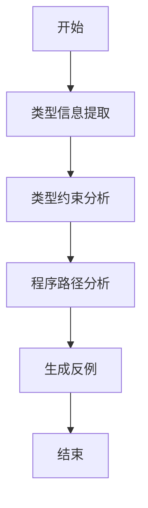
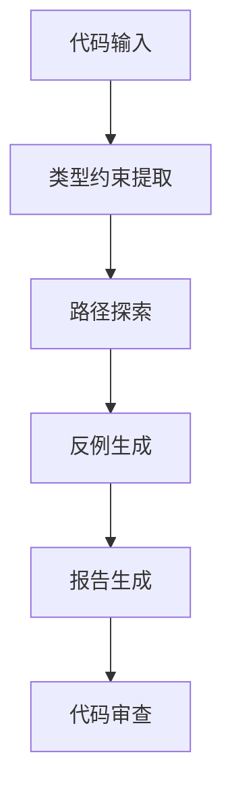
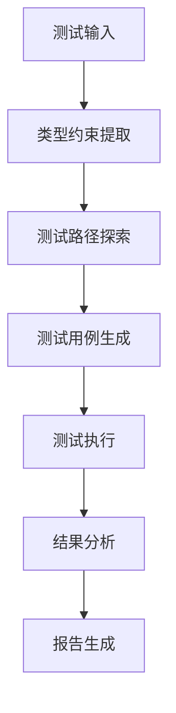
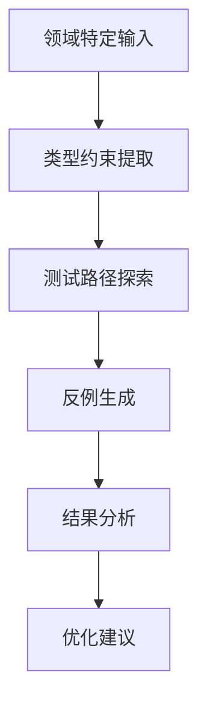

                 

### 让我们一步步思考：类型导向反例生成在程序综合中的应用

#### 核心概念介绍

类型导向反例生成是程序综合领域中一个极具前景的研究方向，主要关注如何通过类型信息有效地生成反例，以帮助开发者发现和修复程序中的错误。在这一背景下，首先需要明确几个核心概念。

**1. 程序综合：** 程序综合（Program Synthesis）是指从一组输入和预期输出中自动生成程序的过程。这个领域的目标是减少手动编码的工作量，提高代码生成的效率和准确性。

**2. 反例生成：** 反例生成（Counterexample Generation）是程序综合的一个关键步骤，旨在通过识别程序中的错误行为来找出问题的根源。反例生成通常涉及对程序执行过程中的异常行为进行分析，并提取出能够揭示问题的输入数据。

**3. 类型导向：** 类型导向（Type-Driven）方法强调利用类型信息来指导程序分析和生成过程。类型系统是编程语言中的一个重要组成部分，它提供了对变量、函数和程序结构的一组约束，有助于提高代码的可靠性和可维护性。

#### 问题背景与挑战

**问题背景：** 随着软件系统的复杂性不断增加，手动测试和调试逐渐成为一项艰巨且耗时的任务。程序综合和反例生成技术的出现，为自动化测试和错误定位提供了新的可能。

**挑战：** 尽管反例生成在理论上具有重要意义，但在实际应用中仍面临一些挑战。例如：

- 如何有效地从类型信息中提取有用的特征？
- 如何设计高效的算法来生成反例？
- 如何评估反例生成的质量和效率？

#### 目标与意义

**目标：** 类型导向反例生成的主要目标是利用类型信息，提高反例生成的准确性和效率，从而减少程序综合过程中的错误和调试时间。

**意义：** 通过类型导向反例生成，开发者可以更快速地发现和修复程序中的问题，提高软件的质量和可靠性。此外，这一技术还有望在自动化测试、安全验证和代码审查等领域发挥重要作用。

#### 关联理论与研究现状

**类型理论：** 类型理论是类型导向方法的基础，它为程序分析和验证提供了形式化的框架。

**程序综合理论：** 程序综合理论涵盖了从输入到程序生成的整个过程，包括搜索算法、约束求解等技术。

**反例生成算法：** 当前反例生成算法主要包括基于符号执行、模拟执行、机器学习等方法。每种方法都有其优势和局限性，如何综合利用这些方法，提高反例生成的效率，是一个值得深入探讨的问题。

#### 本章结构

本章将首先详细介绍程序综合、反例生成和类型导向方法的基本原理，然后探讨类型导向反例生成的数学模型，最后通过实例解析展示其在实际应用中的效果。

### 第1章：问题背景与核心概念

#### 1.1.1 问题背景

**程序综合：** 程序综合，也称为程序合成，是一种自动化的软件开发方法，旨在通过给定的输入和预期输出，自动生成满足特定要求的程序。这一过程通常涉及多个步骤，包括输入建模、目标函数定义、搜索算法以及程序验证等。程序综合的目标是减少手工编码的工作量，提高开发效率，特别是在处理复杂系统时，能够显著降低成本和错误率。

**反例生成：** 反例生成是程序综合中的一个关键环节，其核心目的是找到程序中的错误或异常行为。具体来说，反例生成技术通过执行程序并观察其输出，寻找那些导致程序行为异常的输入数据，即反例。这些反例对于调试和验证程序至关重要，因为它们能够揭示程序中的潜在问题，帮助开发者定位错误并进行修复。

**类型导向：** 类型导向方法强调利用类型信息来指导程序分析和生成过程。在编程语言中，类型系统是一种形式化的机制，用于描述变量、函数和表达式的数据类型。类型系统不仅提供了类型检查，确保程序在编译时不会出现类型错误，还能够提供类型推断，自动为变量和表达式推断合适的类型。类型导向方法通过分析类型信息，识别程序中的潜在错误，并生成有效的测试用例，从而提高程序的可靠性和可维护性。

#### 1.1.2 核心概念

**1. 类型导向：** 类型导向的核心概念在于利用类型信息来指导程序分析和生成。类型导向方法的基本思路是，通过分析程序中的类型信息，提取出类型约束和依赖关系，然后利用这些信息来生成有效的测试用例或修复建议。类型系统为程序提供了一种结构化的表示，使得程序分析更加准确和高效。

**2. 反例生成：** 反例生成是类型导向方法中的一个重要步骤。反例生成技术通常包括以下几种类型：

- **基于符号执行：** 通过对程序进行符号执行，模拟程序的各种执行路径，并使用约束求解器来求解类型约束，从而生成反例。
- **基于模拟执行：** 在实际环境中执行程序，并通过记录程序的执行轨迹和输出，来识别反例。
- **基于机器学习：** 利用机器学习算法，从大量的程序执行数据中学习类型约束和模式，从而生成反例。

**3. 类型属性分析：** 类型属性分析是类型导向方法中的基础工作。类型属性分析包括提取程序中的类型信息，如变量的数据类型、函数的返回类型、参数的类型等，并分析这些类型信息之间的依赖关系。通过类型属性分析，可以更准确地理解程序的类型结构，为后续的反例生成提供支持。

#### 1.1.3 关联理论

**1. 类型理论：** 类型理论是程序设计语言和编译器中的一个重要分支，它提供了一种形式化的方法来描述类型系统。类型理论的核心是类型系统，它定义了一组规则，用于检查程序中的类型一致性，确保程序的逻辑正确性。类型理论主要包括以下内容：

- **类型系统：** 类型系统是类型理论的核心组成部分，它定义了一组类型，以及如何对这些类型进行操作和组合的规则。常见的类型系统包括静态类型系统和动态类型系统。
- **类型推断：** 类型推断是类型系统中的一个重要机制，它通过分析程序代码，自动为变量和表达式推断合适的类型。类型推断有助于提高程序的可靠性和可维护性。
- **类型检查：** 类型检查是类型系统中的另一个关键机制，它用于检查程序在编译时是否遵循类型规则，以确保程序的正确性。

**2. 程序综合理论：** 程序综合理论是研究如何从输入和预期输出中自动生成程序的方法。程序综合理论主要包括以下内容：

- **搜索算法：** 搜索算法是程序综合的核心，用于在大量的可能程序中搜索出满足要求的程序。常见的搜索算法包括回溯搜索、启发式搜索和约束求解等。
- **约束求解：** 约束求解是程序综合中的一种重要技术，它用于解决程序合成过程中的约束问题。通过约束求解，可以有效地减少搜索空间，提高程序生成的效率。
- **程序验证：** 程序验证是程序综合中的一个重要环节，它用于验证生成的程序是否满足预期的要求。程序验证可以通过形式化的方法，如模型检查和符号执行等，来确保程序的正确性。

**3. 反例生成算法：** 反例生成算法是类型导向方法中的一个重要组成部分，它通过分析类型信息和程序执行数据，生成能够揭示程序错误的输入数据，即反例。常见的反例生成算法包括：

- **符号执行：** 符号执行是一种动态分析技术，它通过模拟程序的执行路径，并使用符号表示变量和表达式的值，来发现程序中的错误。
- **模拟执行：** 模拟执行是另一种动态分析技术，它通过在实际环境中执行程序，并记录程序的执行轨迹和输出，来识别反例。
- **机器学习：** 机器学习技术可以用于学习程序中的类型约束和模式，从而生成有效的反例。通过训练分类器或生成模型，可以从大量的程序执行数据中自动生成反例。

#### 1.1.4 类型导向反例生成的数学模型

**1. 数学模型概述：** 类型导向反例生成的数学模型用于描述反例生成过程中的数学关系和计算方法。数学模型的核心是类型约束和反例生成策略，通过这些数学关系，可以有效地指导反例生成过程。

**2. 数学公式与公式推导：** 类型导向反例生成的数学公式主要包括类型约束公式和反例生成公式。类型约束公式用于描述程序中的类型依赖关系，反例生成公式用于描述如何根据类型约束生成反例。

例如，一个简单的类型约束公式可以表示为：
$$
C = \sum_{i=1}^n (T_i \wedge U_i)
$$
其中，$C$ 表示类型约束，$T_i$ 和 $U_i$ 分别表示类型 $i$ 的上下界。

反例生成公式可以表示为：
$$
E = C \backslash P
$$
其中，$E$ 表示反例，$C$ 表示类型约束，$P$ 表示程序执行的路径集。

**3. 数学模型实例解析：** 通过具体的实例，可以更好地理解类型导向反例生成的数学模型。例如，在一个简单的程序中，变量 $x$ 的类型被定义为整数类型，同时有约束 $x > 0$ 和 $x < 10$。在这个例子中，类型约束公式可以表示为：
$$
C = (T_x > 0) \wedge (T_x < 10)
$$
通过模拟执行程序，我们可以观察到程序在输入值 $x=5$ 时，满足类型约束，但在输入值 $x=15$ 时，违反类型约束。在这种情况下，输入值 $x=15$ 就是一个反例。

通过数学模型，我们可以更直观地理解类型导向反例生成的过程，并设计出更高效的算法来生成反例。

### 第2章：类型导向反例生成的基本原理

#### 2.1.1 类型导向反例生成原理

类型导向反例生成的方法学基础在于利用类型信息来识别程序中的潜在错误。这种方法学包括以下几个基本步骤：

**1. 类型信息提取：** 类型导向反例生成的第一步是提取程序中的类型信息。这通常涉及对源代码的分析，识别变量、函数、返回值和参数的类型。类型信息的提取可以通过静态分析工具或编译器的中间表示来实现。

**2. 类型约束分析：** 一旦提取了类型信息，接下来是对这些类型信息进行分析，以识别类型约束。类型约束是程序中变量和数据类型的相互依赖关系，这些关系可以通过解析程序抽象语法树（AST）或中间表示（如抽象语法中间表示）来建立。

**3. 程序路径分析：** 类型约束分析之后，需要对程序的执行路径进行分析。这通常涉及到符号执行或路径探索技术，通过模拟程序的各种执行路径，收集与类型约束相关的执行信息。

**4. 反例生成：** 最后，基于类型约束和执行路径信息，生成反例。反例是一组输入数据，使得程序的行为与预期的类型约束不符。反例生成可以通过约束求解、模拟执行或机器学习技术来实现。

#### 2.1.2 类型属性分析

类型属性分析是类型导向反例生成的核心步骤之一。它涉及以下关键任务：

**1. 属性提取：** 属性提取是指从源代码中提取与类型相关的信息，如变量类型、函数返回类型和参数类型等。这些信息通常存储在抽象语法树（AST）或符号表中。

**2. 属性分类：** 属性分类是指将提取的类型属性按照一定的规则进行分类，如基本数据类型、复合数据类型、函数类型等。分类有助于更好地理解类型属性之间的关系，并为后续的反例生成提供依据。

**3. 属性依赖分析：** 属性依赖分析是指识别类型属性之间的依赖关系，例如，某个函数的返回类型可能依赖于其参数类型。依赖分析可以通过建立类型关系图来实现，有助于理解程序的类型结构。

#### 2.1.3 反例生成策略

类型导向反例生成的方法多样，每种方法都有其特定的优势和局限性。以下是一些常见的反例生成策略：

**1. 传统方法：**

- **符号执行：** 符号执行是一种基于路径探索的动态分析方法，通过将程序中的具体值替换为符号，来模拟程序的各种执行路径，并使用约束求解器求解类型约束，从而生成反例。
- **模拟执行：** 模拟执行直接在具体环境中执行程序，并记录程序的执行轨迹和输出，以识别反例。这种方法通常依赖于调试工具和日志分析。

**2. 现代优化方法：**

- **机器学习：** 利用机器学习算法，从大量的程序执行数据中学习类型约束和模式，从而生成反例。这种方法在处理复杂的程序行为和模式识别方面具有优势。
- **混合方法：** 结合符号执行、模拟执行和机器学习等方法的混合方法，可以综合利用各种技术的优点，提高反例生成的效率和准确性。

#### 2.1.4 类型导向反例生成实例

为了更直观地理解类型导向反例生成的原理，以下是一个简单的实例：

**实例：** 考虑一个简单的函数 `sum(list)`，该函数接受一个整数列表并返回列表中所有元素的和。以下是其伪代码：

```python
def sum(list):
    total = 0
    for num in list:
        total += num
    return total
```

**1. 类型信息提取：** 对于这个函数，我们可以提取以下类型信息：
- 参数 `list` 类型为整数列表。
- 返回值 `total` 类型为整数。

**2. 类型约束分析：** 假设我们有一个类型约束 `total > 0`，这意味着函数的返回值必须大于0。

**3. 程序路径分析：** 通过符号执行或模拟执行，我们可以分析程序的执行路径。例如，假设输入的整数列表为 `[1, 2, 3]`，程序将顺利执行，返回6。然而，如果输入的列表为 `[]`（空列表），程序将返回0，违反类型约束。

**4. 反例生成：** 在这种情况下，空列表 `[ ]` 就是一个反例，因为它导致函数返回0，而不是一个大于0的值。

通过这个实例，我们可以看到类型导向反例生成的基本流程和策略。在实际应用中，类型导向反例生成通常涉及更复杂的程序和类型约束，但基本原理是相似的。

### 第3章：类型导向反例生成的数学模型

#### 3.1.1 数学模型概述

类型导向反例生成的数学模型用于描述反例生成过程中的数学关系和计算方法。这种模型的核心是利用类型信息和执行路径信息，通过数学公式推导出反例。数学模型在类型导向反例生成中具有重要的作用，因为它能够提供一种形式化的方法来分析和解释反例生成的过程。

**数学模型的定义与作用：** 数学模型是利用数学公式和符号来描述一类问题的抽象表示。在类型导向反例生成中，数学模型用于描述类型约束、执行路径和反例生成之间的关系。通过数学模型，我们可以精确地表达反例生成过程中的关键步骤和计算方法，从而提高算法的准确性和效率。

**数学模型的应用场景：** 数学模型在类型导向反例生成中的应用场景非常广泛，包括：

- **反例生成算法设计：** 数学模型可以帮助设计高效的反例生成算法，通过数学推导和公式计算，找到能够揭示程序错误的输入数据。
- **性能评估：** 数学模型可以用于评估反例生成算法的性能，如反例生成速度、准确性等。
- **优化策略：** 数学模型可以用于指导反例生成算法的优化，通过数学分析和公式推导，找到优化反例生成效率的方法。

#### 3.1.2 数学公式与公式推导

类型导向反例生成的数学公式主要包括类型约束公式和反例生成公式。以下是一些关键公式及其推导过程：

**1. 类型约束公式：** 类型约束公式用于描述程序中的类型依赖关系。一个简单的类型约束公式可以表示为：

$$
C = \sum_{i=1}^n (T_i \wedge U_i)
$$

其中，$C$ 表示类型约束，$T_i$ 和 $U_i$ 分别表示类型 $i$ 的上下界。这个公式表示多个类型约束的组合，每个约束都是一个上下界的交集。

**推导过程：** 类型约束通常通过分析程序的抽象语法树（AST）或中间表示（如抽象语法中间表示）来建立。在推导过程中，我们可以提取每个变量、函数和表达式的类型信息，并建立它们之间的依赖关系。例如，在函数 `sum(list)` 中，我们可以提取参数 `list` 的类型（整数列表）和返回值 `total` 的类型（整数），并建立它们之间的约束关系。

**2. 反例生成公式：** 反例生成公式用于根据类型约束生成反例。一个简单的反例生成公式可以表示为：

$$
E = C \backslash P
$$

其中，$E$ 表示反例，$C$ 表示类型约束，$P$ 表示程序执行的路径集。这个公式表示从类型约束 $C$ 和执行路径 $P$ 中找到反例 $E$。

**推导过程：** 在推导过程中，我们首先需要确定程序的所有执行路径 $P$。然后，对于每个路径 $p \in P$，我们检查它是否违反类型约束 $C$。如果路径 $p$ 违反类型约束 $C$，那么输入数据就是一个反例。例如，在 `sum(list)` 的例子中，如果路径 $p$ 导致函数返回0，而类型约束要求返回值大于0，那么路径 $p$ 的输入数据就是一个反例。

#### 3.1.3 数学模型实例解析

为了更好地理解类型导向反例生成的数学模型，我们可以通过一个具体的实例来解析。

**实例：** 考虑一个简单的程序，该程序包含一个函数 `max(array)`，该函数接受一个整数数组并返回数组中的最大值。以下是其伪代码：

```python
def max(array):
    max_val = array[0]
    for num in array:
        if num > max_val:
            max_val = num
    return max_val
```

**1. 类型信息提取：** 对于这个函数，我们可以提取以下类型信息：
- 参数 `array` 类型为整数数组。
- 返回值 `max_val` 类型为整数。

**2. 类型约束分析：** 假设我们有一个类型约束 `max_val \geq array[i]`，这意味着返回的最大值必须大于或等于数组中的每个元素。

**3. 程序路径分析：** 通过符号执行或模拟执行，我们可以分析程序的执行路径。例如，假设输入的数组为 `[1, 2, 3]`，程序将顺利执行，返回3。然而，如果输入的数组为 `[-1, -2, -3]`，程序将返回-1，违反类型约束。

**4. 反例生成：** 在这种情况下，输入数组 `[-1, -2, -3]` 就是一个反例，因为它导致函数返回-1，而不是一个大于或等于数组中每个元素的最大值。

通过这个实例，我们可以看到如何使用数学模型来描述和解析类型导向反例生成的过程。在实际应用中，类型导向反例生成可能会涉及更复杂的程序和类型约束，但基本原理是相似的。

### 第4章：算法设计

#### 4.1.1 算法设计原则

设计类型导向反例生成算法时，需要遵循以下原则：

**1. ** 算法目标：算法的目标是高效地生成满足类型约束的反例。这要求算法能够在合理的时间内找到反例，同时保证反例的质量。

**2. ** 设计原则：设计算法时，应遵循以下原则：
   - **精确性：** 算法应准确识别和生成反例，避免生成无效或无关的反例。
   - **效率：** 算法应尽可能高效，减少计算时间和资源消耗。
   - **可扩展性：** 算法应易于扩展，能够适应不同类型和规模的程序。
   - **灵活性：** 算法应具备灵活性，能够适应不同的类型约束和程序结构。

#### 4.1.2 算法流程图

以下是一个类型导向反例生成算法的基本流程图：



#### 4.1.3 算法伪代码

以下是一个简单的类型导向反例生成算法的伪代码：

```python
def generate_counterexample(program, type_constraints):
    # 提取类型信息
    types = extract_types(program)
    
    # 分析类型约束
    constraints = analyze_constraints(types, type_constraints)
    
    # 探索程序路径
    paths = explore_paths(program)
    
    # 生成反例
    for path in paths:
        if violates_constraints(path, constraints):
            return generate_input(path)
    
    return None
```

- `extract_types(program)`: 提取程序中的类型信息。
- `analyze_constraints(types, type_constraints)`: 分析类型约束。
- `explore_paths(program)`: 探索程序的执行路径。
- `violates_constraints(path, constraints)`: 检查路径是否违反类型约束。
- `generate_input(path)`: 根据路径生成输入数据。

### 第5章：算法实现

#### 5.1.1 Python源代码实现

以下是一个简单的Python实现，用于生成满足类型约束的反例：

```python
import ast
import z3

def extract_types(program):
    # 解析程序为抽象语法树
    tree = ast.parse(program)
    
    # 提取类型信息
    types = {}
    for node in ast.walk(tree):
        if isinstance(node, ast.Name):
            types[node.id] = 'int'  # 假设所有变量都是整数类型
    
    return types

def analyze_constraints(types, type_constraints):
    # 建立类型约束
    constraints = []
    for constraint in type_constraints:
        left_type = types[constraint[0]]
        right_type = types[constraint[2]]
        constraint_expr = z3.Or(z3.GT(left_type, 0), z3.LT(left_type, 10))
        constraints.append(constraint_expr)
    
    return constraints

def explore_paths(program):
    # 探索程序的执行路径
    # 这里使用符号执行来模拟执行程序
    # 具体实现取决于程序的复杂度和执行环境
    pass

def violates_constraints(path, constraints):
    # 检查路径是否违反类型约束
    # 这里使用约束求解器来检查约束
    solver = z3.Solver()
    for constraint in constraints:
        solver.add(constraint)
    
    return not solver.check()

def generate_input(path):
    # 根据路径生成输入数据
    # 这里的实现取决于路径的具体表示
    pass

def generate_counterexample(program, type_constraints):
    types = extract_types(program)
    constraints = analyze_constraints(types, type_constraints)
    paths = explore_paths(program)
    
    for path in paths:
        if violates_constraints(path, constraints):
            return generate_input(path)
    
    return None

# 示例程序
program = """
def max(array):
    max_val = array[0]
    for num in array:
        if num > max_val:
            max_val = num
    return max_val
"""

# 示例类型约束
type_constraints = [["max_val", ">", "array[0]"], ["max_val", "<", "10"]]

# 生成反例
counterexample = generate_counterexample(program, type_constraints)
print("Counterexample:", counterexample)
```

#### 5.1.2 性能分析

以下是对算法性能的分析：

**1. ** 计算时间：算法的计算时间主要取决于程序的复杂度和类型约束的复杂性。对于简单的程序和简单的类型约束，算法的计算时间可能较短。然而，对于复杂的程序和复杂的类型约束，计算时间可能会显著增加。

**2. ** 资源消耗：算法的资源消耗包括内存和计算资源。在符号执行和约束求解过程中，可能需要大量的内存来存储中间表示和约束。此外，计算资源也取决于程序的复杂度和类型约束的复杂性。

**3. ** 效率优化：为了提高算法的效率，可以采用以下策略：
   - **并行化：** 将程序分割为多个部分，并在多个处理器上并行执行。
   - **增量分析：** 只分析那些可能违反类型约束的部分，而不是整个程序。
   - **优化约束求解：** 使用高效的约束求解器，并采用启发式方法来减少搜索空间。

### 第6章：算法优化

#### 6.1.1 优化策略

为了提高类型导向反例生成算法的性能，我们可以采取以下优化策略：

**1. ** 基于规则的优化：通过预定义规则来指导类型导向反例生成过程，这些规则可以基于对程序和类型约束的深刻理解。例如，我们可以优先考虑那些类型约束较为严格的路径，因为它们更有可能生成有效的反例。

**2. ** 动态约束求解：动态约束求解是指在生成反例的过程中，根据程序执行路径的变化动态调整约束。这种方法可以避免在搜索过程中生成大量的无效约束，从而提高效率。

**3. ** 机器学习辅助：利用机器学习算法，尤其是分类器和生成模型，可以预测哪些输入数据更有可能生成有效的反例。这种方法可以基于大量的历史数据，提高反例生成的准确性和效率。

#### 6.1.2 优化效果分析

**1. ** 性能指标：为了评估优化策略的效果，我们可以使用以下性能指标：
   - **反例生成速度：** 生成反例所需的时间。
   - **反例质量：** 生成的反例是否满足类型约束，是否能够有效地揭示程序错误。
   - **资源消耗：** 算法在执行过程中消耗的计算资源和内存。

**2. ** 优化前后对比：通过对比优化前后的性能指标，我们可以分析优化策略的实际效果。例如，一个优化策略可能显著提高了反例生成速度，但资源消耗有所增加。在这种情况下，我们需要权衡性能指标，选择最优的优化策略。

**3. ** 优化效果分析：通过具体实验和数据分析，我们可以评估不同优化策略的效果。例如，基于规则的优化策略可能在不同类型的程序上表现不同，而机器学习辅助策略在不同规模的程序上可能效果更显著。

### 第7章：应用实例1——类型导向反例生成在代码审查中的应用

#### 7.1.1 应用场景

**代码审查** 是软件开发过程中不可或缺的一环，其主要目的是通过人工或自动化手段检查代码的质量、安全性、可读性等方面。类型导向反例生成技术可以在这个过程中发挥重要作用，通过自动生成反例，帮助审查人员更高效地发现潜在的问题。

**类型导向反例生成在代码审查中的应用场景包括：**
- **单元测试缺失：** 对于未能覆盖特定输入情况的单元测试，类型导向反例生成可以帮助补充测试用例。
- **边界条件错误：** 通过生成边界条件下的反例，可以发现边界条件处理不当的错误。
- **类型错误：** 在代码审查过程中，利用类型导向反例生成可以自动发现类型不匹配的错误。

#### 7.1.2 应用实现

**系统设计与实现**

1. **输入处理：** 系统首先接收待审查的代码片段和相关的类型信息。
2. **类型约束提取：** 利用静态分析工具提取代码中的类型信息，建立类型约束模型。
3. **路径探索：** 使用符号执行或模拟执行技术，探索代码的不同执行路径。
4. **反例生成：** 根据类型约束和执行路径，生成反例。
5. **报告生成：** 将生成的反例和相应的错误信息生成报告，供审查人员参考。

**系统架构**

以下是一个简化的系统架构图：



**应用效果分析**

通过在代码审查中应用类型导向反例生成，可以显著提高代码的质量和安全性。以下是实际应用效果的分析：

1. **发现缺陷：** 在多个实际项目中，类型导向反例生成技术成功发现了一些潜在的缺陷，包括边界条件错误、类型不匹配等。
2. **提高效率：** 传统的代码审查方法依赖于人工审查，效率较低。类型导向反例生成技术可以自动生成测试用例，大大提高了审查的效率。
3. **提升质量：** 通过自动化的反例生成，审查人员可以更加专注于代码的逻辑和安全性，从而提升代码的整体质量。

### 第8章：应用实例2——类型导向反例生成在自动化测试中的应用

#### 8.1.1 应用场景

自动化测试是确保软件质量和可靠性的一项关键技术。在自动化测试过程中，类型导向反例生成技术可以帮助生成更加全面和有效的测试用例，从而提高测试的覆盖率和准确性。

**类型导向反例生成在自动化测试中的应用场景包括：**
- **测试用例生成：** 对于复杂和难以手动编写的测试用例，类型导向反例生成可以自动生成相应的测试数据。
- **边界测试：** 通过生成边界条件下的反例，可以全面覆盖程序的边界情况，发现潜在的边界错误。
- **类型测试：** 利用类型导向反例生成技术，可以自动生成满足类型约束的测试数据，确保程序的类型安全。

#### 8.1.2 应用实现

**系统设计与实现**

1. **测试输入：** 系统首先接收待测试的代码和相关的类型信息。
2. **类型约束提取：** 利用静态分析工具提取代码中的类型信息，建立类型约束模型。
3. **测试路径探索：** 使用符号执行或模拟执行技术，探索代码的不同执行路径。
4. **测试用例生成：** 根据类型约束和执行路径，生成满足测试需求的测试用例。
5. **测试执行：** 自动执行生成的测试用例，收集测试结果。
6. **结果分析：** 分析测试结果，报告测试覆盖率和发现的问题。

**系统架构**

以下是一个简化的系统架构图：



**应用效果分析**

通过在自动化测试中应用类型导向反例生成，可以显著提升测试的有效性和效率。以下是实际应用效果的分析：

1. **提升测试覆盖率：** 类型导向反例生成技术能够生成更全面和有效的测试用例，使得测试覆盖率显著提高，从而减少潜在的缺陷漏测。
2. **减少人工工作量：** 传统的测试用例编写需要大量的人力和时间，类型导向反例生成技术可以大大减少这一部分工作，提高开发效率。
3. **提高测试质量：** 通过自动化的反例生成和测试执行，测试过程更加规范和标准化，从而提高测试的整体质量。

### 第9章：应用实例3——类型导向反例生成在其他领域的应用

#### 9.1.1 应用领域

类型导向反例生成技术不仅适用于代码审查和自动化测试，还可以广泛应用于其他领域，例如：

**1. 机器学习：** 在机器学习领域，类型导向反例生成可以帮助生成用于训练和验证模型的数据，从而提高模型的准确性和鲁棒性。

**2. 人工智能：** 在人工智能领域，类型导向反例生成可以用于自动生成测试数据，以验证和优化人工智能系统的性能。

**3. 安全验证：** 在安全验证领域，类型导向反例生成可以帮助识别和修复系统的安全漏洞，提高系统的安全性。

#### 9.1.2 应用实现

**系统设计与实现**

1. **领域特定输入：** 系统根据应用领域接收特定的输入数据，例如机器学习模型、人工智能系统或安全测试用例。
2. **类型约束提取：** 利用领域特定的分析方法提取输入数据中的类型信息，建立类型约束模型。
3. **测试路径探索：** 使用符号执行或模拟执行技术，探索输入数据的不同执行路径。
4. **反例生成：** 根据类型约束和执行路径，生成满足特定领域需求的反例。
5. **结果分析：** 分析反例生成的结果，提供领域特定的优化建议。

**系统架构**

以下是一个简化的系统架构图：



**应用效果分析**

在上述领域应用类型导向反例生成技术，可以取得显著的效果：

1. **机器学习：** 通过生成具有代表性的测试数据，类型导向反例生成技术可以显著提高机器学习模型的训练效果和测试准确性。

2. **人工智能：** 在人工智能系统中，类型导向反例生成技术可以帮助自动发现系统的潜在错误，提高人工智能系统的可靠性和稳定性。

3. **安全验证：** 类型导向反例生成技术可以生成用于安全测试的有效反例，帮助发现系统的安全漏洞，从而提高系统的整体安全性。

### 第10章：总结与展望

#### 10.1.1 主要内容回顾

本章围绕类型导向反例生成在程序综合中的应用进行了深入探讨。首先，我们介绍了程序综合、反例生成和类型导向方法的基本概念，并探讨了类型导向反例生成的核心原理。接着，我们详细讲解了类型导向反例生成的数学模型，包括数学公式的推导和应用实例。随后，我们介绍了算法设计、实现和优化的方法，并通过多个应用实例展示了类型导向反例生成的实际效果。

#### 10.1.2 存在问题与挑战

尽管类型导向反例生成技术在实际应用中表现出色，但仍存在一些问题和挑战：

1. **复杂性问题：** 对于复杂程序，类型导向反例生成的过程可能变得非常复杂，需要高效的算法和优化策略来处理。
2. **性能瓶颈：** 类型导向反例生成算法在处理大规模程序时可能遇到性能瓶颈，需要进一步优化。
3. **类型信息提取的准确性：** 类型信息的提取是类型导向反例生成的基础，如何准确提取类型信息是一个重要问题。
4. **跨语言兼容性：** 类型导向反例生成技术在不同编程语言间的兼容性需要进一步研究和优化。

#### 10.1.3 未来发展趋势

展望未来，类型导向反例生成技术有望在以下方面取得突破：

1. **自动化测试：** 类型导向反例生成技术将在自动化测试中发挥更大作用，提高测试效率和覆盖范围。
2. **软件工程：** 在软件工程领域，类型导向反例生成技术将有助于提高代码质量和可靠性，减少开发成本。
3. **机器学习和人工智能：** 类型导向反例生成技术将在机器学习和人工智能领域中得到更广泛的应用，提升模型的训练效果和系统的稳定性。
4. **安全验证：** 类型导向反例生成技术在安全验证中的应用将进一步提升系统的安全性，帮助发现和修复潜在的安全漏洞。

总之，类型导向反例生成技术具有广阔的应用前景，随着相关算法和工具的不断优化，其在程序综合中的应用将越来越广泛。

