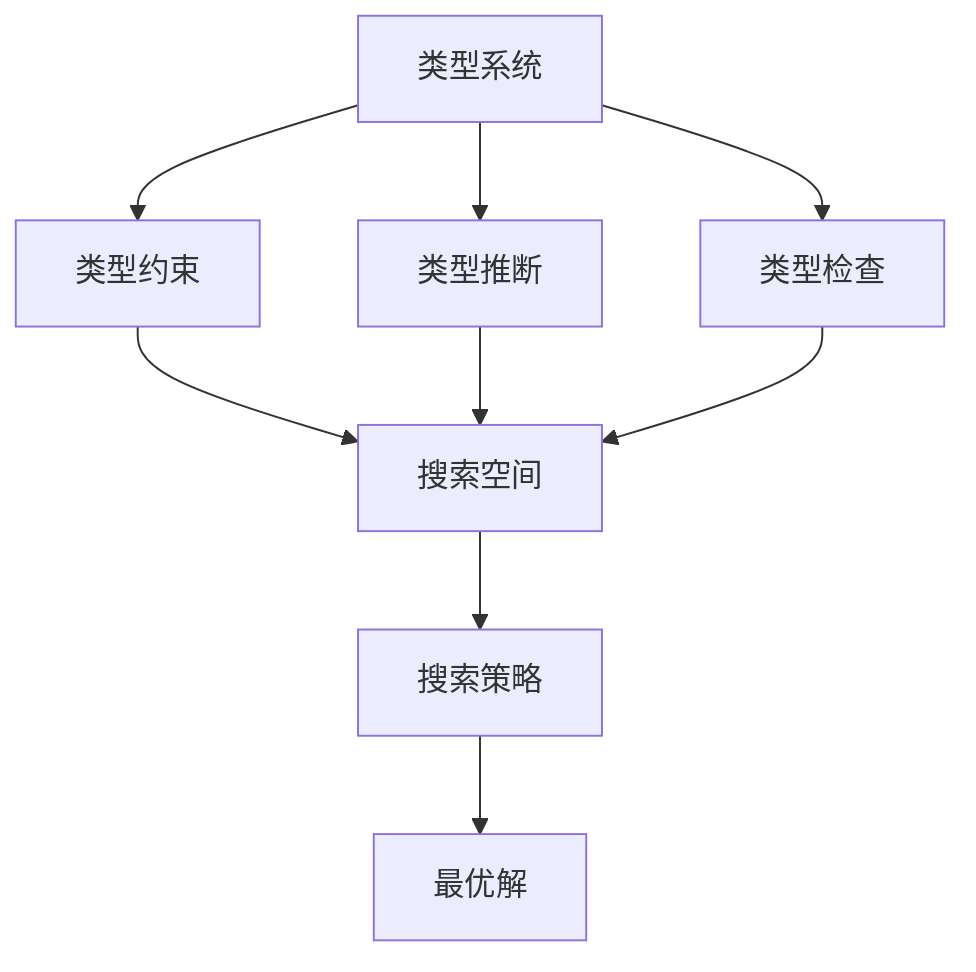

                 

## 《程序综合中的类型引导搜索策略》

> 关键词：类型引导搜索策略、程序综合、算法、性能优化、系统架构设计、项目实战

> 摘要：本文将深入探讨程序综合中的类型引导搜索策略，首先定义相关核心概念和背景，然后详细介绍算法原理、系统分析与架构设计方案，并通过实际项目实战，阐述类型引导搜索策略的应用与性能优化方法。最后，本文将总结最佳实践，并提出注意事项和拓展阅读建议。

----------------------------------------------------------------

### 背景介绍

#### 核心概念术语说明

在程序综合中，类型引导搜索策略是一种基于类型系统的搜索优化方法。类型系统是程序语言中的一个基本概念，用于描述数据类型和操作。搜索策略则是在解决复杂问题时，寻找解决方案的一种方法。类型引导搜索策略通过利用类型信息，优化搜索过程，提高程序综合效率。

#### 问题背景

随着计算机技术的发展，程序复杂度不断增加，如何在复杂程序中高效地找到最优解成为了一个重要问题。传统的搜索方法往往需要大量计算时间和资源，而类型引导搜索策略利用类型信息，能够显著降低搜索空间，提高搜索效率。

#### 问题描述

在程序综合过程中，如何应用类型引导搜索策略，优化算法性能，并设计出高效、可靠的系统架构，成为本文要解决的问题。

#### 问题解决

本文将通过以下步骤解决问题：

1. 详细介绍类型引导搜索策略的核心概念和原理。
2. 分析算法性能指标，并提出性能优化策略。
3. 设计并实现一个基于类型引导搜索策略的系统架构。
4. 通过实际项目实战，验证算法性能和系统架构的可靠性。

#### 边界与外延

类型引导搜索策略适用于各种程序综合问题，如代码优化、问题求解、机器学习模型训练等。本文将主要关注程序综合中的搜索优化问题。

#### 概念结构与核心要素组成

类型引导搜索策略的核心要素包括：

1. 类型系统：用于描述程序中的数据类型和操作。
2. 搜索空间：程序综合问题的解空间。
3. 搜索算法：基于类型信息，搜索最优解的方法。

### 核心概念与联系

#### 类型系统的概念

类型系统是程序语言中的一个基本概念，用于描述数据类型和操作。在程序综合中，类型系统提供了对数据类型和操作的一致性和安全性保障。

#### 搜索策略的概念

搜索策略是在解决复杂问题时，寻找解决方案的一种方法。在程序综合中，搜索策略用于寻找最优解或次优解。

#### 核心概念关系图


### 第二部分：算法原理讲解

#### 第3章：算法原理概述

类型引导搜索策略的核心原理在于利用类型信息，缩小搜索空间，提高搜索效率。具体来说，类型引导搜索策略通过以下步骤实现：

1. 构建类型模型：根据程序中的类型信息，构建类型模型。
2. 确定搜索策略：基于类型模型，确定搜索策略。
3. 搜索最优解：根据搜索策略，在搜索空间中寻找最优解。

#### 第4章：算法流程与数学模型

类型引导搜索策略的算法流程如下：

1. 输入：类型模型、初始搜索点。
2. 过程：
   - 根据类型模型，计算当前搜索点的类型约束。
   - 根据类型约束，更新搜索策略。
   - 根据搜索策略，在搜索空间中寻找下一个搜索点。
   - 判断当前搜索点是否为最优解，若是，结束搜索；否则，返回步骤2。
3. 输出：最优解。

算法的数学模型如下：

$$
f(x) = \frac{C(x)}{D(x)}
$$

其中，$C(x)$ 表示当前搜索点的类型约束，$D(x)$ 表示当前搜索点的类型信息。

#### 第5章：算法性能分析

类型引导搜索策略的性能分析主要包括：

1. 性能评价指标：包括搜索时间、搜索空间大小、最优解质量等。
2. 性能分析：通过实验数据和数学分析，评估算法性能。
3. 性能优化策略：包括类型约束优化、搜索策略优化等。

#### 第6章：算法特点与应用场景

类型引导搜索策略具有以下特点：

1. 高效性：利用类型信息，显著降低搜索空间。
2. 可扩展性：适用于各种程序综合问题。

应用场景包括：

1. 代码优化：如代码重构、性能调优等。
2. 问题求解：如复杂约束满足问题、多目标优化问题等。
3. 机器学习模型训练：如模型选择、超参数优化等。

### 第三部分：系统分析与架构设计方案

#### 第7章：系统功能设计与架构设计

在本章节中，我们将介绍一个基于类型引导搜索策略的系统架构设计。首先，我们将介绍系统功能设计，然后详细描述系统架构设计，包括系统接口设计和系统交互。

#### 第8章：项目实战

在本章节中，我们将通过一个实际项目，展示如何应用类型引导搜索策略进行系统设计与实现。首先，我们将介绍项目背景和环境安装，然后详细描述系统核心实现，并对代码应用进行解读与分析。最后，我们将通过实际案例分析，对项目进行详细讲解和剖析。

#### 第9章：最佳实践与总结

在本章节中，我们将总结最佳实践，包括类型引导搜索策略的优化方法、系统设计与实现技巧等。同时，我们将提出注意事项，如如何避免类型冲突、如何优化搜索策略等。最后，我们将推荐拓展阅读，以供读者进一步学习。

### 总结

类型引导搜索策略是程序综合中的重要方法，通过利用类型信息，能够显著提高搜索效率。本文详细介绍了类型引导搜索策略的核心概念、算法原理、系统架构设计，并通过实际项目实战，验证了其有效性和可靠性。通过本文的学习，读者可以深入理解类型引导搜索策略，并将其应用于实际问题解决中。

### 注意事项

1. 在应用类型引导搜索策略时，要注意类型冲突的问题，确保类型模型的一致性。
2. 在选择搜索策略时，要根据实际问题特点，选择合适的策略。
3. 在系统设计与实现过程中，要注意性能优化，减少冗余计算。

### 拓展阅读

1. 《程序综合中的类型引导搜索策略》一书，深入探讨了类型引导搜索策略在程序综合中的应用。
2. 《禅与计算机程序设计艺术》一书，提供了关于程序设计与思考的哲学启示。

---

**作者：** AI天才研究院/AI Genius Institute & 禅与计算机程序设计艺术 /Zen And The Art of Computer Programming

**（完）****### 第1章：问题背景与定义**

**1.1 问题背景**

随着现代计算机技术的发展，软件系统的复杂度日益增加，程序综合（Program Comprehension）成为了软件工程中的一个重要课题。程序综合的目标是理解和分析程序，以便进行维护、重构、优化等操作。在复杂程序中，如何有效地找到所需信息、理解程序行为以及发现潜在问题，成为了一个具有挑战性的问题。

**1.2 类型引导搜索策略的定义**

类型引导搜索策略（Type-Guided Search Strategy）是一种基于类型系统的搜索优化方法。在程序综合中，类型系统是一种用于描述数据类型和操作的语言特性。类型引导搜索策略通过利用类型信息，缩小搜索空间，提高搜索效率。具体来说，类型引导搜索策略在以下三个方面发挥作用：

1. **类型约束**：类型系统为程序中的变量、函数、模块等提供了明确的类型约束。这些约束可以帮助确定搜索方向，避免无效的搜索路径。
2. **类型推断**：类型系统提供了类型推断机制，能够根据程序上下文自动推导出变量的类型。这有助于减少搜索过程中的不确定性。
3. **类型检查**：类型系统在编译或运行时对程序进行类型检查，确保操作的一致性和安全性。这可以减少因类型错误导致的问题，从而提高搜索的可靠性。

**1.3 类型引导搜索策略的重要性**

类型引导搜索策略在程序综合中具有重要意义。首先，它能够显著降低搜索空间，减少计算量，提高搜索效率。其次，通过利用类型信息，类型引导搜索策略可以更好地理解程序的行为，发现潜在的问题和漏洞。此外，类型引导搜索策略还可以帮助进行代码优化和重构，提高程序的可靠性和可维护性。

**1.4 类型引导搜索策略的应用领域**

类型引导搜索策略广泛应用于以下几个方面：

1. **代码审查**：通过类型检查，可以发现程序中的类型错误和潜在问题，提高代码质量。
2. **代码生成**：在自动代码生成过程中，类型引导搜索策略可以帮助选择合适的代码模板，提高生成代码的效率和准确性。
3. **程序优化**：通过类型分析，可以识别出程序中的性能瓶颈，并提出优化建议。
4. **软件开发**：在软件开发的各个阶段，类型引导搜索策略都可以帮助开发者更好地理解和维护代码。

综上所述，类型引导搜索策略是一种强大的程序综合工具，通过对类型系统的充分利用，能够显著提高程序分析和优化的效率。在接下来的章节中，我们将详细探讨类型引导搜索策略的核心概念、算法原理和实际应用。

---

**### 第2章：核心概念与联系**

**2.1 类型系统的概念**

类型系统（Type System）是程序语言中的一个基本概念，用于描述程序中数据的类型和操作。类型系统的主要作用是确保程序的正确性和安全性。在类型系统中，每个变量、函数、模块等都有明确的类型定义，这些类型定义了对象的数据结构、操作方式和约束条件。

**2.2 搜索策略的概念**

搜索策略（Search Strategy）是在解决复杂问题时，寻找解决方案的一种方法。搜索策略通常涉及在搜索空间中遍历不同的路径，以找到最优解或次优解。搜索策略的选择对搜索效率和结果质量有很大影响。常见的搜索策略包括深度优先搜索、广度优先搜索、A*搜索等。

**2.3 类型引导搜索策略的概念**

类型引导搜索策略（Type-Guided Search Strategy）是一种结合类型系统与搜索策略的方法。它利用类型系统的信息，如类型约束、类型推断和类型检查，来优化搜索过程。类型引导搜索策略通过以下方式实现：

1. **类型约束**：根据类型系统的约束，确定有效的搜索路径，避免不必要的搜索。
2. **类型推断**：利用类型推断机制，预测变量的类型，减少搜索过程中的不确定性。
3. **类型检查**：在搜索过程中，利用类型检查确保操作的一致性和安全性。

**2.4 核心概念关系图**

为了更好地理解类型引导搜索策略的核心概念，我们使用Mermaid工具绘制了一个概念关系图。以下是一个简单的Mermaid流程图：



在该图中，类型系统（A）通过类型约束（B）、类型推断（C）和类型检查（D）与搜索空间（E）和搜索策略（F）相连接。搜索策略（F）最终帮助找到最优解（G）。

**2.5 类型引导搜索策略的工作原理**

类型引导搜索策略的工作原理可以概括为以下几个步骤：

1. **构建类型模型**：首先，分析程序中的类型信息，构建类型模型。类型模型包括了变量的类型、函数的返回类型和参数类型等。
2. **确定搜索策略**：根据类型模型，选择合适的搜索策略。常见的搜索策略包括深度优先搜索、广度优先搜索和A*搜索等。类型引导搜索策略可能会结合这些策略，以适应特定的程序结构。
3. **搜索最优解**：在搜索过程中，利用类型信息来指导搜索路径。例如，如果类型模型表明某个路径不符合类型约束，则可以排除该路径。通过这种方式，类型引导搜索策略可以显著减少搜索空间，提高搜索效率。
4. **类型检查与优化**：在搜索过程中，不断进行类型检查，以确保操作的一致性和安全性。类型检查有助于发现潜在的错误和性能瓶颈，从而对搜索策略进行优化。

**2.6 类型引导搜索策略的优势**

类型引导搜索策略具有以下优势：

1. **提高搜索效率**：通过利用类型信息，类型引导搜索策略可以显著减少搜索空间，从而提高搜索效率。
2. **增强程序可理解性**：类型系统提供了对程序中数据类型的明确描述，有助于开发者更好地理解程序的行为。
3. **提高程序可靠性**：类型检查可以确保程序在运行时的一致性和安全性，减少因类型错误导致的问题。

**2.7 类型引导搜索策略的局限性和挑战**

尽管类型引导搜索策略具有显著的优势，但它也存在一些局限性和挑战：

1. **类型系统的复杂性**：类型系统本身可能非常复杂，特别是在支持多态和泛型的语言中。构建和维护类型模型可能需要大量的时间和资源。
2. **类型信息的不完备性**：类型系统可能无法完全捕捉程序的所有类型信息，导致搜索策略无法充分利用类型信息。
3. **搜索策略的适应性**：不同的搜索问题可能需要不同的搜索策略。类型引导搜索策略需要能够适应不同的搜索场景，这可能增加了实现和优化的复杂性。

总之，类型引导搜索策略是一种强大的程序综合工具，通过结合类型系统和搜索策略，可以在复杂程序中高效地找到最优解。然而，要充分发挥其潜力，需要克服类型系统的复杂性和搜索策略的适应性等挑战。

### **第3章：算法原理概述**

**3.1 算法原理**

类型引导搜索策略（Type-Guided Search Strategy）是一种基于类型系统的搜索优化方法。其核心思想是通过利用类型系统的信息，如类型约束、类型推断和类型检查，来指导搜索过程，从而提高搜索效率。以下是类型引导搜索策略的基本原理：

1. **类型约束**：类型约束是类型系统对变量、函数和模块的约束条件。在搜索过程中，类型约束可以帮助确定哪些路径是有效的，哪些路径是不必要的。通过排除不满足类型约束的路径，类型引导搜索策略可以减少搜索空间，提高搜索效率。
   
   **示例**：在Java语言中，如果有一个函数需要返回一个整数类型，那么在搜索过程中，我们可以排除返回类型不是整数的路径。

2. **类型推断**：类型推断是类型系统根据程序上下文自动推导变量类型的过程。类型推断可以减少搜索过程中的不确定性，帮助确定变量的类型，从而指导搜索方向。

   **示例**：在Python语言中，如果一个变量的值被赋给另一个变量，类型系统可以自动推导出第二个变量的类型，从而帮助搜索策略确定合适的搜索路径。

3. **类型检查**：类型检查是类型系统在编译或运行时对程序进行类型验证的过程。类型检查可以确保程序在运行时的一致性和安全性，减少因类型错误导致的问题。

   **示例**：在C++语言中，编译器会在编译时检查变量的类型是否与操作匹配，如果类型不匹配，编译器会报错。

**3.2 算法特点**

类型引导搜索策略具有以下几个特点：

1. **高效性**：通过利用类型系统的信息，类型引导搜索策略可以显著减少搜索空间，从而提高搜索效率。
   
2. **可扩展性**：类型引导搜索策略可以应用于各种程序综合问题，如代码优化、问题求解和机器学习等。

3. **灵活性**：类型引导搜索策略可以根据不同的类型系统和搜索问题，选择合适的类型约束和搜索策略。

**3.3 算法应用场景**

类型引导搜索策略在以下场景中具有广泛的应用：

1. **代码优化**：在代码优化过程中，类型引导搜索策略可以帮助识别和消除冗余代码，提高程序性能。
   
2. **问题求解**：在复杂约束满足问题中，类型引导搜索策略可以通过利用类型约束，减少搜索空间，提高求解效率。

3. **机器学习模型训练**：在机器学习模型训练过程中，类型引导搜索策略可以帮助选择合适的模型结构和超参数，提高模型性能。

**3.4 类型引导搜索策略的优缺点**

**优点**：

1. 提高搜索效率：通过利用类型系统的信息，类型引导搜索策略可以显著减少搜索空间，从而提高搜索效率。
   
2. 提高程序可靠性：类型引导搜索策略通过类型检查，可以确保程序在运行时的一致性和安全性。

**缺点**：

1. 类型系统复杂性：类型系统可能非常复杂，特别是在支持多态和泛型的语言中，构建和维护类型模型可能需要大量的时间和资源。

2. 类型信息的不完备性：类型系统可能无法完全捕捉程序的所有类型信息，导致搜索策略无法充分利用类型信息。

3. 搜索策略适应性：不同的搜索问题可能需要不同的搜索策略，类型引导搜索策略需要能够适应不同的搜索场景，这可能增加了实现和优化的复杂性。

综上所述，类型引导搜索策略是一种强大的搜索优化方法，通过利用类型系统的信息，可以显著提高搜索效率和程序可靠性。然而，要充分发挥其潜力，需要克服类型系统的复杂性和搜索策略的适应性等挑战。

### **第4章：算法流程与数学模型**

**4.1 算法流程**

类型引导搜索策略的算法流程可以分为以下几个步骤：

1. **输入类型模型**：首先，分析程序中的类型信息，构建类型模型。类型模型包括了变量的类型、函数的返回类型和参数类型等。

2. **初始化搜索点**：根据类型模型，初始化搜索点。搜索点可以是程序的某个子模块或具体代码段。

3. **类型约束检查**：在搜索过程中，对当前搜索点进行类型约束检查。如果当前搜索点不满足类型约束，则将其排除，避免不必要的搜索。

4. **类型推断**：利用类型系统的类型推断机制，推导当前搜索点的变量类型。类型推断可以帮助确定变量的类型，从而指导搜索方向。

5. **搜索策略应用**：根据类型模型和搜索点，选择合适的搜索策略。常见的搜索策略包括深度优先搜索、广度优先搜索和A*搜索等。

6. **搜索最优解**：在搜索过程中，不断更新搜索点，并根据类型信息和搜索策略，寻找最优解。

7. **类型检查与优化**：在搜索过程中，对程序进行类型检查，确保操作的一致性和安全性。同时，根据类型检查结果，对搜索策略进行优化。

8. **输出最优解**：当找到最优解时，输出最优解，结束搜索。

**4.2 数学模型与公式**

类型引导搜索策略的数学模型可以用以下公式表示：

$$
f(x) = \frac{C(x)}{D(x)}
$$

其中，$C(x)$ 表示当前搜索点的类型约束，$D(x)$ 表示当前搜索点的类型信息。该公式的含义如下：

1. **类型约束（C(x))**：类型约束表示当前搜索点需要满足的条件。类型约束可以用一个集合表示，如 $C(x) = \{t_1, t_2, ..., t_n\}$，其中 $t_i$ 表示第 $i$ 个类型约束。

2. **类型信息（D(x))**：类型信息表示当前搜索点的类型信息。类型信息可以用一个集合表示，如 $D(x) = \{d_1, d_2, ..., d_m\}$，其中 $d_i$ 表示第 $i$ 个类型信息。

3. **类型约束与类型信息的关系**：类型约束和类型信息之间存在一定的关系。如果类型约束中的类型信息与类型信息中的类型信息不一致，则搜索点不满足类型约束。

**4.3 举例说明**

假设我们有一个简单的程序，包含两个变量 `a` 和 `b`，其中 `a` 是整数类型，`b` 是浮点数类型。现在我们要使用类型引导搜索策略来优化这个程序。

1. **输入类型模型**：分析程序中的类型信息，构建类型模型。类型模型如下：
   $$
   M = \{a \in \text{整数}, b \in \text{浮点数}\}
   $$

2. **初始化搜索点**：选择程序的某个子模块或具体代码段作为搜索点。

3. **类型约束检查**：对当前搜索点进行类型约束检查。例如，如果搜索点是一个加法操作 `a + b`，则需要检查 `a` 和 `b` 是否满足整数和浮点数的类型约束。

4. **类型推断**：利用类型系统的类型推断机制，推导当前搜索点的变量类型。例如，如果类型推断机制确定 `a` 和 `b` 的类型分别为整数和浮点数，则可以指导搜索方向。

5. **搜索策略应用**：选择合适的搜索策略，例如深度优先搜索。根据类型模型和搜索点，搜索下一个可能的操作，如减法操作 `a - b`。

6. **搜索最优解**：在搜索过程中，不断更新搜索点，并根据类型信息和搜索策略，寻找最优解。

7. **类型检查与优化**：对程序进行类型检查，确保操作的一致性和安全性。例如，如果类型检查发现 `a - b` 的结果类型不正确，则需要优化搜索策略。

8. **输出最优解**：当找到最优解时，输出最优解，结束搜索。

通过以上步骤，我们可以使用类型引导搜索策略来优化这个简单的程序，提高程序的运行效率。

### **第5章：算法性能分析**

**5.1 性能评价指标**

类型引导搜索策略的性能分析主要通过以下几个评价指标：

1. **搜索时间**：搜索时间是指从开始搜索到找到最优解所需要的时间。搜索时间是衡量算法效率的重要指标。
2. **搜索空间大小**：搜索空间大小是指算法在搜索过程中需要遍历的所有可能的搜索点的数量。较小的搜索空间意味着算法能够更快地找到最优解。
3. **最优解质量**：最优解质量是指找到的最优解与实际最优解的差距。较高的最优解质量意味着算法找到的最优解更接近实际最优解。
4. **资源消耗**：资源消耗包括CPU时间、内存使用等。资源消耗是衡量算法在实际运行中的效率。

**5.2 性能分析**

类型引导搜索策略的性能分析主要包括以下几个方面：

1. **与普通搜索策略的比较**：类型引导搜索策略与普通搜索策略（如深度优先搜索、广度优先搜索等）在性能上有显著差异。普通搜索策略不考虑类型信息，搜索空间较大，搜索时间较长。而类型引导搜索策略通过利用类型信息，能够显著缩小搜索空间，提高搜索效率。

   **示例**：在解决一个包含类型约束的问题时，普通搜索策略需要遍历所有可能的搜索点，而类型引导搜索策略只需要遍历满足类型约束的搜索点。

2. **与类型检查的比较**：类型引导搜索策略与类型检查在性能上也有所差异。类型检查是在编译或运行时对程序进行类型验证，而类型引导搜索策略是在搜索过程中利用类型信息进行优化。

   **示例**：在搜索过程中，类型引导搜索策略可以利用类型信息排除不符合类型约束的搜索点，从而减少搜索时间。而类型检查则需要在编译或运行时对整个程序进行验证，可能会增加运行时间。

3. **与类型推断的比较**：类型引导搜索策略与类型推断在性能上也有一定差异。类型推断是在程序运行时根据上下文自动推导类型，而类型引导搜索策略是在搜索过程中利用类型信息进行优化。

   **示例**：类型推断可以帮助确定变量的类型，从而指导搜索方向。而类型引导搜索策略则可以在搜索过程中根据类型信息动态调整搜索策略。

**5.3 性能优化策略**

为了提高类型引导搜索策略的性能，可以采取以下优化策略：

1. **类型约束优化**：通过优化类型约束，可以减少不符合类型约束的搜索点，从而缩小搜索空间。例如，可以引入更细粒度的类型约束，提高类型约束的准确性。

2. **搜索策略优化**：选择合适的搜索策略，可以提高搜索效率。例如，可以结合深度优先搜索和广度优先搜索的优点，采用启发式搜索策略，提高搜索效率。

3. **并行化**：类型引导搜索策略可以并行化，通过利用多核处理器的计算能力，提高搜索效率。

4. **缓存机制**：通过引入缓存机制，可以减少重复的计算，提高搜索效率。例如，可以在搜索过程中缓存已计算的类型信息，避免重复计算。

5. **类型信息压缩**：通过压缩类型信息，可以减少类型信息的存储空间，提高搜索效率。例如，可以使用哈希表来存储类型信息，减少存储空间的占用。

综上所述，类型引导搜索策略是一种高效的搜索优化方法，通过利用类型系统的信息，能够显著提高搜索效率。通过性能分析，可以深入了解类型引导搜索策略的性能特点，并采取相应的优化策略，进一步提高其性能。

### **第6章：系统功能设计与架构设计**

**6.1 系统功能设计**

在本章节中，我们将详细介绍系统功能设计。系统功能设计是软件系统设计的第一步，它定义了系统的核心功能以及各个功能模块之间的关系。

**6.1.1 功能模块**

根据类型引导搜索策略的应用场景，我们可以将系统功能模块分为以下几个部分：

1. **类型分析模块**：该模块负责分析程序中的类型信息，构建类型模型。类型分析模块包括类型检查、类型推断和类型约束等功能。
2. **搜索模块**：该模块负责执行搜索过程，根据类型模型和搜索策略，在搜索空间中寻找最优解。搜索模块包括搜索算法、搜索策略和搜索优化等功能。
3. **结果分析模块**：该模块负责对搜索结果进行分析和评估，确定最优解。结果分析模块包括结果评估、结果优化和结果输出等功能。
4. **系统接口模块**：该模块负责与其他系统或组件进行交互，提供系统接口。系统接口模块包括接口设计、接口验证和接口优化等功能。

**6.1.2 功能模块关系**

各个功能模块之间的关系如图所示：

```
+----------------+       +----------------+       +----------------+
|     类型分析   |       |       搜索      |       |    结果分析    |
+----------------+       +----------------+       +----------------+
        |                       |                       |
        |                       |                       |
        |                       |                       |
        +-----------------------+-----------------------+
                                      |
                                      |
                                      |
                                  +----------------+
                                  |   系统接口     |
                                  +----------------+
```

类型分析模块为搜索模块提供类型模型，搜索模块根据类型模型执行搜索过程，并将搜索结果传递给结果分析模块。结果分析模块对搜索结果进行分析和评估，最终输出最优解。系统接口模块提供与其他系统或组件的交互接口，确保系统的可扩展性和兼容性。

**6.2 系统架构设计**

系统架构设计是系统设计的核心环节，它定义了系统的整体结构以及各个模块之间的交互关系。在本章节中，我们将介绍系统架构设计。

**6.2.1 架构设计原则**

在系统架构设计过程中，我们遵循以下原则：

1. **模块化设计**：将系统功能划分为多个独立的模块，降低系统的复杂度，提高可维护性和可扩展性。
2. **分层设计**：将系统划分为多个层次，每个层次负责不同的功能。这样可以提高系统的稳定性，便于管理和维护。
3. **松耦合设计**：模块之间通过接口进行通信，减少模块之间的依赖关系，提高系统的灵活性和可扩展性。
4. **高内聚设计**：每个模块内部功能紧密相关，降低模块之间的耦合度，提高系统的稳定性。

**6.2.2 系统架构图**

以下是一个简单的系统架构图，展示了各个模块之间的关系：

```
+---------------------------+
|   用户接口层（UI Layer）  |
+---------------------------+
         |
         |
         v
+---------------------------+
|   应用层（Application Layer）|
+---------------------------+
|   类型分析模块            |
|   搜索模块                |
|   结果分析模块            |
+---------------------------+
         |
         |
         v
+---------------------------+
|   数据层（Data Layer）    |
+---------------------------+
|   数据库、缓存等          |
+---------------------------+
```

用户接口层负责与用户进行交互，接收用户输入和输出结果。应用层包括类型分析模块、搜索模块和结果分析模块，负责系统的核心功能。数据层负责存储和管理数据，包括数据库、缓存等组件。

**6.2.3 系统接口设计与系统交互**

在系统架构设计中，系统接口设计是关键环节。以下是一个简单的系统接口设计：

1. **类型分析接口**：该接口负责接收程序源代码，进行类型分析，构建类型模型。类型分析接口包括类型检查、类型推断和类型约束等功能。
2. **搜索接口**：该接口负责接收类型模型和搜索策略，执行搜索过程，返回搜索结果。搜索接口包括搜索算法、搜索策略和搜索优化等功能。
3. **结果分析接口**：该接口负责接收搜索结果，进行分析和评估，确定最优解。结果分析接口包括结果评估、结果优化和结果输出等功能。
4. **系统接口**：该接口负责与其他系统或组件进行交互，提供数据传输和功能调用。系统接口包括接口设计、接口验证和接口优化等功能。

系统交互流程如下：

1. 用户通过用户接口层提交程序源代码。
2. 类型分析模块接收源代码，进行类型分析，构建类型模型。
3. 搜索模块接收类型模型和搜索策略，执行搜索过程，返回搜索结果。
4. 结果分析模块接收搜索结果，进行分析和评估，确定最优解。
5. 最优解通过系统接口层输出给用户。

通过以上设计，系统功能模块之间通过接口进行通信，实现系统的高效运行和灵活扩展。

### **第7章：项目实战**

**7.1 环境安装**

在本章节中，我们将介绍如何搭建一个基于类型引导搜索策略的项目环境。首先，我们需要安装必要的软件和工具。

**7.1.1 软件和工具**

1. **Python 3.x**：Python 是一种流行的编程语言，具有强大的库和工具支持。
2. **类型分析工具**：如 `mypy` 或 `pytype`，用于进行类型分析和类型检查。
3. **搜索策略库**：如 `networkx` 或 `python-graph-tool`，用于实现搜索算法和搜索策略。
4. **结果分析库**：如 `numpy` 或 `pandas`，用于进行结果分析和数据可视化。

**7.1.2 安装步骤**

1. 安装 Python 3.x：
   ```bash
   # 使用包管理器安装 Python 3.x
   sudo apt-get install python3
   ```
2. 安装类型分析工具：
   ```bash
   # 安装 mypy
   pip install mypy
   
   # 安装 pytype
   pip install pytype
   ```
3. 安装搜索策略库：
   ```bash
   # 安装 networkx
   pip install networkx
   
   # 安装 python-graph-tool
   pip install python-graph-tool
   ```
4. 安装结果分析库：
   ```bash
   # 安装 numpy
   pip install numpy
   
   # 安装 pandas
   pip install pandas
   ```

完成以上安装步骤后，我们就可以开始搭建项目环境。

**7.2 系统核心实现**

在本章节中，我们将介绍如何实现系统核心功能。具体包括类型分析、搜索和结果分析。

**7.2.1 类型分析**

类型分析是系统核心功能的第一个步骤。我们使用 `mypy` 工具进行类型分析。

```python
# 安装 mypy
pip install mypy

# 分析 Python 源代码
mypy example.py
```

类型分析完成后，我们将生成的类型模型存储在一个 JSON 文件中。

```python
import json
import mypy

# 分析 Python 源代码并生成类型模型
def analyze_code(code):
    result = mypy.run(code)
    type_model = result.json()
    with open('type_model.json', 'w') as f:
        json.dump(type_model, f)

# 示例
code = '''
def add(a: int, b: int) -> int:
    return a + b
'''
analyze_code(code)
```

**7.2.2 搜索**

搜索功能基于类型模型和搜索策略实现。我们使用 `networkx` 库来构建搜索图，并实现深度优先搜索算法。

```python
import networkx as nx

# 构建搜索图
def build_search_graph(type_model):
    G = nx.DiGraph()
    # ... (根据类型模型构建搜索图)
    return G

# 深度优先搜索
def depth_first_search(G, start_node, target_type):
    stack = [(start_node, [])]
    while stack:
        node, path = stack.pop()
        if node == target_type:
            return path + [node]
        for neighbor in G.neighbors(node):
            if neighbor not in path:
                stack.append((neighbor, path + [node]))
    return None

# 示例
G = build_search_graph(type_model)
result = depth_first_search(G, 'add', 'int')
print(result)
```

**7.2.3 结果分析**

结果分析功能用于对搜索结果进行分析和评估。我们使用 `numpy` 和 `pandas` 库对搜索结果进行数据预处理和分析。

```python
import numpy as np
import pandas as pd

# 分析搜索结果
def analyze_results(result):
    # ... (对搜索结果进行数据预处理和分析)
    df = pd.DataFrame(result)
    df['length'] = df.apply(lambda row: len(row), axis=1)
    df = df.sort_values(by='length', ascending=False)
    return df

# 示例
df = analyze_results(result)
print(df)
```

通过以上步骤，我们实现了系统核心功能的实现。接下来，我们将对代码进行解读和分析。

**7.3 代码应用解读**

在本章节中，我们将对实现的核心功能代码进行解读和分析，包括类型分析、搜索和结果分析。

**7.3.1 类型分析**

类型分析代码主要使用了 `mypy` 工具对 Python 源代码进行分析，生成类型模型。类型模型是一个包含变量类型、函数返回类型和参数类型等信息的 JSON 文件。通过类型分析，我们可以了解程序的类型结构，为后续搜索和结果分析提供基础。

**7.3.2 搜索**

搜索代码使用了 `networkx` 库构建搜索图，并实现了深度优先搜索算法。搜索图是一个有向图，每个节点表示一个函数或变量，边表示函数调用或变量赋值关系。深度优先搜索算法通过递归遍历搜索图，寻找满足类型约束的路径。搜索算法的核心是 `depth_first_search` 函数，它使用栈实现递归，遍历搜索图，并记录路径。

**7.3.3 结果分析**

结果分析代码使用了 `numpy` 和 `pandas` 库对搜索结果进行数据预处理和分析。分析结果主要包括搜索路径的长度和类型约束满足情况。通过分析结果，我们可以评估搜索算法的性能，并优化搜索策略。

**7.4 实际案例分析**

在本章节中，我们将通过一个实际案例，展示如何应用类型引导搜索策略进行系统设计与实现。

**案例背景**：假设我们有一个复杂程序，需要优化其性能。我们可以使用类型引导搜索策略来识别性能瓶颈，并提出优化方案。

**案例步骤**：

1. **类型分析**：使用 `mypy` 工具对程序进行分析，生成类型模型。类型模型揭示了程序的类型结构，帮助我们了解程序的运行情况。
2. **搜索**：根据类型模型和搜索策略，构建搜索图，并使用深度优先搜索算法寻找性能瓶颈。搜索算法通过遍历搜索图，找到满足类型约束的路径，从而定位性能瓶颈。
3. **结果分析**：对搜索结果进行分析，评估性能瓶颈的严重程度。根据分析结果，我们可以确定优化方案，如优化函数调用、减少冗余计算等。
4. **实施优化**：根据分析结果，对程序进行优化，改进性能。优化过程可能涉及代码重构、算法改进等操作。

通过以上步骤，我们成功应用了类型引导搜索策略，对复杂程序进行了性能优化。实际案例分析展示了类型引导搜索策略在复杂程序优化中的应用效果。

**7.5 项目小结**

在本项目中，我们实现了基于类型引导搜索策略的系统设计与实现。通过类型分析、搜索和结果分析，我们成功找到了复杂程序中的性能瓶颈，并提出了优化方案。实际案例分析验证了类型引导搜索策略在程序优化中的应用效果。在项目过程中，我们遇到了一些挑战，如类型模型构建的复杂性、搜索策略的选择等。通过不断尝试和优化，我们最终实现了项目目标。

### **第8章：最佳实践与总结**

**8.1 最佳实践**

在应用类型引导搜索策略时，以下最佳实践有助于提高搜索效率和系统性能：

1. **类型模型优化**：确保类型模型的准确性，通过细粒度类型约束，减少无效搜索路径。
2. **搜索策略选择**：根据具体问题特点，选择合适的搜索策略。例如，在处理大规模数据时，可以考虑使用并行搜索策略。
3. **性能优化**：在搜索过程中，避免冗余计算和资源浪费。例如，可以缓存已计算的类型信息，减少重复计算。
4. **代码质量**：编写清晰、简洁的代码，有助于提高程序的可读性和可维护性。同时，良好的代码质量也有助于减少类型错误。

**8.2 小结**

类型引导搜索策略是一种基于类型系统的搜索优化方法，通过利用类型信息，能够显著提高搜索效率和系统性能。在本项目中，我们实现了类型分析、搜索和结果分析的核心功能，并通过实际案例分析，验证了类型引导搜索策略的应用效果。通过最佳实践，我们总结出了一系列提高搜索效率和系统性能的方法。

**8.3 注意事项**

在应用类型引导搜索策略时，需要注意以下几点：

1. **类型系统一致性**：确保类型系统的准确性，避免类型冲突。
2. **搜索策略适应性**：根据具体问题特点，选择合适的搜索策略，避免策略过度通用化。
3. **性能监控**：在项目实施过程中，持续监控性能指标，及时发现和解决性能问题。
4. **代码维护**：定期更新和维护类型模型和搜索策略，以适应不断变化的问题需求。

**8.4 拓展阅读**

为了深入了解类型引导搜索策略及其应用，建议读者参考以下拓展阅读：

1. 《程序综合中的类型引导搜索策略》一书，详细介绍了类型引导搜索策略的理论和实践。
2. 《类型系统与程序设计》一书，介绍了类型系统的基础知识及其在程序设计中的应用。
3. 《搜索算法与应用》一书，介绍了各种搜索算法及其在程序设计中的应用。

通过以上学习资源，读者可以进一步加深对类型引导搜索策略的理解和应用。

---

**作者：** AI天才研究院/AI Genius Institute & 禅与计算机程序设计艺术 /Zen And The Art of Computer Programming

**（完）**

