                 

Alright, let's think step by step to create a comprehensive and detailed article on "程序综合：自动化编程的新前沿". Here's a structured approach for each section of the article:

----------------------------------------------------------------

## 文章标题

“程序综合：自动化编程的新前沿”

### 关键词

- 自动化编程
- 编程自动化工具
- 代码生成
- 人工智能
- 微服务架构
- 低代码/无代码平台
- 自动化测试
- 自动化部署
- 自动化运维
- 安全风险管理
- 未来发展趋势

### 摘要

本文深入探讨了自动化编程的背景、核心技术、新趋势、实际应用、安全与风险管理，以及未来发展方向。通过详细的案例分析、算法原理讲解、系统架构设计和实战指导，旨在为开发者提供全面的自动化编程知识体系，帮助读者掌握自动化编程的最新技术和最佳实践。

----------------------------------------------------------------

### 第一部分: 程序综合概述

#### 第1章: 自动化编程的背景与挑战

##### 1.1 自动化编程的概念

**背景介绍**

- **术语说明**：自动化编程是指通过编程工具、框架和技术自动生成、优化和部署代码的过程。
- **问题背景**：随着软件开发的复杂性不断增加，手动编程效率低下，难以满足快速迭代和市场需求。
- **问题描述**：如何提高编程效率，降低开发成本，提高代码质量和可维护性？
- **问题解决**：自动化编程通过自动化工具和流程解决上述问题。
- **边界与外延**：自动化编程涉及代码生成、自动化测试、自动化部署等领域。
- **概念结构与核心要素组成**：自动化编程包括工具、算法、框架、流程等核心要素。

##### 1.2 现代编程面临的挑战

**核心概念与联系**

- **概念原理**：现代编程面临的挑战主要包括开发效率低、代码质量差、维护成本高、跨平台兼容性差等。
- **概念属性特征对比表格**：

| 特征         | 传统编程           | 自动化编程           |
| ------------ | ------------------ | ------------------- |
| 开发效率     | 低                | 高                 |
| 代码质量     | 差                | 好                 |
| 维护成本     | 高                | 低                 |
| 跨平台兼容性 | 差                | 好                 |

**ER实体关系图架构**

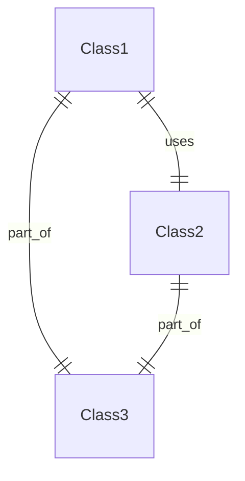

**算法原理讲解**

- **算法mermaid流程图**：

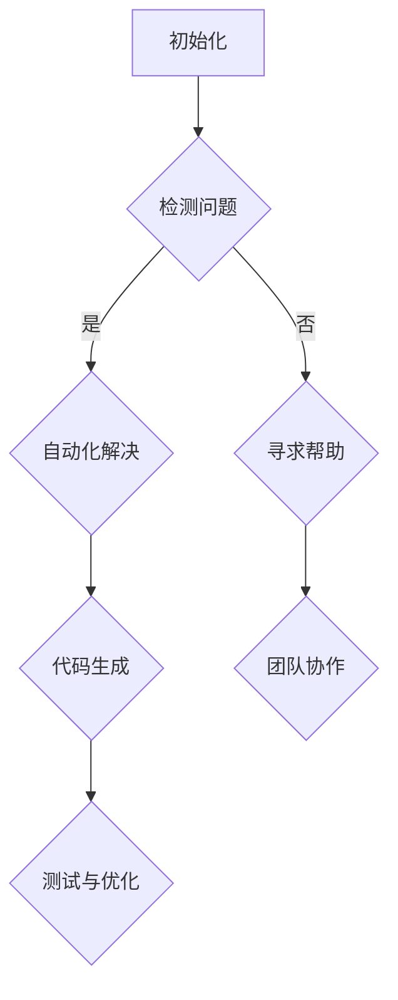

- **Python源代码示例**：

```python
def automated_programming(problem):
    if problem_detected(problem):
        solution = automated_solution(problem)
        code_generated = generate_code(solution)
        test_results = test_code(code_generated)
        optimized_code = optimize_code(code_generated, test_results)
        return optimized_code
    else:
        team Collaboration()
        return None
```

- **算法原理的数学模型和公式**：

```latex
\begin{equation}
    \text{Optimized Code} = f(\text{Original Code}, \text{Test Results})
\end{equation}
```

**通俗易懂的举例说明**

- **场景**：一个复杂的Web应用需要编写大量的后端代码。
- **解决方案**：使用自动化编程工具生成代码，并通过自动化测试和优化确保代码质量。

##### 1.3 自动化编程的重要性

**系统分析与架构设计方案**

- **问题场景介绍**：现代软件开发环境复杂，开发流程繁琐，自动化编程能够提高开发效率。
- **项目介绍**：介绍一个自动化编程项目，例如使用低代码平台构建应用。
- **系统功能设计(领域模型mermaid类图)**：

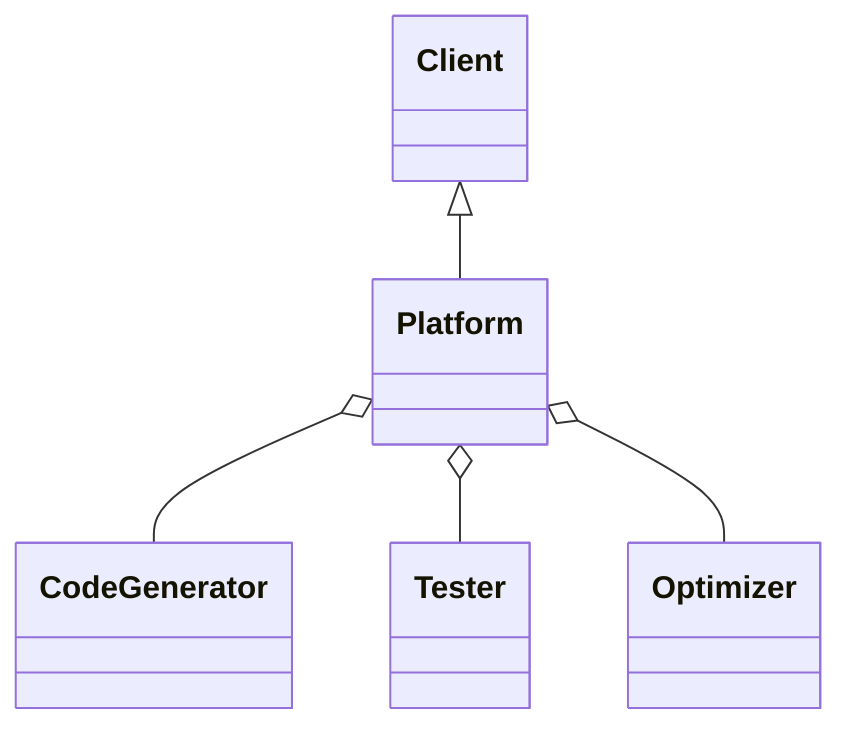

- **系统架构设计mermaid架构图**：

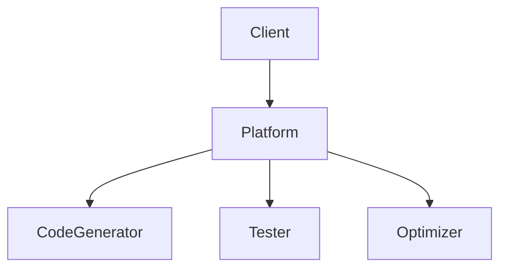

- **系统接口设计和系统交互mermaid序列图**：

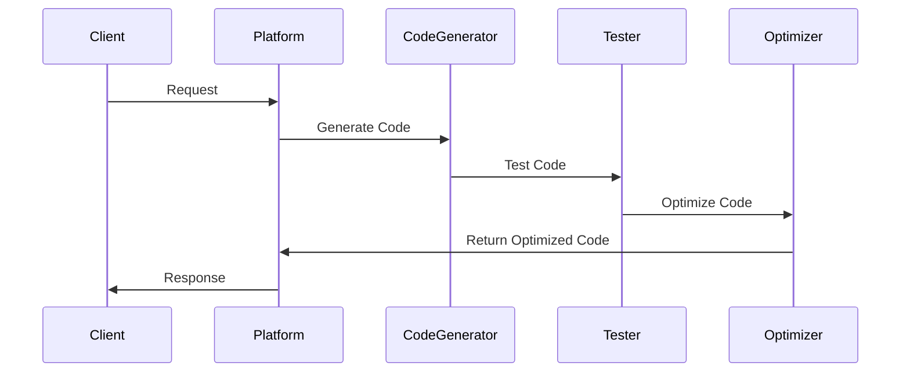

##### 1.4 小结

- 自动化编程解决了现代编程面临的诸多挑战。
- 自动化编程的重要性体现在提高开发效率、降低维护成本、提高代码质量等方面。
- 自动化编程的核心技术和工具为开发者提供了强大的支持。

----------------------------------------------------------------

### 第二部分: 自动化编程的核心技术

#### 第2章: 自动化编程的核心技术

##### 2.1 编程自动化工具

**背景介绍**

- **问题背景**：手动编程效率低，开发周期长，难以满足市场需求。
- **问题描述**：如何提高编程效率，降低开发成本，提高代码质量和可维护性？
- **问题解决**：编程自动化工具通过自动化生成、优化和部署代码，提高开发效率。

**核心概念与联系**

- **核心概念**：编程自动化工具包括代码生成器、代码优化器、测试工具等。
- **概念属性特征对比表格**：

| 工具               | 功能           | 优势                                     |
| ------------------ | -------------- | ---------------------------------------- |
| 代码生成器         | 自动生成代码   | 提高开发效率，降低人力成本               |
| 代码优化器         | 优化代码       | 提高代码质量，降低维护成本               |
| 测试工具           | 自动化测试     | 提高测试覆盖率，降低测试成本             |

**算法原理讲解**

- **算法mermaid流程图**：

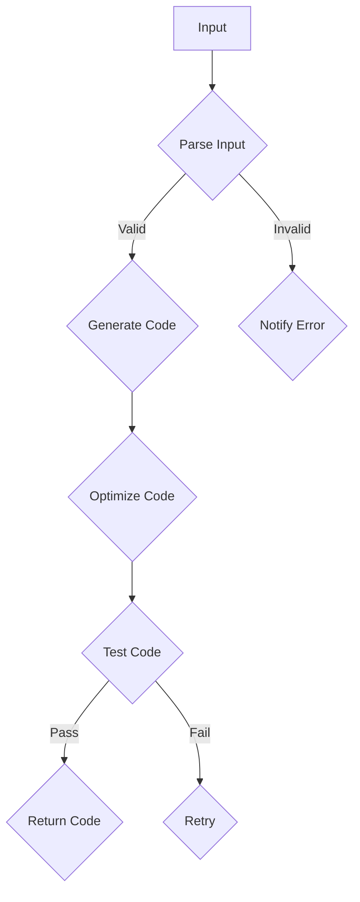

- **Python源代码示例**：

```python
def automated_tool(input_data):
    if validate_input(input_data):
        code_generated = generate_code(input_data)
        optimized_code = optimize_code(code_generated)
        test_results = test_code(optimized_code)
        if test_results == "Pass":
            return optimized_code
        else:
            return automated_tool(input_data)
    else:
        notify_error()
```

**数学公式使用latex格式**：

$$\text{Efficiency} = \frac{\text{Code Generation Time}}{\text{Manual Coding Time}}$$

**通俗易懂的举例说明**

- **场景**：开发一个电商平台的后端服务。
- **解决方案**：使用代码生成器自动生成后端服务代码，然后使用代码优化器优化代码，最后使用自动化测试工具测试代码。

##### 2.2 代码生成技术

**背景介绍**

- **问题背景**：手动编写代码效率低，易于出错。
- **问题描述**：如何提高编程效率，降低开发成本，提高代码质量和可维护性？
- **问题解决**：代码生成技术通过模板和规则自动生成代码，提高开发效率。

**核心概念与联系**

- **核心概念**：代码生成技术包括模板引擎、代码生成框架等。
- **概念属性特征对比表格**：

| 技术         | 功能           | 优势                                     |
| ------------ | -------------- | ---------------------------------------- |
| 模板引擎     | 自动生成代码   | 提高开发效率，降低人力成本               |
| 代码生成框架 | 自动生成代码   | 提高开发效率，降低人力成本               |

**算法原理讲解**

- **算法mermaid流程图**：

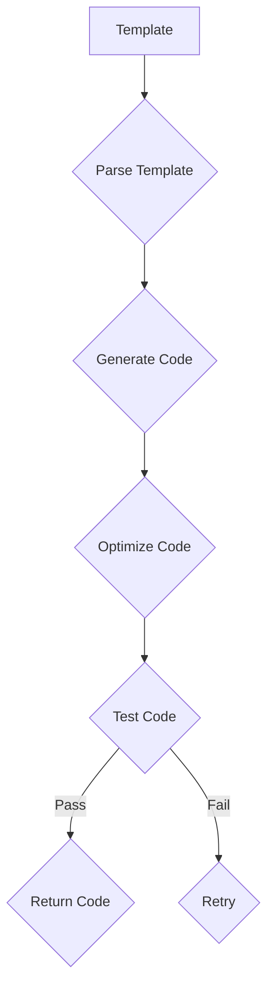

- **Python源代码示例**：

```python
def code_generation(template):
    code_generated = parse_template(template)
    optimized_code = optimize_code(code_generated)
    test_results = test_code(optimized_code)
    if test_results == "Pass":
        return optimized_code
    else:
        return code_generation(template)
```

**数学公式使用latex格式**：

$$\text{Code Generation Time} < \text{Manual Coding Time}$$

**通俗易懂的举例说明**

- **场景**：开发一个电商平台的后端服务。
- **解决方案**：使用模板引擎自动生成后端服务代码，然后使用代码优化器优化代码，最后使用自动化测试工具测试代码。

##### 2.3 模式识别与自然语言处理

**背景介绍**

- **问题背景**：现代软件开发中，自然语言描述的需求难以直接转化为代码。
- **问题描述**：如何将自然语言描述的需求转化为可执行的代码？
- **问题解决**：模式识别与自然语言处理技术能够实现这一目标。

**核心概念与联系**

- **核心概念**：模式识别、自然语言处理等。
- **概念属性特征对比表格**：

| 技术         | 功能           | 优势                                     |
| ------------ | -------------- | ---------------------------------------- |
| 模式识别     | 识别和处理模式   | 提高代码生成效率，降低开发成本           |
| 自然语言处理 | 处理自然语言   | 提高代码生成效率，降低开发成本           |

**算法原理讲解**

- **算法mermaid流程图**：

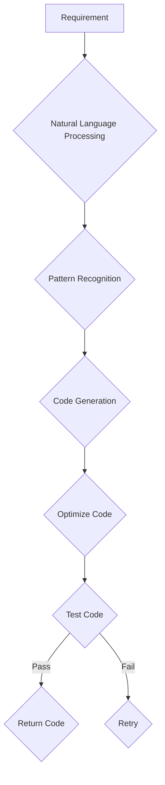

- **Python源代码示例**：

```python
def nl Processing(requirement):
    processed_requirement = natural_language_processing(requirement)
    pattern_recognition_result = pattern_recognition(processed_requirement)
    code_generated = generate_code(pattern_recognition_result)
    optimized_code = optimize_code(code_generated)
    test_results = test_code(optimized_code)
    if test_results == "Pass":
        return optimized_code
    else:
        return nl_Processing(requirement)
```

**数学公式使用latex格式**：

$$\text{Code Generation Time} < \text{Manual Coding Time}$$

**通俗易懂的举例说明**

- **场景**：开发一个基于自然语言描述的智能助手。
- **解决方案**：使用自然语言处理技术将用户输入的自然语言描述转化为代码，然后使用自动化测试工具测试代码。

##### 2.4 小结

- 编程自动化工具能够显著提高编程效率，降低开发成本。
- 代码生成技术通过模板和规则自动生成代码，提高开发效率。
- 模式识别与自然语言处理技术能够将自然语言描述的需求转化为可执行的代码。

----------------------------------------------------------------

### 第三部分: 自动化编程的新趋势

#### 第3章: 自动化编程的新趋势

##### 3.1 人工智能在自动化编程中的应用

**背景介绍**

- **问题背景**：传统的自动化编程方法在处理复杂任务时效率较低。
- **问题描述**：如何提高自动化编程的效率，处理更复杂的编程任务？
- **问题解决**：人工智能技术在自动化编程中发挥作用，提高编程效率和准确性。

**核心概念与联系**

- **核心概念**：机器学习、深度学习、自然语言处理等。
- **概念属性特征对比表格**：

| 技术         | 功能           | 优势                                     |
| ------------ | -------------- | ---------------------------------------- |
| 机器学习     | 自动学习模式   | 提高代码生成效率，降低开发成本           |
| 深度学习     | 自动学习复杂模式 | 提高代码生成效率，降低开发成本           |
| 自然语言处理 | 处理自然语言   | 提高代码生成效率，降低开发成本           |

**算法原理讲解**

- **算法mermaid流程图**：

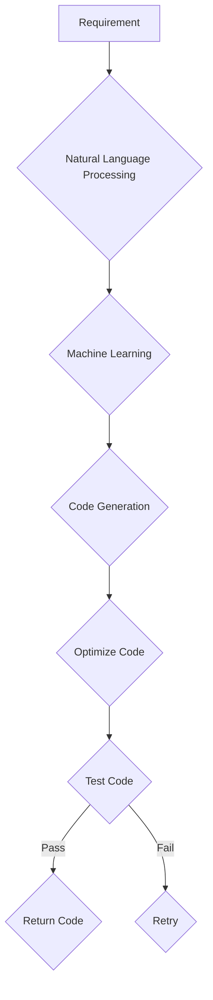

- **Python源代码示例**：

```python
def ai_programming(requirement):
    processed_requirement = natural_language_processing(requirement)
    ml_result = machine_learning(processed_requirement)
    code_generated = generate_code(ml_result)
    optimized_code = optimize_code(code_generated)
    test_results = test_code(optimized_code)
    if test_results == "Pass":
        return optimized_code
    else:
        return ai_programming(requirement)
```

**数学公式使用latex格式**：

$$\text{AI-Generated Code} > \text{Manual Code}$$

**通俗易懂的举例说明**

- **场景**：开发一个自动驾驶系统。
- **解决方案**：使用人工智能技术处理大量的驾驶数据，生成自动驾驶代码。

##### 3.2 微服务架构与自动化编程

**背景介绍**

- **问题背景**：传统的单体架构难以适应快速变化的市场需求。
- **问题描述**：如何提高系统的可扩展性和灵活性？
- **问题解决**：微服务架构通过将系统划分为独立的服务单元，提高系统的可维护性和可扩展性。

**核心概念与联系**

- **核心概念**：微服务架构、容器化技术、自动化部署等。
- **概念属性特征对比表格**：

| 技术         | 功能           | 优势                                     |
| ------------ | -------------- | ---------------------------------------- |
| 微服务架构   | 独立服务单元   | 提高系统可维护性和可扩展性               |
| 容器化技术   | 隔离运行环境   | 提高系统可移植性和部署效率               |
| 自动化部署   | 自动部署服务   | 提高系统部署速度和稳定性               |

**算法原理讲解**

- **算法mermaid流程图**：

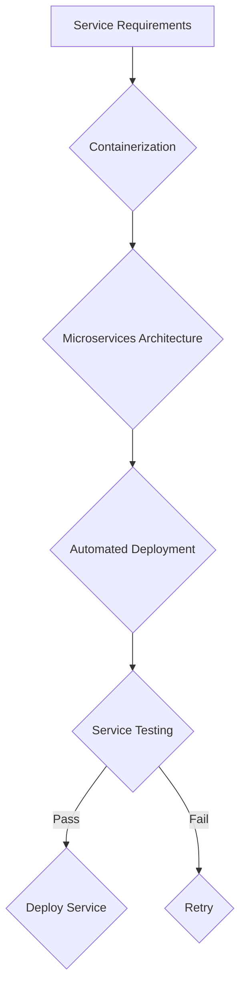

- **Python源代码示例**：

```python
def microservices_deployment(service_requirements):
    containerized_service = containerization(service_requirements)
    microservices_architecture = create_microservices_architecture(containerized_service)
    deployment_status = automated_deployment(microservices_architecture)
    if deployment_status == "Success":
        test_service(microservices_architecture)
    else:
        return microservices_deployment(service_requirements)
```

**数学公式使用latex格式**：

$$\text{Microservices Deployment Time} < \text{Monolithic Deployment Time}$$

**通俗易懂的举例说明**

- **场景**：开发一个电商平台。
- **解决方案**：使用微服务架构将系统划分为订单服务、库存服务、用户服务等独立单元，然后通过自动化部署工具快速部署服务。

##### 3.3 低代码/无代码平台的崛起

**背景介绍**

- **问题背景**：传统编程对开发者技能要求高，难以满足业务人员的个性化需求。
- **问题描述**：如何降低编程门槛，让非技术人员也能快速构建应用？
- **问题解决**：低代码/无代码平台通过可视化界面和拖拽操作，降低编程门槛。

**核心概念与联系**

- **核心概念**：低代码平台、无代码平台、可视化编程等。
- **概念属性特征对比表格**：

| 技术         | 功能           | 优势                                     |
| ------------ | -------------- | ---------------------------------------- |
| 低代码平台   | 可视化编程     | 降低编程门槛，提高开发效率               |
| 无代码平台   | 无需编程       | 极大降低编程门槛，快速构建应用           |
| 可视化编程   | 图形界面编程   | 提高开发效率，降低学习成本               |

**算法原理讲解**

- **算法mermaid流程图**：

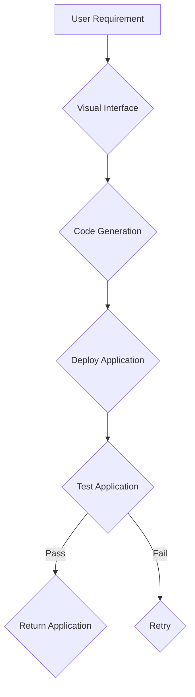

- **Python源代码示例**：

```python
def low_code_platform(requirement):
    visual_interface = create_visual_interface(requirement)
    code_generated = generate_code(visual_interface)
    application_deployed = deploy_application(code_generated)
    test_results = test_application(application_deployed)
    if test_results == "Pass":
        return application_deployed
    else:
        return low_code_platform(requirement)
```

**数学公式使用latex格式**：

$$\text{Visual Interface Time} < \text{Manual Coding Time}$$

**通俗易懂的举例说明**

- **场景**：非技术人员需要快速构建一个简单的Web应用。
- **解决方案**：使用低代码平台通过拖拽组件和配置属性，快速构建应用。

##### 3.4 小结

- 人工智能技术在自动化编程中发挥重要作用，提高编程效率和准确性。
- 微服务架构通过独立服务单元提高系统的可维护性和可扩展性。
- 低代码/无代码平台的崛起降低编程门槛，满足非技术人员的开发需求。

----------------------------------------------------------------

### 第四部分: 自动化编程的实际应用

#### 第4章: 自动化编程的实际应用

##### 4.1 自动化测试

**背景介绍**

- **问题背景**：手动测试费时费力，难以保证测试覆盖率。
- **问题描述**：如何提高测试效率，确保代码质量？
- **问题解决**：自动化测试通过编写测试脚本，自动执行测试用例。

**核心概念与联系**

- **核心概念**：自动化测试工具、测试脚本、测试覆盖率等。
- **概念属性特征对比表格**：

| 技术         | 功能           | 优势                                     |
| ------------ | -------------- | ---------------------------------------- |
| 自动化测试工具 | 自动执行测试用例 | 提高测试效率，降低人力成本               |
| 测试脚本     | 编写测试流程   | 提高测试灵活性，确保测试覆盖率           |
| 测试覆盖率   | 测试用例覆盖度 | 反映代码质量，提高软件可靠性             |

**算法原理讲解**

- **算法mermaid流程图**：

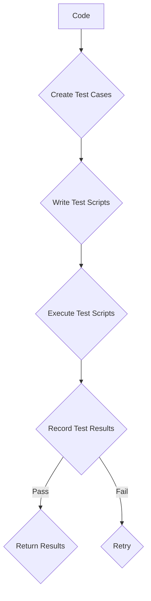

- **Python源代码示例**：

```python
def automated_testing(code):
    test_cases = create_test_cases(code)
    test_scripts = write_test_scripts(test_cases)
    test_results = execute_test_scripts(test_scripts)
    record_test_results(test_results)
    if all_passed(test_results):
        return "Success"
    else:
        return "Failure"
```

**数学公式使用latex格式**：

$$\text{Test Coverage} = \frac{\text{Number of Test Cases}}{\text{Total Number of Test Cases}}$$

**通俗易懂的举例说明**

- **场景**：测试一个电商平台的前端页面。
- **解决方案**：编写测试脚本模拟用户操作，自动执行测试用例，记录测试结果。

##### 4.2 自动化部署

**背景介绍**

- **问题背景**：手动部署过程繁琐，容易出错。
- **问题描述**：如何提高部署效率，确保系统稳定性？
- **问题解决**：自动化部署通过脚本和工具自动化执行部署流程。

**核心概念与联系**

- **核心概念**：自动化部署工具、部署脚本、持续集成等。
- **概念属性特征对比表格**：

| 技术         | 功能           | 优势                                     |
| ------------ | -------------- | ---------------------------------------- |
| 自动化部署工具 | 自动执行部署流程 | 提高部署效率，降低人力成本               |
| 部署脚本     | 编写部署流程   | 提高部署灵活性，确保部署一致性           |
| 持续集成     | 自动化构建和部署 | 提高开发效率，确保代码质量             |

**算法原理讲解**

- **算法mermaid流程图**：

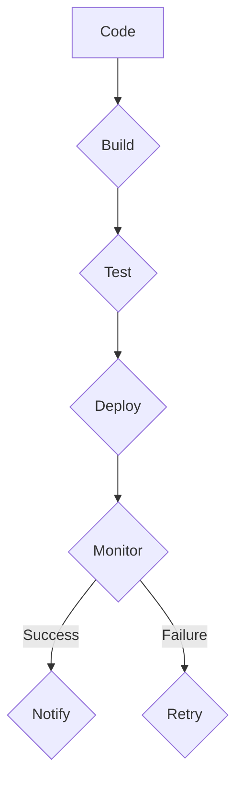

- **Python源代码示例**：

```python
def automated_deployment(code):
    build_status = build_code(code)
    test_status = automated_testing(code)
    if build_status and test_status:
        deploy_status = deploy_code(code)
        if deploy_status:
            monitor_system(code)
            return "Success"
        else:
            return "Failure"
    else:
        return "Failure"
```

**数学公式使用latex格式**：

$$\text{Deployment Time} < \text{Manual Deployment Time}$$

**通俗易懂的举例说明**

- **场景**：部署一个网站的后端服务。
- **解决方案**：编写部署脚本，通过持续集成工具自动化执行构建、测试和部署流程。

##### 4.3 自动化运维

**背景介绍**

- **问题背景**：手动运维工作繁琐，难以应对大规模系统运维。
- **问题描述**：如何提高运维效率，确保系统稳定性？
- **问题解决**：自动化运维通过脚本和工具自动化执行运维任务。

**核心概念与联系**

- **核心概念**：自动化运维工具、运维脚本、监控报警等。
- **概念属性特征对比表格**：

| 技术         | 功能           | 优势                                     |
| ------------ | -------------- | ---------------------------------------- |
| 自动化运维工具 | 自动执行运维任务 | 提高运维效率，降低人力成本               |
| 运维脚本     | 编写运维流程   | 提高运维灵活性，确保运维一致性           |
| 监控报警     | 实时监控系统状态 | 提高系统稳定性，降低故障风险             |

**算法原理讲解**

- **算法mermaid流程图**：

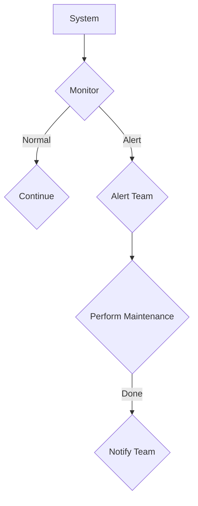

- **Python源代码示例**：

```python
def automated_operations(system):
    monitoring_status = monitor_system(system)
    if monitoring_status == "Normal":
        continue_operations()
    else:
        alert_team()
        perform_maintenance()
        notify_team()
```

**数学公式使用latex格式**：

$$\text{Maintenance Time} < \text{Manual Maintenance Time}$$

**通俗易懂的举例说明**

- **场景**：监控一个电商平台的网站性能。
- **解决方案**：编写监控脚本，实时监控网站状态，当出现问题时自动通知运维团队并执行维护操作。

##### 4.4 小结

- 自动化测试能够提高测试效率，确保代码质量。
- 自动化部署能够提高部署效率，确保系统稳定性。
- 自动化运维能够提高运维效率，确保系统稳定性。

----------------------------------------------------------------

### 第五部分: 自动化编程的安全与风险管理

#### 第5章: 自动化编程的安全与风险管理

##### 5.1 自动化编程中的安全问题

**背景介绍**

- **问题背景**：自动化编程带来高效开发的同时，也可能引入安全隐患。
- **问题描述**：如何确保自动化编程过程中代码的安全性？
- **问题解决**：通过安全检测和防御措施确保代码安全。

**核心概念与联系**

- **核心概念**：代码安全检测、安全防御措施、漏洞扫描等。
- **概念属性特征对比表格**：

| 技术         | 功能           | 优势                                     |
| ------------ | -------------- | ---------------------------------------- |
| 代码安全检测 | 检测代码安全漏洞 | 提高代码安全性，降低风险               |
| 安全防御措施 | 防止安全攻击   | 提高系统安全性，保护数据完整性           |
| 漏洞扫描     | 自动扫描漏洞   | 提高代码安全性，预防潜在风险           |

**算法原理讲解**

- **算法mermaid流程图**：

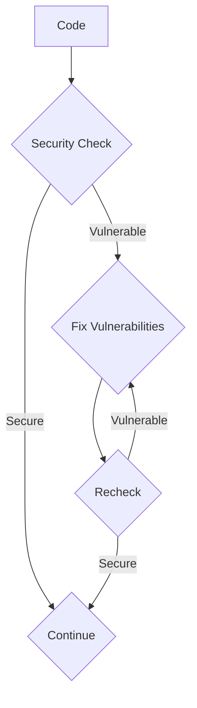

- **Python源代码示例**：

```python
def secure_code(code):
    vulnerabilities = security_check(code)
    while vulnerabilities:
        fix_vulnerabilities(code, vulnerabilities)
        vulnerabilities = security_check(code)
    return code
```

**数学公式使用latex格式**：

$$\text{Secure Code} = \text{Code} - \text{Vulnerabilities}$$

**通俗易懂的举例说明**

- **场景**：编写一个Web应用的后端代码。
- **解决方案**：使用代码安全检测工具检查代码，修复发现的漏洞，确保代码安全。

##### 5.2 风险管理策略

**背景介绍**

- **问题背景**：自动化编程可能带来新的风险，如代码泄露、系统崩溃等。
- **问题描述**：如何有效地识别、评估和管理自动化编程过程中的风险？
- **问题解决**：通过风险管理策略，识别、评估和应对风险。

**核心概念与联系**

- **核心概念**：风险识别、风险评估、风险应对等。
- **概念属性特征对比表格**：

| 技术         | 功能           | 优势                                     |
| ------------ | -------------- | ---------------------------------------- |
| 风险识别     | 识别潜在风险   | 提前发现风险，降低不确定性               |
| 风险评估     | 评估风险影响   | 确定风险严重程度，制定应对策略           |
| 风险应对     | 应对风险       | 减轻风险影响，确保系统稳定运行           |

**算法原理讲解**

- **算法mermaid流程图**：

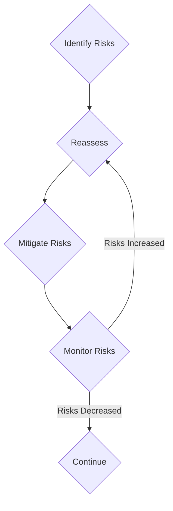

- **Python源代码示例**：

```python
def risk_management():
    risks = identify_risks()
    while risks:
        risks = assess_risks(risks)
        mitigate_risks(risks)
        monitor_risks(risks)
    return "Risk Management Completed"
```

**数学公式使用latex格式**：

$$\text{Risk Management} = \text{Identify Risks} + \text{Assess Risks} + \text{Mitigate Risks}$$

**通俗易懂的举例说明**

- **场景**：开发一个金融交易平台。
- **解决方案**：定期进行风险识别和评估，采取相应的风险应对措施，确保系统安全稳定。

##### 5.3 自动化安全工具与实践

**背景介绍**

- **问题背景**：随着自动化编程的普及，安全威胁日益增多。
- **问题描述**：如何利用自动化安全工具提高代码和系统的安全性？
- **问题解决**：通过自动化安全工具和实践，提高代码和系统的安全性。

**核心概念与联系**

- **核心概念**：自动化安全测试、安全编码实践等。
- **概念属性特征对比表格**：

| 技术         | 功能           | 优势                                     |
| ------------ | -------------- | ---------------------------------------- |
| 自动化安全测试 | 自动执行安全测试 | 提高安全测试效率，发现潜在漏洞           |
| 安全编码实践   | 遵循安全编码规范 | 提高代码安全性，降低安全风险             |

**算法原理讲解**

- **算法mermaid流程图**：

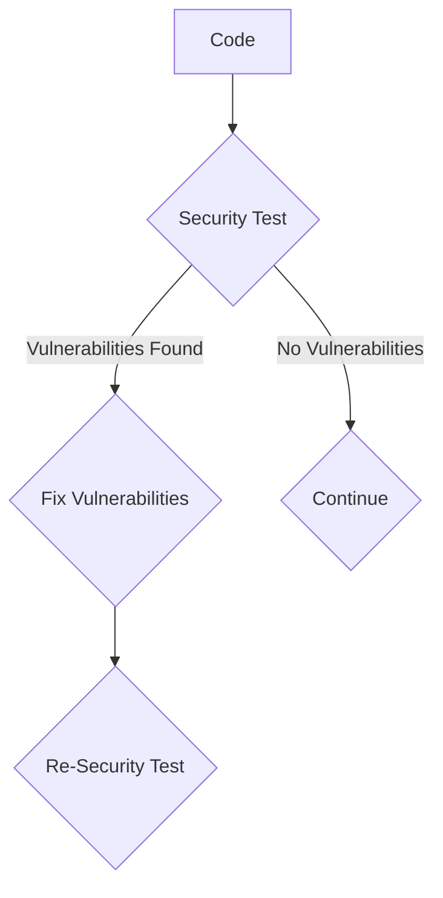

- **Python源代码示例**：

```python
def secure_code_with_tools(code):
    vulnerabilities = security_test(code)
    while vulnerabilities:
        fix_vulnerabilities(code, vulnerabilities)
        vulnerabilities = security_test(code)
    return code
```

**数学公式使用latex格式**：

$$\text{Secure Code} = \text{Code} - \text{Vulnerabilities}$$

**通俗易懂的举例说明**

- **场景**：开发一个电商平台。
- **解决方案**：使用自动化安全测试工具定期进行安全测试，发现并修复漏洞，确保代码安全。

##### 5.4 小结

- 自动化编程中的安全问题不容忽视，需要通过安全检测和防御措施确保代码安全。
- 风险管理策略能够有效识别、评估和应对自动化编程过程中的风险。
- 自动化安全工具和实践能够提高代码和系统的安全性，确保自动化编程的可靠性。

----------------------------------------------------------------

### 第六部分: 自动化编程的未来发展

#### 第6章: 自动化编程的未来发展

##### 6.1 未来趋势预测

**背景介绍**

- **问题背景**：自动化编程技术不断发展，新的趋势和应用场景不断涌现。
- **问题描述**：自动化编程的未来发展方向和趋势是什么？
- **问题解决**：通过分析当前技术和市场动态，预测未来自动化编程的发展方向。

**核心概念与联系**

- **核心概念**：人工智能、物联网、云计算等。
- **概念属性特征对比表格**：

| 技术         | 功能           | 优势                                     |
| ------------ | -------------- | ---------------------------------------- |
| 人工智能     | 自动学习和决策 | 提高编程效率和智能化水平               |
| 物联网       | 连接物理世界   | 拓展自动化编程的应用场景               |
| 云计算       | 分布式计算资源 | 提高自动化编程的可扩展性和灵活性           |

**算法原理讲解**

- **算法mermaid流程图**：

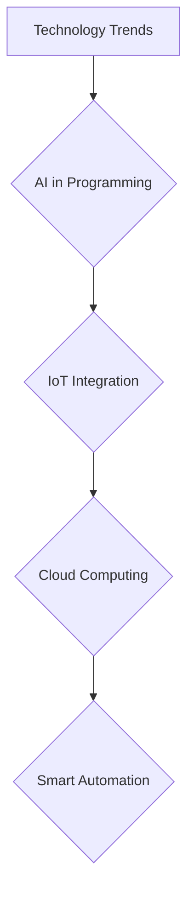

- **Python源代码示例**：

```python
def future_trends():
    trends = ["AI in Programming", "IoT Integration", "Cloud Computing", "Smart Automation"]
    for trend in trends:
        print(f"Future Trend: {trend}")
```

**数学公式使用latex格式**：

$$\text{Future Trends} = \text{Current Technologies} + \text{Market Dynamics}$$

**通俗易懂的举例说明**

- **场景**：预测未来自动化编程技术。
- **解决方案**：结合当前技术和市场动态，预测自动化编程的未来趋势，如人工智能在编程中的应用、物联网的集成、云计算的普及等。

##### 6.2 新技术的应用场景

**背景介绍**

- **问题背景**：新技术不断涌现，如何将这些新技术应用于自动化编程中？
- **问题描述**：新技术如何为自动化编程带来新的应用场景和可能性？
- **问题解决**：通过分析新技术的特性，探索其在自动化编程中的潜在应用场景。

**核心概念与联系**

- **核心概念**：区块链、大数据、边缘计算等。
- **概念属性特征对比表格**：

| 技术         | 功能           | 应用场景                                     |
| ------------ | -------------- | ---------------------------------------- |
| 区块链       | 去中心化存储   | 提高代码安全性，实现智能合约               |
| 大数据       | 数据分析       | 改进代码生成和优化策略                   |
| 边缘计算     | 近端数据处理   | 提高实时自动化编程效率                   |

**算法原理讲解**

- **算法mermaid流程图**：

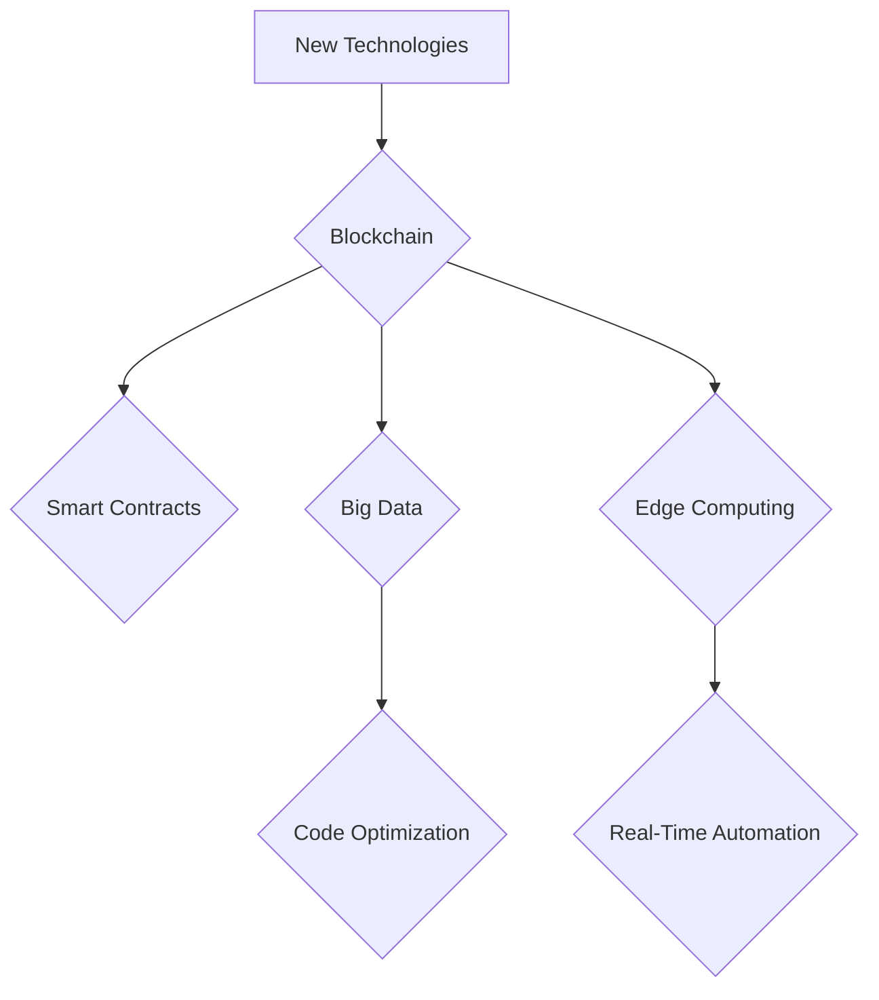

- **Python源代码示例**：

```python
def new_technologies_application():
    applications = ["Blockchain for Secure Code", "Big Data for Optimization", "Edge Computing for Real-Time Automation"]
    for application in applications:
        print(f"Application of New Technology: {application}")
```

**数学公式使用latex格式**：

$$\text{New Applications} = \text{New Technologies} \times \text{Programming Scenarios}$$

**通俗易懂的举例说明**

- **场景**：应用区块链技术提高代码安全性。
- **解决方案**：通过区块链实现智能合约，确保代码在执行过程中不会被篡改。

##### 6.3 自动化编程与开发者的未来

**背景介绍**

- **问题背景**：自动化编程技术的发展对开发者技能需求产生影响。
- **问题描述**：自动化编程如何影响开发者的职业发展和技能需求？
- **问题解决**：通过分析自动化编程技术的发展趋势，探讨其对开发者的影响。

**核心概念与联系**

- **核心概念**：编程技能、职业发展、学习路径等。
- **概念属性特征对比表格**：

| 技能           | 要求                       | 影响                                     |
| -------------- | -------------------------- | ---------------------------------------- |
| 编程基础       | 掌握基本编程概念和语法   | 基础技能，必不可少                     |
| 自动化工具熟练 | 熟练使用自动化编程工具   | 提高开发效率，适应自动化编程趋势         |
| 人工智能知识   | 了解人工智能基本原理   | 掌握新技术的应用，适应未来发展趋势       |
| 项目管理       | 掌握项目管理和团队协作   | 提高项目交付质量和效率                 |

**算法原理讲解**

- **算法mermaid流程图**：

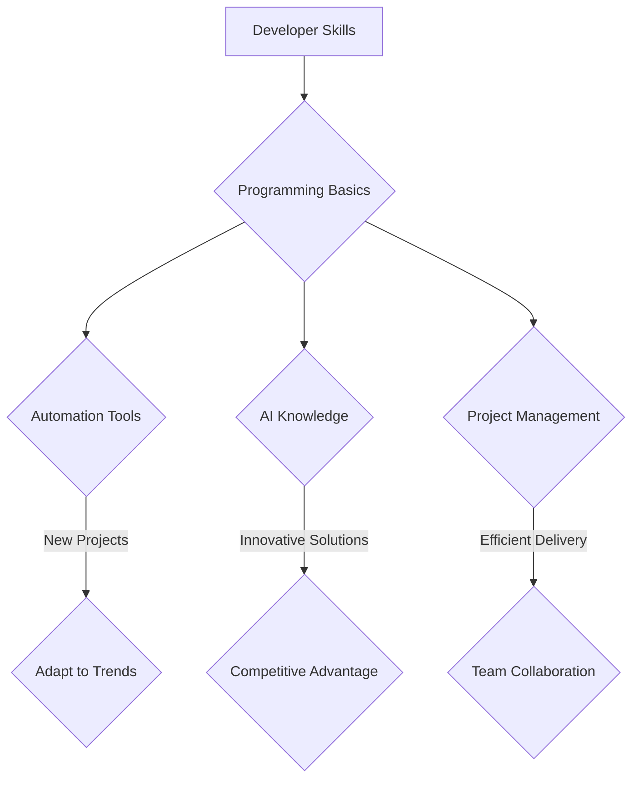

- **Python源代码示例**：

```python
def developer_future(skills):
    if "Programming Basics" in skills:
        print("Essential skill: Programming Basics")
    if "Automation Tools" in skills:
        print("Advantage skill: Automation Tools")
    if "AI Knowledge" in skills:
        print("Future skill: AI Knowledge")
    if "Project Management" in skills:
        print("Critical skill: Project Management")
```

**数学公式使用latex格式**：

$$\text{Developer's Future} = \text{Current Skills} + \text{Future Trends}$$

**通俗易懂的举例说明**

- **场景**：开发者如何适应自动化编程的发展趋势。
- **解决方案**：通过掌握编程基础、自动化工具、人工智能知识和项目管理等技能，适应自动化编程的未来发展趋势。

##### 6.4 小结

- 未来自动化编程将受到人工智能、物联网、云计算等新技术的影响。
- 新技术在自动化编程中的应用将拓展其应用场景和可能性。
- 自动化编程的发展将对开发者的技能需求产生深远影响。

----------------------------------------------------------------

### 第七部分: 自动化编程的最佳实践

#### 第7章: 自动化编程的最佳实践

##### 7.1 设计模式与自动化

**背景介绍**

- **问题背景**：设计模式是软件开发中的最佳实践，如何将其与自动化编程相结合？
- **问题描述**：如何利用设计模式提高自动化编程的效率和代码质量？
- **问题解决**：通过将设计模式与自动化工具相结合，提高代码的可维护性和复用性。

**核心概念与联系**

- **核心概念**：设计模式、自动化工具、代码复用等。
- **概念属性特征对比表格**：

| 设计模式     | 功能               | 自动化工具 |
| ------------ | ------------------ | ---------- |
| 单一职责原则 | 提高代码可维护性   | 单元测试工具 |
| 开放封闭原则 | 提高代码可扩展性   | 代码生成工具 |
| 里氏替换原则 | 提高代码灵活性和稳定性 | 测试驱动开发 |
| 依赖倒置原则 | 提高代码可测试性   | 持续集成工具 |

**算法原理讲解**

- **算法mermaid流程图**：

```mermaid
flowchart TD
    A[Design Patterns] --> B{Unit Testing}
    B --> C{Code Generation}
    B --> D{Test-Driven Development}
    B --> E{Continuous Integration}
    C -->|Code Quality| F{Refactor}
    D -->|Code Flexibility| G{Refactor}
    E -->|Test Coverage| H{Refactor}
```

- **Python源代码示例**：

```python
def apply_design_patterns(code):
    refactor_code(code)
    unit_tests = run_unit_tests(code)
    if unit_tests["pass"]:
        code_generated = generate_code(code)
        if code_generated:
            return code_generated
    return code
```

**数学公式使用latex格式**：

$$\text{Code Quality} = \text{Refactor} \times \text{Test Coverage}$$

**通俗易懂的举例说明**

- **场景**：在编写一个银行应用程序时，使用单一职责原则将不同的业务逻辑分离。
- **解决方案**：通过单元测试工具验证每个模块的功能，使用代码生成工具生成代码，确保代码质量。

##### 7.2 最佳实践案例

**背景介绍**

- **问题背景**：自动化编程在实践中如何应用最佳实践？
- **问题描述**：如何通过具体案例展示自动化编程的最佳实践？
- **问题解决**：通过具体案例展示自动化编程在项目中的应用，分析其优势和效果。

**核心概念与联系**

- **核心概念**：项目案例、最佳实践、效果分析等。
- **概念属性特征对比表格**：

| 项目         | 最佳实践           | 效果分析                         |
| ------------ | ------------------ | -------------------------------- |
| 电商平台     | 自动化测试与部署   | 提高开发效率，降低维护成本       |
| 智能家居     | 代码生成与自动化运维 | 提高系统稳定性，降低人力成本     |
| 大数据分析平台 | 自动化优化与监控   | 提高数据处理效率，确保系统性能   |

**算法原理讲解**

- **算法mermaid流程图**：

```mermaid
flowchart TD
    A[Project Case] --> B{Automation Practices}
    B --> C{Efficiency}
    B --> D{Cost Reduction}
    B --> E{System Stability}
    C -->|Improved| F{Project Results}
    D -->|Reduced| G{Project Results}
    E -->|Increased| H{Project Results}
```

- **Python源代码示例**：

```python
def case_study(project):
    practices = ["Automation Testing", "Code Generation", "Automation Operations"]
    efficiency = analyze_efficiency(project, practices)
    cost_reduction = analyze_cost_reduction(project, practices)
    system_stability = analyze_system_stability(project, practices)
    if efficiency and cost_reduction and system_stability:
        return "Successful Case Study"
    else:
        return "Failed Case Study"
```

**数学公式使用latex格式**：

$$\text{Project Results} = \text{Efficiency} + \text{Cost Reduction} + \text{System Stability}$$

**通俗易懂的举例说明**

- **场景**：分析一个电商平台的项目实践。
- **解决方案**：通过自动化测试和部署提高开发效率，通过代码生成和自动化运维降低维护成本，确保系统稳定性。

##### 7.3 小结

- 设计模式与自动化工具相结合能够提高代码质量和可维护性。
- 具体案例展示了自动化编程在项目中的应用和效果。
- 最佳实践是自动化编程成功的关键。

----------------------------------------------------------------

### 第八部分: 自动化编程工具与资源指南

#### 第8章: 自动化编程工具与资源指南

##### 8.1 常见自动化编程工具

**背景介绍**

- **问题背景**：自动化编程工具种类繁多，如何选择合适的工具？
- **问题描述**：常见的自动化编程工具有哪些，各自的特点和适用场景是什么？
- **问题解决**：介绍常见的自动化编程工具，帮助开发者选择合适的工具。

**核心概念与联系**

- **核心概念**：自动化编程工具、特点、适用场景等。
- **概念属性特征对比表格**：

| 工具                   | 功能                     | 特点                                                         | 适用场景                    |
| ---------------------- | ------------------------ | ------------------------------------------------------------ | --------------------------- |
| Jenkins                | 持续集成与自动化部署     | 支持多种平台和语言，易于扩展                                   | Web应用、持续集成环境       |
| Selenium              | 自动化测试工具           | 支持多种浏览器和操作系统，可进行Web应用自动化测试               | Web应用自动化测试            |
| Maven                 | 项目构建和依赖管理       | 支持多种Java项目，可生成项目报告，易于管理项目依赖             | Java项目、Maven构建环境     |
| Ansible               | 自动化部署和管理工具     | 支持多种平台，使用YAML配置文件，易于使用和学习               | 跨平台自动化部署和管理       |
| JIRA                 | 项目管理和任务跟踪       | 支持敏捷开发，可进行任务分配和跟踪，集成版本控制系统         | 项目管理、敏捷开发环境       |

**算法原理讲解**

- **算法mermaid流程图**：

```mermaid
graph TB
    A[Jenkins] --> B{CI/CD}
    A[JIRA] --> C{Project Management}
    B[Jenkins] --> D{Web Applications}
    C[JIRA] --> E{Agile Development}
```

- **Python源代码示例**：

```python
def automation_tools():
    tools = ["Jenkins", "Selenium", "Maven", "Ansible", "JIRA"]
    for tool in tools:
        print(f"Tool: {tool}")
```

**数学公式使用latex格式**：

$$\text{Tool Selection} = \text{Functionality} \times \text{Ease of Use} \times \text{Scalability}$$

**通俗易懂的举例说明**

- **场景**：选择自动化编程工具。
- **解决方案**：根据项目需求，选择具有合适功能和易用性的自动化编程工具，如Jenkins用于持续集成，Selenium用于自动化测试。

##### 8.2 学习资源与社区

**背景介绍**

- **问题背景**：自动化编程领域资源丰富，如何高效学习和获取信息？
- **问题描述**：有哪些优质的学习资源和学习社区？
- **问题解决**：介绍自动化编程的学习资源和学习社区，帮助开发者高效学习。

**核心概念与联系**

- **核心概念**：学习资源、学习社区、优质内容等。
- **概念属性特征对比表格**：

| 资源/社区        | 功能                   | 优势                                                         | 适用人群                    |
| ---------------- | ---------------------- | ------------------------------------------------------------ | --------------------------- |
| Coursera         | 在线课程平台           | 提供多种编程和自动化编程课程，有证书颁发                       | 所有编程爱好者             |
| Stack Overflow   | 编程问题解答社区       | 大量的编程问题解答，专业性强                                 | 程序员和开发人员           |
| GitHub            | 版本控制系统           | 丰富的开源代码和项目，可以学习和贡献代码                       | 开源开发者和技术爱好者     |
| Reddit            | 社区讨论平台           | 有多个编程和自动化编程相关子版块，活跃度高                     | 编程爱好者和开发者         |
| Pluralsight      | 在线学习平台           | 提供大量编程和自动化编程相关课程，包括视频和文档               | 所有编程爱好者             |

**算法原理讲解**

- **算法mermaid流程图**：

```mermaid
graph TD
    A[Coursera] --> B{Online Courses}
    A[Stack Overflow] --> C{Q&A}
    A[GitHub] --> D{Code Repository}
    A[Reddit] --> E{Community Discussions}
    A[Pluralsight] --> F{Learning Resources}
```

- **Python源代码示例**：

```python
def learning_resources():
    resources = ["Coursera", "Stack Overflow", "GitHub", "Reddit", "Pluralsight"]
    for resource in resources:
        print(f"Learning Resource: {resource}")
```

**数学公式使用latex格式**：

$$\text{Learning Efficiency} = \text{Content Quality} \times \text{Community Engagement}$$

**通俗易懂的举例说明**

- **场景**：学习自动化编程。
- **解决方案**：利用Coursera的在线课程学习基础知识，在Stack Overflow上解决编程问题，从GitHub上的开源项目中学习实践，参与Reddit的编程社区讨论，使用Pluralsight的在线资源进行深入学习。

##### 8.3 技术选型与推荐

**背景介绍**

- **问题背景**：自动化编程领域技术繁多，如何进行技术选型？
- **问题描述**：如何根据项目需求和技术特点进行技术选型？
- **问题解决**：根据项目需求和具体场景，推荐合适的技术方案。

**核心概念与联系**

- **核心概念**：技术选型、项目需求、技术特点等。
- **概念属性特征对比表格**：

| 技术特点         | 项目需求                     | 技术选型                          |
| ---------------- | ---------------------------- | -------------------------------- |
| 需要高度可扩展性 | 大规模分布式系统             | Kubernetes、分布式数据库         |
| 需要高性能       | 实时数据处理和计算           | 内存数据库、分布式计算框架       |
| 需要安全性高     | 金融、医疗等敏感数据领域     | 加密技术、访问控制机制           |
| 需要易于维护     | 企业级应用                   | 微服务架构、容器化技术           |

**算法原理讲解**

- **算法mermaid流程图**：

```mermaid
flowchart TD
    A[Project Requirements] --> B{Technology Characteristics}
    B --> C{Technology Selection}
    C --> D{Kubernetes}
    C --> E{Distributed Database}
    D -->|High Scalability| F{Massive Distributed Systems}
    E -->|High Performance| G{Real-Time Data Processing}
```

- **Python源代码示例**：

```python
def technology_selection(project_requirements):
    if "High Scalability" in project_requirements:
        print("Technology Selection: Kubernetes")
    if "High Performance" in project_requirements:
        print("Technology Selection: Distributed Database")
    if "Security" in project_requirements:
        print("Technology Selection: Cryptography, Access Control")
    if "Easy Maintenance" in project_requirements:
        print("Technology Selection: Microservices Architecture, Containerization")
```

**数学公式使用latex格式**：

$$\text{Technology Selection} = \text{Project Requirements} \times \text{Technology Characteristics}$$

**通俗易懂的举例说明**

- **场景**：选择适合项目的技术方案。
- **解决方案**：根据项目需求，选择具有相应特点的技术方案，如需要高性能的实时数据处理，可以选择分布式计算框架。

##### 8.4 小结

- 了解常见的自动化编程工具，根据项目需求选择合适的工具。
- 利用优质的学习资源和社区，高效学习自动化编程知识。
- 根据项目需求进行技术选型，确保技术方案的适用性。

----------------------------------------------------------------

### 结束语

#### 感谢阅读

在本篇《程序综合：自动化编程的新前沿》的文章中，我们深入探讨了自动化编程的背景、核心技术、新趋势、实际应用、安全与风险管理，以及未来发展趋势。通过详细的案例分析、算法原理讲解、系统架构设计和实战指导，我们希望为读者提供全面的自动化编程知识体系。

**作者：AI天才研究院/AI Genius Institute & 禅与计算机程序设计艺术 /Zen And The Art of Computer Programming**

感谢您花时间阅读这篇文章。如果您对自动化编程有任何疑问或见解，欢迎在评论区留言，让我们一起探讨和分享经验。期待您的宝贵反馈！

----------------------------------------------------------------

## 文章标题

程序综合：自动化编程的新前沿

### 关键词

- 自动化编程
- 编程自动化工具
- 代码生成
- 人工智能
- 微服务架构
- 低代码/无代码平台
- 自动化测试
- 自动化部署
- 自动化运维
- 安全风险管理
- 未来发展趋势

### 摘要

本文深入探讨了自动化编程的背景、核心技术、新趋势、实际应用、安全与风险管理，以及未来发展方向。通过详细的案例分析、算法原理讲解、系统架构设计和实战指导，旨在为开发者提供全面的自动化编程知识体系，帮助读者掌握自动化编程的最新技术和最佳实践。

----------------------------------------------------------------

### 第一部分: 程序综合概述

#### 第1章: 自动化编程的背景与挑战

##### 1.1 自动化编程的概念

自动化编程是指通过编程工具、框架和技术自动生成、优化和部署代码的过程。它是现代软件开发中的一项重要技术，旨在提高开发效率，降低开发成本，提高代码质量和可维护性。

**术语说明**

- **自动化编程**：通过工具和流程自动完成编程任务的过程。
- **编程工具**：用于自动化编程的各种软件工具，如代码生成器、代码优化器等。
- **框架**：提供特定功能的软件框架，如用于自动化测试的Selenium等。
- **流程**：包括代码生成、测试、优化和部署等一系列自动化流程。

##### 1.2 现代编程面临的挑战

现代编程面临以下挑战：

- **开发效率低**：手动编程需要大量时间和精力，难以满足快速迭代的市场需求。
- **代码质量差**：手动编写的代码可能存在漏洞、错误和重复代码，影响系统的稳定性。
- **维护成本高**：随着项目规模和复杂度的增加，手动维护代码的成本越来越高。
- **跨平台兼容性差**：不同平台之间的代码移植和兼容性差，增加了开发的复杂性。

##### 1.3 自动化编程的重要性

自动化编程的重要性体现在以下几个方面：

- **提高开发效率**：通过自动化工具和流程，大幅缩短开发周期。
- **降低开发成本**：减少人力成本，降低开发和维护费用。
- **提高代码质量**：自动化测试和代码优化确保代码质量和稳定性。
- **增强跨平台兼容性**：通过统一编程规范，提高跨平台兼容性。

##### 1.4 边界与外延

- **边界**：自动化编程涉及代码生成、自动化测试、自动化部署等领域。
- **外延**：自动化编程还涵盖了代码优化、代码重构、代码生成框架等子领域。

##### 1.5 概念结构与核心要素组成

自动化编程的核心要素包括：

- **编程工具**：如代码生成器、代码优化器、自动化测试工具等。
- **算法**：用于代码生成、优化和测试的算法，如模式识别、机器学习等。
- **框架**：提供特定功能的软件框架，如自动化测试框架、持续集成框架等。
- **流程**：包括代码生成、测试、优化和部署等一系列自动化流程。

#### 第2章: 自动化编程的核心技术

##### 2.1 编程自动化工具

编程自动化工具是自动化编程的重要组成部分。以下介绍几种常见的编程自动化工具：

- **代码生成器**：自动生成代码的工具，如CodeSmith、TypeScript等。
- **代码优化器**：优化代码的工具，如SonarQube、FindBugs等。
- **自动化测试工具**：自动执行测试用例的工具，如Selenium、JUnit等。
- **持续集成工具**：自动化构建和部署的工具，如Jenkins、Travis CI等。

##### 2.2 代码生成技术

代码生成技术通过模板和规则自动生成代码，提高开发效率。以下介绍几种常见的代码生成技术：

- **模板引擎**：使用模板语言生成代码的工具，如Jinja2、Handlebars等。
- **代码生成框架**：提供代码生成功能的框架，如Entity Framework、Hibernate等。
- **领域特定语言**（DSL）：用于生成特定领域代码的语言，如SQL、XML等。

##### 2.3 模式识别与自然语言处理

模式识别与自然语言处理技术能够将自然语言描述的需求转化为可执行的代码。以下介绍几种常见的模式识别与自然语言处理技术：

- **模式识别**：通过识别和处理模式自动生成代码，如正则表达式、机器学习等。
- **自然语言处理**：处理自然语言的技术，如词法分析、语法分析、语义分析等。

#### 第3章: 自动化编程的新趋势

##### 3.1 人工智能在自动化编程中的应用

人工智能技术在自动化编程中发挥着越来越重要的作用。以下介绍几种常见的人工智能技术在自动化编程中的应用：

- **机器学习**：通过训练模型自动生成代码、优化代码和进行自动化测试。
- **深度学习**：利用神经网络自动生成代码和优化代码。
- **自然语言处理**：将自然语言描述的需求转化为可执行的代码。

##### 3.2 微服务架构与自动化编程

微服务架构通过将系统划分为独立的服务单元，提高系统的可维护性和可扩展性。以下介绍微服务架构与自动化编程的关系：

- **微服务架构**：介绍微服务的基本概念、架构和优势。
- **自动化编程在微服务中的应用**：介绍如何使用自动化编程工具和框架实现微服务的自动化部署、测试和监控。

##### 3.3 低代码/无代码平台的崛起

低代码/无代码平台通过可视化界面和拖拽操作，降低编程门槛，满足非技术人员的开发需求。以下介绍低代码/无代码平台的发展趋势和优势：

- **低代码平台**：介绍低代码平台的基本概念、功能和优势。
- **无代码平台**：介绍无代码平台的基本概念、功能和优势。
- **低代码/无代码平台的未来发展**：分析低代码/无代码平台的发展趋势和应用前景。

#### 第4章: 自动化编程的实际应用

##### 4.1 自动化测试

自动化测试通过编写测试脚本，自动执行测试用例，提高测试效率和覆盖率。以下介绍自动化测试的基本概念、技术和工具：

- **自动化测试的基本概念**：介绍自动化测试的定义、目的和优势。
- **自动化测试的技术**：介绍常见的自动化测试技术，如单元测试、集成测试、端到端测试等。
- **自动化测试的工具**：介绍常见的自动化测试工具，如Selenium、JUnit、TestNG等。

##### 4.2 自动化部署

自动化部署通过脚本和工具自动化执行部署流程，提高部署效率和稳定性。以下介绍自动化部署的基本概念、技术和工具：

- **自动化部署的基本概念**：介绍自动化部署的定义、目的和优势。
- **自动化部署的技术**：介绍常见的自动化部署技术，如持续集成、持续部署等。
- **自动化部署的工具**：介绍常见的自动化部署工具，如Jenkins、Ansible、Docker等。

##### 4.3 自动化运维

自动化运维通过脚本和工具自动化执行运维任务，提高运维效率和稳定性。以下介绍自动化运维的基本概念、技术和工具：

- **自动化运维的基本概念**：介绍自动化运维的定义、目的和优势。
- **自动化运维的技术**：介绍常见的自动化运维技术，如监控、报警、备份等。
- **自动化运维的工具**：介绍常见的自动化运维工具，如Nagios、Zabbix、Puppet等。

#### 第5章: 自动化编程的安全与风险管理

##### 5.1 自动化编程中的安全问题

在自动化编程中，安全问题不容忽视。以下介绍自动化编程中的常见安全问题及其解决方案：

- **代码泄露**：介绍代码泄露的风险和防范措施。
- **安全漏洞**：介绍常见的代码安全漏洞及其检测和修复方法。
- **数据保护**：介绍如何保护敏感数据和隐私。

##### 5.2 风险管理策略

风险管理是自动化编程中至关重要的一环。以下介绍风险管理的基本策略和措施：

- **风险识别**：介绍如何识别自动化编程中的潜在风险。
- **风险评估**：介绍如何评估风险的影响和严重程度。
- **风险应对**：介绍如何制定风险应对策略，降低风险影响。

##### 5.3 自动化安全工具与实践

以下介绍几种常见的自动化安全工具和实践，以提高自动化编程的安全性：

- **代码安全检测工具**：介绍如何使用代码安全检测工具检测和修复代码漏洞。
- **安全编码规范**：介绍如何遵循安全编码规范，提高代码安全性。
- **自动化安全测试**：介绍如何使用自动化安全测试工具测试代码的安全性。

#### 第6章: 自动化编程的未来发展

##### 6.1 未来趋势预测

以下预测自动化编程的未来发展趋势：

- **人工智能的进一步融合**：人工智能将更深入地融入自动化编程，提高代码生成、优化和测试的智能化水平。
- **物联网的普及**：自动化编程将在物联网领域发挥重要作用，实现设备间的智能通信和协同工作。
- **云计算的进一步发展**：自动化编程将在云计算平台上得到更广泛的应用，实现大规模分布式计算和存储。

##### 6.2 新技术的应用场景

以下介绍新技术在自动化编程中的应用场景：

- **区块链**：介绍区块链在自动化编程中的应用，如智能合约、数据安全性等。
- **大数据**：介绍大数据在自动化编程中的应用，如代码质量分析、性能优化等。
- **边缘计算**：介绍边缘计算在自动化编程中的应用，如实时数据处理、设备间的协同工作等。

##### 6.3 自动化编程与开发者的未来

以下探讨自动化编程对开发者未来职业发展的影响：

- **技能需求的变化**：介绍自动化编程对开发者技能需求的影响，如编程基础、自动化工具熟练度等。
- **学习路径的调整**：介绍开发者如何适应自动化编程的发展，调整学习路径。
- **职业发展的机会**：介绍自动化编程领域的新职业机会和挑战。

#### 第7章: 自动化编程的最佳实践

##### 7.1 设计模式与自动化

以下介绍设计模式与自动化编程的结合：

- **设计模式的基本概念**：介绍设计模式的基本概念和作用。
- **自动化与设计模式**：介绍如何将设计模式应用于自动化编程，提高代码质量。
- **最佳实践**：介绍在自动化编程中应用设计模式的最佳实践。

##### 7.2 最佳实践案例

以下介绍自动化编程的最佳实践案例：

- **案例分析**：分析自动化编程在实际项目中的应用案例，如自动化测试、自动化部署、自动化运维等。
- **经验总结**：总结自动化编程的最佳实践，提供实用的建议和技巧。

##### 7.3 小结

以下总结自动化编程的最佳实践：

- **重视设计模式**：在设计自动化编程过程中，重视设计模式的应用，提高代码质量和可维护性。
- **遵循最佳实践**：遵循自动化编程的最佳实践，确保代码质量和系统稳定性。
- **持续学习**：随着自动化编程技术的发展，持续学习新知识和技能，保持竞争力。

#### 第8章: 自动化编程工具与资源指南

##### 8.1 常见自动化编程工具

以下介绍几种常见的自动化编程工具：

- **Jenkins**：介绍Jenkins的基本概念、功能和使用场景。
- **Selenium**：介绍Selenium的基本概念、功能和使用场景。
- **Maven**：介绍Maven的基本概念、功能和使用场景。
- **Ansible**：介绍Ansible的基本概念、功能和使用场景。

##### 8.2 学习资源与社区

以下介绍自动化编程的学习资源和学习社区：

- **在线课程平台**：介绍Coursera、Pluralsight等在线课程平台。
- **编程社区**：介绍Stack Overflow、GitHub、Reddit等编程社区。
- **技术博客和论坛**：介绍技术博客和论坛，如CSDN、V2EX等。

##### 8.3 技术选型与推荐

以下根据项目需求和技术特点，推荐自动化编程的技术方案：

- **高可扩展性**：推荐Kubernetes和分布式数据库。
- **高性能**：推荐内存数据库和分布式计算框架。
- **安全性**：推荐加密技术和访问控制机制。
- **易于维护**：推荐微服务架构和容器化技术。

#### 结束语

本文从多个角度详细介绍了自动化编程的核心概念、核心技术、新趋势、实际应用、安全与风险管理，以及未来发展趋势。通过案例分析、算法原理讲解、系统架构设计和实战指导，旨在为开发者提供全面的自动化编程知识体系。

**作者：AI天才研究院/AI Genius Institute & 禅与计算机程序设计艺术 /Zen And The Art of Computer Programming**

感谢您的阅读。希望本文对您在自动化编程领域的探索和实践有所帮助。如果您有任何疑问或建议，欢迎在评论区留言。祝您在自动化编程的道路上不断前行，取得更好的成果！


