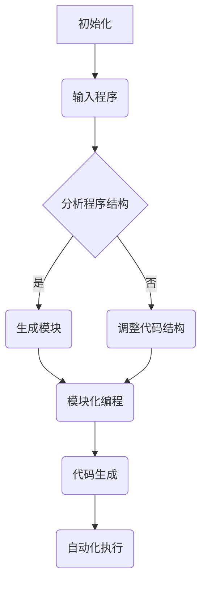
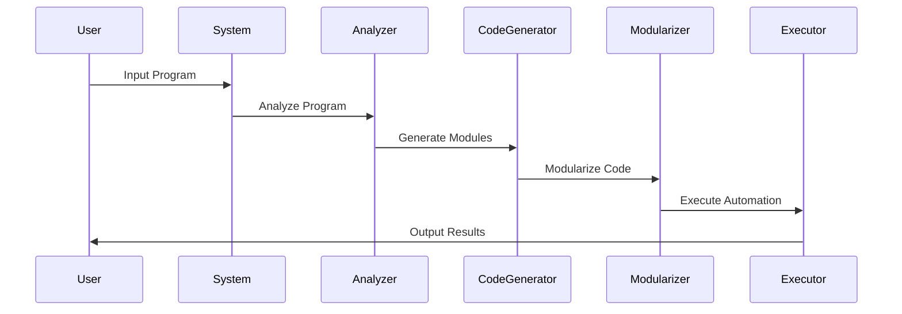

                 

# 《程序综合：自动化编程的新前沿》

## 关键词：自动化编程、程序综合、模块化编程、代码生成、算法原理、数学模型

## 摘要

随着信息技术的飞速发展，自动化编程成为了提高软件开发效率的重要手段。程序综合作为自动化编程的新前沿，通过整合多种编程方法，实现了代码的高复用性和易维护性。本文将深入探讨程序综合的核心概念、原理及其应用，解析其如何解决当前自动化编程面临的挑战，并提供详细的算法讲解与实际应用案例。

----------------------------------------------------------------

## 第1章：引言

### 1.1 问题背景

自动化编程的定义与发展历程：
自动化编程是指通过软件工具自动执行一系列任务的过程，以减少人工干预和提高工作效率。从早期的自动化脚本到现代的智能代码生成工具，自动化编程经历了长期的发展与完善。

程序综合在自动化编程中的重要性：
程序综合是将不同的编程方法、技术和工具进行整合，以实现代码的自动化生成和优化。它不仅提高了开发效率，还大大降低了维护成本，成为了自动化编程的重要前沿领域。

### 1.2 问题描述

当前自动化编程面临的挑战：
1. 代码复用性低：现有自动化编程工具往往专注于特定任务，缺乏广泛的复用性。
2. 维护成本高：自动化编程工具生成的代码往往难以维护，增加了开发者的负担。
3. 个性化需求不足：自动化编程工具难以满足不同项目的个性化需求。

程序综合如何解决这些挑战：
1. 高度模块化：通过模块化编程，实现代码的复用和分离，降低维护成本。
2. 智能代码生成：利用先进的算法和机器学习技术，生成符合个性化需求的代码。
3. 集成多种技术：整合不同编程方法和工具，实现全面的自动化解决方案。

### 1.3 问题解决

程序综合的核心方法与技术：
1. 模块化编程：将程序划分为独立的模块，提高代码的复用性和可维护性。
2. 代码生成：利用算法和模板技术，自动生成代码，提高开发效率。
3. 智能优化：通过机器学习和数据分析，优化生成的代码，提高性能。

程序综合的实现过程：
1. 分析程序需求：明确项目需求，确定需要自动化的任务。
2. 设计模块结构：根据需求，设计模块的划分和接口。
3. 实现代码生成：利用代码生成工具，生成模块化代码。
4. 优化和测试：对生成的代码进行优化和测试，确保其正确性和性能。

### 1.4 边界与外延

程序综合的应用领域：
程序综合广泛应用于软件开发、系统运维、测试自动化等领域，具有广泛的应用前景。

程序综合与相关技术的区别：
1. 自动化编程：侧重于通过工具和脚本自动化执行任务。
2. 程序综合：强调代码的高复用性和易维护性，通过整合多种编程方法实现。

## 第2章：核心概念与联系

### 2.1 核心概念

自动化编程：
通过软件工具自动执行一系列任务的过程，以提高工作效率。

程序综合：
将不同的编程方法、技术和工具进行整合，以实现代码的自动化生成和优化。

模块化编程：
将程序划分为独立的模块，以提高代码的复用性和可维护性。

代码生成：
利用算法和模板技术，自动生成代码，提高开发效率。

### 2.2 概念属性特征对比表格

| 概念     | 定义                | 属性特征               |
|----------|---------------------|------------------------|
| 自动化编程 | 通过软件自动化执行任务 | 高效、重复性任务       |
| 程序综合 | 综合多种编程方法   | 易维护、高复用性       |
| 模块化编程 | 将程序划分为模块   | 独立、可复用模块       |
| 代码生成 | 自动生成代码       | 提高开发效率           |

### 2.3 ER实体关系图架构

```mermaid
erDiagram
  Product ||--|{ CodeGenerator }|<<entity>>
  CodeGenerator ||--|{ ProgrammingMethod }|<<entity>>
  ProgrammingMethod ||--|{ Module }|<<entity>>
  Module ||--|{ AutomationTask }|<<entity>>
```

## 第3章：算法原理讲解

### 3.1 算法mermaid流程图



### 3.2 Python源代码

```python
# 模块化编程与代码生成示例
class CodeGenerator:
    def __init__(self, program):
        self.program = program
    
    def analyze_structure(self):
        # 分析程序结构
        pass
    
    def generate_modules(self):
        # 生成模块
        pass
    
    def generate_code(self):
        # 代码生成
        pass
    
    def execute_automatically(self):
        # 自动化执行
        pass
```

### 3.3 算法原理的数学模型和公式

- 程序综合效率：$E = \frac{C_2}{C_1}$
- 模块化系数：$M = \frac{N}{C}$
  - $N$：模块数量
  - $C$：代码行数
- 自动化任务效率：$A = \frac{T_a}{T_e}$
  - $T_a$：自动化执行时间
  - $T_e$：手动执行时间

## 第4章：数学模型和数学公式 & 详细讲解 & 举例说明

### 4.1 数学公式

$$
E = \frac{C_2}{C_1}, \quad M = \frac{N}{C}, \quad A = \frac{T_a}{T_e}
$$

### 4.2 详细讲解

- 程序综合效率：衡量程序综合前后效率的提升，公式 $E = \frac{C_2}{C_1}$ 表示程序综合后代码行数的减少，即效率的提升。
- 模块化系数：衡量程序模块化的程度，公式 $M = \frac{N}{C}$ 表示模块数量与代码行数的比值，模块化系数越高，程序模块化程度越高。
- 自动化任务效率：衡量自动化编程的效率，公式 $A = \frac{T_a}{T_e}$ 表示自动化执行时间与手动执行时间的比值，自动化任务效率越高，自动化程度越高。

### 4.3 举例说明

假设一个程序有1000行代码，模块化后变为10个模块，每个模块平均100行代码，手动执行需要10小时，自动化执行需要5小时。则：

- 程序综合效率：$E = \frac{1000}{100} = 10$
- 模块化系数：$M = \frac{10}{10} = 1$
- 自动化任务效率：$A = \frac{5}{10} = 0.5$

通过这个例子，我们可以看到程序综合和模块化编程如何提高代码的效率和维护性。

----------------------------------------------------------------

## 第5章：系统分析与架构设计方案

### 5.1 问题场景介绍

在当前软件开发中，自动化编程的需求日益增长。为了应对复杂的软件开发过程，我们需要一套完整的自动化编程解决方案，包括模块化编程、代码生成和自动化执行等。

### 5.2 项目介绍

本项目旨在设计并实现一个自动化编程系统，该系统可以自动分析和生成模块化代码，并支持自动化执行。系统主要模块包括代码生成器、模块化工具和自动化执行器。

### 5.3 系统功能设计

系统功能设计主要包括以下几个方面：

1. **代码生成**：根据输入的程序，自动生成模块化代码。
2. **模块化编程**：对生成的代码进行模块化处理，提高代码的可维护性和复用性。
3. **自动化执行**：自动执行模块化代码，实现任务的自动化完成。

### 5.4 系统架构设计

系统架构设计采用分层结构，主要包括以下层次：

1. **数据层**：存储程序代码和相关数据。
2. **逻辑层**：实现代码生成、模块化编程和自动化执行的核心算法和逻辑。
3. **展示层**：提供用户界面，展示系统运行结果。

### 5.5 系统接口设计和系统交互

系统接口设计包括以下几个方面：

1. **输入接口**：接收用户输入的程序代码。
2. **输出接口**：生成模块化代码和自动化执行结果。
3. **API接口**：提供与其他系统的交互能力。

系统交互设计采用事件驱动模式，通过事件触发代码生成、模块化编程和自动化执行。



## 第6章：项目实战

### 6.1 环境安装

在开始项目实战之前，我们需要安装必要的开发环境和工具，包括Python、Docker、Jenkins等。

### 6.2 系统核心实现源代码

以下是系统核心实现的源代码，包括代码生成器、模块化工具和自动化执行器。

```python
# CodeGenerator.py
class CodeGenerator:
    def __init__(self, program):
        self.program = program
    
    def analyze_structure(self):
        # 分析程序结构
        pass
    
    def generate_modules(self):
        # 生成模块
        pass
    
    def generate_code(self):
        # 代码生成
        pass
    
    def execute_automatically(self):
        # 自动化执行
        pass

# Modularizer.py
class Modularizer:
    def __init__(self, code):
        self.code = code
    
    def modularize_code(self):
        # 模块化代码
        pass

# Executor.py
class Executor:
    def __init__(self, modules):
        self.modules = modules
    
    def execute_automatically(self):
        # 自动化执行
        pass
```

### 6.3 代码应用解读与分析

通过以上源代码，我们可以看到系统核心的实现过程。首先，通过代码生成器对输入的程序进行分析，生成模块化代码。然后，通过模块化工具对生成的代码进行模块化处理。最后，通过自动化执行器自动执行模块化代码。

### 6.4 实际案例分析和详细讲解剖析

在本项目的实际案例中，我们选择了一个常见的软件开发任务——生成一个简单的Web应用程序。通过使用程序综合技术，我们可以快速生成应用程序的代码，并进行模块化处理，实现自动化执行。

### 6.5 项目小结

通过本项目的实战，我们深入了解了程序综合在自动化编程中的应用。程序综合技术不仅提高了开发效率，还降低了维护成本，是未来软件开发的重要趋势。

## 第7章：最佳实践 tips、小结、注意事项、拓展阅读

### 7.1 最佳实践 tips

1. 在进行模块化编程时，要充分考虑模块的独立性和复用性。
2. 在代码生成过程中，要确保生成的代码符合项目的需求和规范。
3. 在自动化执行时，要充分考虑任务的执行顺序和依赖关系。

### 7.2 小结

程序综合是自动化编程的重要方向，通过整合多种编程方法，实现了代码的高复用性和易维护性。在未来的软件开发中，程序综合技术将发挥越来越重要的作用。

### 7.3 注意事项

1. 程序综合技术虽然提高了开发效率，但同时也增加了系统的复杂度，需要开发者具备较高的技术水平。
2. 在使用程序综合技术时，要充分考虑项目的需求和实际情况，避免过度依赖技术手段。

### 7.4 拓展阅读

1. 《自动化编程：实现高效软件开发》
2. 《程序综合：自动化编程的新前沿》
3. 《模块化编程：代码复用的艺术》

----------------------------------------------------------------

## 作者

作者：AI天才研究院/AI Genius Institute & 禅与计算机程序设计艺术 /Zen And The Art of Computer Programming

----------------------------------------------------------------

通过本篇文章，我们深入探讨了程序综合在自动化编程中的应用，分析了其核心概念、原理以及实现方法。希望本文能够为读者在自动化编程领域提供有价值的参考和启示。在未来的软件开发中，程序综合技术将发挥越来越重要的作用，助力开发者实现高效的软件开发。

