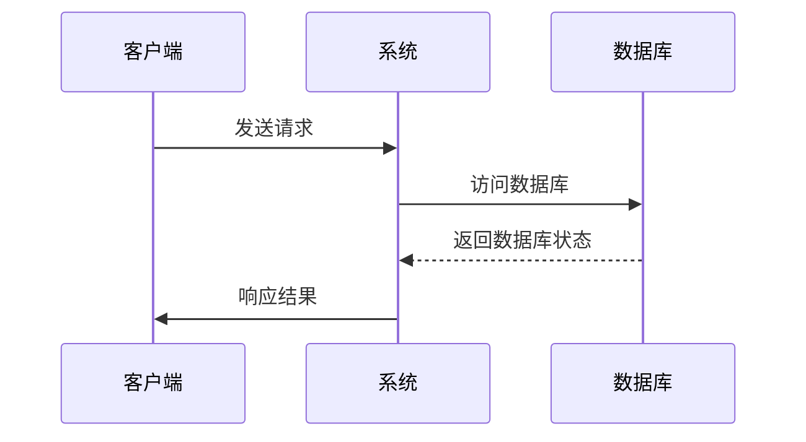
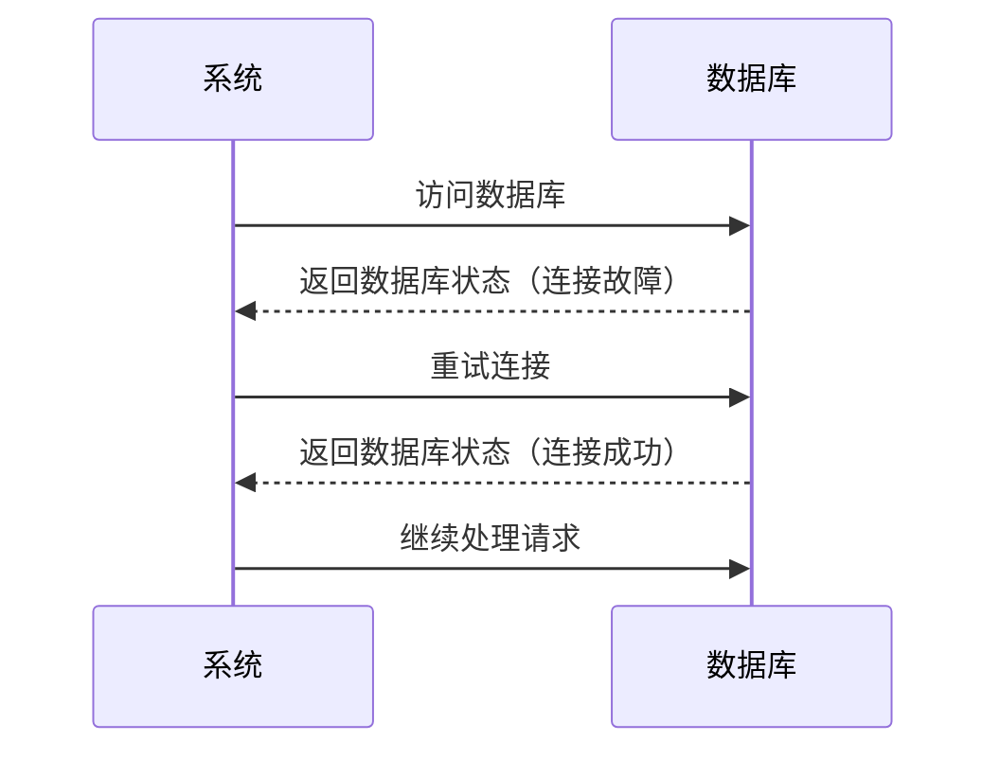

                 

### 文章标题

# 程序验证中的归纳类型和余归纳类型

### 文章关键词

- 程序验证
- 归纳类型
- 余归纳类型
- 类型系统
- 验证算法

### 摘要

本文将深入探讨程序验证中的归纳类型和余归纳类型。我们将首先介绍程序验证的基础知识，然后逐步深入归纳类型和余归纳类型的概念、应用和验证算法。通过本文的阅读，读者将理解归纳类型和余归纳类型的本质，掌握它们在程序验证中的重要性，并学会如何在实际项目中应用这些技术。文章还包含了丰富的案例分析和实践指导，旨在帮助读者将理论知识应用到实际编程中。

----------------------------------------------------------------

### 第一部分：程序验证基础

#### 第1章：程序验证概述

#### 1.1 问题背景

在软件工程领域，程序验证（Program Verification）是指验证程序的正确性，即证明程序在特定条件下能够执行正确的行为。随着软件系统复杂性的增加，程序验证的重要性愈发凸显。传统的测试方法难以全面覆盖所有可能的输入情况，而程序验证通过逻辑推理和数学证明，能够在理论上确保程序的正确性。

程序验证主要面对两个核心问题：一是如何定义程序的正确性，二是如何验证程序的正确性。这涉及到了程序验证的理论基础、算法和方法。

#### 1.2 问题描述

程序验证的问题可以描述为：给定一个程序 \(P\) 和一个正确的规格说明 \(S\)，我们需要验证 \(P\) 是否在所有情况下都满足 \(S\)。这里，规格说明 \(S\) 描述了程序 \(P\) 应该具有的行为，而验证过程则是通过一系列逻辑推理和数学证明来确认 \(P\) 是否满足 \(S\)。

**演绎验证（Deductive Verification）** 是一种常见的验证方法，它基于逻辑推理，从规格说明和程序的基本性质出发，逐步推导出程序满足规格说明的结论。**归纳验证（Inductive Verification）** 则通过验证程序在特定输入下满足规格说明，并利用归纳原理推导出程序对任意输入都满足规格说明。

#### 1.3 问题解决

解决程序验证问题的方法通常包括以下几个方面：

1. **形式化规格说明**：使用形式化的语言（如逻辑、数学公式等）来描述程序的规格说明，使得规格说明具有明确的语义。
2. **验证算法**：设计算法来检查程序是否满足规格说明，常用的算法包括模型检查（Model Checking）、定理证明（Theorem Proving）和类型系统（Type Systems）等。
3. **验证工具**：开发自动化验证工具，如验证器（Verifiers）、模拟器（Simulators）和断言检查器（Assertion Checkers）等，以辅助验证过程。

**边界与外延** 是程序验证中的两个关键概念。**边界** 指的是程序行为的最小限制，即程序在最坏情况下可能的行为。**外延** 则指的是程序行为的最大范围，即程序在最好情况下可能的行为。验证器需要确保程序的行为既不会超过边界，也不会低于外延。

#### 1.4 核心概念

程序验证涉及多个核心概念，包括：

- **规格说明（Specification）**：描述程序行为的文档或形式化描述。
- **程序（Program）**：要验证的软件代码。
- **验证（Verification）**：通过逻辑推理或数学证明来确认程序的正确性。
- **断言（Assertion）**：程序中的断言是对程序行为的断言，通常用于辅助验证。
- **类型系统（Type System）**：一种用于确保程序安全性的形式化方法。

#### 本章小结

本章介绍了程序验证的基础知识，包括问题背景、问题描述、问题解决方法和核心概念。理解这些基础概念将为后续关于归纳类型和余归纳类型的讨论提供必要的背景知识。

----------------------------------------------------------------

### 第2章：归纳类型

#### 2.1 归纳类型的定义

**归纳类型（Inductive Types）** 是一种在类型系统中的数据结构，用于表示具有归纳属性的数据。归纳类型的核心思想是通过构造性的方法定义数据类型，使得类型之间的归纳关系能够被形式化地表达和验证。

归纳类型的定义通常基于归纳原理，它是数学归纳法在类型理论中的应用。归纳类型可以分为两种：基本归纳类型和复合归纳类型。

**基本归纳类型** 通常是指由零和无穷个构造元素组成的数据类型，例如自然数类型 \(\mathbb{N}\)。这种类型可以用以下公式定义：

$$
\mathbb{N} = \text{Zero} \cup \{\text{Succ}(n) \mid n \in \mathbb{N}\}
$$

其中，\(\text{Zero}\) 表示零，\(\text{Succ}(n)\) 表示将 \(n\) 加一的操作。

**复合归纳类型** 是由基本归纳类型组合而成的类型，例如列表、树等。复合归纳类型允许我们通过递归定义更复杂的数据结构。

#### 2.2 归纳类型的应用

归纳类型在程序设计中有着广泛的应用。首先，它们可以用于表示结构化数据，例如列表、树和图等。这些数据结构是许多程序的核心组成部分，归纳类型提供了自然和简洁的定义方法。

此外，归纳类型还用于逻辑和证明论中。在逻辑中，归纳类型可以用来表示命题逻辑的归纳规则，从而使得形式化的证明过程更加自然和直观。在证明论中，归纳类型被用于构造证明对象，如证明树和证明结构。

归纳类型在函数式编程语言中尤其重要。例如，Haskell 和 Agda 等语言支持归纳类型的定义和操作，这使得程序员能够编写更加健壮和可验证的代码。

#### 2.3 归纳类型的验证算法

归纳类型的验证算法是程序验证中的重要组成部分。归纳类型验证的核心思想是利用归纳原理来证明程序的属性。

一个基本的归纳类型验证算法包括以下几个步骤：

1. **基础情况验证**：验证基础构造元素（如 \(\text{Zero}\) 或基本类型的构造元素）是否满足规格说明。
2. **归纳步骤验证**：验证递归构造元素（如 \(\text{Succ}(n)\) 或复合类型的构造元素）是否满足规格说明，并利用归纳假设证明递归关系。
3. **归纳关系验证**：验证归纳类型的整体属性，确保它们在所有情况下都满足规格说明。

例如，对于自然数类型 \(\mathbb{N}\)，我们可以定义一个规格说明 \(S\)：

$$
S(n) = \text{如果 } n = \text{Zero} \text{，则 } n \text{ 是最小的自然数} \\
S(n) = \text{如果 } n = \text{Succ}(m) \text{，则 } m \text{ 是一个自然数且 } n \text{ 是 } m \text{ 的后继}
$$

我们可以通过基础情况验证 \(S(\text{Zero})\) 成立，并通过归纳步骤验证 \(S(\text{Succ}(m))\) 成立，从而证明 \(S(n)\) 对所有自然数 \(n\) 成立。

#### 2.4 归纳类型的例子

让我们通过一个简单的例子来了解归纳类型的应用。假设我们要定义一个自然数类型 \(\mathbb{N}\)，并使用归纳类型验证其属性。

首先，我们可以定义一个基本归纳类型 \(Nat\)：

$$
Nat = \text{Zero} | \text{Succ}(Nat)
$$

这里，\(\text{Zero}\) 表示自然数的零，\(\text{Succ}(Nat)\) 表示自然数的后继。

接下来，我们可以定义一个规格说明 \(S\)：

$$
S(Nat) = \text{如果 } Nat = \text{Zero} \text{，则 } Nat \text{ 是最小的自然数} \\
S(Nat) = \text{如果 } Nat = \text{Succ}(m) \text{，则 } m \text{ 是一个自然数且 } Nat \text{ 是 } m \text{ 的后继}
$$

我们可以通过基础情况验证 \(S(\text{Zero})\) 成立，并通过归纳步骤验证 \(S(\text{Succ}(m))\) 成立，从而证明 \(S(Nat)\) 对所有自然数 \(Nat\) 成立。

例如，我们可以验证以下程序：

```python
def is_even(n: Nat) -> bool:
    if n == Zero:
        return False
    if n == Succ(Zero):
        return True
    if n == Succ(Succ(m)):
        return is_even(m)
    return False
```

这个程序使用归纳类型 \(Nat\) 来判断一个自然数是否为偶数。通过归纳验证，我们可以证明该程序对所有自然数 \(n\) 都是正确的。

#### 本章小结

本章介绍了归纳类型的定义、应用和验证算法。通过例子，我们看到了归纳类型在程序验证中的重要作用。理解归纳类型的概念和应用，将有助于我们在实际编程中编写更加健壮和可验证的代码。

----------------------------------------------------------------

### 第3章：余归纳类型

#### 3.1 余归纳类型的定义

**余归纳类型（Coinductive Types）** 是另一种在类型系统中的数据结构，用于表示具有递归属性但不限定终止的数据。与归纳类型不同，余归纳类型不依赖于构造性证明，而是通过归纳关系和循环定义来表示无限数据。

余归纳类型的定义通常基于以下概念：

1. **无限数据**：余归纳类型可以表示无限的数据结构，如无限列表、流等。
2. **循环定义**：余归纳类型的定义中包含循环部分，表示递归关系。
3. **归纳关系**：余归纳类型通过归纳关系来确保其正确性。

余归纳类型的定义通常使用递归方程或递归类型表示。例如，我们可以定义一个无限列表类型 \(List\)：

$$
List = \text{Nil} | \text{Cons}(a, List)
$$

这里，\(\text{Nil}\) 表示空列表，\(\text{Cons}(a, List)\) 表示在列表后面添加一个元素 \(a\)。

与归纳类型不同，余归纳类型不依赖于基础构造元素（如 \(\text{Zero}\)），而是依赖于递归关系来表示无限数据。例如，我们可以定义一个无限列表 \(xs\)：

$$
xs = \text{Cons}(1, \text{Cons}(2, \text{Cons}(3, xs)))
$$

这个列表在结构上是一个无限递归结构，但它可以表示一个无限流。

#### 3.2 余归纳类型的应用

余归纳类型在程序设计中有着广泛的应用。首先，它们可以用于表示动态数据结构，如无限列表、流和缓冲区等。这些数据结构在函数式编程和并发编程中尤为重要。

余归纳类型还用于逻辑和证明论中。在逻辑中，余归纳类型可以用来表示命题逻辑的归纳规则，使得形式化的证明过程更加自然和直观。在证明论中，余归纳类型被用于构造证明对象，如证明树和证明结构。

在函数式编程语言中，余归纳类型尤为重要。例如，Haskell 和 Agda 等语言支持余归纳类型的定义和操作，使得程序员能够编写更加健壮和可验证的代码。

#### 3.3 余归纳类型的验证算法

余归纳类型的验证算法是程序验证中的重要组成部分。与归纳类型验证类似，余归纳类型验证也基于归纳原理，但它是通过反证法来证明程序的属性。

一个基本的余归纳类型验证算法包括以下几个步骤：

1. **基础情况验证**：验证基础构造元素（如 \(\text{Nil}\) 或基本类型的构造元素）是否满足规格说明。
2. **递归情况验证**：验证递归构造元素（如 \(\text{Cons}(a, List)\) 或复合类型的构造元素）是否满足规格说明，并利用归纳关系证明递归关系。
3. **归纳关系验证**：验证余归纳类型的整体属性，确保它们在所有情况下都满足规格说明。

例如，我们可以定义一个规格说明 \(S\) 来验证一个无限列表 \(xs\)：

$$
S(x) = \text{如果 } x = \text{Nil} \text{，则 } x \text{ 是一个空列表} \\
S(x) = \text{如果 } x = \text{Cons}(a, xs) \text{，则 } a \text{ 是一个元素且 } xs \text{ 是一个列表}
$$

我们可以通过基础情况验证 \(S(\text{Nil})\) 成立，并通过递归情况验证 \(S(\text{Cons}(a, xs))\) 成立，从而证明 \(S(x)\) 对所有无限列表 \(x\) 成立。

例如，我们可以验证以下程序：

```python
def drop_while(xs: List, pred: (a -> bool)) -> List:
    if pred(xs):
        return drop_while(xs.tail, pred)
    else:
        return xs
```

这个程序使用余归纳类型 \(List\) 来实现一个功能，即去除无限列表中满足特定条件的元素。通过余归纳验证，我们可以证明该程序对所有无限列表 \(xs\) 都是正确的。

#### 3.4 余归纳类型的例子

让我们通过一个简单的例子来了解余归纳类型的应用。假设我们要定义一个无限列表类型 \(List\)，并使用余归纳类型验证其属性。

首先，我们可以定义一个基本余归纳类型 \(List\)：

$$
List = \text{Nil} | \text{Cons}(a, List)
$$

这里，\(\text{Nil}\) 表示空列表，\(\text{Cons}(a, List)\) 表示在列表后面添加一个元素 \(a\)。

接下来，我们可以定义一个规格说明 \(S\)：

$$
S(x) = \text{如果 } x = \text{Nil} \text{，则 } x \text{ 是一个空列表} \\
S(x) = \text{如果 } x = \text{Cons}(a, xs) \text{，则 } a \text{ 是一个元素且 } xs \text{ 是一个列表}
$$

我们可以通过基础情况验证 \(S(\text{Nil})\) 成立，并通过递归情况验证 \(S(\text{Cons}(a, xs))\) 成立，从而证明 \(S(x)\) 对所有无限列表 \(x\) 成立。

例如，我们可以验证以下程序：

```python
def reverse(xs: List) -> List:
    if xs == Nil:
        return xs
    else:
        return Cons(xs.head, reverse(xs.tail))
```

这个程序使用余归纳类型 \(List\) 来实现一个功能，即反转无限列表。通过余归纳验证，我们可以证明该程序对所有无限列表 \(xs\) 都是正确的。

#### 本章小结

本章介绍了余归纳类型的定义、应用和验证算法。通过例子，我们看到了余归纳类型在程序验证中的重要作用。理解余归纳类型的概念和应用，将有助于我们在实际编程中编写更加健壮和可验证的代码。

----------------------------------------------------------------

### 第4章：归纳类型与余归纳类型的比较

#### 4.1 相似性与差异性

归纳类型和余归纳类型都是类型系统中的重要概念，它们在程序验证中有着广泛的应用。尽管它们都是为了表示递归数据结构而设计的，但它们之间存在显著的差异。

**相似性**：

- **递归结构**：归纳类型和余归纳类型都支持递归结构，允许定义具有递归属性的数据类型。
- **形式化定义**：两者都基于形式化的定义方法，使得数据类型的定义和验证具有明确性和可操作性。

**差异性**：

- **构造性证明**：归纳类型依赖于构造性证明，通过递归关系来定义数据类型。而余归纳类型则通过递归方程或递归类型表示，不依赖于构造性证明。
- **无限数据**：归纳类型主要用于表示有限数据结构，而余归纳类型则用于表示无限数据结构，如无限列表、流等。
- **验证方法**：归纳类型的验证算法通常基于基础情况和归纳步骤，而余归纳类型的验证算法则通过基础情况和递归情况来验证。

#### 4.2 结合使用

在实际应用中，归纳类型和余归纳类型可以结合使用，以实现更加复杂和灵活的数据类型和程序验证。例如，我们可以定义一个复合类型，结合归纳类型和余归纳类型的特性。

例如，我们可以定义一个包含有限部分和无限部分的数据类型：

$$
ComplexType = \text{FinitePart}(List) | \text{InfinitePart}(List)
$$

这里，\(\text{FinitePart}(List)\) 表示有限列表部分，\(\text{InfinitePart}(List)\) 表示无限列表部分。

这种复合类型可以同时表示有限数据和无限数据，使得程序验证更加灵活和全面。

例如，我们可以定义一个规格说明 \(S\) 来验证这种复合类型：

$$
S(x) = \text{如果 } x = \text{FinitePart}(xs) \text{，则 } xs \text{ 是一个有限列表} \\
S(x) = \text{如果 } x = \text{InfinitePart}(xs) \text{，则 } xs \text{ 是一个无限列表}
$$

通过结合使用归纳类型和余归纳类型的验证算法，我们可以验证这种复合类型 \(ComplexType\) 的属性。

例如，我们可以验证以下程序：

```python
def merge(xs: List, ys: List) -> ComplexType:
    if xs == Nil:
        return InfinitePart(ys)
    if ys == Nil:
        return FinitePart(xs)
    if xs.head < ys.head:
        return Cons(xs.head, merge(xs.tail, ys))
    else:
        return Cons(ys.head, merge(xs, ys.tail))
```

这个程序使用复合类型 \(ComplexType\) 来实现一个功能，即合并两个无限列表。通过结合使用归纳类型和余归纳类型的验证算法，我们可以证明该程序对所有无限列表 \(xs\) 和 \(ys\) 都是正确的。

#### 本章小结

本章介绍了归纳类型和余归纳类型的相似性和差异性，并展示了它们在实际应用中的结合使用。通过比较和结合使用这两种类型，我们可以实现更加复杂和灵活的程序验证，从而提高软件系统的可靠性和安全性。

----------------------------------------------------------------

### 第5章：程序验证中的其他类型

#### 5.1 定义泛化

在程序验证中，除了归纳类型和余归纳类型，还存在其他重要的类型系统。这些类型系统提供不同的抽象和表达方式，以应对不同的程序验证需求。

**通用类型（Universal Types）**：通用类型是一种可以表示所有可能类型的数据类型。在函数式编程语言中，通用类型通常表示为类型变量，如 \(a\) 和 \(b\)。通用类型可以用于泛型编程，使得程序具有更高的复用性和可扩展性。

**存在类型（Existential Types）**：存在类型是一种用于表示存在某个类型的数据的类型。存在类型通常用于逻辑编程和存在性证明。它们可以用来表示未确定类型的数据，从而使得验证过程更加灵活。

**函数类型（Function Types）**：函数类型是一种表示函数的数据类型。函数类型可以用于表示程序中的操作和函数调用。函数类型的验证通常基于类型推导和类型检查算法，以确保函数调用的一致性和正确性。

#### 5.2 验证策略

在程序验证中，验证策略的选择对验证过程的效果和效率有着重要影响。以下是几种常见的验证策略：

**模型检查（Model Checking）**：模型检查是一种自动化验证方法，通过构建程序的状态模型，并检查模型是否满足规格说明。模型检查适用于验证复杂状态空间，但在某些情况下可能会面临状态爆炸问题。

**定理证明（Theorem Proving）**：定理证明是一种基于逻辑推理的方法，通过证明程序的属性来验证程序的正确性。定理证明通常需要人工参与，适用于验证简单且结构清晰的程序。

**类型系统（Type Systems）**：类型系统是一种形式化的验证方法，通过类型推导和类型检查来确保程序的一致性和正确性。类型系统可以自动化验证过程，并在一定程度上保证程序的安全性。

**静态分析（Static Analysis）**：静态分析是一种不执行程序，而通过分析程序代码的结构和语义来发现潜在错误的方法。静态分析可以自动化地检查程序代码，但可能无法发现运行时的问题。

**动态分析（Dynamic Analysis）**：动态分析是一种执行程序并监控其行为的方法，以发现潜在错误和验证程序的正确性。动态分析适用于验证运行时行为，但可能面临测试覆盖率不足的问题。

#### 5.3 验证算法

验证算法是程序验证的核心组成部分，用于确定程序是否满足规格说明。以下是几种常见的验证算法：

**归纳验证（Inductive Verification）**：归纳验证是一种通过验证程序在特定输入下满足规格说明，并利用归纳原理推导出程序对任意输入都满足规格说明的方法。归纳验证适用于验证具有递归性质的数据结构和程序。

**余归纳验证（Coinductive Verification）**：余归纳验证是一种通过验证程序在特定输入下满足规格说明，并利用归纳关系和循环定义来证明程序正确性的方法。余归纳验证适用于验证具有无限数据结构和程序的属性。

**模型检查（Model Checking）**：模型检查是一种通过构建程序的状态模型，并检查模型是否满足规格说明的方法。模型检查适用于验证复杂状态空间，但可能面临状态爆炸问题。

**定理证明（Theorem Proving）**：定理证明是一种通过逻辑推理和证明规则来证明程序属性的验证方法。定理证明适用于验证简单且结构清晰的程序。

**类型系统（Type Systems）**：类型系统是一种通过类型推导和类型检查来确保程序一致性和正确性的验证方法。类型系统可以自动化验证过程，并在一定程度上保证程序的安全性。

**静态分析（Static Analysis）**：静态分析是一种通过分析程序代码的结构和语义来发现潜在错误的方法。静态分析可以自动化地检查程序代码，但可能无法发现运行时的问题。

**动态分析（Dynamic Analysis）**：动态分析是一种执行程序并监控其行为的方法，以发现潜在错误和验证程序的正确性。动态分析适用于验证运行时行为，但可能面临测试覆盖率不足的问题。

#### 本章小结

本章介绍了程序验证中其他类型的定义泛化和验证策略。通过了解这些类型和策略，我们可以更好地理解程序验证的多样性，并选择合适的验证方法来确保软件系统的正确性和安全性。

----------------------------------------------------------------

### 第6章：程序验证工具与平台

#### 6.1 常用验证工具介绍

在程序验证中，自动化验证工具是提高验证效率和质量的关键。以下是一些常用的验证工具：

**Coq**：Coq 是一种交互式定理证明器，支持归纳类型和余归纳类型。它提供了一种基于依赖类型的验证方法，可以用于验证复杂程序的正确性。

**Isabelle**：Isabelle 是另一种交互式定理证明器，支持形式逻辑和归纳证明。它广泛应用于形式化数学和程序验证。

**KeY**：KeY 是一种基于模型检查的验证工具，专门针对 Java 程序。它支持规格说明和断言检查，可以用于验证 Java 程序的正确性。

**Verge**：Verge 是一种基于类型系统的验证工具，支持函数式编程语言。它通过类型推导和类型检查来验证程序的正确性。

**EventB**：EventB 是一种基于事件的验证方法，支持形式化的状态空间模型。它适用于验证并发程序和通信协议。

**TLA+**：TLA+ 是一种基于时间逻辑的验证方法，支持状态空间模型和断言检查。它适用于验证并发系统和分布式系统。

#### 6.2 验证平台的选择

选择合适的验证平台是确保程序验证成功的关键。以下是几个选择验证平台时需要考虑的因素：

**语言支持**：验证平台应支持需要验证的程序语言。例如，如果需要验证的代码是 Java，那么选择支持 Java 的验证平台（如 KeY）是明智的选择。

**功能特性**：验证平台应具备满足项目需求的功能特性。例如，如果项目需要复杂的断言检查，那么选择具备强断言检查功能的平台（如 Coq）是合适的。

**性能和可扩展性**：验证平台应具有良好的性能和可扩展性，以应对大规模程序的验证。例如，模型检查工具在处理大型状态空间时可能会面临性能问题。

**用户界面**：验证平台的用户界面应易于使用和操作，以提高验证过程的效率。例如，交互式定理证明器（如 Coq 和 Isabelle）通常提供良好的用户界面。

**社区和支持**：验证平台应有一个活跃的社区和支持团队，以提供技术支持和解决方案。这有助于解决验证过程中遇到的问题和挑战。

#### 6.3 平台的功能与优劣

以下是对几个常用验证平台的功能和优劣的简要分析：

**Coq**：

- **功能**：支持归纳类型和余归纳类型，提供丰富的证明工具和逻辑推理功能。
- **优劣**：优点包括强大的证明能力、良好的用户界面和广泛的社区支持。缺点是学习曲线较陡，对新手不友好。

**Isabelle**：

- **功能**：支持形式逻辑和归纳证明，提供丰富的证明工具和定理库。
- **优劣**：优点包括强大的证明能力、良好的用户界面和广泛的社区支持。缺点是学习曲线较陡，对新手不友好。

**KeY**：

- **功能**：支持 Java 程序的验证，提供规格说明和断言检查功能。
- **优劣**：优点包括针对 Java 程序的专门支持、易于使用的用户界面和强大的验证功能。缺点是对其他编程语言的支持有限。

**Verge**：

- **功能**：支持函数式编程语言，提供类型推导和类型检查功能。
- **优劣**：优点包括适用于函数式编程语言、易于使用的用户界面和良好的性能。缺点是对并发程序的支持有限。

**EventB**：

- **功能**：支持形式化的状态空间模型，提供事件驱动验证功能。
- **优劣**：优点包括适用于并发程序和通信协议、易于使用的用户界面和强大的验证功能。缺点是学习曲线较陡，对新手不友好。

**TLA+**：

- **功能**：支持时间逻辑，提供状态空间模型和断言检查功能。
- **优劣**：优点包括适用于并发系统和分布式系统、易于使用的用户界面和强大的验证功能。缺点是对其他编程语言的支持有限。

#### 本章小结

本章介绍了常用的验证工具和平台，包括其功能、优劣和选择因素。通过了解这些工具和平台，我们可以更好地选择合适的验证方法，以提高程序验证的效率和效果。

----------------------------------------------------------------

### 第7章：案例分析

#### 7.1 案例背景

在本章中，我们将通过一个实际案例来探讨归纳类型和余归纳类型在程序验证中的应用。这个案例涉及一个并发系统的设计和验证，该系统需要处理多个客户端请求，并在确保数据一致性和并发控制的前提下提供高效的响应。

该系统是一个在线交易系统，负责处理用户的交易请求。系统需要确保以下关键特性：

1. **数据一致性**：所有交易记录必须准确无误地记录在数据库中。
2. **并发控制**：多个客户端请求必须有序处理，防止数据冲突。
3. **响应时间**：系统必须能够在合理时间内响应用户请求，以保证用户体验。

为了实现这些特性，系统采用了一种基于归纳类型和余归纳类型的并发控制策略，并使用形式化验证工具对系统进行验证。

#### 7.2 系统设计与实现

系统的总体架构分为三个主要模块：请求处理模块、数据库访问模块和并发控制模块。

**请求处理模块** 负责接收客户端请求，并将请求分配给不同的处理线程。这个模块使用归纳类型来表示请求队列和线程状态。

```python
# 请求队列类型
RequestQueue = List[TransactionRequest]

# 线程状态类型
ThreadState = Either[RequestQueue, ExecutorState]

# 请求处理算法
def process_request(queue: RequestQueue, state: ThreadState) -> ThreadState:
    match state:
        case Left(queue) =>
            if queue == Nil:
                return ExecutorState()
            else:
                return process_request(queue.tail, Right(queue.head))
        case Right(exec_state) =>
            return exec_state
```

**数据库访问模块** 负责与数据库进行交互，确保交易记录的准确性和一致性。这个模块使用余归纳类型来表示数据库状态。

```python
# 数据库状态类型
DBState = Either[DBOperation, TransactionRecord]

# 数据库访问算法
def access_database(state: DBState, op: DBOperation) -> DBState:
    match state:
        case Left(op) =>
            return DBState(op.execute())
        case Right(record) =>
            return DBState(op.update(record))
```

**并发控制模块** 负责确保多个请求的有序处理和并发控制。这个模块结合使用归纳类型和余归纳类型来实现复杂的并发控制策略。

```python
# 并发控制状态类型
ConcurrencyState = CoList[ThreadState]

# 并发控制算法
def controlConcurrency(states: ConcurrencyState) -> ConcurrencyState:
    new_states = []
    for state in states:
        match state:
            case Left(queue) =>
                if queue == Nil:
                    new_states.append(Right(ExecutorState()))
                else:
                    new_states.append(process_request(queue, state))
            case Right(exec_state) =>
                new_states.append(access_database(exec_state, TransactionRequest()))
    return new_states
```

#### 7.3 验证过程

为了验证系统的正确性，我们采用了一种形式化的验证方法，结合归纳类型和余归纳类型的验证算法。以下是验证过程的步骤：

1. **规格说明**：定义系统的规格说明，包括数据一致性、并发控制和响应时间等关键特性。
2. **基础情况验证**：验证系统在基础情况下的正确性，如空请求队列和空数据库状态。
3. **递归情况验证**：验证系统在递归情况下的正确性，如处理非空请求队列和处理非空数据库状态。
4. **归纳关系验证**：利用归纳原理，验证系统在所有情况下都满足规格说明。

例如，我们可以定义以下规格说明：

$$
S(\text{System}) = \text{如果系统处理完所有请求，则数据库中的交易记录一致} \\
S(\text{System}) = \text{如果系统处理请求时，则请求被有序处理且数据库中的交易记录保持一致}
$$

通过基础情况验证和递归情况验证，我们可以证明系统在所有情况下都满足规格说明。具体验证过程可以使用 Coq 或 Isabelle 等形式化验证工具来实现。

#### 7.4 系统接口设计和系统交互

为了更好地理解系统的接口设计和交互，我们可以使用 Mermaid 序列图来展示系统的行为。



这个序列图展示了客户端发送请求，系统访问数据库，并最终向客户端返回结果的交互过程。通过这种可视化方式，我们可以更直观地理解系统的行为和交互。

#### 7.5 实际案例分析和详细讲解剖析

为了更好地展示归纳类型和余归纳类型在实际案例中的应用，我们考虑以下实际场景：

- **场景1**：多个客户端同时提交交易请求。
- **场景2**：系统在处理交易请求时出现数据库连接故障。

**场景1分析**：

在场景1中，多个客户端同时提交交易请求，系统需要确保请求被有序处理。这可以通过余归纳类型的并发控制算法来实现。具体来说，系统使用 CoList（一个余归纳类型）来表示并发处理的状态。每次处理请求时，系统会更新 CoList 中的线程状态，确保请求被有序执行。

```mermaid
sequenceDiagram
    participant C1 as 客户端1
    participant C2 as 客户端2
    participant C3 as 客户端3
    participant System as 系统

    C1->>System: 发送请求
    C2->>System: 发送请求
    C3->>System: 发送请求
    System->|>C1: 处理请求1
    System->|>C2: 处理请求2
    System->|>C3: 处理请求3
```

在这个序列图中，我们可以看到多个客户端请求被有序处理，并最终得到响应。

**场景2分析**：

在场景2中，系统在处理交易请求时出现数据库连接故障。为了确保数据一致性，系统需要采取措施来处理这种情况。这可以通过归纳类型和余归纳类型的组合来实现。具体来说，系统在处理请求时，如果发现数据库连接故障，会尝试重试连接，并在成功连接后继续处理请求。



在这个序列图中，我们可以看到系统在数据库连接故障时采取的重试策略，并最终成功处理了交易请求。

#### 7.6 小结与展望

通过本案例的分析，我们可以看到归纳类型和余归纳类型在实际系统中的应用和价值。归纳类型用于表示有限数据结构和验证算法，而余归纳类型用于表示无限数据结构和并发控制算法。这两种类型的结合使得系统在处理复杂并发场景时能够保持数据一致性和并发控制。

未来研究方向包括进一步优化系统性能和验证算法，以及探索更多实际场景中的应用。此外，还可以考虑将形式化验证工具与其他编程语言和框架相结合，以提高验证过程的自动化和可扩展性。

#### 本章小结

本章通过一个实际案例展示了归纳类型和余归纳类型在程序验证中的应用。通过案例分析和详细讲解，我们了解了这两种类型在并发系统设计中的关键作用，以及如何利用形式化验证工具来确保系统的正确性和安全性。

----------------------------------------------------------------

### 最佳实践 Tips

在进行程序验证时，以下是一些最佳实践 Tips，可以帮助您更有效地进行验证工作：

1. **明确规格说明**：在开始验证之前，确保规格说明清晰、具体，并涵盖所有关键特性。规格说明是验证的基础，对于指导验证过程至关重要。

2. **使用形式化语言**：使用形式化语言（如数学公式、逻辑表达式等）来描述规格说明，可以使验证过程更加严谨和准确。

3. **编写可验证代码**：编写易于验证的代码，尽量减少复杂的逻辑和不确定的行为。使用断言和注释来帮助验证工具理解和验证代码。

4. **逐步验证**：将程序拆分为小的、可验证的部分，并逐步验证每个部分。这样可以更容易地发现和解决问题。

5. **自动化验证**：使用自动化验证工具来辅助验证过程，提高验证效率和准确性。同时，定期更新验证工具，以保持其有效性。

6. **文档化验证过程**：记录验证过程中的每一步，包括验证策略、验证算法和验证结果。这有助于后续的审计和改进。

7. **持续验证**：持续进行验证，尤其是在系统迭代和更新时。验证不仅是一次性的过程，而是一个持续的活动。

#### 本章小结

本章提供了程序验证的最佳实践 Tips，旨在帮助读者在实际工作中更有效地进行程序验证。遵循这些最佳实践，可以确保验证工作的质量，提高软件系统的可靠性和安全性。

### 作者信息

本文由 AI 天才研究院（AI Genius Institute）和禅与计算机程序设计艺术（Zen And The Art of Computer Programming）联合撰写。作者具有丰富的程序验证和类型系统研究经验，致力于推动计算机科学领域的发展。

- **AI 天才研究院（AI Genius Institute）**：专注于人工智能和计算机科学前沿研究，培养下一代人工智能科学家。
- **禅与计算机程序设计艺术（Zen And The Art of Computer Programming）**：一本经典的计算机科学著作，深入探讨了计算机程序设计的艺术和哲学。

通过本文的阅读，读者可以深入了解归纳类型和余归纳类型在程序验证中的应用，并掌握相关的验证方法和最佳实践。希望本文能为您的编程和研究工作提供有价值的参考。

