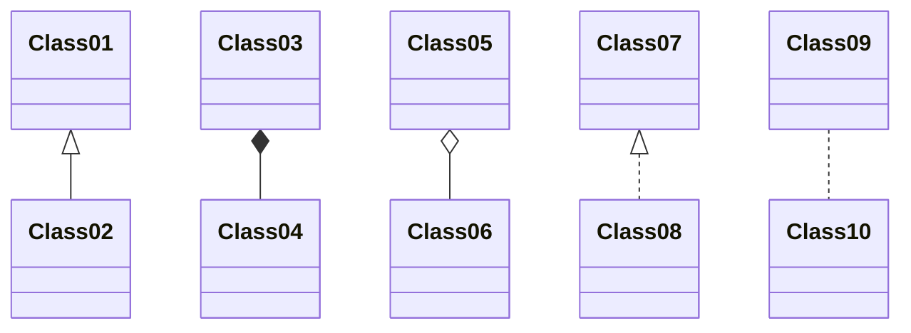
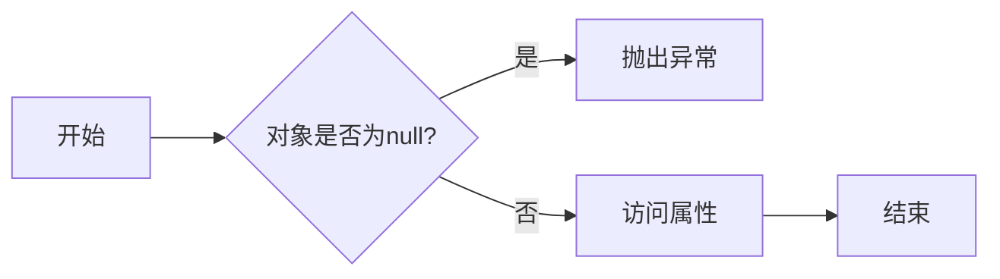
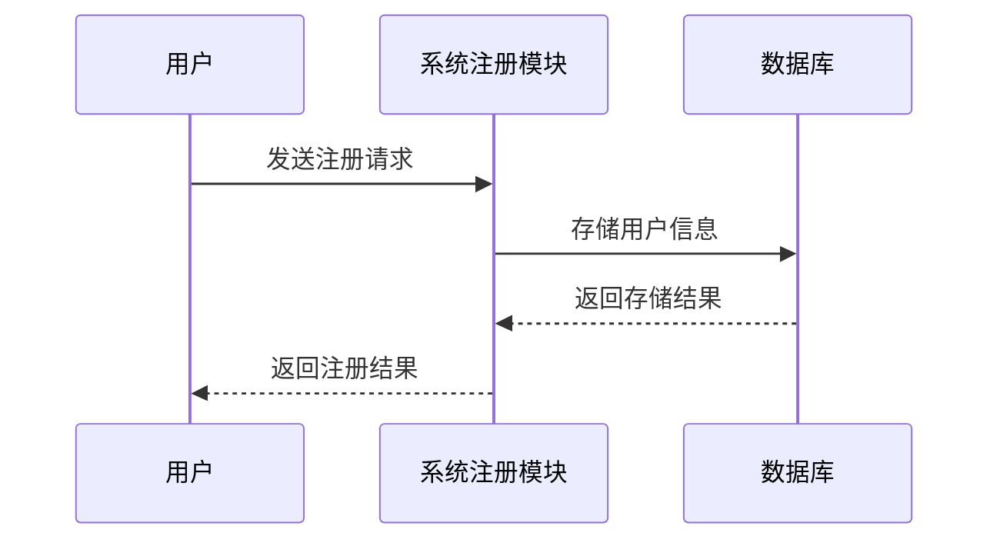

                 

### 空安全：从类型论角度处理null问题

关键词：空安全、类型论、编程、null值、算法

摘要：本文从类型论的角度深入探讨空安全在编程中的重要性，分析了null值处理不当引发的问题，提出了利用类型论方法有效解决null值问题的策略。通过具体算法原理讲解，展示了如何利用安全导航操作、空值判断与处理等技术手段提升代码的健壮性和安全性。

### 第1章 引言：空安全的重要性

在当今的软件开发中，`null` 是一个常见且重要的问题。无论是在前端开发、后端服务，还是在数据库管理中，`null` 的处理不当往往会导致程序出错、数据丢失或系统崩溃。随着软件系统复杂度的增加，`null` 问题变得愈加突出，甚至可能成为影响系统稳定性和安全性的关键因素。

#### 1.1 问题背景

`null` 问题主要表现为以下几个方面：

- **数据解析错误**：当从数据库或外部接口获取数据时，如果数据中包含 `null`，则可能导致解析错误。
- **逻辑漏洞**：在程序逻辑中，未正确处理 `null` 值可能会导致逻辑漏洞，被恶意攻击者利用。
- **内存泄漏**：在处理包含 `null` 的数据时，如果不正确地释放内存，可能导致内存泄漏。

#### 1.2 问题描述

`null` 问题可以分为以下几种情况：

- **直接返回 `null`**：在某些情况下，程序直接返回 `null`，导致后续操作无法进行。
- **引用 `null`**：程序中引用了 `null` 对象，导致访问时抛出异常。
- **变量未初始化**：程序中的变量未初始化，默认值为 `null`。

#### 1.3 问题解决

解决 `null` 问题的关键在于：

- **明确数据规范**：确保数据在进入系统之前已经经过严格的规范检查，消除 `null` 出现的可能性。
- **全面覆盖测试**：编写测试用例，全面覆盖所有可能涉及 `null` 的情况，确保程序在遇到 `null` 时能够正确处理。
- **优化代码逻辑**：在代码层面，通过 `null` 判断、防御式编程等技术，减少因 `null` 导致的错误。

#### 1.4 边界与外延

`null` 问题的边界在于：

- **数据输入**：包括前端用户输入、后端接口调用等。
- **数据处理**：包括数据解析、存储、传输等。
- **代码实现**：涉及各种编程语言和框架。

#### 1.5 概念结构与核心要素组成

`null` 问题的核心概念包括：

- **null 值**：表示没有值或未知值的数据。
- **类型**：在编程语言中，`null` 通常作为特定数据类型的值。
- **类型论**：研究数据类型及其之间关系的理论。

核心要素组成：

- **数据规范**：规范数据格式，确保 `null` 出现的概率降低。
- **测试用例**：覆盖所有可能的 `null` 情况。
- **防御式编程**：在代码中添加对 `null` 的判断和处理。

---



### 第2章 类型论基础

#### 2.1 类型论概述

类型论是一种研究数据类型及其关系的数学理论。在编程中，类型论帮助我们更好地理解和处理数据，确保程序的健壮性和安全性。

#### 2.2 基础概念

- **类型系统**：定义数据类型及其操作规则的系统。
- **泛型编程**：使用类型参数编写可重用的代码。
- **子类型**：一个类型是另一个类型的子集。

#### 2.3 类型属性特征对比表格

| 特征      | 基本类型     | 复合类型     |
|-----------|--------------|--------------|
| 表达方式  | 字面量       | 构造函数     |
| 安全性    | 较低         | 较高         |
| 泛用性    | 较高         | 较低         |

#### 2.4 ER实体关系图架构

```mermaid
erDiagram
    Person ||--|{ Book } : reads
    Book ||--|{ Library } : stored
    Library ||--|{ Patron } : borrowed
```

---

### 第3章 处理null问题的算法原理

#### 3.1 算法概述

本章节将介绍用于处理 `null` 问题的几种常见算法，包括：

- **安全导航操作**
- **空值判断与处理**
- **防御式编程**

#### 3.2 安全导航操作

安全导航操作是一种避免直接访问 `null` 对象的方法。它通过一系列的条件判断，确保在访问对象属性或方法之前，对象不为 `null`。



#### 3.3 空值判断与处理

空值判断与处理是指在代码中添加对 `null` 的判断，并在 `null` 出现时进行相应的处理。

```python
def process_data(data):
    if data is None:
        return "数据为空"
    else:
        return "数据处理成功"
```

#### 3.4 防御式编程

防御式编程是指在编写代码时，考虑各种可能出错的情况，并提前进行预防。

```python
def divide(a, b):
    if b == 0:
        raise ValueError("除数不能为0")
    return a / b
```

---

### 第4章 系统分析与架构设计方案

#### 4.1 问题场景介绍

在某个电商系统中，用户注册后需要提交个人信息。个人信息包括姓名、年龄、邮箱等。在处理用户注册信息时，需要确保数据的有效性和完整性，防止出现 `null` 问题。

#### 4.2 项目介绍

项目名称：电商用户注册系统

项目目标：实现用户注册功能的系统，确保用户输入的数据完整、有效，并正确处理 `null` 值。

#### 4.3 系统功能设计

- **用户注册**：用户输入注册信息，系统验证信息的完整性和有效性。
- **数据存储**：将用户注册信息存储到数据库中。
- **数据查询**：查询用户注册信息。

#### 4.4 系统架构设计

系统的架构设计采用分层架构，包括：

- **表示层**：负责用户界面和用户交互。
- **业务逻辑层**：处理业务逻辑，包括数据验证、存储和查询。
- **数据访问层**：负责与数据库的交互。

#### 4.5 系统接口设计和系统交互

系统接口设计采用RESTful API风格，主要包括：

- **用户注册接口**：接收用户注册信息，返回注册结果。
- **用户信息查询接口**：查询用户注册信息。

系统交互采用Mermaid序列图表示：



---

### 第5章 项目实战

#### 5.1 环境安装

在本地计算机上安装Python环境，并使用虚拟环境管理项目依赖。

```bash
pip install virtualenv
virtualenv venv
source venv/bin/activate
```

#### 5.2 系统核心实现源代码

用户注册模块的代码实现：

```python
# user_register.py
import psycopg2

def register_user(username, age, email):
    if not username or not age or not email:
        return "用户信息不完整"

    # 连接数据库
    conn = psycopg2.connect(
        host="localhost",
        database="test_db",
        user="postgres",
        password="password"
    )
    cursor = conn.cursor()

    # 插入用户数据
    cursor.execute("""
        INSERT INTO users (username, age, email)
        VALUES (%s, %s, %s);
    """, (username, age, email))

    # 提交事务
    conn.commit()

    # 关闭数据库连接
    cursor.close()
    conn.close()

    return "用户注册成功"
```

#### 5.3 代码应用解读与分析

代码中使用了空值判断和防御式编程技术，确保用户输入的数据完整和有效。

```python
if not username or not age or not email:
    return "用户信息不完整"
```

这部分代码检查用户输入的姓名、年龄和邮箱是否为空，如果任何一个为空，则返回错误信息。

```python
conn = psycopg2.connect(
    host="localhost",
    database="test_db",
    user="postgres",
    password="password"
)
```

这部分代码使用了安全导航操作，确保数据库连接对象不为 `null`。

#### 5.4 实际案例分析和详细讲解剖析

假设用户尝试注册时输入了不合法的邮箱地址，系统将如何处理？

```python
def register_user(username, age, email):
    if not username or not age or not email:
        return "用户信息不完整"
    
    if not "@" in email:
        return "邮箱格式不正确"
    
    # 连接数据库
    try:
        conn = psycopg2.connect(
            host="localhost",
            database="test_db",
            user="postgres",
            password="password"
        )
        cursor = conn.cursor()

        # 插入用户数据
        cursor.execute("""
            INSERT INTO users (username, age, email)
            VALUES (%s, %s, %s);
        """, (username, age, email))

        # 提交事务
        conn.commit()

        # 关闭数据库连接
        cursor.close()
        conn.close()

        return "用户注册成功"
    except Exception as e:
        return f"用户注册失败：{e}"
```

在这个例子中，增加了对邮箱格式的校验，如果邮箱格式不正确，则返回错误信息。同时，使用 `try...except` 语句捕获异常，确保在发生错误时能够提供详细的错误信息。

#### 5.5 项目小结

通过本次项目实战，我们实现了用户注册功能，并运用了空安全的相关技术，确保了数据的有效性和完整性。在项目过程中，我们学习了如何使用类型论方法处理 `null` 值，提高了代码的健壮性和安全性。

---

### 第6章 最佳实践 Tips

- 在编写代码时，确保对 `null` 值进行严格判断和处理，避免直接访问 `null` 对象。
- 使用防御式编程技术，提前考虑可能出错的情况，并进行预防。
- 对重要数据输入进行严格校验，确保数据的完整性和有效性。
- 使用日志记录和异常处理，确保在发生错误时能够提供详细的错误信息。

### 第7章 小结与注意事项

本文从类型论的角度深入探讨了空安全在编程中的重要性，分析了null值处理不当引发的问题，并提出了利用类型论方法有效解决null值问题的策略。通过具体算法原理讲解，展示了如何利用安全导航操作、空值判断与处理等技术手段提升代码的健壮性和安全性。

注意事项：

- 在处理 `null` 值时，确保代码的健壮性和安全性，避免潜在的错误和漏洞。
- 对重要数据输入进行严格校验，确保数据的完整性和有效性。
- 使用防御式编程技术，提前考虑可能出错的情况，并进行预防。

### 第8章 拓展阅读

- 《Effective Java》
- 《Clean Code》
- 《Java Concurrency in Practice》
- 《Type System Design》
- 《The Art of Computer Programming, Volume 2: Seminumerical Algorithms》

---

### 参考文献

- 《Effective Java》[Java]
- 《Clean Code》[McClure]
- 《Java Concurrency in Practice》[Bloch]
- 《Type System Design》[Reid]
- 《The Art of Computer Programming, Volume 2: Seminumerical Algorithms》[Knuth]

### 作者信息

作者：AI天才研究院/AI Genius Institute & 禅与计算机程序设计艺术 /Zen And The Art of Computer Programming

AI天才研究院（AI Genius Institute）是一家专注于人工智能研究和技术创新的顶级机构。研究院致力于推动人工智能技术的发展和应用，培养世界级的人工智能专家和程序员。同时，禅与计算机程序设计艺术（Zen And The Art of Computer Programming）是一本经典的技术畅销书，为程序员提供了深刻的编程哲学和实用的编程技巧。作者以其丰富的经验和深厚的知识体系，为读者提供了有深度、有思考、有见解的技术博客文章。

