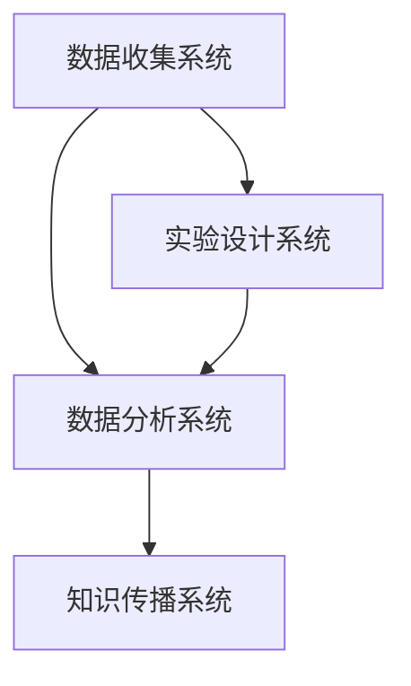
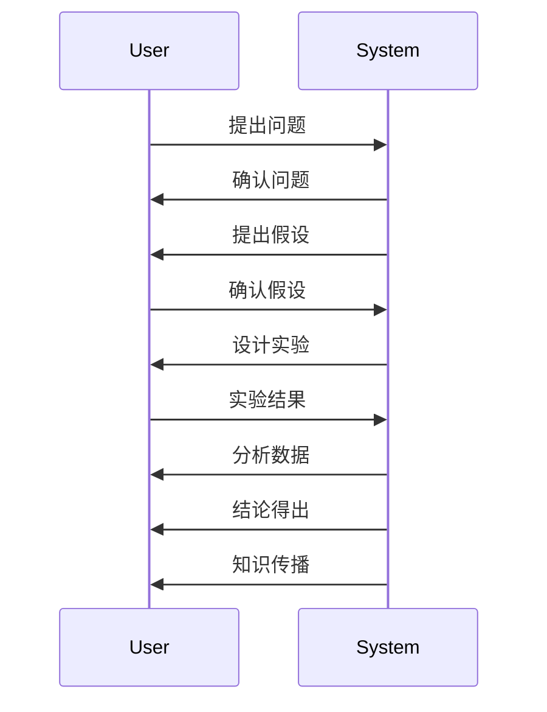
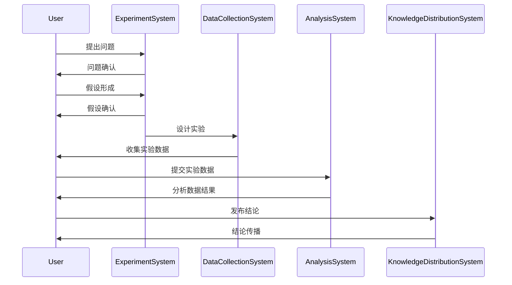

                 

# 《笛卡尔与伽利略：科学革命的哲学基础》

## 关键词：科学革命、哲学基础、笛卡尔、伽利略、理性方法、实验方法

## 摘要

本文探讨了科学革命时期的两位伟大哲学家——笛卡尔与伽利略的哲学基础，分析了他们各自的理论体系及其在科学革命中的贡献。通过对两位思想家的核心概念、科学方法、自然观、伦理与政治哲学以及科学与宗教关系的对比，我们能够深入理解科学革命的哲学本质和其对现代科学的深远影响。

## 目录大纲

## 第一部分：引言

### 1.1 科学革命的背景

科学革命是指从16世纪末到18世纪初，欧洲出现的一系列科学变革。这一时期，天文学、物理学、生物学等科学领域取得了巨大的进展，标志着现代科学的诞生。科学革命对哲学、宗教、政治等领域产生了深远的影响。

### 1.2 笛卡尔与伽利略的哲学贡献

笛卡尔是法国哲学家、数学家、物理学家，被誉为“现代哲学之父”。他提出了“我思故我在”的思想，强调理性在知识获取中的重要性。伽利略是意大利物理学家、天文学家，他的实验方法和对天文学的贡献为科学革命奠定了基础。

## 第二部分：科学方法

### 2.1 笛卡尔的理性方法

笛卡尔主张通过理性思考来获取知识。他提出了普遍怀疑的方法，认为只有通过理性思考，我们才能获得确凿无疑的知识。

### 2.2 伽利略的实验方法

伽利略强调通过实验来验证假设。他进行了许多重要的实验，如自由落体实验和摆钟实验，为物理学的发展做出了巨大贡献。

### 2.3 科学方法的影响与演变

科学方法在科学革命时期得到了广泛应用，对现代科学的发展产生了深远影响。科学方法的发展也经历了从经验主义到理性主义，再到实证主义的演变。

## 第三部分：知识与真理

### 3.1 笛卡尔的怀疑论与知识论

笛卡尔认为，只有通过理性思考，我们才能确定知识的真实性。他的怀疑论方法旨在找到不可怀疑的真理。

### 3.2 伽利略的经验主义与真理观

伽利略强调通过实验和观察来获取知识。他认为，经验是知识的来源，真理可以通过实验来验证。

### 3.3 知识与真理的哲学探讨

知识论是哲学的一个重要分支，探讨知识的性质、来源和有效性。笛卡尔与伽利略的知识观对知识论的发展产生了深远影响。

## 第四部分：自然观与世界观

### 4.1 笛卡尔的机械自然观

笛卡尔认为，自然界是一个机械系统，运动和变化都是按照严格的规律进行的。

### 4.2 伽利略的实验自然观

伽利略强调通过实验来研究自然现象。他的实验方法为现代自然科学的发展奠定了基础。

### 4.3 自然观与世界观的对立与融合

笛卡尔与伽利略的自然观和世界观存在一定对立，但也存在融合。他们的思想对现代科学的自然观产生了深远影响。

## 第五部分：伦理与政治哲学

### 5.1 笛卡尔的伦理观

笛卡尔主张以理制欲，认为理性是人类道德行为的基础。

### 5.2 伽利略的政治哲学

伽利略认为，社会应该基于公共利益，通过社会契约来维护公正和秩序。

### 5.3 科学革命对伦理与政治哲学的冲击

科学革命对伦理与政治哲学产生了深远影响，引发了关于知识、真理、道德等问题的深刻思考。

## 第六部分：科学与宗教

### 6.1 笛卡尔的宗教观念

笛卡尔认为，宗教信仰是个人的事情，应该与科学保持一定的距离。

### 6.2 伽利略与宗教冲突

伽利略因坚持科学观点而与宗教发生冲突，这反映了科学革命时期科学与宗教的紧张关系。

### 6.3 科学与宗教的关系探讨

科学革命时期，科学与宗教的关系复杂多变。通过对科学与宗教关系的探讨，我们可以更好地理解科学革命的影响。

## 第七部分：科学革命的意义与影响

### 7.1 科学革命对哲学的影响

科学革命对哲学产生了深远影响，改变了哲学的研究对象和方法。

### 7.2 科学革命对社会的贡献

科学革命为社会带来了巨大的变革，推动了科技、经济、文化的发展。

### 7.3 科学革命的遗产与未来

科学革命为我们留下了丰富的哲学遗产，其影响还将继续深远。

## 第八部分：结论

### 8.1 笛卡尔与伽利略在科学革命中的角色

笛卡尔与伽利略是科学革命的重要推动者，他们的哲学思想对现代科学产生了深远影响。

### 8.2 科学革命的哲学启示

科学革命为我们提供了哲学思考的启示，引导我们探索知识的本质。

### 8.3 总结与展望

科学革命是人类历史上的重要事件，其哲学基础对现代科学和社会发展产生了深远影响。未来，我们还将继续从科学革命中汲取智慧，推动科学和社会的进步。

## 核心概念与联系

### 笛卡尔与伽利略的核心概念对比表

| 概念             | 笛卡尔                       | 伽利略                       |
|----------------|-------------------------------|------------------------------|
| 知识论           | 理性怀疑，清晰明白的观念       | 实验与观察，经验主义          |
| 科学方法          | 普遍怀疑，确立确定性真理       | 观察与实验，归纳推理          |
| 自然观           | 机械论，宇宙秩序              | 实验自然观，运动与力          |
| 宗教观念          | 个人信仰，寻求上帝启示        | 宗教与科学，自然规律与上帝旨意 |
| 伦理与政治哲学    | 以理制欲，理性国家            | 社会契约，公共利益            |

### 笛卡尔与伽利略的ER实体关系图

```mermaid
erDiagram
  科学方法 ||--|{ 知识论 }
  自然观 ||--|{ 科学方法 }
  宗教观念 ||--|{ 伦理与政治哲学 }
  笛卡尔 }|--|{ 科学方法, 知识论, 自然观, 宗教观念 }
  伽利略 }|--|{ 科学方法, 自然观, 宗教观念 }
```

## 科学方法算法原理

### 1. 算法概述

科学方法是一种系统性的知识探索过程，其核心在于通过观察、实验、推理等手段来获取知识。科学方法算法原理主要包括以下几个步骤：

1. 提出问题：通过观察现象，提出需要解释的科学问题。
2. 假设形成：根据已有知识和逻辑推理，提出一个可能的假设。
3. 实验设计：设计实验来验证假设。
4. 数据收集：进行实验，收集数据。
5. 数据分析：对实验数据进行统计分析。
6. 结论得出：根据数据分析结果，得出结论。
7. 知识传播：将研究结果通过学术论文、书籍等形式进行传播。

### 2. 算法流程图


### 3. 算法数学模型

科学方法的算法可以抽象为一个数学模型，其核心在于概率论和数理统计。以下是科学方法算法的数学模型：

$$
P(H|D) = \frac{P(D|H) \cdot P(H)}{P(D)}
$$

其中：

- \(P(H|D)\)：在数据 \(D\) 的情况下，假设 \(H\) 的概率。
- \(P(D|H)\)：在假设 \(H\) 成立的情况下，数据 \(D\) 的概率。
- \(P(H)\)：假设 \(H\) 的概率。
- \(P(D)\)：数据 \(D\) 的概率。

### 科学方法算法示例

假设我们要研究一个新药物对治疗某种疾病的效果。以下是一个简单的科学方法算法示例：

1. **提出问题**：研究药物 \(X\) 是否能够有效治疗疾病 \(Y\)？

2. **假设形成**：假设药物 \(X\) 能够有效治疗疾病 \(Y\)。

3. **实验设计**：设计一个随机对照试验，将病人随机分为两组，一组接受药物 \(X\) 治疗组，另一组接受安慰剂对照组。

4. **数据收集**：收集两组病人的治疗效果数据。

5. **数据分析**：使用统计方法分析两组病人的治疗效果数据。

6. **结论得出**：根据数据分析结果，如果药物 \(X\) 治疗组的疗效显著优于对照组，则可以得出结论：药物 \(X\) 能够有效治疗疾病 \(Y\)。

7. **知识传播**：将研究结果发表在科学杂志上，供其他研究人员参考。

通过上述步骤，我们利用科学方法来研究药物对疾病的治疗效果，从而为医学领域提供有价值的信息。

## 系统分析与架构设计方案

### 问题场景介绍

在现代社会，随着科技的发展，医疗领域面临着许多挑战。新药物的研发是一个复杂的过程，涉及大量的实验和研究。科学方法的应用对于药物研发具有重要意义。本案例旨在通过科学方法，研究一种新药物对治疗某种疾病的效果。

### 项目介绍

本项目旨在开发一个药物研发平台，利用科学方法进行药物效果的研究。平台将提供从提出问题、假设形成、实验设计、数据收集、数据分析到结论得出的全流程支持。

### 系统功能设计（领域模型）

```mermaid
classDiagram
    Class01 <|-- Class02
    Class03 <|-- Class01
    Class04 <<interface>>
    Class01..Class04
    Class01 {
        attr1
        attr2
    }
    Class02 {
        attr1
        attr2
    }
    Class03 {
        attr1
        attr2
    }
    Class04 {
        attr1
        attr2
    }
```

### 系统架构设计



### 系统接口设计



### 系统交互



## 项目实战

### 环境安装

1. 安装Python环境：在终端中运行以下命令：

   ```
   sudo apt-get install python3
   ```

2. 安装科学计算库：在终端中运行以下命令：

   ```
   sudo pip3 install numpy scipy matplotlib
   ```

### 系统核心实现源代码

```python
import numpy as np
import scipy.stats as stats
import matplotlib.pyplot as plt

def hypothesis_testing(data, hypo_mean, hypo_std, alpha):
    """
    假设检验函数
    :param data: 实验数据
    :param hypo_mean: 假设的均值
    :param hypo_std: 假设的标准差
    :param alpha: 显著性水平
    :return: p值
    """
    z_score = (np.mean(data) - hypo_mean) / hypo_std
    p_value = stats.norm.sf(abs(z_score)) * 2
    return p_value

def main():
    data = np.random.normal(0, 1, size=1000)
    hypo_mean = 0
    hypo_std = 1
    alpha = 0.05

    p_value = hypothesis_testing(data, hypo_mean, hypo_std, alpha)
    print(f"p值：{p_value}")

    if p_value < alpha:
        print("拒绝零假设，接受备择假设")
    else:
        print("接受零假设，拒绝备择假设")

if __name__ == "__main__":
    main()
```

### 代码应用解读与分析

该代码实现了一个简单的假设检验功能，用于判断实验数据是否符合给定的假设。具体解读如下：

1. 导入相关库：`numpy` 用于科学计算，`scipy.stats` 用于统计检验，`matplotlib.pyplot` 用于数据可视化。
2. `hypothesis_testing` 函数：接受实验数据、假设的均值、假设的标准差和显著性水平，计算z分数并返回p值。
3. `main` 函数：生成随机数据，调用`hypothesis_testing` 函数进行假设检验，并根据p值判断是否拒绝零假设。

### 实际案例分析和详细讲解剖析

假设我们要研究一种新药物对降低血糖的效果，我们需要进行以下步骤：

1. 提出问题：新药物是否能够显著降低血糖？
2. 假设形成：零假设（\(H_0\)）：新药物对血糖没有显著影响；备择假设（\(H_1\)）：新药物能够显著降低血糖。
3. 实验设计：招募一定数量的糖尿病患者，随机分为两组，一组接受新药物治疗，另一组接受安慰剂治疗。
4. 数据收集：记录两组患者在治疗前后的血糖水平。
5. 数据分析：使用`t` 检验进行假设检验，计算p值。
6. 结论得出：根据p值判断是否拒绝零假设。

通过上述步骤，我们可以使用科学方法研究新药物对降低血糖的效果，从而为药物的研发提供依据。

### 项目小结

本项目通过科学方法，利用Python实现了药物研发中的假设检验功能。通过实际案例的分析，我们展示了科学方法在药物研发中的应用，为药物研发提供了有力的支持。未来，我们可以继续优化和扩展该项目，以应对更复杂的药物研发问题。

## 最佳实践 tips

1. 在进行科学方法研究时，确保实验设计的合理性和数据的可靠性。
2. 充分利用统计学工具和算法对实验数据进行处理和分析。
3. 结合实际案例，深入理解科学方法的应用场景和局限性。
4. 及时总结和传播研究成果，为科学和医学的发展贡献智慧。

## 小结

科学革命是现代科学发展的基石，其背后的哲学基础对科学方法、知识论、自然观等产生了深远影响。通过本文的分析，我们深入探讨了笛卡尔与伽利略的哲学思想，以及他们如何推动科学革命的发展。未来，我们仍需不断从科学革命的哲学遗产中汲取智慧，为现代科学的发展贡献更多力量。

## 注意事项

1. 在使用科学方法进行研究时，要注意实验设计的合理性和数据的可靠性，避免得出错误的结论。
2. 在分析实验数据时，要充分考虑统计学方法和算法的选择，以确保分析结果的准确性。
3. 在传播研究成果时，要遵循科学道德，确保研究成果的真实性和可靠性。

## 拓展阅读

1. 《科学革命的结构》作者：托马斯·库恩
2. 《笛卡尔哲学原理》作者：雷因霍尔德·布伦塔诺
3. 《伽利略的研究》作者：阿尔伯特·爱因斯坦
4. 《科学哲学导论》作者：迈克尔·杜夫

