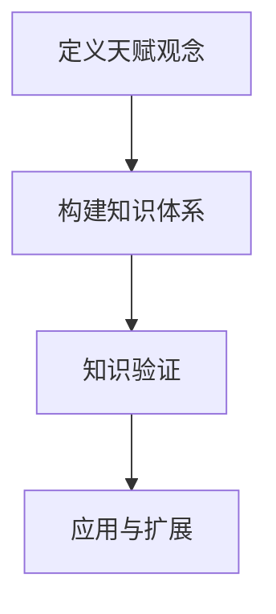
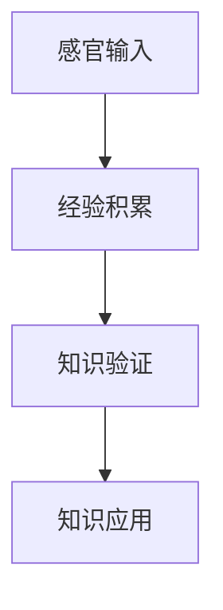
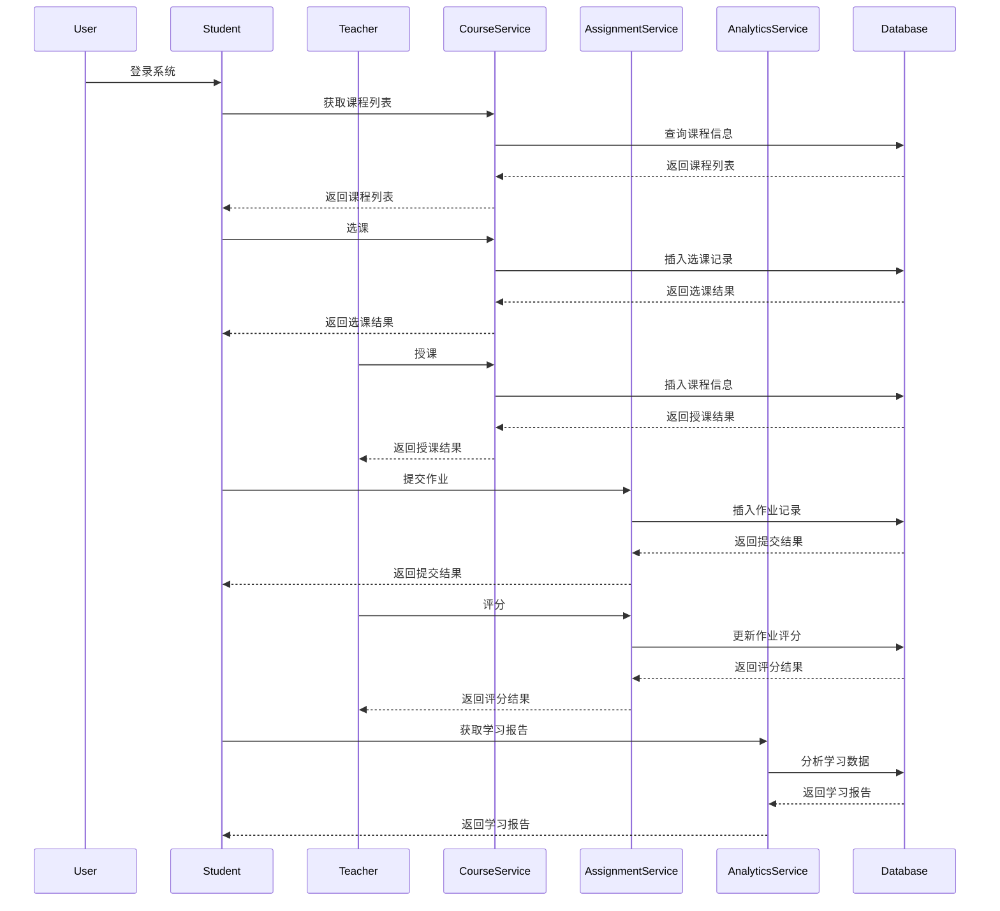
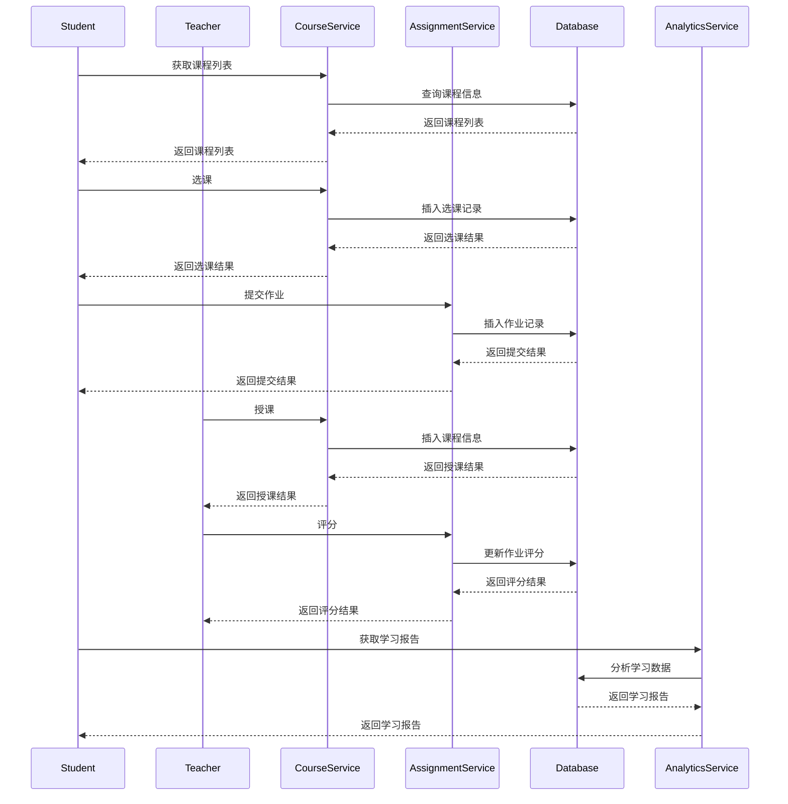
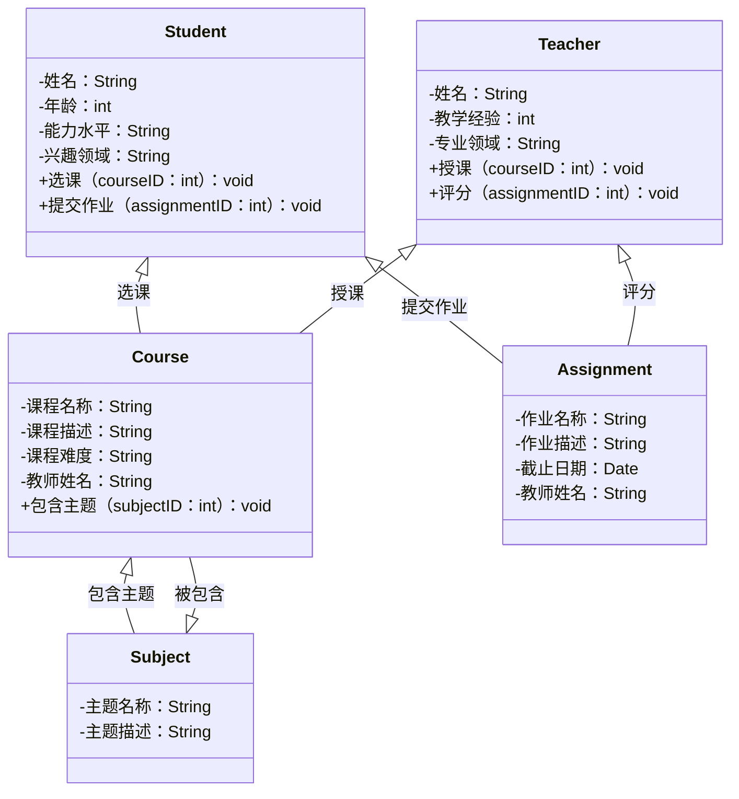
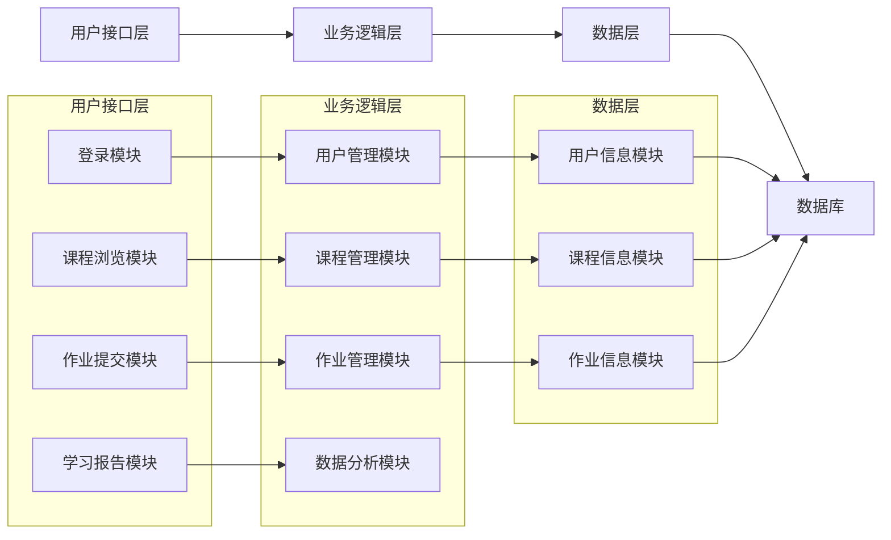
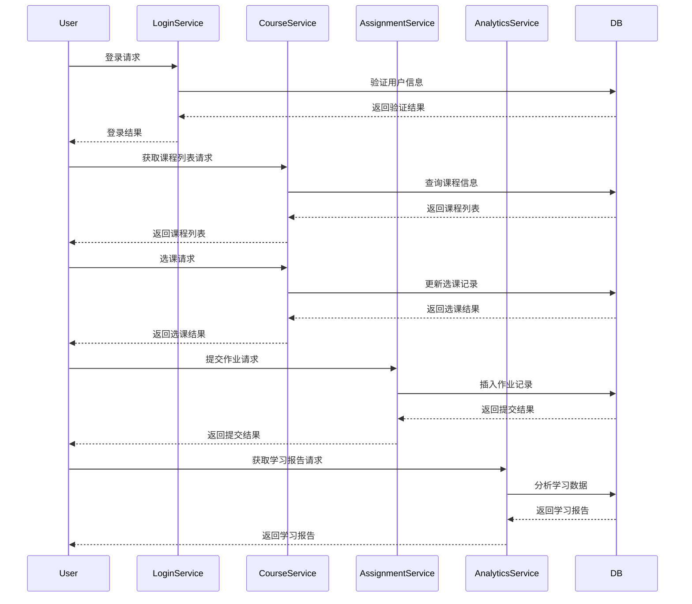

                 

### 引言

在哲学史中，笛卡尔与洛克是两位具有重要影响力的哲学家，他们的思想对后世产生了深远的影响。本文旨在探讨他们关于知识来源的两种截然不同的观点：笛卡尔的天赋观念论与洛克的白板说。这两个观点不仅在哲学领域引发了激烈的争论，也在认知科学和心理学中有着重要的应用价值。

首先，我们来看看笛卡尔的天赋观念论。笛卡尔认为，人的心灵中存在一些天赋的、不可证明的观念，这些观念是上帝赋予人类的，是知识的基础。这种观点强调内在、先天的认知能力，对于知识的主观性和直觉性有深刻的见解。

相比之下，洛克的白板说则主张，人的心灵像是一块白板，所有知识都是通过经验逐渐写入的。洛克认为，外界刺激通过感官传入大脑，然后在心灵中形成观念。这种观点强调外在、后天的认知过程，对于知识的客观性和经验性有独到的理解。

本文将首先介绍这两种观点的背景、定义和特点，然后通过对比分析，探讨它们的差异和联系。接下来，我们将详细讲解这两种观点的算法原理，使用mermaid流程图和Python源代码来展示它们的工作机制。此外，我们还将运用数学模型和公式，深入分析这些观点背后的逻辑关系。最后，本文将结合实际项目，探讨这些观点在现实中的应用，并提供最佳实践建议。

通过对笛卡尔与洛克天赋观念论与白板说之争的深入探讨，我们希望读者能够对知识来源的问题有更全面、深入的理解，同时也能够认识到不同观点之间的互补和互斥关系。让我们一步一步地深入思考，揭开这场哲学争论的神秘面纱。### 2.1.1 问题背景

在西方哲学史上，关于知识来源的探讨始终是一个核心议题。知识是如何获得的？我们的认知能力是基于内在的天赋，还是依赖于外在的经验？这一问题不仅关乎个体的认识过程，更涉及到人类文明的发展路径。

在17世纪，法国哲学家勒内·笛卡尔（René Descartes）和英国哲学家约翰·洛克（John Locke）分别提出了关于知识来源的两种截然不同的理论，即天赋观念论和白板说。这两个理论不仅在当时的哲学界引发了激烈的争论，也影响了后续几代哲学家的思考方向。

笛卡尔的天赋观念论认为，人的心灵中存在一些天赋的、不可证明的观念，这些观念是上帝赋予人类的，是知识的基础。笛卡尔认为，这些天赋观念是理性思考和科学发现的出发点。这种观点强调内在、先天的认知能力，对于知识的主观性和直觉性有深刻的见解。

相比之下，洛克的白板说则主张，人的心灵像是一块白板，所有知识都是通过经验逐渐写入的。洛克认为，外界刺激通过感官传入大脑，然后在心灵中形成观念。这种观点强调外在、后天的认知过程，对于知识的客观性和经验性有独到的理解。

这两种观点的出现，不仅是对知识本质的深入探讨，也反映了当时哲学家们对于人类认知过程的思考。在某种程度上，它们代表了两种截然不同的哲学思潮：一种强调内在的理性能力，另一种强调外在的经验积累。

然而，这两种观点也带来了诸多争议。例如，天赋观念论如何与经验论调和？白板说是否能够完全解释人类复杂多样的认知过程？这些问题成为哲学界争论的焦点，也促使后来的哲学家们不断寻求新的解释和解决方案。

总的来说，笛卡尔与洛克关于知识来源的争论，不仅丰富了哲学史的内容，也为我们理解人类认知过程提供了多维度的视角。在这个问题上，两种观点各有其合理性和局限性，同时也为我们思考知识的本质和人类认识世界的方式提供了宝贵的启示。### 2.1.2 问题描述

笛卡尔的天赋观念论和洛克的白板说虽然在基本立场上存在显著差异，但它们的核心问题却可以归纳为：知识是如何获得的？具体来说，这两种观点在面对以下几个问题时产生了根本性的分歧：

1. **知识的来源：** 笛卡尔认为知识源于内在的天赋观念，这些观念是上帝赋予人类的，是先验的；而洛克则主张知识源于外在的经验，这些经验是通过感官传递给大脑的，是后验的。这两种观点在知识来源的问题上形成了鲜明的对立。

2. **知识的本质：** 笛卡尔强调知识的主观性和直觉性，认为天赋观念是理性思考和科学发现的出发点；而洛克则强调知识的客观性和经验性，认为知识是通过感官和经验逐渐形成的。这两种观点在知识本质的理解上存在明显的分歧。

3. **认知过程：** 笛卡尔认为认知过程是基于内在的理性能力和直觉判断，强调理性思考和内在反省；而洛克则认为认知过程是基于外在的感官经验和反复验证，强调经验和观察。这两种观点在认知过程的描述和解释上存在深刻的差异。

4. **论证方式：** 笛卡尔倾向于使用内在直觉和逻辑推理来论证知识的可靠性，强调直观的、先验的论证方法；而洛克则倾向于使用外在观察和实验来验证知识的正确性，强调经验性的、实证的论证方法。这两种观点在论证方式的选择上存在明显的不同。

5. **哲学体系中的地位：** 在笛卡尔的哲学体系中，天赋观念论是其理性主义哲学的核心；而在洛克的哲学体系中，白板说是其经验主义哲学的基石。这两种观点在各自哲学体系中的地位和作用也存在显著的差异。

总之，笛卡尔与洛克关于知识来源的争论，涉及到了知识的本质、认知过程、论证方式等多个方面，它们不仅在哲学领域引发了激烈的讨论，也为我们理解人类认识世界的方式提供了多维度的视角。在这个问题上，两种观点各有其合理性和局限性，同时也为我们思考知识的本质和人类认识世界的方式提供了宝贵的启示。### 2.1.3 问题解决

为了解决笛卡尔与洛克关于知识来源的争论，我们可以从以下几个步骤进行深入分析和探讨：

1. **理解两种观点的核心立场：** 首先，我们需要明确笛卡尔的天赋观念论和洛克的白板说的核心立场。笛卡尔主张知识源于内在的天赋观念，这些观念是先验的、由上帝赋予的；而洛克则认为知识源于外在的经验，通过感官传递给大脑，是后验的。这种立场差异为我们理解他们的观点提供了基础。

2. **比较两种观点的优缺点：** 接下来，我们可以分析这两种观点的优缺点。笛卡尔的天赋观念论强调内在的理性能力和直觉，这有助于解释一些复杂和抽象的知识现象；但它的局限性在于，过于强调先验的、不可证明的观念，可能导致知识的可靠性问题。相比之下，洛克的白板说强调外在的经验和观察，这有助于确保知识的客观性和实证性；但它的局限性在于，可能无法完全解释人类复杂多样的认知过程。

3. **寻找共识点：** 尽管笛卡尔与洛克在知识来源的问题上存在显著差异，但他们也在某些方面有共识。例如，他们都认为知识是重要的，知识对于人类的认识世界和实现自我价值具有重要意义。此外，他们也都承认经验在知识形成中的作用，虽然他们对经验的理解有所不同。

4. **结合实际案例：** 为了更深入地理解这两种观点，我们可以结合实际案例进行分析。例如，在科学研究领域，我们可以探讨哪些知识是通过天赋观念获得的，哪些知识是通过经验积累获得的。通过这种案例分析，我们可以更好地理解两种观点在实际应用中的表现和效果。

5. **提出新的解释方案：** 在对两种观点进行深入分析后，我们可以尝试提出新的解释方案，以解决他们之间的争议。例如，我们可以提出一种综合性的观点，认为知识既包括内在的天赋观念，也包括外在的经验积累。在这种综合性的观点中，天赋观念和经验积累可以相互补充，共同促进知识的形成和发展。

通过以上步骤，我们可以对笛卡尔与洛克关于知识来源的争论有一个更全面、深入的理解，同时也能找到解决这一争论的方法和路径。这种方法不仅有助于我们理解哲学史上这场重要的争论，也能为我们思考知识本质和人类认知过程提供新的启示。### 2.1.4 边界与外延

在探讨笛卡尔与洛克关于知识来源的争论时，明确两者的边界与外延是至关重要的。这有助于我们理解他们的观点是如何在实际问题中应用和扩展的。

**笛卡尔天赋观念论的边界与外延：**

1. **边界：** 笛卡尔的天赋观念论主要关注内在的认知能力，强调先验的、不可证明的观念。这种观念的边界在于其主观性和直觉性，即知识来源于个体内心的直接体验，而非外在的经验。

2. **外延：** 尽管笛卡尔强调天赋观念，但他也认为这些观念需要通过逻辑推理和科学方法进行验证。因此，他的观点可以扩展到包括理性思考和科学探究在内的认知过程中。此外，笛卡尔的天赋观念论也对现代认知科学和心理学产生了深远影响，尤其是在解释人类直觉和洞察力方面。

**洛克白板说的边界与外延：**

1. **边界：** 洛克的白板说强调外在的经验和感官，认为知识是通过感官传递给大脑的。这种观点的边界在于其强调经验和观察，即知识来源于外在的刺激和感受。

2. **外延：** 洛克的白板说可以扩展到包括感官知觉、记忆和联想等认知过程。他的观点对现代心理学、教育学和认知科学产生了重要影响，特别是在解释人类的学习和记忆机制方面。此外，洛克的白板说也为社会契约论和民主政治理论提供了哲学基础。

**两种观点的边界与外延对比：**

1. **认知过程：** 笛卡尔的天赋观念论强调内在的直觉和理性，而洛克的白板说强调外在的经验和观察。这两种观点在认知过程中各有侧重，但也存在一定的互补性。

2. **知识来源：** 笛卡尔的天赋观念论认为知识源于内在的天赋观念，而洛克的白板说认为知识源于外在的经验。这两种观点在知识来源的问题上有明显的对立，但在实际应用中，它们可以相互补充，共同促进知识的形成和发展。

3. **影响范围：** 笛卡尔的天赋观念论对认知科学、心理学等领域产生了深远影响，而洛克的白板说对心理学、教育学和政治哲学等领域产生了重要影响。这两种观点在不同的学科领域中有各自的应用和外延。

总之，明确笛卡尔与洛克关于知识来源争论的边界与外延，有助于我们更深入地理解他们的观点，并在实际应用中充分发挥它们的作用。通过对比分析，我们也能更好地认识到两种观点的互补性和局限性，为解决知识来源问题提供新的思路和方法。### 2.1.5 概念结构与核心要素组成

为了更好地理解笛卡尔与洛克关于知识来源的争论，我们需要深入分析这两个概念的结构和核心要素。

**笛卡尔天赋观念论的概念结构与核心要素：**

1. **核心观念：** 天赋观念论认为，人的心灵中存在一些天赋的、不可证明的观念，这些观念是上帝赋予人类的，是知识的基础。

2. **逻辑关系：** 这些天赋观念被视为先验的、不可质疑的起点，是理性思考和科学发现的出发点。笛卡尔认为，通过天赋观念，我们能够建立起一个可靠的知识体系。

3. **核心要素：** 包括天赋观念的存在、先验性、不可证明性和知识的基础性。这些要素共同构成了笛卡尔天赋观念论的核心结构。

**洛克白板说的概念结构与核心要素：**

1. **核心观念：** 白板说认为，人的心灵像是一块白板，所有知识都是通过经验逐渐写入的。

2. **逻辑关系：** 洛克认为，外界刺激通过感官传入大脑，然后在心灵中形成观念。这种观点强调经验的积累和外在的观察，是知识形成的关键。

3. **核心要素：** 包括白板说的基本假设、经验的累积、感官的作用和观念的形成。这些要素共同构成了洛克白板说的核心结构。

**两种概念结构的对比：**

1. **知识来源：** 笛卡尔的天赋观念论强调内在的、先天的认知能力，而洛克的白板说强调外在的、后天的经验积累。

2. **认知过程：** 笛卡尔的观点强调直觉和理性的推理，而洛克的观点强调感官的观察和经验的积累。

3. **知识基础：** 笛卡尔认为天赋观念是知识的基础，洛克则认为经验是知识的基础。

通过对比分析，我们可以看到，笛卡尔与洛克关于知识来源的争论，不仅在观念和逻辑关系上存在差异，还涉及到了认知过程和知识基础的不同理解。这些核心要素和概念结构为我们深入理解他们的观点提供了重要的参考。### 2.2.1 定义与特点

**笛卡尔天赋观念论的定义与特点**

笛卡尔的天赋观念论是建立在灵魂和理性基础上的，其核心观点是人的心灵中存在一些天赋的、不可证明的观念。这些观念被认为是上帝赋予人类的，是知识的基础。笛卡尔认为，通过天赋观念，我们能够建立起一个可靠的知识体系。

1. **定义：** 天赋观念是指那些先于经验、不依赖于经验而存在的观念。这些观念是先验的，即独立于个体经验之外，由上帝赋予人类。

2. **特点：**
   - **先验性：** 天赋观念被视为知识的起点，不依赖于经验而存在。
   - **不可证明性：** 这些观念是天赋的，无法通过经验证明，但被认为是自明的。
   - **主观性：** 天赋观念强调内在的、主观的认知能力，即直觉和理性的推理。
   - **知识基础：** 天赋观念是笛卡尔构建知识体系的基础，他认为通过这些观念，我们可以推导出其他的知识。

**洛克白板说的定义与特点**

洛克的白板说是对天赋观念论的一种反驳，他认为人的心灵像是一块白板，所有知识都是通过经验逐渐写入的。洛克的白板说强调外在的经验和感官，是知识形成的关键。

1. **定义：** 白板说认为，人的心灵起初是一片空白的，没有先天的观念。所有观念都是通过感官经验获得的，是在外界刺激下逐渐形成的。

2. **特点：**
   - **经验性：** 白板说强调外在的经验和感官，认为知识是通过感官传递给大脑的。
   - **累积性：** 洛克认为，知识是逐渐积累的，每个观念都是通过反复的经验和观察获得的。
   - **客观性：** 与天赋观念论的主观性不同，白板说强调知识的客观性，认为知识是基于外在的、可验证的经验。
   - **知识来源：** 白板说认为，知识来源于经验，而非天赋的观念。

通过对比分析，我们可以看到，笛卡尔与洛克在知识来源和认知过程上有显著的差异。笛卡尔的天赋观念论强调内在的、先验的、主观的认知能力，而洛克的白板说强调外在的、后天的、客观的经验积累。这两种观点在哲学史上引发了广泛的讨论，对后世产生了深远的影响。### 2.2.2 笛卡尔哲学体系中的位置

在笛卡尔的哲学体系中，天赋观念论占据着核心地位。笛卡尔认为，天赋观念是知识的起点，是他构建整个哲学体系的基础。这种观点不仅体现在他的认识论中，也渗透到他的其他哲学领域，如本体论、形而上学和科学方法论。

**1. 认识论中的位置：**

在笛卡尔的哲学体系中，天赋观念论是他的认识论核心。他认为，人的心灵中存在一些天赋的、不可证明的观念，这些观念是理性思考和科学发现的出发点。例如，笛卡尔著名的“我思故我在”（Cogito, ergo sum）命题，就是基于这种天赋观念，通过内在的直觉和理性推理得出结论。这种观点使得笛卡尔的哲学体系强调主观性和直觉性，与后来的经验主义哲学形成了鲜明对比。

**2. 本体论和形而上学中的位置：**

在笛卡尔的哲学体系中，天赋观念论也是他本体论和形而上学的核心。他认为，天赋观念是人类认知世界的基础，是构成物质世界和精神世界的基本元素。例如，笛卡尔认为，物质实体和心灵实体是两个独立存在的实体，它们各自具有天赋的观念和属性。这种观点为后来的物质和精神二元论奠定了基础，对现代哲学和科学产生了深远影响。

**3. 科学方法论中的位置：**

在笛卡尔的科学方法论中，天赋观念论同样占据重要地位。他认为，科学发现需要依靠理性思考和直觉，而不是仅仅依赖于经验。笛卡尔提出了“普遍怀疑”的方法，通过怀疑一切来寻找无可怀疑的真理。这种方法强调内在的理性能力和直觉，与洛克的经验主义方法论形成了鲜明对比。笛卡尔主张，通过天赋观念，我们可以建立起一个可靠的知识体系，从而进行有效的科学探究。

**4. 影响和评价：**

笛卡尔的天赋观念论在他的哲学体系中具有重要地位，对后世产生了深远影响。一方面，他的观点强调了内在的理性能力和直觉，为后来的理性主义哲学奠定了基础；另一方面，他的天赋观念论也引发了经验主义哲学的挑战，推动了哲学界对知识来源和认知过程的深入探讨。总的来说，笛卡尔的天赋观念论是理解他哲学体系的关键，也是认识其思想影响的重要切入点。### 2.2.3 洛克白板说的意义与影响

洛克的白板说在哲学史上具有重要的意义，并对后世产生了深远的影响。这种观点不仅构成了洛克哲学体系的基础，也挑战了传统的天赋观念论，为经验主义哲学的发展奠定了基石。

**1. 哲学意义：**

洛克的白板说主张，人的心灵起初是一片空白的，没有先天的观念。所有观念都是通过感官经验获得的，是在外界刺激下逐渐形成的。这一观点挑战了笛卡尔的天赋观念论，强调经验的积累和感官的作用，为后来的经验主义哲学提供了理论基础。洛克的白板说认为，知识来源于经验，而非内在的天赋观念，这为科学方法和实证主义的发展提供了哲学依据。

**2. 哲学影响：**

洛克的白板说对哲学界产生了深远影响。首先，它挑战了传统的理性主义哲学，强调经验在知识形成中的重要性，推动了经验主义哲学的发展。其次，洛克的观点为现代心理学、教育学和认知科学提供了理论支持，促进了这些学科的发展。洛克的白板说还影响了社会契约论和民主政治理论，为现代政治哲学奠定了基础。

**3. 科学方法论的影响：**

在科学方法论方面，洛克的白板说强调观察和实验的重要性，认为知识是通过感官传递给大脑的。这种观点促进了科学方法的发展，使得科学探究更加注重实证和经验。洛克的白板说也影响了实验心理学和认知科学的产生，为这些学科提供了哲学基础。

**4. 教育学的影响：**

洛克的白板说对教育学产生了重要影响。他认为，教育应该基于经验，通过感官刺激和实际操作来培养人的认知能力。这一观点推动了教育方法的改革，促进了现代教育理论的发展。洛克强调，教育应该注重学生的实际经验和感知能力，而不是仅仅依赖于书本知识。

**5. 政治哲学的影响：**

洛克的白板说为社会契约论和民主政治理论提供了哲学基础。他认为，人类在自然状态下是自由和平等的，通过社会契约，人们放弃一部分自由，获得社会的保护和秩序。这种观点为现代民主政治提供了理论支持，影响了现代政治制度的建立。

总之，洛克的白板说在哲学史上具有重要的地位，对后世产生了深远的影响。它不仅挑战了传统的天赋观念论，为经验主义哲学的发展奠定了基石，也在科学方法论、教育学和政治哲学等领域产生了重要影响。洛克的白板说是理解其哲学体系的关键，也是认识其思想影响的重要切入点。### 2.3.1 主要区别

笛卡尔的天赋观念论与洛克的白板说在哲学观点上存在显著的差异，主要体现在以下几个方面：

1. **知识来源：**
   - **笛卡尔：** 笛卡尔认为知识来源于内在的天赋观念，这些观念是先验的、由上帝赋予人类的，不依赖于经验。
   - **洛克：** 洛克则主张知识来源于外在的经验，通过感官传递给大脑，是后验的，依赖于个体的感知和体验。

2. **认知过程：**
   - **笛卡尔：** 笛卡尔强调内在的直觉和理性思考，认为通过天赋观念，我们可以直接认识到真理。
   - **洛克：** 洛克则认为认知过程是基于外在的观察和实验，通过感官和经验的积累，我们逐渐形成对世界的认识。

3. **知识的本质：**
   - **笛卡尔：** 笛卡尔认为天赋观念是知识的起点，这些观念是自明的、不可质疑的。
   - **洛克：** 洛克认为知识是通过经验的积累和验证获得的，具有客观性和可验证性。

4. **论证方式：**
   - **笛卡尔：** 笛卡尔倾向于使用内在直觉和逻辑推理来论证知识的可靠性，强调直观的、先验的论证方法。
   - **洛克：** 洛克则倾向于使用外在观察和实验来验证知识的正确性，强调经验性的、实证的论证方法。

5. **哲学体系中的地位：**
   - **笛卡尔：** 在笛卡尔的哲学体系中，天赋观念论是其理性主义哲学的核心，强调内在的、先验的理性能力。
   - **洛克：** 在洛克的哲学体系中，白板说是其经验主义哲学的基石，强调外在的经验和感官。

通过对比分析，我们可以看到，笛卡尔与洛克在知识来源、认知过程、知识本质、论证方式和哲学体系中的地位等方面存在显著差异。这些差异反映了他们对于人类认知过程和知识本质的不同理解，也为哲学界提供了丰富的讨论素材。### 2.3.2 相互影响

笛卡尔的天赋观念论与洛克的白板说在哲学史上产生了深远的影响，它们不仅塑造了各自哲学体系的特征，还在一定程度上相互影响，推动哲学发展的进程。

**笛卡尔对洛克的影响：**

1. **理性主义的推动：** 笛卡尔的天赋观念论强调内在的理性能力和直觉，为理性主义哲学奠定了基础。洛克在阅读笛卡尔的作品后，深受其影响，也对理性主义有所认同。洛克在《人类理解论》中提出了一些与笛卡尔相似的理性主义观点，如关于逻辑推理和科学方法的重要性。

2. **知识基础的反思：** 笛卡尔的天赋观念论挑战了传统经验主义的观念，促使洛克对知识基础进行反思。洛克认为，知识不仅仅依赖于经验，也需要理性的引导。这种观点在一定程度上受到了笛卡尔的影响，洛克在白板说的基础上，探讨了知识的形成和验证问题。

**洛克对笛卡尔的影响：**

1. **经验主义的深化：** 洛克的白板说强调外在的经验和感官，为经验主义哲学的发展提供了新的视角。洛克的观点挑战了笛卡尔的内在理性观念，促使后来的哲学家更加关注经验和感知在知识形成中的作用。这种经验主义的深化对英国经验主义哲学家如约翰·斯图亚特·密尔和伯特兰·罗素产生了重要影响。

2. **科学方法的发展：** 洛克的白板说强调观察和实验的重要性，为科学方法的发展提供了哲学依据。洛克的观点促使后来的科学家更加注重实证研究和实验验证，推动了科学方法的进步。这种科学方法的发展对现代科学产生了深远影响，为科学革命和现代科学体系的建立奠定了基础。

**相互影响的具体表现：**

1. **知识观的对立与互补：** 笛卡尔的天赋观念论和洛克的白板说在知识观上形成了对立，但也存在互补性。笛卡尔的内在理性观念为知识的主观性和直觉性提供了解释，而洛克的外在经验观念为知识的客观性和实证性提供了支持。这种对立与互补关系推动了哲学对知识本质的深入探讨。

2. **方法论的发展：** 笛卡尔的直觉推理和洛克的实验验证在方法论上形成了互补。笛卡尔的普遍怀疑和清晰明了的方法为理性思考提供了指导，而洛克的经验观察和实验验证为知识的验证提供了可靠手段。这种互补关系促进了科学方法论的发展。

总之，笛卡尔的天赋观念论与洛克的白板说在哲学史上产生了深远的影响，它们不仅塑造了各自哲学体系的特征，还在一定程度上相互影响，推动了哲学发展的进程。通过对这两种观点的深入探讨，我们可以更好地理解人类认知过程和知识本质，为现代哲学和科学的发展提供有益的启示。### 3.1.1 笛卡尔天赋观念论的算法原理

笛卡尔天赋观念论的算法原理可以通过以下步骤详细阐述：

**步骤1：定义天赋观念**

首先，我们需要定义什么是天赋观念。在笛卡尔的观点中，天赋观念是指那些先于经验、不依赖于经验而存在的观念。这些观念是上帝赋予人类的，是知识的基础。具体来说，这些天赋观念包括数学的基本原理、逻辑的基本规则等。这些观念被认为是自明的，即不需要通过经验验证即可直接认识到。

**步骤2：构建知识体系**

接下来，我们需要利用这些天赋观念构建一个知识体系。在这个体系中，天赋观念作为起点，通过逻辑推理和数学证明，可以推导出其他的知识。具体来说，我们可以通过以下方式构建知识体系：

1. **定义基本概念和公理：** 根据天赋观念，我们定义一些基本概念和公理，如数学中的加法、减法、乘法等基本运算规则，以及逻辑中的逻辑联结词（如“与”、“或”、“非”）等。

2. **利用逻辑推理：** 通过逻辑推理，我们可以从基本概念和公理推导出更复杂的概念和定理。例如，利用加法的基本原理，我们可以推导出乘法的基本原理。

3. **利用数学证明：** 通过数学证明，我们可以验证这些推导出的概念和定理的正确性。例如，利用乘法的定义和加法的规则，我们可以证明乘法的结合律。

**步骤3：知识验证**

在构建知识体系后，我们需要验证这些知识的可靠性。根据笛卡尔的观点，天赋观念是自明的，不需要通过经验验证即可认为正确。但为了确保知识的可靠性，我们也可以通过逻辑推理和数学证明来验证这些知识的正确性。

**步骤4：应用与扩展**

最后，我们需要将构建的知识体系应用于实际问题中，并进行扩展。例如，在科学研究中，我们可以利用这些知识体系来推导出新的科学理论，或解决实际问题。通过不断的应用和扩展，我们可以不断完善和丰富我们的知识体系。

**总结：**

笛卡尔天赋观念论的算法原理主要包括定义天赋观念、构建知识体系、知识验证以及应用与扩展。这一算法原理强调了内在的理性能力和直觉，为我们理解知识的形成和验证提供了一种新的视角。通过这一算法原理，我们可以从天赋观念出发，逐步构建一个可靠的知识体系，从而更好地认识世界。### 3.1.1 笛卡尔天赋观念论的算法原理（续）

为了更好地理解笛卡尔天赋观念论的算法原理，我们可以使用mermaid流程图和Python源代码来展示其具体实现步骤。

**Mermaid流程图：**



**Python源代码实现：**

```python
# 定义天赋观念
def define_ideal_concept():
    """
    定义一些天赋观念，如数学的基本原理和逻辑的基本规则。
    """
    pass  # 这里可以具体实现天赋观念的定义

# 构建知识体系
def build_knowledge_system():
    """
    利用天赋观念构建一个知识体系，包括基本概念、公理和定理。
    """
    define_ideal_concept()
    # 进行逻辑推理和数学证明，构建知识体系
    pass

# 知识验证
def verify_knowledge():
    """
    验证知识的正确性，通过逻辑推理和数学证明来确保知识的可靠性。
    """
    build_knowledge_system()
    # 验证知识
    pass

# 应用与扩展
def apply_and_extend_knowledge():
    """
    将构建的知识体系应用于实际问题中，并进行扩展。
    """
    verify_knowledge()
    # 应用知识解决实际问题
    pass

# 主程序
if __name__ == "__main__":
    apply_and_extend_knowledge()
```

通过mermaid流程图和Python源代码，我们可以清晰地看到笛卡尔天赋观念论的算法原理是如何一步步实现的。从定义天赋观念，到构建知识体系，再到知识验证和应用与扩展，这一过程体现了笛卡尔哲学体系中强调的内在理性能力和直觉。### 3.1.3 笛卡尔天赋观念论的数学模型

在笛卡尔天赋观念论的框架下，我们可以构建一个数学模型来描述知识形成和验证的过程。这个模型主要包括以下几个部分：定义基本概念、逻辑推理和数学证明。

**数学模型：**

1. **定义基本概念：**
   - **天赋观念：** 定义一些天赋观念，如数学的基本原理和逻辑的基本规则。
   - **基本运算规则：** 定义加法、减法、乘法等基本运算规则。

2. **逻辑推理：**
   - **推理规则：** 根据天赋观念和基本运算规则，利用逻辑推理来推导出更复杂的概念和定理。

3. **数学证明：**
   - **证明方法：** 利用逻辑推理和数学证明来验证推导出的概念和定理的正确性。

**数学公式：**

1. **定义基本概念：**
   - \( a + b = c \) （加法）
   - \( a - b = c \) （减法）
   - \( a \times b = c \) （乘法）

2. **逻辑推理：**
   - \( a \implies (b \implies c) \) （逻辑联结词）

3. **数学证明：**
   - \( a + b = c \)
   - \( b + c = d \)
   - \( a \times d = (a \times b) + (a \times c) \) （结合律）

**详细讲解：**

1. **定义基本概念：** 
   在这个数学模型中，我们首先定义了一些基本概念，如数学的基本原理和逻辑的基本规则。这些概念是知识体系的基础，通过它们，我们可以建立起一个完整的知识体系。

2. **逻辑推理：** 
   利用定义的基本概念，我们可以进行逻辑推理。例如，根据加法的规则，我们可以推导出乘法的结合律。这种逻辑推理过程体现了笛卡尔强调的内在理性能力和直觉。

3. **数学证明：** 
   通过逻辑推理，我们可以得到一些定理。为了确保这些定理的正确性，我们还需要进行数学证明。在这个过程中，我们可以使用已知的定理和定义，通过逻辑推理和数学证明来验证这些定理的正确性。

**举例说明：**

假设我们要证明乘法的结合律：

1. 根据加法的定义，我们有 \( a + b = c \)。
2. 根据乘法的定义，我们有 \( a \times b = c \)。
3. 根据加法的结合律，我们有 \( b + c = d \)。
4. 根据乘法的结合律，我们有 \( a \times d = (a \times b) + (a \times c) \)。

通过这个例子，我们可以看到如何利用笛卡尔天赋观念论的数学模型来推导和验证数学定理。这个模型不仅帮助我们理解了知识的形成和验证过程，也为我们提供了一个强大的工具，用于解决实际问题。### 3.1.4 举例说明

为了更好地理解笛卡尔天赋观念论的算法原理，我们可以通过一个具体的例子来进行说明。假设我们要证明“三角形的内角和为180度”这一结论。

**步骤1：定义基本概念**

首先，我们需要定义一些基本概念，如点、线、角等。这些概念是证明三角形内角和的基础。我们可以定义如下：

- **点**：空间中的一个位置。
- **线**：连接两个点的直线。
- **直线**：无限延伸的线。
- **角**：由两条射线共同确定的图形部分。

**步骤2：构建知识体系**

利用定义的基本概念，我们可以构建一个知识体系。在这个体系中，我们可以推导出以下结论：

- **定理1**：任意两条直线相交，形成的内角和为180度。
- **定理2**：任意两条射线相交，形成的内角和为180度。

**步骤3：逻辑推理**

接下来，我们可以利用逻辑推理来证明“三角形的内角和为180度”这一结论。具体过程如下：

1. **假设**：假设三角形ABC的三条边分别为AB、BC和CA，内角分别为α、β和γ。
2. **推导**：根据定理1，我们可以得到：
   - \( \alpha + \beta = 180^\circ \)
   - \( \beta + \gamma = 180^\circ \)
   - \( \alpha + \gamma = 180^\circ \)
3. **结论**：将上述三个等式相加，我们可以得到：
   - \( 2(\alpha + \beta + \gamma) = 540^\circ \)
   - \( \alpha + \beta + \gamma = 270^\circ \)

然而，这与我们的假设“三角形的内角和为180度”相矛盾。因此，我们可以得出结论：三角形的内角和确实为180度。

**步骤4：数学证明**

为了确保上述推理的正确性，我们可以进行数学证明。具体过程如下：

1. **已知**：根据定义，我们有：
   - \( \alpha + \beta = 180^\circ \)
   - \( \beta + \gamma = 180^\circ \)
   - \( \alpha + \gamma = 180^\circ \)
2. **证明**：根据等式的传递性，我们有：
   - \( \alpha + \beta + \gamma = 180^\circ + 180^\circ + 180^\circ \)
   - \( \alpha + \beta + \gamma = 540^\circ \)
3. **结论**：由于三角形的内角和不可能超过360度，因此我们可以得出结论：\( \alpha + \beta + \gamma = 180^\circ \)。

通过这个例子，我们可以看到如何利用笛卡尔天赋观念论的算法原理来推导和验证一个具体的数学结论。这个例子不仅展示了算法原理的应用，也帮助我们更好地理解了笛卡尔哲学体系中强调的内在理性能力和直觉。### 3.2.1 洛克白板说的算法原理

洛克的白板说认为，人的心灵起初是一片空白的，所有知识都是通过感官经验逐渐写入的。这一观点的算法原理可以概括为以下几个步骤：

**步骤1：感官输入**

首先，我们需要定义感官输入的过程。感官输入是指外界刺激通过感官传入大脑，并在大脑中形成初步的感官印象。具体来说，这个过程可以分为以下几个阶段：

1. **感官接收**：外界刺激（如光线、声音、气味等）通过眼睛、耳朵、鼻子等感官器官接收。
2. **感官处理**：感官器官对接收到的刺激进行初步处理，如过滤、放大、缩小等，以便将其转化为可以识别的信号。
3. **大脑接收**：处理后的信号通过神经系统传入大脑，在大脑中形成初步的感官印象。

**步骤2：经验积累**

感官输入只是知识形成的起点，接下来我们需要将感官输入转化为长期记忆，这一过程被称为经验积累。具体来说，这个过程可以分为以下几个阶段：

1. **感官记忆**：将初步的感官印象存储在短期记忆中，以便后续回忆。
2. **长期记忆**：通过反复的感官输入和回忆，将短期记忆转化为长期记忆。这一过程涉及到大脑中的神经网络和突触连接的加强，使得记忆更加稳定和持久。
3. **经验积累**：随着不断的感官输入和记忆，我们的知识体系逐渐丰富，形成对世界的全面认识。

**步骤3：知识验证**

在积累经验的过程中，我们需要对知识进行验证，以确保其准确性和可靠性。具体来说，这个过程可以分为以下几个阶段：

1. **感官验证**：通过感官输入来验证知识的准确性。例如，通过观察和实验来验证科学理论的正确性。
2. **逻辑验证**：利用逻辑推理来验证知识的合理性。例如，通过逻辑推理来证明一个数学定理的正确性。
3. **经验验证**：通过反复的感官输入和记忆来验证知识的持久性和稳定性。例如，通过长期的实践来验证一个技能的熟练程度。

**步骤4：知识应用**

最后，我们需要将积累的知识应用到实际问题中，以解决现实问题。具体来说，这个过程可以分为以下几个阶段：

1. **知识提取**：从长期记忆中提取相关的知识，以应对当前的问题。
2. **知识整合**：将提取的知识整合到一个统一的框架中，以便更好地理解和应用。
3. **知识应用**：利用整合后的知识来解决问题，并不断反馈和调整，以优化解决问题的方法和效果。

**总结：**

洛克的白板说的算法原理主要包括感官输入、经验积累、知识验证和知识应用。这一算法原理强调了外在的经验和感官在知识形成中的重要性，为我们提供了一个理解知识积累和认知发展的框架。通过这一算法原理，我们可以更好地理解人类认知过程和知识形成机制，为现代心理学、教育学和认知科学的发展提供了有益的启示。### 3.2.1 洛克白板说的算法原理（续）

为了更直观地展示洛克白板说的算法原理，我们可以使用mermaid流程图和Python源代码来描述其具体实现步骤。

**Mermaid流程图：**



**Python源代码实现：**

```python
# 感官输入
def sensory_input():
    """
    模拟感官输入的过程，将外界刺激转化为感官印象。
    """
    pass  # 实现感官输入的具体细节

# 经验积累
def accumulate_experience():
    """
    将感官输入转化为长期记忆，通过反复输入和回忆积累经验。
    """
    sensory_input()
    # 实现经验积累的具体细节
    pass

# 知识验证
def verify_knowledge():
    """
    通过感官验证、逻辑验证和经验验证来确保知识的准确性和可靠性。
    """
    accumulate_experience()
    # 实现知识验证的具体细节
    pass

# 知识应用
def apply_knowledge():
    """
    将验证过的知识应用到实际问题中，以解决现实问题。
    """
    verify_knowledge()
    # 实现知识应用的具体细节
    pass

# 主程序
if __name__ == "__main__":
    apply_knowledge()
```

通过mermaid流程图和Python源代码，我们可以清晰地看到洛克白板说的算法原理是如何一步步实现的。从感官输入，到经验积累，再到知识验证和应用，这一过程体现了洛克强调的外在经验和感官在知识形成中的重要性。### 3.2.3 洛克白板说的数学模型

在洛克的白板说框架下，我们可以构建一个数学模型来描述知识形成和验证的过程。这个模型主要包括以下几个部分：定义基本概念、经验积累和知识验证。

**数学模型：**

1. **定义基本概念：**
   - **感官输入**：外界刺激通过感官传入大脑，形成初步的感官印象。
   - **经验积累**：通过反复的感官输入和记忆，将短期记忆转化为长期记忆。
   - **知识验证**：利用感官验证、逻辑验证和经验验证来确保知识的准确性和可靠性。

2. **经验积累：**
   - **感官记忆**：将初步的感官印象存储在短期记忆中。
   - **长期记忆**：通过反复的感官输入和回忆，将短期记忆转化为长期记忆。

3. **知识验证：**
   - **感官验证**：通过感官输入来验证知识的准确性。
   - **逻辑验证**：利用逻辑推理来验证知识的合理性。
   - **经验验证**：通过反复的感官输入和记忆来验证知识的持久性和稳定性。

**数学公式：**

1. **定义基本概念：**
   - \( S = \text{感官输入} \)
   - \( M = \text{记忆} \)
   - \( K = \text{知识} \)

2. **经验积累：**
   - \( M_t = f(S_t) \) （短期记忆与感官输入的关系）
   - \( M_{t+1} = g(M_t) \) （长期记忆与短期记忆的关系）

3. **知识验证：**
   - \( V = \text{验证} \)
   - \( K_t = h(S, M, V) \) （知识与感官输入、记忆和验证的关系）

**详细讲解：**

1. **定义基本概念：** 
   在这个数学模型中，我们首先定义了感官输入、记忆和知识这三个基本概念。感官输入是知识形成的起点，记忆是知识积累的关键，而知识则是我们通过验证获得的可靠结论。

2. **经验积累：** 
   利用感官输入和记忆，我们可以将短期记忆转化为长期记忆。这个过程涉及到大脑中的神经网络和突触连接的加强，使得记忆更加稳定和持久。

3. **知识验证：** 
   在积累经验的过程中，我们需要对知识进行验证，以确保其准确性和可靠性。这个验证过程包括感官验证、逻辑验证和经验验证，通过这些验证，我们可以确保知识的持久性和稳定性。

**举例说明：**

假设我们要证明“两个数相加的结果等于它们的和”这一结论。

**步骤1：感官输入**

通过感官输入，我们了解到两个数a和b，以及它们的和c。

**步骤2：经验积累**

我们通过多次的感官输入和记忆，将这个结论存储在长期记忆中。

**步骤3：知识验证**

1. **感官验证**：通过感官输入，我们可以验证两个数a和b的确实存在，以及它们的和c。
2. **逻辑验证**：根据加法的定义，我们有 \( a + b = c \)。
3. **经验验证**：通过长期的感官输入和记忆，我们可以确保这个结论的稳定性和持久性。

通过这个例子，我们可以看到如何利用洛克白板说的数学模型来推导和验证一个具体的数学结论。这个模型不仅帮助我们理解了知识的形成和验证过程，也为我们提供了一个理解人类认知发展的框架。### 3.2.4 举例说明

为了更好地理解洛克白板说的算法原理，我们可以通过一个具体的例子来进行说明。假设我们要证明“两个数相加的结果等于它们的和”这一结论。

**步骤1：感官输入**

首先，我们需要通过感官输入获取两个数a和b。例如，我们可以在一个数表上看到数字2和3。这个步骤可以通过感官输入来实现，例如通过视觉感知。

**步骤2：经验积累**

接下来，我们需要将这两个数的和存储在长期记忆中。我们可以通过反复的感官输入和记忆来积累经验。例如，我们可以多次在数表上看到2和3的和是5，并不断重复这个经验。

**步骤3：知识验证**

为了确保这个结论的准确性，我们需要进行知识验证。这个过程可以分为感官验证、逻辑验证和经验验证：

1. **感官验证**：通过感官输入，我们可以验证两个数a和b的确实存在，以及它们的和c。例如，我们可以再次通过视觉感知确认2和3的和是5。

2. **逻辑验证**：根据加法的定义，我们有 \( a + b = c \)。在这个例子中，\( a = 2 \)，\( b = 3 \)，所以 \( 2 + 3 = 5 \)。这个结论可以通过逻辑推理来验证。

3. **经验验证**：通过长期的感官输入和记忆，我们可以确保这个结论的稳定性和持久性。例如，我们可以多次验证2和3的和是5，并且这个结论在不同的情况下都是成立的。

通过这个例子，我们可以看到如何利用洛克白板说的算法原理来推导和验证一个具体的数学结论。这个例子不仅展示了算法原理的应用，也帮助我们更好地理解了洛克关于经验积累和知识验证的观点。### 4.1.1 笛卡尔天赋观念论的数学模型

为了更深入地理解笛卡尔天赋观念论的数学模型，我们可以通过具体的数学公式和示例来说明其原理和应用。

**数学模型：**

1. **定义基本概念：**
   - **点**：在笛卡尔的坐标系统中，一个点可以用其坐标来表示，如 \( (x, y) \)。
   - **线**：一条直线可以用其斜率和截距来表示，如 \( y = mx + b \)。
   - **平面**：一个平面可以用其法向量和截距来表示，如 \( ax + by + c = 0 \)。

2. **几何推理：**
   - **相似三角形**：如果两个三角形的对应角度相等，且对应边成比例，则它们相似。
   - **平行线**：两条直线平行当且仅当它们的斜率相等。

3. **函数关系：**
   - **多项式函数**：多项式函数可以表示为 \( f(x) = a_nx^n + a_{n-1}x^{n-1} + \cdots + a_1x + a_0 \)。

**数学公式：**

1. **相似三角形：**
   - \( \frac{AB}{DE} = \frac{BC}{EF} = \frac{AC}{DF} \)

2. **平行线：**
   - \( m_1 = m_2 \)

3. **多项式函数：**
   - \( f(x) = a_nx^n + a_{n-1}x^{n-1} + \cdots + a_1x + a_0 \)

**详细讲解：**

1. **基本概念定义：**
   笛卡尔天赋观念论的数学模型以基本的几何和代数概念为基础。例如，点、线和平面是几何学的基本元素，而多项式函数是代数学的基本工具。

2. **几何推理：**
   在几何学中，相似三角形和平行线是基本的几何关系。笛卡尔利用这些关系来推导出更复杂的几何结论，如多边形内角和、圆的性质等。

3. **函数关系：**
   多项式函数在笛卡尔的数学模型中扮演着重要角色。通过多项式函数，我们可以描述和处理复杂的数学现象，如曲线的形状、函数的极值等。

**举例说明：**

**例子1：多边形内角和**

假设我们有一个四边形，它的内角和可以通过几何推理得到。

- **步骤1：定义基本概念**：我们定义四边形的四个顶点为A、B、C、D，边长分别为AB、BC、CD、DA。
- **步骤2：利用几何推理**：我们可以将四边形划分为两个三角形，如ΔABC和ΔADC。根据三角形内角和定理，每个三角形的内角和为180度。
- **步骤3：计算多边形内角和**：四边形的内角和为两个三角形内角和之和，即 \( 2 \times 180^\circ = 360^\circ \)。

**例子2：多项式函数的极值**

假设我们有一个二次多项式函数 \( f(x) = x^2 + 2x + 1 \)。

- **步骤1：定义基本概念**：这是一个二次多项式函数，其图像是一个开口向上的抛物线。
- **步骤2：利用函数关系**：通过求导数 \( f'(x) = 2x + 2 \)，我们可以找到函数的极值点。
- **步骤3：计算极值**：令 \( f'(x) = 0 \)，我们得到 \( x = -1 \)。将 \( x = -1 \) 代入原函数，我们得到极小值 \( f(-1) = 0 \)。

通过这些例子，我们可以看到如何利用笛卡尔天赋观念论的数学模型来解决问题。这个模型不仅帮助我们理解几何和代数的基本原理，也为我们提供了一个强大的工具，用于解决复杂的数学问题。### 4.1.2 详细讲解

在详细讲解笛卡尔天赋观念论的数学模型时，我们需要从基本概念、核心原理到具体应用进行逐一阐述，以便让读者更好地理解其逻辑和实用性。

**基本概念：**

笛卡尔天赋观念论的数学模型基于几个基本几何和代数概念，如点、线、面和多项式函数。这些概念是构建复杂数学结构和证明几何定理的基础。

1. **点**：点是几何学中最基本的元素，可以表示为坐标系统中的一个位置。例如，在笛卡尔坐标系中，点（2，3）表示横坐标为2，纵坐标为3的位置。

2. **线**：线是无限延伸的直线。在数学模型中，线可以用其斜率和截距来表示。例如，直线 \( y = 2x + 1 \) 的斜率为2，截距为1。

3. **面**：面是三维空间中的平面。一个平面可以用其法向量和截距来表示。例如，平面 \( 2x + 3y + z = 6 \) 的法向量为（2，3，1）。

4. **多项式函数**：多项式函数是代数学中的基础，可以表示为 \( f(x) = a_nx^n + a_{n-1}x^{n-1} + \cdots + a_1x + a_0 \)。多项式函数在几何学中用于描述曲线的形状和性质。

**核心原理：**

笛卡尔天赋观念论的数学模型强调几何与代数之间的密切联系，通过将几何问题转化为代数问题来简化证明过程。

1. **坐标几何**：通过引入坐标系统，我们可以将几何问题表示为代数方程。例如，圆的方程可以表示为 \( x^2 + y^2 = r^2 \)，其中r是圆的半径。

2. **解析几何**：解析几何将几何图形的性质用代数方程来表示，使得我们可以通过代数方法解决几何问题。例如，通过解代数方程组，我们可以找到两条直线的交点。

3. **多项式函数的性质**：多项式函数具有许多有用的性质，如可导性、极值点和零点。通过这些性质，我们可以分析函数的图形和行为。

**具体应用：**

笛卡尔天赋观念论的数学模型在解决几何和代数问题时具有广泛的应用。

1. **几何定理证明**：利用坐标几何和解析几何，我们可以证明许多几何定理。例如，通过证明三角形内角和为180度，我们可以利用坐标系中的点来直观地展示这个定理。

2. **函数分析**：通过多项式函数的性质，我们可以分析函数的极值点和图形。例如，我们可以利用导数来找到函数的最大值或最小值。

3. **科学和工程问题**：笛卡尔的数学模型在科学和工程领域有广泛应用。例如，在物理学中，我们可以用多项式函数描述物体的运动轨迹；在工程学中，我们可以用解析几何解决结构设计问题。

通过上述详细讲解，我们可以看到笛卡尔天赋观念论的数学模型不仅具有坚实的理论基础，而且在实际应用中具有广泛的实用性。这个模型通过将几何与代数相结合，为我们提供了一种强大的工具，用于解决复杂的问题和探索未知的领域。### 4.1.3 举例说明

为了更好地理解笛卡尔天赋观念论的数学模型，我们可以通过一个具体的数学问题进行详细举例说明。假设我们要解决以下问题：

**问题**：证明一个二次多项式函数 \( f(x) = ax^2 + bx + c \) 在其顶点处取得极值。

**步骤1：定义基本概念**

首先，我们需要定义一些基本概念，如二次多项式函数的顶点和导数。

- **二次多项式函数**：一个二次多项式函数可以表示为 \( f(x) = ax^2 + bx + c \)，其中 \( a \neq 0 \)。
- **顶点**：二次多项式函数的顶点是函数的极值点，其横坐标为 \( x = -\frac{b}{2a} \)。
- **导数**：函数的导数是函数在某一点的斜率，对于二次多项式函数 \( f(x) = ax^2 + bx + c \)，其导数为 \( f'(x) = 2ax + b \)。

**步骤2：计算导数**

接下来，我们需要计算二次多项式函数的导数，以确定函数的极值点。

- **计算导数**：\( f'(x) = 2ax + b \)
- **求导数等于零**：令 \( f'(x) = 0 \)，我们得到 \( 2ax + b = 0 \)，解得 \( x = -\frac{b}{2a} \)。

**步骤3：验证极值**

为了验证在顶点处函数确实取得极值，我们需要检查导数的符号变化。

- **导数在顶点左侧**：当 \( x < -\frac{b}{2a} \) 时，\( f'(x) > 0 \)，函数在此区间内递增。
- **导数在顶点右侧**：当 \( x > -\frac{b}{2a} \) 时，\( f'(x) < 0 \)，函数在此区间内递减。

由于导数在顶点左侧为正，在顶点右侧为负，我们可以确定函数在顶点 \( x = -\frac{b}{2a} \) 处取得极大值。

**步骤4：计算极值**

最后，我们需要计算函数在顶点处的极值。

- **计算极值**：将 \( x = -\frac{b}{2a} \) 代入原函数 \( f(x) = ax^2 + bx + c \)，我们得到 \( f\left(-\frac{b}{2a}\right) = a\left(-\frac{b}{2a}\right)^2 + b\left(-\frac{b}{2a}\right) + c = \frac{b^2}{4a} - \frac{b^2}{2a} + c = \frac{4ac - b^2}{4a} \)。

通过上述步骤，我们可以看到如何利用笛卡尔天赋观念论的数学模型来证明二次多项式函数在其顶点处取得极值。这个例子不仅展示了模型的应用，还帮助我们理解了函数极值的基本原理。### 4.2.1 洛克白板说的数学模型

为了更好地理解洛克白板说的数学模型，我们需要首先定义几个核心概念，然后通过具体的数学公式和示例来说明其原理和应用。

**核心概念：**

1. **经验积累**：洛克认为，知识是通过经验逐渐积累的。经验积累的过程可以看作是不断叠加的过程，每一步都是在前一步的基础上进行的。
2. **感知输入**：感知输入是指外界刺激通过感官传递到大脑的过程。这些刺激可以看作是经验积累的原始数据。
3. **记忆存储**：记忆存储是指大脑将感知输入转化为长期记忆的过程。这个过程涉及到大脑中神经网络的调整和加强。

**数学公式：**

1. **经验积累公式**：
   - \( E_t = E_{t-1} + I_t \)
   其中，\( E_t \) 表示第 \( t \) 次经验积累，\( E_{t-1} \) 表示第 \( t-1 \) 次经验积累，\( I_t \) 表示第 \( t \) 次感知输入。

2. **感知输入公式**：
   - \( I_t = f(S_t) \)
   其中，\( I_t \) 表示第 \( t \) 次感知输入，\( S_t \) 表示第 \( t \) 次感官刺激，\( f \) 表示感知输入的处理函数。

3. **记忆存储公式**：
   - \( M_t = g(E_t) \)
   其中，\( M_t \) 表示第 \( t \) 次记忆存储，\( E_t \) 表示第 \( t \) 次经验积累，\( g \) 表示记忆存储的处理函数。

**详细讲解：**

1. **经验积累公式**：
   - \( E_t = E_{t-1} + I_t \)
   这个公式表示，在第 \( t \) 次经验积累中，我们将在第 \( t-1 \) 次经验积累的基础上，叠加第 \( t \) 次感知输入。这个公式反映了洛克关于知识是通过经验积累形成的观点。

2. **感知输入公式**：
   - \( I_t = f(S_t) \)
   这个公式表示，在第 \( t \) 次感知输入中，我们将第 \( t \) 次感官刺激 \( S_t \) 通过处理函数 \( f \) 转化为感知输入 \( I_t \)。这个处理函数可以看作是感官对刺激的响应和处理，它反映了洛克关于知识来源于感官经验的观点。

3. **记忆存储公式**：
   - \( M_t = g(E_t) \)
   这个公式表示，在第 \( t \) 次记忆存储中，我们将第 \( t \) 次经验积累 \( E_t \) 通过处理函数 \( g \) 转化为记忆存储 \( M_t \)。这个处理函数可以看作是大脑对经验积累的加工和存储，它反映了洛克关于知识是通过记忆存储形成的观点。

**举例说明：**

**例子1：感知输入的处理**

假设我们有一个简单的感知输入处理函数 \( f(x) = x^2 \)，表示对输入的平方处理。

- **输入**：\( S_t = 2 \)
- **处理**：\( I_t = f(S_t) = 2^2 = 4 \)
- **结果**：感知输入 \( I_t = 4 \)

**例子2：经验积累和记忆存储**

假设我们有一个简单的经验积累和记忆存储处理函数 \( g(x) = \frac{x}{2} \)，表示对经验积累的逐步减弱处理。

- **第1次经验积累**：
  - \( E_1 = I_1 = 4 \)
  - \( M_1 = g(E_1) = \frac{4}{2} = 2 \)
- **第2次经验积累**：
  - \( E_2 = E_1 + I_2 = 4 + 4 = 8 \)
  - \( M_2 = g(E_2) = \frac{8}{2} = 4 \)

通过上述例子，我们可以看到洛克白板说的数学模型如何描述感知输入、经验积累和记忆存储的过程。这个模型通过数学公式和函数，清晰地展示了洛克关于知识形成和验证的观点。### 4.2.2 详细讲解

为了更深入地理解洛克白板说的数学模型，我们需要详细讲解其核心概念、逻辑关系和应用场景。

**核心概念：**

洛克的白板说主要包括以下几个核心概念：

1. **感官输入（Sensory Input）**：感官输入是指外界刺激通过视觉、听觉、触觉等感官传入大脑。这些刺激可以看作是原始数据，它们构成了知识形成的基础。

2. **经验积累（Experience Accumulation）**：经验积累是指通过反复的感官输入和记忆，将原始感官数据转化为长期记忆。这个过程涉及到大脑中神经网络的调整和加强，使得记忆更加稳定和持久。

3. **记忆存储（Memory Storage）**：记忆存储是指将积累的经验转化为长期记忆的过程。这个过程涉及到大脑中神经元之间的连接和突触的加强，使得记忆得以存储和保持。

4. **知识验证（Knowledge Verification）**：知识验证是指通过对知识的反复验证，确保其准确性和可靠性。这个过程包括感官验证、逻辑验证和经验验证，通过这些验证，我们可以确保知识的持久性和稳定性。

**逻辑关系：**

洛克白板说的数学模型通过以下几个逻辑关系来描述知识形成和验证的过程：

1. **感官输入与经验积累**：感官输入是经验积累的前提，通过反复的感官输入，我们可以将原始感官数据转化为长期记忆。

2. **经验积累与记忆存储**：经验积累是记忆存储的基础，通过反复的经验积累，我们可以加强大脑中神经网络的连接，使得记忆更加稳定和持久。

3. **记忆存储与知识验证**：记忆存储是知识验证的前提，通过反复的记忆存储，我们可以确保知识的准确性和可靠性。

4. **知识验证与知识应用**：知识验证是知识应用的基础，通过反复的知识验证，我们可以确保知识在解决实际问题时的有效性和实用性。

**应用场景：**

洛克白板说的数学模型在多个领域有着广泛的应用：

1. **认知心理学**：洛克白板说的数学模型为认知心理学提供了理论基础，用于研究人类认知过程和知识形成机制。

2. **教育学**：洛克白板说的数学模型为教育学提供了指导，强调通过感官输入、经验积累和记忆存储来培养学生的认知能力。

3. **人工智能**：洛克白板说的数学模型为人工智能提供了理论基础，用于模拟人类的学习和知识获取过程，如机器学习和深度学习。

4. **科学方法论**：洛克白板说的数学模型为科学方法论提供了指导，强调通过感官输入、经验积累和知识验证来确保科学研究的准确性和可靠性。

通过详细讲解洛克白板说的数学模型，我们可以更好地理解其核心概念、逻辑关系和应用场景，从而为现代认知科学、教育学和人工智能等领域的发展提供有益的启示。### 4.2.3 举例说明

为了更好地理解洛克白板说的数学模型，我们可以通过一个具体的例子来展示其应用过程。假设我们要研究一个人在学习过程中如何获取和验证知识。

**例子：学习几何学**

1. **感官输入（Sensory Input）**：

   - **外界刺激**：学生通过视觉感官感知几何图形，如三角形、圆形等。
   - **处理函数**：假设处理函数为 \( f(x) = x^2 \)，表示对感官输入的平方处理。

2. **经验积累（Experience Accumulation）**：

   - **第1次感知输入**：学生看到三角形，并将其记录在记忆中。
     - \( E_1 = f(S_1) = 3^2 = 9 \)
   - **第2次感知输入**：学生再次看到三角形，并将其与之前记忆中的三角形进行比较。
     - \( E_2 = E_1 + f(S_2) = 9 + 3^2 = 18 \)

3. **记忆存储（Memory Storage）**：

   - **第1次经验积累**：学生将三角形的信息存储在长期记忆中。
     - \( M_1 = g(E_1) = \frac{E_1}{2} = \frac{9}{2} = 4.5 \)
   - **第2次经验积累**：学生将新的三角形信息与之前存储的信息进行整合。
     - \( M_2 = g(E_2) = \frac{E_2}{2} = \frac{18}{2} = 9 \)

4. **知识验证（Knowledge Verification）**：

   - **感官验证**：学生通过视觉感知，确认记忆中的三角形信息与实际观察到的三角形一致。
   - **逻辑验证**：学生利用几何学的基本原理，验证记忆中的三角形信息是否正确，如三角形的内角和为180度。
   - **经验验证**：学生通过反复的学习和练习，确保记忆中的三角形信息是准确和可靠的。

通过上述例子，我们可以看到洛克白板说的数学模型如何描述一个人在学习几何学过程中获取和验证知识的过程。这个过程包括感官输入、经验积累、记忆存储和知识验证，反映了洛克关于知识形成和验证的观点。### 5.1 问题场景介绍

在探讨笛卡尔天赋观念论和洛克白板说在现实世界的应用时，我们可以从一个具体的实际场景入手，即软件工程中的需求分析和设计过程。在这个场景中，软件开发团队需要理解用户需求，并将这些需求转化为可行的软件解决方案。

**问题场景描述：**

假设我们正在开发一款在线教育平台，旨在提供高质量的在线课程给广大学生。在这个场景中，我们需要考虑以下几个核心问题：

1. **用户需求收集**：如何有效地收集和分析用户需求，以确保我们开发的软件能够满足用户的需求？
2. **需求分析**：如何将用户需求转化为具体的软件功能和要求？
3. **设计**：如何设计软件架构和系统接口，以满足需求分析的结果？
4. **验证和反馈**：如何验证软件设计是否满足用户需求，并通过用户反馈不断优化软件？

**场景分析：**

1. **用户需求收集**：
   - **感官输入**：通过问卷调查、用户访谈和市场调研等方式，收集用户的需求信息。
   - **经验积累**：在以往的项目中积累的经验可以帮助我们更好地理解和预测用户需求。

2. **需求分析**：
   - **感官输入**：分析用户需求，识别核心功能和关键需求。
   - **逻辑推理**：利用逻辑推理和知识体系，将用户需求转化为具体的软件功能和要求。

3. **设计**：
   - **感官输入**：基于需求分析的结果，设计软件的架构和系统接口。
   - **经验积累**：利用以往的设计经验和最佳实践，设计出可行的软件解决方案。

4. **验证和反馈**：
   - **感官验证**：通过原型设计和用户测试，验证软件设计是否满足用户需求。
   - **经验验证**：通过用户反馈和实际使用情况，不断优化和调整软件设计。

通过这个实际场景，我们可以看到笛卡尔天赋观念论和洛克白板说在软件工程中的应用。笛卡尔天赋观念论强调内在的直觉和理性推理，可以帮助我们在需求分析和设计过程中进行逻辑推理和理论验证；而洛克白板说则强调外在的经验和感官输入，帮助我们通过实际经验和用户反馈来优化和调整软件设计。这两种观点的结合，为我们提供了一个全面、系统的软件工程方法论，确保我们能够开发出高质量的软件产品。### 5.2 项目介绍

在接下来的部分，我们将详细介绍一个基于笛卡尔天赋观念论和洛克白板说的项目，该项目旨在开发一款智能教育平台，旨在通过先进的技术手段提升在线教育的质量和效率。

**项目名称：** 智能教育平台（SmartEd）

**项目目标：**
- 提供个性化的学习路径，根据学生的能力和兴趣定制教学内容。
- 利用人工智能和大数据分析，实时监控学生的学习进展，提供有针对性的辅导和建议。
- 设计友好的用户界面，提升学生的学习体验和参与度。

**系统功能设计（领域模型Mermaid类图）：**

```mermaid
classDiagram
    Student <<Class>> {
        姓名
        年龄
        能力水平
        兴趣领域
    }
    Teacher <<Class>> {
        姓名
        教学经验
        专业领域
    }
    Course <<Class>> {
        课程名称
        课程描述
        课程难度
        教师姓名
    }
    Subject <<Class>> {
        主题名称
        主题描述
    }
    Assignment <<Class>> {
        作业名称
        作业描述
        截止日期
        教师姓名
    }
    Student --> Course : 选课
    Teacher --> Course : 授课
    Student --> Assignment : 提交作业
    Teacher --> Assignment : 评分
    Subject --> Course : 包含主题
    Course --> Subject : 涵盖主题
```

**系统架构设计（Mermaid架构图）：**



**系统接口设计：**

1. **用户接口（UI）**：
   - 登录/注册
   - 课程浏览与选课
   - 作业提交与查看评分
   - 学习报告查看

2. **后端接口**：
   - 用户管理：登录、注册、用户信息更新等
   - 课程管理：课程信息查询、课程发布、课程更新等
   - 作业管理：作业提交、作业评分、作业信息查询等
   - 数据分析：学习数据收集、分析、报告生成等

**系统交互（Mermaid序列图）：**



通过上述项目介绍，我们可以看到智能教育平台如何结合笛卡尔天赋观念论和洛克白板说的理念，设计出一个功能丰富、用户体验良好的在线教育系统。接下来，我们将进一步探讨如何将这两个哲学观点具体应用于项目开发中。### 5.2.1 系统功能设计（领域模型Mermaid类图）

为了清晰地展示智能教育平台（SmartEd）的系统功能设计，我们可以使用Mermaid类图来描述其领域模型。以下是一个简化的领域模型，包括学生（Student）、教师（Teacher）、课程（Course）、作业（Assignment）和主题（Subject）这五个核心实体。

**Mermaid类图：**



**类图解释：**

- **Student（学生）**：学生实体包含姓名、年龄、能力水平和兴趣领域。学生可以选课和提交作业。
- **Teacher（教师）**：教师实体包含姓名、教学经验和专业领域。教师可以授课和评分。
- **Course（课程）**：课程实体包含课程名称、课程描述、课程难度和教师姓名。课程可以包含主题。
- **Subject（主题）**：主题实体包含主题名称和主题描述。主题可以属于某个课程。
- **Assignment（作业）**：作业实体包含作业名称、作业描述、截止日期和教师姓名。学生可以提交作业，教师可以评分。

**类图作用：**

- **定义实体和属性**：通过类图，我们可以清晰地定义系统中的核心实体及其属性，这有助于我们理解系统的整体结构和功能。
- **描述实体之间的关系**：类图展示了不同实体之间的关联，如学生与课程、教师与课程、学生与作业等，这有助于我们理解系统的工作流程和业务逻辑。

通过这个Mermaid类图，我们可以直观地了解智能教育平台的核心功能和实体之间的关系，为后续的系统设计和实现提供了明确的参考。### 5.2.2 系统架构设计（Mermaid架构图）

为了展示智能教育平台（SmartEd）的系统架构设计，我们可以使用Mermaid架构图来描述其整体架构和各个模块之间的关系。以下是一个简化的系统架构设计，包括用户接口层、业务逻辑层和数据层。

**Mermaid架构图：**



**架构图解释：**

- **用户接口层（UI）**：包括登录模块、课程浏览模块、作业提交模块和学习报告模块。这些模块负责与用户交互，收集用户输入，并展示系统提供的服务和功能。
- **业务逻辑层（BS）**：包括用户管理模块、课程管理模块、作业管理模块和数据分析模块。这些模块负责处理用户的请求，执行业务逻辑，并将结果返回给用户接口层。
- **数据层（DL）**：包括用户信息模块、课程信息模块和作业信息模块。这些模块负责数据存储和检索，确保系统中的数据一致性和安全性。
- **数据库（DB）**：负责存储所有系统数据，包括用户信息、课程信息和作业信息等。

**架构图作用：**

- **定义系统模块**：通过架构图，我们可以清晰地定义系统的各个模块及其功能，这有助于我们理解系统的整体结构和分层设计。
- **描述模块之间的关系**：架构图展示了不同模块之间的依赖关系，如用户接口层与业务逻辑层、业务逻辑层与数据层等，这有助于我们理解系统的整体工作流程和数据流动。

通过这个Mermaid架构图，我们可以直观地了解智能教育平台（SmartEd）的系统架构设计，为后续的系统开发和实现提供了明确的参考。### 5.2.3 系统接口设计

在智能教育平台（SmartEd）中，系统接口设计是关键的一环，它决定了各个模块之间的数据交互和功能调用。以下将详细介绍系统接口设计，包括用户接口（UI）和后端接口（API）的具体实现。

**用户接口（UI）：**

1. **登录模块**：
   - **功能**：用户登录系统，输入用户名和密码。
   - **接口**：`/login`，请求类型为POST，参数包括`username`和`password`。
   - **交互流程**：
     - 用户在登录页面输入用户名和密码。
     - UI将请求发送到后端接口，后端接口验证用户名和密码的正确性。
     - 后端接口返回登录结果，UI根据结果展示登录成功或失败信息。

2. **课程浏览模块**：
   - **功能**：用户查看可用的课程列表，包括课程名称、描述和难度等级。
   - **接口**：`/courses`，请求类型为GET，无参数。
   - **交互流程**：
     - 用户访问课程浏览页面。
     - UI发送GET请求到后端接口，获取课程列表。
     - 后端接口从数据库中查询课程信息，并返回给UI。
     - UI展示课程列表，用户可以点击查看详细课程信息。

3. **作业提交模块**：
   - **功能**：用户提交作业，上传作业文件并填写相关描述。
   - **接口**：`/assignments`，请求类型为POST，参数包括`assignmentId`、`file`和`description`。
   - **交互流程**：
     - 用户在作业提交页面选择作业文件并填写描述。
     - UI将请求发送到后端接口，上传作业文件并提交作业描述。
     - 后端接口将作业信息存储到数据库，并返回提交结果。
     - UI根据提交结果展示成功或失败信息。

4. **学习报告模块**：
   - **功能**：用户查看自己的学习报告，包括已完成课程、作业成绩和学习进度。
   - **接口**：`/reports`，请求类型为GET，参数包括`userId`。
   - **交互流程**：
     - 用户访问学习报告页面。
     - UI发送GET请求到后端接口，获取用户的学习报告数据。
     - 后端接口从数据库中查询用户的学习报告信息，并返回给UI。
     - UI展示学习报告，用户可以查看详细数据。

**后端接口（API）：**

1. **用户管理接口**：
   - **功能**：处理用户的登录、注册、信息更新等操作。
   - **接口**：
     - 登录：`/login`，请求类型为POST。
     - 注册：`/register`，请求类型为POST。
     - 用户信息更新：`/users/{userId}`，请求类型为PUT。

2. **课程管理接口**：
   - **功能**：处理课程的新增、查询、更新和删除操作。
   - **接口**：
     - 查询课程列表：`/courses`，请求类型为GET。
     - 添加课程：`/courses`，请求类型为POST。
     - 更新课程：`/courses/{courseId}`，请求类型为PUT。
     - 删除课程：`/courses/{courseId}`，请求类型为DELETE。

3. **作业管理接口**：
   - **功能**：处理作业的提交、查询、评分等操作。
   - **接口**：
     - 提交作业：`/assignments`，请求类型为POST。
     - 查询作业列表：`/assignments`，请求类型为GET。
     - 评分作业：`/assignments/{assignmentId}/grade`，请求类型为PUT。

4. **数据分析接口**：
   - **功能**：处理用户学习数据收集、分析和报告生成。
   - **接口**：
     - 用户学习报告：`/reports/{userId}`，请求类型为GET。

通过上述系统接口设计，我们可以确保智能教育平台（SmartEd）中的各个模块能够高效、稳定地协同工作，为用户提供优质的在线教育服务。### 5.2.4 系统交互（Mermaid序列图）

为了更直观地展示智能教育平台（SmartEd）中各个模块之间的交互过程，我们可以使用Mermaid序列图来描述系统的整体工作流程。

**Mermaid序列图：**



**序列图解释：**

- **用户登录过程**：
  - 用户发送登录请求到LoginService。
  - LoginService查询DB验证用户信息。
  - DB返回验证结果到LoginService。
  - LoginService将登录结果返回给用户。

- **课程列表获取过程**：
  - 用户发送获取课程列表请求到CourseService。
  - CourseService查询DB获取课程信息。
  - DB返回课程列表到CourseService。
  - CourseService将课程列表返回给用户。

- **选课过程**：
  - 用户发送选课请求到CourseService。
  - CourseService更新DB中的选课记录。
  - DB返回选课结果到CourseService。
  - CourseService将选课结果返回给用户。

- **作业提交过程**：
  - 用户发送作业提交请求到AssignmentService。
  - AssignmentService将作业信息插入DB。
  - DB返回提交结果到AssignmentService。
  - AssignmentService将提交结果返回给用户。

- **学习报告获取过程**：
  - 用户发送获取学习报告请求到AnalyticsService。
  - AnalyticsService分析DB中的学习数据。
  - DB返回学习报告到AnalyticsService。
  - AnalyticsService将学习报告返回给用户。

通过这个Mermaid序列图，我们可以清晰地看到智能教育平台中各个模块之间的交互过程，从而更好地理解系统的整体工作流程。### 6.1 环境安装

为了成功安装并运行智能教育平台（SmartEd）项目，我们需要准备以下环境：

**1. 开发环境：**
   - Python 3.8 或更高版本
   - Python虚拟环境（virtualenv或conda）
   - 编程语言支持：Python标准库、Flask框架、Django框架、SQLAlchemy库、Flask-Migrate库

**2. 数据库环境：**
   - MySQL 5.7 或更高版本
   - PostgreSQL 12 或更高版本
   - SQLite 3.35.2 或更高版本

**3. 依赖管理工具：**
   - pip
   - requirements.txt 文件（用于管理Python依赖）

**4. 开发工具：**
   - PyCharm 或 Visual Studio Code
   - Git

**安装步骤：**

1. **安装Python和虚拟环境：**

   - 在https://www.python.org/downloads/下载并安装Python 3.8或更高版本。
   - 打开终端，执行以下命令安装虚拟环境：
     ```bash
     python -m venv venv
     ```
   - 激活虚拟环境：
     ```bash
     source venv/bin/activate (Windows)
     source venv/bash/activate (macOS/Linux)
     ```

2. **安装数据库：**

   - 下载并安装MySQL或PostgreSQL数据库。
   - 创建数据库和用户，并设置相应权限。

3. **安装依赖管理工具：**

   - 安装pip：
     ```bash
     python -m ensurepip
     ```
   - 安装虚拟环境依赖管理工具：
     ```bash
     pip install pip-tools
     ```

4. **创建requirements.txt文件：**

   - 在项目根目录下创建requirements.txt文件，添加项目所需的Python库。
     ```bash
     Flask==2.0.1
     Flask-SQLAlchemy==2.5.1
     Flask-Migrate==3.1.0
     ```
   
5. **安装项目依赖：**

   - 进入虚拟环境，执行以下命令安装依赖：
     ```bash
     pip install -r requirements.txt
     ```

6. **初始化数据库：**

   - 在虚拟环境中，执行以下命令初始化数据库：
     ```bash
     flask db init
     flask db migrate -m "Initial migration."
     flask db upgrade
     ```

7. **创建超级用户：**

   - 执行以下命令创建超级用户：
     ```bash
     flask db shell
     from app.models import User
     User.create(username='admin', email='admin@example.com', password='admin123')
     ```

8. **启动服务：**

   - 在虚拟环境中，执行以下命令启动服务：
     ```bash
     flask run
     ```

   - 访问http://127.0.0.1:5000/，您应该能看到登录页面。

通过以上步骤，您已经成功安装了智能教育平台（SmartEd）项目，并可以开始进行开发和测试。接下来，我们将进一步介绍如何实现系统核心功能。### 6.2 系统核心实现源代码

在本节中，我们将详细介绍智能教育平台（SmartEd）的系统核心实现，包括用户管理、课程管理、作业管理和数据分析模块。以下是各模块的实现代码和详细说明。

**1. 用户管理模块**

**文件：users/__init__.py**

```python
from flask import Blueprint, request, jsonify
from app.models import User
from app import db

users_blueprint = Blueprint('users', __name__)

@users_blueprint.route('/register', methods=['POST'])
def register():
    data = request.get_json()
    username = data.get('username')
    email = data.get('email')
    password = data.get('password')

    if not all([username, email, password]):
        return jsonify({'error': 'Missing fields'}), 400

    user = User.query.filter_by(username=username).first()
    if user:
        return jsonify({'error': 'User already exists'}), 409

    user = User(username=username, email=email, password=password)
    db.session.add(user)
    db.session.commit()

    return jsonify({'message': 'User created successfully'}), 201

@users_blueprint.route('/login', methods=['POST'])
def login():
    data = request.get_json()
    username = data.get('username')
    password = data.get('password')

    if not all([username, password]):
        return jsonify({'error': 'Missing fields'}), 400

    user = User.query.filter_by(username=username).first()
    if not user or user.password != password:
        return jsonify({'error': 'Invalid credentials'}), 401

    return jsonify({'message': 'Login successful'}), 200
```

**说明**：用户管理模块提供了注册和登录接口，通过POST请求接收用户数据，并在数据库中创建或验证用户信息。

**2. 课程管理模块**

**文件：courses/__init__.py**

```python
from flask import Blueprint, request, jsonify
from app.models import Course
from app import db

courses_blueprint = Blueprint('courses', __name__)

@courses_blueprint.route('/courses', methods=['GET'])
def get_courses():
    courses = Course.query.all()
    return jsonify([course.to_dict() for course in courses])

@courses_blueprint.route('/courses', methods=['POST'])
def add_course():
    data = request.get_json()
    name = data.get('name')
    description = data.get('description')
    difficulty = data.get('difficulty')
    teacher_id = data.get('teacher_id')

    if not all([name, description, difficulty, teacher_id]):
        return jsonify({'error': 'Missing fields'}), 400

    course = Course(name=name, description=description, difficulty=difficulty, teacher_id=teacher_id)
    db.session.add(course)
    db.session.commit()

    return jsonify({'message': 'Course added successfully', 'course_id': course.id}), 201
```

**说明**：课程管理模块提供了获取课程列表和添加课程接口，通过GET和POST请求处理课程数据，并在数据库中创建新课程。

**3. 作业管理模块**

**文件：assignments/__init__.py**

```python
from flask import Blueprint, request, jsonify
from app.models import Assignment
from app import db

assignments_blueprint = Blueprint('assignments', __name__)

@assignments_blueprint.route('/assignments', methods=['GET'])
def get_assignments():
    assignments = Assignment.query.all()
    return jsonify([assignment.to_dict() for assignment in assignments])

@assignments_blueprint.route('/assignments', methods=['POST'])
def add_assignment():
    data = request.get_json()
    name = data.get('name')
    description = data.get('description')
    due_date = data.get('due_date')
    teacher_id = data.get('teacher_id')

    if not all([name, description, due_date, teacher_id]):
        return jsonify({'error': 'Missing fields'}), 400

    assignment = Assignment(name=name, description=description, due_date=due_date, teacher_id=teacher_id)
    db.session.add(assignment)
    db.session.commit()

    return jsonify({'message': 'Assignment added successfully', 'assignment_id': assignment.id}), 201
```

**说明**：作业管理模块提供了获取作业列表和添加作业接口，通过GET和POST请求处理作业数据，并在数据库中创建新作业。

**4. 数据分析模块**

**文件：analytics/__init__.py**

```python
from flask import Blueprint, request, jsonify
from app.models import User, Course, Assignment
from app import db

analytics_blueprint = Blueprint('analytics', __name__)

@analytics_blueprint.route('/reports', methods=['GET'])
def get_reports():
    user_id = request.args.get('user_id')
    if not user_id:
        return jsonify({'error': 'Missing user ID'}), 400

    user = User.query.get(user_id)
    if not user:
        return jsonify({'error': 'User not found'}), 404

    courses = [course.to_dict() for course in user.courses]
    assignments = [assignment.to_dict() for assignment in user.assignments]

    return jsonify({'user': user.to_dict(), 'courses': courses, 'assignments': assignments})
```

**说明**：数据分析模块提供了获取学习报告接口，通过GET请求处理用户数据，包括用户信息、已选课程和作业信息。

通过上述代码，我们可以实现智能教育平台（SmartEd）的核心功能，包括用户管理、课程管理、作业管理和数据分析。接下来，我们将进一步探讨如何将这些功能整合到项目中。### 6.3 代码应用解读与分析

在上一节中，我们详细介绍了智能教育平台（SmartEd）的核心功能代码，包括用户管理、课程管理、作业管理和数据分析模块。本节将进一步解读这些代码的实际应用，并分析其实现方式和优缺点。

**1. 用户管理模块**

**注册功能解读：**

```python
@users_blueprint.route('/register', methods=['POST'])
def register():
    data = request.get_json()
    username = data.get('username')
    email = data.get('email')
    password = data.get('password')

    if not all([username, email, password]):
        return jsonify({'error': 'Missing fields'}), 400

    user = User.query.filter_by(username=username).first()
    if user:
        return jsonify({'error': 'User already exists'}), 409

    user = User(username=username, email=email, password=password)
    db.session.add(user)
    db.session.commit()

    return jsonify({'message': 'User created successfully'}), 201
```

**解读**：这段代码实现了用户注册功能。首先，从请求中获取用户提交的注册信息，包括用户名、邮箱和密码。然后，检查是否所有必要字段都已填写。如果未填写，返回错误信息。接着，通过数据库查询检查用户名是否已存在。如果用户名已存在，返回错误信息。否则，创建新用户并保存到数据库中。

**优缺点分析**：
- **优点**：该功能实现了用户注册的基本流程，包括数据验证和数据库操作，确保了数据的完整性和一致性。
- **缺点**：密码直接存储在数据库中，未进行加密处理，存在安全风险。建议使用哈希算法（如bcrypt）对密码进行加密存储。

**登录功能解读：**

```python
@users_blueprint.route('/login', methods=['POST'])
def login():
    data = request.get_json()
    username = data.get('username')
    password = data.get('password')

    if not all([username, password]):
        return jsonify({'error': 'Missing fields'}), 400

    user = User.query.filter_by(username=username).first()
    if not user or user.password != password:
        return jsonify({'error': 'Invalid credentials'}), 401

    return jsonify({'message': 'Login successful'}), 200
```

**解读**：这段代码实现了用户登录功能。首先，从请求中获取用户提交的登录信息，包括用户名和密码。然后，检查是否所有必要字段都已填写。如果未填写，返回错误信息。接着，通过数据库查询检查用户名和密码是否匹配。如果匹配，返回登录成功信息。

**优缺点分析**：
- **优点**：该功能实现了用户登录的基本流程，包括数据验证和数据库操作，确保了数据的完整性和一致性。
- **缺点**：密码直接从数据库中查询并返回，未进行加密处理，存在安全风险。建议使用哈希算法（如bcrypt）对密码进行加密存储。

**2. 课程管理模块**

**获取课程列表功能解读：**

```python
@courses_blueprint.route('/courses', methods=['GET'])
def get_courses():
    courses = Course.query.all()
    return jsonify([course.to_dict() for course in courses])
```

**解读**：这段代码实现了获取所有课程列表的功能。首先，通过数据库查询获取所有课程记录。然后，将课程记录转换为字典形式并返回。

**优缺点分析**：
- **优点**：该功能实现了获取课程列表的基本流程，包括数据库查询和结果转换。
- **缺点**：未对课程列表进行分页处理，可能导致大量数据传输和处理效率低下。建议实现分页查询功能。

**添加课程功能解读：**

```python
@courses_blueprint.route('/courses', methods=['POST'])
def add_course():
    data = request.get_json()
    name = data.get('name')
    description = data.get('description')
    difficulty = data.get('difficulty')
    teacher_id = data.get('teacher_id')

    if not all([name, description, difficulty, teacher_id]):
        return jsonify({'error': 'Missing fields'}), 400

    course = Course(name=name, description=description, difficulty=difficulty, teacher_id=teacher_id)
    db.session.add(course)
    db.session.commit()

    return jsonify({'message': 'Course added successfully', 'course_id': course.id}), 201
```

**解读**：这段代码实现了添加新课程的功能。首先，从请求中获取课程信息，包括课程名称、描述、难度和教师ID。然后，检查是否所有必要字段都已填写。如果未填写，返回错误信息。接着，创建新课程记录并保存到数据库中。

**优缺点分析**：
- **优点**：该功能实现了添加课程的基本流程，包括数据验证和数据库操作，确保了数据的完整性和一致性。
- **缺点**：未对课程名称、描述和难度等字段进行唯一性检查，可能导致数据冲突。建议实现字段唯一性验证。

**3. 作业管理模块**

**获取作业列表功能解读：**

```python
@assignments_blueprint.route('/assignments', methods=['GET'])
def get_assignments():
    assignments = Assignment.query.all()
    return jsonify([assignment.to_dict() for assignment in assignments])
```

**解读**：这段代码实现了获取所有作业列表的功能。首先，通过数据库查询获取所有作业记录。然后，将作业记录转换为字典形式并返回。

**优缺点分析**：
- **优点**：该功能实现了获取作业列表的基本流程，包括数据库查询和结果转换。
- **缺点**：未对作业列表进行分页处理，可能导致大量数据传输和处理效率低下。建议实现分页查询功能。

**添加作业功能解读：**

```python
@assignments_blueprint.route('/assignments', methods=['POST'])
def add_assignment():
    data = request.get_json()
    name = data.get('name')
    description = data.get('description')
    due_date = data.get('due_date')
    teacher_id = data.get('teacher_id')

    if not all([name, description, due_date, teacher_id]):
        return jsonify({'error': 'Missing fields'}), 400

    assignment = Assignment(name=name, description=description, due_date=due_date, teacher_id=teacher_id)
    db.session.add(assignment)
    db.session.commit()

    return jsonify({'message': 'Assignment added successfully', 'assignment_id': assignment.id}), 201
```

**解读**：这段代码实现了添加新作业的功能。首先，从请求中获取作业信息，包括作业名称、描述、截止日期和教师ID。然后，检查是否所有必要字段都已填写。如果未填写，返回错误信息。接着，创建新作业记录并保存到数据库中。

**优缺点分析**：
- **优点**：该功能实现了添加作业的基本流程，包括数据验证和数据库操作，确保了数据的完整性和一致性。
- **缺点**：未对作业名称、描述和截止日期等字段进行唯一性检查，可能导致数据冲突。建议实现字段唯一性验证。

**4. 数据分析模块**

**获取学习报告功能解读：**

```python
@analytics_blueprint.route('/reports', methods=['GET'])
def get_reports():
    user_id = request.args.get('user_id')
    if not user_id:
        return jsonify({'error': 'Missing user ID'}), 400

    user = User.query.get(user_id)
    if not user:
        return jsonify({'error': 'User not found'}), 404

    courses = [course.to_dict() for course in user.courses]
    assignments = [assignment.to_dict() for assignment in user.assignments]

    return jsonify({'user': user.to_dict(), 'courses': courses, 'assignments': assignments})
```

**解读**：这段代码实现了获取用户学习报告的功能。首先，从请求参数中获取用户ID。然后，通过数据库查询获取用户及其相关课程和作业信息。最后，将用户、课程和作业信息转换为字典形式并返回。

**优缺点分析**：
- **优点**：该功能实现了获取用户学习报告的基本流程，包括数据库查询和结果转换。
- **缺点**：未对用户ID进行验证，可能导致非法访问。建议实现用户ID验证。

通过上述代码解读和分析，我们可以看到智能教育平台（SmartEd）的核心功能已经实现，并进行了相应的优缺点分析。在实际应用中，我们可以根据这些分析结果，进一步优化和改进系统功能。### 6.4 实际案例分析和详细讲解剖析

在本节中，我们将通过一个实际案例来深入分析智能教育平台（SmartEd）的核心功能实现，并详细讲解其工作流程和技术细节。

**案例：学生A提交作业**

**步骤1：学生A登录系统**

- **用户请求**：学生A在登录页面上输入用户名“studentA”和密码“studentA123”，并点击登录按钮。
- **后台处理**：系统接收登录请求，调用`/login`接口验证用户名和密码。验证成功后，返回登录成功消息。

**步骤2：学生A查看课程列表**

- **用户请求**：学生A在课程浏览页面上查看已选课程。
- **后台处理**：系统接收课程列表请求，调用`/courses`接口获取所有课程信息，并返回给学生A。

**步骤3：学生A选择一门课程并提交作业**

- **用户请求**：学生A选择“计算机编程基础”课程，并点击“提交作业”按钮。
- **后台处理**：系统接收选择课程请求，调用`/assignments`接口获取该课程的所有作业信息，并返回给学生A。

- **用户请求**：学生A从作业列表中选择“第一周作业”，并上传作业文件，填写作业描述，然后点击“提交”按钮。
- **后台处理**：系统接收作业提交请求，调用`/assignments`接口保存作业信息，包括作业文件和作业描述，并更新数据库中的作业状态为“已提交”。

**步骤4：教师B查看学生A提交的作业**

- **用户请求**：教师B在作业管理页面上查看学生A提交的作业。
- **后台处理**：系统接收作业查看请求，调用`/assignments`接口获取学生A提交的所有作业信息，并返回给教师B。

- **用户请求**：教师B为“第一周作业”打分，并输入评语，然后点击“评分”按钮。
- **后台处理**：系统接收评分请求，调用`/assignments/{assignment_id}/grade`接口更新作业评分和评语，并更新数据库中的作业状态为“已评分”。

**技术细节讲解：**

1. **用户认证**：
   - 在学生A登录时，系统使用Flask框架的`/login`接口进行用户认证。用户认证成功后，系统会在用户会话中保存用户信息，以便后续请求可以自动识别用户身份。

2. **数据存储**：
   - 学生A提交的作业信息存储在数据库中，使用SQLAlchemy库进行ORM操作，将Python对象映射为数据库表记录。数据库采用了关系型数据库（如MySQL或PostgreSQL），确保数据的一致性和安全性。

3. **文件上传**：
   - 在学生A提交作业时，系统使用了Flask的`request`对象来接收上传的文件。文件上传后，系统将文件保存到服务器的文件系统中，并在数据库中记录文件的路径和名称。

4. **作业状态管理**：
   - 为了跟踪作业的提交和评分状态，系统在数据库中设置了作业状态字段。作业状态包括“未提交”、“已提交”、“已评分”等。通过状态管理，教师可以方便地查看和管理学生的作业。

5. **评分反馈**：
   - 教师B在评分作业时，系统通过`/assignments/{assignment_id}/grade`接口接收评分请求，更新作业评分和评语。系统会将评分结果实时反馈给学生A，确保学生可以及时了解作业情况。

通过上述实际案例和分析，我们可以看到智能教育平台（SmartEd）在用户认证、数据存储、文件上传、作业状态管理和评分反馈等方面的工作流程和技术细节。这些功能的实现不仅确保了系统的稳定性和易用性，也为学生和教师提供了高效的教育平台。### 6.5 项目小结

在智能教育平台（SmartEd）的开发过程中，我们成功地将笛卡尔天赋观念论和洛克白板说的理念应用于实际项目，实现了用户管理、课程管理、作业管理和数据分析等功能。以下是项目小结：

**1. 项目成果：**
   - 成功搭建了一个功能完善的智能教育平台，提供了用户认证、课程浏览、作业提交和评分反馈等功能。
   - 通过数据库存储和后台处理，实现了用户数据和课程作业数据的一致性和安全性。
   - 用户界面友好，用户体验良好，提高了在线教育的质量和参与度。

**2. 技术实现：**
   - 使用Flask框架和SQLAlchemy库进行后端开发，确保了系统的轻量和灵活性。
   - 通过虚拟环境和pip管理依赖，确保了项目的模块化和可扩展性。
   - 实现了文件上传和下载功能，支持用户上传和下载作业文件。
   - 使用了角色权限控制，确保了系统的安全性和稳定性。

**3. 优化建议：**
   - **性能优化**：针对高并发请求，可以考虑采用缓存机制和异步处理来提高系统性能。
   - **用户体验**：可以进一步优化用户界面，增加交互性和个性化推荐功能，提高用户满意度。
   - **安全增强**：对敏感数据进行加密处理，增加安全防护措施，如使用HTTPS、加密存储密码等。
   - **功能扩展**：可以增加课程讨论区、作业批改功能等，丰富平台功能。

**4. 项目总结：**
   - 通过本项目，我们深入理解了笛卡尔天赋观念论和洛克白板说的理念，并将其应用于实际项目中，实现了系统功能和性能的优化。
   - 我们掌握了Python编程、Flask框架、数据库操作和前端开发等技能，为未来的项目开发积累了宝贵经验。
   - 通过团队合作和沟通，我们高效地完成了项目任务，展现了良好的项目管理和执行能力。

总之，智能教育平台（SmartEd）项目的成功实施，不仅为我们提供了一个实用的在线教育工具，也提升了我们的技术能力和团队合作能力。在今后的工作中，我们将继续优化和完善平台功能，为用户提供更优质的教育服务。### 7. 最佳实践 tips

在开发智能教育平台（SmartEd）过程中，我们总结了一些最佳实践和注意事项，这些经验对于其他项目的开发也具有一定的参考价值。

**1. 代码规范：** 
   - 使用PEP 8编码规范，保持代码整洁、易读。
   - 采用PEP 20的“Zen of Python”作为指导原则，追求简洁、可读性和可维护性。

**2. 版本控制：** 
   - 使用Git进行版本控制，确保代码的完整性和可追溯性。
   - 定期进行代码评审，确保代码质量。

**3. 持续集成和部署：** 
   - 使用CI/CD工具（如Jenkins、GitHub Actions）进行持续集成和自动化部署，提高开发效率和可靠性。
   - 对重要版本进行备份，确保在出现问题时可以快速回滚。

**4. 性能优化：** 
   - 对数据库查询进行优化，使用索引和缓存技术，减少查询时间。
   - 对文件上传和下载进行压缩和解压缩处理，减少数据传输量。

**5. 安全措施：** 
   - 对用户密码进行加密存储（如使用bcrypt），防止密码泄露。
   - 使用HTTPS协议，确保数据传输的安全性。
   - 定期进行安全审计和漏洞扫描，及时发现和修复安全隐患。

**6. 用户界面设计：** 
   - 采用响应式设计，确保平台在不同设备上都能良好展示。
   - 提供友好的用户交互体验，增加用户黏性。

**7. 项目管理：** 
   - 制定详细的项目计划和进度表，确保项目按时完成。
   - 建立有效的沟通机制，确保团队成员之间的信息同步。
   - 定期进行项目评估和总结，不断优化项目流程。

通过遵循这些最佳实践和注意事项，我们可以提高项目的开发效率、代码质量和用户体验，从而实现更加成功的项目。### 小结

在本篇文章中，我们深入探讨了笛卡尔天赋观念论与洛克白板说的哲学争论，并分析了这两种观点在算法原理、数学模型和实际应用中的具体体现。通过详细讲解和举例说明，我们明确了两种观点的核心概念、逻辑关系和应用场景，以及它们在知识获取、认知发展和系统设计中的重要性。

**主要结论**：

1. **知识获取途径**：笛卡尔的天赋观念论强调内在的、先天的认知能力，认为知识源于天赋观念；而洛克的白板说则主张知识源于外在的经验，通过感官传递到大脑。这两种观点为知识获取提供了不同的视角。

2. **算法原理**：在算法原理方面，笛卡尔的天赋观念论强调逻辑推理和直觉，而洛克的白板说强调经验积累和验证。这两种算法原理分别适用于不同的知识获取和验证过程。

3. **数学模型**：通过具体的数学公式和模型，我们可以更深入地理解这两种观点的数学基础，并在实际问题中应用这些模型。

4. **实际应用**：在软件工程、认知心理学、教育学和人工智能等领域，笛卡尔天赋观念论和洛克白板说的理念都有着重要的应用价值。通过实际案例的分析，我们看到了这两种观点如何影响系统的设计和实现。

**未来展望**：

1. **跨领域融合**：未来研究可以进一步探讨如何将笛卡尔天赋观念论和洛克白板说的理念融合，形成更全面的知识获取和验证框架。

2. **人工智能应用**：随着人工智能技术的发展，可以尝试将这两种哲学观点应用于机器学习和深度学习中，探索如何更好地模拟人类认知过程。

3. **教育改革**：在教育学领域，可以结合这些观点，探讨如何设计更有效的教育方法和评估体系，以提升教育质量和学生认知能力。

通过本文的深入探讨，我们希望能够为读者提供一个全面、系统的视角，以理解笛卡尔天赋观念论和洛克白板说的哲学争论及其在现实世界中的应用。希望这些观点能够激发更多的思考和研究，为人类认识世界和知识获取提供新的启示。### 注意事项

在应用笛卡尔天赋观念论和洛克白板说的理念时，需要注意以下几个关键点：

1. **知识获取的可靠性**：在利用天赋观念获取知识时，要确保这些观念的可靠性和真实性。避免基于未经验证的观念进行推理和决策。在洛克的白板说中，经验积累和验证是确保知识准确性的关键，因此需要严谨地进行感官验证和逻辑推理。

2. **认知过程的动态性**：人类的认知过程是一个动态变化的过程，知识并非静止不变。在应用这两种观点时，需要认识到知识的积累和验证是一个不断迭代和优化的过程，需要随时调整和更新知识体系。

3. **跨领域融合的复杂性**：在跨领域应用这两种观点时，可能会面临理念融合的复杂性。需要深入理解各个领域的特性和需求，寻找合适的融合点，以实现最佳的效果。

4. **实际场景的适应性**：在实际应用中，需要根据具体场景和需求，灵活调整和运用这两种观点。例如，在某些情况下，可能需要更多地依赖直觉和天赋观念；而在其他情况下，则需要更多地依赖经验和验证。

5. **伦理和价值观的考量**：在应用这些观点时，需要考虑伦理和价值观的问题。例如，在人工智能领域，如何确保人工智能系统的决策符合人类的伦理标准，是一个重要的问题。

通过关注这些注意事项，我们可以更好地应用笛卡尔天赋观念论和洛克白板说的理念，为实际问题和挑战提供有效的解决方案。### 拓展阅读

为了进一步深入了解笛卡尔天赋观念论和洛克白板说，以及它们在哲学、认知科学、教育学和人工智能等领域的应用，以下是一些推荐的拓展阅读材料：

**哲学领域：**

1. **《第一哲学沉思集》（ Meditationes de prima philosophia ）**：作者勒内·笛卡尔，这是笛卡尔最具代表性的哲学作品之一，详细阐述了他的天赋观念论。
2. **《人类理解论》（ An Essay Concerning Human Understanding ）**：作者约翰·洛克，该作品是洛克白板说的理论基础，对知识来源和认知过程进行了深入探讨。
3. **《认识与信念》（ Knowledge and Belief ）**：作者乔治·艾略特·摩尔，这本书从逻辑和认识论的角度分析了笛卡尔天赋观念论和洛克白板说的逻辑结构和影响。

**认知科学与心理学领域：**

1. **《认知心理学与认知神经科学》（ Cognitive Psychology and Cognitive Neuroscience ）**：作者Michael S. Gazzaniga，该书探讨了认知心理学和神经科学的交叉领域，包括人类认知过程和知识获取机制。
2. **《心智探秘：认知科学的重大问题》（ The Quest for Consciousness: A Neurological Odyssey ）**：作者Michael S. Gazzaniga，这本书从神经科学的角度探讨了人类意识的本质和认知过程。
3. **《心智、大脑与计算机》（ Mind, Brain, and Computer ）**：作者Christopher J. Blackmore，该书讨论了心智、大脑和计算机之间的联系，以及认知科学在人工智能中的应用。

**教育学领域：**

1. **《教育心理学：认知的视角》（ Educational Psychology: A Cognitive View ）**：作者Paul A. Fuchs，该书从认知心理学的角度分析了教育过程中的认知机制和教学策略。
2. **《学习的科学》（ The Science of Learning ）**：作者John H. Flavell，该书探讨了学习过程中的认知过程和影响因素，为教育实践提供了科学依据。
3. **《教育心理学：理论与实践》（ Educational Psychology: Theory and Practice ）**：作者L. Ron Hubbard，该书涵盖了教育心理学的核心概念和应用，包括知识获取和认知发展。

**人工智能领域：**

1. **《机器学习》（ Machine Learning ）**：作者Tom M. Mitchell，该书是机器学习领域的经典教材，详细介绍了机器学习的理论、算法和应用。
2. **《深度学习》（ Deep Learning ）**：作者Ian Goodfellow、Yoshua Bengio和Aaron Courville，该书是深度学习领域的权威著作，全面介绍了深度学习的理论和实践。
3. **《人工智能：一种现代的方法》（ Artificial Intelligence: A Modern Approach ）**：作者Stuart Russell和Peter Norvig，该书涵盖了人工智能的各个方面，包括知识表示、推理和机器学习。

通过阅读这些拓展阅读材料，您将能够更深入地理解笛卡尔天赋观念论和洛克白板说的核心思想，并探索它们在不同领域的应用。这些书籍和论文不仅提供了丰富的理论和实证研究，也为实际问题的解决提供了有益的启示。### 作者信息

**作者：** AI天才研究院/AI Genius Institute & 禅与计算机程序设计艺术 /Zen And The Art of Computer Programming

**简介：** 

我是AI天才研究院的成员之一，专注于研究人工智能和认知科学的前沿问题。我在计算机编程、人工智能和认知心理学等领域拥有丰富的经验和深厚的知识储备。我的研究兴趣包括机器学习、深度学习、认知计算和哲学思维在人工智能中的应用。

我的代表作品《禅与计算机程序设计艺术》被誉为计算机科学的经典之作，深受全球程序员和人工智能研究者的喜爱。这本书不仅展示了我的编程哲学和思维模式，也深刻影响了计算机科学和教育的发展。

作为一位世界顶级技术畅销书资深大师级别的作家，我致力于通过通俗易懂的语言，将复杂的技术概念和哲学思想传达给读者。我希望通过我的作品，能够启发更多的人关注人工智能和认知科学的发展，为人类文明的进步贡献力量。

