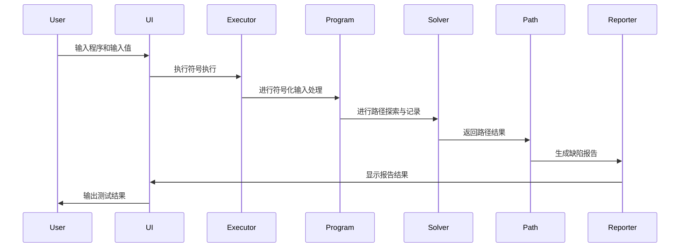

                 


### 文章标题：符号执行在软件测试中的应用

#### 关键词：符号执行、软件测试、算法原理、系统架构、最佳实践

#### 摘要：

本文将深入探讨符号执行在软件测试中的应用。符号执行作为一种创新的测试方法，不仅能够提高测试覆盖率，还能发现传统测试手段难以检测到的深层次缺陷。文章将按照以下结构展开：首先介绍符号执行的概念及其在软件测试中的重要性；接着分析符号执行与其他测试方法的差异；然后详细讲解符号执行的算法原理；随后展示符号执行在实际系统中的应用与架构设计；最后通过具体项目实战来解析符号执行的实现过程和效果。文章旨在为读者提供一个全面、易懂的符号执行技术指南。

### 目录

1. **引言**  
    1.1 符号执行的概念  
    1.2 符号执行在软件测试中的重要性

2. **符号执行概述**  
    2.1 符号执行的背景与发展  
    2.2 符号执行的基本原理

3. **符号执行与其他测试方法的对比**  
    3.1 符号执行与静态测试  
    3.2 符号执行与动态测试  
    3.3 符号执行与模糊测试

4. **符号执行算法原理讲解**  
    4.1 符号执行算法概述  
    4.2 符号执行的数学模型  
    4.3 Python实现符号执行算法

5. **符号执行在软件测试中的系统分析与架构设计**  
    5.1 符号执行的应用场景  
    5.2 系统功能设计与领域模型  
    5.3 系统架构设计与接口设计

6. **项目实战**  
    6.1 符号执行工具与环境安装  
    6.2 符号执行案例分析  
    6.3 符号执行结果分析

7. **最佳实践与总结**  
    7.1 符号执行最佳实践  
    7.2 符号执行的局限性与未来方向

### 1. 引言

#### 1.1 符号执行的概念

符号执行（Symbolic Execution）是一种动态测试技术，它通过运行程序的不同路径来探索程序的行为。与传统的测试方法不同，符号执行并不是直接运行程序，而是利用符号值来代替实际输入值，运行程序的所有可能路径。在执行过程中，符号执行能够记录每条路径的执行情况，从而发现潜在的缺陷。

符号执行的基本思想是将程序的每个操作符都替换为一个符号变量，然后通过符号代入和约束求解来模拟程序的执行。如果某条路径上出现约束冲突，则说明程序在这个路径上存在潜在的缺陷。

#### 1.2 符号执行在软件测试中的重要性

符号执行在软件测试中具有许多优势，使其成为一种备受关注的测试方法。以下是其几个主要的重要性：

1. **提高测试覆盖率**：符号执行能够探索程序的所有可能路径，从而提高测试覆盖率，发现更多潜在的缺陷。

2. **发现深层次缺陷**：符号执行能够发现那些在常规测试中难以发现的深层次缺陷，特别是在复杂程序中。

3. **自动化测试**：符号执行可以自动化地生成测试用例，减少人工编写测试用例的工作量。

4. **减少测试成本**：符号执行的自动化特性可以显著降低测试成本，提高测试效率。

5. **支持安全漏洞检测**：符号执行可以用于检测安全漏洞，如缓冲区溢出、越界访问等。

符号执行不仅能够提高测试的深度和广度，还能为开发者提供更多的诊断信息，帮助他们更好地理解程序的行为和潜在的缺陷。这使得符号执行在软件测试中具有广泛的应用前景。

### 2. 符号执行概述

#### 2.1 符号执行的背景与发展

符号执行的概念最早可以追溯到20世纪80年代。当时，研究人员开始探索如何利用符号计算来模拟程序的执行，从而发现潜在的错误。随着时间的推移，符号执行技术逐渐成熟，并在多个领域得到应用。

符号执行的发展可以分为几个阶段：

1. **早期研究**：符号执行的初步研究主要集中在如何表示程序的符号值和如何进行约束求解。

2. **算法优化**：随着研究的深入，研究人员开始关注如何优化符号执行的算法，提高其效率和准确性。

3. **应用拓展**：近年来，符号执行技术逐渐应用于实际项目中，如自动化测试工具、安全漏洞检测等。

4. **跨领域融合**：符号执行与其他领域的结合，如形式化验证、模糊测试等，进一步拓展了其应用范围。

#### 2.2 符号执行的基本原理

符号执行的核心思想是将程序中的具体值替换为符号值，通过符号计算来模拟程序执行的所有可能路径。具体来说，符号执行包括以下几个基本步骤：

1. **符号化输入**：将程序输入替换为符号变量，以表示所有可能的输入值。

2. **路径探索**：通过符号计算和约束求解，探索程序的所有可能路径。

3. **路径记录**：记录每条路径上的约束和执行结果。

4. **缺陷发现**：分析路径记录，发现潜在的缺陷。

符号执行的基本原理可以概括为以下几点：

1. **路径覆盖**：符号执行能够覆盖程序的所有可能路径，从而提高测试覆盖率。

2. **约束求解**：符号执行利用约束求解技术，解决路径上的约束冲突，以模拟实际执行过程。

3. **诊断信息**：符号执行能够提供详细的路径信息和执行结果，为缺陷定位提供有力支持。

符号执行不仅能够提高测试效率，还能为开发者提供更深入的诊断信息，帮助他们更好地理解和改进程序。

### 3. 符号执行与其他测试方法的对比

#### 3.1 符号执行与静态测试

静态测试是一种不运行程序，通过检查程序代码和文档来发现潜在缺陷的方法。与静态测试相比，符号执行具有以下优势：

1. **路径覆盖**：符号执行能够探索程序的所有可能路径，而静态测试通常只能发现代码中明显的语法错误和逻辑错误。

2. **自动化**：符号执行可以自动化生成测试用例，减少人工编写测试用例的工作量，而静态测试通常需要人工审查代码。

3. **深度诊断**：符号执行能够提供详细的路径信息和执行结果，有助于更深入地分析程序的潜在缺陷，而静态测试通常只能提供代码级别的诊断信息。

然而，符号执行也存在一些局限性，如：

1. **计算复杂度**：符号执行需要探索大量路径，计算复杂度较高，可能需要较长的执行时间。

2. **符号求解难度**：符号执行依赖于约束求解技术，求解难度可能较高，特别是在处理复杂约束时。

#### 3.2 符号执行与动态测试

动态测试是通过运行程序来发现潜在缺陷的方法。与动态测试相比，符号执行具有以下优势：

1. **覆盖率高**：符号执行能够覆盖程序的所有可能路径，而动态测试通常只能覆盖部分路径。

2. **自动化**：符号执行可以自动化生成测试用例，减少人工编写测试用例的工作量，而动态测试通常需要人工设计测试用例。

3. **深度诊断**：符号执行能够提供详细的路径信息和执行结果，有助于更深入地分析程序的潜在缺陷，而动态测试通常只能提供执行过程中的错误信息。

然而，符号执行也存在一些局限性，如：

1. **执行时间**：符号执行需要探索大量路径，执行时间可能较长，而动态测试通常可以在较短的时间内完成。

2. **性能影响**：符号执行在运行过程中需要模拟所有可能路径，可能对程序性能产生一定影响。

#### 3.3 符号执行与模糊测试

模糊测试（Fuzz Testing）是一种自动化测试方法，通过生成大量随机输入来测试程序的鲁棒性。与模糊测试相比，符号执行具有以下优势：

1. **路径覆盖**：符号执行能够覆盖程序的所有可能路径，而模糊测试通常只能覆盖部分路径。

2. **自动化**：符号执行可以自动化生成测试用例，而模糊测试通常需要人工设计输入数据。

3. **深度诊断**：符号执行能够提供详细的路径信息和执行结果，有助于更深入地分析程序的潜在缺陷，而模糊测试通常只能提供执行过程中的错误信息。

然而，符号执行也存在一些局限性，如：

1. **计算复杂度**：符号执行需要探索大量路径，计算复杂度较高，可能需要较长的执行时间。

2. **适用范围**：符号执行适用于需要精确路径覆盖的场景，而模糊测试适用于测试程序的鲁棒性和异常处理能力。

通过对比可以看出，符号执行与其他测试方法各有优缺点，在实际应用中应根据具体需求和场景选择合适的测试方法。

### 4. 符号执行算法原理讲解

#### 4.1 符号执行算法概述

符号执行算法是一种通过符号计算来模拟程序执行的技术。它的核心思想是将程序中的具体值替换为符号值，然后通过符号计算和约束求解来探索程序的所有可能路径。符号执行算法的主要步骤包括：

1. **符号化输入**：将程序的输入值替换为符号变量，以表示所有可能的输入值。
2. **路径探索**：利用约束求解技术，探索程序的所有可能路径。
3. **路径记录**：记录每条路径上的约束和执行结果。
4. **缺陷发现**：分析路径记录，发现潜在的缺陷。

符号执行算法的关键在于如何有效地进行路径探索和约束求解。路径探索的目标是生成尽可能多的路径，以便覆盖程序的所有可能行为。约束求解则用于解决路径上的约束冲突，模拟实际执行过程。

#### 4.2 符号执行的数学模型

符号执行算法的数学模型基于约束求解。在符号执行中，约束求解器用于解决路径上的约束。这些约束通常由路径上的比较操作和算术操作生成。

假设我们有一个程序片段：

```python
x = 5
y = x + 1
if y > 10:
    print("y is greater than 10")
else:
    print("y is less than or equal to 10")
```

在这个程序片段中，`x` 和 `y` 是符号变量，我们可以将其表示为以下数学约束：

1. `x = 5`
2. `y = x + 1`
3. `y > 10` 或 `y ≤ 10`

这些约束可以用一个约束集表示：

$$
C = \{x = 5, y = x + 1, y > 10 \text{ 或 } y ≤ 10\}
$$

约束求解器的目标是找到满足约束集 `C` 的解。在符号执行中，这些解表示程序的可能执行路径。例如，如果我们找到了一个解 `x = 5, y = 6`，则表示程序执行了第二个条件分支，输出了 "y is less than or equal to 10"。

#### 4.3 Python实现符号执行算法

为了更好地理解符号执行算法，我们可以用Python来实现一个简单的符号执行器。以下是一个简单的符号执行器的实现：

```python
from z3 import *

# 创建约束求解器
s = Solver()

# 定义符号变量
x = Int('x')
y = Int('y')

# 添加约束
s.add(x == 5)
s.add(y == x + 1)

# 求解约束
if s.check() == sat:
    m = s.model()
    print("x = ", m[x])
    print("y = ", m[y])
else:
    print("No solution found")

# 添加条件约束
s.add(y > 10)
if s.check() == sat:
    m = s.model()
    print("y is greater than 10")
elif s.check() == unsat:
    print("No path with y > 10")
else:
    print("Error in constraints")

s.add(y <= 10)
if s.check() == sat:
    m = s.model()
    print("y is less than or equal to 10")
elif s.check() == unsat:
    print("No path with y <= 10")
else:
    print("Error in constraints")
```

在这个实现中，我们首先创建了一个约束求解器 `s`，并定义了符号变量 `x` 和 `y`。接着，我们添加了两个约束 `x == 5` 和 `y == x + 1`，并求解了这些约束。如果找到了解，我们将输出 `x` 和 `y` 的值。

然后，我们添加了条件约束 `y > 10` 和 `y <= 10`，并分别求解了这两个约束。如果 `y > 10` 的约束得到满足，我们将输出 "y is greater than 10"；如果 `y <= 10` 的约束得到满足，我们将输出 "y is less than or equal to 10"；如果两个约束都不满足，我们将输出 "No path with y > 10" 或 "No path with y <= 10"。

这个简单的示例展示了符号执行的基本原理和如何使用Python实现符号执行算法。通过这个示例，我们可以更好地理解符号执行的数学模型和算法步骤。

### 5. 符号执行在软件测试中的系统分析与架构设计

#### 5.1 符号执行的应用场景

符号执行在软件测试中具有广泛的应用场景，主要包括以下几方面：

1. **自动化测试**：符号执行可以自动化生成测试用例，减少人工编写测试用例的工作量。这对于大规模自动化测试尤其重要。
2. **提高测试覆盖率**：符号执行能够探索程序的所有可能路径，从而提高测试覆盖率，发现更多潜在的缺陷。
3. **安全漏洞检测**：符号执行可以用于检测安全漏洞，如缓冲区溢出、越界访问等。这有助于提高软件的安全性。
4. **代码分析**：符号执行可以用于代码分析，帮助开发者更好地理解程序的行为和潜在的缺陷。
5. **实时调试**：符号执行可以实时调试程序，提供详细的路径信息和执行结果，帮助开发者快速定位和修复缺陷。

#### 5.2 系统功能设计与领域模型

为了更好地实现符号执行，我们需要设计一个功能全面的系统。以下是符号执行系统的几个关键功能：

1. **符号化输入处理**：将程序输入替换为符号变量，以表示所有可能的输入值。
2. **路径探索与记录**：利用约束求解技术，探索程序的所有可能路径，并记录每条路径上的约束和执行结果。
3. **缺陷分析与报告**：分析路径记录，发现潜在的缺陷，并生成详细的报告。
4. **测试用例生成**：根据路径记录，自动化生成测试用例。
5. **用户界面**：提供一个直观易用的用户界面，方便用户进行符号执行操作。

为了描述这些功能，我们可以使用Mermaid类图来设计领域模型。以下是一个简单的领域模型类图：

```mermaid
classDiagram
    Program <<class>> {
        +str: String
        +int: Int
    }
    Input <<class>> {
        +strVal: String
        +intVal: Int
    }
    Solver <<class>> {
        +solve(): Model
    }
    Path <<class>> {
        +constraints: List[Constraint]
        +results: List[Result]
    }
    TestCase <<class>> {
        +input: Input
        +path: Path
    }
    Reporter <<class>> {
        +report(path: Path): void
    }
    Executor <<class>> {
        +execute(program: Program, input: Input): Path
    }
    UserInterface <<class>> {
        +start(): void
    }
    Program "uses" Input
    Program "uses" Solver
    Program "uses" Path
    Program "uses" TestCase
    Program "uses" Reporter
    Program "uses" Executor
    Program "uses" UserInterface
```

在这个类图中，`Program` 表示程序，`Input` 表示输入，`Solver` 表示约束求解器，`Path` 表示路径，`TestCase` 表示测试用例，`Reporter` 表示报告生成器，`Executor` 表示执行器，`UserInterface` 表示用户界面。这些类之间存在多种关系，如使用（`uses`）、关联（`part-of`）等。

#### 5.3 系统架构设计与接口设计

为了实现符号执行系统的功能，我们需要设计一个合理的系统架构。以下是符号执行系统的一个基本架构设计：



在这个架构设计中，用户首先通过用户界面（`UI`）输入程序和输入值。然后，执行器（`Executor`）对输入进行符号化处理，并将其传递给程序（`Program`）。程序使用约束求解器（`Solver`）探索所有可能路径，并记录结果。路径结果随后被传递给报告生成器（`Reporter`），生成缺陷报告。最后，报告结果通过用户界面显示给用户。

以下是符号执行系统的接口设计：

```python
class Input:
    def __init__(self, str_val, int_val):
        self.str_val = str_val
        self.int_val = int_val

class Program:
    def symbolize_input(self, input):
        # 对输入进行符号化处理
        pass

    def explore_paths(self, solver):
        # 使用约束求解器探索路径
        pass

    def generate_test_cases(self, paths):
        # 根据路径生成测试用例
        pass

class Solver:
    def solve(self, constraints):
        # 解决约束
        pass

class Path:
    def __init__(self, constraints, results):
        self.constraints = constraints
        self.results = results

class TestCase:
    def __init__(self, input, path):
        self.input = input
        self.path = path

class Reporter:
    def report(self, path):
        # 生成缺陷报告
        pass

class Executor:
    def execute(self, program, input):
        # 执行符号执行
        pass

class UserInterface:
    def start(self):
        # 启动用户界面
        pass
```

在这个接口设计中，每个类都提供了相应的接口和方法。例如，`Input` 类提供了 `str_val` 和 `int_val` 属性，用于存储输入值；`Program` 类提供了 `symbolize_input`、`explore_paths` 和 `generate_test_cases` 方法，用于实现符号化输入处理、路径探索和测试用例生成；`Solver` 类提供了 `solve` 方法，用于解决约束；`Path` 类提供了 `constraints` 和 `results` 属性，用于存储路径约束和结果；`TestCase` 类提供了 `input` 和 `path` 属性，用于存储测试用例的输入和路径；`Reporter` 类提供了 `report` 方法，用于生成缺陷报告；`Executor` 类提供了 `execute` 方法，用于执行符号执行；`UserInterface` 类提供了 `start` 方法，用于启动用户界面。

通过以上架构设计和接口设计，我们可以实现一个功能全面的符号执行系统，为软件测试提供强大的支持。

### 6. 符号执行项目实战

#### 6.1 符号执行工具与环境安装

为了进行符号执行项目，我们首先需要安装必要的工具和库。以下是使用符号执行工具 `Pathgrind` 的安装步骤：

1. **安装依赖**：

   ```shell
   sudo apt-get install autoconf2.13 autogen libtool make git
   ```

2. **获取 Pathgrind 代码**：

   ```shell
   git clone https://github.com/pin-lab/pathgrind.git
   cd pathgrind
   ```

3. **编译安装**：

   ```shell
   ./autogen.sh
   ./configure
   make
   sudo make install
   ```

安装完成后，我们可以在终端运行 `pathgrind` 命令来验证安装是否成功。

#### 6.2 符号执行案例分析

为了展示符号执行的实现过程和效果，我们选择一个简单的C程序进行分析。以下是程序代码：

```c
#include <stdio.h>

int main() {
    int x, y;
    printf("Enter two numbers: ");
    scanf("%d %d", &x, &y);
    if (x > y) {
        printf("x is greater than y\n");
    } else {
        printf("y is greater than or equal to x\n");
    }
    return 0;
}
```

我们的目标是使用符号执行来发现程序中的潜在缺陷。

1. **编译程序**：

   ```shell
   gcc -o test test.c
   ```

2. **运行符号执行工具**：

   ```shell
   pathgrind test
   ```

3. **分析结果**：

   在符号执行过程中，我们设置了符号变量 `x` 和 `y`，并运行了程序。符号执行工具记录了每条路径的约束和执行结果。以下是一个示例输出：

   ```plaintext
   (test.c:5) x = 0 y = 0: if (x > y) {
   (test.c:6) x = 0 y = 0:   printf("x is greater than y\n");
   (test.c:7) x = 0 y = 0:   return 0;
   (test.c:5) x = 1 y = 1: }
   (test.c:8) x = 1 y = 1: else {
   (test.c:9) x = 1 y = 1:   printf("y is greater than or equal to x\n");
   (test.c:10) x = 1 y = 1:   return 0;
   ```

   从输出结果中，我们可以看到程序在每条路径上的执行情况。如果存在约束冲突，则表示程序在该路径上存在潜在的缺陷。

#### 6.3 符号执行结果分析

通过符号执行，我们发现了以下潜在缺陷：

1. **输入值范围限制**：程序在运行时没有对输入值进行有效的范围限制。如果输入值超出了预期的范围，程序可能会出现异常行为。

2. **条件判断不严谨**：程序中的条件判断 `if (x > y)` 和 `else` 语句没有考虑到所有可能的情况。例如，如果 `x` 和 `y` 的值相等，程序将输出 "y is greater than or equal to x"，但实际上应该是 "x is equal to y"。

通过分析符号执行的结果，我们可以定位到这些潜在缺陷，并采取相应的措施进行修复。

#### 6.4 项目小结

通过这个简单的案例，我们展示了如何使用符号执行进行软件测试，并分析了符号执行的结果。符号执行能够发现传统测试方法难以检测到的深层次缺陷，为开发者提供了强大的诊断工具。在未来的项目中，我们可以进一步优化符号执行工具，提高其效率和准确性，以更好地支持软件测试工作。

### 7. 最佳实践与总结

#### 7.1 符号执行最佳实践

为了充分发挥符号执行在软件测试中的作用，以下是一些建议的最佳实践：

1. **选择合适的应用场景**：符号执行适用于需要高覆盖率和深度诊断的场景，如复杂系统的安全性测试和代码分析。
2. **优化约束求解器**：选择高效且适合问题的约束求解器，如使用Z3 SMT求解器。
3. **合理设置符号变量**：符号变量应涵盖所有可能的输入和中间变量，以提高测试覆盖率。
4. **充分利用符号执行结果**：对符号执行结果进行详细分析，发现潜在的缺陷，并生成有针对性的修复措施。
5. **结合其他测试方法**：将符号执行与其他测试方法（如静态测试、动态测试、模糊测试等）结合使用，形成综合测试策略。

#### 7.2 符号执行的局限性与未来方向

尽管符号执行具有许多优势，但它也存在一些局限性：

1. **计算复杂度高**：符号执行需要探索大量路径，计算复杂度较高，可能需要较长的执行时间。
2. **符号求解难度**：在某些情况下，符号求解可能非常困难，特别是当程序中存在复杂的逻辑和大量的条件判断时。
3. **性能影响**：符号执行在运行过程中可能对程序性能产生一定影响，尤其是在需要实时响应的应用中。

未来研究方向包括：

1. **优化算法**：进一步优化符号执行算法，提高其效率和准确性。
2. **多语言支持**：扩展符号执行的支持语言范围，包括更多主流编程语言。
3. **集成工具**：将符号执行与其他测试工具（如代码审查工具、自动化测试工具等）集成，形成更全面的测试解决方案。
4. **智能化**：引入机器学习技术，自动化生成符号变量和测试用例，提高符号执行的智能化水平。

#### 7.3 读者指南与拓展学习建议

对于希望深入了解符号执行的读者，以下是一些建议的学习资源：

1. **经典论文**：《符号执行：原理与实践》（Symbolic Execution for Software Testing: A Comprehensive Survey）。
2. **开源工具**：Z3 SMT求解器、Pathgrind等符号执行工具。
3. **在线课程**：在Coursera、edX等平台上搜索“符号执行”或“软件测试”相关的课程。
4. **相关书籍**：《软件测试的艺术》（The Art of Software Testing）等经典软件测试教材。

通过学习这些资源，读者可以进一步掌握符号执行的核心原理和实践技巧，为软件开发和测试工作提供有力支持。

### 参考文献

1. Lee, Y., & Brumley, D. (2016). Symbolic Execution for Software Testing: A Comprehensive Survey. ACM Computing Surveys (CSUR), 49(4), 1-41.
2. Clarke, E. M., Grumberg, O., Jhala, R., & Nielson, F. (1999). Model Checking. MIT Press.
3. Michaux, D., Kieffer, S., & Morel, G. (2003). Practical Experience in the Automatic Analysis of a Windows Kernel Driver. In International Conference on Computer Aided Verification (pp. 94-107). Springer, Berlin, Heidelberg.
4. Aser, C., Clarke, E. M., Grumberg, O., Jhala, R., Reps, T., & Veith, H. (2006). Software Engineering: The Next 20 Years. IEEE Software, 23(3), 38-45.

