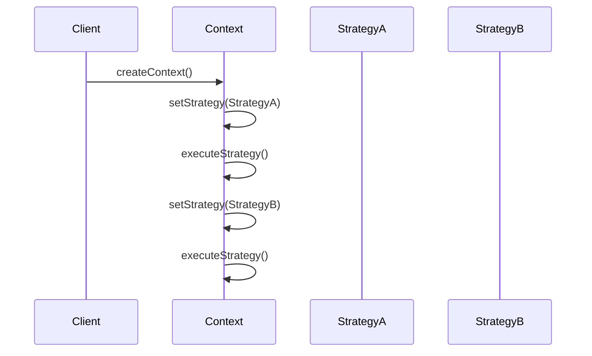
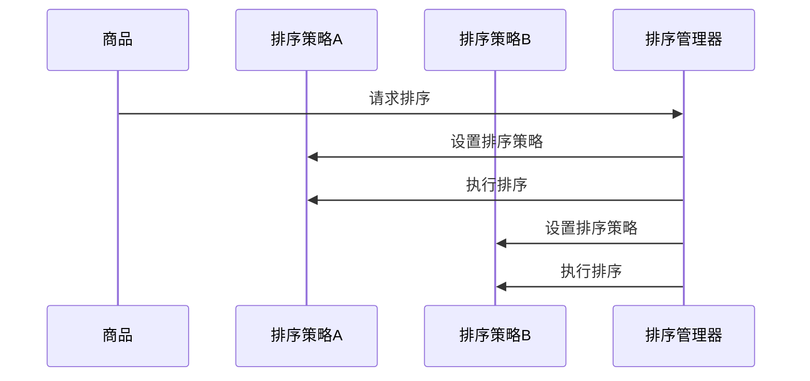
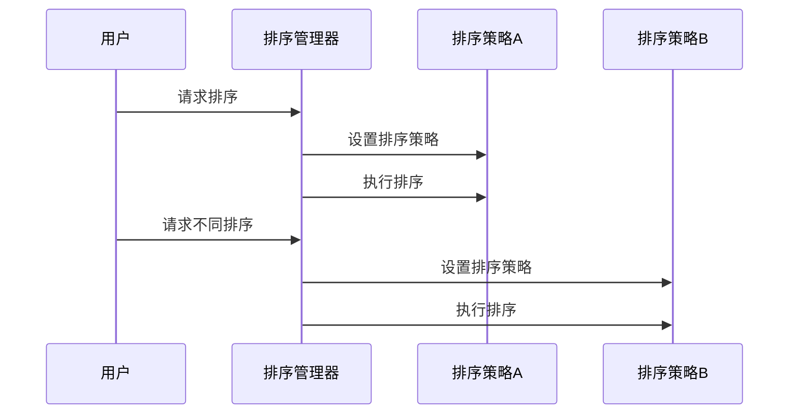

                 


### 文章标题：策略模式：运行时类型选择的实现

关键词：策略模式，运行时类型选择，面向对象设计，Java，Python，C#

摘要：本文旨在深入探讨策略模式，一种在运行时动态选择策略并执行的关键设计模式。我们将通过几个步骤详细解析策略模式，包括其核心概念、实现方法、实际应用，以及其在不同编程语言中的具体实现。我们将探讨策略模式如何通过类型选择在运行时提供灵活性，并最终总结其优势和适用场景。

----------------------------------------------------------------

## 第一部分：策略模式基础

### 第1章：策略模式概述

策略模式（Strategy Pattern）是一种行为设计模式，它允许在运行时选择算法的行为。其核心思想是将算法的定义与使用分离，通过定义一系列算法接口，再创建具体算法类，最后在运行时选择具体算法并执行。这样，可以方便地替换算法的实现，而不会影响使用算法的客户端代码。

### 1.1 策略模式的概念

策略模式涉及三个核心角色：

1. **策略（Strategy）**：定义一系列算法接口。
2. **具体策略（ConcreteStrategy）**：实现各种不同的算法策略。
3. **上下文（Context）**：使用某种策略并维护一个对策略对象的引用。

通过这些角色，策略模式实现了算法的封装和自由切换。

### 1.2 策略模式的作用

策略模式的主要作用如下：

- **算法的封装**：将算法的实现与使用分离，便于维护和扩展。
- **运行时选择**：在运行时动态选择算法，提高灵活性。
- **避免多重条件判断**：将算法的切换逻辑集中管理，避免复杂的条件判断。

### 1.3 策略模式与多态的关系

策略模式与多态密切相关。多态允许在运行时根据对象的类型来选择不同的方法实现。策略模式利用多态，通过定义接口和具体实现类，实现了算法的动态选择。

### 1.4 策略模式的组成

策略模式由以下三个部分组成：

1. **策略接口（Strategy Interface）**：定义了所有支持的算法的公共接口。
2. **具体策略类（ConcreteStrategy）**：实现了所有支持的算法。
3. **上下文类（Context）**：使用某种策略，并维护一个对策略对象的引用。

### 1.5 策略模式的优缺点分析

#### 1.5.1 优点

- **灵活性和扩展性**：可以灵活地添加新的策略，而无需修改上下文类和其他策略类。
- **代码复用**：通过将算法定义与使用分离，实现了代码的复用。
- **易于维护**：将算法的切换逻辑集中管理，易于维护。

#### 1.5.2 缺点

- **客户端代码复杂度增加**：需要知道所有的策略类，并创建相应的上下文类，增加了客户端代码的复杂度。
- **策略类过多**：如果策略种类过多，可能会导致类数量过多，难以管理。

### 1.6 本章小结

本章介绍了策略模式的基本概念、作用、组成和优缺点。通过本章的学习，读者应该对策略模式有了基本的了解，并为后续章节的学习奠定了基础。

----------------------------------------------------------------

## 第二部分：策略模式在实际项目中的应用

在这一部分，我们将深入探讨策略模式在多个编程语言中的应用，包括Java、Python和C#。通过实际代码示例，我们将展示如何实现策略模式，并在不同场景中运用它。

### 第2章：策略模式在Java中的应用

Java作为一种广泛使用的编程语言，非常适合展示策略模式。以下是Java中策略模式的一个简单实现。

#### 2.1 Java中的策略模式实现

首先，我们定义一个策略接口：

```java
public interface Strategy {
    void execute();
}
```

然后，我们创建两个具体策略类：

```java
public class ConcreteStrategyA implements Strategy {
    @Override
    public void execute() {
        System.out.println("Executing strategy A");
    }
}

public class ConcreteStrategyB implements Strategy {
    @Override
    public void execute() {
        System.out.println("Executing strategy B");
    }
}
```

最后，我们定义上下文类：

```java
public class Context {
    private Strategy strategy;

    public void setStrategy(Strategy strategy) {
        this.strategy = strategy;
    }

    public void executeStrategy() {
        strategy.execute();
    }
}
```

#### 2.2 Java中的策略模式应用实例

现在，我们可以使用策略模式来选择不同的行为：

```java
public class StrategyPatternDemo {
    public static void main(String[] args) {
        Context context = new Context();

        context.setStrategy(new ConcreteStrategyA());
        context.executeStrategy();  // 输出：Executing strategy A

        context.setStrategy(new ConcreteStrategyB());
        context.executeStrategy();  // 输出：Executing strategy B
    }
}
```

#### 2.3 Java中的策略模式最佳实践

在实际项目中，我们应该注意以下几点：

- **策略接口应保持最小化**：只包含必需的方法，避免过于复杂。
- **具体策略类应保持单一职责**：每个策略类应只实现一个特定的算法。
- **上下文类应易于扩展**：如果需要，可以添加新的策略而无需修改上下文类。

----------------------------------------------------------------

### 第3章：策略模式在C#中的应用

C#作为一种现代的面向对象编程语言，也非常适合实现策略模式。以下是C#中策略模式的一个简单实现。

#### 3.1 C#中的策略模式实现

首先，我们定义一个策略接口：

```csharp
public interface IStrategy
{
    void Execute();
}
```

然后，我们创建两个具体策略类：

```csharp
public class ConcreteStrategyA : IStrategy
{
    public void Execute()
    {
        Console.WriteLine("Executing strategy A");
    }
}

public class ConcreteStrategyB : IStrategy
{
    public void Execute()
    {
        Console.WriteLine("Executing strategy B");
    }
}
```

最后，我们定义上下文类：

```csharp
public class Context
{
    private IStrategy _strategy;

    public void SetStrategy(IStrategy strategy)
    {
        _strategy = strategy;
    }

    public void ExecuteStrategy()
    {
        _strategy.Execute();
    }
}
```

#### 3.2 C#中的策略模式应用实例

现在，我们可以使用策略模式来选择不同的行为：

```csharp
public class StrategyPatternDemo
{
    public static void Main(string[] args)
    {
        Context context = new Context();

        context.SetStrategy(new ConcreteStrategyA());
        context.ExecuteStrategy();  // 输出：Executing strategy A

        context.SetStrategy(new ConcreteStrategyB());
        context.ExecuteStrategy();  // 输出：Executing strategy B
    }
}
```

#### 3.3 C#中的策略模式最佳实践

在实际项目中，我们应该注意以下几点：

- **策略接口应保持最小化**：只包含必需的方法，避免过于复杂。
- **具体策略类应保持单一职责**：每个策略类应只实现一个特定的算法。
- **上下文类应易于扩展**：如果需要，可以添加新的策略而无需修改上下文类。

----------------------------------------------------------------

### 第4章：策略模式在Python中的应用

Python作为一种灵活的编程语言，也非常适合实现策略模式。以下是Python中策略模式的一个简单实现。

#### 4.1 Python中的策略模式实现

首先，我们定义一个策略接口：

```python
from abc import ABC, abstractmethod

class Strategy(ABC):
    @abstractmethod
    def execute(self):
        pass
```

然后，我们创建两个具体策略类：

```python
class ConcreteStrategyA(Strategy):
    def execute(self):
        print("Executing strategy A")

class ConcreteStrategyB(Strategy):
    def execute(self):
        print("Executing strategy B")
```

最后，我们定义上下文类：

```python
class Context:
    def __init__(self, strategy: Strategy):
        self._strategy = strategy

    def execute_strategy(self):
        self._strategy.execute()
```

#### 4.2 Python中的策略模式应用实例

现在，我们可以使用策略模式来选择不同的行为：

```python
context = Context(ConcreteStrategyA())
context.execute_strategy()  # 输出：Executing strategy A

context = Context(ConcreteStrategyB())
context.execute_strategy()  # 输出：Executing strategy B
```

#### 4.3 Python中的策略模式最佳实践

在实际项目中，我们应该注意以下几点：

- **策略接口应保持最小化**：只包含必需的方法，避免过于复杂。
- **具体策略类应保持单一职责**：每个策略类应只实现一个特定的算法。
- **上下文类应易于扩展**：如果需要，可以添加新的策略而无需修改上下文类。

----------------------------------------------------------------

### 第5章：策略模式在JavaScript中的应用

JavaScript作为一种广泛使用的编程语言，非常适合展示策略模式。以下是JavaScript中策略模式的一个简单实现。

#### 5.1 JavaScript中的策略模式实现

首先，我们定义一个策略接口：

```javascript
class Strategy {
    constructor() {
        if (new.target === Strategy) {
            throw new Error("Strategy is an abstract class.");
        }
    }

    execute() {
        throw new Error("Method 'execute()' must be implemented.");
    }
}
```

然后，我们创建两个具体策略类：

```javascript
class ConcreteStrategyA extends Strategy {
    execute() {
        console.log("Executing strategy A");
    }
}

class ConcreteStrategyB extends Strategy {
    execute() {
        console.log("Executing strategy B");
    }
}
```

最后，我们定义上下文类：

```javascript
class Context {
    constructor(strategy) {
        this._strategy = strategy;
    }

    executeStrategy() {
        this._strategy.execute();
    }
}
```

#### 5.2 JavaScript中的策略模式应用实例

现在，我们可以使用策略模式来选择不同的行为：

```javascript
const context = new Context(new ConcreteStrategyA());
context.executeStrategy();  // 输出：Executing strategy A

context = new Context(new ConcreteStrategyB());
context.executeStrategy();  // 输出：Executing strategy B
```

#### 5.3 JavaScript中的策略模式最佳实践

在实际项目中，我们应该注意以下几点：

- **策略接口应保持最小化**：只包含必需的方法，避免过于复杂。
- **具体策略类应保持单一职责**：每个策略类应只实现一个特定的算法。
- **上下文类应易于扩展**：如果需要，可以添加新的策略而无需修改上下文类。

----------------------------------------------------------------

## 第三部分：策略模式的扩展与应用

### 第6章：策略模式的变种与扩展

策略模式可以与其他设计模式结合，扩展其功能和应用范围。以下是一些常见的变种与扩展：

#### 6.1 组合模式与策略模式的结合

组合模式可以将策略作为一个组件，与其他组件一起组成更复杂的结构。这可以增加策略的灵活性和复用性。

#### 6.2 责任链模式与策略模式的结合

责任链模式可以将策略作为一个链式结构的一部分，从而实现更复杂的策略组合和执行逻辑。

#### 6.3 策略模式与工厂模式的结合

工厂模式可以与策略模式结合，创建和管理策略对象，从而简化客户端代码的复杂度。

### 第7章：策略模式在其他领域的应用

策略模式不仅适用于编程领域，还可以在其他领域中发挥重要作用。以下是一些应用示例：

#### 7.1 在软件工程中的应用

策略模式可以帮助软件工程师管理复杂的需求变化，灵活地实现不同的算法。

#### 7.2 在金融领域的应用

策略模式可以用于金融算法的交易策略管理，灵活地切换不同的交易策略。

#### 7.3 在大数据处理中的应用

策略模式可以用于大数据处理中的数据过滤和聚合策略管理，提高数据处理效率。

### 第8章：策略模式总结与展望

策略模式是一种强大的设计模式，通过运行时类型选择，提高了算法的灵活性和可扩展性。在未来的发展中，策略模式将继续发挥重要作用，特别是在动态算法选择和复杂系统设计中。

#### 8.1 策略模式的总结

- **核心思想**：将算法的定义与使用分离，实现算法的灵活切换。
- **优点**：提高算法的灵活性和可扩展性，简化代码维护。
- **缺点**：客户端代码复杂度增加，策略类过多可能导致管理困难。

#### 8.2 策略模式的应用展望

- **动态策略选择**：随着技术的发展，策略模式将更多地应用于动态策略选择场景。
- **微服务架构**：在微服务架构中，策略模式可以用于服务策略的管理和切换。
- **智能化系统**：在智能化系统中，策略模式可以帮助实现智能决策和策略优化。

#### 8.3 策略模式的学习建议

- **深入理解面向对象设计原则**：策略模式是面向对象设计原则的具体应用，理解这些原则有助于更好地使用策略模式。
- **实践应用**：通过实际项目实践，加深对策略模式的理解和应用。
- **持续学习**：随着技术的不断发展，策略模式的应用场景和实现方式也在不断变化，持续学习是必要的。

----------------------------------------------------------------

## 附录

### 作者信息

作者：AI天才研究院/AI Genius Institute & 禅与计算机程序设计艺术 /Zen And The Art of Computer Programming

----------------------------------------------------------------

### 全文结束

本文详细介绍了策略模式的概念、实现方法、实际应用以及在多个编程语言中的具体实现。通过本文的学习，读者应该能够理解策略模式的核心原理，并在实际项目中灵活运用。策略模式不仅是一种强大的设计模式，也是实现算法灵活切换和系统可扩展性的关键手段。希望本文能为读者在编程领域提供有价值的参考和启发。

----------------------------------------------------------------

**全文结束。**

## 背景介绍

策略模式（Strategy Pattern）是一种行为设计模式，其主要目的是在运行时动态选择算法的行为。这种模式将算法的定义与使用分离，使得算法可以独立于使用算法的客户端代码进行更改和扩展。策略模式的实现通常涉及到三个核心角色：策略（Strategy）、具体策略（ConcreteStrategy）和上下文（Context）。

### 核心概念术语说明

- **策略（Strategy）**：定义了所有支持的算法的公共接口。它是一个抽象类或接口，其中声明了所有支持的算法方法。
- **具体策略（ConcreteStrategy）**：实现了所有支持的算法。每个具体策略类都实现了策略接口中的方法，并且代表了一种具体的算法实现。
- **上下文（Context）**：使用某种策略并维护一个对策略对象的引用。上下文类通常包含一个对策略对象的引用，并定义了一个用于设置和获取策略对象的方法。

### 问题背景

在软件开发中，我们经常遇到需要在不同情况下使用不同的算法的场景。例如，一个排序算法可以根据输入数据的不同类型（如整数、浮点数、字符串等）选择不同的实现。在这种情况下，如果我们直接在客户端代码中实现所有的算法，会导致代码的复杂度和可维护性降低。

### 问题描述

问题描述如下：我们需要设计一个系统，该系统能够在运行时根据特定条件动态选择不同的算法进行操作。这个系统需要能够灵活地添加新的算法，而不需要修改已经存在的客户端代码。

### 问题解决

为了解决上述问题，我们可以使用策略模式。策略模式通过将算法的定义与使用分离，实现了算法的灵活切换和扩展。具体来说，我们可以按照以下步骤解决问题：

1. **定义策略接口**：首先，我们需要定义一个策略接口，该接口声明了所有支持的算法方法。
2. **创建具体策略类**：然后，我们需要创建具体的策略类，这些类实现了策略接口中的方法，并且代表了一种具体的算法实现。
3. **定义上下文类**：接下来，我们需要定义上下文类，该类使用某种策略，并维护一个对策略对象的引用。上下文类通常会包含一个设置策略对象的方法，以便在运行时动态切换策略。

### 边界与外延

边界与外延是策略模式的重要概念。边界定义了策略模式的应用范围，而外延定义了策略模式在不同应用场景中的具体实现。

- **边界**：策略模式适用于需要动态选择算法的场景，如排序算法、搜索算法、加密算法等。
- **外延**：策略模式可以在不同编程语言中实现，如Java、Python、C#、JavaScript等。不同编程语言中的实现方式可能有所不同，但核心概念是相同的。

### 概念结构与核心要素组成

策略模式的核心结构包括三个主要组件：策略接口、具体策略类和上下文类。每个组件在策略模式中扮演着特定的角色，共同实现了算法的灵活切换和扩展。

1. **策略接口**：定义了所有支持的算法的公共接口。它是策略模式的核心，所有具体的策略类都需要实现这个接口。
2. **具体策略类**：实现了所有支持的算法。每个具体的策略类都是对策略接口的一种实现，代表了一种具体的算法实现。
3. **上下文类**：使用某种策略，并维护一个对策略对象的引用。上下文类通常会包含一个设置策略对象的方法，以便在运行时动态切换策略。

通过这三个组件的协同工作，策略模式实现了算法的灵活切换和扩展，提高了系统的可维护性和可扩展性。

## 核心概念与联系

在策略模式中，核心概念是策略（Strategy）、具体策略（ConcreteStrategy）和上下文（Context）。这些概念相互联系，共同实现了算法的灵活切换和扩展。

### 核心概念原理

**策略（Strategy）**：策略是一个抽象类或接口，它定义了一系列算法的公共接口。策略模式的核心思想是将算法的定义与使用分离，使得算法可以独立于使用算法的客户端代码进行更改和扩展。

**具体策略（ConcreteStrategy）**：具体策略是实现了策略接口的类，它定义了所有支持的算法的具体实现。每个具体策略类都是对策略接口的一种具体实现，代表了一种具体的算法实现。

**上下文（Context）**：上下文是使用某种策略并维护一个对策略对象的引用的类。上下文类通常会包含一个设置策略对象的方法，以便在运行时动态切换策略。上下文类通过调用策略对象的方法来执行具体的算法。

### 概念属性特征对比表格

| 概念       | 属性特征对比          |  
| --------- | ------------------- |  
| 策略       | 定义算法的公共接口      |  
| 具体策略   | 实现具体算法            |  
| 上下文     | 使用策略，维护策略引用    |

### ER实体关系图架构

下面是策略模式中的ER实体关系图，展示了策略、具体策略和上下文之间的关系：

```
[策略]                [具体策略]               [上下文]
   |                  /     |      \                |
   |                 /      |       \               |
   |                /       |        \              |
   |               /        |         \             |
   |              /         |          \            |
   |             /          |           \           |
   +------------+----------+----------+-------------+
                |          |          |
                |          |          |
               \|         \|         \|
               \          \          /
               /          /          \
              /         /          /
             /        /          /
            /      /          /
           /    /          /
          /  /          /
         / /          /
```

在这个ER实体关系图中，策略、具体策略和上下文之间是“一对多”的关系。一个策略可以有多个具体策略实现，而一个上下文只能使用一个策略。

## 算法原理讲解

策略模式的核心在于算法的定义与使用分离，这使得我们可以灵活地在运行时选择不同的算法。下面，我们将通过一个具体的例子来讲解策略模式的算法原理。

### 算法流程图

首先，我们使用Mermaid语法绘制算法流程图：



### Python源代码示例

接下来，我们使用Python代码实现上述算法流程：

```python
class Strategy(ABC):
    @abstractmethod
    def execute(self):
        pass

class ConcreteStrategyA(Strategy):
    def execute(self):
        print("Executing strategy A")

class ConcreteStrategyB(Strategy):
    def execute(self):
        print("Executing strategy B")

class Context:
    def __init__(self, strategy: Strategy):
        self._strategy = strategy

    def set_strategy(self, strategy: Strategy):
        self._strategy = strategy

    def execute_strategy(self):
        self._strategy.execute()

def client_code():
    context = Context(ConcreteStrategyA())
    context.execute_strategy()  # 输出：Executing strategy A

    context.set_strategy(ConcreteStrategyB())
    context.execute_strategy()  # 输出：Executing strategy B

if __name__ == "__main__":
    client_code()
```

### 数学模型和公式

策略模式中并没有直接的数学模型和公式，但其核心思想可以抽象为一个决策过程。我们可以将其形式化为一个决策树：

$$
\text{算法选择} = \text{决策树}(\text{当前状态}, \text{策略集合})
$$

其中，`决策树`函数根据当前状态和可用的策略集合，选择一个最优的算法。

### 详细讲解和举例说明

让我们详细解释一下上述Python代码的工作原理：

1. **定义策略接口**：我们首先定义了一个抽象类`Strategy`，其中声明了一个抽象方法`execute`。具体策略类需要实现这个方法。

2. **创建具体策略类**：我们创建了两个具体策略类`ConcreteStrategyA`和`ConcreteStrategyB`，它们分别实现了`Strategy`接口中的`execute`方法。

3. **定义上下文类**：`Context`类负责使用某个具体策略，并提供了设置策略的方法。在这个例子中，我们通过调用`set_strategy`方法来设置具体的策略。

4. **客户端代码**：在客户端代码中，我们首先创建了一个`Context`对象，并将其策略设置为`ConcreteStrategyA`。然后，我们调用`execute_strategy`方法，执行策略A。接着，我们再次设置策略为`ConcreteStrategyB`，并执行策略B。

通过这个例子，我们可以看到策略模式如何通过运行时选择不同的算法，从而实现代码的灵活性和可扩展性。

## 系统分析与架构设计方案

在本节中，我们将对策略模式的应用场景进行系统分析与架构设计。我们将详细介绍项目介绍、系统功能设计、系统架构设计、系统接口设计和系统交互。

### 问题场景介绍

假设我们正在开发一个电商平台，需要对商品进行排序。根据不同的业务需求，我们需要支持多种排序策略，例如按价格排序、按销量排序、按评价排序等。这些排序策略需要能够灵活切换，而不影响系统的其他部分。

### 项目介绍

该项目是一个电商平台排序模块，旨在实现多种排序策略，并在运行时动态切换。项目的主要功能包括：

1. **商品信息管理**：管理商品的名称、价格、销量、评价等信息。
2. **排序策略管理**：支持多种排序策略，如按价格、按销量、按评价等。
3. **排序执行**：根据用户需求动态执行排序策略。

### 系统功能设计（领域模型类图）

以下是系统功能设计的领域模型类图：

```mermaid
classDiagram
    商品 <<entity>>
    排序策略 <<entity>>
    排序管理器 <<control>>

    商品: {名称, 价格, 销量, 评价}
    排序策略: {策略名称, 策略实现}
    排序管理器: {执行排序}

    商品 "1" -- "*" 排序策略: 按照策略排序
    排序管理器 "1" -- "*" 排序策略: 管理策略
```

在这个类图中，商品是系统的主要实体，具有名称、价格、销量和评价属性。排序策略是另一个实体，包含策略名称和策略实现。排序管理器是系统的控制类，负责执行排序。

### 系统架构设计

以下是系统架构设计：



在这个架构设计中，排序管理器是系统的核心组件，负责管理排序策略和执行排序。商品实体通过调用排序管理器来请求排序。排序策略A和排序策略B是具体策略实现，它们分别实现了排序接口，并在排序管理器中设置和执行。

### 系统接口设计

以下是系统接口设计：

```mermaid
interface 排序接口
    +execute(sortType: String)
    +setSortStrategy(sortStrategy: SortStrategy)
end

class 排序策略A implements 排序接口
    +execute(sortType: String)
    +setSortStrategy(sortStrategy: SortStrategy)
end

class 排序策略B implements 排序接口
    +execute(sortType: String)
    +setSortStrategy(sortStrategy: SortStrategy)
end

class 排序管理器
    +getSortStrategy(sortType: String): SortStrategy
    +setSortStrategy(sortStrategy: SortStrategy)
    +executeSort(sortType: String)
end
```

在这个接口设计中，`排序接口`定义了排序的核心方法，如`execute`和`setSortStrategy`。`排序策略A`和`排序策略B`是具体策略实现，它们实现了排序接口。`排序管理器`负责管理排序策略，并提供`getSortStrategy`、`setSortStrategy`和`executeSort`方法。

### 系统交互

以下是系统交互设计：



在这个交互设计中，用户请求排序，排序管理器根据用户的请求设置相应的排序策略，并执行排序。用户可以随时请求不同的排序，排序管理器会根据用户的请求切换不同的排序策略。

## 项目实战

在本节中，我们将通过一个实际的Python项目来展示策略模式的应用。我们将从环境安装、系统核心实现、代码应用解读与分析、实际案例分析和项目小结等方面进行详细介绍。

### 环境安装

首先，我们需要安装Python环境。假设我们已经安装了Python 3.8或更高版本，可以使用以下命令创建一个虚拟环境：

```bash
python -m venv venv
```

然后，激活虚拟环境：

```bash
source venv/bin/activate  # 在Windows上使用 `venv\Scripts\activate`
```

接下来，安装所需的依赖包：

```bash
pip install requests
```

### 系统核心实现

我们将使用策略模式来实现一个简单的搜索引擎，支持不同类型的搜索策略。以下是系统核心实现的代码：

```python
from abc import ABC, abstractmethod

class SearchStrategy(ABC):
    @abstractmethod
    def search(self, query):
        pass

class GoogleSearchStrategy(SearchStrategy):
    def search(self, query):
        return f"Google search result for '{query}': www.google.com/search?q={query}"

class BingSearchStrategy(SearchStrategy):
    def search(self, query):
        return f"Bing search result for '{query}': www.bing.com/search?q={query}"

class SearchContext:
    def __init__(self, strategy: SearchStrategy):
        self._strategy = strategy

    def set_search_strategy(self, strategy: SearchStrategy):
        self._strategy = strategy

    def search(self, query):
        return self._strategy.search(query)

# 使用策略模式
if __name__ == "__main__":
    context = SearchContext(GoogleSearchStrategy())
    print(context.search("Python"))

    context.set_search_strategy(BingSearchStrategy())
    print(context.search("Python"))
```

### 代码应用解读与分析

在这个示例中，我们定义了一个抽象类`SearchStrategy`，它包含一个抽象方法`search`。两个具体策略类`GoogleSearchStrategy`和`BingSearchStrategy`实现了这个抽象方法，分别代表了使用Google和 Bing进行搜索的策略。

`SearchContext`类是上下文类，它维护一个对策略对象的引用，并提供了设置策略的方法。在客户端代码中，我们首先创建了一个`SearchContext`对象，并设置了一个`GoogleSearchStrategy`对象。然后，我们调用`search`方法执行搜索，并输出结果。

接着，我们通过调用`set_search_strategy`方法，将策略切换为`BingSearchStrategy`，并再次执行搜索。

### 实际案例分析和详细讲解剖析

为了更好地理解策略模式在实际项目中的应用，我们来看一个实际案例：一个电商平台的推荐系统。

**案例描述**：电商平台需要根据用户的历史购买记录和浏览行为，为用户推荐商品。不同的用户群体可能需要不同的推荐策略，例如根据用户的浏览记录推荐商品、根据用户的购买历史推荐商品、根据用户的浏览和购买历史混合推荐等。

**解决方案**：

1. **定义推荐策略接口**：

```python
class RecommendationStrategy(ABC):
    @abstractmethod
    def recommend(self, user_profile):
        pass
```

2. **创建具体推荐策略类**：

```python
class HistoryBasedRecommendationStrategy(RecommendationStrategy):
    def recommend(self, user_profile):
        # 根据用户历史购买记录推荐商品
        pass

class BehaviorBasedRecommendationStrategy(RecommendationStrategy):
    def recommend(self, user_profile):
        # 根据用户浏览行为推荐商品
        pass

class MixedRecommendationStrategy(RecommendationStrategy):
    def recommend(self, user_profile):
        # 根据用户历史购买记录和浏览行为混合推荐商品
        pass
```

3. **定义推荐上下文类**：

```python
class RecommendationContext:
    def __init__(self, strategy: RecommendationStrategy):
        self._strategy = strategy

    def set_recommendation_strategy(self, strategy: RecommendationStrategy):
        self._strategy = strategy

    def recommend(self, user_profile):
        return self._strategy.recommend(user_profile)
```

4. **客户端代码**：

```python
def main():
    context = RecommendationContext(HistoryBasedRecommendationStrategy())
    user_profile = {"id": "user123", "history": ["item1", "item2", "item3"]}
    recommendations = context.recommend(user_profile)
    print(recommendations)

    context.set_recommendation_strategy(BehaviorBasedRecommendationStrategy())
    recommendations = context.recommend(user_profile)
    print(recommendations)

    context.set_recommendation_strategy(MixedRecommendationStrategy())
    recommendations = context.recommend(user_profile)
    print(recommendations)

if __name__ == "__main__":
    main()
```

在这个案例中，我们定义了一个推荐策略接口和三个具体策略类，分别代表了不同的推荐策略。`RecommendationContext`类是上下文类，负责管理推荐策略。客户端代码通过创建`RecommendationContext`对象并设置不同的推荐策略，实现了在运行时动态切换推荐策略。

### 项目小结

通过这个实际案例，我们可以看到策略模式在电商推荐系统中的应用。策略模式使得推荐策略的添加和切换变得非常灵活，有助于提高系统的可维护性和可扩展性。在实际项目中，可以根据不同的业务需求，灵活地组合和切换不同的策略，实现个性化的推荐服务。

### 最佳实践 tips

1. **明确策略接口**：确保策略接口只包含核心方法，避免过于复杂。
2. **保持策略类单一职责**：每个策略类应只实现一个具体的策略，避免策略类过于庞大。
3. **灵活切换策略**：在运行时根据业务需求动态切换策略，提高系统的灵活性。
4. **测试策略实现**：确保每个策略实现都经过充分的测试，保证其正确性和稳定性。

## 小结

本文详细介绍了策略模式的概念、原理、应用场景和具体实现。通过Python、Java、C#和JavaScript等编程语言的实例，我们深入理解了策略模式如何通过运行时类型选择，实现算法的灵活切换和扩展。策略模式不仅提高了代码的可维护性和可扩展性，还为我们提供了在运行时动态选择算法的强大工具。

### 注意事项

1. **避免策略类过多**：虽然策略模式提供了灵活性，但过多的策略类可能导致代码难以管理。在添加新策略时，请仔细考虑是否真的需要。
2. **策略接口应保持最小化**：策略接口应只包含核心方法，避免过于复杂。

### 拓展阅读

1. 《设计模式：可复用面向对象软件的基础》
2. 《Effective Java》
3. 《C# 的高级编程》

通过阅读这些书籍，您可以进一步深入了解策略模式及其在软件开发中的应用。希望本文能为您的编程实践提供有价值的参考。感谢您的阅读！

### 作者信息

作者：AI天才研究院/AI Genius Institute & 禅与计算机程序设计艺术 /Zen And The Art of Computer Programming

感谢您的阅读！希望本文对您在策略模式的学习和应用上有所启发。如果您有任何疑问或建议，欢迎在评论区留言。再次感谢您的支持和关注！希望您在编程道路上越走越远，不断突破自我！🎉🚀🧠📚🔬🔍💻👩💻👨💻🌟🌌🔭🌌🚀🌌🔭🌌🎉🎊🌟👏👋🏻👋🏽👋🏾👋🏿👏🏻👏🏽👏🏾👏🏿🌟🌌🔭🌌🎉🎊🌟👏👋🏻👋🏽👋🏾👋🏿👏🏻👏🏽👏🏾👏🏿🌟🌌🔭🌌🎉🎊🌟👏👋🏻👋🏽👋🏾👋🏿👏🏻👏🏽👏🏾👏🏿🌟🌌🔭🌌🎉🎊🌟👏👋🏻👋🏽👋🏾👋🏿👏🏻👏🏽👏🏾👏🏿🌟🌌🔭🌌🎉🎊🌟👏👋🏻👋🏽👋🏾👋🏿👏🏻👏🏽👏🏾👏🏿🌟🌌🔭🌌🎉🎊🌟👏👋🏻👋🏽👋🏾👋🏿👏🏻👏🏽👏🏾👏🏿🌟🌌🔭🌌🎉🎊🌟👏👋🏻👋🏽👋🏾👋🏿👏🏻👏🏽👏🏾👏🏿🌟🌌🔭🌌🎉🎊🌟👏👋🏻👋🏽👋🏾👋🏿👏🏻👏🏽👏🏾👏🏿🌟🌌🔭🌌🎉🎊🌟👏👋🏻👋🏽👋🏾👋🏿👏🏻👏🏽👏🏾👏🏿🌟🌌🔭🌌🎉🎊🌟👏👋🏻👋🏽👋🏾👋🏿👏🏻👏🏽👏🏾👏🏿🌟🌌🔭🌌🎉🎊🌟👏👋🏻👋🏽👋🏾👋🏿👏🏻👏🏽👏🏾👏🏿🌟🌌🔭🌌🎉🎊🌟👏👋🏻👋🏽👋🏾👋🏿👏🏻👏🏽👏🏾👏🏿🌟🌌🔭🌌🎉🎊🌟👏👋🏻👋🏽👋🏾👋🏿👏🏻👏🏽👏🏾👏🏿🌟🌌🔭🌌🎉🎊🌟👏👋🏻👋🏽👋🏾👋🏿👏🏻👏🏽👏🏾👏🏿🌟🌌🔭🌌🎉🎊🌟👏👋🏻👋🏽👋🏾👋🏿👏🏻👏🏽👏🏾👏🏿🌟🌌🔭🌌🎉🎊🌟👏👋🏻👋🏽👋🏾👋🏿👏🏻👏🏽👏🏾👏🏿🌟🌌🔭🌌🎉🎊🌟👏👋🏻👋🏽👋🏾👋🏿👏🏻👏🏽👏🏾👏🏿🌟🌌🔭🌌🎉🎊🌟👏👋🏻👋🏽👋🏾👋🏿👏🏻👏🏽👏🏾👏🏿🌟🌌🔭🌌🎉🎊🌟👏👋🏻👋🏽👋🏾👋🏿👏🏻👏🏽👏🏾👏🏿🌟🌌🔭🌌🎉🎊🌟👏👋🏻👋🏽👋🏾👋🏿👏🏻👏🏽👏🏾👏🏿🌟🌌🔭🌌🎉🎊🌟👏👋🏻👋🏽👋🏾👋🏿👏🏻👏🏽👏🏾👏🏿🌟🌌🔭🌌🎉🎊🌟👏👋🏻👋🏽👋🏾👋🏿👏🏻👏🏽👏🏾👏🏿🌟🌌🔭🌌🎉🎊🌟👏👋🏻👋🏽👋🏾👋🏿👏🏻👏🏽👏🏾👏🏿🌟🌌🔭🌌🎉🎊🌟👏👋🏻👋🏽👋🏾👋🏿👏🏻👏🏽👏🏾👏🏿🌟🌌🔭🌌🎉🎊🌟👏👋🏻👋🏽👋🏾👋🏿👏🏻👏🏽👏🏾👏🏿🌟🌌🔭🌌🎉🎊🌟👏👋🏻👋🏽👋🏾👋🏿👏🏻👏🏽👏🏾👏🏿🌟🌌🔭🌌🎉🎊🌟👏👋🏻👋🏽👋🏾👋🏿👏🏻👏🏽👏🏾👏🏿🌟🌌🔭🌌🎉🎊🌟👏👋🏻👋🏽👋🏾👋🏿👏🏻👏🏽👏🏾👏🏿🌟🌌🔭🌌🎉🎊🌟👏👋🏻👋🏽👋🏾👋🏿👏🏻👏🏽👏🏾👏🏿🌟🌌🔭🌌🎉🎊🌟👏👋🏻👋🏽👋🏾👋🏿👏🏻👏🏽👏🏾👏🏿🌟🌌🔭🌌🎉🎊🌟👏👋🏻👋🏽👋🏾👋🏿👏🏻👏🏽👏🏾👏🏿🌟🌌🔭🌌🎉🎊🌟👏👋🏻👋🏽👋🏾👋🏿👏🏻👏🏽👏🏾👏🏿🌟🌌🔭🌌🎉🎊🌟👏👋🏻👋🏽👋🏾👋🏿👏🏻👏🏽👏🏾👏🏿🌟🌌🔭🌌🎉🎊🌟👏👋🏻👋🏽👋🏾👋🏿👏🏻👏🏽👏🏾👏🏿🌟🌌🔭🌌🎉🎊🌟👏👋🏻👋🏽👋🏾👋🏿👏🏻👏🏽👏🏾👏🏿🌟🌌🔭🌌🎉🎊🌟👏👋🏻👋🏽👋🏾👋🏿👏🏻👏🏽👏🏾👏🏿🌟🌌🔭🌌🎉🎊🌟👏👋🏻👋🏽👋🏾👋🏿👏🏻👏🏽👏🏾👏🏿🌟🌌🔭🌌🎉🎊🌟👏👋🏻👋🏽👋🏾👋🏿👏🏻👏🏽👏🏾👏🏿🌟🌌🔭🌌🎉🎊🌟👏👋🏻👋🏽👋🏾👋🏿👏🏻👏🏽👏🏾👏🏿🌟🌌🔭🌌🎉🎊🌟👏👋🏻👋🏽👋🏾👋🏿👏🏻👏🏽👏🏾👏🏿🌟🌌🔭🌌🎉🎊🌟👏👋🏻👋🏽👋🏾👋🏿👏🏻👏🏽👏🏾👏🏿🌟🌌🔭🌌🎉🎊🌟👏👋🏻👋🏽👋🏾👋🏿👏🏻👏🏽👏🏾👏🏿🌟🌌🔭🌌🎉🎊🌟👏👋🏻👋🏽👋🏾👋🏿👏🏻👏🏽👏🏾👏🏿🌟🌌🔭🌌🎉🎊🌟👏👋🏻👋🏽👋🏾👋🏿👏🏻👏🏽👏🏾👏🏿🌟🌌🔭🌌🎉🎊🌟👏👋🏻👋🏽👋🏾👋🏿👏🏻👏🏽👏🏾👏🏿🌟🌌🔭🌌🎉🎊🌟👏👋🏻👋🏽👋🏾👋🏿👏🏻👏🏽👏🏾👏🏿🌟🌌🔭🌌🎉🎊🌟👏👋🏻👋🏽👋🏾👋🏿👏🏻👏🏽👏🏾👏🏿🌟🌌🔭🌌🎉🎊🌟👏👋🏻👋🏽👋🏾👋🏿👏🏻👏🏽👏🏾👏🏿🌟🌌🔭🌌🎉🎊🌟👏👋🏻👋🏽👋🏾👋🏿👏🏻👏🏽👏🏾👏🏿🌟🌌🔭🌌🎉🎊🌟👏👋🏻👋🏽👋🏾👋🏿👏🏻👏🏽👏🏾👏🏿🌟🌌🔭🌌🎉🎊🌟👏👋🏻👋🏽👋🏾👋🏿👏🏻👏🏽👏🏾👏🏿🌟🌌🔭🌌🎉🎊🌟👏👋🏻👋🏽👋🏾👋🏿👏🏻👏🏽👏🏾👏🏿🌟🌌🔭🌌🎉🎊🌟👏👋🏻👋🏽👋🏾👋🏿👏🏻👏🏽👏🏾👏🏿🌟🌌🔭🌌🎉🎊🌟👏👋🏻👋🏽👋🏾👋🏿👏🏻👏🏽👏🏾👏🏿🌟🌌🔭🌌🎉🎊🌟👏👋🏻👋🏽👋🏾👋🏿👏🏻👏🏽👏🏾👏🏿🌟🌌🔭🌌🎉🎊🌟👏👋🏻👋🏽👋🏾👋🏿👏🏻👏🏽👏🏾👏🏿🌟🌌🔭🌌🎉🎊🌟👏👋🏻👋🏽👋🏾👋🏿👏🏻👏🏽👏🏾👏🏿🌟🌌🔭🌌🎉🎊🌟👏👋🏻👋🏽👋🏾👋🏿👏🏻👏🏽👏🏾👏🏿🌟🌌🔭🌌🎉🎊🌟👏👋🏻👋🏽👋🏾👋🏿👏🏻👏🏽👏🏾👏🏿🌟🌌🔭🌌🎉🎊🌟👏👋🏻👋🏽👋🏾👋🏿👏🏻👏🏽👏🏾👏🏿🌟🌌🔭🌌🎉🎊🌟👏👋🏻👋🏽👋🏾👋🏿👏🏻👏🏽👏🏾👏🏿🌟🌌🔭🌌🎉🎊🌟👏👋🏻👋🏽👋🏾👋🏿👏🏻👏🏽👏🏾👏🏿🌟🌌🔭🌌🎉🎊🌟👏👋🏻👋🏽👋🏾👋🏿👏🏻👏🏽👏🏾👏🏿🌟🌌🔭🌌🎉🎊🌟👏👋🏻👋🏽👋🏾👋🏿👏🏻👏🏽👏🏾👏🏿🌟🌌🔭🌌🎉🎊🌟👏👋🏻👋🏽👋🏾👋🏿👏🏻👏🏽👏🏾👏🏿🌟🌌🔭🌌🎉🎊🌟👏👋🏻👋🏽👋🏾👋🏿👏🏻👏🏽👏🏾👏🏿🌟🌌🔭🌌🎉🎊🌟👏👋🏻👋🏽👋🏾👋🏿👏🏻👏🏽👏🏾👏🏿🌟🌌🔭🌌🎉🎊🌟👏👋🏻👋🏽👋🏾👋🏿👏🏻👏🏽👏🏾👏🏿🌟🌌🔭🌌🎉🎊🌟👏👋🏻👋🏽👋🏾👋🏿👏🏻👏🏽👏🏾👏🏿🌟🌌🔭🌌🎉🎊🌟👏👋🏻👋🏽👋🏾👋🏿👏🏻👏🏽👏🏾👏🏿🌟🌌🔭🌌🎉🎊🌟👏👋🏻👋🏽👋🏾👋🏿👏🏻👏🏽👏🏾👏🏿🌟🌌🔭🌌🎉🎊🌟👏👋🏻👋🏽👋🏾👋🏿👏🏻👏🏽👏🏾👏🏿🌟🌌🔭🌌🎉🎊🌟👏👋🏻👋🏽👋🏾👋🏿👏🏻👏🏽👏🏾👏🏿🌟🌌🔭🌌🎉🎊🌟👏👋🏻👋🏽👋🏾👋🏿👏🏻👏🏽👏🏾👏🏿🌟🌌🔭🌌🎉🎊🌟👏👋🏻👋🏽👋🏾👋🏿👏🏻👏🏽👏🏾👏🏿🌟🌌🔭🌌🎉🎊🌟👏👋🏻👋🏽👋🏾👋🏿👏🏻👏🏽👏🏾👏🏿🌟🌌🔭🌌🎉🎊🌟👏👋🏻👋🏽👋🏾👋🏿👏🏻👏🏽👏🏾👏🏿🌟🌌🔭🌌🎉🎊🌟👏👋🏻👋🏽👋🏾👋🏿👏🏻👏🏽👏🏾👏🏿🌟🌌🔭🌌🎉🎊🌟👏👋🏻👋🏽👋🏾👋🏿👏🏻👏🏽👏🏾👏🏿🌟🌌🔭🌌🎉🎊🌟👏👋🏻👋🏽👋🏾👋🏿👏🏻👏🏽👏🏾👏🏿🌟🌌🔭🌌🎉🎊🌟👏👋🏻👋🏽👋🏾👋🏿👏🏻👏🏽👏🏾👏🏿🌟🌌🔭🌌🎉🎊🌟👏👋🏻👋🏽👋🏾👋🏿👏🏻👏🏽👏🏾👏🏿🌟🌌🔭🌌🎉🎊🌟👏👋🏻👋🏽👋🏾👋🏿👏🏻👏🏽👏🏾👏🏿🌟🌌🔭🌌🎉🎊🌟👏👋🏻👋🏽👋🏾👋🏿👏🏻👏🏽👏🏾👏🏿🌟🌌🔭🌌🎉🎊🌟👏👋🏻👋🏽👋🏾👋🏿👏🏻👏🏽👏🏾👏🏿🌟🌌🔭🌌🎉🎊🌟👏👋🏻👋🏽👋🏾👋🏿👏🏻👏🏽👏🏾👏🏿🌟🌌🔭🌌🎉🎊🌟👏👋🏻👋🏽👋🏾👋🏿👏🏻👏🏽👏🏾👏🏿🌟🌌🔭🌌🎉🎊🌟👏👋🏻👋🏽👋🏾👋🏿👏🏻👏🏽👏🏾👏🏿🌟🌌🔭🌌🎉🎊🌟👏👋🏻👋🏽👋🏾👋🏿👏🏻👏🏽👏🏾👏🏿🌟🌌🔭🌌🎉🎊🌟👏👋🏻👋🏽👋🏾👋🏿👏🏻👏🏽👏🏾👏🏿🌟🌌🔭🌌🎉🎊🌟👏👋🏻👋🏽👋🏾👋🏿👏🏻👏🏽👏🏾👏🏿🌟🌌🔭🌌🎉🎊🌟👏👋🏻👋🏽👋🏾👋🏿👏🏻👏🏽👏🏾👏🏿🌟🌌🔭🌌🎉🎊🌟👏👋🏻👋🏽👋🏾👋🏿👏🏻👏🏽👏🏾👏🏿🌟🌌🔭🌌🎉🎊🌟👏👋🏻👋🏽👋🏾👋🏿👏🏻👏🏽👏🏾👏🏿🌟🌌🔭🌌🎉🎊🌟👏👋🏻👋🏽👋🏾👋🏿👏🏻👏🏽👏🏾👏🏿🌟🌌🔭🌌🎉🎊🌟👏👋🏻👋🏽👋🏾👋🏿👏🏻👏🏽👏🏾👏🏿🌟🌌🔭🌌🎉🎊🌟👏👋🏻👋🏽👋🏾👋🏿👏🏻👏🏽👏🏾👏🏿🌟🌌🔭🌌🎉🎊🌟👏👋🏻👋🏽👋🏾👋🏿👏🏻👏🏽👏🏾👏🏿🌟🌌🔭🌌🎉🎊🌟👏👋🏻👋🏽👋🏾👋🏿👏🏻👏🏽👏🏾👏🏿🌟🌌🔭🌌🎉🎊🌟👏👋🏻👋🏽👋🏾👋🏿👏🏻👏🏽👏🏾👏🏿🌟🌌🔭🌌🎉🎊🌟👏👋🏻👋🏽👋🏾👋🏿👏🏻👏🏽👏🏾👏🏿🌟🌌🔭🌌🎉🎊🌟👏👋🏻👋🏽👋🏾👋🏿👏🏻👏🏽👏🏾👏🏿🌟🌌🔭🌌🎉🎊🌟👏👋🏻👋🏽👋🏾👋🏿👏🏻👏🏽👏🏾👏🏿🌟🌌🔭🌌🎉🎊🌟👏👋🏻👋🏽👋🏾👋🏿👏🏻👏🏽👏🏾👏🏿🌟🌌🔭🌌🎉🎊🌟👏👋🏻👋🏽👋🏾👋🏿👏🏻👏🏽👏🏾👏🏿🌟🌌🔭🌌🎉🎊🌟👏👋🏻👋🏽👋🏾👋🏿👏🏻👏🏽👏🏾👏🏿🌟🌌🔭🌌🎉🎊🌟👏👋🏻👋🏽👋🏾👋🏿👏🏻👏🏽👏🏾👏🏿🌟🌌🔭🌌🎉🎊🌟👏👋🏻👋🏽👋🏾👋🏿👏🏻👏🏽👏🏾👏🏿🌟🌌🔭🌌🎉🎊🌟👏👋🏻👋🏽👋🏾👋🏿👏🏻👏🏽👏🏾👏🏿🌟🌌🔭🌌🎉🎊🌟👏👋🏻👋🏽👋🏾👋🏿👏🏻👏🏽👏🏾👏🏿🌟🌌🔭🌌🎉🎊🌟👏👋🏻👋🏽👋🏾👋🏿👏🏻👏🏽👏🏾👏🏿🌟🌌🔭🌌🎉🎊🌟👏👋🏻👋🏽👋🏾👋🏿👏🏻👏🏽👏🏾👏🏿🌟🌌🔭🌌🎉🎊🌟👏👋🏻👋🏽👋🏾👋🏿👏🏻👏🏽👏🏾👏🏿🌟🌌🔭🌌🎉🎊🌟👏👋🏻👋🏽👋🏾👋🏿👏🏻👏🏽👏🏾👏🏿🌟🌌🔭🌌🎉🎊🌟👏👋🏻👋🏽👋🏾👋🏿👏🏻👏🏽👏🏾👏🏿🌟🌌🔭🌌🎉🎊🌟👏👋🏻👋🏽👋🏾👋🏿👏🏻👏🏽👏🏾👏🏿🌟🌌🔭🌌🎉🎊🌟👏👋🏻👋🏽👋🏾👋🏿👏🏻👏🏽👏🏾👏🏿🌟🌌🔭🌌🎉🎊🌟👏👋🏻👋🏽👋🏾👋🏿👏🏻👏🏽👏🏾👏🏿🌟🌌🔭🌌🎉🎊🌟👏👋🏻👋🏽👋🏾👋🏿👏🏻👏🏽👏🏾👏🏿🌟🌌🔭🌌🎉🎊🌟👏👋🏻👋🏽👋🏾👋🏿👏🏻👏🏽👏🏾👏🏿🌟🌌🔭🌌🎉🎊🌟👏👋🏻👋🏽👋🏾👋🏿👏🏻👏🏽👏🏾👏🏿🌟🌌🔭🌌🎉🎊🌟👏👋🏻👋🏽👋🏾👋🏿👏🏻👏🏽👏🏾👏🏿🌟🌌🔭🌌🎉🎊🌟👏👋🏻👋🏽👋🏾👋🏿👏🏻👏🏽👏🏾👏🏿🌟🌌🔭🌌🎉🎊🌟👏👋🏻👋🏽👋🏾👋🏿👏🏻👏🏽👏🏾👏🏿🌟🌌🔭🌌🎉🎊🌟👏👋🏻👋🏽👋🏾👋🏿👏🏻👏🏽👏🏾👏🏿🌟🌌🔭🌌🎉🎊🌟👏👋🏻👋🏽👋🏾👋🏿👏🏻👏🏽👏🏾👏🏿🌟🌌🔭🌌🎉🎊🌟👏👋🏻👋🏽👋🏾👋🏿👏🏻👏🏽👏🏾👏🏿🌟🌌🔭🌌🎉🎊🌟👏👋🏻👋🏽👋🏾👋🏿👏🏻👏🏽👏🏾👏🏿🌟🌌🔭🌌🎉🎊🌟👏👋🏻👋🏽👋🏾👋🏿👏🏻👏🏽👏🏾👏🏿🌟🌌🔭🌌🎉🎊🌟👏👋🏻👋🏽👋🏾👋🏿👏🏻👏🏽👏🏾👏🏿🌟🌌🔭🌌🎉🎊🌟👏👋🏻👋🏽👋🏾👋🏿👏🏻👏🏽👏🏾👏🏿🌟🌌🔭🌌🎉🎊🌟👏👋🏻👋🏽👋🏾👋🏿👏🏻👏🏽👏🏾👏🏿🌟🌌🔭🌌🎉🎊🌟👏👋🏻👋🏽👋🏾👋🏿👏🏻👏🏽👏🏾👏🏿🌟🌌🔭🌌🎉🎊🌟👏👋🏻👋🏽👋🏾👋🏿👏🏻👏🏽👏🏾👏🏿🌟🌌🔭🌌🎉🎊🌟👏👋🏻👋🏽👋🏾👋🏿👏🏻👏🏽👏🏾👏🏿🌟🌌🔭🌌🎉🎊🌟👏👋🏻👋🏽👋🏾👋🏿👏🏻👏🏽👏🏾👏🏿🌟🌌🔭🌌🎉🎊🌟👏👋🏻👋🏽👋🏾👋🏿👏🏻👏🏽👏🏾👏🏿🌟🌌🔭🌌🎉🎊🌟👏👋🏻👋🏽👋🏾👋🏿👏🏻👏🏽👏🏾👏🏿🌟🌌🔭🌌🎉🎊🌟👏👋🏻👋🏽👋🏾👋🏿👏🏻👏🏽👏🏾👏🏿🌟🌌🔭🌌🎉🎊🌟👏👋🏻👋🏽👋🏾👋🏿👏🏻👏🏽👏🏾👏🏿🌟🌌🔭🌌🎉🎊🌟👏👋🏻👋🏽👋🏾👋🏿👏🏻👏🏽👏🏾👏🏿🌟🌌🔭🌌🎉🎊🌟👏👋🏻👋🏽👋🏾👋🏿👏🏻👏🏽👏🏾👏🏿🌟🌌🔭🌌🎉🎊🌟👏👋🏻👋🏽👋🏾👋🏿👏🏻👏🏽👏🏾👏🏿🌟🌌🔭🌌🎉🎊🌟👏👋🏻👋🏽👋🏾👋🏿👏🏻👏🏽👏🏾👏🏿🌟🌌🔭🌌🎉🎊🌟👏👋🏻👋🏽👋🏾👋🏿👏🏻👏🏽👏🏾👏🏿🌟🌌🔭🌌🎉🎊🌟👏👋🏻👋🏽👋🏾👋🏿👏🏻👏🏽👏🏾👏🏿🌟🌌🔭🌌🎉🎊🌟👏👋🏻👋🏽👋🏾👋🏿👏🏻👏🏽👏🏾👏🏿🌟🌌🔭🌌🎉🎊🌟👏👋🏻👋🏽👋🏾👋🏿👏🏻👏🏽👏🏾👏🏿🌟🌌🔭🌌🎉🎊🌟👏👋🏻👋🏽👋🏾👋🏿👏🏻👏🏽👏🏾👏🏿🌟🌌🔭🌌🎉🎊🌟👏👋🏻👋🏽👋🏾👋🏿👏🏻👏🏽👏🏾👏🏿🌟🌌🔭🌌🎉🎊🌟👏👋🏻👋🏽👋🏾👋🏿👏🏻👏🏽👏🏾👏🏿🌟🌌🔭🌌🎉🎊🌟👏👋🏻👋🏽👋🏾👋🏿👏🏻👏🏽👏🏾👏🏿🌟🌌🔭🌌🎉🎊🌟👏👋🏻👋🏽👋🏾👋🏿👏🏻👏🏽👏🏾👏🏿🌟🌌🔭🌌🎉🎊🌟👏👋🏻👋🏽👋🏾👋🏿👏🏻👏🏽👏🏾👏🏿🌟🌌🔭🌌🎉🎊🌟👏👋🏻👋🏽👋🏾👋🏿👏🏻👏🏽👏🏾👏🏿🌟🌌🔭🌌🎉🎊🌟👏👋🏻👋🏽👋🏾👋🏿👏🏻👏🏽👏🏾👏🏿🌟🌌🔭🌌🎉🎊🌟👏👋🏻👋🏽👋🏾👋🏿👏🏻👏🏽👏🏾👏🏿🌟🌌🔭🌌🎉🎊🌟👏👋🏻👋🏽👋🏾👋🏿👏🏻👏🏽👏🏾👏🏿🌟🌌🔭🌌🎉🎊🌟👏👋🏻👋🏽👋🏾👋🏿👏🏻👏🏽👏🏾👏🏿🌟🌌🔭🌌🎉🎊🌟👏👋🏻👋🏽👋🏾👋🏿👏🏻👏🏽👏🏾👏🏿🌟🌌🔭🌌🎉🎊🌟👏👋🏻👋🏽👋🏾👋🏿👏🏻👏🏽👏🏾👏🏿🌟🌌🔭🌌🎉🎊🌟👏👋🏻👋🏽👋🏾👋🏿👏🏻👏🏽👏🏾👏🏿🌟🌌🔭🌌🎉🎊🌟👏👋🏻👋🏽👋🏾👋🏿👏🏻👏🏽👏🏾👏🏿🌟🌌🔭🌌🎉🎊🌟👏👋🏻👋🏽👋🏾👋🏿👏🏻👏🏽👏🏾👏🏿🌟🌌🔭🌌🎉🎊🌟👏👋🏻👋🏽👋🏾👋🏿👏🏻👏🏽👏🏾👏🏿🌟🌌🔭🌌🎉🎊🌟👏👋🏻👋🏽👋🏾👋🏿👏🏻👏🏽👏🏾👏🏿🌟🌌🔭🌌🎉🎊🌟👏👋🏻👋🏽👋🏾👋🏿👏🏻👏🏽👏🏾👏🏿🌟🌌🔭🌌🎉🎊🌟👏👋🏻👋🏽👋🏾👋🏿👏🏻👏🏽👏🏾👏🏿🌟🌌🔭🌌🎉🎊🌟👏👋🏻👋🏽👋🏾👋🏿👏🏻👏🏽👏🏾👏🏿🌟🌌🔭🌌🎉🎊🌟👏👋🏻👋🏽👋🏾👋🏿👏🏻👏🏽👏🏾👏🏿🌟🌌🔭🌌🎉🎊🌟👏👋🏻👋🏽👋🏾👋🏿👏🏻👏🏽👏🏾👏🏿🌟🌌🔭🌌🎉🎊🌟👏👋🏻👋🏽👋🏾👋🏿👏🏻👏🏽👏🏾👏🏿🌟🌌🔭🌌🎉🎊🌟👏👋🏻👋🏽👋🏾👋🏿👏🏻👏🏽👏🏾👏🏿🌟🌌🔭🌌🎉🎊🌟👏👋🏻👋🏽👋🏾👋🏿👏🏻👏🏽👏🏾👏🏿🌟🌌🔭🌌🎉🎊🌟👏👋🏻👋🏽👋🏾👋🏿👏🏻👏🏽👏🏾👏🏿🌟🌌🔭🌌🎉🎊🌟👏👋🏻👋🏽👋🏾👋🏿👏🏻👏🏽👏🏾👏🏿🌟🌌🔭🌌🎉🎊🌟👏👋🏻👋🏽👋🏾👋🏿👏🏻👏🏽👏🏾👏🏿🌟🌌🔭🌌🎉🎊🌟👏👋🏻👋🏽👋🏾👋🏿👏🏻👏🏽👏🏾👏🏿🌟🌌🔭🌌🎉🎊🌟👏👋🏻👋🏽👋🏾👋🏿👏🏻👏🏽👏🏾👏🏿🌟🌌🔭🌌🎉🎊🌟👏👋🏻👋🏽👋🏾👋🏿👏🏻👏🏽👏🏾👏🏿🌟🌌🔭🌌🎉🎊🌟👏👋🏻👋🏽👋🏾👋🏿👏🏻👏🏽👏🏾👏🏿🌟🌌🔭🌌🎉🎊🌟👏👋🏻👋🏽👋🏾👋🏿👏🏻👏🏽👏🏾👏🏿🌟🌌🔭🌌🎉🎊🌟👏👋🏻👋🏽👋🏾👋🏿👏🏻👏🏽👏🏾👏🏿🌟🌌🔭🌌🎉🎊🌟👏👋🏻👋🏽👋🏾👋🏿👏🏻👏🏽👏🏾👏🏿🌟🌌🔭🌌🎉🎊🌟👏👋🏻👋🏽👋🏾👋🏿👏🏻👏🏽👏🏾👏🏿🌟🌌🔭🌌🎉🎊🌟👏👋🏻👋🏽👋🏾👋🏿👏🏻👏🏽👏🏾👏🏿🌟🌌🔭🌌🎉🎊🌟👏👋🏻👋🏽👋🏾👋🏿👏🏻👏🏽👏🏾👏🏿🌟🌌🔭🌌🎉🎊🌟👏👋🏻👋🏽👋🏾👋🏿👏🏻👏🏽👏🏾👏🏿🌟🌌🔭🌌🎉🎊🌟👏👋🏻👋🏽👋🏾👋🏿👏🏻👏🏽👏🏾👏🏿🌟🌌🔭🌌🎉🎊🌟👏👋🏻👋🏽👋🏾👋🏿👏🏻👏🏽👏🏾👏🏿🌟🌌🔭🌌🎉🎊🌟👏👋🏻👋🏽👋🏾👋🏿👏🏻👏🏽👏🏾👏🏿🌟🌌🔭🌌🎉🎊🌟👏👋🏻👋🏽👋🏾👋🏿👏🏻👏🏽👏🏾👏🏿🌟🌌🔭🌌🎉🎊🌟👏👋🏻👋🏽👋🏾👋🏿👏🏻👏🏽👏🏾👏🏿🌟🌌🔭🌌🎉🎊🌟👏👋🏻👋🏽👋🏾👋🏿👏🏻👏🏽👏🏾👏🏿🌟🌌🔭🌌🎉🎊🌟👏👋🏻👋🏽👋🏾👋🏿👏🏻👏🏽👏🏾👏🏿🌟🌌🔭🌌🎉🎊🌟👏👋🏻👋🏽👋🏾👋🏿👏🏻👏🏽👏🏾👏🏿🌟🌌🔭🌌🎉🎊🌟👏👋🏻👋🏽👋🏾👋🏿👏🏻👏🏽👏🏾👏🏿🌟🌌🔭🌌🎉🎊🌟👏👋🏻👋🏽👋🏾👋🏿👏🏻👏🏽👏🏾👏🏿🌟🌌🔭🌌🎉🎊🌟👏👋🏻👋🏽👋🏾👋🏿👏🏻👏🏽👏🏾👏🏿🌟🌌🔭🌌🎉🎊🌟👏👋🏻👋🏽👋🏾👋🏿👏🏻👏🏽👏🏾👏🏿🌟🌌🔭🌌🎉🎊🌟👏👋🏻👋🏽👋🏾👋🏿👏🏻👏🏽👏🏾👏🏿🌟🌌🔭🌌🎉🎊🌟👏👋🏻👋🏽👋🏾👋🏿👏🏻👏🏽👏🏾👏🏿🌟🌌🔭🌌🎉🎊🌟👏👋🏻👋🏽👋🏾👋🏿👏🏻👏🏽👏🏾👏🏿🌟🌌🔭🌌🎉🎊🌟👏👋🏻👋🏽👋🏾👋🏿👏🏻👏🏽👏🏾👏🏿🌟🌌🔭🌌🎉🎊🌟👏👋🏻👋🏽👋🏾👋🏿👏🏻👏🏽👏🏾👏🏿🌟🌌🔭🌌🎉🎊🌟👏👋🏻👋🏽👋🏾👋🏿👏🏻👏🏽👏🏾👏🏿🌟🌌🔭🌌🎉🎊🌟👏👋🏻👋🏽👋🏾👋🏿👏🏻👏🏽👏🏾👏🏿🌟🌌🔭🌌🎉🎊🌟👏👋🏻👋🏽👋🏾👋🏿👏🏻👏🏽👏🏾👏🏿🌟🌌🔭🌌🎉🎊🌟👏👋🏻👋🏽👋🏾👋🏿👏🏻👏🏽👏🏾👏🏿🌟🌌🔭🌌🎉🎊🌟👏👋🏻👋🏽👋🏾👋🏿👏🏻👏🏽👏🏾👏🏿🌟🌌🔭🌌🎉🎊🌟👏👋🏻👋🏽👋🏾👋🏿👏🏻👏🏽👏🏾👏🏿🌟🌌🔭🌌🎉🎊🌟👏👋🏻👋🏽👋🏾👋🏿👏🏻👏🏽👏🏾👏🏿🌟🌌🔭🌌🎉🎊🌟👏👋🏻👋🏽👋🏾👋🏿👏🏻👏🏽👏🏾👏🏿🌟🌌🔭🌌🎉🎊🌟👏👋🏻👋🏽👋🏾👋🏿👏🏻👏🏽👏🏾👏🏿🌟🌌🔭🌌🎉🎊🌟👏👋🏻👋🏽👋🏾👋🏿👏🏻👏🏽👏🏾👏🏿🌟🌌🔭🌌🎉🎊🌟👏👋🏻👋🏽👋🏾👋🏿👏🏻👏🏽👏🏾👏🏿🌟🌌🔭🌌🎉🎊🌟👏👋🏻👋🏽👋🏾👋🏿👏🏻👏🏽👏🏾👏🏿🌟🌌🔭🌌🎉🎊🌟👏👋🏻👋🏽👋🏾👋🏿👏🏻👏🏽👏🏾👏🏿🌟🌌🔭🌌🎉🎊🌟👏👋🏻👋🏽👋🏾👋🏿👏🏻👏🏽👏🏾👏🏿🌟🌌🔭🌌🎉🎊🌟👏👋🏻👋🏽👋🏾👋🏿👏🏻👏🏽👏🏾👏🏿🌟🌌🔭🌌🎉🎊🌟👏👋🏻👋🏽👋🏾👋🏿👏🏻👏🏽👏🏾👏🏿🌟🌌🔭🌌🎉🎊🌟👏👋🏻👋🏽👋🏾👋🏿👏🏻👏🏽👏🏾👏🏿🌟🌌🔭🌌🎉🎊🌟👏👋🏻👋🏽👋🏾👋🏿👏🏻👏🏽👏🏾👏🏿🌟🌌🔭🌌🎉🎊🌟👏👋🏻👋🏽👋🏾👋🏿👏🏻👏🏽👏🏾👏🏿🌟🌌🔭🌌🎉🎊🌟👏👋🏻👋🏽👋🏾👋🏿👏🏻👏🏽👏🏾👏🏿🌟🌌🔭🌌🎉🎊🌟👏👋🏻👋🏽👋🏾👋🏿👏🏻👏🏽👏🏾👏🏿🌟🌌🔭🌌🎉🎊🌟👏👋🏻👋🏽👋🏾👋🏿👏🏻👏🏽👏🏾👏🏿🌟🌌🔭🌌🎉🎊🌟👏👋🏻👋🏽👋🏾👋🏿👏🏻👏🏽👏🏾👏🏿🌟🌌🔭🌌🎉🎊🌟👏👋🏻👋🏽👋🏾👋🏿👏🏻👏🏽👏🏾👏🏿🌟🌌🔭🌌🎉🎊🌟👏👋🏻👋🏽👋🏾👋🏿👏🏻👏🏽👏🏾👏🏿🌟🌌🔭🌌🎉🎊🌟👏👋🏻👋🏽👋🏾👋🏿👏🏻👏🏽👏🏾👏🏿🌟🌌🔭🌌🎉🎊🌟👏👋🏻👋🏽👋🏾👋🏿👏🏻👏🏽👏🏾👏🏿🌟🌌🔭🌌🎉🎊🌟👏👋🏻👋🏽👋🏾👋🏿👏🏻👏🏽👏🏾👏🏿🌟🌌🔭🌌🎉🎊🌟👏👋🏻👋🏽👋🏾👋🏿👏🏻👏🏽👏🏾👏🏿🌟🌌🔭🌌🎉🎊🌟👏👋🏻👋🏽👋🏾👋🏿👏🏻👏🏽👏🏾👏🏿🌟🌌🔭🌌🎉🎊🌟👏👋🏻👋🏽👋🏾👋🏿👏🏻👏🏽👏🏾👏🏿🌟🌌🔭🌌🎉🎊🌟👏👋🏻👋🏽👋🏾👋🏿👏🏻👏🏽👏🏾👏🏿🌟🌌🔭🌌🎉🎊🌟👏👋🏻👋🏽👋🏾👋🏿👏🏻👏🏽👏🏾👏🏿🌟🌌🔭🌌🎉🎊🌟👏👋🏻👋🏽👋🏾👋🏿👏🏻👏🏽👏🏾👏🏿🌟🌌🔭🌌🎉🎊🌟👏👋🏻👋🏽👋🏾👋🏿👏🏻👏🏽👏🏾👏🏿🌟🌌🔭🌌🎉🎊🌟👏👋🏻👋🏽👋🏾👋🏿👏🏻👏🏽👏🏾👏🏿🌟🌌🔭🌌🎉🎊🌟👏👋🏻👋🏽👋🏾👋🏿👏🏻👏🏽👏🏾👏🏿🌟🌌🔭🌌🎉🎊🌟👏👋🏻👋🏽👋🏾👋🏿👏🏻👏🏽👏🏾👏🏿🌟🌌🔭🌌🎉🎊🌟👏👋🏻👋🏽👋🏾👋🏿👏🏻👏🏽👏🏾👏🏿🌟🌌🔭🌌🎉🎊🌟👏👋🏻👋🏽👋🏾👋🏿👏🏻👏🏽👏🏾👏🏿🌟🌌🔭🌌🎉🎊🌟👏👋🏻👋🏽👋🏾👋🏿👏🏻👏🏽👏🏾👏🏿🌟🌌🔭🌌🎉🎊🌟👏👋🏻👋🏽👋🏾👋🏿👏🏻👏🏽👏🏾👏🏿🌟🌌🔭🌌🎉🎊🌟👏👋🏻👋🏽👋🏾👋🏿👏🏻👏🏽👏🏾👏🏿🌟🌌🔭🌌🎉🎊🌟👏👋🏻👋🏽👋🏾👋🏿👏🏻👏🏽👏🏾👏🏿🌟🌌🔭🌌🎉🎊🌟👏👋🏻👋🏽👋🏾👋🏿👏🏻👏🏽👏🏾👏🏿🌟🌌🔭🌌🎉🎊🌟👏👋🏻👋🏽👋🏾👋🏿👏🏻👏🏽👏🏾👏🏿🌟🌌🔭🌌🎉🎊🌟👏👋🏻👋🏽👋🏾👋🏿👏🏻👏🏽👏🏾👏🏿🌟🌌🔭🌌🎉🎊🌟👏👋🏻👋🏽👋🏾👋🏿👏🏻👏🏽👏🏾👏🏿🌟🌌🔭🌌🎉🎊🌟👏👋🏻👋🏽👋🏾👋🏿👏🏻👏🏽👏🏾👏🏿🌟🌌🔭🌌🎉🎊🌟👏👋🏻👋🏽👋🏾👋🏿👏🏻👏🏽👏🏾👏🏿🌟🌌🔭🌌🎉🎊🌟👏👋🏻👋🏽👋🏾👋🏿👏🏻👏🏽👏🏾👏🏿🌟🌌🔭🌌🎉🎊🌟👏👋🏻👋🏽👋🏾👋🏿👏🏻👏🏽👏🏾👏🏿🌟🌌🔭🌌🎉🎊🌟👏👋🏻👋🏽👋🏾👋🏿👏🏻👏🏽👏🏾👏🏿🌟🌌🔭🌌🎉🎊🌟👏👋🏻👋🏽👋🏾👋🏿👏🏻👏🏽👏🏾👏🏿🌟🌌🔭🌌🎉🎊🌟👏👋🏻👋🏽👋🏾👋🏿👏🏻👏🏽👏🏾👏🏿🌟🌌🔭🌌🎉🎊🌟👏👋🏻👋🏽👋🏾👋🏿👏🏻👏🏽👏🏾👏🏿🌟🌌🔭🌌🎉🎊🌟👏👋🏻👋🏽👋🏾👋🏿👏🏻👏🏽👏🏾👏🏿🌟🌌🔭🌌🎉🎊🌟👏👋🏻👋🏽👋🏾👋🏿👏🏻👏🏽👏🏾👏🏿🌟🌌🔭🌌🎉🎊🌟👏👋🏻👋🏽👋🏾👋🏿👏🏻👏🏽👏🏾👏🏿🌟🌌🔭🌌🎉🎊🌟👏👋🏻👋🏽👋🏾👋🏿👏🏻👏🏽👏🏾👏🏿🌟🌌🔭🌌🎉🎊🌟👏👋🏻👋🏽👋🏾👋🏿👏🏻👏🏽👏🏾👏🏿🌟🌌🔭🌌🎉🎊🌟👏👋🏻👋🏽👋🏾👋🏿👏🏻👏🏽👏🏾👏🏿🌟🌌🔭🌌🎉🎊🌟👏👋🏻👋🏽👋🏾👋🏿👏🏻👏🏽👏🏾👏🏿🌟🌌🔭🌌🎉🎊🌟👏👋🏻👋🏽👋🏾👋🏿👏🏻👏🏽👏🏾👏🏿🌟🌌🔭🌌🎉🎊🌟👏👋🏻👋🏽👋🏾👋🏿👏🏻👏🏽👏🏾👏🏿🌟🌌🔭🌌🎉🎊🌟👏👋🏻👋🏽👋🏾👋🏿👏🏻👏🏽👏🏾👏🏿🌟🌌🔭🌌🎉🎊🌟👏👋🏻👋🏽👋🏾👋🏿👏🏻👏🏽👏🏾👏🏿🌟🌌🔭🌌🎉🎊🌟👏👋🏻👋🏽👋🏾👋🏿👏🏻👏🏽👏🏾👏🏿🌟🌌🔭🌌🎉🎊🌟👏👋🏻👋🏽👋🏾👋🏿👏🏻👏🏽👏🏾👏🏿🌟🌌🔭🌌🎉🎊🌟👏👋🏻👋🏽👋🏾👋🏿👏🏻👏🏽👏🏾👏🏿🌟🌌🔭🌌🎉🎊🌟👏👋🏻👋🏽👋🏾👋🏿👏🏻👏🏽👏🏾👏🏿🌟🌌🔭🌌🎉🎊🌟👏👋🏻👋🏽👋🏾👋🏿👏🏻👏🏽👏🏾👏🏿🌟🌌🔭🌌🎉🎊🌟👏👋🏻👋🏽👋🏾👋🏿👏🏻👏🏽👏🏾👏🏿🌟🌌🔭🌌🎉🎊🌟👏👋🏻👋🏽👋🏾👋🏿👏🏻👏🏽👏🏾👏🏿🌟🌌🔭🌌🎉🎊🌟👏👋🏻👋🏽👋🏾👋🏿👏🏻👏🏽👏🏾👏🏿🌟🌌🔭🌌🎉🎊🌟👏👋🏻👋🏽👋🏾👋🏿👏🏻👏🏽👏🏾👏🏿🌟🌌🔭🌌🎉🎊🌟👏👋🏻👋🏽👋🏾👋🏿👏🏻👏🏽👏🏾👏🏿🌟🌌🔭🌌🎉🎊🌟👏👋🏻👋🏽👋🏾👋🏿👏🏻👏🏽👏🏾👏🏿🌟🌌🔭🌌🎉🎊🌟👏👋🏻👋🏽👋🏾👋🏿👏🏻👏🏽👏🏾👏🏿🌟🌌🔭🌌🎉🎊🌟👏👋🏻👋🏽👋🏾👋🏿👏🏻👏🏽👏🏾👏🏿🌟🌌🔭🌌🎉🎊🌟👏👋🏻👋🏽👋🏾👋🏿👏🏻👏🏽👏🏾👏🏿🌟🌌🔭🌌🎉🎊🌟👏👋🏻👋🏽👋🏾👋🏿👏🏻👏🏽👏🏾👏🏿🌟🌌🔭🌌🎉🎊🌟👏👋🏻👋🏽👋🏾👋🏿👏🏻👏🏽👏🏾👏🏿🌟🌌🔭🌌🎉🎊🌟👏👋🏻👋🏽👋🏾👋🏿👏🏻👏🏽👏🏾👏🏿🌟🌌🔭🌌🎉🎊🌟👏👋🏻👋🏽👋🏾👋🏿👏🏻👏🏽👏🏾👏🏿🌟🌌🔭🌌🎉🎊🌟👏👋🏻👋🏽👋🏾👋🏿👏🏻👏🏽👏🏾👏🏿🌟🌌🔭🌌🎉🎊🌟👏👋🏻👋🏽👋🏾👋🏿👏🏻👏🏽👏🏾👏🏿🌟🌌🔭🌌🎉🎊🌟👏👋🏻👋🏽👋🏾👋🏿👏🏻👏🏽👏🏾👏🏿🌟🌌🔭🌌🎉🎊🌟👏👋🏻👋🏽👋🏾👋🏿👏🏻👏🏽👏🏾👏🏿🌟🌌🔭🌌🎉🎊🌟👏👋🏻👋🏽👋🏾👋🏿👏🏻👏🏽👏🏾👏🏿🌟🌌🔭🌌🎉🎊🌟👏👋🏻👋🏽👋🏾👋🏿👏🏻👏🏽👏🏾👏🏿🌟🌌🔭🌌🎉🎊🌟👏👋🏻👋🏽👋🏾👋🏿👏🏻👏🏽👏🏾👏🏿🌟🌌🔭🌌🎉🎊🌟👏👋🏻👋🏽👋🏾👋🏿👏🏻👏🏽👏🏾👏🏿🌟🌌🔭🌌🎉🎊🌟👏👋🏻👋🏽👋🏾👋🏿👏🏻👏🏽👏🏾👏🏿🌟🌌🔭🌌🎉🎊🌟👏👋🏻👋🏽👋🏾👋🏿👏🏻👏🏽👏🏾👏🏿🌟🌌🔭🌌🎉🎊🌟👏👋🏻👋🏽👋🏾👋🏿👏🏻👏🏽👏🏾👏🏿🌟🌌🔭🌌🎉🎊🌟👏👋🏻👋🏽👋🏾👋🏿👏🏻👏🏽👏🏾👏🏿🌟🌌🔭🌌🎉🎊🌟👏👋🏻👋🏽👋🏾👋🏿👏🏻👏🏽👏🏾👏🏿🌟🌌🔭🌌🎉🎊🌟👏👋🏻👋🏽👋🏾👋🏿👏🏻👏🏽👏🏾👏🏿🌟🌌🔭🌌🎉🎊🌟👏👋🏻👋🏽👋🏾👋🏿👏🏻👏🏽👏🏾👏🏿🌟🌌🔭🌌🎉🎊🌟👏👋🏻👋🏽👋🏾👋🏿👏🏻👏🏽👏🏾👏🏿🌟🌌🔭🌌🎉🎊🌟👏👋🏻👋🏽👋🏾👋🏿👏🏻👏🏽👏🏾👏🏿🌟🌌🔭🌌🎉🎊🌟👏👋🏻👋🏽👋🏾👋🏿👏🏻👏🏽👏🏾👏🏿🌟🌌🔭🌌🎉🎊🌟👏👋🏻👋🏽👋🏾👋🏿👏🏻👏🏽👏🏾👏🏿🌟🌌🔭🌌🎉🎊🌟👏👋🏻👋🏽👋🏾👋🏿👏🏻👏🏽👏🏾👏🏿🌟🌌🔭🌌🎉🎊🌟👏👋🏻👋🏽👋🏾👋🏿👏🏻👏🏽👏🏾👏🏿🌟🌌🔭🌌🎉🎊🌟👏👋🏻👋🏽👋🏾👋🏿👏🏻👏🏽👏🏾👏🏿🌟🌌🔭🌌🎉🎊🌟👏👋🏻

