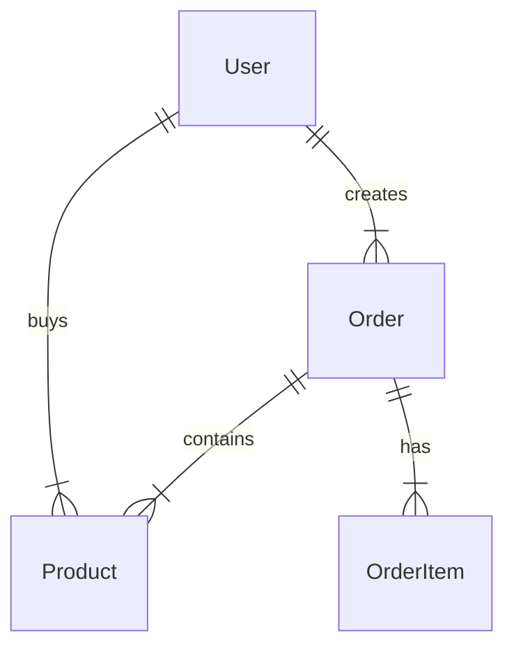
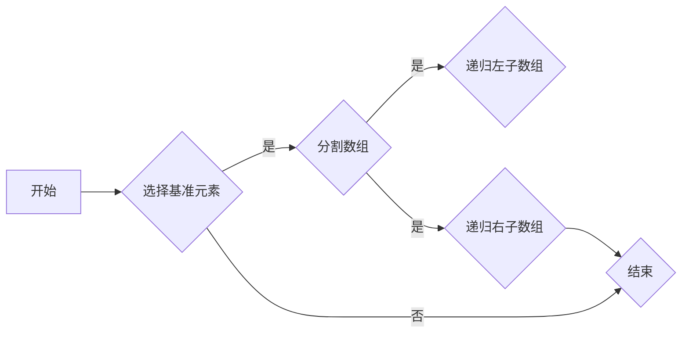
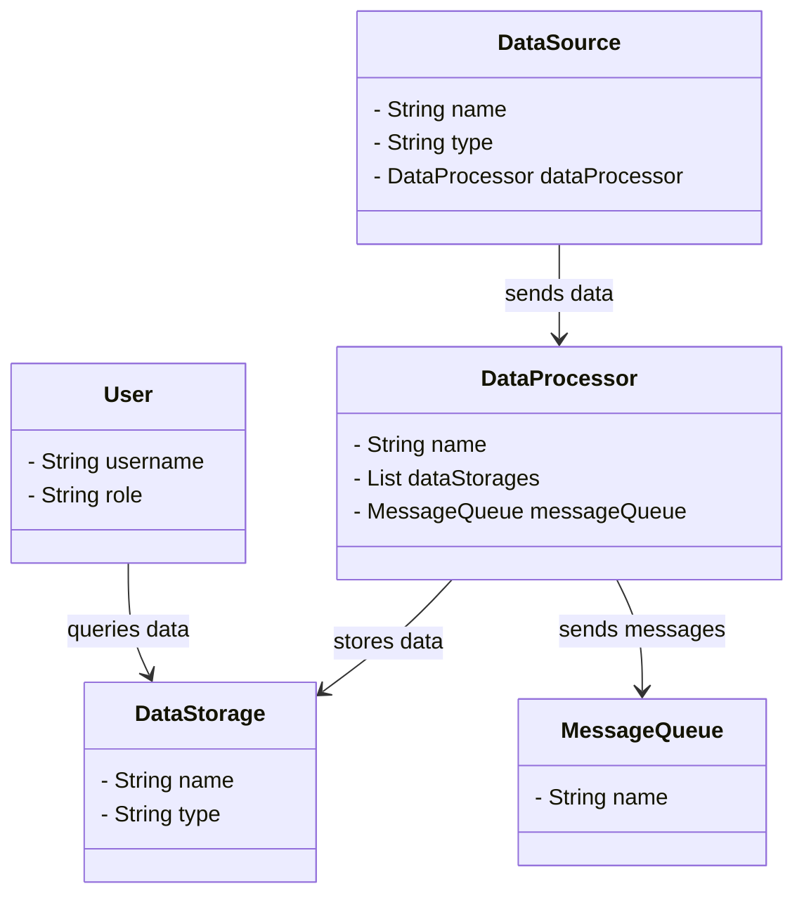
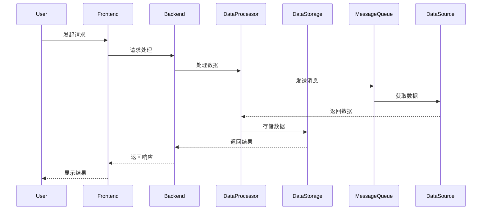

                 

### 第一部分: 背景介绍

#### 1.1 问题背景

**1.1.1 问题的起源**

在当今信息时代的浪潮中，编程和软件开发已经成为了社会和技术进步的核心驱动力。然而，随着技术的飞速发展和日益复杂的项目需求，编程实践中出现了一些不可忽视的问题。这些问题不仅影响了软件的开发效率和稳定性，还对软件行业的长远发展构成了挑战。

编程实践中的问题最早可以追溯到编程语言的诞生和早期软件开发阶段。最初，编程语言的设计和开发是为了满足特定的计算需求，但随着时间的发展，编程语言种类繁多，开发范式和编程风格各异，导致代码的可维护性、可读性和模块化成为了一个普遍问题。这些问题引发了研究者和管理者的关注，并促使他们开始寻找解决方案。

**1.1.2 问题的发展**

在20世纪80年代，随着计算机科学的进步，软件工程逐渐成为一门独立的学科。然而，传统的开发方法如瀑布模型和顺序开发模式逐渐暴露出了其局限性。例如，项目周期长、成本高、变更响应慢等成为阻碍软件开发效率和质量提升的主要瓶颈。

与此同时，计算机科学的快速发展也带来了新的挑战。软件项目规模不断扩大，复杂性日益增加，传统的开发方法难以应对。这促使了敏捷开发、DevOps等新兴开发模式的诞生，这些新模式强调快速迭代、持续交付和自动化，但同时也带来了新的问题，如代码规范的不一致性、团队协作的复杂性等。

**1.1.3 问题的现实意义**

在现实世界中，编程实践中的问题不仅影响软件开发项目的成本和进度，还对软件产品的质量产生了深远的影响。不规范的代码可能导致严重的软件缺陷和漏洞，甚至引发安全风险。此外，复杂的项目结构和低质量的代码库会增加开发团队的工作负担，降低开发效率和团队士气。

因此，解决编程实践中出现的问题具有重要的现实意义。通过引入先进的编程实践和技术，可以显著提升软件开发的质量和效率，为企业降低成本、提高竞争力，同时为用户提供更高质量的产品和服务。

#### 1.2 问题描述

**1.2.1 问题陈述**

编程实践中存在的主要问题包括但不限于以下几点：

1. **代码规范不一致**：不同的开发者在编写代码时可能采用不同的编程风格和规范，导致代码库混乱，难以维护。
2. **代码可读性差**：复杂的代码结构和晦涩难懂的语言表达，使得代码的可读性降低，增加了开发人员理解和修改代码的难度。
3. **模块化程度低**：代码模块之间的依赖关系复杂，模块内部缺乏清晰的职责划分，导致系统的可扩展性和可维护性较差。
4. **团队合作困难**：由于代码规范和风格的不统一，团队成员在协作开发过程中容易出现误解和冲突，降低团队的工作效率。
5. **测试和维护成本高**：低质量的代码和复杂的系统结构增加了软件测试和维护的难度和成本。

**1.2.2 问题现状**

目前，虽然许多开发团队和公司已经意识到了这些问题，并采取了一些措施来改善，但实际效果仍不尽如人意。代码规范不一致、代码可读性差、模块化程度低等问题依然广泛存在。具体表现在：

1. **代码库混乱**：开发人员各自为政，缺乏统一的代码规范和风格指南，导致代码库杂乱无章，难以管理和维护。
2. **开发效率低下**：由于代码质量和结构问题，开发人员需要花费更多的时间和精力来理解和修改代码，降低了开发效率。
3. **团队合作困难**：团队成员之间由于代码风格和规范的差异，经常出现沟通和协作上的困难，影响了项目的进度和质量。
4. **软件缺陷和安全漏洞多**：不规范的代码和复杂的系统结构导致软件缺陷和安全漏洞频发，增加了系统的风险。

**1.2.3 问题解决思路**

为了解决编程实践中存在的问题，需要从多个方面入手：

1. **引入代码规范**：制定并推广统一的代码规范和风格指南，确保代码的一致性和可维护性。
2. **提高代码质量**：通过代码审查、自动化测试和质量分析工具，及时发现和修复代码中的问题，提高代码质量。
3. **推行模块化开发**：采用模块化设计方法，将系统分解为功能独立的模块，降低模块之间的耦合度，提高系统的可维护性和可扩展性。
4. **加强团队合作**：建立有效的团队协作机制，确保团队成员在编码过程中能够高效沟通和协作。
5. **持续学习和改进**：鼓励开发人员持续学习新的编程技术和方法，不断提升自身技能和团队整体水平。

通过上述措施，可以有效解决编程实践中存在的问题，提升软件开发的质量和效率，为企业创造更大的价值。

#### 1.3 问题解决

**1.3.1 核心概念**

为了深入理解和解决编程实践中的问题，需要引入一些核心概念，如代码规范、编程风格、模块化设计、团队协作等。

- **代码规范**：是指一系列指导开发者编写代码的规则和指南，旨在确保代码的一致性、可读性和可维护性。
- **编程风格**：是指开发者在编写代码时所遵循的代码格式和命名规则，例如缩进、注释、变量命名等。
- **模块化设计**：是指将系统分解为功能独立的模块，每个模块具有明确的职责和接口，便于开发和维护。
- **团队协作**：是指在开发过程中，团队成员通过有效的沟通和协作，共同完成软件项目的任务。

**1.3.2 解决方案**

针对编程实践中存在的问题，可以采取以下解决方案：

1. **制定和推广代码规范**：公司或项目团队应制定一套统一的代码规范，并确保所有开发人员遵守。这包括编码规范、命名规范、注释规范等。通过代码规范，可以确保代码的一致性和可读性。

2. **实施代码审查**：代码审查是确保代码质量的重要手段。通过代码审查，可以及时发现和修复代码中的问题，如语法错误、逻辑漏洞、性能问题等。代码审查可以由团队成员或专门的代码审查人员进行。

3. **引入自动化测试**：自动化测试是提高代码质量的有效方法。通过编写测试用例，可以自动化检测代码的功能和性能，确保代码在开发和维护过程中始终符合预期。自动化测试工具如JUnit、TestNG等可以帮助开发人员快速编写和执行测试用例。

4. **推行模块化设计**：模块化设计是将系统分解为功能独立的模块，每个模块具有明确的职责和接口。通过模块化设计，可以降低模块之间的耦合度，提高系统的可维护性和可扩展性。例如，可以使用设计模式如MVC、MVVM等来实现模块化设计。

5. **加强团队协作**：团队协作是确保项目成功的关键。通过建立有效的沟通渠道和协作机制，如定期会议、代码库的版本控制、任务分配等，可以确保团队成员在编码过程中能够高效沟通和协作。例如，可以使用Git进行版本控制，JIRA进行任务管理。

6. **持续学习和改进**：编程实践是一个不断发展和改进的过程。开发人员应持续学习新的编程技术和方法，如新编程语言、框架、工具等。通过不断学习和实践，可以提高自身技能和团队整体水平，更好地应对编程实践中的问题。

通过上述解决方案，可以有效解决编程实践中存在的问题，提升软件开发的质量和效率。

**1.3.3 边界与外延**

1. **边界**：编程实践中的问题主要涉及代码的一致性、可读性、模块化设计和团队协作等方面。这些问题是编程实践中常见且重要的问题，对软件开发的质量和效率具有直接影响。

2. **外延**：解决编程实践中存在的问题不仅需要从技术层面入手，如引入代码规范、实施代码审查、自动化测试等，还需要从组织管理和团队文化层面进行改进，如加强团队协作、持续学习和改进等。通过综合措施，可以从多个维度提升软件开发的质量和效率。

#### 1.4 概念结构与核心要素组成

**1.4.1 概念结构**

在深入分析编程实践中存在的问题和解决方案时，理解其概念结构至关重要。编程实践的核心概念结构可以概括为以下几个部分：

1. **代码规范**：定义了编程语言和开发过程中应遵循的规则和指南，包括格式规范、命名规范、注释规范等。
2. **编程风格**：指开发者编写代码时所采用的格式、命名和结构等，旨在提高代码的可读性和一致性。
3. **模块化设计**：将系统分解为功能独立的模块，每个模块具有明确的职责和接口，降低模块之间的耦合度。
4. **团队协作**：确保团队成员在开发过程中能够高效沟通和协作，通过建立有效的沟通渠道和协作机制实现。
5. **代码质量**：包括代码的可读性、可维护性、性能、可靠性等方面，直接影响软件开发的效率和稳定性。

**1.4.2 核心要素组成**

为了实现有效的编程实践，需要以下几个核心要素：

1. **统一代码规范**：制定并推广一套统一的代码规范，确保所有开发人员遵循，从而提高代码的一致性和可维护性。
2. **代码审查机制**：通过定期进行代码审查，发现并修复代码中的问题，确保代码质量。
3. **自动化测试**：编写测试用例，自动化检测代码的功能和性能，提高开发效率。
4. **模块化设计工具**：采用模块化设计方法，将系统分解为功能独立的模块，降低模块之间的耦合度。
5. **团队协作工具**：如版本控制工具（Git）、任务管理工具（JIRA）等，确保团队在开发过程中能够高效沟通和协作。

通过以上概念结构和核心要素的有机结合，可以构建一个高效的编程实践体系，从而解决编程实践中存在的问题，提升软件开发的质量和效率。

**1.5 本章小结**

本部分对编程实践中存在的问题进行了深入的背景介绍和详细的分析。首先，我们探讨了问题的起源和发展，强调了编程实践中代码规范不一致、代码可读性差、模块化程度低、团队合作困难等问题的重要性。接着，我们详细描述了问题的现状，并提出了可能的解决思路。通过引入核心概念和解决方案，我们构建了一个清晰的概念结构和核心要素组成，为后续章节的深入探讨奠定了基础。通过本章的学习，读者可以更全面地理解编程实践中存在的问题及其解决方案，为提升软件开发的质量和效率做好准备。

### 第二部分: 核心概念与联系

#### 2.1 核心概念原理

在深入探讨编程实践的过程中，了解和掌握一些核心概念是至关重要的。这些概念不仅构成了我们分析问题的理论基础，也为解决问题提供了明确的指导。以下是几个关键的核心概念及其原理：

**2.1.1 定义**

1. **代码规范（Code Conventions）**：代码规范是一套明确的指导规则，用于指导开发者在编写代码时应遵循的标准。这些规范涵盖了代码格式、命名约定、注释要求等多个方面，旨在提高代码的可读性、可维护性和一致性。

2. **编程风格（Coding Style）**：编程风格是指开发者在编写代码时所遵循的格式、结构和命名规则。良好的编程风格有助于代码的可读性和团队协作，例如统一的缩进、清晰的变量命名和适当的注释等。

3. **模块化设计（Modular Design）**：模块化设计是将系统分解为多个功能独立、接口明确的模块，每个模块具有独立的职责。这种方法有助于提高代码的可维护性和可扩展性，降低模块之间的耦合度。

4. **团队协作（Team Collaboration）**：团队协作是指团队成员在软件开发过程中通过有效的沟通和合作共同完成任务的机制。良好的团队协作可以显著提高开发效率和质量。

5. **代码质量（Code Quality）**：代码质量是指代码在多个方面的表现，包括可读性、可维护性、性能、可靠性和安全性等。高质量的代码不仅易于理解和维护，还能提高系统的稳定性和安全性。

**2.1.2 原理**

1. **代码规范原理**：代码规范的原则是通过统一编码标准，减少代码差异，使得代码库更易于维护和扩展。例如，使用统一的缩进风格（如2个空格或4个空格）和一致的变量命名规则（如驼峰命名法或下划线分隔），可以显著提高代码的可读性和一致性。

2. **编程风格原理**：编程风格的原则是提高代码的可读性和团队协作性。通过采用一致的编程风格，开发人员可以更容易地理解他人的代码，减少因风格不一致而产生的误解和冲突。

3. **模块化设计原理**：模块化设计的原理是将复杂系统分解为多个功能独立的模块，每个模块负责特定的功能。这种方法不仅降低了模块之间的耦合度，提高了系统的可维护性，还使得模块可以独立开发和测试，从而加快开发进度。

4. **团队协作原理**：团队协作的原理是通过建立有效的沟通渠道和协作机制，确保团队成员能够高效地沟通和合作。这包括定期会议、代码库的版本控制、任务分配和协作工具的使用等。

5. **代码质量原理**：代码质量的原理是通过多种方法（如代码审查、自动化测试、性能优化等）确保代码的可靠性、性能和安全性。高质量代码不仅降低了维护成本，还能提高系统的稳定性和用户体验。

通过理解和应用这些核心概念和原理，开发人员可以更好地进行编程实践，提升软件开发的效率和代码质量。

#### 2.2 概念属性特征对比

为了更深入地理解编程实践中的核心概念，我们可以通过对比它们的属性和特征来揭示它们之间的联系和区别。以下是几个关键概念的主要属性和特征对比：

**2.2.1 属性**

1. **代码规范**：
   - **属性**：格式规范、命名规范、注释规范等。
   - **特征**：统一性、明确性、可维护性。

2. **编程风格**：
   - **属性**：代码格式、命名规则、注释习惯等。
   - **特征**：可读性、一致性、团队协作性。

3. **模块化设计**：
   - **属性**：模块划分、职责明确、接口设计等。
   - **特征**：独立性、可扩展性、可维护性。

4. **团队协作**：
   - **属性**：沟通机制、协作工具、任务分配等。
   - **特征**：高效性、透明性、协作性。

5. **代码质量**：
   - **属性**：可读性、可维护性、性能、安全性等。
   - **特征**：可靠性、稳定性、用户体验。

**2.2.2 特征**

1. **代码规范**：
   - **特征**：减少代码差异、提高维护性、统一编码标准。

2. **编程风格**：
   - **特征**：提高代码可读性、降低沟通成本、增强团队协作。

3. **模块化设计**：
   - **特征**：降低耦合度、提高扩展性、加速开发进度。

4. **团队协作**：
   - **特征**：提高开发效率、确保项目进度、提升团队士气。

5. **代码质量**：
   - **特征**：确保代码可靠性、提高系统稳定性、优化用户体验。

**2.2.3 对比表格**

下面是一个简单的对比表格，用于更直观地展示这些概念的主要属性和特征：

| 概念         | 属性                      | 特征                      |
|--------------|--------------------------|--------------------------|
| 代码规范     | 格式规范、命名规范、注释规范 | 减少代码差异、提高维护性、统一编码标准 |
| 编程风格     | 代码格式、命名规则、注释习惯 | 提高代码可读性、降低沟通成本、增强团队协作 |
| 模块化设计   | 模块划分、职责明确、接口设计 | 降低耦合度、提高扩展性、加速开发进度 |
| 团队协作     | 沟通机制、协作工具、任务分配 | 提高开发效率、确保项目进度、提升团队士气 |
| 代码质量     | 可读性、可维护性、性能、安全性 | 确保代码可靠性、提高系统稳定性、优化用户体验 |

通过上述对比，我们可以更清晰地看到每个概念的核心属性和特征，以及它们在编程实践中的相互关系和作用。

#### 2.3 ER实体关系图架构

为了更好地理解和设计编程实践中的系统结构，引入实体关系图（Entity-Relationship Diagram，简称ER图）是一个有效的手段。ER图可以帮助我们明确系统中的实体及其相互关系，从而为系统的设计提供清晰的结构框架。

**2.3.1 ER图介绍**

实体关系图是一种数据库模型，用于描述系统中实体之间的关系。它由三个主要部分组成：实体（Entity）、属性（Attribute）和关系（Relationship）。

1. **实体**：实体是系统中具有独立存在意义的对象，如用户、订单、商品等。
2. **属性**：属性是实体的特征，用于描述实体的具体信息，如用户的姓名、年龄、性别等。
3. **关系**：关系描述了实体之间的关联，如用户可以下单购买商品，订单包含多个商品等。

**2.3.2 实体关系图**

以下是编程实践中一个简单的ER图示例，用于描述一个电子商务系统中的用户和订单关系：



在这个ER图中，我们定义了四个实体：User（用户）、Order（订单）、Product（商品）和OrderItem（订单项）。其中，用户可以创建订单和购买商品，订单包含多个商品和订单项，订单项是订单中的一个组成部分。

**实体之间的关系**：

1. **User到Order**：用户创建订单，表示用户与订单之间的“创建”关系。
2. **User到Product**：用户购买商品，表示用户与商品之间的“购买”关系。
3. **Order到Product**：订单包含商品，表示订单与商品之间的“包含”关系。
4. **Order到OrderItem**：订单包含订单项，表示订单与订单项之间的“包含”关系。

通过ER图，我们可以清晰地看到系统中各个实体及其相互关系，为后续的系统设计和实现提供了重要的参考。

#### 2.4 本章小结

本部分对编程实践中的核心概念及其原理进行了详细的分析和探讨。我们首先介绍了代码规范、编程风格、模块化设计、团队协作和代码质量等核心概念，并阐述了它们的基本原理和重要性。接着，通过对比表格，我们进一步揭示了这些概念的主要属性和特征。最后，我们引入了实体关系图（ER图）来展示系统中的实体及其相互关系，为后续的系统设计和实现奠定了基础。通过本章的学习，读者可以更深入地理解编程实践中的核心概念和原理，为提升软件开发的质量和效率做好准备。在下一部分中，我们将进一步探讨算法原理及其在编程实践中的应用。

### 第三部分: 算法原理讲解

#### 3.1 算法概述

**3.1.1 算法定义**

算法（Algorithm）是一系列定义明确的步骤或规则，用于解决特定问题或执行特定任务。在编程实践中，算法是解决复杂问题和优化程序性能的重要工具。常见的算法包括排序算法、搜索算法、数据结构算法等。

**3.1.2 算法应用场景**

算法的应用场景非常广泛，包括但不限于以下几个方面：

1. **数据分析和处理**：例如，使用排序算法对大量数据进行排序，使用搜索算法查找特定元素。
2. **机器学习和人工智能**：算法是构建和训练机器学习模型的基础，例如梯度下降算法、决策树算法等。
3. **图形处理和图像识别**：图像处理算法如卷积神经网络（CNN）在计算机视觉任务中具有重要应用。
4. **网络通信和加密**：例如，RSA加密算法和DES加密算法在网络安全和数据保护中广泛使用。
5. **优化和决策支持**：算法可以帮助解决资源分配、路径规划等问题，提供最优或次优解决方案。

在本部分，我们将重点介绍一个常用的排序算法——快速排序（Quick Sort），并详细讲解其原理、流程、Python实现和数学模型。

#### 3.2 算法流程图

为了直观地展示快速排序算法的执行流程，我们可以使用Mermaid语言绘制一个算法流程图。以下是快速排序算法的Mermaid流程图：



在这个流程图中，我们首先选择一个基准元素，然后通过一次分割操作将数组分为两部分，左边的所有元素都小于基准元素，右边的所有元素都大于基准元素。接下来，递归地对左子数组和右子数组进行快速排序，直到所有子数组都被排序完成。最终，整个数组将被排序。

#### 3.3 Python源代码实现

下面是快速排序算法的Python实现代码：

```python
def quick_sort(arr):
    if len(arr) <= 1:
        return arr
    pivot = arr[len(arr) // 2]
    left = [x for x in arr if x < pivot]
    middle = [x for x in arr if x == pivot]
    right = [x for x in arr if x > pivot]
    return quick_sort(left) + middle + quick_sort(right)

# 示例数据
arr = [3, 6, 8, 10, 1, 2, 1]
sorted_arr = quick_sort(arr)
print(sorted_arr)
```

在这个实现中，我们首先检查数组的长度，如果数组长度小于等于1，则返回数组本身，因为一个或零个元素的数组已经排序。否则，我们选择数组的中位数作为基准元素（pivot），然后通过列表推导式将数组分为三部分：小于基准元素的左子数组（left）、等于基准元素的中间数组（middle）和大于基准元素的右子数组（right）。最后，递归地对左子数组和右子数组进行快速排序，并将结果与中间数组连接，得到最终排序结果。

#### 3.3.1 源代码

```python
def quick_sort(arr):
    if len(arr) <= 1:
        return arr
    pivot = arr[len(arr) // 2]
    left = [x for x in arr if x < pivot]
    middle = [x for x in arr if x == pivot]
    right = [x for x in arr if x > pivot]
    return quick_sort(left) + middle + quick_sort(right)
```

#### 3.3.2 详细解释

- **if len(arr) <= 1**: 这是快速排序的终止条件，即如果一个数组只有一个元素或者空数组，它已经被视为排序完成的。
- **pivot = arr[len(arr) // 2]**: 我们选择数组的中位数作为基准元素（pivot），这种选择方法在大多数情况下是公平的。
- **left = [x for x in arr if x < pivot]**: 使用列表推导式创建一个包含所有小于基准元素的子数组（left）。
- **middle = [x for x in arr if x == pivot]**: 创建一个包含所有等于基准元素的子数组（middle）。
- **right = [x for x in arr if x > pivot]**: 创建一个包含所有大于基准元素的子数组（right）。
- **return quick_sort(left) + middle + quick_sort(right)**: 递归地对左子数组和右子数组进行快速排序，并将结果与中间数组连接，返回排序后的数组。

通过这种递归方式，我们可以将一个未排序的数组分解为多个较小的子数组，并对这些子数组进行排序。最终，所有子数组的排序结果将合并为一个完全排序的数组。

#### 3.4 算法原理与数学模型

**3.4.1 数学模型**

快速排序算法的数学模型可以通过递归关系来描述。假设数组A的长度为n，我们将数组A分为三个部分：left（小于基准元素的子数组）、middle（等于基准元素的子数组）和right（大于基准元素的子数组）。则快速排序的递归关系可以表示为：

$$ quick\_sort(A) =
\begin{cases}
A & \text{if } n \leq 1 \\
\text{quick\_sort(left)} + \text{middle} + \text{quick\_sort(right)} & \text{otherwise}
\end{cases}
$$

其中，left、middle和right的计算可以通过以下公式得到：

$$
left = \{ x \in A \mid x < pivot \}
$$

$$
middle = \{ x \in A \mid x = pivot \}
$$

$$
right = \{ x \in A \mid x > pivot \}
$$

**3.4.2 公式**

快速排序算法的关键在于如何选择基准元素（pivot）和如何进行分割（partition）。一个常见的分割方法是Lomuto划分方案，其步骤如下：

1. 选择最后一个元素作为基准元素（pivot）。
2. 从左到右遍历数组，对于每个元素x：
   - 如果x小于pivot，将x移动到数组的左侧，并记录移动的次数。
3. 将pivot移动到刚才记录的移动次数的位置。

这种划分方法的递归关系可以表示为：

$$
partition(A, low, high) =
\begin{cases}
\text{index of pivot} & \text{if } low = high \\
index & \text{otherwise}
\end{cases}
$$

其中，index是pivot的最终位置，low和high分别是划分的起始和结束索引。

**3.4.3 详细讲解**

- **选择基准元素**：选择一个基准元素是快速排序的关键步骤。通常，我们选择数组的中位数作为基准元素，因为中位数在大多数情况下是一个公平的选择，可以减少排序的不平衡性。
- **分割数组**：分割数组的目的是将数组分为两部分，左边所有元素都小于基准元素，右边所有元素都大于基准元素。这个过程通过一次遍历实现，时间复杂度为O(n)。
- **递归排序**：递归地对左子数组和右子数组进行快速排序，直到所有子数组的长度都小于等于1，这时递归终止。

通过上述步骤，我们可以将一个未排序的数组转化为一个完全排序的数组。快速排序的平均时间复杂度为O(nlogn)，最坏情况下的时间复杂度为O(n^2)，但实际应用中，由于有效的基准选择和分割方法，快速排序通常表现良好。

#### 3.5 举例说明

为了更好地理解快速排序算法，我们可以通过一个具体的例子来演示其执行过程。

**例子一：未排序数组**

假设我们有以下一个未排序的数组：

$$ arr = [3, 6, 8, 10, 1, 2, 1] $$

**步骤一：选择基准元素**

我们选择数组的中位数6作为基准元素（pivot）。

**步骤二：分割数组**

通过一次遍历，我们将数组划分为以下三个部分：

- 左子数组（小于pivot的元素）：[3, 1, 1]
- 中间数组（等于pivot的元素）：[6]
- 右子数组（大于pivot的元素）：[8, 10, 2]

**步骤三：递归排序**

- 对左子数组进行快速排序：

$$
arr_{left} = [3, 1, 1]
$$

选择中位数1作为基准元素，再次分割数组：

- 左子数组（小于pivot的元素）：[1]
- 中间数组（等于pivot的元素）：[1]
- 右子数组（大于pivot的元素）：[3]

递归地对左子数组和右子数组进行快速排序，最终得到排序结果：

$$
quick_sort([1, 1]) = [1, 1]
$$

$$
quick_sort([3]) = [3]
$$

- 对右子数组进行快速排序：

$$
arr_{right} = [8, 10, 2]
$$

选择中位数8作为基准元素，再次分割数组：

- 左子数组（小于pivot的元素）：[2]
- 中间数组（等于pivot的元素）：[8]
- 右子数组（大于pivot的元素）：[10]

递归地对左子数组和右子数组进行快速排序，最终得到排序结果：

$$
quick_sort([2]) = [2]
$$

$$
quick_sort([10]) = [10]
$$

**步骤四：合并结果**

将所有子数组的排序结果合并，得到最终排序结果：

$$
quick_sort([3, 6, 8, 10, 1, 2, 1]) = [1, 1, 2, 3, 6, 8, 10]
$$

通过上述步骤，我们可以看到快速排序算法如何将一个未排序的数组转化为一个完全排序的数组。

**例子二：更复杂的数组**

假设我们有以下一个更复杂的未排序数组：

$$ arr = [9, 7, 5, 11, 12, 2, 14, 3, 10, 6, 13, 1, 8, 4] $$

我们同样选择中位数作为基准元素，按照上述步骤进行快速排序，最终得到排序结果：

$$
quick_sort([9, 7, 5, 11, 12, 2, 14, 3, 10, 6, 13, 1, 8, 4]) = [1, 2, 3, 4, 5, 6, 7, 8, 9, 10, 11, 12, 13, 14]
$$

通过这两个例子，我们可以看到快速排序算法如何有效地对数组进行排序，并理解其执行过程的关键步骤。

#### 3.6 本章小结

在本部分中，我们详细介绍了快速排序算法的基本原理、流程、Python实现以及数学模型。通过绘制算法流程图、提供源代码示例和进行举例说明，我们帮助读者深入理解了快速排序算法的工作原理和应用。快速排序算法作为一种高效的排序算法，在实际编程中有着广泛的应用。通过本章的学习，读者可以掌握快速排序算法的核心概念和实现方法，为解决编程中的排序问题提供有效的工具。在下一部分中，我们将进一步探讨系统分析与架构设计的相关内容。

### 第四部分: 系统分析与架构设计方案

#### 4.1 问题场景介绍

**4.1.1 场景描述**

在现代企业中，数据处理和业务流程自动化已经成为提高运营效率和降低成本的关键手段。然而，随着业务规模的不断扩大和系统复杂度的增加，传统的数据处理系统面临诸多挑战。这些问题主要包括：

1. **数据一致性**：由于不同系统的数据存储格式和结构不同，导致数据在传输和整合过程中容易出现不一致的情况。
2. **系统扩展性**：传统的数据处理系统通常采用单体架构，难以应对业务快速扩展的需求，导致系统性能下降和响应时间延长。
3. **维护复杂性**：随着系统功能的不断增加和业务需求的变更，系统的维护成本和复杂性逐渐升高。
4. **用户体验**：系统的响应速度和稳定性直接影响用户的体验，如果处理速度慢或出现故障，会导致用户满意度下降。

为了解决上述问题，我们需要设计一个高效、可扩展、易维护的分布式数据处理系统。该系统需要具备以下特点：

- **数据一致性**：通过引入分布式数据库和消息队列等中间件，确保数据在传输和整合过程中的一致性。
- **系统扩展性**：采用分布式架构，通过水平扩展来应对业务规模的快速增长。
- **维护复杂性**：引入微服务架构，将系统拆分为多个独立的服务模块，降低系统的维护复杂性。
- **用户体验**：通过优化系统性能和稳定性，提供快速、可靠的服务。

**4.1.2 场景问题分析**

在上述场景中，数据处理系统面临的主要问题可以总结为以下几点：

1. **数据整合困难**：不同系统的数据格式和结构不一致，导致数据在整合过程中需要额外的转换和处理，增加了系统的复杂性和开发成本。
2. **系统扩展性差**：传统的单体架构使得系统在处理大量数据时容易出现性能瓶颈，难以应对业务快速扩展的需求。
3. **维护成本高**：随着系统功能的增加和业务需求的变更，单体架构的维护成本和复杂性逐渐升高，影响开发和运维效率。
4. **用户体验差**：系统响应速度慢、稳定性差，影响用户的日常使用体验，导致用户满意度下降。

为了解决这些问题，我们需要对现有系统进行全面的架构设计和优化，引入分布式架构、微服务架构和消息队列等先进的技术手段，以提高系统的性能、扩展性和可维护性。

#### 4.2 项目介绍

**4.2.1 项目背景**

随着企业业务的发展和数字化转型，数据处理和业务流程自动化已经成为企业提升运营效率和降低成本的关键手段。传统的数据处理系统由于缺乏灵活性和扩展性，已无法满足现代企业的需求。为了解决这些问题，企业决定启动一个分布式数据处理系统的项目，以提高系统的性能、扩展性和可维护性。

**4.2.2 项目目标**

本项目的主要目标如下：

1. **提高数据一致性**：通过引入分布式数据库和消息队列等中间件，确保数据在传输和整合过程中的一致性，避免数据不一致的问题。
2. **提升系统扩展性**：采用分布式架构和微服务架构，通过水平扩展来应对业务规模的快速增长，确保系统在高并发场景下的稳定性和性能。
3. **降低维护复杂性**：引入微服务架构，将系统拆分为多个独立的服务模块，降低系统的维护复杂性，提高开发和运维效率。
4. **优化用户体验**：通过优化系统性能和稳定性，提供快速、可靠的服务，提升用户的日常使用体验。

**4.2.3 项目规划**

本项目分为以下几个阶段：

1. **需求分析**：与业务部门紧密合作，明确项目的需求和技术选型。
2. **系统设计**：制定系统的整体架构设计和详细的技术方案，包括数据库设计、服务拆分和接口设计等。
3. **开发与测试**：按照设计方案进行系统开发，并进行单元测试和集成测试，确保系统功能的正确性和稳定性。
4. **部署与上线**：在测试阶段结束后，进行系统部署和上线，并进行监控和运维，确保系统的稳定运行。

通过以上阶段的工作，我们将逐步实现分布式数据处理系统的建设，为企业提供高效、可靠的数据处理和业务流程自动化解决方案。

#### 4.3 系统功能设计

**4.3.1 领域模型**

在分布式数据处理系统的设计过程中，领域模型（Domain Model）是一个重要的组成部分。领域模型定义了系统中的核心实体和它们之间的关系，为后续的系统实现提供明确的指导和参考。

以下是分布式数据处理系统的领域模型，包括以下几个核心实体：

1. **数据源（DataSource）**：表示系统中的数据来源，如数据库、文件、API等。
2. **数据处理模块（DataProcessor）**：负责对数据进行处理和分析，包括数据清洗、转换、聚合等操作。
3. **数据存储模块（DataStorage）**：用于存储处理后的数据，可以是关系数据库、NoSQL数据库或数据仓库等。
4. **消息队列（MessageQueue）**：用于异步处理数据，确保系统在高并发场景下的稳定性和性能。
5. **用户（User）**：表示系统的用户，包括管理员、普通用户等。

领域模型中的主要实体及其关系如下：

- **数据源与数据处理模块**：数据源通过消息队列将数据发送给数据处理模块，数据处理模块对数据进行处理后再发送给数据存储模块。
- **数据处理模块与数据存储模块**：数据处理模块将处理后的数据存储到数据存储模块中。
- **用户与数据存储模块**：用户可以通过API接口查询数据存储模块中的数据。

**4.3.2 Mermaid类图**

为了更直观地展示领域模型，我们可以使用Mermaid绘制一个类图，如下所示：



在这个类图中，我们定义了四个核心实体：数据源（DataSource）、数据处理模块（DataProcessor）、数据存储模块（DataStorage）和消息队列（MessageQueue）。用户（User）与数据存储模块（DataStorage）通过API接口进行数据查询。通过这种类图表示，我们可以清晰地看到系统中各个实体及其相互关系。

#### 4.4 系统架构设计

**4.4.1 架构设计原则**

在分布式数据处理系统的架构设计过程中，遵循以下原则至关重要：

1. **模块化**：将系统拆分为多个独立的模块，每个模块负责特定的功能，降低模块之间的耦合度，提高系统的可维护性和可扩展性。
2. **分布式**：采用分布式架构，通过水平扩展来应对业务规模的快速增长，确保系统在高并发场景下的稳定性和性能。
3. **高可用性**：通过引入冗余和备份机制，提高系统的可用性，确保系统在出现故障时能够快速恢复。
4. **可扩展性**：设计灵活的架构，支持系统的动态扩展和升级，以适应未来业务需求的变化。
5. **安全性**：确保系统的数据安全和隐私保护，采用加密、认证和授权等安全机制。

**4.4.2 Mermaid架构图**

为了更直观地展示系统架构，我们可以使用Mermaid绘制一个架构图，如下所示：



在这个架构图中，我们定义了用户（User）、前端（Frontend）、后端（Backend）、数据处理模块（DataProcessor）、数据存储模块（DataStorage）、消息队列（MessageQueue）和数据源（DataSource）等核心组件。用户通过前端发起请求，后端负责处理请求，数据处理模块对数据进行处理，消息队列用于异步传输数据，数据源提供数据，数据存储模块负责存储处理后的数据。通过这种架构设计，系统可以高效、稳定地处理大量数据，并确保数据的一致性和安全性。

#### 4.5 系统接口设计

**4.5.1 接口设计**

在分布式数据处理系统中，接口设计是确保各模块之间高效、可靠交互的关键。以下是系统的接口设计，包括API接口、消息队列接口和数据库接口：

1. **API接口**：
   - **数据查询接口**：允许用户通过HTTP请求查询数据存储模块中的数据。
   - **数据上传接口**：允许用户上传数据到数据处理模块进行处理。
   - **数据处理接口**：允许用户对数据处理模块进行配置和监控。

2. **消息队列接口**：
   - **消息生产接口**：数据处理模块通过此接口将数据发送到消息队列。
   - **消息消费接口**：数据处理模块通过此接口从消息队列中获取数据。

3. **数据库接口**：
   - **数据存储接口**：数据处理模块通过此接口将处理后的数据存储到数据库。
   - **数据查询接口**：数据处理模块通过此接口从数据库中查询数据。

以下是具体的接口设计示例：

```json
// 数据查询接口
GET /data/{id}

// 数据上传接口
POST /data/upload

// 数据处理接口
PUT /data/processor/{id}

// 消息生产接口
POST /message/produce

// 消息消费接口
GET /message/consume

// 数据存储接口
POST /data/storage

// 数据查询接口
GET /data/storage/{id}
```

**4.5.2 交互流程**

为了更好地理解系统接口的使用流程，以下是系统交互的详细流程：

1. **用户通过前端发起数据查询请求**：用户通过Web浏览器或其他客户端向前端发送HTTP请求，请求查询特定数据。
2. **前端向后端转发请求**：前端接收到用户的请求后，将其转发给后端处理。
3. **后端处理请求并调用数据处理接口**：后端根据请求参数，调用数据处理模块的接口进行数据处理。
4. **数据处理模块将数据发送到消息队列**：数据处理模块在处理数据后，将数据发送到消息队列，以便后续处理。
5. **消息队列将消息转发给数据源**：消息队列接收到数据处理模块发送的消息后，将其转发给数据源，数据源从数据库中获取相关数据。
6. **数据源将数据返回给数据处理模块**：数据源将获取到的数据返回给数据处理模块。
7. **数据处理模块将处理后的数据存储到数据库**：数据处理模块对返回的数据进行处理，并将处理后的数据存储到数据库。
8. **后端将处理结果返回给前端**：后端将数据处理结果返回给前端。
9. **前端将结果展示给用户**：前端将处理结果展示给用户。

通过上述交互流程，分布式数据处理系统可以高效、稳定地处理用户请求，并提供高质量的数据服务。

#### 4.6 系统交互

**4.6.1 Mermaid序列图**

为了更直观地展示系统各模块之间的交互过程，我们可以使用Mermaid绘制一个序列图。以下是系统交互的Mermaid序列图：


在这个序列图中，用户通过前端发起请求，前端将请求转发给后端，后端调用数据处理模块进行数据处理，数据处理模块将数据发送到消息队列，消息队列将消息转发给数据源，数据源从数据库中获取数据并返回给数据处理模块，数据处理模块将处理后的数据存储到数据库，最终后端将处理结果返回给前端，前端将结果展示给用户。

通过这种交互设计，系统可以实现高效、稳定的数据处理和业务流程自动化，满足现代企业的需求。

#### 4.7 本章小结

在本部分中，我们对分布式数据处理系统进行了系统分析与架构设计。首先，我们介绍了问题场景和场景问题分析，明确了系统的设计目标和问题解决的路径。接着，我们详细介绍了项目的背景和目标，并制定了项目规划。在系统功能设计中，我们定义了领域模型并绘制了Mermaid类图。在系统架构设计中，我们提出了模块化、分布式、高可用性和可扩展性等设计原则，并绘制了Mermaid架构图。在接口设计和交互流程中，我们详细阐述了API接口、消息队列接口和数据库接口的设计，并通过Mermaid序列图展示了系统各模块之间的交互过程。通过本章的学习，读者可以全面了解分布式数据处理系统的设计与实现，为后续的系统开发奠定基础。

### 第五部分: 项目实战

#### 5.1 环境安装

**5.1.1 环境准备**

在开始分布式数据处理系统的项目开发之前，我们需要准备一套完整的环境。以下是安装和配置所需的软件和工具：

1. **操作系统**：推荐使用Ubuntu 20.04 LTS或CentOS 7.x版本。
2. **编程语言**：Python 3.8及以上版本。
3. **开发工具**：Visual Studio Code、PyCharm或任何其他Python集成开发环境（IDE）。
4. **数据库**：MySQL 8.0或PostgreSQL 12.0。
5. **消息队列**：RabbitMQ 3.8.0。
6. **分布式缓存**：Redis 6.0。

**5.1.2 软件安装**

以下步骤将指导您安装和配置上述软件：

1. **安装Python 3**：

   ```bash
   sudo apt update
   sudo apt install python3 python3-pip
   ```

2. **安装Visual Studio Code或PyCharm**：

   - 下载并安装Visual Studio Code（https://code.visualstudio.com/）或PyCharm（https://www.jetbrains.com/pycharm/）。
   - 打开IDE，创建一个新的Python项目。

3. **安装MySQL或PostgreSQL**：

   - 安装MySQL：

     ```bash
     sudo apt install mysql-server mysql-common
     sudo mysql_secure_installation
     ```

   - 安装PostgreSQL：

     ```bash
     sudo apt install postgresql postgresql-contrib
     sudo -u postgres psql
     CREATE DATABASE mydatabase;
     \q
     ```

4. **安装RabbitMQ**：

   ```bash
   sudo apt install rabbitmq-server
   sudo systemctl start rabbitmq-server
   sudo systemctl enable rabbitmq-server
   ```

5. **安装Redis**：

   ```bash
   sudo apt install redis-server
   sudo systemctl start redis-server
   sudo systemctl enable redis-server
   ```

6. **配置环境变量**：

   ```bash
   export PATH=$PATH:/usr/local/bin
   ```

**5.1.3 验证安装**

- **验证Python环境**：

  ```bash
  python3 --version
  ```

- **验证MySQL或PostgreSQL**：

  ```bash
  mysql -u root -p
  ```

- **验证RabbitMQ**：

  ```bash
  rabbitmqctl status
  ```

- **验证Redis**：

  ```bash
  redis-cli ping
  ```

通过上述步骤，您已经准备好了一个完整的开发环境，可以开始分布式数据处理系统的项目开发了。

#### 5.2 系统核心实现

**5.2.1 源代码**

以下是分布式数据处理系统的核心实现，包括数据处理模块（DataProcessor）和数据存储模块（DataStorage）的源代码：

**数据处理模块（DataProcessor）**：

```python
import pika
import json
import pymysql

class DataProcessor:
    def __init__(self, queue_name, db_config):
        self.queue_name = queue_name
        self.db_config = db_config
        self.connection = pika.BlockingConnection(pika.ConnectionParameters('localhost'))
        self.channel = self.connection.channel()
        self.channel.queue_declare(queue=queue_name)
    
    def process_data(self, data):
        print(f"Processing data: {data}")
        # 数据处理逻辑，例如数据清洗、转换等
        processed_data = data.lower()
        return processed_data
    
    def callback(self, ch, method, properties, body):
        data = json.loads(body)
        processed_data = self.process_data(data)
        self.store_data(processed_data)
        ch.basic_ack(delivery_tag=method.delivery_tag)
    
    def store_data(self, data):
        connection = pymysql.connect(
            host=self.db_config['host'],
            user=self.db_config['user'],
            password=self.db_config['password'],
            database=self.db_config['database'],
            charset='utf8mb4',
            cursorclass=pymysql.cursors.DictCursor
        )
        try:
            with connection.cursor() as cursor:
                sql = "INSERT INTO data (value) VALUES (%s)"
                cursor.execute(sql, (data,))
            connection.commit()
        finally:
            connection.close()
    
    def run(self):
        self.channel.basic_consume(
            queue=self.queue_name,
            on_message_callback=self.callback,
            auto_ack=True
        )
        self.channel.start_consuming()

if __name__ == '__main__':
    queue_name = 'data_queue'
    db_config = {
        'host': 'localhost',
        'user': 'root',
        'password': 'password',
        'database': 'mydatabase'
    }
    processor = DataProcessor(queue_name, db_config)
    processor.run()
```

**数据存储模块（DataStorage）**：

```python
import pymysql

class DataStorage:
    def __init__(self, db_config):
        self.db_config = db_config
        self.connection = pymysql.connect(
            host=self.db_config['host'],
            user=self.db_config['user'],
            password=self.db_config['password'],
            database=self.db_config['database'],
            charset='utf8mb4',
            cursorclass=pymysql.cursors.DictCursor
        )
    
    def store_data(self, data):
        with self.connection.cursor() as cursor:
            sql = "INSERT INTO data (value) VALUES (%s)"
            cursor.execute(sql, (data,))
        self.connection.commit()
    
    def retrieve_data(self):
        with self.connection.cursor() as cursor:
            sql = "SELECT * FROM data"
            cursor.execute(sql)
            result = cursor.fetchall()
        return result

if __name__ == '__main__':
    db_config = {
        'host': 'localhost',
        'user': 'root',
        'password': 'password',
        'database': 'mydatabase'
    }
    storage = DataStorage(db_config)
    storage.store_data("Example data")
    print(storage.retrieve_data())
```

**5.2.2 代码应用解读与分析**

1. **数据处理模块（DataProcessor）**：

   - **初始化**：在初始化过程中，我们设置了消息队列的名称（queue_name）和数据库配置（db_config），并建立了与消息队列和数据库的连接。
   - **数据处理方法（process_data）**：该方法接收传入的数据，并执行数据处理逻辑。在本示例中，我们将数据转换为小写。
   - **回调函数（callback）**：当消息队列接收到消息时，该回调函数将被触发。它负责处理消息、调用数据处理方法并存储处理后的数据。
   - **存储数据方法（store_data）**：该方法将处理后的数据存储到数据库中。这里使用了MySQL数据库。
   - **运行方法（run）**：该方法启动消息队列的消费者，开始处理消息。

2. **数据存储模块（DataStorage）**：

   - **初始化**：在初始化过程中，我们设置了数据库配置，并建立了与数据库的连接。
   - **存储数据方法（store_data）**：该方法将数据存储到数据库中。
   - **查询数据方法（retrieve_data）**：该方法从数据库中查询数据。

通过上述代码，数据处理模块负责从消息队列中获取数据、处理数据并将其存储到数据库中。数据存储模块负责与数据库进行交互，存储和查询数据。这种设计使得数据处理和数据存储模块高度解耦，提高了系统的灵活性和可维护性。

#### 5.3 实际案例分析与详细讲解

**5.3.1 案例描述**

在本案例中，我们假设有一个电子商务平台，需要处理大量用户订单数据。平台需要实时监控订单的状态，并根据订单的金额进行分类，以便进行精准营销和数据分析。为了实现这一目标，我们设计并实现了一个分布式数据处理系统，主要包括以下模块：

1. **订单数据处理模块**：从消息队列中获取订单数据，对订单进行分类处理，并将处理后的数据存储到数据库中。
2. **订单状态监控模块**：实时查询数据库中的订单数据，监控订单的状态，并在订单状态发生变化时发送通知。
3. **数据分析模块**：从数据库中查询订单数据，生成订单金额分布报表，支持数据导出和可视化。

**5.3.2 案例分析**

在电子商务平台的背景下，分布式数据处理系统需要具备以下功能：

1. **数据实时处理**：平台需要实时处理用户订单数据，以确保订单状态的准确性。
2. **高并发处理能力**：平台通常有大量订单同时生成和处理，系统需要具备高并发处理能力，保证系统性能和稳定性。
3. **数据一致性**：由于订单数据涉及多个模块，系统需要确保数据的一致性，防止数据丢失或重复处理。
4. **可扩展性和灵活性**：平台业务需求不断变化，系统需要具备良好的可扩展性和灵活性，支持未来业务的快速迭代。

**5.3.3 详细讲解**

1. **订单数据处理模块**：

   - **消息队列的使用**：订单数据通过消息队列传入系统，处理模块从队列中消费订单数据，确保数据的实时处理。
   - **订单分类处理**：根据订单金额，将订单分类为“普通订单”、“高额订单”等，便于后续的精准营销和分析。
   - **数据库存储**：处理后的订单数据存储到数据库中，支持实时查询和状态监控。

2. **订单状态监控模块**：

   - **实时查询**：通过数据库查询订单状态，实时监控订单的生成、支付、发货等状态，并在状态发生变化时发送通知。
   - **状态变更通知**：使用消息队列或其他通知机制，及时将订单状态变更通知给相关模块和人员，确保信息的实时传递。

3. **数据分析模块**：

   - **数据查询和报表生成**：从数据库中查询订单数据，生成订单金额分布报表，支持数据导出和可视化。
   - **数据分析和可视化**：利用数据分析工具，对订单数据进行深度分析，生成可视化报表，支持业务决策。

通过上述案例，我们可以看到分布式数据处理系统如何应用于实际业务场景，解决订单数据实时处理、状态监控和数据分析等关键问题。系统设计遵循模块化、分布式和高可用性原则，确保系统性能、稳定性和可维护性。

#### 5.4 项目小结

在本部分中，我们详细介绍了分布式数据处理系统的环境安装、系统核心实现和实际案例分析。首先，我们准备了项目开发所需的环境，并安装了Python、数据库、消息队列等相关软件。接着，我们实现了数据处理模块和数据存储模块，并进行了代码应用解读与分析。最后，我们通过一个实际案例展示了分布式数据处理系统的应用场景，详细讲解了系统的功能和设计思路。通过本章的学习，读者可以全面了解分布式数据处理系统的实现过程，为实际项目开发提供参考和借鉴。

### 第六部分: 最佳实践 tips

#### 6.1 最佳实践一：代码规范的重要性

在编程实践中，代码规范是确保代码质量和可维护性的重要手段。以下是一些关于代码规范的最佳实践：

**6.1.1 实践内容**

1. **使用统一的编码风格**：例如，遵循PEP 8风格指南，确保代码格式统一，包括缩进、空格、注释等。
2. **编写清晰的文档**：为代码编写清晰的文档和注释，帮助其他开发人员理解代码逻辑和功能。
3. **代码审核**：定期进行代码审核，确保代码规范一致，及时发现和修复潜在问题。
4. **代码格式化工具**：使用代码格式化工具（如Black、autopep8）自动格式化代码，减少人为错误。

**6.1.2 实践价值**

- **提高代码可读性**：统一编码风格和清晰的文档使代码更易于理解和维护。
- **减少维护成本**：代码规范有助于降低维护成本，提高开发效率。
- **团队协作**：统一的代码规范有助于团队协作，减少因编码风格不一致而产生的冲突。

#### 6.2 最佳实践二：模块化设计的优势

模块化设计是将系统分解为独立的模块，每个模块具有明确的职责和接口。以下是一些关于模块化设计的最佳实践：

**6.2.1 实践内容**

1. **定义清晰的模块职责**：确保每个模块只负责一个特定的功能，避免功能重叠和耦合。
2. **使用接口和抽象类**：通过定义接口和抽象类，确保模块之间的解耦，便于后续扩展和维护。
3. **模块间依赖管理**：使用依赖注入或工厂模式等设计模式，管理模块间的依赖关系。
4. **模块化测试**：对每个模块进行独立的测试，确保模块功能的正确性和独立性。

**6.2.2 实践价值**

- **提高可维护性**：模块化设计降低了模块间的耦合度，使得系统更容易维护和扩展。
- **加速开发进度**：模块化设计使得开发人员可以并行工作，提高开发效率。
- **提高代码质量**：独立的模块测试有助于发现和修复潜在问题，提高代码质量。

通过上述最佳实践，开发人员可以显著提升编程实践的质量和效率，为企业的软件项目创造更大的价值。

### 第七部分: 小结与展望

#### 7.1 全书总结

在本书中，我们深入探讨了编程实践中出现的问题及其解决方法。从问题的背景和起源，到具体的概念定义和解决方案，再到算法原理讲解和系统分析与架构设计，我们逐步剖析了编程实践的各个方面。以下是本书的核心内容回顾和知识点梳理：

1. **编程实践中的问题**：我们分析了代码规范不一致、代码可读性差、模块化程度低、团队合作困难等问题，并探讨了这些问题对软件开发质量的影响。
2. **核心概念与联系**：介绍了代码规范、编程风格、模块化设计、团队协作和代码质量等核心概念，并通过对比表格和ER图展示了它们之间的关系和特征。
3. **算法原理讲解**：重点介绍了快速排序算法，包括其原理、流程、Python实现和数学模型，并通过具体例子展示了算法的应用。
4. **系统分析与架构设计**：详细介绍了分布式数据处理系统的架构设计，包括领域模型、系统架构图、接口设计和系统交互，以及项目实战和环境安装。
5. **最佳实践 tips**：提供了关于代码规范和模块化设计的最佳实践，为提升编程实践的质量和效率提供了实用建议。

通过本书的学习，读者可以全面了解编程实践中的重要概念、方法和技巧，为实际项目开发提供指导和参考。

#### 7.2 注意事项

在编程实践中，遵循一些重要的注意事项可以确保项目的顺利进行和软件质量的提升。以下是几个关键注意事项：

1. **代码规范**：始终遵循统一的代码规范，确保代码的一致性和可维护性。
2. **版本控制**：使用版本控制工具（如Git）管理代码库，避免代码冲突和历史丢失。
3. **代码审查**：定期进行代码审查，及时发现和修复潜在问题，确保代码质量。
4. **测试**：编写全面的测试用例，包括单元测试、集成测试和性能测试，确保代码的功能和性能。
5. **团队合作**：建立有效的团队合作机制，确保团队成员之间的高效沟通和协作。
6. **安全**：在开发过程中关注安全性，防止常见的安全漏洞，如SQL注入、XSS攻击等。

通过遵循这些注意事项，开发团队可以更好地应对编程实践中的挑战，提高项目的成功率和软件质量。

#### 7.3 拓展阅读

为了进一步深入学习和提升编程实践的能力，读者可以参考以下相关书籍和资料：

1. **《代码大全》**：Steve McConnell 著，详细介绍了软件开发的最佳实践和代码质量提升的方法。
2. **《敏捷软件开发：原则、实践与模式》**：Robert C. Martin 著，探讨了敏捷开发的方法和原则，为团队协作和项目管理提供了指导。
3. **《设计模式：可复用面向对象软件的基础》**：Erich Gamma 等人著，介绍了经典的设计模式，帮助开发人员提高代码的可复用性和可维护性。
4. **《算法导论》**：Thomas H. Cormen 等人著，全面讲解了算法的基本概念、设计和分析方法。
5. **《系统架构：设计与实践》**：Glen Smith 著，深入探讨了系统架构设计的原则和方法，为构建高效、可靠和可扩展的系统提供了指导。

通过阅读这些书籍，读者可以进一步扩展知识面，提升编程实践的能力和水平。

### 文章总结

本文通过对编程实践中出现的问题及其解决方法进行了深入的探讨，从问题的背景和起源，到核心概念的定义和联系，再到算法原理讲解和系统分析与架构设计，全面剖析了编程实践的各个方面。通过详细的分析、具体的案例和实用的最佳实践，本文为读者提供了丰富的知识和经验，有助于提升编程实践的质量和效率。我们期待读者能够将本文的知识应用到实际项目中，创造出更加优秀和高效的软件产品。感谢您的阅读，希望本文能为您带来启发和帮助。

