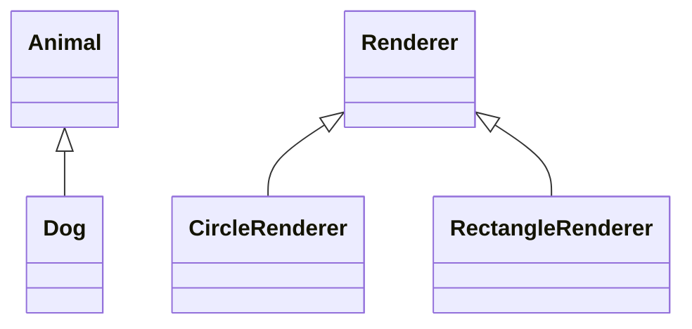
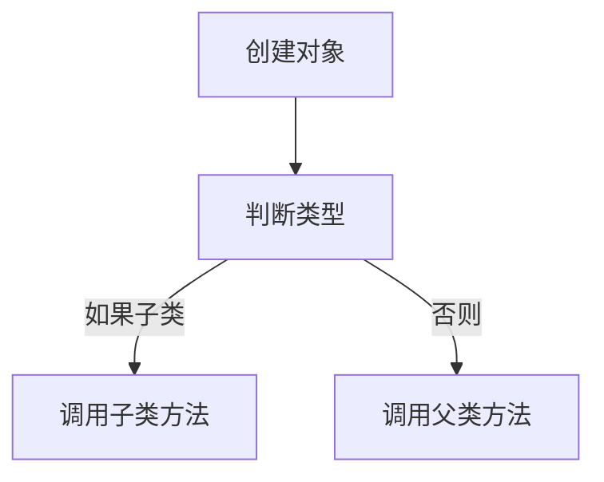

                 

### 引言

**文章标题：** 类型多态：提高代码复用性的方法

**关键词：** 类型多态，代码复用性，面向对象编程，OOP，编程范式

**摘要：** 本文将深入探讨类型多态的概念及其在提高代码复用性方面的作用。我们将首先介绍类型多态的基本概念，然后详细分析其在面向对象编程中的应用，探讨不同类型的多态以及如何在实际编程中有效利用多态特性，最终总结出最佳实践和策略。

### 背景介绍

在软件开发中，代码复用性是一个至关重要的目标。复用代码不仅可以减少重复编写的工作量，还可以提高代码的可靠性和可维护性。然而，传统的代码复用方法往往存在一些限制，例如通过函数或类的复用。随着面向对象编程（Object-Oriented Programming, OOP）的兴起，多态（Polymorphism）成为了一种更加灵活和强大的代码复用技术。

**多态的概念：** 多态指的是在不同的上下文中使用相同的接口或名称，但实际行为可以不同。在面向对象编程中，多态通过继承、接口和重载等机制实现，使得程序员可以在不同的对象之间进行统一处理，而无需关心对象的实际类型。

**问题背景：** 在实际软件开发中，我们经常会遇到需要处理不同类型对象的情形。例如，在图形用户界面（GUI）编程中，按钮、文本框和复选框等控件需要以统一的方式处理点击事件。通过多态，我们可以定义一个通用的处理方法，而无需关心具体的控件类型。

**问题描述：** 如何在实际编程中利用多态提高代码的复用性和可维护性？多态有哪些类型？每种类型如何实现？在实际项目中如何应用多态？

**问题解决：** 本文将分步骤介绍多态的基本概念、类型和实现方法，并通过实际案例说明如何在实际项目中应用多态，从而提高代码的复用性。

**边界与外延：** 本文主要关注多态在面向对象编程中的应用，特别是Java和C++等编程语言中的多态实现。同时，本文也将探讨多态与设计模式、类型系统等其他编程概念的关系。

### 概念结构与核心要素组成

为了更好地理解多态及其在代码复用中的应用，我们需要明确以下几个核心概念：

1. **对象（Object）**：对象是面向对象编程的基本构建块，它封装了数据和行为。对象通过实例化类（Class）创建。
2. **类（Class）**：类是一种数据类型，定义了对象的属性和行为。类通过继承（Inheritance）扩展和复用。
3. **继承（Inheritance）**：继承是一种让一个类继承另一个类的属性和方法的机制。子类可以扩展父类，同时保留其原有的行为。
4. **接口（Interface）**：接口是一种抽象类型，定义了一组方法，但没有任何实现。接口用于定义契约，确保不同类的对象可以以统一的方式交互。
5. **重载（Overloading）**：重载是同一类中多个同名方法共存，但参数列表不同的机制。重载通过方法签名区分不同方法。
6. **重写（Overriding）**：重写是子类覆盖父类方法的一种机制，允许子类以不同的方式实现相同的方法。

### 核心概念原理

多态的核心原理在于通过接口和继承，实现对不同对象的统一处理。具体来说，多态包括以下几种类型：

1. **参数化多态（Parametric Polymorphism）**：通过泛型（Generics）或模板（Templates）实现，允许函数或类接受任意类型参数，从而在编译时类型安全地扩展代码。
2. **子类型多态（Subtype Polymorphism）**：通过继承实现，子类可以替换父类，从而实现对不同类型对象的统一处理。
3. **接口多态（Interface Polymorphism）**：通过接口实现，不同类型的对象可以实现相同的接口，从而在运行时通过接口类型进行统一处理。

#### 参数化多态

参数化多态是一种强大的多态形式，允许在函数或类中定义泛型类型参数。这样，同一个函数或类可以接受不同类型的参数，而无需重复编写代码。

**示例：** 在Java中，使用泛型定义一个比较器接口：

```java
public interface Comparator<T> {
    int compare(T o1, T o2);
}
```

我们可以定义一个通用的排序函数，使用这个接口：

```java
public static <T> void sort(Comparator<T> comparator, T[] array) {
    Arrays.sort(array, comparator);
}
```

这个排序函数可以接受任意类型的数组，并使用传递的`Comparator`进行排序。

#### 子类型多态

子类型多态通过继承实现，允许子类替换父类，以实现通用处理逻辑。这是面向对象编程中最常用的多态形式。

**示例：** 在Java中，定义一个`Animal`类和一个`Dog`类：

```java
public class Animal {
    public void makeSound() {
        System.out.println("Animal makes a sound");
    }
}

public class Dog extends Animal {
    @Override
    public void makeSound() {
        System.out.println("Dog barks");
    }
}
```

我们可以定义一个方法，接受`Animal`类型的参数，并在方法中使用多态：

```java
public void playSound(Animal animal) {
    animal.makeSound();
}
```

当我们调用`playSound(new Dog())`时，方法会调用`Dog`类的`makeSound()`方法，而不是`Animal`类的`makeSound()`方法。

#### 接口多态

接口多态允许不同类型的对象实现相同的接口，从而在运行时通过接口类型进行统一处理。

**示例：** 在Java中，定义一个`Renderer`接口和两个实现类：

```java
public interface Renderer {
    void draw();
}

public class CircleRenderer implements Renderer {
    @Override
    public void draw() {
        System.out.println("Drawing a circle");
    }
}

public class RectangleRenderer implements Renderer {
    @Override
    public void draw() {
        System.out.println("Drawing a rectangle");
    }
}
```

我们可以定义一个方法，接受`Renderer`类型的参数：

```java
public void render(Renderer renderer) {
    renderer.draw();
}
```

当我们调用`render(new CircleRenderer())`或`render(new RectangleRenderer())`时，方法会根据传递的对象类型调用相应的`draw()`方法。

### 概念属性特征对比表格

| 特征 | 参数化多态 | 子类型多态 | 接口多态 |
| --- | --- | --- | --- |
| 实现方式 | 泛型/模板 | 继承 | 接口 |
| 类型检查 | 编译时 | 编译时 | 运行时 |
| 通用性 | 可以处理任意类型 | 限于类层次结构 | 任意实现类 |
| 使用场景 | 泛型算法和库 | 继承和扩展 | 遵循契约 |

### ER实体关系图架构

为了更好地理解多态在面向对象编程中的应用，我们可以使用Mermaid绘制ER实体关系图，展示类和接口之间的关系。



在这个ER图中，`Animal`类是`Dog`类的父类，`Renderer`接口有两个实现类`CircleRenderer`和`RectangleRenderer`。

### 算法原理讲解

多态在面向对象编程中具有重要的实现机制。为了更好地理解多态的工作原理，我们可以使用Mermaid绘制算法流程图，并通过Python代码详细阐述。

#### 多态实现算法流程图



这个流程图展示了多态实现的基本步骤：首先创建对象，然后根据对象的类型判断是否调用子类方法或父类方法。

#### Python代码示例

```python
class Animal:
    def make_sound(self):
        print("Animal makes a sound")

class Dog(Animal):
    def make_sound(self):
        print("Dog barks")

def play_sound(animal: Animal):
    animal.make_sound()

dog = Dog()
play_sound(dog)  # 输出：Dog barks
```

在这个示例中，我们定义了一个`Animal`类和一个`Dog`类，`Dog`类继承自`Animal`类。`play_sound`函数接受一个`Animal`类型的参数，并在内部调用`make_sound()`方法。由于`Dog`类重写了`make_sound()`方法，所以调用`play_sound(dog)`时会输出"Dog barks"。

#### 数学公式

多态的实现涉及到类型检查和动态绑定。我们可以使用以下数学公式来表示：

$$
result = method\_signature \times object\_type
$$

其中，`method_signature`表示方法签名，`object_type`表示对象类型。动态绑定通过在运行时检查对象类型并调用相应的方法实现。

$$
result = \left\{
\begin{array}{ll}
method\_signature_{子类} & \text{如果} \ object\_type \text{是子类} \\
method\_signature_{父类} & \text{否则}
\end{array}
\right.
$$

这个公式表示，在多态情况下，结果取决于对象类型。如果对象类型是子类，则调用子类方法；否则，调用父类方法。

### 系统分析与架构设计方案

在实际项目中，多态的应用可以提高代码的可维护性和复用性。以下是一个基于多态的系统分析与架构设计方案。

#### 项目介绍

假设我们要开发一个图形用户界面（GUI）应用程序，其中包含多个控件（如按钮、文本框和复选框）。我们需要实现一个通用的处理机制，以响应用户的操作。

#### 系统功能设计

1. **用户界面**：展示应用程序的界面，包含各种控件。
2. **事件处理**：响应用户的操作，如按钮点击、文本框输入和复选框选择。
3. **控件管理**：管理应用程序中的控件，包括创建、销毁和更新控件。

#### 系统架构设计

1. **控件接口**：定义一个控件接口，确保所有控件都可以实现统一的操作。
2. **控件实现**：实现多个具体的控件类，如按钮、文本框和复选框，并实现控件接口。
3. **事件处理**：定义一个事件处理类，负责处理用户操作。

#### 系统接口设计和系统交互

我们可以使用Mermaid绘制类图和序列图，展示系统中的类和接口以及它们之间的交互。

#### 类图

```mermaid
classDiagram
    Control <<interface>>
    Button <<Control>>
    TextBox <<Control>>
    CheckBox <<Control>>
    EventProcessor <<class>>
```

这个类图展示了系统中的类和接口。`Control`是一个接口，定义了所有控件必须实现的方法。`Button`、`TextBox`和`CheckBox`是具体的控件类，实现了`Control`接口。`EventProcessor`是一个事件处理类，负责处理用户操作。

#### 序列图

```mermaid
sequence
    User ->|点击| EventProcessor: 触发操作
    EventProcessor ->|处理| Control: 调用控件的方法
    Control ->|显示结果| User: 显示操作结果
```

这个序列图展示了用户操作引发的事件处理过程。用户点击控件，`EventProcessor`类处理操作，并调用相应的控件方法，最后显示操作结果。

### 项目实战

在实际开发中，我们可以使用Python的Tkinter库实现上述GUI应用程序。以下是一个简单的示例：

```python
import tkinter as tk

class Control:
    def handle_click(self):
        pass

class Button(Control):
    def handle_click(self):
        print("Button clicked")

class TextBox(Control):
    def handle_click(self):
        print("TextBox clicked")

class CheckBox(Control):
    def handle_click(self):
        print("CheckBox clicked")

class EventProcessor:
    def __init__(self):
        self.controls = []

    def add_control(self, control: Control):
        self.controls.append(control)

    def handle_click(self, event):
        for control in self.controls:
            control.handle_click()

if __name__ == "__main__":
    root = tk.Tk()
    root.title("GUI Application")

    button = Button()
    text_box = TextBox()
    check_box = CheckBox()

    event_processor = EventProcessor()
    event_processor.add_control(button)
    event_processor.add_control(text_box)
    event_processor.add_control(check_box)

    button.bind("<Button-1>", lambda event: event_processor.handle_click(event))
    text_box.bind("<Button-1>", lambda event: event_processor.handle_click(event))
    check_box.bind("<Button-1>", lambda event: event_processor.handle_click(event))

    root.mainloop()
```

在这个示例中，我们定义了`Control`、`Button`、`TextBox`和`CheckBox`类，以及`EventProcessor`类。`EventProcessor`类负责处理用户操作，并调用相应的控件方法。在实际项目中，我们可以根据需要添加更多控件和事件处理逻辑。

### 最佳实践

在实际编程中，为了有效利用多态提高代码复用性，我们可以遵循以下最佳实践：

1. **避免过度多态**：虽然多态可以提高代码的灵活性和可维护性，但过度使用多态可能会导致代码复杂度增加。我们应该只在必要时使用多态，避免过度设计。
2. **遵循单一职责原则**：每个类应该只负责一项功能，避免在一个类中实现过多功能。这样可以更好地利用多态，提高代码的模块化程度。
3. **合理使用继承**：继承是实现多态的重要手段，但应该避免类层次结构过度复杂。使用继承时要确保子类确实扩展了父类的功能，而不是仅仅为了实现多态。
4. **遵循开闭原则**：软件实体应该对扩展开放，对修改封闭。这意味着我们应该优先使用多态，而不是直接修改现有代码。这样可以更好地利用多态，提高代码的可维护性。

### 小结

本文详细介绍了类型多态的概念及其在提高代码复用性方面的作用。通过分析多态的基本概念、类型和实现方法，我们了解了如何在面向对象编程中有效利用多态。在实际项目中，多态可以提高代码的可维护性和灵活性，是实现代码复用性的重要手段。

### 注意事项

1. 多态虽然可以提高代码的复用性，但过度使用可能会导致代码复杂度增加。在设计和实现多态时，要确保遵循单一职责原则和开闭原则。
2. 多态的实现涉及到类型检查和动态绑定。在编译时，编译器会根据对象的实际类型进行类型检查；在运行时，会根据对象的实际类型调用相应的方法。

### 拓展阅读

1. 《设计模式：可复用的面向对象软件的基础》（Design Patterns: Elements of Reusable Object-Oriented Software） - Erich Gamma，Richard Helm，John Vlissides和Bruce McConnell
2. 《Effective Java》 - Joshua Bloch
3. 《Java编程思想》（Thinking in Java） - Bruce Eckel

### 作者信息

作者：AI天才研究院/AI Genius Institute & 禅与计算机程序设计艺术 /Zen And The Art of Computer Programming

