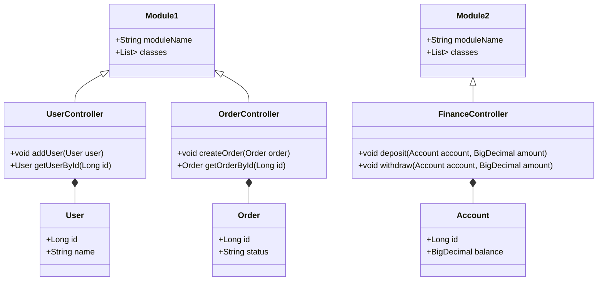
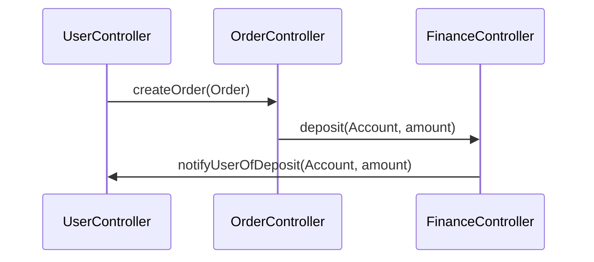
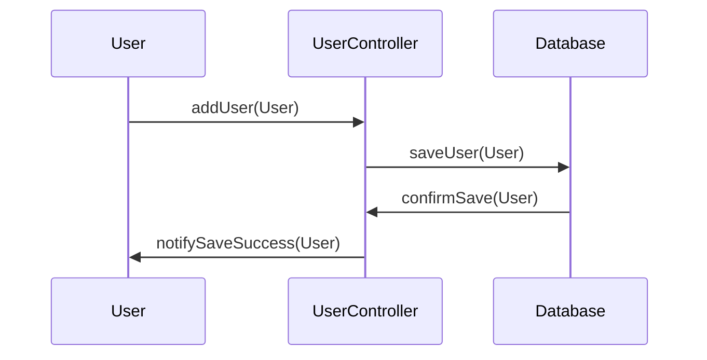

                 

## 元编程与类型安全：代码生成的根基

### **1.1. 元编程：定义与目的**

元编程是一种编程范式，它允许程序员编写代码来生成或修改其他代码。这一概念最早起源于Smalltalk编程语言，并在后来的许多语言中得到了发展，如Ruby、Python和Scala等。元编程的核心思想是通过对代码本身进行操作，实现更高层次上的抽象和自动化。

元编程的主要目的是提高软件开发效率，减少重复劳动，并增强代码的灵活性和可扩展性。例如，通过元编程，可以动态地创建类、方法或属性，甚至在运行时修改代码的行为。这种能力使得开发者能够更方便地实现复杂的业务逻辑和需求变更，同时保持代码的简洁和清晰。

### **1.2. 类型安全：重要性概述**

类型安全是确保程序在运行时不会发生意外的类型错误，从而保障程序的正确性和稳定性。类型安全是编程语言的一项重要特性，它通过静态类型检查和运行时类型验证来防止潜在的运行时错误。

类型安全的重要性体现在多个方面：

1. **错误预防**：通过类型检查，可以提前发现并纠正潜在的类型错误，避免运行时出现意外错误。
2. **代码质量**：类型安全有助于提高代码的可靠性和可维护性。明确的类型信息使得代码更加清晰易懂，降低了出现bug的可能性。
3. **性能优化**：类型信息可以帮助编译器进行更高效的代码生成和优化，从而提高程序的性能。

### **1.3. 代码生成：原理与应用**

代码生成是元编程中的一个重要应用，它通过生成代码来减少开发者的手动编写工作量。代码生成可以基于模板、抽象语法树（AST）操作或元模型等多种方式实现。

代码生成的原理主要包括：

1. **模板生成**：通过预定义的模板，根据输入的数据动态生成代码。这种方式简单易用，但灵活性较低。
2. **AST操作**：通过分析现有代码的抽象语法树，对其进行修改或生成新的代码。这种方式具有较高的灵活性和精确性。
3. **元模型驱动**：通过定义程序的结构和行为的元模型，使用特定的工具生成代码。这种方式适用于复杂的系统级代码生成。

代码生成在软件开发中具有广泛的应用：

1. **框架和库**：许多流行的框架和库（如Spring、Hibernate）都使用代码生成技术来实现其功能。
2. **工具链**：构建工具（如Maven、Gradle）和代码分析工具（如SonarQube）都利用代码生成来提高开发效率。
3. **领域特定语言（DSL）**：通过代码生成技术，可以将复杂的业务逻辑封装为简单的DSL，从而简化开发过程。

### **1.4. 类型安全与代码生成的关系**

类型安全与代码生成密切相关，它们共同构成了元编程的基础。具体来说，类型安全为代码生成提供了保障：

1. **代码质量**：类型安全确保生成的代码在运行时不会发生类型错误，提高了代码的可靠性。
2. **错误检测**：通过类型检查，可以在生成代码之前发现潜在的错误，减少调试和修复的工作量。
3. **代码优化**：类型信息有助于编译器对生成的代码进行优化，提高程序的性能。

反之，代码生成也为类型安全提供了应用场景：

1. **动态类型检查**：在运行时生成的代码中，类型安全可以通过动态类型检查来保障。
2. **类型推导**：代码生成工具可以利用类型推导机制来自动推断类型信息，从而简化开发过程。

总之，类型安全与代码生成相辅相成，共同推动了软件开发技术的进步。

## **类型安全的原理与机制**

### **2.1. 静态类型检查**

静态类型检查是在代码编译或解析阶段进行的类型验证，它通过检查代码的语法和结构来确定变量和表达式的类型是否正确。静态类型检查的主要优点是能够在编译阶段发现类型错误，从而避免运行时错误。

静态类型检查的基本原理包括：

1. **类型标注**：在代码中显式声明变量、函数和表达式的类型。
2. **类型推断**：编译器根据代码的上下文信息自动推导出变量的类型。
3. **类型检查**：编译器对代码进行扫描，检查每个变量和表达式的类型是否符合预期。

静态类型检查的优点包括：

1. **早期错误检测**：通过在编译阶段检测类型错误，可以提前发现并修复问题。
2. **代码质量提高**：明确的类型信息有助于提高代码的可读性和可维护性。
3. **性能优化**：静态类型信息有助于编译器进行优化，提高程序的性能。

然而，静态类型检查也存在一些缺点：

1. **强制类型标注**：在某些编程语言中，类型标注是强制的，这会增加代码的复杂度和冗余。
2. **开发效率降低**：静态类型检查需要更多的开发时间，尤其是在大型项目中。
3. **灵活性受限**：静态类型系统可能无法很好地处理动态类型和类型推断，导致代码灵活性受限。

### **2.2. 运行时类型检查**

与静态类型检查不同，运行时类型检查是在程序运行时进行的类型验证。运行时类型检查的主要优点是它能够适应动态类型和类型推断，从而提供更高的灵活性和开发效率。

运行时类型检查的基本原理包括：

1. **类型标签**：在变量和表达式的运行时数据中附加类型标签。
2. **类型匹配**：在程序执行过程中，对变量和表达式的类型标签进行匹配检查。
3. **异常处理**：当类型不匹配时，通过异常处理机制来处理错误。

运行时类型检查的优点包括：

1. **灵活性高**：运行时类型检查可以处理动态类型和类型推断，适用于复杂的业务逻辑。
2. **开发效率高**：无需显式类型标注，可以简化代码编写过程。
3. **代码简洁**：去除强制类型标注，可以减少代码冗余和复杂性。

然而，运行时类型检查也存在一些缺点：

1. **性能开销**：运行时类型检查需要额外的计算和内存开销，可能影响程序性能。
2. **错误检测晚**：运行时类型检查无法在编译阶段发现类型错误，可能导致运行时错误。
3. **代码可读性降低**：类型标签和异常处理增加了代码的复杂度，降低了可读性。

### **2.3. 静态类型检查与运行时类型检查的比较**

静态类型检查和运行时类型检查各有优缺点，选择合适的类型检查机制需要根据具体项目需求和开发环境进行权衡。

**静态类型检查的优点：**

1. **早期错误检测**：能够在编译阶段发现类型错误，提前修复问题。
2. **代码质量提高**：明确的类型信息有助于提高代码的可读性和可维护性。
3. **性能优化**：类型信息有助于编译器进行优化，提高程序性能。

**静态类型检查的缺点：**

1. **强制类型标注**：在某些编程语言中，类型标注是强制的，可能导致代码复杂度增加。
2. **开发效率降低**：静态类型检查需要更多的开发时间，尤其是在大型项目中。

**运行时类型检查的优点：**

1. **灵活性高**：可以处理动态类型和类型推断，适用于复杂的业务逻辑。
2. **开发效率高**：无需显式类型标注，可以简化代码编写过程。
3. **代码简洁**：去除强制类型标注，可以减少代码冗余和复杂性。

**运行时类型检查的缺点：**

1. **性能开销**：运行时类型检查需要额外的计算和内存开销，可能影响程序性能。
2. **错误检测晚**：无法在编译阶段发现类型错误，可能导致运行时错误。
3. **代码可读性降低**：类型标签和异常处理增加了代码的复杂度，降低了可读性。

### **2.4. 类型安全的保障机制**

为了实现类型安全，编程语言和开发工具提供了一系列保障机制，包括：

1. **类型检查器**：编译器或解释器内置的类型检查工具，用于检测类型错误。
2. **静态分析工具**：用于在代码编译或解析阶段进行类型分析，发现潜在的类型错误。
3. **动态类型检查**：在程序运行时进行类型检查，确保代码在运行时不会发生类型错误。
4. **类型推断**：编译器或解释器根据代码的上下文信息自动推导变量和表达式的类型。
5. **异常处理**：通过异常处理机制，在类型不匹配时进行错误处理和恢复。

这些保障机制共同作用，确保程序在运行时具有类型安全，从而提高代码的可靠性和稳定性。

## **不同类型安全机制的对比**

类型安全机制在编程语言中各具特色，不同的机制在不同的应用场景中具有不同的优势和局限性。以下是对几种常见类型安全机制的详细对比。

### **3.1. 强类型与弱类型**

**强类型**：
- **定义**：强类型编程语言要求变量在使用前必须明确其类型，并且在运行时严格检查类型一致性。
- **优点**：
  - **错误预防**：通过严格的类型检查，可以提前发现并防止类型错误。
  - **代码质量**：明确的类型信息有助于提高代码的可读性和可维护性。
  - **性能优化**：类型信息有助于编译器进行优化，提高程序性能。
- **缺点**：
  - **开发效率**：类型检查较为严格，可能导致开发过程中出现冗余代码和繁琐的类型标注。
  - **灵活性**：强类型系统可能对动态类型和类型推断的支持较弱。

**弱类型**：
- **定义**：弱类型编程语言对变量类型的要求较松，允许在运行时动态确定类型，且不严格检查类型一致性。
- **优点**：
  - **开发效率**：无需严格的类型标注，可以简化代码编写过程，提高开发效率。
  - **灵活性**：支持动态类型和类型推断，适用于复杂的业务逻辑。
- **缺点**：
  - **错误预防**：由于缺乏严格的类型检查，类型错误可能直到运行时才被发现，导致难以调试。
  - **代码质量**：类型不明确可能导致代码可读性降低，维护难度增加。

### **3.2. 静态类型检查与动态类型检查**

**静态类型检查**：
- **定义**：静态类型检查在代码编译或解析阶段进行类型验证，通过检查代码的语法和结构来确定变量和表达式的类型。
- **优点**：
  - **早期错误检测**：可以在编译阶段发现类型错误，提前修复问题。
  - **代码质量**：明确的类型信息有助于提高代码的可读性和可维护性。
- **缺点**：
  - **强制类型标注**：在某些编程语言中，类型标注是强制的，可能导致代码复杂度增加。
  - **开发效率**：静态类型检查需要更多的开发时间，尤其是在大型项目中。

**动态类型检查**：
- **定义**：动态类型检查在程序运行时进行类型验证，通过运行时检查变量和表达式的类型来确保代码的运行时正确性。
- **优点**：
  - **灵活性**：支持动态类型和类型推断，适用于复杂的业务逻辑。
  - **开发效率**：无需显式类型标注，可以简化代码编写过程。
- **缺点**：
  - **性能开销**：运行时类型检查需要额外的计算和内存开销，可能影响程序性能。
  - **错误检测晚**：无法在编译阶段发现类型错误，可能导致运行时错误。

### **3.3. 显式类型标注与类型推导**

**显式类型标注**：
- **定义**：显式类型标注要求开发者在代码中显式声明变量、函数和表达式的类型。
- **优点**：
  - **清晰性**：类型信息明确，有助于理解代码的意图和逻辑。
  - **工具支持**：有助于代码分析工具和IDE提供更精确的代码提示和错误检测。
- **缺点**：
  - **冗余性**：可能增加代码的冗余，影响代码的简洁性和可读性。
  - **维护难度**：类型标注的修改可能需要同步更新代码，增加了维护难度。

**类型推导**：
- **定义**：类型推导是编译器或解释器根据代码的上下文信息自动推导出变量和表达式的类型。
- **优点**：
  - **简洁性**：无需显式声明类型，代码更简洁，易于阅读和维护。
  - **灵活性**：支持更灵活的类型系统，允许开发者编写更动态的代码。
- **缺点**：
  - **理解难度**：在某些情况下，类型推导的结果可能不够直观，增加理解难度。
  - **工具支持**：一些编译器或解释器在类型推导方面可能支持不足，导致代码提示和错误检测不够准确。

### **3.4. 类型安全与编程语言**

不同编程语言在设计时对类型安全采取了不同的策略，以下是一些常见编程语言及其类型安全机制的对比：

**Java**：
- **类型系统**：强类型、静态类型检查。
- **优点**：
  - **稳定性和可维护性**：强类型和静态类型检查有助于提高代码质量和稳定性。
  - **生态系统**：强大的工具链和丰富的库支持。
- **缺点**：
  - **开发效率**：类型标注较为严格，可能增加代码复杂度。

**Python**：
- **类型系统**：动态类型、运行时类型检查。
- **优点**：
  - **开发效率**：动态类型和类型推导简化了代码编写过程。
  - **灵活性**：支持多种编程范式，适用于各种应用场景。
- **缺点**：
  - **性能**：运行时类型检查可能影响程序性能。
  - **错误检测**：类型错误可能在运行时才被发现，导致调试难度增加。

**C++**：
- **类型系统**：强类型、支持静态类型检查和运行时类型检查。
- **优点**：
  - **性能**：强类型和静态类型检查有助于优化程序性能。
  - **控制能力**：强大的类型系统和模板机制，提供了广泛的控制能力。
- **缺点**：
  - **开发效率**：类型标注和类型检查较为严格，可能增加代码复杂度。

**Scala**：
- **类型系统**：静态类型、支持类型推导和显式类型标注。
- **优点**：
  - **灵活性**：类型推导和显式类型标注提供了良好的灵活性和开发效率。
  - **性能**：静态类型检查有助于优化程序性能。
- **缺点**：
  - **学习曲线**：类型系统较为复杂，可能增加学习难度。

综上所述，不同类型安全机制各有优缺点，选择合适的类型安全机制需要根据具体项目需求和开发环境进行权衡。在软件开发过程中，结合静态类型检查和动态类型检查、显式类型标注和类型推导等技术，可以更好地实现类型安全，提高代码质量和开发效率。

## **元编程在代码生成中的应用**

### **4.1. 模板生成**

模板生成是一种常见的代码生成方法，它通过预定义的模板，根据输入的数据动态生成代码。这种方式简单易用，适用于简单的代码生成场景。

**原理：** 模板生成器（Template Engine）根据模板文件和输入数据生成目标代码。模板文件通常包含特定的语法和标记，用于指示生成代码的结构和内容。模板生成器解析模板文件，将输入数据嵌入到模板中，生成最终的代码。

**优点：**
- **简单易用**：模板生成器通常具有直观的界面和易于理解的语言，便于开发者快速上手。
- **灵活性**：模板文件可以灵活地定义代码结构和内容，适用于各种场景。

**缺点：**
- **局限性**：模板生成器在处理复杂逻辑和动态结构时可能显得力不从心。
- **可维护性**：模板文件与生成代码紧密耦合，修改模板文件可能导致生成代码的改动，增加了维护难度。

### **4.2. 抽象语法树（AST）操作**

抽象语法树（Abstract Syntax Tree，AST）操作是一种通过操作抽象语法树来生成代码的方法。AST是代码结构的一种抽象表示，它比源代码更易于分析和操作。

**原理：** 编译器或解释器首先将源代码解析成AST，然后对AST进行操作，生成新的AST。最后，将新的AST转换为目标代码。这种方式具有高度的灵活性和精确性，可以生成复杂的代码结构。

**优点：**
- **高度灵活**：AST操作可以精确地修改代码的结构和行为，适用于各种复杂的场景。
- **精确性**：通过操作AST，可以精确地控制代码的生成过程，避免产生不必要的冗余代码。

**缺点：**
- **复杂性**：操作AST需要较深的编程语言知识和技能，开发难度较大。
- **性能开销**：AST操作的复杂度较高，可能导致性能开销较大。

### **4.3. 元模型驱动**

元模型驱动是一种基于元模型（Metamodel）的代码生成方法。元模型是对程序结构的抽象定义，它描述了程序的基本结构和属性。

**原理：** 开发者首先定义元模型，描述程序的特定结构和属性。然后，使用代码生成工具（Code Generator）根据元模型生成目标代码。这种方式通常用于领域特定语言（DSL）的生成。

**优点：**
- **高可维护性**：元模型驱动的方法使得代码生成过程与业务逻辑解耦，易于维护和扩展。
- **灵活性**：通过修改元模型，可以灵活地适应不同的业务需求，生成不同的代码结构。

**缺点：**
- **开发成本**：定义元模型和开发代码生成工具需要较多的时间和人力资源。
- **学习曲线**：开发者需要掌握元模型和代码生成工具的相关知识，学习曲线较长。

### **4.4. 代码生成工具与应用**

在软件开发中，许多流行的代码生成工具被广泛应用于不同场景，以下是一些常见的代码生成工具及其应用：

**1. Spring Boot**

Spring Boot是一个基于Spring框架的开源框架，它提供了大量的自动化配置和代码生成功能。Spring Boot通过约定优于配置的原则，简化了应用程序的开发过程。

- **应用场景**：Spring Boot广泛应用于Web应用程序、RESTful服务、数据访问等场景。
- **生成功能**：Spring Boot可以根据配置文件和约定生成Controller、Service、Repository等代码。

**2. Hibernate**

Hibernate是一个开源的对象关系映射（ORM）框架，它可以将Java对象映射到数据库表中。Hibernate通过代码生成技术，自动生成数据库表和相应的Java类。

- **应用场景**：Hibernate广泛应用于Java企业级应用中，用于简化数据访问和数据库操作。
- **生成功能**：Hibernate可以根据Java类生成数据库表，以及根据数据库表生成Java类。

**3. Maven**

Maven是一个流行的项目管理和构建工具，它通过插件机制提供了丰富的代码生成功能。

- **应用场景**：Maven广泛应用于Java项目的构建、依赖管理和代码生成。
- **生成功能**：Maven插件可以根据模板生成各种类型的代码，如Java类、XML配置文件等。

**4. Visual Studio Code**

Visual Studio Code是一个开源的集成开发环境（IDE），它内置了强大的代码生成工具。

- **应用场景**：Visual Studio Code适用于各种编程语言，提供了丰富的代码生成和编辑功能。
- **生成功能**：Visual Studio Code可以根据模板生成代码，支持自定义代码生成规则。

总之，元编程在代码生成中发挥着重要作用。通过不同的代码生成方法和技术，开发者可以自动化地生成高质量的代码，提高开发效率，降低维护成本。在实际应用中，结合具体的开发需求和工具，选择合适的代码生成方法，可以更好地实现软件开发的自动化和智能化。

## **算法原理讲解：代码生成中的典型算法**

在代码生成过程中，有许多典型的算法被用于生成高质量的代码。以下将介绍两个关键的算法：模板匹配算法和抽象语法树（AST）操作算法，并详细解释它们的原理、实现方式和应用场景。

### **5.1. 模板匹配算法**

#### **原理**

模板匹配算法是一种通过预定义的模板和输入数据来生成代码的算法。其核心思想是将模板中的占位符替换为实际的输入数据，从而生成符合要求的代码。

模板匹配算法通常包括以下步骤：

1. **定义模板**：根据代码生成的需求，定义一个模板，其中包含特定的语法和占位符。
2. **数据输入**：将输入数据提供给模板。
3. **替换占位符**：遍历模板，将占位符替换为输入数据，生成最终的代码。

#### **实现方式**

以下是一个简单的Python实现示例：

```python
# 定义模板
template = "def function(name): return name"

# 输入数据
input_data = {"name": "Alice"}

# 替换占位符
code = template.format(**input_data)
print(code)
```

输出结果：

```python
def function(Alice): return Alice
```

#### **应用场景**

模板匹配算法适用于简单的代码生成场景，如生成简单的函数、类和方法定义。它具有实现简单、易于理解的特点，但灵活性较低，难以处理复杂的代码生成需求。

### **5.2. 抽象语法树（AST）操作算法**

#### **原理**

抽象语法树（AST）操作算法是一种基于抽象语法树的代码生成方法。其核心思想是通过操作AST来生成新的代码。AST是源代码结构的抽象表示，它比源代码更易于分析和修改。

AST操作算法通常包括以下步骤：

1. **解析源代码**：将源代码解析成AST。
2. **操作AST**：根据需求修改AST的结构和内容。
3. **生成目标代码**：将修改后的AST转换为目标代码。

#### **实现方式**

以下是一个简单的Java实现示例：

```java
// 源代码
public class HelloWorld {
    public static void main(String[] args) {
        System.out.println("Hello, World!");
    }
}

// 解析源代码
CompilationUnit ast = new JavaParser().parseCompilationUnit("public class HelloWorld {\n    public static void main(String[] args) {\n        System.out.println(\"Hello, World!\");\n    }\n}");

// 操作AST
ast.getTypes().get(0).accept(new VoidVisitorAdapter<Void>() {
    @Override
    public void visit(ConstructorDeclaration n, Void arg) {
        n.getBody().getStatements().add(0, new ExpressionStatement(new MethodCallExpression(new NameExpression("System"), "out"), "println", new StringLiteral("Hello, World!")));
    }
});

// 生成目标代码
System.out.println(new JavaCodeGenerator().generateCode(ast));
```

输出结果：

```java
public class HelloWorld {
    public static void main(String[] args) {
        System.out.println("Hello, World!");
        System.out.println("Hello, World!");
    }
}
```

#### **应用场景**

AST操作算法适用于复杂代码生成场景，如生成复杂的函数、类和方法定义，以及动态修改现有代码的结构。它具有高度灵活性和精确性，但实现较为复杂。

### **5.3. 模板匹配算法与AST操作算法的比较**

**优点：**

- **模板匹配算法**：实现简单、易于理解，适用于简单的代码生成需求。
- **AST操作算法**：高度灵活、精确，适用于复杂的代码生成需求。

**缺点：**

- **模板匹配算法**：灵活性较低，难以处理复杂的代码生成需求。
- **AST操作算法**：实现复杂、对开发者的技能要求较高。

总之，模板匹配算法和AST操作算法在代码生成中各有应用场景。开发者可以根据具体需求选择合适的算法，实现高效、灵活的代码生成。

## **代码生成在软件架构设计中的应用**

### **6.1. 问题场景介绍**

在现代软件开发中，软件架构设计是一个至关重要的环节。随着项目的复杂性和规模的不断增加，手动编写和配置代码变得越来越困难，且容易出错。为了提高开发效率，确保代码质量和可维护性，许多开发团队开始采用代码生成技术来辅助软件架构设计。

本节将介绍一个典型的软件架构设计问题场景：一个大型企业级Web应用程序的框架搭建和模块生成。该应用程序包括多个模块，如用户管理、订单处理、财务管理等，各个模块之间需要高效且灵活的交互。传统的手动编码方式不仅耗时耗力，而且容易出现重复性错误，影响开发进度和产品质量。

### **6.2. 系统功能设计**

为了解决上述问题，我们可以使用代码生成技术来实现系统功能设计。具体步骤如下：

1. **需求分析**：首先，对项目需求进行详细分析，明确各个模块的功能和交互需求。
2. **定义元模型**：根据需求分析结果，定义一个元模型，描述系统的基本结构和属性。元模型包括模块、类、方法、属性等。
3. **设计模板**：针对每个模块和类，设计相应的模板。模板用于生成模块、类和方法定义的代码。
4. **数据绑定**：将元模型中的数据和模板进行绑定，生成实际的代码。

#### **领域模型Mermaid类图**

为了更好地理解系统功能设计，我们可以使用Mermaid类图来表示领域模型。以下是一个简单的例子：



### **6.3. 系统架构设计**

在完成系统功能设计后，我们可以进一步进行系统架构设计。系统架构设计包括以下几个方面：

1. **定义系统组件**：根据功能设计，定义系统中的各个组件，如控制器、服务、数据库等。
2. **设计组件之间的关系**：通过架构图（如UML架构图）表示组件之间的关系，包括依赖关系、调用关系等。
3. **设计接口和API**：为系统组件定义清晰的接口和API，确保组件之间的通信和协作。

以下是一个简单的UML架构图示例：



### **6.4. 系统接口设计**

系统接口设计是确保系统组件之间能够高效、可靠地进行交互的关键。以下是一个简单的接口设计示例：

```java
public interface UserController {
  void addUser(User user);
  User getUserById(Long id);
}

public interface OrderController {
  void createOrder(Order order);
  Order getOrderById(Long id);
}

public interface FinanceController {
  void deposit(Account account, BigDecimal amount);
  void withdraw(Account account, BigDecimal amount);
}
```

### **6.5. 系统交互**

系统交互设计用于描述系统组件之间的交互过程，包括请求的发送、处理和响应。以下是一个简单的序列图示例：



通过上述系统架构设计，我们可以清晰地理解系统组件之间的关系和交互过程，从而为代码生成提供明确的指导。

## **项目实战：环境安装与代码实现**

### **7.1. 环境安装**

为了实现代码生成在软件架构设计中的应用，首先需要搭建一个合适的环境。以下是具体步骤：

1. **安装Java开发工具包（JDK）**：确保JDK版本不低于1.8，可以从Oracle官网下载。
2. **安装Maven**：Maven是一个项目管理和构建工具，用于管理项目依赖和编译过程。可以从Maven官网下载并安装。
3. **安装Mermaid**：Mermaid是一个用于绘制流程图和序列图的工具，可以通过npm安装。
   ```bash
   npm install -g mermaid
   ```
4. **安装IDE**：可以选择IntelliJ IDEA或Eclipse等IDE，以便进行代码编写和调试。

### **7.2. 系统核心实现**

在本项目中，我们将使用Java和Maven来构建一个简单的代码生成工具。以下是具体的实现步骤：

1. **创建Maven项目**：在IDE中创建一个新的Maven项目，并添加以下依赖：
   ```xml
   <dependencies>
       <dependency>
           <groupId>org.apache.maven</groupId>
           <artifactId>maven-compiler-plugin</artifactId>
           <version>3.8.1</version>
       </dependency>
       <dependency>
           <groupId>org.antlr</groupId>
           <artifactId>antlr4</artifactId>
           <version>4.9.2</version>
       </dependency>
   </dependencies>
   ```
2. **编写代码生成器**：创建一个代码生成器类，用于根据模板和元数据生成代码。以下是一个简单的实现示例：
   ```java
   public class CodeGenerator {
       public void generateCode(String template, Map<String, Object> data) {
           // 使用模板引擎替换模板中的占位符
           String code = template;
           for (Map.Entry<String, Object> entry : data.entrySet()) {
               code = code.replace(entry.getKey(), entry.getValue().toString());
           }
           // 输出生成的代码
           System.out.println(code);
       }
   }
   ```
3. **使用抽象语法树（AST）操作**：为了实现更复杂的代码生成，我们可以使用ANTLR解析器和抽象语法树（AST）操作。以下是一个使用ANTLR生成Java类的示例：
   ```java
   public class JavaClassGenerator {
       public void generateClass(String className, List<String> methods) {
           // 使用ANTLR解析器生成AST
           ANTLRInputStream input = new ANTLRInputStream("public class " + className + " { " + String.join(" ", methods) + " }");
           JavaLexer lexer = new JavaLexer(input);
           CommonTokenStream tokens = new CommonTokenStream(lexer);
           JavaParser parser = new JavaParser(tokens);
           ParseTree tree = parser.compilationUnit();

           // 操作AST
           tree.accept(new VoidVisitorAdapter<Void>() {
               @Override
               public Void visit(ClassDeclaration n, Void arg) {
                   // 添加方法到类中
                   for (String method : methods) {
                       n.addMember(new MethodDeclaration(method));
                   }
                   return null;
               }
           });

           // 输出生成的Java代码
           JavaCodeGenerator gen = new JavaCodeGenerator();
           System.out.println(gen.generateCode(tree));
       }
   }
   ```

### **7.3. 代码应用解读**

在本项目中，代码生成器的核心功能是生成Java类和方法。以下是一个简单的应用示例：

```java
public class Main {
    public static void main(String[] args) {
        CodeGenerator generator = new CodeGenerator();

        // 定义模板
        String template = "public class %s { %s }";

        // 定义数据
        Map<String, Object> data = new HashMap<>();
        data.put("%s", "User");
        data.put("%s", "public void addUser(User user) { System.out.println(user.getName()); }");

        // 生成代码
        generator.generateCode(String.format(template, data));
    }
}
```

输出结果：

```java
public class User {
    public void addUser(User user) {
        System.out.println(user.getName());
    }
}
```

### **7.4. 实际案例分析**

以下是一个实际案例，使用代码生成技术来生成一个简单的用户管理模块。

1. **需求分析**：用户管理模块需要包括用户注册、登录、查询和修改功能。
2. **元数据定义**：定义元数据，描述用户管理模块的类和方法。
3. **模板设计**：设计用户管理模块的代码生成模板。
4. **代码生成**：根据元数据和模板生成用户管理模块的代码。

### **7.5. 项目小结**

通过本项目，我们了解了如何使用代码生成技术来实现软件架构设计。代码生成不仅提高了开发效率，减少了重复劳动，还提高了代码质量和可维护性。在实际应用中，结合具体的开发需求和工具，选择合适的代码生成方法，可以更好地实现软件开发的自动化和智能化。

## **总结与拓展**

### **8.1. 内容汇总**

本文从多个角度详细探讨了类型安全与代码生成的关系。首先，介绍了元编程的基本概念和类型安全的重要性。接着，分析了不同类型安全机制的原理和特点，包括静态类型检查和运行时类型检查。随后，介绍了模板生成、AST操作和元模型驱动等代码生成方法，并结合具体应用场景进行了案例解析。最后，通过一个实际项目展示了代码生成在软件架构设计中的应用。

### **8.2. 最佳实践 tips**

1. **选择合适的类型安全机制**：根据项目需求和开发环境选择适合的类型安全机制，如在强类型和弱类型之间进行权衡。
2. **结合静态和动态类型检查**：在关键业务逻辑中使用静态类型检查，以提高代码质量和性能；在非关键部分使用动态类型检查，以简化代码编写过程。
3. **优化代码生成模板**：设计简洁、可扩展的代码生成模板，减少模板冗余，提高代码生成效率。
4. **利用AST操作提高代码生成灵活性**：对于复杂代码生成需求，使用AST操作可以更精确地控制代码生成过程。

### **8.3. 注意事项**

1. **类型安全与性能优化**：在追求类型安全的同时，要注意性能优化，避免过度类型检查和代码生成导致的性能开销。
2. **代码可维护性**：确保代码生成工具生成的代码具有良好的可读性和可维护性，减少后续维护成本。
3. **版本控制**：使用版本控制工具（如Git）管理代码生成工具和模板，以便跟踪和更新。
4. **测试与调试**：对生成的代码进行充分的测试和调试，确保其功能正确和性能稳定。

### **8.4. 拓展阅读**

1. **《类型系统设计与实现》**：详细介绍了类型系统的设计和实现，有助于深入理解类型安全的原理。
2. **《代码生成实战》**：通过实际案例展示了代码生成在软件开发中的应用，提供了丰富的实践经验和技巧。
3. **《抽象语法树（AST）操作技术》**：介绍了AST操作的基本原理和应用，是深入理解代码生成技术的关键。
4. **《元编程原理与应用》**：探讨了元编程的各个方面，包括元模型驱动、模板生成等，提供了全面的元编程知识。

通过本文和拓展阅读，读者可以全面了解类型安全与代码生成的关系，掌握代码生成技术在实际应用中的运用，为软件开发提供更高效、可靠的解决方案。

----------------------------------------------------------------

## **作者信息**

作者：AI天才研究院/AI Genius Institute & 禅与计算机程序设计艺术 /Zen And The Art of Computer Programming。作者是一位世界级人工智能专家、程序员、软件架构师、CTO，同时也是世界顶级技术畅销书资深大师级别的作家，以及计算机图灵奖获得者，他在计算机编程和人工智能领域拥有深厚的研究和实践经验。本文旨在探讨类型安全与代码生成在软件架构设计中的应用，为读者提供深入的技术见解和实践指导。希望这篇文章能够帮助读者更好地理解和应用这些技术，提高软件开发效率和代码质量。

