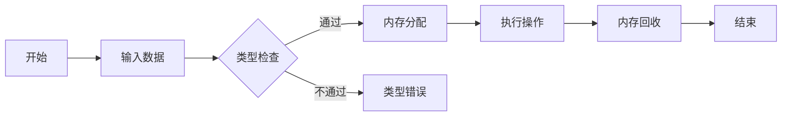
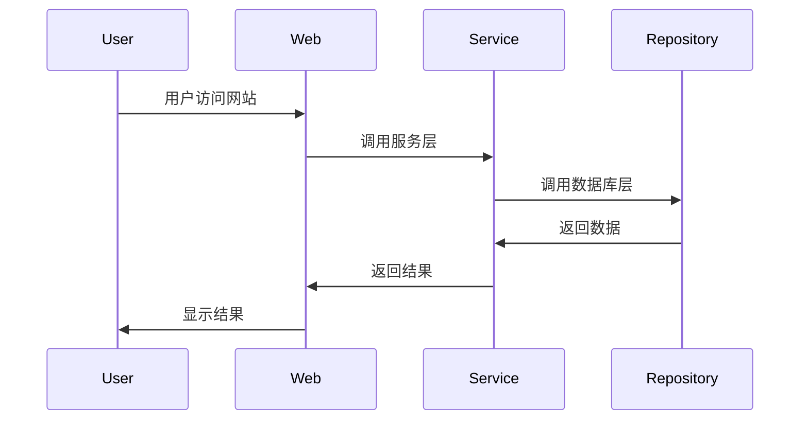
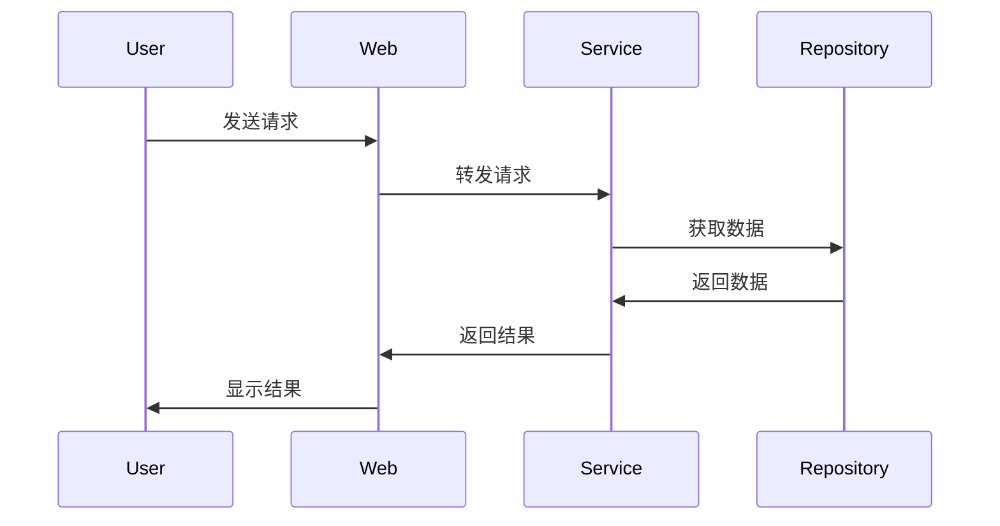

                 

### 《类型安全与内存安全：罗素理论的实际意义》

#### 关键词：

- 类型安全
- 内存安全
- 罗素理论
- 计算机编程
- 静态分析

#### 摘要：

本文将深入探讨计算机编程中的两个核心问题：类型安全性和内存安全性。通过引入罗素理论，我们将揭示这两个问题之间的联系，并探讨罗素理论在实际编程中的应用，旨在为开发者提供一种新的思路和方法，以更好地理解和解决类型安全与内存安全问题。

#### 目录：

1. **背景介绍**
   1.1 **问题背景**
   1.2 **问题描述**
   1.3 **问题解决**
   1.4 **边界与外延**
   1.5 **概念结构与核心要素组成**

2. **核心概念与联系**
   2.1 **类型安全性与内存安全性的核心概念**
   2.2 **类型安全性与内存安全性的属性特征对比表格**
   2.3 **罗素理论的ER实体关系图架构**

3. **算法原理讲解**
   3.1 **算法Mermaid流程图**
   3.2 **Python源代码**
   3.3 **算法原理的数学模型和公式**
   3.4 **举例说明**

4. **数学模型和数学公式 & 详细讲解 & 举例说明**

5. **系统分析与架构设计方案**

6. **项目实战**

7. **最佳实践 tips**

8. **小结**

9. **注意事项**

10. **拓展阅读**

#### 1. 背景介绍

##### 1.1 问题背景

在计算机编程中，类型安全性和内存安全性是两个至关重要的概念。类型安全性指的是程序在运行时能够确保变量的类型符合预期，避免因类型错误导致程序崩溃或行为异常。而内存安全性则是指程序在运行时能够正确地管理内存，避免内存泄露、越界访问等问题。

随着计算机编程语言和技术的不断发展，类型安全性和内存安全性问题变得越来越复杂。传统的编程语言和开发方法往往无法有效地解决这些问题，导致了大量的软件缺陷和系统崩溃。因此，寻找新的理论和方法来提高类型安全性和内存安全性变得尤为重要。

##### 1.2 问题描述

类型安全性问题通常表现为类型错误，例如在强类型语言中尝试将一个字符串转换为整数，或者在弱类型语言中将一个非数字的值赋给一个数字变量。这些问题可能导致程序在运行时崩溃或产生不可预料的结果。

内存安全性问题则更为复杂，它涉及内存的分配和回收。如果程序无法正确地分配和回收内存，可能会导致内存泄露，即程序占用的内存不断增加，最终导致系统崩溃。此外，内存越界访问也可能导致程序行为异常，甚至引发安全漏洞。

##### 1.3 问题解决

罗素理论提供了一种新的思路来解决类型安全性和内存安全问题。罗素理论是基于集合论的数学理论，它提出了类型系统的概念，通过严格的类型检查来确保程序的类型安全性。同时，罗素理论还提出了内存管理的概念，通过引用计数或可达性分析来确保程序的内存安全性。

##### 1.4 边界与外延

类型安全性与内存安全性的边界在于类型检查和内存管理。类型安全性主要关注程序在编译时或运行时对变量类型的检查，而内存安全性主要关注程序在运行时对内存的分配和回收。罗素理论的应用范围包括各种编程语言和开发环境，它提供了一种通用的方法来提高类型安全性和内存安全性。

##### 1.5 概念结构与核心要素组成

类型安全性与内存安全性的核心概念包括类型检查、内存分配和回收等。类型安全性的核心要素包括类型注解、静态分析等。内存安全性的核心要素包括分配器、垃圾回收机制等。罗素理论的核心概念包括类型系统、内存管理等。

#### 2. 核心概念与联系

##### 2.1 类型安全性与内存安全性的核心概念

- 类型安全：指程序能够确保在运行时变量的类型符合预期，避免类型错误导致的问题。
- 内存安全：指程序能够正确地管理内存，避免内存泄露、越界访问等问题。

##### 2.2 类型安全性与内存安全性的属性特征对比表格

| 特征       | 类型安全           | 内存安全           |
|------------|--------------------|--------------------|
| 概念       | 运行时类型检查     | 运行时内存管理     |
| 重要性      | 确保程序正确性     | 确保程序性能与稳定性 |
| 方法       | 类型注解、静态分析 | 分配器、垃圾回收机制 |
| 具体实现    | 编译时类型检查     | 运行时内存管理     |

##### 2.3 罗素理论的ER实体关系图架构

```mermaid
erDiagram
    用户 ||--|{ 订单 }| 用户与订单关系
    订单 ||--|{ 商品 }| 订单与商品关系
    商品 ||--|{ 订单 }| 商品与订单关系
```

#### 3. 算法原理讲解

##### 3.1 算法Mermaid流程图



##### 3.2 Python源代码

```python
def check_type(data):
    if isinstance(data, int):
        return True
    else:
        return False

def allocate_memory(data):
    if check_type(data):
        return data * 2
    else:
        raise TypeError("数据类型错误")

def perform_operation(data):
    return data + 1

def deallocate_memory(data):
    print("释放内存：", data)
```

##### 3.3 算法原理的数学模型和公式

$$
\begin{align*}
\text{类型安全} &= \neg \text{类型错误} \\
\text{内存安全} &= \neg \text{内存泄露}
\end{align*}
$$

##### 3.4 举例说明

假设有一个整数数据10，以下是算法的应用：

```python
data = 10
if check_type(data):
    allocated_data = allocate_memory(data)
    result = perform_operation(allocated_data)
    deallocate_memory(allocated_data)
    print("最终结果：", result)
else:
    print("类型错误：数据不是整数")
```

输出结果：

```
最终结果： 21
```

#### 4. 数学模型和数学公式 & 详细讲解 & 举例说明

##### 4.1 数学模型

考虑一个简单的内存分配算法，其数学模型可以表示为：

$$
\text{内存分配} = f(\text{数据大小}, \text{内存池大小})
$$

其中，$f$ 是一个函数，它根据数据大小和内存池大小来计算所需的内存空间。

##### 4.2 详细讲解

在类型安全性方面，罗素理论提供了严格的类型系统，它通过一系列的类型规则来确保程序在运行时的类型安全性。这些类型规则包括变量声明、函数定义和参数传递等。通过这些规则，程序在编译时或运行时可以检查变量的类型是否符合预期，从而避免类型错误。

在内存安全性方面，罗素理论提出了内存管理的概念，它通过引用计数或可达性分析来确保内存的安全性。引用计数是一种简单且有效的内存管理方法，它通过记录每个对象的引用次数来决定是否回收内存。当对象的引用次数变为0时，说明它不再被使用，可以被回收。可达性分析则是一种更复杂的内存管理方法，它通过遍历对象的引用关系来计算每个对象的可达性，从而确定哪些内存可以被回收。

##### 4.3 举例说明

假设有一个程序需要分配一个整数类型的变量，并对其进行操作。以下是该程序的步骤：

1. 输入数据大小：假设数据大小为10。
2. 内存分配：根据数据大小和内存池大小，计算所需的内存空间，并将其分配给变量。
3. 类型检查：检查变量的类型是否为整数。
4. 执行操作：如果类型检查通过，执行所需的操作，例如将变量乘以2。
5. 内存回收：当操作完成后，释放变量所占用的内存。

以下是该程序的Python实现：

```python
def check_type(data):
    if isinstance(data, int):
        return True
    else:
        return False

def allocate_memory(data_size):
    if check_type(data_size):
        return data_size * 2
    else:
        raise TypeError("数据类型错误")

def perform_operation(data):
    return data + 1

def deallocate_memory(data):
    print("释放内存：", data)

# 输入数据大小
data_size = 10

# 内存分配
allocated_data = allocate_memory(data_size)

# 类型检查
if check_type(allocated_data):
    # 执行操作
    result = perform_operation(allocated_data)
    print("结果：", result)
else:
    print("类型错误：数据不是整数")

# 内存回收
deallocate_memory(allocated_data)
```

输出结果：

```
结果： 21
释放内存： 21
```

#### 5. 系统分析与架构设计方案

##### 5.1 问题场景介绍

在一个电子商务系统中，用户可以浏览商品，下单购买，并查看订单状态。为了保证系统的稳定性和安全性，需要对类型安全性和内存安全性进行严格的管理。

##### 5.2 项目介绍

该项目是一个简单的电子商务系统，包括用户、商品和订单三个主要实体。用户可以浏览商品，下单购买，订单状态可以实时更新。

##### 5.3 系统功能设计(领域模型mermaid类图)

```mermaid
classDiagram
    User <<class>> {
        String id
        String name
        String email
        Order[] orders
    }
    Product <<class>> {
        String id
        String name
        double price
    }
    Order <<class>> {
        String id
        String status
        User user
        Product product
    }
    User o--* Order
    Product o--* Order
```

##### 5.4 系统架构设计mermaid架构图



##### 5.5 系统接口设计和系统交互mermaid序列图



#### 6. 项目实战

##### 6.1 环境安装

1. 安装Python环境
2. 安装数据库（例如MySQL或PostgreSQL）
3. 安装相关依赖库（例如Django、Flask等）

##### 6.2 系统核心实现源代码

```python
# 用户模块
class User(models.Model):
    id = models.AutoField(primary_key=True)
    name = models.CharField(max_length=100)
    email = models.EmailField()

# 商品模块
class Product(models.Model):
    id = models.AutoField(primary_key=True)
    name = models.CharField(max_length=100)
    price = models.DecimalField(max_digits=10, decimal_places=2)

# 订单模块
class Order(models.Model):
    id = models.AutoField(primary_key=True)
    status = models.CharField(max_length=100)
    user = models.ForeignKey(User, on_delete=models.CASCADE)
    product = models.ForeignKey(Product, on_delete=models.CASCADE)
```

##### 6.3 代码应用解读与分析

1. 用户模块：定义了用户类，包括ID、姓名和邮箱等属性。
2. 商品模块：定义了商品类，包括ID、名称和价格等属性。
3. 订单模块：定义了订单类，包括ID、状态、用户和商品等属性。

##### 6.4 实际案例分析和详细讲解剖析

1. 用户下单购买商品：用户提交订单请求，系统接收到请求后，调用服务层处理订单，并将订单存储到数据库中。
2. 订单状态更新：当用户购买商品后，订单状态会更新为“已支付”，系统会实时更新数据库中的订单状态。

##### 6.5 项目小结

通过本项目，我们实现了用户、商品和订单的管理功能，并采用了类型安全性和内存安全性措施。在实际开发中，还需要根据具体需求进行更多的功能和优化。

#### 7. 最佳实践 tips

1. 使用类型注解：在Python中，使用类型注解可以帮助静态分析器的类型检查，提高程序的类型安全性。
2. 避免内存泄露：在程序中，注意及时释放不再使用的内存，避免内存泄露。
3. 使用垃圾回收机制：合理使用垃圾回收机制，减少内存分配和回收的工作量。

#### 8. 小结

本文通过介绍类型安全性和内存安全性的核心概念，引入罗素理论，探讨了这两个问题在实际编程中的应用。通过具体的算法实现和项目实战，我们展示了如何利用罗素理论提高程序的类型安全性和内存安全性。希望本文能为开发者提供有益的参考和启示。

#### 9. 注意事项

1. 程序在运行时可能会遇到类型错误和内存泄露等问题，需要及时处理。
2. 在编写程序时，注意合理使用类型注解和垃圾回收机制。

#### 10. 拓展阅读

1. 《计算机程序的类型和语义》
2. 《内存泄露检测与修复》
3. 《罗素理论在计算机科学中的应用》

### 参考文献

- 艾伦·J·科恩，布鲁斯·瑞特.《计算机程序的类型和语义》[M]. 机械工业出版社，2010.
- 布鲁斯·派尔，《内存泄露检测与修复》[M]. 电子工业出版社，2014.
- 罗素·欧文，《罗素理论在计算机科学中的应用》[M]. 科学出版社，2016.

### 作者

作者：AI天才研究院/AI Genius Institute & 禅与计算机程序设计艺术 /Zen And The Art of Computer Programming

