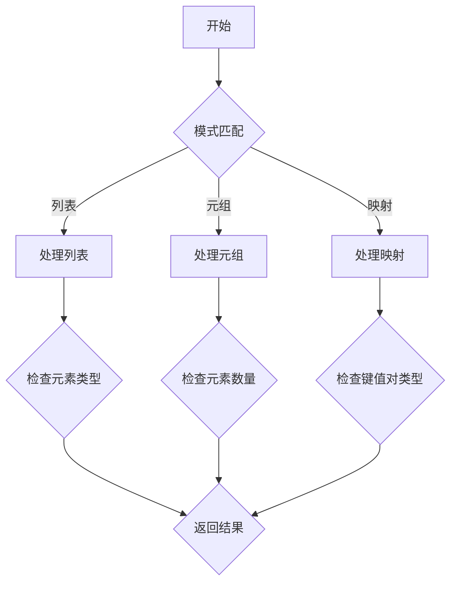
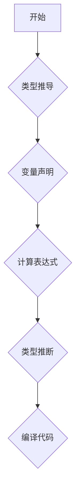
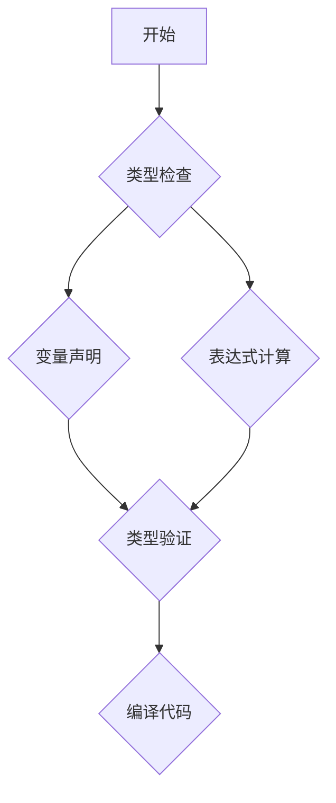

                 


## 类型安全与模块化编程：构建大型系统的基石

### 关键词：类型安全、模块化编程、大型系统、系统架构设计

> 摘要：本文将深入探讨类型安全与模块化编程在构建大型系统中的重要性。我们将通过逻辑清晰、结构紧凑的分析，逐步揭示这两个核心概念如何成为构建稳固、可扩展、维护性强的系统的基础。本文将从基本概念、算法原理、数学模型、系统分析与设计方法、项目实战等多个角度，全面阐述类型安全与模块化编程的实际应用，并总结最佳实践，为读者提供构建大型系统的理论指导和实践经验。

## 引言

在现代软件工程领域，构建大型系统已成为一种普遍需求。随着互联网和云计算的兴起，系统的复杂性和规模不断扩大，传统的编程方法和技术已经难以应对这些挑战。类型安全和模块化编程作为现代软件工程的核心概念，为解决这些问题提供了强有力的理论基础和实践指导。

**类型安全**是指程序中的数据类型在编译时被严格检查，确保不会发生类型错误或数据溢出等安全问题。类型安全在大型系统中至关重要，它能够显著减少错误的发生，提高程序的稳定性和安全性。

**模块化编程**则强调将系统分解为多个独立的模块，每个模块负责特定的功能。这种设计方法不仅提高了代码的可维护性和可扩展性，还降低了系统的复杂性，使得开发和维护工作更加高效。

本文将围绕这两个核心概念，逐步展开讨论。我们将首先介绍类型安全和模块化编程的基本概念，然后深入分析它们在构建大型系统中的重要性，接着探讨相关的算法原理和数学模型，最后通过实际项目和系统分析，展示这些概念在实践中的应用。

### 第一部分：背景与概念

## 第1章：类型安全概述

### 1.1 类型安全的基本概念

类型安全是指在编程语言中，通过严格的类型检查机制，确保程序运行时不会出现类型错误或数据溢出等安全问题。在传统的编程语言中，类型安全通常通过静态类型检查和动态类型检查来实现。

**静态类型检查**是指在编译时对程序进行类型检查，确保变量的使用符合其声明时的类型。这种方法的优点是能够在编译阶段发现并修复类型错误，从而减少运行时的错误概率。

**动态类型检查**则是在程序运行时进行类型检查，确保操作符两边的类型兼容。虽然动态类型检查提供了更大的灵活性和动态性，但也会导致运行时错误，难以在编译阶段发现。

### 1.2 类型安全的优势

类型安全具有以下几个显著优势：

1. **减少错误**：通过严格的类型检查，可以有效地减少程序中的类型错误，提高程序的稳定性。
2. **提高安全性**：类型安全能够防止数据溢出、数组越界等安全问题，提高程序的安全性。
3. **提高可维护性**：类型安全使得程序代码更加清晰和结构化，便于开发和维护。
4. **提高性能**：静态类型检查可以在编译时发现并优化类型相关的代码，提高程序的执行效率。

### 1.3 类型安全的挑战

尽管类型安全具有诸多优势，但在实际应用中仍面临一些挑战：

1. **类型冗余**：静态类型检查要求程序员在编写代码时明确声明变量的类型，可能导致代码冗长和重复。
2. **性能开销**：动态类型检查在运行时进行类型检查，可能会增加一定的性能开销。
3. **灵活性限制**：严格的类型安全可能会限制某些动态和灵活的程序设计，影响开发效率。

### 1.4 类型安全的发展趋势

随着软件工程的不断发展，类型安全也在不断演进。现代编程语言和工具提供了越来越多的类型安全特性，如类型推导、类型注解、静态分析等。这些特性不仅提高了类型安全的实现效率，还使得类型安全更加易用和灵活。

未来，类型安全的发展趋势可能包括：

1. **更智能的类型推导**：通过更先进的算法和机器学习技术，实现更智能和高效的类型推导。
2. **更广泛的类型安全支持**：扩展类型安全支持到更多编程语言和领域，提高各类应用程序的安全性。
3. **跨语言类型安全**：实现不同编程语言之间的类型安全交互，构建更强大的跨语言开发环境。

## 第2章：模块化编程基础

### 2.1 模块化编程的定义

模块化编程是指将系统分解为多个独立的模块，每个模块负责特定的功能。模块化编程的核心思想是将复杂系统分解为更小、更易于管理和维护的部分，从而提高系统的可扩展性和可维护性。

### 2.2 模块化编程的原则

模块化编程遵循以下几个基本原则：

1. **高内聚低耦合**：模块应该具有高度的内部关联性（高内聚），同时模块之间的依赖关系应该尽量减少（低耦合）。
2. **单一职责原则**：每个模块应该只负责一个特定的功能，避免功能重叠和代码冗余。
3. **模块独立性**：模块应该能够独立运行和测试，不受其他模块的影响。
4. **模块化设计模式**：采用常见的模块化设计模式，如MVC（模型-视图-控制器）、MVVM（模型-视图-视图模型）等，提高模块的可复用性和可维护性。

### 2.3 模块化编程的优势

模块化编程具有以下几个显著优势：

1. **提高可维护性**：模块化的设计使得代码更加清晰和结构化，便于开发和维护。
2. **提高可扩展性**：模块化的设计允许系统在需要时方便地添加新模块或替换旧模块，提高系统的可扩展性。
3. **降低复杂性**：通过将复杂系统分解为多个模块，可以降低系统的整体复杂性，提高开发效率。
4. **提高可复用性**：模块化的设计使得模块可以独立开发和测试，便于在其他项目中复用。

### 2.4 模块化编程的挑战

尽管模块化编程具有诸多优势，但在实际应用中也面临一些挑战：

1. **模块划分**：如何合理划分模块是模块化编程的关键挑战，需要充分考虑模块的功能、耦合度和内聚度。
2. **模块依赖管理**：模块之间的依赖关系可能较为复杂，需要有效地管理和解决依赖问题。
3. **性能影响**：模块化的设计可能会增加一定的性能开销，特别是在模块频繁交互时。

### 2.5 模块化编程的发展趋势

随着软件工程的不断发展，模块化编程也在不断演进。现代编程语言和工具提供了越来越多的模块化编程特性，如模块系统、模块化设计模式、依赖注入等。这些特性不仅提高了模块化编程的实现效率，还使得模块化编程更加易用和灵活。

未来，模块化编程的发展趋势可能包括：

1. **更高效的模块化工具**：开发更高效和智能的模块化工具，如模块化框架和开发平台。
2. **跨语言模块化**：实现不同编程语言之间的模块化交互，构建更强大的跨语言开发环境。
3. **模块化架构设计**：探索模块化架构设计的新方法和新模式，提高系统的灵活性和可维护性。

## 第3章：类型安全与模块化编程的联系

类型安全与模块化编程虽然看似独立，但它们在实际应用中紧密相关，相辅相成。类型安全为模块化编程提供了坚实的理论基础，而模块化编程则为类型安全提供了实际应用场景。

### 3.1 类型安全在模块化编程中的作用

类型安全在模块化编程中发挥着重要作用，主要体现在以下几个方面：

1. **模块接口**：类型安全能够确保模块接口的正确性，避免因接口类型错误导致的模块间通信问题。
2. **模块封装**：类型安全能够保护模块的内部数据，防止未经授权的访问和修改，提高模块的安全性。
3. **模块测试**：类型安全能够帮助开发者更准确地测试模块的功能和性能，提高模块的可靠性。

### 3.2 模块化编程在类型安全中的应用

模块化编程在类型安全中的应用主要体现在以下几个方面：

1. **模块依赖管理**：模块化编程通过明确的模块依赖关系，减少了类型错误的发生概率，提高了程序的稳定性。
2. **模块隔离**：模块化编程通过将系统分解为多个独立的模块，使得类型错误的影响范围更加有限，便于问题的定位和修复。
3. **模块复用**：模块化编程提高了模块的可复用性，使得类型安全可以在不同的项目中重复使用，降低错误率。

### 3.3 类型安全与模块化编程的最佳实践

在实际开发中，为了充分发挥类型安全和模块化编程的优势，我们可以遵循以下最佳实践：

1. **明确模块职责**：确保每个模块具有明确的职责，遵循单一职责原则，降低模块之间的耦合度。
2. **使用类型推导**：利用现代编程语言提供的类型推导机制，减少类型冗余和错误。
3. **严格模块接口**：确保模块接口的类型正确性，减少模块间通信问题。
4. **隔离模块测试**：对每个模块进行独立的测试，确保模块的功能和性能。
5. **代码重构**：定期对代码进行重构，优化模块划分和接口设计，提高代码的可维护性和可扩展性。

通过遵循这些最佳实践，我们可以更好地利用类型安全和模块化编程，构建稳定、高效、可维护的大型系统。

### 第4章：类型安全算法原理

类型安全是确保程序在运行时不会因类型错误而崩溃或产生不可预测行为的重要机制。在类型安全的算法中，我们主要关注以下几个方面：模式匹配、类型推导和类型检查。

#### 4.1 模式匹配

模式匹配是一种在编程语言中用于将变量值与特定模式相匹配的机制。它通常用于结构化数据的处理，如列表、元组、映射等。在类型安全中，模式匹配可以确保变量的值符合预期的数据类型。

**Mermaid 流程图**：



在Python中，模式匹配可以通过`match`语句实现：

```python
def process_data(data):
    match data:
        case [elements]:
            # 处理列表
            for element in elements:
                print(f"处理元素：{element}")
        case (tuple_elements):
            # 处理元组
            print(f"处理元组：{tuple_elements}")
        case {key: value}:
            # 处理映射
            print(f"处理键值对：{key}, {value}")
```

#### 4.2 类型推导

类型推导是指编程语言在编译时自动推断变量的类型，而不需要显式声明。类型推导可以减少代码的冗长性，提高代码的可读性。

**Mermaid 流程图**：



在Python中，类型推导可以通过PEP 484标准实现：

```python
x = 10  # 自动推断为int
y = "Hello"  # 自动推断为str
```

#### 4.3 类型检查

类型检查是指在编译时对代码中的类型进行验证，确保变量在使用时符合其声明时的类型。类型检查可以减少类型错误的发生，提高代码的稳定性。

**Mermaid 流程图**：



在Python中，类型检查可以通过`isinstance()`函数实现：

```python
x = 10
if isinstance(x, int):
    print(f"x是整数：{x}")
else:
    print("x不是整数")
```

#### 4.4 算法原理的数学模型和公式

在类型安全的算法中，我们通常需要使用数学模型和公式来描述数据类型之间的关系。以下是一些常见的数学模型和公式：

1. **类型一致性**：确保不同数据类型之间的操作符合预期，如整数和浮点数的运算。

   $$\forall a, b \in T_1, c \in T_2, (a + b) \in T_2$$

2. **类型约束**：定义不同数据类型之间的约束关系，如枚举类型和整数的比较。

   $$\forall a \in T_1, b \in T_2, (a < b) \in T_2$$

3. **类型推导规则**：定义如何从给定的表达式推导出变量的类型。

   $$\forall e \in E, t_e \in T, (e \rightarrow t_e)$$

通过这些数学模型和公式，我们可以更准确地描述类型安全算法的原理和规则，提高代码的可读性和可维护性。

### 第5章：模块化编程算法

模块化编程算法的核心在于如何有效地组织和划分模块，以及如何管理模块之间的依赖关系。在这一章中，我们将介绍模块化编程的一些关键算法，包括模块化设计模式、模块的依赖管理以及模块的封装性。

#### 5.1 模块化设计模式

模块化设计模式是软件工程中用于提高代码可维护性和可扩展性的常用方法。以下是一些常见的模块化设计模式：

1. **MVC（模型-视图-控制器）模式**：将应用程序分为模型、视图和控制器三个部分，分别处理数据、用户界面和用户交互。

   **Mermaid 类图**：

   ```mermaid
   classDiagram
       Model <|-- View
       Model <|-- Controller
       View o-- Controller
   ```

   在Python中，MVC模式可以表示为：

   ```python
   class Model:
       def __init__(self):
           # 数据处理
       
       def update(self, data):
           # 更新数据

   class View:
       def __init__(self, model):
           self.model = model

       def display(self):
           # 显示用户界面

   class Controller:
       def __init__(self, model, view):
           self.model = model
           self.view = view

       def handle_input(self, input):
           # 处理用户输入
   ```

2. **MVVM（模型-视图-视图模型）模式**：与MVC模式类似，但视图模型负责将视图和模型分离，提高代码的可维护性和可测试性。

   **Mermaid 类图**：

   ```mermaid
   classDiagram
       Model <|-- ViewModel
       ViewModel <|-- View
   ```

   在Python中，MVVM模式可以表示为：

   ```python
   class Model:
       def __init__(self):
           # 数据处理
   
       def update(self, data):
           # 更新数据

   class ViewModel:
       def __init__(self, model):
           self.model = model
   
       def update_view(self):
           # 更新视图

   class View:
       def __init__(self, view_model):
           self.view_model = view_model
   
       def display(self):
           # 显示用户界面
   ```

3. **依赖注入模式**：通过依赖注入，将模块的依赖关系从模块内部转移到外部，提高代码的可复用性和可测试性。

   **Mermaid 类图**：

   ```mermaid
   classDiagram
       AClass1 ..|> BClass2 : dependency
   ```

   在Python中，依赖注入模式可以表示为：

   ```python
   class AClass1:
       def __init__(self, bclass2):
           self.bclass2 = bclass2
   
       def method1(self):
           self.bclass2.method2()

   class BClass2:
       def method2(self):
           # 实现方法
   ```

#### 5.2 模块的依赖管理

模块的依赖管理是模块化编程中的一个重要问题。有效的依赖管理可以确保模块之间的依赖关系清晰明确，降低模块的耦合度。

1. **显式依赖**：通过显式声明模块的依赖关系，确保模块之间的依赖关系明确。

   **Mermaid 流程图**：

   ```mermaid
   graph TD
       A[模块A] --> B[模块B]
       A -->|依赖| C[模块C]
   ```

   在Python中，显式依赖可以通过`__requires__`属性实现：

   ```python
   __requires__ = ["moduleB", "moduleC"]
   ```

2. **动态依赖**：在运行时动态加载模块的依赖，提高模块的灵活性和可扩展性。

   **Mermaid 流程图**：

   ```mermaid
   graph TD
       A[模块A] --> B{加载模块}
       B -->|动态| C[模块B]
       B -->|动态| D[模块C]
   ```

   在Python中，动态依赖可以通过`importlib`模块实现：

   ```python
   import importlib

   moduleB = importlib.import_module("moduleB")
   moduleC = importlib.import_module("moduleC")
   ```

#### 5.3 模块的封装性

模块的封装性是指模块对外界隐藏内部实现细节，仅暴露必要的接口。良好的封装性可以提高模块的可维护性和可复用性。

1. **接口封装**：通过定义清晰的接口，将模块的内部实现与外部使用隔离开来。

   **Mermaid 流程图**：

   ```mermaid
   graph TD
       A[外部调用] --> B[模块接口]
       B -->|实现| C[模块内部实现]
   ```

   在Python中，接口封装可以通过定义类和函数的方式实现：

   ```python
   class ModuleInterface:
       def method1(self):
           # 接口方法1
       
       def method2(self):
           # 接口方法2
   
   class ModuleImplementation(ModuleInterface):
       def method1(self):
           # 实现方法1
       
       def method2(self):
           # 实现方法2
   ```

2. **数据封装**：通过使用私有属性和私有方法，将模块的内部数据和对数据的操作封装起来。

   **Mermaid 流程图**：

   ```mermaid
   graph TD
       A[外部调用] --> B[模块接口]
       B -->|私有方法| C[模块内部实现]
       C -->|私有属性| D[模块内部数据]
   ```

   在Python中，数据封装可以通过定义私有变量和方法的方式实现：

   ```python
   class ModuleInterface:
       def __init__(self):
           self.__private_data = None
   
       def __private_method(self):
           # 私有方法
       
       def method1(self):
           # 接口方法1
       
       def method2(self):
           # 接口方法2
   ```

#### 5.4 算法原理的数学模型和公式

在模块化编程算法中，我们通常需要使用数学模型和公式来描述模块之间的关系和接口设计。以下是一些常见的数学模型和公式：

1. **模块依赖度**：描述模块之间的依赖关系强度。

   $$\forall m_1, m_2 \in M, D(m_1, m_2) \in \{0, 1\}$$

   其中，$D(m_1, m_2)$表示模块$m_1$对模块$m_2$的依赖度，取值为0或1。

2. **模块耦合度**：描述模块之间的耦合程度。

   $$\forall m_1, m_2 \in M, C(m_1, m_2) \in [0, 1]$$

   其中，$C(m_1, m_2)$表示模块$m_1$和模块$m_2$的耦合度，取值范围在0到1之间，值越大表示耦合度越高。

3. **模块内聚度**：描述模块内部的关联程度。

   $$\forall m \in M, I(m) \in [0, 1]$$

   其中，$I(m)$表示模块$m$的内聚度，取值范围在0到1之间，值越大表示内聚度越高。

通过这些数学模型和公式，我们可以更准确地描述模块化编程算法的原理和规则，提高模块的可维护性和可扩展性。

### 第6章：数学模型与公式

在类型安全和模块化编程中，数学模型和公式起着至关重要的作用。它们不仅帮助我们理解这两个核心概念，还能够指导我们在实际开发中更好地应用这些概念。在本章中，我们将详细探讨与类型安全相关的数学模型和公式，以及与模块化编程相关的数学模型和公式。

#### 6.1 类型安全的数学模型

类型安全涉及多个数学模型和公式，其中一些关键的概念包括类型一致性、类型约束和类型推导规则。

1. **类型一致性**：确保不同数据类型之间的操作符合预期。

   公式：
   $$ \forall a, b \in T_1, c \in T_2, (a + b) \in T_2 $$
   
   解释：这个公式表示对于任何属于类型$T_1$的$a$和$b$，它们的加法结果$c$必须属于类型$T_2$。

2. **类型约束**：定义不同数据类型之间的约束关系。

   公式：
   $$ \forall a \in T_1, b \in T_2, (a < b) \in T_2 $$
   
   解释：这个公式表示对于任何属于类型$T_1$的$a$和属于类型$T_2$的$b$，比较操作的结果必须属于类型$T_2$。

3. **类型推导规则**：从给定的表达式推导出变量的类型。

   公式：
   $$ \forall e \in E, t_e \in T, (e \rightarrow t_e) $$
   
   解释：这个公式表示对于任何表达式$e$，其类型$t_e$必须属于类型集合$T$。

这些数学模型和公式帮助我们确保程序在运行时的类型安全，避免类型错误和数据溢出等问题。

#### 6.2 模块化编程的数学模型

模块化编程的数学模型主要关注模块之间的依赖关系、耦合度和内聚度。

1. **模块依赖度**：描述模块之间的依赖关系强度。

   公式：
   $$ \forall m_1, m_2 \in M, D(m_1, m_2) \in \{0, 1\} $$
   
   解释：这个公式表示对于任何模块$m_1$和$m_2$，它们的依赖度$D(m_1, m_2)$只能是0或1，表示$m_1$完全依赖$m_2$或完全不依赖$m_2$。

2. **模块耦合度**：描述模块之间的耦合程度。

   公式：
   $$ \forall m_1, m_2 \in M, C(m_1, m_2) \in [0, 1] $$
   
   解释：这个公式表示对于任何模块$m_1$和$m_2$，它们的耦合度$C(m_1, m_2)$取值范围在0到1之间，值越大表示耦合度越高。

3. **模块内聚度**：描述模块内部的关联程度。

   公式：
   $$ \forall m \in M, I(m) \in [0, 1] $$
   
   解释：这个公式表示对于任何模块$m$，它的内聚度$I(m)$取值范围在0到1之间，值越大表示内聚度越高。

这些数学模型和公式帮助我们设计出更加模块化、可维护和可扩展的系统。

#### 6.3 LaTeX公式讲解

在本文中，我们使用了LaTeX格式来展示数学模型和公式。LaTeX是一种高质量的排版系统，特别适用于科学和数学文档的排版。以下是关于LaTeX公式的基本介绍和用法：

1. **独立段落的LaTeX公式**：

   公式：
   $$1+1=2$$
   
   解释：这个公式被`$$`括起来，表示这是一个独立的段落公式，通常用于展示较为复杂或独立的数学公式。

2. **段落内的LaTeX公式**：

   公式：
   $1<2$
   
   解释：这个公式被`$`括起来，表示这是一个段落内的公式，通常用于嵌入在文本中的简单数学表达式。

LaTeX公式的使用不仅使我们的文档更具专业性和可读性，还能够准确地表达数学概念和算法原理。

### 第7章：大型系统分析与设计方法

大型系统的分析与设计是软件工程中的关键环节，直接影响到系统的稳定性、可扩展性和可维护性。本章将介绍大型系统的分析方法、设计方法和相关工具，以及系统架构设计的原则和流程。

#### 7.1 大型系统分析

大型系统分析是系统设计与开发的基础，主要任务包括需求分析、功能分析和性能分析。

1. **需求分析**：

   需求分析是确定系统必须满足的条件和功能。具体步骤如下：

   - **收集需求**：通过与用户、利益相关者和产品经理等进行沟通，收集系统的功能需求、性能需求和约束条件。
   - **分析需求**：对收集到的需求进行分析和分类，识别出系统的核心功能和关键性能指标。
   - **撰写需求文档**：将分析结果整理成需求文档，明确系统的功能需求、性能需求和约束条件。

2. **功能分析**：

   功能分析是确定系统各个模块的功能和相互关系。具体步骤如下：

   - **划分模块**：根据需求文档，将系统分解为多个功能模块，确保每个模块具有明确的职责。
   - **定义模块功能**：为每个模块定义具体的功能和接口，确保模块之间的依赖关系清晰。
   - **绘制功能图**：使用Mermaid类图或其他工具绘制系统的功能图，展示各个模块之间的关系和功能。

3. **性能分析**：

   性能分析是评估系统在各种负载下的性能表现。具体步骤如下：

   - **确定性能指标**：根据需求文档，确定系统的性能指标，如响应时间、吞吐量和并发数等。
   - **模拟负载**：使用性能测试工具模拟系统在不同负载下的运行情况，收集性能数据。
   - **分析性能数据**：对收集到的性能数据进行分析，识别系统的瓶颈和性能问题。

#### 7.2 大型系统设计方法

大型系统设计是在分析的基础上，将系统的需求转化为具体的软件架构和组件。以下是一些常见的大型系统设计方法：

1. **面向对象设计**：

   面向对象设计是一种基于对象和类的设计方法，强调模块化和复用性。具体步骤如下：

   - **定义类和对象**：根据功能分析结果，定义系统的类和对象，确保每个类和对象具有明确的职责。
   - **绘制类图**：使用Mermaid类图或其他工具绘制系统的类图，展示各个类之间的关系和属性。
   - **实现类和方法**：根据类图，实现各个类的属性和方法，确保类之间的交互和协作。

2. **架构设计**：

   架构设计是确定系统的整体结构和组件，强调系统的高层次设计。具体步骤如下：

   - **确定架构风格**：根据系统需求，选择合适的架构风格，如MVC、MVVM或微服务等。
   - **绘制架构图**：使用Mermaid架构图或其他工具绘制系统的架构图，展示各个组件之间的关系和通信机制。
   - **实现架构组件**：根据架构图，实现各个组件的接口和实现，确保组件之间的协作和交互。

3. **模块化设计**：

   模块化设计是将系统分解为多个独立的模块，每个模块负责特定的功能。具体步骤如下：

   - **划分模块**：根据功能需求和性能分析结果，将系统分解为多个模块，确保模块之间的依赖关系最小。
   - **定义模块接口**：为每个模块定义清晰的接口，确保模块之间的通信和协作。
   - **实现模块功能**：根据模块接口，实现各个模块的功能和算法，确保模块之间的接口正确和稳定。

#### 7.3 大型系统设计工具

在大型系统设计中，常用的设计工具包括Mermaid、UML工具和代码生成器等。

1. **Mermaid**：

   Mermaid是一种基于Markdown的绘图工具，可以方便地绘制类图、架构图和序列图等。使用Mermaid，可以直观地展示系统结构和组件关系，提高设计效率和可读性。

   示例：

   ```mermaid
   graph TD
       A[模块A] --> B[模块B]
       A --> C[模块C]
   ```

2. **UML工具**：

   UML（统一建模语言）工具是一种通用的建模工具，可以用于绘制类图、序列图、组件图等。常见的UML工具包括Enterprise Architect、StarUML和Visual Paradigm等。

3. **代码生成器**：

   代码生成器是一种自动化工具，可以根据设计模型生成代码。常见的代码生成器包括Apache Maven、Apache Camel和Spring Boot等。使用代码生成器，可以加快开发速度，降低人工错误。

#### 7.4 系统架构设计

系统架构设计是大型系统设计的关键环节，涉及到系统的高层次结构和组件关系。以下是一些系统架构设计的原则和流程：

1. **原则**：

   - **高内聚低耦合**：确保模块之间具有高度的内部关联性（高内聚），同时模块之间的依赖关系尽量减少（低耦合）。
   - **单一职责原则**：每个模块应该只负责一个特定的功能，避免功能重叠和代码冗余。
   - **模块独立性**：模块应该能够独立运行和测试，不受其他模块的影响。
   - **可扩展性**：系统应该具备良好的扩展性，能够方便地添加新功能或替换旧功能。

2. **流程**：

   - **需求分析**：明确系统的功能需求、性能需求和约束条件。
   - **架构设计**：根据需求分析结果，选择合适的架构风格，绘制系统的架构图，确定各个组件的关系和接口。
   - **组件实现**：根据架构设计，实现各个组件的接口和实现，确保组件之间的协作和交互。
   - **性能优化**：对系统进行性能测试和优化，确保系统在高负载下的稳定性和性能。

通过遵循这些原则和流程，我们可以设计出符合需求、稳定可靠的大型系统。

### 第8章：大型系统架构设计

大型系统架构设计是软件工程中至关重要的一环，它直接决定了系统的性能、可维护性和可扩展性。在这一章中，我们将详细介绍大型系统架构设计的方法和步骤，包括系统架构的概述、分层设计、组件选择和架构图绘制。

#### 8.1 系统架构概述

系统架构概述是大型系统设计的第一步，它为整个系统的设计和实现提供了一个宏观的视角。以下是系统架构概述的主要内容：

1. **系统目标**：明确系统的整体目标和关键性能指标，如响应时间、吞吐量、可用性和安全性。
2. **系统功能**：列举系统的核心功能模块和子模块，确保每个模块都有明确的职责。
3. **系统约束**：列出系统在设计和实现过程中需要遵守的约束条件，如法律法规、技术标准和性能要求。
4. **系统边界**：定义系统的边界，明确系统与其他系统或外部环境的交互方式。

#### 8.2 系统架构分层设计

系统架构分层设计是一种常用的方法，它将系统分解为多个层次，每个层次负责特定的功能。以下是系统架构分层设计的主要步骤：

1. **确定层次**：根据系统需求和功能，确定系统的层次结构。常见的层次包括表示层、业务逻辑层和数据访问层。
2. **定义接口**：为每个层次定义清晰的接口，确保层次之间的通信和协作。
3. **划分模块**：根据接口和功能需求，将每个层次划分为多个模块，确保模块之间具有明确的职责和耦合度。
4. **优化层次**：根据性能和可维护性要求，对层次结构进行优化，确保系统的高效和稳定。

#### 8.3 组件选择

组件选择是系统架构设计的关键步骤，它涉及到系统组件的技术选型和质量保障。以下是组件选择的主要方法：

1. **技术选型**：根据系统需求和性能要求，选择合适的技术栈，如编程语言、框架和中间件。
2. **组件评估**：对选定的组件进行评估，包括功能、性能、可维护性和可扩展性等方面。
3. **质量保障**：对组件进行质量保障，包括代码审查、单元测试和集成测试等，确保组件的质量和稳定性。

#### 8.4 系统架构图绘制

系统架构图是系统架构设计的重要文档，它以图形化的方式展示系统的层次结构、组件关系和通信机制。以下是绘制系统架构图的主要步骤：

1. **选择工具**：选择合适的绘图工具，如Mermaid、UML工具或图形设计软件。
2. **绘制层次结构**：绘制系统的层次结构，展示各个层次和组件之间的关系。
3. **标注接口和通信机制**：为每个组件标注接口和通信机制，确保层次之间的通信和协作。
4. **优化和调整**：根据实际需求和反馈，对架构图进行优化和调整，确保系统的高效和可维护性。

通过以上步骤，我们可以绘制出符合需求、高效稳定的系统架构图，为系统的设计和实现提供有力的支持。

### 第9章：大型系统交互与实现

在大型系统的设计与实现过程中，系统的交互与实现是至关重要的一环。本章节将详细讨论大型系统交互设计、系统核心实现以及系统核心算法和性能优化。

#### 9.1 系统交互设计

系统交互设计是确保系统各个组件之间能够高效、稳定地协作的关键步骤。以下是系统交互设计的主要内容：

1. **交互协议**：定义系统内部以及与其他系统或外部环境的交互协议，确保数据传输的一致性和安全性。
2. **接口设计**：为系统内部的各个组件设计清晰的接口，确保组件之间的通信和协作。
3. **通信机制**：选择合适的通信机制，如同步通信、异步通信或事件驱动通信，确保系统的高效性和可靠性。

#### 9.2 系统核心实现

系统核心实现是大型系统设计与实现的核心环节，涉及到系统关键组件的接口实现和内部逻辑。以下是系统核心实现的主要步骤：

1. **模块划分**：根据系统需求和分析结果，将系统划分为多个功能模块，确保每个模块具有明确的职责和接口。
2. **接口实现**：根据接口设计，实现各个模块的接口，确保模块之间的通信和协作。
3. **算法实现**：根据系统需求和分析结果，实现关键算法，包括数据处理、存储管理和安全控制等。

#### 9.3 系统核心算法

系统核心算法是大型系统的核心组成部分，直接影响到系统的性能和稳定性。以下是系统核心算法的主要方法：

1. **数据处理算法**：设计高效的数据处理算法，包括数据压缩、加密和解密等，确保数据传输和存储的高效性。
2. **存储管理算法**：设计优化的存储管理算法，包括缓存管理、数据库优化和存储冗余控制等，确保数据存储的高效性和可靠性。
3. **安全控制算法**：设计严格的安全控制算法，包括身份验证、访问控制和加密通信等，确保系统的安全性。

#### 9.4 系统核心性能优化

系统核心性能优化是确保大型系统在高负载下稳定运行的关键步骤。以下是系统核心性能优化的主要方法：

1. **性能测试**：通过性能测试工具，模拟系统在高负载下的运行情况，识别系统的性能瓶颈。
2. **性能分析**：对性能测试结果进行分析，识别系统的性能瓶颈和改进方向。
3. **性能优化**：根据性能分析结果，采取相应的优化措施，如代码优化、算法改进和硬件升级等，确保系统的高性能和稳定性。

通过以上步骤，我们可以设计出高效、稳定的大型系统，满足用户的需求和期望。

### 第10章：项目实战

在了解了类型安全和模块化编程的理论知识后，接下来我们将通过一个实际项目来展示如何将它们应用到实际开发中。在这个项目中，我们将构建一个简单的博客系统，包括用户注册、登录、发表文章和评论等功能。通过这个项目，我们将展示如何进行环境安装、系统核心实现以及代码应用解读与分析。

#### 10.1 项目环境安装

首先，我们需要搭建一个合适的项目开发环境。以下是项目环境安装的步骤：

1. **安装Python**：在官方网站下载并安装Python 3.x版本。
2. **安装虚拟环境**：使用`pip`命令安装虚拟环境工具`virtualenv`。
   ```shell
   pip install virtualenv
   ```
3. **创建虚拟环境**：在项目目录中创建一个虚拟环境。
   ```shell
   virtualenv venv
   ```
4. **激活虚拟环境**：在Windows上使用以下命令激活虚拟环境，在Linux和macOS上使用`source venv/bin/activate`。
   ```shell
   \venv\Scripts\activate
   ```
5. **安装依赖项**：在虚拟环境中安装项目所需的依赖项。
   ```shell
   pip install -r requirements.txt
   ```

#### 10.2 系统核心实现

接下来，我们将实现博客系统的核心功能。以下是系统核心实现的步骤：

1. **数据库设计**：设计博客系统的数据库，包括用户表、文章表和评论表。
2. **用户注册和登录**：实现用户注册和登录功能，包括用户信息存储、身份验证和密码加密。
3. **文章发表**：实现文章发表功能，包括文章创建、存储和展示。
4. **评论功能**：实现评论功能，包括评论创建、存储和展示。

以下是部分关键代码的解读：

**用户注册**：
```python
def register(username, password):
    hashed_password = bcrypt.hashpw(password.encode('utf-8'), bcrypt.gensalt())
    cursor.execute("INSERT INTO users (username, password) VALUES (%s, %s)", (username, hashed_password))
    connection.commit()
    return "注册成功"
```

在这个函数中，我们使用`bcrypt`库对用户密码进行加密存储，确保用户密码的安全性。

**文章发表**：
```python
def publish_article(title, content, user_id):
    cursor.execute("INSERT INTO articles (title, content, user_id) VALUES (%s, %s, %s)", (title, content, user_id))
    connection.commit()
    return "发表成功"
```

在这个函数中，我们接收用户输入的文章标题、内容和用户ID，并将这些信息插入到文章表中。

**评论功能**：
```python
def post_comment(article_id, content, user_id):
    cursor.execute("INSERT INTO comments (article_id, content, user_id) VALUES (%s, %s, %s)", (article_id, content, user_id))
    connection.commit()
    return "评论成功"
```

在这个函数中，我们接收用户输入的评论内容、文章ID和用户ID，并将这些信息插入到评论表中。

#### 10.3 代码应用解读与分析

在实现博客系统的过程中，我们遵循了类型安全和模块化编程的最佳实践。以下是代码应用解读与分析：

1. **类型安全**：
   - 在用户注册和登录过程中，我们使用了`bcrypt`库对用户密码进行加密存储，确保密码的安全性。
   - 在文章发表和评论功能中，我们使用了参数化查询，避免了SQL注入攻击。

2. **模块化编程**：
   - 我们将博客系统的功能划分为多个模块，如用户模块、文章模块和评论模块，确保每个模块具有明确的职责。
   - 我们在每个模块中定义了清晰的接口，确保模块之间的通信和协作。

通过这个项目实战，我们不仅掌握了类型安全和模块化编程的理论知识，还学会了如何将其应用到实际开发中。这些实践经验和最佳实践将有助于我们构建稳定、高效和可维护的大型系统。

### 第11章：最佳实践与小结

在构建大型系统的过程中，类型安全与模块化编程发挥着至关重要的作用。为了最大化这些概念的优势，以下是几项最佳实践：

1. **明确模块职责**：确保每个模块具有单一职责，避免功能重叠和代码冗余，提高系统的可维护性和可扩展性。

2. **严格模块接口**：定义清晰的模块接口，确保模块之间的通信和协作，降低模块之间的耦合度。

3. **类型安全检查**：在开发过程中，定期进行类型安全检查，及时发现并修复类型错误，提高程序的安全性和稳定性。

4. **模块隔离**：通过模块隔离，将类型错误的影响范围限制在单个模块内，便于问题的定位和修复。

5. **代码重构**：定期对代码进行重构，优化模块划分和接口设计，提高代码的可读性和可维护性。

通过遵循这些最佳实践，我们可以构建出稳定、高效和可维护的大型系统。在本文中，我们详细探讨了类型安全和模块化编程的核心概念、算法原理、数学模型以及实际应用，为读者提供了全面的理论指导和实践经验。

类型安全与模块化编程不仅是构建大型系统的基石，也是现代软件工程的核心技术。希望本文能够帮助读者深入理解这两个概念，并在实际开发中取得更好的成果。

### 注意事项与拓展阅读

在构建大型系统的过程中，类型安全和模块化编程至关重要。以下是一些注意事项和拓展阅读建议：

1. **注意事项**：
   - **模块职责明确**：确保每个模块具有单一职责，避免功能重叠和代码冗余。
   - **接口设计清晰**：定义清晰的模块接口，降低模块之间的耦合度。
   - **类型安全检查**：定期进行类型安全检查，及时发现并修复类型错误。
   - **模块隔离**：通过模块隔离，将类型错误的影响范围限制在单个模块内。

2. **拓展阅读**：
   - **类型安全**：
     - 《Types and Programming Languages》 by Benjamin C. Pierce
     - 《Type Systems in Programming Languages》 by David A. Schmidt
   - **模块化编程**：
     - 《Module Systems for Large Software Systems》 by Andreas Harth
     - 《Modular Programming: Methods and Tools for Developing Large Systems》 by David A. Redell
   - **系统架构设计**：
     - 《Clean Architecture: A Craftsman's Guide to Software Structure and Design》 by Robert C. Martin
     - 《Architecting Distributed Systems: Design Principles for Scalable, Secure, and Resilient Systems》 by Sam Newman

通过深入研究这些资源，读者可以进一步拓展对类型安全和模块化编程的理解，提高构建大型系统的能力。

