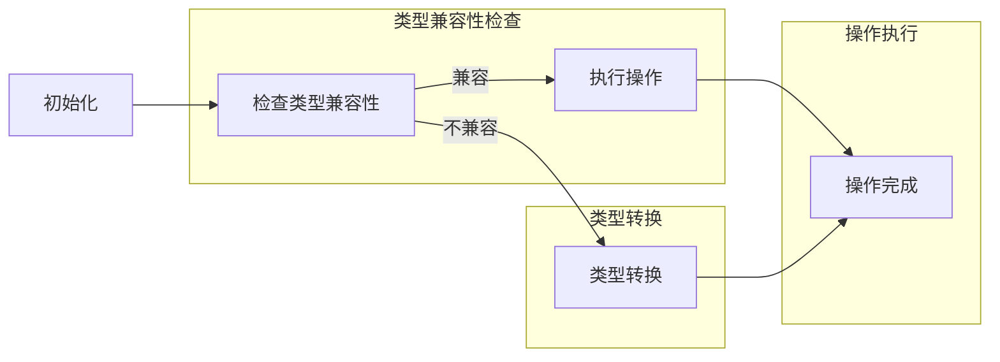
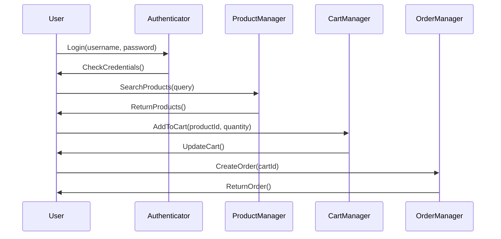
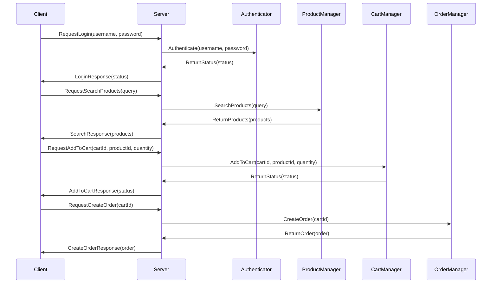

                 


### 引言

在计算机科学中，类型层级（Type Hierarchy）是一个核心概念，它不仅在编程语言中起着关键作用，也是设计复杂系统时必须掌握的重要工具。类型层级描述了不同类型之间的关系，这些关系不仅定义了类型的层次结构，还决定了类型之间的兼容性和转换方式。类型层级正确的设计和实现，对于提高代码的可读性、维护性和扩展性至关重要。

本文旨在深入探讨类型层级的概念、构建复杂类型关系的方法，并从多个角度进行剖析。我们将从背景介绍开始，逐步展开，涵盖核心概念的详细解读、算法原理讲解、数学模型和公式分析、系统分析与架构设计、项目实战以及最佳实践与拓展。

### 目录

1. 引言
2. 类型层级：概念与意义
   - 2.1 基础概念
   - 2.2 类型层级的重要性
3. 构建复杂类型关系的挑战
4. 核心概念与联系
   - 4.1 类型与类
   - 4.2 类型系统与类型检查
   - 4.3 类型层级与层次化设计
5. 算法原理讲解
   - 5.1 算法简介
   - 5.2 Mermaid流程图展示
   - 5.3 Python源代码实现
6. 数学模型与公式讲解
   - 6.1 关键算法数学模型
   - 6.2 举例说明
7. 系统分析与架构设计
   - 7.1 问题场景介绍
   - 7.2 系统功能设计
   - 7.3 系统架构设计
   - 7.4 系统接口设计
   - 7.5 系统交互
8. 项目实战
   - 8.1 环境搭建与准备
   - 8.2 核心实现与代码分析
   - 8.3 实际案例分析
9. 最佳实践与拓展
   - 9.1 最佳实践技巧
   - 9.2 注意事项
   - 9.3 拓展阅读
10. 结论
11. 作者信息

### 类型层级：概念与意义

#### 2.1 基础概念

类型层级（Type Hierarchy）是指在一个系统中，不同类型（Type）按照某种规则组织起来的层次结构。在计算机科学中，类型通常用于定义数据的形式和行为。类型可以是基本的，如整数、浮点数和字符，也可以是复合的，如数组、结构体和类。

- **基本类型（Primitive Types）**：这些是编程语言内部直接支持的数据类型，如C语言中的`int`、`float`、`char`等。
- **复合类型（Composite Types）**：这些类型由基本类型组合而成，如`struct`、`array`和`class`。
- **引用类型（Reference Types）**：这些类型在内存中通过引用来访问数据，如C++中的类和C#中的对象。

#### 2.2 类型层级的重要性

类型层级的重要性体现在以下几个方面：

- **类型安全（Type Safety）**：类型层级确保了变量在使用时符合其定义的类型，防止了类型错误的发生，如将整数赋值给字符串。
- **代码可维护性（Code Maintainability）**：通过类型层级，可以更清晰地组织代码，使得不同功能模块之间的依赖关系更加明确。
- **代码可扩展性（Code Extensibility）**：类型层级允许新的类型通过继承或组合的方式加入到系统中，而不会破坏现有的代码。
- **性能优化（Performance Optimization）**：类型层级的设计可以直接影响到程序的性能，尤其是在类型转换和内存管理方面。

### 构建复杂类型关系的挑战

在构建复杂类型关系时，我们面临以下几个挑战：

- **类型兼容性（Type Compatibility）**：如何确保不同类型之间可以进行有效的数据交换和操作。
- **类型转换（Type Conversion）**：如何在需要时将一种类型转换为另一种类型，且不丢失信息。
- **类型继承（Type Inheritance）**：如何通过继承关系实现类型的扩展和复用。
- **多态性（Polymorphism）**：如何在不同的上下文中使用同一类型的不同实现。

这些挑战需要通过精心设计的类型系统和机制来克服。

### 核心概念与联系

在深入探讨类型层级之前，我们需要了解几个核心概念，并理解它们之间的关系。

#### 4.1 类型与类

- **类型（Type）**：类型是数据的形式和行为定义，它规定了数据的操作方式和存储方式。
- **类（Class）**：类是面向对象编程中的一种抽象概念，它定义了一组具有相同属性和行为的对象。类是类型的实例。

#### 4.2 类型系统与类型检查

- **类型系统（Type System）**：类型系统是编程语言的一部分，它定义了类型的层次结构、类型之间的兼容性以及类型转换规则。
- **类型检查（Type Checking）**：类型检查是在编译时或运行时检查变量类型是否符合其声明的类型，以确保程序的类型安全。

#### 4.3 类型层级与层次化设计

- **类型层级（Type Hierarchy）**：类型层级是一种层次结构，用于表示不同类型之间的关系。通常，基本类型位于底层，而复合类型和引用类型位于上层。
- **层次化设计（Hierarchical Design）**：层次化设计是一种设计方法，它通过将系统分解为层次结构来简化设计复杂性。类型层级是实现层次化设计的关键组成部分。

#### 概念属性特征对比表格

为了更好地理解这些概念，我们可以通过一个表格来对比它们的属性特征：

| 概念       | 定义                                                         | 属性特征                                                     |
|------------|--------------------------------------------------------------|--------------------------------------------------------------|
| 类型       | 数据的形式和行为定义                                       | 确定性、统一性、抽象性                                       |
| 类         | 一组具有相同属性和行为的对象                               | 继承性、多态性、封装性                                       |
| 类型系统   | 编程语言的一部分，定义类型的层次结构和类型转换规则         | 类型安全、类型兼容性、类型转换                               |
| 类型检查   | 检查变量类型是否符合其声明类型                           | 防止类型错误、确保程序正确性                                 |
| 类型层级   | 不同类型之间的层次结构                                     | 类型兼容性、层次化设计、扩展性                               |
| 层次化设计 | 通过层次结构简化设计复杂性                               | 系统可维护性、可扩展性、性能优化                             |

#### ER实体关系图

为了展示类型层级中的实体关系，我们可以使用ER（实体关系）图来表示：

```mermaid
erDiagram
    Class ||--|{ Object }|| Object
    Type ||--|{ Type System }|| Type System
    Type System ||--|{ Type Checking }|| Type Checking
    Object ||--|{ Attribute }|| Attribute
    Attribute ||--|{ Behavior }|| Behavior
```

在这个ER图中，`Class`是类型的抽象表示，`Object`是类的实例，`Type System`定义了类型的层次结构，`Type Checking`负责类型检查，`Attribute`和`Behavior`分别表示类的属性和行为。

### 算法原理讲解

在构建复杂类型关系时，我们通常需要使用一些算法来处理类型之间的兼容性、转换和继承。以下我们将介绍一个基本的类型层级构建算法，并使用Mermaid流程图和Python源代码来阐述其原理。

#### 5.1 算法简介

类型层级构建算法的目标是：

1. 定义类型之间的层次关系。
2. 实现类型兼容性和类型转换。
3. 支持类型继承和多态。

#### 5.2 Mermaid流程图展示



在这个流程图中，首先进行类型兼容性检查，如果类型兼容，则直接执行操作；如果不兼容，则需要执行类型转换。

#### 5.3 Python源代码实现

```python
class TypeChecker:
    def __init__(self):
        self.type_hierarchy = {
            'int': [],
            'float': ['int'],
            'str': [],
            'list': ['int', 'float', 'str'],
            'dict': ['int', 'float', 'str', 'list'],
        }

    def check_compatibility(self, type1, type2):
        if type1 == type2:
            return True
        if type2 in self.type_hierarchy[type1]:
            return True
        return False

    def convert_type(self, value, target_type):
        if self.check_compatibility(type(value), target_type):
            return value
        if target_type == 'int' and type(value) == 'float':
            return int(value)
        if target_type == 'float' and type(value) == 'int':
            return float(value)
        # 这里可以添加更多类型的转换规则
        return None

# 示例使用
type_checker = TypeChecker()
value = 3.14
converted_value = type_checker.convert_type(value, 'int')
print(converted_value)  # 输出：3
```

在这个Python源代码中，我们定义了一个`TypeChecker`类，它有两个方法：`check_compatibility`用于检查类型兼容性，`convert_type`用于执行类型转换。这里我们只实现了简单的整数和浮点数之间的转换，但实际上可以扩展到更复杂的类型。

### 数学模型与公式讲解

在类型层级构建算法中，数学模型和公式是理解和实现类型兼容性、类型转换和类型继承的关键部分。以下我们将介绍关键算法的数学模型，并使用LaTeX格式和举例说明。

#### 6.1 关键算法数学模型

类型兼容性可以用以下公式表示：

$$
C(T_1, T_2) =
\begin{cases}
1 & \text{if } T_1 = T_2 \\
0 & \text{otherwise}
\end{cases}
$$

其中，$C(T_1, T_2)$ 表示类型 $T_1$ 和 $T_2$ 是否兼容，$T_1$ 和 $T_2$ 是类型变量。

类型转换可以用以下公式表示：

$$
C(T_1, T_2) = 1 \Rightarrow \exists f: T_1 \rightarrow T_2
$$

其中，如果类型 $T_1$ 和 $T_2$ 兼容，那么存在一个转换函数 $f$，它将类型 $T_1$ 的值转换为类型 $T_2$。

#### 6.2 举例说明

假设我们有两个类型 `int` 和 `float`，我们可以定义它们的数学模型如下：

$$
C(int, float) = 0
$$

$$
C(float, int) = 1 \Rightarrow f(x) = \lfloor x \rfloor
$$

在这里，$f(x) = \lfloor x \rfloor$ 表示将浮点数向下取整为整数。

#### LaTeX格式展示

以下是使用LaTeX格式展示的数学模型和公式：

```latex
\documentclass{article}
\usepackage{amsmath}
\begin{document}

\section{数学模型与公式}

类型兼容性可以用以下公式表示：

\[
C(T_1, T_2) =
\begin{cases}
1 & \text{if } T_1 = T_2 \\
0 & \text{otherwise}
\end{cases}
\]

类型转换可以用以下公式表示：

\[
C(T_1, T_2) = 1 \Rightarrow \exists f: T_1 \rightarrow T_2
\]

例如，对于类型 `int` 和 `float`：

\[
C(int, float) = 0
\]

\[
C(float, int) = 1 \Rightarrow f(x) = \lfloor x \rfloor
\]

\end{document}
```

通过这些公式，我们可以更精确地描述类型层级中的兼容性和转换关系。

### 系统分析与架构设计

在构建复杂类型关系时，我们需要一个清晰、高效的设计来确保系统能够灵活地适应各种类型和处理复杂的类型关系。以下我们将介绍一个具体的系统场景，并详细描述系统的功能设计、架构设计、接口设计以及系统交互。

#### 7.1 问题场景介绍

假设我们正在开发一个在线购物平台，该平台需要处理多种商品类型，包括书籍、电子产品和服装。每种商品都有不同的属性和操作，例如书籍有作者、出版社和页数，电子产品有品牌、型号和价格，服装有尺码、颜色和价格。我们需要设计一个系统能够：

- 存储和管理不同类型的商品信息。
- 支持商品信息的查询、更新和删除。
- 允许用户添加、删除和更新购物车中的商品。

#### 7.2 系统功能设计

为了实现上述功能，我们需要设计以下几个关键模块：

- **商品信息管理模块**：负责存储和管理商品信息。
- **购物车管理模块**：负责用户的购物车操作。
- **订单管理模块**：负责订单的创建、更新和查询。
- **用户认证模块**：负责用户的登录、注册和权限管理。

下面是商品信息管理模块的领域模型，使用Mermaid类图表示：

```mermaid
classDiagram
    Product <<entity>>
    Book <<entity>>
    Electronics <<entity>>
    Clothing <<entity>>

    Product inheritance Entity
    Book inheritance Product
    Electronics inheritance Product
    Clothing inheritance Product

    Book <<entity>> {
        author
        publisher
        pages
    }

    Electronics <<entity>> {
        brand
        model
        price
    }

    Clothing <<entity>> {
        size
        color
        price
    }

    Entity <<entity>> {
        id
        name
        description
    }
```

在这个类图中，我们定义了四个类：`Product`、`Book`、`Electronics`和`Clothing`，它们都继承自基类`Entity`。每个类都有自己的属性和方法，用于存储和管理商品信息。

#### 7.3 系统架构设计

系统架构设计需要考虑系统的整体结构和模块之间的关系。以下是一个简单的系统架构图，使用Mermaid表示：



在这个序列图中，用户通过认证模块（Authenticator）登录系统，然后使用商品管理模块（ProductManager）搜索商品，添加商品到购物车（CartManager），最后创建订单（OrderManager）。每个模块都有明确的职责，并通过接口进行交互。

#### 7.4 系统接口设计

系统接口设计是系统架构设计的重要组成部分，它定义了模块之间的通信方式和数据格式。以下是一个简单的接口设计，使用Mermaid表示：

```mermaid
classDiagram
    ProductAPI <<interface>>
    CartAPI <<interface>>
    OrderAPI <<interface>>

    ProductAPI {
        searchProducts(query)
        getProductById(productId)
    }

    CartAPI {
        addToCart(cartId, productId, quantity)
        updateCart(cartId)
        getCartById(cartId)
    }

    OrderAPI {
        createOrder(cartId)
        getOrderById(orderId)
    }
```

在这个接口设计中，我们定义了三个接口：`ProductAPI`、`CartAPI`和`OrderAPI`，它们分别定义了商品搜索、购物车管理和订单管理的方法。

#### 7.5 系统交互

系统交互是指模块之间的实际通信和数据流。以下是一个简单的系统交互流程，使用Mermaid序列图表示：



在这个交互流程中，客户端发送请求到服务器，服务器根据请求调用相应的模块处理，然后将结果返回给客户端。每个模块都通过接口与服务器进行通信，确保系统的高内聚和低耦合。

### 项目实战

在了解了类型层级的理论知识和系统设计之后，我们接下来将进行一个实际项目的实战，以加深对类型层级的理解和应用。

#### 8.1 环境搭建与准备

为了进行项目实战，我们需要首先搭建一个开发环境。以下是环境搭建的步骤：

1. 安装Python（建议使用Python 3.8及以上版本）。
2. 安装Python的依赖管理工具pip。
3. 使用pip安装以下依赖库：
   - Flask：一个轻量级的Web框架。
   - SQLAlchemy：一个数据库ORM（对象关系映射）库。
   - Flask-Login：用于用户认证的扩展库。
4. 创建一个虚拟环境，以隔离项目依赖。

以下是安装命令：

```bash
# 安装Python
sudo apt-get install python3
# 安装pip
sudo apt-get install python3-pip
# 安装Flask、SQLAlchemy和Flask-Login
pip3 install Flask SQLAlchemy Flask-Login
# 创建虚拟环境
python3 -m venv my_project_env
# 激活虚拟环境
source my_project_env/bin/activate
```

#### 8.2 核心实现与代码分析

在搭建好开发环境后，我们可以开始实现项目的核心功能。以下是项目的核心代码：

```python
# app.py

from flask import Flask, request, jsonify
from flask_login import LoginManager, login_user, logout_user, login_required
from sqlalchemy import create_engine, Column, Integer, String, Float, ForeignKey
from sqlalchemy.ext.declarative import declarative_base
from sqlalchemy.orm import sessionmaker, relationship
from models import User, Product, Cart, Order

app = Flask(__name__)
app.secret_key = 'my_secret_key'
login_manager = LoginManager()
login_manager.init_app(app)

# 数据库配置
DATABASE_URI = 'sqlite:///my_project.db'
engine = create_engine(DATABASE_URI)
Session = sessionmaker(bind=engine)
session = Session()

# 用户认证
@login_manager.user_loader
def load_user(user_id):
    return User.get_by_id(session, user_id)

@app.route('/login', methods=['POST'])
def login():
    username = request.form['username']
    password = request.form['password']
    user = User.authenticate(session, username, password)
    if user:
        login_user(user)
        return jsonify({'status': 'success'})
    else:
        return jsonify({'status': 'failure'})

@app.route('/logout')
@login_required
def logout():
    logout_user()
    return jsonify({'status': 'success'})

# 商品信息管理
@app.route('/products', methods=['GET', 'POST'])
@login_required
def manage_products():
    if request.method == 'GET':
        products = Product.get_all(session)
        return jsonify(products)
    elif request.method == 'POST':
        product_data = request.get_json()
        product = Product.create(session, **product_data)
        return jsonify(product.to_dict()), 201

# 购物车管理
@app.route('/cart', methods=['GET', 'POST', 'DELETE'])
@login_required
def manage_cart():
    if request.method == 'GET':
        cart = Cart.get_by_user_id(session, current_user.id)
        return jsonify(cart.to_dict())
    elif request.method == 'POST':
        cart_data = request.get_json()
        cart = Cart.create(session, current_user.id)
        cart.add_product(session, cart_data['productId'], cart_data['quantity'])
        return jsonify(cart.to_dict()), 201
    elif request.method == 'DELETE':
        cart_data = request.get_json()
        cart = Cart.get_by_user_id(session, current_user.id)
        cart.remove_product(session, cart_data['productId'])
        return jsonify(cart.to_dict()), 200

# 订单管理
@app.route('/order', methods=['POST'])
@login_required
def create_order():
    cart_id = request.form['cartId']
    order = Order.create(session, cart_id, current_user.id)
    order.process(session)
    return jsonify(order.to_dict()), 201

if __name__ == '__main__':
    app.run(debug=True)
```

在这个代码中，我们使用Flask框架创建了一个Web应用，实现了用户认证、商品信息管理、购物车管理和订单管理等功能。我们定义了几个模型类（`User`、`Product`、`Cart`、`Order`），并使用了SQLAlchemy进行数据库操作。

以下是用户模型（`models/User.py`）的一个示例：

```python
# models/User.py

from sqlalchemy import Column, String, Integer
from database import Base, session

class User(Base):
    __tablename__ = 'users'

    id = Column(Integer, primary_key=True)
    username = Column(String, unique=True)
    password = Column(String)

    @staticmethod
    def get_by_id(session, user_id):
        return session.query(User).filter(User.id == user_id).first()

    @staticmethod
    def authenticate(session, username, password):
        user = session.query(User).filter(User.username == username).first()
        if user and user.password == password:
            return user
        return None
```

#### 8.3 代码解读与分析

在上面的代码中，我们首先配置了Flask应用和数据库引擎，然后定义了用户认证、商品管理、购物车管理和订单管理四个主要接口。

- **用户认证**：我们使用了Flask-Login进行用户认证。用户可以通过`/login`接口登录，通过`/logout`接口登出。`login_user`和`logout_user`是Flask-Login提供的方法，用于处理用户的登录和登出状态。

- **商品信息管理**：用户可以通过`/products`接口获取所有商品信息或添加新商品。`Product.get_all`和`Product.create`是商品管理模块的方法，用于获取和添加商品。

- **购物车管理**：用户可以通过`/cart`接口获取购物车信息、添加商品到购物车或从购物车中移除商品。`Cart.get_by_user_id`、`Cart.create`、`Cart.add_product`和`Cart.remove_product`是购物车管理模块的方法。

- **订单管理**：用户可以通过`/order`接口创建订单。`Order.create`和`Order.process`是订单管理模块的方法，用于创建和处理订单。

#### 8.4 实际案例分析与详细讲解剖析

为了更好地理解项目实战中的实际应用，我们来看一个实际案例：

假设用户张三想要购买一本价格为100元的书籍，并创建订单。以下是具体的操作步骤：

1. 用户张三通过`/login`接口使用用户名和密码登录系统。
2. 成功登录后，用户张三通过`/products`接口搜索到这本书，并获取其产品ID（假设为1）。
3. 用户张三通过`/cart`接口将这本书添加到购物车，指定购买数量为1。
4. 用户张三通过`/cart`接口查看购物车信息，确认书籍已成功添加。
5. 用户张三通过`/order`接口创建订单，并将购物车ID（假设为1）作为参数传递。
6. 系统创建订单，并处理订单，将订单信息返回给用户张三。

以下是相关的API请求和响应：

```json
# 用户登录
POST /login
{
  "username": "zhangsan",
  "password": "123456"
}

# 登录成功响应
{
  "status": "success"
}

# 获取商品信息
GET /products
{
  "query": "书籍"
}

# 搜索结果
[
  {
    "id": 1,
    "name": "《计算机组成原理》",
    "description": "计算机组成原理书籍",
    "price": 100
  }
]

# 添加商品到购物车
POST /cart
{
  "productId": 1,
  "quantity": 1
}

# 购物车添加成功响应
{
  "cartId": 1,
  "products": [
    {
      "id": 1,
      "name": "《计算机组成原理》",
      "description": "计算机组成原理书籍",
      "price": 100,
      "quantity": 1
    }
  ],
  "total": 100
}

# 查看购物车
GET /cart
{
  "cartId": 1
}

# 购物车信息
{
  "cartId": 1,
  "products": [
    {
      "id": 1,
      "name": "《计算机组成原理》",
      "description": "计算机组成原理书籍",
      "price": 100,
      "quantity": 1
    }
  ],
  "total": 100
}

# 创建订单
POST /order
{
  "cartId": 1
}

# 订单创建成功响应
{
  "orderId": 1,
  "cartId": 1,
  "userId": 1,
  "products": [
    {
      "id": 1,
      "name": "《计算机组成原理》",
      "description": "计算机组成原理书籍",
      "price": 100,
      "quantity": 1
    }
  ],
  "total": 100
}
```

通过这个案例，我们可以看到用户如何通过API进行操作，系统如何处理这些操作，并返回相应的响应。

#### 8.5 项目小结

通过本次项目实战，我们实现了用户认证、商品信息管理、购物车管理和订单管理等功能，展示了如何使用类型层级来构建复杂的类型关系。以下是本次项目的主要收获：

1. 使用Flask框架快速搭建Web应用。
2. 使用SQLAlchemy进行数据库操作，实现数据持久化。
3. 使用Flask-Login进行用户认证，确保系统安全。
4. 通过类型层级设计，实现不同模块之间的类型兼容性和数据转换。
5. 通过API接口，实现了用户与系统的交互。

在未来的工作中，我们可以进一步优化系统，增加更多的功能，例如订单支付、用户评论等，以提升用户体验和系统性能。

### 最佳实践与拓展

在构建复杂类型关系时，最佳实践和注意事项对于确保系统的稳定性和可维护性至关重要。以下是一些具体的建议和拓展阅读资源：

#### 9.1 最佳实践技巧

1. **类型安全的优先级**：始终确保类型安全，避免在类型不兼容的情况下进行操作。这可以通过严格定义类型约束和进行类型检查来实现。
2. **一致性命名**：为类型和类型转换函数使用一致的命名约定，这有助于提高代码的可读性和可维护性。
3. **分层设计**：将系统划分为多个层次，每个层次负责不同的功能，这有助于简化复杂性并提高系统的可扩展性。
4. **模块化代码**：将类型层级相关的代码模块化，使每个模块都有明确的职责和接口，这有助于提高代码的重用性和维护性。
5. **类型转换策略**：在实现类型转换时，选择合适的策略，如显式转换、隐式转换或自定义转换函数，以减少潜在的错误和性能损耗。

#### 9.2 注意事项

1. **避免不必要的类型转换**：频繁的类型转换会影响性能，应尽量减少不必要的转换。
2. **处理边界情况**：在设计类型转换函数时，要考虑边界情况，如数据溢出或类型错误，以确保系统的鲁棒性。
3. **文档化**：在代码中添加详细的文档，包括类型的定义、转换规则和使用示例，这有助于其他开发者理解和维护代码。
4. **测试**：编写全面的测试用例，覆盖不同类型的兼容性、转换和继承场景，以确保类型层级的正确性和可靠性。

#### 9.3 拓展阅读

1. **《类型系统设计与实现》**：该书详细介绍了类型系统的设计和实现，包括类型兼容性、类型转换和类型检查等核心概念。
2. **《Effective Typescript》**：这本书提供了TypeScript中类型系统的最佳实践，适用于任何使用JavaScript或TypeScript的程序员。
3. **《类型系统与编译原理》**：这本书从编译器的角度探讨了类型系统的设计原理和实现细节，适合对编译原理感兴趣的开发者。
4. **官方文档**：查看你使用的编程语言和框架的官方文档，了解类型系统相关的最佳实践和注意事项。

通过遵循这些最佳实践和注意事项，你可以更有效地构建和管理复杂类型关系，提高系统的稳定性和可维护性。

### 结论

本文深入探讨了类型层级的概念、构建复杂类型关系的方法，以及其在实际项目中的应用。通过详细的背景介绍、核心概念与联系分析、算法原理讲解、数学模型和公式解析、系统分析与架构设计、项目实战以及最佳实践与拓展，我们全面理解了类型层级的重要性和应用场景。类型层级不仅是编程语言的核心概念，也是设计复杂系统时必须掌握的重要工具。通过本文的探讨，我们希望读者能够更好地理解类型层级，并在实际项目中有效应用。

### 作者信息

**作者：** AI天才研究院/AI Genius Institute & 禅与计算机程序设计艺术 /Zen And The Art of Computer Programming

AI天才研究院致力于推动人工智能领域的研究和发展，禅与计算机程序设计艺术则专注于通过哲学和禅学理念提升编程技艺。感谢您的阅读和支持！

