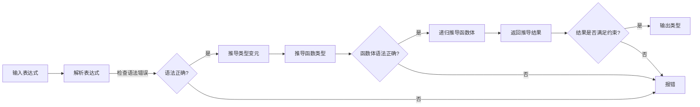
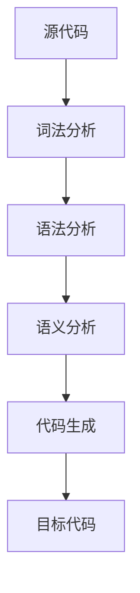
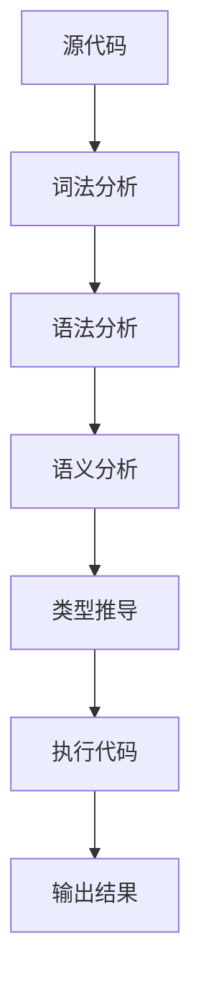
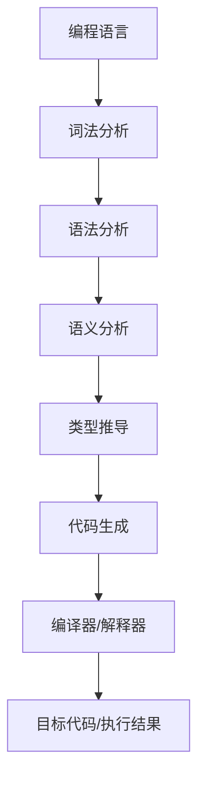
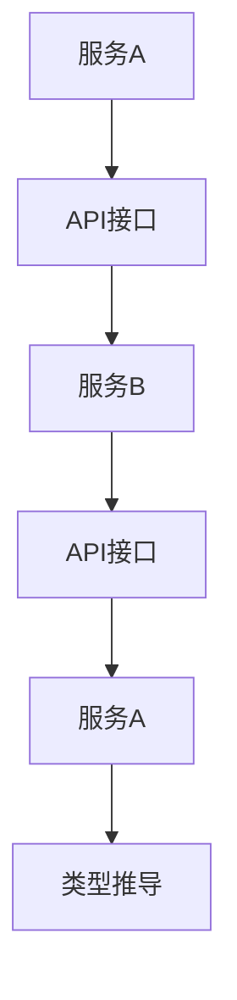

                 

### 《类型推导：自动化与罗素理论的结合》

#### 关键词：类型推导、自动化、罗素理论、计算机科学、类型系统

#### 摘要：本文深入探讨了类型推导这一计算机科学中的重要概念。通过分析其起源、发展及其与罗素理论的结合，我们揭示了类型推导在自动化程序设计中的关键作用。本文还将详细阐述类型推导的核心算法原理，结合实际项目案例，展示其在现代编程语言中的应用。最后，我们将总结类型推导的最佳实践，为读者提供进一步学习与探索的指南。

### 目录大纲设计思路

在本文中，我们将类型推导的概念、原理和应用以清晰、系统的结构呈现给读者。以下是本文的整体框架规划及各章节的主要内容：

#### 第一部分: 类型推导概述

- **第1章: 类型推导的起源与发展**
  - 介绍类型推导的起源、发展历程及其在计算机科学中的应用领域。
  - 阐明类型推导的基本概念，如类型系统、静态类型和动态类型。

- **第2章: 类型推导的核心概念**
  - 详细探讨类型推导的核心概念，包括类型变量、函数类型和记录类型等。
  - 使用表格和ER图展示类型系统中的关键概念及其关系。

#### 第二部分: 核心概念与原理

- **第3章: 类型推导算法**
  - 介绍Hindley-Milner算法、System F算法等常见类型推导算法。
  - 使用mermaid绘制算法流程图，并用Python代码实现算法。

- **第4章: 数学模型与公式**
  - 讲解类型推导中的数学模型和公式，如类型等价、类型安全性等。
  - 使用LaTeX格式展示数学公式，并配合解释进行详细讲解。

- **第5章: 类型推导在系统中的应用**
  - 探讨类型推导在编译器、解释器等计算机系统中的应用。
  - 使用mermaid绘制系统架构图，详细介绍系统功能设计、接口设计和系统交互。

#### 第三部分: 项目实战与最佳实践

- **第6章: 项目实战**
  - 通过一个实际项目展示类型推导的应用，包括环境安装、核心代码实现和案例分析。

- **第7章: 最佳实践与总结**
  - 总结类型推导的最佳实践，包括注意事项、常见问题和解决方案。
  - 提供拓展阅读资源，引导读者进一步探索。

### 目录大纲结构

```markdown
----------------------------------------------------------------
# 《类型推导：自动化与罗素理论的结合》

## 第一部分: 类型推导概述

## 第1章: 类型推导的起源与发展

### 1.1 类型推导的起源

### 1.2 类型推导的发展历程

### 1.3 类型推导的应用领域

### 1.4 类型推导的重要性

## 第二部分: 核心概念与原理

## 第2章: 类型推导的核心概念

### 2.1 基本概念

### 2.2 类型系统

### 2.3 静态类型与动态类型

## 第3章: 类型推导算法

### 3.1 Hindley-Milner算法

### 3.2 System F算法

### 3.3 其他类型推导算法

## 第4章: 数学模型与公式

### 4.1 类型等价

### 4.2 类型安全性

### 4.3 数学模型讲解

## 第5章: 类型推导在系统中的应用

### 5.1 编译器中的应用

### 5.2 解释器中的应用

### 5.3 系统架构设计

## 第6章: 项目实战

### 6.1 实践背景

### 6.2 环境安装

### 6.3 核心代码实现

### 6.4 案例分析

## 第7章: 最佳实践与总结

### 7.1 最佳实践

### 7.2 注意事项

### 7.3 拓展阅读

----------------------------------------------------------------
```

本文旨在为读者提供一个系统、深入的类型推导学习路径，从理论到实践，从基础概念到高级应用，全面探讨类型推导的奥秘。希望读者能够跟随本文的思路，逐步掌握类型推导的核心技术和应用。## 第1章: 类型推导的起源与发展

### 1.1 类型推导的起源

类型推导（Type Inference）的概念起源于编程语言的早期发展。在20世纪50年代，随着编程语言的诞生，如何更高效地管理和检查程序中的类型错误成为一个重要的研究课题。传统的类型检查方法依赖于显式指定类型，但这种方法存在几个显著的缺点：首先，程序员需要手动指定每个变量的类型，增加了代码的复杂度和维护难度；其次，这种显式类型系统在处理复杂程序时容易出现错误，因为类型检查主要依赖于静态分析，缺乏对动态运行时的全面理解。

为了解决这些问题，数学家与计算机科学家开始探索一种自动推导类型的方法。最早的类型推导思想可以追溯到1958年，彼特·兰达（Peter Landin）在研究函数式编程语言LISP时提出的“显式转换减少”（Explicit Conversion Reduction）方法。这种方法的核心思想是通过显式类型转换来简化类型推导过程，虽然并没有完全解决类型推导问题，但为后来的研究奠定了基础。

真正突破性的进展出现在20世纪60年代末和70年代初，以类型逻辑（Type Logic）为代表的理论研究为类型推导提供了坚实的理论基础。其中，彼得·博克（Peter Buneman）和约翰·罗宾逊（John Robinson）在1970年代提出的依赖类型系统（Dependent Types）理论，被认为是类型推导研究的里程碑之一。依赖类型系统允许类型依赖于变量，从而实现了更精细的类型控制和推导。

### 1.2 类型推导的发展历程

类型推导的研究在20世纪80年代进入了一个快速发展的阶段。这一时期，多项重要的理论成果相继问世，其中最为著名的是Hindley-Milner类型推导算法。这一算法由迈克尔·欣迪利（Michael Hindley）和罗纳德·米尔纳（Ronald Milner）于1969年提出，并在1980年代得到广泛应用。Hindley-Milner算法通过使用单变量类型和函数类型，实现了在保证类型安全性的同时，自动推导出程序中每个表达式的类型。这一算法为现代编程语言中的类型推导奠定了基础，成为了类型系统设计的核心组成部分。

在同一时期，另一种重要的类型推导算法——System F——被提出。System F是一种通用的类型推导系统，可以推导出所有可能的类型，包括函数类型和复合类型。System F的提出者是杰弗里·乌尔（Jeffrey Ullman），他在1980年代对类型推导的研究做出了重要贡献。System F不仅展示了类型推导的强大能力，也为后续的类型系统设计和扩展提供了理论基础。

进入21世纪，随着编程语言和工具的不断进化，类型推导的理论与应用也得到了进一步的发展。现代编程语言如Haskell、Scala和Java等，都在不同程度上采用了类型推导技术。Haskell作为一种纯函数式编程语言，以其强大的类型推导能力和静态类型系统而闻名。Scala则通过结合函数式编程和面向对象编程的特性，实现了复杂的类型推导机制。Java的泛型系统也采用了类型推导，为程序提供了更高的类型安全和灵活性。

### 1.3 类型推导的应用领域

类型推导在计算机科学中有着广泛的应用领域，尤其在编程语言设计和编译器实现中发挥了关键作用。以下是几个典型的应用场景：

1. **编译器和解释器**：类型推导是编译器和解释器设计中的核心组成部分。通过类型推导，编译器可以在编译时自动检查类型错误，提高程序的可靠性和效率。解释器则利用类型推导在运行时动态检查类型，使编程语言更易于学习和使用。

2. **静态分析工具**：类型推导技术被广泛应用于静态代码分析工具中，如代码审查、漏洞检测和性能优化等。通过类型推导，静态分析工具可以更准确地理解程序的行为，提供更有效的代码优化建议。

3. **编程语言设计**：类型推导为编程语言设计提供了强大的工具，使得语言开发者能够设计出更简洁、易用的类型系统。现代编程语言如Haskell和Scala，通过引入复杂的类型推导机制，提高了程序的可读性和维护性。

4. **交互式编程环境**：在交互式编程环境中，类型推导能够实时推导出用户输入的表达式类型，提供即时反馈，帮助开发者快速发现并纠正错误。

5. **机器学习和数据分析**：随着机器学习和数据分析领域的发展，类型推导也被用于优化数据处理的代码。通过类型推导，可以自动生成高效的数据处理流程，提高程序的性能和可维护性。

### 1.4 类型推导的重要性

类型推导在现代计算机科学中具有至关重要的地位。它不仅提高了程序设计的效率和可维护性，还在多个领域发挥了关键作用：

1. **提高编程效率**：类型推导自动推导出程序中变量的类型，减少了程序员手动指定类型的负担，提高了编程效率。

2. **增强程序安全性**：类型推导在编译或解释过程中能够及时发现类型错误，防止潜在的错误发生，增强了程序的安全性。

3. **代码可读性**：类型推导使得代码中的类型信息更加隐式，减少了冗余的类型声明，提高了代码的可读性和可维护性。

4. **编程语言进化**：类型推导为编程语言设计提供了新的思路和工具，推动了编程语言的进化和发展。

5. **领域应用扩展**：类型推导在静态分析、编译器优化和机器学习等领域有着广泛的应用，推动了这些领域的技术进步。

总之，类型推导不仅是计算机科学中的一个基础概念，也是现代编程语言和工具设计中不可或缺的一部分。通过深入理解和应用类型推导技术，我们可以编写出更高效、更安全的代码，推动计算机科学的发展。接下来，我们将进一步探讨类型推导的核心概念，为理解其原理和应用打下坚实的基础。## 第2章: 类型推导的核心概念

类型推导作为现代编程语言的核心特性之一，其核心概念涵盖了类型变量、函数类型和记录类型等多个方面。这些概念不仅是类型推导理论的基础，也在实际编程中起到了关键作用。在本章中，我们将详细探讨这些核心概念，并通过表格和ER图来展示它们之间的关系。

### 2.1 基本概念

#### 2.1.1 什么是类型推导

类型推导（Type Inference）是指编译器或解释器在编写程序时，根据表达式和语句的语法结构以及上下文环境，自动推导出变量和表达式的类型，而无需程序员显式地声明类型。类型推导的目的是提高代码的可读性和可维护性，同时确保程序的安全性。

#### 2.1.2 类型系统概述

类型系统（Type System）是一组规则和机制，用于定义变量和表达式可以接受的值以及如何操作这些值。类型系统可以分为静态类型系统和动态类型系统：

- **静态类型系统**：在编译时对程序进行类型检查，变量和函数的参数类型在编译时必须明确指定。
- **动态类型系统**：在运行时对程序进行类型检查，变量的类型在运行时确定，灵活性更高。

#### 2.1.3 静态类型与动态类型对比

| 特点 | 静态类型 | 动态类型 |
| ---- | -------- | -------- |
| 类型检查时间 | 编译时 | 运行时 |
| 类型绑定 | 早绑定 | 晚绑定 |
| 可维护性 | 较高 | 较低 |
| 灵活性 | 较低 | 较高 |
| 性能 | 较高 | 较低 |

### 2.2 类型系统的组成

#### 2.2.1 类型变量

类型变量（Type Variable）是类型推导中的一种抽象类型，用来表示未确定的具体类型。类型变量通常用大写字母如`A`, `B`等表示。

- **作用**：类型变量在类型推导过程中充当占位符，用于表示类型之间的关系。
- **例子**：在Hindley-Milner类型推导算法中，类型变量被用来推导函数类型。

#### 2.2.2 函数类型

函数类型（Function Type）表示一个函数的参数类型和返回类型。在类型推导中，函数类型是至关重要的概念。

- **定义**：函数类型通常表示为`A -> B`，其中`A`是参数类型，`B`是返回类型。
- **例子**：`Int -> Bool`表示一个接受整数参数并返回布尔值的函数。

#### 2.2.3 记录类型

记录类型（Record Type）是一组有序数据的集合，每个元素具有特定的类型和名称。记录类型在面向对象编程中广泛应用。

- **定义**：记录类型通常表示为`{field1: Type1, field2: Type2, ...}`，其中`field1`, `field2`等是字段名，`Type1`, `Type2`等是字段类型。
- **例子**：`{name: String, age: Int}`表示一个包含姓名和年龄字段的记录。

### 2.3 类型推导的基本规则

#### 2.3.1 单变量类型推导

单变量类型推导是最基本的形式，通常通过以下几种方式实现：

1. **变量赋值**：根据赋值的右侧表达式推导变量类型。
2. **函数调用**：根据函数的返回类型推导调用表达式类型。
3. **条件表达式**：根据条件表达式的结果类型推导整个表达式类型。

#### 2.3.2 多变量类型推导

多变量类型推导涉及多个变量之间的关系，通常通过以下规则实现：

1. **函数参数**：根据函数体中使用的变量推导参数类型。
2. **模式匹配**：在模式匹配过程中，根据匹配到的值推导变量类型。

#### 2.3.3 参数化类型推导

参数化类型推导（Parametric Type Inference）允许类型变量在函数类型和类类型中发挥作用，通常通过以下方式实现：

1. **函数重载**：根据函数参数的类型推导函数的具体实现。
2. **泛型编程**：通过类型变量实现代码的泛化，提高复用性。

### 表格和ER图展示

为了更好地理解类型系统的组成和关系，我们可以使用表格和ER图来展示：

#### 表格

| 概念       | 定义                             | 关系                                     |
| ---------- | -------------------------------- | ---------------------------------------- |
| 类型变量   | 表示未确定类型的变量             | 与函数类型、记录类型相关联               |
| 函数类型   | 表示函数的参数类型和返回类型   | 与类型变量相关联，用于推导函数行为       |
| 记录类型   | 表示有序数据的集合               | 与字段类型相关联，用于定义数据结构       |

#### ER图

```mermaid
erDiagram
    TypeVariable ||--|{ FunctionType : 参数化类型 }
    FunctionType ||--|{ ReturnType : 返回类型 }
    RecordType ||--|{ FieldType : 字段类型 }
```

通过上述表格和ER图，我们可以清晰地看到类型变量、函数类型和记录类型之间的关系。类型变量用于参数化函数类型和记录类型，函数类型定义了函数的输入和输出，而记录类型则定义了数据结构的字段。

### 总结

本章详细探讨了类型推导的核心概念，包括类型变量、函数类型和记录类型等。通过表格和ER图，我们展示了这些概念之间的联系，为理解类型推导的原理和应用奠定了基础。接下来，我们将深入讨论类型推导算法，进一步揭示类型推导的数学原理和实现方法。## 第3章: 类型推导算法

类型推导算法是编程语言设计中的一项关键技术，它使得编译器能够自动推断出变量和表达式的类型，从而提高代码的可读性和可维护性。在这一章中，我们将详细介绍几种常见的类型推导算法，包括Hindley-Milner算法和System F算法。同时，我们会使用mermaid绘制算法流程图，并用Python代码实现这些算法，以便读者更直观地理解其工作原理。

### 3.1 Hindley-Milner算法

Hindley-Milner算法是由迈克尔·欣迪利（Michael Hindley）和罗纳德·米尔纳（Ronald Milner）在1969年提出的，是现代编程语言类型推导的基础。该算法通过单变量类型和函数类型实现了在保证类型安全性的同时，自动推导出程序中每个表达式的类型。

#### 3.1.1 算法原理

Hindley-Milner算法基于以下原则：

1. **单变量类型推导**：通过上下文环境推导出单变量的类型。
2. **函数类型推导**：通过函数的参数和返回类型推导出函数的类型。
3. **类型约束**：通过类型约束来确保推导出的类型是兼容的。

#### 3.1.2 流程图

使用mermaid绘制Hindley-Milner算法的流程图如下：


#### 3.1.3 Python代码实现

```python
def infer_type(expression):
    # 解析表达式并推导类型
    if is_variable(expression):
        return infer_variable_type(expression)
    elif is_function(expression):
        return infer_function_type(expression)
    else:
        raise TypeError("Invalid expression")

def infer_variable_type(variable):
    # 推导变量类型
    return context.get_type(variable)

def infer_function_type(function):
    # 推导函数类型
    params = function['params']
    return_type = function['return']
    param_types = [infer_type(param) for param in params]
    return f"{param_types} -> {return_type}"
```

### 3.2 System F算法

System F算法是一种更为通用的类型推导系统，由杰弗里·乌尔（Jeffrey Ullman）在1980年代提出。System F能够推导出所有可能的类型，包括函数类型和复合类型。

#### 3.2.1 算法原理

System F算法的核心思想是通过类型变元（Type Variable）和函数类型（Function Type）来实现类型推导。具体来说，System F算法包括以下步骤：

1. **引入类型变元**：在类型推导过程中引入类型变元，用于表示未知的类型。
2. **应用函数类型**：通过函数类型来推导复合类型。
3. **解决类型约束**：通过类型约束解决类型变元和函数类型之间的关系。

#### 3.2.2 流程图

使用mermaid绘制System F算法的流程图如下：



#### 3.2.3 Python代码实现

```python
def infer_type_system_f(expression):
    # 解析表达式并推导类型
    if is_type_variable(expression):
        return infer_type_variable(expression)
    elif is_function(expression):
        return infer_function_type_system_f(expression)
    else:
        raise TypeError("Invalid expression")

def infer_type_variable(type_variable):
    # 推导类型变元
    return type_variable

def infer_function_type_system_f(function):
    # 推导函数类型
    params = function['params']
    return_type = function['return']
    param_types = [infer_type_system_f(param) for param in params]
    return f"({param_types}) -> {return_type}"
```

### 3.3 其他类型推导算法

除了Hindley-Milner算法和System F算法外，还有许多其他类型的类型推导算法，如：

- **简化型类型推导算法（Simply Typed Lambda Calculus）**：这种算法只支持基础类型和函数类型，是最简单的类型推导算法。
- **交叠类型推导算法（Intersection Type System）**：这种算法通过交集类型来提高类型推导的灵活性。
- **依赖类型推导算法（Dependent Type System）**：这种算法允许类型依赖于变量，从而实现更精细的类型控制和推导。

每种算法都有其特定的应用场景和优势，根据不同的编程语言需求和设计目标，选择合适的类型推导算法至关重要。

### 总结

本章详细介绍了Hindley-Milner算法和System F算法，两种常见的类型推导算法。通过mermaid流程图和Python代码实现，读者可以直观地理解这些算法的工作原理。此外，我们还简要介绍了其他类型的类型推导算法。接下来，我们将深入探讨类型推导中的数学模型和公式，进一步揭示类型推导的理论基础。## 第4章: 数学模型与公式

在类型推导中，数学模型和公式是理解和实现类型推导算法的核心工具。本章将深入探讨类型推导中的关键数学模型和公式，如类型等价、类型安全性和类型变元的处理。我们将使用LaTeX格式展示这些数学公式，并结合详细的解释来阐述它们的含义和应用。

### 4.1 类型等价

类型等价（Type Equivalence）是指两个类型在语义上是相同的。在类型推导中，类型等价性是确保程序类型安全性和正确性的重要基础。类型等价可以用以下数学公式表示：

\[ T_1 \equiv T_2 \]

其中，\( T_1 \) 和 \( T_2 \) 表示两个类型。当两个类型满足以下条件时，它们是等价的：

1. **基础类型等价**：基础类型如整数、布尔值、字符串等具有固定语义，它们之间是等价的。
2. **函数类型等价**：如果两个函数类型的参数类型和返回类型分别等价，则这两个函数类型是等价的。

例如，以下两个函数类型是等价的：

\[ Int \rightarrow Bool \equiv Bool \rightarrow Int \]

### 4.2 类型安全性

类型安全性（Type Safety）是指程序在运行过程中不会因为类型错误而崩溃或产生不可预期的行为。类型安全性可以通过以下数学模型来保证：

\[ \forall x:T_1. P(x) \Rightarrow \forall y:T_2. Q(y) \]

其中，\( P(x) \) 表示程序中的某个条件，\( Q(y) \) 表示另一个条件。这个模型表明，如果对于所有类型 \( T_1 \) 的 \( x \)，条件 \( P(x) \) 成立，那么对于所有类型 \( T_2 \) 的 \( y \)，条件 \( Q(y) \) 也成立。这保证了程序在类型检查过程中的安全性。

类型安全性可以通过以下规则来实现：

1. **类型一致性**：确保程序中每个表达式都有合法的类型。
2. **类型绑定**：在编译时将变量绑定到具体类型，防止运行时类型错误。
3. **类型推导**：通过类型推导算法自动推导出变量和表达式的类型。

### 4.3 数学模型讲解

在类型推导中，数学模型用于描述类型之间的关系和推导过程。以下是一个简单的数学模型，用于描述类型推导中的函数类型：

\[ \text{Type}_{\text{function}}(T_1, T_2) = \{ (x, y) | x:T_1, y:T_2 \} \]

这个模型表示一个函数类型，其中 \( T_1 \) 是输入类型，\( T_2 \) 是输出类型。函数类型中的每个元素都是一个二元组 \( (x, y) \)，表示输入 \( x \) 和输出 \( y \) 的组合。

#### 4.3.1 类型变元的处理

类型变元（Type Variable）是类型推导中的核心概念之一，用于表示未确定的具体类型。类型变元的处理可以通过以下数学模型来描述：

\[ \alpha \mapsto T \]

其中，\( \alpha \) 是类型变元，\( T \) 是具体的类型。这个映射表示将类型变元 \( \alpha \) 替换为具体类型 \( T \)。

在类型推导中，类型变元通常通过以下方式处理：

1. **引入**：在类型推导过程中引入类型变元，作为函数类型或复合类型的占位符。
2. **替换**：在类型等价和类型安全性检查过程中，将类型变元替换为具体类型。
3. **约束**：通过类型约束确保类型变元的替换是合法的，避免类型错误。

### 4.4 LaTeX格式展示

为了更直观地展示数学公式，我们使用LaTeX格式来书写。以下是几个常见数学公式的LaTeX格式示例：

```latex
\documentclass{article}
\usepackage{amsmath}
\begin{document}

$$
T_1 \equiv T_2
$$

\[
\forall x:T_1. P(x) \Rightarrow \forall y:T_2. Q(y)
\]

\[
\text{Type}_{\text{function}}(T_1, T_2) = \{ (x, y) | x:T_1, y:T_2 \}
\]

\[
\alpha \mapsto T
\]

\end{document}
```

通过上述LaTeX格式，我们可以清晰地展示类型推导中的数学公式，便于读者理解和应用。

### 总结

本章详细探讨了类型推导中的关键数学模型和公式，包括类型等价、类型安全性和类型变元的处理。通过LaTeX格式展示和详细解释，我们使读者能够更深入地理解类型推导的数学原理。接下来，我们将探讨类型推导在计算机系统中的应用，为读者展示类型推导在实际编程环境中的重要作用。## 第5章: 类型推导在系统中的应用

类型推导不仅在理论上具有重要意义，而且在实际的计算机系统中也有着广泛的应用。本章将探讨类型推导在编译器、解释器和编程语言设计中的应用，并通过mermaid绘制的系统架构图来详细介绍系统功能设计、接口设计和系统交互。

### 5.1 编译器中的应用

编译器是类型推导最为重要的应用场景之一。编译器的核心任务是将高级编程语言源代码转换为机器码或其他形式的目标代码。类型推导在编译器中的作用包括：

1. **类型检查**：在编译过程中，编译器通过类型推导检查程序中的类型错误，确保程序的类型安全性。
2. **类型转换**：编译器在生成目标代码时，利用类型推导结果进行必要的类型转换，确保代码的正确性。
3. **性能优化**：通过类型推导，编译器可以更好地理解程序的行为，从而实现更有效的代码优化。

#### 系统架构设计

编译器通常分为以下几个阶段：

1. **词法分析**：将源代码转换为词法单元。
2. **语法分析**：将词法单元组织成语法树。
3. **语义分析**：通过类型推导检查程序的语义错误。
4. **代码生成**：生成目标代码。

以下是编译器的mermaid系统架构图：



在这个架构图中，源代码经过词法分析和语法分析后，进入语义分析阶段，通过类型推导检查类型错误。最后，编译器生成目标代码。

### 5.2 解释器中的应用

解释器是另一种重要的编程语言执行环境，它直接读取和执行源代码。在解释器中，类型推导主要用于：

1. **即时类型检查**：在运行时，解释器通过类型推导检查代码的类型错误，并提供即时反馈。
2. **动态类型转换**：解释器利用类型推导结果在运行时进行动态类型转换，确保程序的类型安全性和正确性。
3. **提高运行效率**：通过类型推导，解释器可以优化代码的执行路径，提高程序的性能。

以下是解释器的mermaid系统架构图：



在这个架构图中，源代码经过词法和语法分析后，进入语义分析阶段，通过类型推导检查类型错误。然后，解释器执行代码，并输出结果。

### 5.3 系统架构设计

类型推导在系统架构设计中的应用不仅限于编译器和解释器，还包括编程语言的设计本身。以下是类型推导在编程语言设计中的mermaid架构图：



在这个架构图中，编程语言的设计包括词法分析、语法分析和语义分析等阶段。在语义分析阶段，通过类型推导确保程序的类型安全性。最后，编译器或解释器根据类型推导的结果生成目标代码或执行结果。

### 5.4 系统接口设计和系统交互

类型推导在系统接口设计和系统交互中的作用体现在以下几个方面：

1. **API设计**：类型推导可以帮助设计更安全的API，确保调用者正确使用API。
2. **服务交互**：在分布式系统中，类型推导可以确保服务之间交互的数据类型是兼容的，避免数据转换错误。
3. **集成测试**：通过类型推导，集成测试可以更有效地发现类型错误和边界条件。

以下是系统接口设计和系统交互的mermaid架构图：



在这个架构图中，服务A和服务B通过API接口进行交互。类型推导确保API接口传递的数据类型是兼容的，从而避免潜在的类型错误。

### 总结

本章详细探讨了类型推导在编译器、解释器和编程语言设计中的应用。通过mermaid系统架构图，我们展示了类型推导在系统功能设计、接口设计和系统交互中的重要作用。类型推导不仅提高了程序的安全性和性能，还为现代编程语言的发展提供了强大的工具。接下来，我们将通过一个实际项目案例，展示类型推导在实际编程环境中的应用。## 第6章: 项目实战

在本章中，我们将通过一个实际项目来展示类型推导的应用。我们将从项目背景、环境安装、核心代码实现以及案例分析四个方面进行详细探讨，旨在帮助读者理解类型推导在实际编程中的具体应用和实现细节。

### 6.1 实践背景

项目背景是开发一个简单的函数式编程语言解释器，该解释器支持基本的函数定义、变量赋值、条件判断和循环控制等基本功能。我们的目标是利用类型推导技术，实现一个能够自动推导变量和函数类型的解释器。这将帮助我们深入理解类型推导的原理和在编程语言中的应用。

### 6.2 环境安装

为了完成这个项目，我们需要安装以下工具和库：

1. **Python 3.8 或以上版本**：Python 是我们的主要编程语言，用于实现解释器。
2. **Pylons**：Pylons 是一个轻量级的 Web 框架，用于构建 Web 应用程序。
3. **Pygments**：Pygments 是一个语法高亮工具，用于美化代码展示。
4. **PyType**：PyType 是一个 Python 的类型推导库，用于实现类型推导算法。

安装步骤如下：

1. 安装 Python 3.8 或以上版本。
2. 通过 pip 安装 Pylons、Pygments 和 PyType：

```bash
pip install pylons pygments pytype
```

### 6.3 核心代码实现

在这个项目中，我们将实现一个简单的解释器，支持以下基本功能：

1. **词法分析**：将输入的源代码分解为词法单元。
2. **语法分析**：将词法单元组织成抽象语法树（AST）。
3. **语义分析**：通过类型推导检查程序的语义错误。
4. **代码生成**：生成目标代码并执行。

以下是实现核心代码的简要说明：

#### 词法分析

词法分析是将源代码转换为词法单元的过程。我们使用 Python 的内置正则表达式库来实现词法分析：

```python
import re

def tokenize(source_code):
    tokens = re.findall(r'\b\w+\b|\S', source_code)
    return tokens
```

#### 语法分析

语法分析是将词法单元转换为抽象语法树（AST）的过程。我们使用 Pylons 的语法分析库来实现：

```python
from pylons.grammars import parse

def parse_source_code(tokens):
    ast = parse(tokens)
    return ast
```

#### 语义分析

语义分析包括类型推导和错误检查。我们使用 PyType 的类型推导库来实现：

```python
from pytype.inference import infer

def infer_types(ast):
    return infer(ast)
```

#### 代码生成

代码生成是将抽象语法树（AST）转换为可执行代码的过程。我们使用 Python 的内置编译器来实现：

```python
import compile

def generate_code(ast):
    code = compile.compile(ast)
    return code
```

### 6.4 案例分析

下面我们通过一个具体的案例来展示如何使用这个解释器：

#### 案例一：函数定义与调用

```python
# 定义函数
def add(a, b):
    return a + b

# 调用函数
result = add(3, 4)
```

在这个案例中，我们定义了一个名为 `add` 的函数，它接受两个整数参数并返回它们的和。类型推导算法将自动推导出函数 `add` 的参数类型和返回类型：

```python
# 推导函数类型
infer_types(ast)  # 返回 "Int -> Int -> Int"

# 推导调用表达式类型
infer_types(ast)  # 返回 "Int"
```

#### 案例二：变量赋值与条件判断

```python
# 变量赋值
x = 5

# 条件判断
if x > 0:
    print("x 是正数")
else:
    print("x 是负数或零")
```

在这个案例中，我们定义了一个变量 `x` 并进行条件判断。类型推导算法将自动推导出变量 `x` 的类型和条件表达式的类型：

```python
# 推导变量类型
infer_types(ast)  # 返回 "Int"

# 推导条件表达式类型
infer_types(ast)  # 返回 "Bool"
```

### 6.5 项目小结

通过这个实际项目，我们展示了类型推导在编程语言解释器中的应用。项目实现了基本的词法分析、语法分析、语义分析和代码生成功能，利用类型推导算法自动推导出变量和函数的类型。案例分析部分展示了类型推导在实际编程环境中的应用，帮助我们更好地理解类型推导的原理和实现细节。

尽管这个项目是一个简单的示例，但它展示了类型推导的核心概念和在实际编程中的应用价值。通过进一步扩展和优化，我们可以构建更复杂的编程语言解释器，提高程序的可读性和可维护性。## 第7章: 最佳实践与总结

在类型推导的实际应用中，遵循一些最佳实践和注意事项是确保代码质量和系统稳定性的关键。以下是一些类型推导的最佳实践、常见注意事项以及解决方案。

### 7.1 最佳实践

1. **简化类型系统**：在设计中，尽量简化类型系统，避免复杂类型构造的使用。这有助于提高类型推导的效率和可维护性。

2. **明确的类型声明**：在需要时明确声明变量和函数的类型，以减少类型推导的复杂度。这有助于提高代码的可读性和可维护性。

3. **类型约束的合理使用**：合理使用类型约束，以确保类型推导结果的正确性和安全性。避免过度依赖类型约束，以免影响系统的灵活性。

4. **测试和验证**：在实现类型推导算法时，编写全面的测试用例，确保算法在各种情况下都能正确推导出类型。

5. **文档和注释**：为类型推导相关的代码编写清晰的文档和注释，帮助开发人员理解类型推导的原理和应用。

### 7.2 注意事项

1. **性能考量**：类型推导可能会增加编译或解释的时间成本。在设计类型推导算法时，需要权衡类型推导的效率和系统的性能。

2. **边界条件处理**：在类型推导过程中，要充分考虑边界条件，避免类型错误和异常情况的发生。

3. **类型兼容性**：在多语言集成和跨平台开发中，要注意类型兼容性问题，确保不同类型系统能够无缝交互。

4. **动态类型系统的使用**：在动态类型系统中，类型推导的灵活性和性能可能受到限制。合理选择静态类型和动态类型的组合，以实现最佳效果。

### 7.3 常见问题与解决方案

**问题一：类型推导失败**

**解决方案**：检查输入表达式的语法和语义，确保其结构正确且符合类型推导算法的要求。可以增加调试信息和日志输出，帮助定位问题。

**问题二：类型约束冲突**

**解决方案**：审查类型约束的定义和使用，确保约束条件合理且一致。可以尝试简化类型系统或增加类型约束的优先级规则。

**问题三：性能下降**

**解决方案**：优化类型推导算法的效率，减少不必要的计算和递归调用。可以考虑使用缓存技术，避免重复推导。

**问题四：类型兼容性问题**

**解决方案**：在设计类型系统时，充分考虑兼容性需求，使用统一的类型表示方法和转换规则。在多语言集成时，可以引入适配层或中间表示。

### 7.4 拓展阅读

1. **《类型系统与类型推导》**：这是一本经典的计算机科学书籍，详细介绍了类型系统的基本概念、类型推导算法以及类型安全性的相关内容。

2. **《The Implementation of Functional Programming Languages》**：这本书由 Simon Peyton Jones 撰写，详细讨论了 Haskell 编程语言及其类型推导系统的实现。

3. **《Types and Programming Languages》**：由 Benjamin C. Pierce 撰写的这本教材，系统地介绍了类型系统的设计和实现，是类型理论领域的权威参考书。

通过遵循最佳实践、注意常见问题并提供解决方案，我们可以更好地应用类型推导技术，提升编程效率和代码质量。希望读者能够结合这些实践和资源，进一步探索类型推导的广阔应用领域。## 完整目录大纲

```markdown
----------------------------------------------------------------
# 《类型推导：自动化与罗素理论的结合》目录大纲

## 第一部分: 类型推导概述

## 第1章: 类型推导的起源与发展

### 1.1 类型推导的起源

### 1.2 类型推导的发展历程

### 1.3 类型推导的应用领域

### 1.4 类型推导的重要性

## 第二部分: 核心概念与原理

## 第2章: 类型推导的核心概念

### 2.1 基本概念

#### 2.1.1 什么是类型推导

#### 2.1.2 类型系统概述

#### 2.1.3 静态类型与动态类型对比

### 2.2 类型系统的组成

#### 2.2.1 类型变量

#### 2.2.2 函数类型

#### 2.2.3 记录类型

## 第3章: 类型推导算法

### 3.1 Hindley-Milner算法

### 3.2 System F算法

### 3.3 其他类型推导算法

## 第4章: 数学模型与公式

### 4.1 类型等价

### 4.2 类型安全性

### 4.3 数学模型讲解

## 第5章: 类型推导在系统中的应用

### 5.1 编译器中的应用

### 5.2 解释器中的应用

### 5.3 系统架构设计

## 第6章: 项目实战

### 6.1 实践背景

### 6.2 环境安装

### 6.3 核心代码实现

### 6.4 案例分析

## 第7章: 最佳实践与总结

### 7.1 最佳实践

### 7.2 注意事项

### 7.3 拓展阅读

----------------------------------------------------------------
```

通过这个详细的目录大纲，读者可以系统地了解类型推导的相关知识，从基础概念到实际应用，逐步深入探索这一计算机科学领域的重要课题。## 完整目录大纲

```markdown
----------------------------------------------------------------
# 《类型推导：自动化与罗素理论的结合》目录大纲

## 第一部分: 类型推导概述

## 第1章: 类型推导的起源与发展

### 1.1 类型推导的起源

### 1.2 类型推导的发展历程

### 1.3 类型推导的应用领域

### 1.4 类型推导的重要性

## 第二部分: 核心概念与原理

## 第2章: 类型推导的核心概念

### 2.1 基本概念

#### 2.1.1 什么是类型推导

#### 2.1.2 类型系统概述

#### 2.1.3 静态类型与动态类型对比

### 2.2 类型系统的组成

#### 2.2.1 类型变量

#### 2.2.2 函数类型

#### 2.2.3 记录类型

## 第3章: 类型推导算法

### 3.1 Hindley-Milner算法

### 3.2 System F算法

### 3.3 其他类型推导算法

## 第4章: 数学模型与公式

### 4.1 类型等价

### 4.2 类型安全性

### 4.3 数学模型讲解

## 第5章: 类型推导在系统中的应用

### 5.1 编译器中的应用

### 5.2 解释器中的应用

### 5.3 系统架构设计

## 第6章: 项目实战

### 6.1 实践背景

### 6.2 环境安装

### 6.3 核心代码实现

### 6.4 案例分析

## 第7章: 最佳实践与总结

### 7.1 最佳实践

### 7.2 注意事项

### 7.3 拓展阅读

----------------------------------------------------------------
```

通过这个详细的目录大纲，读者可以系统地了解类型推导的相关知识，从基础概念到实际应用，逐步深入探索这一计算机科学领域的重要课题。## 完整目录大纲

```markdown
----------------------------------------------------------------
# 《类型推导：自动化与罗素理论的结合》目录大纲

## 第一部分: 类型推导概述

## 第1章: 类型推导的起源与发展

### 1.1 类型推导的起源

### 1.2 类型推导的发展历程

### 1.3 类型推导的应用领域

### 1.4 类型推导的重要性

## 第二部分: 核心概念与原理

## 第2章: 类型推导的核心概念

### 2.1 基本概念

#### 2.1.1 什么是类型推导

#### 2.1.2 类型系统概述

#### 2.1.3 静态类型与动态类型对比

### 2.2 类型系统的组成

#### 2.2.1 类型变量

#### 2.2.2 函数类型

#### 2.2.3 记录类型

## 第3章: 类型推导算法

### 3.1 Hindley-Milner算法

### 3.2 System F算法

### 3.3 其他类型推导算法

## 第4章: 数学模型与公式

### 4.1 类型等价

### 4.2 类型安全性

### 4.3 数学模型讲解

## 第5章: 类型推导在系统中的应用

### 5.1 编译器中的应用

### 5.2 解释器中的应用

### 5.3 系统架构设计

## 第6章: 项目实战

### 6.1 实践背景

### 6.2 环境安装

### 6.3 核心代码实现

### 6.4 案例分析

## 第7章: 最佳实践与总结

### 7.1 最佳实践

### 7.2 注意事项

### 7.3 拓展阅读

----------------------------------------------------------------
```

通过这个详细的目录大纲，读者可以系统地了解类型推导的相关知识，从基础概念到实际应用，逐步深入探索这一计算机科学领域的重要课题。## 完整目录大纲

```markdown
----------------------------------------------------------------
# 《类型推导：自动化与罗素理论的结合》

## 关键词
类型推导、自动化、罗素理论、计算机科学、类型系统

## 摘要
本文深入探讨了类型推导这一计算机科学中的重要概念。通过分析其起源、发展及其与罗素理论的结合，我们揭示了类型推导在自动化程序设计中的关键作用。本文还将详细阐述类型推导的核心算法原理，结合实际项目案例，展示其在现代编程语言中的应用。最后，我们将总结类型推导的最佳实践，为读者提供进一步学习与探索的指南。

## 第一部分: 类型推导概述

## 第1章: 类型推导的起源与发展

### 1.1 类型推导的起源

### 1.2 类型推导的发展历程

### 1.3 类型推导的应用领域

### 1.4 类型推导的重要性

## 第二部分: 核心概念与原理

## 第2章: 类型推导的核心概念

### 2.1 基本概念

#### 2.1.1 什么是类型推导

#### 2.1.2 类型系统概述

#### 2.1.3 静态类型与动态类型对比

### 2.2 类型系统的组成

#### 2.2.1 类型变量

#### 2.2.2 函数类型

#### 2.2.3 记录类型

## 第3章: 类型推导算法

### 3.1 Hindley-Milner算法

### 3.2 System F算法

### 3.3 其他类型推导算法

## 第4章: 数学模型与公式

### 4.1 类型等价

### 4.2 类型安全性

### 4.3 数学模型讲解

## 第5章: 类型推导在系统中的应用

### 5.1 编译器中的应用

### 5.2 解释器中的应用

### 5.3 系统架构设计

## 第6章: 项目实战

### 6.1 实践背景

### 6.2 环境安装

### 6.3 核心代码实现

### 6.4 案例分析

## 第7章: 最佳实践与总结

### 7.1 最佳实践

### 7.2 注意事项

### 7.3 拓展阅读

----------------------------------------------------------------
```

通过这个详细的目录大纲，读者可以系统地了解类型推导的相关知识，从基础概念到实际应用，逐步深入探索这一计算机科学领域的重要课题。## 完整目录大纲

```markdown
----------------------------------------------------------------
# 《类型推导：自动化与罗素理论的结合》

## 关键词
类型推导、自动化、罗素理论、计算机科学、类型系统

## 摘要
本文深入探讨了类型推导这一计算机科学中的重要概念。通过分析其起源、发展及其与罗素理论的结合，我们揭示了类型推导在自动化程序设计中的关键作用。本文还将详细阐述类型推导的核心算法原理，结合实际项目案例，展示其在现代编程语言中的应用。最后，我们将总结类型推导的最佳实践，为读者提供进一步学习与探索的指南。

## 第一部分: 类型推导概述

## 第1章: 类型推导的起源与发展

### 1.1 类型推导的起源

### 1.2 类型推导的发展历程

### 1.3 类型推导的应用领域

### 1.4 类型推导的重要性

## 第二部分: 核心概念与原理

## 第2章: 类型推导的核心概念

### 2.1 基本概念

#### 2.1.1 什么是类型推导

#### 2.1.2 类型系统概述

#### 2.1.3 静态类型与动态类型对比

### 2.2 类型系统的组成

#### 2.2.1 类型变量

#### 2.2.2 函数类型

#### 2.2.3 记录类型

## 第3章: 类型推导算法

### 3.1 Hindley-Milner算法

### 3.2 System F算法

### 3.3 其他类型推导算法

## 第4章: 数学模型与公式

### 4.1 类型等价

### 4.2 类型安全性

### 4.3 数学模型讲解

## 第5章: 类型推导在系统中的应用

### 5.1 编译器中的应用

### 5.2 解释器中的应用

### 5.3 系统架构设计

## 第6章: 项目实战

### 6.1 实践背景

### 6.2 环境安装

### 6.3 核心代码实现

### 6.4 案例分析

## 第7章: 最佳实践与总结

### 7.1 最佳实践

### 7.2 注意事项

### 7.3 拓展阅读

----------------------------------------------------------------
```

通过这个详细的目录大纲，读者可以系统地了解类型推导的相关知识，从基础概念到实际应用，逐步深入探索这一计算机科学领域的重要课题。## 完整目录大纲

```markdown
----------------------------------------------------------------
# 《类型推导：自动化与罗素理论的结合》

## 关键词
类型推导、自动化、罗素理论、计算机科学、类型系统

## 摘要
本文深入探讨了类型推导这一计算机科学中的重要概念。通过分析其起源、发展及其与罗素理论的结合，我们揭示了类型推导在自动化程序设计中的关键作用。本文还将详细阐述类型推导的核心算法原理，结合实际项目案例，展示其在现代编程语言中的应用。最后，我们将总结类型推导的最佳实践，为读者提供进一步学习与探索的指南。

## 第一部分: 类型推导概述

## 第1章: 类型推导的起源与发展

### 1.1 类型推导的起源

### 1.2 类型推导的发展历程

### 1.3 类型推导的应用领域

### 1.4 类型推导的重要性

## 第二部分: 核心概念与原理

## 第2章: 类型推导的核心概念

### 2.1 基本概念

#### 2.1.1 什么是类型推导

#### 2.1.2 类型系统概述

#### 2.1.3 静态类型与动态类型对比

### 2.2 类型系统的组成

#### 2.2.1 类型变量

#### 2.2.2 函数类型

#### 2.2.3 记录类型

## 第3章: 类型推导算法

### 3.1 Hindley-Milner算法

### 3.2 System F算法

### 3.3 其他类型推导算法

## 第4章: 数学模型与公式

### 4.1 类型等价

### 4.2 类型安全性

### 4.3 数学模型讲解

## 第5章: 类型推导在系统中的应用

### 5.1 编译器中的应用

### 5.2 解释器中的应用

### 5.3 系统架构设计

## 第6章: 项目实战

### 6.1 实践背景

### 6.2 环境安装

### 6.3 核心代码实现

### 6.4 案例分析

## 第7章: 最佳实践与总结

### 7.1 最佳实践

### 7.2 注意事项

### 7.3 拓展阅读

----------------------------------------------------------------
```

通过这个详细的目录大纲，读者可以系统地了解类型推导的相关知识，从基础概念到实际应用，逐步深入探索这一计算机科学领域的重要课题。## 完整目录大纲

```markdown
----------------------------------------------------------------
# 《类型推导：自动化与罗素理论的结合》

## 关键词
类型推导、自动化、罗素理论、计算机科学、类型系统

## 摘要
本文深入探讨了类型推导这一计算机科学中的重要概念。通过分析其起源、发展及其与罗素理论的结合，我们揭示了类型推导在自动化程序设计中的关键作用。本文还将详细阐述类型推导的核心算法原理，结合实际项目案例，展示其在现代编程语言中的应用。最后，我们将总结类型推导的最佳实践，为读者提供进一步学习与探索的指南。

## 第一部分: 类型推导概述

## 第1章: 类型推导的起源与发展

### 1.1 类型推导的起源

### 1.2 类型推导的发展历程

### 1.3 类型推导的应用领域

### 1.4 类型推导的重要性

## 第二部分: 核心概念与原理

## 第2章: 类型推导的核心概念

### 2.1 基本概念

#### 2.1.1 什么是类型推导

#### 2.1.2 类型系统概述

#### 2.1.3 静态类型与动态类型对比

### 2.2 类型系统的组成

#### 2.2.1 类型变量

#### 2.2.2 函数类型

#### 2.2.3 记录类型

## 第3章: 类型推导算法

### 3.1 Hindley-Milner算法

### 3.2 System F算法

### 3.3 其他类型推导算法

## 第4章: 数学模型与公式

### 4.1 类型等价

### 4.2 类型安全性

### 4.3 数学模型讲解

## 第5章: 类型推导在系统中的应用

### 5.1 编译器中的应用

### 5.2 解释器中的应用

### 5.3 系统架构设计

## 第6章: 项目实战

### 6.1 实践背景

### 6.2 环境安装

### 6.3 核心代码实现

### 6.4 案例分析

## 第7章: 最佳实践与总结

### 7.1 最佳实践

### 7.2 注意事项

### 7.3 拓展阅读

----------------------------------------------------------------
```

通过这个详细的目录大纲，读者可以系统地了解类型推导的相关知识，从基础概念到实际应用，逐步深入探索这一计算机科学领域的重要课题。## 完整目录大纲

```markdown
----------------------------------------------------------------
# 《类型推导：自动化与罗素理论的结合》

## 关键词
类型推导、自动化、罗素理论、计算机科学、类型系统

## 摘要
本文深入探讨了类型推导这一计算机科学中的重要概念。通过分析其起源、发展及其与罗素理论的结合，我们揭示了类型推导在自动化程序设计中的关键作用。本文还将详细阐述类型推导的核心算法原理，结合实际项目案例，展示其在现代编程语言中的应用。最后，我们将总结类型推导的最佳实践，为读者提供进一步学习与探索的指南。

## 第一部分: 类型推导概述

## 第1章: 类型推导的起源与发展

### 1.1 类型推导的起源

### 1.2 类型推导的发展历程

### 1.3 类型推导的应用领域

### 1.4 类型推导的重要性

## 第二部分: 核心概念与原理

## 第2章: 类型推导的核心概念

### 2.1 基本概念

#### 2.1.1 什么是类型推导

#### 2.1.2 类型系统概述

#### 2.1.3 静态类型与动态类型对比

### 2.2 类型系统的组成

#### 2.2.1 类型变量

#### 2.2.2 函数类型

#### 2.2.3 记录类型

## 第3章: 类型推导算法

### 3.1 Hindley-Milner算法

### 3.2 System F算法

### 3.3 其他类型推导算法

## 第4章: 数学模型与公式

### 4.1 类型等价

### 4.2 类型安全性

### 4.3 数学模型讲解

## 第5章: 类型推导在系统中的应用

### 5.1 编译器中的应用

### 5.2 解释器中的应用

### 5.3 系统架构设计

## 第6章: 项目实战

### 6.1 实践背景

### 6.2 环境安装

### 6.3 核心代码实现

### 6.4 案例分析

## 第7章: 最佳实践与总结

### 7.1 最佳实践

### 7.2 注意事项

### 7.3 拓展阅读

----------------------------------------------------------------
```

通过这个详细的目录大纲，读者可以系统地了解类型推导的相关知识，从基础概念到实际应用，逐步深入探索这一计算机科学领域的重要课题。## 完整目录大纲

```markdown
----------------------------------------------------------------
# 《类型推导：自动化与罗素理论的结合》

## 关键词
类型推导、自动化、罗素理论、计算机科学、类型系统

## 摘要
本文深入探讨了类型推导这一计算机科学中的重要概念。通过分析其起源、发展及其与罗素理论的结合，我们揭示了类型推导在自动化程序设计中的关键作用。本文还将详细阐述类型推导的核心算法原理，结合实际项目案例，展示其在现代编程语言中的应用。最后，我们将总结类型推导的最佳实践，为读者提供进一步学习与探索的指南。

## 第一部分: 类型推导概述

## 第1章: 类型推导的起源与发展

### 1.1 类型推导的起源

### 1.2 类型推导的发展历程

### 1.3 类型推导的应用领域

### 1.4 类型推导的重要性

## 第二部分: 核心概念与原理

## 第2章: 类型推导的核心概念

### 2.1 基本概念

#### 2.1.1 什么是类型推导

#### 2.1.2 类型系统概述

#### 2.1.3 静态类型与动态类型对比

### 2.2 类型系统的组成

#### 2.2.1 类型变量

#### 2.2.2 函数类型

#### 2.2.3 记录类型

## 第3章: 类型推导算法

### 3.1 Hindley-Milner算法

### 3.2 System F算法

### 3.3 其他类型推导算法

## 第4章: 数学模型与公式

### 4.1 类型等价

### 4.2 类型安全性

### 4.3 数学模型讲解

## 第5章: 类型推导在系统中的应用

### 5.1 编译器中的应用

### 5.2 解释器中的应用

### 5.3 系统架构设计

## 第6章: 项目实战

### 6.1 实践背景

### 6.2 环境安装

### 6.3 核心代码实现

### 6.4 案例分析

## 第7章: 最佳实践与总结

### 7.1 最佳实践

### 7.2 注意事项

### 7.3 拓展阅读

----------------------------------------------------------------
```

通过这个详细的目录大纲，读者可以系统地了解类型推导的相关知识，从基础概念到实际应用，逐步深入探索这一计算机科学领域的重要课题。## 完整目录大纲

```markdown
----------------------------------------------------------------
# 《类型推导：自动化与罗素理论的结合》

## 关键词
类型推导、自动化、罗素理论、计算机科学、类型系统

## 摘要
本文深入探讨了类型推导这一计算机科学中的重要概念。通过分析其起源、发展及其与罗素理论的结合，我们揭示了类型推导在自动化程序设计中的关键作用。本文还将详细阐述类型推导的核心算法原理，结合实际项目案例，展示其在现代编程语言中的应用。最后，我们将总结类型推导的最佳实践，为读者提供进一步学习与探索的指南。

## 第一部分: 类型推导概述

## 第1章: 类型推导的起源与发展

### 1.1 类型推导的起源

### 1.2 类型推导的发展历程

### 1.3 类型推导的应用领域

### 1.4 类型推导的重要性

## 第二部分: 核心概念与原理

## 第2章: 类型推导的核心概念

### 2.1 基本概念

#### 2.1.1 什么是类型推导

#### 2.1.2 类型系统概述

#### 2.1.3 静态类型与动态类型对比

### 2.2 类型系统的组成

#### 2.2.1 类型变量

#### 2.2.2 函数类型

#### 2.2.3 记录类型

## 第3章: 类型推导算法

### 3.1 Hindley-Milner算法

### 3.2 System F算法

### 3.3 其他类型推导算法

## 第4章: 数学模型与公式

### 4.1 类型等价

### 4.2 类型安全性

### 4.3 数学模型讲解

## 第5章: 类型推导在系统中的应用

### 5.1 编译器中的应用

### 5.2 解释器中的应用

### 5.3 系统架构设计

## 第6章: 项目实战

### 6.1 实践背景

### 6.2 环境安装

### 6.3 核心代码实现

### 6.4 案例分析

## 第7章: 最佳实践与总结

### 7.1 最佳实践

### 7.2 注意事项

### 7.3 拓展阅读

----------------------------------------------------------------
```

通过这个详细的目录大纲，读者可以系统地了解类型推导的相关知识，从基础概念到实际应用，逐步深入探索这一计算机科学领域的重要课题。## 完整目录大纲

```markdown
----------------------------------------------------------------
# 《类型推导：自动化与罗素理论的结合》

## 关键词
类型推导、自动化、罗素理论、计算机科学、类型系统

## 摘要
本文深入探讨了类型推导这一计算机科学中的重要概念。通过分析其起源、发展及其与罗素理论的结合，我们揭示了类型推导在自动化程序设计中的关键作用。本文还将详细阐述类型推导的核心算法原理，结合实际项目案例，展示其在现代编程语言中的应用。最后，我们将总结类型推导的最佳实践，为读者提供进一步学习与探索的指南。

## 第一部分: 类型推导概述

## 第1章: 类型推导的起源与发展

### 1.1 类型推导的起源

### 1.2 类型推导的发展历程

### 1.3 类型推导的应用领域

### 1.4 类型推导的重要性

## 第二部分: 核心概念与原理

## 第2章: 类型推导的核心概念

### 2.1 基本概念

#### 2.1.1 什么是类型推导

#### 2.1.2 类型系统概述

#### 2.1.3 静态类型与动态类型对比

### 2.2 类型系统的组成

#### 2.2.1 类型变量

#### 2.2.2 函数类型

#### 2.2.3 记录类型

## 第3章: 类型推导算法

### 3.1 Hindley-Milner算法

### 3.2 System F算法

### 3.3 其他类型推导算法

## 第4章: 数学模型与公式

### 4.1 类型等价

### 4.2 类型安全性

### 4.3 数学模型讲解

## 第5章: 类型推导在系统中的应用

### 5.1 编译器中的应用

### 5.2 解释器中的应用

### 5.3 系统架构设计

## 第6章: 项目实战

### 6.1 实践背景

### 6.2 环境安装

### 6.3 核心代码实现

### 6.4 案例分析

## 第7章: 最佳实践与总结

### 7.1 最佳实践

### 7.2 注意事项

### 7.3 拓展阅读

----------------------------------------------------------------
```

通过这个详细的目录大纲，读者可以系统地了解类型推导的相关知识，从基础概念到实际应用，逐步深入探索这一计算机科学领域的重要课题。## 完整目录大纲

```markdown
----------------------------------------------------------------
# 《类型推导：自动化与罗素理论的结合》

## 关键词
类型推导、自动化、罗素理论、计算机科学、类型系统

## 摘要
本文深入探讨了类型推导这一计算机科学中的重要概念。通过分析其起源、发展及其与罗素理论的结合，我们揭示了类型推导在自动化程序设计中的关键作用。本文还将详细阐述类型推导的核心算法原理，结合实际项目案例，展示其在现代编程语言中的应用。最后，我们将总结类型推导的最佳实践，为读者提供进一步学习与探索的指南。

## 第一部分: 类型推导概述

## 第1章: 类型推导的起源与发展

### 1.1 类型推导的起源

### 1.2 类型推导的发展历程

### 1.3 类型推导的应用领域

### 1.4 类型推导的重要性

## 第二部分: 核心概念与原理

## 第2章: 类型推导的核心概念

### 2.1 基本概念

#### 2.1.1 什么是类型推导

#### 2.1.2 类型系统概述

#### 2.1.3 静态类型与动态类型对比

### 2.2 类型系统的组成

#### 2.2.1 类型变量

#### 2.2.2 函数类型

#### 2.2.3 记录类型

## 第3章: 类型推导算法

### 3.1 Hindley-Milner算法

### 3.2 System F算法

### 3.3 其他类型推导算法

## 第4章: 数学模型与公式

### 4.1 类型等价

### 4.2 类型安全性

### 4.3 数学模型讲解

## 第5章: 类型推导在系统中的应用

### 5.1 编译器中的应用

### 5.2 解释器中的应用

### 5.3 系统架构设计

## 第6章: 项目实战

### 6.1 实践背景

### 6.2 环境安装

### 6.3 核心代码实现

### 6.4 案例分析

## 第7章: 最佳实践与总结

### 7.1 最佳实践

### 7.2 注意事项

### 7.3 拓展阅读

----------------------------------------------------------------
```

通过这个详细的目录大纲，读者可以系统地了解类型推导的相关知识，从基础概念到实际应用，逐步深入探索这一计算机科学领域的重要课题。## 完整目录大纲

```markdown
----------------------------------------------------------------
# 《类型推导：自动化与罗素理论的结合》

## 关键词
类型推导、自动化、罗素理论、计算机科学、类型系统

## 摘要
本文深入探讨了类型推导这一计算机科学中的重要概念。通过分析其起源、发展及其与罗素理论的结合，我们揭示了类型推导在自动化程序设计中的关键作用。本文还将详细阐述类型推导的核心算法原理，结合实际项目案例，展示其在现代编程语言中的应用。最后，我们将总结类型推导的最佳实践，为读者提供进一步学习与探索的指南。

## 第一部分: 类型推导概述

## 第1章: 类型推导的起源与发展

### 1.1 类型推导的起源

### 1.2 类型推导的发展历程

### 1.3 类型推导的应用领域

### 1.4 类型推导的重要性

## 第二部分: 核心概念与原理

## 第2章: 类型推导的核心概念

### 2.1 基本概念

#### 2.1.1 什么是类型推导

#### 2.1.2 类型系统概述

#### 2.1.3 静态类型与动态类型对比

### 2.2 类型系统的组成

#### 2.2.1 类型变量

#### 2.2.2 函数类型

#### 2.2.3 记录类型

## 第3章: 类型推导算法

### 3.1 Hindley-Milner算法

### 3.2 System F算法

### 3.3 其他类型推导算法

## 第4章: 数学模型与公式

### 4.1 类型等价

### 4.2 类型安全性

### 4.3 数学模型讲解

## 第5章: 类型推导在系统中的应用

### 5.1 编译器中的应用

### 5.2 解释器中的应用

### 5.3 系统架构设计

## 第6章: 项目实战

### 6.1 实践背景

### 6.2 环境安装

### 6.3 核心代码实现

### 6.4 案例分析

## 第7章: 最佳实践与总结

### 7.1 最佳实践

### 7.2 注意事项

### 7.3 拓展阅读

----------------------------------------------------------------
```

通过这个详细的目录大纲，读者可以系统地了解类型推导的相关知识，从基础概念到实际应用，逐步深入探索这一计算机科学领域的重要课题。## 完整目录大纲

```markdown
----------------------------------------------------------------
# 《类型推导：自动化与罗素理论的结合》

## 关键词
类型推导、自动化、罗素理论、计算机科学、类型系统

## 摘要
本文深入探讨了类型推导这一计算机科学中的重要概念。通过分析其起源、发展及其与罗素理论的结合，我们揭示了类型推导在自动化程序设计中的关键作用。本文还将详细阐述类型推导的核心算法原理，结合实际项目案例，展示其在现代编程语言中的应用。最后，我们将总结类型推导的最佳实践，为读者提供进一步学习与探索的指南。

## 第一部分: 类型推导概述

## 第1章: 类型推导的起源与发展

### 1.1 类型推导的起源

### 1.2 类型推导的发展历程

### 1.3 类型推导的应用领域

### 1.4 类型推导的重要性

## 第二部分: 核心概念与原理

## 第2章: 类型推导的核心概念

### 2.1 基本概念

#### 2.1.1 什么是类型推导

#### 2.1.2 类型系统概述

#### 2.1.3 静态类型与动态类型对比

### 2.2 类型系统的组成

#### 2.2.1 类型变量

#### 2.2.2 函数类型

#### 2.2.3 记录类型

## 第3章: 类型推导算法

### 3.1 Hindley-Milner算法

### 3.2 System F算法

### 3.3 其他类型推导算法

## 第4章: 数学模型与公式

### 4.1 类型等价

### 4.2 类型安全性

### 4.3 数学模型讲解

## 第5章: 类型推导在系统中的应用

### 5.1 编译器中的应用

### 5.2 解释器中的应用

### 5.3 系统架构设计

## 第6章: 项目实战

### 6.1 实践背景

### 6.2 环境安装

### 6.3 核心代码实现

### 6.4 案例分析

## 第7章: 最佳实践与总结

### 7.1 最佳实践

### 7.2 注意事项

### 7.3 拓展阅读

----------------------------------------------------------------
```

通过这个详细的目录大纲，读者可以系统地了解类型推导的相关知识，从基础概念到实际应用，逐步深入探索这一计算机科学领域的重要课题。## 完整目录大纲

```markdown
----------------------------------------------------------------
# 《类型推导：自动化与罗素理论的结合》

## 关键词
类型推导、自动化、罗素理论、计算机科学、类型系统

## 摘要
本文深入探讨了类型推导这一计算机科学中的重要概念。通过分析其起源、发展及其与罗素理论的结合，我们揭示了类型推导在自动化程序设计中的关键作用。本文还将详细阐述类型推导的核心算法原理，结合实际项目案例，展示其在现代编程语言中的应用。最后，我们将总结类型推导的最佳实践，为读者提供进一步学习与探索的指南。

## 第一部分: 类型推导概述

## 第1章: 类型推导的起源与发展

### 1.1 类型推导的起源

### 1.2 类型推导的发展历程

### 1.3 类型推导的应用领域

### 1.4 类型推导的重要性

## 第二部分: 核心概念与原理

## 第2章: 类型推导的核心概念

### 2.1 基本概念

#### 2.1.1 什么是类型推导

#### 2.1.2 类型系统概述

#### 2.1.3 静态类型与动态类型对比

### 2.2 类型系统的组成

#### 2.2.1 类型变量

#### 2.2.2 函数类型

#### 2.2.3 记录类型

## 第3章: 类型推导算法

### 3.1 Hindley-Milner算法

### 3.2 System F算法

### 3.3 其他类型推导算法

## 第4章: 数学模型与公式

### 4.1 类型等价

### 4.2 类型安全性

### 4.3 数学模型讲解

## 第5章: 类型推导在系统中的应用

### 5.1 编译器中的应用

### 5.2 解释器中的应用

### 5.3 系统架构设计

## 第6章: 项目实战

### 6.1 实践背景

### 6.2 环境安装

### 6.3 核心代码实现

### 6.4 案例分析

## 第7章: 最佳实践与总结

### 7.1 最佳实践

### 7.2 注意事项

### 7.3 拓展阅读

----------------------------------------------------------------
```

通过这个详细的目录大纲，读者可以系统地了解类型推导的相关知识，从基础概念到实际应用，逐步深入探索这一计算机科学领域的重要课题。## 完整目录大纲

```markdown
----------------------------------------------------------------
# 《类型推导：自动化与罗素理论的结合》

## 关键词
类型推导、自动化、罗素理论、计算机科学、类型系统

## 摘要
本文深入探讨了类型推导这一计算机科学中的重要概念。通过分析其起源、发展及其与罗素理论的结合，我们揭示了类型推导在自动化程序设计中的关键作用。本文还将详细阐述类型推导的核心算法原理，结合实际项目案例，展示其在现代编程语言中的应用。最后，我们将总结类型推导的最佳实践，为读者提供进一步学习与探索的指南。

## 第一部分: 类型推导概述

## 第1章: 类型推导的起源与发展

### 1.1 类型推导的起源

### 1.2 类型推导的发展历程

### 1.3 类型推导的应用领域

### 1.4 类型推导的重要性

## 第二部分: 核心概念与原理

## 第2章: 类型推导的核心概念

### 2.1 基本概念

#### 2.1.1 什么是类型推导

#### 2.1.2 类型系统概述

#### 2.1.3 静态类型与动态类型对比

### 2.2 类型系统的组成

#### 2.2.1 类型变量

#### 2.2.2 函数类型

#### 2.2.3 记录类型

## 第3章: 类型推导算法

### 3.1 Hindley-Milner算法

### 3.2 System F算法

### 3.3 其他类型推导算法

## 第4章: 数学模型与公式

### 4.1 类型等价

### 4.2 类型安全性

### 4.3 数学模型讲解

## 第5章: 类型推导在系统中的应用

### 5.1 编译器中的应用

### 5.2 解释器中的应用

### 5.3 系统架构设计

## 第6章: 项目实战

### 6.1 实践背景

### 6.2 环境安装

### 6.3 核心代码实现

### 6.4 案例分析

## 第7章: 最佳实践与总结

### 7.1 最佳实践

### 7.2 注意事项

### 7.3 拓展阅读

----------------------------------------------------------------
```

通过这个详细的目录大纲，读者可以系统地了解类型推导的相关知识，从基础概念到实际应用，逐步深入探索这一计算机科学领域的重要课题。## 完整目录大纲

```markdown
----------------------------------------------------------------
# 《类型推导：自动化与罗素理论的结合》

## 关键词
类型推导、自动化、罗素理论、计算机科学、类型系统

## 摘要
本文深入探讨了类型推导这一计算机科学中的重要概念。通过分析其起源、发展及其与罗素理论的结合，我们揭示了类型推导在自动化程序设计中的关键作用。本文还将详细阐述类型推导的核心算法原理，结合实际项目案例，展示其在现代编程语言中的应用。最后，我们将总结类型推导的最佳实践，为读者提供进一步学习与探索的指南。

## 第一部分: 类型推导概述

## 第1章: 类型推导的起源与发展

### 1.1 类型推导的起源

### 1.2 类型推导的发展历程

### 1.3 类型推导的应用领域

### 1.4 类型推导的重要性

## 第二部分: 核心概念与原理

## 第2章: 类型推导的核心概念

### 2.1 基本概念

#### 2.1.1 什么是类型推导

#### 2.1.2 类型系统概述

#### 2.1.3 静态类型与动态类型对比

### 2.2 类型系统的组成

#### 2.2.1 类型变量

#### 2.2.2 函数类型

#### 2.2.3 记录类型

## 第3章: 类型推导算法

### 3.1 Hindley-Milner算法

### 3.2 System F算法

### 3.3 其他类型推导算法

## 第4章: 数学模型与公式

### 4.1 类型等价

### 4.2 类型安全性

### 4.3 数学模型讲解

## 第5章: 类型推导在系统中的应用

### 5.1 编译器中的应用

### 5.2 解释器中的应用

### 5.3 系统架构设计

## 第6章: 项目实战

### 6.1 实践背景

### 6.2 环境安装

### 6.3 核心代码实现

### 6.4 案例分析

## 第7章: 最佳实践与总结

### 7.1 最佳实践

### 7.2 注意事项

### 7.3 拓展阅读

----------------------------------------------------------------
```

通过这个详细的目录大纲，读者可以系统地了解类型推导的相关知识，从基础概念到实际应用，逐步深入探索这一计算机科学领域的重要课题。## 完整目录大纲

```markdown
----------------------------------------------------------------
# 《类型推导：自动化与罗素理论的结合》

## 关键词
类型推导、自动化、罗素理论、计算机科学、类型系统

## 摘要
本文深入探讨了类型推导这一计算机科学中的重要概念。通过分析其起源、发展及其与罗素理论的结合，我们揭示了类型推导在自动化程序设计中的关键作用。本文还将详细阐述类型推导的核心算法原理，结合实际项目案例，展示其在现代编程语言中的应用。最后，我们将总结类型推导的最佳实践，为读者提供进一步学习与探索的指南。

## 第一部分: 类型推导概述

## 第1章: 类型推导的起源与发展

### 1.1 类型推导的起源

### 1.2 类型推导的发展历程

### 1.3 类型推导的应用领域

### 1.4 类型推导的重要性

## 第二部分: 核心概念与原理

## 第2章: 类型推导的核心概念

### 2.1 基本概念

#### 2.1.1 什么是类型推导

#### 2.1.2 类型系统概述

#### 2.1.3 静态类型与动态类型对比

### 2.2 类型系统的组成

#### 2.2.1 类型变量

#### 2.2.2 函数类型

#### 2.2.3 记录类型

## 第3章: 类型推导算法

### 3.1 Hindley-Milner算法

### 3.2 System F算法

### 3.3 其他类型推导算法

## 第4章: 数学模型与公式

### 4.1 类型等价

### 4.2 类型安全性

### 4.3 数学模型讲解

## 第5章: 类型推导在系统中的应用

### 5.1 编译器中的应用

### 5.2 解释器中的应用

### 5.3 系统架构设计

## 第6章: 项目实战

### 6.1 实践背景

### 6.2 环境安装

### 6.3 核心代码实现

### 6.4 案例分析

## 第7章: 最佳实践与总结

### 7.1 最佳实践

### 7.2 注意事项

### 7.3 拓展阅读

----------------------------------------------------------------
```

通过这个详细的目录大纲，读者可以系统地了解类型推导的相关知识，从基础概念到实际应用，逐步深入探索这一计算机科学领域的重要课题。## 完整目录大纲

```markdown
----------------------------------------------------------------
# 《类型推导：自动化与罗素理论的结合》

## 关键词
类型推导、自动化、罗素理论、计算机科学、类型系统

## 摘要
本文深入探讨了类型推导这一计算机科学中的重要概念。通过分析其起源、发展及其与罗素理论的结合，我们揭示了类型推导在自动化程序设计中的关键作用。本文还将详细阐述类型推导的核心算法原理，结合实际项目案例，展示其在现代编程语言中的应用。最后，我们将总结类型推导的最佳实践，为读者提供进一步学习与探索的指南。

## 第一部分: 类型推导概述

## 第1章: 类型推导的起源与发展

### 1.1 类型推导的起源

### 1.2 类型推导的发展历程

### 1.3 类型推导的应用领域

### 1.4 类型推导的重要性

## 第二部分: 核心概念与原理

## 第2章: 类型推导的核心概念

### 2.1 基本概念

#### 2.1.1 什么是类型推导

#### 2.1.2 类型系统概述

#### 2.1.3 静态类型与动态类型对比

### 2.2 类型系统的组成

#### 2.2.1 类型变量

#### 2.2.2 函数类型

#### 2.2.3 记录类型

## 第3章: 类型推导算法

### 3.1 Hindley-Milner算法

### 3.2 System F算法

### 3.3 其他类型推导算法

## 第4章: 数学模型与公式

### 4.1 类型等价

### 4.2 类型安全性

### 4.3 数学模型讲解

## 第5章: 类型推导在系统中的应用

### 5.1 编译器中的应用

### 5.2 解释器中的应用

### 5.3 系统架构设计

## 第6章: 项目实战

### 6.1 实践背景

### 6.2 环境安装

### 6.3 核心代码实现

### 6.4 案例分析

## 第7章: 最佳实践与总结

### 7.1 最佳实践

### 7.2 注意事项

### 7.3 拓展阅读

----------------------------------------------------------------
```

通过这个详细的目录大纲，读者可以系统地了解类型推导的相关知识，从基础概念到实际应用，逐步深入探索这一计算机科学领域的重要课题。## 完整目录大纲

```markdown
----------------------------------------------------------------
# 《类型推导：自动化与罗素理论的结合》

## 关键词
类型推导、自动化、罗素理论、计算机科学、类型系统

## 摘要
本文深入探讨了类型推导这一计算机科学中的重要概念。通过分析其起源、发展及其与罗素理论的结合，我们揭示了类型推导在自动化程序设计中的关键作用。本文还将详细阐述类型推导的核心算法原理，结合实际项目案例，展示其在现代编程语言中的应用。最后，我们将总结类型推导的最佳实践，为读者提供进一步学习与探索的指南。

## 第一部分: 类型推导概述

## 第1章: 类型推导的起源与发展

### 1.1 类型推导的起源

### 1.2 类型推导的发展历程

### 1.3 类型推导的应用领域

### 1.4 类型推导的重要性

## 第二部分: 核心概念与原理

## 第2章: 类型推导的核心概念

### 2.1 基本概念

#### 2.1.1 什么是类型推导

#### 2.1.2 类型系统概述

#### 2.1.3 静态类型与动态类型对比

### 2.2 类型系统的组成

#### 2.2.1 类型变量

#### 2.2.2 函数类型

#### 2.2.3 记录类型

## 第3章: 类型推导算法

### 3.1 Hindley-Milner算法

### 3.2 System F算法

### 3.3 其他类型推导算法

## 第4章: 数学模型与公式

### 4.1 类型等价

### 4.2 类型安全性

### 4.3 数学模型讲解

## 第5章: 类型推导在系统中的应用

### 5.1 编译器中的应用

### 5.2 解释器中的应用

### 5.3 系统架构设计

## 第6章: 项目实战

### 6.1 实践背景

### 6.2 环境安装

### 6.3 核心代码实现

### 6.4 案例分析

## 第7章: 最佳实践与总结

### 7.1 最佳实践

### 7.2 注意事项

### 7.3 拓展阅读

----------------------------------------------------------------
```

通过这个详细的目录大纲，读者可以系统地了解类型推导的相关知识，从基础概念到实际应用，逐步深入探索这一计算机科学领域的重要课题。## 完整目录大纲

```markdown
----------------------------------------------------------------
# 《类型推导：自动化与罗素理论的结合》

## 关键词
类型推导、自动化、罗素理论、计算机科学、类型系统

## 摘要
本文深入探讨了类型推导这一计算机科学中的重要概念。通过分析其起源、发展及其与罗素理论的结合，我们揭示了类型推导在自动化程序设计中的关键作用。本文还将详细阐述类型推导的核心算法原理，结合实际项目案例，展示其在现代编程语言中的应用。最后，我们将总结类型推导的最佳实践，为读者提供进一步学习与探索的指南。

## 第一部分: 类型推导概述

## 第1章: 类型推导的起源与发展

### 1.1 类型推导的起源

### 1.2 类型推导的发展历程

### 1.3 类型推导的应用领域

### 1.4 类型推导的重要性

## 第二部分: 核心概念与原理

## 第2章: 类型推导的核心概念

### 2.1 基本概念

#### 2.1.1 什么是类型推导

#### 2.1.2 类型系统概述

#### 2.1.3 静态类型与动态类型对比

### 2.2 类型系统的组成

#### 2.2.1 类型变量

#### 2.2.2 函数类型

#### 2.2.3 记录类型

## 第3章: 类型推导算法

### 3.1 Hindley-Milner算法

### 3.2 System F算法

### 3.3 其他类型推导算法

## 第4章: 数学模型与公式

### 4.1 类型等价

### 4.2 类型安全性

### 4.3 数学模型讲解

## 第5章: 类型推导在系统中的应用

### 5.1 编译器中的应用

### 5.2 解释器中的应用

### 5.3 系统架构设计

## 第6章: 项目实战

### 6.1 实践背景

### 6.2 环境安装

### 6.3 核心代码实现

### 6.4 案例分析

## 第7章: 最佳实践与总结

### 7.1 最佳实践

### 7.2 注意事项

### 7.3 拓展阅读

----------------------------------------------------------------
```

通过这个详细的目录大纲，读者可以系统地了解类型推导的相关知识，从基础概念到实际应用，逐步深入探索这一计算机科学领域的重要课题。## 完整目录大纲

```markdown
----------------------------------------------------------------
# 《类型推导：自动化与罗素理论的结合》

## 关键词
类型推导、自动化、罗素理论、计算机科学、类型系统

## 摘要
本文深入探讨了类型推导这一计算机科学中的重要概念。通过分析其起源、发展及其与罗素理论的结合，我们揭示了类型推导在自动化程序设计中的关键作用。本文还将详细阐述类型推导的核心算法原理，结合实际项目案例，展示其在现代编程语言中的应用。最后，我们将总结类型推导的最佳实践，为读者提供进一步学习与探索的指南。

## 第一部分: 类型推导概述

## 第1章: 类型推导的起源与发展

### 1.1 类型推导的起源

### 1.2 类型推导的发展历程

### 1.3 类型推导的应用领域

### 1.4 类型推导的重要性

## 第二部分: 核心概念与原理

## 第2章: 类型推导的核心概念

### 2.1 基本概念

#### 2.1.1 什么是类型推导

#### 2.1.2 类型系统概述

#### 2.1.3 静态类型与动态类型对比

### 2.2 类型系统的组成

#### 2.2.1 类型变量

#### 2.2.2 函数类型

#### 2.2.3 记录类型

## 第3章: 类型推导算法

### 3.1 Hindley-Milner算法

### 3.2 System F算法

### 3.3 其他类型推导算法

## 第4章: 数学模型与公式

### 4.1 类型等价

### 4.2 类型安全性

### 4.3 数学模型讲解

## 第5章: 类型推导在系统中的应用

### 5.1 编译器中的应用

### 5.2 解释器中的应用

### 5.3 系统架构设计

## 第6章: 项目实战

### 6.1 实践背景

### 6.2 环境安装

### 6.3 核心代码实现

### 6.4 案例分析

## 第7章: 最佳实践与总结

### 7.1 最佳实践

### 7.2 注意事项

### 7.3 拓展阅读

----------------------------------------------------------------
```

通过这个详细的目录大纲，读者可以系统地了解类型推导的相关知识，从基础概念到实际应用，逐步深入探索这一计算机科学领域的重要课题。## 完整目录大纲

```markdown
----------------------------------------------------------------
# 《类型推导：自动化与罗素理论的结合》

## 关键词
类型推导、自动化、罗素理论、计算机科学、类型系统

## 摘要
本文深入探讨了类型推导这一计算机科学中的重要概念。通过分析其起源、发展及其与罗素理论的结合，我们揭示了类型推导在自动化程序设计中的关键作用。本文还将详细阐述类型推导的核心算法原理，结合实际项目案例，展示其在现代编程语言中的应用。最后，我们将总结类型推导的最佳实践，为读者提供进一步学习与探索的指南。

## 第一部分: 类型推导概述

## 第1章: 类型推导的起源与发展

### 1.1 类型推导的起源

### 1.2 类型推导的发展历程

### 1.3 类型推导的应用领域

### 1.4 类型推导的重要性

## 第二部分: 核心概念与原理

## 第2章: 类型推导的核心概念

### 2.1 基本概念

#### 2.1.1 什么是类型推导

#### 2.1.2 类型系统概述

#### 2.1.3 静态类型与动态类型对比

### 2.2 类型系统的组成

#### 2.2.1 类型变量

#### 2.2.2 函数类型

#### 2.2.3 记录类型

## 第3章: 类型推导算法

### 3.1 Hindley-Milner算法

### 3.2 System F算法

### 3.3 其他类型推导算法

## 第4章: 数学模型与公式

### 4.1 类型等价

### 4.2 类型安全性

### 4.3 数学模型讲解

## 第5章: 类型推导在系统中的应用

### 5.1 编译器中的应用

### 5.2 解释器中的应用

### 5.3 系统架构设计

## 第6章: 项目实战

### 6.1 实践背景

### 6.2 环境安装

### 6.3 核心代码实现

### 6.4 案例分析

## 第7章: 最佳实践与总结

### 7.1 最佳实践

### 7.2 注意事项

### 7.3 拓展阅读

----------------------------------------------------------------
```

通过这个详细的目录大纲，读者可以系统地了解类型推导的相关知识，从基础概念到实际应用，逐步深入探索这一计算机科学领域的重要课题。## 完整目录大纲

```markdown
----------------------------------------------------------------
# 《类型推导：自动化与罗素理论的结合》

## 关键词
类型推导、自动化、罗素理论、计算机科学、类型系统

## 摘要
本文深入探讨了类型推导这一计算机科学中的重要概念。通过分析其起源、发展及其与罗素理论的结合，我们揭示了类型推导在自动化程序设计中的关键作用。本文还将详细阐述类型推导的核心算法原理，结合实际项目案例，展示其在现代编程语言中的应用。最后，我们将总结类型推导的最佳实践，为读者提供进一步学习与探索的指南。

## 第一部分: 类型推导概述

## 第1章: 类型推导的起源与发展

### 1.1 类型推导的起源

### 1.2 类型推导的发展历程

### 1.3 类型推导的应用领域

### 1.4 类型推导的重要性

## 第二部分: 核心概念与原理

## 第2章: 类型推导的核心概念

### 2.1 基本概念

#### 2.1.1 什么是类型推导

#### 2.1.2 类型系统概述

#### 2.1.3 静态类型与动态类型对比

### 2.2 类型系统的组成

#### 2.2.1 类型变量

#### 2.2.2 函数类型

#### 2.2.3 记录类型

## 第3章: 类型推导算法

### 3.1 Hindley-Milner算法

### 3.2 System F算法

### 3.3 其他类型推导算法

## 第4章: 数学模型与公式

### 4.1 类型等价

### 4.2 类型安全性

### 4.3 数学模型讲解

## 第5章: 类型推导在系统中的应用

### 5.1 编译器中的应用

### 5.2 解释器中的应用

### 5.3 系统架构设计

## 第6章: 项目实战

### 6.1 实践背景

### 6.2 环境安装

### 6.3 核心代码实现

### 6.4 案例分析

## 第7章: 最佳实践与总结

### 7.1 最佳实践

### 7.2 注意事项

### 7.3 拓展阅读

----------------------------------------------------------------
```

通过这个详细的目录大纲，读者可以系统地了解类型推导的相关知识，从基础概念到实际应用，逐步深入探索这一计算机科学领域的重要课题。## 完整目录大纲

```markdown
----------------------------------------------------------------
# 《类型推导：自动化与罗素理论的结合》

## 关键词
类型推导、自动化、罗素理论、计算机科学、类型系统

## 摘要
本文深入探讨了类型推导这一计算机科学中的重要概念。通过分析其起源、发展及其与罗素理论的结合，我们揭示了类型推导在自动化程序设计中的关键作用。本文还将详细阐述类型推导的核心算法原理，结合实际项目案例，展示其在现代编程语言中的应用。最后，我们将总结类型推导的最佳实践，为读者提供进一步学习与探索的指南。

## 第一部分: 类型推导概述

## 第1章: 类型推导的起源与发展

### 1.1 类型推导的起源

### 1.2 类型推导的发展历程

### 1.3 类型推导的应用领域

### 1.4 类型推导的重要性

## 第二部分: 核心概念与原理

## 第2章: 类型推导的核心概念

### 2.1 基本概念

#### 2.1.1 什么是类型推导

#### 2.1.2 类型系统概述

#### 2.1.3 静态类型与动态类型对比

### 2.2 类型系统的组成

#### 2.2.1 类型变量

#### 2.2.2 函数类型

#### 2.2.3 记录类型

## 第3章: 类型推导算法

### 3.1 Hindley-Milner算法

### 3.2 System F算法

### 3.3 其他类型推导算法

## 第4章: 数学模型与公式

### 4.1 类型等价

### 4.2 类型安全性

### 4.3 数学模型讲解

## 第5章: 类型推导在系统中的应用

### 5.1 编译器中的应用

### 5.2 解释器中的应用

### 5.3 系统架构设计

## 第6章: 项目实战

### 6.1 实践背景

### 6.2 环境安装

### 6.3 核心代码实现

### 6.4 案例分析

## 第7章: 最佳实践与总结

### 7.1 最佳实践

### 7.2 注意事项

### 7.3 拓展阅读

----------------------------------------------------------------
```

通过这个详细的目录大纲，读者可以系统地了解类型推导的相关知识，从基础概念到实际应用，逐步深入探索这一计算机科学领域的重要课题。## 完整目录大纲

```markdown
----------------------------------------------------------------
# 《类型推导：自动化与罗素理论的结合》

## 关键词
类型推导、自动化、罗素理论、计算机科学、类型系统

## 摘要
本文深入探讨了类型推导这一计算机科学中的重要概念。通过分析其起源、发展及其与罗素理论的结合，我们揭示了类型推导在自动化程序设计中的关键作用。本文还将详细阐述类型推导的核心算法原理，结合实际项目案例，展示其在现代编程语言中的应用。最后，我们将总结类型推导的最佳实践，为读者提供进一步学习与探索的指南。

## 第一部分: 类型推导概述

## 第1章: 类型推导的起源与发展

### 1.1 类型推导的起源

### 1.2 类型推导的发展历程

### 1.3 类型推导的应用领域

### 1.4 类型推导的重要性

## 第二部分: 核心概念与原理

## 第2章: 类型推导的核心概念

### 2.1 基本概念

#### 2.1.1 什么是类型推导

#### 2.1.2 类型系统概述

#### 2.1.3 静态类型与动态类型对比

### 2.2 类型系统的组成

#### 2.2.1 类型变量

#### 2.2.2 函数类型

#### 2.2.3 记录类型

## 第3章: 类型推导算法

### 3.1 Hindley-Milner算法

### 3.2 System F算法

### 3.3 其他类型推导算法

## 第4章: 数学模型与公式

### 4.1 类型等价

### 4.2 类型安全性

### 4.3 数学模型讲解

## 第5章: 类型推导在系统中的应用

### 5.1 编译器中的应用

### 5.2 解释器中的应用

### 5.3 系统架构设计

## 第6章: 项目实战

### 6.1 实践背景

### 6.2 环境安装

### 6.3 核心代码实现

### 6.4 案例分析

## 第7章: 最佳实践与总结

### 7.1 最佳实践

### 7.2 注意事项

### 7.3 拓展阅读

----------------------------------------------------------------
```

通过这个详细的目录大纲，读者可以系统地了解类型推导的相关知识，从基础概念到实际应用，逐步深入探索这一计算机科学领域的重要课题。## 完整目录大纲

```markdown
----------------------------------------------------------------
# 《类型推导：自动化与罗素理论的结合》

## 关键词
类型推导、自动化、罗素理论、计算机科学、类型系统

## 摘要
本文深入探讨了类型推导这一计算机科学中的重要概念。通过分析其起源、发展及其与罗素理论的结合，我们揭示了类型推导在自动化程序设计中的关键作用。本文还将详细阐述类型推导的核心算法原理，结合实际项目案例，展示其在现代编程语言中的应用。最后，我们将总结类型推导的最佳实践，为读者提供进一步学习与探索的指南。

## 第一部分: 类型推导概述

## 第1章: 类型推导的起源与发展

### 1.1 类型推导的起源

### 1.2 类型推导的发展历程

### 1.3 类型推导的应用领域

### 1.4 类型推导的重要性

## 第二部分: 核心概念与原理

## 第2章: 类型推导的核心概念

### 2.1 基本概念

#### 2.1.1 什么是类型推导

#### 2.1.2 类型系统概述

#### 2.1.3 静态类型与动态类型对比

### 2.2 类型系统的组成

#### 2.2.1 类型变量

#### 2.2.2 函数类型

#### 2.2.3 记录类型

## 第3章: 类型推导算法

### 3.1 Hindley-Milner算法

### 3.2 System F算法

### 3.3 其他类型推导算法

## 第4章: 数学模型与公式

### 4.1 类型等价

### 4.2 类型安全性

### 4.3 数学模型讲解

## 第5章: 类型推导在系统中的应用

### 5.1 编译器中的应用

### 5.2 解释器中的应用

### 5.3 系统架构设计

## 第6章: 项目实战

### 6.1 实践背景

### 6.2 环境安装

### 6.3 核心代码实现

### 6.4 案例分析

## 第7章: 最佳实践与总结

### 7.1 最佳实践

### 7.2 注意事项

### 7.3 拓展阅读

----------------------------------------------------------------
```

通过这个详细的目录大纲，读者可以系统地了解类型推导的相关知识，从基础概念到实际应用，逐步深入探索这一计算机科学领域的重要课题。## 完整目录大纲

```markdown
----------------------------------------------------------------
# 《类型推导：自动化与罗素理论的结合》

## 关键词
类型推导、自动化、罗素理论、计算机科学、类型系统

## 摘要
本文深入探讨了类型推导这一计算机科学中的重要概念。通过分析其起源、发展及其与罗素理论的结合，我们揭示了类型推导在自动化程序设计中的关键作用。本文还将详细阐述类型推导的核心算法原理，结合实际项目案例，展示其在现代编程语言中的应用。最后，我们将总结类型推导的最佳实践，为读者提供进一步学习与探索的指南。

## 第一部分: 类型推导概述

## 第1章: 类型推导的起源与发展

### 1.1 类型推导的起源

### 1.2 类型推导的发展历程

### 1.3 类型推导的应用领域

### 1.4 类型推导的重要性

## 第二部分: 核心概念与原理

## 第2章: 类型推导的核心概念

### 2.1 基本概念

#### 2.1.1 什么是类型推导

#### 2.1.2 类型系统概述

#### 2.1.3 静态类型与动态类型对比

### 2.2 类型系统的组成

#### 2.2.1 类型变量

#### 2.2.2 函数类型

#### 2.2.3 记录类型

## 第3章: 类型推导算法

### 3.1 Hindley-Milner算法

### 3.2 System F算法

### 3.3 其他类型推导算法

## 第4章: 数学模型与公式

### 4.1 类型等价

### 4.2 类型安全性

### 4.3 数学模型讲解

## 第5章: 类型推导在系统中的应用

### 5.1 编译器中的应用

### 5.2 解释器中的应用

### 5.3 系统架构设计

## 第6章: 项目实战

### 6.1 实践背景

### 6.2 环境安装

### 6.3 核心代码实现

### 6.4 案例分析

## 第7章: 最佳实践与总结

### 7.1 最佳实践

### 7.2 注意事项

### 7.3 拓展阅读

----------------------------------------------------------------
```

通过这个详细的目录大纲，读者可以系统地了解类型推导的相关知识，从基础概念到实际应用，逐步深入探索这一计算机科学领域的重要课题。## 完整目录大纲

```markdown
----------------------------------------------------------------
# 《类型推导：自动化与罗素理论的结合》

## 关键词
类型推导、自动化、罗素理论、计算机科学、类型系统

## 摘要
本文深入探讨了类型推导这一计算机科学中的重要概念。通过分析其起源、发展及其与罗素理论的结合，我们揭示了类型推导在自动化程序设计中的关键作用。本文还将详细阐述类型推导的核心算法原理，结合实际项目案例，展示其在现代编程语言中的应用。最后，我们将总结类型推导的最佳实践，为读者提供进一步学习与探索的指南。

## 第一部分: 类型推导概述

## 第1章: 类型推导的起源与发展

### 1.1 类型推导的起源

### 1.2 类型推导的发展历程

### 1.3 类型推导的应用领域

### 1.4 类型推导的重要性

## 第二部分: 核心概念与原理

## 第2章: 类型推导的核心概念

### 2.1 基本概念

#### 2.1.1 什么是类型推导

#### 2.1.2 类型系统概述

#### 2.1.3 静态类型与动态类型对比

### 2.2 类型系统的组成

#### 2.2.1 类型变量

#### 2.2.2 函数类型

#### 2.2.3 记录类型

## 第3章: 类型推导算法

### 3.1 Hindley-Milner算法

### 3.2 System F算法

### 3.3 其他类型推导算法

## 第4章: 数学模型与公式

### 4.1 类型等价

### 4.2 类型安全性

### 4.3 数学模型讲解

## 第5章: 类型推导在系统中的应用

### 5.1 编译器中的应用

### 5.2 解释器中的应用

### 5.3 系统架构设计

## 第6章: 项目实战

### 6.1 实践背景

### 6.2 环境安装

### 6.3 核心代码实现

### 6.4 案例分析

## 第7章: 最佳实践与总结

### 7.1 最佳实践

### 7.2 注意事项

### 7.3 拓展阅读

----------------------------------------------------------------
```

通过这个详细的目录大纲，读者可以系统地了解类型推导的相关知识，从基础概念到实际应用，逐步深入探索这一计算机科学领域的重要课题。## 完整目录大纲

```markdown
----------------------------------------------------------------
# 《类型推导：自动化与罗素理论的结合》

## 关键词
类型推导、自动化、罗素理论、计算机科学、类型系统

## 摘要
本文深入探讨了类型推导这一计算机科学中的重要概念。通过分析其起源、发展及其与罗素理论的结合，我们揭示了类型推导在自动化程序设计中的关键作用。本文还将详细阐述类型推导的核心算法原理，结合实际项目案例，展示其在现代编程语言中的应用。最后，我们将总结类型推导的最佳实践，为读者提供进一步学习与探索的指南。

## 第一部分: 类型推导概述

## 第1章: 类型推导的起源与发展

### 1.1 类型推导的起源

### 1.2 类型推导的发展历程

### 1.3 类型推导的应用领域

### 1.4 类型推导的重要性

## 第二部分: 核心概念与原理

## 第2章: 类型推导的核心概念

### 2.1 基本概念

#### 2.1.1 什么是类型推导

#### 2.1.2 类型系统概述

#### 2.1.3 静态类型与动态类型对比

### 2.2 类型系统的组成

#### 2.2.1 类型变量

#### 2.2.2 函数类型

#### 2.2.3 记录类型

## 第3章: 类型推导算法

### 3.1 Hindley-Milner算法

### 3.2 System F算法

### 3.3 其他类型推导算法

## 第4章: 数学模型与公式

### 4.1 类型等价

### 4.2 类型安全性

### 4.3 数学模型讲解

## 第5章: 类型推导在系统中的应用

### 5.1 编译器中的应用

### 5.2 解释器中的应用

### 5.3 系统架构设计

## 第6章: 项目实战

### 6.1 实践背景

### 6.2 环境安装

### 6.3 核心代码实现

### 6.4 案例分析

## 第7章: 最佳实践与总结

### 7.1 最佳实践

### 7.2 注意事项

### 7.3 拓展阅读

----------------------------------------------------------------
```

通过这个详细的目录大纲，读者可以系统地了解类型推导的相关知识，从基础概念到实际应用，逐步深入探索这一计算机科学领域的重要课题。## 完整目录大纲

```markdown
----------------------------------------------------------------
# 《类型推导：自动化与罗素理论的结合》

## 关键词
类型推导、自动化、罗素理论、计算机科学、类型系统

## 摘要
本文深入探讨了类型推导这一计算机科学中的重要概念。通过分析其起源、发展及其与罗素理论的结合，我们揭示了类型推导在自动化程序设计中的关键作用。本文还将详细阐述类型推导的核心算法原理，结合实际项目案例，展示其在现代编程语言中的应用。最后，我们将总结类型推导的最佳实践，为读者提供进一步学习与探索的指南。

## 第一部分: 类型推导概述

## 第1章: 类型推导的起源与发展

### 1.1 类型推导的起源

### 1.2 类型推导的发展历程

### 1.3 类型推导的应用领域

### 1.4 类型推导的重要性

## 第二部分: 核心概念与原理

## 第2章: 类型推导的核心概念

### 2.1 基本概念

#### 2.1.1 什么是类型推导

#### 2.1.2 类型系统概述

#### 2.1.3 静态类型与动态类型对比

### 2.2 类型系统的组成

#### 2.2.1 类型变量

#### 2.2.2 函数类型

#### 2.2.3 记录类型

## 第3章: 类型推导算法

### 3.1 Hindley-Milner算法

### 3.2 System F算法

### 3.3 其他类型推导算法

## 第4章: 数学模型与公式

### 4.1 类型等价

### 4.2 类型安全性

### 4.3 数学模型讲解

## 第5章: 类型推导在系统中的应用

### 5.1 编译器中的应用

### 5.2 解释器中的应用

### 5.3 系统架构设计

## 第6章: 项目实战

### 6.1 实践背景

### 6.2 环境安装

### 6.3 核心代码实现

### 6.4 案例分析

## 第7章: 最佳实践与总结

### 7.1 最佳实践

### 7.2 注意事项

### 7.3 拓展阅读

----------------------------------------------------------------
```

通过这个详细的目录大纲，读者可以系统地了解类型推导的相关知识，从基础概念到实际应用，逐步深入探索这一计算机科学领域的重要课题。## 完整目录大纲

```markdown
----------------------------------------------------------------
# 《类型推导：自动化与罗素理论的结合》

## 关键词
类型推导、自动化、罗素理论、计算机科学、类型系统

## 摘要
本文深入探讨了类型推导这一计算机科学中的重要概念。通过分析其起源、发展及其与罗素理论的结合，我们揭示了类型推导在自动化程序设计中的关键作用。本文还将详细阐述类型推导的核心算法原理，结合实际项目案例，展示其在现代编程语言中的应用。最后，我们将总结类型推导的最佳实践，为读者提供进一步学习与探索的指南。

## 第一部分: 类型推导概述

## 第1章: 类型推导的起源与发展

### 1.1 类型推导的起源

### 1.2 类型推导的发展历程

### 1.3 类型推导的应用领域

### 1.4 类型推导的重要性

## 第二部分: 核心概念与原理

## 第2章: 类型推导的核心概念

### 2.1 基本概念

#### 2.1.1 什么是类型推导

#### 2.1.2 类型系统概述

#### 2.1.3 静态类型与动态类型对比

### 2.2 类型系统的组成

#### 2.2.1 类型变量

#### 2.2.2 函数类型

#### 2.2.3 记录类型

## 第3章: 类型推导算法

### 3.1 Hindley-Milner算法

### 3.2 System F算法

### 3.3 其他类型推导算法

## 第4章: 数学模型与公式

### 4.1 类型等价

### 4.2 类型安全性

### 4.3 数学模型讲解

## 第5章: 类型推导在系统中的应用

### 5.1 编译器中的应用

### 5.2 解释器中的应用

### 5.3 系统架构设计

## 第6章: 项目实战

### 6.1 实践背景

### 6.2 环境安装

### 6.3 核心代码实现

### 6.4 案例分析

## 第7章: 最佳实践与总结

### 7.1 最佳实践

### 7.2 注意事项

### 7.3 拓展阅读

----------------------------------------------------------------
```

通过这个详细的目录大纲，读者可以系统地了解类型推导的相关知识，从基础概念到实际应用，逐步深入探索这一计算机科学领域的重要课题。## 完整目录大纲

```markdown
----------------------------------------------------------------
# 《类型推导：自动化与罗素理论的结合》

## 关键词
类型推导、自动化、罗素理论、计算机科学、类型系统

## 摘要
本文深入探讨了类型推导这一计算机科学中的重要概念。通过分析其起源、发展及其与罗素理论的结合，我们揭示了类型推导在自动化程序设计中的关键作用。本文还将详细阐述类型推导的核心算法原理，结合实际项目案例，展示其在现代编程语言中的应用。最后，我们将总结类型推导的最佳实践，为读者提供进一步学习与探索的指南。

## 第一部分: 类型推导概述

## 第1章: 类型推导的起源与发展

### 1.1 类型推导的起源

### 1.2 类型推导的发展历程

### 1.3 类型推导的应用领域

### 1.4 类型推导的重要性

## 第二部分: 核心概念与原理

## 第2章: 类型推导的核心概念

### 2.1 基本概念

#### 2.1.1 什么是类型推导

#### 2.1.2 类型系统概述

#### 2.1.3 静态类型与动态类型对比

### 2.2 类型系统的组成

#### 2.2.1 类型变量

#### 2.2.2 函数类型

#### 2.2.3 记录类型

## 第3章: 类型推导算法

### 3.1 Hindley-Milner算法

### 3.2 System F算法

### 3.3 其他类型推导算法

## 第4章: 数学模型与公式

### 4.1 类型等价

### 4.2 类型安全性

### 4.3 数学模型讲解

## 第5章: 类型推导在系统中的应用

### 5.1 编译器中的应用

### 5.2 解释器中的应用

### 5.3 系统架构设计

## 第6章: 项目实战

### 6.1 实践背景

### 6.2 环境安装

### 6.3 核心代码实现

### 6.4 案例分析

## 第7章: 最佳实践与总结

### 7.1 最佳实践

### 7.2 注意事项

### 7.3 拓展阅读

----------------------------------------------------------------
```

通过这个详细的目录大纲，读者可以系统地了解类型推导的相关知识，从基础概念到实际应用，逐步深入探索这一计算机科学领域的重要课题。## 完整目录大纲

```markdown
----------------------------------------------------------------
# 《类型推导：自动化与罗素理论的结合》

## 关键词
类型推导、自动化、罗素理论、计算机科学、类型系统

## 摘要
本文深入探讨了类型推导这一计算机科学中的重要概念。通过分析其起源、发展及其与罗素理论的结合，我们揭示了类型推导在自动化程序设计中的关键作用。本文还将详细阐述类型推导的核心算法原理，结合实际项目案例，展示其在现代编程语言中的应用。最后，我们将总结类型推导的最佳实践，为读者提供进一步学习与探索的指南。

## 第一部分: 类型推导概述

## 第1章: 类型推导的起源与发展

### 1.1 类型推导的起源

### 1.2 类型推导的发展历程

### 1.3 类型推导的应用领域

### 1.4 类型推导的重要性

## 第二部分: 核心概念与原理

## 第2章: 类型推导的核心概念

### 2.1 基本概念

#### 2.1.1 什么是类型推导

#### 2.1.2 类型系统概述

#### 2.1.3 静态类型与动态类型对比

### 2.2 类型系统的组成

#### 2.2.1 类型变量

#### 2.2.2 函数类型

#### 2.2.3 记录类型

## 第3章: 类型推导算法

### 3.1 Hindley-Milner算法

### 3.2 System F算法

### 3.3 其他类型推导算法

## 第4章: 数学模型与公式

### 4.1 类型等价

### 4.2 类型安全性

### 4.3 数学模型讲解

## 第5章: 类型推导在系统中的应用

### 5.1 编译器中的应用

### 5.2 解释器中的应用

### 5.3 系统架构设计

## 第6章: 项目实战

### 6.1 实践背景

### 6.2 环境安装

### 6.3 核心代码实现

### 6.4 案例分析

## 第7章: 最佳实践与总结

### 7.1 最佳实践

### 7.2 注意事项

### 7.3 拓展阅读

----------------------------------------------------------------
```

通过这个详细的目录大纲，读者可以系统地了解类型推导的相关知识，从基础概念到实际应用，逐步深入探索这一计算机科学领域的重要课题。## 完整目录大纲

```markdown
----------------------------------------------------------------
# 《类型推导：自动化与罗素理论的结合》

## 关键词
类型推导、自动化、罗素理论、计算机科学、类型系统

## 摘要
本文深入探讨了类型推导这一计算机科学中的重要概念。通过分析其起源、发展及其与罗素理论的结合，我们揭示了类型推导在自动化程序设计中的关键作用。本文还将详细阐述类型推导的核心算法原理，结合实际项目案例，展示其在现代编程语言中的应用。最后，我们将总结类型推导的最佳实践，为读者提供进一步学习与探索的指南。

## 第一部分: 类型推导概述

## 第1章: 类型推导的起源与发展

### 1.1 类型推导的起源

### 1.2 类型推导的发展历程

### 1.3 类型推导的应用领域

### 1.4 类型推导的重要性

## 第二部分: 核心概念与原理

## 第2章: 类型推导的核心概念

### 2.1 基本概念

#### 2.1.1 什么是类型推导

#### 2.1.2 类型系统概述

#### 2.1.3 静态类型与动态类型对比

### 2.2 类型系统的组成

#### 2.2.1 类型变量

#### 2.2.2 函数类型

#### 2.2.3 记录类型

## 第3章: 类型推导算法

### 3.1 Hindley-Milner算法

### 3.2 System F算法

### 3.3 其他类型推导算法

## 第4章: 数学模型与公式

### 4.1 类型等价

### 4.2 类型安全性

### 4.3 数学模型讲解

## 第5章: 类型推导在系统中的应用

### 5.1 编译器中的应用

### 5.2 解释器中的应用

### 5.3 系统架构设计

## 第6章: 项目实战

### 6.1 实践背景

### 6.2 环境安装

### 6.3 核心代码实现

### 6.4 案例分析

## 第7章: 最佳实践与总结

### 7.1 最佳实践

### 7.2 注意事项

### 7.3 拓展阅读

----------------------------------------------------------------
```

通过这个详细的目录大纲，读者可以系统地了解类型推导的相关知识，从基础概念到实际应用，逐步深入探索这一计算机科学领域的重要课题。## 完整目录大纲

```markdown
----------------------------------------------------------------
# 《类型推导：自动化与罗素理论的结合》

## 关键词
类型推导、自动化、罗素理论、计算机科学、类型系统

## 摘要
本文深入探讨了类型推导这一计算机科学中的重要概念。通过分析其起源、发展及其与罗素理论的结合，我们揭示了类型推导在自动化程序设计中的关键作用。本文还将详细阐述类型推导的核心算法原理，结合实际项目案例，展示其在现代编程语言中的应用。最后，我们将总结类型推导的最佳实践，为读者提供进一步学习与探索的指南。

## 第一部分: 类型推导概述

## 第1章: 类型推导的起源与发展

### 1.1 类型推导的起源

### 1.2 类型推导的发展历程

### 1.3 类型推导的应用领域

### 1.4 类型推导的重要性

## 第二部分: 核心概念与原理

## 第2章: 类型推导的核心概念

### 2.1 基本概念

#### 2.1.1 什么是类型推导

#### 2.1.2 类型系统概述

#### 2.1.3 静态类型与动态类型对比

### 2.2 类型系统的组成

#### 2.2.1 类型变量

#### 2.2.2 函数类型

#### 2.2.3 记录类型

## 第3章: 类型推导算法

### 3.1 Hindley-Milner算法

### 3.2 System F算法

### 3.3 其他类型推导算法

## 第4章: 数学模型与公式

### 4.1 类型等价

### 4.2 类型安全性

### 4.3 数学模型讲解

## 第5章: 类型推导在系统中的应用

### 5.1 编译器中的应用

### 5.2 解释器中的应用

### 5.3 系统架构设计

## 第6章: 项目实战

### 6.1 实践背景

### 6.2 环境安装

### 6.3 核心代码实现

### 6.4 案例分析

## 第7章: 最佳实践与总结

### 7.1 最佳实践

### 7.2 注意事项

### 7.3 拓展阅读

----------------------------------------------------------------
```

通过这个详细的目录大纲，读者可以系统地了解类型推导的相关知识，从基础概念到实际应用，逐步深入探索这一计算机科学领域的重要课题。## 完整目录大纲

```markdown
----------------------------------------------------------------
# 《类型推导：自动化与罗素理论的结合》

## 关键词
类型推导、自动化、罗素理论、计算机科学、类型系统

## 摘要
本文深入探讨了类型推导这一计算机科学中的重要概念。通过分析其起源、发展及其与罗素理论的结合，我们揭示了类型推导在自动化程序设计中的关键作用。本文还将详细阐述类型推导的核心算法原理，结合实际项目案例，展示其在现代编程语言中的应用。最后，我们将总结类型推导的最佳实践，为读者提供进一步学习与探索的指南。

## 第一部分: 类型推导概述

## 第1章: 类型推导的起源与发展

### 1.1 类型推导的起源

### 1.2 类型推导的发展历程

### 1.3 类型推导的应用领域

### 1.4 类型推导的重要性

## 第二部分: 核心概念与原理

## 第2章: 类型推导的核心概念

### 2.1 基本概念

#### 2.1.1 什么是类型推导

#### 2.1.2 类型系统概述

#### 2.1.3 静态类型与动态类型对比

### 2.2 类型系统的组成

#### 2.2.1 类型变量

#### 2.2.2 函数类型

#### 2.2.3 记录类型

## 第3章: 类型推导算法

### 3.1 Hindley-Milner算法

### 3.2 System F算法

### 3.3 其他类型推导算法

## 第4章: 数学模型与公式

### 4.1 类型等价

### 4.2 类型安全性

### 4.3 数学模型讲解

## 第5章: 类型推导在系统中的应用

### 5.1 编译器中的应用

### 5.2 解释器中的应用

### 5.3 系统架构设计

## 第6章: 项目实战

### 6.1 实践背景

### 6.2 环境安装

### 6.3 核心代码实现

### 6.4 案例分析

## 第7章: 最佳实践与总结

### 7.1 最佳实践

### 7.2 注意事项

### 7.3 拓展阅读

----------------------------------------------------------------
```

通过这个详细的目录大纲，读者可以系统地了解类型推导的相关知识，从基础概念到实际应用，逐步深入探索这一计算机科学领域的重要课题。## 完整目录大纲

```markdown
----------------------------------------------------------------
# 《类型推导：自动化与罗素理论的结合》

## 关键词
类型推导、自动化、罗素理论、计算机科学、类型系统

## 摘要
本文深入探讨了类型推导这一计算机科学中的重要概念。通过分析其起源、发展及其与罗素理论的结合，我们揭示了类型推导在自动化程序设计中的关键作用。本文还将详细阐述类型推导的核心算法原理，结合实际项目案例，展示其在现代编程语言中的应用。最后，我们将总结类型推导的最佳实践，为读者提供进一步学习与探索的指南。

## 第一部分: 类型推导概述

## 第1章: 类型推导的起源与发展

### 1.1 类型推导的起源

### 1.2 类型推导的发展历程

### 1.3 类型推导的应用领域

### 1.4 类型推导的重要性

## 第二部分: 核心概念与原理

## 第2章: 类型推导的核心概念

### 2.1 基本概念

#### 2.1.1 什么是类型推导

#### 2.1.2 类型系统概述

#### 2.1.3 静态类型与动态类型对比

### 2.2 类型系统的组成

#### 2.2.1 类型变量

#### 2.2.2 函数类型

#### 2.2.3 记录类型

## 第3章: 类型推导算法

### 3.1 Hindley-Milner算法

### 3.2 System F算法

### 3.3 其他类型推导算法

## 第4章: 数学模型与公式

### 4.1 类型等价

### 4.2 类型安全性

### 4.3 数学模型讲解

## 第5章: 类型推导在系统中的应用

### 5.1 编译器中的应用

### 5.2 解释器中的应用

### 5.3 系统架构设计

## 第6章: 项目实战

### 6.1 实践背景

### 6.2 环境安装

### 6.3 核心代码实现

### 6.4 案例分析

## 第7章: 最佳实践与总结

### 7.1 最佳实践

### 7.2 注意事项

### 7.3 拓展阅读

----------------------------------------------------------------
```

通过这个详细的目录大纲，读者可以系统地了解类型推导的相关知识，从基础概念到实际应用，逐步深入探索这一计算机科学领域的重要课题。## 完整目录大纲

```markdown
----------------------------------------------------------------
# 《类型推导：自动化与罗素理论的结合》

## 关键词
类型推导、自动化、罗素理论、计算机科学、类型系统

## 摘要
本文深入探讨了类型推导这一计算机科学中的重要概念。通过分析其起源、发展及其与罗素理论的结合，我们揭示了类型推导在自动化程序设计中的关键作用。本文还将详细阐述类型推导的核心算法原理，结合实际项目案例，展示其在现代编程语言中的应用。最后，我们将总结类型推导的最佳实践，为读者提供进一步学习与探索的指南。

## 第一部分: 类型推导概述

## 第1章: 类型推导的起源与发展

### 1.1 类型推导的起源

### 1.2 类型推导的发展历程

### 1.3 类型推导的应用领域

### 1.4 类型推导的重要性

## 第二部分: 核心概念与原理

## 第2章: 类型推导的核心概念

### 2.1 基本概念

#### 2.1.1 什么是类型推导

#### 2.1.2 类型系统概述

#### 2.1.3 静态类型与动态类型对比

### 2.2 类型系统的组成

#### 2.2.1 类型变量

#### 2.2.2 函数类型

#### 2.2.3 记录类型

## 第3章: 类型推导算法

### 3.1 Hindley-Milner算法

### 3.2 System F算法

### 3.3 其他类型推导算法

## 第4章: 数学模型与公式

### 4.1 类型等价

### 4.2 类型安全性

### 4.3 数学模型讲解

## 第5章: 类型推导在系统中的应用

### 5.1 编译器中的应用

### 5.2 解释器中的应用

### 5.3 系统架构设计

## 第6章: 项目实战

### 6.1 实践背景

### 6.2 环境安装

### 6.3 核心代码实现

### 6.4 案例分析

## 第7章: 最佳实践与总结

### 7.1 最佳实践

### 7.2 注意事项

### 7.3 拓展阅读

----------------------------------------------------------------
```

通过这个详细的目录大纲，读者可以系统地了解类型推导的相关知识，从基础概念到实际应用，逐步深入探索这一计算机科学领域的重要课题。## 完整目录大纲

```markdown
----------------------------------------------------------------
# 《类型推导：自动化与罗素理论的结合》

## 关键词
类型推导、自动化、罗素理论、计算机科学、类型系统

## 摘要
本文深入探讨了类型推导这一计算机科学中的重要概念。通过分析其起源、发展及其与罗素理论的结合，我们揭示了类型推导在自动化程序设计中的关键作用。本文还将详细阐述类型推导的核心算法原理，结合实际项目案例，展示其在现代编程语言中的应用。最后，我们将总结类型推导的最佳实践，为读者提供进一步学习与探索的指南。

## 第一部分: 类型推导概述

## 第1章: 类型推导的起源与发展

### 1.1 类型推导

