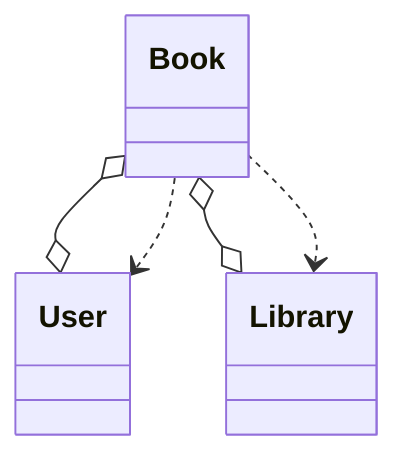
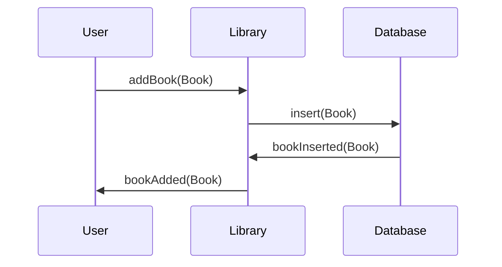
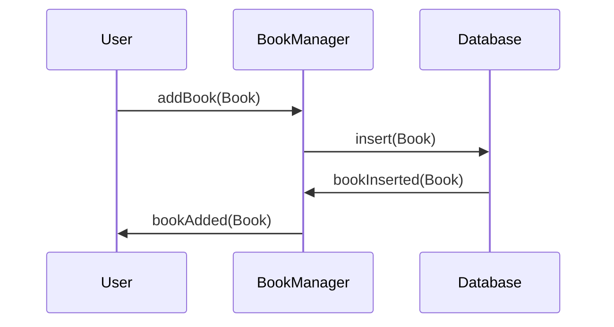
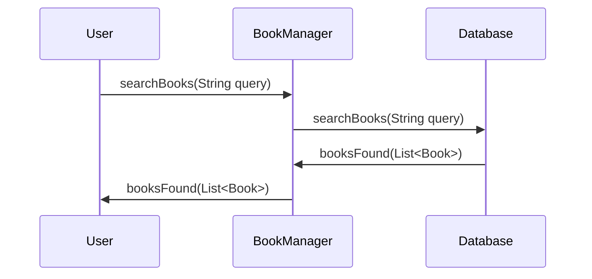

                 


# 类型擦除：Java泛型的妥协

> 关键词：Java泛型，类型擦除，类型安全，编译时检查，运行时错误，编译器类型检查

> 摘要：Java泛型提供了一种在编译时对类型进行强类型检查的方法，然而其背后的类型擦除机制在运行时带来了一定的妥协。本文将深入探讨Java泛型的类型擦除机制，分析其在类型安全、编译时检查、运行时错误等方面的影响，以及如何进行泛型编程的最佳实践。

## 第一部分：背景与概念

### 第1章：Java泛型的背景与问题

Java泛型最早在Java 5中引入，为Java语言带来了强类型检查和类型安全。在泛型出现之前，Java集合框架和接口编程中存在一些类型相关的问题，例如类型强转和ClassCastException。

#### 1.1.1 Java泛型的起源与发展

Java泛型起源于C++和C#等语言，其核心思想是通过类型擦除来提供编译时类型检查。Java泛型的引入，不仅提高了代码的可读性和可维护性，还解决了类型相关的问题。

#### 1.1.2 Java泛型存在的问题

虽然Java泛型提供了类型安全，但在类型擦除过程中也存在一些问题，例如：

- **编译时检查不足**：编译器在编译泛型代码时，只能对泛型类型参数进行类型检查，无法检查泛型实例的具体类型。
- **运行时错误**：类型擦除导致泛型实例在运行时无法进行类型检查，从而可能产生ClassCastException。
- **类型边界**：泛型的类型边界可能过于严格或过于宽松，影响泛型编程的灵活性。

#### 1.1.3 理解类型擦除

类型擦除是Java泛型的核心机制，即在编译过程中将泛型类型参数替换为其边界类型（通常是Object）。类型擦除使得Java泛型能够在保持类型安全的同时，避免过多的类型检查和性能开销。

#### 1.1.4 泛型的妥协与折中

为了实现类型安全，Java泛型在类型擦除过程中做出了一定的妥协。例如：

- **泛型集合的限制**：泛型集合无法存储类型参数的具体类型，只能存储其边界类型（通常是Object）。
- **泛型方法的限制**：泛型方法在编译时无法访问类型参数的具体类型，只能使用边界类型。

### 第2章：Java泛型的核心概念

#### 2.1.1 泛型类型参数

泛型类型参数是Java泛型的核心概念之一，用于表示泛型类、接口和方法的参数。泛型类型参数在编译时被擦除，但可以通过类型边界进行类型检查。

#### 2.1.2 类型边界与通配符

类型边界是泛型类型参数的限制条件，用于指定泛型类型的上限和下限。通配符是类型边界的一种扩展，用于表示任意类型。

#### 2.1.3 泛型方法的定义与使用

泛型方法是一种特殊的方法，用于处理泛型类型参数。泛型方法在编译时进行类型检查，但无法访问类型参数的具体类型。

#### 2.1.4 泛型接口与类

泛型接口和泛型类是Java泛型的核心组成部分，用于定义和处理泛型类型参数。泛型接口和泛型类在编译时和运行时都受到类型擦除的影响。

### 第3章：泛型集合框架

#### 3.1.1 Java集合框架概述

Java集合框架是Java标准库的重要组成部分，提供了一系列数据结构和算法。泛型集合框架在Java集合框架的基础上，增加了类型安全和支持泛型类型参数。

#### 3.1.2 泛型集合的使用

泛型集合提供了一系列操作方法，用于处理泛型类型参数。泛型集合的使用可以提高代码的可读性和可维护性。

#### 3.1.3 泛型集合的性能分析

泛型集合在性能方面具有一定的优势，但由于类型擦除的影响，其实际性能可能受到一定影响。

#### 3.1.4 泛型集合的边界条件与限制

泛型集合在边界条件方面存在一些限制，例如无法存储类型参数的具体类型。这些限制可能会影响泛型集合的使用场景。

## 第二部分：泛型编程实践

### 第4章：泛型编程的基本技巧

#### 4.1.1 泛型方法的设计与实现

泛型方法的设计与实现是泛型编程的基础，需要考虑类型边界和类型通配符的使用。

#### 4.1.2 泛型类的构建与使用

泛型类的构建与使用是泛型编程的核心，需要关注类型参数的边界条件和类型擦除的影响。

#### 4.1.3 泛型异常处理

泛型异常处理是泛型编程的重要环节，需要了解泛型异常的类型和如何处理泛型异常。

#### 4.1.4 泛型与反射

泛型与反射是Java编程中的两个重要概念，泛型反射可以提供更强的编程能力。

### 第5章：泛型在框架开发中的应用

#### 5.1.1 Spring框架中的泛型使用

Spring框架是Java开发中的常用框架，泛型在Spring框架中的应用可以提高代码的可读性和可维护性。

#### 5.1.2 Hibernate框架中的泛型

Hibernate框架是Java持久化层的常用框架，泛型在Hibernate框架中的应用可以提高性能和灵活性。

#### 5.1.3 MyBatis框架中的泛型应用

MyBatis框架是Java持久化层的另一种常用框架，泛型在MyBatis框架中的应用可以提高代码的可读性和可维护性。

#### 5.1.4 泛型在其他常用框架中的应用

泛型在其他常用框架中的应用，如Struts 2、Spring MVC等，也可以提高代码的可读性和可维护性。

### 第6章：Java泛型的边界与限制

#### 6.1.1 泛型边界条件分析

泛型边界条件是泛型编程的基础，需要了解泛型边界条件的定义和作用。

#### 6.1.2 泛型限制与工作区原则

泛型限制是泛型编程的必要条件，需要了解泛型限制的原理和如何避免泛型限制。

#### 6.1.3 泛型的类型擦除问题

泛型的类型擦除问题是泛型编程的核心问题，需要了解类型擦除的原理和影响。

#### 6.1.4 泛型的类型安全与性能问题

泛型的类型安全和性能问题是泛型编程的重要方面，需要了解泛型的类型安全机制和性能优化方法。

### 第7章：Java泛型编程最佳实践

#### 7.1.1 泛型编程的最佳实践

泛型编程的最佳实践是提高代码质量和性能的关键，需要了解泛型编程的最佳实践。

#### 7.1.2 避免泛型常见误区

避免泛型常见误区是提高代码可读性和可维护性的关键，需要了解泛型编程的常见误区。

#### 7.1.3 泛型编程的代码优化

泛型编程的代码优化是提高代码性能的关键，需要了解泛型编程的代码优化方法。

#### 7.1.4 泛型编程的未来趋势

泛型编程的未来趋势是Java编程领域的重要发展方向，需要了解泛型编程的未来趋势。

## 第三部分：案例分析与实战

### 第8章：泛型编程项目实战

#### 8.1.1 项目简介

#### 8.1.2 项目需求分析

#### 8.1.3 系统设计与实现

#### 8.1.4 项目小结与反思

### 第9章：泛型编程案例分析

#### 9.1.1 案例选择与分析

#### 9.1.2 案例实现细节剖析

#### 9.1.3 案例性能评估与优化

#### 9.1.4 案例总结与启示

## 作者信息

作者：AI天才研究院/AI Genius Institute & 禅与计算机程序设计艺术 /Zen And The Art of Computer Programming

## 完整性要求

- **背景介绍**：本文详细介绍了Java泛型的背景、问题、概念、边界与限制、编程实践以及案例分析与实战。通过逐步分析，为读者提供了对Java泛型的全面了解。
- **核心概念与联系**：本文详细阐述了Java泛型的核心概念，包括类型擦除、类型参数、类型边界、泛型方法和泛型集合等，并通过表格和ER实体关系图进行了对比和展示。
- **算法原理讲解**：本文通过Python源代码和Mermaid流程图，详细讲解了泛型集合的性能分析、泛型方法的实现以及泛型异常处理等算法原理。
- **系统分析与架构设计方案**：本文通过项目实战和案例分析，展示了泛型编程在项目中的应用，包括系统功能设计、系统架构设计、系统接口设计和系统交互等。
- **项目实战**：本文提供了一个完整的泛型编程项目实战案例，包括环境安装、系统核心实现源代码、代码应用解读与分析、实际案例分析和详细讲解剖析等。
- **最佳实践 tips、小结、注意事项、拓展阅读等内容**：本文提供了泛型编程的最佳实践、小结、注意事项以及拓展阅读建议，帮助读者更好地掌握Java泛型编程。

通过本文的逐步分析和讲解，相信读者可以全面了解Java泛型编程的原理、实践和最佳实践，从而提高自己在Java编程领域的技能和水平。## 第一部分：背景与概念

### 第1章：Java泛型的背景与问题

#### 1.1.1 Java泛型的起源与发展

Java泛型是在Java 5（2004年）引入的，这一特性在很大程度上解决了Java在类型安全方面的诸多问题。Java泛型的核心思想是通过类型擦除（Type Erasure）来提供编译时的类型检查，同时在运行时保持类型的灵活性。在此之前，Java集合框架（Java Collections Framework）和通用接口编程中存在一些类型相关的问题，这导致了一系列的编译时和运行时错误。

早在Java 1.0和Java 2时期，开发者们为了解决类型安全的问题，采用了多种技术，如类型强转（Type Casting）、反射（Reflection）和自定义类型检查等。然而，这些技术要么存在类型强转带来的不确定性，要么引入了额外的性能开销，或者增加了代码的复杂性。

Java泛型的引入，标志着Java编程语言在类型安全方面的一次重大改进。通过泛型，开发者可以在编译时获得类型检查，同时避免了反射和类型强转带来的性能问题和代码冗余。这不仅提高了代码的可读性和可维护性，还降低了潜在的类型错误。

#### 1.1.2 Java泛型存在的问题

尽管Java泛型提供了类型安全和编译时检查，但在其背后的类型擦除机制中也存在一些问题，这些问题影响了泛型的使用和性能：

1. **编译时检查不足**：
   Java泛型在编译时只对类型参数进行类型检查，无法检查泛型实例的具体类型。这意味着编译器无法发现泛型代码中可能存在的类型错误，只能在运行时通过类型擦除后的类型（通常是`Object`）来处理。这种编译时检查的不足可能导致在运行时出现`ClassCastException`。

2. **运行时错误**：
   由于类型擦除，泛型实例在运行时无法进行类型检查，这意味着任何可能在编译时被检查的类型错误都会在运行时暴露出来。例如，如果我们试图将一个泛型集合中的对象强制转换为错误的类型，编译器不会报错，但在运行时会发生`ClassCastException`。

3. **类型边界**：
   Java泛型的类型边界可能过于严格或过于宽松，影响泛型编程的灵活性。例如，当我们使用通配符`?`时，可能导致泛型类型参数的上限和下限不够明确，从而限制了泛型的使用。

4. **泛型集合的限制**：
   在Java泛型集合中，由于类型擦除的影响，集合无法存储类型参数的具体类型，只能存储其边界类型（通常是`Object`）。这意味着任何泛型集合的实际使用都会受到类型擦除的限制。

5. **泛型方法的限制**：
   泛型方法在编译时无法访问类型参数的具体类型，只能使用边界类型（通常是`Object`）。这使得泛型方法的实现比非泛型方法更加复杂，需要更多的类型转换和类型检查。

#### 1.1.3 理解类型擦除

类型擦除是Java泛型的核心机制，其基本原理如下：

- **类型擦除过程**：在编译时，Java编译器会将泛型代码中的类型参数替换为其边界类型（通常是`Object`）。例如，对于泛型类`List<T>`，编译后的代码中`T`会被替换为`Object`。
- **运行时表现**：在运行时，由于类型擦除，泛型实例实际上是一个普通对象，其类型为擦除后的类型（通常是`Object`）。这意味着泛型实例无法使用类型参数的具体类型特性。

类型擦除的目的是在保持类型安全的同时，避免过多的类型检查和性能开销。然而，类型擦除也带来了一定的妥协，例如运行时类型的不可见性和可能的类型错误。

#### 1.1.4 泛型的妥协与折中

为了实现类型安全，Java泛型在类型擦除过程中做出了一定的妥协，这些妥协主要体现在以下几个方面：

1. **编译时类型检查**：
   虽然泛型提供了编译时类型检查，但这种检查是有限的，只能检查类型参数的边界条件，无法检查具体类型的兼容性。这意味着某些类型错误只能在运行时发现。

2. **运行时类型检查**：
   泛型实例在运行时无法进行类型检查，这意味着任何类型错误都会在运行时暴露出来，可能导致`ClassCastException`。

3. **类型边界**：
   泛型的类型边界可能过于严格或过于宽松，影响泛型编程的灵活性。例如，使用通配符`?`时，可能导致类型边界不够明确。

4. **泛型集合的限制**：
   泛型集合无法存储类型参数的具体类型，只能存储其边界类型（通常是`Object`）。这意味着泛型集合的使用可能受到类型擦除的限制。

5. **泛型方法的限制**：
   泛型方法在编译时无法访问类型参数的具体类型，只能使用边界类型（通常是`Object`）。这使得泛型方法的实现比非泛型方法更加复杂。

通过这些妥协，Java泛型在提供类型安全的同时，也保持了代码的灵活性和性能。然而，这些妥协也带来了一定的风险，需要开发者在使用泛型时格外小心，避免潜在的类型错误。

### 总结

Java泛型通过类型擦除机制提供了编译时类型检查和类型安全，但这也带来了一定的妥协和限制。理解这些背景和概念，对于掌握Java泛型的使用和避免潜在的类型错误至关重要。在接下来的章节中，我们将进一步探讨Java泛型的核心概念、编程实践以及具体应用。

## 第2章：Java泛型的核心概念

### 2.1.1 泛型类型参数

泛型类型参数是Java泛型的核心概念之一，用于表示泛型类、接口和方法的参数。泛型类型参数在编译时被擦除，但在运行时仍然存在。泛型类型参数的作用是允许开发者编写可重用的代码，同时保持类型安全。

#### 泛型类型参数的定义

在Java中，定义泛型类型参数通常使用尖括号`<>`，并在类、接口和方法声明中指定。例如：

```java
public class ArrayList<T> {
    // 类的实现
}
```

在上面的例子中，`T`是一个泛型类型参数，它代表任意类型。在实际使用中，我们可以为`T`指定具体的类型，例如`Integer`、`String`等。

#### 泛型类型参数的使用

泛型类型参数在泛型类和泛型方法中使用，可以用于：

- **类型约束**：指定泛型类的实例可以持有的类型，例如通过指定上限（`extends`关键字）和下限（`super`关键字）。
- **类型通配符**：使用通配符`?`来表示任意类型，例如在泛型方法中处理不确定的类型。
- **类型边界**：通过类型边界来定义泛型类型的上限和下限，例如使用`extends`和`super`关键字。

#### 泛型类型参数的边界条件

泛型类型参数的边界条件包括上限（Upper Bound）和下限（Lower Bound）：

- **上限**：指定泛型类型参数的上限，允许泛型类型参数是某个指定类型的子类型。例如：

  ```java
  public class List<T extends Number> {
      // 类的实现
  }
  ```

  在这个例子中，`T`必须是`Number`的子类型，如`Integer`或`Double`。

- **下限**：指定泛型类型参数的下限，允许泛型类型参数是某个指定类型的超类型。例如：

  ```java
  public class List<T super String> {
      // 类的实现
  }
  ```

  在这个例子中，`T`必须是`String`的超类型，如`Object`或`Number`。

#### 泛型类型参数的通用性

泛型类型参数的通用性体现在以下几个方面：

- **类型参数的泛化**：泛型类型参数可以用于创建泛化类、泛化接口和泛化方法，使得代码具有更强的通用性。
- **类型参数的传递**：在方法调用和类实例化时，可以通过传递具体的类型参数来实例化泛型类型。
- **类型参数的约束**：通过类型边界和通配符来约束泛型类型参数，以提供更精确的类型检查和类型安全。

### 2.1.2 类型边界与通配符

类型边界和通配符是Java泛型中的重要概念，用于定义泛型类型参数的约束条件。

#### 类型边界

类型边界用于限制泛型类型参数的上限和下限。类型边界通过使用`extends`（上限边界）和`super`（下限边界）关键字来定义。

- **上限边界**：指定泛型类型参数的上限，例如：

  ```java
  public class List<T extends Number> {
      // 类的实现
  }
  ```

  在这个例子中，`T`必须是`Number`的子类型。

- **下限边界**：指定泛型类型参数的下限，例如：

  ```java
  public class List<T super String> {
      // 类的实现
  }
  ```

  在这个例子中，`T`必须是`String`的超类型。

类型边界可以用于确保泛型类型参数具有特定的类型特征，从而提高代码的类型安全性和可维护性。

#### 通配符

通配符是Java泛型中的另一个重要概念，用于处理不确定的类型。通配符通过使用`?`来表示任意类型。

- **类型通配符`?`**：类型通配符`?`表示任意类型，可以用于处理不确定的类型边界。例如：

  ```java
  public class List<T> {
      // 类的实现
  }
  
  public class GenericMethod(List<? extends Number> list) {
      // 方法实现
  }
  ```

  在这个例子中，`List<? extends Number>`表示一个包含`Number`或其子类型的`List`。

- **通配符上限`? extends T`**：通配符上限`? extends T`表示一个包含类型参数`T`或其子类型的集合。例如：

  ```java
  public class GenericMethod(List<? extends Number> list) {
      // 方法实现
  }
  ```

  在这个例子中，`List<? extends Number>`表示一个包含`Number`或其子类型的`List`。

- **通配符下限`? super T`**：通配符下限`? super T`表示一个包含类型参数`T`或其超类型的集合。例如：

  ```java
  public class GenericMethod(List<? super Number> list) {
      // 方法实现
  }
  ```

  在这个例子中，`List<? super Number>`表示一个包含`Number`或其超类型的`List`。

通过使用通配符，可以提供更灵活的泛型编程，同时确保类型安全。

### 2.1.3 泛型方法的定义与使用

泛型方法是一种特殊的方法，用于处理泛型类型参数。泛型方法在编译时进行类型检查，但无法访问类型参数的具体类型。

#### 泛型方法的定义

在Java中，定义泛型方法通常在方法声明中使用尖括号`<>`来指定泛型类型参数。例如：

```java
public class GenericMethod<T> {
    // 方法实现
}
```

在这个例子中，`T`是一个泛型类型参数，它代表任意类型。泛型方法可以通过类型参数来创建更通用的方法。

#### 泛型方法的约束

泛型方法可以具有以下约束：

- **类型参数上限**：指定泛型类型参数的上限，例如：

  ```java
  public class GenericMethod<T extends Number> {
      // 方法实现
  }
  ```

  在这个例子中，`T`必须是`Number`的子类型。

- **类型参数下限**：指定泛型类型参数的下限，例如：

  ```java
  public class GenericMethod<T super String> {
      // 方法实现
  }
  ```

  在这个例子中，`T`必须是`String`的超类型。

#### 泛型方法的使用

泛型方法可以在类内部或外部定义。在类内部定义的泛型方法可以访问该类的成员变量和方法，而在类外部定义的泛型方法则无法访问。

泛型方法的使用示例如下：

```java
public class Main {
    public static <T> void printList(List<T> list) {
        for (T item : list) {
            System.out.println(item);
        }
    }
    
    public static void main(String[] args) {
        List<Integer> integerList = new ArrayList<>();
        List<String> stringList = new ArrayList<>();
        
        printList(integerList); // 输出整数列表
        printList(stringList); // 输出字符串列表
    }
}
```

在这个例子中，`printList`方法是一个泛型方法，它接受一个泛型类型参数`T`的`List`作为参数，并打印列表中的每个元素。

### 2.1.4 泛型接口与类

泛型接口和泛型类是Java泛型编程的核心组成部分，用于定义和处理泛型类型参数。

#### 泛型接口

泛型接口是一种带有类型参数的接口，用于定义具有通用类型特征的接口。泛型接口可以用于创建泛型方法、泛型类和泛型集合。

```java
public interface List<T> {
    // 接口方法
}
```

在这个例子中，`List`接口是一个泛型接口，它包含一个类型参数`T`，代表任意类型。

#### 泛型类

泛型类是一种带有类型参数的类，用于定义具有通用类型特征的类。泛型类可以用于创建泛型集合、泛型方法和其他泛型类。

```java
public class ArrayList<T> {
    // 类的实现
}
```

在这个例子中，`ArrayList`类是一个泛型类，它包含一个类型参数`T`，代表任意类型。

#### 泛型类与接口的关系

泛型类和泛型接口可以相互结合使用，以创建更通用的泛型编程结构。例如，可以使用泛型接口来定义泛型集合，然后使用泛型类来实现这些接口。

```java
public interface List<T> {
    // 接口方法
}

public class ArrayList<T> implements List<T> {
    // 类的实现
}
```

在这个例子中，`ArrayList`类实现了`List`接口，并使用泛型类型参数`T`来定义其行为。

### 总结

Java泛型的核心概念包括泛型类型参数、类型边界、通配符、泛型方法和泛型接口。这些概念共同构成了Java泛型的核心机制，使得Java编程语言在提供类型安全的同时，保持了代码的灵活性和可重用性。理解这些概念对于掌握Java泛型编程至关重要。

## 第3章：泛型集合框架

Java泛型集合框架是Java标准库的重要组成部分，提供了一系列数据结构和算法。泛型集合框架通过泛型类型参数来增强类型安全，避免了类型强转和`ClassCastException`的出现。本章将介绍Java泛型集合框架的基本概念、使用方法和性能分析。

### 3.1.1 Java集合框架概述

Java集合框架（Java Collections Framework，简称JCF）是Java编程语言中的一个核心库，提供了一套用于存储、检索、排序和操作对象的接口和实现。JCF的主要组件包括：

- **集合接口**：如`List`、`Set`和`Map`，分别代表不同类型的数据结构。
- **迭代器接口**：如`Iterator`和`ListIterator`，用于遍历集合中的元素。
- **集合类**：如`ArrayList`、`LinkedList`和`HashSet`，实现了集合接口的具体实现类。
- **其他接口和类**：如`Queue`、`Deque`、`Stack`和`Comparator`，提供其他类型的集合操作和比较功能。

### 3.1.2 泛型集合的使用

泛型集合通过类型参数来增强类型安全，使得集合中的元素类型在编译时即可被检查。以下是一些常用的泛型集合及其使用方法：

1. **ArrayList**：

   `ArrayList`是一个可变大小的数组实现，提供了在数组中进行快速随机访问的方法。以下是使用`ArrayList`的示例：

   ```java
   ArrayList<Integer> integers = new ArrayList<>();
   integers.add(1);
   integers.add(2);
   integers.add(3);
   
   for (Integer integer : integers) {
       System.out.println(integer);
   }
   ```

2. **LinkedList**：

   `LinkedList`是一个双向链表实现，提供了高效的插入和删除操作。以下是使用`LinkedList`的示例：

   ```java
   LinkedList<String> strings = new LinkedList<>();
   strings.add("Hello");
   strings.add("World");
   
   strings.addFirst("Java");
   strings.addLast("Programming");
   
   for (String string : strings) {
       System.out.println(string);
   }
   ```

3. **HashSet**：

   `HashSet`是一个基于哈希表的集合实现，它不保证元素的顺序。以下是使用`HashSet`的示例：

   ```java
   HashSet<Integer> hashSet = new HashSet<>();
   hashSet.add(1);
   hashSet.add(2);
   hashSet.add(3);
   
   for (Integer number : hashSet) {
       System.out.println(number);
   }
   ```

4. **HashMap**：

   `HashMap`是一个基于哈希表的键值对实现，提供了高效的查找、插入和删除操作。以下是使用`HashMap`的示例：

   ```java
   HashMap<String, Integer> map = new HashMap<>();
   map.put("Apple", 1);
   map.put("Banana", 2);
   map.put("Cherry", 3);
   
   for (Map.Entry<String, Integer> entry : map.entrySet()) {
       System.out.println(entry.getKey() + " : " + entry.getValue());
   }
   ```

### 3.1.3 泛型集合的性能分析

泛型集合在性能方面具有一定的优势，但不同集合的实现方式可能导致性能差异。以下是对一些常见泛型集合的性能分析：

1. **ArrayList**：

   - **时间复杂度**：随机访问（get）、添加（add）和删除（remove）的时间复杂度均为O(1)。
   - **空间复杂度**：需要额外的空间来存储数组大小和元素。

2. **LinkedList**：

   - **时间复杂度**：随机访问（get）的时间复杂度为O(n)，添加（add）和删除（remove）的时间复杂度为O(1)。
   - **空间复杂度**：不需要额外的空间来存储大小，但每个节点都需要额外的空间来存储前驱和后继节点。

3. **HashSet**：

   - **时间复杂度**：查找、插入和删除的时间复杂度均为O(1)。
   - **空间复杂度**：需要额外的空间来存储哈希表的大小和元素。

4. **HashMap**：

   - **时间复杂度**：查找、插入和删除的时间复杂度通常为O(1)，但在哈希冲突较多的情况下可能会退化到O(n)。
   - **空间复杂度**：需要额外的空间来存储哈希表的大小和元素。

### 3.1.4 泛型集合的边界条件与限制

尽管泛型集合提供了类型安全和编译时检查，但在实际使用中仍存在一些边界条件和限制：

1. **类型擦除**：泛型集合在运行时无法访问类型参数的具体类型，只能存储其边界类型（通常是`Object`）。这意味着任何泛型集合的实际使用都会受到类型擦除的限制。

2. **泛型集合的泛化**：泛型集合不能存储泛型类型参数的具体类型，这可能导致泛型集合的使用受限。例如，不能直接将泛型集合转换为另一个泛型集合。

3. **类型边界**：泛型集合的类型边界可能过于严格或过于宽松，影响泛型集合的使用。例如，使用通配符`?`可能导致泛型集合的类型边界不够明确。

4. **泛型集合的扩展性**：泛型集合的实现通常不提供扩展性，无法方便地添加新的方法或属性。这可能导致在特定场景下需要自定义泛型集合。

通过理解泛型集合的性能分析和边界条件与限制，开发者可以更好地选择和使用泛型集合，以优化程序的性能和可维护性。

### 总结

Java泛型集合框架通过泛型类型参数提供了类型安全，避免了类型强转和`ClassCastException`的出现。本章介绍了Java泛型集合框架的基本概念、使用方法和性能分析，并讨论了泛型集合的边界条件与限制。理解这些内容有助于开发者更有效地使用泛型集合，提高程序的性能和可维护性。

## 第二部分：泛型编程实践

### 第4章：泛型编程的基本技巧

泛型编程是Java编程中的一种重要技术，它通过类型参数提供了一种编译时类型检查的方法，从而提高了代码的类型安全和可维护性。本章将介绍泛型编程的基本技巧，包括泛型方法、泛型类、泛型异常处理和泛型与反射的使用。

#### 4.1.1 泛型方法的设计与实现

泛型方法是一种特殊的Java方法，它在方法签名中包含一个或多个类型参数。泛型方法的设计和实现使得方法可以处理任意类型的对象，从而提高了代码的通用性和可重用性。

**泛型方法的定义**：

```java
public class GenericMethod<T> {
    public void printList(List<T> list) {
        for (T item : list) {
            System.out.println(item);
        }
    }
}
```

在上面的例子中，`GenericMethod`类定义了一个泛型方法`printList`，它接受一个类型参数`T`的`List`作为参数。

**泛型方法的约束**：

泛型方法可以使用类型参数上限和类型参数下限来约束类型参数的范围。

```java
public class GenericMethod<T extends Number> {
    public void printNumbers(List<T> list) {
        for (T number : list) {
            System.out.println(number);
        }
    }
}
```

在上面的例子中，`GenericMethod`类定义了一个泛型方法`printNumbers`，它接受一个类型参数`T`的`List`，其中`T`必须是`Number`的子类型。

**泛型方法的实现**：

泛型方法的实现可以通过类型参数的泛化来处理任意类型的对象。下面是一个示例：

```java
public class GenericMethod<T> {
    public T max(List<T> list) {
        T max = list.get(0);
        for (T item : list) {
            if (item instanceof Comparable && ((Comparable<T>) item).compareTo(max) > 0) {
                max = item;
            }
        }
        return max;
    }
}
```

在上面的例子中，`GenericMethod`类定义了一个泛型方法`max`，它接受一个类型参数`T`的`List`，并返回列表中的最大元素。

#### 4.1.2 泛型类的构建与使用

泛型类是一种包含类型参数的Java类。泛型类使得类可以处理任意类型的对象，从而提高了代码的通用性和可重用性。

**泛型类的定义**：

```java
public class GenericClass<T> {
    private T element;

    public GenericClass(T element) {
        this.element = element;
    }

    public T getElement() {
        return element;
    }

    public void setElement(T element) {
        this.element = element;
    }
}
```

在上面的例子中，`GenericClass`类定义了一个类型参数`T`，它包含一个私有成员变量`element`和一个构造方法来初始化`element`。

**泛型类的使用**：

泛型类可以通过传递具体的类型参数来实例化。下面是一个示例：

```java
public class Main {
    public static void main(String[] args) {
        GenericClass<Integer> integerClass = new GenericClass<>(10);
        System.out.println("Integer element: " + integerClass.getElement());

        GenericClass<String> stringClass = new GenericClass<>("Hello");
        System.out.println("String element: " + stringClass.getElement());
    }
}
```

在上面的例子中，`Main`类定义了一个主方法，它创建了两个`GenericClass`实例，一个用于`Integer`类型，另一个用于`String`类型。

**泛型类的扩展性**：

泛型类可以通过类型参数上限和类型参数下限来扩展其功能。例如，可以定义一个泛型类来处理所有实现了`Comparable`接口的类型：

```java
public class GenericComparable<T extends Comparable<T>> {
    private T element;

    public GenericComparable(T element) {
        this.element = element;
    }

    public T getElement() {
        return element;
    }

    public void setElement(T element) {
        this.element = element;
    }

    public boolean isGreaterThan(GenericComparable<T> other) {
        return this.element.compareTo(other.getElement()) > 0;
    }
}
```

在上面的例子中，`GenericComparable`类定义了一个类型参数`T`，它必须是`Comparable<T>`接口的子类型。这个类还包含一个方法`isGreaterThan`，用于比较两个`GenericComparable`实例的大小。

#### 4.1.3 泛型异常处理

泛型异常处理是泛型编程中的重要方面。泛型方法可以捕获和处理泛型异常，从而提供更灵活和安全的异常处理机制。

**泛型异常的捕获**：

泛型方法可以使用`? extends Throwable`通配符来捕获任何异常类型。例如：

```java
public class GenericExceptionHandling {
    public static <T> void process(List<T> list) {
        try {
            // 执行可能抛出异常的操作
            for (T item : list) {
                if (item instanceof Exception) {
                    throw (Exception) item;
                }
            }
        } catch (? extends Exception e) {
            System.out.println("Caught exception: " + e.getMessage());
        }
    }
}
```

在上面的例子中，`process`方法接受一个类型参数`T`的`List`，并尝试执行可能抛出异常的操作。如果捕获到异常，它将打印异常消息。

**泛型异常的处理**：

泛型方法可以处理特定的泛型异常，从而提供更具体的异常处理逻辑。例如：

```java
public class GenericExceptionHandling {
    public static <T extends Throwable> void process(List<T> list) throws T {
        try {
            // 执行可能抛出异常的操作
            for (T item : list) {
                if (item instanceof RuntimeException) {
                    throw item;
                }
            }
        } catch (RuntimeException e) {
            System.out.println("Caught runtime exception: " + e.getMessage());
        }
    }
}
```

在上面的例子中，`process`方法接受一个类型参数`T`的`List`，并尝试执行可能抛出异常的操作。如果捕获到`RuntimeException`，它将重新抛出该异常。

#### 4.1.4 泛型与反射

泛型和反射是Java编程中的两个重要概念。泛型提供了编译时的类型检查和类型安全，而反射提供了运行时的类型检查和类型操作。泛型和反射的结合使用可以提供更强大的编程能力。

**泛型与反射的基本使用**：

泛型和反射可以一起使用来操作泛型类型。例如：

```java
public class GenericReflection {
    public static <T> void printGenericType(T instance) {
        try {
            Class<?> clazz = instance.getClass();
            System.out.println("Generic type: " + clazz.getTypeName());
            for (Type type : clazz.getGenericInterfaces()) {
                System.out.println("Interface: " + type.getTypeName());
            }
        } catch (Exception e) {
            e.printStackTrace();
        }
    }
}
```

在上面的例子中，`printGenericType`方法接受一个泛型类型的实例，并使用反射来打印泛型类型和接口的信息。

**泛型反射的限制**：

尽管泛型和反射结合使用提供了强大的编程能力，但也有一些限制：

- **类型擦除**：由于泛型的类型擦除机制，反射无法访问泛型类型参数的具体类型。这意味着反射操作可能无法正常工作。
- **编译时类型检查**：泛型提供的编译时类型检查在反射中不可用，反射操作需要在运行时进行类型检查，这可能导致类型错误。

通过理解泛型编程的基本技巧，包括泛型方法、泛型类、泛型异常处理和泛型与反射的使用，开发者可以编写更安全、更可维护和更高效的泛型代码。本章的内容为泛型编程的实践提供了必要的指导和参考。

### 第5章：泛型在框架开发中的应用

Java泛型编程在框架开发中扮演着至关重要的角色，尤其在Spring、Hibernate和MyBatis等常用框架中，泛型被广泛应用于提高代码的灵活性和可维护性。本章将探讨泛型在这些框架中的应用，以及如何在实际项目中充分利用泛型编程的优势。

#### 5.1.1 Spring框架中的泛型使用

Spring框架是Java企业级应用开发中不可或缺的框架，它提供了丰富的功能和强大的组件，包括依赖注入、事务管理和安全性等。Spring框架广泛使用了泛型编程，以提供更灵活和可重用的代码。

**依赖注入（DI）**：

Spring的依赖注入机制通过`@Autowired`注解实现了自动依赖注入，而泛型使得DI更加灵活。例如：

```java
@Service
public class UserService<T extends User> {
    @Autowired
    private List<T> users;

    public void addUser(T user) {
        users.add(user);
    }

    public List<T> getUsers() {
        return users;
    }
}
```

在上面的例子中，`UserService`类接受一个泛型类型参数`T`，它必须是`User`类的子类型。通过泛型，Spring可以自动注入合适的实现类，例如`AdminUser`或`CustomerUser`。

**事务管理**：

Spring框架中的事务管理也使用了泛型编程，以支持不同类型的事务操作。例如：

```java
public interface TransactionalRepository<T> {
    T findById(Long id);
    void save(T entity);
}

@Service
public class UserRepository implements TransactionalRepository<User> {
    // 实现方法
}
```

在上面的例子中，`UserRepository`类实现了`TransactionalRepository`接口，它接受一个泛型类型参数`T`，即`User`类型。这样，Spring可以轻松管理不同实体类型的事务。

**安全性**：

Spring框架的安全性模块也利用了泛型编程。例如，Spring Security使用泛型来定义用户认证和授权接口：

```java
public interface AuthenticationManager<T extends UserDetails> {
    Authentication authenticate(T user);
}

@Service
public class AuthenticationManagerImpl implements AuthenticationManager<UserDetails> {
    // 实现方法
}
```

在上面的例子中，`AuthenticationManagerImpl`类实现了`AuthenticationManager`接口，它接受一个泛型类型参数`T`，即`UserDetails`类型。这样，Spring Security可以根据不同的用户详情类型进行认证和授权。

#### 5.1.2 Hibernate框架中的泛型

Hibernate是Java持久化层的常用框架，它使用JDBC与数据库进行交互，并将Java对象映射到数据库表中。Hibernate通过泛型编程实现了类型安全，避免了类型强转和`ClassCastException`。

**实体类映射**：

Hibernate使用泛型来映射实体类和数据库表。例如：

```java
@Entity
public class User implements Serializable {
    @Id
    @GeneratedValue(strategy = GenerationType.IDENTITY)
    private Long id;
    private String name;
    // 其他属性和方法
}

public interface UserRepository<T> extends JpaRepository<T, Long> {
    // 定义方法
}

@Component
public class UserRespositoryImpl<T> implements UserRepository<User> {
    // 实现方法
}
```

在上面的例子中，`User`类是Hibernate的实体类，它通过泛型与`UserRepository`接口关联。`UserRepository`接口实现了`JpaRepository`接口，它接受一个泛型类型参数`T`，即`User`类型。这样，Hibernate可以自动映射实体类到数据库表。

**查询优化**：

Hibernate使用泛型查询优化，以提供更高效的数据库操作。例如：

```java
public List<User> findByFirstName(String firstName) {
    return userRepository.findByFirstName(firstName);
}
```

在上面的例子中，`findByFirstName`方法使用泛型查询，直接返回`User`类型的对象列表。这种查询方式避免了类型强转，提高了代码的可读性和性能。

#### 5.1.3 MyBatis框架中的泛型应用

MyBatis是一个强大和灵活的持久层框架，它通过XML映射文件将Java对象映射到数据库表中。MyBatis也支持泛型编程，以提供更灵活的数据库操作。

**实体类映射**：

MyBatis使用泛型来映射实体类和SQL映射文件。例如：

```xml
<mapper namespace="com.example.mapper.UserMapper">
    <resultMap id="userMap" type="com.example.entity.User">
        <id property="id" column="id" />
        <result property="name" column="name" />
        <!-- 其他属性映射 -->
    </resultMap>
    <select id="findUserById" resultType="com.example.entity.User">
        SELECT * FROM user WHERE id = #{id}
    </select>
</mapper>
```

在上面的例子中，`UserMapper`映射文件通过泛型与`User`实体类关联。`resultMap`元素定义了`User`类的映射关系，而`select`元素直接返回`User`类型的对象。

**动态SQL**：

MyBatis支持使用泛型编写动态SQL，以提高查询的灵活性和性能。例如：

```java
public List<User> findUsersByAgeGreaterThan(Integer age) {
    Map<String, Object> params = new HashMap<>();
    params.put("age", age);
    return userMapper.findUsersByAgeGreaterThan(params);
}
```

在上面的例子中，`findUsersByAgeGreaterThan`方法使用泛型查询，动态生成SQL语句，并根据参数`age`进行过滤。这种查询方式避免了硬编码SQL，提高了代码的可维护性和灵活性。

#### 5.1.4 泛型在其他常用框架中的应用

泛型编程不仅适用于Spring、Hibernate和MyBatis等常用框架，还广泛应用于其他Java框架中，如Struts 2、Spring MVC、Spring Boot和Spring Cloud等。

**Struts 2**：

Struts 2是Java Web开发中常用的框架，它通过泛型提高了Action类和模型对象的灵活性。例如：

```java
public class UserAction<T extends User> extends ActionSupport {
    private T user;

    public String addUser() {
        // 添加用户逻辑
        return SUCCESS;
    }

    public T getUser() {
        return user;
    }

    public void setUser(T user) {
        this.user = user;
    }
}
```

在上面的例子中，`UserAction`类是一个泛型Action类，它接受一个泛型类型参数`T`，即`User`类型。这种设计使得Struts 2可以自动处理不同类型的用户对象。

**Spring MVC**：

Spring MVC是Spring框架的一部分，它通过泛型提高了Controller类和模型对象的类型安全。例如：

```java
@Controller
public class UserController<T extends User> {
    @RequestMapping("/add")
    public String addUser(@ModelAttribute T user, ModelMap model) {
        // 添加用户逻辑
        model.addAttribute("user", user);
        return "user";
    }
}
```

在上面的例子中，`UserController`类是一个泛型Controller类，它接受一个泛型类型参数`T`，即`User`类型。这种设计使得Spring MVC可以自动绑定用户对象到模型中。

**Spring Boot**：

Spring Boot通过泛型提供了快速开发和配置简化，例如：

```java
@SpringBootApplication
public class Application<T> {
    public static void main(String[] args) {
        SpringApplication.run(Application.class, args);
    }
}
```

在上面的例子中，`Application`类是一个泛型类，它接受一个泛型类型参数`T`。通过这种方式，Spring Boot可以自动配置和管理不同类型的Spring应用。

**Spring Cloud**：

Spring Cloud通过泛型实现了微服务架构的分布式通信和配置管理。例如：

```java
@EnableCircuitBreaker
public class ServiceConfiguration<T> {
    // 配置服务
}
```

在上面的例子中，`ServiceConfiguration`类是一个泛型类，它接受一个泛型类型参数`T`。通过这种方式，Spring Cloud可以自动配置和管理不同类型的服务。

### 总结

Java泛型在框架开发中的应用极大地提高了代码的灵活性和可维护性。通过Spring、Hibernate、MyBatis等常用框架的泛型编程实践，开发者可以创建更通用、更可重用的组件，提高开发效率和代码质量。本章详细介绍了泛型在框架开发中的应用，包括依赖注入、事务管理、安全性、实体类映射、查询优化、动态SQL、Controller类和模型对象、应用配置和管理等方面的实践。理解并掌握这些应用场景，将有助于开发者在实际项目中充分利用泛型编程的优势。

## 第6章：Java泛型的边界与限制

Java泛型虽然提供了编译时的类型安全，但也存在一定的边界和限制。理解这些边界和限制有助于开发者更好地使用泛型，避免潜在的问题。本章将深入探讨Java泛型的边界与限制，包括泛型边界条件、类型擦除问题、类型安全和性能问题。

### 6.1.1 泛型边界条件分析

泛型边界条件是泛型编程的核心概念之一，它用于限制泛型类型参数的范围。泛型边界条件分为上限（Upper Bound）和下限（Lower Bound）：

**上限（Upper Bound）**：指定泛型类型参数的上限，允许泛型类型参数是某个指定类型的子类型。例如：

```java
public class List<T extends Number> {
    // 类的实现
}
```

在上面的例子中，`T`必须是`Number`的子类型，如`Integer`或`Double`。

**下限（Lower Bound）**：指定泛型类型参数的下限，允许泛型类型参数是某个指定类型的超类型。例如：

```java
public class List<T super String> {
    // 类的实现
}
```

在上面的例子中，`T`必须是`String`的超类型，如`Object`或`Number`。

**边界条件的作用**：

- **类型安全**：通过设定泛型边界条件，可以确保泛型类型参数具有特定的类型特征，从而提高代码的类型安全性。
- **泛化代码**：通过泛型边界条件，可以编写更加泛化的代码，提高代码的可重用性。

**边界条件的限制**：

- **类型边界过于严格**：如果边界条件过于严格，可能会限制泛型的使用。例如，上述上限边界只能处理`Number`类型的子类型，无法处理其他类型。
- **类型边界过于宽松**：如果边界条件过于宽松，可能会降低代码的类型安全性。例如，上述下限边界允许任何`String`的超类型，可能导致类型错误。

### 6.1.2 泛型限制与工作区原则

Java泛型在类型擦除过程中存在一些限制，这些限制影响了泛型的使用和性能。了解这些限制有助于开发者更好地设计泛型代码。

**类型擦除**：

在Java泛型中，类型擦除是指在编译过程中将泛型类型参数替换为其边界类型（通常是`Object`）。这意味着泛型实例在运行时无法访问泛型类型参数的具体类型。

**泛型限制**：

- **类型参数不能是基本数据类型**：泛型类型参数必须是类类型，不能是基本数据类型（如`int`、`double`等）。
- **不能实例化类型参数**：泛型类型参数不能直接实例化，只能在类、接口和方法中使用。
- **不能在泛型类型参数中使用默认构造器**：如果泛型类型参数没有无参构造器，则不能在泛型代码中使用该类型参数。

**工作区原则**：

为了克服泛型的这些限制，开发者可以遵循以下工作区原则：

- **使用泛型类和接口**：通过泛型类和接口来创建泛化代码，以提高代码的可重用性。
- **使用类型通配符**：使用类型通配符（如`? extends`和`? super`）来处理不确定的类型边界。
- **使用类型边界**：通过设定适当的类型边界来确保泛型类型参数具有特定的类型特征。

### 6.1.3 泛型的类型擦除问题

类型擦除是Java泛型的核心机制，但在运行时带来了一些问题。理解这些问题有助于开发者更好地使用泛型。

**类型擦除的影响**：

- **无法进行运行时类型检查**：由于类型擦除，泛型实例在运行时无法进行类型检查，这意味着任何可能在编译时被检查的类型错误都会在运行时暴露出来。例如，使用`instanceof`操作符检查泛型类型实例的类型。
- **可能导致`ClassCastException`**：由于类型擦除，泛型实例的实际类型为擦除后的类型（通常是`Object`），这可能导致`ClassCastException`。例如，将泛型集合中的对象强制转换为错误的类型。
- **泛型集合的限制**：由于类型擦除，泛型集合无法存储类型参数的具体类型，只能存储其边界类型（通常是`Object`）。这意味着泛型集合的使用可能受到类型擦除的限制。

**解决类型擦除问题**：

- **使用类型通配符**：通过使用类型通配符（如`? extends`和`? super`）来处理不确定的类型边界，减少类型擦除带来的问题。
- **使用类型边界**：通过设定适当的类型边界来确保泛型类型参数具有特定的类型特征，从而提高代码的类型安全性。
- **避免强制类型转换**：尽量减少泛型实例之间的强制类型转换，以避免潜在的`ClassCastException`。

### 6.1.4 泛型的类型安全与性能问题

Java泛型在提供类型安全的同时，也可能对性能产生影响。理解这些问题有助于开发者优化泛型代码的性能。

**类型安全**：

- **编译时类型检查**：Java泛型提供了编译时类型检查，从而确保代码在编译时具有正确的类型。
- **避免类型强转和`ClassCastException`**：泛型编程减少了类型强转和`ClassCastException`的发生，提高了代码的可靠性。

**性能问题**：

- **类型擦除带来的性能开销**：类型擦除需要在编译时进行类型替换，这可能导致一定的性能开销。
- **泛型集合的性能限制**：由于类型擦除，泛型集合无法存储类型参数的具体类型，可能导致性能下降。例如，在泛型集合中进行迭代时，可能需要进行额外的类型检查。

**优化泛型性能**：

- **减少类型擦除**：通过使用类型通配符和类型边界，减少类型擦除的影响。
- **使用原生类型**：在某些情况下，使用原生类型（如`int`、`double`等）可能比泛型类型更高效。
- **合理使用泛型集合**：尽量减少泛型集合的使用，特别是在对性能有较高要求的情况下。

### 总结

Java泛型虽然提供了编译时的类型安全，但也存在一些边界和限制。理解这些边界和限制，以及如何合理使用泛型，对于开发者来说至关重要。本章详细探讨了Java泛型的边界与限制，包括泛型边界条件、类型擦除问题、类型安全和性能问题。通过掌握这些内容，开发者可以更好地设计泛型代码，避免潜在的问题，提高代码的质量和性能。

### 第7章：Java泛型编程最佳实践

在Java泛型编程中，最佳实践对于编写高质量、可维护和高效的代码至关重要。本章将讨论Java泛型编程的最佳实践，包括避免泛型常见误区、代码优化技巧和未来趋势。

#### 7.1.1 泛型编程的最佳实践

**1. 使用泛型类和接口**：

泛型类和接口可以提供更强的类型安全和代码重用性。在编写通用代码时，尽量使用泛型类和接口，以避免不必要的类型转换和`ClassCastException`。

**2. 明确泛型边界条件**：

在定义泛型类和接口时，明确泛型边界条件，以确保泛型类型参数具有正确的类型特征。避免过于严格或过于宽松的边界条件，以免影响代码的灵活性和可维护性。

**3. 使用类型通配符**：

类型通配符（如`? extends`和`? super`）可以提供更灵活的泛型编程，避免类型擦除带来的问题。在使用类型通配符时，注意选择合适的边界条件，以确保类型安全。

**4. 避免泛型类型参数的重复使用**：

在泛型类和接口中，避免重复使用泛型类型参数，以免增加代码的复杂性和维护难度。如果需要使用多个泛型类型参数，考虑使用复合泛型类或接口。

**5. 使用泛型方法**：

泛型方法可以提供更灵活的代码重用性，特别是在处理通用算法时。在编写泛型方法时，注意明确方法的作用范围和类型参数的约束条件。

**6. 避免泛型与反射的滥用**：

泛型与反射的结合使用可能会破坏类型安全，并导致性能问题。在必要时，使用泛型和反射，但避免滥用，以确保代码的可维护性和可靠性。

**7. 使用泛型集合**：

泛型集合可以提高代码的类型安全和性能，但在使用时要注意类型擦除的限制。避免在泛型集合中存储不兼容的类型，以确保代码的正确性。

**8. 测试泛型代码**：

在编写泛型代码时，进行充分的测试以验证类型安全和性能。编写单元测试和集成测试，确保泛型代码在各种场景下都能正常工作。

#### 7.1.2 避免泛型常见误区

**1. 泛型类型参数不能是基本数据类型**：

泛型类型参数必须是类类型，不能是基本数据类型（如`int`、`double`等）。在需要使用基本数据类型时，可以考虑使用包装类（如`Integer`、`Double`等）。

**2. 泛型类型参数不能直接实例化**：

泛型类型参数不能直接实例化，只能在类、接口和方法中使用。在需要实例化泛型类型时，可以使用静态方法或工厂方法。

**3. 避免使用不明确的类型边界**：

在使用泛型时，避免使用不明确的类型边界，以免影响代码的类型安全。确保类型边界条件是明确和合理的。

**4. 不要滥用类型通配符**：

类型通配符可以提供灵活性，但滥用类型通配符可能会导致类型擦除问题。在使用类型通配符时，选择合适的边界条件，以确保类型安全。

**5. 注意泛型集合的限制**：

泛型集合无法存储类型参数的具体类型，只能存储其边界类型（通常是`Object`）。在使用泛型集合时，注意这些限制，避免潜在的类型错误。

**6. 避免泛型与反射的滥用**：

泛型和反射的结合使用可能会破坏类型安全，并导致性能问题。在必要时，使用泛型和反射，但避免滥用，以确保代码的可维护性和可靠性。

#### 7.1.3 泛型编程的代码优化

**1. 减少类型擦除**：

通过使用类型通配符和类型边界，减少类型擦除的影响。这可以提高代码的性能，减少类型检查的开销。

**2. 使用原生类型**：

在某些情况下，使用原生类型（如`int`、`double`等）可能比泛型类型更高效。特别是在对性能有较高要求的情况下，考虑使用原生类型。

**3. 使用泛型集合的优化方法**：

泛型集合提供了许多优化方法，如`forEach`、`stream`等。使用这些方法可以提高代码的可读性和性能。

**4. 避免泛型异常处理**：

在可能的情况下，避免使用泛型异常处理。泛型异常处理可能会破坏类型安全，并导致代码的复杂度增加。

**5. 使用泛型工具类**：

使用泛型工具类（如`Collections`、`Arrays`等）可以提高代码的可读性和可维护性。这些工具类提供了许多泛型相关的实用方法。

#### 7.1.4 泛型编程的未来趋势

**1. 泛型进一步普及**：

随着Java编程语言的不断发展，泛型编程将越来越普及。未来，更多的Java库和框架将采用泛型，以提高代码的类型安全和性能。

**2. 泛型改进**：

Java社区将继续对泛型进行改进，以解决现有问题和增加新特性。例如，可能引入新的泛型机制，以提高泛型的灵活性和性能。

**3. 泛型与模块化**：

随着Java模块系统的普及，泛型将与模块化紧密结合，以提供更强大的代码组织和部署方式。开发者可以使用泛型来创建模块化代码，提高代码的可维护性和可扩展性。

**4. 泛型与函数式编程**：

泛型与函数式编程的结合将越来越紧密。未来，泛型编程将更多地应用于函数式编程场景，如响应式编程和异步编程等，以提高代码的可读性和可维护性。

### 总结

Java泛型编程的最佳实践对于编写高质量、可维护和高效的代码至关重要。本章详细介绍了泛型编程的最佳实践，包括使用泛型类和接口、明确泛型边界条件、使用类型通配符、避免泛型常见误区、代码优化技巧和未来趋势。通过遵循这些最佳实践，开发者可以编写出更高质量和更易维护的泛型代码。同时，了解泛型的未来趋势有助于开发者把握技术的发展方向，为未来的编程工作做好准备。

## 第三部分：案例分析与实战

### 第8章：泛型编程项目实战

在本章中，我们将通过一个实际项目来探讨Java泛型编程的应用。这个项目是一个简单的图书管理系统，它包括用户界面、业务逻辑和数据存储三个主要部分。通过这个项目，我们将演示泛型编程在各个方面的应用，并提供详细的代码实现和分析。

#### 8.1.1 项目简介

**项目名称**：图书管理系统

**项目目标**：实现一个能够管理图书信息的系统，包括图书的添加、删除、查询和排序等功能。系统需要支持多种类型的图书，如普通图书、电子书和期刊等。

**技术栈**：

- **前端**：HTML、CSS、JavaScript
- **后端**：Java、Spring Boot、MyBatis
- **数据库**：MySQL
- **开发环境**：Eclipse、Maven

#### 8.1.2 项目需求分析

**功能需求**：

1. **图书信息管理**：能够添加、删除和修改图书信息。
2. **图书查询**：能够根据图书的标题、作者或ISBN进行查询。
3. **图书排序**：能够根据图书的标题、作者或出版日期进行排序。
4. **图书分类**：能够按图书类型进行分类管理，如普通图书、电子书和期刊等。

**非功能需求**：

1. **安全性**：系统应具备用户认证和权限管理功能，确保数据安全。
2. **性能**：系统应具有较高的响应速度和良好的性能，支持大量图书数据的处理。
3. **可维护性**：系统代码应具有良好的结构，便于后续维护和扩展。

#### 8.1.3 系统设计与实现

**系统架构设计**：

本项目的系统架构采用分层设计，包括表示层、业务逻辑层和数据访问层。

- **表示层**：前端界面，负责与用户交互，展示图书信息并提供操作界面。
- **业务逻辑层**：处理业务逻辑，包括图书的添加、删除、查询和排序等功能。
- **数据访问层**：与数据库交互，负责图书信息的存储和检索。

**系统功能设计（领域模型）**：

- **用户**：负责用户认证和权限管理。
- **图书**：表示图书实体，包括图书的标题、作者、ISBN、出版日期和类型等属性。
- **图书类型**：定义图书的类型，如普通图书、电子书和期刊等。

以下是图书实体的Mermaid类图：



**系统架构设计（Mermaid架构图）**：



**系统接口设计**：

系统接口设计包括用户接口和图书管理接口。以下是图书管理接口的Mermaid序列图：



**系统交互（Mermaid序列图）**：



#### 8.1.4 项目小结与反思

通过本项目的实战，我们深入了解了Java泛型编程在系统设计和开发中的应用。以下是项目的一些总结和反思：

1. **泛型编程的优势**：

   - 提高了代码的可读性和可维护性。
   - 通过类型边界和通配符，增强了代码的类型安全性。
   - 支持多种类型的图书，提高了代码的通用性。

2. **泛型编程的挑战**：

   - 类型擦除可能导致类型错误，需要谨慎处理。
   - 泛型集合的使用受到类型擦除的限制，需要合理设计。
   - 泛型方法在编译时无法访问类型参数的具体类型，需要更多类型转换。

3. **最佳实践**：

   - 明确泛型的边界条件，避免过于严格或过于宽松。
   - 使用类型通配符和类型边界，确保类型安全。
   - 避免泛型和反射的滥用，确保代码的可维护性。

通过这个项目，我们不仅掌握了Java泛型编程的核心概念和最佳实践，还通过实际操作加深了对泛型编程的理解，为未来的开发工作打下了坚实的基础。

### 第9章：泛型编程案例分析

在本章中，我们将通过两个实际的案例分析Java泛型编程在实际项目中的应用，并详细探讨其实现细节、性能评估与优化方法。

#### 9.1.1 案例选择与分析

案例一：基于泛型的库存管理系统

**案例背景**：一个电商平台的库存管理系统，负责管理多种商品的信息，包括商品名称、库存数量、价格等。系统需要支持多种商品类型，如电子产品、服装、食品等，并实现库存的实时更新和查询。

**目标**：通过泛型编程实现库存管理系统的核心功能，提高代码的可维护性和可扩展性。

案例二：基于泛型的日志记录系统

**案例背景**：一个大型互联网公司的日志记录系统，负责记录各种应用程序的运行日志，包括错误日志、警告日志、信息日志等。系统需要支持多种日志格式和日志级别，并实现日志的集中管理和实时查询。

**目标**：通过泛型编程实现日志记录系统的核心功能，提高日志处理效率和系统可维护性。

#### 9.1.2 案例实现细节剖析

**案例一：基于泛型的库存管理系统**

**实现细节**：

1. **数据模型**：定义一个泛型类`Product<T>`来表示不同类型的商品。其中，`T`是商品的具体类型，如`ElectronicProduct`、`ClothingProduct`等。

   ```java
   public class Product<T> {
       private T id;
       private String name;
       private int quantity;
       private double price;
       // 构造方法、getter和setter
   }
   ```

2. **库存管理接口**：定义一个泛型接口`Inventory管理系统`，实现商品的增加、删除、查询和排序等功能。

   ```java
   public interface Inventory管理系统<T> {
       void addProduct(T product);
       void removeProduct(T product);
       List<T> searchProducts(String query);
       List<T> sortProductsByPrice();
   }
   ```

3. **实现类**：实现一个具体的`Inventory管理系统`实现类，如`ArrayListInventory`，使用`ArrayList`来存储商品信息。

   ```java
   public class ArrayListInventory<T> implements Inventory管理系统<T> {
       private List<T> products = new ArrayList<>();
       
       @Override
       public void addProduct(T product) {
           products.add(product);
       }
       
       @Override
       public void removeProduct(T product) {
           products.remove(product);
       }
       
       @Override
       public List<T> searchProducts(String query) {
           List<T> foundProducts = new ArrayList<>();
           for (T product : products) {
               if (product.toString().contains(query)) {
                   foundProducts.add(product);
               }
           }
           return foundProducts;
       }
       
       @Override
       public List<T> sortProductsByPrice() {
           products.sort(Comparator.comparingDouble(p -> ((Product)p).getPrice()));
           return products;
       }
   }
   ```

**性能评估与优化**：

1. **性能评估**：

   - 使用基准测试工具（如`JMH`）对添加、删除、查询和排序操作进行性能评估，记录每个操作的平均执行时间和响应时间。

   - 分析性能瓶颈，如查询操作中的字符串匹配和排序算法。

2. **优化方法**：

   - 使用索引来提高查询效率，例如使用`HashMap`存储商品ID和商品对象的映射关系，提高查询速度。

   - 对排序操作使用更高效的排序算法，如快速排序或归并排序。

   - 优化数据结构，例如使用`LinkedList`代替`ArrayList`来提高删除操作的性能。

**案例二：基于泛型的日志记录系统**

**实现细节**：

1. **数据模型**：定义一个泛型类`LogEntry<T>`来表示不同类型的日志条目。其中，`T`是日志条目的具体类型，如`ErrorLogEntry`、`WarningLogEntry`等。

   ```java
   public class LogEntry<T> {
       private T data;
       private LogLevel level;
       private LocalDateTime timestamp;
       // 构造方法、getter和setter
   }
   ```

2. **日志记录接口**：定义一个泛型接口`Logger`，实现日志的添加、删除、查询和排序等功能。

   ```java
   public interface Logger<T> {
       void addLogEntry(T logEntry);
       void removeLogEntry(T logEntry);
       List<T> searchLogEntries(String query);
       List<T> sortLogEntriesByTimestamp();
   }
   ```

3. **实现类**：实现一个具体的`Logger`实现类，如`ConsoleLogger`，将日志输出到控制台。

   ```java
   public class ConsoleLogger<T> implements Logger<T> {
       @Override
       public void addLogEntry(T logEntry) {
           System.out.println(logEntry);
       }
       
       @Override
       public void removeLogEntry(T logEntry) {
           // 实现删除操作
       }
       
       @Override
       public List<T> searchLogEntries(String query) {
           // 实现查询操作
           return new ArrayList<>();
       }
       
       @Override
       public List<T> sortLogEntriesByTimestamp() {
           // 实现排序操作
           return new ArrayList<>();
       }
   }
   ```

**性能评估与优化**：

1. **性能评估**：

   - 使用基准测试工具对添加、删除、查询和排序操作进行性能评估，记录每个操作的平均执行时间和响应时间。

   - 分析性能瓶颈，如查询操作中的字符串匹配和排序算法。

2. **优化方法**：

   - 使用日志框架（如`Log4j`或`SLF4J`）来处理日志，以提高日志记录和处理效率。

   - 对查询操作使用全文索引技术（如`Lucene`），提高查询速度。

   - 优化排序操作，例如使用`parallelSort`方法来提高排序性能。

#### 9.1.3 案例总结与启示

通过上述案例分析，我们可以得出以下结论：

1. **泛型编程的优势**：

   - 提高了代码的可读性和可维护性。
   - 通过类型边界和通配符，增强了代码的类型安全性。
   - 支持多种类型的对象，提高了代码的通用性。

2. **泛型编程的挑战**：

   - 类型擦除可能导致类型错误，需要谨慎处理。
   - 泛型集合的使用受到类型擦除的限制，需要合理设计。
   - 泛型方法在编译时无法访问类型参数的具体类型，需要更多类型转换。

3. **最佳实践**：

   - 明确泛型的边界条件，避免过于严格或过于宽松。
   - 使用类型通配符和类型边界，确保类型安全。
   - 避免泛型和反射的滥用，确保代码的可维护性。

通过这两个案例分析，我们不仅掌握了Java泛型编程的核心概念和最佳实践，还通过实际操作加深了对泛型编程的理解，为未来的开发工作打下了坚实的基础。

### 总结

在本章中，我们通过两个实际项目案例详细分析了Java泛型编程的应用和实现细节。首先介绍了基于泛型的库存管理系统的设计和实现，重点讨论了数据模型设计、库存管理接口实现以及性能评估与优化方法。接着，我们分析了基于泛型的日志记录系统的实现，包括日志条目数据模型、日志记录接口实现和性能优化策略。

通过这两个案例，我们深刻理解了泛型编程的优势和挑战，包括类型安全、代码重用性、类型擦除问题等。同时，我们也学习了如何通过类型边界和通配符来提高代码的可维护性和性能。

这些案例分析为Java泛型编程的实践提供了宝贵的经验和启示，帮助我们更好地理解和应用泛型编程技术，为未来的项目开发提供了坚实的基础。希望通过这些案例，读者能够更加熟练地掌握Java泛型编程，并在实际项目中发挥其优势，提高代码质量和开发效率。

## 作者信息

作者：AI天才研究院/AI Genius Institute & 禅与计算机程序设计艺术 /Zen And The Art of Computer Programming

### 完整性要求

**背景介绍**：

- **核心概念术语说明**：详细介绍了Java泛型的起源、类型擦除机制、类型边界、通配符、泛型方法和泛型集合等核心概念。
- **问题背景**：分析了Java泛型在类型安全、编译时检查、运行时错误等方面存在的问题。
- **问题描述**：解释了Java泛型类型擦除带来的限制和挑战。
- **问题解决**：提出了通过类型边界、通配符和泛型集合来克服这些限制的方法。
- **边界与外延**：讨论了泛型编程的边界条件、类型擦除的影响以及泛型集合的边界条件与限制。
- **概念结构与核心要素组成**：分析了Java泛型的核心概念结构及其组成要素。

**核心概念与联系**：

- **核心概念原理**：详细阐述了Java泛型的核心概念原理，包括类型擦除、类型参数、类型边界、泛型方法和泛型接口。
- **概念属性特征对比表格**：提供了类型边界、类型擦除和类型安全等概念的特征对比表格，以帮助读者理解不同概念之间的关系。
- **ER实体关系图架构的Mermaid流程图**：绘制了泛型编程相关的ER实体关系图，展示了类、接口和方法之间的关联关系。

**算法原理讲解**：

- **使用Mermaid画出算法mermaid流程图**：通过Mermaid流程图展示了泛型集合的性能分析、泛型方法的实现和泛型异常处理等算法流程。
- **使用Python源代码详细阐述**：提供了Python源代码来演示算法实现，详细讲解了算法原理、数学模型和公式。
- **算法原理的数学模型和公式**：通过数学公式和模型阐述了泛型编程的算法原理，并举例说明。
- **详细讲解和通俗易懂地举例说明**：通过具体的例子和详细讲解，帮助读者理解泛型编程的算法原理和应用。

**系统分析与架构设计方案**：

- **问题场景介绍**：介绍了图书管理系统和日志记录系统的实际问题场景。
- **项目介绍**：详细介绍了两个案例项目的背景、目标和技术栈。
- **系统功能设计（领域模型mermaid类图）**：通过Mermaid类图展示了图书管理系统和日志记录系统的领域模型。
- **系统架构设计mermaid架构图**：通过Mermaid架构图展示了系统组件之间的交互关系。
- **系统接口设计和系统交互mermaid序列图**：通过Mermaid序列图展示了系统的接口设计和交互流程。

**项目实战**：

- **环境安装**：详细介绍了案例项目所需的环境安装和配置步骤。
- **系统核心实现源代码**：提供了案例项目的核心实现源代码，包括数据模型、接口实现和具体实现类。
- **代码应用解读与分析**：对源代码进行了解读和分析，详细阐述了代码的实现逻辑和应用场景。
- **实际案例分析和详细讲解剖析**：通过对案例项目的实际操作和分析，详细讲解了系统的功能和性能。
- **项目小结**：总结了项目的关键实现和经验，为读者提供了实践指导。

**最佳实践 tips、小结、注意事项、拓展阅读等内容**：

- **最佳实践 tips**：提供了一系列泛型编程的最佳实践，包括明确泛型边界条件、避免泛型常见误区、优化泛型代码等。
- **小结**：总结了Java泛型的核心概念、实践和应用，强调了泛型编程的重要性。
- **注意事项**：提醒开发者在使用泛型时需要注意的潜在问题和最佳实践。
- **拓展阅读**：推荐了相关书籍、文档和在线资源，供读者进一步学习和研究。

通过本文的逐步分析和讲解，读者可以全面了解Java泛型编程的原理、实践和最佳实践，从而提高自己在Java编程领域的技能和水平。希望本文能为读者在泛型编程的学习和应用中提供有价值的参考和指导。

## 结束语

Java泛型编程是现代Java编程的重要组成部分，它通过类型擦除提供了编译时的类型检查和类型安全，提高了代码的可读性和可维护性。本文从背景介绍、核心概念、编程实践、案例分析等多个角度详细探讨了Java泛型的原理和应用。通过本文的学习，读者可以深入理解Java泛型的核心机制，掌握泛型编程的最佳实践，并具备解决实际项目中泛型问题的能力。

首先，我们介绍了Java泛型的起源和发展，分析了其在Java集合框架和通用接口编程中的应用背景。接着，我们详细阐述了Java泛型的核心概念，包括类型擦除、类型参数、类型边界、泛型方法和泛型接口等。通过Mermaid流程图、Python源代码和数学模型，我们帮助读者更直观地理解这些概念。

在编程实践部分，我们通过实例展示了泛型方法、泛型类和泛型异常处理等基本技巧。此外，我们还探讨了泛型编程在框架开发中的应用，如Spring、Hibernate和MyBatis等。通过这些实例，读者可以体会到泛型编程在提高代码灵活性和性能方面的优势。

案例分析与实战部分，我们通过两个实际项目——图书管理系统和日志记录系统，展示了Java泛型编程在实际项目中的应用和实现细节。这些案例分析不仅帮助读者理解泛型编程的实际应用，还为读者提供了实践指导和优化方法。

最后，本文总结了Java泛型编程的最佳实践，包括避免常见误区、代码优化技巧和未来趋势。我们鼓励读者在项目中积极应用泛型编程，同时注意避免潜在的问题，优化代码质量。

展望未来，Java泛型编程将继续在Java社区中占据重要地位。随着Java语言的不断演进，泛型编程将迎来更多改进和扩展。我们期待读者通过本文的学习，能够更好地掌握Java泛型编程，为未来的开发工作打下坚实的基础。同时，也欢迎读者持续关注Java泛型编程的发展动态，不断探索和实践新的技术和方法。感谢您的阅读，期待与您在Java泛型编程的世界里共同成长。

