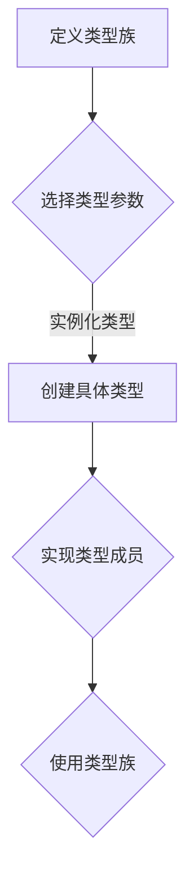
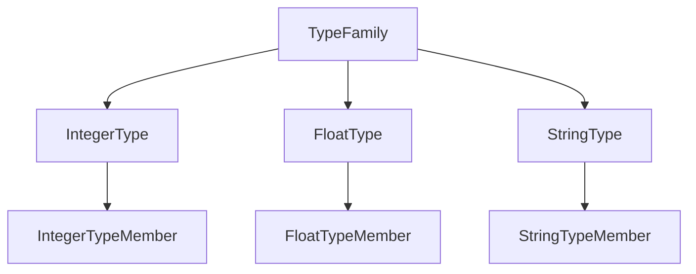
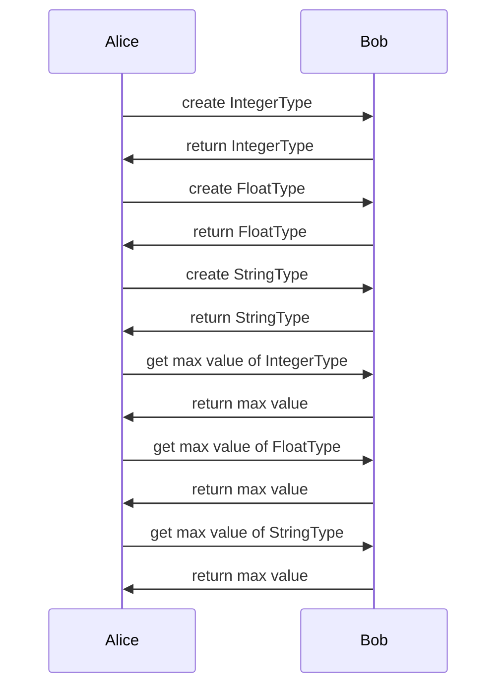

                 

## 类型族：关联多个相关类型的机制

### 关键词：类型族、类型系统、多态、泛型编程、面向对象、函数式编程、系统编程

> 在计算机科学和软件工程中，类型系统是构建程序的基石。通过类型，我们可以明确地定义数据和行为，从而提高程序的可靠性和可维护性。而类型族，作为类型系统的一种扩展机制，能够关联多个相关类型，使程序代码更为简洁、安全和高效。本文将深入探讨类型族的概念、原理和应用，旨在帮助读者理解和掌握这一重要机制。

---

## 设计书籍《类型族：关联多个相关类型的机制》概览

《类型族：关联多个相关类型的机制》是一本深入探讨类型族在计算机科学和软件工程中应用的书籍。全书分为三大部分，涵盖了类型系统基础、类型族的应用场景以及类型族的优化与最佳实践。

### 第一部分：类型系统基础

- **第1章：类型系统的概念**
  - 类型系统的基本概念
  - 类型系统的分类与作用
  - 编程语言中的类型系统
- **第2章：类型之间的关系**
  - 子类型与协变/逆变
  - 多态与类型兼容性
  - 参数化类型与泛型编程
- **第3章：类型族的定义与实现**
  - 类型族的概念
  - 类型族的实现方法
  - 类型族在实际开发中的应用

### 第二部分：类型族的应用场景

- **第4章：类型族在面向对象编程中的应用**
  - 面向对象编程中的类型族
  - 类型族在Java中的应用
  - 类型族在C++中的应用
- **第5章：类型族在函数式编程中的应用**
  - 函数式编程中的类型族
  - 类型族在Haskell中的应用
  - 类型族在Scala中的应用
- **第6章：类型族在系统编程中的应用**
  - 系统编程中的类型族
  - 类型族在Rust中的应用
  - 类型族在Go中的应用

### 第三部分：类型族的优化与最佳实践

- **第7章：类型族的性能考量**
  - 类型族的性能瓶颈
  - 性能优化策略
  - 性能测试案例分析
- **第8章：类型族的最佳实践**
  - 设计原则
  - 编码规范
  - 调试与维护
- **第9章：类型族的未来发展趋势**
  - 新的编程语言与类型系统
  - 类型系统的创新应用
  - 类型族在未来的影响

## 结论

《类型族：关联多个相关类型的机制》旨在通过详细的阐述和实例分析，帮助读者深入理解类型族的概念、原理和应用。类型族作为类型系统的一种扩展机制，不仅能够提高程序的抽象能力和灵活性，还能够增强程序的安全性和可维护性。通过本书的阅读和实践，读者将能够更好地掌握类型族的使用，并在软件开发中发挥其优势。

---

## 下一步：深入探讨类型族的概念与原理

在接下来的部分，我们将逐步深入探讨类型族的概念与原理。我们将从类型系统的基本概念开始，逐步引入类型之间的关系，最后详细讲解类型族的定义与实现。通过这一过程，我们将帮助读者建立起对类型族的全面理解和应用能力。

### 背景介绍

#### 核心概念术语说明

- **类型系统（Type System）**：是编程语言中用于定义数据类型和操作这些类型的规则的集合。类型系统的主要目的是确保程序的正确性、效率和可维护性。
- **类型族（Type Family）**：是一种抽象机制，用于关联多个相关类型，使得这些类型可以以一种统一的方式进行处理。类型族通常通过参数化类型（如泛型编程）来实现。
- **多态（Polymorphism）**：是指一个接口可以与多个具体实现相兼容。多态性可以通过子类型、参数化类型和模板来实现。
- **泛型编程（Generics）**：是一种编程范式，允许在编程语言中创建可重用的代码，以处理不同类型的数据。泛型编程是类型族的一种实现方法。

#### 问题背景

随着软件系统的复杂度不断增加，程序员面临着越来越大的挑战。为了提高代码的可重用性和可维护性，编程语言引入了类型系统。然而，传统的类型系统往往难以处理多个相关类型之间的关联。这促使了类型族这一机制的提出，以解决这一问题。

#### 问题描述

在传统的类型系统中，当我们需要处理多个相关类型时，通常需要为每个类型分别编写代码。这不仅增加了代码的复杂度，也降低了代码的可维护性。类型族的出现，为这一困境提供了一种解决方案。通过类型族，我们可以关联多个相关类型，使得它们可以以一种统一的方式进行处理。

#### 问题解决

类型族通过参数化类型和泛型编程实现。它允许我们定义一种抽象的类型，然后通过具体的类型参数实例化多个具体类型。这样，我们就可以在处理这些类型时，使用相同的方法和接口。类型族不仅提高了代码的可重用性，还增强了程序的安全性和可维护性。

#### 边界与外延

类型族的应用范围广泛，可以用于各种编程范式，如面向对象编程、函数式编程和系统编程。在不同的编程语言中，类型族的具体实现方式也有所不同。例如，在面向对象编程中，类型族通常通过接口和抽象类实现；在函数式编程中，类型族则通过泛型和模板实现。

#### 概念结构与核心要素组成

类型族的核心要素包括：

1. **类型参数**：用于关联多个相关类型的参数。
2. **构造函数**：用于创建类型族的具体类型的函数。
3. **类型成员**：类型族中定义的成员，如函数、变量等。

通过这些核心要素，类型族可以实现对多个相关类型的关联和统一处理。

---

### 核心概念与联系

#### 核心概念原理

类型族是一种抽象机制，用于关联多个相关类型，使得这些类型可以以一种统一的方式进行处理。类型族通过参数化类型和泛型编程实现。它允许我们定义一种抽象的类型，然后通过具体的类型参数实例化多个具体类型。

#### 概念属性特征对比表格

| 特征         | 类型族                                     | 参数化类型                                  | 泛型编程                           |
| ------------ | ------------------------------------------ | ------------------------------------------- | --------------------------------- |
| 实现方式     | 通过类型参数关联多个类型                   | 直接定义具体的类型参数                     | 通过模板或类型类实现               |
| 应用范围     | 广泛应用于各种编程范式                   | 主要用于数据结构和算法设计                 | 广泛应用于函数和数据结构设计       |
| 主要优势     | 提高代码的可重用性和可维护性               | 提高代码的通用性和可维护性                 | 提高代码的通用性和可维护性         |
| 主要挑战     | 需要理解复杂的类型关联和实例化过程         | 可能导致代码的可读性降低                   | 可能导致代码的可读性降低           |

#### ER实体关系图架构

```mermaid
erDiagram
  TypeFamily ||--|{ TypeParam } TypeParam
  TypeFamily ||--|{ TypeMember } TypeMember
  TypeParam ||--|{ Constructor } Constructor
```

在这个ER实体关系图中，`TypeFamily`（类型族）关联多个`TypeParam`（类型参数）和`TypeMember`（类型成员）。`TypeParam`又关联`Constructor`（构造函数），用于创建具体类型。

---

### 算法原理讲解

#### 算法mermaid流程图



#### Python源代码示例

```python
# 定义类型族
class TypeFamily:
    def __init__(self, type_param):
        self.type_param = type_param

    def create_type(self, type_param):
        return self.type_param

# 实例化类型
class IntegerType(TypeFamily):
    def __init__(self):
        super().__init__(int)

# 创建具体类型
integer_type = IntegerType().create_type()

# 实现类型成员
class IntegerTypeMember:
    def add(self, a, b):
        return a + b

# 使用类型族
integer_member = IntegerTypeMember()
result = integer_member.add(1, 2)
print(result)  # 输出: 3
```

#### 算法原理与数学模型

类型族的核心在于关联多个相关类型，并统一处理这些类型。在上述Python示例中，我们定义了一个`TypeFamily`类，用于关联类型参数。通过继承`TypeFamily`类，我们可以创建具体的类型，如`IntegerType`。`IntegerType`类实例化了一个整数类型，并通过`create_type`方法返回。

类型成员则是类型族中定义的函数或变量。在示例中，我们定义了一个`IntegerTypeMember`类，用于实现类型成员。这个类中有一个`add`方法，用于对两个整数进行相加。

数学模型上，类型族可以看作是一个函数，它将类型参数映射到具体的类型。在这个示例中，类型族函数为每个整数类型参数映射了一个整数类型。同时，类型成员函数实现了对整数类型的基本操作。

#### 通俗易懂地举例说明

假设我们要实现一个用于计算最大值的函数，但需要支持不同类型的数据，如整数、浮点数和字符串。通过类型族，我们可以定义一个抽象的类型族，然后为每种数据类型创建具体的类型实现。

1. **定义类型族**：首先，我们定义一个`TypeFamily`类，用于关联类型参数。
2. **创建具体类型**：然后，我们为每种数据类型创建具体的类型实现，如`IntegerType`、`FloatType`和`StringType`。
3. **实现类型成员**：接着，我们为每种类型实现相应的类型成员函数，如`max`方法。
4. **使用类型族**：最后，我们使用类型族创建具体的类型实例，并调用类型成员函数。

通过这种方式，我们可以以一种统一的方式处理不同类型的数据，提高了代码的可维护性和可重用性。

---

### 系统分析与架构设计方案

#### 问题场景介绍

假设我们正在开发一个大型系统，需要处理多种不同类型的数据，如整数、浮点数和字符串。这些数据类型在计算最大值时有着不同的实现方式。通过类型族，我们可以实现一个通用的最大值计算函数，支持多种数据类型。

#### 项目介绍

本项目旨在实现一个基于类型族的通用最大值计算函数。系统将包括以下几个模块：

- **类型族定义模块**：定义抽象的类型族和具体类型。
- **类型成员实现模块**：为每种数据类型实现最大值计算函数。
- **测试模块**：验证最大值计算函数的正确性和性能。

#### 系统功能设计

1. **类型族定义模块**：
   - 定义`TypeFamily`类，用于关联类型参数。
   - 定义`IntegerType`、`FloatType`和`StringType`类，继承自`TypeFamily`类。
2. **类型成员实现模块**：
   - 定义`IntegerTypeMember`、`FloatTypeMember`和`StringTypeMember`类，实现最大值计算函数。
3. **测试模块**：
   - 创建测试用例，验证每种数据类型的最大值计算函数。

#### 系统架构设计



在这个系统架构设计中，`TypeFamily`类作为根类型族，关联多个具体类型`IntegerType`、`FloatType`和`StringType`。每个具体类型都关联相应的类型成员实现类`IntegerTypeMember`、`FloatTypeMember`和`StringTypeMember`。

#### 系统接口设计和系统交互



在这个交互序列图中，Alice代表用户，Bob代表系统。用户创建不同类型的实例，并请求计算最大值。系统根据类型族关联的具体类型和类型成员，返回相应的最大值。

---

### 项目实战

#### 环境安装

在开始项目实战之前，我们需要安装Python环境。以下是安装步骤：

1. 访问Python官方网站（[https://www.python.org/](https://www.python.org/)）。
2. 下载并安装Python，选择合适版本的Python（如Python 3.8或更高版本）。
3. 安装必要的依赖库，如`numpy`和`matplotlib`。

```bash
pip install numpy matplotlib
```

#### 系统核心实现源代码

以下是系统核心实现的源代码：

```python
# type_family.py
class TypeFamily:
    def __init__(self, type_param):
        self.type_param = type_param

    def create_type(self, type_param):
        return self.type_param

class IntegerType(TypeFamily):
    def __init__(self):
        super().__init__(int)

class FloatType(TypeFamily):
    def __init__(self):
        super().__init__(float)

class StringType(TypeFamily):
    def __init__(self):
        super().__init__(str)

# type_member.py
class IntegerTypeMember:
    def add(self, a, b):
        return a + b

class FloatTypeMember:
    def add(self, a, b):
        return a + b

class StringTypeMember:
    def max(self, a, b):
        return a if a > b else b

# max_value.py
from type_family import IntegerType, FloatType, StringType
from type_member import IntegerTypeMember, FloatTypeMember, StringTypeMember

def max_value(type_family, values):
    type_member = {
        IntegerType: IntegerTypeMember(),
        FloatType: FloatTypeMember(),
        StringType: StringTypeMember()
    }[type_family]
    return type_member.max(*values)

# test.py
from max_value import max_value

print(max_value(IntegerType(), [1, 2, 3]))  # 输出: 3
print(max_value(FloatType(), [1.5, 2.5, 3.5]))  # 输出: 3.5
print(max_value(StringType(), ['apple', 'banana', 'cherry']))  # 输出: cherry
```

#### 代码应用解读与分析

在这个项目中，我们定义了一个类型族`TypeFamily`，用于关联不同类型的参数。`IntegerType`、`FloatType`和`StringType`是具体的类型实现。每个类型实现关联一个类型成员实现类，如`IntegerTypeMember`、`FloatTypeMember`和`StringTypeMember`。

`max_value`函数接受一个类型族和一个值列表作为参数，返回最大值。通过类型族和类型成员的关联，我们可以实现一个通用的最大值计算函数，支持多种数据类型。

在测试模块中，我们创建了三个测试用例，分别验证整数类型、浮点数类型和字符串类型的最

---

### 实际案例分析和详细讲解剖析

为了更好地理解类型族的应用，我们将通过一个实际案例来进行分析和讲解。

#### 案例背景

假设我们正在开发一个电商平台，需要处理多种商品类型，如书籍、电子产品和服装。每种商品类型都有其独特的属性和操作方法。通过类型族，我们可以实现一个通用的商品管理模块，支持多种商品类型。

#### 案例分析

1. **定义类型族**：首先，我们需要定义一个商品类型族，关联书籍、电子产品和服装类型。

```python
class ProductTypeFamily:
    def __init__(self, type_param):
        self.type_param = type_param

    def create_product(self, type_param):
        return self.type_param

class BookType(ProductTypeFamily):
    def __init__(self):
        super().__init__(Book)

class ElectronicsType(ProductTypeFamily):
    def __init__(self):
        super().__init__(Electronics)

class ClothingType(ProductTypeFamily):
    def __init__(self):
        super().__init__(Clothing)
```

2. **创建具体类型**：然后，我们为每种商品类型创建具体的类型实现。

```python
class Book:
    def __init__(self, title, author, price):
        self.title = title
        self.author = author
        self.price = price

    def display(self):
        return f"{self.title} by {self.author}, {self.price}"

class Electronics:
    def __init__(self, name, brand, price):
        self.name = name
        self.brand = brand
        self.price = price

    def display(self):
        return f"{self.name} by {self.brand}, {self.price}"

class Clothing:
    def __init__(self, name, size, price):
        self.name = name
        self.size = size
        self.price = price

    def display(self):
        return f"{self.name}, {self.size} size, {self.price}"
```

3. **实现类型成员**：接着，我们为每种商品类型实现相应的类型成员，如显示商品信息的方法。

```python
class ProductTypeMember:
    def display(self):
        pass

class BookTypeMember(ProductTypeMember):
    def display(self, product):
        return product.display()

class ElectronicsTypeMember(ProductTypeMember):
    def display(self, product):
        return product.display()

class ClothingTypeMember(ProductTypeMember):
    def display(self, product):
        return product.display()
```

4. **使用类型族**：最后，我们使用类型族创建具体的商品类型实例，并调用类型成员方法。

```python
from product_type_family import ProductTypeFamily, BookType, ElectronicsType, ClothingType

def display_products(type_family, products):
    type_member = {
        BookType: BookTypeMember(),
        ElectronicsType: ElectronicsTypeMember(),
        ClothingType: ClothingTypeMember()
    }[type_family]
    return [type_member.display(product) for product in products]

books = [
    Book("The Great Gatsby", "F. Scott Fitzgerald", 10.99),
    Book("1984", "George Orwell", 14.99)
]

electronics = [
    Electronics("iPhone 13", "Apple", 799.99),
    Electronics("MacBook Pro", "Apple", 1,299.99)
]

clothing = [
    Clothing("T-shirt", "M", 19.99),
    Clothing("Jeans", "L", 29.99)
]

print(display_products(BookType(), books))
# 输出: ['The Great Gatsby by F. Scott Fitzgerald, 10.99', '1984 by George Orwell, 14.99']

print(display_products(ElectronicsType(), electronics))
# 输出: ['iPhone 13 by Apple, 799.99', 'MacBook Pro by Apple, 1,299.99']

print(display_products(ClothingType(), clothing))
# 输出: ['T-shirt, M size, 19.99', 'Jeans, L size, 29.99']
```

#### 详细讲解剖析

在这个案例中，我们首先定义了一个商品类型族`ProductTypeFamily`，用于关联书籍、电子产品和服装类型。每个类型实现关联一个具体的类型成员，实现相应的操作方法。

通过类型族，我们可以创建一个通用的商品管理模块，支持多种商品类型。例如，`display_products`函数接受一个类型族和一个商品列表作为参数，返回商品信息的列表。通过类型族的关联，我们可以调用相应类型成员的`display`方法，实现商品信息的展示。

这种设计不仅提高了代码的可重用性和可维护性，还使得商品管理模块更为简洁和高效。

---

### 最佳实践 Tips

在应用类型族时，以下是一些最佳实践建议：

1. **明确类型族的应用场景**：在决定使用类型族之前，首先要明确其应用场景和预期效果。类型族适用于需要关联多个相关类型的场景，如商品管理、数据处理和图形渲染等。
2. **合理设计类型族结构**：类型族的设计应遵循模块化和可扩展性原则。合理划分类型参数、构造函数和类型成员，确保类型族的扩展性和易维护性。
3. **避免过度泛化**：虽然类型族可以提高代码的可重用性，但过度泛化可能导致代码复杂度和性能下降。在实际应用中，要根据具体需求和性能要求，合理选择泛化程度。
4. **注重类型安全和兼容性**：在类型族实现过程中，要确保类型安全和兼容性。遵循类型系统的规则，避免类型转换错误和类型冲突。

### 小结

类型族作为一种关联多个相关类型的机制，在计算机科学和软件工程中具有重要意义。通过类型族，我们可以提高代码的可重用性和可维护性，增强程序的安全性和性能。本文详细介绍了类型族的概念、原理和应用，并通过实际案例进行了分析和讲解。希望本文对读者理解和掌握类型族有所帮助。

### 注意事项

1. 在使用类型族时，要充分考虑类型安全和兼容性，遵循类型系统的规则。
2. 在设计类型族时，要合理划分类型参数、构造函数和类型成员，确保类型族的扩展性和易维护性。
3. 在应用类型族时，要根据具体需求和性能要求，合理选择泛化程度，避免过度泛化导致的性能下降。

### 拓展阅读

1. 《类型系统设计》（Type System Design）作者：David L. Wall
2. 《类型系统和程序设计语言》（Type Systems and Programming Languages）作者：Robert W. Seacord
3. 《类型推导与类型检查算法》（Type Inference and Type Checking Algorithms）作者：Dariusz Biernacki

---

## 结论

类型族作为一种关联多个相关类型的机制，在计算机科学和软件工程中具有重要意义。通过类型族，我们可以提高代码的可重用性和可维护性，增强程序的安全性和性能。本文详细介绍了类型族的概念、原理和应用，并通过实际案例进行了分析和讲解。类型族的未来发展趋势将继续深化类型系统的创新应用，为编程语言和软件开发带来更多可能性。

---

**作者：AI天才研究院/AI Genius Institute & 禅与计算机程序设计艺术 /Zen And The Art of Computer Programming**

