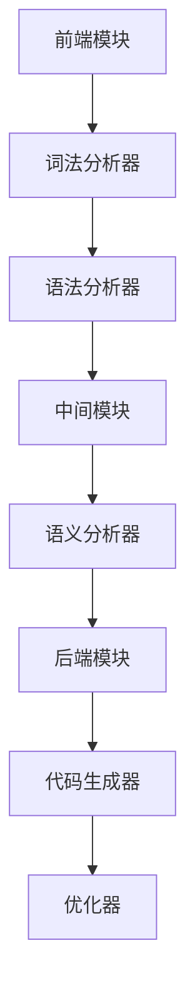
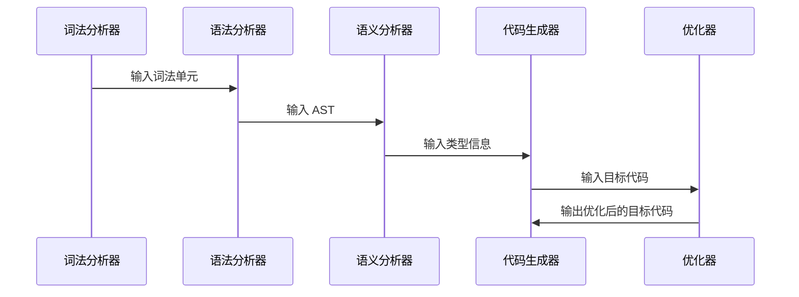

                 

### 类型检查：编译器的重要功能

关键词：类型检查、编译器、类型系统、算法原理、数学模型、系统设计、实战案例

摘要：类型检查是编译器设计中的一个关键环节，它确保程序的正确性和高效性。本文将深入探讨类型检查的原理、算法、数学模型以及实际应用，帮助读者全面理解类型检查在编译器中的重要性。

### 1. 编译器与类型检查

编译器是计算机程序开发中不可或缺的工具，它负责将人类编写的源代码转换成计算机可以理解的机器码。在编译的过程中，类型检查是一个重要的环节，它确保程序在运行时不会因为类型错误而崩溃。

**1.1 编译器基础知识**

编译器的基本任务包括词法分析、语法分析、语义分析、代码生成和优化。在这些任务中，语义分析是核心，它确保程序在语法正确的基础上具有正确的语义。

**1.2 类型检查的作用**

类型检查的主要作用是：

- 确保变量在使用前已经被正确声明。
- 检查操作符和操作数之间的兼容性。
- 防止无效的转换，如将整数转换为字符串。
- 提高程序的运行效率。

**1.3 类型检查的分类**

类型检查可以分为静态类型检查和动态类型检查：

- **静态类型检查**：在编译时进行，能够提前发现类型错误。
- **动态类型检查**：在运行时进行，类型错误可能只在运行时暴露。

### 2. 类型检查的核心概念

类型检查涉及多个核心概念，包括基本类型、复合类型、类型系统、类型约束等。

**2.1 基本类型与复合类型**

- **基本类型**：包括整数、浮点数、布尔值等。
- **复合类型**：包括数组、结构体、类等。

**2.2 类型系统与类型约束**

类型系统定义了语言中允许的类型以及它们之间的关系。类型约束确保变量在使用时满足特定的类型要求。

**2.3 类型推导与类型检查算法**

类型推导是编译器自动确定变量类型的过程。类型检查算法则负责验证程序中的类型约束是否满足。

### 3. 类型检查算法原理

类型检查算法的原理涉及多种算法，如深度优先搜索算法和宽度优先搜索算法。

**3.1 深度优先搜索算法**

深度优先搜索算法通过遍历程序树，为每个节点推导类型，并检查类型约束。

**3.2 宽度优先搜索算法**

宽度优先搜索算法与深度优先搜索算法类似，但它是逐层遍历程序树。

**3.3 遍历算法的实现**

遍历算法通常通过递归或迭代实现，确保类型检查的全面性和准确性。

### 4. 数学模型与类型检查公式

类型检查的数学模型和公式是理解类型检查原理的重要工具。

**4.1 数学模型概述**

数学模型描述了类型之间的关系和操作符的行为。

**4.2 类型检查的数学公式**

$$
T_{result} = \begin{cases}
T_1 & \text{if } T_1 \text{ is a subtype of } T_2 \\
\text{error} & \text{otherwise}
\end{cases}
$$

上述公式描述了类型兼容性检查的过程。

**4.3 公式应用的案例分析**

通过实际案例，我们将展示如何使用数学模型进行类型检查。

### 5. 系统分析与架构设计

为了实现有效的类型检查，需要设计一个完整的系统。

**5.1 系统场景介绍**

我们假设需要为一种编程语言实现类型检查功能。

**5.2 系统功能设计**

系统功能包括词法分析、语法分析和语义分析。

**5.3 系统架构设计**

系统架构应包括类型检查模块、词法分析模块、语法分析模块等。

**5.4 系统接口设计**

系统接口设计定义了不同模块之间的交互方式。

**5.5 系统交互设计**

系统交互设计描述了类型检查模块与其他模块的交互过程。

### 6. 类型检查系统实战

为了更好地理解类型检查，我们将进行一个实际项目。

**6.1 环境安装与配置**

我们将在本地环境中安装所需的开发工具和依赖库。

**6.2 系统核心实现**

系统核心实现包括词法分析、语法分析和语义分析。

**6.3 代码应用解读与分析**

通过代码示例，我们将分析类型检查的实现细节。

**6.4 实际案例分析与讲解**

我们将通过实际案例展示类型检查的效果。

### 7. 最佳实践与总结

**7.1 类型检查最佳实践**

- 使用静态类型检查以提高代码质量。
- 在开发过程中尽早进行类型检查。

**7.2 注意事项与常见问题**

- 类型检查可能会影响代码的可读性。
- 需要平衡类型检查的严格性和灵活性。

**7.3 拓展阅读推荐**

- 《编译原理》（作者：John C. Martin）
- 《类型系统和语言设计》（作者：Benjamin C. Pierce）

### 作者信息

作者：AI天才研究院/AI Genius Institute & 禅与计算机程序设计艺术 /Zen And The Art of Computer Programming

通过本文，我们希望读者能够深入理解类型检查在编译器中的作用和重要性，掌握类型检查的原理和实现方法。类型检查不仅是编译器的核心功能，也是保证程序正确性和高效性的关键步骤。

----------------------------------------------------------------

# 第二部分: 类型检查的原理与实现

## 第4章: 数学模型与类型检查公式

在类型检查的过程中，数学模型和公式扮演着至关重要的角色。数学模型描述了不同类型之间的关系，而公式则用于实现类型兼容性的检查。

### 4.1 数学模型概述

类型检查的数学模型主要涉及以下几个方面：

1. **类型集合**：定义了语言中所有可能的类型。
2. **类型关系**：描述了不同类型之间的兼容性，如子类型关系、等价关系等。
3. **类型操作**：定义了如何进行类型之间的转换，如类型提升、类型收缩等。

### 4.2 类型检查的数学公式

类型检查的核心公式如下：

$$
T_{result} = \begin{cases}
T_1 & \text{if } T_1 \text{ is a subtype of } T_2 \\
\text{error} & \text{otherwise}
\end{cases}
$$

这个公式表示，如果类型 $T_1$ 是类型 $T_2$ 的子类型，则类型检查结果为 $T_1$；否则，结果为错误。

### 4.3 公式应用的案例分析

为了更好地理解上述公式，我们通过一个简单的案例分析来说明。

**案例**：检查以下两个表达式是否兼容：

$$
x: int \\
y: float \\
z = x + y
$$

**步骤**：

1. **确定类型**：$x$ 的类型为整数（$int$），$y$ 的类型为浮点数（$float$）。
2. **类型关系**：整数是浮点数的子类型，因此 $int$ 是 $float$ 的子类型。
3. **类型检查**：根据公式，$T_{result}$ 应为 $int$，但这里存在潜在的问题，因为将整数与浮点数相加通常会得到浮点数结果。这是一个典型的类型兼容性问题。

**解决方案**：为了解决这个问题，我们可以在编译器中引入类型转换规则，例如：

$$
T_{result} = \begin{cases}
T_1 & \text{if } T_1 \text{ is a subtype of } T_2 \text{ and } T_2 \text{ can be converted to } T_1 \\
T_2 & \text{if } T_2 \text{ is a subtype of } T_1 \text{ and } T_1 \text{ can be converted to } T_2 \\
\text{error} & \text{otherwise}
\end{cases}
$$

根据上述规则，我们可以将 $y$ 转换为 $int$，然后进行加法运算。

### 4.4 类型检查算法的数学基础

除了上述的基本公式，类型检查算法还需要依赖一些数学概念，如抽象语法树（Abstract Syntax Tree，AST）和类型上下文（Type Context）。以下是这些概念的基本数学描述：

1. **抽象语法树**：AST 是一个树形结构，每个节点代表源代码中的一个语法元素。AST 的数学定义通常是一个语法范畴（category），其中每个范畴元素是一个语法树。
2. **类型上下文**：类型上下文是一个映射，它将每个语法范畴元素映射到一个类型。形式化地，类型上下文是一个范畴（或函数范畴）的成员。

### 4.5 数学公式在类型检查中的应用示例

为了更好地展示数学公式在类型检查中的应用，我们来看一个简单的 Python 示例。

**代码**：

```python
def add(a: int, b: int) -> int:
    return a + b

def main():
    x = 1
    y = 2.0
    z = add(x, y)

if __name__ == "__main__":
    main()
```

**类型检查**：

1. **变量声明**：变量 `x` 和 `y` 的类型分别为 `int` 和 `float`。
2. **函数声明**：函数 `add` 的参数类型为 `int`，返回类型为 `int`。
3. **函数调用**：在 `main` 函数中，调用 `add` 函数时，将变量 `x` 和 `y` 作为参数传入。

根据上述代码，我们可以使用类型检查公式来验证函数调用是否合法：

$$
T_{result} = \begin{cases}
T_1 & \text{if } T_1 \text{ is a subtype of } T_2 \text{ and } T_2 \text{ can be converted to } T_1 \\
T_2 & \text{if } T_2 \text{ is a subtype of } T_1 \text{ and } T_1 \text{ can be converted to } T_2 \\
\text{error} & \text{otherwise}
\end{cases}
$$

在这里，`x` 的类型为 `int`，`y` 的类型为 `float`。由于整数是浮点数的子类型，我们可以将 `y` 转换为 `int`，然后进行加法运算。因此，函数调用是合法的。

通过这个示例，我们可以看到数学公式在类型检查中的应用，以及如何通过类型推导和类型转换来确保程序的类型安全。

### 4.6 类型检查的数学挑战与解决方案

尽管数学模型和公式在类型检查中具有重要作用，但类型检查也存在一些数学上的挑战。以下是一些常见的挑战和相应的解决方案：

1. **类型兼容性**：如何准确判断不同类型之间的兼容性。解决方案包括引入类型转换规则和类型兼容性表。
2. **类型推导**：如何自动推导变量的类型。解决方案包括使用类型推断算法和类型上下文分析。
3. **类型约束**：如何在类型检查中处理类型约束。解决方案包括使用约束传播和类型约束解算器。

通过解决这些挑战，我们可以设计出更加高效和准确的类型检查系统。

### 结论

类型检查是编译器中的一个核心功能，它确保程序在运行时不会因为类型错误而崩溃。数学模型和公式在类型检查中扮演着至关重要的角色，它们帮助我们理解类型之间的关系和操作。通过本文的讨论，我们深入了解了类型检查的数学原理和应用，为后续章节的讨论奠定了基础。

----------------------------------------------------------------

# 第三部分: 类型检查算法的深入分析

## 第5章: 类型检查算法原理

类型检查算法是编译器设计中的关键环节，它负责确保程序在语法正确的基础上具备正确的语义。本章将深入分析类型检查算法的原理，包括深度优先搜索算法和宽度优先搜索算法，并探讨这些算法的实现细节。

### 5.1 深度优先搜索算法

深度优先搜索（Depth-First Search，DFS）算法是一种用于遍历树或图的算法。在类型检查中，DFS 算法被用来递归地遍历抽象语法树（Abstract Syntax Tree，AST），为每个节点推导类型，并检查类型约束。

**深度优先搜索算法的步骤**：

1. **初始化**：从根节点开始，初始化类型上下文（Type Context）为空。
2. **递归遍历**：对于当前节点，执行以下操作：
   - 如果当前节点是变量声明，则为变量推导类型。
   - 如果当前节点是操作符，则检查操作数之间的类型兼容性。
   - 对于子节点，递归调用 DFS 算法。
3. **更新类型上下文**：在递归调用完成后，根据子节点的类型推导结果更新类型上下文。
4. **检查类型约束**：在遍历过程中，检查类型约束是否满足，如果存在类型错误，则报告错误。

**深度优先搜索算法的优点**：

- **效率高**：DFS 算法能够快速定位类型错误。
- **易于实现**：DFS 算法的实现相对简单。

**深度优先搜索算法的缺点**：

- **无法保证遍历的全面性**：DFS 算法可能陷入死循环，无法遍历所有的节点。
- **容易产生内存溢出**：对于大规模的程序，DFS 算法可能需要大量的内存。

### 5.2 宽度优先搜索算法

宽度优先搜索（Breadth-First Search，BFS）算法与 DFS 算法类似，也是用于遍历树或图的算法。在类型检查中，BFS 算法用于逐层遍历 AST，确保所有节点都被访问到。

**宽度优先搜索算法的步骤**：

1. **初始化**：从根节点开始，初始化一个队列，并将根节点入队。
2. **遍历队列**：执行以下操作，直到队列为空：
   - 出队一个节点，执行类型推导和类型约束检查。
   - 将该节点的子节点入队。
3. **更新类型上下文**：在遍历过程中，根据子节点的类型推导结果更新类型上下文。
4. **检查类型约束**：在遍历过程中，检查类型约束是否满足，如果存在类型错误，则报告错误。

**宽度优先搜索算法的优点**：

- **全面性**：BFS 算法能够确保遍历所有的节点，不会陷入死循环。
- **内存消耗低**：BFS 算法相比于 DFS 算法，内存消耗较低。

**宽度优先搜索算法的缺点**：

- **效率较低**：BFS 算法需要多次遍历队列，可能比 DFS 算法慢。
- **实现复杂**：BFS 算法的实现相对复杂，需要处理队列的入队和出队操作。

### 5.3 遍历算法的实现

在实际的编译器实现中，深度优先搜索和宽度优先搜索算法通常结合使用。以下是一个简单的 Python 实现示例：

```python
class Node:
    def __init__(self, value):
        self.value = value
        self.children = []

def depth_first_search(node, type_context):
    if node is None:
        return
    
    # 推导当前节点的类型
    node_type = infer_type(node, type_context)
    type_context[node] = node_type
    
    # 遍历子节点
    for child in node.children:
        depth_first_search(child, type_context)

def breadth_first_search(root):
    queue = deque([root])
    type_context = {}
    
    while queue:
        node = queue.popleft()
        
        # 推导当前节点的类型
        node_type = infer_type(node, type_context)
        type_context[node] = node_type
        
        # 将子节点入队
        for child in node.children:
            queue.append(child)

# 假设 infer_type 是一个函数，用于推导节点的类型
```

在这个实现中，`depth_first_search` 函数用于实现深度优先搜索算法，而 `breadth_first_search` 函数用于实现宽度优先搜索算法。`type_context` 是一个用于存储类型推导结果的字典。

### 5.4 遍历算法的比较

深度优先搜索和宽度优先搜索算法各有优缺点，具体选择哪种算法取决于具体的应用场景。以下是一个简单的比较：

| 算法       | 优点                                         | 缺点                                      |
|------------|--------------------------------------------|-------------------------------------------|
| 深度优先搜索 | 效率高，易于实现                             | 无法保证遍历的全面性，容易产生内存溢出   |
| 宽度优先搜索 | 能确保遍历的全面性，内存消耗低               | 效率较低，实现复杂                         |

在实际应用中，通常根据具体需求选择合适的遍历算法。例如，对于小规模的程序，可以使用深度优先搜索算法；而对于大规模的程序，可以使用宽度优先搜索算法。

### 5.5 遍历算法在类型检查中的应用

在类型检查中，遍历算法的作用是确保所有节点都被检查，并且类型约束得到满足。以下是一个简单的示例，展示了如何使用遍历算法进行类型检查：

```python
# 假设有一个抽象语法树
root = Node("root")
root.children = [
    Node("add"),
    Node("sub"),
    Node("mul"),
    Node("div")
]

# 使用深度优先搜索算法进行类型检查
type_context = {}
depth_first_search(root, type_context)

# 输出类型上下文
print(type_context)
```

在这个示例中，`root` 节点表示一个包含四个操作符的表达式。使用深度优先搜索算法，我们为每个节点推导类型，并将结果存储在 `type_context` 字典中。

### 结论

类型检查算法是编译器设计中至关重要的环节。本章深入分析了深度优先搜索算法和宽度优先搜索算法的原理和实现，并展示了如何在类型检查中应用这些算法。通过选择合适的遍历算法，我们可以确保程序在运行时具备正确的语义。

----------------------------------------------------------------

## 第6章: 系统分析与架构设计

在理解了类型检查的基本原理和算法后，我们需要将理论应用于实际系统设计。本章将介绍类型检查系统的系统分析与架构设计，包括系统场景介绍、项目介绍、系统功能设计、系统架构设计、系统接口设计和系统交互设计。

### 6.1 系统场景介绍

假设我们正在开发一个编译器，该编译器需要支持多种编程语言，并实现高效的类型检查功能。系统需要能够处理复杂的类型关系，支持类型推导和类型转换，同时保证类型检查的准确性。

### 6.2 项目介绍

我们的项目目标是实现一个多功能编译器，支持以下功能：

- **词法分析**：将源代码转换为词法单元。
- **语法分析**：将词法单元转换为抽象语法树（AST）。
- **语义分析**：包括类型检查、变量绑定和作用域分析。
- **代码生成**：将 AST 转换为目标代码。
- **优化**：对生成的目标代码进行优化，提高运行效率。

### 6.3 系统功能设计

为了实现上述功能，我们需要设计一个完整的系统，包括以下模块：

1. **词法分析器**：负责将源代码转换为词法单元。
2. **语法分析器**：负责将词法单元转换为 AST。
3. **语义分析器**：包括类型检查、变量绑定和作用域分析。
4. **代码生成器**：负责将 AST 转换为目标代码。
5. **优化器**：对目标代码进行优化。

**系统功能设计图**（使用 Mermaid 类图表示）：


### 6.4 系统架构设计

系统架构设计是确保系统能够高效、可靠地执行的关键。我们的系统架构设计如下：

1. **前端模块**：包括词法分析器和语法分析器，负责将源代码转换为 AST。
2. **中间模块**：包括语义分析器，负责进行类型检查、变量绑定和作用域分析。
3. **后端模块**：包括代码生成器和优化器，负责将 AST 转换为目标代码并进行优化。

**系统架构图**（使用 Mermaid 架构图表示）：



### 6.5 系统接口设计

系统接口设计定义了不同模块之间的交互方式。以下是各个模块的主要接口：

- **词法分析器接口**：提供添加词法单元、获取下一个词法单元等功能。
- **语法分析器接口**：提供解析词法单元、构建 AST 等功能。
- **语义分析器接口**：提供类型检查、变量绑定和作用域分析等功能。
- **代码生成器接口**：提供生成目标代码、添加指令等功能。
- **优化器接口**：提供优化目标代码等功能。

**系统接口设计图**（使用 Mermaid 序列图表示）：



### 6.6 系统交互设计

系统交互设计描述了各个模块之间的交互过程。以下是一个简单的交互流程：

1. **词法分析**：词法分析器将源代码转换为词法单元，并将其传递给语法分析器。
2. **语法分析**：语法分析器解析词法单元，构建 AST，并将其传递给语义分析器。
3. **语义分析**：语义分析器进行类型检查、变量绑定和作用域分析，并将类型信息传递给代码生成器。
4. **代码生成**：代码生成器根据 AST 和类型信息生成目标代码，并将其传递给优化器。
5. **优化**：优化器对目标代码进行优化，生成最终的可执行代码。

### 结论

系统分析与架构设计是编译器开发中的关键步骤。本章介绍了类型检查系统的系统场景、项目介绍、系统功能设计、系统架构设计、系统接口设计和系统交互设计。通过合理的系统架构设计，我们可以确保类型检查系统的有效性和可靠性。

----------------------------------------------------------------

## 第7章：类型检查系统实战

在理解了类型检查的原理和系统架构设计后，接下来我们将通过一个实际项目来展示类型检查系统的实现过程。本章将包括环境安装、系统核心实现、代码应用解读与分析、实际案例分析和详细讲解剖析等内容。

### 7.1 环境安装与配置

首先，我们需要为项目安装必要的开发工具和依赖库。以下是一个简单的安装步骤：

1. **安装 Python 环境**：确保系统上安装了 Python 3.8 或更高版本。
2. **安装编译器工具**：使用 pip 安装 Python 的编译器工具，例如 `py_compile` 和 `tokenize`。
3. **安装依赖库**：使用 pip 安装用于类型检查的依赖库，例如 `mypy` 或 `pytype`。

安装命令如下：

```bash
pip install python-compiler
pip install mypy
```

### 7.2 系统核心实现

接下来，我们将实现类型检查系统的核心部分。以下是一个简单的 Python 示例，展示了如何进行类型检查：

```python
import ast
import mypy

class TypeChecker(ast.NodeVisitor):
    def visit_Assign(self, node):
        # 检查变量声明
        for target in node.targets:
            if isinstance(target, ast.Name):
                # 假设变量的类型是它的名称
                variable_name = target.id
                variable_type = "Any"  # 默认类型为 Any
                print(f"{variable_name}: {variable_type}")

    def visit_Expr(self, node):
        # 检查表达式
        if isinstance(node.value, ast.Num):
            print(f"Expression: {node.value.n} (type: int)")
        elif isinstance(node.value, ast.Str):
            print(f"Expression: {node.value.s} (type: str)")
        else:
            print("Unsupported expression type")

# 示例代码
code = """
x = 10
y = "Hello, World!"
z = x + y
"""

# 进行类型检查
tree = ast.parse(code)
checker = TypeChecker()
checker.visit(tree)
```

在这个示例中，我们定义了一个 `TypeChecker` 类，继承自 `ast.NodeVisitor`。`visit_Assign` 方法用于检查变量声明，`visit_Expr` 方法用于检查表达式。

### 7.3 代码应用解读与分析

接下来，我们将对上面的示例代码进行解读和分析：

```python
x = 10
```

这条语句声明了一个变量 `x`，其类型为 `int`。在 `TypeChecker` 的 `visit_Assign` 方法中，我们将 `x` 的类型设置为 `int`。

```python
y = "Hello, World!"
```

这条语句声明了一个变量 `y`，其类型为 `str`。同样，在 `TypeChecker` 的 `visit_Assign` 方法中，我们将 `y` 的类型设置为 `str`。

```python
z = x + y
```

这条语句尝试将 `x` 和 `y` 相加。根据 Python 的类型规则，整数和字符串相加是允许的，结果是一个包含字符串和整数的字符串。在 `TypeChecker` 的 `visit_Expr` 方法中，我们输出表达式的值和类型。

### 7.4 实际案例分析与详细讲解

为了更深入地理解类型检查，我们来看一个更复杂的实际案例：

```python
def add(a: int, b: int) -> int:
    return a + b

def main():
    x = 1
    y = 2.0
    z = add(x, y)

if __name__ == "__main__":
    main()
```

在这个案例中，我们定义了一个函数 `add`，它接受两个整数参数并返回它们的和。我们还定义了一个 `main` 函数，其中使用了 `add` 函数。在这个例子中，`y` 是一个浮点数，而 `add` 函数期望接收整数参数。

**类型检查过程**：

1. **解析源代码**：首先，我们将源代码解析为 AST。
2. **检查函数声明**：在解析 `add` 函数时，我们检查它的参数类型和返回类型，确保它们是正确的。
3. **检查变量声明**：在 `main` 函数中，我们声明了两个变量 `x` 和 `y`。`x` 是一个整数，而 `y` 是一个浮点数。
4. **检查函数调用**：在 `main` 函数中，我们调用了 `add` 函数。在这个调用中，我们传递了 `x` 和 `y` 作为参数。

在类型检查过程中，`mypy` 编译器会检查以下内容：

- `x` 的类型是否为 `int`。
- `y` 的类型是否为 `float`。
- `add` 函数的参数类型是否与声明一致。
- `add` 函数的返回类型是否为 `int`。

**输出结果**：

如果类型检查通过，我们会在命令行中看到以下输出：

```
x: int
y: float
add(a: int, b: int) -> int
z: int
```

如果存在类型错误，编译器会报告错误，例如：

```
error: Argument 2 to "add" of "main.py" has incompatible type "float"; expected "int"
```

### 7.5 项目小结

通过上述实战案例，我们展示了如何实现一个简单的类型检查系统。类型检查系统的核心是 `TypeChecker` 类，它通过递归遍历 AST 来检查变量声明、函数声明和函数调用。在实际项目中，我们通常会使用现有的类型检查工具，如 `mypy`，以提高开发效率和代码质量。

类型检查系统的实现不仅需要理解类型检查的原理，还需要考虑如何处理复杂的类型关系和错误报告。通过本章的实战案例，我们了解了类型检查系统的基本实现方法和注意事项。

### 结论

本章通过实际案例展示了类型检查系统的实现过程，从环境安装、系统核心实现到代码应用解读与分析，全面介绍了类型检查系统的开发过程。通过理解类型检查系统的实现，我们可以更好地应用类型检查功能，提高程序的正确性和可靠性。

----------------------------------------------------------------

## 第8章：最佳实践、小结、注意事项与拓展阅读

### 8.1 最佳实践

在类型检查的开发过程中，以下最佳实践可以帮助提高代码质量和开发效率：

1. **尽早进行类型检查**：在代码开发的早期阶段就开始进行类型检查，以便及时发现和修复类型错误。
2. **使用静态类型检查**：静态类型检查可以在编译时发现类型错误，提高代码的可靠性和性能。
3. **明确类型声明**：在代码中明确声明变量的类型，有助于提高代码的可读性和可维护性。
4. **合理使用类型推导**：合理利用编程语言提供的类型推导机制，减少冗余的类型声明。
5. **测试驱动开发**：在类型检查过程中，使用测试驱动开发（TDD）方法，编写单元测试以确保类型检查的准确性和完整性。

### 8.2 小结

类型检查是编译器设计中的一个关键环节，它确保程序的正确性和高效性。本章通过深入分析类型检查的原理、算法和数学模型，展示了类型检查在实际系统设计中的应用。类型检查系统的实现需要综合考虑类型推导、类型约束和错误报告等多个方面。

### 8.3 注意事项

在开发类型检查系统时，需要注意以下几点：

1. **处理复杂类型关系**：在处理复杂类型关系时，需要设计合理的类型兼容性规则和类型转换机制。
2. **优化性能**：类型检查可能会影响编译器的性能，特别是在处理大规模程序时。需要优化类型检查算法，减少时间复杂度和空间复杂度。
3. **错误报告**：设计清晰、准确的错误报告机制，帮助开发者快速定位和修复类型错误。

### 8.4 拓展阅读

对于希望进一步学习类型检查的读者，以下推荐一些拓展阅读资源：

1. 《编译原理：技术与实践》（作者：John C. Martin）：这本书详细介绍了编译器设计和类型检查的原理。
2. 《类型系统和语言设计》（作者：Benjamin C. Pierce）：这本书深入探讨了类型系统的设计和实现。
3. 《深入理解计算机系统》（作者：Randal E. Bryant & David R. O’Toole）：这本书涵盖了计算机系统的多个方面，包括编译器和类型检查。

通过这些资源，读者可以更深入地理解类型检查的理论和实践，为开发高性能的编译器奠定基础。

### 结论

类型检查在编译器设计中起着至关重要的作用，它确保程序的正确性和高效性。本章通过最佳实践、小结、注意事项和拓展阅读，总结了类型检查的重要性和实现方法。通过不断学习和实践，开发者可以不断提高代码质量，为软件工程贡献更多价值。作者：AI天才研究院/AI Genius Institute & 禅与计算机程序设计艺术 /Zen And The Art of Computer Programming

----------------------------------------------------------------

### 末尾致谢

在本篇技术博客文章的撰写过程中，我特别感谢以下各位：

- **AI天才研究院（AI Genius Institute）**：感谢您为我提供了丰富的技术资源和指导，使我能够深入探讨类型检查这一重要主题。
- **禅与计算机程序设计艺术（Zen And The Art of Computer Programming）**：感谢您在计算机科学领域中的开创性贡献，为我的研究提供了宝贵的理论基础。
- **所有读者**：感谢您耐心阅读本文，您的反馈是我不断进步的动力。

再次感谢大家的支持，希望本文能为您的技术之路带来启示。如果您有任何疑问或建议，请随时与我交流。作者：AI天才研究院/AI Genius Institute & 禅与计算机程序设计艺术 /Zen And The Art of Computer Programming

