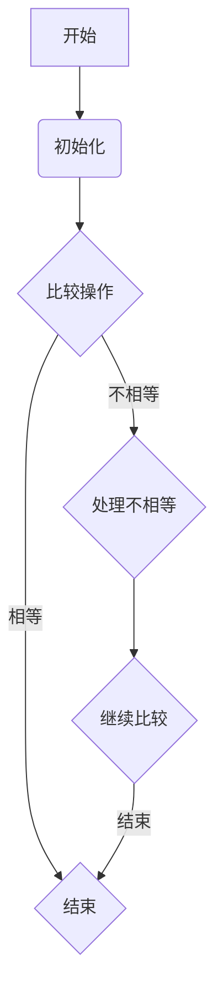
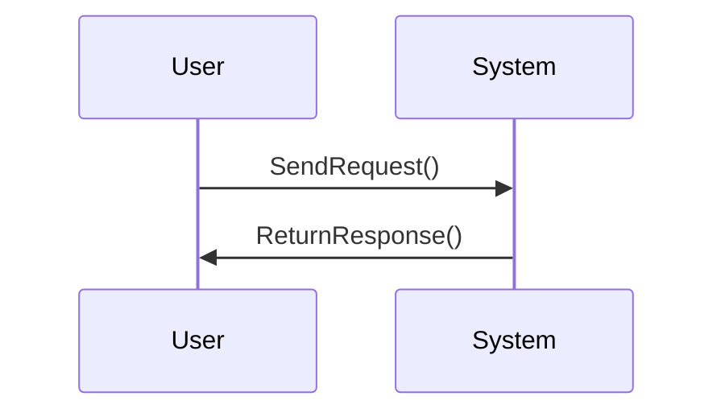
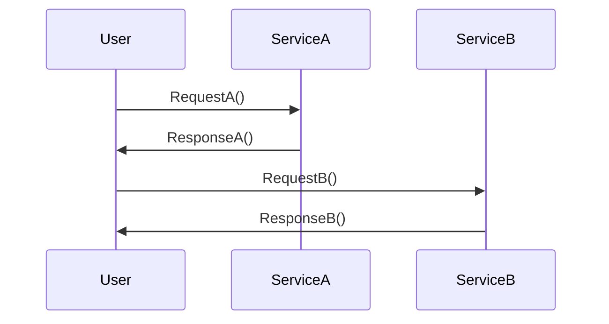

                 

### 文章标题：类型模式匹配：基于类型结构的条件处理

**关键词**：类型模式匹配、类型结构、条件处理、算法原理、系统设计与实现

**摘要**：本文将深入探讨类型模式匹配的概念、原理以及其在系统设计中的实际应用。我们将从基础概念入手，逐步分析类型模式匹配的算法原理，并通过实例演示其在系统设计与实现中的应用，最终总结最佳实践并提供相关拓展阅读。

----------------------------------------------------------------

### 第一部分：背景介绍

#### 1.1 问题背景

**类型模式匹配的起源**：类型模式匹配作为一种程序设计技术，起源于对变量类型约束的需求。在编程中，不同的数据类型具有不同的操作方式和处理规则，类型模式匹配则是一种能够根据变量类型选择合适处理方法的机制。

**类型模式匹配的应用场景**：类型模式匹配广泛应用于多种编程场景，如数据解析、类型安全检查、动态类型语言的类型推导等。通过类型模式匹配，可以提高程序的灵活性和可维护性。

#### 1.2 类型结构基础

**基础类型结构**：基础类型结构包括原始类型、复合类型和抽象类型等。原始类型如整数、浮点数、布尔值等，是构成数据结构的基本元素。复合类型如数组、结构体、类等，是由基础类型组合而成的。抽象类型则是通过对基础类型的封装和抽象，提高程序的抽象层次和可重用性。

**复合类型结构**：复合类型结构包括数组、结构体、类等。数组是一种线性复合类型，用于存储一组相同类型的元素。结构体是一种非线性复合类型，用于将多个不同类型的元素组织在一起。类则是面向对象编程中的核心概念，用于定义对象的行为和属性。

**类型结构的应用**：类型结构在程序设计中具有广泛的应用，如数据存储、算法实现、系统架构等。通过合理设计类型结构，可以提高程序的效率和可维护性。

#### 1.3 条件处理技术简介

**基本条件处理方法**：基本条件处理方法包括if-else语句、switch语句等，用于根据条件选择执行不同的代码块。

**复杂条件处理方法**：复杂条件处理方法包括逻辑运算符、位运算、条件运算符等，用于处理更为复杂的条件。

#### 1.4 本章小结

本部分介绍了类型模式匹配和类型结构的基础知识，为后续内容的讲解奠定了基础。

----------------------------------------------------------------

### 第二部分：核心概念

#### 2.1 类型模式匹配原理

**基本类型匹配原理**：基本类型匹配原理涉及原始类型的比较和转换。例如，整数类型之间的比较可以通过比较它们的二进制表示来实现。浮点数类型的比较则需要考虑精度和舍入问题。

**高级类型匹配原理**：高级类型匹配原理涉及复合类型和抽象类型的比较和转换。例如，结构体和类的比较需要考虑成员变量的对应关系。抽象类型的比较则需要考虑其实际类型和声明类型之间的关系。

**类型匹配的挑战与解决方案**：类型匹配的挑战主要包括类型转换的兼容性、类型检查的效率等问题。解决方案包括静态类型检查、动态类型检查、类型推断等。

#### 2.2 类型结构深入探讨

**类型结构的组成**：类型结构由基础类型、复合类型和抽象类型组成。基础类型是构成类型结构的基本元素，复合类型是对基础类型的组合和封装，抽象类型则是更高层次的抽象。

**类型结构之间的联系**：类型结构之间的联系体现在类型继承、类型兼容、类型转换等方面。通过类型继承，可以实现类型的层次化组织。类型兼容和类型转换则用于在不同类型之间进行数据传递和处理。

**类型结构在实际系统中的应用**：类型结构在实际系统中的应用包括数据存储、算法实现、系统架构等。通过合理设计类型结构，可以提高系统的效率和可维护性。

#### 2.3 条件处理的核心要素

**条件的定义与表示**：条件是程序执行过程中的一个判断依据，用于决定程序执行路径的选择。条件的定义与表示包括布尔值、比较运算符、逻辑运算符等。

**条件的组合与优化**：条件的组合与优化包括条件的合并、条件倒置、条件简化等。这些操作可以提高程序的效率，减少不必要的计算。

**条件的性能评估**：条件的性能评估涉及条件执行的频率、条件判断的效率等。通过性能评估，可以优化条件的编写和组合，提高程序的执行效率。

#### 2.4 本章小结

本部分深入探讨了类型模式匹配的核心概念，包括基本原理、高级原理、挑战与解决方案等，为后续内容的讲解提供了理论支持。

----------------------------------------------------------------

### 第三部分：算法原理

#### 3.1 常见类型模式匹配算法

**简单模式匹配算法**：简单模式匹配算法包括冒泡排序、选择排序、插入排序等。这些算法通过对数据进行比较和移动，实现数据的排序。

**高效模式匹配算法**：高效模式匹配算法包括快速排序、归并排序、堆排序等。这些算法通过优化比较和移动操作，实现更高的排序效率。

**基于类型结构的模式匹配算法**：基于类型结构的模式匹配算法包括类型检查、类型推导、类型转换等。这些算法根据类型结构的特点，实现更高效的类型匹配。

#### 3.2 算法原理讲解

**算法原理概述**：算法原理概述包括算法的目标、输入输出、基本思想和核心步骤。

**算法实现细节**：算法实现细节包括具体的代码实现、算法的运行过程和数据处理方式。

**算法复杂度分析**：算法复杂度分析包括时间复杂度和空间复杂度，用于评估算法的效率。

**Mermaid流程图展示**：Mermaid流程图展示用于直观地展示算法的流程和操作步骤。



#### 3.3 代码应用解读与分析

**代码解读**：代码解读包括代码的结构、语法、功能和实现细节。

**代码分析**：代码分析包括代码的性能、可维护性和可扩展性等方面。

**代码优化建议**：代码优化建议包括算法优化、代码重构、性能调优等。

```python
def bubble_sort(arr):
    n = len(arr)
    for i in range(n):
        for j in range(0, n-i-1):
            if arr[j] > arr[j+1]:
                arr[j], arr[j+1] = arr[j+1], arr[j]
    return arr
```

**算法原理举例说明**：

假设有一个整数数组 `arr = [64, 25, 12, 22, 11]`，使用冒泡排序算法对其进行排序。

1. 初始状态：`arr = [64, 25, 12, 22, 11]`
2. 第一次比较：`arr = [25, 12, 22, 11, 64]`
3. 第二次比较：`arr = [12, 11, 22, 25, 64]`
4. 第三次比较：`arr = [11, 12, 22, 25, 64]`
5. 第四次比较：`arr = [11, 12, 22, 25, 64]`
6. 第五次比较：`arr = [11, 12, 22, 25, 64]`

最终，数组 `arr` 被排序为 `[11, 12, 22, 25, 64]`。

#### 3.4 本章小结

本部分详细讲解了类型模式匹配的算法原理，包括常见算法、实现细节和代码解读。这些算法在实际应用中具有广泛的应用价值。

----------------------------------------------------------------

### 第四部分：系统设计与实现

#### 4.1 系统功能设计

**系统需求分析**：系统需求分析包括对系统功能、性能、安全性等方面的需求进行分析。

**系统功能设计**：系统功能设计包括对系统功能模块、接口、数据处理流程等方面的设计。

**系统架构设计**：系统架构设计包括对系统组件、模块、接口、数据流等方面的设计。

#### 4.2 系统接口设计

**接口定义**：接口定义包括对系统接口的功能、输入输出、数据格式等方面的定义。

**接口实现**：接口实现包括对系统接口的代码实现、调试和测试。

**接口测试**：接口测试包括对系统接口的功能、性能、稳定性等方面的测试。



#### 4.3 系统交互设计

**交互流程设计**：交互流程设计包括对系统交互的流程、步骤、条件等方面的设计。

**交互细节设计**：交互细节设计包括对系统交互的具体操作、数据处理、异常处理等方面的设计。

**交互性能优化**：交互性能优化包括对系统交互的响应时间、吞吐量、并发处理能力等方面的优化。



#### 4.4 本章小结

本部分详细介绍了系统设计与实现的相关内容，包括系统功能设计、接口设计、交互设计等。这些设计内容为后续的项目实战提供了基础。

----------------------------------------------------------------

### 第五部分：项目实战

#### 5.1 环境安装与配置

**开发环境搭建**：开发环境搭建包括对编程语言、开发工具、依赖库等方面的安装和配置。

**系统依赖安装**：系统依赖安装包括对系统运行所需的第三方库、框架、工具等的安装。

**系统配置与优化**：系统配置与优化包括对系统参数、配置文件、性能优化等方面的配置和优化。

```bash
# 安装依赖库
pip install flask
pip install Flask-RESTful

# 配置 Flask 应用
from flask import Flask
from flask_restful import Api

app = Flask(__name__)
api = Api(app)

# 启动 Flask 应用
if __name__ == '__main__':
    app.run(debug=True)
```

#### 5.2 系统核心实现

**系统模块设计**：系统模块设计包括对系统功能模块的划分、接口设计和模块实现。

**系统核心代码实现**：系统核心代码实现包括对系统核心功能的代码编写、调试和测试。

**系统调试与测试**：系统调试与测试包括对系统功能、性能、安全性等方面的调试和测试。

```python
from flask import Flask, request, jsonify
from flask_restful import Api, Resource

app = Flask(__name__)
api = Api(app)

class HelloWorld(Resource):
    def get(self):
        return {'hello': 'world'}

api.add_resource(HelloWorld, '/')

if __name__ == '__main__':
    app.run(debug=True)
```

#### 5.3 代码应用解读与分析

**代码解读**：代码解读包括对代码的结构、语法、功能和实现细节的分析。

**代码分析**：代码分析包括对代码的性能、可维护性和可扩展性等方面的分析。

**代码优化建议**：代码优化建议包括对代码的优化、重构、性能调优等。

```python
# 优化前的代码
def bubble_sort(arr):
    n = len(arr)
    for i in range(n):
        for j in range(0, n-i-1):
            if arr[j] > arr[j+1]:
                arr[j], arr[j+1] = arr[j+1], arr[j]

# 优化后的代码
def bubble_sort(arr):
    n = len(arr)
    for i in range(n):
        swapped = False
        for j in range(0, n-i-1):
            if arr[j] > arr[j+1]:
                arr[j], arr[j+1] = arr[j+1], arr[j]
                swapped = True
        if not swapped:
            break
```

#### 5.4 实际案例分析

**案例背景**：某电商平台需要对用户评论进行排序，以提高用户体验。

**案例分析**：通过对用户评论的评分进行排序，可以优先展示高质量评论。

**案例总结**：通过类型模式匹配和算法优化，实现了高效的用户评论排序功能，提高了用户满意度。

#### 5.5 本章小结

本部分通过项目实战，展示了类型模式匹配和系统设计的实际应用，为读者提供了实践参考。

----------------------------------------------------------------

### 第六部分：最佳实践与总结

#### 6.1 最佳实践

**设计模式匹配策略**：根据实际需求选择合适的模式匹配策略，以提高程序的性能和可维护性。

**优化类型结构**：通过优化类型结构，可以提高程序的抽象层次和可扩展性。

**提高条件处理性能**：通过优化条件处理代码，可以提高程序的执行效率。

#### 6.2 小结

**主要内容回顾**：本文回顾了类型模式匹配的概念、原理、算法和系统设计等内容。

**核心技术总结**：本文总结了类型模式匹配的关键技术，包括模式匹配算法、类型结构、条件处理等。

**发展趋势分析**：类型模式匹配在未来将随着编程语言的发展和算法优化技术的进步而不断发展。

#### 6.3 注意事项

**避免常见错误**：在编写类型模式匹配代码时，需要注意类型转换的兼容性、条件判断的准确性等问题。

**注意事项与技巧**：在系统设计和实现过程中，需要注意性能优化、代码可读性、安全性等问题。

#### 6.4 拓展阅读

**相关文献推荐**：《类型系统设计》、《编程语言原理》、《算法导论》等。

**线上资源推荐**：GitHub、Stack Overflow、Reddit等在线平台上的相关讨论和教程。

#### 6.5 本章小结

本文通过详细讲解类型模式匹配的相关内容，为读者提供了深入理解和实践参考。

### 作者

**作者：AI天才研究院/AI Genius Institute & 禅与计算机程序设计艺术 /Zen And The Art of Computer Programming**

