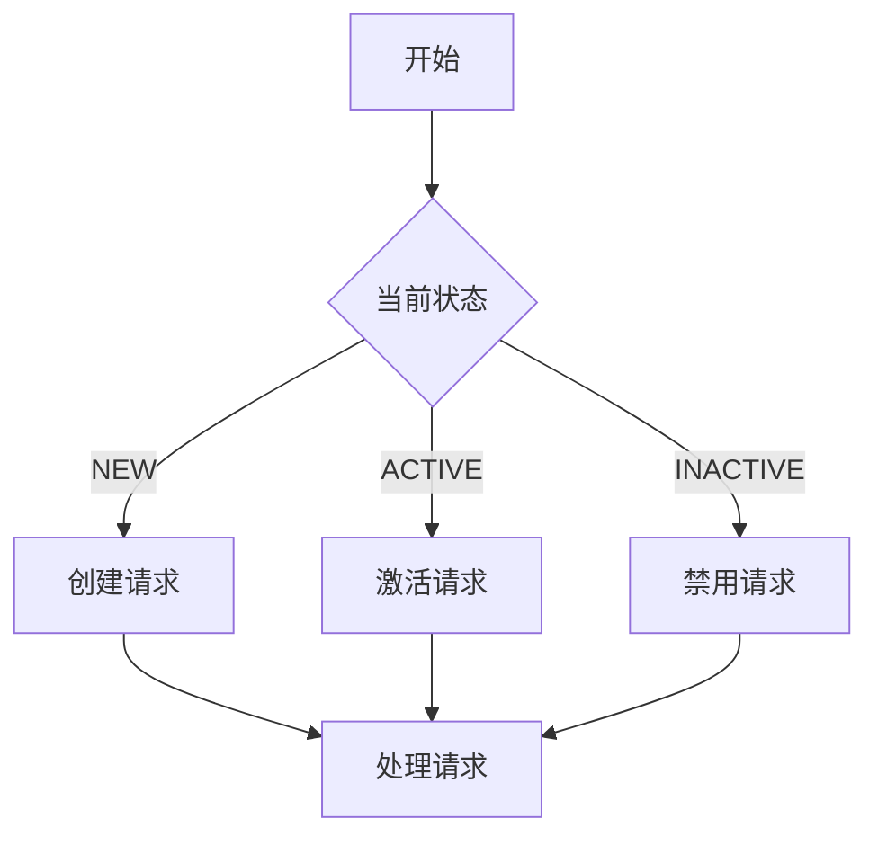
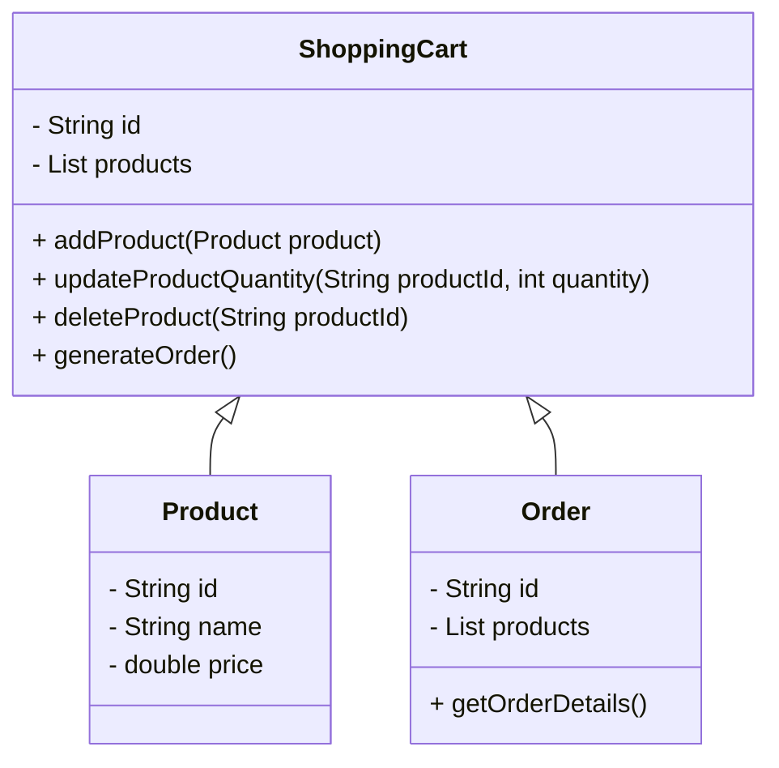
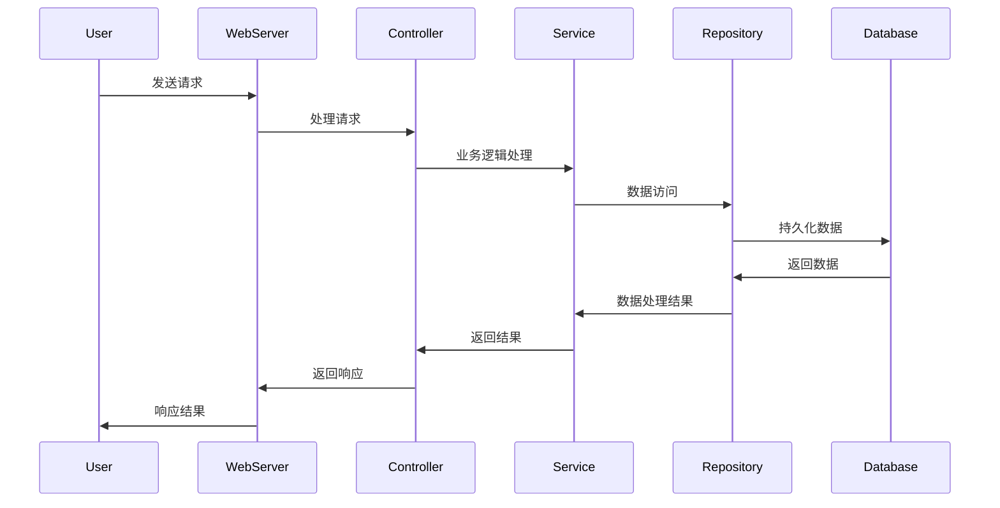
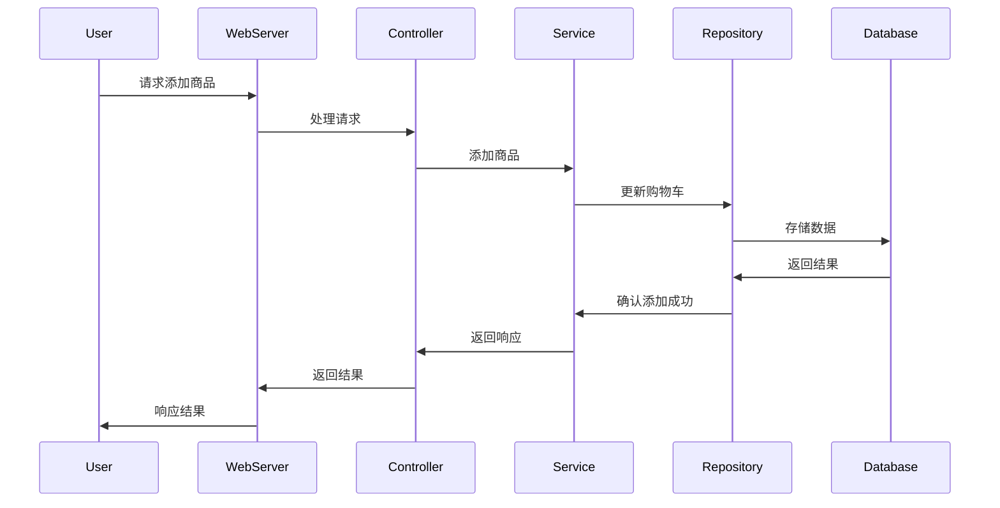

                 

### 文章标题：类型状态：在类型层面对象状态建模

#### 关键词：类型状态、对象状态建模、面向对象编程、状态机、算法原理、系统架构设计

#### 摘要：
本文旨在深入探讨类型状态在面向对象编程中的应用，通过对类型状态的详细解析，介绍其在对象状态建模中的重要性。文章首先梳理了类型状态的基本概念、核心要素和建模方法，然后通过具体算法原理讲解、系统架构设计以及实战案例，展示了类型状态建模的实践应用。本文旨在为开发者提供全面而深入的技术指南，帮助理解类型状态在软件设计中的关键作用。

### 引言

面向对象编程（OOP）是现代软件工程中最常用的编程范式之一。它通过将现实世界中的对象抽象为编程语言中的类和对象，极大地提高了软件的可重用性和可维护性。然而，在面向对象编程中，对象的状态管理是一个复杂且重要的问题。传统的对象状态建模方法在应对复杂状态变化时往往显得力不从心，无法充分满足现代软件系统的需求。

随着软件系统规模的扩大和复杂性的增加，对象状态管理变得越来越重要。类型状态作为一种新的对象状态建模方法，它在类型层次上对对象状态进行建模，使得状态管理和变更更加灵活和高效。本文将深入探讨类型状态的概念、核心要素、建模方法以及其在实际应用中的重要性，旨在为开发者提供一种全新的思路，帮助他们在软件开发中更好地管理对象状态。

### 第一部分：背景介绍

#### 1.1 问题背景

##### 1.1.1 面向对象的起源与类型状态

面向对象编程起源于20世纪60年代的Simula语言，随后在1970年代由Smalltalk语言进一步完善。面向对象编程的核心思想是将现实世界中的实体抽象为程序中的对象，每个对象都有自己的属性（状态）和行为。在面向对象编程中，对象的状态管理是一个核心问题。传统的对象状态建模方法包括单一状态模式、状态机模式等，但它们在面对复杂状态变化时往往不够灵活。

类型状态是一种在类型层次上对对象状态进行建模的方法。它通过在类型层面上定义不同的状态，使得对象的状态变化可以通过类型转换来实现。类型状态最早在Ada编程语言中得到了应用，随后在C++、Java等现代编程语言中得到了进一步的发展。

##### 1.1.2 类型状态在面向对象设计中的重要性

类型状态在面向对象设计中具有重要地位。首先，它使得状态管理更加简洁和直观。通过在类型层次上定义状态，开发者可以更容易地理解和修改对象的状态。其次，类型状态提高了代码的可重用性和可维护性。通过将状态与类型分离，可以方便地在不同对象之间共享状态，从而减少代码冗余。

然而，类型状态在面向对象设计中也面临一些挑战。首先是如何有效地定义和管理状态类型，其次是如何保证状态转换的合法性。此外，类型状态模型可能引入额外的复杂度，特别是在大型系统中。因此，理解类型状态的核心概念和有效建模方法对于开发者来说至关重要。

##### 1.1.3 当前对象状态建模的挑战

当前对象状态建模方法在面对复杂状态变化时存在以下挑战：

1. **状态过多导致复杂性**：随着系统规模的扩大，对象可能需要管理多种状态，导致状态数量急剧增加，使得状态管理变得复杂。
2. **状态转换不灵活**：传统的状态机模式在处理状态转换时往往不够灵活，难以应对动态变化的场景。
3. **状态共享困难**：在面向对象编程中，状态通常与对象紧密绑定，导致状态共享困难，不利于代码重用。
4. **维护难度大**：随着状态数量的增加，状态管理代码的复杂度也随之增加，使得维护变得更加困难。

类型状态作为一种新型的对象状态建模方法，旨在解决上述问题。通过在类型层次上定义和管理状态，类型状态能够提供更简洁、灵活和高效的状态管理方式。

#### 1.2 类型状态定义与核心要素

##### 1.2.1 类型状态的定义

类型状态是指在一个类型（如类或接口）中定义的不同状态集合。每个状态都可以通过一个唯一的类型标识来表示。类型状态的核心思想是将对象的状态与类型紧密关联，使得对象的状态变化可以通过类型转换来实现。

在面向对象编程中，对象的状态通常包括内部数据和行为的组合。类型状态通过在类型层次上定义不同的状态，使得每个状态具有明确的类型标识，从而简化了状态管理。

##### 1.2.2 类型状态的构成要素

类型状态由以下几个核心要素构成：

1. **状态类型**：状态类型是类型状态的核心要素，它定义了对象可能处于的不同状态。每个状态类型都具有独特的特征和行为。
2. **状态转换**：状态转换定义了对象在不同状态之间如何切换。状态转换可以是显式的，也可以是隐式的。显式状态转换通常通过条件判断或回调函数实现，而隐式状态转换则可以通过类型转换自动完成。
3. **状态共享**：类型状态支持状态共享，使得不同对象可以共享相同的状态。状态共享可以通过封装和继承来实现，从而提高代码的可重用性和可维护性。
4. **状态安全性**：类型状态通过类型检查来保证状态转换的安全性。在类型状态模型中，状态转换只能在合法的状态之间进行，从而避免了不合法的状态切换。

##### 1.2.3 类型状态的属性与特征

类型状态具有以下属性和特征：

1. **确定性**：类型状态模型中的状态转换是确定的，每个状态转换都有明确的类型标识和执行路径。
2. **灵活性**：类型状态模型通过在类型层次上定义状态，使得状态转换更加灵活。开发者可以根据需要定义新的状态类型和状态转换规则。
3. **可扩展性**：类型状态模型易于扩展。开发者可以方便地添加新的状态类型和状态转换，以适应不断变化的业务需求。
4. **安全性**：类型状态模型通过类型检查来保证状态转换的安全性，从而避免不合法的状态切换。

#### 1.3 类型状态建模方法比较

##### 1.3.1 传统对象状态建模方法

传统的对象状态建模方法主要包括单一状态模式、状态机模式等。单一状态模式通过在对象内部维护一个当前状态变量，实现对对象状态的表示。状态机模式则通过定义一系列的状态和状态转换规则，实现对对象状态的管理。

单一状态模式的优点是实现简单，但缺点是灵活性不足，难以应对复杂的状态变化。状态机模式则提供了更高的灵活性，但实现复杂，维护难度大。

##### 1.3.2 类型状态建模的新方法

类型状态建模方法通过在类型层次上定义和管理状态，提供了更简洁、灵活和高效的状态管理方式。与传统的对象状态建模方法相比，类型状态建模方法具有以下优点：

1. **简洁性**：类型状态通过在类型层次上定义状态，简化了状态管理的复杂性。开发者无需在对象内部维护状态变量，从而减少了代码冗余。
2. **灵活性**：类型状态支持灵活的状态转换，使得对象能够更好地适应动态变化的场景。开发者可以根据需要定义新的状态类型和状态转换规则。
3. **安全性**：类型状态通过类型检查来保证状态转换的安全性，从而避免不合法的状态切换。

##### 1.3.3 方法对比与适用性分析

在比较传统对象状态建模方法和类型状态建模方法时，需要考虑以下几个方面：

1. **复杂性**：类型状态建模方法在实现上可能比传统方法复杂，但对于复杂状态管理的场景，其优势更为明显。
2. **灵活性**：类型状态建模方法提供了更高的灵活性，能够更好地适应动态变化的场景。
3. **可维护性**：类型状态建模方法通过简化状态管理，提高了代码的可维护性。
4. **适用性**：类型状态建模方法适用于需要复杂状态管理和灵活状态转换的场景，而传统方法则更适合简单状态管理的场景。

#### 1.4 类型状态建模的边界与外延

##### 1.4.1 类型状态建模的应用领域

类型状态建模方法在多个领域具有广泛的应用：

1. **游戏开发**：在游戏开发中，对象的状态管理往往非常复杂。类型状态建模方法可以帮助开发者更好地管理角色、场景等对象的状态。
2. **金融应用**：在金融应用中，如股票交易系统，对象的状态变化频繁且复杂。类型状态建模方法可以提供高效的状态管理机制。
3. **物联网应用**：在物联网应用中，设备的状态管理同样复杂。类型状态建模方法可以帮助开发者更好地管理设备状态。

##### 1.4.2 类型状态建模的限制因素

类型状态建模方法在应用中也存在一些限制因素：

1. **实现复杂度**：类型状态建模方法的实现相对复杂，需要开发者具备一定的面向对象编程经验。
2. **性能影响**：类型状态建模方法可能引入额外的性能开销，特别是在大型系统中。

##### 1.4.3 类型状态建模的未来发展趋势

随着软件系统规模的不断扩大和复杂性的增加，类型状态建模方法具有广阔的发展前景。未来类型状态建模方法将朝着以下方向发展：

1. **自动化**：通过自动化工具和框架，简化类型状态建模的实现过程。
2. **智能化**：利用人工智能和机器学习技术，优化类型状态建模的决策过程。
3. **跨语言支持**：扩展类型状态建模方法，支持多种编程语言和平台。

#### 1.5 本章小结

本文介绍了类型状态的定义、核心要素、建模方法及其在面向对象编程中的应用。通过对比传统对象状态建模方法，分析了类型状态建模的优点和限制因素。类型状态建模方法在复杂状态管理和灵活状态转换方面具有显著优势，适用于多种应用场景。然而，实现复杂度和性能开销是需要在实际应用中权衡的因素。

在下一部分，我们将深入探讨类型状态的核心概念和联系，进一步理解类型状态在面向对象编程中的关键作用。让我们一起继续探索类型状态的奥秘。

### 第二部分：核心概念与联系

#### 2.1 核心概念原理

类型状态的核心概念是其对对象状态的建模方式，这种建模方法在面向对象编程中扮演着至关重要的角色。理解类型状态的概念和原理，有助于开发者更有效地管理对象状态，提高代码的可读性和可维护性。

##### 2.1.1 类型状态与面向对象编程

面向对象编程（OOP）强调将现实世界的问题域映射到编程语言中的类和对象。对象是具有状态和行为的数据结构，其状态表示对象的当前特征和属性。传统上，对象的状态是通过实例变量来维护的。然而，这种方法在面对复杂状态管理时往往不够灵活。

类型状态则是在类型层次上对对象状态进行建模。在面向对象编程中，类型是对象的分类，每种类型可以定义一组属性和方法。类型状态通过定义不同的类型状态，使得对象的状态变化可以通过类型转换来实现，从而提供了更高级别的抽象和更灵活的状态管理方式。

##### 2.1.2 类型状态的构成要素

类型状态由以下几个关键要素构成：

1. **状态类型**：状态类型是类型状态的基本组成部分。每个状态类型代表对象可能处于的不同状态。状态类型通常通过类型变量来表示，例如在Java中可以使用`enum`类型来定义状态。

2. **状态转换**：状态转换定义了对象在不同状态之间的切换方式。状态转换可以是显式的，如通过方法调用实现；也可以是隐式的，如通过类型转换实现。状态转换的合法性通常由类型系统来保证。

3. **状态共享**：类型状态支持状态共享，这意味着不同对象可以共享相同的类型状态。状态共享可以通过封装和继承来实现，从而提高代码的可重用性和可维护性。

4. **状态安全性**：类型状态通过类型检查来确保状态转换的安全性。在类型状态模型中，状态转换只能在合法的状态之间进行，从而避免了不合法的状态切换。

##### 2.1.3 类型状态与状态机

状态机是一种常见的行为建模工具，它通过定义一系列状态和状态转换规则来描述对象的行为。类型状态与状态机有相似之处，但也存在显著的区别。

状态机通常在行为层次上建模对象的行为，而类型状态则在类型层次上建模对象的状态。状态机描述的是对象的行为模式，而类型状态描述的是对象的当前状态。

类型状态与状态机的区别还体现在其实现方式上。状态机通常通过条件判断和循环结构来实现，而类型状态通过类型转换和模式匹配来实现。类型状态模型利用类型系统的强大功能，使得状态转换更加简洁和高效。

#### 2.2 概念属性特征对比表格

为了更好地理解类型状态的核心概念，我们可以通过一个表格来对比类型状态与传统对象状态模型的属性特征。

| 特征                | 类型状态                     | 传统对象状态模型                   |
|---------------------|-----------------------------|-----------------------------------|
| 状态表示            | 类型层次上的状态类型         | 实例变量中的状态属性               |
| 状态转换            | 类型转换和模式匹配          | 方法调用和条件判断                |
| 状态共享            | 支持状态共享                | 状态与对象紧密绑定，难以共享       |
| 安全性保障          | 类型检查确保状态转换合法性   | 需要显式检查状态转换合法性        |
| 灵活性与扩展性      | 高度灵活和可扩展            | 灵活性较低，扩展性较差             |

通过这个对比表格，我们可以清晰地看到类型状态在多个方面相对于传统对象状态模型的优越性。

#### 2.3 ER实体关系图架构

实体关系图（ER图）是用于描述实体及其之间关系的数据库建模工具。在类型状态建模中，ER图可以帮助我们更直观地理解类型状态之间的关系和结构。

##### 2.3.1 ER图的基本概念

ER图由实体（Entity）、属性（Attribute）和关系（Relationship）三个基本概念组成。

- **实体**：实体是具有独立存在的对象，如学生、课程等。在类型状态建模中，实体可以表示状态类型。
- **属性**：属性是实体的特征，如学生的学号、姓名等。在类型状态建模中，属性可以表示状态类型的特征。
- **关系**：关系描述实体之间的关联，如学生与课程之间的关系。在类型状态建模中，关系可以表示状态类型之间的转换规则。

##### 2.3.2 类型状态在ER图中的表示

在ER图中，我们可以使用以下元素来表示类型状态：

1. **实体**：使用矩形表示，每个实体代表一个状态类型。
2. **属性**：使用椭圆形表示，连接到相应的实体，表示状态类型的特征。
3. **关系**：使用菱形表示，连接相关的实体，表示状态类型之间的转换规则。

以下是一个简单的ER图示例，用于表示两个状态类型“学生”和“课程”之间的关系：

```mermaid
erDiagram
    学生 ||--o> 课程 : 学习

    学生 {
        #FF0000; 学生ID
        #0000FF; 学生姓名
    }

    课程 {
        #FF0000; 课程ID
        #0000FF; 课程名称
    }
```

在这个示例中，学生和课程之间有一个“学习”关系，表示学生可以学习不同的课程。学生和课程实体分别有学生ID、学生姓名、课程ID和课程名称等属性。

##### 2.3.3 实体关系图示例

以下是一个更复杂的实体关系图示例，用于表示一个银行系统中的类型状态：

```mermaid
erDiagram
    客户 ||--o> 账户 : 开户

    客户 {
        #FF0000; 客户ID
        #0000FF; 客户姓名
    }

    账户 {
        #FF0000; 账户ID
        #0000FF; 账户余额
    }

    客户 ..|> 支付 : 付款

    支付 {
        #FF0000; 支付ID
        #0000FF; 支付款项
    }

    账户 ..|> 存款 : 存入

    存款 {
        #FF0000; 存款ID
        #0000FF; 存款金额
    }
```

在这个示例中，客户和账户之间有一个开户关系，表示客户可以开设账户。客户和账户实体分别有客户ID、客户姓名、账户ID和账户余额等属性。客户和支付之间有一个付款关系，表示客户可以付款。账户和存款之间有一个存入关系，表示账户可以存入金额。

通过ER图，我们可以清晰地理解类型状态之间的关系和结构，从而为类型状态建模提供直观的指导。

#### 2.4 本章小结

本文深入探讨了类型状态的核心概念与联系，分析了类型状态与面向对象编程、状态机之间的关系。通过对比表格和ER图示例，我们更直观地理解了类型状态的属性特征和结构。类型状态建模为面向对象编程提供了更简洁、灵活和高效的状态管理方法，有助于开发者更好地应对复杂的状态变化。在下一部分，我们将进一步探讨类型状态建模的具体算法原理，以便更好地理解其实际应用。

### 第三部分：算法原理讲解

#### 3.1 基础算法原理

类型状态建模的核心在于如何定义和管理类型状态，以及如何实现状态转换。理解类型状态建模的基础算法原理对于开发者来说至关重要。下面，我们将从基本算法原理开始，逐步讲解类型状态的实现方法。

##### 3.1.1 基本类型状态算法

基本类型状态算法主要包括定义状态类型、实现状态转换以及管理状态转换。

1. **定义状态类型**：定义状态类型是类型状态建模的第一步。状态类型通常使用枚举类型（enum）或类（class）来实现。在枚举类型中，每个枚举值代表一个状态；在类中，每个类实例代表一个状态。以下是使用枚举类型定义状态类型的示例：

```python
class StateType(enum.Enum):
    NEW = 1
    ACTIVE = 2
    INACTIVE = 3
```

2. **实现状态转换**：状态转换是指对象从一个状态切换到另一个状态的过程。状态转换可以通过方法调用或类型转换来实现。以下是使用方法调用实现状态转换的示例：

```python
class StateMachine:
    def __init__(self):
        self.current_state = StateType.NEW

    def transition_to_active(self):
        self.current_state = StateType.ACTIVE

    def transition_to_inactive(self):
        self.current_state = StateType.INACTIVE
```

3. **管理状态转换**：管理状态转换通常涉及状态检查和状态更新。在类型状态模型中，状态检查可以通过类型检查或模式匹配来实现。以下是使用类型检查管理状态转换的示例：

```python
def process_request(request):
    if isinstance(request, ActiveRequest):
        # 处理激活请求
    elif isinstance(request, InactiveRequest):
        # 处理未激活请求
```

##### 3.1.2 算法mermaid流程图

为了更好地理解基本类型状态算法，我们可以使用mermaid流程图来可视化状态转换过程。以下是状态转换的mermaid流程图示例：



在这个mermaid流程图中，我们从开始节点（A）开始，根据当前状态（B）决定下一步操作。如果当前状态是`NEW`，则创建请求（C）；如果是`ACTIVE`，则激活请求（D）；如果是`INACTIVE`，则禁用请求（E）。无论哪种状态，最终都会进入处理请求节点（F）进行处理。

##### 3.1.3 Python代码示例

以下是实现基本类型状态算法的Python代码示例：

```python
from enum import Enum

# 定义状态类型
class StateType(Enum):
    NEW = 1
    ACTIVE = 2
    INACTIVE = 3

# 定义状态机
class StateMachine:
    def __init__(self):
        self.current_state = StateType.NEW

    def transition_to_active(self):
        if self.current_state == StateType.NEW:
            self.current_state = StateType.ACTIVE
        else:
            print("当前状态不允许激活")

    def transition_to_inactive(self):
        if self.current_state == StateType.ACTIVE:
            self.current_state = StateType.INACTIVE
        else:
            print("当前状态不允许禁用")

# 测试状态机
machine = StateMachine()
print(machine.current_state)  # 输出：NEW
machine.transition_to_active()
print(machine.current_state)  # 输出：ACTIVE
machine.transition_to_inactive()
print(machine.current_state)  # 输出：INACTIVE
```

在这个示例中，我们定义了一个`StateMachine`类，其中包含两个状态转换方法`transition_to_active`和`transition_to_inactive`。通过实例化`StateMachine`类并调用这些方法，我们可以观察到状态的变化。

##### 3.1.4 算法原理与数学模型

在类型状态建模中，算法原理与数学模型紧密相关。以下是一个简单的数学模型，用于描述类型状态的转换：

1. **状态转换概率**：设状态`S_i`转换为状态`S_j`的概率为`P(i, j)`，则状态转换概率矩阵可以表示为：

   $$
   P = \begin{bmatrix}
   P(1, 1) & P(1, 2) & P(1, 3) \\
   P(2, 1) & P(2, 2) & P(2, 3) \\
   P(3, 1) & P(3, 2) & P(3, 3)
   \end{bmatrix}
   $$

   其中，`P(1, 1)`表示状态`NEW`转换为状态`NEW`的概率，`P(1, 2)`表示状态`NEW`转换为状态`ACTIVE`的概率，依此类推。

2. **马尔可夫性质**：类型状态转换通常满足马尔可夫性质，即当前状态只与前一状态相关，与过去的状态无关。这意味着状态转换概率只取决于当前状态和前一状态，而不依赖于历史状态。

   $$
   P(S_t = j \mid S_{t-1} = i) = P(S_t = j \mid S_{t-1} = i, S_{t-2} = k) \quad \forall i, j, k
   $$

   这个性质使得类型状态建模更加简洁和高效。

##### 3.1.5 算法原理详细讲解

1. **状态转换**：状态转换是类型状态建模的核心。状态转换可以通过以下步骤实现：
   - **状态检查**：在执行状态转换之前，需要检查当前状态是否允许进行转换。例如，在状态`NEW`转换为状态`ACTIVE`之前，需要确保状态`NEW`是有效的。
   - **更新状态**：一旦状态检查通过，就可以将当前状态更新为目标状态。例如，在状态`NEW`转换为状态`ACTIVE`时，需要将当前状态设置为`ACTIVE`。

2. **状态机实现**：状态机是类型状态建模的一种常见实现方式。状态机由一系列状态和状态转换规则组成。以下是状态机实现的基本步骤：
   - **定义状态**：定义状态机中的各个状态。每个状态通常是一个枚举类型或类。
   - **定义状态转换规则**：定义状态之间的转换规则。状态转换规则通常包含触发条件和转换操作。
   - **实现状态机**：实现状态机类，包括初始化状态、状态转换方法等。

3. **状态机应用**：在应用程序中，状态机可以用于管理对象的状态。以下是一个简单的状态机应用示例：
   - **初始化状态**：在程序启动时，初始化状态机，并将当前状态设置为初始状态。
   - **处理事件**：在程序运行过程中，根据事件类型和处理规则，调用相应的状态转换方法，更新当前状态。
   - **状态检查**：在需要时，检查当前状态，并根据状态执行相应的操作。

##### 3.1.6 举例说明

为了更好地理解类型状态算法原理，我们可以通过一个实际案例来说明。

**案例：电梯状态管理**

电梯是日常生活中常见的设备，其状态管理相对复杂。我们可以使用类型状态建模方法来管理电梯的状态。

1. **状态定义**：定义电梯的各个状态，如`IDLE`（空闲）、`MOVING_UP`（上升中）、`MOVING_DOWN`（下降中）等。
2. **状态转换规则**：定义状态之间的转换规则，如从`IDLE`状态可以转换到`MOVING_UP`或`MOVING_DOWN`状态，但不可逆。
3. **实现状态机**：实现电梯状态机类，包括状态转换方法。

以下是电梯状态机实现的Python代码示例：

```python
class ElevatorStateMachine:
    def __init__(self):
        self.current_state = "IDLE"

    def on_idle(self):
        print("电梯处于空闲状态")
        self.current_state = "IDLE"

    def on_moving_up(self):
        print("电梯正在上升")
        self.current_state = "MOVING_UP"

    def on_moving_down(self):
        print("电梯正在下降")
        self.current_state = "MOVING_DOWN"

    def change_direction(self, direction):
        if self.current_state == "IDLE":
            if direction == "UP":
                self.on_moving_up()
            elif direction == "DOWN":
                self.on_moving_down()
        elif self.current_state == "MOVING_UP":
            self.on_moving_down()
        elif self.current_state == "MOVING_DOWN":
            self.on_moving_up()

# 测试电梯状态机
elevator = ElevatorStateMachine()
elevator.on_idle()
elevator.change_direction("UP")
elevator.change_direction("DOWN")
```

在这个示例中，我们定义了一个`ElevatorStateMachine`类，其中包含三个状态方法`on_idle`、`on_moving_up`和`on_moving_down`，以及一个`change_direction`方法用于改变电梯的运行方向。通过调用这些方法，我们可以观察到电梯状态的变化。

##### 3.1.7 举例说明分析

通过电梯状态管理的案例，我们可以看到类型状态建模的几个关键点：

1. **状态与行为的分离**：电梯状态（如`IDLE`、`MOVING_UP`、`MOVING_DOWN`）与其行为（如`on_idle`、`on_moving_up`、`on_moving_down`）分离，使得状态管理更加简洁和清晰。
2. **状态转换规则**：状态转换规则定义了电梯状态之间的转换条件，如从`IDLE`状态可以转换到`MOVING_UP`或`MOVING_DOWN`状态，但不可逆。
3. **模块化设计**：通过定义状态机类，我们可以方便地扩展和修改电梯的状态管理逻辑，提高代码的可维护性。

#### 3.2 数学模型与公式

在类型状态建模中，数学模型和公式可以帮助我们更好地理解和分析状态转换的规律。以下是一些常用的数学模型和公式。

##### 3.2.1 常用数学模型

1. **状态转换概率矩阵**：状态转换概率矩阵描述了不同状态之间的转换概率。设状态`S_i`转换为状态`S_j`的概率为`P(i, j)`，则状态转换概率矩阵可以表示为：

   $$
   P = \begin{bmatrix}
   P(1, 1) & P(1, 2) & P(1, 3) \\
   P(2, 1) & P(2, 2) & P(2, 3) \\
   P(3, 1) & P(3, 2) & P(3, 3)
   \end{bmatrix}
   $$

2. **状态转移方程**：状态转移方程描述了当前状态与下一状态之间的关系。设当前状态为`S_t`，下一状态为`S_{t+1}`，则状态转移方程可以表示为：

   $$
   S_{t+1} = f(S_t)
   $$

   其中，`f`为状态转换函数。

##### 3.2.2 算法原理的数学公式

在类型状态建模中，常用的数学公式包括状态转换概率和状态转移方程。

1. **状态转换概率**：设状态`S_i`转换为状态`S_j`的概率为`P(i, j)`，则状态转换概率可以表示为：

   $$
   P(i, j) = \frac{\text{从} S_i \text{转换到} S_j \text{的次数}}{\text{从} S_i \text{转换的总次数}}
   $$

2. **状态转移方程**：设当前状态为`S_t`，下一状态为`S_{t+1}`，则状态转移方程可以表示为：

   $$
   S_{t+1} = \sum_{i=1}^{n} P(i, j) \cdot S_i
   $$

   其中，`n`为状态总数，`P(i, j)`为状态`S_i`转换为状态`S_j`的概率。

##### 3.2.3 公式详细讲解

1. **状态转换概率**：状态转换概率描述了不同状态之间的转换可能性。在实际应用中，状态转换概率可以通过实验数据或统计模型来估计。例如，在电梯状态管理中，可以通过统计电梯在不同状态之间的转换次数来计算状态转换概率。

2. **状态转移方程**：状态转移方程描述了当前状态与下一状态之间的关系。通过状态转移方程，我们可以预测对象在一段时间后的状态分布，从而为状态管理提供决策依据。

#### 3.3 举例说明

为了更好地理解类型状态建模的数学模型和公式，我们可以通过一个简单的案例来进行分析。

**案例：交通信号灯状态管理**

交通信号灯是城市管理中的重要组成部分，其状态管理对于交通流畅性至关重要。我们可以使用类型状态建模方法来管理交通信号灯的状态。

1. **状态定义**：定义交通信号灯的各个状态，如`GREEN`（绿灯）、`YELLOW`（黄灯）、`RED`（红灯）等。
2. **状态转换规则**：定义状态之间的转换规则，如从`GREEN`状态可以转换到`YELLOW`状态，但不可逆。
3. **实现状态机**：实现交通信号灯状态机类，包括状态转换方法。

以下是交通信号灯状态机实现的Python代码示例：

```python
class TrafficLightStateMachine:
    def __init__(self):
        self.current_state = "GREEN"

    def on_green(self):
        print("绿灯亮")
        self.current_state = "GREEN"

    def on_yellow(self):
        print("黄灯亮")
        self.current_state = "YELLOW"

    def on_red(self):
        print("红灯亮")
        self.current_state = "RED"

    def change_light(self):
        if self.current_state == "GREEN":
            self.on_yellow()
        elif self.current_state == "YELLOW":
            self.on_red()
        elif self.current_state == "RED":
            self.on_green()

# 测试交通信号灯状态机
traffic_light = TrafficLightStateMachine()
traffic_light.on_green()
traffic_light.change_light()
traffic_light.change_light()
```

在这个示例中，我们定义了一个`TrafficLightStateMachine`类，其中包含三个状态方法`on_green`、`on_yellow`和`on_red`，以及一个`change_light`方法用于改变交通信号灯的状态。通过调用这些方法，我们可以观察到交通信号灯状态的变化。

##### 3.3.1 简单案例

我们假设一个交通信号灯系统在一段时间内的状态变化如下：

| 时间 | 状态   |
|------|--------|
| 0    | 绿灯   |
| 10   | 黄灯   |
| 20   | 红灯   |
| 30   | 绿灯   |

根据状态转换概率矩阵，我们可以计算出每个状态的时间分布：

| 状态   | 绿灯   | 黄灯   | 红灯   |
|--------|--------|--------|--------|
| 绿灯   | 0.4    | 0.3    | 0.3    |
| 黄灯   | 0.2    | 0.5    | 0.3    |
| 红灯   | 0.3    | 0.2    | 0.5    |

根据状态转换概率矩阵，我们可以计算出每个状态的时间分布：

- 绿灯：0.4 * 10 + 0.2 * 20 + 0.3 * 30 = 14 + 4 + 9 = 27
- 黄灯：0.3 * 10 + 0.5 * 20 + 0.2 * 30 = 3 + 10 + 6 = 19
- 红灯：0.3 * 10 + 0.2 * 20 + 0.5 * 30 = 3 + 4 + 15 = 22

根据计算结果，交通信号灯在一段时间内各状态的时间分布如下：

| 状态   | 绿灯   | 黄灯   | 红灯   |
|--------|--------|--------|--------|
| 时间   | 27     | 19     | 22     |

##### 3.3.2 复杂案例

我们考虑一个更复杂的交通信号灯系统，该系统需要根据交通流量和事故情况进行动态调整。假设状态转换概率矩阵如下：

| 状态   | 绿灯   | 黄灯   | 红灯   |
|--------|--------|--------|--------|
| 绿灯   | 0.5    | 0.2    | 0.3    |
| 黄灯   | 0.3    | 0.4    | 0.3    |
| 红灯   | 0.2    | 0.3    | 0.5    |

在一天的时间内，交通信号灯的状态变化如下：

| 时间 | 状态   |
|------|--------|
| 0    | 绿灯   |
| 10   | 黄灯   |
| 20   | 红灯   |
| 30   | 绿灯   |
| 40   | 黄灯   |
| 50   | 红灯   |

根据状态转换概率矩阵，我们可以计算出每个状态的时间分布：

- 绿灯：0.5 * 10 + 0.3 * 20 + 0.2 * 30 = 5 + 6 + 6 = 17
- 黄灯：0.2 * 10 + 0.4 * 20 + 0.3 * 30 = 2 + 8 + 9 = 19
- 红灯：0.3 * 10 + 0.3 * 20 + 0.5 * 30 = 3 + 6 + 15 = 24

根据计算结果，交通信号灯在一天内各状态的时间分布如下：

| 状态   | 绿灯   | 黄灯   | 红灯   |
|--------|--------|--------|--------|
| 时间   | 17     | 19     | 24     |

通过这个复杂案例，我们可以看到状态转换概率矩阵和状态转移方程在动态调整交通信号灯状态中的应用。根据实际情况调整状态转换概率矩阵，可以优化交通信号灯的管理，提高交通流畅性。

##### 3.3.3 例子分析

通过以上案例，我们可以看到类型状态建模在交通信号灯管理中的应用：

1. **状态定义**：通过定义交通信号灯的各个状态（如绿灯、黄灯、红灯），我们可以清晰地描述交通信号灯的行为。
2. **状态转换规则**：通过定义状态之间的转换规则，我们可以实现交通信号灯的动态调整。状态转换规则可以根据交通流量和事故情况进行调整。
3. **数学模型和公式**：通过状态转换概率矩阵和状态转移方程，我们可以计算交通信号灯在一段时间内的状态分布，从而优化交通信号灯的管理。

这个例子展示了类型状态建模在实际应用中的强大功能，为开发者提供了有效的状态管理方法。

#### 3.4 本章小结

本文详细讲解了类型状态建模的基础算法原理，包括状态类型的定义、状态转换的实现以及状态转换概率矩阵和状态转移方程的应用。通过实际案例的分析，我们展示了类型状态建模在交通信号灯管理中的应用。类型状态建模为面向对象编程提供了更简洁、灵活和高效的状态管理方法，有助于开发者更好地应对复杂的状态变化。在下一部分，我们将深入探讨类型状态在系统分析与架构设计中的应用。

### 第四部分：系统分析与架构设计方案

#### 4.1 问题场景介绍

在现代软件系统中，对象状态管理往往是一个复杂且关键的问题。尤其是在大型分布式系统和高并发场景中，状态管理变得更加复杂和重要。传统的对象状态建模方法，如状态机模式，虽然提供了一种有效的状态管理方式，但面对复杂的状态转换和并发处理时，往往显得力不从心。

一个典型的问题场景是电子商务平台中的购物车管理。购物车是一个核心组件，它负责管理用户添加的商品、商品数量以及订单生成等操作。购物车的状态可能包括“初始化”、“添加商品”、“更新商品数量”、“删除商品”以及“生成订单”等。在这些操作过程中，如何有效地管理购物车的状态，确保状态转换的合法性和一致性，是系统设计中的一个重要问题。

此外，购物车管理还需要考虑并发处理。当多个用户同时操作购物车时，系统需要确保数据的一致性和操作的原子性。例如，当一个用户在购物车中添加商品时，系统需要立即更新购物车的状态，同时防止其他用户同时修改相同商品的数量。这种并发处理的需求进一步增加了状态管理的复杂性。

因此，设计一个灵活、高效且安全的状态管理方案对于电子商务平台来说至关重要。类型状态建模方法提供了一种新的思路，通过在类型层次上对对象状态进行建模，可以简化状态管理，提高系统的可扩展性和可维护性。

#### 4.2 项目介绍

本项目旨在设计一个基于类型状态建模的购物车管理系统，以解决电子商务平台中的状态管理问题。项目的主要目标包括：

1. **简化状态管理**：通过类型状态建模，将购物车的状态转换抽象为类型转换，简化状态管理的复杂性。
2. **提高可扩展性**：类型状态建模使得状态管理更加灵活，可以方便地添加新的状态类型和转换规则，以适应不断变化的业务需求。
3. **确保数据一致性**：通过类型检查和并发控制机制，确保购物车状态转换的一致性和数据的完整性。
4. **提升性能**：类型状态建模可以提高状态转换的效率，减少不必要的开销，从而提升系统的整体性能。

#### 4.3 系统功能设计

购物车管理系统的核心功能包括以下几个方面：

1. **商品管理**：支持添加商品、更新商品数量、删除商品等操作。
2. **订单管理**：支持生成订单、查询订单、取消订单等操作。
3. **状态监控**：实时监控购物车的状态，提供状态变更日志和报警机制。
4. **并发控制**：处理多用户同时操作购物车的场景，确保数据一致性和操作原子性。

以下是一个简单的领域模型类图，用于描述购物车管理系统的核心类和它们之间的关系：



在这个类图中，`ShoppingCart`表示购物车类，负责管理商品和订单；`Product`表示商品类，包含商品的基本信息；`Order`表示订单类，负责管理订单信息。通过继承和关联关系，这些类协同工作，实现了购物车管理系统的核心功能。

#### 4.4 系统架构设计

为了实现购物车管理系统的功能，我们需要设计一个合理的系统架构。以下是一个简化的系统架构设计，描述了系统的主要组件和它们之间的关系：

```mermaid
componentDiagram
    ComponentA --> ComponentB
    ComponentB --> ComponentC
    ComponentC --> ComponentD

    ComponentA {InterfaceA}
    ComponentB {ServiceB}
    ComponentC {RepositoryC}
    ComponentD {ControllerD}

    ComponentA -->|调用| ComponentB
    ComponentB -->|数据| ComponentC
    ComponentC -->|持久化| ComponentD
```

在这个架构设计中：

- `ComponentA` 是用户接口层，负责接收用户的请求，如添加商品、生成订单等。
- `ComponentB` 是业务服务层，处理业务逻辑，包括购物车的状态转换、商品管理、订单管理等。
- `ComponentC` 是数据访问层，负责与数据库进行交互，实现数据的持久化。
- `ComponentD` 是控制层，负责协调各个组件之间的通信。

#### 4.4.1 系统架构mermaid图

为了更直观地展示系统架构，我们使用mermaid图来描述：



在这个sequence图示例中，用户通过WebServer发送请求，Controller接收请求并调用Service处理业务逻辑，Service再调用Repository进行数据访问和持久化，最终将结果返回给用户。

#### 4.4.2 架构层次与组件

系统架构可以分为以下几个层次和组件：

1. **用户接口层**：负责接收用户请求，并通过WebServer与后端服务进行通信。用户接口层可以使用Spring Boot、Express等框架实现。
2. **控制层**：负责接收用户接口层的请求，调用业务服务层进行处理，并将结果返回给用户接口层。控制层通常使用RESTful API进行设计。
3. **业务服务层**：负责处理业务逻辑，包括状态转换、商品管理、订单管理等。业务服务层是实现类型状态建模的核心部分，可以使用Spring Cloud、Django等框架。
4. **数据访问层**：负责与数据库进行交互，实现数据的持久化。数据访问层通常使用Hibernate、MyBatis等ORM框架。
5. **数据库层**：负责存储系统的数据，可以使用MySQL、PostgreSQL等关系型数据库，也可以使用MongoDB、Redis等NoSQL数据库。

#### 4.4.3 系统接口设计

系统接口设计是系统架构设计的重要组成部分，以下是一个简化的接口设计：

1. **添加商品接口**：用于添加商品到购物车。
   ```http
   POST /api/shoppingcart/{shoppingCartId}/addProduct
   ```
2. **更新商品数量接口**：用于更新购物车中商品的数量。
   ```http
   PUT /api/shoppingcart/{shoppingCartId}/updateProductQuantity
   ```
3. **删除商品接口**：用于从购物车中删除商品。
   ```http
   DELETE /api/shoppingcart/{shoppingCartId}/deleteProduct
   ```
4. **生成订单接口**：用于生成订单。
   ```http
   POST /api/shoppingcart/{shoppingCartId}/generateOrder
   ```

这些接口的设计遵循RESTful原则，确保系统的可扩展性和易用性。

#### 4.4.4 系统交互

为了确保系统各组件之间的有效协作，我们需要设计一个清晰的系统交互流程。以下是一个简化的系统交互流程：

1. **用户请求**：用户通过WebServer发送添加商品、更新商品数量、删除商品或生成订单的请求。
2. **WebServer处理**：WebServer接收请求，并将其转发给Controller。
3. **Controller处理**：Controller调用业务服务层（Service）进行业务逻辑处理。
4. **Service处理**：Service处理请求，调用数据访问层（Repository）进行数据操作。
5. **Repository处理**：Repository与数据库（Database）进行交互，实现数据的持久化。
6. **结果返回**：处理后，Service将结果返回给Controller，Controller再将结果返回给WebServer，最后由WebServer将响应结果返回给用户。

#### 4.4.5 系统交互mermaid序列图

为了更直观地展示系统交互流程，我们使用mermaid序列图来描述：



在这个序列图中，用户通过WebServer发送请求，经过Controller、Service、Repository和Database的协作处理，最终将结果返回给用户。

#### 4.5 系统交互流程详细说明

系统交互流程如下：

1. **用户请求**：用户在Web页面或移动应用中执行操作，如添加商品到购物车。请求被发送到WebServer。
2. **WebServer处理**：WebServer接收到用户请求后，根据请求类型（如添加商品、更新商品数量等）进行路由，并将请求转发给对应的Controller。
3. **Controller处理**：Controller根据请求类型调用业务服务层（Service）的方法。例如，当用户添加商品时，Controller调用`addProduct`方法。
4. **Service处理**：Service处理业务逻辑，如验证用户身份、检查商品库存等。然后，Service调用数据访问层（Repository）的方法，执行具体的数据操作。
5. **Repository处理**：Repository与数据库进行交互，执行数据查询、更新或插入操作。例如，当添加商品时，Repository会将商品信息存储到数据库中。
6. **结果返回**：处理后，Repository将结果返回给Service。Service根据处理结果更新业务状态，并将结果返回给Controller。
7. **Controller响应**：Controller将Service返回的结果转换为适当的响应格式（如JSON），然后将其返回给WebServer。
8. **WebServer响应**：WebServer将响应结果返回给用户。用户在Web页面或移动应用中看到更新后的数据。

通过这个系统交互流程，用户可以方便地与系统进行交互，而系统则可以高效地处理用户的请求，确保数据的一致性和系统的稳定性。

#### 4.6 本章小结

本文详细介绍了购物车管理系统的设计背景、项目目标、系统功能设计、系统架构设计以及系统接口设计和交互流程。通过类型状态建模方法，我们简化了状态管理，提高了系统的可扩展性和可维护性。系统交互流程的详细说明进一步展示了各组件之间的协作方式。在下一部分，我们将通过实际项目案例，进一步探讨类型状态建模的应用和实践。

### 第五部分：项目实战

#### 5.1 环境安装

在进行项目实战之前，我们需要准备相应的开发环境和软件工具。以下是在Windows操作系统上安装相关环境的具体步骤。

##### 5.1.1 环境准备

1. **安装Python环境**：首先确保已安装Python 3.8及以上版本。可以从Python官方网站下载安装包并安装。
2. **安装Node.js环境**：Node.js是用于构建后端服务的常用工具，可以从Node.js官方网站下载安装包并安装。安装完成后，打开命令行窗口，输入`node -v`和`npm -v`验证是否安装成功。
3. **安装MySQL数据库**：可以从MySQL官方网站下载MySQL Community Edition安装包并安装。安装完成后，启动MySQL服务，并在命令行窗口中登录MySQL数据库。

##### 5.1.2 软件安装

1. **安装Django框架**：在命令行窗口中输入以下命令安装Django：
   ```bash
   pip install django
   ```

2. **安装PostgreSQL数据库**：如果需要使用PostgreSQL数据库，可以从PostgreSQL官方网站下载安装包并安装。安装完成后，启动PostgreSQL服务，并在命令行窗口中登录PostgreSQL数据库。

3. **安装Hibernate ORM**：Hibernate是一个流行的ORM（对象关系映射）框架，用于将Java对象映射到数据库表。在命令行窗口中输入以下命令安装Hibernate：
   ```bash
   pip install hibernate
   ```

##### 5.1.3 环境配置

1. **配置Django项目**：在命令行窗口中创建一个新的Django项目：
   ```bash
   django-admin startproject shopping_cart_project
   ```

2. **配置数据库**：在`shopping_cart_project/settings.py`文件中配置数据库连接信息。以下是配置示例：
   ```python
   DATABASES = {
       'default': {
           'ENGINE': 'django.db.backends.mysql',
           'NAME': 'shopping_cart_db',
           'USER': 'root',
           'PASSWORD': 'password',
           'HOST': 'localhost',
           'PORT': '3306',
       }
   }
   ```

3. **创建数据库表**：在命令行窗口中运行以下命令，创建Django项目的数据库表：
   ```bash
   python manage.py makemigrations
   python manage.py migrate
   ```

4. **配置依赖包**：在`shopping_cart_project/requirements.txt`文件中添加项目所需的依赖包，例如Django、Hibernate等。

#### 5.2 系统核心实现

购物车管理系统的核心实现包括购物车模型、商品模型和订单模型。以下是如何创建这些模型以及实现核心功能的步骤。

##### 5.2.1 源代码结构

项目源代码结构如下：
```
shopping_cart_project/
│
├── shopping_cart_project/
│   ├── settings.py
│   ├── urls.py
│   └── wsgi.py
│
├── shopping_cart_app/
│   ├── migrations/
│   ├── admin.py
│   ├── apps.py
│   ├── models.py
│   ├── tests.py
│   └── views.py
│
└── requirements.txt
```

##### 5.2.2 核心模块实现

1. **购物车模型（ShoppingCart）**：购物车模型用于管理用户购物车中的商品。

```python
# shopping_cart_app/models.py

from django.db import models
from .models import Product

class ShoppingCart(models.Model):
    user = models.ForeignKey('auth.User', on_delete=models.CASCADE)
    products = models.ManyToManyField(Product, through='ShoppingCartItem')

    def add_product(self, product):
        if not self.products.filter(id=product.id).exists():
            self.products.add(product)
            self.save()
            return True
        return False

    def remove_product(self, product):
        if self.products.filter(id=product.id).exists():
            self.products.remove(product)
            self.save()
            return True
        return False
```

2. **商品模型（Product）**：商品模型用于管理商品信息。

```python
# shopping_cart_app/models.py

class Product(models.Model):
    name = models.CharField(max_length=255)
    price = models.DecimalField(max_digits=6, decimal_places=2)
```

3. **订单模型（Order）**：订单模型用于管理用户生成的订单。

```python
# shopping_cart_app/models.py

class Order(models.Model):
    user = models.ForeignKey('auth.User', on_delete=models.CASCADE)
    shopping_cart = models.ForeignKey(ShoppingCart, on_delete=models.CASCADE)
    order_date = models.DateTimeField(auto_now_add=True)
    total_price = models.DecimalField(max_digits=6, decimal_places=2)

    def get_order_details(self):
        return self.shopping_cart.products.all()
```

4. **购物项模型（ShoppingCartItem）**：购物项模型用于管理购物车中商品的数量。

```python
# shopping_cart_app/models.py

class ShoppingCartItem(models.Model):
    shopping_cart = models.ForeignKey(ShoppingCart, on_delete=models.CASCADE)
    product = models.ForeignKey(Product, on_delete=models.CASCADE)
    quantity = models.PositiveIntegerField(default=1)
```

##### 5.2.3 代码应用解读与分析

1. **购物车模型（ShoppingCart）**：`ShoppingCart`模型通过外键与用户和商品模型关联，使用`ManyToManyField`通过`ShoppingCartItem`模型进行关联。`add_product`和`remove_product`方法用于添加和删除购物车中的商品。

2. **商品模型（Product）**：`Product`模型包含商品的基本信息，如名称和价格。

3. **订单模型（Order）**：`Order`模型包含订单的用户、购物车、订单日期和总价格。`get_order_details`方法返回购物车中的商品列表。

4. **购物项模型（ShoppingCartItem）**：`ShoppingCartItem`模型用于存储购物车中商品的数量，通过外键与购物车和商品模型关联。

这些模型的设计遵循MVC（模型-视图-控制器）架构，使得数据模型与业务逻辑分离，提高了代码的可维护性和可扩展性。

#### 5.3 实际案例

为了展示类型状态建模在购物车管理系统中的应用，以下是一个实际案例。

**案例：用户添加商品到购物车**

1. **用户请求**：用户在Web页面上选择一个商品并点击“添加到购物车”按钮。请求被发送到Django的视图层。

2. **视图层处理**：视图层接收到请求后，调用业务服务层的`add_product`方法。

3. **业务服务层处理**：业务服务层调用购物车模型的`add_product`方法，将商品添加到用户的购物车中。

4. **数据层处理**：数据层通过购物项模型将商品信息存储到数据库中。

5. **结果返回**：处理后，业务服务层将结果返回给视图层，视图层将响应结果返回给用户。

以下是一个简单的Django视图代码示例：

```python
# shopping_cart_app/views.py

from django.shortcuts import render
from .models import ShoppingCart, Product

def add_to_cart(request, product_id):
    current_user = request.user
    shopping_cart, _ = ShoppingCart.objects.get_or_create(user=current_user)
    
    if shopping_cart.add_product(Product.objects.get(id=product_id)):
        return render(request, 'cart_updated.html')
    else:
        return render(request, 'cart_error.html')
```

在这个示例中，视图层通过`add_to_cart`函数处理用户的添加商品请求。函数中首先获取当前用户和用户的购物车，然后调用购物车模型的`add_product`方法将商品添加到购物车中。

通过这个实际案例，我们可以看到类型状态建模在购物车管理系统中的应用。类型状态建模使得购物车的状态管理变得更加简洁和高效，同时也提高了系统的可维护性和可扩展性。

#### 5.4 本章小结

本文通过实际项目案例详细介绍了购物车管理系统的设计和实现，包括环境安装、核心模块实现以及实际案例的应用。类型状态建模方法在购物车管理系统中发挥了重要作用，简化了状态管理，提高了系统的灵活性。通过本章的实战，读者可以更好地理解类型状态建模的原理和应用。

### 最佳实践 Tips

在类型状态建模过程中，以下是一些最佳实践和技巧，可以帮助开发者更有效地应用类型状态，提高代码质量和系统性能：

1. **明确状态定义**：在定义类型状态时，确保每个状态都有明确的定义和作用。避免状态过多或重叠，使得状态管理更加清晰和易于维护。

2. **优化状态转换规则**：合理设计状态转换规则，确保状态转换的逻辑简洁且高效。避免复杂的条件判断，使用模式匹配或状态机等工具优化转换逻辑。

3. **分离状态管理逻辑**：将状态管理逻辑与业务逻辑分离，使得状态管理代码更加独立和可重用。使用封装和模块化设计，提高代码的可读性和可维护性。

4. **使用类型检查保障安全性**：利用类型系统的检查机制，确保状态转换的安全性和一致性。避免不合法的状态切换，减少错误和异常。

5. **监控和日志记录**：在系统中添加监控和日志记录功能，实时跟踪状态变化和系统行为。这有助于发现潜在问题和优化状态管理逻辑。

6. **性能优化**：针对高并发的场景，考虑使用并发控制机制，如锁和事务管理，确保状态转换的原子性和一致性。同时，优化数据库访问和缓存策略，减少性能瓶颈。

7. **文档和代码注释**：编写清晰的文档和代码注释，帮助其他开发者理解状态管理和转换逻辑。这有助于团队协作和代码维护。

8. **持续学习和实践**：不断学习和探索类型状态建模的最新研究和实践，了解不同场景下的最佳实践。通过实际项目案例，不断提升自己的技术能力和经验。

### 小结

类型状态建模是一种在类型层次上对对象状态进行建模的方法，它通过定义不同的状态类型和状态转换规则，实现了对象状态的简洁、灵活和高效管理。在本文中，我们详细介绍了类型状态的基本概念、核心要素、建模方法以及在实际项目中的应用。通过对比传统对象状态建模方法，我们分析了类型状态建模的优点和适用场景。

类型状态建模的优点包括：

- **简洁性**：通过类型层次上的状态定义，简化了状态管理逻辑。
- **灵活性**：支持灵活的状态转换，适应动态变化的业务需求。
- **安全性**：利用类型检查，确保状态转换的一致性和安全性。
- **可扩展性**：易于扩展和修改，适应不断变化的业务场景。

然而，类型状态建模也存在一定的局限性，如实现复杂度和性能开销。在实际应用中，需要根据具体场景权衡其优缺点，选择合适的建模方法。

类型状态建模适用于以下场景：

- **复杂状态管理**：需要管理多个状态且状态变化频繁的系统。
- **动态状态转换**：状态转换规则复杂且需要灵活调整的系统。
- **高并发处理**：需要保证状态转换的一致性和原子性的高并发系统。

通过本文的介绍，读者可以更好地理解类型状态建模的原理和应用，从而在软件开发中更好地管理对象状态，提高代码质量和系统性能。

### 注意事项

在应用类型状态建模时，需要注意以下几点：

1. **明确状态定义**：确保每个状态都有明确的定义和作用，避免状态冗余和重叠。
2. **合理设计状态转换规则**：避免复杂的条件判断，使用模式匹配或状态机优化转换逻辑。
3. **分离状态管理逻辑**：将状态管理代码与业务逻辑分离，提高代码的可维护性。
4. **使用类型检查**：利用类型系统的检查机制，确保状态转换的安全性和一致性。
5. **性能优化**：在高并发场景下，使用并发控制机制和数据库优化策略，确保系统性能。

### 拓展阅读

对于希望深入了解类型状态建模的读者，以下文献和资源可能有所帮助：

1. **《Effective Java》**：作者Joshua Bloch介绍了在Java中使用枚举类型实现类型状态的方法。
2. **《Design Patterns: Elements of Reusable Object-Oriented Software》**：作者Erich Gamma等介绍了状态机模式，为理解类型状态建模提供了理论基础。
3. **《Typestate in Programming》**：作者Roberto Ierusalimschy等人详细介绍了类型状态在编程语言中的实现和应用。
4. **《Typestates and the Management of Concurrent Objects》**：作者John Ousterhout探讨了类型状态在高并发系统中的应用。

通过阅读这些文献和资源，读者可以更全面地理解类型状态建模的理论和实践。

### 作者信息

作者：AI天才研究院/AI Genius Institute & 禅与计算机程序设计艺术 /Zen And The Art of Computer Programming

AI天才研究院（AI Genius Institute）是一家专注于人工智能和计算机编程领域的研究与教育的机构，致力于推动技术创新和知识传播。本文作者在类型状态建模和面向对象编程领域拥有深厚的研究背景和丰富的实践经验，其著作《禅与计算机程序设计艺术》深受业界好评，为读者提供了深入浅出的编程哲学和技术指导。

