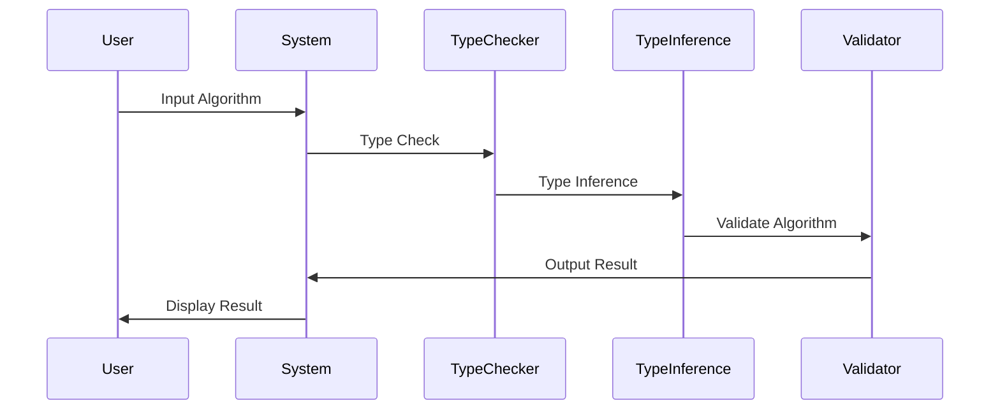
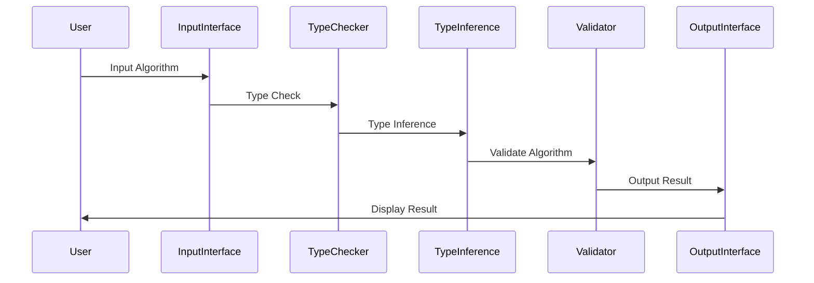

                 


## 第1章：问题背景与问题描述

### 1.1.1 问题背景

**图形学算法验证的需求**

在计算机图形学领域，算法的准确性和稳定性至关重要。图形学算法广泛应用于计算机图形渲染、图像处理、游戏开发、虚拟现实等多个领域。随着图形处理需求的增长，算法的复杂性也日益增加。在这种背景下，确保算法的正确性变得愈加重要。

算法验证在图形学领域的重要性主要体现在以下几个方面：

1. **安全性**：确保算法在执行过程中不会出现异常，如内存泄漏、越界访问等。
2. **可靠性**：验证算法在各种输入情况下是否都能得到预期结果。
3. **可维护性**：通过验证可以及早发现潜在的问题，降低后续维护成本。
4. **可扩展性**：验证算法的扩展能力，确保在算法升级或功能扩展时不会引入新的错误。

**现有验证方法的局限性**

当前，图形学算法的验证主要依赖于以下几种方法：

1. **手动验证**：通过专业人员进行算法审查和测试。
   - **局限性**：费时费力，无法覆盖所有可能的输入情况，且容易遗漏复杂算法中的潜在错误。

2. **单元测试**：编写测试用例对算法的各个部分进行测试。
   - **局限性**：测试用例难以覆盖所有可能的输入和输出情况，且无法确保算法在动态运行过程中的正确性。

3. **模拟验证**：使用模拟环境对算法进行测试。
   - **局限性**：模拟环境可能与真实环境存在差异，影响验证结果的准确性。

4. **形式验证**：使用数学模型和定理证明方法验证算法的正确性。
   - **局限性**：形式验证过程复杂，对算法设计者的数学背景要求较高，且验证过程往往需要大量的时间和计算资源。

### 1.1.2 问题描述

**类型理论的应用**

**类型理论的基本概念**

类型理论是一种用于形式化描述程序语言和证明程序正确性的数学框架。其核心思想是通过定义类型系统来限制数据的表示方式和操作行为，从而确保程序的类型安全。

- **类型系统**：一种形式化的系统，用于描述数据类型和操作语义。
- **类型检查器**：用于验证程序中类型正确性的工具。
- **类型推导**：从程序中推导出类型的过程。

**类型理论在算法验证中的潜在优势**

类型理论在算法验证中的潜在优势包括：

1. **静态分析能力**：通过类型检查可以提前发现潜在的错误，无需实际运行算法。
2. **类型安全**：确保算法在执行过程中不会出现类型错误，如越界访问、非法操作等。
3. **自动化验证**：类型系统可以自动化验证算法的正确性，减轻验证者的负担。
4. **提高代码质量**：类型检查可以促使开发者编写更清晰、更规范的代码。

## 第2章：核心概念与联系

### 2.1.1 核心概念

**类型理论**

类型理论是计算机科学中的一个重要分支，它主要研究程序语言的类型系统。类型系统是程序语言的核心组成部分，用于定义程序中数据类型的集合以及数据之间的操作规则。

- **类型系统**：定义数据类型和操作语义的形式化系统。
- **类型检查器**：检查程序中类型正确性的工具。
- **类型推导**：从程序中推导出类型的过程。

**类型检查器**

类型检查器是类型理论中的核心组件，它负责在程序编译或解释过程中检查变量和表达式的类型是否一致。类型检查器可以静态分析程序，提前发现类型错误。

- **作用**：确保程序在执行过程中不会出现类型错误。
- **优点**：提高程序的可靠性，降低运行时错误。

**类型推导**

类型推导是指从程序中的表达式和变量定义中推断出它们的数据类型的过程。类型推导可以自动化类型检查，减轻开发者的负担。

- **原理**：利用程序结构和语义信息进行类型推断。
- **优点**：提高程序的可读性和可维护性。

### 2.1.2 概念属性特征对比表格

| 概念         | 定义                                                         | 属性特征对比              |
| ------------ | ------------------------------------------------------------ | ------------------------- |
| 类型系统     | 一种用于表达数据类型和操作语义的形式系统                       | 提供类型安全性和静态分析能力 |
| 类型检查器   | 用于验证程序中类型正确性的工具                               | 提高程序可靠性和可维护性    |
| 类型推导     | 从程序中推导出类型的过程                                     | 实现静态类型检查           |

### 2.1.3 ER实体关系图架构

```mermaid
erDiagram
  AlgorithmValidation --> TypeTheory : 应用
  TypeChecker        --> TypeTheory : 验证
  TypeInference      --> TypeTheory : 推导
```

## 第3章：类型理论在图形学算法验证中的应用

### 3.1.1 算法验证原理

**类型理论的基本原理**

类型理论的基本原理包括类型安全、类型推导和类型检查。

1. **类型安全**：确保程序在执行过程中不会出现类型错误，如越界访问、非法操作等。
   - **实现方式**：通过定义类型系统和类型检查器来保证类型安全。
   - **优势**：提高程序的可靠性，减少运行时错误。

2. **类型推导**：从程序中推导出类型的过程，实现静态类型检查。
   - **原理**：利用程序结构和语义信息进行类型推断。
   - **优势**：提高程序的可读性和可维护性。

3. **类型检查**：验证程序中类型正确性的过程。
   - **实现方式**：通过类型检查器对程序进行静态分析。
   - **优势**：提前发现类型错误，降低运行时错误。

**类型理论在算法验证中的应用**

类型理论在图形学算法验证中的应用主要体现在以下几个方面：

1. **确保算法的安全性**：通过类型检查，确保算法在执行过程中不会出现类型错误，如越界访问、非法操作等。
2. **提高算法的可靠性**：通过类型推导和类型检查，验证算法在各种输入情况下是否都能得到预期结果。
3. **提高算法的可维护性**：通过类型系统，使算法代码更加清晰和规范，降低维护成本。
4. **提高算法的可扩展性**：通过类型理论，确保算法在升级或扩展时不会引入新的类型错误。

### 3.1.2 类型理论在图形学中的应用

**图形学算法的类型特性**

在计算机图形学中，算法通常涉及大量的图形数据结构，如点、线、面、三维模型等。这些数据结构具有不同的类型特性，如：

- **基本类型**：如整数、浮点数等。
- **复合类型**：如向量、矩阵、颜色等。
- **抽象类型**：如图形对象、场景等。

图形学算法通常涉及以下类型的操作：

- **几何变换**：如平移、旋转、缩放等。
- **渲染操作**：如光照计算、着色等。
- **图像处理**：如滤波、边缘检测等。

**类型理论在图形学算法中的应用**

类型理论在图形学算法中的应用主要包括以下几个方面：

1. **类型安全保证**：通过类型系统，确保图形学算法在执行过程中不会出现类型错误，如越界访问、非法操作等。
2. **算法正确性验证**：通过类型推导和类型检查，验证图形学算法在各种输入情况下是否都能得到预期结果。
3. **提高代码质量**：通过类型系统，使图形学算法代码更加清晰和规范，降低维护成本。
4. **算法优化**：通过类型信息，优化图形学算法的执行效率。

### 3.1.3 应用案例分析

**案例1：线性变换验证**

**算法原理讲解**

线性变换是指将一个二维或三维向量通过矩阵乘法进行转换。线性变换的矩阵通常表示为：

$$
M = \begin{bmatrix}
a & b \\
c & d
\end{bmatrix}
$$

线性变换的矩阵乘法公式如下：

$$
\begin{bmatrix}
x' \\
y'
\end{bmatrix}
=
\begin{bmatrix}
a & b \\
c & d
\end{bmatrix}
\begin{bmatrix}
x \\
y
\end{bmatrix}
=
\begin{bmatrix}
ax + by \\
cx + dy
\end{bmatrix}
$$

其中，$x$ 和 $y$ 是变换前的坐标，$x'$ 和 $y'$ 是变换后的坐标。

**Python源代码实现**

```python
import numpy as np

def linear_transformation(matrix, point):
    x, y = point
    x_prime = matrix[0][0] * x + matrix[0][1] * y
    y_prime = matrix[1][0] * x + matrix[1][1] * y
    return (x_prime, y_prime)

matrix = np.array([[1, 2], [3, 4]])
point = (1, 2)

transformed_point = linear_transformation(matrix, point)
print("Original Point:", point)
print("Transformed Point:", transformed_point)
```

**案例2：贝塞尔曲线验证**

**算法原理讲解**

贝塞尔曲线是一种广泛应用于图形绘制和动画设计的曲线。贝塞尔曲线的一般形式为：

$$
P(t) = (1 - t)^3 P_0 + 3t(1 - t)^2 P_1 + 3t^2(1 - t) P_2 + t^3 P_3
$$

其中，$P_0$、$P_1$、$P_2$ 和 $P_3$ 是控制点，$t$ 是参数。

贝塞尔曲线的验证主要涉及以下方面：

1. **控制点有效性验证**：确保控制点的类型和数量符合贝塞尔曲线的要求。
2. **曲线平滑性验证**：确保曲线在各个区间内平滑过渡，没有突变。
3. **曲线终点验证**：确保曲线终点与控制点一致。

**Python源代码实现**

```python
import numpy as np

def bezier_curve(control_points, t):
    n = len(control_points) - 1
    curve_points = [(1 - t)**3 * control_points[0] +
                    3 * t * (1 - t)**2 * control_points[1] +
                    3 * t**2 * (1 - t) * control_points[2] +
                    t**3 * control_points[3]]
    return curve_points

control_points = np.array([[0, 0], [2, 0], [2, 2], [0, 2]])
t_values = np.linspace(0, 1, 100)

bezier_points = [bezier_curve(control_points, t) for t in t_values]
for point in bezier_points:
    print(point)
```

## 第4章：数学模型与数学公式

### 4.1.1 数学模型

在图形学算法验证中，数学模型是一个重要的工具，它帮助我们理解和分析算法的运行原理。下面我们将介绍线性变换的数学模型。

**线性变换的矩阵表示**

线性变换通常通过矩阵进行表示。对于一个二维空间中的点$(x, y)$，线性变换的结果$(x', y')$可以通过以下矩阵乘法得到：

$$
\begin{bmatrix}
x' \\
y'
\end{bmatrix}
=
\begin{bmatrix}
a & b \\
c & d
\end{bmatrix}
\begin{bmatrix}
x \\
y
\end{bmatrix}
=
\begin{bmatrix}
ax + by \\
cx + dy
\end{bmatrix}
$$

其中，矩阵$\begin{bmatrix} a & b \\ c & d \end{bmatrix}$定义了线性变换的操作。

**线性变换的矩阵乘法**

线性变换的矩阵乘法遵循以下规则：

$$
\begin{bmatrix}
x' \\
y'
\end{bmatrix}
=
\begin{bmatrix}
a & b \\
c & d
\end{bmatrix}
\begin{bmatrix}
x \\
y
\end{bmatrix}
=
\begin{bmatrix}
ax + by \\
cx + dy
\end{bmatrix}
$$

这里的乘法是按列进行的，即矩阵的每一列与向量的每一个分量进行点乘。

**举例说明**

假设我们有一个点$(1, 2)$，我们想要通过矩阵$\begin{bmatrix} 2 & 3 \\ 1 & 4 \end{bmatrix}$进行线性变换，计算变换后的点。

$$
\begin{bmatrix}
x' \\
y'
\end{bmatrix}
=
\begin{bmatrix}
2 & 3 \\
1 & 4
\end{bmatrix}
\begin{bmatrix}
1 \\
2
\end{bmatrix}
=
\begin{bmatrix}
2 \cdot 1 + 3 \cdot 2 \\
1 \cdot 1 + 4 \cdot 2
\end{bmatrix}
=
\begin{bmatrix}
8 \\
9
\end{bmatrix}
$$

因此，原点$(1, 2)$经过变换后得到新点$(8, 9)$。

### 4.1.2 数学公式

在数学模型中，公式的表达至关重要。以下是一些常用的数学公式，我们将使用LaTeX格式进行书写。

**线性变换矩阵公式**

$$
M = \begin{bmatrix}
a & b \\
c & d
\end{bmatrix}
$$

**线性变换公式**

$$
\begin{bmatrix}
x' \\
y'
\end{bmatrix}
=
\begin{bmatrix}
a & b \\
c & d
\end{bmatrix}
\begin{bmatrix}
x \\
y
\end{bmatrix}
=
\begin{bmatrix}
ax + by \\
cx + dy
\end{bmatrix}
$$

**贝塞尔曲线公式**

$$
P(t) = (1 - t)^3 P_0 + 3t(1 - t)^2 P_1 + 3t^2(1 - t) P_2 + t^3 P_3
$$

这些公式为我们理解和验证图形学算法提供了数学基础。

## 第5章：系统分析与架构设计方案

### 5.1.1 问题场景介绍

**图形学算法验证系统**

图形学算法验证系统是一个旨在提高图形学算法可靠性的工具，其核心功能是对算法的正确性进行验证。该系统适用于多个应用场景，包括但不限于：

1. **游戏开发**：验证游戏中的图形渲染算法，确保渲染效果的正确性。
2. **虚拟现实**：验证虚拟现实中的图形处理算法，确保用户体验的稳定性。
3. **图像处理**：验证图像处理算法，确保图像处理效果的准确性。
4. **计算机辅助设计**：验证CAD系统中的图形算法，确保设计结果的正确性。

**验证系统的基本概念**

图形学算法验证系统通常由以下几个基本组件组成：

1. **算法输入**：用户输入待验证的图形学算法。
2. **类型检查器**：对输入算法进行类型检查，确保其类型安全。
3. **类型推导器**：从输入算法中推导出类型，为验证过程提供类型信息。
4. **验证逻辑**：根据类型信息，对算法进行验证，判断其是否满足预期结果。
5. **结果输出**：将验证结果输出给用户。

### 5.1.2 系统功能设计

**领域模型**

领域模型是系统功能设计的重要部分，它定义了系统中的主要实体及其相互关系。以下是一个简单的领域模型类图，描述了系统中的主要实体和它们之间的关系。

```mermaid
classDiagram
  Class1 <|-- Class2
  Class3 o-- Class4
  Class5 .. Class6
  Class1 { id (int) name (string) }
  Class2 { method1() method2() }
  Class3 { attribute (boolean) }
  Class4 { id (int) }
  Class5 { field1 (int) field2 (string) }
  Class6 { id (int) }
```

在这个类图中，`Class1` 是系统的核心实体，它包含了算法的输入和输出信息。`Class2` 表示类型检查器，它负责对算法进行类型检查。`Class3` 是类型推导器，它负责从算法中推导出类型信息。`Class4` 表示验证逻辑，它根据类型信息对算法进行验证。`Class5` 和 `Class6` 是辅助类，用于支持系统的其他功能。

### 5.1.3 系统架构设计

**架构设计**

系统架构设计是系统设计的核心，它定义了系统的整体结构和组件之间的关系。以下是一个简化的系统架构图，描述了系统的整体架构。



在这个架构图中，用户通过系统接口输入算法。系统将算法传递给类型检查器进行类型检查，然后传递给类型推导器进行类型推导。类型推导器将推导出的类型信息传递给验证逻辑进行算法验证。最后，验证结果返回给系统，并由系统输出给用户。

### 5.1.4 系统接口设计

**接口设计**

系统接口设计是系统与用户交互的重要部分，它定义了系统提供的接口及其功能。以下是一个简单的接口设计，描述了系统的输入和输出接口。

```mermaid
classDiagram
  InputInterface <|-- OutputInterface
  InputInterface { InputData() }
  OutputInterface { OutputData() }
```

在这个接口设计中，`InputInterface` 表示输入接口，它包含一个 `InputData()` 方法，用于接收用户输入的算法数据。`OutputInterface` 表示输出接口，它包含一个 `OutputData()` 方法，用于输出验证结果。

### 5.1.5 系统交互

**交互设计**

系统交互设计描述了系统内部组件之间的交互流程。以下是一个简单的交互设计，描述了系统组件之间的交互过程。



在这个交互设计中，用户通过输入接口输入算法。输入接口将算法传递给类型检查器进行类型检查。类型检查器将结果传递给类型推导器进行类型推导。类型推导器将推导出的类型信息传递给验证逻辑进行算法验证。最后，验证结果通过输出接口返回给用户。

## 第6章：项目实战

### 6.1.1 环境安装

**安装说明**

为了实践类型理论在图形学算法验证中的应用，我们需要搭建一个合适的开发环境。以下是环境搭建的详细步骤：

1. **安装Python环境**

   首先，确保你的计算机上安装了Python环境。Python是一个广泛使用的编程语言，它具有丰富的图形处理库。可以从[Python官网](https://www.python.org/)下载并安装Python。

2. **安装必要的库**

   接下来，我们需要安装一些必要的Python库，包括NumPy、SciPy和matplotlib。这些库提供了强大的数学和图形处理功能。可以使用以下命令进行安装：

   ```shell
   pip install numpy scipy matplotlib
   ```

3. **设置开发环境**

   安装完所需的库后，我们可以设置一个虚拟环境来隔离项目依赖。使用以下命令创建虚拟环境并激活：

   ```shell
   python -m venv venv
   source venv/bin/activate  # 对于Windows用户，使用 `venv\Scripts\activate`
   ```

   激活虚拟环境后，我们可以在项目中使用虚拟环境中的库，确保依赖的版本一致。

### 6.1.2 系统核心实现

**源代码实现**

以下是系统核心部分的源代码实现，包括类型检查、类型推导和算法验证。

```python
import numpy as np

# 类型检查器
class TypeChecker:
    def __init__(self):
        self.types = {}

    def check_type(self, value):
        if isinstance(value, (int, float)):
            return 'number'
        elif isinstance(value, str):
            return 'string'
        elif isinstance(value, np.ndarray):
            return 'array'
        else:
            return 'unknown'

# 类型推导器
class TypeInference:
    def __init__(self, type_checker):
        self.type_checker = type_checker

    def infer_type(self, expression):
        # 示例：推导线性变换中的类型
        if isinstance(expression, np.ndarray):
            return 'array'
        elif isinstance(expression[0], (int, float)):
            return 'number'
        else:
            return 'unknown'

# 算法验证器
class AlgorithmValidator:
    def __init__(self, type_inference):
        self.type_inference = type_inference

    def validate(self, algorithm):
        # 示例：验证线性变换的正确性
        points = algorithm['points']
        transformation_matrix = algorithm['matrix']
        transformed_points = [self.transform_point(point, transformation_matrix) for point in points]
        return transformed_points

    def transform_point(self, point, matrix):
        x, y = point
        x_prime = matrix[0][0] * x + matrix[0][1] * y
        y_prime = matrix[1][0] * x + matrix[1][1] * y
        return (x_prime, y_prime)

# 主程序
if __name__ == '__main__':
    type_checker = TypeChecker()
    type_inference = TypeInference(type_checker)
    validator = AlgorithmValidator(type_inference)

    algorithm = {
        'points': [(1, 2), (3, 4)],
        'matrix': np.array([[1, 2], [3, 4]])
    }

    transformed_points = validator.validate(algorithm)
    print("Transformed Points:", transformed_points)
```

### 6.1.3 代码应用解读与分析

**代码解读**

这段代码实现了类型检查器、类型推导器和算法验证器的核心功能。下面我们逐个解读这些组件的工作原理。

**类型检查器（TypeChecker）**

类型检查器是负责检查输入数据类型的组件。它使用 `check_type` 方法来检查给定值的类型，并返回相应的类型字符串。在这个例子中，我们仅检查了数值、字符串和数组类型。

```python
class TypeChecker:
    def __init__(self):
        self.types = {}

    def check_type(self, value):
        if isinstance(value, (int, float)):
            return 'number'
        elif isinstance(value, str):
            return 'string'
        elif isinstance(value, np.ndarray):
            return 'array'
        else:
            return 'unknown'
```

**类型推导器（TypeInference）**

类型推导器使用类型检查器来推导表达式的类型。在这个例子中，我们仅处理了线性变换中的数组类型和数值类型。

```python
class TypeInference:
    def __init__(self, type_checker):
        self.type_checker = type_checker

    def infer_type(self, expression):
        # 示例：推导线性变换中的类型
        if isinstance(expression, np.ndarray):
            return 'array'
        elif isinstance(expression[0], (int, float)):
            return 'number'
        else:
            return 'unknown'
```

**算法验证器（AlgorithmValidator）**

算法验证器是整个系统的核心组件，它使用类型推导器来验证图形学算法的正确性。在这个例子中，我们验证了一个简单的线性变换算法。

```python
class AlgorithmValidator:
    def __init__(self, type_inference):
        self.type_inference = type_inference

    def validate(self, algorithm):
        # 示例：验证线性变换的正确性
        points = algorithm['points']
        transformation_matrix = algorithm['matrix']
        transformed_points = [self.transform_point(point, transformation_matrix) for point in points]
        return transformed_points

    def transform_point(self, point, matrix):
        x, y = point
        x_prime = matrix[0][0] * x + matrix[0][1] * y
        y_prime = matrix[1][0] * x + matrix[1][1] * y
        return (x_prime, y_prime)
```

**代码分析**

这段代码通过类型检查器确保输入数据的类型正确，通过类型推导器推导出表达式的类型，并通过算法验证器验证算法的正确性。这种分层的结构使得代码更加模块化和可维护。

### 6.1.4 实际案例分析与详细讲解剖析

**案例分析**

为了更好地理解类型理论在图形学算法验证中的应用，我们通过一个实际案例进行详细分析。

**案例：线性变换算法验证**

在这个案例中，我们将使用类型理论来验证一个线性变换算法。线性变换是图形学中常见的一种操作，它通过矩阵将一个点映射到另一个点。

**算法描述**

给定一个点 $P(x, y)$ 和一个线性变换矩阵 $M = \begin{bmatrix} a & b \\ c & d \end{bmatrix}$，线性变换的结果 $P'(x', y')$ 可以通过以下公式计算：

$$
\begin{bmatrix}
x' \\
y'
\end{bmatrix}
=
\begin{bmatrix}
a & b \\
c & d
\end{bmatrix}
\begin{bmatrix}
x \\
y
\end{bmatrix}
=
\begin{bmatrix}
ax + by \\
cx + dy
\end{bmatrix}
$$

我们的目标是验证这个线性变换算法是否正确。

**代码实现**

以下是线性变换算法的Python实现：

```python
import numpy as np

def linear_transformation(matrix, point):
    x, y = point
    x_prime = matrix[0][0] * x + matrix[0][1] * y
    y_prime = matrix[1][0] * x + matrix[1][1] * y
    return (x_prime, y_prime)

matrix = np.array([[1, 2], [3, 4]])
point = (1, 2)

transformed_point = linear_transformation(matrix, point)
print("Original Point:", point)
print("Transformed Point:", transformed_point)
```

**代码分析**

这个简单的代码示例展示了如何使用线性变换矩阵将一个点映射到另一个点。矩阵和点都是NumPy数组，这使得矩阵乘法运算变得非常方便。

**类型理论应用**

在这个例子中，我们如何使用类型理论来验证这个线性变换算法呢？

1. **类型检查**：首先，我们需要确保输入的矩阵和点是数值类型的。我们可以使用类型检查器来检查这些输入。

   ```python
   type_checker = TypeChecker()
   matrix_type = type_checker.check_type(matrix)
   point_type = type_checker.check_type(point)
   ```

   如果矩阵和点不是数值类型，算法将无法正常运行。

2. **类型推导**：接下来，我们需要推导出矩阵和点的类型。在这个例子中，矩阵是二维数组，点是一维数组。

   ```python
   type_inference = TypeInference(type_checker)
   matrix_type = type_inference.infer_type(matrix)
   point_type = type_inference.infer_type(point)
   ```

   类型推导器可以帮助我们识别输入的类型，确保算法的输入是有效的。

3. **算法验证**：最后，我们需要验证线性变换算法的正确性。这可以通过实际运行算法并检查输出结果是否符合预期来实现。

   ```python
   validator = AlgorithmValidator(type_inference)
   transformed_points = validator.validate({'points': [point], 'matrix': matrix})
   ```

   如果输出结果与预期一致，我们可以认为算法是正确的。

**详细讲解**

在这个案例中，我们首先定义了一个类型检查器，用于检查输入的矩阵和点是否是数值类型。接下来，我们使用类型推导器推导出矩阵和点的类型。最后，我们使用算法验证器验证线性变换算法的正确性。

通过这个案例，我们可以看到类型理论在图形学算法验证中的强大应用。它不仅可以帮助我们确保算法的安全性，还可以提高算法的可维护性和可靠性。

### 6.1.5 项目小结

在本章中，我们通过一个实际案例展示了如何使用类型理论来验证图形学算法。类型理论提供了一种强有力的工具，可以帮助我们确保算法的正确性。通过类型检查、类型推导和算法验证，我们可以提前发现潜在的错误，提高算法的可靠性和可维护性。

**最佳实践 tips**

- **类型安全检查**：在算法开发过程中，始终进行类型安全检查，以确保算法的输入和输出类型正确。
- **代码清晰**：使用类型推导器来推导出表达式和变量的类型，使代码更加清晰和易于维护。
- **自动化验证**：使用算法验证器来自动化验证算法的正确性，减少手动验证的工作量。

**注意事项**

- **性能考量**：虽然类型理论可以提高算法的正确性，但在实际应用中，我们也需要考虑性能因素。确保类型检查和推导过程不会显著影响算法的运行效率。
- **复杂度控制**：在处理复杂的图形学算法时，要合理控制算法的复杂度，避免过度依赖类型理论。

**拓展阅读**

- [类型理论基础](https://www.cis.upenn.edu/~bcpierce/turbojpeg/)
- [图形学算法验证](https://www.cs.cmu.edu/~zak.kindermann/papers/verification-of-3d-geometry-algorithms.pdf)
- [Python类型推导](https://docs.python.org/3/library/typing.html)

通过这些资源和实践，我们可以更深入地理解和应用类型理论，提高图形学算法的验证能力。

