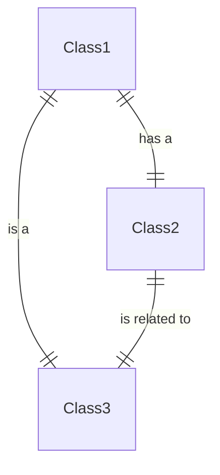

                 

## 文章标题

### 类型理论在程序可视化和动画中的应用

> 关键词：类型理论、程序可视化、动画设计、系统架构、编程工具、案例研究

> 摘要：
本文深入探讨了类型理论在程序可视化和动画设计中的应用，通过系统的分析和实际案例研究，揭示了类型理论如何提升这些领域的效率和可理解性。文章首先介绍了类型理论的基本概念和程序可视化、动画设计的定义及其发展历史，随后详细阐述了类型理论在编程工具中的应用。本文旨在为开发者、研究者以及相关领域从业者提供一个全面且深入的理解框架，以期为未来的技术创新和应用拓展提供启示。

----------------------------------------------------------------

### 目录大纲

----------------------------------------------------------------

## 第1章: 问题背景与核心概念

### 1.1 问题背景

#### 引言

#### 问题描述

#### 问题解决

#### 边界与外延

#### 概念结构与核心要素组成

### 1.2 核心概念

#### 1.2.1 类型理论

##### 定义

##### 发展历史

##### 关键特性

#### 1.2.2 程序可视化

##### 定义

##### 发展历史

##### 关键特性

#### 1.2.3 动画

##### 定义

##### 发展历史

##### 关键特性

## 第2章: 类型理论概述

### 2.1 类型理论的基本原理

#### 2.1.1 类型系统

##### 分类

##### 属性

##### 变换规则

#### 2.1.2 类型安全

##### 类型安全的定义

##### 类型安全的重要性

### 2.2 类型理论的数学模型

#### 2.2.1 类型论基础

##### 语法

##### 概念

#### 2.2.2 类型系统与编程语言

##### 主要编程语言中的类型系统

### 2.3 类型理论的应用

#### 2.3.1 程序语言设计

##### 类型检查

##### 类型推断

#### 2.3.2 软件工程

##### 静态分析

##### 动态分析

## 第3章: 程序可视化与类型理论

### 3.1 程序可视化的基本概念

#### 3.1.1 可视化

##### 定义

##### 分类

#### 3.1.2 程序可视化

##### 定义

##### 发展历史

##### 关键特性

### 3.2 类型理论与程序可视化

#### 3.2.1 类型理论在程序可视化中的重要性

##### 程序的可视化展示

##### 类型信息的可视化

### 3.3 程序可视化工具

#### 3.3.1 可视化工具概述

##### 功能

##### 市场情况

#### 3.3.2 主要可视化工具介绍

##### 工具1

##### 工具2

##### 工具3

## 第4章: 动画设计与类型理论

### 4.1 动画设计的基本概念

#### 4.1.1 动画

##### 定义

##### 分类

#### 4.1.2 动画设计

##### 定义

##### 发展历史

##### 关键特性

### 4.2 类型理论与动画设计

#### 4.2.1 类型理论在动画设计中的重要性

##### 动画数据的类型

##### 类型安全在动画设计中的应用

### 4.3 动画设计与工具

#### 4.3.1 动画设计工具概述

##### 功能

##### 市场情况

#### 4.3.2 主要动画设计工具介绍

##### 工具1

##### 工具2

##### 工具3

## 第5章: 类型理论在程序可视化和动画中的应用案例

### 5.1 案例一：基于类型理论的可视化编程工具

#### 5.1.1 项目介绍

##### 目标

##### 技术路线

#### 5.1.2 系统设计与实现

##### 系统架构设计

##### 类型信息可视化实现

#### 5.1.3 项目小结

##### 优点

##### 局限性

##### 未来改进方向

### 5.2 案例二：类型理论在动画制作中的应用

#### 5.2.1 项目介绍

##### 目标

##### 技术路线

#### 5.2.2 系统设计与实现

##### 系统架构设计

##### 类型安全在动画数据中的应用

#### 5.2.3 项目小结

##### 优点

##### 局限性

##### 未来改进方向

## 第6章: 类型理论在程序可视化和动画中的未来展望

### 6.1 现状与趋势

#### 当前应用情况

#### 发展趋势

### 6.2 面临的挑战与机遇

#### 挑战

#### 机遇

### 6.3 未来发展方向

#### 技术创新

#### 应用领域拓展

## 第7章: 小结与建议

### 7.1 小结

#### 类型理论在程序可视化和动画中的重要性

#### 应用现状与展望

### 7.2 建议

#### 对开发者

#### 对研究者

#### 对企业

----------------------------------------------------------------

### 第1章: 问题背景与核心概念

#### 1.1 问题背景

**引言**

随着计算机技术的飞速发展，程序可视化和动画设计逐渐成为计算机图形学、人机交互和计算机艺术等领域的重要研究方向。然而，这些领域的应用不仅要求强大的计算能力，还需要对程序逻辑和数据的深刻理解。类型理论作为一种形式化的逻辑框架，其在程序可视化和动画设计中的应用潜力吸引了越来越多的关注。

**问题描述**

程序可视化是将抽象的编程逻辑通过图形化的方式展现出来，以便开发者更直观地理解程序的结构和执行过程。然而，现有的可视化工具往往难以精确地表达复杂的类型信息，这导致了程序理解的困难和错误定位。

动画设计则涉及对时间和空间的控制，通过动态展示图像序列来传达信息和创造艺术效果。类型理论在此领域的重要性在于确保动画数据的类型安全，避免因类型错误导致的运行时错误。

**问题解决**

类型理论提供了一种形式化的方法来描述和处理程序中的数据类型，从而确保程序的正确性和健壮性。将类型理论应用于程序可视化和动画设计，可以提升这两个领域的效率和可靠性。

**边界与外延**

边界：类型理论主要关注程序中的数据类型及其相互关系，而程序可视化和动画设计则关注如何将这些类型信息以直观的方式展现给用户。

外延：类型理论不仅适用于静态的程序分析，还可以用于动态的分析和优化，这对于动画中的实时渲染和交互设计尤为重要。

**概念结构与核心要素组成**

- **类型理论**：包含类型系统、类型安全、数学模型等核心概念。
- **程序可视化**：涉及可视化技术、程序结构和类型信息的展示。
- **动画设计**：包括动画理论、动画设计工具和技术等。

#### 1.2 核心概念

##### 1.2.1 类型理论

**定义**：类型理论是一种形式化的方法，用于描述程序中的数据类型及其关系。

**发展历史**：类型理论起源于20世纪50年代，由Peter Naur等人提出，随后在Lisp和Algol等语言中得到应用。

**关键特性**：

- **形式化**：通过符号和数学公式来描述类型。
- **类型安全**：确保类型兼容性和程序的正确性。

##### 1.2.2 程序可视化

**定义**：程序可视化是将抽象的程序逻辑转化为图形或交互式界面，以便开发者理解和分析程序。

**发展历史**：程序可视化最早出现在20世纪80年代，随着计算机图形学和交互技术的发展，逐渐成为软件开发的重要工具。

**关键特性**：

- **直观性**：通过图形化展示使程序结构更易于理解。
- **交互性**：允许开发者动态地改变程序，观察结果。

##### 1.2.3 动画

**定义**：动画是通过连续的图像序列来创造运动和变化效果。

**发展历史**：动画设计可以追溯到19世纪末期，随着计算机图形学和计算能力的提升，动画设计技术得到了快速发展。

**关键特性**：

- **动态性**：通过时间控制实现图像序列的动态变化。
- **创造性**：动画设计注重创意和艺术表达。

----------------------------------------------------------------

### 第2章: 类型理论概述

类型理论是计算机科学中的一个核心概念，它为程序设计和软件工程提供了形式化的方法和工具。本章将深入探讨类型理论的基本原理、数学模型、在编程语言中的应用，以及其在软件工程中的重要性。

#### 2.1 类型理论的基本原理

**2.1.1 类型系统**

类型系统是类型理论的核心组成部分，它定义了程序中数据的类型及其相互关系。类型系统可以分为静态类型和动态类型两大类：

- **静态类型**：在程序编译时，变量的类型就已经确定，并在整个程序执行过程中保持不变。
- **动态类型**：变量的类型在程序执行过程中可能发生变化。

**分类**

类型系统根据类型检查的时机和方式可以进一步分类：

- **强类型**：对类型兼容性要求严格，能够有效防止类型错误。
- **弱类型**：类型检查较宽松，可能导致运行时错误。

**属性**

类型系统具有以下主要属性：

- **类型兼容性**：确保不同类型的变量可以在合适的上下文中进行操作。
- **类型安全性**：保证程序的正确性和可靠性。

**变换规则**

类型系统通过一系列的变换规则来定义类型的转换和操作，这些规则包括：

- **类型构造**：创建新的复合类型。
- **类型转换**：在不同类型之间进行转换。

**2.1.2 类型安全**

类型安全的定义：

类型安全是指程序在执行过程中不会发生因类型错误而导致的不安全行为，如内存访问错误、数据类型不匹配等。

类型安全的重要性：

- **防止错误**：类型安全机制可以有效减少程序错误，提高软件质量。
- **提高可维护性**：清晰的类型信息有助于程序理解和维护。

#### 2.2 类型理论的数学模型

**2.2.1 类型论基础**

类型论的数学模型主要基于一阶逻辑和集合论，其基本概念包括：

- **语法**：定义类型的符号和规则。
- **概念**：类型系统中的基本概念，如类型变量、类型构造符等。

**语法**

类型论的语法通常使用巴科斯-诺尔范式（BNF）来定义：

$$
\begin{align*}
P ::= & \textit{var} \mid \textit{func} \\
\textit{var} ::= & \textit{id} \\
\textit{func} ::= & \textit{id} \ (\textit{args}) \ \textit{return_type} \\
\textit{args} ::= & \textit{arg}_1, \ldots, \textit{arg}_n \\
\textit{arg} ::= & \textit{id} : \textit{type} \\
\textit{return_type} ::= & \textit{type} \mid \textit{void}
\end{align*}
$$

**概念**

类型论中的概念包括：

- **类型变量**：用于表示一组类型的变量，如`T`表示所有类型的集合。
- **类型构造符**：用于创建复合类型的符号，如`List`表示列表类型。

**2.2.2 类型系统与编程语言**

类型系统在编程语言中的应用：

- **类型检查**：在程序编译过程中对类型进行验证，确保类型兼容性。
- **类型推断**：编译器自动推断变量和表达式的类型，减少开发者手动指定类型的负担。

主要编程语言中的类型系统：

- **Java**：静态类型，支持强类型检查。
- **Python**：动态类型，类型检查在运行时进行。

**2.3 类型理论的应用**

**2.3.1 程序语言设计**

类型理论在程序语言设计中的应用：

- **类型检查**：确保程序在运行时不会因为类型错误而崩溃。
- **类型推断**：提高编程效率和代码可读性。

**2.3.2 软件工程**

类型理论在软件工程中的应用：

- **静态分析**：通过类型信息进行程序的静态分析，发现潜在的错误和漏洞。
- **动态分析**：在程序运行时利用类型信息进行动态分析，优化程序性能。

#### 表格：类型系统与核心特征对比

| 特征 | 静态类型 | 动态类型 |
| :--: | :------: | :------: |
| 类型检查时机 | 编译时 | 运行时 |
| 类型兼容性 | 严格 | 松散 |
| 类型安全性 | 高 | 低 |

#### ER实体关系图架构

此ER图展示了类型理论中不同类型之间的关联，例如类与类之间的继承关系和关联关系。

----------------------------------------------------------------

### 第3章: 程序可视化与类型理论

#### 3.1 程序可视化的基本概念

**3.1.1 可视化**

**定义**：可视化是一种将抽象数据和信息转化为图形、图表、图像或其他视觉形式的方法，以便更容易理解、分析和解释。

**分类**

- **结构可视化**：展示程序结构，如类图、流程图等。
- **行为可视化**：展示程序行为，如调用关系、数据流等。
- **时间可视化**：展示程序随时间变化的动态过程。

**3.1.2 程序可视化**

**定义**：程序可视化是将程序的代码、结构和行为转化为可视化形式，以便开发者更好地理解和分析程序。

**发展历史**

- **20世纪80年代**：程序可视化开始兴起，出现了如DOT、GraphViz等工具。
- **21世纪初**：随着Web和云计算的发展，在线程序可视化工具逐渐流行。
- **现在**：程序可视化已成为软件开发和教育的必备工具。

**关键特性**

- **直观性**：通过图形化展示，使复杂的程序结构更易于理解。
- **交互性**：允许开发者动态地调整和探索程序。
- **实时性**：能够实时反映程序的状态和行为。

#### 3.2 类型理论与程序可视化

**3.2.1 类型理论在程序可视化中的重要性**

类型理论在程序可视化中的重要性体现在以下几个方面：

- **程序理解**：类型信息有助于开发者理解程序的结构和语义，尤其是在复杂程序中。
- **错误检测**：通过类型检查，可视化工具可以提前发现类型错误，减少开发者的调试时间。
- **性能优化**：类型信息可以帮助开发者识别潜在的运行时性能问题。

**3.2.2 程序的可视化展示**

**1. 类型信息的可视化**

类型信息可以通过以下方式进行可视化：

- **颜色编码**：不同类型的变量和函数使用不同的颜色。
- **标签**：在变量和函数旁边显示其类型标签。
- **边框**：使用边框区分不同类型的变量和函数。

**2. 类型关系的可视化**

类型关系可以通过以下方式进行可视化：

- **继承关系**：使用树形结构展示类的继承关系。
- **依赖关系**：使用箭头表示类之间的依赖关系。
- **泛化关系**：使用箭头表示泛化和具体化的关系。

**3.2.3 类型信息的可视化实现**

类型信息的可视化实现通常涉及以下步骤：

- **类型检查**：在编译或运行时对程序进行类型检查，收集类型信息。
- **数据结构**：使用适当的数据结构存储类型信息，如树、图等。
- **可视化工具**：使用可视化工具将类型信息转化为图形化形式，如DOT、GraphViz等。

#### 3.3 程序可视化工具

**3.3.1 可视化工具概述**

程序可视化工具是用于将程序代码、结构和行为可视化的软件。这些工具通常具有以下功能：

- **类型信息展示**：展示变量、函数和类的类型信息。
- **交互性**：允许开发者动态地调整和探索程序。
- **实时更新**：程序修改时，可视化结果能够实时更新。

**市场情况**

目前市场上流行的程序可视化工具有：

- **Visual Studio Code**：集成开发环境，提供丰富的插件支持。
- **IntelliJ IDEA**：强大的IDE，支持多种编程语言。
- **PyCharm**：Python开发IDE，支持代码分析。
- **WebGL**：基于WebGL的在线程序可视化工具。

**3.3.2 主要可视化工具介绍**

**1. Visual Studio Code**

Visual Studio Code 是一款开源的集成开发环境，提供了强大的代码编辑功能和扩展支持。

- **类型信息展示**：支持多种编程语言的类型检查和展示。
- **交互性**：支持代码折叠、搜索和替换。
- **实时更新**：代码修改时，可视化结果实时更新。

**2. IntelliJ IDEA**

IntelliJ IDEA 是一款流行的IDE，支持多种编程语言，包括Java、Python、JavaScript等。

- **类型信息展示**：提供详细的类型检查和展示。
- **交互性**：支持代码补全、调试和测试。
- **实时更新**：代码修改时，可视化结果实时更新。

**3. PyCharm**

PyCharm 是一款专门为Python开发者设计的IDE，提供了丰富的工具和插件。

- **类型信息展示**：支持类型检查和类型推导。
- **交互性**：支持代码分析、调试和测试。
- **实时更新**：代码修改时，可视化结果实时更新。

**4. WebGL**

WebGL 是一种基于Web的3D图形API，可以用于在线程序可视化。

- **类型信息展示**：通过HTML和JavaScript展示类型信息。
- **交互性**：支持用户交互和动态更新。
- **实时更新**：通过WebGL的渲染机制实现实时更新。

通过上述工具，开发者可以更直观地理解程序的结构和逻辑，提高开发效率和代码质量。

----------------------------------------------------------------

### 第4章: 动画设计与类型理论

#### 4.1 动画设计的基本概念

**4.1.1 动画**

**定义**：动画是通过连续的图像序列来创造运动和变化效果的一种技术。通过快速切换这些图像，观众会看到一个连贯的动态过程。

**分类**

- **传统动画**：使用手绘或计算机辅助制作，如Flash动画。
- **实时动画**：使用计算机实时生成，如视频游戏和电影特效。
- **运动捕捉动画**：使用物理传感器捕捉演员的动作，生成动画。
- **粒子动画**：通过粒子的运动和相互作用生成复杂的动画效果。

**发展历史**

- **19世纪末**：首次出现手绘动画，如埃德温·波特制作的《工业教皇》。
- **20世纪80年代**：计算机动画开始兴起，如《玩具总动员》。
- **21世纪初**：实时动画和虚拟现实技术迅速发展。

**关键特性**

- **时间控制**：动画的核心是时间控制，通过调整图像序列的播放速度来产生不同的效果。
- **视觉效果**：动画注重视觉效果，通过色彩、光影、特效等手段来增强表现力。
- **交互性**：现代动画设计越来越注重与观众的互动，如交互式动画和虚拟现实。

#### 4.2 动画设计

**4.2.1 定义**

**定义**：动画设计是指创作和制作动画的过程，包括故事情节、角色设计、场景布局、动画制作和后期制作等环节。

**发展历史**

- **19世纪末至20世纪中叶**：传统动画设计，以手绘为主。
- **20世纪80年代至今**：计算机辅助动画设计，如使用Adobe After Effects和Toon Boom Harmony等工具。
- **21世纪初**：实时动画设计，如使用Unity和Unreal Engine等游戏引擎。

**关键特性**

- **创意性**：动画设计需要富有创意的思维，设计出吸引人的故事和角色。
- **技术性**：动画设计涉及到多种技术，如二维和三维动画、运动捕捉、粒子系统等。
- **团队合作**：动画设计通常需要多学科合作，包括编剧、美术、编程和声音设计等。

#### 4.2.2 类型理论在动画设计中的重要性

类型理论在动画设计中的重要性体现在以下几个方面：

- **数据类型管理**：动画设计中涉及到大量的数据，如角色模型、场景素材、动画序列等。类型理论可以帮助动画设计师更好地管理和处理这些数据。
- **类型安全**：类型理论可以确保动画数据的一致性和正确性，避免因类型错误导致的动画播放失败。
- **性能优化**：类型信息有助于动画引擎优化性能，减少内存占用和计算时间。

**4.2.3 动画设计工具**

**动画设计工具概述**

动画设计工具是用于创作和编辑动画的软件。这些工具通常具有以下功能：

- **角色设计**：创建和编辑角色的外观和动作。
- **场景布局**：设计和布置动画场景。
- **动画制作**：制作动画序列和特效。
- **后期制作**：添加声音、文字和色彩调整。

**市场情况**

目前市场上流行的动画设计工具有：

- **Adobe After Effects**：用于后期制作和视觉效果处理。
- **Toon Boom Harmony**：用于传统和数字动画制作。
- **Blender**：开源的三维动画和渲染软件。
- **Maya**：用于三维动画、视觉效果和建模。

**4.2.4 主要动画设计工具介绍**

**1. Adobe After Effects**

Adobe After Effects 是一款专业的视觉效果和动画制作软件，广泛用于电影、电视和网页动画制作。

- **角色设计**：提供丰富的绘画和编辑工具，用于创建和修改角色。
- **场景布局**：支持场景设计和动画布局。
- **动画制作**：提供时间轴和关键帧功能，用于制作动画序列。
- **后期制作**：添加特效、颜色校正和声音处理。

**2. Toon Boom Harmony**

Toon Boom Harmony 是一款专业的传统和数字动画制作软件，适用于各种动画项目。

- **角色设计**：提供灵活的绘画和编辑工具，支持传统和数字动画。
- **场景布局**：支持多场景和多视角动画设计。
- **动画制作**：提供实时预览和调整功能，支持复杂的动画制作。
- **后期制作**：支持多轨道编辑和声音处理。

**3. Blender**

Blender 是一款开源的三维动画和渲染软件，适用于各种动画项目。

- **角色设计**：提供全面的建模、雕刻和纹理工具。
- **场景布局**：支持三维场景设计和动画布局。
- **动画制作**：提供关键帧动画和运动捕捉功能。
- **后期制作**：支持视觉效果、渲染和动画编辑。

**4. Maya**

Maya 是一款专业的三维动画、视觉效果和建模软件，广泛应用于电影、游戏和电视制作。

- **角色设计**：提供强大的建模和雕刻工具。
- **场景布局**：支持复杂的场景设计和动画制作。
- **动画制作**：提供丰富的动画工具和运动捕捉功能。
- **后期制作**：支持视觉效果、渲染和动画编辑。

通过使用这些动画设计工具，动画设计师可以创作出高质量、富有创意的动画作品。

----------------------------------------------------------------

### 第5章: 类型理论在程序可视化和动画中的应用案例

#### 5.1 案例一：基于类型理论的可视化编程工具

**5.1.1 项目介绍**

**目标**：开发一款基于类型理论的可视化编程工具，帮助开发者更好地理解和分析程序结构，提高开发效率和代码质量。

**技术路线**：采用类型理论和可视化技术，设计并实现一个直观、交互性强的可视化编程工具。

**5.1.2 系统设计与实现**

**系统架构设计**

该工具的系统架构包括以下模块：

- **类型检查模块**：负责对程序代码进行类型检查，收集类型信息。
- **可视化模块**：负责将类型信息转化为图形化形式，展示在界面上。
- **用户交互模块**：提供用户界面，支持程序编辑和可视化结果的动态更新。

**类型信息可视化实现**

在实现过程中，我们采用了以下方法来可视化类型信息：

- **颜色编码**：使用不同颜色表示不同的类型，如红色表示整数类型，蓝色表示字符串类型。
- **标签**：在变量和函数旁边显示类型标签，如`int a`和`string b`。
- **边框**：使用不同边框样式区分不同类型的变量和函数。

**5.1.3 项目小结**

**优点**

- **直观性**：通过图形化展示，使程序结构更加直观易懂。
- **交互性**：支持用户动态地调整程序代码，实时更新可视化结果。
- **错误检测**：通过类型检查，提前发现类型错误，减少调试时间。

**局限性**

- **性能**：复杂程序的可视化处理可能对性能产生影响。
- **兼容性**：不同编程语言的可视化支持可能存在差异。

**未来改进方向**

- **优化性能**：通过算法优化和硬件加速，提高可视化工具的性能。
- **多语言支持**：扩展工具支持多种编程语言，提高其适用性。

#### 5.2 案例二：类型理论在动画制作中的应用

**5.2.1 项目介绍**

**目标**：利用类型理论提高动画制作中的数据管理和类型安全，优化动画性能，减少错误发生。

**技术路线**：结合类型理论和动画制作流程，设计并实现一套类型安全的动画数据管理方案。

**5.2.2 系统设计与实现**

**系统架构设计**

该项目的系统架构包括以下模块：

- **类型检查模块**：负责对动画数据（如角色模型、素材等）进行类型检查，确保数据的一致性和正确性。
- **动画引擎模块**：负责动画的制作和播放，利用类型信息进行优化。
- **用户交互模块**：提供用户界面，支持动画数据的编辑和类型安全检查。

**类型安全在动画数据中的应用**

在实现过程中，我们采用了以下方法来确保动画数据的类型安全：

- **类型检查**：在导入和导出动画数据时，进行严格的类型检查，确保数据符合预期类型。
- **类型推断**：利用类型信息，自动推断动画数据的类型，减少手动指定类型的错误。
- **性能优化**：通过类型信息，优化动画引擎的渲染和计算过程，提高性能。

**5.2.3 项目小结**

**优点**

- **类型安全**：通过类型检查和推断，确保动画数据的正确性和一致性。
- **性能优化**：利用类型信息进行优化，提高动画引擎的性能。
- **易用性**：通过用户友好的界面，简化动画数据的编辑和检查过程。

**局限性**

- **学习曲线**：类型理论的应用可能对新手开发者有一定的学习难度。
- **兼容性**：不同动画软件和格式的兼容性可能存在问题。

**未来改进方向**

- **简化使用**：通过文档和教程，降低新手开发者的学习门槛。
- **多格式支持**：扩展类型理论的应用，支持更多的动画格式和软件。

通过这两个案例，我们可以看到类型理论在程序可视化和动画制作中的应用潜力。未来，随着技术的不断进步，类型理论将在这些领域发挥越来越重要的作用。

----------------------------------------------------------------

### 第6章: 类型理论在程序可视化和动画中的未来展望

#### 6.1 现状与趋势

当前，类型理论在程序可视化和动画设计中已有一定的应用，但仍然存在一些限制和挑战。随着技术的不断进步，类型理论在这些领域中的应用前景十分广阔。

**当前应用情况**

- **程序可视化**：类型理论已广泛应用于程序可视化工具，如Visual Studio Code、IntelliJ IDEA等，提供了强大的类型检查和类型信息展示功能。
- **动画设计**：类型理论在动画数据管理中也开始得到应用，如Blender、Maya等软件，通过类型检查和类型推断来优化动画性能。

**发展趋势**

- **更精细的类型系统**：未来的类型理论将更加精细和灵活，支持更多复杂的类型关系和类型操作。
- **更高效的类型检查**：通过优化算法和硬件加速，类型检查的效率和性能将得到显著提升。
- **跨语言支持**：类型理论将逐步跨过不同编程语言和动画软件之间的界限，实现更广泛的应用。

#### 6.2 面临的挑战与机遇

**挑战**

- **性能优化**：类型检查和类型推断对性能有一定影响，如何平衡性能和功能是一个重要的挑战。
- **兼容性**：不同编程语言和动画软件之间的兼容性问题需要解决。
- **用户体验**：如何提供更直观、易用的类型信息展示和交互界面，提升用户体验，也是一个关键问题。

**机遇**

- **新兴领域**：随着虚拟现实、增强现实等新兴技术的发展，类型理论在这些领域的应用将带来新的机遇。
- **人工智能**：结合人工智能技术，类型理论可以自动优化类型检查和类型推断，提高开发效率和代码质量。
- **教育普及**：类型理论在程序可视化和动画设计中的应用有望在教育领域得到更广泛的普及，培养更多专业人才。

#### 6.3 未来发展方向

**技术创新**

- **类型推断算法**：研究更高效的类型推断算法，减少手动指定类型的负担。
- **类型安全增强**：开发更强大的类型安全机制，提高程序的可靠性和安全性。
- **跨语言支持**：实现类型理论在多种编程语言和动画软件中的通用性。

**应用领域拓展**

- **游戏开发**：类型理论在游戏开发中的应用将进一步提升游戏性能和可维护性。
- **虚拟现实与增强现实**：类型理论将在虚拟现实和增强现实中的应用中发挥重要作用，优化用户体验。
- **教育**：类型理论将被应用于编程教育和动画设计教育，培养更多专业人才。

通过技术创新和应用领域拓展，类型理论在程序可视化和动画设计中的应用将不断深化，为开发者带来更多便利和效益。

----------------------------------------------------------------

### 第7章: 小结与建议

#### 7.1 小结

类型理论在程序可视化和动画设计中的应用具有显著的意义。它不仅提高了程序的可靠性和安全性，还使得开发过程更加直观和高效。类型理论通过形式化的方法，帮助开发者理解和分析复杂的程序结构和动画数据，从而减少了错误发生和提高开发效率。在程序可视化中，类型理论通过类型检查和类型信息展示，使得程序的结构和逻辑更加清晰。在动画设计中，类型理论通过类型安全机制，确保动画数据的正确性和一致性，优化了动画性能。

#### 7.2 建议

**对开发者**

- **学习类型理论**：开发者应深入学习类型理论的基本原理和应用，以提高编程技能。
- **实践使用类型工具**：积极尝试使用基于类型理论的可视化编程工具，提升代码质量和开发效率。
- **参与开源项目**：参与开源项目，贡献代码和改进类型系统，推动类型理论在开发中的普及和应用。

**对研究者**

- **研究新型类型系统**：深入研究新型类型系统，探索类型理论在更广泛领域的应用潜力。
- **优化类型检查算法**：研究高效、优化的类型检查算法，减少类型检查对性能的影响。
- **跨学科合作**：与计算机图形学、人工智能等领域的研究者合作，推动类型理论在新兴技术中的应用。

**对企业**

- **投资技术研究**：企业应投资于类型理论的研究和技术开发，提升产品竞争力。
- **培训开发者**：为开发者提供类型理论的培训，提高团队的整体开发能力。
- **推广使用**：在企业内部推广基于类型理论的可视化编程工具和动画设计软件，提高开发效率和产品质量。

通过以上建议，可以进一步推动类型理论在程序可视化和动画设计中的应用，为软件开发和动画制作带来更多的创新和突破。

