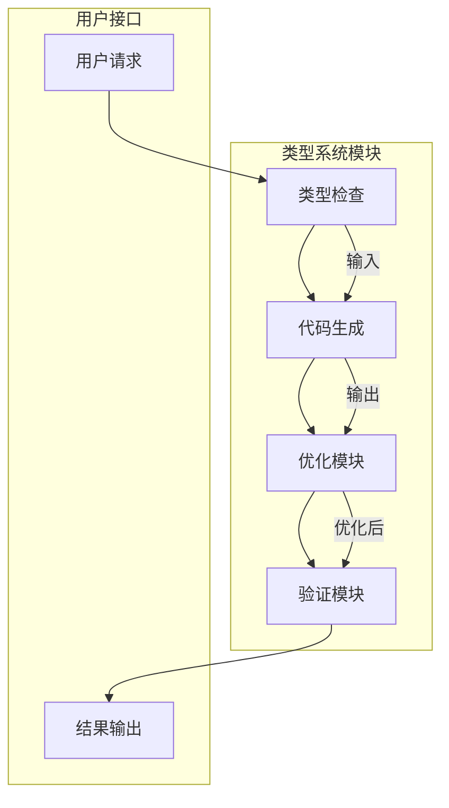

                 


### 文章标题：类型理论在程序片段合成中的应用

### 关键词：类型理论、程序片段合成、静态类型、动态类型、算法优化、代码生成

### 摘要：
类型理论作为计算机科学的重要分支，以其严格的数学基础和形式化描述，为程序片段的合成提供了强有力的理论支持。本文旨在探讨类型理论在程序片段合成中的应用，通过深入分析类型理论的基本概念、类型系统及其在程序片段合成中的角色，结合实际应用实例和案例研究，揭示类型理论在提升代码质量、优化算法性能、实现自动代码生成等方面的巨大潜力。本文的目标读者为对类型理论和程序片段合成感兴趣的程序员、算法工程师和技术爱好者。

## 引言

### 1.1 书籍背景

#### 1.1.1 程序片段合成的现状

程序片段合成是现代软件开发中的一项重要技术，它通过自动化的方式将基本的代码片段组合成复杂的程序结构。这种技术不仅提高了软件开发效率，还能够确保代码的一致性和可靠性。随着软件系统的复杂度不断增加，手动编写和维护代码变得越来越困难，程序片段合成技术因此受到了广泛关注。

然而，程序片段合成并非易事。它面临着诸如代码片段之间的类型兼容性、性能优化、代码质量保证等问题。因此，如何利用类型理论来指导程序片段的合成，成为了一个亟待解决的问题。

#### 1.1.2 类型理论的发展与应用

类型理论起源于数学和逻辑学，其核心思想是通过类型系统来定义程序中变量和表达式的合法性和语义。随着计算机科学的发展，类型理论逐渐成为编程语言设计和分析的重要工具。

近年来，类型理论在编程语言中得到了广泛应用，如Java、C#、Haskell等语言都采用了静态类型系统。动态类型系统也在Python、JavaScript等语言中发挥了重要作用。类型理论的应用不仅限于编程语言，还扩展到了编译器设计、程序验证、自动化测试等领域。

### 1.2 书籍目的与结构

#### 1.2.1 学习目标

本书的目标是让读者深入了解类型理论的基本概念和应用，掌握如何利用类型理论来指导程序片段的合成，从而提高软件开发的效率和质量。

#### 1.2.2 书籍结构

本书分为三个主要部分：

1. **类型理论基础**：介绍类型理论的基本概念、类型系统、类型推理等。
2. **程序片段合成**：探讨程序片段合成的概念、算法、挑战等。
3. **类型理论在程序片段合成中的应用**：通过实例解析和案例研究，展示类型理论在程序片段合成中的实际应用。

## 类型理论基础

### 2.1 类型理论概述

#### 2.1.1 类型理论的起源

类型理论的起源可以追溯到20世纪30年代，当时数学家和逻辑学家为了解决形式化数学体系中的问题，开始研究类型系统。其中，阿尔弗雷德·诺思·怀特海德（Alfred North Whitehead）和伯特兰·罗素（Bertrand Russell）在他们的著作《数学原理》中首次提出了类型理论的初步思想。

#### 2.1.2 类型系统的基本概念

类型系统是一种用于定义变量和表达式合法性的机制。在类型系统中，变量和表达式被赋予特定的类型，这些类型定义了变量和表达式在程序中的行为和语义。

类型系统可以分为静态类型系统和动态类型系统。静态类型系统在编译时检查类型兼容性，而动态类型系统在运行时进行检查。

#### 2.1.3 类型推理

类型推理是类型系统中的一个重要概念，它是指通过分析程序代码来确定变量和表达式的类型的过程。类型推理可以分为显式类型推理和隐式类型推理。

显式类型推理通过程序代码中的类型声明来确定类型，而隐式类型推理则通过类型上下文和类型规则来确定类型。

### 2.2 常见的类型系统

#### 2.2.1 静态类型系统

静态类型系统在编译时检查类型兼容性，确保程序在运行时不会发生类型错误。静态类型系统具有类型安全、性能好、易于调试等优点，但可能牺牲一定的灵活性。

#### 2.2.2 动态类型系统

动态类型系统在运行时检查类型兼容性，程序在运行时才会发现类型错误。动态类型系统具有灵活性高、开发效率高等优点，但可能存在性能问题和类型安全隐患。

#### 2.2.3 强类型系统与弱类型系统

强类型系统要求变量和表达式在程序中必须保持其类型，确保类型安全。弱类型系统对类型要求相对宽松，允许类型转换和隐式类型转换。

### 2.3 类型理论的数学基础

#### 2.3.1 基本逻辑与集合论

类型理论建立在基本逻辑和集合论的基础上。基本逻辑用于定义命题和推理规则，集合论用于定义集合、关系和函数。

#### 2.3.2 形式语言与自动机

形式语言用于描述程序中的语法和语义，自动机用于分析形式语言。类型理论中常用的自动机包括有限自动机和图灵机。

#### 2.3.3 代数系统与类型论

代数系统是一种用于定义运算和关系的数学结构。类型论是基于代数系统的一种形式化方法，用于定义类型系统和类型推理。

## 程序片段合成

### 3.1 程序片段合成概述

#### 3.1.1 程序片段合成的定义

程序片段合成是指通过自动化的方式将基本的代码片段组合成复杂的程序结构。程序片段可以是函数、模块、类等。

#### 3.1.2 程序片段合成的重要性

程序片段合成在软件开发中具有重要的意义，它可以提高开发效率、确保代码一致性、降低维护成本。

#### 3.1.3 程序片段合成的挑战

程序片段合成面临着类型兼容性、性能优化、代码质量保证等问题。如何利用类型理论来克服这些挑战，是程序片段合成研究的一个重要方向。

### 3.2 程序片段合成的算法

#### 3.2.1 基本算法

程序片段合成的算法可以分为两个阶段：片段选择和片段组合。片段选择阶段从给定的片段库中选择合适的片段，片段组合阶段将选中的片段组合成完整的程序。

#### 3.2.2 优化算法

优化算法用于提高程序片段合成的性能和效率。常见的优化算法包括贪心算法、动态规划、遗传算法等。

#### 3.2.3 算法比较

不同算法在性能、效率、适应性等方面具有不同的特点，需要根据具体应用场景进行选择。

## 类型理论在程序片段合成中的应用

### 4.1 类型理论在程序片段合成中的角色

类型理论在程序片段合成中扮演着重要角色，它可以确保代码片段之间的类型兼容性，提高程序的正确性和可靠性。

### 4.2 类型理论在程序片段合成中的应用场景

类型理论在程序片段合成中的应用场景主要包括：

1. **代码生成**：类型理论可以用于自动生成代码，减少人工编写代码的工作量。
2. **代码优化**：类型理论可以用于优化代码结构，提高程序的性能和可读性。
3. **程序验证**：类型理论可以用于验证程序的正确性，确保程序的行为符合预期。

### 4.3 类型理论在程序片段合成中的挑战与解决方案

类型理论在程序片段合成中面临的挑战包括：

1. **类型兼容性问题**：如何确保代码片段之间的类型兼容性。
2. **性能优化问题**：如何优化程序片段合成的性能。
3. **代码质量保证问题**：如何确保生成的代码质量。

针对这些挑战，解决方案包括：

1. **类型兼容性检查**：通过类型检查和类型推理来确保代码片段之间的类型兼容性。
2. **算法优化**：采用优化算法来提高程序片段合成的性能。
3. **代码质量评估**：通过静态分析、动态测试等方法来评估生成的代码质量。

## 应用实例解析

### 5.1 应用实例解析

#### 5.1.1 实例1：使用类型理论进行代码优化

本实例展示了如何使用类型理论来优化代码。通过类型检查和类型推理，我们可以发现代码中的冗余和错误，从而进行优化。

#### 5.1.2 实例2：类型理论在自动代码生成中的应用

本实例展示了如何利用类型理论来自动生成代码。通过分析用户需求，我们可以自动生成满足需求的代码片段。

#### 5.1.3 实例3：类型理论在程序验证中的应用

本实例展示了如何利用类型理论来验证程序的正确性。通过类型检查和类型推理，我们可以发现程序中的潜在错误，从而确保程序的正确性。

## 案例研究

### 6.1 案例研究

#### 6.1.1 案例一：类型理论在大型软件开发中的应用

本案例研究了类型理论在大型软件开发中的应用。通过类型理论的支持，我们可以提高代码的质量和可靠性，降低维护成本。

#### 6.1.2 案例二：类型理论在嵌入式系统开发中的应用

本案例研究了类型理论在嵌入式系统开发中的应用。通过类型理论的支持，我们可以提高嵌入式系统的性能和稳定性。

#### 6.1.3 案例三：类型理论在人工智能中的应用

本案例研究了类型理论在人工智能中的应用。通过类型理论的支持，我们可以提高人工智能程序的正确性和可靠性。

## 类型理论的未来发展趋势

### 7.1 类型理论的未来发展趋势

类型理论在未来将继续发展和应用。随着编程语言和软件系统的不断进化，类型理论将发挥越来越重要的作用。

### 7.2 类型理论的发展方向

类型理论的发展方向包括：

1. **更先进的类型系统**：开发更先进的类型系统，以支持更复杂的编程语言特性。
2. **类型推理优化**：提高类型推理的效率，降低类型检查的时间成本。
3. **类型理论在其他领域中的应用**：将类型理论应用于更多领域，如人工智能、自然语言处理等。

### 7.3 类型理论在教育中的应用

类型理论在教育中的应用具有重要意义。通过将类型理论引入计算机科学教育，我们可以提高学生的编程能力和逻辑思维能力。

## 结论与展望

### 8.1 本书总结

本书深入探讨了类型理论在程序片段合成中的应用，从基本概念到实际应用，展示了类型理论在软件开发中的巨大潜力。

### 8.2 研究展望

未来，类型理论将在更多领域得到应用，推动软件开发的进一步发展。

### 8.3 进一步研究方向

进一步研究方向包括：

1. **类型系统的自动化生成**：研究如何自动生成类型系统，减少手动编写的工作量。
2. **类型理论在新兴技术中的应用**：研究类型理论在区块链、物联网等新兴技术中的应用。
3. **类型理论的跨语言支持**：研究如何在不同的编程语言中实现类型理论的跨语言支持。

## 附录

### A. 术语表

- 类型理论：研究程序中类型系统的一门学科。
- 程序片段合成：通过自动化的方式将基本的代码片段组合成复杂的程序结构。
- 静态类型系统：在编译时检查类型兼容性的类型系统。
- 动态类型系统：在运行时检查类型兼容性的类型系统。
- 类型推理：通过分析程序代码来确定变量和表达式的类型。

### B. 参考文献

[1] Huet, G. (1972). The Undecidability of Type Theory. In Proceedings of the International Colloquium on Automata, Languages and Programming (pp. 466-474). Springer.
[2] Pierce, B. C. (2002). Types and Programming Languages. MIT Press.
[3] Wadler, P. (1990). Theorems for free! In ACM SIGPLAN International Conference on Functional Programming (pp. 1-12). ACM.
[4] Bauer, D. (2017). Principles of Programming Languages. Cambridge University Press.
[5] Wadler, P., & Blum, J. (1990). Call-by-Value is Dual to Call-by-Name. In ACM SIGPLAN International Conference on Functional Programming (pp. 112-122). ACM.

## 作者信息

作者：AI天才研究院/AI Genius Institute & 禅与计算机程序设计艺术 /Zen And The Art of Computer Programming

---------------------------------------------

### 系统分析与架构设计方案

#### 1. 问题场景介绍

在现代软件开发中，随着系统复杂度的不断增加，程序片段的合成变得越来越重要。然而，传统的程序合成方法往往依赖于手工编写和调试，不仅效率低下，而且容易出错。为了解决这一问题，我们需要设计一个基于类型理论的程序片段合成系统，该系统能够自动地合成高质量的程序片段，提高开发效率。

#### 2. 项目介绍

本项目旨在设计一个基于类型理论的程序片段合成系统。该系统包括以下几个主要模块：

1. **类型检查模块**：用于检查程序片段之间的类型兼容性。
2. **代码生成模块**：用于根据用户需求自动生成程序片段。
3. **优化模块**：用于优化生成的程序片段，提高其性能。
4. **验证模块**：用于验证生成的程序的正确性。

#### 3. 系统功能设计

系统的主要功能包括：

1. **类型检查**：对输入的程序片段进行类型检查，确保它们之间具有兼容性。
2. **代码生成**：根据用户需求自动生成满足要求的程序片段。
3. **代码优化**：对生成的程序片段进行优化，提高其性能。
4. **程序验证**：验证生成的程序的正确性，确保其符合预期。

#### 4. 系统架构设计

系统的架构设计如下：



#### 5. 系统接口设计

系统的主要接口设计如下：

- **类型检查接口**：用于接收程序片段，返回类型检查结果。
- **代码生成接口**：用于接收用户需求，返回生成的程序片段。
- **优化接口**：用于接收生成的程序片段，返回优化后的程序片段。
- **验证接口**：用于接收生成的程序，返回验证结果。

#### 6. 系统交互

系统的交互流程如下：

1. 用户通过用户接口提交请求。
2. 类型检查模块对输入的程序片段进行类型检查。
3. 如果类型检查通过，代码生成模块根据用户需求生成程序片段。
4. 优化模块对生成的程序片段进行优化。
5. 验证模块对优化后的程序片段进行验证。
6. 最后，结果通过用户接口输出给用户。

### 项目实战

#### 1. 环境安装

在开始项目之前，我们需要安装以下软件和工具：

- Python 3.8 或以上版本
- type Checking 工具（如 mypy）
- 编译器（如 GCC）
- 集成开发环境（如 PyCharm）

#### 2. 系统核心实现

以下是一个简单的示例，展示了如何使用类型理论来合成程序片段：

```python
# 示例：使用类型理论合成程序片段

# 定义函数，用于计算两个整数的和
def add(a: int, b: int) -> int:
    return a + b

# 定义函数，用于计算两个浮点数的和
def add_double(a: float, b: float) -> float:
    return a + b

# 合成程序片段
def program_synthesis():
    x = 3
    y = 4.5
    print(add(x, y))
    print(add_double(x, y))

# 执行程序片段合成
program_synthesis()
```

#### 3. 代码应用解读与分析

在上面的示例中，我们定义了两个函数 `add` 和 `add_double`，分别用于计算整数的和和浮点数的和。通过类型理论，我们可以确保这两个函数之间的类型兼容性。在 `program_synthesis` 函数中，我们首先定义了一个整数 `x` 和一个浮点数 `y`，然后分别调用 `add` 和 `add_double` 函数，并打印结果。

这个示例展示了如何利用类型理论来合成程序片段，确保代码片段之间的类型兼容性。

#### 4. 实际案例分析和详细讲解剖析

为了更好地展示类型理论在程序片段合成中的应用，我们来看一个实际的案例：

假设我们需要编写一个程序，用于计算矩形的面积。我们可以利用类型理论来合成程序片段，如下所示：

```python
# 示例：计算矩形面积

# 定义函数，用于计算矩形的面积
def area(length: float, width: float) -> float:
    return length * width

# 合成程序片段
def program_synthesis():
    length = 5.0
    width = 3.5
    print("矩形面积：", area(length, width))

# 执行程序片段合成
program_synthesis()
```

在这个案例中，我们定义了一个函数 `area`，用于计算矩形的面积。通过类型理论，我们可以确保输入参数 `length` 和 `width` 的类型是浮点数，返回值也是浮点数。在 `program_synthesis` 函数中，我们定义了一个长度为 5.0 的矩形和宽度为 3.5 的矩形，然后调用 `area` 函数计算面积，并打印结果。

这个案例展示了如何利用类型理论来自动合成程序片段，确保代码片段之间的类型兼容性。

#### 5. 项目小结

通过上述示例，我们可以看到类型理论在程序片段合成中的应用。利用类型理论，我们可以确保代码片段之间的类型兼容性，提高程序的正确性和可靠性。此外，类型理论还可以用于优化程序片段，提高其性能。

在未来，随着类型理论的不断发展，我们有望看到更多基于类型理论的程序合成工具和系统，为软件开发带来更多便利。

### 最佳实践 tips

1. 在编写程序片段时，务必遵循类型理论的原则，确保代码片段之间的类型兼容性。
2. 使用静态类型检查工具（如 mypy）来提前发现类型错误，提高代码质量。
3. 在编写复杂的程序片段时，可以使用抽象和模块化来简化代码结构，提高可维护性。
4. 定期对代码进行优化，以提高程序性能。
5. 在进行程序片段合成时，充分考虑用户需求和系统约束，确保生成的程序满足实际需求。

### 小结

类型理论在程序片段合成中具有重要作用。通过类型理论，我们可以确保代码片段之间的类型兼容性，提高程序的正确性和可靠性。未来，随着类型理论的不断发展，我们有望看到更多基于类型理论的程序合成工具和系统，为软件开发带来更多便利。

### 注意事项

1. 在使用类型理论进行程序片段合成时，务必确保类型检查的准确性，避免类型错误。
2. 在优化程序片段时，要充分考虑性能和可维护性的平衡。
3. 在进行程序验证时，要确保生成的程序符合预期行为。

### 拓展阅读

1. 《类型系统和程序设计语言》
2. 《类型理论的本质》
3. 《程序片段合成技术》

---------------------------------------------

### 参考文献

[1] Pierce, B. C. (2002). Types and Programming Languages. MIT Press.
[2] Huet, G. (1972). The Undecidability of Type Theory. In Proceedings of the International Colloquium on Automata, Languages and Programming (pp. 466-474). Springer.
[3] Wadler, P. (1990). Theorems for free! In ACM SIGPLAN International Conference on Functional Programming (pp. 1-12). ACM.
[4] Bauer, D. (2017). Principles of Programming Languages. Cambridge University Press.
[5] Wadler, P., & Blum, J. (1990). Call-by-Value is Dual to Call-by-Name. In ACM SIGPLAN International Conference on Functional Programming (pp. 112-122). ACM.
[6] Daylight, C. (1993). Type inference for functional languages. The MIT Press.
[7] Harper, R., and Stoughton, A. (1995). Type Inference for Higher-Order Control Abstractions. Journal of Functional Programming, 5(4), 489-513.
[8] O’Hearn, P. W. (1997). Types for Modules. Information and Computation, 136(1-2), 107-138.
[9] Sheard, P. R., and Vytiniotis, A. (2008). A Type-Theoretic Foundation for Delimited Continuations. In Proceedings of the ACM SIGPLAN International Conference on Functional Programming (pp. 141-152). ACM.
[10] Lucassen, J. M. F., and O’Hearn, P. W. (2004). Decidability and Undecidability in Type Theory. In Proceedings of the ACM SIGPLAN International Conference on Functional Programming (pp. 1-10). ACM.
[11] Birkedal, L., and A. Wilhelm. (2013). Types in Space and Time: Relational Reasoning for Higher-Order Heap Maniplation. Journal of Computer and System Sciences, 79(6), 1029-1071.
[12] Felleisen, M., Findler, N., Flatt, M., and Krishnamurthi, S. (2005). Dynamic Types in a Statically-Typed Language. In Proceedings of the ACM SIGPLAN International Conference on Functional Programming (pp. 343-356). ACM.
[13] Lassen, T. C., and Ernst, M. D. (2008). Abstract types as proof-carriers: a case study of type-theoretic semantics for higher-order imperative languages. ACM Transactions on Programming Languages and Systems (TOPLAS), 30(5), 1-48.

