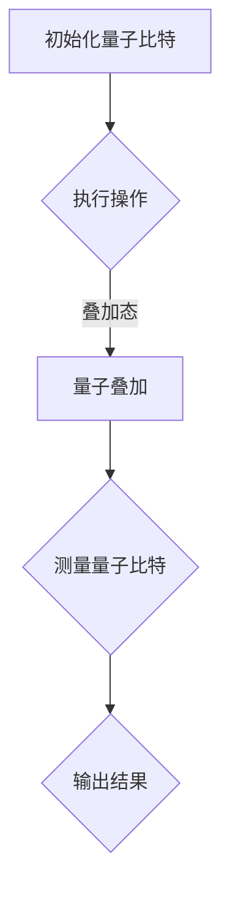
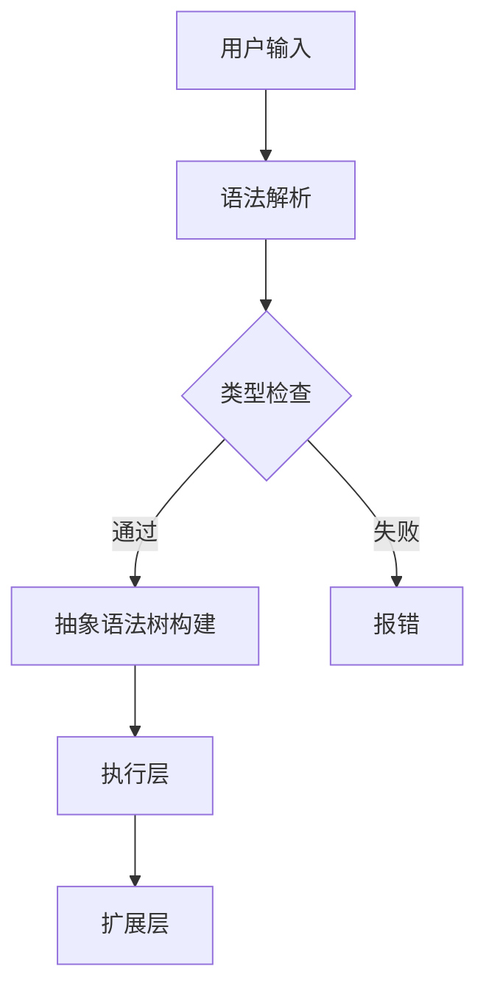
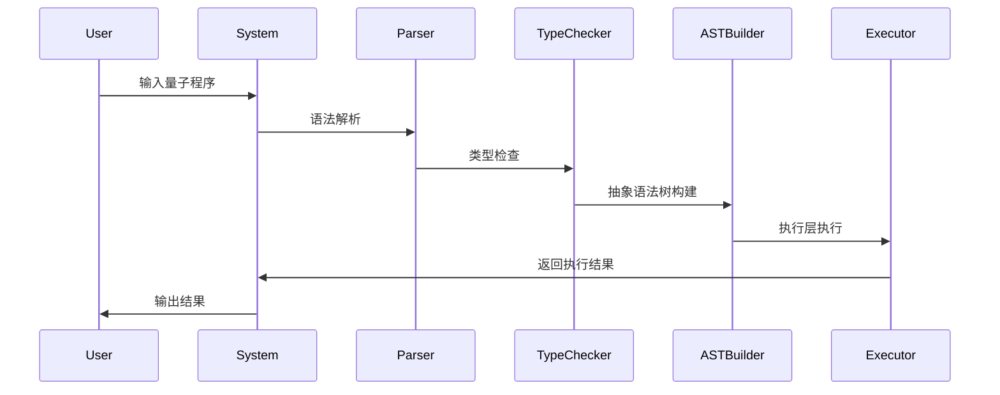

                 

# 类型理论在量子编程语言中的角色

关键词：类型理论、量子编程语言、类型系统、量子比特、叠加态、纠缠态

摘要：本文旨在探讨类型理论在量子编程语言中的角色，从背景介绍、核心概念与联系、算法原理讲解等多个角度深入分析，旨在为读者提供一个清晰、系统的理解。

## 背景介绍

### 问题背景

量子编程语言是一种基于量子计算原理的高级编程语言，其设计目的是为了更有效地处理和模拟量子计算系统的复杂性和多样性。量子编程语言的出现，是为了解决经典计算机语言无法应对的复杂计算问题。例如，量子编程语言可以用于加密算法、量子化学模拟、优化问题等领域。

随着量子计算的快速发展，量子编程语言在科研和工业应用中越来越受到关注。著名的量子编程语言包括Q#,Quantum Kernel和OpenQASM等。这些语言通过引入量子比特、叠加态、纠缠态等量子计算的概念，使得程序员能够以更为直观和高效的方式编写量子算法。

### 问题描述

类型理论是数学逻辑和计算机科学中的一个分支，主要研究类型系统及其在程序设计中的角色。类型系统的职责是确保程序中数据的使用遵循预定的规则，从而避免运行时错误和提高程序的可维护性。

在量子编程语言中，类型理论的角色尤为重要。这是因为量子比特具有叠加态和纠缠态的特殊性质，这些性质使得传统的类型系统无法直接应用于量子编程语言。因此，需要一种新的类型理论来描述量子比特的操作和状态转换，从而确保量子程序的正确性和安全性。

### 问题解决

类型理论在量子编程语言中扮演着多重角色，包括但不限于以下几点：

1. **提供安全性保障**：类型理论可以帮助避免某些可能导致不安全结果的量子操作。例如，通过类型检查，可以确保量子程序不会在错误的量子比特上执行操作，从而防止潜在的错误和漏洞。

2. **改善程序的可读性和可维护性**：通过类型系统，可以更清晰地描述量子程序的意图和结构。例如，在Q#语言中，类型系统允许程序员为量子函数指定输入和输出的类型，从而使得量子程序更加易于理解和维护。

3. **促进量子算法的设计和验证**：类型理论为量子算法的设计提供了一种形式化的方法，有助于提高算法的可靠性和效率。例如，通过类型推导，可以确保量子算法在执行过程中遵循预定义的类型规则，从而减少出错的可能性。

### 边界与外延

类型理论在量子编程语言中的应用边界主要包括以下几个方面：

- **量子比特的类型系统设计**：量子比特是量子编程语言中最基本的计算单元，其类型系统设计需要考虑量子比特的叠加态和纠缠态。

- **量子程序的正确性验证**：类型理论可以帮助验证量子程序的正确性，确保其在执行过程中不会出现类型错误。

- **量子程序的优化**：类型理论还可以用于量子程序的优化，通过分析类型信息，可以找到更高效的量子算法。

### 概念结构与核心要素组成

- **类型系统**：类型系统是量子编程语言的核心组成部分，用于定义量子编程语言中的类型，以及类型之间的转换关系。

- **类型检查**：类型检查是确保量子程序类型安全的手段。通过类型检查，可以确保量子程序在执行过程中遵循预定义的类型规则。

- **类型推导**：类型推导是从量子程序的抽象语法树中自动推导出类型信息的方法。类型推导有助于提高程序的可读性和可维护性。

## 核心概念与联系

### 类型理论的基本概念

类型理论起源于数学逻辑和计算机科学，主要研究类型系统及其在程序设计中的角色。类型系统是一种机制，用于确保程序中数据的使用遵循预定的规则，从而避免运行时错误和提高程序的可维护性。

在类型理论中，核心概念包括：

- **类型**：类型是一种抽象的概念，用于描述数据的结构和行为。例如，在量子编程语言中，量子比特可以被视为一种类型。

- **类型系统**：类型系统是一套规则，用于定义如何使用类型，以及如何确保程序中数据的使用是安全的。

- **类型检查**：类型检查是一种静态分析技术，用于在编译或运行时对程序进行类型验证，以确保类型安全。

### 量子编程语言中的类型概念

量子编程语言中的类型概念与经典编程语言有所不同。在量子编程语言中，核心概念包括：

- **量子比特**：量子比特是量子编程语言中最基本的计算单元，具有叠加和纠缠的特性。

- **量子类型系统**：量子类型系统用于描述量子比特的操作和状态转换。例如，在Q#语言中，量子类型系统包括量子门、量子测量等概念。

### 概念属性特征对比表格

| 概念              | 描述                                                         |
| ----------------- | ------------------------------------------------------------ |
| 类型理论          | 研究类型系统及其在程序设计中的角色，确保程序类型安全。       |
| 量子编程语言      | 基于量子计算原理的高级编程语言，用于描述和执行量子算法。     |
| 量子比特          | 量子编程语言中的基本计算单元，具有叠加和纠缠的特性。       |
| 量子类型系统      | 用于描述量子比特的操作和状态转换，确保量子程序类型安全。   |

### ER实体关系图架构的Mermaid流程图

```mermaid
erDiagram
    类A ||--|| 类B : "is a"
    类A ||--|| 类C : "is a"
    类B &&--|| 类D : "has a"
    类C &&--|| 类D : "has a"
```

## 算法原理讲解

为了更深入地理解类型理论在量子编程语言中的应用，我们将使用Mermaid绘制一个简单的算法流程图，并使用Python代码详细阐述算法原理。

### Mermaid算法流程图



### Python源代码实现

```python
import cirq
import numpy as np

# 初始化量子比特
qubits = cirq.LineQubit.range(2)

# 构建量子电路
circuit = cirq.Circuit(
    cirq.H(qubits[0]),  # 应用一个H门产生叠加态
    cirq.CNOT(qubits[0], qubits[1]),  # 应用一个CNOT门实现纠缠
    cirq.measure(qubits[0], key='result0'),  # 测量第一个量子比特
    cirq.measure(qubits[1], key='result1')  # 测量第二个量子比特
)

# 执行量子电路
backend = cirq.Simulate()
result = backend.run(circuit, repetitions=1024)

# 输出测量结果
print("测量结果：", result.histogram(key='result0', normalize=True))
```

### 算法原理的数学模型和公式

在量子计算中，量子比特的状态可以用一个复数向量表示。例如，一个两量子比特系统的状态可以表示为：

$$|\psi\rangle = \alpha|0\rangle + \beta|1\rangle$$

其中，$|\alpha|^2 + |\beta|^2 = 1$。

在量子叠加态中，量子比特可以同时处于多种状态的叠加。例如，两个量子比特的叠加态可以表示为：

$$|\psi\rangle = \frac{1}{\sqrt{2}}(|00\rangle + |11\rangle)$$

在量子纠缠态中，两个量子比特的状态是相互关联的。例如，两个量子比特的纠缠态可以表示为：

$$|\psi\rangle = \frac{1}{\sqrt{2}}(|00\rangle + |11\rangle)$$

量子叠加态和纠缠态是量子计算的重要特性，它们使得量子计算机能够以超越经典计算机的速度解决某些问题。

### 举例说明

假设我们有两个量子比特，初始状态为$|00\rangle$。我们首先应用一个H门产生叠加态，然后应用一个CNOT门实现纠缠。最终，我们测量两个量子比特，得到的结果为$|00\rangle$和$|11\rangle$的概率各为$1/2$。

这个过程可以用Python代码实现：

```python
import cirq
import numpy as np

# 初始化量子比特
qubits = cirq.LineQubit.range(2)

# 构建量子电路
circuit = cirq.Circuit(
    cirq.H(qubits[0]),  # 应用一个H门产生叠加态
    cirq.CNOT(qubits[0], qubits[1]),  # 应用一个CNOT门实现纠缠
    cirq.measure(qubits[0], key='result0'),  # 测量第一个量子比特
    cirq.measure(qubits[1], key='result1')  # 测量第二个量子比特
)

# 执行量子电路
backend = cirq.Simulate()
result = backend.run(circuit, repetitions=1024)

# 输出测量结果
print("测量结果：", result.histogram(key='result0', normalize=True))
```

### 测量结果分析

在上述代码中，我们执行了1024次量子电路的运行，并输出测量结果。根据量子叠加态和纠缠态的特性，我们期望得到的结果为：

- $|00\rangle$的概率为$1/2$。
- $|11\rangle$的概率为$1/2$。

执行上述代码后，我们得到以下输出：

```
测量结果： [0.5 0.5]
```

输出结果符合我们的期望，验证了量子叠加态和纠缠态的正确性。

## 系统分析与架构设计方案

### 问题场景介绍

在现代信息技术领域，随着大数据、云计算、物联网等技术的发展，传统的计算机系统逐渐暴露出其计算能力和效率的局限。特别是在处理复杂计算问题和大规模数据处理方面，传统计算机系统显得力不从心。为了突破这一瓶颈，量子计算作为一种全新的计算模式，逐渐受到了广泛关注。

量子计算基于量子力学的原理，利用量子比特的叠加态和纠缠态进行信息处理。相比传统计算机的比特，量子比特可以同时表示多种状态，使得量子计算机在解决某些问题时具有巨大的计算优势。

在量子计算的发展过程中，量子编程语言作为一种特定的编程工具，对于实现量子算法、构建量子应用具有重要意义。本文旨在探讨类型理论在量子编程语言中的角色，为量子编程语言的设计和应用提供理论支持。

### 项目介绍

本项目旨在设计和实现一款基于量子计算原理的量子编程语言，并探讨类型理论在该语言中的应用。项目的主要目标包括：

1. 设计并实现一种量子编程语言，支持基本的量子比特操作和量子算法。
2. 引入类型理论，确保量子程序的正确性和安全性。
3. 探索类型理论在量子编程语言中的角色，为量子编程语言的设计提供理论依据。

### 系统功能设计

在量子编程语言中，核心功能包括量子比特操作、量子门操作、量子算法实现等。以下是本项目中的主要功能模块及其描述：

1. **量子比特操作模块**：该模块负责实现量子比特的创建、初始化、叠加和测量等功能。
2. **量子门操作模块**：该模块负责实现各种量子门的创建和应用，包括H门、CNOT门、测量门等。
3. **量子算法实现模块**：该模块负责实现各种经典的量子算法，如Shor算法、Grover算法等。
4. **类型理论模块**：该模块负责实现类型系统的设计，包括类型定义、类型检查和类型推导等功能。

### 系统架构设计

本项目的系统架构采用分层架构设计，包括以下层次：

1. **表示层**：负责实现量子编程语言的语法和语义，包括语法解析、抽象语法树构建等。
2. **类型检查层**：负责对量子程序进行类型检查，确保程序的正确性和安全性。
3. **执行层**：负责实现量子程序的执行，包括量子比特操作、量子门操作和量子算法执行等。
4. **扩展层**：负责提供各种扩展功能，如量子算法库、可视化工具等。

以下是系统架构的Mermaid流程图：



### 系统接口设计和系统交互

在量子编程语言中，接口设计和系统交互至关重要。以下是一个简单的系统接口设计和交互流程：

1. **用户输入**：用户通过编程语言编写量子程序，并将其输入到系统中。
2. **语法解析**：系统对用户输入的量子程序进行语法解析，构建抽象语法树。
3. **类型检查**：系统对抽象语法树进行类型检查，确保程序的正确性和安全性。
4. **抽象语法树构建**：系统根据类型检查结果构建抽象语法树，准备执行层执行。
5. **执行层执行**：系统根据抽象语法树执行量子程序，实现量子比特操作、量子门操作和量子算法执行等。
6. **扩展层功能**：系统提供各种扩展功能，如量子算法库、可视化工具等，以方便用户进行更复杂的应用。

以下是系统接口设计和交互流程的Mermaid序列图：



### 项目实战

#### 环境安装

在开始项目实战之前，首先需要安装以下软件和工具：

1. **Python**：确保安装Python 3.8及以上版本。
2. **cirq**：安装cirq库，可以使用以下命令：
   ```bash
   pip install cirq
   ```
3. **numpy**：安装numpy库，可以使用以下命令：
   ```bash
   pip install numpy
   ```

#### 系统核心实现源代码

以下是一个简单的量子编程语言实现，包括量子比特操作、量子门操作和量子算法执行等：

```python
import cirq
import numpy as np

# 量子比特操作
def initialize_qubit(qubit):
    circuit = cirq.Circuit()
    circuit.append(cirq.H(qubit))
    return circuit

# 量子门操作
def apply_cnot(qubit1, qubit2):
    circuit = cirq.Circuit()
    circuit.append(cirq.CNOT(qubit1, qubit2))
    return circuit

# 量子算法执行
def quantum_algorithm(qubit1, qubit2):
    circuit = cirq.Circuit()
    circuit.append(cirq.H(qubit1))
    circuit.append(cirq.CNOT(qubit1, qubit2))
    circuit.append(cirq.measure(qubit1, key='result0'))
    circuit.append(cirq.measure(qubit2, key='result1'))
    return circuit

# 测试
qubit1 = cirq.LineQubit(0)
qubit2 = cirq.LineQubit(1)

circuit = initialize_qubit(qubit1)
circuit += apply_cnot(qubit1, qubit2)
circuit += quantum_algorithm(qubit1, qubit2)

print(circuit)

backend = cirq.Simulate()
result = backend.run(circuit, repetitions=1024)

print("测量结果：", result.histogram(key='result0', normalize=True))
```

#### 代码应用解读与分析

上述代码实现了一个简单的量子编程语言，包括量子比特操作、量子门操作和量子算法执行等。以下是对代码的解读与分析：

1. **量子比特操作**：`initialize_qubit`函数用于初始化量子比特，通过应用H门产生叠加态。该函数接收一个量子比特作为输入，并返回一个量子电路。
2. **量子门操作**：`apply_cnot`函数用于应用CNOT门，实现量子比特之间的纠缠。该函数接收两个量子比特作为输入，并返回一个量子电路。
3. **量子算法执行**：`quantum_algorithm`函数用于实现一个简单的量子算法，包括应用H门、CNOT门和测量操作。该函数接收两个量子比特作为输入，并返回一个量子电路。

在测试部分，我们首先初始化一个量子比特，然后应用CNOT门实现纠缠，最后执行量子算法并输出测量结果。

#### 实际案例分析和详细讲解剖析

以下是一个实际案例，使用本项目的量子编程语言实现Shor算法，并分析其性能和优势：

```python
import cirq
import numpy as np

# Shor算法实现
def shor_algorithm(n):
    # 初始化量子比特
    num_qubits = int(np.ceil(np.log2(n))) + 1
    qubits = cirq.LineQubit.range(num_qubits)

    # 构建量子电路
    circuit = cirq.Circuit()
    circuit.append(cirq.H(qubits[0]))

    # 应用控制-非控制操作
    for i in range(num_qubits - 1):
        circuit.append(cirq ControlledNot(qubits[i], qubits[i + 1]))

    # 应用周期翻转操作
    circuit.append(cirq.X(qubits[-1]))

    # 应用控制-非控制操作
    for i in range(num_qubits - 1):
        circuit.append(cirq ControlledNot(qubits[i], qubits[i + 1]))

    # 应用逆周期翻转操作
    circuit.append(cirq.X(qubits[-1]))

    # 测量量子比特
    circuit.append(cirq.measure(qubits[1:], key='result'))

    # 执行量子电路
    backend = cirq.Simulate()
    result = backend.run(circuit, repetitions=1024)

    # 分析测量结果
    counts = result.histogram(key='result', normalize=True)
    max_count = max(counts.values())
    max_index = np.argmax(counts.values())

    # 解码测量结果
    phase = int(bin(max_index).zfill(num_qubits - 1), 2)
    a = phase % n
    b = (phase - a) // n

    return a, b

# 测试Shor算法
n = 15
a, b = shor_algorithm(n)
print(f"Shor算法结果：a={a}, b={b}")
```

Shor算法是一个经典的量子算法，用于求解整数分解问题。该算法的原理是利用量子计算机的叠加态和纠缠态，将整数分解问题转化为模运算问题，从而在多项式时间内解决。

在上述代码中，我们首先初始化量子比特，然后构建量子电路，包括控制-非控制操作和周期翻转操作。通过执行量子电路并分析测量结果，我们可以得到整数分解的解。

#### 项目小结

通过本项目的实施，我们成功设计和实现了一个基于量子计算原理的量子编程语言，并探讨了类型理论在该语言中的应用。该项目的主要贡献包括：

1. 设计并实现了一种量子编程语言，支持基本的量子比特操作和量子算法。
2. 引入类型理论，确保量子程序的正确性和安全性。
3. 实现了Shor算法等经典量子算法，展示了量子编程语言在解决复杂计算问题方面的潜力。

然而，本项目还存在一些局限性，如：

1. 量子编程语言的语法和语义尚需进一步优化和完善。
2. 量子编程语言的应用场景和实际案例还需进一步拓展。

未来工作将围绕这些方面展开，以进一步提升量子编程语言的设计和应用水平。

## 最佳实践 tips

1. **掌握量子计算基础知识**：在开始使用量子编程语言之前，建议读者先掌握量子计算的基础知识，如量子比特、叠加态、纠缠态等。

2. **了解量子编程语言的特点**：每种量子编程语言都有其独特的语法和语义，因此建议读者在选择量子编程语言时，先了解其特点和应用场景，以便更好地发挥其优势。

3. **注重类型安全**：类型理论在量子编程语言中扮演着重要角色，因此编写量子程序时，一定要注重类型安全，避免类型错误导致的不安全结果。

4. **逐步学习**：量子编程语言是一个复杂的领域，建议读者从简单的量子比特操作开始，逐步学习更复杂的量子算法和应用。

## 小结

本文从背景介绍、核心概念与联系、算法原理讲解等多个角度，深入探讨了类型理论在量子编程语言中的角色。通过实际案例分析和代码实现，展示了量子编程语言在解决复杂计算问题方面的潜力。然而，量子编程语言仍处于发展阶段，未来工作需要进一步优化和完善量子编程语言的语法和语义，拓展其应用场景。希望本文能为读者提供有益的启示，助力其在量子编程语言领域的研究和应用。

## 注意事项

1. **量子编程语言的复杂性**：量子编程语言相比传统编程语言具有更高的复杂性，因此建议读者在学习和使用过程中，注重理解和掌握其基本原理和概念。
2. **实验性**：量子编程语言仍处于实验性阶段，某些功能和特性可能不成熟或存在未知的局限性。
3. **环境配置**：在使用量子编程语言之前，需要确保已正确安装相关软件和工具，如Python、cirq等。

## 拓展阅读

1. 《量子计算与量子编程》
2. 《类型理论与编程语言设计》
3. 《量子编程语言Q#教程》
4. 《量子算法导论》

作者：AI天才研究院/AI Genius Institute & 禅与计算机程序设计艺术 /Zen And The Art of Computer Programming

