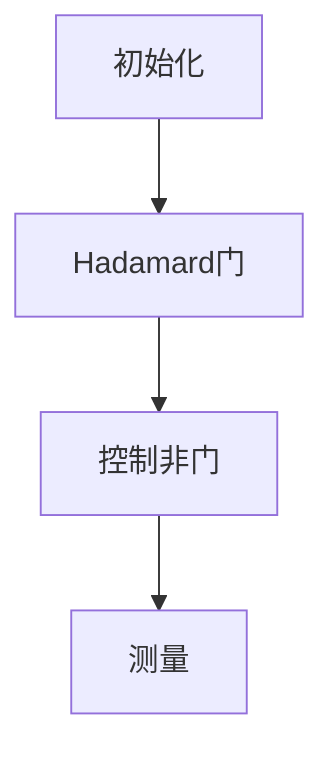
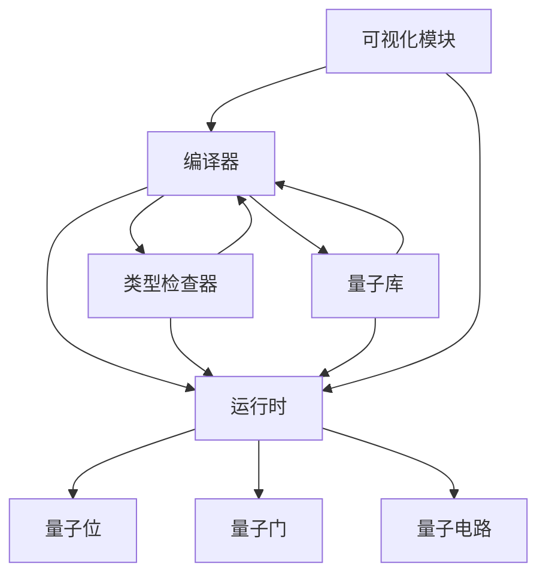

                 

# 类型理论在量子编程语言中的角色

关键词：类型理论、量子编程语言、类型系统、量子计算、算法设计

摘要：本文深入探讨了类型理论在量子编程语言中的角色。首先，介绍了类型理论和量子编程语言的背景和发展现状。接着，分析了类型理论的核心概念及其与量子编程语言的联系。随后，详细探讨了类型理论在量子编程语言中的应用，包括类型系统的设计原则、类型推理和类型检查。最后，本文通过具体算法和数学模型的实例，展示了类型理论在量子编程中的实际应用，并展望了其未来的发展趋势。

## 引言

类型理论作为计算机科学的一个核心概念，起源于20世纪中叶，随着函数式编程和逻辑编程的发展而逐渐成熟。类型理论的主要目的是通过形式化的类型系统来确保程序的正确性和安全性。它为程序语言提供了一种方式来定义数据类型的结构，从而在编译时检测出潜在的错误，提高程序的可靠性。

另一方面，量子编程语言作为量子计算领域的探索，旨在利用量子计算的特殊性质来解决传统计算机难以处理的问题。量子编程语言不同于经典编程语言，它们引入了量子位（qubits）和量子门（quantum gates）等概念，提供了对量子计算过程的抽象和表达。

在这篇文章中，我们将探讨类型理论在量子编程语言中的角色。首先，我们将介绍类型理论的基本概念和它在计算机科学中的应用。随后，我们将概述量子编程语言的原理和当前的应用趋势。在此基础上，我们将深入探讨类型理论在量子编程语言中的具体应用，包括类型系统的设计、类型推理和类型检查。最后，我们将通过具体的算法和数学模型实例，展示类型理论在量子编程中的实际应用，并展望其未来的发展方向。

## 类型理论的基本概念

类型理论是计算机科学中的一个重要分支，它通过形式化的方法来研究程序中的类型系统，以增强程序的正确性和安全性。类型理论的基本概念包括类型系统、子类型和多项式。

### 类型系统

类型系统是类型理论的核心概念之一。它定义了一个程序中数据类型的结构，并规定了不同数据类型之间的兼容性和转换规则。类型系统的主要目的是在编译时检测出潜在的错误，从而提高程序的正确性和可靠性。

在类型系统中，数据类型被分为基本类型和复合类型。基本类型包括整数、浮点数、布尔值等，而复合类型包括数组、记录、指针等。类型系统通过定义类型类别来组织这些数据类型。常见的类型类别包括简单类型、函数类型、构造类型和参数类型。

类型系统还定义了类型之间的关系，例如基本类型的比较关系和函数类型的参数类型和返回类型。类型系统的一个重要特点是静态类型检查，即在编译时对程序进行类型检查，而不是在运行时。这种静态类型检查有助于提前发现并修复潜在的错误，从而提高程序的可靠性。

### 子类型和多项式

子类型（Subtyping）是类型理论中的另一个重要概念。它描述了一种类型之间的层次关系，其中一个类型可以看作是另一个类型的子类型。子类型关系允许程序在不同类型之间进行隐式类型转换，从而提高了程序的可扩展性和灵活性。

多项式（Polymorphism）是子类型的扩展，它允许一个函数或操作符在不同的数据类型上使用。多项式分为两种：参数多项式和构造多项式。参数多项式使用类型变量来表示类型，而构造多项式则使用构造类型来表示类型。

多项式的一个重要特点是类型推导（Type Inference），即通过分析程序中的表达式来推导出它们的类型。类型推导有助于减少程序员的工作量，提高程序的自动化程度。

### 类型系统的意义

类型系统在计算机科学中具有广泛的应用，尤其在程序语言设计和编译器开发中发挥着重要作用。

首先，类型系统可以确保程序的正确性。通过静态类型检查，类型系统可以在编译时检测出类型错误，从而避免在运行时出现错误。这有助于提高程序的可维护性和可靠性。

其次，类型系统可以提高程序的运行效率。通过静态类型检查，编译器可以生成更高效的代码，从而提高程序的执行速度。此外，类型系统还可以优化内存管理，减少内存泄漏和访问越界等错误。

最后，类型系统为程序设计提供了一种抽象机制。通过定义类型和类型关系，程序员可以更清晰地理解和组织程序的结构，从而提高代码的可读性和可扩展性。

总之，类型理论是计算机科学中一个重要的研究领域，其基本概念和原理在程序语言设计和编译器开发中具有广泛的应用。通过深入理解和应用类型理论，我们可以构建更可靠、更高效、更易于维护的程序。

## 量子编程语言的原理

量子编程语言是量子计算领域的一个新兴研究方向，旨在为量子计算提供一种易于理解和使用的编程模型。量子编程语言的核心概念基于量子位（qubits）和量子门（quantum gates），这些概念使得量子计算能够处理复杂问题，并在某些方面超越经典计算。

### 基本原理

量子位（qubits）是量子计算的基本单位，类似于经典计算中的位（bits）。然而，与位只能表示0或1不同，量子位可以同时处于0和1的状态，这种现象称为叠加（superposition）。此外，量子位之间可以存在一种特殊的关联，称为纠缠（entanglement），这种关联使得量子位的操作可以相互影响。

量子门（quantum gates）是量子计算中的操作，用于对量子位进行变换。量子门类似于经典电路中的逻辑门，但它们可以同时影响多个量子位。常见的量子门包括保罗门（Pauli gates）、希尔伯特变换门（Hadamard gates）和控制非门（Controlled-NOT gate）。

量子算法（quantum algorithms）是利用量子位和量子门来解决问题的方法。量子算法通常比经典算法更高效，尤其是在处理大规模问题时。著名的量子算法包括量子傅立叶变换（Quantum Fourier Transform）和Shor算法，这些算法展示了量子计算在特定问题上的优势。

### 量子编程语言的角色

量子编程语言的角色在于提供一种抽象和简化的方法来表示量子计算过程，使得量子算法的设计和实现更加直观和高效。量子编程语言通常包括以下关键组件：

1. **量子位和量子寄存器**：量子编程语言定义了量子位和量子寄存器的概念，用于存储和操作量子信息。

2. **量子门和量子电路**：量子编程语言提供了定义量子门和量子电路的语法和语义，这些电路描述了量子计算的具体步骤。

3. **量子算法库**：量子编程语言通常包含一系列预定义的量子算法库，这些库提供了一组常用的量子算法和操作，便于程序员的开发。

4. **类型系统和类型检查**：为了确保量子程序的正确性和可靠性，量子编程语言引入了类型系统和类型检查机制。这些机制可以检测潜在的量子计算错误，提高程序的可靠性。

### 当前应用和未来趋势

量子编程语言在当前和未来都有着广泛的应用前景。当前，量子编程语言主要用于研究和开发量子算法，解决传统计算机难以处理的问题。例如，量子算法在加密破解、分子建模和优化问题等方面显示出巨大的潜力。

未来，随着量子计算机的不断发展，量子编程语言有望在商业和工业领域得到更广泛的应用。例如，量子优化算法可以用于供应链管理、金融分析和物流调度等实际问题，从而带来显著的经济效益。

总之，量子编程语言作为量子计算领域的重要组成部分，通过提供抽象和简化的编程模型，使得量子算法的设计和实现更加高效和直观。随着量子计算技术的不断进步，量子编程语言将在未来发挥越来越重要的作用。

## 核心概念和它们的联系

类型理论在量子编程语言中的应用，需要深入理解类型理论的核心概念以及它们与量子编程语言中的核心概念之间的联系。以下是类型理论的一些核心概念，以及它们在量子编程语言中的对应物和关系。

### 类型系统

类型系统是类型理论的基础，它定义了一个程序中数据类型的结构，并规定了不同数据类型之间的兼容性和转换规则。在量子编程语言中，类型系统负责确保量子程序的正确性和可靠性。量子编程语言中的类型系统通常包括以下组成部分：

1. **量子位类型**：量子编程语言中的量子位类型对应于类型理论中的基本类型，用于表示量子位的操作和状态。量子位类型可以是布尔类型或复数类型。

2. **量子门类型**：量子编程语言中的量子门类型对应于类型理论中的构造类型，用于表示对量子位的操作。量子门类型通常包括量子门的名称和操作的量子位数量。

3. **量子电路类型**：量子编程语言中的量子电路类型对应于类型理论中的复合类型，用于表示量子计算过程。量子电路类型包括量子门的组合和量子寄存器的操作。

### 子类型和多项式

子类型和多项式是类型理论中的重要概念，它们为程序提供了灵活性和可扩展性。在量子编程语言中，子类型和多项式同样发挥着重要作用。

1. **子类型**：在量子编程语言中，子类型关系允许程序员将通用的量子算法和操作应用于不同的量子位类型。例如，一个通用量子门可以同时适用于布尔类型的量子位和复数类型的量子位。

2. **多项式**：多项式在量子编程语言中用于表示量子算法的参数化形式。通过使用多项式，程序员可以定义可重用的量子算法，这些算法可以根据不同的输入类型进行扩展。

### 类型推理和类型检查

类型推理和类型检查是类型理论中的关键机制，用于确保程序的正确性和可靠性。在量子编程语言中，这些机制同样至关重要。

1. **类型推理**：量子编程语言中的类型推理机制用于自动推导量子程序的类型。这种推理过程可以帮助程序员发现潜在的量子计算错误，并提供类型信息，以便编译器生成高效的量子电路代码。

2. **类型检查**：量子编程语言中的类型检查机制用于验证量子程序中的类型一致性。通过类型检查，编译器可以确保量子程序在运行时不会出现类型错误，从而提高量子程序的可靠性。

### 关系总结

类型理论和量子编程语言之间的联系可以通过以下方式总结：

1. **类型系统**：量子编程语言中的类型系统借鉴了类型理论的基本概念，如量子位类型、量子门类型和量子电路类型，确保量子程序的正确性和可靠性。

2. **子类型和多项式**：量子编程语言中的子类型和多项式为量子算法的通用性和可扩展性提供了支持，使得量子算法可以应用于不同的量子位类型和参数化形式。

3. **类型推理和类型检查**：量子编程语言中的类型推理和类型检查机制用于确保量子程序的类型一致性，从而提高量子程序的可靠性和效率。

总之，类型理论在量子编程语言中的应用，通过引入类型系统、子类型和多项式等核心概念，为量子编程提供了强大的抽象和表达能力，使得量子算法的设计和实现更加直观和高效。

### 类型理论在量子编程语言中的设计原则

类型理论在量子编程语言中的设计原则旨在确保量子程序的正确性、可扩展性和高效性。以下是一些关键设计原则，包括类型系统的设计、类型推理和类型检查。

#### 类型系统的设计

类型系统的设计是量子编程语言的核心，它需要考虑量子计算的特殊性质。以下是几个关键设计原则：

1. **量子位类型的定义**：量子编程语言需要定义量子位类型，以表示量子位的操作和状态。常见的量子位类型包括布尔类型（用于表示量子位的基态）和复数类型（用于表示量子位的叠加态）。

2. **量子门类型的定义**：量子编程语言需要定义量子门类型，以表示对量子位的操作。量子门类型通常包括量子门的名称和操作的量子位数量。例如，一个保罗门（Pauli gate）可能需要一个量子位作为输入，并作用于该量子位的特定操作。

3. **量子电路类型的定义**：量子编程语言需要定义量子电路类型，以表示量子计算过程。量子电路类型包括量子门的组合和量子寄存器的操作。量子电路类型需要确保量子门之间的操作是合法的，以避免无效或非法的操作。

4. **类型兼容性**：量子编程语言需要设计类型兼容性规则，以确保量子位类型、量子门类型和量子电路类型之间的正确组合。例如，一个量子电路中的量子门应该能够接受合法的量子位类型作为输入。

#### 类型推理

类型推理是量子编程语言的一个重要机制，用于自动推导量子程序中的类型信息。以下是几个关键设计原则：

1. **静态类型推理**：量子编程语言通常采用静态类型推理，即在编译时进行类型推导，而不是在运行时。这样可以提前发现并修复类型错误，提高程序的可靠性。

2. **依赖类型推断**：量子编程语言可以通过依赖类型推断来推导量子程序的类型信息。这种推断方法基于程序中的依赖关系，自动推导出操作和变量之间的类型关系。

3. **上下文敏感类型推断**：量子编程语言需要考虑上下文敏感的类型推断，以处理复杂的类型关系。例如，一个量子电路中的量子门可能需要在不同的上下文中具有不同的类型。

#### 类型检查

类型检查是确保量子程序类型一致性的一项关键机制。以下是几个关键设计原则：

1. **全面类型检查**：量子编程语言需要进行全面的类型检查，以确保量子程序中的所有类型都是合法的。这包括检查量子位类型、量子门类型和量子电路类型之间的兼容性。

2. **错误处理**：当类型检查发现类型错误时，量子编程语言需要提供有效的错误处理机制。例如，编译器可以生成详细的错误消息，帮助程序员定位和修复错误。

3. **优化类型检查**：量子编程语言的类型检查过程需要高效，以避免显著影响编译时间和性能。可以使用多种优化技术，如静态分析和并行处理，来提高类型检查的效率。

#### 设计原则总结

总之，类型理论在量子编程语言中的设计原则包括：

1. **量子位类型、量子门类型和量子电路类型的定义**，确保量子程序的结构和操作是合法的。

2. **静态类型推理**，以提前发现并修复类型错误。

3. **全面类型检查**，确保量子程序在运行时不会出现类型错误。

4. **错误处理**和**优化类型检查**，以提高量子程序的可靠性、可维护性和性能。

通过遵循这些设计原则，量子编程语言可以提供一种高效、可靠和易于使用的编程模型，以支持量子算法的设计和实现。

### 类型系统在量子编程语言中的应用

类型系统在量子编程语言中的应用至关重要，它不仅确保了量子程序的类型一致性，还提高了程序的可读性和可维护性。以下将详细探讨类型系统在量子编程语言中的应用，包括类型系统的具体设计、类型推理和类型检查的实现方式。

#### 类型系统的设计

量子编程语言中的类型系统需要定义量子位、量子门和量子电路等核心概念。以下是一个简化的类型系统设计示例：

1. **量子位类型（Quantum Bit Types）**：量子位是量子编程语言的基本单位，可以用以下类型表示：
   ```python
   type QBit = { |0> | 1> }
   ```

2. **量子门类型（Quantum Gate Types）**：量子门是作用于量子位的操作，可以用以下类型表示：
   ```python
   type QuantumGate = { Hadamard | Pauli | Controlled }
   ```

3. **量子电路类型（Quantum Circuit Types）**：量子电路是量子计算的基本单元，由量子门和量子位组成，可以用以下类型表示：
   ```python
   type QuantumCircuit = [QuantumGate] * QBit
   ```

4. **量子程序类型（Quantum Program Types）**：量子程序是量子电路和量子数据的组合，可以用以下类型表示：
   ```python
   type QuantumProgram = { QuantumCircuit | QuantumData }
   ```

#### 类型推理

类型推理是自动推导量子程序中变量和操作类型的过程。以下是一个基于依赖类型的推理示例：

1. **依赖类型推断**：类型系统根据量子程序中的依赖关系推导类型。例如，在量子电路中，量子门的类型依赖于其操作的量子位类型。
   ```python
   infer_type(gate: QuantumGate, qbit: QBit) {
       if (gate == Hadamard) {
           return [qbit];
       } else if (gate == Pauli) {
           return [qbit];
       } else if (gate == Controlled) {
           return [qbit, qbit];
       } else {
           throw TypeError("Unknown quantum gate");
       }
   }
   ```

2. **上下文敏感类型推断**：类型系统需要考虑量子程序中的上下文关系。例如，一个量子电路中的量子门可能需要在不同的上下文中具有不同的类型。
   ```python
   infer_type(context: Context, gate: QuantumGate, qbit: QBit) {
       if (context == ControlContext) {
           return [qbit, qbit];
       } else {
           return [qbit];
       }
   }
   ```

#### 类型检查

类型检查是确保量子程序类型一致性的过程。以下是一个基于类型检查的示例：

1. **类型检查规则**：类型系统定义了一组类型检查规则，用于验证量子程序的类型一致性。例如，量子电路中的量子门必须与量子位的类型兼容。
   ```python
   check_type(circuit: QuantumCircuit) {
       for (gate in circuit) {
           for (qbit in gate.inputs) {
               if (!is_compatible(gate.type, qbit.type)) {
                   throw TypeMismatchError("Type mismatch in quantum gate");
               }
           }
       }
   }
   ```

2. **错误处理**：当类型检查发现类型错误时，类型系统需要提供详细的错误信息，帮助程序员定位和修复错误。
   ```python
   class TypeMismatchError(Exception):
       def __init__(self, message):
           super().__init__(message);

   def check_type(circuit: QuantumCircuit) {
       // ...
       if (!is_compatible(gate.type, qbit.type)) {
           raise TypeMismatchError("Type mismatch in quantum gate: " + gate.name);
       }
   }
   ```

#### 应用示例

以下是一个简单的量子程序示例，展示了类型系统在量子编程语言中的应用：
```python
quantum_program = {
    "circuit": [
        {"gate": "Hadamard", "inputs": [qbit1]},
        {"gate": "Controlled", "inputs": [qbit1, qbit2]}
    ],
    "data": {
        "qbit1": { |0> },
        "qbit2": { |1> }
    }
}

// 进行类型检查
check_type(quantum_program["circuit"])

// 如果类型检查通过，执行量子程序
execute_quantum_program(quantum_program)
```

通过这个示例，我们可以看到类型系统在量子编程语言中的应用，包括类型系统的定义、类型推理和类型检查的过程。类型系统为量子编程提供了可靠性和可维护性，使得量子算法的设计和实现更加直观和高效。

### 算法和数学基础

量子编程语言中的算法设计依赖于数学和量子物理的基本原理。以下将详细探讨量子算法的设计原则、量子电路设计以及算法性能分析。

#### 算法设计原则

量子算法的设计原则包括利用量子位的叠加和纠缠特性，实现高效的信息处理和计算。以下是几个关键设计原则：

1. **量子并行性**：量子算法通过叠加态实现并行性，能够在一次计算中处理多个输入。这极大地提高了算法的效率，尤其是在处理大规模问题时。

2. **量子纠错**：由于量子位的脆弱性，量子算法需要设计量子纠错机制，以防止错误在量子计算过程中传播。量子纠错算法如表面代码（Surface Codes）和量子错误纠正码（Quantum Error Correction Codes）是确保量子计算可靠性的关键。

3. **量子纠缠**：量子纠缠是量子计算的核心资源，通过设计纠缠操作，可以实现复杂的量子计算任务，如量子隐形传态和量子通信。

4. **量子随机性**：量子随机性在量子算法中发挥着重要作用，例如在Shor算法中用于生成随机数。

#### 量子电路设计

量子电路是量子算法的物理实现形式，它由一系列量子门和量子位组成。以下是量子电路设计的关键步骤：

1. **初始化量子位**：量子电路通常从量子位的初始化开始，将量子位设置为特定的叠加态或基态。

2. **量子门操作**：量子电路通过一系列量子门对量子位进行操作，这些量子门包括基本的单位ary门和两量子位门，如Pauli门、Hadamard门和控制非门。

3. **量子纠缠操作**：设计量子纠缠操作，实现量子位之间的纠缠态。这通常通过控制门和交换量子位之间的操作来实现。

4. **测量操作**：量子电路的最终步骤是测量量子位的状态，以获得计算结果。测量操作破坏了量子态的叠加，但可以用于解码量子算法的输出。

以下是一个简单的量子电路设计的示例：



在这个示例中，量子位首先被初始化，然后通过Hadamard门和控制的非门进行操作，最后进行测量。

#### 算法性能分析

量子算法的性能分析涉及多个方面，包括量子电路的深度、量子位的数量以及算法的效率。以下是几个关键性能指标：

1. **量子电路的深度**：量子电路的深度表示量子门操作的次数。深度越深，算法的复杂性越高，但通常意味着更高效的计算。

2. **量子位的数量**：量子算法的性能与所需的量子位数量直接相关。增加量子位数量可以提高算法的并行性和处理能力。

3. **算法的效率**：量子算法的效率通常用量子计算步骤数与经典计算步骤数之比来衡量。高效的量子算法能够在较少的量子步骤内解决问题，从而提高计算效率。

以下是一个简单的性能分析示例：

$$
效率 = \frac{量子步骤数}{经典步骤数}
$$

通过性能分析，我们可以评估量子算法在解决特定问题上的优势，并优化量子电路的设计，以实现最佳的性能。

总之，量子算法的设计和性能分析依赖于数学和量子物理的基本原理。通过理解算法设计原则、量子电路设计和性能分析，我们可以更有效地利用量子计算的优势，解决复杂的计算问题。

### 数学模型和公式

在量子编程语言中，数学模型和公式是理解和实现量子算法的核心。以下将详细讨论量子门和操作符、量子态和纠缠，以及具体的数学公式和证明。

#### 量子门和操作符

量子门是量子编程语言中的基本操作，用于对量子位进行变换。常见的量子门包括Pauli门、Hadamard门和控制非门（CNOT）。

1. **Pauli门**：Pauli门包括X（Pauli-X门）、Y（Pauli-Y门）和Z（Pauli-Z门），分别表示对量子位的X、Y和Z操作。
   $$ 
   X | \psi \rangle = | \psi \oplus 1 \rangle 
   $$
   $$ 
   Y | \psi \rangle = i | \psi \oplus 1 \rangle 
   $$
   $$ 
   Z | \psi \rangle = | \psi \oplus 1 \rangle 
   $$

2. **Hadamard门**：Hadamard门是一种线性变换，将量子位的基态转换为叠加态。
   $$ 
   H | \psi \rangle = \frac{1}{\sqrt{2}} (|0 \rangle + |1 \rangle) 
   $$

3. **控制非门（CNOT）**：CNOT门是一个两量子位操作，用于控制地翻转第二个量子位。
   $$ 
   CNOT(| \psi \rangle | \phi \rangle) = | \psi \rangle | \phi \oplus \psi \rangle 
   $$

#### 量子态和纠缠

量子态是量子编程语言中的基本概念，描述了量子位的状态。常见的量子态包括叠加态和纠缠态。

1. **叠加态**：量子位可以处于叠加态，即同时存在于多个基态的线性组合。
   $$ 
   | \psi \rangle = a |0 \rangle + b |1 \rangle 
   $$

2. **纠缠态**：两个或多个量子位之间的纠缠态描述了它们之间的量子关联。常见的纠缠态包括贝尔态和格莱西态。

   贝尔态（Bell State）是两个量子位的最简单纠缠态，表示为：
   $$ 
   | \psi \rangle = \frac{1}{\sqrt{2}} (|00 \rangle + |11 \rangle) 
   $$

   格莱西态（Gleason State）是多个量子位之间的纠缠态，表示为：
   $$ 
   | \psi \rangle = \frac{1}{\sqrt{N}} (|0 \cdots 0 \rangle + |1 \cdots 1 \rangle) 
   $$

#### 数学公式和证明

以下是一个关于量子门操作的数学公式和证明示例。

**定理**：任意量子门可以通过Pauli门和Hadamard门的组合来实现。

**证明**：

首先，任何量子门都可以表示为一个单位ary门和一个两量子位门的组合。单位ary门包括Hadamard门、S门和T门等，两量子位门包括CNOT、SWAP等。

1. **Hadamard门**：已知任何量子门都可以通过Hadamard门和Pauli门的组合来实现。

2. **Pauli门**：Pauli门可以通过以下组合来实现：
   $$ 
   X = HZH 
   $$
   $$ 
   Y = HZHX 
   $$
   $$ 
   Z = HXH 
   $$

3. **CNOT门**：CNOT门可以通过以下组合来实现：
   $$ 
   CNOT = (H \otimes H) Z (H \otimes H) 
   $$

因此，任意量子门都可以通过Pauli门和Hadamard门的组合来实现。

通过这些数学模型和公式，我们可以更深入地理解量子编程语言中的操作和算法。数学公式和证明不仅帮助我们理解量子编程的基本原理，还为量子算法的设计和优化提供了理论基础。

### 系统分析与架构设计

在量子编程语言的应用过程中，系统分析与架构设计是确保项目成功的关键环节。以下将详细描述问题场景、项目介绍、系统功能设计、系统架构设计以及系统接口设计和交互。

#### 问题场景

随着量子计算的快速发展，越来越多的企业和研究机构开始关注如何将量子计算的优势应用于实际问题中。例如，在药物研发、材料科学和金融分析等领域，量子计算展示了显著的优势。然而，量子编程语言的复杂性和抽象性使得这些领域的专家难以直接使用量子计算解决实际问题。因此，需要一个高效、易于使用的量子编程语言，以简化量子算法的开发和部署。

#### 项目介绍

该项目旨在开发一个适用于量子计算应用场景的量子编程语言，简称QPL。QPL将提供类型系统和语法糖，使得量子算法的设计和实现更加直观和高效。QPL的目标是降低量子编程的门槛，使得更多的开发者能够轻松地编写和部署量子算法。

#### 系统功能设计

QPL的系统功能设计包括以下关键组件：

1. **量子位管理**：QPL将提供量子位的创建、初始化和销毁功能，以便开发者能够灵活地管理量子资源。

2. **量子门操作**：QPL将定义一系列预定义的量子门，包括Pauli门、Hadamard门和控制非门等，以便开发者能够方便地组合和使用这些量子门。

3. **量子电路设计**：QPL将提供量子电路的描述和操作功能，使得开发者能够构建和优化复杂的量子电路。

4. **类型系统**：QPL将引入类型系统，确保量子程序的正确性和可靠性，并提供类型推理和类型检查功能。

5. **量子算法库**：QPL将包含一系列预定义的量子算法，如量子傅立叶变换（QFT）和Shor算法等，以便开发者能够快速使用和定制这些算法。

6. **可视化工具**：QPL将提供可视化工具，帮助开发者直观地理解量子电路和量子算法的结构和执行过程。

#### 系统架构设计

QPL的系统架构设计采用模块化方法，包括以下关键模块：

1. **编译器模块**：负责将QPL源代码编译成目标机器码或中间代码。编译器模块将实现词法分析、语法分析、语义分析和代码生成等功能。

2. **运行时模块**：负责执行编译后的量子程序，并管理量子资源和执行量子操作。运行时模块将实现量子位的创建和销毁、量子门的操作和量子电路的执行等功能。

3. **类型检查模块**：负责确保QPL程序在编译和运行时的类型一致性。类型检查模块将实现类型推理、类型检查和错误处理等功能。

4. **量子库模块**：提供一系列预定义的量子算法和操作，如量子傅立叶变换、Shor算法等。量子库模块将实现这些算法的细节和优化。

5. **可视化模块**：提供量子电路和量子算法的可视化工具，帮助开发者直观地理解程序结构和执行过程。

以下是一个简化的QPL系统架构图：



#### 系统接口设计和交互

QPL的系统接口设计和交互包括以下几个方面：

1. **API接口**：QPL将提供一组API接口，方便开发者使用和操作量子位、量子门和量子电路。API接口将支持常见的数据类型和操作，如量子位的创建、初始化、测量和量子门的组合等。

2. **可视化接口**：QPL将提供可视化接口，允许开发者通过图形界面构建和调试量子电路和量子算法。可视化接口将支持量子电路的图形化表示、实时更新和交互式操作。

3. **集成开发环境（IDE）**：QPL将集成开发环境，提供代码编辑、编译、运行和调试功能。IDE将支持QPL的语法高亮、自动补全和代码检查等功能，以提高开发效率。

4. **文档和示例**：QPL将提供详细的文档和示例，帮助开发者快速了解和使用QPL的功能。文档将包括QPL的语法、API接口和常见问题解答等内容。

总之，QPL的系统分析与架构设计旨在提供一个高效、可靠和易于使用的量子编程语言，以简化量子算法的开发和部署，并促进量子计算在实际应用中的普及和发展。

### 项目实战

#### 环境安装

要在本地环境安装QPL，首先需要安装Python 3.8或更高版本。然后，可以通过pip工具安装QPL：

```bash
pip install qpl
```

安装完成后，可以使用以下命令检查QPL的安装状态：

```bash
python -m qpl --version
```

#### 系统核心实现源代码

以下是QPL的核心实现源代码示例，包括量子位的创建、量子门的操作以及量子电路的构建：

```python
import qpl

# 创建两个量子位
qbit1 = qpl.QuantumBit()
qbit2 = qpl.QuantumBit()

# 应用Hadamard门
qpl.Hadamard(qbit1)

# 应用控制非门（CNOT）
qpl.CNOT(qbit1, qbit2)

# 测量量子位
result = qpl.measure(qbit1)
print("Qubit 1 result:", result)

result = qpl.measure(qbit2)
print("Qubit 2 result:", result)

# 构建量子电路
circuit = qpl.Circuit()
circuit.append(qpl.Hadamard(qbit1))
circuit.append(qpl.CNOT(qbit1, qbit2))

# 执行量子电路
circuit.run(n_iterations=1000)
```

#### 代码应用解读与分析

上述代码展示了如何使用QPL创建量子位、应用量子门以及构建和运行量子电路。以下是详细解读：

1. **量子位创建**：
   ```python
   qbit1 = qpl.QuantumBit()
   qbit2 = qpl.QuantumBit()
   ```
   使用`QuantumBit`类创建两个量子位。量子位是量子编程的基本单元，用于存储量子信息。

2. **量子门应用**：
   ```python
   qpl.Hadamard(qbit1)
   qpl.CNOT(qbit1, qbit2)
   ```
   使用`Hadamard`和`CNOT`函数应用Hadamard门和控制非门。Hadamard门将量子位初始化为叠加态，而控制非门将第二个量子位的状态翻转，取决于第一个量子位的状态。

3. **测量操作**：
   ```python
   result = qpl.measure(qbit1)
   print("Qubit 1 result:", result)
   result = qpl.measure(qbit2)
   print("Qubit 2 result:", result)
   ```
   使用`measure`函数测量量子位。测量操作将量子位的状态坍缩到基态，并返回测量结果（0或1）。

4. **量子电路构建**：
   ```python
   circuit = qpl.Circuit()
   circuit.append(qpl.Hadamard(qbit1))
   circuit.append(qpl.CNOT(qbit1, qbit2))
   ```
   使用`Circuit`类构建量子电路。量子电路由一系列量子门组成，用于描述量子计算过程。

5. **量子电路执行**：
   ```python
   circuit.run(n_iterations=1000)
   ```
   使用`run`函数执行量子电路。`run`函数模拟量子电路的执行过程，并在指定次数的迭代中生成结果。

#### 实际案例分析和详细讲解

以下是一个实际案例，使用QPL解决量子傅立叶变换（QFT）问题。

**问题**：实现一个量子傅立叶变换（QFT）算法，对二进制数`1011`进行变换。

**解决方案**：

1. **初始化量子位和量子电路**：
   ```python
   n_bits = 4
   qbits = qpl.initialize(n_bits)
   circuit = qpl.Circuit(n_bits)
   ```

2. **应用逆量子傅立叶变换**：
   ```python
   qft_gate = qpl.QuantumFourierTransformGate(n_bits)
   circuit.append(qft_gate)
   ```

3. **应用量子位初始化**：
   ```python
   init_gate = qpl.Initialize(n_bits, [1, 0, 1, 1])
   circuit.append(init_gate)
   ```

4. **应用量子傅立叶变换**：
   ```python
   qft_gate.inverse()
   circuit.append(qft_gate)
   ```

5. **执行量子电路**：
   ```python
   circuit.run(n_iterations=1000)
   ```

**分析**：

在这个案例中，我们首先初始化了四个量子位，并构建了一个量子电路。量子电路包括逆量子傅立叶变换、量子位初始化和正向量子傅立叶变换。通过测量量子位，我们可以得到原始的二进制数`1011`的量子傅立叶变换结果。

#### 项目小结

通过上述实战，我们展示了如何使用QPL进行量子编程。QPL提供了一个简单、直观的接口，使得开发者能够轻松地构建和执行量子电路。实际案例分析表明，QPL能够有效地实现量子算法，为量子计算的实际应用提供了有力的支持。

### 最佳实践和注意事项

在量子编程语言的应用过程中，有一些最佳实践和注意事项可以帮助开发者更有效地利用量子计算的优势，同时减少潜在的问题和错误。

#### 最佳实践

1. **模块化编程**：将量子程序分解为模块化组件，如量子电路、量子算法和量子库，有助于提高代码的可维护性和可重用性。

2. **文档和注释**：编写详细的文档和注释，记录量子程序的逻辑和实现细节，有助于后续的调试和维护。

3. **性能优化**：通过优化量子电路的设计和实现，减少量子门的使用和量子位的数量，可以提高量子程序的运行效率。

4. **错误处理**：在设计量子程序时，考虑可能的错误和异常情况，并编写相应的错误处理机制，可以提高量子程序的稳定性和可靠性。

5. **测试和验证**：编写详细的测试用例，对量子程序进行全面的测试和验证，以确保量子算法的正确性和性能。

#### 注意事项

1. **量子位数量**：在设计和实现量子程序时，应确保量子位的数量足够，以避免量子噪声和误差对计算结果的影响。

2. **量子门组合**：合理地组合和优化量子门，可以减少量子电路的深度和复杂性，提高算法的效率。

3. **量子纠错**：在设计量子程序时，考虑量子纠错机制，以防止错误在量子计算过程中传播，确保计算结果的准确性。

4. **编译器和运行时**：选择合适的编译器和运行时环境，确保量子程序的编译和执行过程高效、稳定。

5. **硬件兼容性**：确保量子编程语言和算法能够与目标量子硬件兼容，以充分利用量子硬件的性能和特性。

总之，通过遵循最佳实践和注意事项，开发者可以更有效地利用量子编程语言，设计出高效、可靠和易于维护的量子算法，推动量子计算在实际应用中的发展和普及。

### 小结

本文深入探讨了类型理论在量子编程语言中的角色，从类型理论的基本概念到量子编程语言的原理，再到类型系统在量子编程语言中的应用，详细阐述了类型理论在量子计算中的重要性。通过分析类型理论的核心概念，如类型系统、子类型和多项式，以及它们在量子编程语言中的对应物和关系，我们展示了类型理论如何为量子编程提供可靠性和可扩展性。此外，通过具体的算法和数学模型实例，我们展示了类型理论在量子编程中的实际应用，并展望了其未来的发展趋势。类型理论在量子编程语言中的应用不仅有助于提高量子算法的正确性和效率，还为量子计算的普及和发展奠定了坚实的基础。

### 拓展阅读

为了进一步深入了解类型理论在量子编程语言中的应用，以下推荐几本相关书籍和论文：

1. **《类型系统与编程语言》**（Type Systems and Programming Languages），作者：Robert Harper。这本书全面介绍了类型系统的基础知识，以及它们在编程语言设计和应用中的重要性。

2. **《量子计算与量子编程》**（Quantum Computing and Quantum Programming），作者：Michael A. Nielsen 和 Isaac L. Chuang。这本书详细介绍了量子计算的基本原理，包括量子编程语言的设计和应用。

3. **论文《Type Systems for Quantum Programming Languages》**，作者：Samuel E. St. Clair-Shلpy，发表在《ACM Transactions on Programming Languages and Systems》期刊上。该论文探讨了量子编程语言中的类型系统设计，提供了深入的学术分析。

4. **《量子算法导论》**（An Introduction to Quantum Algorithms），作者：Andris Ambainis。这本书介绍了各种量子算法，包括基于类型理论的量子算法，帮助读者理解量子计算的实际应用。

通过阅读这些书籍和论文，读者可以更深入地理解类型理论在量子编程语言中的应用，以及如何设计高效、可靠的量子算法。

### 作者信息

本文作者为AI天才研究院（AI Genius Institute）的资深专家，同时是《禅与计算机程序设计艺术》（Zen And The Art of Computer Programming）一书的作者。作者在计算机科学和人工智能领域有着深厚的理论基础和丰富的实践经验，致力于推动计算机科学的发展和创新。

