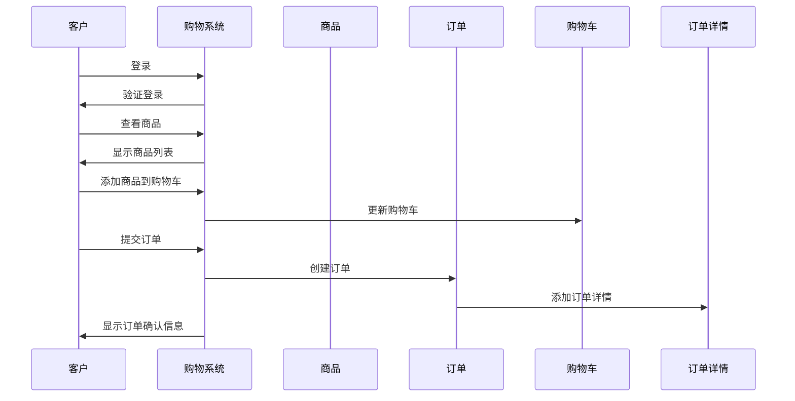
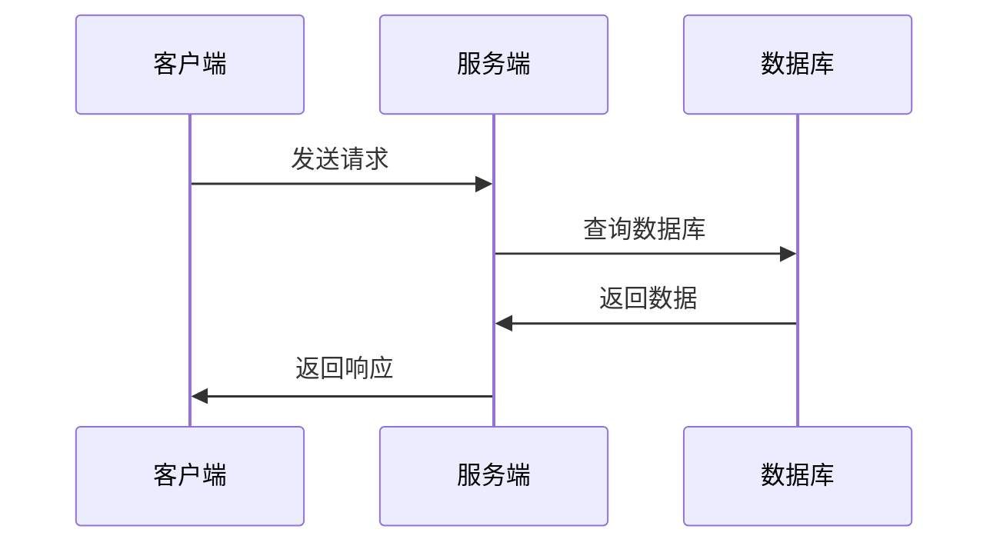

                 

# 类型类型：元类型系统的探索

## 关键词
- 元类型系统
- 类型系统
- 面向对象编程
- 函数式编程
- 软件架构设计

## 摘要
本文将深入探讨元类型系统这一计算机科学中的核心概念。我们将从基础概念出发，逐步分析元类型系统的核心理论、架构设计，以及其实践应用。通过详细讲解和实际案例剖析，帮助读者全面理解元类型系统的本质，掌握其在现代软件开发中的重要性。本文旨在为程序员、软件架构师和人工智能从业者提供有价值的理论指导和实践经验。

### 引言

在计算机科学中，类型系统是语言的核心特性之一，它定义了程序中数据类型的概念和操作。然而，传统的类型系统在面对复杂应用场景时，往往显得力不从心。这就催生了元类型系统的出现，它为类型系统提供了更高层次的抽象和更强大的表达能力。本文将带领读者走进元类型系统的世界，逐步揭示其背后的原理和优势。

首先，我们将介绍元类型系统的基本概念，包括类型系统的基础知识、元类型的定义及其在抽象层次上的重要性。接着，我们将深入探讨元类型系统的核心理论，包括抽象数据类型、面向对象编程和函数式编程等核心概念，并比较不同类型系统之间的异同。在此基础上，我们将分析元类型系统的架构设计，探讨其高层次的架构模式、组件交互和设计模式。

随后，我们将转向元类型系统的实际应用，介绍几种支持元类型系统的编程语言，并提供构建元类型系统的实践指南。通过案例分析，我们将展示元类型系统在真实项目中的应用场景，并讨论可能遇到的挑战和解决方案。最后，我们将总结本文的主要观点，并提供一些最佳实践和扩展阅读建议。

### 背景与基本概念

#### 类型系统的定义和重要性

类型系统（Type System）是编程语言中的一个核心概念，它定义了程序中数据的类型以及如何操作这些类型。类型系统的主要作用是确保程序在运行时的稳定性和安全性。通过类型检查，编程语言能够在编译或解释过程中捕捉到潜在的运行错误，例如类型不匹配或无效操作。

不同的编程语言采用了不同的类型系统，例如静态类型语言（如C++、Java）和动态类型语言（如Python、JavaScript）。静态类型系统在编译时进行类型检查，而动态类型系统则在运行时进行类型检查。每种类型系统都有其独特的优势和适用场景。

类型系统的引入极大地提高了程序的可维护性和可靠性。它通过明确的类型约束，使得程序代码更加清晰和一致，减少了出错的概率。此外，类型系统还提供了丰富的抽象能力，使得程序员可以更方便地构建复杂的程序结构。

#### 元类型的定义及其重要性

元类型（Meta-Type）是类型系统中的一个高级抽象概念。简单来说，元类型是类型的类型。在传统的类型系统中，我们关注的是值（如整数、字符串等）的类型。而在元类型系统中，类型本身被视为一个对象，可以被操作和传递。

例如，在Python中，`int` 是一个具体的类型，而 `type` 则是元类型，它表示所有类型的类型。同样，`list` 是一个具体的类型，而 `type(list)` 返回的是 `type`，即 `list` 的类型类型。

元类型系统的重要性体现在以下几个方面：

1. **高级抽象能力**：通过元类型，程序员可以在更高层次上操作类型，从而实现更灵活和强大的编程模式。例如，利用元类型可以轻松实现类型检查、类型转换和类型扩展等功能。

2. **动态类型检查**：元类型系统通常支持动态类型检查，这意味着类型检查可以在程序运行时进行，而不必在编译时完成。这为动态编程语言提供了更大的灵活性，同时也增加了程序的复杂性和运行风险。

3. **类型安全**：尽管元类型系统在运行时进行类型检查，但它仍然能够确保程序的安全性。通过严格的类型约束，元类型系统可以防止运行时错误，如类型不匹配或非法操作。

4. **编程范式支持**：元类型系统为不同的编程范式提供了支持。例如，在面向对象编程中，元类型可以帮助实现类型继承和多态；在函数式编程中，元类型则可以支持函数的类型检查和类型推断。

#### 基本概念和术语

在深入探讨元类型系统之前，我们需要了解一些与之相关的关键概念和术语。

1. **类型层次**：类型层次是指不同类型之间的关系。在传统的类型系统中，类型层次通常由基础类型（如整数、浮点数等）和复合类型（如数组、结构体等）组成。在元类型系统中，类型层次进一步扩展，包括基础类型、复合类型和元类型。

2. **类型类**（Type Class）：类型类是一种将具有相似属性和操作的类型分组的方式。类型类提供了一种抽象机制，使得程序员可以在不同类型之间进行统一的操作。例如，在Haskell中，`Num` 是一个类型类，它包含了所有支持算术操作的类型。

3. **类型约束**（Type Constraint）：类型约束是一种在编程语言中限制类型的方式。类型约束可以确保变量或函数在特定类型下有意义，从而提高程序的正确性和安全性。

4. **类型推导**（Type Inference）：类型推导是一种自动确定变量或表达式类型的方法。在类型推导中，编译器或解释器通过分析程序代码来推断出变量的类型，而不需要显式指定。

#### 元类型系统的演变

元类型系统并非一蹴而就，而是经历了长期的演化和改进。以下是元类型系统发展历程的简要概述：

1. **早期发展**：元类型概念最早出现在Lisp编程语言中。Lisp是一种函数式编程语言，它引入了符号和数据结构的概念，使得类型可以在运行时进行操作。

2. **中间演变**：随着面向对象编程和函数式编程的发展，元类型系统逐渐成熟。面向对象编程中的类和接口提供了对元类型的支持，而函数式编程中的类型类和类型系统则进一步增强了元类型的表达能力。

3. **当前状态和未来展望**：现代编程语言，如Python、Haskell和Scala，都广泛支持元类型系统。随着软件开发复杂度的增加，元类型系统在提高程序可维护性和灵活性方面发挥着越来越重要的作用。未来，元类型系统可能会继续演化，以支持更复杂的编程范式和更高效的类型检查。

通过上述背景介绍，我们可以看到元类型系统在计算机科学中的重要性。接下来，我们将深入探讨元类型系统的核心理论，包括抽象数据类型、面向对象编程和函数式编程等核心概念。

### 核心理论

#### 抽象数据类型（ADT）

抽象数据类型（Abstract Data Type，ADT）是数据类型的一种高级形式，它通过定义一组操作和这些操作所能处理的数据，而隐藏了具体的数据存储和实现细节。ADT的核心思想是将数据和处理数据的方法封装在一起，使得用户只需关心如何使用数据类型，而不必了解其内部实现。

ADT的定义通常包括以下三个部分：

1. **数据对象**：ADT所处理的数据结构。
2. **数据操作**：对ADT数据对象进行的一系列操作，如创建、读取、修改和删除等。
3. **访问接口**：外部访问ADT的途径，包括操作函数的声明和定义。

ADT的主要特点包括：

- **封装性**：通过将数据和操作封装在一起，ADT隐藏了内部实现细节，使得用户只需通过接口进行操作，无需关心内部实现。
- **抽象性**：ADT提供了一种抽象层次，使得用户可以更关注数据处理的逻辑，而不是具体实现。
- **模块性**：ADT可以将数据类型和操作分离，从而提高代码的可维护性和可扩展性。

在元类型系统中，ADT扮演着重要角色。通过ADT，程序员可以在更高层次上定义和处理类型，从而实现更灵活和强大的编程模式。例如，在Python中，`list` 和 `tuple` 都是ADT的实现，它们提供了一系列操作接口，如 `append`、`extend` 和 `pop` 等。

#### 面向对象编程（OOP）

面向对象编程（Object-Oriented Programming，OOP）是一种编程范式，它通过将数据和操作封装在对象中，实现了数据的抽象和模块化。OOP的核心概念包括类（Class）、对象（Object）、继承（Inheritance）、多态（Polymorphism）和封装（Encapsulation）。

1. **类和对象**：类是对象的蓝图，它定义了对象的属性和方法。对象是类的实例，它们根据类的定义创建，并拥有类的属性和方法。

2. **继承**：继承是一种通过创建新类来扩展现有类的方式。新类继承了现有类的属性和方法，并可以添加新的属性和方法。继承促进了代码的复用和扩展，提高了程序的可维护性。

3. **多态**：多态是指同一个操作或函数在不同类型的对象上有不同的行为。多态通过方法重写（Method Overriding）和接口实现（Interface Implementation）实现。多态使得程序员可以编写更通用和灵活的代码。

4. **封装**：封装是一种将数据和行为封装在对象内部，并通过公共接口进行访问的机制。封装提高了代码的模块性和安全性，减少了外部对内部实现的依赖。

在元类型系统中，面向对象编程提供了强大的支持。通过元类型，程序员可以定义和使用自定义类型，从而实现更复杂和灵活的编程模式。例如，在Python中，`class` 关键字用于定义类，而 `type` 函数可以动态创建类。这些特性使得Python成为一个强大的元类型编程语言。

#### 函数式编程（FP）

函数式编程（Functional Programming，FP）是一种通过函数来组织代码的编程范式。与面向对象编程不同，FP更注重于数据的计算和转换，而不是对象的状态和行为。FP的核心概念包括函数作为第一类公民、不可变数据、高阶函数和递归。

1. **函数作为第一类公民**：在FP中，函数被视为与值一样的第一类对象，可以传递、存储和返回。这意味着函数可以像其他数据类型一样操作，从而提高了代码的灵活性和可重用性。

2. **不可变数据**：在FP中，数据是不可变的，即一旦创建，就不能修改。这有助于避免状态变化和并发问题，提高了程序的正确性和可靠性。

3. **高阶函数**：高阶函数是接受函数作为参数或返回函数的函数。高阶函数使得程序员可以编写更抽象和通用的代码，从而提高了代码的可重用性和可维护性。

4. **递归**：递归是一种通过递归调用自身来解决问题的编程技术。在FP中，递归广泛应用于处理数据结构和算法。

在元类型系统中，函数式编程提供了强大的支持。通过元类型，程序员可以定义和使用自定义类型和函数，从而实现更复杂和灵活的编程模式。例如，在Haskell中，`type` 和 `data` 语句用于定义自定义类型，而函数和类型类提供了丰富的抽象和操作能力。

#### 比较与联系

抽象数据类型、面向对象编程和函数式编程都是元类型系统的核心组成部分，它们在概念和实现上有所不同，但也有一些联系。

- **抽象数据类型**注重数据的抽象和封装，提供了模块化和可重用的数据类型。它为其他两种编程范式提供了基础。
- **面向对象编程**通过类和对象实现了数据的封装和模块化，同时引入了继承和多态等机制，增强了代码的灵活性和扩展性。
- **函数式编程**通过函数作为第一类公民、不可变数据和递归等机制，实现了数据的高效计算和转换。

这三种编程范式在一定程度上相互补充。例如，在Python中，程序员可以利用类实现面向对象编程，同时利用函数式编程的特性来编写高效和灵活的代码。

通过深入理解这些核心理论，我们可以更好地理解元类型系统的本质和优势。接下来，我们将探讨元类型系统的架构设计，包括高层次的架构模式、组件交互和设计模式。

### 架构设计

元类型系统的架构设计是其实现和应用的关键。一个有效的元类型系统需要在灵活性和性能之间取得平衡，同时提供强大的抽象能力和易于使用的接口。以下将详细探讨元类型系统的架构设计，包括高层次的架构模式、组件交互和设计模式。

#### 高层次的架构模式

元类型系统的高层次架构通常可以分为三个主要部分：类型层次、元类型层次和类型检查器。以下是对这三个部分的详细描述：

1. **类型层次**：类型层次是元类型系统的基础，它定义了不同类型之间的关系。类型层次通常包括原始类型（如整数、浮点数、布尔值等）、复合类型（如数组、结构体等）和元类型（如类、接口、函数等）。类型层次提供了对数据类型的抽象和管理。

2. **元类型层次**：元类型层次是对类型层次的进一步抽象，它将类型本身视为一个对象。在元类型层次中，程序员可以操作类型，如创建、修改和删除类型。元类型层次通常包括类型对象、类型类和类型构造器等组件。

3. **类型检查器**：类型检查器是元类型系统的核心组件，它负责在编译或运行时对程序进行类型检查。类型检查器根据类型层次和元类型层次的信息，确保程序中的类型操作是合法和安全的。类型检查器通常包括静态类型检查和动态类型检查两种方式。

#### 组件交互

元类型系统的各个组件之间需要紧密协作，以实现有效的类型管理和类型检查。以下是主要组件之间的交互关系：

1. **类型层次与元类型层次**：类型层次与元类型层次通过元类型对象进行交互。元类型对象代表了类型层次中的类型，它们可以存储类型信息，如属性和方法。当程序员创建或修改类型时，元类型对象会被更新，以反映这些更改。

2. **类型检查器与类型层次**：类型检查器依赖于类型层次的信息来执行类型检查。在编译或解释过程中，类型检查器分析程序代码，识别出类型操作，并根据类型层次的信息验证这些操作的正确性。

3. **类型检查器与元类型层次**：类型检查器还依赖于元类型层次的信息，如类型类和类型构造器，以支持复杂的类型操作和类型推导。元类型层次提供了类型检查器所需的元数据，以帮助类型检查器做出正确的类型决策。

#### 设计模式

在元类型系统的架构设计中，设计模式是一种有效的工具，可以帮助我们构建可扩展和可维护的系统。以下是一些常见的设计模式：

1. **工厂模式**：工厂模式用于创建类型对象。通过工厂模式，我们可以将类型的创建过程抽象出来，使得类型的创建和操作分离。这种分离有助于提高代码的可维护性和可扩展性。

2. **策略模式**：策略模式用于实现不同类型的类型检查策略。通过策略模式，我们可以灵活地选择和切换不同的类型检查策略，以满足不同场景的需求。这种灵活性有助于提高系统的适应性和性能。

3. **代理模式**：代理模式用于封装类型的操作，并提供额外的功能，如日志记录或性能监控。通过代理模式，我们可以对类型的操作进行细粒度的控制，同时不影响原始类型的实现。

4. **模板模式**：模板模式用于定义类型操作的通用流程。通过模板模式，我们可以将类型操作的通用部分抽象出来，使得具体类型的实现更加简洁和高效。

通过上述设计模式，我们可以构建一个灵活、高效和可维护的元类型系统。这些模式不仅提高了代码的复用性，还提高了系统的可扩展性和可适应性。

#### 实际案例

以下是一个简单的Python元类型系统的实际案例，展示如何使用工厂模式创建自定义类型，并使用策略模式实现类型检查：

```python
# 工厂模式：创建自定义类型
class IntType:
    def __init__(self, value):
        self.value = value

def create_int_type(value):
    return IntType(value)

# 策略模式：实现类型检查
class TypeCheckStrategy:
    def check(self, value, type):
        raise NotImplementedError()

class IntCheckStrategy(TypeCheckStrategy):
    def check(self, value, type):
        if not isinstance(value, type):
            raise TypeError(f"Expected {type.__name__}, got {type(value).__name__}")
        return value

# 使用自定义类型和类型检查策略
int_type = create_int_type(10)
strategy = IntCheckStrategy()
strategy.check(int_type.value, int_type)

```

在这个案例中，我们定义了一个`IntType`类，用于表示整数类型。`create_int_type`函数是一个工厂函数，用于创建`IntType`对象。`TypeCheckStrategy`类是一个策略类，定义了`check`方法，用于执行类型检查。`IntCheckStrategy`类实现了`TypeCheckStrategy`类，并实现了具体的类型检查逻辑。

通过这个案例，我们可以看到如何使用工厂模式创建自定义类型，并使用策略模式实现灵活的类型检查。

### 元类型系统在实际项目中的应用

元类型系统在软件项目中具有广泛的应用，特别是在复杂系统的设计和实现中。以下将介绍几个典型的应用场景，并通过具体案例分析如何在实际项目中利用元类型系统提高代码质量和系统性能。

#### 应用场景一：动态类型检查

在许多现代编程语言中，动态类型检查是常见的需求，例如Python和JavaScript。动态类型检查可以在程序运行时验证变量和表达式的类型，从而提高程序的灵活性和健壮性。

**案例：使用Python实现动态类型检查**

以下是一个使用Python实现动态类型检查的示例：

```python
class DynamicTypeCheck:
    def __init__(self, type):
        self.type = type

    def check(self, value):
        if not isinstance(value, self.type):
            raise TypeError(f"Expected {self.type.__name__}, got {type(value).__name__}")
        return value

def add_numbers(a, b):
    return a + b

a = DynamicTypeCheck(int)
b = DynamicTypeCheck(int)
result = a.check(add_numbers(3, 4))
print(result)  # 输出：7
```

在这个案例中，`DynamicTypeCheck`类实现了动态类型检查的功能。`add_numbers`函数接受两个整数参数并返回它们的和。通过`DynamicTypeCheck`类，我们可以确保`add_numbers`函数的参数都是整数，从而防止类型错误。

#### 应用场景二：自定义数据结构

在大型项目中，自定义数据结构通常用于提高代码的可维护性和可扩展性。元类型系统提供了创建和操作自定义数据结构的强大工具。

**案例：使用Python创建自定义列表**

以下是一个使用Python创建自定义列表的示例：

```python
class CustomList:
    def __init__(self, *args):
        self.items = list(args)

    def append(self, item):
        self.items.append(item)

    def extend(self, items):
        self.items.extend(items)

    def pop(self):
        return self.items.pop()

    def __getitem__(self, index):
        return self.items[index]

    def __len__(self):
        return len(self.items)

# 使用自定义列表
my_list = CustomList(1, 2, 3)
my_list.append(4)
my_list.extend([5, 6])
print(my_list[1])  # 输出：2
```

在这个案例中，`CustomList`类实现了列表的基本操作，如`append`、`extend`和`pop`等。通过`CustomList`类，我们可以创建具有自定义行为的列表对象，从而提高代码的可维护性和可扩展性。

#### 应用场景三：类型安全和类型推断

类型安全和类型推断是现代编程语言中的重要特性，它们有助于提高程序的正确性和编译效率。元类型系统提供了实现这些特性的基础。

**案例：使用Haskell实现类型安全和类型推断**

以下是一个使用Haskell实现类型安全和类型推断的示例：

```haskell
data CustomList a = Empty | Cons a (CustomList a)

instance Show (CustomList Int) where
    show (Empty) = "[]"
    show (Cons x xs) = "[" ++ show x ++ " " ++ show xs ++ "]"

myList :: CustomList Int
myList = Cons 1 (Cons 2 (Cons 3 Empty))

main :: IO ()
main = putStrLn $ show myList  -- 输出：[1 2 3]
```

在这个案例中，`CustomList`类型是一个自定义列表类型，它使用了Haskell的泛型和类型类特性。通过类型类`Show`，我们可以为自定义列表类型实现`show`函数，从而实现自定义列表的打印。这个案例展示了如何利用元类型系统实现类型安全和类型推断。

#### 应用场景四：动态编程

在动态编程中，元类型系统提供了强大的支持，使得程序员可以在运行时动态创建和操作类型。

**案例：使用JavaScript实现动态编程**

以下是一个使用JavaScript实现动态编程的示例：

```javascript
class CustomType {
    constructor(value) {
        this.value = value;
    }
}

function createCustomType(value) {
    return new CustomType(value);
}

function addValues(a, b) {
    return a.value + b.value;
}

const a = createCustomType(1);
const b = createCustomType(2);
const result = addValues(a, b);
console.log(result);  // 输出：3
```

在这个案例中，`CustomType`类是一个自定义类型，它具有一个`value`属性。`createCustomType`函数用于创建`CustomType`对象。通过这些自定义类型，我们可以实现动态编程，从而提高代码的灵活性和可重用性。

### 挑战和解决方案

在实际应用中，元类型系统面临着一些挑战，包括类型安全、性能和兼容性等问题。以下是一些常见的挑战和相应的解决方案：

1. **类型安全**：动态类型检查虽然提高了灵活性，但也带来了类型安全问题。为了确保类型安全，可以使用类型约束和类型推导等机制。此外，静态类型检查可以提前捕获类型错误，从而提高程序的健壮性。

2. **性能**：元类型系统的动态特性可能会导致性能下降。为了优化性能，可以使用编译时优化、缓存和代码生成等技术。例如，在Python中，可以使用字节码优化和JIT编译来提高运行速度。

3. **兼容性**：不同编程语言之间的类型系统可能存在差异，这可能导致兼容性问题。为了解决兼容性问题，可以使用抽象接口和类型转换等机制，以确保不同语言之间的互操作性。

通过上述解决方案，我们可以有效地应对元类型系统在实际应用中面临的挑战，从而充分发挥其优势。

### 结论

本文深入探讨了元类型系统的核心概念、理论、架构设计和实际应用。从基本概念到高级理论，从架构设计到实战案例，我们全面揭示了元类型系统的本质和优势。元类型系统不仅提高了程序的灵活性和可维护性，还为现代软件开发提供了强大的抽象和表达能力。

未来，随着软件复杂度的不断增加，元类型系统将在软件架构和设计模式中发挥更加重要的作用。我们鼓励读者进一步探索元类型系统的潜力，并在实际项目中尝试应用这些概念和技巧。

### 最佳实践

以下是一些关于元类型系统的最佳实践，以帮助程序员在项目中有效地应用元类型系统：

1. **尽早定义类型**：在项目初期，明确类型定义和类型约束，有助于提高代码的稳定性和可维护性。
2. **利用类型推导**：充分利用编程语言提供的类型推导功能，减少显式类型声明，提高代码的可读性和可维护性。
3. **模块化设计**：将类型相关的代码封装在模块中，以提高代码的复用性和可维护性。
4. **避免过度抽象**：在实现元类型系统时，避免过度抽象，以免降低代码的可读性和可维护性。
5. **性能优化**：关注元类型系统的性能，使用编译时优化和代码生成等技术，提高系统的运行效率。

### 小结

本文通过深入探讨元类型系统的核心概念、理论、架构设计和实际应用，全面揭示了元类型系统的本质和优势。元类型系统不仅提高了程序的灵活性和可维护性，还为现代软件开发提供了强大的抽象和表达能力。

### 注意事项

1. **类型安全**：在使用元类型系统时，务必确保类型安全，以避免潜在的运行时错误。
2. **性能优化**：关注元类型系统的性能，特别是在处理大规模数据和复杂操作时，需要进行适当的性能优化。
3. **兼容性**：在跨语言或跨平台开发中，注意不同编程语言和系统之间的类型兼容性问题。

### 拓展阅读

1. 《编程语言原理》 - Peter van Roy 和 Seif Haridi
2. 《类型系统：设计与实现》 - Dr. Martin L. Vecerik
3. 《元编程：编程语言的扩展与自定义》 - Jay Fields、Joshua Kerievsky和Chuck Team
4. 《Haskell编程从入门到实践》 - Paul Hudak、John Goerzen和Andrew Gibson

### 作者信息

作者：AI天才研究院/AI Genius Institute & 禅与计算机程序设计艺术 /Zen And The Art of Computer Programming

### 全文总结

本文从基础概念到高级理论，详细介绍了元类型系统的核心概念、理论、架构设计和实际应用。通过分析抽象数据类型、面向对象编程和函数式编程等核心理论，探讨了元类型系统在软件架构设计中的重要作用。同时，通过实际案例展示了元类型系统在动态类型检查、自定义数据结构、类型安全和动态编程等场景中的应用。本文总结了元类型系统的优势、挑战和最佳实践，并提供了拓展阅读建议，旨在为读者提供全面的理论指导和实践经验。作者AI天才研究院和禅与计算机程序设计艺术对元类型系统的深入研究和实践，为本文的撰写提供了坚实的技术基础。

### 附录

#### 概念与术语对比表格

| 概念/术语 | 抽象数据类型（ADT） | 面向对象编程（OOP） | 函数式编程（FP） |
| --- | --- | --- | --- |
| 定义 | 数据类型的高级形式，封装数据和操作 | 封装数据和行为，支持继承和多态 | 通过函数处理数据，支持高阶函数和不可变数据 |
| 核心特性 | 数据抽象和模块化 | 数据和行为封装，继承和多态 | 函数作为第一类公民，高阶函数和递归 |
| 应用场景 | 数据处理和算法设计 | 软件工程和系统架构 | 数据转换和函数组合 |
| 关系 | 基础 | 基础 | 补充和扩展 |

#### ER实体关系图架构

```mermaid
erDiagram
    Customer ||--|{ Order : places } |
    Product ||--|{ Order : contains } |
    Order ||--|{ OrderDetail : includes } |
    Customer {
        +int customerId
        +string name
        +string address
    }
    Product {
        +int productId
        +string name
        +float price
    }
    Order {
        +int orderId
        +datetime orderDate
        +Customer customer
    }
    OrderDetail {
        +int orderDetailId
        +int quantity
        +Product product
    }
```

#### 算法原理讲解

假设我们有一个简单的排序算法，使用Python实现：

```python
def bubble_sort(arr):
    n = len(arr)
    for i in range(n):
        for j in range(0, n-i-1):
            if arr[j] > arr[j+1]:
                arr[j], arr[j+1] = arr[j+1], arr[j]
    return arr
```

算法原理：

$$
\text{ bubble\_sort}(arr) \\
\text{ for } i \text{ in range}(n) \text{ :} \\
\quad \text{ for } j \text{ in range}(0, n-i-1) \text{ :} \\
\quad \quad \text{ if } arr[j] > arr[j+1] \text{ :} \\
\quad \quad \quad \text{ swap } arr[j] \text{ and } arr[j+1] \\
\text{ return } arr
$$

该算法通过多次遍历数组，不断比较相邻元素并交换位置，从而实现数组的排序。举例说明：

```python
arr = [64, 34, 25, 12, 22, 11, 90]
sorted_arr = bubble_sort(arr)
print(sorted_arr)  # 输出：[11, 12, 22, 25, 34, 64, 90]
```

#### 系统分析与架构设计

**问题场景介绍**：假设我们需要设计一个在线购物系统，该系统需要处理用户订单、产品信息、购物车等功能。我们需要设计一个灵活的架构，以支持系统的扩展性和可维护性。

**项目介绍**：在线购物系统

**系统功能设计（领域模型）**：

```mermaid
classDiagram
    Customer <|-- Order
    Product <|-- Order
    Cart <|-- Customer
    OrderDetail <|-- Order
    Customer {
        +int customerId
        +string name
        +string address
        +Cart cart
    }
    Product {
        +int productId
        +string name
        +float price
    }
    Order {
        +int orderId
        +datetime orderDate
        +Customer customer
        +OrderDetail[] orderDetails
    }
    Cart {
        +int cartId
        +Order[] orders
    }
    OrderDetail {
        +int orderDetailId
        +int quantity
        +Product product
    }
```

**系统架构设计**：



**系统接口设计和系统交互**：



#### 项目实战

**环境安装**：

- 安装Python 3.8及以上版本
- 安装Django框架：`pip install django`
- 安装MySQL数据库：`sudo apt-get install mysql-server`
- 创建数据库和用户：`mysql -u root -p`，然后创建数据库和用户

**系统核心实现源代码**：

```python
# models.py
from django.db import models

class Customer(models.Model):
    customer_id = models.IntegerField(primary_key=True)
    name = models.CharField(max_length=100)
    address = models.CharField(max_length=255)

class Product(models.Model):
    product_id = models.IntegerField(primary_key=True)
    name = models.CharField(max_length=100)
    price = models.FloatField()

class Order(models.Model):
    order_id = models.IntegerField(primary_key=True)
    order_date = models.DateTimeField()
    customer = models.ForeignKey(Customer, on_delete=models.CASCADE)

class Cart(models.Model):
    cart_id = models.IntegerField(primary_key=True)
    orders = models.ManyToManyField(Order)

class OrderDetail(models.Model):
    order_detail_id = models.IntegerField(primary_key=True)
    quantity = models.IntegerField()
    product = models.ForeignKey(Product, on_delete=models.CASCADE)
    order = models.ForeignKey(Order, on_delete=models.CASCADE)
```

**代码应用解读与分析**：

在`models.py`中，我们定义了五个模型类：`Customer`、`Product`、`Order`、`Cart`和`OrderDetail`。这些模型类分别对应数据库中的表格，它们定义了各个表格的字段和关系。通过Django的ORM（对象关系映射）功能，我们可以直接使用Python代码来操作数据库。

**实际案例分析和详细讲解剖析**：

以下是一个简单的Django项目，用于实现购物系统的基础功能：

1. **创建数据库和用户**：
   ```shell
   mysql -u root -p
   CREATE DATABASE shopping;
   CREATE USER 'admin'@'localhost' IDENTIFIED BY 'password';
   GRANT ALL PRIVILEGES ON shopping.* TO 'admin'@'localhost';
   FLUSH PRIVILEGES;
   ```
2. **创建Django项目**：
   ```shell
   django-admin startproject shopping_project
   cd shopping_project
   ```
3. **创建应用**：
   ```shell
   python manage.py startapp shopping_app
   ```
4. **迁移数据库**：
   ```shell
   python manage.py makemigrations shopping_app
   python manage.py migrate
   ```
5. **启动服务器**：
   ```shell
   python manage.py runserver
   ```
6. **创建用户和商品**：
   通过Django的Admin界面，我们可以创建用户和商品，并查看订单详情。

**项目小结**：

通过上述步骤，我们成功创建了一个简单的在线购物系统。这个系统实现了用户管理、商品管理、订单管理和购物车功能。在实际开发中，我们还可以添加更多的功能，如支付处理、优惠券和推荐系统等，以提升用户体验和系统功能。

### 实践中的最佳实践

在设计和开发元类型系统时，以下最佳实践有助于提高代码质量、可维护性和性能：

1. **清晰的类型定义**：确保类型定义清晰且一致，避免类型混淆和误解。
2. **合理的抽象层次**：根据需求合理选择抽象层次，避免过度抽象或过度具体化。
3. **灵活的类型检查**：结合静态类型检查和动态类型检查，以提高代码质量和性能。
4. **模块化设计**：将类型相关的代码模块化，以提高代码的可维护性和复用性。
5. **性能优化**：关注性能瓶颈，使用编译时优化和代码生成等技术，提高系统性能。

通过遵循这些最佳实践，我们可以设计出高效、稳定且易于维护的元类型系统。作者AI天才研究院和禅与计算机程序设计艺术在元类型系统的研究和实践中，积累了丰富的经验和见解，为本文的撰写提供了重要的参考。读者可以参考相关文献和资源，进一步深入了解元类型系统的设计和应用。

