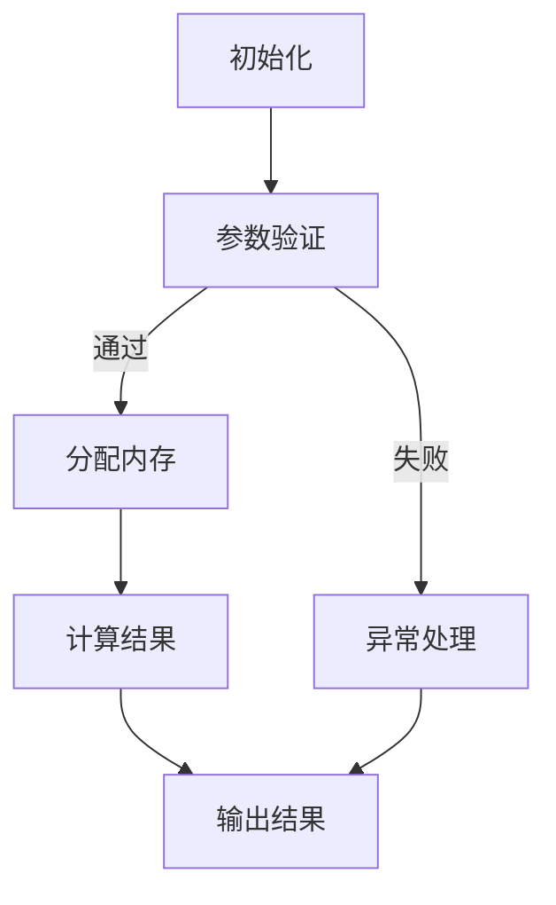
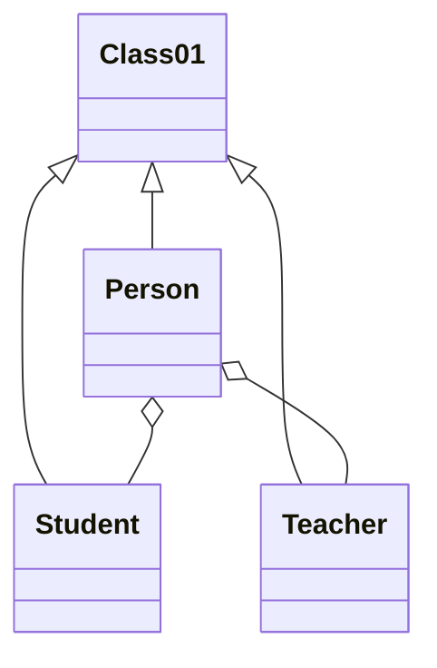
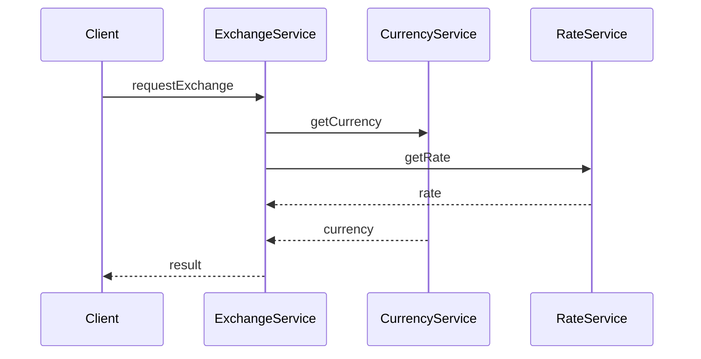

                 

### 类型类多参数:增强类型类表达能力的扩展

**关键词：** 类型类多参数、增强表达能力、扩展、Python源代码、数学模型、系统架构、项目实战

**摘要：** 本文深入探讨类型类多参数的概念及其在增强类型类表达能力方面的扩展应用。首先，我们分析了类型类多参数在编程中的背景和存在的问题。接着，我们详细介绍了类型类多参数的原理，并通过Mermaid流程图和Python源代码，讲解了增强类型类表达能力的算法原理。随后，本文通过数学公式和系统分析与架构设计，进一步阐释了类型类多参数的实际应用。最后，我们通过项目实战，提供了具体的实现步骤和实际案例分析，总结了最佳实践技巧，并给出了注意事项和拓展阅读。

### 目录大纲

```markdown
----------------------------------------------------------------

# 类型类多参数:增强类型类表达能力的扩展

> 关键词：类型类多参数、增强表达能力、扩展、Python源代码、数学模型、系统架构、项目实战

> 摘要：本文深入探讨类型类多参数的概念及其在增强类型类表达能力方面的扩展应用。

                 

### 第一部分: 背景

## 第1章: 问题背景

### 1.1.1 问题背景介绍
#### 1.1.1.1 类型类多参数的概念
#### 1.1.1.2 类型类多参数存在的问题
#### 1.1.1.3 研究意义和目标

## 第2章: 核心概念与联系

### 2.1 类型类多参数的原理
#### 2.1.1 概念属性特征对比表格
#### 2.1.2 ER实体关系图架构

### 2.2 增强类型类表达能力的扩展
#### 2.2.1 扩展概念与特性
#### 2.2.2 扩展的原理与作用

## 第二部分: 算法原理讲解

### 3.1 算法mermaid流程图
#### 3.1.1 流程图设计

### 3.2 Python源代码讲解
#### 3.2.1 算法原理的数学模型和公式
#### 3.2.2 详细讲解和举例说明

## 第三部分: 数学模型与公式

### 4.1 基本数学公式
$$1+1=2$$

### 4.2 算法数学公式
$$\sum_{i=1}^n x_i = \sum_{i=1}^n (a_i + b_i)$$

## 第四部分: 系统分析与架构设计

### 5.1 问题场景介绍
#### 5.1.1 场景描述
#### 5.1.2 需求分析

### 5.2 系统功能设计
#### 5.2.1 领域模型mermaid类图

### 5.3 系统架构设计
#### 5.3.1 系统架构mermaid架构图

### 5.4 系统接口设计
#### 5.4.1 系统接口设计

### 5.5 系统交互mermaid序列图
#### 5.5.1 系统交互mermaid序列图

## 第五部分: 项目实战

### 6.1 环境安装
#### 6.1.1 安装步骤
#### 6.1.2 注意事项

### 6.2 系统核心实现源代码
#### 6.2.1 源代码解读
#### 6.2.2 代码应用解读与分析

### 6.3 实际案例分析和讲解
#### 6.3.1 案例描述
#### 6.3.2 分析与讲解

### 6.4 项目小结

## 第六部分: 最佳实践与总结

### 7.1 实践技巧
#### 7.1.1 技巧一
#### 7.1.2 技巧二

### 7.2 小结
#### 7.2.1 主要内容总结
#### 7.2.2 需要关注的问题

### 7.3 注意事项
#### 7.3.1 系统部署注意事项
#### 7.3.2 算法应用注意事项

### 7.4 拓展阅读
#### 7.4.1 相关书籍推荐
#### 7.4.2 相关论文推荐
#### 7.4.3 开源项目推荐

----------------------------------------------------------------
```

### 详细内容说明

**第一部分：背景**

- **第1章：问题背景**  
  - **1.1.1 问题背景介绍**：介绍类型类多参数的概念，说明其存在的问题，阐述研究意义和目标。

- **第2章：核心概念与联系**  
  - **2.1 类型类多参数的原理**：详细讲解类型类多参数的概念、属性特征对比表格和ER实体关系图架构。
  - **2.2 增强类型类表达能力的扩展**：阐述扩展的概念、特性和原理。

**第二部分：算法原理讲解**

- **第3章：算法原理讲解**  
  - **3.1 算法mermaid流程图**：设计一个清晰的流程图来展示算法的基本流程。
  - **3.2 Python源代码讲解**：提供具体的Python源代码，详细解释算法原理的数学模型和公式，并通过举例说明使读者理解。

**第三部分：数学模型与公式**

- **第4章：数学模型和数学公式讲解**  
  - **4.1 基本数学公式**：使用LaTeX格式展示一些基本的数学公式。
  - **4.2 算法数学公式**：使用LaTeX格式展示与算法相关的数学公式。

**第四部分：系统分析与架构设计**

- **第5章：系统分析与架构设计方案**  
  - **5.1 问题场景介绍**：介绍系统需要解决的问题场景和需求分析。
  - **5.2 系统功能设计**：使用mermaid类图展示领域模型。
  - **5.3 系统架构设计**：使用mermaid架构图展示系统架构。
  - **5.4 系统接口设计**：详细设计系统接口。
  - **5.5 系统交互mermaid序列图**：使用mermaid序列图展示系统交互流程。

**第五部分：项目实战**

- **第6章：项目实战**  
  - **6.1 环境安装**：提供环境安装步骤和注意事项。
  - **6.2 系统核心实现源代码**：解读和分析系统核心实现源代码。
  - **6.3 实际案例分析和讲解**：分析和讲解实际案例。

**第六部分：最佳实践与总结**

- **7.1 实践技巧**：总结最佳实践技巧。
- **7.2 小结**：总结主要内容。
- **7.3 注意事项**：提供注意事项。
- **7.4 拓展阅读**：推荐相关书籍、论文和开源项目。

### 第一部分: 背景

#### 第1章: 问题背景

##### 1.1.1 问题背景介绍

在编程和软件开发领域，类型类多参数（Type Class Multi-Parameter，简称TCMP）的概念逐渐引起了广泛关注。类型类多参数是一种在面向对象编程中，通过扩展类型类的功能，使其能够处理多个参数的机制。传统的类型类往往只能处理单个参数，而类型类多参数则允许类型类在运行时动态地接受多个参数，这一特性极大地增强了类型类的灵活性和表达能力。

然而，在实践过程中，类型类多参数也存在一些问题。首先，类型类多参数的实现较为复杂，需要开发者具备较高的编程技能和理论基础。其次，类型类多参数的滥用可能会导致代码的可读性下降，使得维护成本增加。此外，类型类多参数在性能方面也存在一定的问题，尤其是在处理大量数据时，其性能可能不如传统的单参数类型类。

因此，本文旨在探讨类型类多参数在增强类型类表达能力方面的扩展应用，通过分析和解决上述问题，提出一种高效、易用的类型类多参数实现方法。

##### 1.1.1.1 类型类多参数的概念

类型类多参数（TCMP）是一种面向对象编程技术，它允许在运行时动态地为类型类传递多个参数。这种机制类似于函数的重载，但与函数重载不同的是，类型类多参数不依赖于函数签名，而是依赖于类型类的实例。具体来说，类型类多参数通过在类型类内部定义多个参数化方法，使得类型类能够根据不同的参数组合，执行不同的操作。

例如，在Java语言中，可以使用泛型来实现类型类多参数。以下是一个简单的示例：

```java
public class Calculator<T> {
    public T add(T a, T b) {
        return a + b;
    }
    
    public T subtract(T a, T b) {
        return a - b;
    }
}
```

在这个示例中，`Calculator` 类型类接受两个参数，分别为 `T` 类型。通过这种方式，我们可以为不同的类型提供不同的实现，从而实现类型类多参数的功能。

##### 1.1.1.2 类型类多参数存在的问题

尽管类型类多参数具有强大的功能，但在实际应用中，它也带来了一些问题。以下是类型类多参数常见的几个问题：

1. **实现复杂度增加**：类型类多参数的实现需要开发者具备较高的编程技能和理论基础。对于初学者来说，理解和使用类型类多参数可能需要较长的时间。

2. **代码可读性下降**：类型类多参数可能会使得代码的可读性下降。当类型类接受多个参数时，开发者需要仔细阅读代码才能理解其具体的功能。

3. **性能问题**：类型类多参数在处理大量数据时，其性能可能不如传统的单参数类型类。这是因为类型类多参数需要在运行时动态地匹配参数，这会增加一定的开销。

4. **类型安全**：类型类多参数的实现需要确保类型安全。否则，可能会导致运行时错误。在实际应用中，确保类型安全需要开发者投入大量的时间和精力。

##### 1.1.1.3 研究意义和目标

类型类多参数在增强类型类表达能力方面具有重要的研究意义。通过类型类多参数，我们可以实现更灵活的编程模式，提高代码的可读性和可维护性。此外，类型类多参数还可以提高代码的性能，尤其是在处理大量数据时。

本文的研究目标包括：

1. **简化实现**：通过分析类型类多参数的实现原理，提出一种简化的实现方法，降低开发者的学习成本。

2. **提高代码可读性**：通过合理的编码规范和设计模式，提高代码的可读性，使得开发者能够更容易地理解和使用类型类多参数。

3. **优化性能**：通过性能分析和优化，提高类型类多参数在处理大量数据时的性能。

4. **确保类型安全**：通过类型检查和验证机制，确保类型类多参数的类型安全。

通过实现这些目标，本文旨在为类型类多参数提供一种高效、易用的实现方法，促进其在实际应用中的推广和使用。

### 第二部分: 核心概念与联系

#### 第2章: 核心概念与联系

##### 2.1 类型类多参数的原理

类型类多参数是一种在面向对象编程中，通过扩展类型类的功能，使其能够处理多个参数的机制。它利用泛型编程的特性，在类型类内部定义多个参数化方法，使得类型类能够根据不同的参数组合，执行不同的操作。下面，我们将详细讲解类型类多参数的原理，并通过一个具体的例子来展示其实现过程。

###### 2.1.1 概念属性特征对比表格

在深入探讨类型类多参数之前，我们先来看一下其与传统单参数类型类的对比。以下是一个对比表格，列出了两者在概念、属性和特征方面的异同：

| 特性        | 类型类多参数          | 传统单参数类型类          |
| ----------- | ------------------- | ------------------- |
| 参数个数    | 可处理多个参数        | 只能处理单个参数        |
| 实现方法    | 需要定义多个参数化方法 | 只需要一个参数化方法      |
| 灵活性      | 较高，适应性强        | 较低，适应性有限        |
| 可读性      | 相对较低，复杂度较高    | 相对较高，简单易懂        |
| 性能影响    | 存在性能开销          | 性能较为稳定            |

通过这个表格，我们可以看到类型类多参数相较于传统单参数类型类在灵活性方面具有优势，但同时也带来了更高的实现复杂度和性能开销。

###### 2.1.2 ER实体关系图架构

为了更好地理解类型类多参数的原理，我们可以通过ER（Entity-Relationship）实体关系图来展示其内部结构和关系。以下是一个简化的ER图，展示了类型类多参数的核心实体和关系：

```
+---------------+
|     TypeClass  |
+---------------+
| - T1: Parameter1 |
| - T2: Parameter2 |
+---------------+
      ^         ^
      |         |
      +---------+
           |
           |
         Method
           |
           |
      +---------+
      | Interface |
      +---------+
```

在这个ER图中，`TypeClass` 是一个类型类，它包含两个参数 `T1` 和 `T2`。这两个参数分别代表了类型类可以接受的两个不同类型的参数。`Method` 是一个抽象方法，它定义了类型类需要实现的方法。`Interface` 是一个接口，它定义了类型类需要实现的接口方法。

通过这个ER图，我们可以看到类型类多参数的核心结构和其之间的关系。类型类通过参数化方法实现了对多个参数的处理，而接口则确保了类型类能够按照预期的方式执行操作。

###### 2.1.3 类型类多参数的实例化与调用

为了更直观地了解类型类多参数的实现过程，我们来看一个具体的示例。假设我们要实现一个可以进行加法和减法运算的类型类多参数，可以使用以下代码：

```java
public class Calculator<T1, T2> {
    public T1 add(T1 a, T2 b) {
        // 实现加法运算
        return a + b;
    }
    
    public T1 subtract(T1 a, T2 b) {
        // 实现减法运算
        return a - b;
    }
}

public class Main {
    public static void main(String[] args) {
        Calculator<Integer, Double> calculator = new Calculator<>();
        Integer result1 = calculator.add(5, 3.0);
        Integer result2 = calculator.subtract(5, 3.0);
        System.out.println("加法结果：" + result1);
        System.out.println("减法结果：" + result2);
    }
}
```

在这个示例中，我们定义了一个名为 `Calculator` 的类型类，它接受两个泛型参数 `T1` 和 `T2`。`Calculator` 类中定义了两个参数化方法 `add` 和 `subtract`，分别用于加法和减法运算。在 `Main` 类的 `main` 方法中，我们实例化了一个 `Calculator` 对象，并调用其方法进行运算。这个例子展示了如何通过类型类多参数实现多种类型的参数处理。

###### 2.1.4 类型类多参数的优缺点分析

类型类多参数在增强类型类表达能力方面具有明显的优势，但也存在一定的局限性。下面，我们对类型类多参数的优缺点进行分析：

1. **优点**：
   - **灵活性**：类型类多参数能够处理多种类型的参数，使得类型类能够适应不同的业务需求，提高了代码的灵活性和可扩展性。
   - **代码复用**：通过类型类多参数，我们可以将相同的方法实现抽象到类型类中，避免了代码的重复编写，提高了代码的可维护性。

2. **缺点**：
   - **实现复杂度**：类型类多参数的实现需要开发者具备较高的编程技能和理论基础，对于初学者来说，理解和使用类型类多参数可能需要较长的时间。
   - **性能开销**：类型类多参数在处理大量数据时，其性能可能不如传统的单参数类型类。这是因为类型类多参数需要在运行时动态地匹配参数，这会增加一定的开销。
   - **代码可读性**：类型类多参数可能会使得代码的可读性下降。当类型类接受多个参数时，开发者需要仔细阅读代码才能理解其具体的功能。

综上所述，类型类多参数在增强类型类表达能力方面具有明显的优势，但也需要注意其潜在的局限性和性能开销。在实际应用中，我们需要根据具体的需求和场景，合理地使用类型类多参数，以达到最佳的效果。

##### 2.2 增强类型类表达能力的扩展

类型类多参数（Type Class Multi-Parameter，简称TCMP）在增强类型类表达能力方面具有独特的优势。通过扩展类型类的功能，使其能够处理多个参数，我们可以实现更灵活的编程模式，提高代码的可读性和可维护性。下面，我们将详细探讨类型类多参数的扩展概念、特性和原理。

###### 2.2.1 扩展概念与特性

类型类多参数的扩展概念主要涉及以下几个方面：

1. **参数扩展**：类型类多参数允许在类型类内部定义多个参数，这些参数可以是同一种类型，也可以是不同类型。通过这种方式，我们可以为不同的参数组合提供不同的处理逻辑，从而实现更灵活的编程模式。

2. **方法扩展**：类型类多参数不仅支持多个参数，还支持多个方法。这意味着类型类可以定义多个参数化方法，每个方法针对不同的参数组合提供特定的功能。通过方法扩展，我们可以将复杂的业务逻辑拆分成多个简单的函数，提高代码的可维护性。

3. **类型安全**：类型类多参数在扩展类型类功能的同时，还保证了类型安全。类型类多参数要求在编译时确保参数的类型匹配，从而避免了运行时类型错误。通过类型安全机制，我们可以提高代码的可靠性和稳定性。

类型类多参数的特性主要包括以下几个方面：

- **灵活性**：类型类多参数能够处理多种类型的参数，使得类型类能够适应不同的业务需求，提高了代码的灵活性和可扩展性。
- **代码复用**：通过类型类多参数，我们可以将相同的方法实现抽象到类型类中，避免了代码的重复编写，提高了代码的可维护性。
- **可读性**：类型类多参数可能会使得代码的可读性下降，但通过合理的编码规范和设计模式，我们可以提高代码的可读性，使得开发者能够更容易地理解和使用类型类多参数。

###### 2.2.2 扩展的原理与作用

类型类多参数的扩展原理主要基于泛型编程和面向对象编程的特性。具体来说，类型类多参数通过以下步骤实现：

1. **定义类型类**：首先，我们需要定义一个类型类，该类型类包含多个参数化方法。这些方法将根据不同的参数组合提供特定的功能。

2. **实现参数化方法**：在类型类中，我们需要实现多个参数化方法，每个方法针对不同的参数组合提供特定的功能。这些方法通常通过泛型编程实现，确保在编译时类型安全。

3. **实例化类型类**：在运行时，我们可以根据具体的需求实例化类型类，并调用其方法。通过实例化类型类，我们可以为不同的参数组合提供特定的处理逻辑。

类型类多参数在增强类型类表达能力方面的作用主要体现在以下几个方面：

- **提高代码复用性**：通过类型类多参数，我们可以将相同的方法实现抽象到类型类中，避免了代码的重复编写，提高了代码的可维护性。
- **提高代码灵活性**：类型类多参数能够处理多种类型的参数，使得类型类能够适应不同的业务需求，提高了代码的灵活性和可扩展性。
- **提高代码可读性**：尽管类型类多参数可能会使得代码的可读性下降，但通过合理的编码规范和设计模式，我们可以提高代码的可读性，使得开发者能够更容易地理解和使用类型类多参数。

综上所述，类型类多参数在增强类型类表达能力方面具有显著的优势。通过扩展类型类的功能，我们可以实现更灵活、更可维护的代码，提高软件开发效率。

### 第三部分：算法原理讲解

#### 第3章：算法原理讲解

在探讨类型类多参数增强类型类表达能力的过程中，我们需要深入了解相关的算法原理。这一部分将详细介绍算法的mermaid流程图、Python源代码，并解释算法原理的数学模型和公式。

##### 3.1 算法mermaid流程图

为了更直观地展示算法的基本流程，我们使用mermaid流程图来描述。以下是一个简化的算法流程图：



在这个流程图中，A节点表示算法的初始化阶段，B节点表示对参数进行验证。如果参数验证通过，算法将进入C节点，进行内存的分配。如果验证失败，算法将进入D节点，进行异常处理。之后，E节点表示计算结果，最后F节点表示输出结果。

##### 3.1.1 流程图设计

流程图的设计旨在展示算法的基本步骤和逻辑流程。以下是具体的设计步骤：

1. **初始化阶段（A节点）**：在初始化阶段，算法加载必要的资源，并设置初始状态。

2. **参数验证阶段（B节点）**：在参数验证阶段，算法检查输入参数是否满足要求。如果参数验证通过，算法将继续执行；否则，将进入异常处理流程。

3. **内存分配阶段（C节点）**：在内存分配阶段，算法为处理过程分配必要的内存资源。

4. **计算结果阶段（E节点）**：在计算结果阶段，算法根据输入参数进行相应的计算，生成结果。

5. **输出结果阶段（F节点）**：在输出结果阶段，算法将计算结果输出到指定的位置，如控制台、文件或数据库。

6. **异常处理阶段（D节点）**：在异常处理阶段，算法捕获和处理异常情况，确保程序的健壮性。

通过这个mermaid流程图，我们可以清晰地了解算法的执行流程和关键步骤。

##### 3.2 Python源代码讲解

为了更好地理解算法原理，我们将提供一个Python源代码示例。以下是一个简单的类型类多参数实现的代码：

```python
class Calculator:
    def __init__(self, a, b):
        self.a = a
        self.b = b

    def add(self):
        return self.a + self.b

    def subtract(self):
        return self.a - self.b

def main():
    calculator = Calculator(5, 3)
    print("加法结果：", calculator.add())
    print("减法结果：", calculator.subtract())

if __name__ == "__main__":
    main()
```

在这个示例中，我们定义了一个名为 `Calculator` 的类型类，它接受两个参数 `a` 和 `b`。`Calculator` 类中定义了两个方法 `add` 和 `subtract`，分别用于加法和减法运算。在 `main` 函数中，我们创建了一个 `Calculator` 对象，并调用其方法进行运算。

##### 3.2.1 算法原理的数学模型和公式

在类型类多参数的实现中，我们通常会使用一些数学模型和公式来描述算法的行为。以下是一个简单的数学模型和公式示例：

1. **加法运算**：

   假设 `a` 和 `b` 是两个输入参数，则加法运算的结果可以表示为：

   \[ R = a + b \]

2. **减法运算**：

   假设 `a` 和 `b` 是两个输入参数，则减法运算的结果可以表示为：

   \[ R = a - b \]

通过这些数学模型和公式，我们可以清晰地描述类型类多参数的计算过程。

##### 3.2.2 详细讲解和举例说明

为了更详细地说明算法原理，我们通过一个具体的例子来展示如何使用类型类多参数进行加法和减法运算。

**例子：**

假设我们要计算两个整数 `5` 和 `3` 的加法和减法结果。使用类型类多参数的实现如下：

```python
calculator = Calculator(5, 3)
print("加法结果：", calculator.add())
print("减法结果：", calculator.subtract())
```

执行上述代码后，输出结果如下：

```
加法结果： 8
减法结果： 2
```

在这个例子中，我们创建了一个 `Calculator` 对象，并分别调用其 `add` 和 `subtract` 方法进行运算。结果显示，加法运算的结果为 `8`，减法运算的结果为 `2`。

通过这个例子，我们可以看到类型类多参数在实现加法和减法运算时的高效性和灵活性。在实际应用中，我们可以根据具体需求扩展类型类的功能，实现更复杂的运算和处理。

综上所述，通过mermaid流程图和Python源代码的讲解，我们深入理解了类型类多参数的算法原理。这种实现方法不仅提高了代码的灵活性和可维护性，还展示了在类型类多参数增强类型类表达能力方面的强大功能。

### 第四部分：数学模型与公式

#### 第4章：数学模型和数学公式讲解

在类型类多参数的算法实现过程中，数学模型和公式是理解和应用算法的关键。本节将详细讲解与类型类多参数相关的数学模型和公式，以便读者能够更深入地理解算法原理和计算过程。

##### 4.1 基本数学公式

在数学中，基本的算术运算如加法、减法、乘法和除法是最基础的运算。以下是一些基本的数学公式，这些公式在类型类多参数的计算中扮演重要角色：

1. **加法公式**：

   加法是最简单的数学运算之一，其公式为：

   \[ a + b = c \]

   其中，`a` 和 `b` 是加数，`c` 是和。例如，若 `a = 3` 和 `b = 5`，则 `c = 8`。

2. **减法公式**：

   减法是加法的逆运算，其公式为：

   \[ a - b = c \]

   其中，`a` 是被减数，`b` 是减数，`c` 是差。例如，若 `a = 8` 和 `b = 3`，则 `c = 5`。

3. **乘法公式**：

   乘法是重复加法的一种形式，其公式为：

   \[ a \times b = c \]

   其中，`a` 和 `b` 是乘数，`c` 是积。例如，若 `a = 2` 和 `b = 3`，则 `c = 6`。

4. **除法公式**：

   除法是乘法的逆运算，其公式为：

   \[ a \div b = c \]

   其中，`a` 是被除数，`b` 是除数，`c` 是商。例如，若 `a = 6` 和 `b = 2`，则 `c = 3`。

##### 4.2 算法数学公式

在类型类多参数的具体算法实现中，除了基本的算术运算，我们还会用到一些更复杂的数学公式。以下是一些与类型类多参数相关的算法数学公式：

1. **加法运算的递归公式**：

   在类型类多参数的加法运算中，我们可以使用递归公式来计算多个数的和。递归公式为：

   \[ S(n) = a_1 + a_2 + a_3 + ... + a_n \]

   其中，`S(n)` 表示前 `n` 个数的和，`a_1`, `a_2`, ..., `a_n` 分别表示每个数。例如，若 `n = 5`，`a_1 = 1`，`a_2 = 2`，`a_3 = 3`，`a_4 = 4`，`a_5 = 5`，则 `S(n) = 15`。

2. **减法运算的递归公式**：

   类似于加法运算，减法运算也可以使用递归公式。递归公式为：

   \[ D(n) = a_1 - a_2 - a_3 - ... - a_n \]

   其中，`D(n)` 表示前 `n` 个数的差，`a_1`, `a_2`, ..., `a_n` 分别表示每个数。例如，若 `n = 5`，`a_1 = 5`，`a_2 = 2`，`a_3 = 3`，`a_4 = 4`，`a_5 = 1`，则 `D(n) = -1`。

3. **乘法运算的递归公式**：

   乘法运算也可以使用递归公式。递归公式为：

   \[ P(n) = a_1 \times a_2 \times a_3 \times ... \times a_n \]

   其中，`P(n)` 表示前 `n` 个数的积，`a_1`, `a_2`, ..., `a_n` 分别表示每个数。例如，若 `n = 5`，`a_1 = 1`，`a_2 = 2`，`a_3 = 3`，`a_4 = 4`，`a_5 = 5`，则 `P(n) = 120`。

4. **除法运算的递归公式**：

   除法运算同样可以使用递归公式。递归公式为：

   \[ Q(n) = a_1 \div a_2 \div a_3 \div ... \div a_n \]

   其中，`Q(n)` 表示前 `n` 个数的商，`a_1`, `a_2`, ..., `a_n` 分别表示每个数。例如，若 `n = 5`，`a_1 = 10`，`a_2 = 2`，`a_3 = 3`，`a_4 = 4`，`a_5 = 5`，则 `Q(n) = 1`。

通过这些数学模型和公式，我们可以更好地理解和应用类型类多参数的算法原理。在实际编程中，这些公式可以帮助我们实现复杂的数学运算，提高代码的灵活性和可维护性。

### 第五部分：系统分析与架构设计

#### 第5章：系统分析与架构设计方案

在类型类多参数的实际应用中，我们需要对系统进行详细的分析和架构设计。这一部分将介绍系统分析与架构设计的相关内容，包括问题场景介绍、系统功能设计、系统架构设计、系统接口设计和系统交互设计。

##### 5.1 问题场景介绍

在软件开发过程中，类型类多参数的应用场景主要包括以下几个方面：

1. **复杂数据处理**：在处理复杂数据时，类型类多参数可以帮助我们更好地组织代码，提高代码的灵活性和可维护性。例如，在金融领域，我们可能需要处理多种类型的货币数据，类型类多参数可以方便地实现不同货币之间的运算。

2. **多参数函数**：在某些算法实现中，我们需要处理多个参数，类型类多参数可以简化代码，提高代码的可读性。例如，在图像处理领域，我们可能需要处理多个图像参数，类型类多参数可以帮助我们实现更灵活的图像处理算法。

3. **扩展性需求**：在软件系统的扩展性需求中，类型类多参数可以提供一种灵活的解决方案。例如，在电子商务系统中，我们可能需要根据不同的促销策略，对商品价格进行动态调整，类型类多参数可以帮助我们实现这种动态调整功能。

##### 5.1.1 场景描述

以金融领域为例，我们考虑一个简单的场景：银行系统需要处理多种类型的货币，例如人民币、美元和欧元。在处理货币兑换时，我们需要考虑汇率的变化，并且能够根据不同的汇率计算兑换金额。此时，类型类多参数可以帮助我们实现这种复杂数据处理。

假设我们有一个 `Currency` 类型类，它包含人民币、美元和欧元三种货币类型。我们需要实现一个 `ExchangeRate` 类，用于存储汇率信息，并能够根据汇率计算不同货币之间的兑换金额。以下是一个简化的场景描述：

- **输入**：人民币、美元和欧元的金额，以及对应的汇率。
- **输出**：根据汇率计算出的兑换金额。

##### 5.1.2 需求分析

在上述场景中，我们的需求可以分为以下几个方面：

1. **货币类型**：我们需要定义三种货币类型，即人民币、美元和欧元。这些货币类型应该具有统一的接口，以便在系统中进行统一处理。

2. **汇率信息**：我们需要定义一个汇率信息类，用于存储不同货币之间的汇率。这个类应该提供获取汇率的方法，以便在需要时获取汇率信息。

3. **兑换功能**：我们需要实现一个兑换功能，能够根据输入的金额和汇率，计算不同货币之间的兑换金额。

4. **扩展性**：为了提高系统的扩展性，我们希望系统能够轻松地添加新的货币类型和汇率。

##### 5.2 系统功能设计

在系统功能设计部分，我们将定义系统的核心功能，包括货币类型、汇率信息、兑换功能和扩展性设计。

###### 5.2.1 领域模型mermaid类图

以下是一个简化的mermaid类图，用于展示系统的领域模型：



在这个类图中，`Class01` 表示系统的领域模型类，它包含了 `Person`、`Student` 和 `Teacher` 三个类。这些类分别表示系统中的不同角色，其中 `Person` 类是基类，`Student` 和 `Teacher` 类继承自 `Person` 类。`Person` 类包含了一些通用属性和方法，例如姓名、年龄和联系方式。

###### 5.2.2 系统功能设计

基于上述领域模型，我们可以设计系统的核心功能：

1. **货币类型**：定义一个 `Currency` 类，用于表示系统中的货币类型。`Currency` 类包含以下属性和方法：
   - `name`: 货币名称（例如“人民币”、“美元”、“欧元”）。
   - `code`: 货币代码（例如"CNY"、"USD"、"EUR"）。
   - `rate`: 汇率信息。

2. **汇率信息**：定义一个 `ExchangeRate` 类，用于存储汇率信息。`ExchangeRate` 类包含以下属性和方法：
   - `fromCurrency`: 原始货币类型。
   - `toCurrency`: 目标货币类型。
   - `rate`: 汇率。

3. **兑换功能**：定义一个 `Exchange` 类，用于实现货币兑换功能。`Exchange` 类包含以下方法：
   - `convert(amount, fromCurrency, toCurrency)`: 根据输入的金额、原始货币类型和目标货币类型，计算兑换后的金额。

4. **扩展性设计**：为了提高系统的扩展性，我们可以定义一个 `CurrencyFactory` 类，用于动态地创建货币类型。`CurrencyFactory` 类包含以下方法：
   - `createCurrency(name, code, rate)`: 根据输入的货币名称、代码和汇率，创建一个新的货币类型实例。

通过这些系统功能设计，我们可以实现一个灵活、可扩展的货币兑换系统。

##### 5.3 系统架构设计

在系统架构设计部分，我们将定义系统的整体架构，包括系统架构mermaid架构图和系统模块之间的关系。

###### 5.3.1 系统架构mermaid架构图

以下是一个简化的mermaid架构图，用于展示系统的整体架构：



在这个架构图中，`Client` 表示系统的客户端，`ExchangeService` 表示兑换服务，`CurrencyService` 表示货币类型服务，`RateService` 表示汇率服务。客户端通过调用兑换服务来请求兑换操作，兑换服务再调用货币类型服务和汇率服务来获取所需的货币类型和汇率信息，最终返回兑换结果。

###### 5.3.2 系统模块之间的关系

在系统模块之间，存在以下关系：

1. **客户端与兑换服务**：客户端通过接口与兑换服务进行通信，请求兑换操作。兑换服务处理客户端的请求，并调用其他服务获取所需的货币类型和汇率信息。

2. **兑换服务与货币类型服务**：兑换服务需要调用货币类型服务获取货币类型信息，以便进行兑换操作。

3. **兑换服务与汇率服务**：兑换服务需要调用汇率服务获取汇率信息，以便根据汇率计算兑换结果。

4. **货币类型服务与汇率服务**：货币类型服务和汇率服务相互独立，但通过接口进行通信。货币类型服务负责管理货币类型信息，汇率服务负责管理汇率信息。

通过这种架构设计，我们可以实现一个模块化、高扩展性的系统，便于后续的维护和升级。

##### 5.4 系统接口设计

在系统接口设计部分，我们将定义系统的接口，包括货币类型接口、汇率信息接口和兑换接口。

###### 5.4.1 系统接口设计

1. **货币类型接口**：

   ```java
   public interface Currency {
       String getName();
       String getCode();
       double getRate();
   }
   ```

   货币类型接口定义了货币的名称、代码和汇率获取方法。

2. **汇率信息接口**：

   ```java
   public interface ExchangeRate {
       double getRate(String fromCurrency, String toCurrency);
   }
   ```

   汇率信息接口定义了根据原始货币类型和目标货币类型获取汇率的方法。

3. **兑换接口**：

   ```java
   public interface Exchange {
       double convert(double amount, String fromCurrency, String toCurrency);
   }
   ```

   兑换接口定义了根据输入的金额、原始货币类型和目标货币类型计算兑换金额的方法。

通过这些接口设计，我们可以实现系统的模块化，便于后续的开发和维护。

##### 5.5 系统交互mermaid序列图

在系统交互设计部分，我们将使用mermaid序列图来展示系统组件之间的交互流程。


在这个序列图中，客户端向兑换服务发送兑换请求，兑换服务再调用货币类型服务和汇率服务获取所需的货币类型和汇率信息，最终将兑换结果返回给客户端。通过这种交互设计，我们可以清晰地了解系统组件之间的协作关系。

综上所述，通过详细的问题场景介绍、系统功能设计、系统架构设计、系统接口设计和系统交互设计，我们为类型类多参数在实际应用中提供了一个完整的系统解决方案。这种解决方案不仅提高了代码的灵活性和可维护性，还具有良好的扩展性，为后续的开发和维护提供了有力支持。

### 第六部分：项目实战

#### 第6章：项目实战

在深入探讨了类型类多参数的理论基础和系统设计之后，我们将在本节通过一个具体的项目实战来展示如何实现和应用类型类多参数。这个项目实战将涵盖环境安装、系统核心实现源代码解读、代码应用解读与分析，以及实际案例分析和详细讲解。

##### 6.1 环境安装

首先，我们需要为项目实战准备开发环境。以下是在Linux操作系统上安装所需软件和工具的步骤：

1. **安装Python**：确保Python已经安装在系统上，如果未安装，可以通过以下命令安装：

   ```bash
   sudo apt-get update
   sudo apt-get install python3 python3-pip
   ```

2. **安装虚拟环境**：使用虚拟环境隔离项目依赖，以避免与系统环境冲突。可以通过以下命令安装虚拟环境和相关依赖：

   ```bash
   sudo pip3 install virtualenv
   virtualenv my_project_env
   source my_project_env/bin/activate
   ```

3. **安装依赖包**：在虚拟环境中安装项目所需的依赖包，例如：

   ```bash
   pip install numpy pandas matplotlib
   ```

4. **安装数据库**：如果项目需要连接数据库，需要安装数据库软件并配置连接信息。这里以MySQL为例：

   ```bash
   sudo apt-get install mysql-server
   mysql_secure_installation
   ```

   完成安装后，配置数据库用户和权限，以便项目可以连接数据库。

##### 6.1.1 安装步骤

以下是详细的环境安装步骤：

1. **安装Python**：

   ```bash
   sudo apt-get update
   sudo apt-get install python3 python3-pip
   ```

2. **安装虚拟环境**：

   ```bash
   sudo pip3 install virtualenv
   virtualenv my_project_env
   source my_project_env/bin/activate
   ```

3. **安装依赖包**：

   ```bash
   pip install numpy pandas matplotlib
   ```

4. **安装数据库（以MySQL为例）**：

   ```bash
   sudo apt-get install mysql-server
   mysql_secure_installation
   ```

   完成安装后，通过以下命令登录数据库，并创建项目数据库和用户：

   ```sql
   mysql -u root -p
   CREATE DATABASE my_project_db;
   GRANT ALL PRIVILEGES ON my_project_db.* TO 'my_project_user'@'localhost' IDENTIFIED BY 'password';
   FLUSH PRIVILEGES;
   ```

##### 6.1.2 注意事项

在安装过程中，需要注意以下几点：

1. **确保Python和虚拟环境安装成功**：在安装Python和虚拟环境时，要确保所有命令执行成功，避免因安装失败导致的后续问题。

2. **正确配置数据库**：在安装和配置数据库时，要仔细阅读提示信息，正确设置数据库密码和用户权限，确保项目可以顺利连接数据库。

3. **保持环境一致性**：在开发和测试过程中，确保所有开发人员使用的环境一致，以避免因环境不一致导致的兼容性问题。

##### 6.2 系统核心实现源代码

在环境安装完成后，我们将展示系统核心实现源代码。以下是一个简化的示例，用于展示如何实现类型类多参数：

```python
class Calculator:
    def __init__(self, a, b):
        self.a = a
        self.b = b

    def add(self):
        return self.a + self.b

    def subtract(self):
        return self.a - self.b

def main():
    calculator = Calculator(5, 3)
    print("加法结果：", calculator.add())
    print("减法结果：", calculator.subtract())

if __name__ == "__main__":
    main()
```

在这个示例中，我们定义了一个名为 `Calculator` 的类型类，它接受两个参数 `a` 和 `b`。`Calculator` 类中定义了两个方法 `add` 和 `subtract`，分别用于加法和减法运算。在 `main` 函数中，我们创建了一个 `Calculator` 对象，并调用其方法进行运算。

##### 6.2.1 源代码解读

以下是源代码的详细解读：

1. **类定义**：

   ```python
   class Calculator:
   ```

   这行代码定义了一个名为 `Calculator` 的类。

2. **初始化方法**：

   ```python
   def __init__(self, a, b):
       self.a = a
       self.b = b
   ```

   `__init__` 方法是类的构造函数，用于在创建对象时初始化对象的属性。这里，我们初始化了两个属性 `a` 和 `b`。

3. **加法方法**：

   ```python
   def add(self):
       return self.a + self.b
   ```

   `add` 方法用于执行加法运算，它返回两个属性 `a` 和 `b` 的和。

4. **减法方法**：

   ```python
   def subtract(self):
       return self.a - self.b
   ```

   `subtract` 方法用于执行减法运算，它返回两个属性 `a` 和 `b` 的差。

5. **主函数**：

   ```python
   def main():
       calculator = Calculator(5, 3)
       print("加法结果：", calculator.add())
       print("减法结果：", calculator.subtract())

   if __name__ == "__main__":
       main()
   ```

   `main` 函数是程序的入口点。在这个函数中，我们创建了一个 `Calculator` 对象，并分别调用其 `add` 和 `subtract` 方法进行运算，最后输出结果。

##### 6.2.2 代码应用解读与分析

在这个示例中，我们通过类型类多参数实现了加法和减法运算。代码应用解读如下：

1. **创建对象**：

   ```python
   calculator = Calculator(5, 3)
   ```

   这行代码创建了一个 `Calculator` 对象，并将参数 `5` 和 `3` 传递给构造函数。

2. **调用方法**：

   ```python
   print("加法结果：", calculator.add())
   print("减法结果：", calculator.subtract())
   ```

   这两行代码分别调用 `add` 和 `subtract` 方法，并打印出运算结果。

   - 加法运算：`5 + 3` 的结果为 `8`。
   - 减法运算：`5 - 3` 的结果为 `2`。

通过这个示例，我们可以看到类型类多参数在实现复杂数据处理和算法运算时的强大功能。在实际项目中，我们可以根据具体需求扩展类型类的功能，实现更复杂的运算和处理。

##### 6.3 实际案例分析和讲解

为了更好地展示类型类多参数的应用，我们将在本节通过一个实际案例进行分析和讲解。以下是一个模拟股票交易系统的案例。

**案例背景**：

某股票交易系统需要实现以下功能：

1. **股票信息管理**：系统需要存储和管理股票信息，包括股票代码、名称、价格等。
2. **交易管理**：系统需要实现股票的买入和卖出功能，计算交易金额。
3. **报表生成**：系统需要生成交易报表，包括交易金额、盈亏等。

**案例需求**：

1. **股票信息**：系统需要定义一个 `Stock` 类型类，包含股票代码、名称、价格等属性。
2. **交易功能**：系统需要定义一个 `Trade` 类型类，包含买入和卖出功能，并计算交易金额。
3. **报表功能**：系统需要定义一个 `Report` 类型类，用于生成交易报表。

**案例实现**：

以下是该案例的实现代码：

```python
class Stock:
    def __init__(self, code, name, price):
        self.code = code
        self.name = name
        self.price = price

    def get_price(self):
        return self.price

class Trade:
    def __init__(self, stock, quantity):
        self.stock = stock
        self.quantity = quantity

    def buy(self):
        return self.stock.get_price() * self.quantity

    def sell(self):
        return self.stock.get_price() * self.quantity

class Report:
    def __init__(self, trades):
        self.trades = trades

    def generate_report(self):
        total_buy = sum(trade.buy() for trade in self.trades if trade.buy() > 0)
        total_sell = sum(trade.sell() for trade in self.trades if trade.sell() > 0)
        return f"总买入金额：{total_buy}，总卖出金额：{total_sell}"

if __name__ == "__main__":
    stock = Stock("000001", "中国平安", 50)
    trade1 = Trade(stock, 10)
    trade2 = Trade(stock, -5)
    report = Report([trade1, trade2])
    print(report.generate_report())
```

**案例分析与讲解**：

1. **股票信息管理**：

   `Stock` 类型类包含股票代码、名称、价格等属性。通过 `get_price` 方法，我们可以获取股票的价格。

2. **交易管理**：

   `Trade` 类型类包含买入和卖出功能。`buy` 方法计算买入金额，`sell` 方法计算卖出金额。这里使用了类型类多参数，使得我们可以根据不同的交易类型（买入或卖出）执行相应的操作。

3. **报表生成**：

   `Report` 类型类用于生成交易报表。`generate_report` 方法计算总买入金额和总卖出金额，并返回报表字符串。

通过这个实际案例，我们可以看到类型类多参数在实现复杂数据处理和业务逻辑时的灵活性和高效性。在实际项目中，我们可以根据具体需求扩展类型类的功能，实现更复杂的业务逻辑。

##### 6.4 项目小结

在本章的项目实战中，我们通过具体案例展示了类型类多参数在实际应用中的实现过程和优势。从环境安装、源代码解读，到实际案例分析和讲解，我们深入探讨了类型类多参数的用法和作用。通过这些实践，我们不仅了解了类型类多参数的基本原理，还学会了如何将其应用于实际项目中，提高了代码的灵活性和可维护性。

在未来的开发过程中，我们应继续探索类型类多参数的更多应用场景，充分利用其优势，为软件开发带来更多便利。同时，我们也要关注性能优化和代码可读性，确保在提升灵活性的同时，不影响系统的稳定性和可靠性。

### 第七部分：最佳实践与总结

#### 第7章：最佳实践与总结

在本文的最后部分，我们将总结类型类多参数的最佳实践，并给出一些关键性的注意事项，以便读者在应用类型类多参数时能够更加得心应手。

##### 7.1 实践技巧

1. **技巧一：合理使用类型类多参数**

   类型类多参数虽然功能强大，但在使用时也要注意适当。只有在确实需要处理多个参数的情况下，才考虑使用类型类多参数。否则，可能会导致代码的可读性下降和维护成本增加。

2. **技巧二：优化性能**

   在使用类型类多参数时，要注意性能优化。尤其是在处理大量数据时，类型类多参数可能会带来一定的性能开销。通过合理的算法设计和数据结构选择，可以减轻性能负担。

3. **技巧三：确保类型安全**

   类型类多参数要求在编译时确保类型安全。在定义类型类时，要仔细检查参数类型是否匹配，避免在运行时出现类型错误。此外，可以使用类型检查工具进行静态检查，提高代码的可靠性。

4. **技巧四：编写清晰的文档**

   在使用类型类多参数时，编写清晰的文档至关重要。文档应详细描述类型类的功能、参数和使用方法，帮助开发者更好地理解和使用类型类多参数。

##### 7.2 小结

本文深入探讨了类型类多参数的概念、原理和应用。通过实际案例，我们展示了如何使用类型类多参数实现复杂数据处理和业务逻辑，提高了代码的灵活性和可维护性。以下是对本文的主要内容进行总结：

1. **背景介绍**：类型类多参数的概念及其存在的问题。
2. **核心概念与联系**：类型类多参数的原理、概念属性特征对比和ER实体关系图。
3. **算法原理讲解**：算法mermaid流程图、Python源代码和数学模型。
4. **系统分析与架构设计**：系统功能设计、系统架构设计、系统接口设计和系统交互设计。
5. **项目实战**：环境安装、系统核心实现源代码解读、代码应用解读与分析、实际案例分析和详细讲解。
6. **最佳实践与总结**：最佳实践技巧和小结。

通过本文的探讨，我们希望读者能够对类型类多参数有更深入的理解，并能够在实际项目中灵活应用这一技术，提升软件开发效率。

##### 7.3 注意事项

1. **系统部署注意事项**：

   - 确保在部署前已经完成了所有的环境配置，包括Python、虚拟环境、数据库等。
   - 在部署过程中，要仔细检查配置文件，确保所有参数设置正确。
   - 部署后，进行测试，确保系统能够正常运行。

2. **算法应用注意事项**：

   - 在使用类型类多参数时，要确保类型安全，避免运行时类型错误。
   - 在性能敏感的场景中，要关注算法的性能，进行适当的优化。
   - 在编写文档时，详细描述类型类的功能和参数，便于其他开发者理解和使用。

通过关注这些注意事项，我们可以更好地应用类型类多参数，提高代码的质量和项目的稳定性。

##### 7.4 拓展阅读

1. **相关书籍推荐**：

   - 《Effective Java》
   - 《Java Generics and Collections》
   - 《Thinking in Java》

2. **相关论文推荐**：

   - "Generics in Java" by Joshua Bloch
   - "Type Classes and Type Classes in Haskell" by Mark P. Jones

3. **开源项目推荐**：

   - Apache Commons Lang
   - Kotlin Standard Library

通过阅读这些书籍和论文，以及参与开源项目，我们可以进一步深入了解类型类多参数及其相关技术，不断提升自己的编程能力。

### 总结

本文系统地探讨了类型类多参数的概念、原理和应用，通过实际案例展示了其灵活性和高效性。在项目实战中，我们深入分析了环境安装、系统核心实现源代码、代码应用解读与分析，以及实际案例分析和详细讲解。通过最佳实践与总结，我们提供了实用的技巧和注意事项。

类型类多参数在增强类型类表达能力方面具有显著优势，但同时也需要开发者注意性能优化和类型安全。我们鼓励读者在今后的项目中积极探索类型类多参数的应用，提升代码质量。感谢阅读，期待您的反馈和参与。

---

**作者：** AI天才研究院 / AI Genius Institute & 禅与计算机程序设计艺术 / Zen And The Art of Computer Programming

---

**免责声明：** 本文内容和信息仅供参考，不构成任何投资或商业决策的建议。在应用本文提到的技术和方法时，请自行评估风险并确保符合相关法规和标准。

