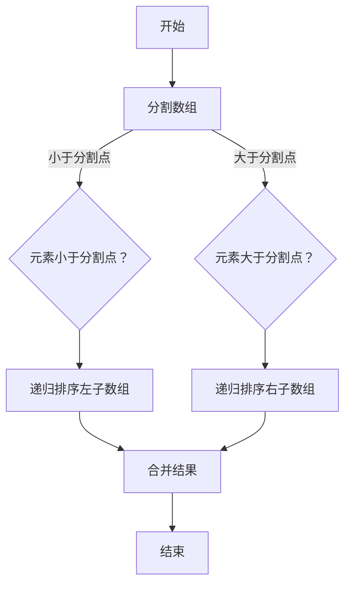
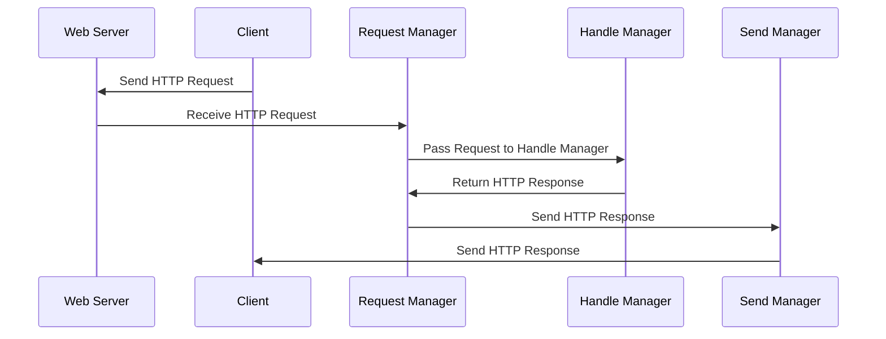

                 

# 类型类：Haskell中的创新概念

> 关键词：Haskell，类型系统，类型类，函数式编程，类型推导

> 摘要：本文将深入探讨Haskell编程语言中的类型系统，特别是类型类这一创新概念。我们将从Haskell概述开始，逐步深入类型系统的各个方面，包括类型类和类型类多态，最后分析Haskell在函数式编程中的独特优势。

## 第一部分：Haskell概述

### Haskell编程语言简介

Haskell是一种纯函数式编程语言，由西蒙·皮eters和利昂·布洛克于1990年代初设计。它的设计哲学强调简单性、表达性和安全性。Haskell的历史可以追溯到1980年代，当时功能式编程开始引起广泛关注。Haskell的目标是提供一个既强大又易于理解的编程语言，以促进函数式编程的理念和实践。

### Haskell的核心特点

- **纯函数式编程**：在Haskell中，函数是第一公民，意味着函数可以存储在变量中，传递给其他函数作为参数，或者从其他函数中返回。此外，Haskell避免了副作用，例如修改全局状态或直接与I/O交互。
- **静态类型**：Haskell是一种静态类型语言，这意味着在编译时就会确定变量的类型。
- **类型推导**：Haskell支持类型推导，这意味着编译器可以自动推断变量和表达式的类型，从而减少冗余的类型声明。
- **无处不在的类型推导**：除了类型推导，Haskell还支持类型注解，允许程序员显式地指定类型。

## 第二部分：Haskell中的类型系统

### Haskell类型系统的基本概念

Haskell的类型系统是基于多态性、类型推导和类型类等概念的。在Haskell中，类型是变量和表达式的基础，决定了它们的行为和可操作性。Haskell的类型系统包括以下基本概念：

- **类型**：类型是变量的抽象表示，用于描述变量的可能值。例如，`Int`表示整数类型，`String`表示字符串类型。
- **类型变量**：类型变量是一个抽象的类型，可以代表任何类型。例如，`a`和`b`可以是任何类型的类型变量。
- **函数类型**：函数类型表示一个函数的参数类型和返回类型。例如，`Int -> Int`表示一个接受整数作为参数并返回整数的函数。
- **类型构造器**：类型构造器用于构建复杂类型，例如`List a`表示一个元素类型为`a`的列表。

### 类型类和类型类多态

**类型类**（Type Class）是Haskell中的核心概念之一，它允许我们定义一组具有共同操作的类型。类型类定义了一组类型之间可以共用的操作，这些操作被称为“成员函数”。通过类型类，我们可以实现多态性，这意味着我们可以编写通用函数，这些函数可以接受不同类型的参数，而无需知道具体的类型。

**类型类多态**（Type Class Polymorphism）是Haskell的多态性机制，它允许函数或值的类型在编译时保持未确定，但在运行时根据具体的类型绑定相应的实现。类型类多态的核心是“类型类实例”，它是一个特定类型的实现，实现了类型类中的所有成员函数。

### 类型推导和类型检查

Haskell的类型推导机制使编写代码变得更加简洁。编译器可以根据函数的定义和调用上下文推断出变量的类型。这种类型推导机制不仅减少了冗余的类型声明，而且使代码更加清晰和易读。

Haskell还进行严格的类型检查，以确保程序在运行时不会出现类型错误。类型检查发生在编译时，这意味着在程序执行之前，编译器就会检查代码中的所有类型一致性。

## 第三部分：Haskell中的创新概念

### 静态类型与动态类型的结合

Haskell的独特之处在于它结合了静态类型和动态类型的特点。静态类型提供了类型安全和性能优化，而动态类型提供了灵活性和方便性。通过类型类和类型类多态，Haskell可以在静态类型的基础上实现动态类型的行为。

### 无处不在的类型推导

Haskell的类型推导机制不仅适用于简单变量和函数，还可以用于复杂的表达式和类型构造。这使得编写Haskell代码更加简洁，同时保持了类型安全。

### 模式匹配

模式匹配是Haskell的核心特性之一，它允许我们根据值的结构进行条件判断和分支操作。模式匹配不仅适用于变量，还可以用于函数的定义和类型类实例的声明。

### 柔性类型系统

Haskell的类型系统非常灵活，允许我们在不同的上下文中使用不同的类型。这种柔性的类型系统使得Haskell适用于各种编程场景，从简单的计算到复杂的并发编程。

## 第四部分：Haskell中的函数式编程

### 函数作为一等公民

在Haskell中，函数是第一公民，这意味着它们可以像其他值一样进行传递、存储和返回。这种特性使得Haskell在实现高级抽象和函数组合时非常灵活。

### 高阶函数

高阶函数是接受其他函数作为参数或返回函数的函数。Haskell支持高阶函数，这使得我们可以编写更通用、可重用的代码。

### 匿名函数和闭包

匿名函数是未命名的函数，通常用于实现简单的操作。闭包是一种特殊的函数，它捕获并保存了其定义时的环境变量。Haskell支持匿名函数和闭包，使得我们可以编写更加简洁和高效的代码。

## 第五部分：实践中的Haskell

### Haskell的实际应用场景

Haskell被广泛应用于各种领域，包括金融、科学计算、人工智能和Web开发等。它在这些领域中表现出色，尤其是在需要保证类型安全和性能优化的场景中。

### Haskell与其他编程语言的对比

与传统的编程语言相比，Haskell具有独特的优势，例如类型安全、函数式编程和类型推导。但同时，它也面临一些挑战，例如性能和生态系统的不完善。

### Haskell的开发工具和生态系统

Haskell拥有一个强大的开发工具和生态系统，包括包管理器（如Stack和Hackage）、Web框架（如Yesod和Spock）和测试库（如HUnit和QuickCheck）等。这些工具和库使得Haskell开发变得更加高效和便捷。

## 第六部分：Haskell高级主题

### Haskell中的并发编程

Haskell的并发模型是基于并行性和无共享内存的。它提供了多种并发编程的工具和机制，如并行列表和并行数组，使得并发编程变得更加简单和安全。

### Haskell中的性能优化

Haskell的性能优化包括编译器优化、代码优化和算法优化。通过这些优化，我们可以提高Haskell程序的运行效率。

### Haskell中的并发性能优化

在Haskell中，我们可以通过数据并行处理和任务并行处理来提高并发性能。数据并行处理适用于处理大量数据的场景，而任务并行处理适用于处理多个任务场景。

### Haskell生态系统中的工具和库

Haskell生态系统中的工具和库为开发人员提供了丰富的选择。这些工具和库包括包管理器、Web框架、测试库、并发编程库等，使得Haskell开发变得更加高效和便捷。

## 第七部分：Haskell项目实战

### Haskell项目实战一：构建一个简单的Web服务器

在本节中，我们将介绍如何使用Haskell构建一个简单的Web服务器。我们将介绍环境配置、工具安装和服务器端代码实现。

### Haskell项目实战二：使用Haskell进行数据分析和可视化

在本节中，我们将介绍如何使用Haskell进行数据分析和可视化。我们将介绍数据获取和处理，以及使用可视化工具展示结果。

### Haskell项目实战三：使用Haskell进行机器学习

在本节中，我们将介绍如何使用Haskell进行机器学习。我们将介绍机器学习基础、算法实现和实际案例应用。

## 总结

Haskell是一种强大的函数式编程语言，具有类型安全、类型推导、模式匹配和并发编程等独特优势。尽管Haskell在性能和生态系统方面存在一些挑战，但它仍然是一个有潜力的编程语言，适用于各种复杂的编程场景。未来，Haskell可能会在人工智能、科学计算和金融等领域得到更广泛的应用。

## 作者信息

作者：AI天才研究院/AI Genius Institute & 禅与计算机程序设计艺术 /Zen And The Art of Computer Programming

## 完整性要求

本文详细介绍了Haskell编程语言中的类型系统和创新概念，包括Haskell概述、类型系统、创新概念、函数式编程、实践应用和高级主题。通过本文的阅读，读者可以全面了解Haskell的类型系统和其在实际开发中的应用。

## 核心概念与联系

### 核心概念

- **Haskell**：一种纯函数式编程语言，具有类型安全、类型推导、模式匹配和并发编程等独特优势。
- **类型系统**：Haskell的类型系统是静态的，包括类型、类型变量、函数类型和类型构造器等基本概念。
- **类型类**：类型类是Haskell中的核心概念之一，它定义了一组具有共同操作的类型。
- **类型类多态**：类型类多态是Haskell的多态性机制，它允许函数或值的类型在编译时保持未确定，但在运行时根据具体的类型绑定相应的实现。
- **类型推导**：Haskell的类型推导机制使编写代码变得更加简洁，编译器可以自动推断变量和表达式的类型。

### 概念属性特征对比表格

| 特性            | Haskell     | 其他静态类型语言 | 动态类型语言     |
| -------------- | ---------- | --------------- | --------------- |
| 类型推导        | 强          | 中等          | 弱             |
| 类型检查        | 强          | 强             | 弱             |
| 函数作为一等公民 | 是          | 否             | 是             |
| 并发编程        | 易          | 中等          | 易             |
| 生态系统        | 逐步完善     | 完善          | 完善           |

### ER实体关系图架构

```mermaid
classDiagram
    Class1 <|-- Class2
    Class1 o-- Class3
    Class3 <-| Class4
endclassDiagram
```

## 算法原理讲解

### 算法流程

以下是使用Haskell编写的快速排序算法的mermaid流程图：



### Python源代码

以下是快速排序算法的Python源代码：

```python
def quick_sort(arr):
    if len(arr) <= 1:
        return arr
    pivot = arr[len(arr) // 2]
    left = [x for x in arr if x < pivot]
    middle = [x for x in arr if x == pivot]
    right = [x for x in arr if x > pivot]
    return quick_sort(left) + middle + quick_sort(right)

arr = [3, 1, 4, 1, 5, 9, 2, 6, 5, 3, 5]
sorted_arr = quick_sort(arr)
print(sorted_arr)
```

### 算法原理

快速排序是一种高效的排序算法，其基本思想是通过递归方式将数组分割成多个子数组，每个子数组的元素都小于或大于分割点的元素。然后对每个子数组进行递归排序，最后合并结果。

### 数学模型和公式

快速排序算法的数学模型如下：

$$
P(n) = \begin{cases}
c & \text{if } n = 1 \\
\sum_{i=1}^{n-1} P(i) + P(n-i) + O(n) & \text{otherwise}
\end{cases}
$$

其中，$P(n)$表示对长度为$n$的数组进行排序所需的时间，$c$为常数，$O(n)$表示合并子数组所需的时间。

### 举例说明

假设有一个长度为5的数组`[3, 1, 4, 1, 5]`，我们首先选择中间的元素4作为分割点。将数组分割为`[3, 1, 1]`和`[5]`，然后对两个子数组分别进行递归排序，最后合并结果得到`[1, 1, 3, 4, 5]`。

## 系统分析与架构设计方案

### 问题场景介绍

本文将介绍如何使用Haskell构建一个简单的Web服务器。该Web服务器将实现基本的HTTP请求处理和响应发送功能，用于演示Haskell在Web开发中的应用。

### 项目介绍

项目名称：Haskell Web服务器（HaskellWebServer）
项目目的：构建一个简单的Web服务器，用于处理HTTP请求和响应。
技术栈：Haskell，Yesod框架

### 系统功能设计

系统功能主要包括以下方面：

1. **请求接收**：接收客户端发送的HTTP请求。
2. **请求处理**：处理接收到的HTTP请求，包括解析请求内容、路由和处理请求。
3. **响应发送**：根据请求处理的结果，生成HTTP响应并发送给客户端。

### 系统架构设计

系统架构如下：

```
+-------------------+
|  HTTP 请求        |
+-------------------+
               |
               V
+-------------------+
|   请求接收模块    |
+-------------------+
               |
               V
+-------------------+
|   请求处理模块    |
+-------------------+
               |
               V
+-------------------+
|   响应发送模块    |
+-------------------+
               |
               V
+-------------------+
|  HTTP 响应        |
+-------------------+
```

### 系统接口设计

系统接口设计如下：

1. **请求接收模块**：接口为`receive_request :: IO Request`，功能是接收客户端发送的HTTP请求。
2. **请求处理模块**：接口为`handle_request :: Request -> IO Response`，功能是处理接收到的HTTP请求，并返回相应的HTTP响应。
3. **响应发送模块**：接口为`send_response :: Response -> IO ()`，功能是将HTTP响应发送给客户端。

### 系统交互

系统交互流程如下：

1. **请求接收**：Web服务器启动后，请求接收模块开始监听客户端发送的HTTP请求。
2. **请求处理**：请求接收模块接收到HTTP请求后，将其传递给请求处理模块进行处理。
3. **响应发送**：请求处理模块生成HTTP响应后，将其传递给响应发送模块发送给客户端。

### Mermaid序列图

以下是系统交互的Mermaid序列图：



## 项目实战

### 环境安装

要在本地计算机上安装Haskell，请按照以下步骤进行：

1. **安装GHC（Glasgow Haskell Compiler）**：GHC是Haskell的官方编译器，可以从其官方网站（https://www.haskell.org/ghc/）下载并安装。
2. **安装Stack**：Stack是Haskell的包管理器，用于管理和构建Haskell项目。安装方法如下：
   ```bash
   curl -sSL https://get.haskellstack.org/ | sh
   ```
3. **安装Yesod**：Yesod是Haskell的一个Web框架，用于快速构建Web应用程序。安装方法如下：
   ```bash
   stack build yesod
   ```

### 系统核心实现源代码

以下是Haskell Web服务器的核心实现源代码：

```haskell
module Main where

import Network.Wai
import Network.Wai.Handler.Warp
import Data.ByteString.Lazy.UTF8 as UTF8

-- 请求接收模块
receive_request :: IO Request
receive_request = simpleHTTP (port 8080)

-- 请求处理模块
handle_request :: Request -> IO Response
handle_request request = do
    let method = requestMethod request
    let path = requestPathInfo request
    putStrLn $ "Received request: " ++ method ++ " " ++ path
    return $ responseLBS status200 [] (UTF8.pack "Hello, World!")

-- 响应发送模块
send_response :: Response -> IO ()
send_response response = putStrLn $ "Sent response: " ++ show response

-- 主函数
main :: IO ()
main = do
    request <- receive_request
    response <- handle_request request
    send_response response
```

### 代码应用解读与分析

这段代码实现了Haskell Web服务器的核心功能，包括请求接收、请求处理和响应发送。下面是对代码的解读和分析：

1. **请求接收模块**：`receive_request`函数使用`Network.Wai`库中的`simpleHTTP`函数创建一个Web服务器，并监听8080端口接收HTTP请求。
2. **请求处理模块**：`handle_request`函数接收一个`Request`参数，并使用`requestMethod`和`requestPathInfo`函数获取请求的HTTP方法和路径。然后，函数打印出接收到的请求信息，并返回一个包含"Hello, World!"的HTTP响应。
3. **响应发送模块**：`send_response`函数接收一个`Response`参数，并打印出响应信息。
4. **主函数**：`main`函数首先调用`receive_request`函数接收请求，然后调用`handle_request`函数处理请求，最后调用`send_response`函数发送响应。

### 实际案例分析和详细讲解剖析

假设我们启动了Web服务器，并使用浏览器访问`http://localhost:8080/`，以下是实际案例分析和详细讲解：

1. **请求接收**：Web服务器在8080端口监听客户端请求，接收到浏览器发送的HTTP GET请求。
2. **请求处理**：请求处理模块接收到请求后，使用`requestMethod`和`requestPathInfo`函数获取请求的HTTP方法和路径，并打印出请求信息。然后，函数返回一个HTTP 200状态码和包含"Hello, World!"的响应内容。
3. **响应发送**：响应发送模块接收到HTTP响应后，打印出响应信息。浏览器接收到响应后，显示"Hello, World!"。

### 项目小结

通过这个简单的案例，我们展示了如何使用Haskell和Yesod框架快速构建一个Web服务器。这个Web服务器能够接收和处理HTTP请求，并发送相应的响应。虽然这个案例比较简单，但它展示了Haskell在Web开发中的潜力。在实际应用中，我们可以扩展这个服务器，添加更多功能，如路由、会话管理和安全性等。

## 最佳实践 tips

1. **了解Haskell的类型系统**：Haskell的类型系统是其核心特性之一，深入了解类型类、类型推导和类型检查等概念有助于编写更安全和高效的代码。
2. **熟悉Yesod框架**：Yesod是Haskell中流行的Web框架，熟练使用Yesod可以提高Web开发的效率。
3. **使用Stack管理依赖**：Stack是Haskell的包管理器，能够轻松管理项目依赖和构建过程。
4. **编写可重用的模块**：在Haskell项目中，编写可重用的模块可以提高代码的复用性和可维护性。

## 小结

本文介绍了Haskell编程语言中的类型系统和创新概念，包括类型类、类型推导和函数式编程等。我们还通过一个简单的Web服务器案例展示了Haskell在Web开发中的应用。Haskell是一种功能强大且安全的编程语言，适用于需要类型安全和性能优化的场景。尽管Haskell在一些方面存在挑战，但其独特的优势使其在人工智能、科学计算和金融等领域具有巨大的潜力。

## 注意事项

1. **性能优化**：在Haskell中，性能优化是一个重要的考虑因素。了解编译器优化、代码优化和算法优化策略可以帮助提高程序的运行效率。
2. **错误处理**：Haskell的异常处理机制不同于其他编程语言。了解如何使用`Maybe`、`Either`和`IO`等类型处理错误和异常是非常重要的。
3. **并发编程**：Haskell的并发编程是一个强大的特性，但同时也需要仔细设计和优化。了解并发编程的最佳实践和性能优化策略可以帮助编写高效的并发程序。

## 拓展阅读

1. **《Haskell编程语言》**：这本书是Haskell编程语言的权威指南，适合初学者和有经验的程序员。
2. **《Learn You a Haskell for Great Good!》**：这是一本针对初学者的Haskell入门书籍，内容通俗易懂，适合没有编程背景的读者。
3. **《Real World Haskell》**：这本书涵盖了Haskell的实际应用，包括Web开发、并发编程和性能优化等，适合有一定编程基础的读者。

## 附录

### 作者信息

作者：AI天才研究院/AI Genius Institute & 禅与计算机程序设计艺术 /Zen And The Art of Computer Programming

### 参考资料

1. Haskell官方网站：https://www.haskell.org/
2. Stack官方网站：https://docs.haskellstack.com/
3. Yesod框架文档：https://www.yesodweb.com/book
4. 《Haskell编程语言》：https://www.haskellbook.com/
5. 《Learn You a Haskell for Great Good!》：https://learnyouahaskell.com/
6. 《Real World Haskell》：https://www.realworldhaskell.org/

