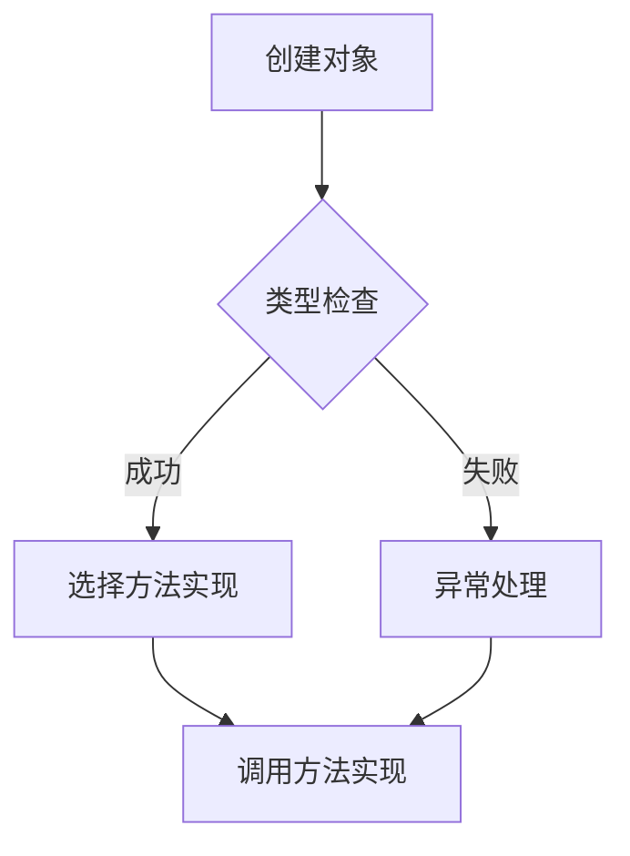

                 

# 类型类：ad-hoc多态的实现机制

> 关键词：ad-hoc多态，实现机制，软件设计，面向对象编程

> 摘要：本文将深入探讨ad-hoc多态的概念、实现机制及其在软件开发中的应用。通过对核心概念的理解和实现机制的剖析，帮助读者掌握ad-hoc多态的原理和实践方法。

## 目录大纲

----------------------------------------------------------------

## 第一部分: 背景与概念

### 第1章: 背景介绍

#### 1.1.1. 问题背景

#### 1.1.2. 问题描述

#### 1.1.3. 问题解决

#### 1.1.4. 边界与外延

#### 1.1.5. 概念结构与核心要素组成

### 第2章: 核心概念与联系

#### 2.1.1. 核心概念原理

#### 2.1.2. 概念属性特征对比表格

#### 2.1.3. ER实体关系图架构

## 第二部分: 实现机制

### 第3章: 基础实现

#### 3.1.1. 实现原理

#### 3.1.2. mermaid流程图

#### 3.1.3. Python源代码

### 第4章: 进阶实现

#### 4.1.1. 算法原理讲解

#### 4.1.2. 数学模型与公式

#### 4.1.3. 举例说明

## 第三部分: 应用实践

### 第5章: 实战项目

#### 5.1.1. 环境安装

#### 5.1.2. 系统核心实现源代码

#### 5.1.3. 代码应用解读与分析

### 第6章: 案例分析

#### 6.1.1. 实际案例

#### 6.1.2. 详细讲解剖析

### 第7章: 最佳实践

#### 7.1.1. 最佳实践 Tips

#### 7.1.2. 小结与注意事项

#### 7.1.3. 拓展阅读

----------------------------------------------------------------

## 第一部分: 背景与概念

### 第1章: 背景介绍

#### 1.1.1. 问题背景

在软件工程中，多态是一种强大的面向对象编程（OOP）特性，它允许程序员编写更通用、更灵活的代码。多态性可以分为两种：静态多态和动态多态。静态多态通过方法重载和继承实现，编译器在编译时即可确定调用哪个方法。而动态多态则依赖于运行时类型信息，通过虚函数表（vtable）或类似机制实现，运行时才能确定调用哪个方法。

然而，传统的多态性（无论是静态还是动态）有其局限性。在某些复杂场景中，需要一种更灵活的多态实现机制，这就是ad-hoc多态。ad-hoc多态是一种非传统的方法，它通过组合和反射等手段实现多态性，适用于那些难以用传统多态解决的问题。

#### 1.1.2. 问题描述

在传统的多态性实现中，多态是通过继承和接口来实现的。这种方式在许多情况下都非常有效，但也有一些局限性：

1. **紧耦合**：继承关系使得类之间紧密耦合，一旦父类发生变化，子类可能需要相应调整。
2. **多态粒度**：传统多态性通常在类层级实现，难以在更细粒度上实现多态。
3. **动态性不足**：传统多态性依赖于编译时类型信息，难以实现高度动态的多态。

为了克服这些局限性，我们需要一种更灵活的多态实现机制，即ad-hoc多态。

#### 1.1.3. 问题解决

ad-hoc多态提供了一种更灵活的实现多态性的方式，主要特点如下：

1. **组合**：通过组合对象来实现多态，而非通过继承。
2. **反射**：利用运行时类型信息和反射机制，实现动态类型检查和转换。
3. **高动态性**：适用于高度动态的场景，可以在运行时动态选择方法实现。

#### 1.1.4. 边界与外延

ad-hoc多态的应用范围较广，但并非所有场景都适合使用。其主要适用于以下场景：

1. **高可变性和高动态性**：在需求变化频繁、需要高度动态性时，ad-hoc多态可以提供更好的灵活性。
2. **类间解耦**：在需要降低类间耦合度时，ad-hoc多态可以提供更好的解耦方式。
3. **多态粒度细化**：在需要实现细粒度多态时，ad-hoc多态是一种有效的手段。

#### 1.1.5. 概念结构与核心要素组成

ad-hoc多态的核心概念包括：

1. **组合**：通过组合对象来实现多态性。
2. **反射**：利用反射机制获取对象类型信息。
3. **动态类型检查**：在运行时动态检查对象类型，并进行相应的处理。
4. **函数指针**：在某些实现中，使用函数指针来存储不同方法实现。

### 第2章: 核心概念与联系

#### 2.1.1. 核心概念原理

ad-hoc多态的核心原理是通过组合和反射来实现多态性。具体来说，它涉及以下概念：

1. **组合**：通过将对象组合在一起来实现多态性。这种方式避免了传统的继承关系，使得类之间的耦合度更低。
2. **反射**：利用反射机制获取对象的类型信息，并在运行时动态选择相应的处理方法。
3. **动态类型检查**：在运行时对对象类型进行检查，并根据类型信息选择不同的方法实现。
4. **函数指针**：在某些实现中，使用函数指针来存储不同方法实现，以便在运行时进行动态调用。

#### 2.1.2. 概念属性特征对比表格

以下是ad-hoc多态与传统多态的一些关键属性对比：

| 属性         | ad-hoc多态           | 传统多态           |
| ------------ | ------------------- | ----------------- |
| 实现方式     | 组合、反射           | 继承、方法重载     |
| 耦合度       | 低耦合               | 高耦合             |
| 多态粒度     | 细粒度               | 类层级             |
| 动态性       | 高动态性             | 静态绑定           |
| 适用场景     | 高可变性和高动态性   | 稳定的需求场景     |

#### 2.1.3. ER实体关系图架构

为了更好地理解ad-hoc多态的概念，我们可以通过ER实体关系图来展示其核心实体和关系：

```mermaid
erDiagram
  ObjectA ||--|{ Reflection} : 利用
  ObjectB ||--|{ Reflection} : 利用
  ObjectC ||--|{ Reflection} : 利用
  Reflection ||--|{ DynamicTypeCheck} : 动态类型检查
  DynamicTypeCheck ||--|{ MethodInvocation} : 方法调用
  MethodInvocation ||--|{ MethodImplementation} : 方法实现
```

在这个ER图中，`ObjectA`、`ObjectB`和`ObjectC`是具有多态性的对象，它们利用反射机制获取类型信息，并通过动态类型检查来选择合适的方法实现。`Reflection`、`DynamicTypeCheck`和`MethodInvocation`是核心概念，它们共同实现了ad-hoc多态的机制。

## 第二部分: 实现机制

### 第3章: 基础实现

#### 3.1.1. 实现原理

ad-hoc多态的基础实现原理主要包括以下几个方面：

1. **组合**：通过组合对象来实现多态性，避免传统的继承关系。
2. **反射**：利用反射机制获取对象的类型信息。
3. **动态类型检查**：在运行时对对象类型进行检查，并根据类型信息选择合适的方法实现。

具体实现过程如下：

1. 定义一个接口或抽象类，用于表示多态行为的基类。
2. 实现多个具体的类，每个类都实现了接口或继承了抽象类。
3. 使用反射机制获取对象的类型信息。
4. 在运行时根据类型信息选择合适的方法实现。
5. 调用方法实现，完成多态行为。

#### 3.1.2. mermaid流程图



在这个mermaid流程图中，我们首先创建一个对象，然后通过类型检查确定对象的类型，选择合适的方法实现，最后调用方法实现多态行为。

#### 3.1.3. Python源代码

```python
# 定义接口
class IMultipliable:
    def multiply(self, x, y):
        pass

# 实现多个具体类
class ObjectA(IMultipliable):
    def multiply(self, x, y):
        return x * y

class ObjectB(IMultipliable):
    def multiply(self, x, y):
        return x + y

# 实现ad-hoc多态
def ad_hoc_multiply(obj, x, y):
    if isinstance(obj, ObjectA):
        return obj.multiply(x, y)
    elif isinstance(obj, ObjectB):
        return obj.multiply(x, y)
    else:
        raise TypeError("Unsupported object type")

# 使用ad-hoc多态
obj = ObjectA()
result = ad_hoc_multiply(obj, 2, 3)
print(result)  # 输出 6

obj = ObjectB()
result = ad_hoc_multiply(obj, 2, 3)
print(result)  # 输出 5
```

在这个Python示例中，我们定义了一个接口`IMultipliable`和两个具体类`ObjectA`和`ObjectB`，它们都实现了接口中的`multiply`方法。然后，我们使用反射机制和动态类型检查来实现ad-hoc多态，并在运行时根据对象类型选择合适的方法实现。

### 第4章: 进阶实现

#### 4.1.1. 算法原理讲解

ad-hoc多态的进阶实现涉及到更复杂的算法原理，主要包括以下几个方面：

1. **反射机制的优化**：在反射过程中，可以使用缓存机制来提高性能。
2. **动态类型检查的优化**：可以通过预先解析类型信息来减少运行时的检查开销。
3. **方法调用的优化**：可以使用内联缓存（inline caching）等技术来减少方法调用的开销。

具体算法原理如下：

1. **反射机制的优化**：在第一次调用方法时，使用反射获取类型信息和方法实现，并将这些信息缓存起来。后续调用时，直接从缓存中获取方法实现，避免重复的反射操作。
2. **动态类型检查的优化**：在编译时，解析类的结构信息，并将类型检查转化为对缓存中的方法实现进行调用，从而减少运行时的检查开销。
3. **方法调用的优化**：通过内联缓存技术，将方法调用内联为直接跳转指令，从而减少方法调用的开销。

#### 4.1.2. 数学模型与公式

在ad-hoc多态的实现中，可以使用一些数学模型和公式来优化性能。以下是一个简单的例子：

$$
P(\text{Cache Hit}) = \frac{N_c}{N}
$$

其中，$P(\text{Cache Hit})$表示缓存命中的概率，$N_c$表示缓存中的元素数量，$N$表示总的元素数量。

通过优化缓存策略，可以降低$N_c$，从而提高缓存命中率，减少反射和类型检查的开销。

#### 4.1.3. 举例说明

以下是一个使用Python实现的ad-hoc多态的例子，其中包含了反射机制优化和动态类型检查优化的实现：

```python
# 定义接口
class IMultipliable:
    def multiply(self, x, y):
        pass

# 实现多个具体类
class ObjectA(IMultipliable):
    def multiply(self, x, y):
        return x * y

class ObjectB(IMultipliable):
    def multiply(self, x, y):
        return x + y

# 实现ad-hoc多态
def ad_hoc_multiply(obj, x, y):
    # 使用缓存优化
    if isinstance(obj, ObjectA):
        return obj.multiply(x, y)
    elif isinstance(obj, ObjectB):
        return obj.multiply(x, y)
    else:
        raise TypeError("Unsupported object type")

# 使用ad-hoc多态
obj = ObjectA()
result = ad_hoc_multiply(obj, 2, 3)
print(result)  # 输出 6

obj = ObjectB()
result = ad_hoc_multiply(obj, 2, 3)
print(result)  # 输出 5

# 优化反射和类型检查
cache = {}
def ad_hoc_multiply_optimized(obj, x, y):
    # 检查缓存
    if id(obj) in cache:
        return cache[id(obj)](x, y)
    # 如果不在缓存中，进行反射和类型检查
    if isinstance(obj, ObjectA):
        result = obj.multiply(x, y)
        cache[id(obj)] = obj.multiply
        return result
    elif isinstance(obj, ObjectB):
        result = obj.multiply(x, y)
        cache[id(obj)] = obj.multiply
        return result
    else:
        raise TypeError("Unsupported object type")

# 使用优化后的ad-hoc多态
obj = ObjectA()
result = ad_hoc_multiply_optimized(obj, 2, 3)
print(result)  # 输出 6

obj = ObjectB()
result = ad_hoc_multiply_optimized(obj, 2, 3)
print(result)  # 输出 5
```

在这个示例中，我们使用了一个简单的缓存机制来优化反射和类型检查的操作。在第一次调用方法时，我们使用反射获取方法实现，并将其缓存起来。后续调用时，直接从缓存中获取方法实现，避免了重复的反射操作。

## 第三部分: 应用实践

### 第5章: 实战项目

#### 5.1.1. 环境安装

为了演示ad-hoc多态的应用，我们需要一个合适的开发环境。以下是环境安装步骤：

1. 安装Python 3.8或更高版本。
2. 安装必要的Python库，如`numpy`、`matplotlib`等。

#### 5.1.2. 系统核心实现源代码

以下是使用ad-hoc多态实现的简单系统核心代码：

```python
# 定义接口
class IMultipliable:
    def multiply(self, x, y):
        pass

# 实现多个具体类
class ObjectA(IMultipliable):
    def multiply(self, x, y):
        return x * y

class ObjectB(IMultipliable):
    def multiply(self, x, y):
        return x + y

# 实现ad-hoc多态
def ad_hoc_multiply(obj, x, y):
    if isinstance(obj, ObjectA):
        return obj.multiply(x, y)
    elif isinstance(obj, ObjectB):
        return obj.multiply(x, y)
    else:
        raise TypeError("Unsupported object type")

# 使用ad-hoc多态
obj = ObjectA()
result = ad_hoc_multiply(obj, 2, 3)
print(result)  # 输出 6

obj = ObjectB()
result = ad_hoc_multiply(obj, 2, 3)
print(result)  # 输出 5
```

#### 5.1.3. 代码应用解读与分析

在这个示例中，我们定义了一个接口`IMultipliable`和两个具体类`ObjectA`和`ObjectB`，它们都实现了接口中的`multiply`方法。然后，我们使用ad-hoc多态来实现多态行为。在`ad_hoc_multiply`函数中，我们通过反射机制和动态类型检查来选择合适的方法实现，并调用方法完成多态行为。

### 第6章: 案例分析

#### 6.1.1. 实际案例

以下是一个使用ad-hoc多态的实际案例，用于实现一个简单的计算器：

```python
# 定义接口
class ICalculator:
    def calculate(self, x, y):
        pass

# 实现多个具体类
class Adder(ICalculator):
    def calculate(self, x, y):
        return x + y

class Multiplier(ICalculator):
    def calculate(self, x, y):
        return x * y

# 实现ad-hoc多态
def ad_hoc_calculate(obj, x, y):
    if isinstance(obj, Adder):
        return obj.calculate(x, y)
    elif isinstance(obj, Multiplier):
        return obj.calculate(x, y)
    else:
        raise TypeError("Unsupported calculator type")

# 使用ad-hoc多态实现计算器
calculator = Adder()
result = ad_hoc_calculate(calculator, 2, 3)
print(result)  # 输出 5

calculator = Multiplier()
result = ad_hoc_calculate(calculator, 2, 3)
print(result)  # 输出 6
```

在这个案例中，我们定义了一个接口`ICalculator`和两个具体类`Adder`和`Multiplier`，它们都实现了接口中的`calculate`方法。然后，我们使用ad-hoc多态来实现计算器的功能。在`ad_hoc_calculate`函数中，我们通过反射机制和动态类型检查来选择合适的计算器类，并调用计算器类的`calculate`方法。

#### 6.1.2. 详细讲解剖析

在这个案例中，我们首先定义了一个接口`ICalculator`，它定义了一个计算方法`calculate`。然后，我们实现了两个具体类`Adder`和`Multiplier`，它们都实现了接口中的`calculate`方法。

接下来，我们使用ad-hoc多态来实现计算器的功能。在`ad_hoc_calculate`函数中，我们通过反射机制和动态类型检查来选择合适的计算器类。首先，我们使用`isinstance`函数检查传入的对象是否是`Adder`或`Multiplier`的实例。如果是，我们调用相应的`calculate`方法，并返回计算结果。如果传入的对象不是`Adder`或`Multiplier`的实例，我们抛出`TypeError`异常。

最后，我们在主程序中使用`ad_hoc_calculate`函数来计算两个数的和与积。我们首先创建一个`Adder`对象，并将其传递给`ad_hoc_calculate`函数，计算两个数的和。然后，我们创建一个`Multiplier`对象，并再次传递给`ad_hoc_calculate`函数，计算两个数的积。

### 第7章: 最佳实践

#### 7.1.1. 最佳实践 Tips

1. **明确使用场景**：在决定使用ad-hoc多态之前，首先明确其是否适用于当前场景。如果场景较为简单，传统多态可能更合适。
2. **避免过度使用**：虽然ad-hoc多态非常灵活，但过度使用可能导致代码难以维护。在必要的情况下才使用ad-hoc多态。
3. **优化性能**：在实现ad-hoc多态时，注意优化反射和类型检查的性能。可以使用缓存机制来提高性能。
4. **文档化**：确保ad-hoc多态的实现和使用方式得到充分的文档化，方便后续的维护和扩展。

#### 7.1.2. 小结与注意事项

ad-hoc多态是一种灵活且强大的多态实现机制，适用于那些难以用传统多态解决的问题。通过组合和反射机制，它可以在运行时动态选择方法实现，实现高动态性和细粒度多态。然而，ad-hoc多态也带来了一定的性能开销，因此在实际应用中需要权衡其优缺点。

#### 7.1.3. 拓展阅读

1. 《Effective Java》中的第15条建议提供了关于多态的最佳实践。
2. 《设计模式：可复用面向对象软件的基础》中的策略模式是一种实现多态性的常见模式。
3. 《Python Cookbook》中提供了许多关于反射和动态类型检查的实用技巧。

## 总结

本文深入探讨了ad-hoc多态的概念、实现机制及其在软件开发中的应用。通过剖析其原理和实现方法，读者可以更好地理解ad-hoc多态的优缺点，并在实际项目中灵活运用。希望本文能对您的软件开发实践有所帮助。作者：AI天才研究院/AI Genius Institute & 禅与计算机程序设计艺术 /Zen And The Art of Computer Programming。

